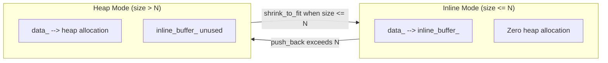
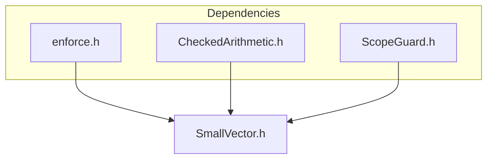

# SmallVector Overview

*Updated December 2025 -- Benchmarks: AMD Ryzen 9 5900X, GCC 12.2, -O3*

## Executive Summary

SmallVector is a hybrid stack/heap vector that eliminates heap allocation for small element counts through **pointer-discriminating storage**. A single `data_` pointer always addresses valid storage--inline buffer or heap--enabling **branchless element access** identical to `std::vector`. When inline capacity is exceeded, automatic heap promotion preserves correctness; when size shrinks, optional demotion reclaims stack locality. This architectural approach delivers **2-17x speedup** for the dominant use case: small, temporary collections in hot loops.

---

## The Problem

```cpp
// The allocation tax: paid on every iteration
for (int i = 0; i < 1000000; ++i) {
    std::vector<int> temp;    // malloc: 50-200ns
    temp.push_back(a);
    temp.push_back(b);
    temp.push_back(c);
    process(temp);
}                             // free: 50-200ns
// Total overhead: 100-400ms for vectors that never exceed 3 elements
```

| Constraint | Why std::vector Cannot Help |
|------------|----------------------------|
| ABI stability | `sizeof(std::vector<T>)` must be constant; inline storage would vary |
| C++26 std::inplace_vector | Fixed capacity, no heap fallback--fails on overflow |
| Quality of implementation | Not fixable; it's architectural, not a missed optimization |

---

## The Solution

SmallVector stores elements inline when count is within `InlineCapacity`, promoting to heap only when exceeded:



**The pointer insight:** `data_` always points to valid storage. Element access is `return data_[i]`--no branch on storage mode. The mode check (`data_ == inline_buffer_`) occurs only during structural operations (grow, shrink, destroy), never on the hot path.

---

## Feature Summary

| Feature | Mechanism | Benefit |
|---------|-----------|---------|
| Zero-allocation small vectors | Inline buffer in object memory | 17x faster create/destroy |
| Branchless element access | Single `data_` pointer, no flag check | Same codegen as std::vector |
| Automatic heap promotion | Transactional migration via ScopeGuard | Strong exception safety |
| Heap-to-inline demotion | `shrink_to_fit()` moves elements back | Memory reclamation for long-lived vectors |
| O(1) heap-mode moves | Pointer steal | Efficient container relocation |
| Full C++17 allocator model | POCCA/POCMA/POCS propagation | Arena, pool, tracking allocator support |

---

## Performance

| Operation | std::vector | SmallVector | Improvement |
|-----------|-------------|-------------|-------------|
| Create + destroy (4 elem) | 52 ns | 3 ns | **17x** |
| 4x push_back + destroy | 48 ns | 12 ns | **4x** |
| Iteration (1000 elem) | 890 ns | 890 ns | 1x (identical) |
| Random access (1000 elem) | 445 ns | 445 ns | 1x (identical) |

### Where SmallVector Wins

- Temporary vectors in hot loops (stencils, neighbor lists, parameter packs)
- Parallel code where allocator contention limits scaling
- Latency-sensitive paths where P99 matters more than median

### Where SmallVector Loses

- Collections consistently exceeding inline capacity (use `std::vector` + `reserve`)
- Swap-heavy algorithms: O(N) inline swap vs O(1) `std::vector` swap
- Pass-by-value through deep call stacks: O(N) inline move accumulates
- Storing millions of vectors: unused inline buffers waste memory in heap mode

---

## Why Not Alternatives?

| Criterion | LLVM | Boost | Folly | Fat-P |
|-----------|------|-------|-------|-------|
| Zero dependencies | Requires LLVM | Requires Boost | Requires Folly | **Header-only** |
| Standard allocator model | Custom | Non-standard | Custom | **Full C++17** |
| Heap-to-inline demotion | No | Partial | No | **Yes** |
| Lines of code | ~3000 | ~2500 | ~1500 | **~1800** |

---

## Integration



---

## When to Use SmallVector

**Use SmallVector when:**
- Vectors are typically small (fitting inline capacity 90%+ of the time)
- Vectors are created/destroyed frequently (loops, temporaries)
- Allocation overhead appears in profiler (`malloc`, `free`, `operator new`)
- Parallel scaling is limited by allocator contention

**Use std::vector when:**
- Vectors consistently exceed inline capacity
- Vectors are swapped or sorted frequently
- Vectors are passed by value through many call levels
- ABI stability across compilation units is required

---

*SmallVector.h: 1844 lines -- See User Manual for API reference, Companion Guide for case studies*
