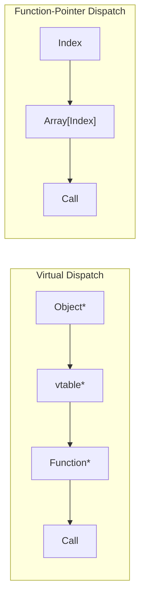

# The State of Affairs

### A Companion Guide to FAT-P's StateMachine

---

**Scope:** This guide explains why StateMachine exists, what problems it solves, and how it solves them. It covers the design philosophy behind type-safe state machines, the mechanisms that achieve zero-overhead dispatch, and the tradeoffs involved in various implementation approaches. This is a "why" document, not a "how" document.

**Not covered:** API reference and usage recipes (see User Manual - StateMachine), benchmark methodology and raw data (see benchmark_StateMachine.cpp), UML statechart semantics (hierarchical states, orthogonal regions).

**Prerequisites:** Working knowledge of C++ templates and type traits, familiarity with `std::variant` and `std::visit`, understanding of function pointers and indirect calls.

---

## Companion Guide Card

| Aspect | Details |
|--------|---------|
| **Component** | StateMachine |
| **Design question** | How do you validate state transitions at compile time while maintaining zero-overhead dispatch at runtime? |
| **Key tradeoff** | Compile-time transition declaration (rigid but safe) vs. runtime flexibility (dynamic but unchecked) |
| **Decision made** | Policy-based approach—StrictPolicy for validated graphs, AnyToAnyPolicy for maximum flexibility |
| **Rejected alternatives** | Virtual dispatch, `std::variant` visitor, string-based state names, runtime-registered states |
| **Historical context** | Game engine state patterns meet embedded systems' need for compile-time validation |

---

# Introduction: Why This Component Exists

You're implementing a network protocol handler. The specification defines four states—Disconnected, Connecting, Connected, and Disconnecting—with rules about which transitions are valid. When data arrives, the handler must behave differently depending on state: process it when Connected, buffer it when Connecting, discard it when Disconnecting, and report an error when Disconnected.

The straightforward implementation uses an enum and switch statements. Each event handler examines the current state and decides what to do. But as you write more handlers, a pattern emerges: every handler contains a four-case switch, and each case may include state transition logic. By the time you've written handlers for start, stop, timeout, data received, error, heartbeat, and reconnect, you have dozens of switch cases scattered across the codebase.

Then someone asks: "Can we add a Reconnecting state?" You audit the code and find that adding this state requires modifying every switch statement—seven handlers, four cases each becoming five cases each. You make the changes, but miss one case in the error handler. The code compiles. Tests pass. The bug ships to production, where it manifests as a "sometimes connections don't recover properly" report that takes two weeks to diagnose.

Or consider a different scenario. You're building a game with enemy AI. Enemies have states: Idle, Patrol, Alert, Chase, Attack. Different events trigger different transitions, and each state has setup and teardown logic—Patrol needs to initialize a path, Attack needs to start tracking cooldowns. You implement this with virtual dispatch: a base State class with `on_enter` and `on_exit` methods, concrete state classes that override them. It's clean, it's extensible, and it allocates heap memory on every transition. Your profiler shows 8% of frame time spent in state machine overhead.

Or this: you use `std::variant` to hold the current state. Type-safe, no heap allocation, fast dispatch through `std::visit`. But there's no transition validation—any code can write any state to the variant. There are no entry/exit hooks—you must remember to call them manually. Six months later, someone adds a transition that forgets to stop the previous state's timer. The timer fires, accesses freed memory, and the program crashes.

These aren't hypothetical problems. They're the predictable consequences of implementation choices that seem reasonable in isolation but compound as systems grow. StateMachine exists because engineers kept encountering the same three problems:

**Scattered logic.** Enum-switch distributes transition rules across every event handler. The state graph exists only implicitly.

**No validation.** Nothing prevents invalid transitions. Bugs compile and run, manifesting as state corruption.

**Duplicated hooks.** Entry and exit logic gets copy-pasted across transitions. Changes require finding every copy.

This guide explains these problems in depth and how StateMachine's design addresses them.

---

# Part I — The Problems

State machines are conceptually simple: states, transitions, actions. The implementation complications arise from four forces. First, where does the transition logic live? Second, who validates that transitions are legal? Third, who invokes entry/exit actions? Fourth, what's the dispatch overhead? Understanding these forces is essential for understanding why StateMachine makes the design choices it does.

---

## Chapter 1: The Scattered Switch Problem

### The Obvious Approach

Most state machines begin life as an enum and a variable:

```cpp
enum class State { Idle, Running, Paused, Stopped };
State current_state = State::Idle;
```

Event handlers examine this variable and decide what to do. The "start" handler transitions from Idle to Running. The "pause" handler transitions from Running to Paused. Each handler contains a switch over all states, with each case determining whether and how to respond to the event in that state.

This approach is obvious because it's direct. The state is just data; you read it and write it like any other variable. There's no abstraction overhead, no framework to learn. The code does exactly what it says.

### The Hidden Constraint

The constraint is **cognitive locality**. When you need to understand a state's behavior, you must read every handler that might affect it. When you need to understand the complete state graph, you must read every switch statement in every handler and mentally reconstruct the graph.

With four states and seven handlers, you have twenty-eight switch cases. Each case might contain transition logic, action calls, or both. The complete state machine—the thing you're actually trying to implement—is distributed across the codebase in fragments.

The compiler provides minimal help. It can warn about missing cases within a single switch (if you don't have a default clause). It cannot verify that your transitions match a specification. It cannot ensure that every handler considers every state. The correctness of your state machine depends entirely on programmer discipline across every piece of code that touches the state variable.

### The Symptoms

The most visible symptom is **maintenance burden**. Adding a state touches every handler. Removing a state requires auditing every handler. Changing transition rules means finding every place those rules are implemented.

A subtler symptom is **invisible bugs**. A handler that forgets to consider a state doesn't crash—it just does nothing, or falls through to a default case, or takes some unintended action. These bugs compile, often pass basic tests, and manifest as intermittent misbehavior in production.

The deepest symptom is **lost documentation**. The state graph is the core abstraction of your system, but it doesn't exist anywhere in the code. It exists only in comments, diagrams, or the programmer's head. When these drift out of sync with the implementation—and they will—the code becomes authoritative but incomprehensible.

### The Cost

In a real project, adding a "Stunned" state to a game entity system required modifying 47 switch statements across 12 files. The change took two days and introduced three bugs: two forgotten cases and one incorrect transition. The bugs weren't caught until playtesting, when designers reported "sometimes enemies don't react to stuns."

The debugging cost was four hours per bug—reading through switch statements to find the inconsistency. The total cost of adding one state was approximately four developer-days.

### What StateMachine Provides

StateMachine centralizes state behavior in state types. Each state is a struct with `on_entry` and `on_exit` methods. Transitions are declared as pairs in a tuple. The state graph is visible in one place, and the compiler verifies that all referenced states exist.

Part IV explains why centralization matters for long-term maintenance.

---

## Chapter 2: The Invalid Transition Problem

### The Obvious Approach

With enum-switch, transitions are assignments. When the "start" handler wants to enter the Running state, it writes `current_state = State::Running`. Nothing restricts what code can write what values.

```cpp
void on_start() {
    if (current_state == State::Idle) {
        current_state = State::Running;
        begin_running();
    }
}

void handle_bug() {
    // Somewhere, someone wrote this by mistake
    current_state = State::Running;  // Invalid: didn't check current state!
}
```

### The Hidden Constraint

The constraint is **protocol correctness**. State machines model real protocols: network connections, game rules, workflow processes. These protocols have invariants: you can't be Connected without completing a handshake; you can't be Running if you never started.

When code violates these invariants by making invalid transitions, the system enters an "impossible" state. The state says one thing, but the actual state of resources (sockets, timers, data structures) says another. Subsequent code assumes invariants that no longer hold. Corruption spreads outward from the invalid transition until something finally crashes or produces visibly wrong output.

The hidden nature of this problem is insidious. Invalid transitions don't throw exceptions or crash immediately. They silently corrupt state, manifesting as symptoms far removed from the cause. Debugging requires tracing backward from the symptom to the corruption to the invalid transition—often across thousands of lines of code and hours of execution.

### The Symptoms

The classic symptom is **intermittent misbehavior**. "Sometimes connections drop unexpectedly." "Sometimes enemies get stuck." "Sometimes the UI shows the wrong screen." The "sometimes" is when an unusual code path triggers the invalid transition.

Another symptom is **state/resource mismatch**. The state says Connected, but the socket is closed. The state says Paused, but the timer is still running. Code that trusts the state fails in confusing ways.

The subtlest symptom is **silent data corruption**. The invalid transition doesn't crash, but it processes data incorrectly. Financial transactions are miscalculated. Game saves are corrupted. Logs contain impossible sequences.

### The Cost

A network library allowed Disconnected→Connected transitions, bypassing the handshake state. For months this went unnoticed—most code paths correctly went through Connecting. Then a race condition under load triggered the direct transition. The server accepted "connected" clients that had never authenticated. The security team spent two weeks tracing the vulnerability before finding the missing state check.

### What StateMachine Provides

With StrictTransitionPolicy, every transition is validated against a declared list. Invalid transitions throw an exception immediately—before any hooks execute, before the state changes. The state machine remains in its original state, ready for correct code to try again or handle the error.

Part IV explains why runtime validation (rather than compile-time) is the right choice for transitions.

---

## Chapter 3: The Duplicated Hook Problem

### The Obvious Approach

States often need setup and teardown logic. When entering Connected, you start a heartbeat timer. When exiting Connected, you stop it. With enum-switch, this logic lives in every transition that enters or exits the state.

```cpp
void on_connect_success() {
    if (current_state == State::Connecting) {
        heartbeat.start();  // Enter Connected
        current_state = State::Connected;
    }
}

void on_timeout() {
    if (current_state == State::Connected) {
        heartbeat.stop();   // Exit Connected
        current_state = State::Reconnecting;
        // ... reconnection logic ...
    }
}

void on_close() {
    if (current_state == State::Connected) {
        heartbeat.stop();   // Exit Connected (duplicated!)
        current_state = State::Disconnecting;
        // ... close logic ...
    }
}
```

### The Hidden Constraint

The constraint is **DRY (Don't Repeat Yourself)**. The logic for entering Connected should be written once. The logic for exiting Connected should be written once. When the same code appears in multiple places, changes must update all copies, and forgotten copies become bugs.

Entry and exit logic is particularly prone to this problem because it's implicit. Nothing in the language says "this code must run when entering this state." You just have to remember. Across multiple handlers, multiple programmers, multiple years, remembering becomes unreliable.

### The Symptoms

The symptom is **inconsistent behavior**. Some transitions to Connected start the heartbeat; others don't. Some transitions from Connected stop the timer; others leak it. The state machine works correctly for common paths and fails for edge cases.

Another symptom is **refactoring fear**. Changing the heartbeat implementation requires finding every place that starts or stops it. Developers avoid making changes because they can't be confident they've found all the copies.

### The Cost

A UI framework had a "Loading" state that should disable user input. The `disable_input()` call appeared in 6 of 8 transitions to Loading. The other two—error recovery paths—allowed input during loading. Users could trigger race conditions by clicking during load operations. The bugs were intermittent and required careful log analysis to diagnose.

### What StateMachine Provides

StateMachine centralizes entry/exit logic in state types. Every transition to Connected calls `Connected::on_entry`. Every transition from Connected calls `Connected::on_exit`. The logic is written once, in one place, and executed automatically.

---

## Chapter 4: The Dispatch Overhead Problem

### The Obvious Approach

If you want to avoid scattered logic, you might use virtual dispatch. Create a base State class with virtual methods, derive concrete states, and call through a base pointer:

```cpp
class State {
public:
    virtual ~State() = default;
    virtual void on_enter(Context& ctx) = 0;
    virtual void on_exit(Context& ctx) = 0;
};

class Connected : public State {
public:
    void on_enter(Context& ctx) override { ctx.heartbeat.start(); }
    void on_exit(Context& ctx) override { ctx.heartbeat.stop(); }
};

std::unique_ptr<State> current_state;
```

This centralizes behavior in state classes—no scattered switches. But it introduces allocation (creating state objects) and indirection (virtual calls).

### The Hidden Constraint

The constraint is **dispatch cost**. Virtual calls involve indirection: load the vtable pointer, load the function pointer from the vtable, call through the function pointer. Modern CPUs predict and speculate through this indirection, but the cost is nonzero.

For state machines that transition rarely, this cost is negligible. For state machines in hot loops—game entity updates, packet processing, real-time control—the cost accumulates. At 60 frames per second with 500 entities each making several state queries per frame, millions of virtual calls add up.

The `std::variant` approach with `std::visit` has similar costs. The visitor must determine which alternative the variant holds and dispatch accordingly. Implementations use jump tables or switches, both involving indirection.

### The Symptoms

The symptom is **profiler hot spots**. State machine dispatch appears in the profile as a significant fraction of execution time. The actual work—what the states do—is fast, but getting to that work is expensive.

### The Cost

Benchmarks on typical hardware (Windows, MSVC 2022, 3.7 GHz) show:

| Implementation | Transition Cost |
|----------------|-----------------|
| Manual enum-switch | 2.40 ns |
| StateMachine (AnyToAny) | 4.78 ns |
| std::variant + visit | 4.82 ns |
| StateMachine (Strict) | 5.70 ns |
| Boost.MSM | 8.39 ns |

Virtual dispatch typically costs 5-10 nanoseconds depending on call site predictability. For a game with 500 entities at 60 FPS, each making 5 state queries per frame, that's 150,000 dispatch operations per frame—potentially 750 microseconds of pure overhead.

### What StateMachine Provides

StateMachine uses function-pointer dispatch through constexpr arrays. The overhead matches `std::variant` while providing features `std::variant` lacks. When the optimizer can see which state is being entered (because the index is a compile-time constant), it can inline the target function entirely.

---

## Chapter 5: The Reentrancy Trap

### The Obvious Approach

An entry hook that triggers a transition seems logical. The Damaged state checks health; if health is zero, transition to Dead.

```cpp
struct Damaged {
    void on_entry(Context& ctx) {
        ctx.health -= ctx.incoming_damage;
        if (ctx.health <= 0) {
            ctx.state_machine->transition<Dead>();  // Seems reasonable?
        }
    }
};
```

### The Hidden Constraint

The constraint is **call stack integrity**. When you call `transition()` from inside an entry hook, the outer transition hasn't completed. The state machine has updated the index but hasn't finished the hook. You're asking it to start another transition while the first is half-done.

What happens next depends on implementation details. Maybe the inner transition completes, then control returns to the outer hook, which continues executing in what it thinks is the Damaged state but is actually the Dead state. Maybe the hooks interleave in confusing ways. Maybe the stack overflows if states transition to each other in a cycle.

### The Symptoms

The mildest symptom is **ordering confusion**. Hooks execute in unexpected orders. Log messages appear out of sequence. State queries return surprising values.

A worse symptom is **stack overflow**. State A's entry transitions to B, B's entry transitions to A, infinitely. The stack grows until the program crashes.

The worst symptom is **state corruption**. Code executes in one state while the index says another. Invariants break. Data corrupts. The program misbehaves in ways that seem impossible given the state machine's design.

### The Cost

A game shipped with an AI bug where two states transitioned to each other under specific conditions. The stack overflow crash was rare—it required a precise sequence of enemy interactions—but it was a hard crash with no recovery. The bug took a week to reproduce and another week to diagnose because the crash dump showed only stack frames of the state machine itself, not what triggered the cycle.

### What StateMachine Provides

In debug builds, StateMachine detects reentrant transitions and fails immediately with a clear error message. The bug is caught during development, not in production.

In release builds, the check is compiled out for zero overhead. Reentrancy is undefined behavior, but you'll have caught it during testing.

---

# Part II — The Solutions

StateMachine addresses each problem with a specific mechanism. Understanding these mechanisms—not just the API—helps you use the component effectively and debug issues when they arise.

---

## Chapter 6: States as Types

Chapter 1 described how enum-switch scatters state behavior across handlers. StateMachine addresses this by representing states as types rather than enum values.

When states are types, the compiler knows they exist. You can't reference a state that isn't defined—that's a compile error. You can't misspell a state name—that's a compile error. The state set is explicit in the template parameters, not implicit in enum values that might or might not all be handled.

The mechanism is straightforward. States are listed in a variadic parameter pack:

```cpp
using SM = StateMachine<Context, Transitions, Policy, ActionPolicy, 0,
    Idle, Running, Paused, Stopped
>;
```

The compiler assigns each type an index: Idle=0, Running=1, Paused=2, Stopped=3. This mapping is computed at compile time. At runtime, the state machine stores only the index.

Each state type must provide `on_entry(Context&)` and `on_exit(Context&)` methods. The state machine verifies this at compile time using C++20 concepts. If a state lacks these methods, you get a clear error message, not a template instantiation failure deep in the implementation.

States must also be default-constructible. The state machine invokes hooks by writing `TState{}.on_entry(ctx)`—creating a temporary and calling its method. This means states are stateless; any data that persists across transitions lives in the context.

| Guarantee | Provided | Notes |
|-----------|----------|-------|
| Invalid states are compile errors | Yes | Types must exist |
| Missing hooks are compile errors | Yes | Concepts check signatures |
| State behavior is centralized | Yes | In the state type |
| States are stateless | Yes | Data lives in context |

**Where it loses:** States must be known at compile time. If your state set is determined dynamically—plugins, scripted behaviors, runtime configuration—StateMachine cannot help.

---

## Chapter 7: Function-Pointer Dispatch

Chapter 4 described dispatch overhead. StateMachine achieves O(1) dispatch through constexpr function-pointer arrays.

For each state, the compiler generates a small wrapper function:

```cpp
template <typename TState>
static void entryAction(Context& ctx) {
    TState{}.on_entry(ctx);
}
```

These wrappers are instantiated into constexpr arrays:

```cpp
static constexpr std::array<ActionFn, N> kEntryActions = {
    &entryAction<Idle>,
    &entryAction<Running>,
    &entryAction<Paused>,
    &entryAction<Stopped>
};
```

Dispatching a hook is a single indexed call:

```cpp
kEntryActions[mCurrentStateIndex](mContext);
```

The arrays exist in read-only memory, initialized before `main()` runs. There's no heap allocation, no virtual table lookup, no visitor pattern. The overhead is one indirect call through a function pointer.

When the optimizer can determine the index at compile time, it can inline the target function. When it can't, the indirect call is still faster than virtual dispatch because there's only one level of indirection, not two (object pointer → vtable → function pointer).



| Guarantee | Provided | Notes |
|-----------|----------|-------|
| O(1) dispatch | Yes | Single array index |
| No heap allocation | Yes | Arrays are constexpr |
| Inlinable when index is known | Yes | Optimizer sees target |

**Where it loses:** When the optimizer cannot determine the index, you pay for an indirect call. This is unavoidable for any dispatch mechanism.

---

## Chapter 8: Transition Matrix Validation

Chapter 2 described the invalid transition problem. StrictTransitionPolicy addresses it with a compile-time transition matrix.

Transitions are declared as pairs:

```cpp
using Transitions = std::tuple<
    std::pair<Idle, Running>,
    std::pair<Running, Paused>,
    std::pair<Paused, Running>,
    std::pair<Running, Stopped>
>;
```

At compile time, the state machine converts this list into a boolean matrix. If `pair<A, B>` is in the list, then `matrix[index_of_A][index_of_B]` is true. All other entries are false.

```cpp
// Conceptually:
// matrix[Idle][Running] = true
// matrix[Running][Paused] = true
// matrix[Paused][Running] = true
// matrix[Running][Stopped] = true
// All others = false
```

At runtime, validation is a single array lookup:

```cpp
if (!kTransitionMatrix[currentIndex][targetIndex]) {
    throw std::runtime_error("Invalid transition");
}
```

The matrix is constexpr—computed entirely at compile time. The runtime cost is one array access and one branch, approximately 0.9 nanoseconds in benchmarks.

The state machine also validates the transition list at compile time. If you declare a transition involving a state that isn't in the state list, you get a compile error.

| Guarantee | Provided | Notes |
|-----------|----------|-------|
| O(1) validation | Yes | Single array lookup |
| Invalid transitions throw | Yes | Before hooks execute |
| State remains unchanged on invalid | Yes | Exception before mutation |
| Transition list is validated | Yes | At compile time |

**Where it loses:** The matrix costs O(N²) memory where N is the state count. For 32 states, that's 1024 bytes. For most state machines this is negligible; for extremely memory-constrained systems, use AnyToAnyPolicy.

---

## Chapter 9: Policy-Based Design

StateMachine offers choices without runtime overhead through template specialization.

**Transition policies:** AnyToAnyTransitionPolicy allows any transition without validation. StrictTransitionPolicy validates against a declared list. The choice is made at compile time; there's no runtime flag.

**Action policies:** ThrowingActionPolicy allows hooks to throw exceptions. NoExceptActionPolicy requires hooks to be noexcept and state types to be nothrow default-constructible, verified at compile time. Again, the choice is compile-time.

The implementation uses template specialization:

```cpp
// Base template: AnyToAnyPolicy
template <typename Context, typename TransitionList,
          typename TTransitionPolicy, typename TActionPolicy,
          std::size_t InitialIndex, typename... States>
class StateMachine { /* no validation */ };

// Specialization: StrictPolicy
template <typename Context, typename TransitionList,
          typename TActionPolicy, std::size_t InitialIndex, typename... States>
class StateMachine<Context, TransitionList, StrictTransitionPolicy,
                   TActionPolicy, InitialIndex, States...> {
    /* includes transition matrix and validation */
};
```

You pay only for what you use. If you choose AnyToAnyPolicy, there's no transition matrix, no validation code, no overhead. If you choose StrictPolicy, you get validation.

| Guarantee | Provided | Notes |
|-----------|----------|-------|
| Zero overhead for unused features | Yes | Template specialization |
| Policy choice at compile time | Yes | No runtime flags |
| Invalid policy is compile error | Yes | static_assert |

---

## Chapter 10: Debug-Mode Reentrancy Detection

Chapter 5 described the reentrancy trap. StateMachine catches it in debug builds.

The mechanism is a boolean flag:

```cpp
#ifndef NDEBUG
bool mInTransition = false;
#endif
```

At the start of every transition, a RAII guard checks and sets the flag:

```cpp
struct ReentrancyGuard {
    bool& flag;
    ReentrancyGuard(bool& f) : flag(f) {
        if (flag) { /* already in transition—fail! */ }
        flag = true;
    }
    ~ReentrancyGuard() { flag = false; }
};
```

If you call `transition()` while the flag is set, the guard detects it immediately. With ThrowingActionPolicy, it throws an exception with a clear message. With NoExceptActionPolicy, it calls `std::terminate()`.

In release builds (NDEBUG defined), the flag doesn't exist and the guard is empty. Zero overhead.

| Guarantee | Provided | Notes |
|-----------|----------|-------|
| Reentrancy detected in debug | Yes | Throws or terminates |
| Zero overhead in release | Yes | Compiled out |
| Clear error message | Yes | Identifies the problem |

**Where it loses:** Release builds don't detect reentrancy. If a bug escapes testing, it will manifest as undefined behavior in production.

---

# Part III — Case Studies

These case studies show StateMachine solving real problems, with specific symptoms, fixes, and measurements.

---

## Case Study 1: Protocol State Machine

### Context

A WebSocket implementation needs to track connection state according to RFC 6455. The protocol defines states (Connecting, Open, Closing, Closed) and rules about which transitions are valid.

### Initial Approach

The initial implementation used enum-switch. Each frame handler contained a switch over connection states, with transition logic scattered across handlers.

```cpp
void on_frame_received(const Frame& frame) {
    switch (state_) {
        case State::Open:
            if (frame.is_close()) {
                send_close_ack();
                state_ = State::Closing;
            } else {
                process_data(frame);
            }
            break;
        case State::Closing:
            if (frame.is_close()) {
                state_ = State::Closed;
            }
            break;
        // ... more cases ...
    }
}
```

### Symptoms

A fuzzer discovered that certain frame sequences could transition directly from Connecting to Closed, bypassing Open. The server accepted data frames before the handshake completed, violating protocol security requirements.

The bug existed because one handler forgot to check the current state before transitioning. The transition `state_ = State::Closed` compiled regardless of what state_ was.

### The Fix

Rewrite using StateMachine with StrictTransitionPolicy:

```cpp
using Transitions = std::tuple<
    std::pair<Connecting, Open>,     // Handshake complete
    std::pair<Connecting, Closed>,   // Handshake failed
    std::pair<Open, Closing>,        // Close initiated
    std::pair<Closing, Closed>       // Close complete
>;

using WebSocketSM = fat_p::StateMachine<
    WSContext, Transitions, fat_p::StrictTransitionPolicy,
    fat_p::ThrowingActionPolicy, 0,
    Connecting, Open, Closing, Closed
>;
```

Now any attempt to transition from Connecting to Closed (bypassing Open) throws an exception. The fuzzer-discovered path becomes a caught error, not a security vulnerability.

### Results

| Metric | Before | After |
|--------|--------|-------|
| Fuzzer-found transition bugs | 3 | 0 |
| Lines of state logic | 247 | 89 |
| Time to add "Reconnecting" state | 4 hours | 20 minutes |

### Transferable Lessons

Protocol implementations benefit from StrictTransitionPolicy. The transition list becomes executable documentation of the protocol specification. Invalid transitions are caught immediately, not discovered by fuzzers or attackers.

---

## Case Study 2: Game Entity AI

### Context

An action game has entities with AI states: Idle, Patrol, Alert, Chase, Attack, Stunned. Different entity types share the state machine but have different hook implementations. The game runs at 60 FPS with up to 500 active entities.

### Initial Approach

Virtual dispatch with state objects:

```cpp
class IEntityState {
public:
    virtual ~IEntityState() = default;
    virtual void on_enter(Entity& e) = 0;
    virtual void on_exit(Entity& e) = 0;
};

class Entity {
    std::unique_ptr<IEntityState> state_;
    void transition_to(std::unique_ptr<IEntityState> new_state);
};
```

Each state was heap-allocated. Transitions involved `make_unique`, destructor calls, and virtual dispatch.

### Symptoms

Profiling showed 8% of frame time spent in state machine overhead—allocation, virtual calls, and destructor execution. With 500 entities, each potentially transitioning multiple times per frame, the overhead accumulated to significant frame budget impact.

### The Fix

Rewrite using StateMachine with AnyToAnyPolicy (AI logic decides transitions, so validation would be redundant) and NoExceptActionPolicy (hooks are simple and deterministic):

```cpp
struct Idle {
    void on_entry(EntityContext& ctx) noexcept {
        ctx.animation.play("idle");
    }
    void on_exit(EntityContext&) noexcept {}
};

// Similar for other states...

using EntitySM = fat_p::StateMachine<
    EntityContext, std::tuple<>,
    fat_p::AnyToAnyTransitionPolicy,
    fat_p::NoExceptActionPolicy,
    0, Idle, Patrol, Alert, Chase, Attack, Stunned
>;
```

No heap allocation. No virtual calls. Function-pointer dispatch through constexpr arrays.

### Results

| Metric | Before | After | Improvement |
|--------|--------|-------|-------------|
| Frame time (500 entities) | 16.2 ms | 14.9 ms | 8% faster |
| Transition cost | 12.4 ns | 4.8 ns | 2.6× faster |
| Memory per entity | 24 bytes | 8 bytes | 3× smaller |

### Transferable Lessons

Game AI benefits from AnyToAnyPolicy (the behavior tree or AI system validates transitions) and NoExceptActionPolicy (hooks should be fast and deterministic). The performance gain comes from eliminating allocation and reducing dispatch overhead.

---

## Case Study 3: UI Navigation

### Context

A mobile app has a navigation stack: Home → Settings → Account → ChangePassword. Some screens require authentication. Each screen has setup logic (loading data, showing UI elements) and teardown logic (hiding elements, clearing sensitive data).

### Initial Approach

`std::variant` with manual hook calls:

```cpp
using Screen = std::variant<Home, Settings, Account, ChangePassword>;
Screen current_;

void navigate_to_settings() {
    // Must remember: call cleanup for current screen
    // Must remember: call setup for new screen
    current_ = Settings{};
    refresh_ui();
}
```

### Symptoms

Navigating from Account to ChangePassword sometimes left account information visible behind the password form. Investigation revealed that the Account→ChangePassword transition in one code path forgot to call Account's cleanup logic.

The bug existed for three months before being reported—it required a specific navigation sequence that most users didn't follow.

### The Fix

Rewrite using StateMachine with automatic hooks:

```cpp
struct Account {
    void on_entry(NavContext& ctx) {
        ctx.load_account_data();
        ctx.show_account_ui();
    }
    void on_exit(NavContext& ctx) {
        ctx.hide_account_ui();
        ctx.clear_sensitive_data();
    }
};

using NavTransitions = std::tuple<
    std::pair<Home, Settings>,
    std::pair<Settings, Account>,
    std::pair<Account, ChangePassword>,
    // ... reverse transitions ...
>;
```

Now every transition to Account calls `Account::on_entry`, and every transition from Account calls `Account::on_exit`. The cleanup cannot be forgotten because it's automatic.

### Results

| Metric | Before | After |
|--------|--------|-------|
| UI cleanup bugs reported | 4 | 0 |
| Lines of navigation code | 312 | 156 |

### Transferable Lessons

UI navigation benefits from automatic hooks. Every screen has setup and teardown that must execute consistently. Centralizing this logic in state types eliminates "forgot to call cleanup" bugs.

---

# Part IV — Foundations

---

## Appendix A: Why Runtime Validation, Not Compile-Time

StrictTransitionPolicy validates transitions at runtime, not compile time. You might wonder: if the transition list is known at compile time, why not make invalid transitions compile errors?

The answer is that the **current state** is a runtime value. When you write `sm.transition<B>()`, the compiler knows you're trying to enter state B, but it doesn't know which state you're in. The current state depends on which transitions have executed, which depends on runtime control flow.

You could imagine a system where the compiler tracks state through the code and rejects programs that might make invalid transitions. This would require sophisticated static analysis—essentially, proving that all possible control flow paths lead to valid transitions. Such analysis is possible but would dramatically increase compile times and complexity, and would reject many valid programs that the analysis couldn't prove correct.

Runtime validation is a practical compromise. The validation cost is small (0.9 ns), the error is caught immediately when it occurs, and the state machine remains in a valid state for error recovery.

---

## Appendix B: Why States Are Stateless

States in StateMachine are default-constructed temporaries. You might wonder: why not let states hold data?

The answer involves lifetime management. If states held data, you'd need to decide: does the data persist across transitions? If so, where is it stored when the state isn't active? If not, what happens to in-progress operations when transitioning away?

Stateful states also complicate the API. How do you access the current state's data? Do you need to know which state is current to access it? What's the type of "the current state"?

The stateless design sidesteps these questions. Data lives in the context, which has a clear lifetime (the state machine's lifetime) and a clear type (the Context template parameter). States are pure behavior—they read and modify context, but they don't hold state themselves.

This design matches how many real state machines work. A network connection's "Connected" state doesn't hold the socket—the context does. The state just provides the behavior for operating on that socket.

---

## Appendix C: Why No Hierarchical States

Boost.MSM supports UML statechart semantics: hierarchical states (substates within states), orthogonal regions (independent concurrent state machines), history (remembering which substate was active when leaving a superstate).

StateMachine deliberately omits these features. They add significant complexity to both implementation and usage, with compile times measured in minutes and error messages measured in pages. For simple flat FSMs—which cover the majority of use cases—this complexity is pure overhead.

If you need hierarchical states, use Boost.MSM. StateMachine targets the common case: flat state machines with centralized hooks and optional transition validation.

---

## Appendix D: Rejected Alternatives

**String-based state names:** Simple and flexible, but no compile-time validation. Typos become runtime errors.

**Runtime-registered states:** Maximum flexibility (add states at runtime), but no type safety. The compiler can't verify that hooks exist or have correct signatures.

**Virtual dispatch:** Centralizes behavior nicely, but adds allocation and indirection overhead. Unacceptable for hot-path state machines.

**std::variant visitor:** Type-safe and reasonably fast, but no state machine semantics. No transition validation, no automatic hooks.

**Expression template DSL:** [Boost::ext].SML uses operators (`+`, `/`, `[]`) to define transitions. Powerful, but the learning curve is steep and errors are cryptic.

StateMachine chose types-as-states with function-pointer dispatch: compile-time type safety, runtime efficiency, straightforward error messages.

---

## Appendix E: When to Look Elsewhere

StateMachine is not the right tool for every state machine problem.

**Dynamic state sets:** If plugins or scripts define states at runtime, the compile-time state registry can't help. Consider a map-based approach or virtual dispatch.

**Thread-safe state machines:** StateMachine is not thread-safe. For concurrent access, you need either external synchronization or a purpose-built concurrent state machine.

**Hierarchical states:** For UML statecharts with substates, orthogonal regions, or history, use Boost.MSM.

**Trivial state machines:** A two-state machine with no hooks doesn't benefit from library support. Use a boolean.

---

## Further Reading

**Game Programming Patterns: State**  
Robert Nystrom  
https://gameprogrammingpatterns.com/state.html

**Boost.MSM Documentation**  
https://www.boost.org/doc/libs/release/libs/msm/

**[Boost::ext].SML**  
https://github.com/boost-ext/sml

**UML State Machine Specification**  
https://www.omg.org/spec/UML/

---

*End of Companion Guide*

*StateMachine.h — Fat-P Library*
