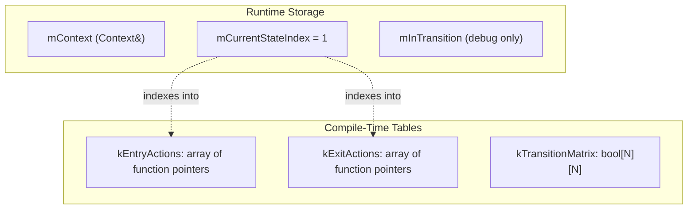

# User Manual - StateMachine

*Updated January 2026*

---

## The Finite State Machine Story

In 1961, an engineer at Bell Labs was debugging a telephone switching system. The system tracked whether each line was idle, ringing, connected, or on hold. Different events meant different things depending on the line's current condition: a hangup during a call meant disconnect, but a hangup while ringing meant the caller gave up. The engineer drew a diagram on the whiteboard—circles for conditions, arrows for events, labels for what happened on each transition.

That diagram was a finite state machine. The concept wasn't new; mathematicians had formalized it in the 1950s, and hardware designers used flip-flops in every digital circuit. But the whiteboard diagram made something click: any system that responds differently based on history can be modeled as states and transitions. The phone line didn't store a complex call history. It simply knew its current state, and that state determined everything about how it would respond to the next event.

The pattern spread through computing. Compilers used state machines to recognize tokens—is this character part of a number, a string, an identifier? Network protocols used them to track connections—are we handshaking, transferring data, or closing? Game AI used them to model behavior—is this enemy patrolling, chasing, or attacking? Wherever software needed to say "what happens next depends on where we are now," state machines appeared.

By the 1990s, the pattern was everywhere, but implementations varied wildly. Some programmers used enums with switch statements—fast but scattered. Some used function pointers in arrays—flexible but error-prone. Some used inheritance hierarchies with virtual functions—elegant but slow. The Gang of Four documented the State pattern in 1994, formalizing the object-oriented approach. But each implementation buried the original insight—that simple whiteboard diagram of circles and arrows—under layers of implementation complexity.

StateMachine exists to bring back the whiteboard. You declare states as types. You declare transitions as pairs. The state graph is visible in the code, just like the engineer's diagram was visible on the whiteboard. And the compiler verifies that your diagram makes sense.

---

## What a State Machine Actually Is

Before diving into code, let's be precise about the abstraction we're building. A finite state machine has exactly four components, and understanding them is essential for using StateMachine effectively.

The first component is the **state set**: a finite collection of conditions the system can be in. At any moment, the system is in exactly one state. A traffic light might have states Red, Yellow, and Green. A network connection might have states Disconnected, Connecting, Connected, and Disconnecting. The key constraint is mutual exclusion—you cannot be in two states simultaneously.

The second component is the **transition set**: the arrows connecting states. Each transition has a source state and a target state. A traffic light might allow Red→Green, Green→Yellow, and Yellow→Red, but not Red→Yellow (you don't skip Green). Not every pair of states needs a transition; the absence of a transition means that path is forbidden.

The third component is the **initial state**: where the system begins. When you create a traffic light, it starts in some state—probably Red. The initial state is part of the machine's definition, not something you choose at runtime.

The fourth component is the **actions**: code that runs during transitions. The most common pattern is entry and exit actions—code that runs when entering a state and when leaving it. When a connection enters the Connected state, it might start a heartbeat timer. When it exits Connected, it stops the timer. Actions are where the state machine does actual work.

```mermaid
stateDiagram-v2
    direction LR
    [*] --> Idle : initial
    Idle --> Running : start
    Running --> Paused : pause
    Paused --> Running : resume
    Running --> Idle : stop
    Paused --> Idle : stop
    
    note right of Running : on_entry: start timer
    note right of Running : on_exit: stop timer
```

That's it. No inheritance hierarchies. No visitor patterns. No template metaprogramming. Just states, transitions, an initial state, and actions. Everything else is implementation detail.

---

## The Problem with Enum-Switch

The most common state machine implementation uses an enum for states and switch statements for transitions. Let's look at why this approach breaks down, because understanding its failures motivates StateMachine's design.

Consider a download manager with four states: Idle, Downloading, Paused, and Complete. The obvious implementation defines an enum and stores the current state:

```cpp
enum class DownloadState { Idle, Downloading, Paused, Complete };

class DownloadManager {
    DownloadState state_ = DownloadState::Idle;
    // ...
};
```

So far, so good. Now we need to handle events. When the user clicks "Start," we check the current state and act accordingly. When progress updates arrive, we check the state. When the user clicks "Pause," we check again. Each event handler contains a switch:

```cpp
void on_start_clicked() {
    switch (state_) {
        case DownloadState::Idle:
            state_ = DownloadState::Downloading;
            begin_download();
            break;
        case DownloadState::Downloading:
            // Already downloading—ignore or error?
            break;
        case DownloadState::Paused:
            state_ = DownloadState::Downloading;
            resume_download();
            break;
        case DownloadState::Complete:
            // Re-download? Start new download? Unclear.
            break;
    }
}

void on_pause_clicked() {
    switch (state_) {
        case DownloadState::Idle:
            // Can't pause what hasn't started
            break;
        case DownloadState::Downloading:
            state_ = DownloadState::Paused;
            suspend_download();
            break;
        case DownloadState::Paused:
            // Already paused—ignore
            break;
        case DownloadState::Complete:
            // Can't pause a completed download
            break;
    }
}
```

We have two event handlers, each with a four-case switch. A real download manager might have ten event handlers: start, pause, resume, cancel, retry, progress update, completion, error, timeout, user interrupt. That's ten switches with four cases each—forty places where state transition logic lives.

The first problem is **scattered logic**. To understand the complete state graph, you must read every switch statement in every handler. The graph exists only implicitly, reconstructed by reading code. Adding a fifth state (say, "Queued") requires modifying all ten switches. The compiler might warn about missing cases, but only if you don't have a default clause—and default clauses are common.

The second problem is **no validation**. The code `state_ = DownloadState::Complete` compiles regardless of current state. Nothing prevents a bug from setting Complete directly from Idle, skipping the actual download. The invalid transition compiles, runs, and corrupts your state. You discover it when a user reports "downloads sometimes show complete without downloading anything."

The third problem is **duplicated actions**. When entering Downloading, you need to start progress tracking. When exiting Downloading, you need to stop it. This logic appears in every handler that transitions to or from Downloading. Change the progress API? Find every copy.

The state graph—the engineer's whiteboard diagram—has disappeared into implementation details.

---

## The Type-Safe Insight

StateMachine addresses these problems by representing states as types rather than enum values, and transitions as declared data rather than implicit code paths.

When states are types, the compiler knows which states exist. You can't transition to a state that isn't in the type list—that's a compile error, not a runtime bug. When transitions are declared as pairs, the complete state graph is visible in one place. Adding a state means adding a type and its transition pairs, not hunting through switch statements.

Here's the same download manager using StateMachine. First, we define a context type to hold the data that persists across state changes:

```cpp
struct DownloadContext {
    std::string url;
    std::size_t bytes_downloaded = 0;
    std::size_t total_bytes = 0;
    ProgressTracker tracker;
};
```

The context is the state machine's memory. States themselves are stateless—they're behavior specifications, not data containers. Any data that must survive across transitions lives in the context.

Next, we define state types. Each state is a struct with `on_entry` and `on_exit` methods:

```cpp
struct Idle {
    void on_entry(DownloadContext& ctx) {
        ctx.bytes_downloaded = 0;
        ctx.total_bytes = 0;
    }
    void on_exit(DownloadContext&) {
        // Nothing to clean up
    }
};

struct Downloading {
    void on_entry(DownloadContext& ctx) {
        ctx.tracker.start();
    }
    void on_exit(DownloadContext& ctx) {
        ctx.tracker.stop();
    }
};

struct Paused {
    void on_entry(DownloadContext& ctx) {
        ctx.tracker.pause();
    }
    void on_exit(DownloadContext& ctx) {
        ctx.tracker.resume();
    }
};

struct Complete {
    void on_entry(DownloadContext& ctx) {
        ctx.tracker.finish();
    }
    void on_exit(DownloadContext&) {}
};
```

Notice that entry and exit logic is centralized in each state type. Every transition to Downloading calls `Downloading::on_entry`. Every transition from Downloading calls `Downloading::on_exit`. No duplication, no hunting through switch statements.

Now we declare which transitions are legal:

```cpp
using DownloadTransitions = std::tuple<
    std::pair<Idle, Downloading>,        // Start download
    std::pair<Downloading, Paused>,      // Pause
    std::pair<Paused, Downloading>,      // Resume
    std::pair<Downloading, Complete>,    // Finish
    std::pair<Paused, Idle>,             // Cancel from paused
    std::pair<Downloading, Idle>         // Cancel from downloading
>;
```

This is the whiteboard diagram, written in code. Six transitions are legal; everything else is forbidden. The state graph is visible in one place.

Finally, we assemble the state machine:

```cpp
using DownloadSM = fat_p::StateMachine<
    DownloadContext,                   // Context type
    DownloadTransitions,               // Allowed transitions
    fat_p::StrictTransitionPolicy,     // Validate transitions
    fat_p::ThrowingActionPolicy,       // Hooks may throw
    0,                                 // Initial state index (Idle)
    Idle, Downloading, Paused, Complete  // State types
>;
```

The template parameters specify everything about the state machine: what data it carries, which transitions are allowed, how it handles invalid transitions, how it handles exceptions, which state it starts in, and what states exist.

Using the state machine is straightforward:

```cpp
DownloadContext ctx;
ctx.url = "https://example.com/file.zip";

DownloadSM sm(ctx);  // Enters Idle state, calls Idle::on_entry

sm.transition<Downloading>();  // Idle→Downloading: calls Idle::on_exit, then Downloading::on_entry
sm.transition<Paused>();       // Downloading→Paused
sm.transition<Downloading>();  // Paused→Downloading (resume)
sm.transition<Complete>();     // Downloading→Complete

// This would throw—Idle→Complete is not in the transition list:
// sm.transition<Idle>();
// sm.transition<Complete>();  // throws std::runtime_error
```

The event handlers become simple:

```cpp
void on_start_clicked() {
    if (sm.isInState<Idle>() || sm.isInState<Paused>()) {
        sm.transition<Downloading>();
    }
}

void on_pause_clicked() {
    if (sm.isInState<Downloading>()) {
        sm.transition<Paused>();
    }
}
```

No switches. No scattered transition logic. Invalid transitions throw exceptions with clear messages. The state graph lives in the transition list, visible and verifiable.

---

## How StateMachine Works Inside

Understanding the implementation helps you use StateMachine effectively and debug problems when they arise. The design is simpler than you might expect—no template metaprogramming wizardry, just straightforward C++20 features combined thoughtfully.

At runtime, a StateMachine instance stores three things: a reference to your context, the current state index as a `std::size_t`, and in debug builds, a boolean flag for reentrancy detection. That's the entire runtime footprint. No heap allocation. No virtual tables. No type erasure.



The magic happens at compile time. When you instantiate a StateMachine with state types A, B, C, the compiler assigns each type an index: A=0, B=1, C=2. This mapping is fixed and computed entirely at compile time.

For each state, the compiler generates a small wrapper function that default-constructs the state and calls its hook:

```cpp
template <typename TState>
static void entryAction(Context& ctx) {
    TState{}.on_entry(ctx);
}
```

These wrappers are collected into constexpr arrays—one for entry actions, one for exit actions. The arrays exist in read-only memory, initialized before `main()` runs.

When you call `transition<B>()`, the state machine:

1. Looks up B's index at compile time (it's 1)
2. Compares current index to target index—if equal, returns immediately (self-transition optimization)
3. For StrictPolicy: checks `kTransitionMatrix[current][1]`—if false, throws
4. Calls `kExitActions[current](mContext)`
5. Sets `mCurrentStateIndex = 1`
6. Calls `kEntryActions[1](mContext)`

The entire transition is two function pointer calls, one integer assignment, and optionally one array lookup for validation. No heap allocation. No virtual dispatch. No visitor pattern.

---

## The State Contract

Every state type must satisfy a specific contract. Understanding this contract helps you design states that work correctly with StateMachine.

The first requirement is that states must be **default-constructible**. The state machine creates state instances by writing `TState{}`. If your state has a constructor that requires arguments, this fails to compile. This requirement exists because states are stateless—they're created as temporaries just to call their hooks.

If you're thinking "but my state needs configuration," the answer is: put the configuration in the context. The state can read it from there:

```cpp
// Wrong: state with constructor arguments
struct ConfiguredState {
    int threshold_;
    ConfiguredState(int t) : threshold_(t) {}  // Won't work!
    void on_entry(Context& ctx) { /* use threshold_ */ }
    void on_exit(Context&) {}
};

// Right: configuration in context
struct ConfiguredState {
    void on_entry(Context& ctx) {
        int threshold = ctx.threshold;  // Read from context
        // use threshold
    }
    void on_exit(Context&) {}
};
```

The second requirement is that states must provide `on_entry(Context&)` and `on_exit(Context&)` methods. Both must take a reference to your context type (not const—hooks can modify context) and return void. The state machine verifies this at compile time using C++20 concepts, so violations produce clear error messages rather than template noise.

The third requirement, if you use NoExceptActionPolicy, is that both hooks must be marked `noexcept`. The state machine checks this with concepts too. If you forget the `noexcept` specifier, you get a compile error telling you exactly what's wrong.

With NoExceptActionPolicy, states must also be **nothrow default-constructible**. The state machine invokes hooks on a temporary (`TState{}`) inside a `noexcept` wrapper function. If the default constructor could throw, the wrapper would call `std::terminate()`. StateMachine prevents this footgun by rejecting such state types at compile time.

States can have other methods and members if you want, but the state machine only calls `on_entry` and `on_exit`. Static member functions work fine for hooks—there's no implicit `this` to worry about since states are stateless anyway.

---

## The Context Pattern

Since states are stateless temporaries, all persistent data must live in the context. The context is passed by reference to every hook, giving states read/write access to shared data. Designing your context well is crucial for a clean state machine.

Think of the context as everything the state machine needs to know and everything it can affect. For a network connection, the context might include the socket handle, connection parameters, statistics, and timers. For a game entity, it might include position, health, animation state, and references to the game world.

```cpp
struct ConnectionContext {
    // Connection parameters
    std::string host;
    int port;
    
    // Connection state
    Socket socket;
    bool authenticated = false;
    
    // Timers
    HeartbeatTimer heartbeat;
    TimeoutTimer timeout;
    
    // Statistics
    std::size_t bytes_sent = 0;
    std::size_t bytes_received = 0;
    
    // External systems (by reference, not owned)
    Logger& logger;
    MetricsCollector& metrics;
    
    ConnectionContext(Logger& l, MetricsCollector& m) 
        : logger(l), metrics(m) {}
};
```

A few design principles help keep contexts manageable. First, the context should be data, not behavior. States provide behavior through their hooks; the context provides the data they operate on. If you find yourself adding complex methods to the context, consider whether that logic belongs in a state's hook instead.

Second, include references to external systems so states can interact with them. The context is the state machine's interface to the rest of your application. A game AI's context might hold references to the pathfinder, the animation system, and the world query interface.

Third, avoid storing a pointer to the state machine itself in the context. It's tempting—you might want to query the current state from within a hook. But if you store a pointer and call `transition()` from a hook, you create reentrancy bugs. If you must store the pointer (for state queries only), be extremely disciplined about never calling `transition()` from hooks.

---

## Choosing a Transition Policy

StateMachine offers two transition policies, and choosing between them is one of the most important design decisions you'll make. The choice affects how bugs manifest, when you catch them, and how much flexibility you have during development.

**AnyToAnyTransitionPolicy** is the permissive choice. Any transition between states in the type list is allowed. The state machine trusts you to call the right transitions at the right times. If you make a mistake, you won't find out from the state machine—it just executes whatever transition you request.

This policy makes sense when transition rules are enforced elsewhere. Maybe your game's AI behavior tree already ensures enemies only enter Chase from appropriate states. Duplicating that logic in the state machine would be redundant, and worse, it would create two places to update when rules change.

It also makes sense during prototyping. You're figuring out the state graph as you go. A transition that seems wrong today might be exactly right tomorrow. The state machine stays out of your way until you're ready to lock down the design.

The syntax reflects the permissive philosophy:

```cpp
using FlexibleSM = fat_p::StateMachine<
    Context,
    std::tuple<>,                      // Empty—transitions aren't declared
    fat_p::AnyToAnyTransitionPolicy,   // Trust the programmer
    fat_p::ThrowingActionPolicy,
    0,
    StateA, StateB, StateC
>;
```

**StrictTransitionPolicy** is the validated choice. You declare which transitions are legal, and the state machine checks every transition against this list at runtime. Invalid transitions throw an exception before any hooks execute—the state machine stays in its original state, as if the transition never happened.

This policy makes sense for protocols with defined structure. A WebSocket implementation follows RFC 6455; certain transitions are valid and others violate the spec. Declaring transitions as data means the spec is encoded in your program, not just in comments. When someone asks "can we go directly from Connecting to Closed?", the answer is in the code.

It also provides documentation value. The transition list is the state graph, visible in one place. New team members can read it and understand the system's structure without tracing through event handlers.

```cpp
using Transitions = std::tuple<
    std::pair<Connecting, Open>,       // Handshake complete
    std::pair<Connecting, Closed>,     // Handshake failed
    std::pair<Open, Closing>,          // Close initiated
    std::pair<Closing, Closed>         // Close complete
    // Note: Open→Closed is NOT listed—must go through Closing
>;

using ProtocolSM = fat_p::StateMachine<
    Context,
    Transitions,
    fat_p::StrictTransitionPolicy,
    fat_p::ThrowingActionPolicy,
    0,
    Connecting, Open, Closing, Closed
>;
```

If you try a transition that isn't in the list, the state machine throws `std::runtime_error` immediately. The exception happens before the exit hook runs, so the state machine remains unchanged. You can catch the exception, log it, and decide how to proceed.

The validation overhead is small—about 0.9 nanoseconds per transition in benchmarks. The state machine builds a compile-time boolean matrix from your transition list and checks it with a single array lookup at runtime.

---

## Choosing an Action Policy

The second policy choice affects exception handling. Can your hooks throw exceptions? If so, what guarantees does the state machine provide? If not, how does the compiler know?

**ThrowingActionPolicy** is the permissive choice. Hooks can throw exceptions, and the state machine propagates them with well-defined semantics. This makes sense when hooks do real work that can fail—opening files, establishing connections, parsing data.

When a hook throws, the state machine guarantees specific behavior. If the exit hook throws, the state index hasn't been updated yet—you're still in the original state, and the entry hook never runs. If the entry hook throws, the state index has already been updated—you're in the new state, but its initialization didn't complete.

This asymmetry follows the transition sequence: exit, update index, enter. The index update is the commit point. Before it, you can abort cleanly. After it, you're committed to the new state even if entry fails.

**NoExceptActionPolicy** is the strict choice. Every hook must be marked `noexcept`, and the compiler verifies this at instantiation time. If you forget the specifier or call a function that might throw, you get a compile error.

This policy makes sense for real-time systems where exception overhead is unacceptable. When the compiler knows functions can't throw, it eliminates exception handling machinery—stack unwinding tables, exception propagation code, and associated overhead. In a hot loop that transitions millions of times, this matters.

It also provides design discipline. Marking hooks `noexcept` forces you to think about what they're doing. If a hook can't be `noexcept`, ask why. Should the fallible work happen before the transition, validated and ready, rather than during entry?

```cpp
struct GameState {
    void on_entry(Context& ctx) noexcept {
        ctx.animation.play("enter");
    }
    void on_exit(Context& ctx) noexcept {
        ctx.animation.stop();
    }
};

using GameSM = fat_p::StateMachine<
    Context, Transitions, Policy,
    fat_p::NoExceptActionPolicy,
    0, GameState, OtherState
>;
```

---

## Self-Transitions: The Intentional No-Op

What happens when you transition to the state you're already in? The naive answer is "exit and re-enter," but that's almost never what you want.

Consider a network connection in the Connected state receiving a "stay connected" heartbeat. If self-transitions fired hooks, the heartbeat would stop and restart the heartbeat timer—wasteful at best, buggy at worst. Or consider a game entity in the Patrol state receiving a "continue patrol" signal. Firing exit/entry hooks would reset patrol progress, losing the path the entity was following.

StateMachine treats self-transitions as no-ops. If the target state equals the current state, `transition()` returns immediately without calling any hooks or changing any state. No validation occurs (even with StrictPolicy). No exit. No entry. No side effects.

This is a deliberate design choice based on semantics. "Exiting" a state you're not leaving is meaningless. "Entering" a state you're already in is equally meaningless. Hooks exist to handle transitions between different states, and a self-transition isn't a transition—it's a statement that you're staying put.

If you genuinely need to "refresh" a state—re-run its entry logic—the pattern is explicit. Transition to a different state, then back:

```cpp
sm.transition<Idle>();     // Exit Running, enter Idle
sm.transition<Running>();  // Exit Idle, enter Running
```

This makes the intent clear. The state machine went somewhere and came back. Logs show two transitions. Hooks ran for both. There's no hidden "refresh" behavior—just explicit state changes.

---

## The Reentrancy Trap

One of the most subtle bugs in state machine design is reentrancy: calling `transition()` from within a hook. It seems reasonable—the Damaged state's entry hook checks health and transitions to Dead if health is zero. But it creates serious problems.

When you call `transition()` from an entry hook, the state machine is partway through a transition. It has updated the state index to the new state but hasn't finished the entry hook. Now you're asking it to start another transition—to exit a state whose entry hasn't completed and enter yet another state. The state machine is in an inconsistent state, and you're making it worse.

The mildest problem is ordering confusion. If Damaged's entry transitions to Dead, what happens to the rest of Damaged's entry code? Does it run after Dead's entry? Before? Not at all? The answers depend on implementation details that could change.

A worse problem is infinite recursion. If state A's entry transitions to B, and B's entry transitions to A, the stack grows without bound until the program crashes. This isn't hypothetical—games have shipped bugs where two states ping-ponged in their entry hooks.

StateMachine catches this in debug builds. A boolean flag tracks whether a transition is in progress. If you call `transition()` while the flag is set, the state machine throws an exception (with ThrowingActionPolicy) or calls `std::terminate()` (with NoExceptActionPolicy). The error message tells you exactly what happened.

In release builds, this check is compiled out for performance. Reentrancy becomes undefined behavior—it might appear to work, might corrupt state, or might crash. The debug check exists so you catch these bugs during development, not in production.

If a hook genuinely needs to trigger a transition, defer it. Store a "pending transition" request in the context and process it after the current transition completes:

```cpp
struct Damaged {
    void on_entry(Context& ctx) {
        ctx.health -= ctx.incoming_damage;
        if (ctx.health <= 0) {
            ctx.pending_transition = TransitionRequest::ToDead;
        }
    }
};

// In your event loop, after transitions complete:
void process_pending_transitions(StateMachine& sm, Context& ctx) {
    while (ctx.pending_transition != TransitionRequest::None) {
        auto request = std::exchange(ctx.pending_transition, TransitionRequest::None);
        switch (request) {
            case TransitionRequest::ToDead: sm.transition<Dead>(); break;
            // ...
        }
    }
}
```

This keeps transitions sequential. Each one completes before the next begins. The state machine is never in an inconsistent state.

---

## Exception Safety in Detail

When hooks can throw (with ThrowingActionPolicy), you need to understand exactly what happens at each point in a transition. The state machine provides specific guarantees that help you write robust code.

A transition has three phases: exit the current state, update the index, enter the new state. The index update is the commit point.

If the **exit hook throws**, the transition aborts immediately. The state index hasn't been updated—you're still in the original state. The entry hook never runs. The exception propagates to the caller of `transition()`. The state machine is in a valid, consistent state: the same state it was in before the transition attempt.

If the **entry hook throws**, things are different. The exit hook has already run. The index has already been updated—you're now in the new state, at least as far as the index is concerned. But the entry logic didn't complete. The exception propagates to the caller. The state machine is in a valid state, but the new state may be incompletely initialized.

This asymmetry means you need to think carefully about entry hook failures. If opening a socket in the entry hook might throw, the exit hook of other states needs to handle the possibility that the socket was never opened. Defensive coding in exit hooks is essential:

```cpp
struct Connected {
    void on_entry(Context& ctx) {
        ctx.socket = open_socket(ctx.host);  // Might throw
        ctx.heartbeat.start();
    }
    
    void on_exit(Context& ctx) noexcept {
        // Handle the case where entry didn't complete
        if (ctx.heartbeat.is_running()) {
            ctx.heartbeat.stop();
        }
        if (ctx.socket.is_open()) {
            ctx.socket.close();
        }
    }
};
```

A good practice is making exit hooks `noexcept` even when using ThrowingActionPolicy. Exit hooks clean up resources; cleanup that throws is a design smell. If exit must do fallible work, catch exceptions internally and log them rather than propagating.

---

## Compile-Time Introspection

StateMachine exposes its structure through constexpr members, letting you query the state machine at compile time. This enables static_asserts that verify assumptions, conditional compilation based on state graph structure, and generic code that adapts to any state machine.

The `state_count` member tells you how many states the machine has. The `initial_state_index` member tells you which state it starts in. Both are compile-time constants:

```cpp
using SM = fat_p::StateMachine<Ctx, TL, Policy, ActionPolicy, 0, A, B, C>;

static_assert(SM::state_count == 3);
static_assert(SM::initial_state_index == 0);
```

The `contains_state<T>` variable template tells you whether a type is in the state set. This catches errors at compile time:

```cpp
static_assert(SM::contains_state<A>);
static_assert(!SM::contains_state<Unknown>);  // Would fail if Unknown were assumed valid
```

With StrictTransitionPolicy, the `is_transition_allowed<From, To>` variable template tells you whether a specific transition is legal. This lets you write generic code that adapts to the state graph.

Self-transitions are always allowed (they are defined as a no-op). For this reason, `is_transition_allowed<S, S>` is true even if you do not list self-edges in your TransitionList.

```cpp
template <typename Machine, typename From, typename To>
void safe_transition(Machine& sm) {
    if constexpr (Machine::template is_transition_allowed<From, To>) {
        sm.template transition<To>();
    } else {
        // Handle disallowed transition differently
    }
}
```

At runtime, `currentStateIndex()` returns the current state's index, and `isInState<T>()` checks whether you're in a specific state. Both are O(1) operations—a single integer comparison.

---

## A Complete Example

Let's build a complete, realistic example: a connection state machine for a chat client. This demonstrates all the concepts working together.

The chat client has five states: Disconnected (not connected), Connecting (handshake in progress), Connected (authenticated and ready), Reconnecting (connection lost, attempting recovery), and Disconnecting (graceful shutdown in progress).

First, the context holds all connection-related data:

```cpp
struct ChatContext {
    // Connection parameters
    std::string server_host;
    int server_port;
    std::string username;
    std::string auth_token;
    
    // Connection resources
    Socket socket;
    HeartbeatTimer heartbeat;
    ReconnectTimer reconnect;
    
    // State tracking
    int reconnect_attempts = 0;
    static constexpr int max_reconnect_attempts = 5;
    
    // Message queue for pending messages during reconnection
    std::queue<Message> pending_messages;
    
    // External interface
    Logger& logger;
    UICallback& ui;
    
    ChatContext(Logger& l, UICallback& u) : logger(l), ui(u) {}
};
```

Next, the state types. Each has entry/exit hooks that perform the appropriate setup and cleanup:

```cpp
struct Disconnected {
    void on_entry(ChatContext& ctx) {
        ctx.logger.info("Disconnected from server");
        ctx.ui.show_disconnected();
        ctx.reconnect_attempts = 0;
    }
    void on_exit(ChatContext&) {}
};

struct Connecting {
    void on_entry(ChatContext& ctx) {
        ctx.logger.info("Connecting to " + ctx.server_host);
        ctx.ui.show_connecting();
        ctx.socket = Socket::connect(ctx.server_host, ctx.server_port);
        ctx.socket.send_auth(ctx.username, ctx.auth_token);
    }
    void on_exit(ChatContext& ctx) {
        if (!ctx.socket.is_authenticated()) {
            ctx.socket.close();
        }
    }
};

struct Connected {
    void on_entry(ChatContext& ctx) {
        ctx.logger.info("Connected and authenticated");
        ctx.ui.show_connected(ctx.username);
        ctx.heartbeat.start(std::chrono::seconds(30));
        ctx.reconnect_attempts = 0;
        
        // Flush any messages queued during reconnection
        while (!ctx.pending_messages.empty()) {
            ctx.socket.send(ctx.pending_messages.front());
            ctx.pending_messages.pop();
        }
    }
    void on_exit(ChatContext& ctx) {
        ctx.heartbeat.stop();
    }
};

struct Reconnecting {
    void on_entry(ChatContext& ctx) {
        ctx.reconnect_attempts++;
        ctx.logger.info("Reconnecting, attempt " + 
                        std::to_string(ctx.reconnect_attempts));
        ctx.ui.show_reconnecting(ctx.reconnect_attempts, 
                                  ctx.max_reconnect_attempts);
        
        auto delay = std::chrono::seconds(1 << ctx.reconnect_attempts);
        ctx.reconnect.schedule(delay);
    }
    void on_exit(ChatContext& ctx) {
        ctx.reconnect.cancel();
    }
};

struct Disconnecting {
    void on_entry(ChatContext& ctx) {
        ctx.logger.info("Disconnecting gracefully");
        ctx.ui.show_disconnecting();
        ctx.socket.send_goodbye();
        ctx.socket.close_gracefully();
    }
    void on_exit(ChatContext& ctx) {
        ctx.socket.force_close();
    }
};
```

The transition list defines the allowed state graph:

```cpp
using ChatTransitions = std::tuple<
    // Normal flow
    std::pair<Disconnected, Connecting>,   // User initiates connection
    std::pair<Connecting, Connected>,       // Handshake succeeds
    std::pair<Connected, Disconnecting>,    // User initiates disconnect
    std::pair<Disconnecting, Disconnected>, // Disconnect completes
    
    // Error handling
    std::pair<Connecting, Disconnected>,    // Handshake fails
    std::pair<Connected, Reconnecting>,     // Connection lost
    std::pair<Reconnecting, Connecting>,    // Retry connection
    std::pair<Reconnecting, Disconnected>   // Give up after max retries
>;
```

Finally, the state machine type:

```cpp
using ChatSM = fat_p::StateMachine<
    ChatContext,
    ChatTransitions,
    fat_p::StrictTransitionPolicy,
    fat_p::ThrowingActionPolicy,
    0,  // Start in Disconnected
    Disconnected, Connecting, Connected, Reconnecting, Disconnecting
>;
```

Using it in the chat client:

```cpp
class ChatClient {
    ChatContext ctx_;
    ChatSM sm_;
    
public:
    ChatClient(Logger& logger, UICallback& ui)
        : ctx_(logger, ui)
        , sm_(ctx_)
    {}
    
    void connect(const std::string& host, int port, 
                 const std::string& user, const std::string& token) {
        ctx_.server_host = host;
        ctx_.server_port = port;
        ctx_.username = user;
        ctx_.auth_token = token;
        sm_.transition<Connecting>();
    }
    
    void disconnect() {
        if (sm_.isInState<Connected>()) {
            sm_.transition<Disconnecting>();
        } else if (sm_.isInState<Reconnecting>()) {
            sm_.transition<Disconnected>();
        }
    }
    
    void on_auth_success() {
        sm_.transition<Connected>();
    }
    
    void on_auth_failure() {
        sm_.transition<Disconnected>();
    }
    
    void on_connection_lost() {
        if (sm_.isInState<Connected>()) {
            sm_.transition<Reconnecting>();
        }
    }
    
    void on_reconnect_timer() {
        if (ctx_.reconnect_attempts < ctx_.max_reconnect_attempts) {
            sm_.transition<Connecting>();
        } else {
            sm_.transition<Disconnected>();
        }
    }
    
    void send_message(const Message& msg) {
        if (sm_.isInState<Connected>()) {
            ctx_.socket.send(msg);
        } else if (sm_.isInState<Reconnecting>()) {
            ctx_.pending_messages.push(msg);
        }
    }
};
```

The complete state graph is visible in the transition list. Entry/exit hooks are centralized in state types. Invalid transitions throw exceptions with clear messages. The code is self-documenting.

---

## When to Use StateMachine

StateMachine is not the right tool for every job. Understanding when it helps and when it doesn't will save you from awkward designs.

**Use StateMachine when** you have a genuine state machine: multiple states with different behavior, transitions between them, and entry/exit logic that should be centralized. Protocol handlers, UI navigation, game entity AI, and workflow engines are classic examples.

**Use StateMachine when** the state graph is stable enough to declare. If you're past prototyping and know which transitions should exist, StrictTransitionPolicy documents and enforces that knowledge. If you're still exploring, AnyToAnyTransitionPolicy lets you experiment without friction.

**Use StateMachine when** you want compile-time validation of state types. Typos in state names become compile errors. States that forget to implement hooks become compile errors. The compiler catches bugs that enum-switch would let slip to runtime.

**Don't use StateMachine when** states are determined at runtime. The state set is fixed at compile time. If plugins or scripts define states dynamically, you need a different pattern.

**Don't use StateMachine when** you need thread safety. StateMachine is not thread-safe. If multiple threads might transition the same state machine, you need external synchronization. For lock-free state machines, look elsewhere.

**Don't use StateMachine when** states need significant data. States are stateless temporaries. If "state" means "accumulated data that varies by state," use a variant or polymorphic approach.

**Don't use StateMachine when** the state machine is trivial. A two-state machine with no hooks doesn't need a library. Write a boolean. The abstraction overhead isn't worth it for trivial cases.

---

## Troubleshooting

When things go wrong, these are the common problems and their solutions.

**"CTSM Error: All state types must be default-constructible"** — One of your states has a constructor with required parameters. States must be creatable via `TState{}`. Move the data to your context.

**"CTSM Error: All state types must provide void on_entry(Context&) and void on_exit(Context&)"** — A state is missing a hook or has the wrong signature. Check that both methods exist, take a `Context&` (not const, not by value), and return void.

**"TTransitionPolicy must be StrictTransitionPolicy or AnyToAnyTransitionPolicy"** — You passed something other than the two valid policies. Check for typos.

**"TransitionList contains a state type not present in the StateMachine definition"** — Your transition list mentions a state that isn't in the state type list. This often means a typo in a state name.

**"CTSM Error: Transition is not valid under StrictTransitionPolicy"** (runtime) — You tried a transition that isn't in your transition list. Either add the transition or reconsider whether it should happen.

**"CTSM Error: Reentrant transition detected"** (runtime, debug only) — You called `transition()` from within a hook. Defer the transition to after the current hook completes.

---

## API Reference

**Template Parameters:**

`Context` — The mutable data type shared by all states. Passed by reference to hooks.

`TransitionList` — A `std::tuple<std::pair<From, To>...>` of allowed transitions. Ignored by AnyToAnyPolicy.

`TTransitionPolicy` — Either `AnyToAnyTransitionPolicy` or `StrictTransitionPolicy`.

`TActionPolicy` — Either `ThrowingActionPolicy` or `NoExceptActionPolicy`.

`InitialIndex` — The index of the initial state in the state list. Default is 0.

`States...` — The state types, listed in order. Index 0 is the first type, index 1 is the second, etc.

**Constructor:**

`StateMachine(Context& ctx)` — Constructs the state machine and enters the initial state by calling its `on_entry` hook.

**Methods:**

`transition<TState>()` — Transition to the specified state. Self-transitions are no-ops. With StrictPolicy, invalid transitions throw. Calls exit hook of current state, updates index, calls entry hook of new state.

`currentStateIndex()` — Returns the current state's index as `std::size_t`. O(1).

`isInState<TState>()` — Returns true if currently in the specified state. O(1).

`stateCount()` — Returns the number of states. Same as `state_count` but callable at runtime.

**Static Members:**

`state_count` — The number of states (constexpr).

`initial_state_index` — The initial state's index (constexpr).

`contains_state<T>` — True if T is in the state set (constexpr).

`is_transition_allowed<From, To>` — True if the transition is allowed. Self-transitions are always true (no-op). StrictPolicy only (constexpr).

---

*StateMachine.h — Fat-P Library*
