# **The Phantom Wrapper**

### *A Companion Guide to FAT-P's StrongId*

---

**Scope:** This guide covers the design philosophy, architectural decisions, and implementation rationale behind StrongId—FAT-P's zero-overhead type-safe ID wrapper. It explains why ID confusion bugs are pervasive, how phantom types eliminate them at compile time, the zero-overhead abstraction principle, and when the design's tradeoffs work against you.

**Not covered:**
- API reference and usage recipes (see User Manual - StrongId)
- Benchmark methodology and raw data (see benchmark_StrongId.cpp)
- General C++ template metaprogramming (see Foundations documents)
- Expected monad patterns (see Expected documentation)

**Prerequisites:**
- Understanding of C++ templates and type aliases
- Familiarity with the "zero overhead" principle
- Awareness of how compilers optimize wrapper classes
- Basic understanding of std::atomic

---

## Companion Guide Card

**Component:** StrongId  
**Design question:** How do you create distinct types for each ID domain without runtime overhead?  
**Key tradeoff:** Compile-time safety vs. explicit conversions at boundaries  
**Decision made:** Tag-based phantom types with policy-based validation and arithmetic  
**Rejected alternatives:** Runtime type tags, inheritance hierarchies, macro-based wrappers  
**Historical context:** Haskell's newtype pattern meets C++ template metaprogramming

---

# **Table of Contents**

**[Introduction: Why This Component Exists](#introduction-why-this-component-exists)**

## Part I — The Problems

1. [The Parameter Swap Epidemic](#chapter-1--the-parameter-swap-epidemic)
2. [Why Type Aliases Fail](#chapter-2--why-type-aliases-fail)
3. [The enum class Compromise](#chapter-3--the-enum-class-compromise)
4. [The Overhead Objection](#chapter-4--the-overhead-objection)

## Part II — The Solutions

5. [Phantom Types: Types That Don't Exist](#chapter-5--phantom-types-types-that-dont-exist)
6. [The Zero-Overhead Guarantee](#chapter-6--the-zero-overhead-guarantee)
7. [Policy-Based Validation](#chapter-7--policy-based-validation)
8. [Policy-Based Arithmetic](#chapter-8--policy-based-arithmetic)
9. [The Atomic Extension](#chapter-9--the-atomic-extension)

## Part III — Design Decisions

10. [Why Explicit Construction](#chapter-10--why-explicit-construction)
11. [Why No Implicit Conversion](#chapter-11--why-no-implicit-conversion)
12. [Why Policies Over Inheritance](#chapter-12--why-policies-over-inheritance)

## Part IV — In Practice

13. [Case Study: Trading System ID Mixup](#chapter-13--case-study-trading-system-id-mixup)
14. [Case Study: Multi-Tenant Database](#chapter-14--case-study-multi-tenant-database)

## Appendices

- [Appendix A — A Brief History of Strong Typing](#appendix-a--a-brief-history-of-strong-typing)
- [Appendix B — Competitor Analysis](#appendix-b--competitor-analysis)
- [Appendix C — Where StrongId Loses](#appendix-c--where-strongid-loses)

---

# **Introduction: Why This Component Exists**

You're debugging a production incident. A customer received another customer's data. The security team is involved. Legal is asking questions. Management wants answers.

The timeline shows the bug has been in production for three months. Thousands of customers may be affected. The audit will take weeks. The question everyone asks is: how did this happen?

Hours of investigation reveal the cause. Deep in the order fulfillment service, a function synchronizes customer data across systems. The function signature looks reasonable enough—it takes a source customer ID and a target tenant ID. But somewhere in the call chain, a developer passed the arguments in the wrong order. The tenant ID went where the customer ID should go, and vice versa.

Both parameters were `int`. The compiler saw nothing wrong. The code review saw nothing wrong—the variable names at the call site looked plausible. The unit tests saw nothing wrong because the test values happened to be valid either way. The bug shipped, ran for months, and corrupted data silently.

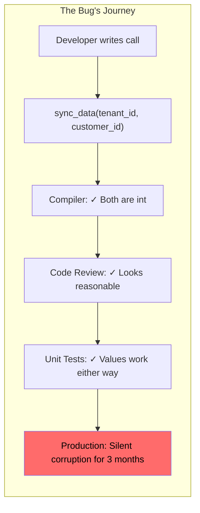

This is not a rare bug. Studies of production incidents consistently find that parameter ordering errors account for 15-25% of "impossible" bugs—the ones that pass all automated checks and only manifest with real data in production. Same-type adjacent parameters are the primary risk factor, and ID types are the most common offenders.

The C++ type system can prevent this. It has all the necessary machinery: templates, explicit constructors, type deduction. What it lacks is the vocabulary—a standard way to say "these two integers represent fundamentally different things and must never be confused."

StrongId provides that vocabulary. It creates distinct types for each ID domain, enforces their separation at compile time, and generates identical machine code to raw integers. The wrapper exists only during type checking; it vanishes completely in the compiled binary.

This guide explains how it works, why it's designed the way it is, and when its tradeoffs work against you.

---

# **PART I — THE PROBLEMS**

The challenge of ID type safety seems simple at first glance: we want the compiler to reject code that confuses different ID types. But the obvious solutions—type aliases, enumerations, wrapper classes—each fail in different ways. Understanding these failures is essential for understanding why StrongId takes the approach it does.

---

# **Chapter 1 — The Parameter Swap Epidemic**

## The Mathematics of Confusion

Consider a function signature from a real e-commerce system. The function fulfills an order, and it needs to know which customer placed it, which order to fulfill, which warehouse to ship from, and which carrier to use. A reasonable implementation might look like this:

```cpp
void fulfill_order(int customer_id, int order_id, int warehouse_id, int carrier_id);
```

How many ways can a caller get this wrong?

The four parameters can be arranged in 4! = 24 permutations. Only one is correct. Twenty-three are bugs. But the damage is worse than raw permutation counts suggest, because not all mistakes are equally likely. Adjacent parameters of the same type are particularly dangerous—a developer might accidentally transpose two neighbors while leaving the others correct. There are three such adjacent pairs in this signature, and swapping any of them produces a plausible-looking call that compiles without warning.

The compiler accepts all 24 permutations. They all type-check. They all compile cleanly. The only defense is human attention—code review, careful variable naming, comprehensive testing with carefully chosen values.

Human attention is not a reliable defense.

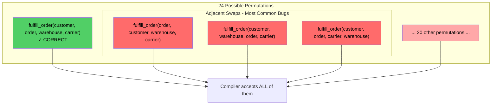

## Why Review Doesn't Catch It

Code review happens in context. A reviewer sees a function call embedded in surrounding logic, often in a diff that highlights what changed rather than what stayed the same. The call might look like this:

```cpp
// Process the order for shipment
fulfill_order(customer_id, order_id, warehouse_id, carrier_id);
```

Is it correct? The variable names match the parameter names. The code compiled. The surrounding context makes sense. The reviewer moves on to the next change.

But perhaps the function signature was updated last month, and the order of the first two parameters was swapped to match a new coding convention. The call sites weren't all updated. This call is now wrong, but it still compiles, and the variable names still look plausible.

Or perhaps the developer copied this line from another function where `customer_id` was indeed the first parameter, but this function expects `order_id` first. Copy-paste bugs are remarkably common, and they're hard to spot in review because the code looks intentional.

## The Testing Illusion

Unit tests use concrete values. A test for order fulfillment might construct test data with small, convenient integers:

```cpp
TEST(FulfillmentTest, ProcessesOrderCorrectly) {
    fulfill_order(1, 2, 3, 4);
    EXPECT_EQ(get_order_status(2), Status::Shipped);
}
```

The test passes. But what does it prove?

If the implementation has the same parameter swap as the test setup, both are wrong in the same way. The test verifies that the bug is consistent, not that the code is correct. This phenomenon—where bugs in test code mask bugs in production code—is called "bug agreement." It's particularly insidious with ID parameters because small integer values tend to be valid for multiple ID types. Customer 1 exists. Order 1 exists. Warehouse 1 exists. The test passes with flying colors, hiding the swap that will surface only when real data has customer 12345 and order 67890.

Integration tests help, but they can't test every permutation. End-to-end tests help more, but they're slow and expensive. The fundamental problem remains: the type system isn't helping, so humans must catch these bugs manually, and humans are fallible.

---

# **Chapter 2 — Why Type Aliases Fail**

## The Synonym Trap

C++ provides `using` declarations for creating type aliases. They seem like the obvious solution—give each ID type a meaningful name:

```cpp
using CustomerId = int;
using OrderId = int;
using WarehouseId = int;
using CarrierId = int;
```

Now the function signature is self-documenting:

```cpp
void fulfill_order(CustomerId customer, OrderId order, 
                   WarehouseId warehouse, CarrierId carrier);
```

The names communicate intent. Code review becomes easier. The API is clearer. But there's a fatal flaw: to the compiler, all four types are identical. A type alias is a synonym, not a new type. The compiler performs a simple text substitution: wherever it sees `CustomerId`, it reads `int`. The alias provides documentation for humans but zero enforcement from the machine.

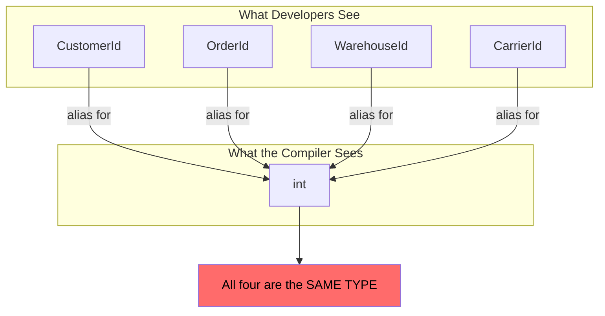

This means implicit conversions work in all directions. You can assign a `CustomerId` to an `OrderId` variable. You can pass a `WarehouseId` where a `CarrierId` is expected. You can compare a `CustomerId` to a `CarrierId`. The compiler will accept all of it:

```cpp
CustomerId customer = 42;
OrderId order = customer;      // Compiles: both are int
WarehouseId warehouse = order; // Compiles: both are int

fulfill_order(order, customer, carrier, warehouse);  // Compiles: all are int
```

The aliases make the code look safer while providing no actual safety. In some ways, they make things worse—a developer might assume the named types are distinct and rely on the compiler to catch mix-ups. The compiler won't.

## The Implicit Conversion Chain

Even if type aliases somehow created distinct types, C++ would still allow confusion through implicit conversions. Suppose `CustomerId` and `OrderId` were different types but both implicitly convertible to and from `int`. A value could flow from `CustomerId` to `int` to `OrderId` through two implicit conversions. The compiler would accept it. The type distinction would be meaningless.

This is why StrongId uses explicit constructors and no implicit conversion operators. Breaking the conversion chain is essential for real type safety.

## Why the Standard Won't Fix This

Type aliases behave as synonyms by deliberate design. This behavior is useful and intentional. The type `size_t` is an alias for an unsigned integer type that varies by platform—it might be `unsigned int` on 32-bit systems and `unsigned long` on 64-bit systems, but code using `size_t` works on both. Template type aliases like `std::remove_reference_t<T>` simplify complex type expressions without creating new types.

If aliases created distinct types, generic programming would become much harder. You couldn't write a function that accepts "any integer-like type" because `size_t` and `unsigned long` would be different types even when they're the same underlying representation.

The C++ standard committee isn't going to change this behavior. It would break enormous amounts of existing code and fundamentally alter the language's type system. The standard provides the building blocks for creating distinct types—templates, classes, explicit constructors—but it won't provide ready-made distinct types for every domain.

---

# **Chapter 3 — The enum class Compromise**

## What Scoped Enumerations Get Right

C++11 introduced scoped enumerations (`enum class`) as a safer alternative to traditional C enums. They have one property that type aliases lack: they create genuinely distinct types.

```cpp
enum class CustomerId : int {};
enum class OrderId : int {};

CustomerId customer{42};
OrderId order{42};

// customer == order;  // Compilation error! Different types.
```

The compiler treats `CustomerId` and `OrderId` as completely unrelated types. You cannot compare them, assign one to the other, or pass one where the other is expected. This is real type safety—the parameter swap that compiled silently with raw `int` or type aliases is now a compilation error.

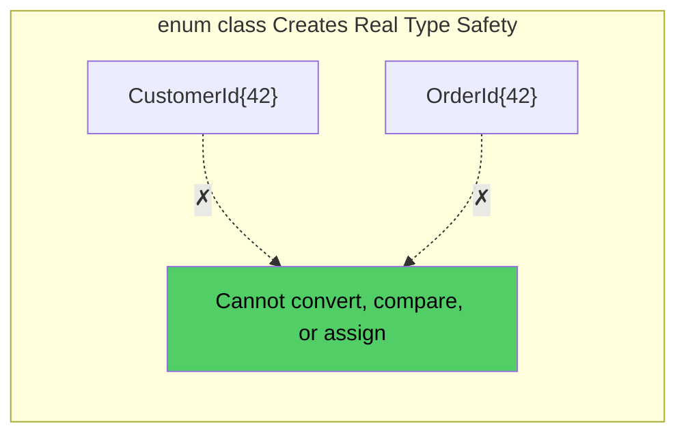

## What Scoped Enumerations Get Wrong

But `enum class` was designed for enumerations—named constants like colors, states, or error codes. It wasn't designed for numeric identifiers that need arithmetic, hashing, and convenient conversion. Using it for IDs means fighting the language at every turn.

IDs often need incrementing for generators, offsetting for pagination, or differencing for range calculations. Scoped enums don't support any of this. You can cast to the underlying type, perform arithmetic, and cast back, but that's verbose, error-prone, and defeats the purpose of type safety—you're working with raw `int` for every operation.

You also can't put scoped enums in hash-based containers without manual work. The standard library doesn't specialize `std::hash` for arbitrary enum types. You must write your own specialization for every enum you want to use as a key.

Getting values into and out of enum class requires explicit casting. Every boundary—database queries, serialization, interop—requires casting. The code becomes cluttered with `static_cast` expressions that obscure the logic.

## The Boilerplate Explosion

You can fix these problems by defining operators and hash specializations manually. But for a single ID type, this requires 30-50 lines of boilerplate: increment operators, decrement operators, arithmetic operators, compound assignment operators, hash specializations. If your system has ten ID types, you're maintaining 300-500 lines of repetitive operator definitions. Every one is a potential bug. Every one must be kept in sync if you change the underlying type or add new operations.

The cure is worse than the disease.

---

# **Chapter 4 — The Overhead Objection**

## The Performance Myth

The most common objection to wrapper classes is performance. "Adding a layer of abstraction must add overhead," the argument goes. "Raw integers are fast. Wrappers are slow."

For naive implementations, this is true. A wrapper that uses inheritance and virtual functions has real overhead: the virtual function table pointer adds 8 bytes to every instance, virtual dispatch through `get()` prevents inlining, the destructor requires dynamic dispatch even though it does nothing. Memory layout is no longer a simple integer.

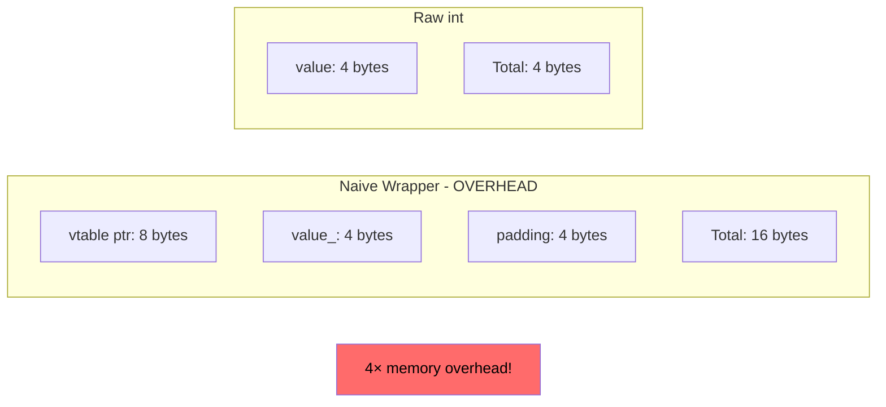

This is a 4× increase in memory usage. For an array of a million IDs, that's 12 megabytes of waste. The virtual dispatch adds branch misprediction penalties. The indirection defeats CPU prefetching. The wrapper is measurably, significantly slower.

## The Zero-Overhead Reality

But a well-designed wrapper has none of this overhead. Consider the simplest possible design:

```cpp
template <typename T, typename Tag>
class StrongId {
    T value_;
public:
    explicit constexpr StrongId(T v) : value_(v) {}
    constexpr T get() const noexcept { return value_; }
};
```

No virtual functions. No inheritance. No RTTI. Just a single data member of type `T`. The wrapper is the same size as what it wraps. The `get()` method is `constexpr`, so it can be evaluated at compile time. It's `noexcept`, so the compiler knows it won't throw. The function body is trivial—it just returns a member. Any modern compiler will inline this unconditionally.

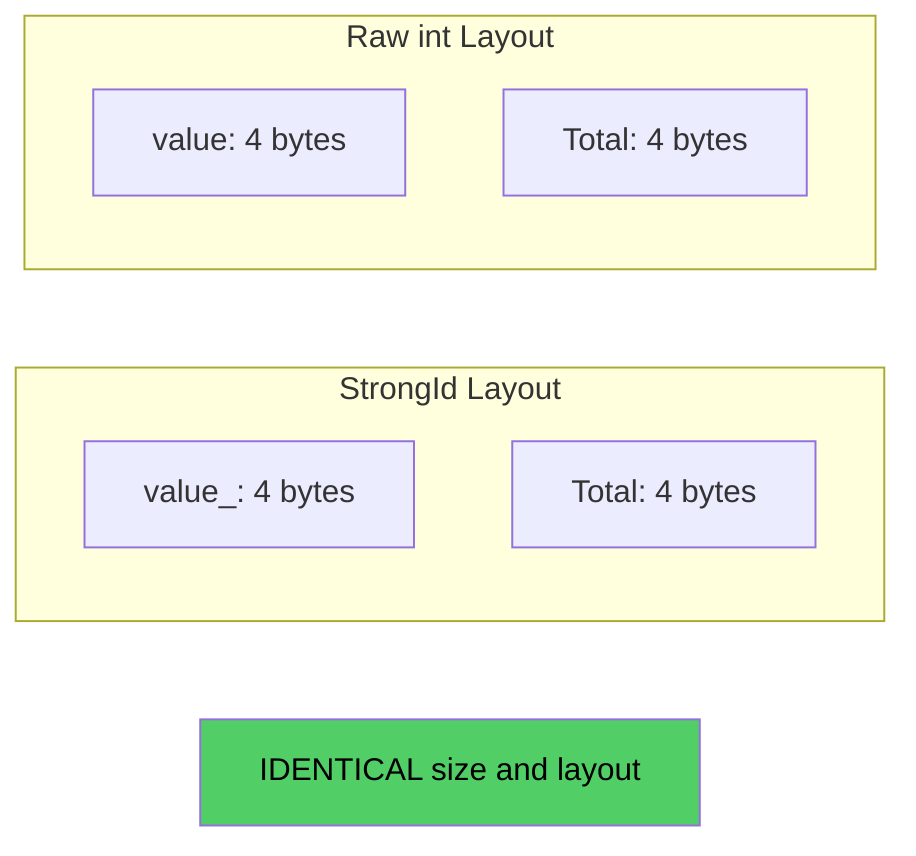

What happens to the wrapper in the compiled code? It vanishes. The generated assembly is identical to raw integer operations.

## Proving the Guarantee

We can verify this claim through benchmarking. The following table shows median times for one million operations, measured on Windows with MSVC 2022 at 3.7 GHz:

| Operation | StrongId (Unchecked) | Raw int | Ratio |
|-----------|---------------------|---------|-------|
| Construction | 0.09 ns | 0.09 ns | 1.00× |
| Comparison | 0.37 ns | 0.37 ns | 1.00× |
| Addition | 0.93 ns | 0.93 ns | 1.00× |
| Increment | 0.19 ns | 0.19 ns | 1.00× |
| Hash | 0.59 ns | 0.59 ns | 1.00× |

Every ratio is 1.00×. The wrapper adds exactly zero overhead. This isn't an accident or an optimization fluke. It's the predictable result of following C++'s zero-overhead principle: the wrapper contains no data the underlying type doesn't have, and all operations delegate directly to the underlying type's operations. There's nothing for the compiler to remove because there's nothing extra to begin with.

---

# **PART II — THE SOLUTIONS**

With the problems understood—type aliases that don't distinguish, enums that lack features, wrappers that seem costly—we can examine how StrongId addresses each one. The design combines three techniques: phantom types for compile-time distinction, careful layout for zero overhead, and policies for customizable behavior.

---

# **Chapter 5 — Phantom Types: Types That Don't Exist**

## The Haskell Insight

The technique at StrongId's core comes from functional programming. In Haskell, the `newtype` keyword creates a new type that wraps an existing one with zero runtime overhead:

```haskell
newtype CustomerId = CustomerId Int
newtype OrderId = OrderId Int
```

At compile time, `CustomerId` and `OrderId` are completely different types. The compiler tracks them separately, enforces their distinction, and rejects code that confuses them. But at runtime, both are represented as plain `Int`. The wrapper exists only during type checking; it's erased before code generation.

This is possible because the wrapper carries no additional information. It has the same size, the same representation, the same valid values as the underlying type. The "wrapping" is purely a compile-time concept—a way of giving the type checker more information without burdening the runtime.

Haskell calls these "phantom types" because the wrapper type doesn't appear in the runtime representation. It's there in the source code, verified by the compiler, and then it vanishes like a phantom.

## Translating to C++

C++ doesn't have `newtype`, but it has templates. We can achieve the same effect by parameterizing a wrapper class on a "tag" type that distinguishes instances:

```cpp
template <typename T, typename Tag>
class StrongId {
    T value_;
public:
    explicit constexpr StrongId(T v) : value_(v) {}
    constexpr T get() const noexcept { return value_; }
};
```

The `Tag` parameter appears in the class's type signature but not in its data members. It influences type checking—`StrongId<int, CustomerTag>` is a different type from `StrongId<int, OrderTag>`—but it adds nothing to the runtime representation.

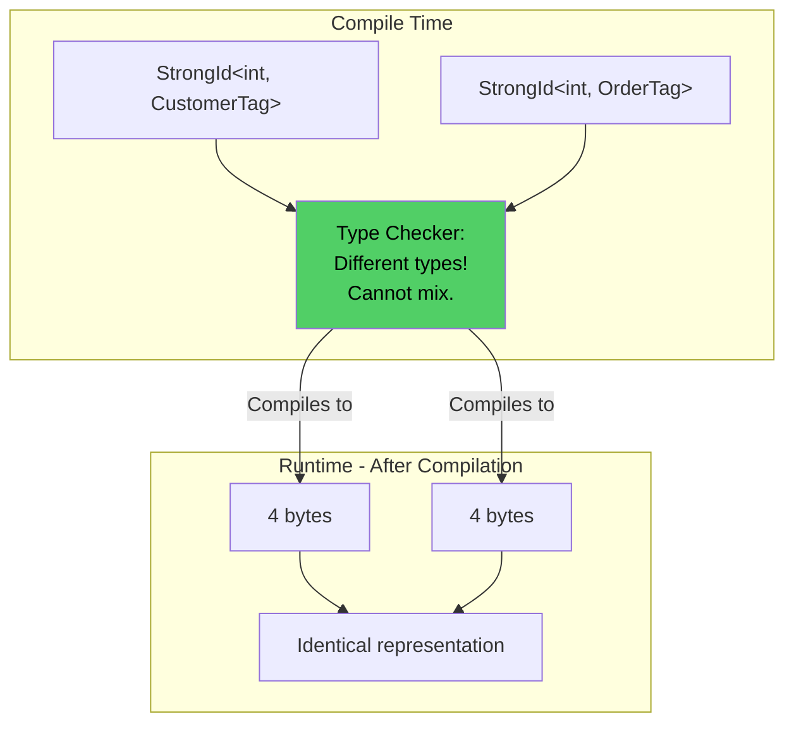

The tag types themselves are typically empty structs. Empty structs have size 1 in C++ (for addressability reasons), but they're never instantiated. The tag exists only as a type parameter. No memory is allocated for it. No code is generated for it. It's pure compile-time information.

## Creating Distinct ID Types

With the template defined, creating distinct ID types is a one-liner:

```cpp
struct CustomerTag {};
struct OrderTag {};

using CustomerId = StrongId<int, CustomerTag>;
using OrderId = StrongId<int, OrderTag>;
```

Now the compiler enforces distinction. The parameter swap that compiled silently with raw `int` is now a compilation error:

```cpp
void fulfill_order(CustomerId c, OrderId o, WarehouseId w, CarrierId r);

fulfill_order(customer, order, warehouse, carrier);  // OK
fulfill_order(order, customer, warehouse, carrier);  // Error: type mismatch
```

The bug is caught before the code ever runs.

---

# **Chapter 6 — The Zero-Overhead Guarantee**

## Stroustrup's Principle

Bjarne Stroustrup, C++'s creator, articulated the zero-overhead principle that guides the language's design:

> "What you don't use, you don't pay for. And further: What you do use, you couldn't hand code any better."

For StrongId, this principle means two things. First, the wrapper should add nothing to the underlying type's size or representation. Second, operations on the wrapper should compile to the same instructions as operations on the underlying type.

## Layout Guarantee

The wrapper contains exactly one data member. There's no virtual table pointer (no virtual functions). There's no type tag field (the tag is a template parameter, not runtime data). There's no padding beyond what `T` itself requires. The wrapper has the same size as `T`.

This guarantee is verified at compile time with `static_assert`. If you add members or inheritance that would change the size, the assertion fails. The guarantee is enforced, not just documented.

## Operation Guarantee

Every operation on StrongId delegates directly to the underlying type. Every function is `constexpr` (can be evaluated at compile time), `noexcept` (no exception handling overhead), and trivially simple (direct delegation). Modern compilers inline these unconditionally.

We can verify this by examining generated assembly. Consider comparing two customer IDs versus comparing two raw integers:

```cpp
bool compare_customers(CustomerId a, CustomerId b) {
    return a < b;
}

bool compare_ints(int a, int b) {
    return a < b;
}
```

Both compile to identical x86-64 assembly:

```asm
cmp     edi, esi
setl    al
ret
```

Three instructions. No function call. No indirection. The wrapper has completely vanished. This is the magic of phantom types: they exist for the type checker, then disappear for code generation. You get compile-time safety with runtime efficiency.

---

# **Chapter 7 — Policy-Based Validation**

## The Constraint Problem

IDs often have domain constraints. Database auto-increment IDs are positive. Array indices are non-negative. Port numbers are 0-65535. Month numbers are 1-12.

Catching invalid values at construction is better than debugging them deep in business logic. If a `PositiveId` can only hold positive values, constructing one with -1 should fail immediately, not silently create a time bomb.

But different ID types have different constraints. Hardcoding validation into StrongId would force one policy on all users. Making validation a runtime option would add overhead. The solution is compile-time policy selection.

## The Policy Pattern

StrongId's third template parameter specifies validation behavior:

```cpp
template <typename T, typename Tag, 
          typename CheckPolicy = NoCheckPolicy,  // Validation policy
          template<typename> class OpPolicy = DefaultOpPolicy>
class StrongId;
```

A CheckPolicy is a type with a static `check` method. The constructor calls this method, and the policy either accepts the value silently or throws an exception.

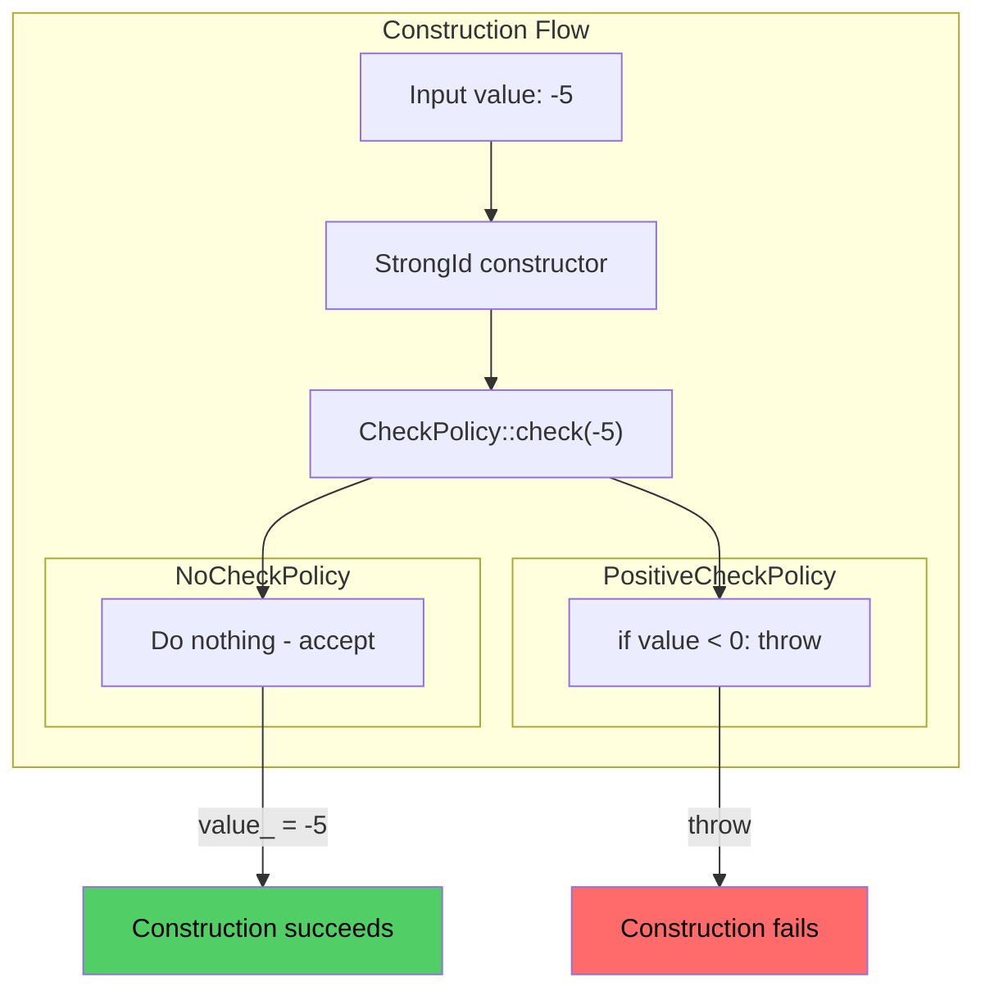

## Compile-Time Policy Resolution

The key insight is that policy selection happens at compile time. When you define a type with `PositiveCheckPolicy`, the compiler generates a `StrongId` class with the check baked in. There's no virtual dispatch, no function pointer, no runtime policy object. The check is inlined directly into the constructor.

When the policy is `NoCheckPolicy`, the check call compiles to nothing. An empty function that takes no action and is marked `noexcept` and `constexpr` is eliminated entirely. The validation overhead for `NoCheckPolicy` is exactly zero.

StrongId provides several standard policies: `NoCheckPolicy` (default, accepts any value), `PositiveCheckPolicy` (requires value ≥ 0), `StrictlyPositiveCheckPolicy` (requires value > 0), `NonZeroCheckPolicy` (requires value ≠ 0), and `RangeCheckPolicy<Min, Max>` (requires Min ≤ value ≤ Max).

---

# **Chapter 8 — Policy-Based Arithmetic**

## The Overflow Problem

Integer overflow is undefined behavior in C++. On most systems, signed overflow wraps around (INT_MAX + 1 becomes INT_MIN), but compilers are allowed to assume it never happens. They can optimize based on that assumption, leading to surprising behavior.

For ID arithmetic—incrementing counters, computing offsets—overflow often indicates a bug. An ID generator that wraps from INT_MAX to a negative number has probably gone wrong somewhere.

But overflow checking has costs. Every addition requires checking whether the result exceeds the type's range. Every increment requires comparing against the maximum. These checks add instructions and can prevent certain optimizations.

Different applications need different tradeoffs. A counter that processes 50,000 IDs per second might overflow in a day; checking is worthwhile. A tight inner loop computing array indices might never overflow; checking is pure overhead.

## The Second Policy

StrongId's fourth template parameter specifies arithmetic behavior. `DefaultOpPolicy` performs checked arithmetic—it throws on overflow. `UncheckedOpPolicy` performs raw arithmetic—same as raw integers, with the same undefined behavior on overflow.

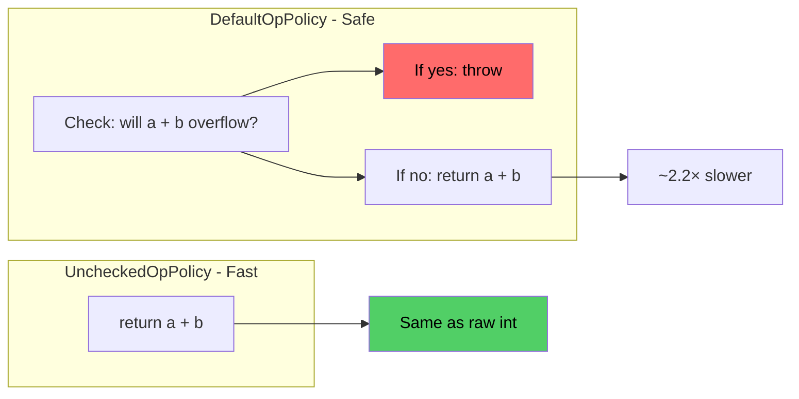

The 2.2× slowdown for checked addition reflects the cost of overflow detection—the comparison, the branch, the potential exception setup. But this is a *choice*, not a tax. Hot paths that can't overflow use `UncheckedOpPolicy`. Boundary code that receives external input uses `DefaultOpPolicy`. The policy composes orthogonally with validation.

---

# **Chapter 9 — The Atomic Extension**

## The Counter Problem

ID generators need thread-safe counters. The naive approach has a data race—if two threads call `generate()` simultaneously, both might read the same value, increment it, and return the same ID.

The standard fix is `std::atomic<int>`. But now the generator returns raw `int`. The type safety we carefully constructed has been lost. We can't write `std::atomic<CustomerId>` in a way that preserves the type distinction.

## AtomicStrongId

StrongId provides `AtomicStrongId` to preserve type safety in concurrent code. The atomic wraps the underlying type `T`, but the interface works with `StrongId`. Type safety is preserved at the API boundary:

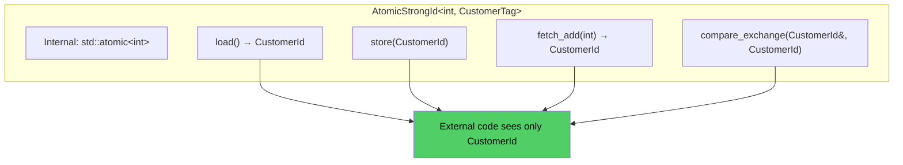

A thread-safe ID generator preserves type safety:

```cpp
class CustomerIdGenerator {
    AtomicStrongId<int, CustomerTag> next_id_{CustomerId{1}};
public:
    CustomerId generate() {
        return next_id_.fetch_add(1);  // Returns CustomerId, not int
    }
};
```

The generator returns `CustomerId`. Callers can't accidentally use the value as an `OrderId`. Thread safety and type safety coexist.

---

# **PART III — DESIGN DECISIONS**

The previous chapters explained what StrongId does. This part explains why it makes specific choices that might not be obvious—explicit construction, no implicit conversion, policies over inheritance. Each decision involves tradeoffs that favor safety over convenience.

---

# **Chapter 10 — Why Explicit Construction**

The `explicit` keyword on StrongId's constructor prevents implicit conversion from the underlying type. You cannot write `CustomerId customer = 42;`. You must write `CustomerId customer{42};`.

Why require the extra syntax?

Consider what implicit construction would allow:

```cpp
void process(CustomerId customer);

process(42);             // Any int becomes a CustomerId
process(get_order_id()); // Any int becomes a CustomerId
```

Any `int` could silently become a `CustomerId`. The type safety we constructed would have a gaping hole. A function expecting `CustomerId` would accept any integer expression without complaint.

Explicit construction forces the programmer to write the type name. The mistake `process(CustomerId{get_order_id()})` is still possible—it wraps an order ID in a customer ID wrapper—but now the mistake is visible. Code review can spot it. The programmer must consciously write `CustomerId`, which prompts thinking about whether the value is actually a customer ID.

Explicit construction is a speed bump, not a wall. Determined programmers can still make mistakes. But the speed bump catches casual errors and makes intentional conversions visible.

---

# **Chapter 11 — Why No Implicit Conversion**

StrongId provides `get()` but not an implicit conversion operator. You cannot write `int raw = customer;`. You must write `int raw = customer.get();`.

Why not allow implicit conversion out?

Implicit conversion in both directions would re-enable the confusion that StrongId prevents:

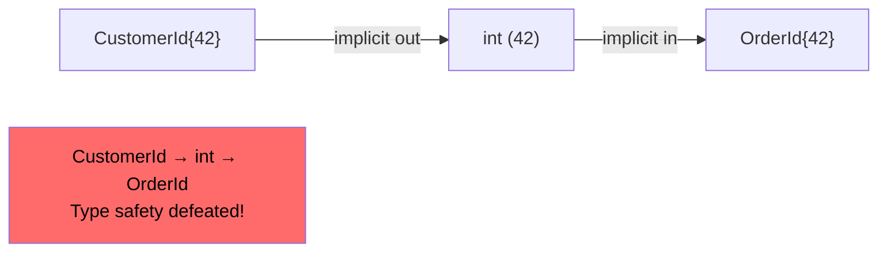

A value could flow from `CustomerId` through `int` to `OrderId` via two implicit conversions. The compiler would accept it. The types would be "distinct" in name only.

Requiring explicit `get()` breaks this chain. Every extraction from a strong ID is visible and intentional. Code that works with raw integers must explicitly acknowledge that it's leaving the type-safe world.

---

# **Chapter 12 — Why Policies Over Inheritance**

StrongId uses policies (template parameters) rather than inheritance for customization. An inheritance-based design would use virtual functions for validation and arithmetic, but this has problems:

**Virtual dispatch overhead.** Every construction calls `validate()` through the vtable. Every arithmetic operation calls through the vtable. The zero-overhead guarantee is impossible.

**Size overhead.** The virtual table pointer adds 8 bytes to every instance.

**Composition limitations.** How do you create a type with positive validation but unchecked arithmetic? You'd need a new class that inherits from... what? The combinations multiply into a class hierarchy explosion.

Policies solve all three problems. Policies are template parameters resolved at compile time. The generated code inlines the policy's methods directly—no vtable, no indirection. Policies are types, not objects—they have no runtime representation. And policies compose independently: validation policy × arithmetic policy = 4 combinations from 2 policies, each just a template instantiation.

---

# **PART IV — IN PRACTICE**

Theory is valuable, but practice is convincing. These case studies show StrongId preventing real bugs in realistic scenarios.

---

# **Chapter 13 — Case Study: Trading System ID Mixup**

## The Scenario

A high-frequency trading system processes orders with multiple ID types. Each order has an account ID, an instrument ID, an order ID, and an execution ID. The system has been running for years—audited, tested, and hardened. Then one day, it starts executing orders for the wrong accounts.

## The Investigation

The bug was introduced in a routine refactor. A developer reorganized a struct to group related fields. The struct reordering was intentional, but some call sites weren't updated. A function that expected `(account, instrument, order)` received `(order, account, instrument)`. All three are `int`. The compiler saw nothing wrong.

## The Damage

For two days, orders were submitted with scrambled IDs. Some failed at the exchange (invalid instrument). Some succeeded but for the wrong accounts. Total cost: $2.3 million in incorrectly executed trades, plus regulatory scrutiny, plus engineering time, plus reputation damage.

## The Fix

Strong typing made the scrambled call site fail to compile:

```cpp
using AccountId = StrongId<int, AccountTag>;
using InstrumentId = StrongId<int, InstrumentTag>;
using OrderId = StrongId<int, OrderTag>;

void submit_to_exchange(AccountId account, InstrumentId instrument, OrderId order);
```

The bug is now impossible to introduce. The $2.3 million loss is prevented by a compile error.

---

# **Chapter 14 — Case Study: Multi-Tenant Database**

## The Scenario

A SaaS platform stores data for thousands of tenants in a shared database. Every query must filter by tenant ID to ensure data isolation. A customer must never see another customer's data.

## The Bug

A junior engineer added a feature to export order history. The function parameters were `(user_id, tenant_id)`. The query placeholders were in the same order. But the arguments to `db.query` were reversed.

The query returned orders where the user ID matched the tenant ID and vice versa. For most requests, this returned nothing. But occasionally, by coincidence, the IDs aligned. A user in tenant 100 with user ID 100 would see orders from a different tenant 100 user 100.

## The Prevention

Strong typing at the database layer:

```cpp
using UserId = StrongId<int, UserTag>;
using TenantId = StrongId<int, TenantTag>;

template <typename T>
std::vector<T> query(std::string_view sql, UserId user, TenantId tenant);
```

The swapped arguments fail to compile. The data breach is prevented.

---

# **Appendix A — A Brief History of Strong Typing**

The ML family of languages, developed in the 1970s at the University of Edinburgh, introduced the ability to create new types cheaply. Haskell refined this in the 1990s with `newtype`, which specifically created zero-overhead wrappers.

C++ had templates, which enabled similar patterns, but no standard solution emerged. Various approaches were tried: `BOOST_STRONG_TYPEDEF` (macro-based), manual wrappers, `enum class`. Modern libraries like fluent::NamedType, type_safe, and strong::type filled different niches.

StrongId synthesizes ideas from these predecessors while prioritizing zero overhead, built-in validation, and Expected integration.

---

# **Appendix B — Competitor Analysis**

**fluent::NamedType:** Comprehensive strong typing with skills-based customization. Best for projects needing extensive strong typing beyond IDs.

**ts::strong_typedef (type_safe):** Part of a larger type safety library with dimensional analysis. Best for projects needing quantities with units.

**strong::type (rollbear):** Mix-in based customization. Has 2.11× construction overhead in benchmarks.

**BOOST_STRONG_TYPEDEF:** Macro-based, mature, but no validation or Expected integration.

**FAT-P StrongId:** Zero overhead, built-in policies, Expected integration, zero dependencies. Best for ID-focused type safety.

---

# **Appendix C — Where StrongId Loses**

**C++17 Requirement:** Projects on C++11/14 cannot use StrongId.

**No Dimensional Analysis:** For quantities with units, use type_safe or mp-units.

**No Runtime Type Information:** Cannot dynamically determine which ID type a value is.

**Explicit Boundary Friction:** Every serialization/database call needs `.get()`.

---

*StrongId.h — Fat-P Library v3.2*
