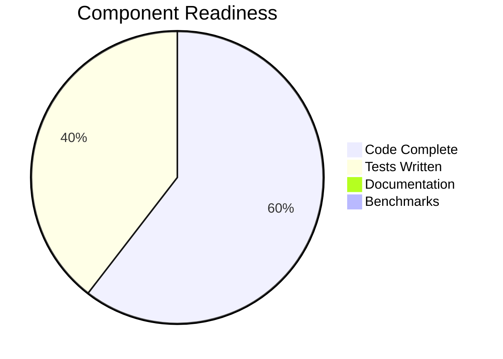
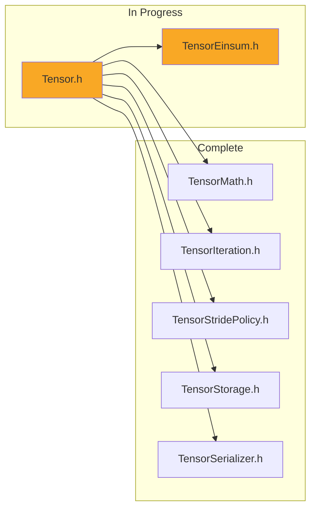
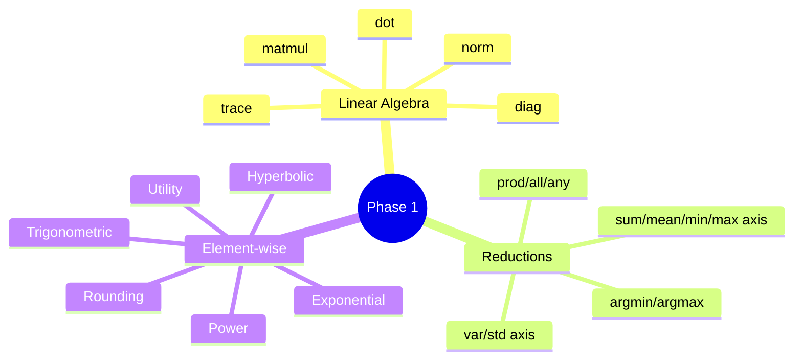
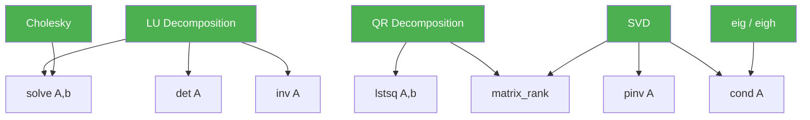
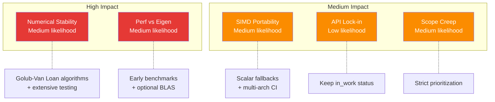
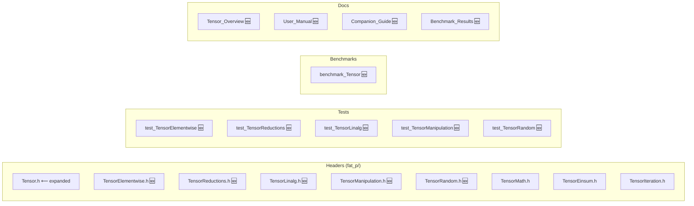

# FAT-P TENSOR COMPONENT

**Completion Report and Implementation Plan**
**Version 1.0 — January 17, 2026**

> Component Status: `api_stability: in_work`

---

## 1. Executive Summary

The FAT-P Tensor component is a substantial work-in-progress with solid architectural foundations but significant gaps in functionality compared to production tensor libraries like Eigen, xtensor, or NumPy.

**Key Findings:**

- ~6,500 lines of code across 7 header files
- ~4,250 lines of tests across 6 test files
- Zero documentation (only TensorStridePolicy has docs)
- Zero benchmarks (performance claims are untested)
- Strong foundations: SIMD, expression templates, broadcasting, safety features
- Critical gaps: No linear algebra, limited reductions, no shape manipulation

**Estimated Completion Effort:** 12–16 weeks for full production readiness



---

## 2. Current State Analysis

### 2.1 File Inventory

| File | Lines | Purpose | Status |
|------|------:|---------|--------|
| Tensor.h | 2,941 | Dynamic N-D tensor with SIMD | Core complete, missing operations |
| TensorMath.h | 811 | Static compile-time tensors | Feature complete |
| TensorEinsum.h | 452 | Einstein notation | Limited patterns only |
| TensorIteration.h | 491 | N-D iteration helpers | Complete |
| TensorStridePolicy.h | 825 | Stride-aware iteration | Complete |
| TensorStorage.h | 495 | Lock-free reference counting | Complete |
| TensorSerializer.h | 478 | JSON/Binary serialization | Complete |



### 2.2 Existing Capabilities

**Dynamic Tensor (`Tensor<T>`)**

- **Construction & Memory:** SIMD-aligned allocation (64-byte), shared ownership, overflow-safe
- **Element Access:** Variadic indexing, linear indexing, bounds-checked `at()`
- **Views & Slicing:** `view()`, `row()`, `col()`, `reshape()`, `transpose()`
- **Arithmetic:** Element-wise +, -, * with AVX2 SIMD, expression templates
- **Reductions:** `sum()`, `mean()`, `min()`, `max()` — full tensor only
- **Broadcasting:** NumPy-style shape compatibility
- **Parallel:** Auto-parallel for tensors > 10,000 elements
- **Safety:** View lifetime tracking, RCU concurrency, contract exceptions

---

## 3. Gap Analysis

### 3.1 Missing Operations vs Competitors

| Category | Missing Operations | Priority |
|----------|-------------------|----------|
| Linear Algebra | `matmul()`, `solve()`, `inv()`, `det()`, `svd()`, `eig()`, `qr()`, `lu()`, `cholesky()` | CRITICAL |
| Axis Reductions | `sum(axis)`, `mean(axis)`, `std()`, `var()`, `argmax()`, `argmin()` | CRITICAL |
| Element-wise Math | `exp()`, `log()`, `sqrt()`, `sin()`, `cos()`, `abs()`, `clip()`, `relu()` | CRITICAL |
| Shape Manipulation | `squeeze()`, `unsqueeze()`, `concatenate()`, `stack()`, `split()`, `pad()` | HIGH |
| Comparison Ops | `==`, `<`, `>` returning boolean tensors, `where()`, `isclose()` | HIGH |
| Advanced Indexing | `gather()`, `scatter()`, boolean masking, `nonzero()` | MEDIUM |
| Sorting | `sort()`, `argsort()`, `unique()` | LOW |
| Random | `uniform()`, `normal()`, `randint()`, `shuffle()` | LOW |

### 3.2 Comparison Summary

| Feature Area | Eigen | NumPy | xtensor | FAT-P Tensor |
|-------------|-------|-------|---------|-------------|
| Matrix Multiply | `A * B` | `@` operator | `dot()` | einsum only |
| Solve Ax=b | `A.solve(b)` | `linalg.solve()` | `linalg::solve()` | **MISSING** |
| SVD/Eigenvalues | Full support | Full support | Full support | **MISSING** |
| Axis Reductions | `rowwise()`/`colwise()` | `axis=` parameter | Full support | **MISSING** |
| Element Math | Full support | Full support | Full support | **MISSING** |
| Broadcasting | Limited | Full | Full | Full |
| Expression Templates | Full | N/A | Full | Full |
| SIMD Optimization | Full | Via NumPy | Via xtensor | AVX2 only |

```mermaid
quadrantChart
    title Feature Coverage vs Competitors
    x-axis "Low Coverage" --> "Full Coverage"
    y-axis "Low Priority" --> "Critical Priority"
    Broadcasting: [0.95, 0.5]
    Expression Templates: [0.95, 0.6]
    SIMD: [0.6, 0.7]
    Element Math: [0.05, 0.9]
    Axis Reductions: [0.05, 0.95]
    Linear Algebra: [0.02, 1.0]
    Shape Manipulation: [0.1, 0.75]
    Advanced Indexing: [0.05, 0.4]
```

---

## 4. Implementation Plan

### 4.1 Phase Overview

```mermaid
gantt
    title Implementation Timeline (12–16 weeks)
    dateFormat  X
    axisFormat  Week %s

    section Phase 1
    Core Math Operations        :p1, 0, 4
    section Phase 2
    Shape Manipulation          :p2, 4, 7
    section Phase 3
    Linear Algebra              :p3, 7, 11
    section Phase 4
    Advanced Features           :p4, 11, 14
    section Phase 5
    Documentation & Benchmarks  :p5, 14, 16
```



| Phase | Duration | Focus | Deliverables |
|-------|----------|-------|-------------|
| Phase 1 | 3–4 weeks | Core Math Operations | Axis reductions, element-wise math, matmul, norm, comparisons |
| Phase 2 | 2–3 weeks | Shape Manipulation | squeeze, unsqueeze, concatenate, stack, pad, flip |
| Phase 3 | 3–4 weeks | Linear Algebra | solve, inv, det, LU, QR, Cholesky, SVD, eigenvalues |
| Phase 4 | 2–3 weeks | Advanced Features | Boolean indexing, gather/scatter, sorting, random |
| Phase 5 | 2 weeks | Documentation & Benchmarks | Full documentation suite, benchmark comparisons |

### 4.2 Phase 1: Core Mathematical Operations

**Goal:** Make Tensor usable for basic numerical computing.

#### 4.2.1 Direct Linear Algebra Methods

- `matmul(other)` — Matrix multiplication with SIMD optimization
- `dot(other)` — Dot product for 1D tensors
- `norm(order)` — L1, L2, Linf, Frobenius norms
- `trace()` — Matrix trace
- `diag()` — Diagonal extraction/creation

#### 4.2.2 Axis-wise Reductions

- `sum(axis)`, `mean(axis)`, `min(axis)`, `max(axis)`
- `var(axis)`, `std(axis)` — Variance and standard deviation
- `argmin(axis)`, `argmax(axis)` — Index of extrema
- `prod(axis)`, `all(axis)`, `any(axis)`

#### 4.2.3 Element-wise Mathematical Functions

- **Exponential:** `exp()`, `log()`, `log10()`, `log2()`, `expm1()`, `log1p()`
- **Power:** `sqrt()`, `cbrt()`, `pow()`, `square()`
- **Trigonometric:** `sin()`, `cos()`, `tan()`, `asin()`, `acos()`, `atan()`, `atan2()`
- **Hyperbolic:** `sinh()`, `cosh()`, `tanh()`
- **Rounding:** `floor()`, `ceil()`, `round()`, `trunc()`
- **Utility:** `abs()`, `sign()`, `clip()`, `relu()`



### 4.3 Phase 2: Shape Manipulation

**Goal:** Provide flexible tensor reshaping and combination operations.

| Function | Description | NumPy Equivalent |
|----------|-------------|-----------------|
| `squeeze()` | Remove dimensions of size 1 | `np.squeeze()` |
| `unsqueeze(axis)` | Add dimension of size 1 | `np.expand_dims()` |
| `flatten()` | Flatten to 1D | `np.ravel()` |
| `concatenate(tensors, axis)` | Join along existing axis | `np.concatenate()` |
| `stack(tensors, axis)` | Join along new axis | `np.stack()` |
| `split(n, axis)` | Split into n equal parts | `np.split()` |
| `tile(reps)` | Repeat tensor | `np.tile()` |
| `pad(widths, mode)` | Pad with values | `np.pad()` |
| `flip(axis)` | Reverse along axis | `np.flip()` |
| `rot90(k)` | Rotate 90 degrees | `np.rot90()` |

### 4.4 Phase 3: Linear Algebra

**Goal:** Provide essential linear algebra operations for scientific computing.

**Decompositions:**

| Function | Returns | Use Case |
|----------|---------|----------|
| `lu(A)` | L, U, piv, sign | General linear systems |
| `qr(A)` | Q, R | Least squares, orthogonalization |
| `cholesky(A)` | L where A = LL^T | Positive-definite systems |
| `svd(A)` | U, S, Vh | Dimensionality reduction, pseudoinverse |
| `eig(A)` | eigenvalues, eigenvectors | General eigenproblems |
| `eigh(A)` | eigenvalues, eigenvectors (real) | Symmetric matrices |

**Solvers:**

| Function | Description |
|----------|-------------|
| `solve(A, b)` | Solve Ax = b for well-conditioned A |
| `lstsq(A, b)` | Least squares solution for overdetermined systems |
| `inv(A)` | Matrix inverse (with numerical stability warnings) |
| `pinv(A)` | Moore-Penrose pseudoinverse |
| `det(A)` | Determinant |
| `matrix_rank(A)` | Numerical rank |
| `cond(A)` | Condition number |



### 4.5 Phase 4: Advanced Features

**Advanced Indexing:**
`where(condition, x, y)`, `masked_select(tensor, mask)`, `nonzero(condition)`, `gather(tensor, indices, axis)`, `scatter(tensor, indices, values, axis)`

**Sorting:**
`sort(axis)`, `argsort(axis)`, `unique()`

**Random Number Generation:**
`uniform(shape, low, high)`, `normal(shape, mean, std)`, `randint(shape, low, high)`, `permutation(n)`, `shuffle(tensor, axis)`

### 4.6 Phase 5: Documentation & Benchmarks

**Documentation Deliverables:**

| Document | Purpose |
|----------|---------|
| Tensor_Overview.md | Decision guide: when to use Tensor vs alternatives |
| Tensor_User_Manual.md | Comprehensive API reference with examples |
| Companion Guide - Tensor.md | Design rationale, performance characteristics |
| TensorMath_Overview.md | Static vs dynamic tensor choice guide |
| Tensor_Benchmark_Results.md | Performance comparison with Eigen, xtensor |

**Benchmark Categories:**

- Element-wise operations: Add/sub/mul at various sizes, SIMD vs scalar
- Reductions: Full tensor and axis-wise, compare with Eigen/xtensor
- Matrix multiplication: Square and rectangular, batch matmul
- Linear algebra: `solve()`, SVD, QR decomposition timing
- Memory operations: View creation, reshape, copy vs view

---

## 5. Priority Matrix

Features ranked by impact and effort:

| Feature | Impact | Effort | Priority | Phase |
|---------|--------|--------|:--------:|:-----:|
| Axis-wise reductions | Critical | Medium | 10 | 1 |
| Element-wise math | Critical | Medium | 10 | 1 |
| Documentation | Critical | Medium | 10 | 5 |
| Direct `matmul()` | High | Low | 9 | 1 |
| `norm()` function | High | Low | 9 | 1 |
| `solve()` | Critical | High | 9 | 3 |
| Comparison operators | High | Low | 9 | 1 |
| `concatenate`/`stack` | High | Medium | 8 | 2 |
| `squeeze`/`unsqueeze` | High | Low | 8 | 2 |
| Benchmarks | High | Medium | 8 | 5 |
| `argmax`/`argmin` | High | Medium | 8 | 1 |
| `std`/`var` | Medium | Low | 7 | 1 |
| `inv()` | High | Medium | 7 | 3 |
| Boolean indexing | Medium | Medium | 6 | 4 |
| Random generation | Medium | Medium | 6 | 4 |
| SVD/eig | Medium | High | 5 | 3 |
| `sort`/`argsort` | Low | Medium | 4 | 4 |

---

## 6. Timeline and Milestones

| Milestone | Week | Deliverables | Success Criteria |
|-----------|:----:|-------------|-----------------|
| Phase 1 Complete | 4 | Core math operations | Tensor usable for basic numerical computing |
| Phase 2 Complete | 7 | Shape manipulation | Full reshape/combine capabilities |
| Phase 3 Complete | 11 | Linear algebra | `solve()`, `inv()`, decompositions working |
| Phase 4 Complete | 14 | Advanced features | Feature parity with core NumPy |
| Phase 5 Complete | 16 | Documentation & benchmarks | Ready for `api_stability: stable` |

### 6.1 Success Criteria Details

**Phase 1 Complete When:**

- `sum(axis)`, `mean(axis)` work correctly for all axis values including negative
- `exp`, `log`, `sqrt`, `sin`, `cos`, `abs` available and SIMD-optimized
- `matmul()` beats naive triple-loop by 3x+ for 256×256 matrices
- All new operations have unit tests with >90% branch coverage

**Phase 3 Complete When:**

- `solve(A, b)` produces correct results for well-conditioned systems
- `inv(A)` matches NumPy/Eigen output within 1e-10 for test matrices
- Decompositions (LU, QR, SVD) pass standard test matrices

**Phase 5 Complete When:**

- Overview document explains when to use Tensor vs alternatives
- User Manual documents every public function with examples
- Benchmark suite covers all major operations
- Performance comparison with Eigen published
- `api_stability` can be changed to `stable`

---

## 7. Risk Assessment

| Risk | Likelihood | Impact | Mitigation |
|------|-----------|--------|-----------|
| Linear algebra numerical stability | Medium | High | Use established algorithms (Golub-Van Loan); extensive testing |
| SIMD portability (ARM, older x86) | Medium | Medium | Scalar fallbacks for all SIMD paths; CI testing on multiple architectures |
| Performance not competitive with Eigen | Medium | High | Benchmark early and often; consider optional BLAS integration |
| API design lock-in | Low | Medium | Mark as `in_work` until Phase 5 complete |
| Scope creep | Medium | Medium | Strict prioritization; defer advanced features to future versions |



---

## 8. Final File Structure

After completion, the Tensor component will consist of:

**Header Files (`fat_p/`):**
`Tensor.h` (expanded), `TensorElementwise.h` (NEW), `TensorReductions.h` (NEW), `TensorLinalg.h` (NEW), `TensorManipulation.h` (NEW), `TensorRandom.h` (NEW), plus existing `TensorMath.h`, `TensorEinsum.h`, `TensorIteration.h`, etc.

**Test Files (`tests/`):**
`test_TensorElementwise.cpp`, `test_TensorReductions.cpp`, `test_TensorLinalg.cpp`, `test_TensorManipulation.cpp`, `test_TensorRandom.cpp` (all NEW)

**Benchmarks:**
`benchmark_Tensor.cpp` (NEW) — comprehensive benchmarks

**Documentation:**
`Documentation/Tensor/` — NEW directory with 5+ documents



---

## 9. Recommendations

### Immediate Next Steps

1. Review and approve this plan
2. Begin Phase 1 implementation with axis-wise reductions
3. Set up benchmark infrastructure early to track progress
4. Schedule documentation writing in parallel with Phase 3–4

### Design Decisions Required

- Whether to support optional BLAS/LAPACK backend for linear algebra
- Extent of AVX-512/AVX10 optimization vs AVX2-only
- Whether to unify `StaticTensor` and dynamic `Tensor` APIs
- GPU/CUDA support roadmap (if any)

---

*End of Report*
