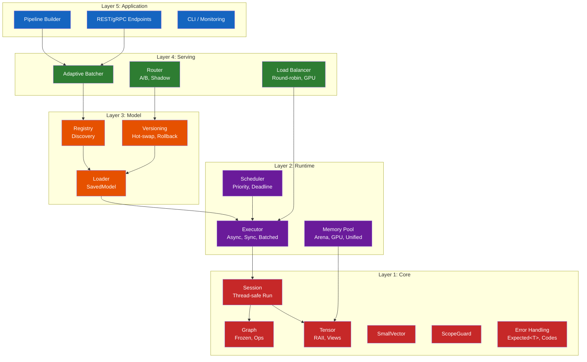
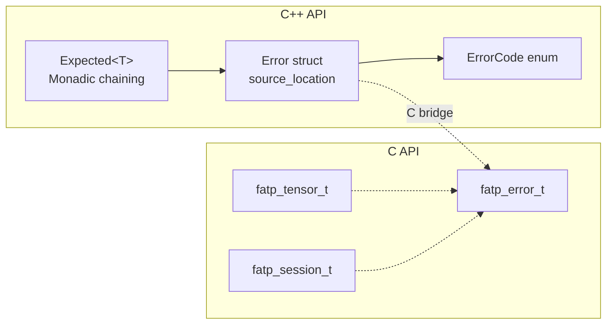
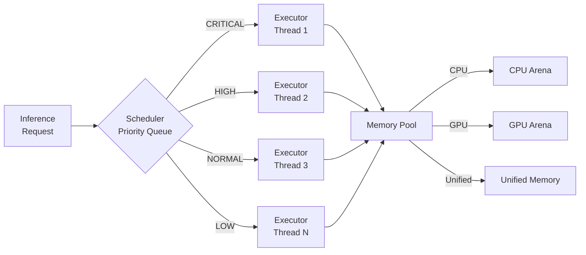
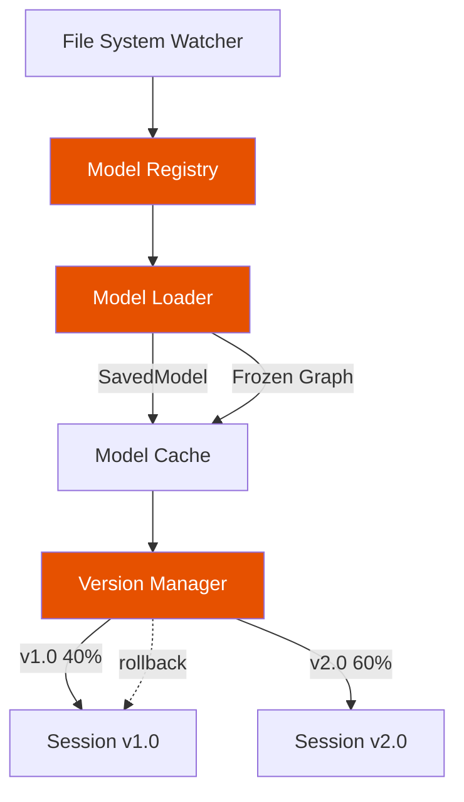
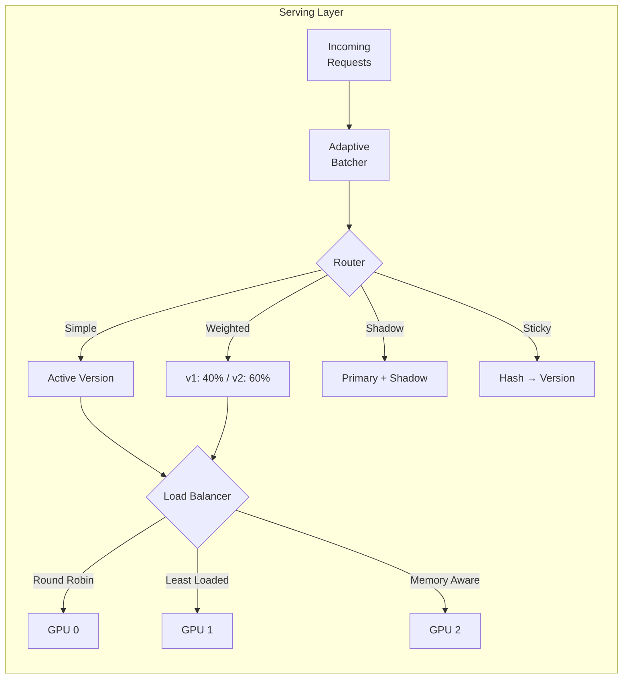
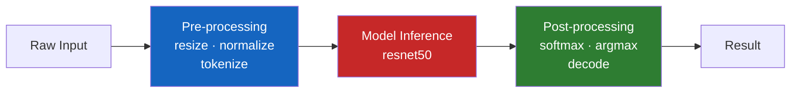

# FatPTensorFlowFramework

**Production ML Inference Framework**
**Technical Design & Implementation Plan**
**Version 1.0 — January 2026**

---

## Executive Summary

FatPTensorFlowFramework is a production-grade C++20 machine learning inference framework built on TensorFlow. It combines the lightweight TensorFlowWrap foundation with enterprise features for model management, serving, and operations.

The framework targets organizations that need high-performance ML inference without the operational complexity of Python-based serving solutions. It provides a native C++ solution that integrates directly into existing infrastructure.

### Key Differentiators

- **Zero-copy tensor pipelines:** Data flows from ingestion to inference without copying
- **Sub-millisecond latency:** Optimized for real-time inference at scale
- **Native C++ integration:** No Python runtime, no GIL, no serialization overhead
- **Production-ready:** Built-in observability, error handling, and resource management
- **Hardware-aware:** Automatic GPU memory management and multi-device scheduling

### Target Use Cases

- High-frequency trading ML models
- Real-time recommendation systems
- Edge deployment with resource constraints
- Embedded systems requiring deterministic latency
- Legacy C/C++ systems adding ML capabilities

---

## Architecture Overview

### Layer Model

The framework is organized into five layers, each building on the one below:

| Layer | Components | Responsibility |
|-------|-----------|---------------|
| 5. Application | Pipelines, Endpoints, CLI | User-facing APIs and tools |
| 4. Serving | Batcher, Router, LoadBalancer | Request handling and routing |
| 3. Model | Registry, Loader, Versioning | Model lifecycle management |
| 2. Runtime | Executor, Scheduler, MemoryPool | Execution and resources |
| 1. Core | Tensor, Graph, Session, Ops | TensorFlow C API wrapper |



---

## Layer 1: Core

The Core layer is the existing TensorFlowWrap library, enhanced with C-compatible error handling.

### 1.1 Existing Components (TensorFlowWrap)

| Component | Description | Status |
|-----------|-------------|--------|
| Tensor | RAII wrapper with type-safe views, zero-copy slicing | ✓ Complete, tested |
| Graph | Immutable graph with op builders, GraphDef import/export | ✓ Complete, tested |
| Session | Thread-safe `Run()`, SavedModel loading | ✓ Complete, tested |
| SmallVector | Stack-optimized vector (2x faster for small N) | ✓ Complete, tested |
| ScopeGuard | Exception-safe cleanup, integrated into Graph/Session | ✓ Complete, tested |
| 160+ Ops | Type-safe wrappers for TensorFlow operations | ✓ Complete, tested |

### 1.2 New: Error Handling System

Add C-compatible error handling for integration with C codebases and `-fno-exceptions` builds.

#### error.hpp

```cpp
namespace fatp::tf {

enum class ErrorCode : int32_t {
    OK = 0,
    INVALID_ARGUMENT = 1,
    OUT_OF_RANGE = 2,
    OUT_OF_MEMORY = 3,
    FAILED_PRECONDITION = 4,
    INTERNAL = 5,
    TENSORFLOW_ERROR = 6,
    MODEL_NOT_FOUND = 7,
    TIMEOUT = 8,
    CANCELLED = 9,
};

struct Error {
    ErrorCode code = ErrorCode::OK;
    char message[256] = {0};
    char source_file[64] = {0};
    int32_t source_line = 0;

    explicit operator bool() const { return code != ErrorCode::OK; }
    static Error ok() { return {}; }
    static Error make(ErrorCode c, const char* msg,
        std::source_location loc = std::source_location::current());
};

template<class T>
class Expected {
public:
    bool has_value() const;
    T& value() &;              // throws if error
    T value_or(T default_val); // returns default if error
    const Error& error() const;

    template<class F> auto and_then(F&& f) -> Expected<...>;
    template<class F> auto or_else(F&& f) -> Expected<T>;
};

} // namespace fatp::tf
```

#### C API (`c_api.h`)

```c
#ifdef __cplusplus
extern "C" {
#endif

typedef struct fatp_error_t {
    int32_t code;
    char message[256];
} fatp_error_t;

typedef struct fatp_tensor_t fatp_tensor_t;
typedef struct fatp_session_t fatp_session_t;

fatp_tensor_t* fatp_tensor_create_float(
    const int64_t* dims, int ndims,
    const float* data, size_t data_len,
    fatp_error_t* error);

void fatp_tensor_destroy(fatp_tensor_t* tensor);

fatp_session_t* fatp_session_load(
    const char* saved_model_path,
    fatp_error_t* error);

#ifdef __cplusplus
}
#endif
```



---

## Layer 2: Runtime

The Runtime layer manages execution, scheduling, and memory resources.

### 2.1 Memory Pool

Pre-allocated memory arenas to eliminate allocation overhead during inference.

**Design Goals:**
- **Zero allocations on hot path:** All tensor memory from pre-allocated pools
- **GPU-aware:** Separate pools for CPU, GPU, and unified memory
- **Thread-safe:** Lock-free allocation for common sizes
- **Fragmentation-resistant:** Slab allocator with size classes

#### memory_pool.hpp

```cpp
namespace fatp::tf {

enum class MemoryType { CPU, GPU, UNIFIED };

class MemoryPool {
public:
    struct Config {
        size_t initial_size = 256 * 1024 * 1024;  // 256 MB
        size_t max_size = 4ULL * 1024 * 1024 * 1024;  // 4 GB
        MemoryType type = MemoryType::CPU;
        int gpu_device = 0;
    };

    explicit MemoryPool(const Config& config);

    void* allocate(size_t size, size_t alignment = 64);
    void deallocate(void* ptr, size_t size);

    Tensor allocate_tensor(TF_DataType dtype,
        std::span<const int64_t> shape);

    size_t bytes_allocated() const;
    size_t bytes_available() const;
    size_t allocation_count() const;
};

MemoryPool& cpu_pool();
MemoryPool& gpu_pool(int device = 0);

} // namespace fatp::tf
```

### 2.2 Executor

Manages inference execution with support for synchronous, asynchronous, and batched modes.

#### executor.hpp

```cpp
namespace fatp::tf {

class Executor {
public:
    struct Config {
        int num_threads = std::thread::hardware_concurrency();
        bool enable_gpu = true;
        size_t max_batch_size = 32;
        std::chrono::microseconds batch_timeout{1000};
    };

    Expected<std::vector<Tensor>> run(
        Session& session,
        std::span<const std::pair<std::string, Tensor>> inputs,
        std::span<const std::string> output_names);

    std::future<Expected<std::vector<Tensor>>> run_async(
        Session& session,
        std::span<const std::pair<std::string, Tensor>> inputs,
        std::span<const std::string> output_names);

    std::future<Expected<Tensor>> run_batched(
        Session& session,
        const std::string& input_name,
        Tensor single_input,
        const std::string& output_name);
};

} // namespace fatp::tf
```

### 2.3 Scheduler

Priority-based request scheduling with deadline support.

#### scheduler.hpp

```cpp
namespace fatp::tf {

enum class Priority { LOW, NORMAL, HIGH, CRITICAL };

struct InferenceRequest {
    uint64_t id;
    Priority priority = Priority::NORMAL;
    std::chrono::steady_clock::time_point deadline;
    std::string model_name;
    std::vector<std::pair<std::string, Tensor>> inputs;
    std::vector<std::string> output_names;
};

class Scheduler {
public:
    std::future<Expected<std::vector<Tensor>>> submit(
        InferenceRequest request);

    size_t pending_requests() const;
    size_t completed_requests() const;
    double average_latency_ms() const;
    double p99_latency_ms() const;
};

} // namespace fatp::tf
```



---

## Layer 3: Model Management

The Model layer handles model lifecycle: discovery, loading, versioning, and hot-swapping.

### 3.1 Model Registry

Central catalog of available models with metadata and discovery.

#### registry.hpp

```cpp
namespace fatp::tf {

struct ModelMetadata {
    std::string name;
    std::string version;
    std::string path;
    std::vector<TensorSpec> inputs;
    std::vector<TensorSpec> outputs;
    std::chrono::system_clock::time_point created_at;
    std::chrono::system_clock::time_point loaded_at;
    std::unordered_map<std::string, std::string> tags;
};

class ModelRegistry {
public:
    Expected<void> register_model(const std::string& name,
        const std::string& path);
    Expected<void> unregister_model(const std::string& name);

    std::vector<ModelMetadata> list_models() const;
    std::optional<ModelMetadata> get_model(const std::string& name) const;
    std::vector<std::string> get_versions(const std::string& name) const;

    void watch_directory(const std::filesystem::path& dir);
    void set_change_callback(std::function<void(const ModelMetadata&)> cb);
};

} // namespace fatp::tf
```

### 3.2 Model Loader

Loads and caches models with support for multiple formats.

#### loader.hpp

```cpp
namespace fatp::tf {

struct LoadConfig {
    bool warm_up = true;
    int warm_up_iterations = 3;
    bool optimize_for_inference = true;
    std::vector<std::string> target_devices = {"CPU"};
};

class ModelLoader {
public:
    Expected<std::shared_ptr<Session>> load(
        const std::string& path,
        const LoadConfig& config = {});

    Expected<std::shared_ptr<Session>> load_frozen(
        const std::string& path,
        const std::vector<std::string>& input_names,
        const std::vector<std::string>& output_names);

    void set_cache_size(size_t max_models);
    void preload(const std::vector<std::string>& model_names);
    void evict(const std::string& model_name);
    void clear_cache();
};

} // namespace fatp::tf
```

### 3.3 Version Manager

Manages multiple versions of models with atomic switching and rollback.

#### version_manager.hpp

```cpp
namespace fatp::tf {

class VersionManager {
public:
    Expected<void> deploy_version(
        const std::string& model_name,
        const std::string& version,
        const std::string& path);

    Expected<void> set_active_version(
        const std::string& model_name,
        const std::string& version);

    Expected<void> rollback(const std::string& model_name);

    std::shared_ptr<Session> get_session(
        const std::string& model_name) const;

    void set_traffic_split(
        const std::string& model_name,
        const std::map<std::string, double>& version_weights);
};

} // namespace fatp::tf
```



---

## Layer 4: Serving

The Serving layer handles request processing, batching, routing, and load balancing.

### 4.1 Adaptive Batcher

Dynamically batches requests to maximize throughput while meeting latency targets.

#### batcher.hpp

```cpp
namespace fatp::tf {

struct BatchConfig {
    size_t min_batch_size = 1;
    size_t max_batch_size = 64;
    std::chrono::microseconds max_latency{5000};
    std::chrono::microseconds batch_timeout{1000};
    bool adaptive = true;
};

class AdaptiveBatcher {
public:
    explicit AdaptiveBatcher(const BatchConfig& config);

    std::future<Expected<Tensor>> submit(
        const std::string& model_name,
        Tensor input);

    double average_batch_size() const;
    double batch_efficiency() const;
    double latency_p50_ms() const;
    double latency_p99_ms() const;
};

} // namespace fatp::tf
```

### 4.2 Request Router

Routes requests to appropriate model versions with support for A/B testing and shadow traffic.

#### router.hpp

```cpp
namespace fatp::tf {

enum class RoutingStrategy {
    SIMPLE,      // Always route to active version
    WEIGHTED,    // Traffic split by weights
    STICKY,      // Route by user ID hash
    SHADOW,      // Send to both, return primary
};

struct RoutingRule {
    std::string model_name;
    RoutingStrategy strategy;
    std::map<std::string, double> version_weights;
    std::optional<std::string> shadow_version;
};

class Router {
public:
    void add_rule(const RoutingRule& rule);
    void remove_rule(const std::string& model_name);

    std::string route(
        const std::string& model_name,
        std::optional<std::string> user_id = std::nullopt);

    std::vector<std::string> route_with_shadow(
        const std::string& model_name);
};

} // namespace fatp::tf
```

### 4.3 Load Balancer

Distributes inference across multiple sessions/GPUs.

#### load_balancer.hpp

```cpp
namespace fatp::tf {

enum class BalancingStrategy {
    ROUND_ROBIN,
    LEAST_LOADED,
    GPU_MEMORY_AWARE,
    LATENCY_AWARE,
};

class LoadBalancer {
public:
    void add_replica(const std::string& model_name,
        std::shared_ptr<Session> session,
        int device_id = -1);
    void remove_replica(const std::string& model_name,
        int replica_id);

    std::shared_ptr<Session> acquire(
        const std::string& model_name);
    void release(const std::string& model_name,
        std::shared_ptr<Session> session);

    void set_auto_scale(bool enable);
    void set_scale_thresholds(double scale_up_load,
        double scale_down_load);
};

} // namespace fatp::tf
```



---

## Layer 5: Application

User-facing APIs, pipelines, endpoints, and tooling.

### 5.1 Pipeline Builder

Fluent API for building inference pipelines with pre/post processing.

#### pipeline.hpp

```cpp
namespace fatp::tf {

class Pipeline {
public:
    static Pipeline create(const std::string& name);

    // Pre-processing
    Pipeline& preprocess(std::function<Tensor(Tensor)> fn);
    Pipeline& normalize(float mean, float std);
    Pipeline& resize(int width, int height);
    Pipeline& tokenize(const std::string& vocab_path);

    // Model
    Pipeline& model(const std::string& model_name);
    Pipeline& input(const std::string& name);
    Pipeline& output(const std::string& name);

    // Post-processing
    Pipeline& postprocess(std::function<Tensor(Tensor)> fn);
    Pipeline& argmax();
    Pipeline& softmax();
    Pipeline& decode(const std::string& labels_path);

    // Execute
    Expected<Tensor> run(Tensor input);
    std::future<Expected<Tensor>> run_async(Tensor input);

    void compile();
};

// Example usage:
// auto pipe = Pipeline::create("classifier")
//     .resize(224, 224)
//     .normalize(0.485, 0.229)
//     .model("resnet50")
//     .input("input:0")
//     .output("predictions:0")
//     .softmax()
//     .decode("imagenet_labels.txt")
//     .compile();

} // namespace fatp::tf
```



### 5.2 Observability

Built-in metrics, tracing, and health checks.

#### observability.hpp

```cpp
namespace fatp::tf {

// Metrics (Prometheus-compatible)
class Metrics {
public:
    void increment(const std::string& name, double value = 1.0);
    void set_gauge(const std::string& name, double value);
    void observe(const std::string& name, double value);
    std::string prometheus_export() const;
};

// Tracing (OpenTelemetry-compatible)
class Tracer {
public:
    struct Span {
        void set_attribute(const std::string& key, const std::string& val);
        void set_status(bool ok, const std::string& message = "");
        ~Span();  // Ends span
    };

    Span start_span(const std::string& name);
    void export_to(const std::string& endpoint);
};

// Health checks
struct HealthStatus {
    bool healthy;
    std::string message;
    std::map<std::string, bool> components;
};

HealthStatus check_health();

} // namespace fatp::tf
```

### 5.3 Server Endpoints

Optional REST/gRPC server for network serving.

#### server.hpp

```cpp
namespace fatp::tf {

struct ServerConfig {
    std::string bind_address = "0.0.0.0";
    int http_port = 8080;
    int grpc_port = 8081;
    int num_threads = 4;
    bool enable_rest = true;
    bool enable_grpc = true;
    std::string tls_cert_path;
    std::string tls_key_path;
};

class Server {
public:
    explicit Server(const ServerConfig& config);

    void register_pipeline(const std::string& path, Pipeline& pipe);

    void start();
    void stop();
    void wait();  // Block until shutdown

    // REST endpoints (auto-generated):
    // POST /v1/models/{name}/predict
    // GET  /v1/models/{name}/metadata
    // GET  /v1/health
    // GET  /v1/metrics
};

} // namespace fatp::tf
```

---

## Implementation Plan

```mermaid
gantt
    title Implementation Timeline (12 weeks)
    dateFormat X
    axisFormat Week %s

    section Phase 1: Foundation
    Project setup, CMake, CI          :p1a, 0, 2
    Error handling, C API             :p1b, 0, 2

    section Phase 2: Runtime
    Memory Pool CPU/GPU               :p2a, 2, 4
    Executor, Scheduler               :p2b, 2, 4

    section Phase 3: Model
    Registry, Loader                  :p3a, 4, 6
    Version Manager, hot-swap         :p3b, 4, 6

    section Phase 4: Serving
    Batcher, Router                   :p4a, 6, 8
    Load Balancer, load testing       :p4b, 6, 8

    section Phase 5: Application
    Pipeline Builder, Observability   :p5a, 8, 10
    REST/gRPC Server, CLI             :p5b, 8, 10

    section Phase 6: Polish
    Docs, examples, release           :p6, 10, 12
```



### Phase 1: Foundation (Weeks 1–2)

Establish project structure and complete Core layer enhancements.

| Task | Effort | Dependencies |
|------|--------|-------------|
| Project setup (CMake, CI, docs structure) | 2 days | None |
| Import TensorFlowWrap as core module | 1 day | Project setup |
| Error handling system (`Expected<T>`, Error) | 2 days | Core import |
| C API wrapper | 2 days | Error handling |
| Unit tests for error handling | 1 day | C API |

### Phase 2: Runtime Layer (Weeks 3–4)

Build execution infrastructure.

| Task | Effort | Dependencies |
|------|--------|-------------|
| Memory Pool (CPU) | 3 days | Phase 1 |
| Memory Pool (GPU) | 2 days | CPU pool |
| Executor (sync, async) | 3 days | Memory pool |
| Scheduler (priority queue) | 2 days | Executor |
| Benchmarks and optimization | 2 days | All runtime |

### Phase 3: Model Layer (Weeks 5–6)

Implement model management.

| Task | Effort | Dependencies |
|------|--------|-------------|
| Model Registry | 2 days | Phase 2 |
| Model Loader (SavedModel, frozen) | 3 days | Registry |
| Version Manager (hot-swap) | 3 days | Loader |
| File system watcher | 1 day | Registry |
| Integration tests | 1 day | All model |

### Phase 4: Serving Layer (Weeks 7–8)

Build serving infrastructure.

| Task | Effort | Dependencies |
|------|--------|-------------|
| Adaptive Batcher | 3 days | Phase 3 |
| Request Router | 2 days | Batcher |
| Load Balancer | 3 days | Router |
| Load testing | 2 days | All serving |

### Phase 5: Application Layer (Weeks 9–10)

User-facing features and tooling.

| Task | Effort | Dependencies |
|------|--------|-------------|
| Pipeline Builder | 3 days | Phase 4 |
| Observability (metrics, tracing) | 2 days | Pipeline |
| REST Server | 2 days | Observability |
| gRPC Server | 2 days | REST Server |
| CLI tool | 1 day | All |

### Phase 6: Polish (Weeks 11–12)

Documentation, examples, and release preparation.

| Task | Effort | Dependencies |
|------|--------|-------------|
| API documentation | 2 days | Phase 5 |
| C migration guide | 1 day | Docs |
| Example applications | 3 days | Docs |
| Performance tuning guide | 1 day | Examples |
| Release packaging | 1 day | All |

---

## Project Structure

```
FatPTensorFlowFramework/
├── CMakeLists.txt
├── LICENSE
├── README.md
├── include/
│   └── fatp/
│       └── tf/
│           ├── core/              # Layer 1: Core
│           │   ├── tensor.hpp
│           │   ├── graph.hpp
│           │   ├── session.hpp
│           │   ├── ops.hpp
│           │   ├── error.hpp      # NEW
│           │   ├── small_vector.hpp
│           │   └── scope_guard.hpp
│           ├── runtime/           # Layer 2: Runtime
│           │   ├── memory_pool.hpp
│           │   ├── executor.hpp
│           │   └── scheduler.hpp
│           ├── model/             # Layer 3: Model
│           │   ├── registry.hpp
│           │   ├── loader.hpp
│           │   └── version_manager.hpp
│           ├── serving/           # Layer 4: Serving
│           │   ├── batcher.hpp
│           │   ├── router.hpp
│           │   └── load_balancer.hpp
│           ├── app/               # Layer 5: Application
│           │   ├── pipeline.hpp
│           │   ├── observability.hpp
│           │   └── server.hpp
│           ├── c_api.h            # C interface
│           └── fatp_tf.hpp        # Umbrella header
├── src/
│   ├── c_api.cpp
│   ├── memory_pool.cpp
│   ├── server.cpp
│   └── ...
├── tests/
│   ├── test_core.cpp
│   ├── test_runtime.cpp
│   ├── test_model.cpp
│   ├── test_serving.cpp
│   └── test_integration.cpp
├── examples/
│   ├── basic_inference/
│   ├── image_classifier/
│   ├── text_embeddings/
│   ├── multi_model_serving/
│   └── c_integration/
├── docs/
│   ├── getting_started.md
│   ├── c_migration_guide.md
│   ├── performance_tuning.md
│   └── api_reference/
├── tools/
│   ├── fatp-tf                    # CLI tool
│   └── model_converter.py
└── third_party/
    ├── tensorflow/                # TF C headers
    └── ...
```

---

## Summary

### Timeline

| Phase | Duration | Deliverables |
|-------|----------|-------------|
| 1. Foundation | 2 weeks | Error handling, C API |
| 2. Runtime | 2 weeks | Memory pool, Executor, Scheduler |
| 3. Model | 2 weeks | Registry, Loader, Versioning |
| 4. Serving | 2 weeks | Batcher, Router, Load Balancer |
| 5. Application | 2 weeks | Pipeline, Observability, Server |
| 6. Polish | 2 weeks | Docs, Examples, Release |
| **Total** | **12 weeks** | **Production-ready framework** |

### Key Metrics

- **Lines of code:** ~15,000–20,000 (excluding tests)
- **Test coverage:** >90% line coverage
- **Latency target:** <1ms overhead per inference
- **Throughput target:** >100,000 inferences/sec (batched, GPU)
- **Memory overhead:** <10MB base + pool sizes

### Dependencies

- **Required:** TensorFlow C library (2.13+), C++20 compiler
- **Optional:** CUDA (GPU), gRPC, OpenSSL (TLS)
- **Build:** CMake 3.20+

### Next Steps

1. Review and approve this plan
2. Set up repository structure
3. Begin Phase 1 implementation
4. Establish CI/CD pipeline
5. Create initial documentation

---

*End of Plan*
