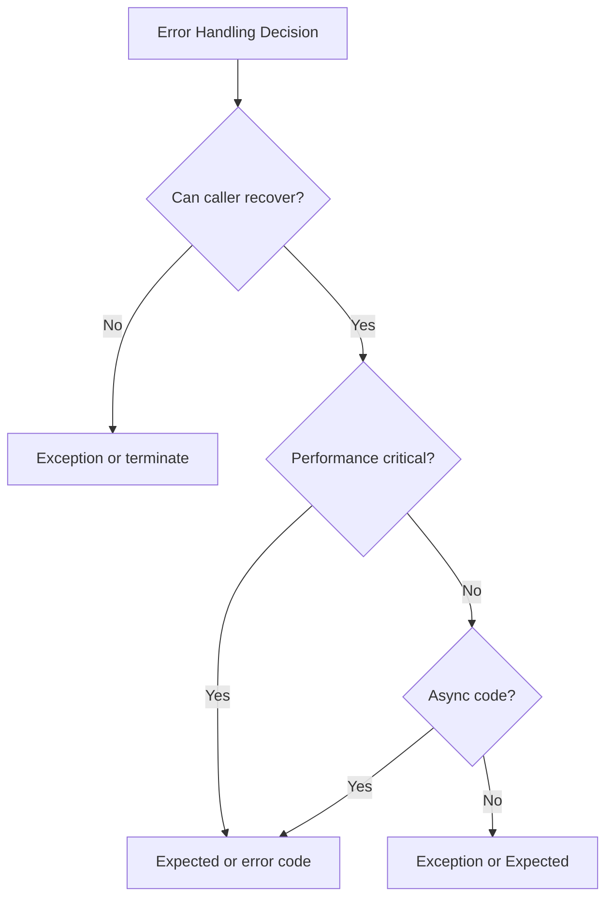
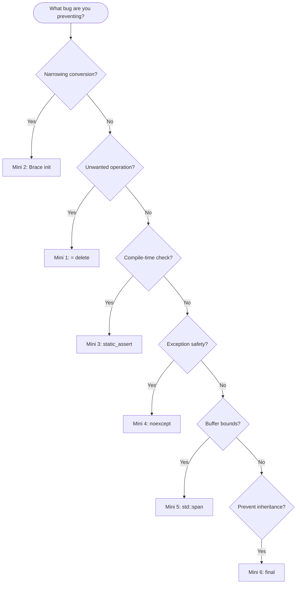

# Expanded Project Plan: Completing the Compile-Time Safety Documentation

## Comprehensive Outlines for All Proposed Documents

---

## Table of Contents

1. [Project Overview](#project-overview)
2. [Phase 1: Foundation Completion](#phase-1-foundation-completion)
   - [Session 6: Non-Null References](#session-6-non-null-references)
   - [Session 7: Nodiscard and Expected](#session-7-nodiscard-and-expected)
   - [Session 8: Template Constraints](#session-8-template-constraints)
   - [Quick Reference Card](#quick-reference-card)
   - [Technique Decision Flowchart](#technique-decision-flowchart)
3. [Phase 2: Mini-Sessions](#phase-2-mini-sessions)
   - [Mini-Session 1: Deleted Functions](#mini-session-1-deleted-functions)
   - [Mini-Session 2: Narrowing Conversions](#mini-session-2-narrowing-conversions)
   - [Mini-Session 3: Static Assert](#mini-session-3-static-assert)
   - [Mini-Session 4: Noexcept Contracts](#mini-session-4-noexcept-contracts)
   - [Mini-Session 5: Span Bounds](#mini-session-5-span-bounds)
   - [Mini-Session 6: Final Keyword](#mini-session-6-final-keyword)
4. [Phase 3: Additional Full Sessions](#phase-3-additional-full-sessions)
   - [Session 9: Variant Exhaustiveness](#session-9-variant-exhaustiveness)
   - [Session 10: Builder Type Accumulation](#session-10-builder-type-accumulation)
   - [Session 11: Physical Units](#session-11-physical-units)
5. [Phase 4: Handbook Chapters and Appendices](#phase-4-handbook-chapters-and-appendices)
   - [Handbook: Policy-Based Design](#handbook-policy-based-design)
   - [Handbook: Phantom Types](#handbook-phantom-types)
   - [Handbook: Safe Reference Patterns](#handbook-safe-reference-patterns)
   - [Appendix: Compiler Flags Reference](#appendix-compiler-flags-reference)
   - [Appendix: C++23/26 Futures](#appendix-cpp2326-futures)
   - [Exercises by Difficulty](#exercises-by-difficulty)
6. [Cross-Reference Matrix](#cross-reference-matrix)
7. [Style Guide Compliance Checklist](#style-guide-compliance-checklist)

---

# Project Overview

## Final Document Inventory

| ID | Document | Type | Est. Length | Effort |
|----|----------|------|-------------|--------|
| S06 | Non-Null References | Problem Session | 400-500 lines | 1 day |
| S07 | Nodiscard and Expected | Problem Session | 500-600 lines | 1 day |
| S08 | Template Constraints | Problem Session | 700-800 lines | 2 days |
| S09 | Variant Exhaustiveness | Problem Session | 500-600 lines | 2 days |
| S10 | Builder Type Accumulation | Problem Session | 600-700 lines | 2 days |
| S11 | Physical Units | Problem Session | 700-800 lines | 3 days |
| M01 | Deleted Functions | Mini-Session | 150-200 lines | 0.5 days |
| M02 | Narrowing Conversions | Mini-Session | 200-250 lines | 0.5 days |
| M03 | Static Assert | Mini-Session | 200-250 lines | 0.5 days |
| M04 | Noexcept Contracts | Mini-Session | 200-250 lines | 0.5 days |
| M05 | Span Bounds | Mini-Session | 200-250 lines | 0.5 days |
| M06 | Final Keyword | Mini-Session | 100-150 lines | 0.25 days |
| H01 | Policy-Based Design | Handbook Chapter | 600-800 lines | 2 days |
| H02 | Phantom Types | Handbook Chapter | 400-500 lines | 1.5 days |
| H03 | Safe Reference Patterns | Handbook Chapter | 400-500 lines | 1.5 days |
| A01 | Compiler Flags Reference | Appendix | 400-500 lines | 1 day |
| A02 | C++23/26 Futures | Appendix | 300-400 lines | 1 day |
| R01 | Quick Reference Card | Reference | 200-300 lines | 0.5 days |
| R02 | Decision Flowchart | Reference | 150-200 lines | 0.5 days |
| E01 | Exercises by Difficulty | Exercises | 300-400 lines | 1 day |

**Total: 20 documents, ~8,000-10,000 lines, 24.5 writing days**

---

# Phase 1: Foundation Completion

---

## Session 6: Non-Null References

### Metadata

```yaml
doc_id: PS-NONNULL-006
doc_type: "Problem Session"
title: "The Null Dereference"
technique: "Non-Null References and Explicit Nullability"
estimated_time: "45-60 minutes"
prerequisites: ["Basic C++ pointers and references", "std::optional basics"]
fatp_components: []
cxx_standard: "C++17"
guarantee_level: "Compile-time (references), Runtime (optional access)"
```

### Learning Objectives

By the end of this session, participants will be able to:
1. Explain why references cannot be null and when to prefer them over pointers
2. Use `std::optional` to make nullability explicit in APIs
3. Apply `gsl::not_null` for pointer parameters that must never be null
4. Identify and refactor null-prone C patterns in existing code

### Document Structure

```markdown
# Problem-Solving Session 6: The Null Dereference
## Non-Null References and Explicit Nullability

---

## The Bug

[Opening narrative: Production crash from null pointer dereference]

```cpp
struct User {
    std::string name;
    int age;
};

void greet_user(User* user) {
    std::cout << "Hello, " << user->name << "!\n";  // Crash if null
}

void process_request(Request& req) {
    User* user = find_user(req.user_id);  // Returns nullptr if not found
    greet_user(user);  // Passes null to function that doesn't check
}
```

**The bugs:**
1. `greet_user` doesn't check for null
2. `find_user` returns nullable pointer but caller doesn't check
3. The type system doesn't distinguish "never null" from "maybe null"
4. Compiler accepts all of this silently

---

## Questions to Consider

1. **Q1:** Why doesn't the compiler warn about the null dereference?
2. **Q2:** What's the difference between a pointer and a reference?
3. **Q3:** When should you use `std::optional` vs. a pointer?
4. **Q4:** How can you enforce non-null at the type level?
5. **Q5:** What about nullable references?

---

## Q1: The Billion-Dollar Mistake

[Discussion of Tony Hoare's "billion-dollar mistake" quote]

**Why pointers are nullable by default:**
- C heritage: pointers are just memory addresses
- Zero/null is a valid address value
- The type `T*` means "maybe a T, maybe nothing"

**The compiler's perspective:**
```cpp
void greet_user(User* user) {
    // Compiler sees: "user is an address that might be 0"
    // No way to know caller's intent
    user->name;  // Legal: dereferencing a pointer
}
```

**Real-world impact:**
- CVE database: thousands of null pointer dereference vulnerabilities
- Microsoft: 70% of security bugs are memory safety issues
- Google: null pointer bugs are leading cause of Chrome crashes

---

## Q2: References Cannot Be Null

[Core teaching section]

```cpp
void greet_user(User& user) {  // Reference, not pointer
    std::cout << "Hello, " << user.name << "!\n";  // Cannot be null
}

void process_request(Request& req) {
    User* user = find_user(req.user_id);
    if (user) {
        greet_user(*user);  // Dereference required - makes null check visible
    }
}
```

**Why references work:**
| Property | Pointer | Reference |
|----------|---------|-----------|
| Can be null | Yes | No |
| Can be reassigned | Yes | No |
| Requires explicit dereference | Yes (`*p`) | No |
| Can be uninitialized | Yes | No (must bind at declaration) |

**The guarantee:**
```cpp
User& ref = *ptr;  // If ptr is null, UB happens HERE
greet_user(ref);   // ref is guaranteed non-null by this point
```

The null check is pushed to the **binding site**, not scattered through every function.

---

## Q3: std::optional for Explicit Nullability

[When null is a valid state]

```cpp
// Bad: null means "not found" but type doesn't say so
User* find_user(int id);

// Good: return type explicitly says "might not exist"
std::optional<User> find_user(int id);

// Usage forces handling
std::optional<User> user = find_user(req.user_id);
if (user) {
    greet_user(*user);  // Must dereference optional
} else {
    handle_not_found();
}

// Or with value_or
greet_user(user.value_or(default_user));

// Or with monadic operations (C++23)
find_user(req.user_id)
    .transform([](User& u) { greet_user(u); });
```

**optional vs pointer for "maybe null":**
| Aspect | `T*` | `std::optional<T>` |
|--------|------|-------------------|
| Null state | Implicit | Explicit |
| Ownership | Ambiguous | Value semantics |
| Dereference | `*p` or `p->` | `*opt` or `opt->` |
| Check | `if (p)` | `if (opt)` or `opt.has_value()` |
| Self-documenting | No | Yes |

---

## Q4: gsl::not_null for Non-Null Pointers

[When you need pointer semantics but never null]

```cpp
#include <gsl/gsl>

void greet_user(gsl::not_null<User*> user) {
    std::cout << "Hello, " << user->name << "!\n";
}

void process_request(Request& req) {
    User* user = find_user(req.user_id);
    if (user) {
        greet_user(user);  // Implicit conversion to not_null
    }
    
    greet_user(nullptr);  // Compile error or runtime check (depending on config)
}
```

**not_null guarantees:**
- Construction from null is an error (compile-time if constexpr, runtime otherwise)
- Cannot be assigned null after construction
- Implicit conversion to underlying pointer type
- Documents intent in function signature

**When to use each:**

| Need | Solution |
|------|----------|
| Never null, no ownership | `T&` reference |
| Never null, need reassignment | `gsl::not_null<T*>` |
| Maybe null, no ownership | `T*` or `std::optional<T*>` |
| Maybe null, owns object | `std::optional<T>` |
| Maybe null, shared ownership | `std::shared_ptr<T>` (already nullable) |
| Never null, unique ownership | `std::unique_ptr<T>` (check before passing) |

---

## Q5: Nullable References?

[The std::optional<std::reference_wrapper<T>> pattern]

```cpp
// Can't do this:
std::optional<User&> maybe_user;  // Doesn't compile

// Do this instead:
std::optional<std::reference_wrapper<User>> maybe_user;

// Usage:
if (maybe_user) {
    User& user = maybe_user->get();
    greet_user(user);
}

// Helper type alias:
template<typename T>
using optional_ref = std::optional<std::reference_wrapper<T>>;

optional_ref<User> find_user_ref(int id);
```

**Why std::optional<T&> doesn't exist:**
- Rebinding semantics ambiguity
- Assignment would be confusing: assign to optional or to referent?
- `std::reference_wrapper` makes the indirection explicit

---

## Migration from C

### Pattern 1: Output parameters

```c
// C: output via pointer
int parse(const char* input, Result* out) {
    if (!out) return -1;  // Defensive null check
    *out = do_parse(input);
    return 0;
}
```

```cpp
// C++: return by value with Expected
Expected<Result, ParseError> parse(std::string_view input) {
    return do_parse(input);
}

// Or: output via reference (never null)
void parse(std::string_view input, Result& out) {
    out = do_parse(input);
}
```

### Pattern 2: Optional return

```c
// C: null means "not found"
User* find_user(int id);
```

```cpp
// C++: explicit optionality
std::optional<User> find_user(int id);

// Or: reference if stored elsewhere
User* find_user(int id);  // OK if ownership is clear and documented
```

### Pattern 3: Required parameter

```c
// C: hope caller doesn't pass null
void process(Config* config);
```

```cpp
// C++: reference means "must exist"
void process(const Config& config);

// Or: not_null if pointer semantics needed
void process(gsl::not_null<Config*> config);
```

---

## Complete Example: Before and After

### Before (Null-Prone)

```cpp
class UserService {
public:
    User* get_user(int id);  // Returns null if not found
    User* get_current_user();  // Returns null if not logged in
    
    void update_user(User* user, UserUpdate* update);  // Both nullable?
    
    bool delete_user(int id, std::string* error_out);  // Output via pointer
};

void handle_request(UserService* service, Request* req) {
    if (!service || !req) return;  // Defensive checks everywhere
    
    User* user = service->get_current_user();
    if (!user) return;
    
    User* target = service->get_user(req->target_id);
    if (!target) return;
    
    std::string error;
    if (!service->delete_user(target->id, &error)) {
        log_error(error);
    }
}
```

### After (Null-Safe)

```cpp
class UserService {
public:
    std::optional<User> get_user(int id);
    std::optional<std::reference_wrapper<User>> get_current_user();
    
    Expected<void, UpdateError> update_user(User& user, const UserUpdate& update);
    
    Expected<void, DeleteError> delete_user(int id);
};

void handle_request(UserService& service, const Request& req) {
    // No null checks needed - references can't be null
    
    auto current_user = service.get_current_user();
    if (!current_user) {
        return;  // Not logged in - explicit handling
    }
    
    auto target = service.get_user(req.target_id);
    if (!target) {
        return;  // User not found - explicit handling
    }
    
    auto result = service.delete_user(target->id);
    if (!result) {
        log_error(result.error().message());
    }
}
```

---

## Compiler Support and Tooling

### Static Analyzers

| Tool | Null Analysis |
|------|---------------|
| Clang Static Analyzer | `-analyzer-checker=core.NullDereference` |
| Clang-Tidy | `bugprone-null-dereference` |
| PVS-Studio | V522, V595 |
| Coverity | NULL_RETURNS, FORWARD_NULL |
| Visual Studio | /analyze with SAL annotations |

### SAL Annotations (MSVC)

```cpp
void process(_In_ User* user);           // Must not be null
void process(_In_opt_ User* user);       // May be null
void get_name(_Out_ char* buffer);       // Output, must not be null
```

### Clang Nullability Attributes

```cpp
void process(User* _Nonnull user);       // Must not be null
void process(User* _Nullable user);      // May be null
User* _Nullable find_user(int id);       // Returns nullable
```

---

## Summary

| Problem | Solution |
|---------|----------|
| Function parameter must exist | Use `T&` reference |
| Function parameter might be absent | Use `std::optional<T>` or document `T*` |
| Need pointer semantics, never null | Use `gsl::not_null<T*>` |
| Need nullable reference | Use `std::optional<std::reference_wrapper<T>>` |
| Return value might not exist | Return `std::optional<T>` |
| C interop requires pointers | Check at boundary, use references internally |

### Key Principles

1. **References cannot be null** — use them for required parameters
2. **`std::optional` makes nullability explicit** — use it for "maybe" semantics
3. **Push null checks to boundaries** — internal code uses references
4. **The type should document the contract** — readers shouldn't guess

### The Guideline in One Sentence

> If null is not a valid value, use a type that cannot be null.

---

## Exercises

1. **Warm-up:** Refactor a function that takes `T*` to take `T&`. Does the caller code improve?

2. **Optional return:** Convert a function that returns `nullptr` on failure to return `std::optional<T>`.

3. **Audit:** Find all functions in a codebase that take `T*` but never check for null. Which should be `T&`?

4. **not_null adoption:** Add `gsl::not_null` to a function parameter. Does the compiler catch any bugs?

---

## Further Reading

**Standards and Guidelines:**
- C++ Core Guidelines: [F.16](https://isocpp.github.io/CppCoreGuidelines/CppCoreGuidelines#f16-for-in-parameters-pass-cheaply-copied-types-by-value-and-others-by-reference-to-const) (parameter passing)
- C++ Core Guidelines: [I.12](https://isocpp.github.io/CppCoreGuidelines/CppCoreGuidelines#i12-declare-a-pointer-that-must-not-be-null-as-not_null) (not_null)

**Libraries:**
- Microsoft GSL: https://github.com/microsoft/GSL
- Abseil: `absl::Nullable`, `absl::Nonnull` annotations

**History:**
- Tony Hoare: "Null References: The Billion Dollar Mistake" (QCon 2009)
```

### Mermaid Diagrams Required

1. **Nullability decision tree** — Which type to use based on requirements
2. **Migration flow** — C pointer patterns to C++ equivalents
3. **Null check propagation** — How references push checks to boundaries

---

## Session 7: Nodiscard and Expected

### Metadata

```yaml
doc_id: PS-NODISCARD-007
doc_type: "Problem Session"
title: "The Ignored Error"
technique: "[[nodiscard]] and Expected<T,E>"
estimated_time: "45-60 minutes"
prerequisites: ["Function return values", "Error handling basics"]
fatp_components: ["Expected"]
cxx_standard: "C++17"
guarantee_level: "Compile-time (warning/error on ignored value)"
```

### Learning Objectives

1. Apply `[[nodiscard]]` to functions and types appropriately
2. Understand when return values must not be ignored
3. Use `Expected<T, E>` for error-returning functions
4. Implement error propagation with `EXPECTED_TRY` macro

### Document Structure

```markdown
# Problem-Solving Session 7: The Ignored Error
## [[nodiscard]] and Expected<T,E>

---

## The Bug

[Opening: Data loss from ignored save() return value]

```cpp
class Document {
public:
    bool save(const std::string& path) {
        std::ofstream file(path);
        if (!file) return false;
        file << content_;
        return file.good();
    }
};

void auto_save(Document& doc) {
    doc.save("/tmp/backup.dat");  // Return value ignored!
    log("Auto-save complete");    // Lie: might have failed
}
```

**The bug:** `save()` returns success/failure status, but caller ignores it. User thinks document is saved; it isn't.

---

## Q1: Why Doesn't the Compiler Warn?

[Discussion of why C++ allows ignoring return values by default]

- Historical: C heritage, `printf` returns int (always ignored)
- Practical: many functions return values that are optional to use
- Philosophy: "don't pay for what you don't use"

**The problem:** Functions where ignoring the return value is ALWAYS a bug don't get special treatment.

---

## Q2: [[nodiscard]] to the Rescue

```cpp
class Document {
public:
    [[nodiscard]] bool save(const std::string& path);
};

void auto_save(Document& doc) {
    doc.save("/tmp/backup.dat");  // Warning: ignoring return value of '[[nodiscard]]' function
}
```

### [[nodiscard]] with Reason (C++20)

```cpp
[[nodiscard("Check save() return value for disk full errors")]]
bool save(const std::string& path);
```

### [[nodiscard]] on Types

```cpp
class [[nodiscard("Error codes must be checked")]] ErrorCode {
    int code_;
public:
    bool ok() const { return code_ == 0; }
    std::string message() const;
};

ErrorCode save(const std::string& path);  // Automatically [[nodiscard]]
```

### Suppressing Warnings

```cpp
// When you genuinely want to ignore:
(void)doc.save("/tmp/optional_backup.dat");  // Explicit ignore

// Or with [[maybe_unused]]:
[[maybe_unused]] bool result = doc.save("/tmp/backup.dat");
```

---

## Q3: When to Use [[nodiscard]]

### Always Use [[nodiscard]] For:

| Category | Example | Why |
|----------|---------|-----|
| **Error indicators** | `bool try_connect()` | Ignoring = bug |
| **Factory functions** | `Widget* create()` | Ignoring = leak |
| **Computed values** | `int checksum()` | Ignoring = pointless |
| **Ownership transfers** | `unique_ptr release()` | Ignoring = leak |
| **State queries** | `bool is_empty()` | Ignoring = logic error |

### Don't Use [[nodiscard]] For:

| Category | Example | Why |
|----------|---------|-----|
| **Chainable setters** | `Builder& set_name()` | Return is for chaining |
| **Optional info** | `size_t bytes_written()` | Useful but not required |
| **Fluent interfaces** | `Query& where()` | Return enables chaining |

---

## Q4: Expected<T, E> — Errors as Values

[FAT-P Expected introduction]

```cpp
#include "Expected.h"

Expected<Document, LoadError> load_document(const std::string& path) {
    std::ifstream file(path);
    if (!file) {
        return unexpected(LoadError::FileNotFound);
    }
    
    Document doc;
    if (!doc.parse(file)) {
        return unexpected(LoadError::ParseError);
    }
    
    return doc;  // Success
}

void open_file(const std::string& path) {
    auto result = load_document(path);
    
    if (result) {
        display(*result);
    } else {
        show_error(result.error());
    }
}
```

### Why Expected is [[nodiscard]]

```cpp
template<typename T, typename E>
class [[nodiscard]] Expected {
    // ...
};

load_document("file.txt");  // Warning: ignoring Expected
```

### Monadic Operations

```cpp
Expected<User, Error> get_user(int id);
Expected<Profile, Error> get_profile(const User& user);
Expected<Avatar, Error> get_avatar(const Profile& profile);

// Without monadic ops:
auto user_result = get_user(42);
if (!user_result) return unexpected(user_result.error());
auto profile_result = get_profile(*user_result);
if (!profile_result) return unexpected(profile_result.error());
auto avatar_result = get_avatar(*profile_result);
if (!avatar_result) return unexpected(avatar_result.error());
return *avatar_result;

// With monadic ops:
return get_user(42)
    .and_then(get_profile)
    .and_then(get_avatar);
```

### EXPECTED_TRY Macro

```cpp
Expected<void, Error> process_file(const std::string& path) {
    EXPECTED_TRY(doc, load_document(path));  // Returns early on error
    EXPECTED_TRY(validated, validate(doc));
    EXPECTED_TRY(_, save_document(validated, path + ".out"));
    return {};  // Success
}

// Expands to:
// auto _tmp = load_document(path);
// if (!_tmp) return unexpected(_tmp.error());
// auto doc = std::move(*_tmp);
```

---

## Q5: Expected vs Exceptions vs Error Codes

| Aspect | Exceptions | Expected | Error Codes |
|--------|------------|----------|-------------|
| **Ignored silently** | No (terminates) | No ([[nodiscard]]) | Yes |
| **Control flow** | Non-local | Local | Local |
| **Performance (happy path)** | Zero cost | Zero cost | Branch cost |
| **Performance (error path)** | Expensive | Cheap | Cheap |
| **Composition** | try/catch | Monadic ops | Manual |
| **Async compatible** | Problematic | Yes | Yes |
| **C interop** | No | Via conversion | Yes |

### When to Use Each



---

## Comparison with std::expected (C++23)

| Feature | FAT-P Expected | std::expected |
|---------|---------------|---------------|
| **Availability** | C++17 | C++23 |
| **Monadic ops** | Yes | Yes |
| **EXPECTED_TRY** | Yes | No (use pattern matching?) |
| **Policies** | ThrowOnError, TerminateOnError | No |
| **Custom error types** | Yes | Yes |
| **void specialization** | Yes | Yes |

**Migration path:**
```cpp
// FAT-P (C++17)
using fat_p::Expected;
using fat_p::unexpected;

// std::expected (C++23)
using std::expected;
using std::unexpected;
// API is compatible for basic usage
```

---

## Complete Example

[Full before/after refactoring of a file processing pipeline]

---

## Summary

| Problem | Solution |
|---------|----------|
| Ignored error return | `[[nodiscard]]` on function |
| All instances of type need [[nodiscard]] | `[[nodiscard]]` on type |
| Explicit ignore | `(void)` cast or `[[maybe_unused]]` |
| Rich error information | `Expected<T, E>` |
| Error propagation boilerplate | `EXPECTED_TRY` macro |
| Chaining operations | Monadic ops: `and_then`, `transform` |

---

## Exercises

1. Add `[[nodiscard]]` to all functions in a class. Which warnings appear?
2. Create an `[[nodiscard]]` ErrorCode type.
3. Refactor exception-based code to use Expected.
4. Chain three fallible operations with `and_then`.

---

## Further Reading

- FAT-P User Manual: Expected
- C++ Core Guidelines: E.27, F.47
- std::expected proposal: P0323
```

### Mermaid Diagrams Required

1. **Error handling decision tree**
2. **Expected state diagram** (has_value vs has_error)
3. **Monadic chain visualization**

---

## Session 8: Template Constraints

### Metadata

```yaml
doc_id: PS-CONSTRAINTS-008
doc_type: "Problem Session"
title: "The Incomprehensible Error"
technique: "SFINAE and Concepts"
estimated_time: "60-75 minutes"
prerequisites: ["Templates basics", "Type traits awareness"]
fatp_components: ["FatPTypeTraits"]
cxx_standard: "C++17 (SFINAE) / C++20 (Concepts)"
guarantee_level: "Compile-time"
```

### Learning Objectives

1. Understand why template errors are hard to read
2. Apply SFINAE to constrain template parameters (C++17)
3. Define and use concepts (C++20)
4. Migrate from SFINAE to concepts
5. Write custom type traits

### Document Structure

```markdown
# Problem-Solving Session 8: The Incomprehensible Error
## Template Constraints with SFINAE and Concepts

---

## The Bug

[Opening: 50-line error message from passing wrong type to template]

```cpp
template<typename Container>
void sort_and_print(Container& c) {
    std::sort(c.begin(), c.end());
    for (const auto& elem : c) {
        std::cout << elem << "\n";
    }
}

int main() {
    sort_and_print(42);  // 50 lines of errors from inside std::sort
}
```

**The error message:** (actual GCC output excerpt)
```
/usr/include/c++/11/bits/stl_algo.h:1950:5: error: no matching function for call to '__sort(...)
  ... 48 more lines of template instantiation backtrace ...
```

**The problem:** Error is reported deep inside `std::sort`, not at the call site. The real issue is that `42` isn't a container.

---

## Q1: Why Are Template Errors So Bad?

[Discussion of C++ template instantiation model]

**How templates work:**
1. Template is parsed but not type-checked
2. At instantiation, types are substituted
3. Errors appear wherever substitution fails
4. This might be 10 levels deep in implementation

**The duck typing problem:**
```cpp
template<typename T>
void quack(T& duck) {
    duck.quack();  // Only checked at instantiation
}
// Any T without quack() gives error HERE, not at call site
```

---

## Part 1: SFINAE (C++17)

### What is SFINAE?

"Substitution Failure Is Not An Error"

When substituting template arguments, if substitution fails in the immediate context, that overload is silently removed from consideration (not a hard error).

```cpp
template<typename T>
typename T::value_type get_first(const T& container) {
    return *container.begin();
}

get_first(42);  // int has no ::value_type
                // SFINAE removes this overload
                // No other overload → error at call site!
```

### std::enable_if

```cpp
#include <type_traits>

// Only enabled for integral types
template<typename T>
std::enable_if_t<std::is_integral_v<T>, T>
safe_add(T a, T b) {
    // overflow checking...
    return a + b;
}

safe_add(1, 2);      // OK: int is integral
safe_add(1.0, 2.0);  // Error: no matching function (not 50 lines!)
```

### SFINAE Patterns

```cpp
// Pattern 1: Return type SFINAE
template<typename T>
std::enable_if_t<std::is_integral_v<T>, T>
process(T value);

// Pattern 2: Extra template parameter
template<typename T, 
         std::enable_if_t<std::is_integral_v<T>, int> = 0>
void process(T value);

// Pattern 3: void_t detection idiom
template<typename T, typename = void>
struct has_size : std::false_type {};

template<typename T>
struct has_size<T, std::void_t<decltype(std::declval<T>().size())>> 
    : std::true_type {};
```

### Complete SFINAE Example

```cpp
template<typename Container,
         std::enable_if_t<
             std::is_same_v<
                 decltype(std::declval<Container>().begin()),
                 decltype(std::declval<Container>().end())
             >, int> = 0>
void sort_and_print(Container& c) {
    std::sort(c.begin(), c.end());
    for (const auto& elem : c) {
        std::cout << elem << "\n";
    }
}

sort_and_print(42);  // Error: no matching function for call to 'sort_and_print'
                     // (Single line! At call site!)
```

---

## Part 2: Concepts (C++20)

### The Same Thing, But Readable

```cpp
template<typename T>
concept Sortable = requires(T& t) {
    { t.begin() } -> std::input_or_output_iterator;
    { t.end() } -> std::input_or_output_iterator;
    { *t.begin() } -> std::totally_ordered;
};

template<Sortable Container>
void sort_and_print(Container& c) {
    std::sort(c.begin(), c.end());
    for (const auto& elem : c) {
        std::cout << elem << "\n";
    }
}

sort_and_print(42);  // Error: constraint 'Sortable<int>' not satisfied
```

### Defining Concepts

```cpp
// Simple concept
template<typename T>
concept Integral = std::is_integral_v<T>;

// Compound concept
template<typename T>
concept Number = std::is_integral_v<T> || std::is_floating_point_v<T>;

// Concept with requirements
template<typename T>
concept Hashable = requires(T t) {
    { std::hash<T>{}(t) } -> std::convertible_to<std::size_t>;
};

// Concept with multiple requirements
template<typename T>
concept Container = requires(T t) {
    typename T::value_type;
    typename T::iterator;
    { t.begin() } -> std::same_as<typename T::iterator>;
    { t.end() } -> std::same_as<typename T::iterator>;
    { t.size() } -> std::convertible_to<std::size_t>;
};
```

### Using Concepts

```cpp
// In template parameter
template<Integral T>
T safe_add(T a, T b);

// As requires clause
template<typename T>
    requires Integral<T>
T safe_add(T a, T b);

// Trailing requires
template<typename T>
T safe_add(T a, T b) requires Integral<T>;

// Abbreviated function template
void process(Integral auto value);
```

### Standard Library Concepts

```cpp
#include <concepts>

std::integral<T>           // is_integral_v
std::floating_point<T>     // is_floating_point_v
std::same_as<T, U>         // is_same_v
std::derived_from<T, U>    // is_base_of_v
std::convertible_to<T, U>  // is_convertible_v
std::constructible_from<T, Args...>
std::default_initializable<T>
std::movable<T>
std::copyable<T>
std::equality_comparable<T>
std::totally_ordered<T>
std::regular<T>            // default_initializable && copyable && equality_comparable
```

---

## Migration: SFINAE → Concepts

```cpp
// SFINAE (C++17)
template<typename T,
         std::enable_if_t<std::is_integral_v<T> && sizeof(T) >= 4, int> = 0>
T safe_multiply(T a, T b);

// Concept (C++20)
template<typename T>
concept LargeIntegral = std::is_integral_v<T> && sizeof(T) >= 4;

template<LargeIntegral T>
T safe_multiply(T a, T b);
```

### When to Stay on SFINAE

- C++17 codebase that can't upgrade
- Need to support older compilers
- Macro-based metaprogramming patterns

### Gradual Migration

```cpp
// Compatibility header
#if __cplusplus >= 202002L
    #define FATP_REQUIRES(concept, type) concept<type>
    #define FATP_CONCEPT template<typename T> concept
#else
    #define FATP_REQUIRES(concept, type) \
        std::enable_if_t<concept##_v<type>, int> = 0
    #define FATP_CONCEPT template<typename T> inline constexpr bool
#endif
```

---

## Error Message Comparison

### Without constraints (bad):
```
error: no match for 'operator*' (operand type is 'int')
  ... in instantiation of 'void sort_and_print(Container&) [with Container = int]'
  ... required from here
  /usr/include/c++/11/bits/stl_algo.h:1950: ... 
  [40 more lines]
```

### With SFINAE (better):
```
error: no matching function for call to 'sort_and_print(int)'
note: candidate template ignored: requirement 'has_begin_v<int>' was not satisfied
```

### With concepts (best):
```
error: no matching function for call to 'sort_and_print(int)'
note: constraints not satisfied
note: the required expression 't.begin()' is invalid
```

---

## FAT-P Type Traits

[Documentation of FatPTypeTraits utilities]

```cpp
#include "FatPTypeTraits.h"

// Detection idiom helpers
fat_p::is_detected_v<has_size_t, T>

// Common detectors
fat_p::has_begin_v<T>
fat_p::has_end_v<T>
fat_p::has_size_v<T>
fat_p::is_iterable_v<T>
fat_p::is_container_v<T>

// Concept-like traits (C++17)
fat_p::Iterable<T>
fat_p::Container<T>
fat_p::Hashable<T>
```

---

## Summary

| Problem | SFINAE Solution | Concepts Solution |
|---------|-----------------|-------------------|
| Reject wrong types | `std::enable_if_t<...>` | `template<Concept T>` |
| Check for member | `std::void_t` detection | `requires { t.member(); }` |
| Check return type | Nested `decltype` | `{ expr } -> Concept` |
| Combine requirements | `&&` in enable_if | `&&` in concept |
| Clear error messages | Moderate | Excellent |

---

## Exercises

1. Write a SFINAE constraint for "has operator<<".
2. Convert it to a C++20 concept.
3. Create a `Printable` concept that requires both `<<` and `to_string()`.
4. Use concepts to constrain a generic cache class.

---

## Further Reading

- cppreference: Constraints and concepts
- C++ Core Guidelines: T.10-T.13
- "C++ Templates: The Complete Guide" (2nd ed)
```

### Mermaid Diagrams Required

1. **SFINAE overload resolution flow**
2. **Concept subsumption hierarchy**
3. **Error message comparison visualization**

---

## Quick Reference Card

### Metadata

```yaml
doc_id: REF-QUICKCARD-001
doc_type: "Reference"
title: "Compile-Time Safety Quick Reference"
estimated_time: "5 minutes (lookup)"
```

### Content Structure

```markdown
# Compile-Time Safety Quick Reference Card

## Technique Selection Matrix

| If you need to prevent... | Use this technique | Session |
|---------------------------|-------------------|---------|
| Argument swapping | Strong typedefs | 1 |
| Missing enum case | `-Werror=switch-enum` | 2 |
| Invalid state transition | StateMachine | 3 |
| Wrong operation sequence | Type-State | 4 |
| Accidental mutation | `const` | 5 |
| Null dereference | References / optional | 6 |
| Ignored return value | `[[nodiscard]]` | 7 |
| Wrong template type | Concepts / SFINAE | 8 |
| Missing variant handler | Overloaded visitor | 9 |
| Incomplete builder | Type accumulation | 10 |
| Unit confusion | Physical units | 11 |

## Decision Flowchart

[Mermaid diagram: large decision tree]

## Compiler Flags Cheat Sheet

### GCC/Clang

```bash
# Essential (enable these everywhere)
-Werror=return-type       # Missing return → error
-Werror=switch-enum       # Missing case → error

# Recommended
-Wconversion              # Narrowing → warning
-Wsign-conversion         # Sign mismatch → warning
-Wnon-virtual-dtor        # Missing virtual dtor → warning

# Strict
-Wextra -Wpedantic        # More warnings
-Werror                   # All warnings → errors
```

### MSVC

```
/W4                       # High warning level
/WX                       # Warnings as errors
/we4062                   # Missing enum case
/we4715                   # Missing return
```

## Common Patterns

### Strong Typedef
```cpp
using UserId = StrongId<struct UserTag, int>;
```

### Exhaustive Enum
```cpp
enum class Status { A, B, COUNT_ };
constexpr EnumPlusMap<Status, const char*> NAMES = {{"A", "B"}};
```

### [[nodiscard]] Type
```cpp
class [[nodiscard]] ErrorCode { int code_; };
```

### Never-Null Parameter
```cpp
void process(const Config& config);  // Reference
void process(gsl::not_null<Config*> config);  // Pointer
```

## One-Liners to Remember

- "Make illegal states unrepresentable"
- "If it compiles, it's (more likely) correct"
- "Types > tests > discipline"
- "Push validation to compile time"
- "The compiler never forgets; humans always do"

## See Also

- Full sessions: problem_session_01.md through problem_session_11.md
- Handbook: Discipline_of_Class_Design.md
- Appendix: compiler_flags_reference.md
```

---

## Technique Decision Flowchart

### Content Structure

```markdown
# Compile-Time Safety: Technique Decision Flowchart

## How to Use This Flowchart

Start at the top with your problem. Follow the arrows based on your answers. The endpoint tells you which technique and session to study.

## The Flowchart

```mermaid
flowchart TD
    START([What bug are you preventing?]) --> TYPE{Type confusion?}
    
    TYPE -->|Yes| TYPE_KIND{What kind?}
    TYPE_KIND -->|IDs/handles| S1[Session 1: StrongId]
    TYPE_KIND -->|Physical units| S11[Session 11: Units]
    TYPE_KIND -->|States| TYPE_STATE{Compile-time state?}
    TYPE_STATE -->|Yes| S4[Session 4: Type-State]
    TYPE_STATE -->|No| S3[Session 3: StateMachine]
    
    TYPE -->|No| ENUM{Enum handling?}
    
    ENUM -->|Yes| ENUM_KIND{Enum or variant?}
    ENUM_KIND -->|Enum| S2[Session 2: -Werror=switch-enum]
    ENUM_KIND -->|Variant| S9[Session 9: Overloaded Visitor]
    
    ENUM -->|No| NULL{Null pointer risk?}
    
    NULL -->|Yes| NULL_KIND{Required or optional?}
    NULL_KIND -->|Required| S6A[Session 6: References]
    NULL_KIND -->|Optional| S6B[Session 6: std::optional]
    
    NULL -->|No| RETURN{Return value ignored?}
    
    RETURN -->|Yes| S7[Session 7: [[nodiscard]]]
    
    RETURN -->|No| MUTATION{Accidental mutation?}
    
    MUTATION -->|Yes| S5[Session 5: const]
    
    MUTATION -->|No| TEMPLATE{Template type error?}
    
    TEMPLATE -->|Yes| TEMPLATE_STD{C++ standard?}
    TEMPLATE_STD -->|C++17| S8A[Session 8: SFINAE]
    TEMPLATE_STD -->|C++20+| S8B[Session 8: Concepts]
    
    TEMPLATE -->|No| BUILDER{Builder incomplete?}
    
    BUILDER -->|Yes| S10[Session 10: Type Accumulation]
    
    BUILDER -->|No| OTHER([Check mini-sessions])
    
    style S1 fill:#90EE90
    style S2 fill:#90EE90
    style S3 fill:#90EE90
    style S4 fill:#90EE90
    style S5 fill:#90EE90
    style S6A fill:#90EE90
    style S6B fill:#90EE90
    style S7 fill:#90EE90
    style S8A fill:#90EE90
    style S8B fill:#90EE90
    style S9 fill:#90EE90
    style S10 fill:#90EE90
    style S11 fill:#90EE90
```

## Mini-Session Flowchart


```

---

# Phase 2: Mini-Sessions

Each mini-session follows a compressed format: 15-25 minutes, focused on one technique.

---

## Mini-Session 1: Deleted Functions

### Metadata

```yaml
doc_id: MS-DELETE-001
doc_type: "Mini-Session"
title: "Deleted Functions"
estimated_time: "15-20 minutes"
```

### Content Structure

```markdown
# Mini-Session: Deleted Functions (= delete)

## The One-Minute Summary

`= delete` explicitly forbids operations that would otherwise compile.

```cpp
class Resource {
public:
    Resource(const Resource&) = delete;      // No copying
    Resource& operator=(const Resource&) = delete;
    
    Resource(double) = delete;               // No implicit from double
};

Resource r1;
Resource r2 = r1;      // Compile error: deleted
Resource r3 = 3.14;    // Compile error: deleted
```

## Use Cases

### 1. Prevent Copying (Move-Only Types)

```cpp
class UniqueHandle {
    int handle_;
public:
    UniqueHandle(int h) : handle_(h) {}
    ~UniqueHandle() { close(handle_); }
    
    // Prevent double-close via copy
    UniqueHandle(const UniqueHandle&) = delete;
    UniqueHandle& operator=(const UniqueHandle&) = delete;
    
    // Allow move
    UniqueHandle(UniqueHandle&& other) noexcept : handle_(other.handle_) {
        other.handle_ = -1;
    }
};
```

### 2. Prevent Implicit Conversions

```cpp
class StrictInt {
    int value_;
public:
    explicit StrictInt(int v) : value_(v) {}
    
    StrictInt(double) = delete;    // No StrictInt(3.14)
    StrictInt(bool) = delete;      // No StrictInt(true)
    StrictInt(char) = delete;      // No StrictInt('a')
};
```

### 3. Prevent Dangerous Overloads

```cpp
// Prevent passing char* where std::string expected
void process(const std::string& s);
void process(const char*) = delete;

// Prevent passing temporaries that would dangle
class StringView {
public:
    StringView(const std::string& s);
    StringView(std::string&&) = delete;  // Prevent dangling
};
```

### 4. Prevent Heap Allocation

```cpp
class StackOnly {
public:
    void* operator new(size_t) = delete;
    void* operator new[](size_t) = delete;
};

StackOnly s;              // OK
StackOnly* p = new StackOnly;  // Compile error
```

### 5. Prevent Default Construction

```cpp
class RequiresConfig {
public:
    RequiresConfig() = delete;
    explicit RequiresConfig(const Config& c);
};
```

## Interaction with StrongId

FAT-P StrongId uses `= delete` internally:

```cpp
template<typename Tag, typename T = int>
class StrongId {
public:
    explicit StrongId(T v) : value_(v) {}
    
    // Prevent implicit conversion from other StrongId types
    template<typename OtherTag>
    StrongId(StrongId<OtherTag, T>) = delete;
};
```

## Error Messages

```cpp
Resource r2 = r1;
// error: use of deleted function 'Resource::Resource(const Resource&)'
// note: declared here: Resource(const Resource&) = delete;
```

Clear! Points directly to the deleted declaration.

## Summary

| To Prevent | Delete |
|------------|--------|
| Copying | Copy constructor and assignment |
| Moving | Move constructor and assignment |
| Implicit conversion from X | Constructor taking X |
| Heap allocation | `operator new` |
| Calling with wrong type | Overload for wrong type |

## Exercise

Add `= delete` to prevent `std::string` from being passed to a function that takes `std::string_view`.
```

---

## Mini-Session 2: Narrowing Conversions

### Content Structure

```markdown
# Mini-Session: Narrowing Conversions

## The One-Minute Summary

Brace initialization prevents implicit narrowing.

```cpp
int x = 3.14;    // Compiles! x = 3
int y{3.14};     // Compile error: narrowing
int z = {3.14};  // Compile error: narrowing
```

## What Counts as Narrowing?

| From | To | Narrowing? |
|------|----|------------|
| double | int | Yes |
| float | int | Yes |
| int | char | Yes (if value doesn't fit) |
| long | int | Yes (on 64-bit) |
| unsigned | signed | Yes (if negative) |
| int | unsigned | Yes (if negative) |
| int | double | No (double has enough precision) |

## The Fix: Brace Initialization

```cpp
// Bad: silent narrowing
void legacy(int count) {
    int x = count;     // Works but doesn't catch narrowing
}

// Good: catches narrowing
void modern(int count) {
    int x{count};      // Error if count's type could narrow
}
```

## Compiler Flags

```bash
# GCC/Clang
-Wconversion           # Warn on implicit narrowing
-Wfloat-conversion     # Warn on float→int
-Wsign-conversion      # Warn on sign changes
-Werror=narrowing      # Brace narrowing → error (default in C++11)

# MSVC
/W4                    # Includes narrowing warnings
```

## Gotcha: Vector Initialization

```cpp
std::vector<int> v1(10);    // 10 elements, value 0
std::vector<int> v2{10};    // 1 element, value 10

std::vector<int> v3(10, 1); // 10 elements, value 1
std::vector<int> v4{10, 1}; // 2 elements: 10 and 1
```

Braces prefer `initializer_list` constructor!

## Safe Pattern

```cpp
// Use braces for values (catches narrowing)
int port{config.get_port()};
double ratio{x / y};

// Use parentheses for "n copies" semantics
std::vector<int> buffer(1024);
std::string padding(10, ' ');
```

## Exercise

Find the narrowing bug:
```cpp
void send_packet(size_t length) {
    uint16_t header_length = length;  // Bug?
    // ...
}
```
```

---

## Mini-Session 3: Static Assert

### Content Structure

```markdown
# Mini-Session: static_assert

## The One-Minute Summary

`static_assert` checks conditions at compile time.

```cpp
static_assert(sizeof(void*) == 8, "64-bit required");
static_assert(std::is_trivially_copyable_v<MyType>);
```

## Use Cases

### 1. Platform Requirements

```cpp
static_assert(sizeof(int) >= 4, "int must be at least 32 bits");
static_assert(CHAR_BIT == 8, "8-bit bytes required");
static_assert(sizeof(size_t) == sizeof(void*), "size_t must match pointer size");
```

### 2. Template Type Constraints

```cpp
template<typename T>
class Buffer {
    static_assert(std::is_trivially_copyable_v<T>,
                  "Buffer<T> uses memcpy; T must be trivially copyable");
    static_assert(sizeof(T) <= 64,
                  "Buffer optimized for small types; consider pointer for large T");
    // ...
};
```

### 3. Struct Layout Verification

```cpp
struct NetworkPacket {
    uint32_t magic;
    uint16_t length;
    uint16_t flags;
    uint8_t payload[1024];
};

static_assert(offsetof(NetworkPacket, magic) == 0);
static_assert(offsetof(NetworkPacket, length) == 4);
static_assert(offsetof(NetworkPacket, flags) == 6);
static_assert(offsetof(NetworkPacket, payload) == 8);
static_assert(sizeof(NetworkPacket) == 1032);
```

### 4. Enum Size Verification

```cpp
enum class Status : uint8_t { A, B, C, COUNT };
static_assert(static_cast<int>(Status::COUNT) == 3,
              "Update serialization when adding status values");
```

### 5. Compile-Time Math

```cpp
constexpr int factorial(int n) {
    return n <= 1 ? 1 : n * factorial(n - 1);
}

static_assert(factorial(5) == 120);
static_assert(factorial(10) == 3628800);
```

## static_assert vs assert

| `static_assert` | `assert` |
|-----------------|----------|
| Compile time | Runtime |
| Zero cost | Debug-only (usually) |
| Constant expression required | Any expression |
| Breaks build | Breaks execution |

## C++17: No Message Required

```cpp
// C++11: message required
static_assert(sizeof(int) == 4, "int must be 32 bits");

// C++17: message optional
static_assert(sizeof(int) == 4);
```

## Exercise

Add static_asserts to verify:
1. A struct fits in a cache line (64 bytes)
2. A template parameter is not a pointer
3. Two types have the same size
```

---

## Mini-Session 4: Noexcept Contracts

### Content Structure

```markdown
# Mini-Session: noexcept as Contract

## The One-Minute Summary

`noexcept` declares that a function will not throw. If it does, the program terminates.

```cpp
void safe_cleanup() noexcept {
    // If this throws, std::terminate() is called
}
```

## Why noexcept Matters

### 1. Destructors

```cpp
~Resource() noexcept {  // Implicit, but be explicit
    // Throwing here during stack unwinding → terminate()
}
```

### 2. Move Operations

```cpp
class Buffer {
public:
    // noexcept enables vector to use move during reallocation
    Buffer(Buffer&& other) noexcept;
    Buffer& operator=(Buffer&& other) noexcept;
};

// Without noexcept, vector::push_back copies instead of moves!
```

### 3. Swap

```cpp
void swap(Buffer& other) noexcept {
    using std::swap;
    swap(data_, other.data_);
    swap(size_, other.size_);
}
```

### 4. Optimization

```cpp
// Compiler can omit exception handling code for noexcept functions
void fast_path() noexcept {
    // No exception tables generated
}
```

## Conditional noexcept

```cpp
template<typename T>
class Container {
public:
    // noexcept if T's move is noexcept
    Container(Container&& other) 
        noexcept(std::is_nothrow_move_constructible_v<T>);
    
    // noexcept if swap(T,T) is noexcept
    void swap(Container& other)
        noexcept(std::is_nothrow_swappable_v<T>);
};
```

## Checking noexcept

```cpp
static_assert(std::is_nothrow_move_constructible_v<Buffer>,
              "Buffer move must be noexcept for vector optimization");

static_assert(noexcept(buffer.swap(other)),
              "swap must be noexcept");
```

## Common Mistakes

```cpp
// Wrong: Allocating memory can throw
Buffer(Buffer&& other) noexcept {
    data_ = new char[other.size_];  // Can throw std::bad_alloc!
}

// Right: Only move pointers
Buffer(Buffer&& other) noexcept
    : data_(std::exchange(other.data_, nullptr))
    , size_(std::exchange(other.size_, 0))
{}
```

## Summary

| Should be noexcept | Why |
|--------------------|-----|
| Destructors | Throwing during unwind terminates |
| Move constructor | Enables vector optimization |
| Move assignment | Enables vector optimization |
| swap() | Used in move assignment |
| Comparison operators | Expected by algorithms |

## Exercise

Check if your classes' move operations are noexcept. Use `static_assert` to enforce it.
```

---

## Mini-Session 5: Span Bounds

### Content Structure

```markdown
# Mini-Session: std::span for Bounds Safety

## The One-Minute Summary

`std::span` bundles pointer and size together.

```cpp
// Bad: pointer and size can get out of sync
void process(int* data, size_t size);

// Good: span keeps them together
void process(std::span<int> data);
```

## Basic Usage

```cpp
#include <span>

void process(std::span<int> data) {
    for (int x : data) {       // Range-for works
        // ...
    }
    data[0] = 42;              // Subscript works
    data.size();               // Size always available
    data.data();               // Underlying pointer
}

// Calling:
std::vector<int> vec = {1, 2, 3};
process(vec);                  // Implicit conversion

int arr[] = {1, 2, 3};
process(arr);                  // Implicit conversion

process({vec.data() + 1, 2}); // Subspan
```

## Fixed-Size Span

```cpp
void process_header(std::span<int, 4> header) {
    // Compiler knows size is exactly 4
    // Some compilers can check bounds at compile time
}

int arr[4] = {1, 2, 3, 4};
process_header(arr);           // OK: sizes match

std::vector<int> vec = {1, 2, 3, 4};
process_header(vec);           // Error: can't guarantee size

process_header(std::span<int, 4>{vec.data(), 4});  // Explicit: your risk
```

## Subspans

```cpp
void process(std::span<int> data) {
    auto first_half = data.first(data.size() / 2);
    auto last_half = data.last(data.size() / 2);
    auto middle = data.subspan(10, 20);  // 20 elements starting at 10
}
```

## What span Does NOT Do

| Feature | span | vector |
|---------|------|--------|
| Owns data | No | Yes |
| Bounds checking | Implementation-defined | at() throws |
| Resizable | No | Yes |
| Null-terminates | No | No |

**Danger: span can dangle!**
```cpp
std::span<int> bad() {
    std::vector<int> local = {1, 2, 3};
    return local;  // Dangling span!
}
```

## GSL span vs std::span

```cpp
// GSL: bounds checking in debug mode
gsl::span<int> data = vec;
data[100];  // Throws in debug, UB in release

// std::span: implementation-defined
std::span<int> data = vec;
data[100];  // Might throw, might UB
```

## Summary

| Use span when | Use vector when |
|---------------|-----------------|
| Just viewing data | Owning data |
| Size known at call | Size determined later |
| Performance critical | Safety critical |
| Interfacing with C | Pure C++ |

## Exercise

Refactor a function from `(T* data, size_t count)` to `std::span<T>`.
```

---

## Mini-Session 6: Final Keyword

### Content Structure

```markdown
# Mini-Session: final Classes and Methods

## The One-Minute Summary

`final` prevents inheritance or override.

```cpp
class Singleton final { };           // Cannot inherit
void process() final;                // Cannot override
```

## final on Classes

```cpp
class Utility final {
public:
    static int compute(int x);
    // No virtual methods, not designed for inheritance
};

class Derived : public Utility { };  // Compile error: Utility is final
```

**Use when:**
- Class is not designed for inheritance
- Singleton pattern
- Utility classes with only static methods
- Performance: enables devirtualization

## final on Methods

```cpp
class Base {
public:
    virtual void required_behavior() final {
        // Subclasses cannot change this
    }
    
    virtual void customizable_behavior() {
        // Subclasses can override this
    }
};

class Derived : public Base {
    void required_behavior() override;     // Error: final
    void customizable_behavior() override; // OK
};
```

**Use when:**
- Non-virtual interface pattern
- Method behavior must not change
- Performance: enables devirtualization

## Devirtualization

```cpp
class Base {
public:
    virtual void process();
};

class Derived final : public Base {
public:
    void process() override;
};

void use(Derived& d) {
    d.process();  // Compiler knows exact type → direct call, no vtable
}
```

## Summary

| To prevent | Use |
|------------|-----|
| Inheriting from class | `class X final { }` |
| Overriding method | `void f() final;` |
| Both | Both on class |

## Exercise

Identify classes in your codebase that should be `final`.
```

---

# Phase 3: Additional Full Sessions

---

## Session 9: Variant Exhaustiveness

### Metadata

```yaml
doc_id: PS-VARIANT-009
doc_type: "Problem Session"
title: "The Unhandled Alternative"
technique: "Exhaustive Variant Visitation"
estimated_time: "45-60 minutes"
prerequisites: ["std::variant basics", "Lambdas"]
cxx_standard: "C++17"
guarantee_level: "Compile-time"
```

### Document Structure

```markdown
# Problem-Solving Session 9: The Unhandled Alternative
## Exhaustive Variant Visitation

---

## The Bug

```cpp
using Value = std::variant<int, double, std::string>;

std::string to_string(const Value& v) {
    return std::visit([](auto&& arg) {
        using T = std::decay_t<decltype(arg)>;
        if constexpr (std::is_same_v<T, int>) {
            return std::to_string(arg);
        } else if constexpr (std::is_same_v<T, double>) {
            return std::to_string(arg);
        }
        // Forgot std::string case!
        return std::string{};
    }, v);
}
```

**Six months later:**
```cpp
using Value = std::variant<int, double, std::string, bool>;  // Added bool

// to_string still compiles! Returns empty string for bool.
```

---

## Q1: Why No Compiler Warning?

[Generic lambda accepts everything]

The generic lambda `[](auto&& arg)` accepts any type. There's no exhaustiveness check because the lambda always has a valid instantiation.

---

## Q2: The Overloaded Pattern

```cpp
template<class... Ts>
struct overloaded : Ts... { 
    using Ts::operator()...; 
};

// Deduction guide (C++17)
template<class... Ts>
overloaded(Ts...) -> overloaded<Ts...>;

std::string to_string(const Value& v) {
    return std::visit(overloaded{
        [](int i) { return std::to_string(i); },
        [](double d) { return std::to_string(d); },
        [](const std::string& s) { return s; }
        // If bool added to Value → compile error: no matching call
    }, v);
}
```

---

## Q3: How It Works

[Detailed explanation of overloaded inheritance and using declarations]

```cpp
// What overloaded{...} creates:
struct __anonymous : 
    decltype([](int i) { ... }),
    decltype([](double d) { ... }),
    decltype([](const std::string& s) { ... })
{
    using decltype([](int i) { ... })::operator();
    using decltype([](double d) { ... })::operator();
    using decltype([](const std::string& s) { ... })::operator();
};
```

When `std::visit` calls `operator()` with `bool`, no overload matches → compile error.

---

## Q4: Handling Default Cases

Sometimes you want a catch-all:

```cpp
std::string describe(const Value& v) {
    return std::visit(overloaded{
        [](int i) { return "integer: " + std::to_string(i); },
        [](double d) { return "floating: " + std::to_string(d); },
        [](const auto& other) { return "other type"; }  // Catch-all
    }, v);
}
```

The generic lambda as last resort handles new types, but you lose exhaustiveness checking.

**Better: explicit listing with static_assert**

```cpp
template<typename... Expected>
struct exhaustive_visitor {
    template<typename T>
    void operator()(T&&) const {
        static_assert((std::is_same_v<std::decay_t<T>, Expected> || ...),
                      "Unhandled type in visitor");
    }
};
```

---

## Q5: Comparison with Enums

| Aspect | Enum + switch | Variant + visit |
|--------|---------------|-----------------|
| Exhaustiveness | `-Wswitch-enum` | overloaded pattern |
| Per-value data | No | Yes |
| Type safety | Moderate | Strong |
| Adding values | Must update switches | Must update visitors |

---

## Real-World Example: Expression Tree

```cpp
struct Literal;
struct BinaryOp;
struct UnaryOp;
struct Variable;

using Expr = std::variant<Literal, BinaryOp, UnaryOp, Variable>;

struct Literal { double value; };
struct Variable { std::string name; };
struct BinaryOp { 
    char op; 
    std::unique_ptr<Expr> left, right; 
};
struct UnaryOp { 
    char op; 
    std::unique_ptr<Expr> operand; 
};

double evaluate(const Expr& expr, const std::map<std::string, double>& vars) {
    return std::visit(overloaded{
        [](const Literal& lit) { return lit.value; },
        [&](const Variable& var) { return vars.at(var.name); },
        [&](const BinaryOp& bin) {
            double l = evaluate(*bin.left, vars);
            double r = evaluate(*bin.right, vars);
            switch (bin.op) {
                case '+': return l + r;
                case '-': return l - r;
                case '*': return l * r;
                case '/': return l / r;
            }
            throw std::invalid_argument("Unknown operator");
        },
        [&](const UnaryOp& un) {
            double v = evaluate(*un.operand, vars);
            switch (un.op) {
                case '-': return -v;
                case '+': return v;
            }
            throw std::invalid_argument("Unknown operator");
        }
    }, expr);
}
```

---

## FAT-P Utilities

```cpp
#include "VariantUtils.h"

// Provided overloaded template
using fat_p::overloaded;

// match() function for variant
auto result = fat_p::match(value,
    [](int i) { return i * 2; },
    [](double d) { return d * 2; },
    [](const std::string& s) { return s.size(); }
);
```

---

## Summary

| Problem | Solution |
|---------|----------|
| Generic lambda hides missing cases | Use overloaded pattern |
| Adding variant type silently breaks | Overloaded gives compile error |
| Need catch-all | Add generic lambda last |
| Complex visitation | Recursive visitors |

---

## Exercises

1. Create a `Shape` variant with `Circle`, `Rectangle`, `Triangle`. Write exhaustive `area()` and `perimeter()` visitors.

2. Add a `Polygon` type to your variant. Verify the compiler catches missing handlers.

3. Implement an expression pretty-printer using the expression tree example.
```

### Mermaid Diagrams Required

1. **Overloaded inheritance diagram**
2. **Visit dispatch flow**
3. **Comparison with enum/switch**

---

## Session 10: Builder Type Accumulation

### Metadata

```yaml
doc_id: PS-BUILDER-010
doc_type: "Problem Session"
title: "The Incomplete Builder"
technique: "Type-Accumulating Builders"
estimated_time: "60 minutes"
prerequisites: ["Templates", "Type-State Pattern (Session 4)"]
cxx_standard: "C++17 (C++20 for concepts)"
guarantee_level: "Compile-time"
```

### Document Structure

```markdown
# Problem-Solving Session 10: The Incomplete Builder
## Type-Accumulating Builders

---

## The Bug

```cpp
class HttpRequestBuilder {
    std::string method_;
    std::string url_;
    std::map<std::string, std::string> headers_;
    std::optional<std::string> body_;
    
public:
    HttpRequestBuilder& method(std::string m) { method_ = std::move(m); return *this; }
    HttpRequestBuilder& url(std::string u) { url_ = std::move(u); return *this; }
    HttpRequestBuilder& header(std::string k, std::string v) { 
        headers_[std::move(k)] = std::move(v); 
        return *this; 
    }
    HttpRequestBuilder& body(std::string b) { body_ = std::move(b); return *this; }
    
    HttpRequest build() {
        if (method_.empty()) throw std::logic_error("method required");
        if (url_.empty()) throw std::logic_error("url required");
        return HttpRequest{method_, url_, headers_, body_};
    }
};

// Usage:
auto request = HttpRequestBuilder()
    .url("http://example.com")
    // .method("GET")  // Forgot this!
    .header("Accept", "application/json")
    .build();  // Runtime error!
```

**The problem:** Required fields are checked at runtime. Forgetting them compiles fine.

---

## Q1: The Type-State Solution

Track which fields are set in the type itself:

```cpp
// State tags
struct NoMethod {};
struct HasMethod {};
struct NoUrl {};
struct HasUrl {};

template<typename MethodState, typename UrlState>
class HttpRequestBuilder {
    std::string method_;
    std::string url_;
    std::map<std::string, std::string> headers_;
    std::optional<std::string> body_;
    
    // Private constructor for state transitions
    template<typename, typename> friend class HttpRequestBuilder;
    
    HttpRequestBuilder(std::string m, std::string u, 
                       std::map<std::string, std::string> h,
                       std::optional<std::string> b)
        : method_(std::move(m)), url_(std::move(u))
        , headers_(std::move(h)), body_(std::move(b)) {}
    
public:
    HttpRequestBuilder() = default;
    
    // method() changes MethodState to HasMethod
    HttpRequestBuilder<HasMethod, UrlState> method(std::string m) && {
        return {std::move(m), std::move(url_), std::move(headers_), std::move(body_)};
    }
    
    // url() changes UrlState to HasUrl
    HttpRequestBuilder<MethodState, HasUrl> url(std::string u) && {
        return {std::move(method_), std::move(u), std::move(headers_), std::move(body_)};
    }
    
    // header() doesn't change state
    HttpRequestBuilder header(std::string k, std::string v) && {
        headers_[std::move(k)] = std::move(v);
        return std::move(*this);
    }
    
    // body() doesn't change state
    HttpRequestBuilder body(std::string b) && {
        body_ = std::move(b);
        return std::move(*this);
    }
    
    // build() only exists when both required fields are set
    HttpRequest build() && 
        requires std::same_as<MethodState, HasMethod> 
              && std::same_as<UrlState, HasUrl>
    {
        return HttpRequest{std::move(method_), std::move(url_), 
                          std::move(headers_), std::move(body_)};
    }
};

// Usage:
auto request = HttpRequestBuilder<NoMethod, NoUrl>()
    .url("http://example.com")
    .method("GET")
    .header("Accept", "application/json")
    .build();  // OK: build() exists

auto bad = HttpRequestBuilder<NoMethod, NoUrl>()
    .url("http://example.com")
    // .method("GET")
    .build();  // Compile error: build() doesn't exist on HttpRequestBuilder<NoMethod, HasUrl>
```

---

## Q2: C++17 Version (Without Concepts)

```cpp
// build() only available when both are Has*
template<typename M = MethodState, typename U = UrlState,
         std::enable_if_t<
             std::is_same_v<M, HasMethod> && std::is_same_v<U, HasUrl>, 
             int> = 0>
HttpRequest build() && {
    return HttpRequest{std::move(method_), std::move(url_), 
                      std::move(headers_), std::move(body_)};
}
```

---

## Q3: Bitfield State (Many Fields)

For many optional fields, use a bitfield approach:

```cpp
template<unsigned RequiredMask, unsigned SetMask>
class ConfigBuilder {
    // RequiredMask: which fields must be set
    // SetMask: which fields are currently set
    
public:
    static constexpr unsigned HOST_BIT = 1;
    static constexpr unsigned PORT_BIT = 2;
    static constexpr unsigned TIMEOUT_BIT = 4;
    
    ConfigBuilder<RequiredMask, SetMask | HOST_BIT> host(std::string h) && {
        // ...
    }
    
    // build() requires SetMask to include all RequiredMask bits
    Config build() && 
        requires ((SetMask & RequiredMask) == RequiredMask)
    {
        // ...
    }
};

// Usage:
using RequiredConfig = ConfigBuilder<HOST_BIT | PORT_BIT, 0>;

auto config = RequiredConfig{}
    .host("localhost")
    .port(8080)
    .timeout(30)  // Optional
    .build();  // OK

auto bad = RequiredConfig{}
    .host("localhost")
    .build();  // Error: PORT_BIT not set
```

---

## Q4: Comparison with EnforcedInit

| Aspect | EnforcedInit | Type Accumulation |
|--------|--------------|-------------------|
| Check timing | Runtime | Compile-time |
| Error type | Exception/assert | Compile error |
| Complexity | Simple | Complex |
| Flexibility | High | Lower |
| State inspection | `.is_initialized()` | Type itself |

**Use EnforcedInit when:**
- Fields set conditionally at runtime
- Simpler implementation needed
- Partial initialization is valid state

**Use Type Accumulation when:**
- Required fields known at compile time
- Compile-time guarantee essential
- Builder pattern is the API

---

## Q5: Real-World Example: SQL Query Builder

```cpp
template<bool HasSelect, bool HasFrom, bool HasWhere>
class QueryBuilder {
    // ...
public:
    QueryBuilder<true, HasFrom, HasWhere> select(std::string cols) &&;
    QueryBuilder<HasSelect, true, HasWhere> from(std::string table) &&;
    QueryBuilder<HasSelect, HasFrom, true> where(std::string condition) &&;
    
    // Execute requires at least SELECT and FROM
    ResultSet execute() && requires (HasSelect && HasFrom);
};

auto query = QueryBuilder<false, false, false>{}
    .select("name, email")
    .from("users")
    .where("active = true")
    .execute();  // OK

auto bad = QueryBuilder<false, false, false>{}
    .select("*")
    .execute();  // Error: no FROM
```

---

## Summary

| Problem | Solution |
|---------|----------|
| Forgot required field | Method doesn't exist without prerequisites |
| Runtime check for completeness | Compile-time type check |
| Builder state unclear | Type encodes state |
| Error at usage site | Error at build() call |

---

## Exercises

1. Create a `ConnectionBuilder` requiring `host` and `port`, optional `timeout` and `ssl`.

2. Implement an email builder requiring `to`, `subject`, and `body`.

3. Add order-dependency: `from()` must be called before `where()`.
```

### Mermaid Diagrams Required

1. **Type state transition diagram**
2. **Builder chain type evolution**
3. **Comparison with runtime builders**

---

## Session 11: Physical Units

### Metadata

```yaml
doc_id: PS-UNITS-011
doc_type: "Problem Session"
title: "The Unit Confusion"
technique: "Dimensional Analysis"
estimated_time: "60-75 minutes"
prerequisites: ["Templates", "Strong typedefs (Session 1)"]
cxx_standard: "C++20"
guarantee_level: "Compile-time"
```

### Document Structure

```markdown
# Problem-Solving Session 11: The Unit Confusion
## Dimensional Analysis at Compile Time

---

## The Bug

```cpp
double velocity = 100;      // m/s? km/h? mph?
double time = 30;           // seconds? minutes?
double distance = velocity * time;  // What unit is this?

// Later, someone uses 'distance' as feet when it was meters
send_to_autopilot(distance);  // Wrong unit → crash
```

**Real-world disaster:** Mars Climate Orbiter, 1999. $327 million lost because one team used metric, another used imperial.

---

## Q1: Why Not Just Be Careful?

[Discussion: discipline doesn't scale]

- Code reviews miss unit errors
- Comments get outdated
- Refactoring breaks assumptions
- The type system doesn't help

---

## Q2: The Type-Based Solution

```cpp
#include <mp-units/systems/si/si.h>
using namespace mp_units;
using namespace mp_units::si;

quantity<metre> distance = 100 * m;
quantity<second> time = 9.58 * s;
quantity<metre_per_second> speed = distance / time;

// Type error: can't add distance to time
auto bad = distance + time;  // Compile error!

// Type error: assigning wrong unit
quantity<foot> distance_ft = distance;  // Error: no implicit conversion
quantity<foot> distance_ft = value_cast<foot>(distance);  // Explicit: OK
```

---

## Q3: Library Survey

### mp-units (C++20, proposed for std)

```cpp
#include <mp-units/systems/si/si.h>
#include <mp-units/systems/international/international.h>

using namespace mp_units;

quantity<si::metre> height = 1.8 * si::m;
quantity<international::foot> height_ft = value_cast<international::foot>(height);
// height_ft ≈ 5.9 ft
```

**Pros:**
- Modern C++20 design
- Proposed for C++ standard (maybe C++29)
- Rich SI and other unit systems
- Compile-time dimensional analysis

**Cons:**
- Requires C++20
- Learning curve

### Boost.Units

```cpp
#include <boost/units/systems/si.hpp>
using namespace boost::units;
using namespace boost::units::si;

quantity<length> distance(100.0 * meters);
quantity<time> t(9.58 * seconds);
quantity<velocity> speed = distance / t;
```

**Pros:**
- Mature, well-tested
- C++03 compatible
- Extensive unit systems

**Cons:**
- Verbose syntax
- Heavy compile times
- Boost dependency

### nholthaus/units

```cpp
#include <units.h>
using namespace units::literals;

auto distance = 100_m;
auto time = 9.58_s;
auto speed = distance / time;  // meters_per_second
```

**Pros:**
- Header-only
- C++14 compatible
- Clean literal syntax

**Cons:**
- Less comprehensive than mp-units
- Fewer unit systems

---

## Q4: Defining Custom Units

```cpp
// Application-specific units
namespace game {
    // Pixels
    inline constexpr struct pixel : named_unit<"px", kind_of<si::metre>> {} pixel;
    
    // Game ticks (1 tick = 16.67ms for 60fps)
    inline constexpr struct tick : named_unit<"tick", mag<1667> / mag<100000> * si::second> {} tick;
    
    // Tiles (1 tile = 32 pixels)
    inline constexpr struct tile : named_unit<"tile", mag<32> * pixel> {} tile;
}

quantity<game::pixel> sprite_width = 64 * game::pixel;
quantity<game::tile> map_width = 100 * game::tile;
quantity<game::pixel> map_width_px = value_cast<game::pixel>(map_width);  // 3200 px
```

---

## Q5: Integration with Existing Code

### Boundary Wrapping

```cpp
// External API: raw doubles
extern "C" {
    void set_motor_speed(double rpm);
    double get_temperature_celsius();
}

// Internal: typed units
void control_motor(quantity<revolution_per_minute> target_speed) {
    set_motor_speed(target_speed.numerical_value_in(rpm));
}

quantity<celsius> read_temperature() {
    return get_temperature_celsius() * deg_C;
}
```

### Serialization

```cpp
// JSON: store value and unit
void to_json(json& j, quantity<metre> dist) {
    j = {{"value", dist.numerical_value_in(m)}, {"unit", "m"}};
}

void from_json(const json& j, quantity<metre>& dist) {
    double value = j["value"];
    std::string unit = j["unit"];
    if (unit == "m") dist = value * m;
    else if (unit == "ft") dist = value * ft;
    // ...
}
```

---

## Q6: Performance

```cpp
// Units are zero-cost abstraction
quantity<metre> a = 100 * m;
quantity<metre> b = 200 * m;
quantity<metre> c = a + b;

// Compiles to same assembly as:
double a = 100;
double b = 200;
double c = a + b;
```

The unit tags exist only at compile time. Runtime representation is just the underlying numeric type.

---

## Summary

| Problem | Solution |
|---------|----------|
| Unit confusion | Types encode units |
| Adding incompatible units | Compile error |
| Wrong unit at boundary | Explicit conversion required |
| Performance overhead | Zero (compile-time only) |

### When to Use Units Library

**Worth it:**
- Physics simulations
- Financial calculations
- Aerospace/automotive
- Any multi-unit domain

**Overkill:**
- Single-unit domains
- Throwaway scripts
- Performance-critical inner loops (verify first)

---

## Exercises

1. Model a simple physics simulation with position, velocity, and acceleration.

2. Create custom units for a currency converter (USD, EUR, GBP).

3. Implement a GPS distance calculator using latitude/longitude with units.
```

### Mermaid Diagrams Required

1. **Dimensional analysis type system**
2. **Unit conversion paths**
3. **Library decision tree**

---

# Phase 4: Handbook Chapters and Appendices

---

## Handbook: Policy-Based Design

### Metadata

```yaml
doc_id: HB-POLICY-001
doc_type: "Handbook Chapter"
title: "Policy-Based Design for Compile-Time Safety"
estimated_time: "30-45 minutes"
```

### Outline

```markdown
# Handbook - Policy-Based Design

## The Pattern

Behavior as template parameter, resolved at compile time.

## The Wound

```cpp
class Allocator {
public:
    virtual void* allocate(size_t n) = 0;
    virtual void deallocate(void* p) = 0;
};
// Virtual dispatch on every allocation!
```

## The Solution

```cpp
template<typename AllocationPolicy>
class Container {
    AllocationPolicy allocator_;
public:
    void* allocate(size_t n) {
        return allocator_.allocate(n);  // Inlined!
    }
};
```

## FAT-P Components Using Policies

### CheckedArithmetic

```cpp
template<typename T, typename OverflowPolicy = ThrowOnOverflow>
class CheckedInt;

using SafeInt = CheckedInt<int, ThrowOnOverflow>;
using SaturatingInt = CheckedInt<int, SaturateOnOverflow>;
using WrappingInt = CheckedInt<int, WrapOnOverflow>;
```

### StateMachine

```cpp
template<typename Context, 
         typename Transitions,
         typename TransitionPolicy = StrictTransitionPolicy,
         typename ActionPolicy = NoExceptActionPolicy,
         size_t InitialState,
         typename... States>
class StateMachine;
```

### StrongId

```cpp
template<typename Tag, 
         typename T = int, 
         typename ValidationPolicy = NoValidation>
class StrongId;

using PositiveId = StrongId<IdTag, int, PositiveCheckPolicy>;
```

## Designing Your Own Policies

### Step 1: Define Policy Concept

```cpp
template<typename P>
concept OverflowPolicy = requires(P p, int a, int b) {
    { p.on_overflow(a, b) } -> std::same_as<int>;
    { P::name } -> std::convertible_to<const char*>;
};
```

### Step 2: Implement Policies

```cpp
struct ThrowOnOverflow {
    static constexpr const char* name = "throw";
    [[noreturn]] static int on_overflow(int a, int b) {
        throw std::overflow_error("overflow");
    }
};

struct SaturateOnOverflow {
    static constexpr const char* name = "saturate";
    static int on_overflow(int a, int b) {
        return (a > 0) ? INT_MAX : INT_MIN;
    }
};
```

### Step 3: Use in Template

```cpp
template<typename T, OverflowPolicy Policy = ThrowOnOverflow>
class CheckedInt {
public:
    CheckedInt operator+(CheckedInt other) const {
        if (would_overflow(value_, other.value_)) {
            return CheckedInt{Policy::on_overflow(value_, other.value_)};
        }
        return CheckedInt{value_ + other.value_};
    }
};
```

## Policy Categories

| Category | Examples |
|----------|----------|
| Error handling | Throw, Terminate, Return error, Log |
| Validation | None, Range check, Positive, Non-zero |
| Threading | Single-threaded, Mutex, Lock-free |
| Allocation | Heap, Stack, Pool, Arena |
| Bounds checking | None, Assert, Throw |

## Composition

```cpp
template<typename T,
         typename OverflowPolicy,
         typename DivisionPolicy,
         typename ConversionPolicy>
class SafeNumeric;
```

## Trade-offs

| Benefit | Cost |
|---------|------|
| Zero runtime dispatch | Code bloat (template instantiation) |
| Full inlining | Longer compile times |
| Compile-time selection | More complex API |
| Type-safe policies | Learning curve |

## When to Use

**Policy-based design excels when:**
- Multiple valid behaviors exist
- Performance matters
- Behavior is known at compile time
- Testing each policy independently is valuable

**Simpler alternatives when:**
- Only one behavior needed
- Behavior chosen at runtime
- Code simplicity prioritized
```

---

## Handbook: Phantom Types

### Outline

```markdown
# Handbook - Phantom Types: Zero-Cost Type Distinctions

## The Pattern

Template parameter used for type checking but not stored.

## StrongId Deconstructed

```cpp
template<typename Tag, typename T = int>
class StrongId {
    T value_;  // Tag is NOT stored!
public:
    // Tag exists only in type system
};

sizeof(StrongId<UserTag, int>) == sizeof(int)  // True!
```

## Beyond IDs

### Units

```cpp
template<typename Unit>
class Distance {
    double value_;
public:
    explicit Distance(double v) : value_(v) {}
    double get() const { return value_; }
};

struct Meters {};
struct Feet {};

using DistanceMeters = Distance<Meters>;
using DistanceFeet = Distance<Feet>;

DistanceMeters a{100};
DistanceFeet b = a;  // Compile error!
```

### States

```cpp
template<typename State>
class FileHandle {
    int fd_;
public:
    // Methods available depend on State
};

struct Open {};
struct Closed {};

template<>
class FileHandle<Open> {
public:
    void write(const char* data);
    FileHandle<Closed> close();
};

template<>
class FileHandle<Closed> {
public:
    FileHandle<Open> open(const char* path);
};
```

### Permissions

```cpp
template<typename Access>
class Query {
    std::string sql_;
};

struct ReadOnly {};
struct ReadWrite {};

void execute(Query<ReadOnly> q);   // Can run on replica
void execute(Query<ReadWrite> q);  // Must run on primary
```

### Validated Data

```cpp
template<typename Validation>
class Input {
    std::string data_;
};

struct Raw {};
struct Sanitized {};

void render(Input<Sanitized> safe_input);
Input<Sanitized> sanitize(Input<Raw> raw);

Input<Raw> user_input{get_user_input()};
render(user_input);  // Compile error!
render(sanitize(user_input));  // OK
```

## Zero Overhead Proof

```cpp
// These produce identical assembly:

// With phantom type
StrongId<UserTag, int> id{42};
process(id);

// Without
int id = 42;
process(id);
```

## Combining with Type-State

Phantom types enable zero-overhead Type-State:

```cpp
template<typename State>
class Connection {
    // Same data for all states
    int socket_;
    std::string host_;
};
// Different specializations for different operations
```

## Summary

Phantom types provide type safety without runtime cost by leveraging the type system for distinctions that don't need runtime representation.
```

---

## Handbook: Safe Reference Patterns

### Outline

```markdown
# Handbook - Safe Reference Patterns

## The Dangling Problem

```cpp
std::string_view get_greeting() {
    std::string local = "Hello";
    return local;  // Dangling!
}
```

## Pattern 1: Delete Rvalue Overloads

```cpp
class StringView {
public:
    StringView(const std::string& s) : data_(s.data()), size_(s.size()) {}
    StringView(std::string&&) = delete;  // Prevent binding to temporaries!
private:
    const char* data_;
    size_t size_;
};

StringView good{some_string};
StringView bad{std::string("temp")};  // Compile error!
```

## Pattern 2: Reference Wrapper

```cpp
template<typename T>
class SafeRef {
    T* ptr_;  // Never null
public:
    SafeRef(T& ref) : ptr_(&ref) {}
    SafeRef(T&&) = delete;  // No temporaries!
    
    T& get() const { return *ptr_; }
    T* operator->() const { return ptr_; }
};
```

## Pattern 3: Explicit Lifetime Annotation

```cpp
template<typename T, typename Owner>
class BorrowedRef {
    T* ptr_;
    // Owner type documents where this came from
public:
    BorrowedRef(T& ref, Owner& owner) : ptr_(&ref) {
        // Could store weak reference to owner
    }
};
```

## Static Analysis Integration

```cpp
// Clang lifetime annotations
[[clang::lifetimebound]]
const std::string& get_name(const Person& p) {
    return p.name;
}

std::string_view sv = get_name(Person{});  // Warning: dangling
```

## When References Are Safe

| Pattern | Safety |
|---------|--------|
| Local reference to parameter | Safe |
| Returning reference to member | Safe if object outlives |
| Reference to temporary | Dangerous |
| Reference to moved-from | Dangerous |

## Summary

C++ references can dangle. Use:
- `= delete` for rvalue overloads
- Wrapper types that prevent temporaries
- Static analysis annotations
- Careful API design
```

---

## Appendix: Compiler Flags Reference

### Detailed Content

```markdown
# Appendix - Compiler Flags for Compile-Time Safety

## Quick Reference

| Category | GCC/Clang | MSVC | Effect |
|----------|-----------|------|--------|
| Missing return | `-Werror=return-type` | `/we4715` | Error on missing return |
| Missing enum case | `-Werror=switch-enum` | `/we4062` | Error on unhandled enum |
| Narrowing | `-Wconversion` | `/W4` | Warn on narrowing |
| Sign conversion | `-Wsign-conversion` | `/W4` | Warn on sign change |
| Non-virtual dtor | `-Wnon-virtual-dtor` | C4265 | Warn on missing virtual dtor |
| Unused result | `-Wunused-result` | C4834 | Warn on ignored [[nodiscard]] |

## GCC/Clang Detailed

### Enum Warnings

```bash
-Wswitch              # Warn if enum value not handled (no default)
-Wswitch-enum         # Warn if enum value not handled (even with default)
-Wswitch-default      # Warn if no default case
-Wswitch-bool         # Warn on switch on boolean

# Recommended
-Werror=switch-enum   # Make missing enum case an error
```

### Type Conversion Warnings

```bash
-Wconversion          # All implicit conversions that may change value
-Wfloat-conversion    # Float to integer
-Wsign-conversion     # Sign changes (int to unsigned)
-Wnarrowing           # Narrowing in brace initialization
-Wfloat-equal         # Direct floating point comparison

# Recommended
-Wconversion -Wsign-conversion
```

### Class Design Warnings

```bash
-Wnon-virtual-dtor           # Base class without virtual destructor
-Wdelete-non-virtual-dtor    # Delete through non-virtual dtor pointer
-Woverloaded-virtual         # Overload hides base virtual
-Wsuggest-override           # Missing override keyword
-Weffc++                     # Effective C++ violations

# Recommended  
-Wnon-virtual-dtor -Wsuggest-override
```

### Return Value Warnings

```bash
-Wreturn-type                # Missing return in non-void function
-Wunused-result              # Ignored [[nodiscard]]

# Recommended
-Werror=return-type
```

### Unused Entity Warnings

```bash
-Wunused-parameter           # Unused function parameter
-Wunused-variable            # Unused local variable
-Wunused-function            # Unused static function
-Wunused                     # All unused warnings

# Often too noisy; use selectively
```

## MSVC Detailed

### Warning Levels

```
/W0  - No warnings
/W1  - Severe warnings only
/W2  - Significant warnings
/W3  - Production quality (default)
/W4  - Informational warnings (recommended)
/Wall - All warnings (very noisy)
```

### Specific Warnings as Errors

```
/we4062  - Missing enum case
/we4715  - Not all paths return value
/we4834  - Discarding [[nodiscard]]
/we4265  - Class has virtual functions but dtor not virtual
```

### Disable Specific Warnings

```
/wd4100  - Unreferenced formal parameter
/wd4127  - Conditional expression is constant
```

## CMake Configuration

```cmake
if(CMAKE_CXX_COMPILER_ID MATCHES "GNU|Clang")
    add_compile_options(
        -Wall
        -Wextra
        -Wpedantic
        -Werror=return-type
        -Werror=switch-enum
        -Wconversion
        -Wsign-conversion
        -Wnon-virtual-dtor
        -Woverloaded-virtual
    )
    
    if(CMAKE_CXX_COMPILER_ID STREQUAL "Clang")
        add_compile_options(
            -Wno-c++98-compat
            -Wno-c++98-compat-pedantic
        )
    endif()
    
elseif(MSVC)
    add_compile_options(
        /W4
        /WX        # Warnings as errors
        /we4062    # Missing enum case
        /we4715    # Missing return
        /we4834    # Discarding nodiscard
        /permissive-
    )
endif()
```

## Sanitizers

```bash
# Address Sanitizer (memory errors)
-fsanitize=address

# Undefined Behavior Sanitizer
-fsanitize=undefined

# Thread Sanitizer (data races)
-fsanitize=thread

# Combined (recommended for testing)
-fsanitize=address,undefined
```

## Static Analyzers

| Tool | Command |
|------|---------|
| Clang Static Analyzer | `scan-build make` |
| Clang-Tidy | `clang-tidy -checks='*' file.cpp` |
| Cppcheck | `cppcheck --enable=all .` |
| PVS-Studio | `pvs-studio-analyzer analyze` |
| Coverity | `cov-build --dir cov-int make` |

## Recommended Configurations

### Development (Maximum Checking)

```bash
-Wall -Wextra -Wpedantic -Werror
-fsanitize=address,undefined
-fno-omit-frame-pointer
```

### CI/Release (Balanced)

```bash
-Wall -Wextra -Wpedantic
-Werror=return-type -Werror=switch-enum
```

### Legacy Code (Gradual Improvement)

```bash
-Wall
# Add specific -Werror flags incrementally
```
```

---

## Appendix: C++23/26 Futures

### Outline

```markdown
# Appendix - C++23/26 Compile-Time Safety Features

## C++23 (Available Now)

### std::expected

```cpp
#include <expected>

std::expected<int, std::string> parse(const std::string& s) {
    if (s.empty()) return std::unexpected("empty string");
    return std::stoi(s);
}

auto result = parse("42");
if (result) {
    std::cout << *result;
} else {
    std::cout << result.error();
}
```

**Migration from FAT-P Expected:**
- API largely compatible
- FAT-P has EXPECTED_TRY, policies (C++ standard does not)
- Consider keeping FAT-P for extended features

### Deducing This

```cpp
// Simplifies CRTP
struct Base {
    template<typename Self>
    auto& derived(this Self&& self) {
        return self;
    }
};

// Simplifies operator overloading
struct Value {
    int x;
    
    // One definition covers const, non-const, lvalue, rvalue
    template<typename Self>
    auto&& get(this Self&& self) {
        return std::forward<Self>(self).x;
    }
};
```

### if consteval

```cpp
constexpr int compute(int n) {
    if consteval {
        // We're in a constant expression
        return compile_time_algorithm(n);
    } else {
        // We're at runtime
        return runtime_algorithm(n);
    }
}
```

### Multidimensional operator[]

```cpp
class Matrix {
public:
    double& operator[](size_t row, size_t col) {
        return data_[row * cols_ + col];
    }
};

Matrix m;
m[1, 2] = 3.14;  // Instead of m[1][2]
```

## C++26 (Proposed)

### Contracts

```cpp
// Preconditions and postconditions as language feature
double sqrt(double x)
    pre(x >= 0)
    post(r: r >= 0 && r * r ≈ x)
{
    return std::sqrt(x);
}

class Stack {
    void push(int x)
        pre(!full())
        post(size() == old size() + 1);
    
    int pop()
        pre(!empty())
        post(size() == old size() - 1);
};
```

**Status:** Removed from C++20, redesigned for C++26

### Static Reflection

```cpp
// Introspect types at compile time
template<typename T>
void print_members() {
    constexpr auto members = std::meta::members_of(^T);
    template for (constexpr auto member : members) {
        std::cout << std::meta::name_of(member) << "\n";
    }
}

struct Point { int x, y; };
print_members<Point>();  // Prints "x" and "y"
```

**Use cases:**
- Automatic serialization
- ORM without macros
- Debug printing

### Pattern Matching

```cpp
// inspect expression
int describe(const Shape& s) {
    return inspect(s) {
        Circle{r} => std::format("circle with radius {}", r);
        Rectangle{w, h} => std::format("rectangle {}x{}", w, h);
        __ => "unknown shape";
    };
}
```

## Migration Planning

### FAT-P → Standard

| FAT-P | Standard | When |
|-------|----------|------|
| Expected | std::expected | C++23 |
| StrongId | (none) | Keep FAT-P |
| StateMachine | (none) | Keep FAT-P |
| EnumPlus | (none) | Keep FAT-P |

### Preparing for Contracts

```cpp
// Today: manual assertions
void push(int x) {
    assert(!full() && "precondition: not full");
    // ...
    assert(size() == old_size + 1 && "postcondition: size increased");
}

// Future: contracts
void push(int x)
    pre(!full())
    post(size() == old_size + 1);
```

Write assertions now that can become contracts later.

## Resources

- cppreference.com/cpp23, cpp26
- P0323 (std::expected)
- P2900 (Contracts)
- P2996 (Reflection)
- P1371 (Pattern matching)
```

---

## Exercises by Difficulty

### Outline

```markdown
# Exercises - Compile-Time Safety

## Beginner (Sessions 1-2, Mini-Sessions)

### Exercise B1: Add [[nodiscard]]
Take a codebase and add `[[nodiscard]]` to:
- All functions returning error codes
- All factory functions
- All getters returning expensive computations

Compile and fix all warnings.

### Exercise B2: Enable -Werror=switch-enum
Enable the flag in a project. Fix all warnings by either:
- Adding missing cases
- Removing default cases

### Exercise B3: Replace typedef with StrongId
Find all `typedef int SomethingId` patterns. Replace with StrongId.
How many bugs does the compiler find?

### Exercise B4: Const Audit
Add `const` to:
- All function parameters that aren't modified
- All member functions that don't modify state
- All local variables that aren't reassigned

## Intermediate (Sessions 3-7)

### Exercise I1: StateMachine for Connection
Implement a TCP-like state machine:
- States: Closed, Listen, SynSent, SynReceived, Established, FinWait1, FinWait2, CloseWait, Closing, LastAck, TimeWait
- Define valid transitions
- Implement entry/exit actions

### Exercise I2: Type-State File Handle
Create a File class where:
- `write()` only available when open
- `read()` only available when open
- `close()` consumes the handle
- Opening returns a new type

### Exercise I3: Exhaustive Variant Visitor
Create a `JsonValue` variant:
- null, bool, int, double, string, array, object
- Implement `to_string()` with exhaustive visitor
- Add a new type and verify compiler catches missing handlers

### Exercise I4: Expected Error Propagation
Implement a function that:
- Reads a config file (may fail)
- Parses JSON (may fail)
- Validates fields (may fail)
- Returns the config or first error

Use `Expected` with monadic operations or `EXPECTED_TRY`.

## Advanced (Sessions 8-11)

### Exercise A1: Concept-Constrained Container
Write a `SortedContainer<T>` where T must satisfy:
- `std::totally_ordered`
- `std::copyable`
- Has a `key()` method returning `std::totally_ordered`

Test with valid and invalid types.

### Exercise A2: Type-Accumulating Builder
Create a `DatabaseConnection` builder requiring:
- host (required)
- port (required)
- database (required)
- username (optional)
- password (optional)
- ssl (optional)

`connect()` should only compile when all required fields are set.

### Exercise A3: Physical Units Simulation
Implement a simple physics simulation:
- Position (meters)
- Velocity (meters/second)
- Acceleration (meters/second²)
- Time (seconds)
- Mass (kilograms)
- Force (newtons)

Verify that F = ma is dimensionally correct at compile time.

### Exercise A4: Policy-Based Allocator
Create an allocator with policies for:
- Allocation strategy (malloc, pool, arena)
- Bounds checking (none, assert, throw)
- Statistics tracking (none, count, full)

Demonstrate zero overhead for disabled policies.

## Projects

### Project P1: Safe JSON Library
Create a JSON library where:
- Parse errors return Expected
- Type access is via variant visitor
- Paths are strongly typed
- Null is explicit (optional)

### Project P2: Protocol State Machine
Implement an HTTP/1.1 parser as a state machine:
- Request line parsing
- Header parsing
- Body handling
- Chunked encoding

Invalid state transitions should fail at compile time or immediately at runtime.

### Project P3: Compile-Time Calculator
Create a calculator DSL where:
- Units are tracked
- Division by zero is caught at compile time where possible
- Overflow checking is policy-based
```

---

# Cross-Reference Matrix

| Topic | Mentions In | Deep Dive In |
|-------|-------------|--------------|
| StrongId | S1, M1, H2 | S1 |
| Enum exhaustiveness | S2, S9 | S2 |
| StateMachine | S3, S4, H1 | S3 |
| Type-State | S3, S4, S10, H2 | S4 |
| const | S5, All | S5 |
| References | S5, S6, H3 | S6 |
| [[nodiscard]] | S7, M1, All | S7 |
| SFINAE | S8, M3 | S8 |
| Concepts | S8, S10, H1 | S8 |
| Variant | S9, H2 | S9 |
| Phantom types | S1, S4, S10, H2 | H2 |
| Policy-based | S1, S3, S7, H1 | H1 |
| Units | S1, S11 | S11 |
| static_assert | M3, All | M3 |
| noexcept | M4, S3 | M4 |
| = delete | M1, S1, H3 | M1 |
| final | M6 | M6 |
| span | M5 | M5 |
| Narrowing | M2 | M2 |

---

# Style Guide Compliance Checklist

For each document, verify:

## Problem Sessions (S01-S11)

- [ ] Opens with "The Bug" - real or realistic shipped bug
- [ ] Bug would pass code review
- [ ] Questions to Consider section before answers
- [ ] Each question answered with code examples
- [ ] Mermaid diagrams for complex concepts
- [ ] Comparison table (technique vs alternatives)
- [ ] "When to Use" and "When NOT to Use" sections
- [ ] Migration path from C patterns
- [ ] Library alternatives mentioned
- [ ] Exercises at end
- [ ] Further Reading section
- [ ] 45-60 minute estimated time

## Mini-Sessions (M01-M06)

- [ ] One-Minute Summary at top
- [ ] Focused on single technique
- [ ] Code-heavy, prose-light
- [ ] Use Cases with examples
- [ ] Common Mistakes if applicable
- [ ] Summary table
- [ ] Single exercise
- [ ] 15-25 minute estimated time

## Handbook Chapters (H01-H03)

- [ ] "The Wound" opening pattern
- [ ] Architectural explanation
- [ ] FAT-P integration shown
- [ ] Design guidelines
- [ ] Trade-offs discussed
- [ ] 30-45 minute estimated time

## Appendices (A01-A02)

- [ ] Reference format (tables, quick lookup)
- [ ] Cross-platform coverage (GCC, Clang, MSVC)
- [ ] Copy-paste ready examples
- [ ] Version/standard noted

## Reference Materials (R01-R02)

- [ ] Quick scan format
- [ ] Visual decision aids
- [ ] Links to detailed documents

---

*Expanded project plan prepared for FAT-P Library documentation, January 2025*
