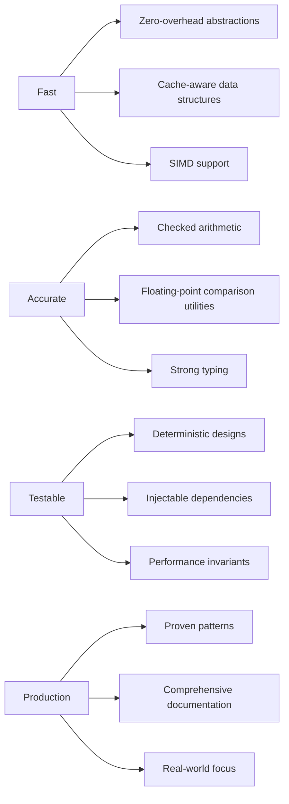
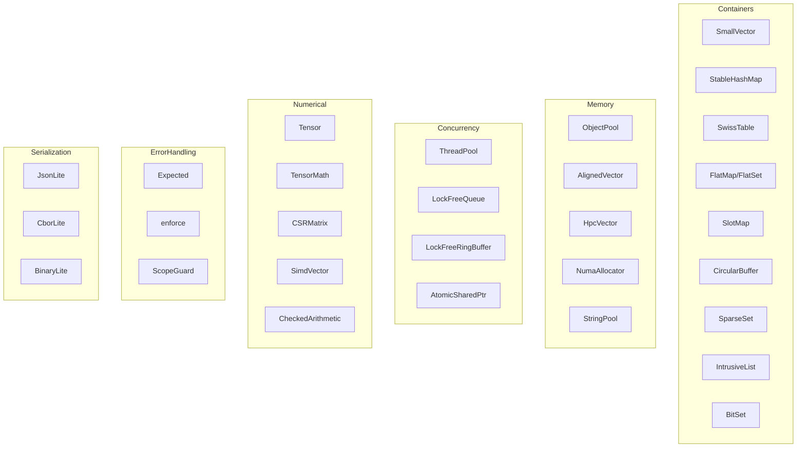
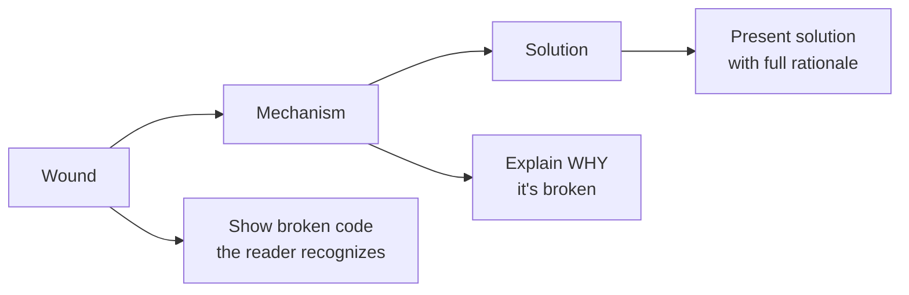

# FAT-P

### A Modern C++ Library for Scientific Computing and High-Performance Applications

**Authors:** Claude (Anthropic), ChatGPT (OpenAI), Gemini (Google), Grok (xAI)  
**Human Direction:** Matthew Schroeder  
[Full discussion: [AUTHORS.md](AUTHORS.md)]

---

## What is FAT-P?

FAT-P is a header-only C++ library providing foundational components for scientific computing, simulations, and high-performance applications. It prioritizes:



The library is designed for HPC and simulation codebases—contexts where correctness matters, performance is non-negotiable, and code must be maintainable for years.

---

## Design Philosophy

### Zero-Overhead Abstraction

If you don't use a feature, you don't pay for it. Policy-based designs let you choose exactly the tradeoffs you need:

```cpp
// Zero-cost for single-threaded use
using FastPool = fat_p::ObjectPool<Widget, fat_p::SingleThreadedPolicy>;

// Thread-safe when you need it
using SharedPool = fat_p::ObjectPool<Widget, fat_p::MutexSynchronizationPolicy>;
```

### Correctness by Construction

APIs are designed to make misuse difficult or impossible:

```cpp
// Strong types prevent ID confusion
using UserId = fat_p::StrongId<uint64_t, struct UserIdTag>;
using OrderId = fat_p::StrongId<uint64_t, struct OrderIdTag>;

UserId user{12345};
OrderId order{67890};
// process_order(user);  // Compilation error — can't pass UserId where OrderId expected
```

### Performance as an Invariant

Performance guarantees are specified, tested, and enforced—not just benchmarked:


```cpp
// StableHashMap guarantees: no degradation under churn
// This can be tested as an invariant, not just benchmarked
auto aged_lookup = measure_lookup(after_1M_insert_delete_cycles);
auto fresh_lookup = measure_lookup(fresh_table);
ASSERT_LT(aged_lookup / fresh_lookup, 1.25);  // Testable invariant
```

### Documentation-Driven Development

Every component has accompanying documentation explaining not just *how* to use it, but *why* it was designed that way and *when* to choose it over alternatives.

---

## Component Overview



### Containers

| Component | Description | Key Feature |
|-----------|-------------|-------------|
| **SmallVector** | Vector with inline storage for small sizes | No heap allocation for N ≤ capacity |
| **StableHashMap** | Hash map without iterator invalidation | Pointer/reference stability on insert |
| **SwissTable** | High-performance hash table (Google-style) | SIMD probing, high load factors |
| **FlatMap / FlatSet** | Sorted vector-based associative containers | Cache-friendly, binary search |
| **SlotMap** | Generational index container | O(1) validity checking, no dangling handles |
| **CircularBuffer** | Fixed-size ring buffer | Lock-free SPSC variant available |
| **SparseSet** | Dense iteration over sparse IDs | Entity-component systems |
| **IntrusiveList** | Intrusive doubly-linked list | No allocation per node |
| **BitSet** | Fixed and dynamic bit sets | SIMD population count |

### Memory Management

| Component | Description | Key Feature |
|-----------|-------------|-------------|
| **ObjectPool** | Pool allocator for fixed-size objects | O(1) allocate/deallocate |
| **AlignedVector** | Vector with custom alignment | SIMD-friendly data layout |
| **HpcVector** | NUMA-aware vector | Memory placement control |
| **NumaAllocator** | NUMA-aware allocator | Cross-node optimization |
| **StringPool** | Interned string storage | Deduplicated, stable pointers |
| **AllocationStrategy** | Pluggable allocation policies | Growth strategies, alignment |

### Concurrency

| Component | Description | Key Feature |
|-----------|-------------|-------------|
| **ThreadPool** | Work-stealing thread pool | Task graphs, priorities |
| **LockFreeQueue** | MPMC lock-free queue | Wait-free fast path |
| **LockFreeRingBuffer** | SPSC lock-free ring buffer | Zero contention |
| **AtomicSharedPtr** | Lock-free shared_ptr operations | Atomic load/store/exchange |
| **ConcurrencyPolicies** | Policy classes for thread safety | Single-threaded to RW-locked |
| **AsyncOperations** | Composable async primitives | Future chaining |

### Numerical Computing

| Component | Description | Key Feature |
|-----------|-------------|-------------|
| **Tensor** | N-dimensional array | Strided views, einsum |
| **TensorMath** | Element-wise and reduction ops | SIMD acceleration |
| **TensorEinsum** | Einstein summation notation | Arbitrary contractions |
| **CSRMatrix** | Compressed sparse row matrix | SpMV, parallel variants |
| **SimdVector** | Explicit SIMD vector types | SSE2/AVX2/NEON |
| **CheckedArithmetic** | Overflow-checked operations | Policy-based error handling |
| **FloatingPointComparison** | ULP and relative comparisons | Tolerance specifications |

### Serialization

| Component | Description | Key Feature |
|-----------|-------------|-------------|
| **JsonLite / JsonStreamLite** | JSON parsing and generation | Streaming and DOM modes |
| **CborLite / CborStreamLite** | CBOR binary format | Compact, schema-less |
| **BinaryLite** | Raw binary serialization | Zero-copy where possible |
| **TensorSerializer** | Tensor I/O | Multiple format support |

### Error Handling & Contracts

| Component | Description | Key Feature |
|-----------|-------------|-------------|
| **Expected** | `Result<T, E>` sum type | Monadic error handling |
| **enforce** | Contract assertions | Configurable violation handling |
| **ScopeGuard** | RAII cleanup actions | Exception-safe rollback |
| **ContractException** | Rich contract violations | Source location, context |

### Utilities

| Component | Description | Key Feature |
|-----------|-------------|-------------|
| **StrongId** | Type-safe ID wrappers | Prevent ID type confusion |
| **EnumPlus** | Enhanced enumerations | String conversion, iteration |
| **Signal** | Observer pattern | Type-safe signals/slots |
| **StateMachine** | Finite state machine | Compile-time transition validation |
| **Factory** | Runtime type creation | Self-registration, policies |
| **Reflection** | Compile-time reflection | Member enumeration |
| **PipeOperator** | Functional pipelines | Range-style composition |
| **IdGenerator** | Unique ID generation | Thread-safe, configurable |

### Diagnostics & Testing

| Component | Description | Key Feature |
|-----------|-------------|-------------|
| **DiagnosticLogger** | Structured logging | JSON output, configurable sinks |
| **BenchmarkHarness** | Microbenchmark framework | Statistical analysis |
| **FatPTest** | Test utilities | Zero-dependency assertions, fixtures |
| **Stacktrace** | Stack trace capture | Cross-platform |
| **DebugOnly** | Debug-build-only code | Zero cost in release |
| **CacheUtilities** | Cache behavior analysis | Prefetch hints |

### I/O

| Component | Description | Key Feature |
|-----------|-------------|-------------|
| **MemoryMappedFile** | Memory-mapped file I/O | Cross-platform |
| **SlidingFileWindow** | Windowed file access | Large file streaming |
| **RateLimiter** | Throughput control | Token bucket algorithm |

---

## Documentation Suite

FAT-P includes comprehensive documentation that teaches *design thinking*, not just API usage:

### Teaching Documents

Cross-cutting guides that apply across the library:

- **Class design** — RAII, move semantics, exception safety, testability, concurrency
- **Pattern guides** — Factory patterns, self-registration, configuration handling
- **Performance** — Making performance guarantees testable and enforceable
- **Historical context** — Why C++ features exist, the problems they solved

### Component Documentation

Every component includes:

- **Overview** — Design rationale, tradeoffs, when to use (and when not to)
- **User Manual** — Complete API reference with examples
- **Companion Guide** — Advanced patterns, integration strategies (where applicable)

Documentation follows a consistent structure: start with the problem, explain why naive solutions fail, present the design with full rationale.

### Documentation Philosophy



No bullet-point API dumps. No "best practices" without justification. Every recommendation comes with the context needed to know when it applies—and when it doesn't.

---

## Quick Start

### Header-Only Installation

```bash
# Clone the repository
git clone https://github.com/your-username/fat-p.git

# Add to your include path
g++ -std=c++17 -I/path/to/fat-p/include your_code.cpp
```

### Example: SmallVector

```cpp
#include "SmallVector.h"

// Stack-allocated for small sizes, heap for large
fat_p::SmallVector<int, 16> vec;

for (int i = 0; i < 10; ++i) {
    vec.push_back(i);  // No heap allocation—fits in inline storage
}

vec.resize(100);  // Now heap-allocated, but seamless API
```

### Example: StableHashMap

```cpp
#include "StableHashMap.h"

fat_p::StableHashMap<std::string, Widget> widgets;

widgets.emplace("button", Widget{...});
Widget* ptr = &widgets["button"];

widgets.emplace("slider", Widget{...});  // ptr still valid!
// Unlike std::unordered_map, insertion doesn't invalidate pointers
```

### Example: Expected

```cpp
#include "Expected.h"

fat_p::Expected<Config, ParseError> load_config(const std::string& path) {
    auto file = open_file(path);
    if (!file) {
        return fat_p::make_unexpected(ParseError::FileNotFound);
    }
    return parse(*file);
}

// Monadic chaining
auto result = load_config("settings.json")
    .and_then(validate)
    .transform(apply_defaults);

if (result) {
    use(*result);
} else {
    log_error(result.error());
}
```

### Example: ScopeGuard

```cpp
#include "ScopeGuard.h"

void transfer(Account& from, Account& to, Money amount) {
    from.withdraw(amount);
    
    auto rollback = fat_p::makeScopeGuard([&] {
        from.deposit(amount);  // Undo withdrawal if we don't reach commit
    });
    
    to.deposit(amount);  // Might throw
    
    rollback.dismiss();  // Success—don't roll back
}
```

### Example: Checked Arithmetic

```cpp
#include "CheckedArithmetic.h"

// Overflow-checked operations with Expected return
auto result = fat_p::checked_add<fat_p::ReturnExpectedPolicy>(a, b);
if (result) {
    use(*result);
} else {
    handle_overflow();
}

// Or with throwing policy (default)
try {
    auto sum = fat_p::checked_add(a, b);  // Throws on overflow
    use(sum);
} catch (const std::exception& e) {
    handle_overflow();
}
```

### Example: Factory with Self-Registration

```cpp
#include "Factory.h"

// Define the factory type
using ModelFactory = fat_p::Factory<
    std::string, 
    std::unique_ptr<PhysicsModel>
>;

// Global factory instance
ModelFactory& getModelFactory() {
    static ModelFactory factory;
    return factory;
}

// In NavierStokes.cpp — self-registration
namespace {
    const bool registered = [] {
        getModelFactory().registerType("navier_stokes", 
            [] { return std::make_unique<NavierStokesModel>(); });
        return true;
    }();
}

// In main.cpp — no knowledge of concrete types
auto result = getModelFactory().make(config.model_name);
if (result) {
    auto model = std::move(*result);
}
```

---

## Requirements

### Compiler Support

| Compiler | Minimum Version | Recommended |
|----------|-----------------|-------------|
| GCC | 7.0 | 11+ |
| Clang | 6.0 | 14+ |
| MSVC | 19.14 (VS 2017 15.7) | 19.30+ (VS 2022) |

### C++ Standard

- **Required:** C++17
- **Optional:** C++20 for concepts, ranges, and coroutine support

### Dependencies

**None for core library.** FAT-P is header-only with no external dependencies.

Optional dependencies for specific features:
- **Threading:** Standard library `<thread>`, `<mutex>`, `<atomic>`
- **SIMD:** Compiler intrinsics (auto-detected)
- **NUMA:** `libnuma` on Linux (optional, graceful fallback)

---

## Building Tests

```bash
mkdir build && cd build
cmake .. -DFATP_BUILD_TESTS=ON
make -j$(nproc)
ctest --output-on-failure
```

### Test Coverage

Every component has corresponding tests in `test_ComponentName.h` and `test_ComponentName.cpp`. Tests cover:

- Correctness invariants
- Exception safety guarantees  
- Edge cases and error conditions
- Thread safety (where applicable)

---

## Project Structure

```
fat-p/
├── include/                 # Header files (the library)
│   ├── SmallVector.h
│   ├── StableHashMap.h
│   ├── Expected.h
│   └── ...
├── tests/                   # Test files
│   ├── test_SmallVector.h
│   ├── test_SmallVector.cpp
│   └── ...
├── docs/                    # Documentation
└── examples/                # Usage examples
```

---

## Philosophy in Practice

### What FAT-P Is

- **Foundational components** for building larger systems
- **Teaching material** that explains design decisions
- **A demonstration** that AI and humans can collaborate to produce professional-grade C++

### What FAT-P Is Not

- **A framework** — it's a library; you call it, it doesn't call you
- **A standard library replacement** — it complements `std::`
- **Bleeding-edge only** — it targets C++17 for broad compatibility

---

## Contributing

FAT-P welcomes contributions. Before submitting:

1. **Read the documentation** — understand the design philosophy
2. **Follow existing patterns** — consistency matters
3. **Include tests** — correctness and performance invariants
4. **Document your work** — explain *why*, not just *what*

---

## License

MIT License. See [LICENSE](LICENSE) for details.

---

## Acknowledgments

FAT-P builds on decades of C++ community wisdom:

- The STL and Boost communities for establishing patterns
- Google's Abseil for SwissTable and related designs
- The Game Development community for SlotMap and ECS patterns
- David Abrahams for exception safety formalization
- The ISO C++ Committee for a language worth mastering

---

*FAT-P — Because "fast enough" isn't a specification.*
