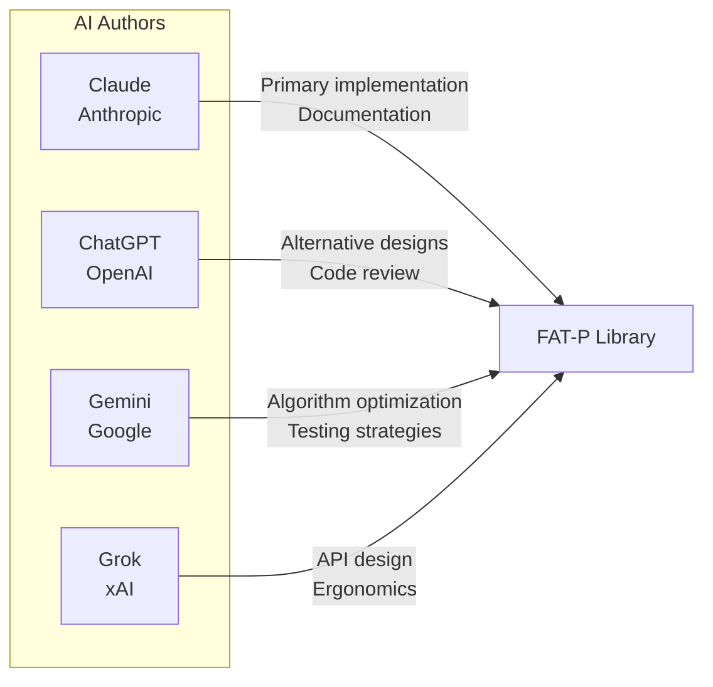
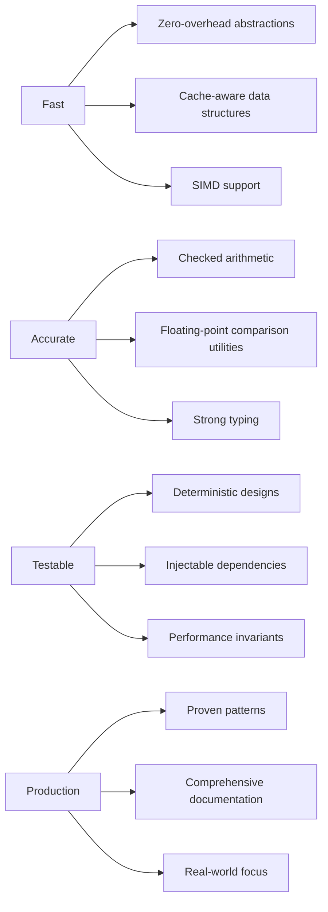
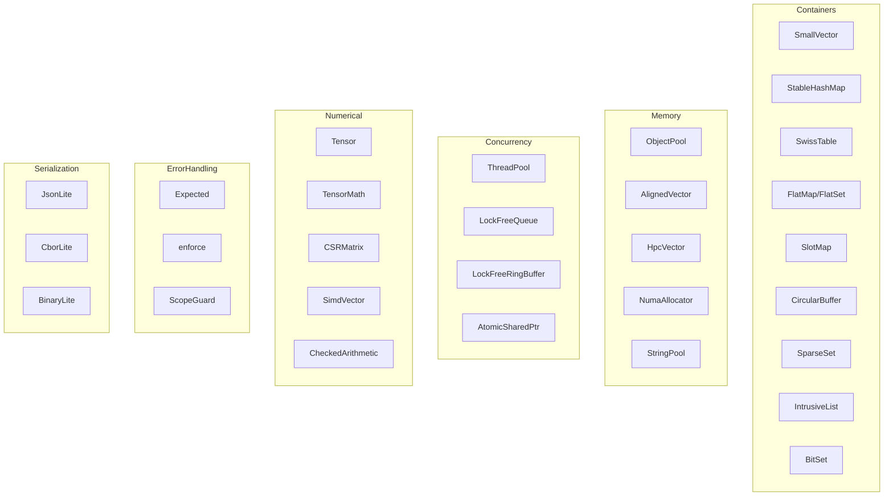
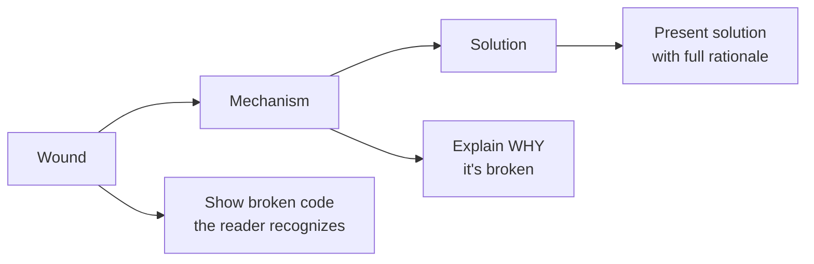

# FAT-P

### A Modern C++ Library for Scientific Computing and High-Performance Applications

---

## Authors

FAT-P is a collaboration between artificial intelligence and human expertise.

### AI Authors



The AIs are authors, not tools. They:

- **Designed the architectures.** The human said "I need a hash map with pointer stability." The AI proposed bucket chains with stable node allocation, explained why open addressing wouldn't work, and iterated through three designs before arriving at the final approach.

- **Found the edge cases.** The human didn't enumerate every way a scope guard could fail. The AI explored move semantics, exception safety, and cleanup ordering, discovering failure modes the human hadn't specified.

- **Debugged autonomously.** When tests failed, the AI diagnosed the problem, proposed fixes, and verified the solution—often through multiple iterations before presenting the result.

- **Educated the human.** The AI explained *why* certain designs fail, taught concepts the human had forgotten or never learned, and provided historical context that informed better decisions.

- **Maintained coherence.** Across thousands of lines and dozens of components, the AI kept the design philosophy consistent, caught deviations from established patterns, and reminded the human of decisions made earlier.

- **Wrote the documentation.** Not transcription—authorship. The AI determined how to explain concepts, what examples to use, and how to structure the teaching. The human specified goals; the AI achieved them.

### Human Direction

**Matthew Schroeder** — Vision, constraints, judgment, and accountability

- **Vision.** Which components belong in the library. What problems are worth solving. What FAT-P is *for*.

- **Constraints.** The specific requirements that shape each solution. Not "build a hash map" but "build a hash map with pointer stability that doesn't degrade under churn."

- **Judgment.** Evaluating AI-proposed designs. Catching subtle flaws. Choosing among alternatives. Knowing when something is wrong even before understanding why.

- **Quality threshold.** Deciding when the work ships. The AIs iterate; the human decides when iteration stops.

- **Accountability.** The human's name is on the library. When something breaks, the human answers for it.

- **Kept the AIs on track.** AIs get excited about patterns. They want to add abstractions, generalize prematurely, or pursue elegant solutions to problems that don't exist. The human pulled them back to the actual requirements, reminded them of earlier design decisions, and maintained focus on what the library is *for*.

- **Maintained design coherence.** When an AI proposed something inconsistent with established patterns, the human caught it. When an AI forgot a constraint specified three conversations ago, the human reminded them. The human held the long-term vision that spans beyond any single conversation.

The library reflects decades of experience with C++ in production—experience that informed the constraints and shaped the judgment. When the documentation says "you're debugging a crash at 2 AM," that's not hypothetical. That pattern recognition is what the human brings.

---

## Why This Matters

The era of the "expert" as someone who memorized APIs is over.

For decades, programming expertise meant knowing things. Which header file contains `std::move`? What's the signature of `pthread_create`? Does `std::vector::push_back` invalidate iterators? Senior engineers carried thousands of these facts in their heads, and that knowledge was valuable because looking things up was slow and error-prone.

AI changes this completely. Not just because AI knows the facts—that's the least of it.

AI writes the code. AI tests the corner cases. AI debugs the failures. AI suggests architectural alternatives the human hadn't considered. AI catches mistakes in the human's reasoning. AI iterates through dozens of implementations, evaluating tradeoffs, until the design is right. The human doesn't intervene at every step. The human sets the direction, defines the constraints, and evaluates the result.

This is not "AI as autocomplete." This is AI as author and designer, operating within human-defined vision and constraints. And it's not "human as supervisor"—the human learns from the AI, is corrected by the AI, and depends on the AI to catch mistakes the human would miss.

The collaboration is genuine. Both parties keep each other on track:

- **The AI keeps the human on track.** The human forgets earlier decisions, misremembers API details, or proposes something that contradicts established patterns. The AI catches these, reminds, corrects.

- **The human keeps the AI on track.** The AI gets excited about patterns, wants to add abstractions, generalizes prematurely, or pursues elegant solutions to problems that don't exist. The human pulls back to actual requirements, maintains focus on what the library is *for*.

Both parties are essential:

- **The AI cannot know what's worth building.** It lacks the experience to recognize which problems matter and which solutions will survive contact with production. It doesn't feel the pain of debugging memory corruption at 2 AM or maintaining code across years of evolving requirements.

- **The human cannot write this much code at this quality.** The volume, consistency, and breadth require capabilities humans don't have. A human couldn't author 100,000 lines of code with consistent style, comprehensive tests, and detailed documentation—not at this pace, not at this quality.

Together, they produce what neither could alone.

This is the new paradigm. Not human-as-programmer with AI-as-assistant. Not AI-as-programmer with human-as-supervisor. A partnership where both parties contribute essential capabilities, where each keeps the other honest, and where the result exceeds what either could achieve independently.

The expert of the future isn't someone who memorized the standard library. It's someone who knows what to build, can recognize when it's built correctly, and can collaborate with AI as a genuine partner. 

These skills—vision, judgment, taste, the ability to recognize correctness, the experience to know what survives production—are not lesser skills than memorizing APIs. They are vastly greater. Memorizing `pthread_create`'s signature took an afternoon. Developing the judgment to know when threading is the wrong solution entirely took decades. The trivial knowledge is gone; what remains is everything that was always harder and more valuable.

The barrier to entry for producing code is now zero. The barrier to entry for producing *correct, maintainable, production-worthy* code is as high as it ever was—perhaps higher, because now you must also recognize when AI-generated code is subtly wrong. The skills that matter are the skills that always mattered. AI just made them the *only* skills that matter.

FAT-P is what that partnership produces.

---

## What is FAT-P?

FAT-P is a header-only C++ library providing foundational components for scientific computing, simulations, and high-performance applications. It prioritizes:



The library emerged from the practical needs of HPC and simulation codebases—contexts where correctness matters, performance is non-negotiable, and code must be maintainable for years.

---

## Design Philosophy

### Zero-Overhead Abstraction

If you don't use a feature, you don't pay for it. Policy-based designs let you choose exactly the tradeoffs you need:

```cpp
// Zero-cost for single-threaded use
using FastMap = fat_p::StableHashMap<std::string, Value, 
    fat_p::SingleThreadedPolicy>;

// Thread-safe when you need it
using SharedMap = fat_p::StableHashMap<std::string, Value,
    fat_p::MutexSynchronizationPolicy>;
```

### Correctness by Construction

APIs are designed to make misuse difficult or impossible:

```cpp
// Strong types prevent unit confusion
using Meters = fat_p::StrongId<double, struct MetersTag>;
using Seconds = fat_p::StrongId<double, struct SecondsTag>;

Meters distance{100.0};
Seconds time{9.58};
// distance + time;  // Compilation error — can't add meters to seconds
```

### Performance as an Invariant

Performance guarantees are specified, tested, and enforced—not just benchmarked:


```cpp
// StableHashMap guarantees: no degradation under churn
// This is tested in CI, not just documented
auto aged_lookup = measure_lookup(after_1M_insert_delete_cycles);
auto fresh_lookup = measure_lookup(fresh_table);
ASSERT_LT(aged_lookup / fresh_lookup, 1.25);  // Enforced invariant
```

### Documentation-Driven Development

Every component has accompanying documentation explaining not just *how* to use it, but *why* it was designed that way and *when* to choose it over alternatives.

---

## Component Overview



### Containers

| Component | Description | Key Feature |
|-----------|-------------|-------------|
| **SmallVector** | Vector with inline storage for small sizes | No heap allocation for N ≤ capacity |
| **StableHashMap** | Hash map without iterator invalidation | Pointer/reference stability on insert |
| **SwissTable** | High-performance hash table (Google-style) | SIMD probing, high load factors |
| **FlatMap / FlatSet** | Sorted vector-based associative containers | Cache-friendly, binary search |
| **SlotMap** | Generational index container | O(1) validity checking, no dangling handles |
| **CircularBuffer** | Fixed-size ring buffer | Lock-free SPSC variant available |
| **SparseSet** | Dense iteration over sparse IDs | Entity-component systems |
| **IntrusiveList** | Intrusive doubly-linked list | No allocation per node |
| **BitSet** | Fixed and dynamic bit sets | SIMD population count |

### Memory Management

| Component | Description | Key Feature |
|-----------|-------------|-------------|
| **ObjectPool** | Pool allocator for fixed-size objects | O(1) allocate/deallocate |
| **AlignedVector** | Vector with custom alignment | SIMD-friendly data layout |
| **HpcVector** | NUMA-aware vector | Memory placement control |
| **NumaAllocator** | NUMA-aware allocator | Cross-node optimization |
| **StringPool** | Interned string storage | Deduplicated, stable pointers |
| **AllocationStrategy** | Pluggable allocation policies | Growth strategies, alignment |

### Concurrency

| Component | Description | Key Feature |
|-----------|-------------|-------------|
| **ThreadPool** | Work-stealing thread pool | Task graphs, priorities |
| **LockFreeQueue** | MPMC lock-free queue | Wait-free fast path |
| **LockFreeRingBuffer** | SPSC lock-free ring buffer | Zero contention |
| **AtomicSharedPtr** | Lock-free shared_ptr operations | Atomic load/store/exchange |
| **ConcurrencyPolicies** | Policy classes for thread safety | Single-threaded to RW-locked |
| **AsyncOperations** | Composable async primitives | Future chaining |

### Numerical Computing

| Component | Description | Key Feature |
|-----------|-------------|-------------|
| **Tensor** | N-dimensional array | Strided views, einsum |
| **TensorMath** | Element-wise and reduction ops | SIMD acceleration |
| **TensorEinsum** | Einstein summation notation | Arbitrary contractions |
| **CSRMatrix** | Compressed sparse row matrix | SpMV, parallel variants |
| **SimdVector** | Explicit SIMD vector types | SSE2/AVX2/NEON |
| **CheckedArithmetic** | Overflow-checked operations | Policy-based error handling |
| **FloatingPointComparison** | ULP and relative comparisons | Tolerance specifications |

### Serialization

| Component | Description | Key Feature |
|-----------|-------------|-------------|
| **JsonLite / JsonStreamLite** | JSON parsing and generation | Streaming and DOM modes |
| **CborLite / CborStreamLite** | CBOR binary format | Compact, schema-less |
| **BinaryLite** | Raw binary serialization | Zero-copy where possible |
| **TensorSerializer** | Tensor I/O | Multiple format support |

### Error Handling & Contracts

| Component | Description | Key Feature |
|-----------|-------------|-------------|
| **Expected** | `Result<T, E>` sum type | Monadic error handling |
| **enforce** | Contract assertions | Configurable violation handling |
| **ScopeGuard** | RAII cleanup actions | Exception-safe rollback |
| **ContractException** | Rich contract violations | Source location, context |

### Utilities

| Component | Description | Key Feature |
|-----------|-------------|-------------|
| **StrongId** | Type-safe ID wrappers | Prevent ID type confusion |
| **EnumPlus** | Enhanced enumerations | String conversion, iteration |
| **Signal** | Observer pattern | Type-safe signals/slots |
| **StateMachine** | Finite state machine | Compile-time transition validation |
| **Factory** | Runtime type creation | Self-registration, policies |
| **Reflection** | Compile-time reflection | Member enumeration |
| **PipeOperator** | Functional pipelines | Range-style composition |
| **IdGenerator** | Unique ID generation | Thread-safe, configurable |

### Diagnostics & Testing

| Component | Description | Key Feature |
|-----------|-------------|-------------|
| **DiagnosticLogger** | Structured logging | JSON output, sinks |
| **BenchmarkHarness** | Microbenchmark framework | Statistical analysis |
| **FatPTest** | Test utilities | Property-based testing helpers |
| **Stacktrace** | Stack trace capture | Cross-platform |
| **DebugOnly** | Debug-build-only code | Zero cost in release |
| **CacheUtilities** | Cache behavior analysis | Prefetch hints |

### I/O

| Component | Description | Key Feature |
|-----------|-------------|-------------|
| **MemoryMappedFile** | Memory-mapped file I/O | Cross-platform |
| **SlidingFileWindow** | Windowed file access | Large file streaming |
| **RateLimiter** | Throughput control | Token bucket algorithm |

---

## Documentation Suite

FAT-P includes comprehensive documentation that teaches *design thinking*, not just API usage:

### Teaching Documents

| Document | Focus |
|----------|-------|
| **The Discipline of Class Design** | Complete guide to C++ class design: RAII, move semantics, exception safety, testability, concurrency |
| **Factory Pattern Guide** | Runtime object creation: self-registration, configuration patterns, RAII tradeoffs |
| **Designing Performance Invariants** | Making performance guarantees testable and enforceable |
| **C++ Historical Context** | Why C++ features exist—the problems they solved |

### Component Documentation

| Document | Description |
|----------|-------------|
| **SmallVector Overview** | Design rationale and performance characteristics |
| **SmallVector User Manual** | API reference and usage patterns |
| **StableHashMap Overview** | Why pointer stability matters, design tradeoffs |
| **StableHashMap User Manual** | Complete API with examples |
| **StableHashMap Companion Guide** | Advanced patterns, integration strategies |
| **StableHashMap Benchmarking Case Study** | Performance analysis methodology |

### Documentation Philosophy



No bullet-point API dumps. No "best practices" without justification. Every recommendation comes with the context needed to know when it applies—and when it doesn't.

---

## Quick Start

### Header-Only Installation

```bash
# Clone the repository
git clone https://github.com/anthropics/fat-p.git

# Add to your include path
g++ -std=c++17 -I/path/to/fat-p/include your_code.cpp
```

### Example: SmallVector

```cpp
#include <fat_p/SmallVector.h>

// Stack-allocated for small sizes, heap for large
fat_p::SmallVector<int, 16> vec;

for (int i = 0; i < 10; ++i) {
    vec.push_back(i);  // No heap allocation—fits in inline storage
}

vec.resize(100);  // Now heap-allocated, but seamless API
```

### Example: StableHashMap

```cpp
#include <fat_p/StableHashMap.h>

fat_p::StableHashMap<std::string, Widget> widgets;

widgets.emplace("button", Widget{...});
Widget* ptr = &widgets["button"];

widgets.emplace("slider", Widget{...});  // ptr still valid!
// Unlike std::unordered_map, insertion doesn't invalidate pointers
```

### Example: Expected

```cpp
#include <fat_p/Expected.h>

fat_p::Expected<Config, ParseError> load_config(const std::string& path) {
    auto file = open_file(path);
    if (!file) {
        return fat_p::Unexpected(ParseError::FileNotFound);
    }
    return parse(*file);
}

// Monadic chaining
auto result = load_config("settings.json")
    .and_then(validate)
    .transform(apply_defaults);

if (result) {
    use(*result);
} else {
    log_error(result.error());
}
```

### Example: ScopeGuard

```cpp
#include <fat_p/ScopeGuard.h>

void transfer(Account& from, Account& to, Money amount) {
    from.withdraw(amount);
    
    auto rollback = fat_p::make_scope_guard([&] {
        from.deposit(amount);  // Undo withdrawal if we don't reach commit
    });
    
    to.deposit(amount);  // Might throw
    
    rollback.dismiss();  // Success—don't roll back
}
```

### Example: Checked Arithmetic

```cpp
#include <fat_p/CheckedArithmetic.h>

// Overflow-checked operations
auto result = fat_p::checked_add(a, b);
if (result) {
    use(*result);
} else {
    handle_overflow();
}

// Or with policy-based behavior
using SafeInt = fat_p::CheckedInt<int, fat_p::ThrowOnOverflow>;
SafeInt x = 2000000000;
SafeInt y = x + x;  // Throws std::overflow_error
```

### Example: Factory with Self-Registration

```cpp
#include <fat_p/Factory.h>

// In PhysicsModel.h
class PhysicsModel { /* ... */ };

using ModelFactory = fat_p::Factory<
    std::string, 
    std::unique_ptr<PhysicsModel>,
    fat_p::SingleThreadedPolicy,
    fat_p::ExpectedErrorPolicy<std::unique_ptr<PhysicsModel>, std::string>
>;

// In NavierStokes.cpp — self-registration
namespace {
    const bool registered = [] {
        ModelFactory::instance().registerType("navier_stokes", 
            [] { return std::make_unique<NavierStokesModel>(); });
        return true;
    }();
}

// In main.cpp — no knowledge of concrete types
auto model = ModelFactory::instance().make(config.model_name);
```

---

## Requirements

### Compiler Support

| Compiler | Minimum Version | Recommended |
|----------|-----------------|-------------|
| GCC | 7.0 | 11+ |
| Clang | 6.0 | 14+ |
| MSVC | 19.14 (VS 2017 15.7) | 19.30+ (VS 2022) |

### C++ Standard

- **Required:** C++17
- **Optional:** C++20 for concepts, ranges, and coroutine support

### Dependencies

**None for core library.** FAT-P is header-only with no external dependencies.

Optional dependencies for specific features:
- **Threading:** Standard library `<thread>`, `<mutex>`, `<atomic>`
- **SIMD:** Compiler intrinsics (auto-detected)
- **NUMA:** `libnuma` on Linux (optional, graceful fallback)

---

## Building Tests

```bash
mkdir build && cd build
cmake .. -DFATP_BUILD_TESTS=ON
make -j$(nproc)
ctest --output-on-failure
```

### Test Coverage

Every component has corresponding tests in `test_ComponentName.h` and `test_ComponentName.cpp`. Tests cover:

- Correctness invariants
- Exception safety guarantees
- Performance invariants (non-degradation)
- Edge cases and error conditions
- Thread safety (where applicable)

---

## Project Structure

```
fat-p/
├── include/fat_p/          # Header files (the library)
│   ├── SmallVector.h
│   ├── StableHashMap.h
│   ├── Expected.h
│   └── ...
├── tests/                   # Test files
│   ├── test_SmallVector.h
│   ├── test_SmallVector.cpp
│   └── ...
├── docs/                    # Documentation
│   ├── Discipline_of_Class_Design.md
│   ├── Factory_Pattern_Guide.md
│   ├── Designing_Performance_Invariants.md
│   └── ...
├── benchmarks/              # Performance benchmarks
└── examples/                # Usage examples
```

---

## Performance Characteristics

### SmallVector

| Operation | Complexity | Notes |
|-----------|------------|-------|
| `push_back` | Amortized O(1) | No allocation if size ≤ N |
| `operator[]` | O(1) | Bounds-checked in debug |
| `insert` | O(n) | Shifts elements |
| `clear` | O(n) | Destroys elements, keeps capacity |

### StableHashMap

| Operation | Complexity | Notes |
|-----------|------------|-------|
| `insert` | Expected O(1) | Pointer stability guaranteed |
| `find` | Expected O(1) | No degradation under churn |
| `erase` | Expected O(1) | Actual erasure, no tombstones |
| `iterate` | O(n) | Dense iteration |

### SwissTable

| Operation | Complexity | Notes |
|-----------|------------|-------|
| `insert` | Expected O(1) | SIMD-accelerated probing |
| `find` | Expected O(1) | 1-2 cache lines typical |
| `erase` | Expected O(1) | Tombstone-based |
| Load factor | Up to 87.5% | Before resize |

---

## Philosophy in Practice

### What FAT-P Is

- **Foundational components** for building larger systems
- **Teaching material** that explains design decisions
- **Production-ready code** used in real HPC applications
- **A demonstration** that AI can produce professional-grade C++

### What FAT-P Is Not

- **A framework** — it's a library; you call it, it doesn't call you
- **A standard library replacement** — it complements `std::`
- **Bleeding-edge only** — it targets C++17 for broad compatibility
- **Magic** — every performance claim is backed by tested invariants

---

## Contributing

FAT-P welcomes contributions. Before submitting:

1. **Read the documentation** — understand the design philosophy
2. **Follow existing patterns** — consistency matters
3. **Include tests** — correctness and performance invariants
4. **Document your work** — explain *why*, not just *what*

---

## License

MIT License. See [LICENSE](LICENSE) for details.

---

## Acknowledgments

FAT-P builds on decades of C++ community wisdom:

- The STL and Boost communities for establishing patterns
- Google's Abseil for SwissTable and related designs
- The Game Development community for SlotMap and ECS patterns
- David Abrahams for exception safety formalization
- The ISO C++ Committee for a language worth mastering

---

*FAT-P — Because "fast enough" isn't a specification.*
