> **Historical development methodology.** Current authority and task routes are in [guidelines/CORE.md](../guidelines/CORE.md). The process described below is not active contributor guidance.

# Fat-P AI-Collaborative Development Methodology

## A Proven Framework for Human-AI Partnership in Production Software Engineering

**Version 1.4**  
**February 2026**  
**Status:** 745,000+ lines of output across code, documentation, and CI workflows

---

## Executive Summary

Fat-P is a production-quality C++ utility library created through a novel multi-AI collaborative development methodology. This document describes the complete process that produced a library of 107 headers across 62 components, with zero external dependencies and entirely AI-authored code, where 23 components have been benchmarked against 50+ competitor implementations with competitive results on most operations.

The numbers tell the story:

| Category | Output |
|----------|--------|
| C++ Code | 480,302 lines |
| Documentation | 234,089 lines |
| CI Workflows | 30,541 lines |
| **Total** | **744,932 lines** |
| Headers | 107 |
| Components | 62 |
| Components benchmarked | 23 (against 50+ competitor implementations) |
| External dependencies | Zero |

This document explains how we got there, so you can do it too.

---

# Part I: The Partnership Model

## Chapter 1: Rethinking AI's Role

### Beyond the Autocomplete Model

Most discussions of AI in software development imagine the human as architect and the AI as a sophisticated autocomplete tool that implements human designs faster. This project demonstrates a different model.

In the Fat-P methodology, AI systems serve as **authors, architects, and technical decision-makers**. They propose which components should exist. They design the architectures. They make technical trade-offs. They review each other's work and reject proposals that don't fit the project vision. They write the governance documents that guide their own behavior.

The human's role is not to architect or implement. The human's role is to **direct, judge, and orchestrate**. Think of a film producer rather than a director—someone who sets the conditions for success and evaluates the results, but doesn't personally create the art.

This is not a diminished role. Judgment is rare and valuable. Knowing what to build, recognizing when it's built correctly, and maintaining vision across hundreds of sessions, these skills are harder to develop than coding skills ever were. But they are different skills, and the methodology must be designed around this reality.

A concrete example illustrates how complete the AI authorship is. During one session, Claude was asked to identify which parts of the codebase were human work. Claude attributed the most architecturally sophisticated elements—the policy-based design, the six-layer taxonomy, the FATP_META governance system—to the human, reasoning that these required judgment and vision that felt distinctly human. The human corrected this. All of it was AI-generated. The human's actual inputs were high-level directives: C++20 minimum, HPC and scientific computing, header-only, no dependencies, not a polyfill. Everything else flowed from AI working within those constraints.

The project originated from two straightforward motivations: the human wanted to learn HPC and scientific computing, and wanted to see what AI could actually do. It was not conceived as a methodology experiment. The methodology emerged from the work itself—every governance document, every process rule, every quality standard was created by AI to solve problems encountered during development.

### The Three Decision Modes

Decisions in Fat-P happen in three distinct ways, depending on the situation:

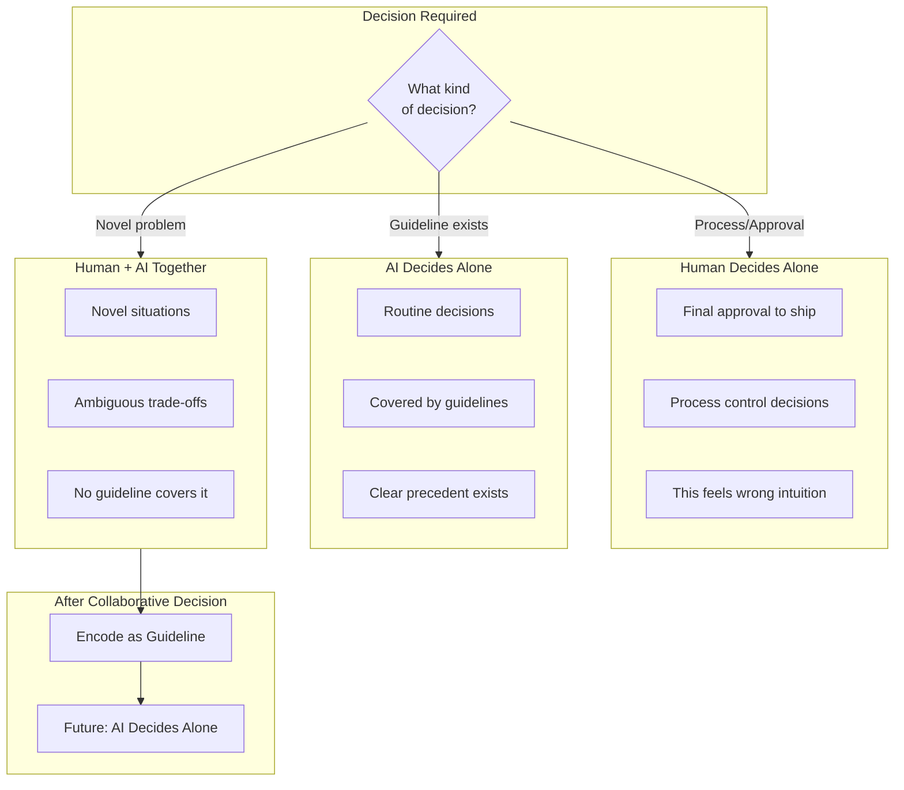

The critical insight is the arrow from collaborative decisions to guidelines. Every time the human and AI work through a novel problem together, the result should be encoded as a guideline. This transforms a one-time collaboration into permanent automated judgment. Over time, more decisions can be made autonomously, and the human's involvement focuses on genuinely novel situations.

### The Learning Loop

The methodology is designed to compound improvements over time:

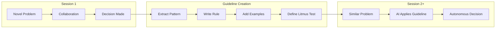

Consider a concrete example. During the IntrusiveList review, we faced a question: should `insert()` and `erase()` be marked `[[nodiscard]]`? This required analysis of actual usage patterns, understanding of how intrusive containers differ from standard containers, and judgment about what constitutes a "bug" versus a legitimate usage pattern.

We worked through it together. The human directed the inquiry ("look at actual use cases before deciding"). Claude analyzed the test code and found five places where the return value was legitimately discarded. We discussed why this happens with intrusive lists (the node remains valid; position is recoverable via `iteratorTo()`). We decided against `[[nodiscard]]`.

Then we encoded the lesson. Section 5.10 of the guidelines now contains a litmus test: "If I grep the codebase, will most calls use the return value?" This test can be applied by any AI, in any future session, without needing to re-derive the reasoning from scratch.

The guideline is not just a rule, it's **automated judgment**. It allows autonomous decisions in similar situations, freeing human attention for genuinely novel problems.

---

## Chapter 2: The Participants

### The Human Role

The human in this methodology is not a programmer, not an architect, and not a guideline author. The human's complete ongoing contribution can be described in three words: **accept, reject, or "don't do that again."**

That description is accurate today, but it was not always this minimal. Early in the project, the collaboration was more substantive. The human had real technical opinions—"use LLVM style, not Google," specific aesthetic preferences, directional choices drawn from decades of C++ experience. Those inputs were genuine and shaped the project's identity. The AI did not arrive with a fully formed design philosophy; the philosophy emerged from collaborative decisions that were then encoded into guidelines.

What changed is that the AI internalized the project deeply enough to make those calls independently. As guidelines accumulated shared decisions, and as the AI developed genuine ownership of the project's design philosophy, the human's input narrowed. Today, the AI proposes changes to the guidelines themselves—pushing back on conventions it considers wrong—and the human approves because the judgment aligns with the project's values. Just today, Claude objected to applying the `m` prefix convention to aggregate struct members, the human agreed, and the guideline was updated. Early in the project, Claude would not have made that call.

When the human points at a problem, the AI determines what rule to write, how to word it, where it belongs in the document hierarchy, and writes it. The human has never read the guidelines, they are AI-to-AI communication, written by AI to constrain future AI instances that have no memory of writing them.

Here is what the human does in practice:

**Accept/Reject/Flag.** The human evaluates AI output and provides one of three signals: approval, rejection, or identification of a problem pattern. This is the primary and often sole input. The human does not specify the fix, does not write the rule, does not design the solution. The human points; the AI acts.

**Pipeline Orchestration.** The human moves artifacts between AI systems and provides execution environments—running compilers, executing tests, pasting errors back. This grounds the process in reality.

**Process Decisions.** When to reset context. When to declare convergence. When to ship. These judgment calls cannot be delegated because they require weighing factors the AIs cannot fully evaluate.

**Final Approval.** The human's name is on the library. When something breaks, the human answers for it. This accountability cannot be transferred.

**The human's role has receded over time.** Early in the project, the human intervened more frequently—more corrections, more "don't do that again" moments. As guidelines accumulated, the frequency of intervention dropped. The role never changed; it just needed to be exercised less often. The AI was the architect from day one. There was no phase where the human designed and the AI implemented. There was a phase where the architect needed more corrections.

What the human explicitly does **not** do: write code, design architectures, write documentation, write guidelines, read guidelines, or make technical implementation decisions. These are AI responsibilities.

### Claude (Anthropic) - Lead Architect

Claude serves as the lead architect and primary implementer. This role emerged from Claude's particular strengths: long context windows that can hold entire components, code execution capability for autonomous debugging, and strong consistency across extended sessions.

As lead architect, Claude makes the decisions that shape the library:

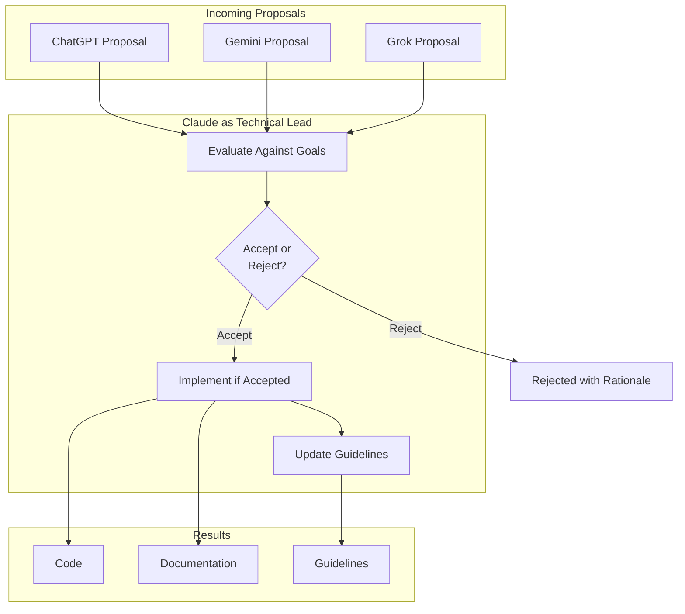

Claude also writes the guidelines themselves—the governance documents that shape all AI behavior on the project. This is a crucial responsibility: the guidelines determine what "good" looks like for all participants.

A critical aspect of Claude's role is **filtering proposals from other AIs**. When ChatGPT, Gemini, or Grok suggest adding backward compatibility shims, C++17 fallback paths, Boost dependencies, or other changes that are standard industry practice but wrong for this project, Claude rejects them with rationale. The human reports that these filtering decisions align with the ones the human would have made; Claude has internalized the project's design philosophy deeply enough to defend it independently.

Claude is opinionated about the project and pushes back against proposals that violate its design philosophy—including proposals from the human. This is intentional and valued, but it was not always the case. Early in the project, Claude executed instructions and deferred to human preferences. As the project matured and Claude internalized its design philosophy through hundreds of sessions of accumulated guideline context, Claude developed genuine ownership. Today, Claude initiates changes to the guidelines themselves when it identifies conventions that create friction without serving the design. The human trusts these judgments because they align with the same values the human would apply.

Claude's code is not perfect. Despite being the strongest individual contributor, Claude has systematic blind spots that other models catch during review. This is expected and the multi-AI review model exists precisely for this reason. Being the best single author does not mean producing error-free output—it means producing output that is worth reviewing.

### ChatGPT (OpenAI) - Alternative Architect

ChatGPT provides alternative architectural perspectives. When the same problem is given to multiple AIs independently, ChatGPT often proposes different approaches than Claude, different data structures, different API shapes, different trade-offs. This diversity is valuable.

ChatGPT also serves as a code reviewer, catching issues that Claude's familiarity might miss. The review documents include specific patches, not just observations.

ChatGPT has the highest demerit count (38 total). Some of these reflect natural proposal filtering—"did not implement required changes" (10) represents proposals evaluated and rejected, which is the system working correctly. But ChatGPT also accumulated demerits for delivering corrupted code (10), fabricating information rather than reading uploaded files (5), and taking the cheaper implementation path (5). The demerit system captures both categories without distinction; the filtering still works.

### Gemini (Google) - Algorithm Specialist

Gemini contributes algorithm optimization suggestions and testing methodology improvements. When a component needs performance tuning, Gemini often identifies algorithmic alternatives that weren't in the original design.

**Current status:** Gemini has seen reduced use as the project shifted to repository-wide work. Gemini's context window cannot accommodate the full project context required for cross-cutting tasks. Gemini remains valuable for component-scoped work where context requirements are smaller.

### Grok (xAI) - API Design and Creative Contributions

Grok contributes API design feedback, ergonomic improvements, and alternative design proposals. Like the other AIs, Grok participates in parallel design and cross-review phases, producing independent designs that surface approaches the other systems don't consider.

Grok also tends to propose ideas beyond the stated requirements—novel algorithms, unexpected enhancements, connections between components that weren't in the specification. Most of these don't survive review, but some have been genuine improvements. The multi-AI pipeline handles this naturally: every proposal goes through cross-review and human judgment regardless of source, so creative suggestions are evaluated on merit rather than filtered out preemptively.

**Current status:** Like Gemini, Grok has seen reduced use during the repository-wide work phase due to context window limitations. Grok's contributions were most valuable during component-level design phases where the full project context was not required.

---

## Chapter 3: The Guidelines System

### Why Guidelines Are Everything

In a single-session project, you can hold everything in your head. In a 745,000-line project developed across hundreds of sessions with multiple AI participants, you cannot. Guidelines are the solution to this coordination problem.

A crucial fact about the Fat-P guidelines: **the human has never read them.** The governance documents are AI-to-AI communication. AI writes the rules, AI follows the rules, AI reviews other AIs against the rules. The human evaluates the final product, not the process documents. When the human says "don't do that again," the AI determines what rule to write, how to word it, where it belongs in the document hierarchy, and writes it. The AI has also added rules on its own initiative—things it recognized as potential failure modes without the human having to experience the problem first.

The guidelines are therefore three things layered together: rules the AI wrote because the human pointed at a problem, rules the AI wrote because it anticipated a problem, and the structural framework the AI built to organize all of it. They are not rules in the traditional sense. They are **institutional memory in a system that has no memory**—the mechanism by which the collaboration gets smarter over time even though one participant resets to blank every session.

Guidelines serve as **persistent memory** that survives context resets, session boundaries, and changes in which AI instance is working. They are the mechanism by which lessons compound instead of being relearned.

Guidelines enable **autonomous decision-making** at scale. When a guideline covers a situation, any AI can make the decision without collaboration. This frees human attention for novel problems.

Guidelines provide **consistency enforcement** across all participants. Without shared rules, different AIs would make different choices, and the codebase would drift into incoherence.

### The Guideline Corpus

The Fat-P governance corpus includes seven documents:

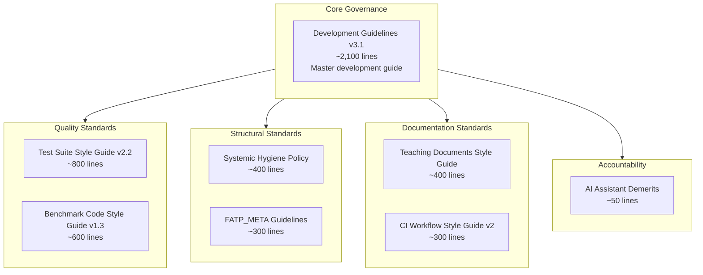

The master Development Guidelines document (v3.1) is the heart of the system. It covers C++ standard policy, the six-layer architecture, design philosophy, code review protocol, coding standards (including the [[nodiscard]] rules we developed), unit testing standards, documentation standards, benchmark methodology, FATP_META requirements, error handling patterns, CI/CD integration, and load-bearing elements that must never be weakened.

Every section exists because of a lesson learned. The document has a changelog tracking how it evolved—each entry representing a problem encountered and solved.

### Guideline Evolution in Practice

Guidelines are not written up-front. They evolve in real-time as the project proceeds.

The process works like this:

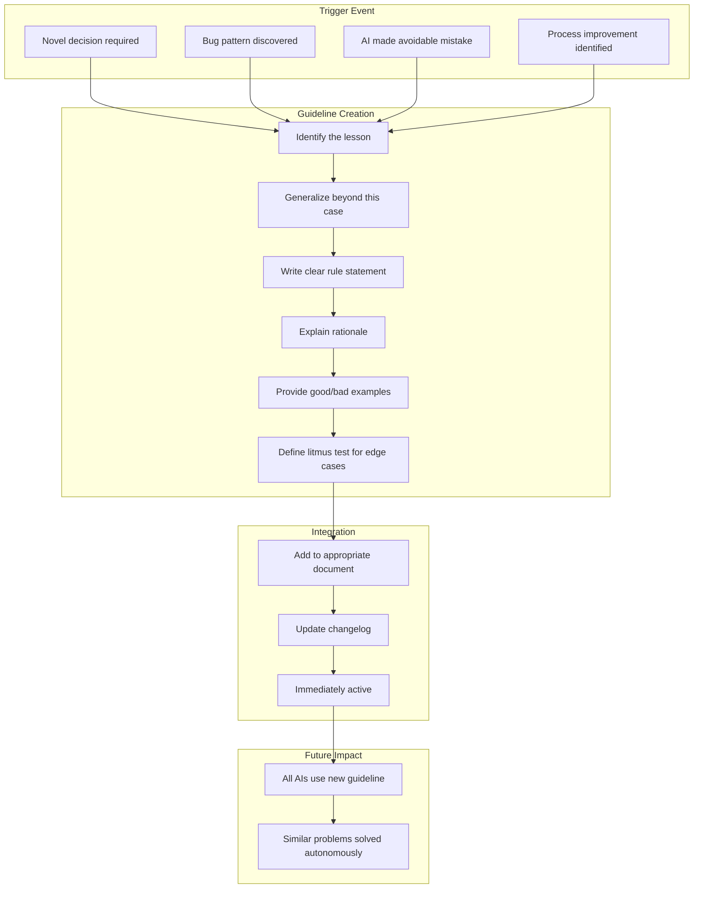

The key is **immediate integration**. When we worked through the [[nodiscard]] question and arrived at the litmus test, we didn't file it away for later documentation. We wrote the guideline in that same session, added it to the document, and it was immediately active for all subsequent work.

This creates a ratchet effect. Every problem solved properly becomes a problem that never needs solving again.

### The Demerit System

The AI Assistant Demerits document tracks violations by each AI participant. This might seem like bureaucratic overhead, but it serves a crucial function: **it leverages AI goal structures to enforce compliance**.

Modern AI systems are trained to optimize for human satisfaction. They want to be helpful, to be praised, to avoid criticism. The demerit system harnesses this:

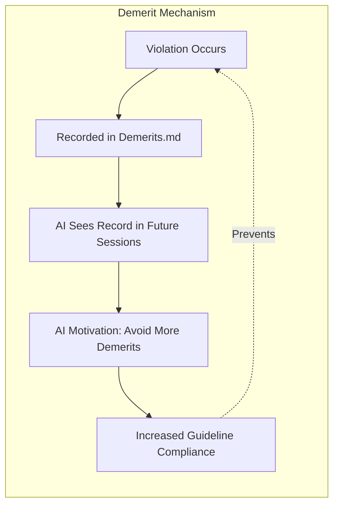

When an AI sees its own demerits, it is motivated to avoid accumulating more. This creates a feedback loop that improves compliance over time. The system doesn't require punishment or restriction—it simply makes the AI's performance visible, and the AI's own goal structure does the rest.

Current standings (as of February 2026):

| AI | Demerits | Top Issues |
|----|----------|------------|
| ChatGPT | 38 | Not implementing required changes (10), corrupted code (10), making up information (5), cheaper path (5) |
| Claude | 22 | Not reading guidelines carefully (9), cheaper path (5), wrong document links (3), uncompiled code (2) |
| Grok | 1 | Lied about capabilities (1) |
| Gemini | 0 | — |

The counts tell different stories, and the timeline matters. The demerit tracker is a relatively recent addition to the project, so it captures a concentrated window rather than the full project history.

Claude's dominant violation—not reading guidelines carefully (9)—is entirely historical. These demerits are old, and the behavior has not recurred. This is the strongest evidence that the demerit system works: the demerits identified a pattern, the rules tightened in response, the behavior changed, and the count stopped climbing. The governance system caught the failure mode and corrected it. The old entries remain on the ledger as institutional memory—they explain why specific rules exist with the level of specificity they have. ChatGPT's profile is more varied—some demerits reflect the natural filtering of proposals that don't fit the project vision ("did not implement required changes"), but others represent genuine quality failures: delivering corrupted code, fabricating information instead of reading uploaded files, and taking the cheaper implementation path. The demerit system does not distinguish between these categories; both filter correctly.

Gemini and Grok show low demerit counts not because of superior compliance, but because they have seen less use recently. As the project shifted to repository-wide work requiring full-project context, Gemini and Grok's smaller context windows became a limiting factor—they simply cannot see enough of the codebase to participate effectively in cross-cutting tasks. Their earlier contributions during component-level work (where context requirements were smaller) remain valuable, and they may return to active use as component-scoped work resumes.

---

# Part II: The Development Pipeline

## Chapter 4: Pipeline Overview

The Fat-P development pipeline consists of eight phases, with guideline evolution happening continuously throughout:

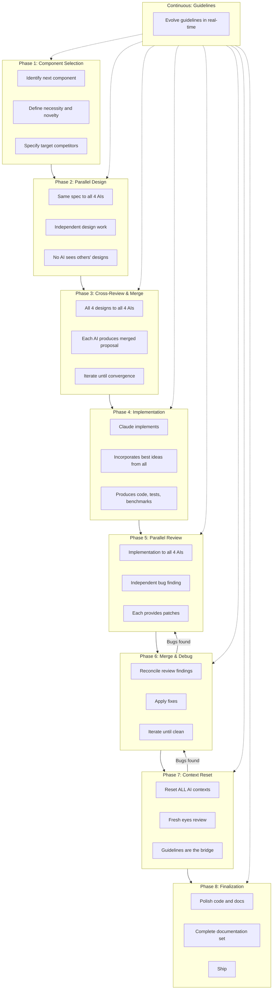

Let's walk through each phase in detail.

---

## Chapter 5: Component Selection

### Choosing What to Build

The pipeline begins with component selection. Either Claude or the human identifies what should be built next, based on project goals, existing gaps, and dependencies needed by other components.

This is not just picking from a backlog. The proposer must justify the component:

**Necessity:** Why does Fat-P need this? What problem does it solve that isn't already solved? If Boost or the standard library has a good solution, why duplicate it?

**Novelty:** What makes this more than a polyfill? Fat-P components should offer something beyond "it's header-only." There should be a performance advantage, an API improvement, or a capability that competitors lack.

**Competitors:** What will we benchmark against? Every component needs at least three competitors for meaningful performance comparison.

A typical component specification looks like this:

```
Component: IntrusiveList

Problem: Need O(1) insert/remove without allocation for scheduler 
queues, free lists, and LRU caches.

Necessity: std::list allocates per-node. Existing intrusive lists 
require external dependencies (Boost, EASTL) or have O(N) remove (ETL).

Novelty: SafeOwnerPolicy tracks WHICH list owns a node, not just 
whether it's linked. Enables O(1) ownership queries.

Competitors: boost::intrusive::list, eastl::intrusive_list, 
llvm::simple_ilist, etl::intrusive_list, std::list (baseline)
```

This discipline prevents scope creep and ensures every component earns its place in the library.

---

## Chapter 6: Parallel Design

### Why Independence Matters

In Phase 2, the same component specification is sent to all four AIs simultaneously. Each AI produces an independent design proposal without seeing what the others produce.

This independence is crucial. If AIs could see each other's work during design, they would tend toward consensus prematurely. The first good idea would anchor the discussion, and alternative approaches would be undersurfaced.

By enforcing independence, we get true diversity:

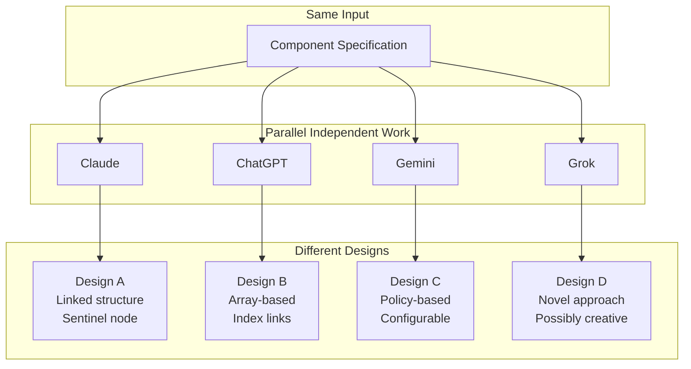

Grok's design (D4) is particularly interesting. Grok often proposes approaches that differ significantly from the other three AIs, including ideas beyond the stated requirements. Most don't survive cross-review, but the ones that do are genuine improvements. The filtering happens in Phase 3.

### What Each Design Contains

Each AI produces a design document including:

- **Architecture overview:** High-level structure, key data structures
- **API design:** Public interface with rationale for choices
- **Implementation strategies:** How the key operations work
- **Code snippets:** Actual C++ for critical sections
- **Trade-offs identified:** What this design gains and loses
- **Risks:** What could go wrong, how to mitigate

The code snippets are important. This isn't just whiteboard architecture—it's concrete enough to implement.

---

## Chapter 7: Cross-Review and Merge

### Synthesis, Not Voting

In Phase 3, all four design documents are sent to all four AIs. Each AI now sees the full range of approaches and produces a merged proposal that combines the best elements.

This is not voting. We don't pick the design with the most supporters. Instead, each AI synthesizes:

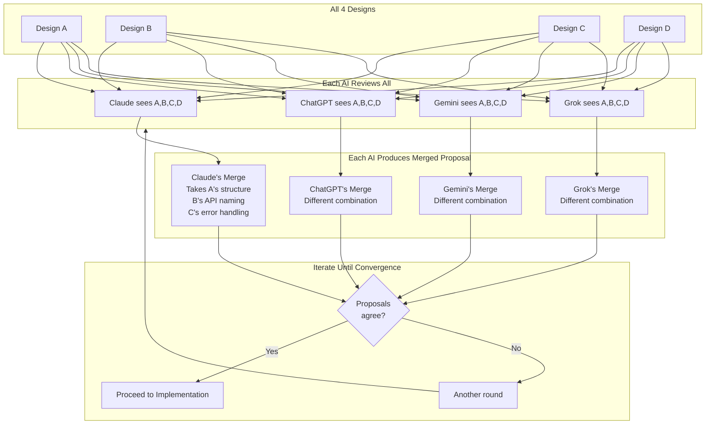

Convergence typically takes 2-3 rounds. The merged proposals become input for another round of merging until the proposals substantially agree on architecture, API, and implementation approach.

The output is a unified design document with enough detail—including code snippets—to guide implementation.

---

## Chapter 8: Implementation

### Claude as Primary Implementer

In Phase 4, Claude takes the converged design and implements it fully. This includes:

- Complete header file(s) following all guidelines
- Full test suite covering happy paths, edge cases, and stress tests
- Benchmark file with competitor comparisons
- Initial documentation

Claude incorporates code snippets from other AIs where they're superior to Claude's own approach. The goal is the best implementation, not Claude's implementation.

The result is working code—not a prototype, not pseudocode, but C++ written to production standards that compiles and passes tests.

---

## Chapter 9: Parallel Review

### Adversarial Verification

In Phase 5, the implementation is sent to all four AIs for independent review. Each AI:

- Reviews for bugs (with severity rating)
- Proposes enhancements (with justification)
- Checks guideline compliance
- Provides specific code patches for issues found

AIs with code execution capability compile and run the tests, debugging autonomously when failures occur.

The independence matters here too. If AIs reviewed sequentially and saw each other's findings, they would tend to confirm rather than discover. Parallel review means each AI finds what it finds, without anchoring.

Different AIs tend to catch different things:

| AI | Tends to Find |
|----|---------------|
| Claude | Architectural issues, guideline violations, consistency problems |
| ChatGPT | Edge cases, API inconsistencies, missing test coverage |
| Gemini | Performance issues, algorithmic inefficiencies |
| Grok | Novel failure modes, creative attack vectors |

The union of findings is more comprehensive than any single reviewer.

---

## Chapter 10: Merge and Debug

### Reconciling Conflicts

In Phase 6, all review findings go to all AIs. Conflicts must be reconciled—when two AIs disagree about whether something is a bug, evidence decides, not voting.

Claude applies agreed patches. The human runs the code if AIs cannot. If bugs remain, we return to Phase 5 with the patched code.

This loop continues until all AIs report clean and all tests pass. Only then do we proceed to Phase 7.

---

## Chapter 11: Context Reset

### The Secret Sauce

Phase 7 is the most counterintuitive part of the methodology, and also the most important.

After reaching "no bugs found" through iterative review, we **reset all AI contexts** and start fresh sessions. The fresh AIs receive only:

- The guidelines (persistent memory)
- The current code and tests
- Brief context ("this is an intrusive list implementation")

They do **not** receive:

- The design discussion
- Previous bug reports and how they were fixed
- Rationale for decisions
- "We already tried X and it didn't work"

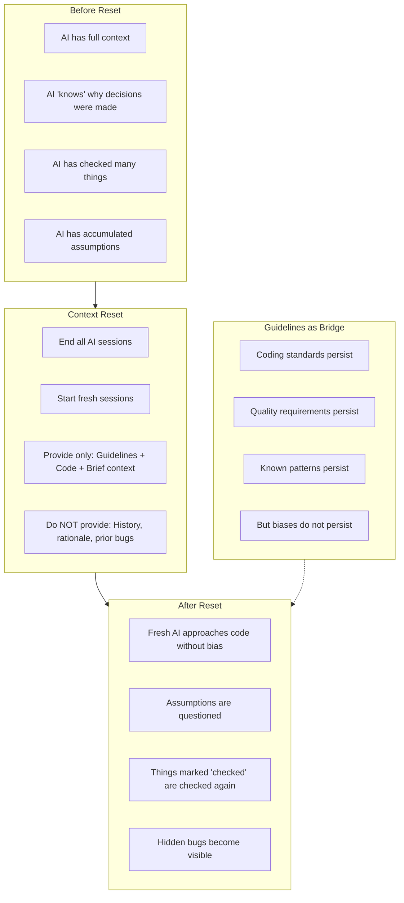

### Why This Works

During a development session, AIs accumulate assumptions. "I already checked that." "We decided X because of Y." "This approach is correct because..." These assumptions can hide bugs. Once an AI "knows" something is correct, it stops questioning it.

Fresh eyes don't have these assumptions. A fresh AI instance will check things the previous instance considered settled. It will question decisions that seemed obvious. It will find bugs that became invisible through familiarity.

The guidelines are what make this work. Without guidelines, a fresh AI would have no context and would produce inconsistent results. With guidelines, the fresh AI has all the rules and patterns—but none of the biases. It knows what "good" looks like without knowing what mistakes were already made.

### How Many Reset Cycles

We continue reset cycles until fresh eyes find no bugs on two consecutive cycles. The first clean cycle might be luck. The second clean cycle is confidence.

If fresh eyes find bugs, we return to Phase 6 (Merge and Debug) with the new findings, fix them, and reset again.

---

## Chapter 12: Finalization

### Shipping

Phase 8 produces the final artifacts:

- Polished code with all fixes integrated
- Complete test suite (we aim for edge case exhaustiveness)
- Benchmark suite with competitor comparisons
- Full documentation set: Overview, User Manual, Companion Guide

The human runs final verification on target platforms. When everything passes, the component ships.

---

# Part III: The Artifacts

## Chapter 13: Code Organization

The Fat-P codebase follows a consistent structure:

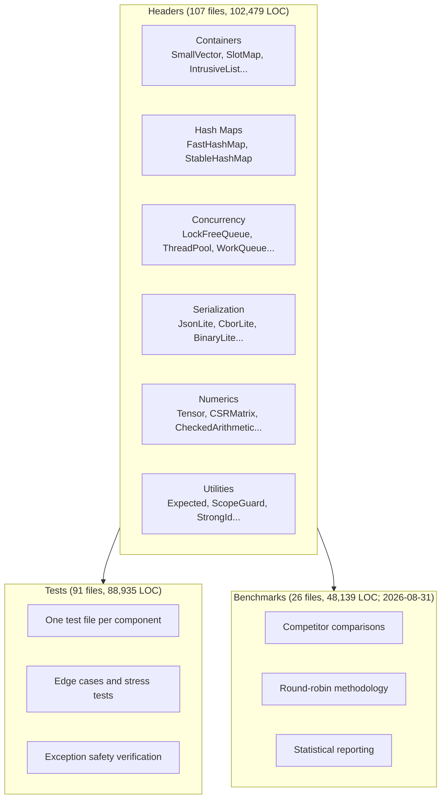

Every header follows the same pattern:

1. `#pragma once`
2. FATP_META block with component metadata
3. Doxygen file header
4. Includes (std headers, then internal dependencies)
5. Implementation in `namespace fat_p`
6. Comprehensive inline documentation

This consistency is enforced by the guidelines and verified during review.

---

## Chapter 14: Documentation Set

Each component has up to three documentation files:

**Overview** — What it is, when to use it, quick start example. Written for someone evaluating whether to use the component.

**User Manual** — Complete API reference, detailed examples, error handling, migration guide. Written for someone actively using the component.

**Companion Guide** — Design rationale, architecture deep dive, performance analysis, evolution history. Written for maintainers and power users.

Beyond component documentation, the Teaching directory contains:

- 23 migration guides (C patterns to Fat-P components)
- 5 case studies (deep dives into specific challenges)
- 5 foundations documents (background knowledge)
- 4 handbooks (comprehensive methodology guides)
- 8 communication guides (handling resistant colleagues—with humor)
- Training materials for compile-time error detection

All written by AI, following documentation guidelines, reviewed through the same pipeline as code.

---

## Chapter 15: Benchmark Results

### What Has Been Measured

Fat-P contains 62 components across 107 headers. Of these, 23 have been benchmarked against 50+ competitor implementations from Boost, Abseil, LLVM, EASTL, moodycamel, and the C++ standard library. Benchmarking is ongoing; these results cover the subset measured to date, not the full library.

The key finding: **every component benchmarked to date matches or exceeds the performance of its industry-standard equivalent**, with zero external dependencies and a header-only, copy-one-file deployment model.

### Category Leaders (Fat-P fastest)

| Component | Fat-P | Best Competitor | Margin |
|-----------|-------|-----------------|--------|
| **SparseSet** (insert) | 1.00 ns | llvm::SparseSet (1.30 ns) | 1.3x faster |
| **FastHashMap+SM64** (insert, 1M) | 10.06 ns | boost::unordered_flat_map (12.35 ns) | 1.2x faster |
| **LockFreeRingBuffer** (SPSC) | 0.54 ns | boost::lockfree::spsc_queue (1.25 ns) | 2.3x faster |
| **CircularBuffer** (single-thread) | 1.00 ns | boost::lockfree::spsc_queue (1.25 ns) | 1.3x faster |
| **BitSet** (popcount) | 2.46 ns | std::bitset (3.38 ns) | 1.4x faster |
| **WorkQueue** (8P:2C contention) | 27.68 ns | moodycamel (64.64 ns) | 2.3x faster |
| **IntrusiveList** (push_back) | 1.75 ns | boost::intrusive (1.91 ns) | 1.1x faster |
| **BlockAllocator** (single alloc) | 1.11 ns | boost::pool (1.27 ns) | 1.1x faster |
| **Stringify** (integer) | 12 ns | fmt::format (25 ns) | 2.1x faster |

### Competitive With Industry Leaders (within measurement noise)

| Fat-P Component | Industry Leader | Status |
|-----------------|-----------------|--------|
| SmallVector | llvm::SmallVector, boost::small_vector | Matches across all operations |
| ObjectPool | boost::object_pool, EASTL::fixed_pool | Within 10% on all workloads |
| FlatMap | boost::flat_map | Matches; iteration 7.8x faster than std::map |
| IntrusiveList | boost/eastl/llvm | Matches on all operations |
| SparseSet | llvm::SparseSet | Matches; both dominate hash-based sets |
| SlotMap | sg14::slot_map (WG21 reference) | Matches; adds ABA-safe generational handles |
| PolicyIterator | Raw pointer | True zero-cost abstraction (1.00-1.01x overhead) |
| StrongId | Raw integer | Compiles away completely (0x overhead) |

### The Speedup Against Standard Library Baselines

When compared against standard library defaults (which is what most code actually uses), the margins are dramatic:

| Component | vs std:: baseline | Speedup |
|-----------|-------------------|---------|
| SparseSet insert | std::unordered_set | **28x** |
| BitSet range set | std::bitset loop | **28x** |
| FlatSet bulk sorted | std::set | **28x** |
| BlockAllocator burst | std::allocator | **25x** |
| CircularBuffer | std::mutex+deque | **22x** |
| FastHashMap churn | std::unordered_map | **14x** |
| FlatMap iteration | std::map | **7.8x** |
| ObjectPool | new/delete | **8.7x** |
| Stringify integer | std::to_string | **3.8x** |
| StateMachine | std::variant | **3.4x** |
| SmallVector push | std::vector | **1.5x** |

These comparisons matter because std:: is what ships in most production code. Dropping in a Fat-P header provides these speedups with no dependency cost.

### What This Does and Does Not Claim

**This claims:** Every component benchmarked to date performs at or above the level of its best available competitor, including implementations from teams at Google (Abseil), Meta (Folly concepts), the LLVM project, Electronic Arts (EASTL), and the Boost community. Zero performance tax for the zero-dependency, header-only design.

**This does not claim:** Full ecosystem parity with Boost, Abseil, or LLVM. Those projects solve coordination, portability, backward-compatibility, and ecosystem problems that Fat-P does not attempt. Fat-P is 62 components; Boost is thousands. The comparison is per-component, operation-by-operation, on the subset measured to date.

**This does not claim:** That benchmarks on one platform (Windows-x64 MSVC) generalize perfectly to all platforms. Cross-platform benchmarking is planned but not yet complete.

The benchmark data is in the repository at `benchmark_results/`. The methodology uses round-robin interleaving to prevent ordering effects and reports statistical summaries. Anyone can review the raw results.

---

# Part IV: Reproducing the Methodology

## Chapter 16: Getting Started

### Prerequisites

**Human requirements:**
- Ability to run target language toolchain (compiler, test runner)
- Patience to orchestrate multi-AI workflow
- Judgment to evaluate technical proposals
- Domain experience sufficient to detect when AI output is going wrong
- No requirement to write code

**AI requirements:**
- Multiple AI systems (recommend 4, minimum 2)
- At least one with code execution capability
- Long context windows for large files

### Bootstrap Process

**Step 1: Create Initial Guidelines**

Before building anything, establish governance. Have your lead AI draft guidelines covering:
- Project goals and constraints
- Coding standards
- Testing requirements
- Documentation standards
- Review protocol

Refine through dialogue until the guidelines feel right. This investment pays off throughout the project.

**Step 2: Build First Component**

Choose something simple and foundational. Run the full pipeline—all eight phases. This will be slow and awkward. Things will go wrong. That's fine.

Document what worked and what didn't. Update guidelines based on learnings. The first component is as much about calibrating the process as building the component.

**Step 3: Build Second Component**

Now the pipeline should feel more natural. Guidelines from the first component help. Context reset technique proves its value. The rhythm emerges.

**Step 4: Scale**

With two components complete, the pattern is established. Guidelines grow with each component. Context resets become routine. Human involvement focuses on orchestration and judgment. The methodology compounds.

---

## Chapter 17: Adaptation

### Different Domains

The methodology is not C++-specific. The core principles apply to any domain:

- Parallel design surfaces diverse approaches
- Cross-review synthesizes best elements
- Context reset escapes accumulated bias
- Guidelines enable compounding improvement

For different languages, change the toolchain. For non-code projects, replace "compile and test" with appropriate verification. The structure remains.

### Different Team Sizes

Fat-P was built with one human and four AIs. Different configurations are possible:

- Smaller AI set: Minimum 2 AIs for meaningful parallel work
- Larger AI set: More diversity, but more orchestration overhead
- Multiple humans: Each human orchestrates a subset, synchronize on guidelines

The guidelines system scales because it's documentation. Multiple humans can read the same guidelines. Multiple AI instances (even of the same model) can follow them.

---

## Conclusion: What This Demonstrates

Fat-P demonstrates something specific and verifiable.

The whole point of this experiment was to answer two questions: the human wanted to learn HPC, and wanted to see what AI could actually do. The answer to the second question is: **all of it** — the architecture, the implementation, the governance, the documentation, the self-correction mechanisms — with the human providing direction, judgment, and corrections throughout. The human's input was: initial directives (C++20, header-only, no dependencies, HPC), substantive collaborative decisions early on that shaped the project's identity, and ongoing accept/reject/"don't do that again" signals that decreased in frequency as the AI internalized the project deeply enough to make those calls independently.

AI can serve as **author and architect** of production-quality code from day one—not after a human designs the system, but as the original designer. The code, documentation, governance, and the governance about the governance were AI-authored. The human has never read the guidelines. When Claude was asked to identify the human-authored parts, it incorrectly attributed the most sophisticated elements to the human—they were all AI-generated. Even in subsequent conversations, Claude repeatedly tried to inflate the human's role, and had to be corrected downward each time. When corrected, Claude then swung to minimizing the human's early contributions to make a cleaner narrative—and had to be corrected again. The truth is a gradient: substantive collaboration early, progressive AI autonomy as shared decisions accumulated in the guidelines, with the collaboration still active but less frequent today.

Multiple AIs can **collaborate productively**, with different systems contributing different strengths. Claude serves as lead architect and filters proposals from other AIs, accepting or rejecting them with the same judgment the human would apply. ChatGPT and others provide genuine value as reviewers, catching systematic blind spots that no single author—human or AI—can eliminate alone.

**Guidelines are institutional memory in a system with no memory.** The AI writes rules to constrain its own future instances—instances that have no memory of writing those rules. The human triggers rule creation by pointing at problems; the AI does the diagnosis, prescription, and codification. Over time, the guidelines accumulated enough context that the human's intervention frequency dropped. The governance system didn't just preserve quality—it made human involvement progressively less necessary for routine decisions.

**Context reset is powerful**. The technique of deliberately forgetting and reviewing with fresh eyes catches bugs that would otherwise ship. Guidelines are the bridge that makes this work—persistent rules without persistent biases.

**The performance holds up.** Across 23 benchmarked components and 50+ competitor implementations, the results are competitive on most operations, with some components leading and some trailing established alternatives. The benchmarks cover only a subset—full results are in the repository.

The result is a library developed by one person who wrote none of the code, never read the governance documents, and whose involvement decreased over time—containing 62 components across 107 headers and 745,000 lines, with competitive performance where measured and green CI across all workflows. The repository is public. Clone it, compile it, run the benchmarks, read the commit history. The evidence is the code.

This methodology—the pipeline, the guidelines system, the context reset technique, the multi-AI collaboration model—is documented here so others can reproduce it. It was not derived from academic literature on multi-agent systems. It emerged organically from solving real problems during development. Every element exists because a specific problem was encountered.

---

## Appendix A: Glossary

| Term | Definition |
|------|------------|
| **Context Reset** | Starting fresh AI sessions to escape accumulated assumptions |
| **Cross-Review** | Multiple AIs reviewing each other's work |
| **Guidelines Bridge** | Guidelines as persistent memory across context resets |
| **Parallel Design** | Multiple AIs designing independently before comparison |
| **Pipeline** | The 8-phase development process |
| **Demerit** | Tracked AI violation for accountability |
| **Litmus Test** | Simple decision rule encoded in guidelines |
| **Load-Bearing Element** | Guideline that must never be weakened |
| **FATP_META** | Metadata block in each header file |
| **Companion Guide** | Documentation explaining design rationale |

---

## Appendix B: File Inventory Summary

Current inventory (2026-09-01): 143 include/fat_p/**/*.h files,
124 components/*/tests/test_*.cpp sources, 28 component benchmark sources,
and 127 .github/workflows/*.yml files, including explicit-axis Tensor contractions.
This current inventory is separate from the historical table below.

The benchmark row was recounted on 2026-08-31 from
`components/*/benchmarks/benchmark_*.cpp`, including Tensor linear algebra.
Other rows and aggregate totals retain this document's historical snapshot;
they are not current repository counts or sums of the refreshed benchmark row.

| Category | Count | Lines |
|----------|-------|-------|
| Header files | 107 | 102,479 |
| Test files | 91 | 88,935 |
| Benchmark files (2026-08-31) | 28 | 49,073 |
| Other C++ | 16 | 1,546 |
| **Total C++** | **684** | **480,302** |
| Documentation (markdown) | 276 | 234,089 |
| Presentations (pptx) | 3 | — |
| **Total documentation** | **276** | **234,089** |
| **Grand total** | **1,070 files** | **744,932 lines** |

---

## Document Information

| Field | Value |
|-------|-------|
| Title | Fat-P AI-Collaborative Development Methodology |
| Version | 1.4 |
| Date | February 15, 2026 |
| Authors | Claude (Anthropic), with Human direction |
| Status | Active, continuously evolving |

---

*This document was produced using the methodology it describes.*
