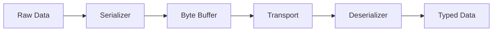
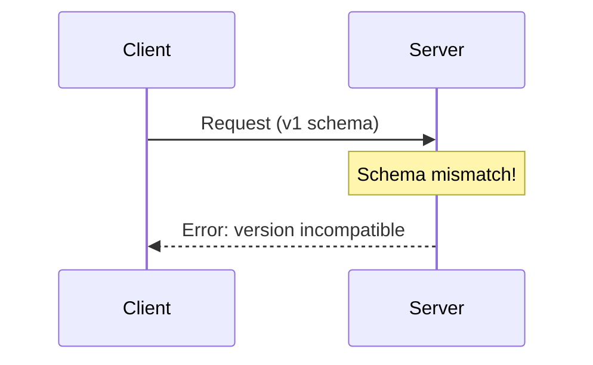
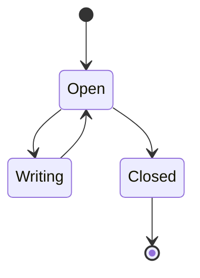

# FAT-P Companion Guide Style Guide

## Purpose

This guide ensures consistent, compelling documentation for FAT-P library components across all domains. Every companion guide should position the library as **solving real engineering problems through deliberate architectural choices**—not merely as a collection of utilities, but as a teaching tool that makes engineers better at understanding the constraints they face.

A companion guide differs from an overview document: overviews showcase individual components; companion guides tell the story of an entire problem domain and how multiple components work together to address it.

---

## Companion Guide Domains

FAT-P spans multiple domains, each warranting its own companion guide:

| Domain | Components | Core Constraint |
|--------|------------|-----------------|
| **HPC & Hardware** | AlignedVector, SimdVector, NumaAllocator, CheckedArithmetic, CacheAligned | Hardware abstraction gaps |
| **Serialization** | BinarySerializer, JsonLite, Tensor serialization | Format safety, versioning, performance |
| **Diagnostics & Logging** | DiagnosticLogger, Stacktrace, ScopeGuard integration | Observability without overhead |
| **Data Structures** | SlotMap, SparseSet, FlatMap, SmallVector, CircularBuffer | Allocation patterns, cache behavior |
| **Concurrency** | ThreadPool, LockFreeQueue, AtomicSharedPtr, Signal | Synchronization correctness |
| **Error Handling** | Expected, enforce, ContractException | Error propagation without exceptions |
| **Tensor & Numerics** | Tensor, TensorMath, TensorEinsum, CSRMatrix | Numerical correctness, expressiveness |

Each domain has different constraints, but the documentation structure remains consistent.

---

## The Four-Part Arc

Every companion guide MUST follow this narrative structure:

### Part I — The Problems
Show the reader what goes wrong and WHY. Ground every problem in real constraints.

**Wrong:** "Serialization can be error-prone."
**Right:** "You serialize a struct with a uint32_t field. Six months later, someone changes it to uint64_t. The deserializer reads 4 bytes, interprets garbage as valid data, and your system silently corrupts a production database."

### Part II — The Solutions
Map each problem to a specific component. Explain the mechanism, not just the API.

**Wrong:** "Use BinarySerializer for type-safe serialization."
**Right:** "BinarySerializer embeds type tags and version numbers in the stream header. On deserialization, it compares the stream's type signature against the expected type at compile time. Mismatch? You get a compile error, not runtime corruption."

### Part III — The Case Studies
Show complete stories with symptoms, investigations, fixes, and measured results.

**Wrong:** "Here's how to use DiagnosticLogger."
**Right:** "The trading system logged 50,000 messages per second. Latency spikes of 200μs occurred every few seconds. The culprit: string formatting in the hot path. We switched to structured logging with deferred formatting. Median latency dropped from 12μs to 2μs; P99 from 200μs to 8μs."

### Part IV — The Foundations
Provide design rationale and deep technical explanations for readers who want to understand WHY.

**Wrong:** "JsonLite is a simple JSON parser."
**Right:** "JsonLite exists because nlohmann/json prioritizes ergonomics over allocation control. In HPC contexts, you need to parse JSON into pre-allocated buffers, reuse parse state across calls, and never touch the heap in the hot path. JsonLite's pull-parser architecture enables all three."

---

## The Three Pillars

Every component description MUST demonstrate:

### 1. Constraint Grounding
Explain which real-world constraint the component addresses. Constraints vary by domain:

| Domain | Typical Constraints |
|--------|---------------------|
| HPC | Cache lines, NUMA topology, SIMD lanes, memory bandwidth |
| Serialization | Wire format stability, version skew, zero-copy parsing |
| Logging | Hot-path overhead, structured output, sink flexibility |
| Data Structures | Allocation frequency, iterator stability, cache locality |
| Concurrency | Lock contention, memory ordering, wait-free progress |
| Error Handling | Exception-free codepaths, error context preservation |

**Wrong:** "SlotMap provides stable handles."
**Right:** "Game engines delete and create entities every frame. Raw pointers dangle. Vector indices shift on erase. SlotMap handles remain valid after deletion—they detect use-after-free at O(1) cost through generation counting."

### 2. Mechanism Visibility
Show HOW the component achieves its guarantees, not just WHAT it does.

**Wrong:** "BinarySerializer is fast."
**Right:** "BinarySerializer writes directly to a caller-provided buffer with no intermediate allocations. Primitive types compile to single memcpy calls. Arrays write a 4-byte count followed by contiguous data—the same layout you'd write by hand, but with type safety enforced at compile time."

### 3. Guarantee Explicitness
State what the component guarantees and what it does NOT guarantee.

**Wrong:** "DiagnosticLogger is thread-safe."
**Right:** "DiagnosticLogger guarantees that concurrent log calls from multiple threads will not interleave mid-message. It does NOT guarantee ordering across threads—messages may appear out of timestamp order if threads race. It does NOT guarantee delivery—if a sink throws, the message is lost."

---

## Vocabulary Standards

### Banned Terms → Replacements

| ❌ Banned | ✅ Replacement | Rationale |
|-----------|---------------|-----------|
| Fast | Zero-allocation, O(1) lookup, Cache-local | Explain the mechanism |
| Efficient | Constant-time, Amortized O(1), Single-pass | Specify complexity |
| Safe | Type-checked, Bounds-verified, Lifetime-tracked | Specify what's checked |
| Easy | Minimal API, Single-header, No configuration | Specify the simplicity |
| Powerful | Composable, Policy-based, Extensible | Specify the capability |
| Flexible | Configurable, Pluggable, Adapter-compatible | Specify the extension point |
| Handles errors | Propagates, Traps, Returns Expected | Specify the mechanism |
| Thread-safe | Lock-free, Mutex-protected, Thread-local | Specify the strategy |
| Modern | C++17, constexpr-evaluated, SFINAE-free | Specify the standard |

### Power Phrases by Domain

**Universal:**
- "The constraint that shaped this design"
- "What the standard library doesn't give you"
- "Zero-overhead abstraction"
- "Compile-time policy resolution"
- "No heap allocation in the hot path"

**Serialization:**
- "Wire-format stability across versions"
- "Schema evolution without breakage"
- "Parse once, access many"
- "Zero-copy deserialization"
- "Type-safe at compile time, efficient at runtime"

**Logging:**
- "Structured over stringly-typed"
- "Deferred formatting"
- "Sink-agnostic emission"
- "Zero-cost when disabled"
- "Correlation without coupling"

**Data Structures:**
- "Pointer stability under mutation"
- "Cache-friendly iteration"
- "Allocation-free operation"
- "Constant-time lookup"
- "Contiguous memory layout"

**Concurrency:**
- "Lock-free progress guarantee"
- "Wait-free for readers"
- "Linearizable operations"
- "Memory-order correct"
- "ABA-safe"

---

## Document Structure

### Title and Scope

**Formula:**
1. Evocative title capturing the problem domain
2. Subtitle identifying the library and scope
3. Explicit scope statement listing what IS and IS NOT covered

**Example (Serialization):**
> # The Data Boundary
> ### A Companion Guide to FAT-P's Serialization Components
> 
> **Scope:** This guide covers FAT-P's serialization utilities: BinarySerializer for compact binary formats, JsonLite for zero-allocation JSON parsing, and Tensor serialization for numerical data. Network protocols, compression, and encryption are not covered.

**Example (Logging):**
> # Observability Without Overhead
> ### A Companion Guide to FAT-P's Diagnostic Components
> 
> **Scope:** This guide covers FAT-P's diagnostic utilities: DiagnosticLogger for structured logging, Stacktrace for crash analysis, and ScopeGuard integration for context capture. Metrics collection and distributed tracing are not covered.

### Introduction

**Formula:**
1. Open with a failure scenario the reader recognizes
2. Name three specific symptoms (not vague problems)
3. Explain that these happen because of constraints the obvious approach ignores
4. Position the library as components for engineers who've hit these walls

**Example (Serialization):**
> You've got a working system. Clients and servers exchange protobuf messages. Then a field changes type. The old clients send data the new servers misinterpret. No error. No exception. Just silent data corruption that surfaces three weeks later when the audit fails.

**Example (Logging):**
> Your logging is "working." Every request writes a structured JSON blob. Then Black Friday hits. Latency spikes to 500ms. The profiler points at... logging. String formatting. Memory allocation. In the middle of your transaction path.

### Problem Chapters (Part I)

**Each chapter must include:**

1. **The Obvious Approach** — What most developers do first
2. **The Hidden Constraint** — Why that approach fails under real conditions
3. **The Symptoms** — How this manifests (with specific examples)
4. **The Cost** — Why this matters (specific impact)
5. **The Solution Preview** — What the library provides (brief)
6. **Forward Reference** — "Part IV explains the design rationale..."

**Include at least one:**
- Diagram showing the failure mode
- Code example showing the trap
- Table mapping symptoms to causes

### Solution Chapters (Part II)

**Each chapter must include:**

1. **Problem Link** — "Chapter N described [problem]. This component addresses it."
2. **Core API** — Essential types and functions with code
3. **Mechanism Explanation** — HOW it works, not just WHAT
4. **Guarantee Table** — What it guarantees vs. what it doesn't
5. **Decision Guide** — When to use which variant/policy
6. **Integration Notes** — How it works with other FAT-P components

**Required table:**

```markdown
| Guarantee | Provided | Notes |
|-----------|----------|-------|
| [Property 1] | ✓/✗ | [Details] |
| [Property 2] | ✓/✗ | [Details] |
```

### Case Study Chapters (Part III)

**Each case study must follow this arc:**

1. **The Context** — What the system does
2. **The Initial Approach** — Show the problematic code/design
3. **Observing the Symptoms** — Specific metrics or failure modes
4. **Forming Hypotheses** — What could be wrong
5. **Gathering Evidence** — How you diagnosed it
6. **The Fix** — Show the corrected approach with explanation
7. **Results** — Before/after metrics with specific numbers
8. **Components Used** — Explicit list of FAT-P components and their roles
9. **Transferable Lessons** — Patterns that apply beyond this case

**Required elements:**
- Before/after comparison
- Quantified improvement (not "better" but "3.2×" or "0 failures in 6 months")
- "Components Used" section

### Foundation Appendices (Part IV)

**Design Rationale appendix must include:**
- Why the API is shaped this way
- What alternatives were considered and rejected
- Trade-offs that were deliberately made

**Technical Deep-Dive appendix must include:**
- Implementation details that explain performance characteristics
- Edge cases and how they're handled
- Extension points and customization

**Ecosystem appendix must include:**
- When to use FAT-P vs. alternatives
- How to integrate with external libraries
- "When to Look Elsewhere" section

---

## Code Example Standards

### Good Example (shows the trap and the fix):
```cpp
// THE TRAP: String formatting in hot path
for (const auto& order : orders) {
    logger.info("Processing order " + std::to_string(order.id) + 
                " for $" + std::to_string(order.amount));  // 3 allocations per log
    process(order);
}

// THE FIX: Structured logging with deferred formatting
for (const auto& order : orders) {
    LOG_INFO("order.process", 
             Field("order_id", order.id), 
             Field("amount", order.amount));  // Zero allocations; formatted at sink
    process(order);
}
```

### Bad Example (just shows syntax):
```cpp
LOG_INFO("order.process", Field("order_id", id));
```

### Required Code Comments
- `// THE TRAP:` before problematic code
- `// THE FIX:` before corrected code
- `// N allocations` to highlight allocation behavior
- `// O(1)` or `// O(n)` for complexity-critical paths
- `// Thread-safe` or `// Not thread-safe` where relevant

---

## Metrics Standards

### Always Quantify
**Wrong:** "Much faster"
**Right:** "3.2× faster (156ms → 49ms)"

**Wrong:** "More reliable"
**Right:** "Zero serialization failures in 6 months of production (previously: 2-3 per week)"

### Domain-Appropriate Metrics

| Domain | Key Metrics |
|--------|-------------|
| HPC | IPC, cache miss rate, memory bandwidth, FLOPS |
| Serialization | Bytes/sec, allocation count, round-trip correctness |
| Logging | Messages/sec, P50/P99 latency, memory per message |
| Data Structures | Ops/sec, memory overhead ratio, cache misses per op |
| Concurrency | Contention rate, wait time, throughput under load |

### Always Acknowledge Variance
**Wrong:** "Runs in 2.5ms"
**Right:** "Median 2.5ms, P99 4.1ms, max observed 12ms"

---

## Diagram Standards

### When to Use Each Type

**Flowcharts** — Decision logic, component relationships, data flow


**Sequence Diagrams** — Temporal interactions, protocol exchanges, failure scenarios


**State Diagrams** — Lifecycle, state machines, resource management


**Class Diagrams** — Component relationships (use sparingly)

---

## Cross-Reference Standards

### Forward References (Part I → Part IV)
> *This allocation pattern traces back to the STL's design constraints from 1994. Part IV explains why the standard library prioritizes interface stability over allocation control.*

### Back References (Part II → Part I)
> Chapter 3 described the version skew problem. BinarySerializer addresses this by embedding schema hashes in the stream header.

### Component Cross-References
> `DiagnosticLogger` integrates with `ScopeGuard` to automatically capture context when errors occur.

### External References
> For JSON manipulation beyond parsing (JSONPath, diffing), consider nlohmann/json. FAT-P's JsonLite is optimized for read-only parsing in hot paths.

---

## Tone Guidelines

### Do:
- Use active voice: "The serializer writes" not "Data is written"
- Be specific: "4 bytes" not "a small header"
- Explain mechanisms: "Generation counter comparison" not "clever bookkeeping"
- Acknowledge limitations: "Where FAT-P loses" builds credibility
- Connect to reader experience: "You've seen this—the system works until..."

### Don't:
- Hand-wave: "Uses advanced techniques" ❌
- Over-claim: "Always faster" ❌
- Condescend: "Simply use..." ❌
- Assume knowledge without defining: First use should define terms
- Use marketing speak: "Best-in-class", "Enterprise-grade" ❌

---

## Checklist Before Publishing

### Structure
- [ ] Four-part arc (Problems → Solutions → Case Studies → Foundations)
- [ ] Table of Contents with working anchor links
- [ ] Scope statement explicitly lists what's covered and what isn't
- [ ] Each Part I chapter links forward to Part IV
- [ ] Each Part II chapter references the Part I problem it solves
- [ ] "Components Used" section in every case study

### Technical Content
- [ ] Every claim explains the mechanism, not just the benefit
- [ ] Every component has a Guarantees table
- [ ] Quantified metrics (not "faster" but "3.2×")
- [ ] "Where it loses" section included
- [ ] Integration points with other FAT-P components documented

### Code
- [ ] All examples show THE TRAP and THE FIX pattern
- [ ] No syntax-only examples
- [ ] Allocation counts, complexity, thread-safety annotated

### Language
- [ ] No banned vague terms ("fast", "efficient", "safe", "powerful")
- [ ] Domain terms defined on first use
- [ ] Active voice throughout

---

## Templates

### Problem Chapter Template

```markdown
# **CHAPTER N — The [Problem Name]**

The obvious approach is [common approach]. Under [constraint], this fails.

**The obvious approach:** [What most developers do]

**The hidden constraint:** [Why it fails]

```cpp
// THE TRAP: [Description]
[Problematic code]
```

[Diagram showing failure mode]

**The symptoms:** [How this manifests]

**The cost:** [Why it matters—specific impact]

**What FAT-P provides:** [Brief solution preview]

*[Design context teaser]. Part IV explains [forward reference].*
```

### Solution Chapter Template

```markdown
# **CHAPTER N — [Component Name]**

Chapter M described [problem]. [Component] addresses this by [mechanism].

```cpp
#include "[Header].h"

// Basic usage
[Core API example]
```

**The mechanism:** [HOW it works]

| Guarantee | Provided | Notes |
|-----------|----------|-------|
| [Guarantee 1] | ✓/✗ | [Details] |

**Choosing variants:** [Decision guide]

**Integration:** [How it works with other FAT-P components]
```

### Case Study Template

```markdown
# **CHAPTER N — Case Study: [Context]**

## The Context
[What the system does]

## The Initial Approach
```cpp
[Original problematic code/design]
```

## Observing the Symptoms
[Specific metrics or failures]

## The Fix
```cpp
// THE FIX: [Description]
[Corrected approach]
```

## Results

| Metric | Before | After | Improvement |
|--------|--------|-------|-------------|
| [Metric] | [Value] | [Value] | [X×] |

## FAT-P Components Used
- `ComponentA` — [Role]
- `ComponentB` — [Role]

## Transferable Lessons
**[Lesson]:** [Explanation]
```

---

*FAT-P Companion Guide Documentation Standards v1.0*
