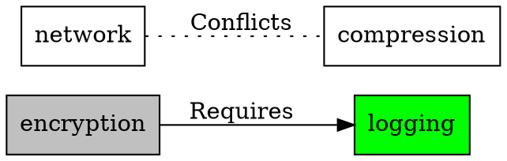

# Migration Guide - Preprocessor Flags to Managed Feature Dependencies

### *From `#ifdef` Hell to Declarative Feature Graphs*

*FAT-P Library — January 2025*

---

## Migration Card

| Aspect | Detail |
|--------|--------|
| **C Pattern** | `#ifdef` chains, global booleans, bitfield flags, `sqlite3_config()` |
| **Problems Solved** | Implicit dependencies, undetected conflicts, no validation, scattered logic |
| **Fat-P Component** | `FeatureManager<SyncPolicy>` |
| **Migration Complexity** | Medium — requires declaring dependencies explicitly |
| **Runtime Overhead** | O(d × log n) per enable/disable, where d = dependency depth |
| **Breaking Changes** | Yes — moves from implicit to explicit dependency management |

---

## Table of Contents

1. [The Problem with Feature Flags](#the-problem-with-feature-flags)
2. [Real-World Feature Flag Disasters](#real-world-feature-flag-disasters)
3. [The C Patterns](#the-c-patterns)
4. [The FeatureManager Solution](#the-featuremanager-solution)
5. [Migration Steps](#migration-steps)
6. [Before/After Examples](#beforeafter-examples)
7. [Advanced Patterns](#advanced-patterns)
8. [Verification](#verification)
9. [When FeatureManager Loses](#when-featuremanager-loses)

---

## The Problem with Feature Flags

Every non-trivial software system has feature flags—compile-time or runtime switches that enable or disable functionality. As systems grow, these flags develop **dependencies**:

- **Requires:** Feature A needs Feature B to work
- **Conflicts:** Feature A and Feature B can't be enabled together
- **Implies:** Enabling Feature A automatically enables Feature B
- **Mutually Exclusive:** Only one of Features A, B, C can be active

In C, these dependencies live in:
- Comments ("Remember to also enable FOO when enabling BAR")
- Tribal knowledge (the one engineer who knows the rules)
- Runtime crashes (the rules you forgot)
- `#error` directives (if you're lucky)

```c
/* From a real codebase */
#ifdef ENABLE_COMPRESSION
  #ifndef ENABLE_BUFFERED_IO
    #error "COMPRESSION requires BUFFERED_IO"  /* One dependency caught */
  #endif
  /* But what about ENABLE_ENCRYPTION conflicting with COMPRESSION? */
  /* Nobody documented that. It just crashes at runtime. */
#endif
```

---

## Real-World Feature Flag Disasters

### SQLite's Compile Option Maze

SQLite has over **200 compile-time options**. The documentation reveals the complexity:

> "SQLITE_ENABLE_FTS3 — This option enables the version 3 full-text search engine... The SQLITE_ENABLE_FTS3 compile-time option also enables FTS4."

> "SQLITE_ENABLE_FTS5 — This option enables version 5 of the full-text search engine... FTS5 is a separate extension and can coexist with FTS3/FTS4."

> "SQLITE_OMIT_LOAD_EXTENSION — This option omits the ability to load extensions... If this option is defined, then the SQLITE_ENABLE_LOAD_EXTENSION option is meaningless."

**Hidden in prose:**
- FTS3 → implies FTS4 (unless you also set SQLITE_DISABLE_FTS4)
- OMIT_LOAD_EXTENSION → conflicts with ENABLE_LOAD_EXTENSION
- FTS5 requires ENABLE_FTS5 AND certain tokenizer flags

These relationships are **documented in paragraphs**, not enforced by code.

### The sqlite3_config() Runtime Variant

From [`src/main.c`](https://github.com/sqlite/sqlite/blob/master/src/main.c):

```c
/*
** Configuration settings for an individual database connection
*/
int sqlite3_db_config(sqlite3 *db, int op, ...){
  va_list ap;
  int rc;
  va_start(ap, op);
  switch( op ){
    case SQLITE_DBCONFIG_MAINDBNAME: {
      /* ... */
    }
    case SQLITE_DBCONFIG_LOOKASIDE: {
      /* ... */
    }
    /* ... 20+ more cases ... */
  }
}
```

And from [`src/sqliteInt.h`](https://github.com/sqlite/sqlite/blob/master/src/sqliteInt.h):

```c
/*
** Allowed values for sqlite3_config() first argument
*/
#define SQLITE_CONFIG_SINGLETHREAD  1  /* nil */
#define SQLITE_CONFIG_MULTITHREAD   2  /* nil */
#define SQLITE_CONFIG_SERIALIZED    3  /* nil */
/* These three are mutually exclusive - but nothing enforces it! */
```

The comment says "mutually exclusive." The code doesn't enforce it. Enable two of them and behavior is undefined.

### The Firefox Preference Explosion

Mozilla's Firefox has thousands of `about:config` preferences with undocumented dependencies. Engineers regularly discover that enabling one preference breaks another—discovered only through testing or user bug reports.

---

## The C Patterns

### Pattern 1: Preprocessor `#ifdef` Chains

```c
/* feature_config.h */
#define ENABLE_LOGGING
#define ENABLE_ENCRYPTION
#define ENABLE_COMPRESSION
// #define ENABLE_NETWORK  /* Disabled */

/* feature_impl.c */
#ifdef ENABLE_ENCRYPTION
  #ifdef ENABLE_LOGGING
    /* Encryption audit trail - only works if both enabled */
  #else
    #warning "Encryption without logging has no audit trail"
    /* Just a warning - continues anyway */
  #endif
#endif

#ifdef ENABLE_COMPRESSION
  #ifdef ENABLE_ENCRYPTION
    /* Order matters! Must compress before encrypt */
    /* But nothing prevents encrypt-before-compress configuration */
  #endif
#endif
```

**Problems:**
- Dependencies expressed as nested `#ifdef` (hard to audit)
- Conflicts caught by `#error` (if remembered)
- No compile-time completeness check
- Changes require recompilation

### Pattern 2: Global Boolean Flags

```c
/* Runtime feature toggles */
static bool g_feature_logging = false;
static bool g_feature_encryption = false;
static bool g_feature_compression = false;
static bool g_feature_network = false;

void enable_encryption(void) {
    g_feature_encryption = true;
    /* Should this also enable logging? */
    /* Does this conflict with compression in some modes? */
    /* Nobody knows without reading all the code */
}

bool check_features(void) {
    /* Manual validation - always incomplete */
    if (g_feature_encryption && !g_feature_logging) {
        fprintf(stderr, "Warning: encryption without logging\n");
        /* But continues anyway */
    }
    return true;
}
```

**Problems:**
- No enforced dependencies
- Validation is manual and scattered
- Easy to forget checks
- No notification when features change

### Pattern 3: Bitfield Feature Masks

```c
/* Compact but opaque */
#define FEAT_LOGGING     (1u << 0)
#define FEAT_ENCRYPTION  (1u << 1)
#define FEAT_COMPRESSION (1u << 2)
#define FEAT_NETWORK     (1u << 3)
#define FEAT_DATABASE    (1u << 4)

static uint32_t g_features = 0;

void set_feature(uint32_t mask) {
    g_features |= mask;
}

void clear_feature(uint32_t mask) {
    g_features &= ~mask;
}

bool has_feature(uint32_t mask) {
    return (g_features & mask) == mask;
}

/* Dependency check is manual */
bool validate_features(void) {
    /* Must remember every dependency */
    if ((g_features & FEAT_ENCRYPTION) && !(g_features & FEAT_LOGGING)) {
        return false;  /* Encryption requires logging */
    }
    if ((g_features & FEAT_NETWORK) && (g_features & FEAT_COMPRESSION)) {
        return false;  /* Network conflicts with compression (in this system) */
    }
    /* What about DATABASE requiring LOGGING? Who remembers? */
    return true;
}
```

**Problems:**
- Limited to 32/64 features
- Dependencies in validation function (not with definition)
- Easy to add feature, forget validation rule
- No automatic resolution

### Pattern 4: Configuration Struct with Manual Validation

```c
struct Config {
    bool enable_logging;
    bool enable_encryption;
    bool enable_compression;
    bool enable_network;
    int  log_level;
    int  encryption_strength;
};

int validate_config(const struct Config* cfg) {
    if (cfg->enable_encryption && !cfg->enable_logging) {
        return -1;  /* INVALID: encryption needs logging */
    }
    if (cfg->encryption_strength > 128 && !cfg->enable_network) {
        return -2;  /* INVALID: high encryption needs network for key exchange */
    }
    /* 50 more rules scattered across the codebase... */
    return 0;
}

int apply_config(struct Config* cfg) {
    int err = validate_config(cfg);
    if (err) return err;
    
    /* Apply in correct order (what is correct order?) */
    if (cfg->enable_logging) init_logging(cfg->log_level);
    if (cfg->enable_encryption) init_encryption(cfg->encryption_strength);
    /* ... */
    return 0;
}
```

**Problems:**
- Validation separate from feature definition
- Order of initialization is manual
- No dependency graph—just scattered checks
- Adding features requires updating multiple places

---

## The FeatureManager Solution

### Core Concept

`FeatureManager` represents features and their relationships as a **directed graph** with automatic validation, resolution, and observation:

```cpp
#include "FeatureManager.h"
using namespace fat_p;

FeatureManager<> features;

// Declare features
features.add_feature("logging");
features.add_feature("encryption");
features.add_feature("compression");
features.add_feature("network");

// Declare relationships (the rules that were in comments/tribal knowledge)
features.add_relationship("encryption", FeatureRelationship::Requires, "logging");
features.add_relationship("network", FeatureRelationship::Conflicts, "compression");

// Now the system enforces the rules
auto result = features.enable("encryption");
// result.error() == "Feature 'encryption' requires 'logging' which is not enabled"

features.enable("logging");  // OK
features.enable("encryption");  // OK now

features.enable("network");  // OK
auto bad = features.enable("compression");
// bad.error() == "Feature 'compression' conflicts with 'network'"
```

### Key Features

| Feature | Benefit |
|---------|---------|
| **Explicit relationships** | Dependencies documented in code, not comments |
| **Automatic validation** | Conflicts and missing dependencies caught immediately |
| **Implies resolution** | Enabling A can auto-enable B |
| **Cycle detection** | Circular dependencies caught at add_relationship time |
| **Thread safety** | Policy-based locking |
| **Observers** | React to feature state changes |
| **Custom checks** | Runtime validation (license, hardware, etc.) |
| **Serialization** | JSON import/export, GraphViz DOT visualization |

### Relationship Types

```cpp
enum class FeatureRelationship {
    Requires,          // A requires B: enable A fails if B not enabled
    Conflicts,         // A conflicts B: can't have both enabled (symmetric)
    Implies,           // A implies B: enabling A auto-enables B
    MutuallyExclusive  // Only one of a set can be enabled
};
```

### API Overview

```cpp
template <typename SyncPolicy = SingleThreadedPolicy>
class FeatureManager {
public:
    // Feature management
    Expected<void, std::string> add_feature(const std::string& name);
    Expected<void, std::string> add_feature(const std::string& name, bool initial_state);
    Expected<void, std::string> remove_feature(const std::string& name);
    
    // Relationships
    Expected<void, std::string> add_relationship(
        const std::string& from,
        FeatureRelationship type,
        const std::string& to);
    
    // State management
    Expected<void, std::string> enable(const std::string& name);
    Expected<void, std::string> disable(const std::string& name);
    bool is_enabled(const std::string& name) const;
    
    // Validation
    Expected<void, std::string> validate() const;
    void add_check(const std::string& feature, FeatureCheck check);
    
    // Observation
    ObserverId add_observer(FeatureObserver observer, int priority = 0);
    void remove_observer(ObserverId id);
    
    // Groups
    template <typename StatePolicy>
    void add_group(const std::string& name, std::vector<std::string> features);
    
    // Serialization
    JsonValue to_json() const;
    static Expected<FeatureManager, std::string> from_json(const JsonValue& json);
    std::string to_dot() const;  // GraphViz format
};
```

---

## Migration Steps

### Step 1: Inventory Existing Feature Flags

Find all feature flags in your codebase:

```bash
# Compile-time flags
grep -rn "#define.*ENABLE_\|#define.*FEATURE_\|#define.*USE_" src/
grep -rn "#ifdef.*ENABLE_\|#ifdef.*FEATURE_" src/

# Runtime flags
grep -rn "bool.*enable\|bool.*feature\|g_feature" src/

# Bitfield patterns
grep -rn "(1.*<<\|1u.*<<" src/include/
```

Document each flag with:
- Name
- Purpose
- Known dependencies (from comments, docs, tribal knowledge)
- Known conflicts

### Step 2: Map Dependencies

Create a dependency diagram (FeatureManager can export DOT format for visualization):

```
logging ←─requires─ encryption
logging ←─requires─ database
network ──conflicts── compression
threading_single ══mutually_exclusive══ threading_multi
```

### Step 3: Create FeatureManager Configuration

```cpp
// feature_config.cpp
#include "FeatureManager.h"

Expected<FeatureManager<>, std::string> create_feature_manager() {
    FeatureManager<> fm;
    
    // Add all features
    TRY(fm.add_feature("logging"));
    TRY(fm.add_feature("encryption"));
    TRY(fm.add_feature("compression"));
    TRY(fm.add_feature("network"));
    TRY(fm.add_feature("database"));
    TRY(fm.add_feature("threading_single"));
    TRY(fm.add_feature("threading_multi"));
    
    // Add relationships (the rules from your documentation)
    TRY(fm.add_relationship("encryption", FeatureRelationship::Requires, "logging"));
    TRY(fm.add_relationship("database", FeatureRelationship::Requires, "logging"));
    TRY(fm.add_relationship("network", FeatureRelationship::Conflicts, "compression"));
    
    // Mutually exclusive threading modes
    TRY(fm.add_relationship("threading_single", 
                            FeatureRelationship::MutuallyExclusive, 
                            "threading_multi"));
    
    return fm;
}
```

### Step 4: Replace Flag Checks

**Before:**
```cpp
void do_work() {
    #ifdef ENABLE_ENCRYPTION
        encrypt_data();
    #endif
    
    if (g_feature_logging) {
        log_operation();
    }
}
```

**After:**
```cpp
void do_work(FeatureManager<>& features) {
    if (features.is_enabled("encryption")) {
        encrypt_data();
    }
    
    if (features.is_enabled("logging")) {
        log_operation();
    }
}
```

### Step 5: Add Runtime Validation Checks

For features that need runtime validation (not just dependency relationships):

```cpp
// License check for premium feature
fm.add_check("premium_analytics", []() -> Expected<void, std::string> {
    if (!license_manager::has_premium()) {
        return make_unexpected("Premium license required for analytics");
    }
    return {};
});

// Hardware check for GPU features
fm.add_check("gpu_acceleration", []() -> Expected<void, std::string> {
    if (!gpu::is_available()) {
        return make_unexpected("No compatible GPU detected");
    }
    return {};
});
```

### Step 6: Add Observers for State Change Reactions

```cpp
// Update UI when features change
fm.add_observer([](const std::string& feature, bool enabled, bool success) {
    if (success) {
        ui::update_feature_toggle(feature, enabled);
    }
});

// Log all feature changes
fm.add_observer([](const std::string& feature, bool enabled, bool success) {
    LOG_INFO("Feature '{}' {} (success={})", 
             feature, enabled ? "enabled" : "disabled", success);
}, 100);  // High priority - runs first
```

---

## Before/After Examples

### Example 1: SQLite-Style Compile Options

**Before (SQLite pattern):**
```c
/* sqlite_options.h */
// #define SQLITE_ENABLE_FTS3
// #define SQLITE_ENABLE_FTS4
// #define SQLITE_ENABLE_FTS5
// #define SQLITE_OMIT_LOAD_EXTENSION

/* Somewhere in sqlite3.c - 200 lines of this */
#ifdef SQLITE_ENABLE_FTS3
  #ifndef SQLITE_DISABLE_FTS4
    /* FTS3 implies FTS4 unless explicitly disabled */
    #define SQLITE_ENABLE_FTS4
  #endif
#endif

#ifdef SQLITE_ENABLE_FTS5
  #ifdef SQLITE_ENABLE_FTS3
    /* FTS5 can coexist with FTS3, but needs separate tokenizer */
  #endif
#endif

#ifdef SQLITE_OMIT_LOAD_EXTENSION
  #ifdef SQLITE_ENABLE_LOAD_EXTENSION
    #error "Conflicting extension options"
  #endif
#endif
```

**After (FeatureManager):**
```cpp
FeatureManager<> sqlite_features;

// Declare features
sqlite_features.add_feature("fts3");
sqlite_features.add_feature("fts4"); 
sqlite_features.add_feature("fts5");
sqlite_features.add_feature("load_extension");
sqlite_features.add_feature("omit_load_extension");

// FTS3 implies FTS4 (unless we add a disable mechanism)
sqlite_features.add_relationship("fts3", FeatureRelationship::Implies, "fts4");

// OMIT_LOAD_EXTENSION conflicts with ENABLE_LOAD_EXTENSION
sqlite_features.add_relationship("omit_load_extension", 
                                  FeatureRelationship::Conflicts, 
                                  "load_extension");

// Now enabling works correctly:
sqlite_features.enable("fts3");
// fts4 is automatically enabled (Implies relationship)

sqlite_features.enable("omit_load_extension");
auto result = sqlite_features.enable("load_extension");
// result.error() == "Feature 'load_extension' conflicts with 'omit_load_extension'"
```

### Example 2: Threading Mode Selection

**Before (bitfield):**
```c
#define THREAD_SINGLE    (1 << 0)
#define THREAD_MULTI     (1 << 1)
#define THREAD_SERIALIZED (1 << 2)

static uint32_t g_threading_mode = 0;

int set_threading(uint32_t mode) {
    /* Manual mutual exclusion check */
    int count = 0;
    if (mode & THREAD_SINGLE) count++;
    if (mode & THREAD_MULTI) count++;
    if (mode & THREAD_SERIALIZED) count++;
    
    if (count != 1) {
        return -1;  /* Must select exactly one */
    }
    
    g_threading_mode = mode;
    return 0;
}
```

**After (FeatureManager with groups):**
```cpp
FeatureManager<> config;

config.add_feature("thread_single");
config.add_feature("thread_multi");
config.add_feature("thread_serialized");

// All three are mutually exclusive
config.add_relationship("thread_single", FeatureRelationship::MutuallyExclusive, "thread_multi");
config.add_relationship("thread_single", FeatureRelationship::MutuallyExclusive, "thread_serialized");
config.add_relationship("thread_multi", FeatureRelationship::MutuallyExclusive, "thread_serialized");

// Create a group for monitoring
config.add_group<FeatureGroupState>("threading", 
    {"thread_single", "thread_multi", "thread_serialized"});

// Usage
config.enable("thread_single");  // OK
auto result = config.enable("thread_multi");  
// result.error() == "Feature 'thread_multi' is mutually exclusive with 'thread_single'"

// Check group state
auto state = config.group_state<FeatureGroupState>("threading");
// state == FeatureGroupState::Partial (one of three enabled)
```

### Example 3: Complex Dependency Chain

**Before (scattered validation):**
```c
bool g_enable_analytics = false;
bool g_enable_premium = false;
bool g_enable_network = false;
bool g_enable_database = false;

int enable_analytics() {
    /* Check dependencies - must remember all of them */
    if (!g_enable_premium) {
        fprintf(stderr, "Analytics requires premium\n");
        return -1;
    }
    if (!g_enable_network) {
        fprintf(stderr, "Analytics requires network\n");
        return -1;
    }
    if (!g_enable_database) {
        fprintf(stderr, "Analytics requires database\n");
        return -1;
    }
    g_enable_analytics = true;
    return 0;
}
```

**After (declarative):**
```cpp
FeatureManager<> features;

features.add_feature("analytics");
features.add_feature("premium");
features.add_feature("network");
features.add_feature("database");

// Declare all dependencies in one place
features.add_relationship("analytics", FeatureRelationship::Requires, "premium");
features.add_relationship("analytics", FeatureRelationship::Requires, "network");
features.add_relationship("analytics", FeatureRelationship::Requires, "database");

// Enable dependencies first
features.enable("premium");
features.enable("network");
features.enable("database");
features.enable("analytics");  // Now succeeds

// Or see exactly what's missing:
auto result = features.enable("analytics");
// result.error() lists all missing dependencies
```

### Example 4: Configuration from JSON

```cpp
// features.json
const char* config_json = R"({
    "features": {
        "logging": { "enabled": true },
        "encryption": { 
            "enabled": false,
            "relationships": {
                "Requires": ["logging"]
            }
        },
        "compression": { "enabled": false },
        "network": {
            "enabled": false,
            "relationships": {
                "Conflicts": ["compression"]
            }
        }
    },
    "groups": {
        "security": ["logging", "encryption"]
    }
})";

// Load and validate
auto result = FeatureManager<>::from_json(JsonParser::parse(config_json).value());
if (!result) {
    std::cerr << "Config error: " << result.error() << "\n";
    return 1;
}
auto& features = *result;

// Export to GraphViz for visualization
std::ofstream dot("features.dot");
dot << features.to_dot();
// Then: dot -Tpng features.dot -o features.png
```

---

## Advanced Patterns

### Pattern: Feature Checks for Runtime Conditions

```cpp
// Hardware capability check
features.add_check("avx512", []() -> Expected<void, std::string> {
    #if defined(__AVX512F__)
    if (!cpu_supports_avx512()) {
        return make_unexpected("CPU does not support AVX-512");
    }
    return {};
    #else
    return make_unexpected("AVX-512 not compiled in");
    #endif
});

// License validation
features.add_check("enterprise_mode", [&license]() -> Expected<void, std::string> {
    if (!license.is_valid()) {
        return make_unexpected("Enterprise license expired");
    }
    if (!license.has_feature("enterprise")) {
        return make_unexpected("Enterprise feature not in license");
    }
    return {};
});

// Resource availability
features.add_check("gpu_compute", []() -> Expected<void, std::string> {
    auto gpus = enumerate_gpus();
    if (gpus.empty()) {
        return make_unexpected("No GPU available");
    }
    if (gpus[0].compute_capability < 7.0) {
        return make_unexpected("GPU compute capability too low (need 7.0+)");
    }
    return {};
});
```

### Pattern: Scoped Feature Override for Testing

```cpp
void test_premium_features() {
    auto& features = get_global_features();
    
    // Save current state, enable premium for this scope
    {
        ValueGuard guard(features, "premium", true);  // Enable temporarily
        
        // Test premium functionality
        EXPECT_TRUE(features.is_enabled("premium"));
        test_premium_analytics();
        
    }  // Guard restores previous state
    
    EXPECT_FALSE(features.is_enabled("premium"));
}
```

### Pattern: Observer for Dynamic UI

```cpp
class FeatureSettingsPanel {
    FeatureManager<>& mFeatures;
    ObserverId mObserverId;
    
public:
    FeatureSettingsPanel(FeatureManager<>& features) 
        : mFeatures(features) 
    {
        mObserverId = mFeatures.add_observer(
            [this](const std::string& name, bool enabled, bool success) {
                if (success) {
                    updateToggle(name, enabled);
                    updateDependencyIndicators();
                } else {
                    showError(name, enabled);
                }
            });
    }
    
    ~FeatureSettingsPanel() {
        mFeatures.remove_observer(mObserverId);
    }
};
```

### Pattern: Thread-Safe Global Configuration

```cpp
// Singleton with thread-safe FeatureManager
class AppConfig {
    static FeatureManager<SharedMutexPolicy>& instance() {
        static FeatureManager<SharedMutexPolicy> fm = [] {
            FeatureManager<SharedMutexPolicy> fm;
            // ... initialize features ...
            return fm;
        }();
        return fm;
    }
    
public:
    static bool is_enabled(const std::string& feature) {
        return instance().is_enabled(feature);  // Thread-safe read
    }
    
    static Expected<void, std::string> enable(const std::string& feature) {
        return instance().enable(feature);  // Thread-safe write
    }
};

// Usage from any thread
if (AppConfig::is_enabled("logging")) {
    log_message("Processing...");
}
```

---

## Verification

### Compile-Time Verification

FeatureManager validates the graph at runtime, but you can verify at startup:

```cpp
auto result = features.validate();
if (!result) {
    std::cerr << "Feature graph invalid: " << result.error() << "\n";
    std::abort();
}
```

### Unit Tests

```cpp
TEST(FeatureManager, RequiresDependency) {
    FeatureManager<> fm;
    fm.add_feature("base");
    fm.add_feature("dependent");
    fm.add_relationship("dependent", FeatureRelationship::Requires, "base");
    
    // Can't enable dependent without base
    auto result = fm.enable("dependent");
    EXPECT_FALSE(result.has_value());
    EXPECT_THAT(result.error(), HasSubstr("requires"));
    
    // With base enabled, it works
    fm.enable("base");
    result = fm.enable("dependent");
    EXPECT_TRUE(result.has_value());
}

TEST(FeatureManager, ConflictDetection) {
    FeatureManager<> fm;
    fm.add_feature("feature_a");
    fm.add_feature("feature_b");
    fm.add_relationship("feature_a", FeatureRelationship::Conflicts, "feature_b");
    
    fm.enable("feature_a");
    
    auto result = fm.enable("feature_b");
    EXPECT_FALSE(result.has_value());
    EXPECT_THAT(result.error(), HasSubstr("conflicts"));
}

TEST(FeatureManager, ImpliesAutoEnable) {
    FeatureManager<> fm;
    fm.add_feature("trigger");
    fm.add_feature("implied");
    fm.add_relationship("trigger", FeatureRelationship::Implies, "implied");
    
    EXPECT_FALSE(fm.is_enabled("implied"));
    
    fm.enable("trigger");
    
    EXPECT_TRUE(fm.is_enabled("trigger"));
    EXPECT_TRUE(fm.is_enabled("implied"));  // Auto-enabled
}

TEST(FeatureManager, CycleDetection) {
    FeatureManager<> fm;
    fm.add_feature("a");
    fm.add_feature("b");
    fm.add_feature("c");
    
    fm.add_relationship("a", FeatureRelationship::Requires, "b");
    fm.add_relationship("b", FeatureRelationship::Requires, "c");
    
    auto result = fm.add_relationship("c", FeatureRelationship::Requires, "a");
    EXPECT_FALSE(result.has_value());
    EXPECT_THAT(result.error(), HasSubstr("cycle"));
}
```

### Visualization

Export the feature graph to verify relationships:

```cpp
// Generate DOT file
std::cout << fm.to_dot();
```

Output:


---

## When FeatureManager Loses

### 1. Pure Compile-Time Flags

If features are truly compile-time only and you need zero runtime overhead:

```cpp
#ifdef ENABLE_FEATURE_X
    // Zero-cost: code not even compiled if disabled
#endif

// vs

if (features.is_enabled("x")) {
    // Branch exists at runtime
}
```

**Mitigation:** Use both—FeatureManager for validation and documentation, `#ifdef` for final code elimination.

### 2. Extremely High-Frequency Checks

Millions of checks per second in hot loop:

```cpp
for (auto& item : million_items) {
    if (features.is_enabled("logging")) {  // O(log n) per call
        log(item);
    }
}
```

**Mitigation:** Cache the result:

```cpp
bool logging_enabled = features.is_enabled("logging");
for (auto& item : million_items) {
    if (logging_enabled) {  // Single bool check
        log(item);
    }
}
```

### 3. Hundreds of Independent Features

If you have 500+ features with no relationships, the graph overhead isn't justified.

**Mitigation:** Use FeatureManager for the subset with relationships; use simple flags for truly independent features.

### 4. Cross-Process Feature State

FeatureManager is per-process. If you need features shared across processes:

**Mitigation:** Serialize to JSON/database, load in each process.

---

## Summary

| Aspect | C Patterns | FeatureManager |
|--------|-----------|----------------|
| Dependencies | Comments, tribal knowledge | Explicit `Requires` relationship |
| Conflicts | `#error` or crashes | Explicit `Conflicts` relationship |
| Auto-enable | Manual code | `Implies` relationship |
| Validation | Scattered, incomplete | Centralized, complete |
| Visualization | None | GraphViz DOT export |
| Thread safety | Manual | Policy-based |
| Serialization | Custom code | JSON built-in |
| Runtime checks | Manual | FeatureCheck callbacks |
| Change notification | None | Observer pattern |

**Migration ROI:**
- **Immediate:** Catch conflicts and missing dependencies at enable-time
- **Short-term:** Documentation of dependencies in code, not comments
- **Long-term:** Safe refactoring, configuration-driven features

---

## References

- [SQLite Compile-Time Options](https://www.sqlite.org/compile.html) — The complexity this pattern addresses
- [SQLite Configuration](https://github.com/sqlite/sqlite/blob/master/src/main.c) — `sqlite3_config()` implementation
- Fat-P User Manual: FeatureManager — Complete API reference
- Fat-P User Manual: JsonLite — JSON serialization

---

*FAT-P Library Documentation — January 2025*
