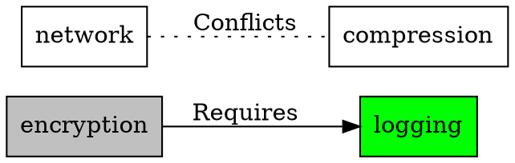

# Migration Guide - Preprocessor Flags to Managed Feature Dependencies

### *From `#ifdef` Hell to Declarative Feature Graphs*

*FAT-P Library — January 2025*

---

## Migration Guide Card

**From:** `#ifdef` chains, global booleans, bitfield flags  
**To:** `FeatureManager<SyncPolicy>` with explicit dependency DAG  
**Why migrate:** Implicit flag dependencies cause silent conflicts; no validation that flag combinations are coherent  
**Compatibility strategy:** Wrapper — existing flags become registered features; old checks become `isEnabled()` queries  
**Mechanical steps:**
1. Inventory all feature flags and their implicit dependencies.
2. Declare features and dependencies in a `FeatureManager` instance.
3. Replace `#ifdef` / boolean checks with `isEnabled()` calls.
4. Add dependency validation at startup.
**Behavioral equivalence:** Same feature activation/deactivation behavior  
**Intentional differences:** Dependencies are explicit and validated; conflicting flags are detected at registration time  
**Failure model:** Silent conflicts → `Expected`-based error reporting or enforcement on conflict  
**Threading model:** Policy-selectable — `DefaultSyncPolicy` (single-threaded) or `ThreadSafeSyncPolicy`  
**Lifetime model:** Manager owns feature state; features registered at startup, queried at runtime  
**Alternatives:** Custom flag manager, `std::bitset` with manual checks, `#ifdef` discipline  
**Verification:** Unit tests for dependency validation, conflict detection, enable/disable sequences  
**Rollback plan:** Replace `isEnabled()` calls with original flag checks; remove dependency declarations

---

## Alternatives

No standard library or Boost equivalent exists for feature flag management with dependency tracking. Common alternatives:

- **CMake options** — Compile-time only, no dependency validation
- **#ifdef chains** — What this guide migrates away from
- **gflags** (Google) — Command-line flags, no dependency graphs
- **CLI11** — Argument parsing, no feature relationships
- **libconfig** — Configuration files, no validation logic
- **Custom implementations** — Most codebases roll their own

---

## Table of Contents

1. [The Problem with Feature Flags](#the-problem-with-feature-flags)
2. [Real-World Feature Flag Disasters](#real-world-feature-flag-disasters)
3. [The C Patterns](#the-c-patterns)
4. [The FeatureManager Solution](#the-featuremanager-solution)
5. [Migration Steps](#migration-steps)
6. [Before/After Examples](#beforeafter-examples)
7. [Advanced Patterns](#advanced-patterns)
8. [Verification](#verification)
9. [When FeatureManager Loses](#when-featuremanager-loses)
10. [Summary](#summary)

---

## The Problem with Feature Flags

Every non-trivial software system has feature flags—compile-time or runtime switches that enable or disable functionality. As systems grow, these flags develop **dependencies**:

- **Requires:** Feature A needs Feature B to work
- **Conflicts:** Feature A and Feature B can't be enabled together
- **Implies:** Enabling Feature A automatically enables Feature B
- **Mutually Exclusive:** Only one of Features A, B, C can be active

In C, these dependencies live in:
- Comments ("Remember to also enable FOO when enabling BAR")
- Tribal knowledge (the one engineer who knows the rules)
- Runtime crashes (the rules you forgot)
- `#error` directives (if you're lucky)

```c
/* From a real codebase */
#ifdef ENABLE_COMPRESSION
  #ifndef ENABLE_BUFFERED_IO
    #error "COMPRESSION requires BUFFERED_IO"  /* One dependency caught */
  #endif
  /* But what about ENABLE_ENCRYPTION conflicting with COMPRESSION? */
  /* Nobody documented that. It just crashes at runtime. */
#endif
```

---

## Real-World Feature Flag Disasters

### SQLite's Compile Option Maze

SQLite has over **200 compile-time options**. The documentation reveals the complexity:

> "SQLITE_ENABLE_FTS3 — This option enables the version 3 full-text search engine... The SQLITE_ENABLE_FTS3 compile-time option also enables FTS4."

> "SQLITE_ENABLE_FTS5 — This option enables version 5 of the full-text search engine... FTS5 is a separate extension and can coexist with FTS3/FTS4."

> "SQLITE_OMIT_LOAD_EXTENSION — This option omits the ability to load extensions... If this option is defined, then the SQLITE_ENABLE_LOAD_EXTENSION option is meaningless."

**Hidden in prose:**
- FTS3 → implies FTS4 (unless you also set SQLITE_DISABLE_FTS4)
- OMIT_LOAD_EXTENSION → conflicts with ENABLE_LOAD_EXTENSION
- FTS5 requires ENABLE_FTS5 AND certain tokenizer flags

These relationships are **documented in paragraphs**, not enforced by code.

### The sqlite3_config() Runtime Variant

From [`src/main.c`](https://github.com/sqlite/sqlite/blob/master/src/main.c):

```c
/*
** Configuration settings for an individual database connection
*/
int sqlite3_db_config(sqlite3 *db, int op, ...){
  va_list ap;
  int rc;
  va_start(ap, op);
  switch( op ){
    case SQLITE_DBCONFIG_MAINDBNAME: {
      /* ... */
    }
    case SQLITE_DBCONFIG_LOOKASIDE: {
      /* ... */
    }
    /* ... 20+ more cases ... */
  }
}
```

And from [`src/sqliteInt.h`](https://github.com/sqlite/sqlite/blob/master/src/sqliteInt.h):

```c
/*
** Allowed values for sqlite3_config() first argument
*/
#define SQLITE_CONFIG_SINGLETHREAD  1  /* nil */
#define SQLITE_CONFIG_MULTITHREAD   2  /* nil */
#define SQLITE_CONFIG_SERIALIZED    3  /* nil */
/* These three are mutually exclusive - but nothing enforces it! */
```

The comment says "mutually exclusive." The code doesn't enforce it. Enable two of them and behavior is undefined.

### The Firefox Preference Explosion

Mozilla's Firefox has thousands of `about:config` preferences with undocumented dependencies. Engineers regularly discover that enabling one preference breaks another—discovered only through testing or user bug reports.

---

## The C Patterns

Before migrating, we need to recognize the patterns we're replacing. Feature flag implementations in C evolved in predictable ways, each solving one problem while creating new ones.

### Pattern 1: Preprocessor `#ifdef` Chains

The most common pattern is nested preprocessor conditionals. You define flags in a header, and scattered throughout the codebase are `#ifdef` blocks that check combinations of those flags:

```c
/* feature_config.h */
#define ENABLE_LOGGING
#define ENABLE_ENCRYPTION
#define ENABLE_COMPRESSION
// #define ENABLE_NETWORK  /* Disabled */

/* feature_impl.c */
#ifdef ENABLE_ENCRYPTION
  #ifdef ENABLE_LOGGING
    /* Encryption audit trail - only works if both enabled */
  #else
    #warning "Encryption without logging has no audit trail"
    /* Just a warning - continues anyway */
  #endif
#endif

#ifdef ENABLE_COMPRESSION
  #ifdef ENABLE_ENCRYPTION
    /* Order matters! Must compress before encrypt */
    /* But nothing prevents encrypt-before-compress configuration */
  #endif
#endif
```

The dependencies between flags are expressed through the nesting structure, which makes them hard to audit. You have to trace through every `#ifdef` block in the codebase to understand what combinations are valid. When someone adds a new flag, they have to manually update every relevant conditional. Conflicts are caught by `#error` directives—if someone remembered to add one. And any change requires full recompilation.

### Pattern 2: Global Boolean Flags

When compile-time flags aren't flexible enough, the next step is runtime booleans. Each feature gets a global variable, and enable functions set them:

```c
static bool g_feature_logging = false;
static bool g_feature_encryption = false;
static bool g_feature_compression = false;
static bool g_feature_network = false;

void enable_encryption(void) {
    g_feature_encryption = true;
    /* Should this also enable logging? */
    /* Does this conflict with compression in some modes? */
    /* Nobody knows without reading all the code */
}

bool check_features(void) {
    /* Manual validation - always incomplete */
    if (g_feature_encryption && !g_feature_logging) {
        fprintf(stderr, "Warning: encryption without logging\n");
        /* But continues anyway */
    }
    return true;
}
```

The enable functions have no enforcement of dependencies. The `check_features` function validates some combinations, but it's manual and inevitably incomplete. When a developer adds a new feature, they might update `check_features`—or they might forget. There's no notification mechanism when features change, so other code can't react to state changes.

### Pattern 3: Bitfield Feature Masks

When you have many features, individual booleans become unwieldy. Bitfields pack everything into a single integer, with macros defining which bit means what:

```c
#define FEAT_LOGGING     (1u << 0)
#define FEAT_ENCRYPTION  (1u << 1)
#define FEAT_COMPRESSION (1u << 2)
#define FEAT_NETWORK     (1u << 3)
#define FEAT_DATABASE    (1u << 4)

static uint32_t g_features = 0;

void set_feature(uint32_t mask) {
    g_features |= mask;
}

void clear_feature(uint32_t mask) {
    g_features &= ~mask;
}

bool has_feature(uint32_t mask) {
    return (g_features & mask) == mask;
}

bool validate_features(void) {
    if ((g_features & FEAT_ENCRYPTION) && !(g_features & FEAT_LOGGING)) {
        return false;  /* Encryption requires logging */
    }
    if ((g_features & FEAT_NETWORK) && (g_features & FEAT_COMPRESSION)) {
        return false;  /* Network conflicts with compression (in this system) */
    }
    /* What about DATABASE requiring LOGGING? Who remembers? */
    return true;
}
```

This pattern is compact and efficient, but it inherits all the problems of global booleans. You're limited to 32 or 64 features. Dependencies live in the validation function, not with the feature definitions. Adding a feature is easy—adding its validation rules consistently is where bugs creep in.

### Pattern 4: Configuration Struct with Manual Validation

The most structured C approach bundles flags into a config struct with a validation function:

```c
struct Config {
    bool enable_logging;
    bool enable_encryption;
    bool enable_compression;
    bool enable_network;
    int  log_level;
    int  encryption_strength;
};

int validate_config(const struct Config* cfg) {
    if (cfg->enable_encryption && !cfg->enable_logging) {
        return -1;  /* INVALID: encryption needs logging */
    }
    if (cfg->encryption_strength > 128 && !cfg->enable_network) {
        return -2;  /* INVALID: high encryption needs network for key exchange */
    }
    /* 50 more rules scattered across the codebase... */
    return 0;
}

int apply_config(struct Config* cfg) {
    int err = validate_config(cfg);
    if (err) return err;
    
    /* Apply in correct order (what is correct order?) */
    if (cfg->enable_logging) init_logging(cfg->log_level);
    if (cfg->enable_encryption) init_encryption(cfg->encryption_strength);
    /* ... */
    return 0;
}
```

This is better organized, but the validation is still separate from the feature definition. The rules about which features require or conflict with which other features are scattered across `validate_config` (and probably other validation functions elsewhere). When you add a feature, you must update the struct, the validation, and the application function. Miss any one, and you have a bug.

---

## The FeatureManager Solution

The fundamental insight behind `FeatureManager` is that feature dependencies form a graph. Features are nodes; relationships are edges. Once you have a graph, you can traverse it automatically—checking that all required nodes are enabled, detecting conflicts, and resolving implications without manual code.

Instead of scattering dependency logic across validation functions, you declare relationships once, at the same place you declare the features themselves. The graph is the single source of truth. When you call `enable()`, the manager walks the graph and either succeeds (all dependencies satisfied, no conflicts) or fails with an explanation of exactly what's wrong.

```cpp
#include "FeatureManager.h"
using namespace fat_p;

FeatureManager<> features;

// Declare features
features.add_feature("logging");
features.add_feature("encryption");
features.add_feature("compression");
features.add_feature("network");

// Declare relationships (the rules that were in comments/tribal knowledge)
features.add_relationship("encryption", FeatureRelationship::Requires, "logging");
features.add_relationship("network", FeatureRelationship::Conflicts, "compression");

// Now the system enforces the rules
auto result = features.enable("encryption");
// result.error() == "Feature 'encryption' requires 'logging' which is not enabled"

features.enable("logging");  // OK
features.enable("encryption");  // OK now

features.enable("network");  // OK
auto bad = features.enable("compression");
// bad.error() == "Feature 'compression' conflicts with 'network'"
```

The relationships that were buried in comments or scattered across validation functions now live with the feature definitions. Anyone reading the code sees immediately that encryption requires logging, that network and compression conflict.

### Relationship Types

The graph supports four kinds of edges, covering the relationships that appear in real systems:

```cpp
enum class FeatureRelationship {
    Requires,          // A requires B: enable A fails if B not enabled
    Conflicts,         // A conflicts B: can't have both enabled (symmetric)
    Implies,           // A implies B: enabling A auto-enables B
    MutuallyExclusive  // Only one of a set can be enabled
};
```

`Requires` is a hard dependency—you can't have A without B. `Conflicts` is symmetric; if A conflicts with B, then B conflicts with A. `Implies` is automatic propagation—enabling A silently enables B as well. `MutuallyExclusive` is a constraint on a group: enabling any one of them disables the others (or prevents enabling if another is already on).

### Beyond Simple Flags

The graph structure enables capabilities that scattered validation can't match. Cycle detection catches circular dependencies at the moment you add them, not when you hit an infinite loop at runtime. Observers let other code react to feature state changes—update a UI toggle, log the change, trigger initialization. Custom checks add runtime validation: does the hardware support this feature? Is the license valid?

And because the graph is data, you can serialize it to JSON for configuration files, or export it to GraphViz DOT format for visualization. When you have 50 features and can't keep the dependencies straight, a generated diagram shows the structure immediately.

---

## Migration Steps

Migration requires excavating the dependency knowledge that's currently scattered across comments, documentation, and developers' heads. The process is archaeological: you're reconstructing a graph that already exists implicitly in the codebase.

### Step 1: Inventory Existing Feature Flags

Before you can migrate, you need a complete list of what you're migrating from. Feature flags hide in preprocessor defines, global booleans, bitfield masks, and configuration structs. Search for all of them:

```bash
# Compile-time flags
grep -rn "#define.*ENABLE_\|#define.*FEATURE_\|#define.*USE_" src/
grep -rn "#ifdef.*ENABLE_\|#ifdef.*FEATURE_" src/

# Runtime flags
grep -rn "bool.*enable\|bool.*feature\|g_feature" src/

# Bitfield patterns
grep -rn "(1.*<<\|1u.*<<" src/include/
```

For each flag, document what you know: name, purpose, and any dependencies or conflicts mentioned in comments, documentation, or team knowledge. This is the raw material for your dependency graph.

### Step 2: Map Dependencies

Draw the relationships you discovered. Even a rough sketch clarifies the structure. FeatureManager can export GraphViz DOT format, but at this stage a whiteboard works fine:

```
logging ←─requires─ encryption
logging ←─requires─ database
network ──conflicts── compression
threading_single ══mutually_exclusive══ threading_multi
```

Pay attention to implied relationships. If enabling feature A always requires manually enabling B and C, that's a `Requires` relationship. If the documentation warns "don't enable X and Y together," that's a `Conflicts` relationship.

### Step 3: Create FeatureManager Configuration

Translate your inventory and diagram into code. One function creates and configures the manager with all features and relationships:

```cpp
// feature_config.cpp
#include "FeatureManager.h"

Expected<FeatureManager<>, std::string> create_feature_manager() {
    FeatureManager<> fm;
    
    // Add all features
    TRY(fm.add_feature("logging"));
    TRY(fm.add_feature("encryption"));
    TRY(fm.add_feature("compression"));
    TRY(fm.add_feature("network"));
    TRY(fm.add_feature("database"));
    TRY(fm.add_feature("threading_single"));
    TRY(fm.add_feature("threading_multi"));
    
    // Add relationships (the rules from your documentation)
    TRY(fm.add_relationship("encryption", FeatureRelationship::Requires, "logging"));
    TRY(fm.add_relationship("database", FeatureRelationship::Requires, "logging"));
    TRY(fm.add_relationship("network", FeatureRelationship::Conflicts, "compression"));
    
    // Mutually exclusive threading modes
    TRY(fm.add_relationship("threading_single", 
                            FeatureRelationship::MutuallyExclusive, 
                            "threading_multi"));
    
    return fm;
}
```

This function is the single source of truth for feature relationships. All the rules that were scattered across the codebase now live here.

### Step 4: Replace Flag Checks

With the manager in place, replace existing flag checks with `is_enabled()` calls. The compile-time `#ifdef` checks become runtime checks, and the global booleans go away:

```cpp
// Before
void do_work() {
    #ifdef ENABLE_ENCRYPTION
        encrypt_data();
    #endif
    
    if (g_feature_logging) {
        log_operation();
    }
}

// After
void do_work(FeatureManager<>& features) {
    if (features.is_enabled("encryption")) {
        encrypt_data();
    }
    
    if (features.is_enabled("logging")) {
        log_operation();
    }
}
```

Pass the FeatureManager by reference or use a singleton pattern. The checks are now uniform and the manager enforces consistency.

### Step 5: Add Runtime Validation Checks

Some features can't be enabled based on graph relationships alone. A premium feature needs a valid license. A GPU feature needs compatible hardware. Runtime checks handle these cases:

```cpp
fm.add_check("premium_analytics", []() -> Expected<void, std::string> {
    if (!license_manager::has_premium()) {
        return make_unexpected("Premium license required for analytics");
    }
    return {};
});

fm.add_check("gpu_acceleration", []() -> Expected<void, std::string> {
    if (!gpu::is_available()) {
        return make_unexpected("No compatible GPU detected");
    }
    return {};
});
```

The check runs when someone tries to enable the feature. If it fails, the feature stays disabled with a clear error message.

### Step 6: Add Observers for State Change Reactions

Code that needs to react to feature changes—UI toggles, logging, initialization—registers as an observer:

```cpp
// Update UI when features change
fm.add_observer([](const std::string& feature, bool enabled, bool success) {
    if (success) {
        ui::update_feature_toggle(feature, enabled);
    }
});

// Log all feature changes
fm.add_observer([](const std::string& feature, bool enabled, bool success) {
    LOG_INFO("Feature '{}' {} (success={})", 
             feature, enabled ? "enabled" : "disabled", success);
}, 100);  // High priority - runs first
```

Observers decouple the code that controls features from the code that reacts to feature state. The manager handles notification; you don't need manual callback management.

---

## Before/After Examples

These examples show complete transformations of realistic C feature flag patterns to FeatureManager.

### Example 1: SQLite-Style Compile Options

SQLite's compile options are the canonical example of feature flag complexity. Over 200 options with relationships documented in prose, enforced (when at all) by scattered `#ifdef` blocks. The FTS3 option implies FTS4. The OMIT_LOAD_EXTENSION option conflicts with ENABLE_LOAD_EXTENSION. These rules are buried in 200 lines of preprocessor logic:

```c
/* sqlite_options.h */
// #define SQLITE_ENABLE_FTS3
// #define SQLITE_ENABLE_FTS4
// #define SQLITE_ENABLE_FTS5
// #define SQLITE_OMIT_LOAD_EXTENSION

/* Somewhere in sqlite3.c - 200 lines of this */
#ifdef SQLITE_ENABLE_FTS3
  #ifndef SQLITE_DISABLE_FTS4
    /* FTS3 implies FTS4 unless explicitly disabled */
    #define SQLITE_ENABLE_FTS4
  #endif
#endif

#ifdef SQLITE_ENABLE_FTS5
  #ifdef SQLITE_ENABLE_FTS3
    /* FTS5 can coexist with FTS3, but needs separate tokenizer */
  #endif
#endif

#ifdef SQLITE_OMIT_LOAD_EXTENSION
  #ifdef SQLITE_ENABLE_LOAD_EXTENSION
    #error "Conflicting extension options"
  #endif
#endif
```

With FeatureManager, the same relationships become explicit declarations. The `Implies` relationship handles the FTS3→FTS4 propagation. The `Conflicts` relationship catches the OMIT/ENABLE contradiction:

```cpp
FeatureManager<> sqlite_features;

// Declare features
sqlite_features.add_feature("fts3");
sqlite_features.add_feature("fts4"); 
sqlite_features.add_feature("fts5");
sqlite_features.add_feature("load_extension");
sqlite_features.add_feature("omit_load_extension");

// FTS3 implies FTS4 (unless we add a disable mechanism)
sqlite_features.add_relationship("fts3", FeatureRelationship::Implies, "fts4");

// OMIT_LOAD_EXTENSION conflicts with ENABLE_LOAD_EXTENSION
sqlite_features.add_relationship("omit_load_extension", 
                                  FeatureRelationship::Conflicts, 
                                  "load_extension");

// Now enabling works correctly:
sqlite_features.enable("fts3");
// fts4 is automatically enabled (Implies relationship)

sqlite_features.enable("omit_load_extension");
auto result = sqlite_features.enable("load_extension");
// result.error() == "Feature 'load_extension' conflicts with 'omit_load_extension'"
```

### Example 2: Threading Mode Selection

Many systems offer mutually exclusive threading modes: single-threaded, multi-threaded, or serialized access. The C pattern uses a bitfield with manual counting to ensure exactly one mode is selected:

```c
#define THREAD_SINGLE    (1 << 0)
#define THREAD_MULTI     (1 << 1)
#define THREAD_SERIALIZED (1 << 2)

static uint32_t g_threading_mode = 0;

int set_threading(uint32_t mode) {
    /* Manual mutual exclusion check */
    int count = 0;
    if (mode & THREAD_SINGLE) count++;
    if (mode & THREAD_MULTI) count++;
    if (mode & THREAD_SERIALIZED) count++;
    
    if (count != 1) {
        return -1;  /* Must select exactly one */
    }
    
    g_threading_mode = mode;
    return 0;
}
```

The FeatureManager version declares the mutual exclusion directly. The manager enforces that enabling one mode prevents enabling the others:

```cpp
FeatureManager<> config;

config.add_feature("thread_single");
config.add_feature("thread_multi");
config.add_feature("thread_serialized");

// All three are mutually exclusive
config.add_relationship("thread_single", FeatureRelationship::MutuallyExclusive, "thread_multi");
config.add_relationship("thread_single", FeatureRelationship::MutuallyExclusive, "thread_serialized");
config.add_relationship("thread_multi", FeatureRelationship::MutuallyExclusive, "thread_serialized");

// Create a group for monitoring
config.add_group<FeatureGroupState>("threading", 
    {"thread_single", "thread_multi", "thread_serialized"});

// Usage
config.enable("thread_single");  // OK
auto result = config.enable("thread_multi");  
// result.error() == "Feature 'thread_multi' is mutually exclusive with 'thread_single'"

// Check group state
auto state = config.group_state<FeatureGroupState>("threading");
// state == FeatureGroupState::Partial (one of three enabled)
```

### Example 3: Complex Dependency Chain

Features with multiple dependencies create cascading validation problems. The analytics feature requires premium licensing, network connectivity, and database access. In C, each enable function must check all dependencies manually:

```c
bool g_enable_analytics = false;
bool g_enable_premium = false;
bool g_enable_network = false;
bool g_enable_database = false;

int enable_analytics() {
    /* Check dependencies - must remember all of them */
    if (!g_enable_premium) {
        fprintf(stderr, "Analytics requires premium\n");
        return -1;
    }
    if (!g_enable_network) {
        fprintf(stderr, "Analytics requires network\n");
        return -1;
    }
    if (!g_enable_database) {
        fprintf(stderr, "Analytics requires database\n");
        return -1;
    }
    g_enable_analytics = true;
    return 0;
}
```

With FeatureManager, dependencies are declared once. The manager checks all of them automatically and reports exactly what's missing:

```cpp
FeatureManager<> features;

features.add_feature("analytics");
features.add_feature("premium");
features.add_feature("network");
features.add_feature("database");

// Declare all dependencies in one place
features.add_relationship("analytics", FeatureRelationship::Requires, "premium");
features.add_relationship("analytics", FeatureRelationship::Requires, "network");
features.add_relationship("analytics", FeatureRelationship::Requires, "database");

// Enable dependencies first
features.enable("premium");
features.enable("network");
features.enable("database");
features.enable("analytics");  // Now succeeds

// Or see exactly what's missing:
auto result = features.enable("analytics");
// result.error() lists all missing dependencies
```

### Example 4: Configuration from JSON

For systems that load configuration at startup, FeatureManager can parse the entire feature graph from JSON. This separates feature definitions from code, enabling configuration-driven deployments:

```cpp
const char* config_json = R"({
    "features": {
        "logging": { "enabled": true },
        "encryption": { 
            "enabled": false,
            "relationships": {
                "Requires": ["logging"]
            }
        },
        "compression": { "enabled": false },
        "network": {
            "enabled": false,
            "relationships": {
                "Conflicts": ["compression"]
            }
        }
    },
    "groups": {
        "security": ["logging", "encryption"]
    }
})";

// Load and validate
auto result = FeatureManager<>::from_json(JsonParser::parse(config_json).value());
if (!result) {
    std::cerr << "Config error: " << result.error() << "\n";
    return 1;
}
auto& features = *result;

// Export to GraphViz for visualization
std::ofstream dot("features.dot");
dot << features.to_dot();
// Then: dot -Tpng features.dot -o features.png
```

The same graph that's defined in JSON can be exported to GraphViz for documentation. Configuration and visualization use the same source of truth.

---

## Advanced Patterns

Once you've migrated basic features, these patterns help with more complex scenarios.

### Pattern: Feature Checks for Runtime Conditions

Some features can't be validated by graph relationships alone. You need to check hardware capabilities, license validity, or resource availability at the moment of enabling. Runtime checks handle these dynamic conditions:

```cpp
// Hardware capability check
features.add_check("avx512", []() -> Expected<void, std::string> {
    #if defined(__AVX512F__)
    if (!cpu_supports_avx512()) {
        return make_unexpected("CPU does not support AVX-512");
    }
    return {};
    #else
    return make_unexpected("AVX-512 not compiled in");
    #endif
});

// License validation
features.add_check("enterprise_mode", [&license]() -> Expected<void, std::string> {
    if (!license.is_valid()) {
        return make_unexpected("Enterprise license expired");
    }
    if (!license.has_feature("enterprise")) {
        return make_unexpected("Enterprise feature not in license");
    }
    return {};
});

// Resource availability
features.add_check("gpu_compute", []() -> Expected<void, std::string> {
    auto gpus = enumerate_gpus();
    if (gpus.empty()) {
        return make_unexpected("No GPU available");
    }
    if (gpus[0].compute_capability < 7.0) {
        return make_unexpected("GPU compute capability too low (need 7.0+)");
    }
    return {};
});
```

These checks run when `enable()` is called. The feature stays disabled if the check fails, with a clear error message explaining why.

### Pattern: Scoped Feature Override for Testing

Tests often need to temporarily enable features that would normally be unavailable (premium features, hardware-dependent features). A scoped guard enables the feature for the test and restores the original state on exit:

```cpp
void test_premium_features() {
    auto& features = get_global_features();
    
    // Save current state, enable premium for this scope
    {
        ValueGuard guard(features, "premium", true);  // Enable temporarily
        
        // Test premium functionality
        EXPECT_TRUE(features.is_enabled("premium"));
        test_premium_analytics();
        
    }  // Guard restores previous state
    
    EXPECT_FALSE(features.is_enabled("premium"));
}
```

This pattern prevents tests from polluting each other's state and ensures cleanup even if the test throws an exception.

### Pattern: Observer for Dynamic UI

Settings panels need to update when features change—enabling a toggle, graying out conflicting options, showing error messages. An observer reacts to all state changes:

```cpp
class FeatureSettingsPanel {
    FeatureManager<>& mFeatures;
    ObserverId mObserverId;
    
public:
    FeatureSettingsPanel(FeatureManager<>& features) 
        : mFeatures(features) 
    {
        mObserverId = mFeatures.add_observer(
            [this](const std::string& name, bool enabled, bool success) {
                if (success) {
                    updateToggle(name, enabled);
                    updateDependencyIndicators();
                } else {
                    showError(name, enabled);
                }
            });
    }
    
    ~FeatureSettingsPanel() {
        mFeatures.remove_observer(mObserverId);
    }
};
```

The destructor removes the observer, preventing dangling callbacks when the panel is destroyed.

### Pattern: Thread-Safe Global Configuration

Applications often need a single global FeatureManager accessible from any thread. The `SharedMutexPolicy` template parameter provides concurrent read access with exclusive write access:

```cpp
class AppConfig {
    static FeatureManager<SharedMutexPolicy>& instance() {
        static FeatureManager<SharedMutexPolicy> fm = [] {
            FeatureManager<SharedMutexPolicy> fm;
            // ... initialize features ...
            return fm;
        }();
        return fm;
    }
    
public:
    static bool is_enabled(const std::string& feature) {
        return instance().is_enabled(feature);  // Thread-safe read
    }
    
    static Expected<void, std::string> enable(const std::string& feature) {
        return instance().enable(feature);  // Thread-safe write
    }
};

// Usage from any thread
if (AppConfig::is_enabled("logging")) {
    log_message("Processing...");
}
```

Multiple threads can call `is_enabled()` simultaneously. Only `enable()` and `disable()` require exclusive access.

---

## Verification

Unlike C patterns where validation is scattered and incomplete, FeatureManager validation is centralized and explicit.

### Startup Validation

The manager can validate the entire feature graph at startup, catching configuration errors before the application runs:

```cpp
auto result = features.validate();
if (!result) {
    std::cerr << "Feature graph invalid: " << result.error() << "\n";
    std::abort();
}
```

This catches issues like cycles in the dependency graph or invalid relationship definitions.

### Unit Tests

Unit tests verify that the relationship types work as documented. The requires relationship should prevent enabling a feature when its dependency is disabled:

```cpp
TEST(FeatureManager, RequiresDependency) {
    FeatureManager<> fm;
    fm.add_feature("base");
    fm.add_feature("dependent");
    fm.add_relationship("dependent", FeatureRelationship::Requires, "base");
    
    // Can't enable dependent without base
    auto result = fm.enable("dependent");
    EXPECT_FALSE(result.has_value());
    EXPECT_THAT(result.error(), HasSubstr("requires"));
    
    // With base enabled, it works
    fm.enable("base");
    result = fm.enable("dependent");
    EXPECT_TRUE(result.has_value());
}
```

The conflicts relationship should prevent enabling mutually incompatible features:

```cpp
TEST(FeatureManager, ConflictDetection) {
    FeatureManager<> fm;
    fm.add_feature("feature_a");
    fm.add_feature("feature_b");
    fm.add_relationship("feature_a", FeatureRelationship::Conflicts, "feature_b");
    
    fm.enable("feature_a");
    
    auto result = fm.enable("feature_b");
    EXPECT_FALSE(result.has_value());
    EXPECT_THAT(result.error(), HasSubstr("conflicts"));
}
```

The implies relationship should auto-enable dependencies:

```cpp
TEST(FeatureManager, ImpliesAutoEnable) {
    FeatureManager<> fm;
    fm.add_feature("trigger");
    fm.add_feature("implied");
    fm.add_relationship("trigger", FeatureRelationship::Implies, "implied");
    
    EXPECT_FALSE(fm.is_enabled("implied"));
    
    fm.enable("trigger");
    
    EXPECT_TRUE(fm.is_enabled("trigger"));
    EXPECT_TRUE(fm.is_enabled("implied"));  // Auto-enabled
}
```

And cycles in the dependency graph should be caught when the relationship is added, not when enabling fails mysteriously:

```cpp
TEST(FeatureManager, CycleDetection) {
    FeatureManager<> fm;
    fm.add_feature("a");
    fm.add_feature("b");
    fm.add_feature("c");
    
    fm.add_relationship("a", FeatureRelationship::Requires, "b");
    fm.add_relationship("b", FeatureRelationship::Requires, "c");
    
    auto result = fm.add_relationship("c", FeatureRelationship::Requires, "a");
    EXPECT_FALSE(result.has_value());
    EXPECT_THAT(result.error(), HasSubstr("cycle"));
}
```

### Visualization

When the feature graph becomes too complex to hold in your head, export it to GraphViz for a visual overview:

```cpp
std::cout << fm.to_dot();
```

The output is a DOT file that any GraphViz tool can render:



The colors show enabled (green) versus disabled (gray) features. The edges show relationships.

---

## When FeatureManager Loses

FeatureManager handles the common case well, but some situations call for different approaches.

### 1. Pure Compile-Time Flags

FeatureManager is a runtime system. If you need zero runtime overhead—not even a branch—preprocessor flags eliminate the code entirely:

```cpp
#ifdef ENABLE_FEATURE_X
    // Zero-cost: code not even compiled if disabled
#endif

// vs

if (features.is_enabled("x")) {
    // Branch exists at runtime
}
```

For features that are truly build-time decisions (debug vs release, platform-specific code), preprocessor flags are still appropriate. You can use both: FeatureManager for validation and documentation, `#ifdef` for final code elimination in the build.

### 2. Extremely High-Frequency Checks

Inside a tight loop processing millions of items, even an O(log n) lookup adds up:

```cpp
for (auto& item : million_items) {
    if (features.is_enabled("logging")) {  // O(log n) per call
        log(item);
    }
}
```

The fix is simple: cache the result before the loop:

```cpp
bool logging_enabled = features.is_enabled("logging");
for (auto& item : million_items) {
    if (logging_enabled) {  // Single bool check
        log(item);
    }
}
```

This is a micro-optimization. Profile first to see if it matters.

### 3. Hundreds of Independent Features

If you have 500+ features with no relationships between them, the graph overhead isn't justified. The value of FeatureManager comes from tracking dependencies and conflicts. For truly independent flags, a simple hash map of booleans is sufficient.

Consider using FeatureManager for the subset of features that have relationships, and simple flags for the rest.

### 4. Cross-Process Feature State

FeatureManager is per-process. If you need features shared across multiple processes—a distributed system where all nodes should have the same configuration—you need external storage.

Serialize the feature state to JSON or a database, then load it in each process. FeatureManager's JSON serialization makes this straightforward, but the synchronization is your responsibility.

---

## Summary

C-style feature flags scatter dependency knowledge across comments, documentation, and developers' memories. When a developer enables a flag, they have to know—or discover through crashes—which other flags it requires or conflicts with. Adding a feature means updating the definition, the validation function, and the initialization code. Miss any one, and you have a bug that won't show up until runtime.

FeatureManager centralizes this knowledge as a graph. Features are nodes; relationships are edges. When you enable a feature, the manager walks the graph and either succeeds or explains exactly what's wrong. Dependencies, conflicts, and implications are declared once, at feature definition time, and the system enforces them automatically.

| Aspect | C Patterns | FeatureManager |
|--------|-----------|----------------|
| Dependencies | Comments, tribal knowledge | Explicit `Requires` relationship |
| Conflicts | `#error` or crashes | Explicit `Conflicts` relationship |
| Auto-enable | Manual code | `Implies` relationship |
| Validation | Scattered, incomplete | Centralized, complete |
| Visualization | None | GraphViz DOT export |
| Thread safety | Manual | Policy-based |
| Serialization | Custom code | JSON built-in |
| Runtime checks | Manual | FeatureCheck callbacks |
| Change notification | None | Observer pattern |

The migration pays off immediately when invalid feature combinations are caught at enable-time instead of crashing at runtime. In the short term, you get documentation of dependencies in code rather than prose. In the long term, you can safely refactor the feature set because the graph makes all relationships explicit and testable.

---

## References

- [SQLite Compile-Time Options](https://www.sqlite.org/compile.html) — The complexity this pattern addresses
- [SQLite Configuration](https://github.com/sqlite/sqlite/blob/master/src/main.c) — `sqlite3_config()` implementation
- Fat-P User Manual: FeatureManager — Complete API reference
- Fat-P User Manual: JsonLite — JSON serialization

---

*FAT-P Library Documentation — January 2025*
