# Migration Guide - C to Modern C++

### *The Long Road from "It Works" to "It's Correct"*

*FAT-P Library — January 2025*

---

## Scope

This guide teaches you how to migrate a C codebase to modern C++17. Not how to rewrite it—how to *transform* it, preserving behavior while gaining type safety, automatic resource management, and explicit error handling.

The migration proceeds in eight phases. Each phase produces working, shippable code. Each phase can be reverted independently. No phase requires you to understand the entire codebase before you begin.

---

## Not Covered

- **Complete rewrites.** If you're planning to throw away the code and start fresh, this guide won't help you. (It might convince you not to.)
- **C++20/23 features.** The target is C++17 for broad compiler support. Concepts and coroutines are future work.
- **Domain-specific algorithms.** We preserve your algorithms; we don't redesign them.
- **GUI frameworks and platform APIs.** Windows API, Cocoa, Qt—these have their own migration stories.
- **Component internals.** See the component-specific guides for ServiceLocator, Expected, StrongId, etc.

---

## Prerequisites

You should be comfortable reading C code, even ugly C code. You should know what a pointer is, what `malloc` does, and why `free` matters. You should have debugged at least one memory corruption bug in your life—not because the debugging skills are needed, but because the emotional scar tissue helps you appreciate why we're doing this.

You should have access to the codebase's build system and test suite. If there is no test suite, Phase 0 will be longer than you expect.

You should read *Handbook - C Codebase Migration Analysis* before starting. It teaches you how to understand what you have before you change it.

---

## Migration Guide Card

| Attribute | Value |
|-----------|-------|
| **From** | Legacy C codebase |
| **To** | Modern C++17 with FAT-P patterns |
| **Why migrate** | Eliminate memory bugs, catch type errors at compile time, make dependencies explicit, enable testing |
| **Compatibility strategy** | Phased transformation with `extern "C"` preservation |
| **Behavioral equivalence** | All existing tests pass at every phase |
| **Intentional differences** | Error handling may surface previously-silent failures |
| **Failure model** | C return codes → Expected<T,E> or exceptions (choice made in Phase 3) |
| **Threading model** | Preserved or strengthened; never weakened |
| **Lifetime model** | Manual → RAII; ownership made explicit |
| **Alternatives** | Complete rewrite, wrapper-only, automated translation (see below) |
| **Verification** | Sanitizers (ASan, UBSan, TSan), existing tests, ABI comparison |
| **Rollback plan** | Git tags per phase; any phase independently revertible |

---

## Alternatives

Before committing to migration, consider the alternatives. Each has its place.

### The Rewrite Fantasy

The rewrite is seductive. You look at the code—really look at it—and you think: *I could write this better in a weekend.* The globals would be gone. The memory management would be clean. The error handling would be consistent. It would be *beautiful*.

You are wrong.

The rewrite fails for three reasons. First, the existing code contains institutional knowledge that isn't documented. That strange special case on line 847? It handles a bug in a third-party library that was fixed in 2019 but your customers still run the old version. That seemingly-redundant null check? It catches a race condition that only manifests under load on Tuesdays. You won't discover these until your rewrite is in production and customers are angry.

Second, you can't test a rewrite. When the new code produces different output than the old code, which is correct? Without the old code running alongside, you're guessing. And you'll guess wrong.

Third, rewrites take three times longer than estimated. This is not pessimism; it is physics. The time spent understanding the old code, the time spent reproducing its quirks, the time spent debugging differences that turn out to be your bugs—it adds up. Meanwhile, the business needs features, and you're building infrastructure.

**Use the rewrite when:** The code is fundamentally broken. There are no tests. The original authors are gone and there's no documentation. You're willing to accept a six-month schedule slip and explain it to management.

### The Wrapper Illusion

The wrapper approach keeps the C code and builds a C++ interface on top. You write `class Widget` that holds a `widget_t*` and calls `widget_create()` in its constructor and `widget_destroy()` in its destructor. The C code is unchanged. The C++ code is clean. Everyone is happy.

Until they're not.

The wrapper fails because it doubles your maintenance burden. Now you have two codebases: the C implementation and the C++ wrapper. Bugs can exist in either. When the C code changes, the wrapper must change too. When you want to add a feature, you implement it twice—once in C, once in the wrapper. And the C code's problems—the globals, the memory leaks, the type unsafety—still exist. You've just hidden them.

The wrapper also fails because it's a lie. You tell yourself it's temporary. You'll replace the C implementation later. But "later" never comes. The wrapper becomes permanent, and now you maintain two codebases forever.

**Use wrappers when:** The C code is maintained by a different team. The C code is a third-party library you can't modify. Migration is not authorized, but you need a C++ interface.

### Automated Translation

Tools exist that claim to convert C to C++. Some are simple (`c2cpp` does syntactic transformations). Some are sophisticated (Clang-based tools can analyze semantics). All of them produce C-style C++: code that compiles with a C++ compiler but doesn't use C++ idioms.

Automated translation produces this:

```cpp
// Tool output: compiles as C++, smells like C
char* buffer = (char*)malloc(size);
if (buffer == NULL) return -1;
memset(buffer, 0, size);
// ... 200 lines later ...
free(buffer);
```

When what you wanted was this:

```cpp
// Modern C++: correct by construction
std::vector<char> buffer(size, '\0');
// ... 200 lines later ...
// buffer automatically freed
```

The tool can't know that `buffer` should be a vector. It can't know that the return code should be an exception. It can't know that the global variable should be a parameter. These are design decisions, not syntactic transformations.

**Use automated translation when:** The codebase is enormous and uniform. You have limited time. You only need compilation, not modernization.

### This Guide

This guide teaches transformation, not rewriting, wrapping, or automatic conversion. You will read the C code, understand it, and change it—incrementally, reversibly, verifiably. The code will improve in stages. At every stage, it will work.

The process is slow. It requires understanding. It forces you to make decisions. These are features, not bugs.

---

# Foundations

---

## Why This Guide Exists

You're debugging a crash in production. The stack trace shows a double-free, but the code doesn't have an obvious double-free. You dig deeper. There's a global variable—`g_current_context`—that holds a pointer. Two different functions free it. Neither function knows about the other. Both functions are correct in isolation. Together, they corrupt memory.

Or this: you're adding a feature. The feature needs data from module A in module B. You check module A's header. There's no function to get the data. You check the implementation. The data is in a `static` variable. The only way to access it is to make the variable `extern`—to add another global. You do it. The code works. Six months later, someone else does the same thing. Now you have 47 globals and nobody remembers why.

Or this: you're fixing a bug. The bug is a null pointer dereference. You add a null check. The tests pass. Later, a different bug appears—the code silently returns wrong results because your null check short-circuited the computation that would have detected an invalid state. The null check was correct. The architecture was wrong. The architecture allowed nulls where nulls should never exist.

These are not hypotheticals. These are Tuesday.

This guide exists because **C codebases fail in predictable ways**, and modern C++ prevents most of them. Not through magic—through discipline encoded in the type system. The compiler becomes your ally. It catches mistakes before they reach production. It makes entire categories of bugs impossible.

But you can't get there in one step. You can't sprinkle `std::unique_ptr` on a 200,000-line C codebase and call it modern. The migration must be systematic. It must be incremental. It must preserve behavior while changing structure.

That's what this guide teaches.

---

## The Shape of Migration Failures

Migration fails in recognizable ways. Understanding the patterns helps you avoid them.

### Failure Pattern 1: The Big Bang

The team decides to migrate everything at once. They create a branch. They start converting. Weeks pass. The main branch continues to receive bug fixes. The migration branch falls behind. Merging becomes painful. Eventually, the migration branch is abandoned, or merged despite being incomplete, or the team burns out and leaves.

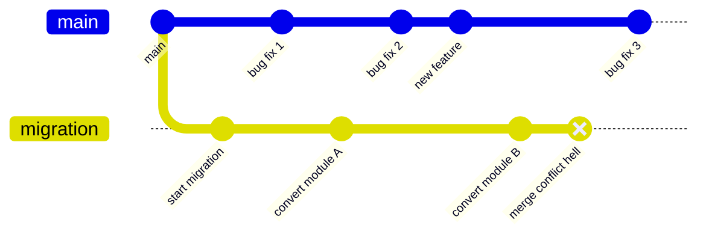

**The failure:** Migration took so long that the main branch diverged beyond reconciliation.

**The prevention:** Phase-based migration that merges to main after every phase. The migration branch never lives more than a few days.

### Failure Pattern 2: The Behavior Change

The team migrates error handling from return codes to exceptions. The tests pass. Production crashes. Why? Because the old code *relied* on errors being ignored. A function returned an error code, the caller didn't check it, and the program continued with invalid data—but continued *successfully* because the invalid data happened to be harmless in that specific case. The new code throws an exception, and there's no catch block.

```cpp
// Old code: error ignored, but "works"
int result = legacy_parse(input, &output);
// result is -1 (error), but we never check it
// output contains garbage, but we never use the garbage field
process(output.valid_field);  // happens to work

// New code: error thrown, program crashes
auto output = modern_parse(input);  // throws!
// we never reach here
process(output.valid_field);
```

**The failure:** The migration changed behavior, not just structure.

**The prevention:** Phase 3 (Error Handling) explicitly handles this. Errors that were silently ignored must be *explicitly* ignored in the new code, with documentation explaining why.

### Failure Pattern 3: The Global Tangle

The team starts migrating globals to ServiceLocator. They migrate one global. Tests fail. Why? Because that global was initialized by a function that runs before `main()`, and the ServiceLocator isn't ready yet. Or because the global was accessed during static destruction, after the ServiceLocator was destroyed. Or because the global was shared between threads without synchronization, and moving it into the ServiceLocator added a mutex that caused a deadlock.

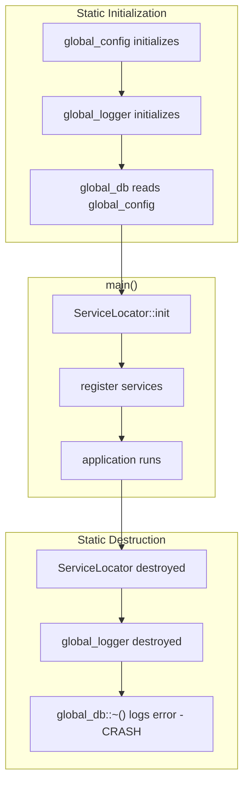

**The failure:** Globals have hidden initialization and destruction order dependencies.

**The prevention:** Phase 0 (Assessment) documents *all* globals and their dependencies. Phase 4 (Global State) migrates them in dependency order.

### Failure Pattern 4: The ABI Break

The team migrates a library. They change function signatures to use `std::string` instead of `const char*`. The library's tests pass. Downstream code that links against the library crashes—or worse, silently corrupts memory—because the ABI changed.

```cpp
// Old header (C ABI)
extern "C" int process_data(const char* input, char* output, size_t output_size);

// New header (C++ ABI) - BREAKS DOWNSTREAM CODE
int process_data(const std::string& input, std::string& output);
```

**The failure:** The migration broke binary compatibility without realizing it.

**The prevention:** Phase 2 (API Boundaries) identifies public symbols. Public C APIs are preserved with `extern "C"` throughout migration. Internal implementation can change; public ABI cannot.

### Failure Pattern 5: The Test Illusion

The team migrates code. Tests pass. Production fails. Why? Because the tests were inadequate. They tested the happy path. They didn't test the edge cases that the C code handled (perhaps accidentally). The migration "fixed" behavior that wasn't broken—it just wasn't tested.

**The failure:** Tests weren't comprehensive enough to catch behavior changes.

**The prevention:** Phase 0 adds tests *before* migration. Phase 1 adds regression tests capturing current behavior, even if that behavior seems wrong. Changes to behavior require conscious decision, not accidental discovery.

---

## The People You Will Meet

Code doesn't migrate itself. People do. And people have opinions.

### The Custodian

The Custodian has maintained this code for fifteen years. They know every quirk, every workaround, every why-does-this-work-but-only-on-Thursdays. They've seen migrations before. They've seen migrations fail. They're skeptical.

The Custodian is your most valuable ally—if you earn their trust. Don't dismiss their concerns as resistance to change. Ask them *why* the code is the way it is. Document what they tell you. Every "that's strange" in the code has a story.

**Arguments that don't work on the Custodian:**
- "Modern C++ is better." (They know. They've been here longer than you.)
- "This code is hard to maintain." (They maintain it fine.)
- "We need to modernize." (Why? It works.)

**Arguments that work:**
- "I found a potential memory leak in this module. Can you help me understand if it's real?" (Engage their expertise.)
- "The tests don't cover this edge case. Do you remember what should happen here?" (Acknowledge their knowledge.)
- "If we migrate this one global, you won't have to remember to call `init_config()` before `load_settings()` anymore." (Offer concrete benefits.)

### The Purist

The Purist wants to do everything right. They want to use the latest C++23 features. They want to eliminate every raw pointer. They want the code to be *beautiful*. They're frustrated by the pace of migration and the compromises required.

The Purist is a liability if unsupervised. They'll make "small improvements" that change behavior. They'll refactor beyond the scope of the current phase. They'll introduce dependencies on features that aren't available on the customer's ancient compiler.

**How to work with the Purist:**
- Give them a clear scope. "In this phase, we're *only* changing error handling."
- Review their changes carefully. Look for scope creep.
- Channel their energy. "Write the design doc for Phase 8. What *should* this code look like?"
- Remind them: ugly working code beats beautiful broken code.

### The Skeptic

The Skeptic doesn't believe the migration will succeed. They've seen migrations before. They've seen them fail. They're waiting for this one to be abandoned so they can say "I told you so."

The Skeptic is useful. They'll point out everything that can go wrong. Listen to them. Address their concerns in the plan. Then prove them wrong—not by arguing, but by shipping working code, phase by phase.

**How to convert the Skeptic:**
- Small, visible wins. Complete Phase 1 quickly and merge it.
- Transparency. Share the plan, share the progress, share the problems.
- Concrete evidence. "Here's a bug the migration caught. Here's how the sanitizer found it."

### Management

Management wants to know when it will be done and how much it will cost. They don't care about RAII. They care about shipping features and not breaking production.

**How to talk to Management:**
- "The migration is eight phases. Each phase takes 1-2 weeks. Each phase produces working code we can ship if needed."
- "We're reducing technical debt. Here's the bug rate in migrated modules vs. unmigrated modules."
- "We can stop after any phase if priorities change. We don't lose the work."

---

# Part I — Preparing the Ground

---

## Phase 0: Understanding What You Have

You cannot safely migrate what you do not understand. Phase 0 is about understanding.

### The Inventory

Before you change a single line of code, you must know what you're dealing with. This means creating an inventory:

**Lines of code:** Not because size matters directly, but because it sets expectations. A 5,000-line codebase migrates in a month. A 500,000-line codebase migrates in a year.

```bash
find src/ -name "*.c" -o -name "*.h" | xargs wc -l
```

**Files and directories:** The physical structure hints at the logical structure. Sometimes.

```bash
find src/ -type f -name "*.c" | wc -l
find src/ -type f -name "*.h" | wc -l
tree -d src/ | head -50
```

**Global variables:** These are migration targets. Count them. Classify them. You'll be living with them for a while.

```bash
# Static file-scope variables (internal linkage)
grep -rn "^static\s" --include="*.c" src/ | grep -v "(.*).*{" | grep "[=;]"

# Extern declarations (external linkage)
grep -rn "^extern\s" --include="*.h" include/
```

### The Global State Census

For every global variable, answer these questions:

1. **What is its type?** Primitive, struct, pointer, mutex?
2. **Who initializes it?** Before `main()`? In `main()`? On first use?
3. **Who reads it?** List every file.
4. **Who writes it?** List every file.
5. **Is it protected by a mutex?** Which one?
6. **What happens if it's not initialized?** Crash? Silent corruption? Nothing?

This is tedious. Do it anyway. You will thank yourself later.

The census produces a table like this:

| Global | Type | Init | Readers | Writers | Mutex | Category |
|--------|------|------|---------|---------|-------|----------|
| `g_config` | `Config*` | `main()` | 12 files | 1 file | None | MIGRATE |
| `g_log_level` | `int` | static | 8 files | 2 files | None | MIGRATE |
| `g_mutex` | `pthread_mutex_t` | static | 5 files | 5 files | (is mutex) | KEEP |
| `g_allocator` | `Allocator*` | before main | All files | 1 file | Internal | KEEP |
| `g_errno` | `__thread int` | N/A | Local | Local | N/A | KEEP |

The "Category" column is crucial. Not every global should be migrated:

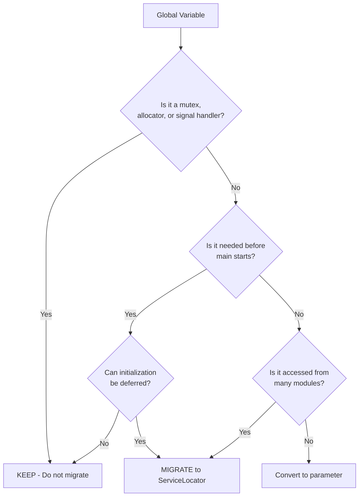

### Globals That Must Stay

Some globals are not migration targets. They are process-level coordination mechanisms that exist *because* the operating system requires them:

**Mutexes and locks.** A mutex is already thread-safe. Wrapping it in ServiceLocator adds overhead and complexity with no benefit. Worse, if the ServiceLocator's own mutex is of lower priority, you've introduced a lock-ordering problem.

**Memory allocators.** The allocator is used by *everything*, including the C++ standard library, including the ServiceLocator. Moving it into ServiceLocator creates a circular dependency: the ServiceLocator needs memory to store the allocator, but the allocator is what provides memory.

**Signal handlers.** These run in a special context with strict constraints. They cannot safely use C++ features. Leave them alone.

**Thread-local storage.** If a variable is `__thread` or `thread_local`, it's already isolated per-thread. There's nothing to migrate.

**Bootstrap state.** Some globals must exist before C++ runtime initialization completes. The `iostream` objects (`std::cin`, `std::cout`, `std::cerr`) are examples—they must be available for static initializers to use.

### The Test Situation

Now assess your tests. The ideal is comprehensive unit tests with high coverage. The reality is usually... less.

```bash
# Find test files
find . -name "*test*" -type f | grep -E "\.(c|cpp|h)$"

# Look for test frameworks
grep -r "assert\|CHECK\|EXPECT\|TEST\|BOOST_TEST" tests/

# Count test cases
grep -c "TEST\|TEST_F\|TEST_CASE" tests/*.cpp 2>/dev/null | awk -F: '{sum += $2} END {print sum}'
```

Classify what you find:

| Coverage Level | Description | Migration Risk |
|----------------|-------------|----------------|
| **None** | No tests exist | Very High — add tests before migrating |
| **Smoke** | A few integration tests | High — add unit tests for critical modules |
| **Partial** | Some units tested, many not | Medium — add tests for migrated modules |
| **Comprehensive** | Most code tested | Low — trust but verify |

If you have no tests, **stop**. Phase 0 must include writing tests. You cannot safely migrate code you cannot test. The migration will change behavior in subtle ways, and without tests, you won't know until production breaks.

### The Documentation Situation

Check for documentation. Any kind.

```bash
# Comments in code
grep -r "TODO\|FIXME\|HACK\|XXX\|NOTE" --include="*.c" --include="*.h" src/

# README files
find . -name "README*" -o -name "*.md"

# Documentation directories
ls -la doc/ docs/ documentation/ 2>/dev/null
```

Document what you find—especially the *lack* of documentation. In the migration, you will create documentation. Knowing there was none before helps you prioritize.

### The Dependency Map

Understand what depends on what. This determines the order of migration.

At the file level:
```bash
# For each .c file, list its includes
for f in src/*.c; do
    echo "=== $f ==="
    grep "^#include" "$f"
done
```

At the module level, sketch a dependency diagram:

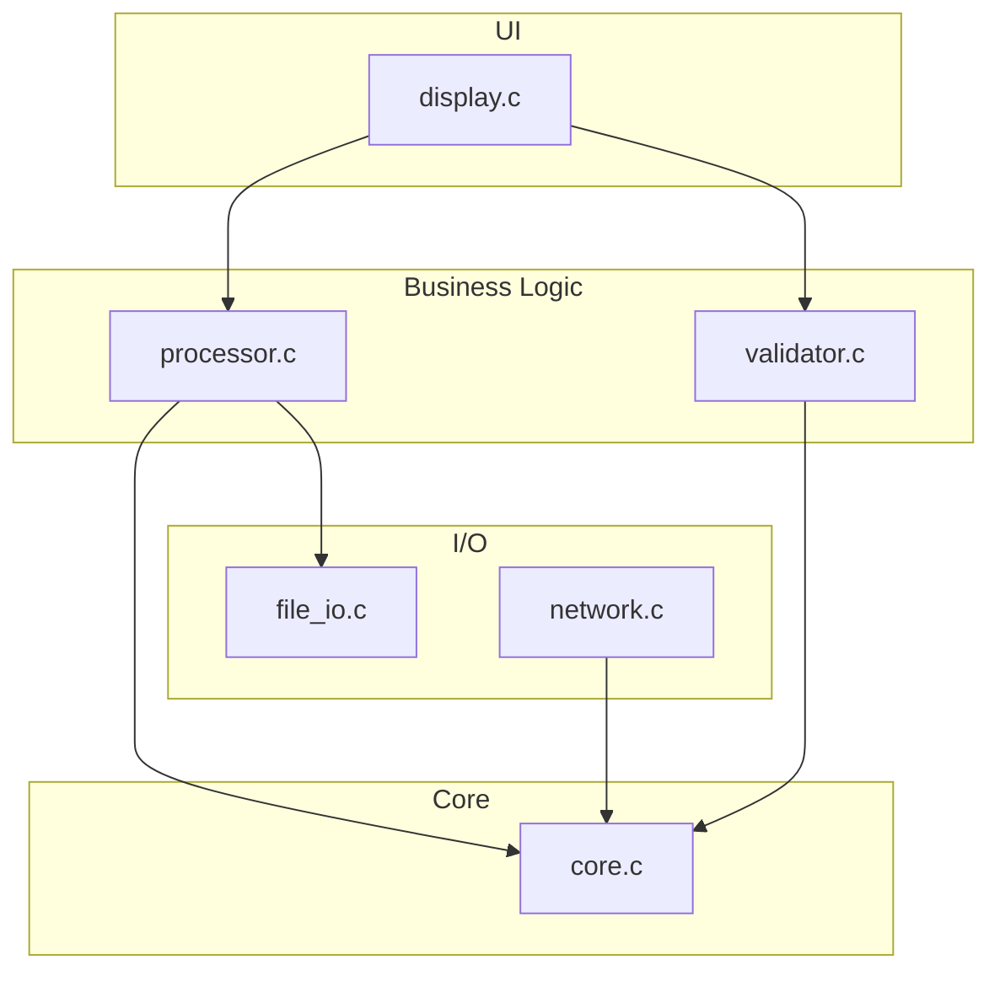

Migration proceeds from the bottom up—from the code with no dependencies to the code that depends on everything.

### The Deliverable

Phase 0 produces a **Migration Analysis Document**. This document contains:

1. **Executive Summary:** Size, complexity, risk assessment, time estimate
2. **Code Inventory:** Files, lines, modules, dependencies
3. **Global State Census:** Every global, classified
4. **Test Assessment:** Coverage level, gaps identified
5. **Documentation Assessment:** What exists, what's missing
6. **Dependency Map:** What depends on what
7. **Recommended Phase Order:** Based on dependencies and risk
8. **Stakeholder Notes:** Who maintains what, who knows what

This document is your map. Refer to it throughout the migration. Update it as you learn more.

---

## Phase 1: Making It Compile

The goal of Phase 1 is simple: make the code compile with a C++ compiler without changing its behavior. The code will still look like C. The code will still act like C. But it will be *valid* C++, which means you can start using C++ features in later phases.

This sounds trivial. It isn't.

### The Keyword Problem

C and C++ share most of their syntax, but C++ reserves additional keywords. If your C code uses these keywords as identifiers, the C++ compiler will reject it.

The most common offenders:

```c
// C: perfectly legal
int class;          // C++: keyword
void *new;          // C++: keyword
char *template;     // C++: keyword
int private, public; // C++: keywords
int virtual;        // C++: keyword
```

Finding them is easy:

```bash
grep -rn "\bclass\b" --include="*.c" --include="*.h" src/ | grep -v "//"
grep -rn "\bnew\b" --include="*.c" --include="*.h" src/ | grep -v "//"
grep -rn "\btemplate\b" --include="*.c" --include="*.h" src/ | grep -v "//"
```

Fixing them requires thought. Don't just append an underscore—choose a meaningful name:

| C Identifier | Bad Fix | Good Fix |
|--------------|---------|----------|
| `class` | `class_` | `type_class` or `klass` |
| `new` | `new_` | `new_ptr` or `allocated` |
| `template` | `template_` | `tmpl` or `pattern` |
| `private` | `private_` | `priv` or `is_private` |

These changes affect behavior in zero ways. They affect readability—make sure the new names are clear.

### The Conversion Problem

C allows implicit conversions that C++ forbids. The most common: `void*` converts implicitly to any pointer type in C, but requires an explicit cast in C++.

```c
// C: compiles
void *p = malloc(100);
char *s = p;  // implicit conversion

// C++: error - no implicit conversion from void*
char *s = p;  // error
char *s = static_cast<char*>(p);  // explicit conversion required
```

This shows up *everywhere* in C code, because `malloc` returns `void*`:

```c
// Every malloc needs a cast
Config *cfg = malloc(sizeof(Config));         // C: ok, C++: error
Config *cfg = (Config*)malloc(sizeof(Config)); // C: ok, C++: ok (C-style cast)
Config *cfg = static_cast<Config*>(malloc(sizeof(Config))); // C++: preferred
```

For Phase 1, use C-style casts or `static_cast`. The code is ugly, but it compiles. Phase 7 will replace `malloc` with proper C++ allocation, and the casts will disappear.

Find them all:

```bash
# Find malloc/calloc/realloc without casts
grep -rn "=[[:space:]]*malloc\|=[[:space:]]*calloc\|=[[:space:]]*realloc" --include="*.c" src/
```

### The Declaration Problem

C allows calling functions without prior declaration. The compiler assumes the function returns `int` and takes unspecified arguments. C++ requires a declaration before use.

```c
// C: compiles (with warning)
int main() {
    process_data();  // No declaration visible
    return 0;
}

void process_data() {  // Defined later in same file
    // ...
}
```

```cpp
// C++: error - 'process_data' was not declared in this scope
```

The fix is to add forward declarations or include the appropriate header:

```cpp
void process_data();  // Forward declaration

int main() {
    process_data();  // Now it's declared
    return 0;
}
```

Finding missing declarations is easy—the compiler tells you. But understanding *why* they're missing takes investigation. Sometimes it's just sloppy code. Sometimes there's a circular dependency that the original author "solved" by relying on implicit declaration.

### The Extern "C" Wrapper

Headers that must remain usable from C need `extern "C"` linkage. This tells the C++ compiler to use C naming conventions (no name mangling) for the declared symbols.

Every public header should get this treatment:

```c
/* Before: pure C header */
#ifndef MYLIB_H
#define MYLIB_H

int initialize(void);
int process(const char *input);
void shutdown(void);

#endif
```

```cpp
/* After: C and C++ compatible */
#ifndef MYLIB_H
#define MYLIB_H

#ifdef __cplusplus
extern "C" {
#endif

int initialize(void);
int process(const char *input);
void shutdown(void);

#ifdef __cplusplus
}
#endif

#endif
```

The `#ifdef __cplusplus` guards ensure the header works when included from C code (which doesn't understand `extern "C"`).

Put these wrappers on *all* public headers now, even if you don't think you need them. It's cheap insurance. If downstream C code links against your library, changing the linkage later breaks their builds.

### The Build System

Update the build system to use a C++ compiler. The syntax varies:

**CMake:**
```cmake
# Before
project(mylib C)

# After
project(mylib CXX)
set(CMAKE_CXX_STANDARD 17)
set(CMAKE_CXX_STANDARD_REQUIRED ON)
```

**Makefile:**
```makefile
# Before
CC = gcc
CFLAGS = -Wall -O2

# After
CXX = g++
CXXFLAGS = -std=c++17 -Wall -O2
```

If you have a mix of C and C++ files, you can compile them separately:

```cmake
project(mylib C CXX)
set(CMAKE_C_STANDARD 11)
set(CMAKE_CXX_STANDARD 17)

# C files stay C
add_library(legacy_c OBJECT legacy/old_code.c)

# C++ files are C++
add_library(mylib src/new_code.cpp)
target_link_libraries(mylib PRIVATE legacy_c)
```

### Verification

Phase 1 is complete when:

1. **All code compiles with a C++ compiler.** No errors.
2. **All tests pass.** The behavior is unchanged.
3. **Public headers have extern "C" wrappers.** C consumers are protected.

Tag it:
```bash
git add -A
git commit -m "Phase 1: Compile as C++"
git tag phase1-compile
```

### What You Haven't Done

Phase 1 changed nothing about the code's behavior. It's still C code that happens to compile with a C++ compiler. The globals are still global. The memory management is still manual. The error handling is still inconsistent.

That's fine. You've established a baseline. From here, every change is incremental.

---

## Phase 2: Drawing the Lines

The goal of Phase 2 is to clearly separate public API from internal implementation. This separation matters because:

1. **Public API has ABI constraints.** You can't change it without breaking downstream code.
2. **Internal implementation has no constraints.** You can modernize freely.
3. **The boundary must be explicit.** If you don't know what's public, you'll break something.

### Finding the Public API

The public API consists of symbols that external code can use. In C, this means:

- Functions declared in public headers
- Types defined in public headers
- Global variables declared `extern` in public headers
- Macros defined in public headers

Start by listing what you think is public:

```bash
# Functions in public headers
grep -rn "^[a-zA-Z_][a-zA-Z0-9_]*\s\+[a-zA-Z_][a-zA-Z0-9_]*\s*(" include/*.h

# Types in public headers
grep -rn "^typedef\|^struct\|^enum\|^union" include/*.h

# Extern variables in public headers
grep -rn "^extern" include/*.h
```

Now compare to what's actually exported from the compiled library:

```bash
# Symbols exported from shared library
nm -g --defined-only libmylib.so | grep " T "
```

The difference is revealing. You may find:

- Functions you thought were internal that are actually exported
- Functions you thought were public that aren't in any header
- Symbols you've never heard of

Each discrepancy is a decision point.

### The Three Categories

Organize headers into three categories:

```
include/mylib/          ← Public API (users see this)
    mylib.h
    types.h
    errors.h

src/internal/           ← Internal API (library code sees this)
    internal.h
    algorithms.h

src/                    ← Private (one file sees this)
    core.c              ← might have its own .h
    parser.c
```

Move headers to their appropriate locations. Update `#include` paths throughout the codebase.

### Hiding Internal Symbols

Symbols that aren't public should be invisible to external code. C has limited tools for this; C++ adds more.

**Option 1: Static linkage**

Functions used only within one file should be `static`:

```c
// Before: visible to linker
void internal_helper(int x) { /* ... */ }

// After: invisible to linker
static void internal_helper(int x) { /* ... */ }
```

This is the simplest approach and works in both C and C++.

**Option 2: Visibility attributes (GCC/Clang)**

For shared libraries, you can control symbol visibility:

```c
// In public header
#if defined(__GNUC__) || defined(__clang__)
    #define MYLIB_API __attribute__((visibility("default")))
    #define MYLIB_INTERNAL __attribute__((visibility("hidden")))
#elif defined(_MSC_VER)
    #define MYLIB_API __declspec(dllexport)
    #define MYLIB_INTERNAL
#else
    #define MYLIB_API
    #define MYLIB_INTERNAL
#endif

// Public function
MYLIB_API int mylib_process(const char *input);

// Internal function (not visible to library users)
MYLIB_INTERNAL void internal_helper(int x);
```

Compile with `-fvisibility=hidden` to hide symbols by default, then explicitly mark public symbols with `MYLIB_API`.

### Documenting ABI Commitments

For each public symbol, document:

| Symbol | Signature | Stable? | Notes |
|--------|-----------|---------|-------|
| `mylib_init` | `int mylib_init(void)` | Yes | Since v1.0 |
| `mylib_process` | `int mylib_process(const char*)` | Yes | Since v1.0 |
| `mylib_config_t` | struct, 24 bytes | Yes | Size/layout frozen |
| `mylib_set_handler` | `void mylib_set_handler(void(*)(int))` | Deprecated | Use `mylib_set_callback` |

This documentation is your ABI contract. When in doubt, assume a symbol is stable. Breaking ABI should be a conscious decision with a major version bump.

### The Future C++ API

While you're thinking about API boundaries, sketch what a C++ API might look like:

```cpp
namespace mylib {

class Processor {
public:
    explicit Processor(const Config& config);
    
    Expected<Result, Error> process(std::string_view input);
    
    // No raw pointers
    // No error codes
    // No manual cleanup
};

}  // namespace mylib
```

You won't implement this now—that's Phase 5 and beyond. But having a vision helps guide decisions.

### Verification

Phase 2 is complete when:

1. **Headers are organized into public/internal/private.**
2. **Internal symbols are hidden** (static or visibility).
3. **ABI commitments are documented.**
4. **All tests pass.**
5. **Downstream code (if any) still compiles and links.**

Tag it:
```bash
git commit -m "Phase 2: API boundaries defined"
git tag phase2-api
```

---

# Part II — The Migration Phases

---

## Phase 3: Choosing How to Fail

Error handling is where C and C++ diverge most dramatically. C uses return codes, errno, and out-parameters. C++ adds exceptions and, with modern libraries, `Expected<T,E>`. Your choice here affects every function in the codebase.

This phase is about making that choice—and implementing it consistently.

### The C Error Landscape

Survey your codebase. You'll find some combination of:

**Return codes:** The function returns a status, and the actual result goes into an out-parameter.

```c
int parse_config(const char *path, Config *out_config) {
    FILE *f = fopen(path, "r");
    if (!f) return -1;
    if (!read_header(f, out_config)) {
        fclose(f);
        return -2;
    }
    // ... more failure points ...
    fclose(f);
    return 0;
}
```

**Magic values:** The function returns the result directly, with a special value indicating error.

```c
int find_index(const int *arr, size_t len, int target) {
    for (size_t i = 0; i < len; i++) {
        if (arr[i] == target) return i;
    }
    return -1;  // Not found
}
```

**Errno:** The function signals failure somehow, and details go into the global `errno`.

```c
ssize_t read_all(int fd, void *buf, size_t count) {
    ssize_t n = read(fd, buf, count);
    if (n < 0) {
        // errno is set by read()
        return -1;
    }
    return n;
}
```

**Out-parameter error:** The error code goes into a pointer parameter.

```c
double compute_ratio(int a, int b, int *error) {
    if (b == 0) {
        if (error) *error = ERR_DIV_ZERO;
        return 0.0;
    }
    if (error) *error = ERR_NONE;
    return (double)a / (double)b;
}
```

**Abort:** For "impossible" situations, just crash.

```c
void must_succeed(int result) {
    if (result != 0) {
        fprintf(stderr, "Fatal: operation failed with %d\n", result);
        abort();
    }
}
```

Find all of these in your codebase:

```bash
# Return code patterns
grep -rn "return -1\|return NULL\|return 0.*error" src/

# Errno usage
grep -rn "errno\s*=" src/

# Out-parameter errors
grep -rn "\*error\s*=\|\*err\s*=" src/

# Abort patterns
grep -rn "abort()\|exit(1)\|assert(.*false)" src/
```

Document what you find. You need to know the landscape before you can unify it.

### The Three C++ Options

**Option 1: Exceptions**

Exceptions separate the error path from the success path. Code that can't fail doesn't mention errors. Code that can fail throws. Code that can handle errors catches.

```cpp
std::string read_file(const std::string& path) {
    std::ifstream file(path);
    if (!file) {
        throw std::runtime_error("Failed to open: " + path);
    }
    std::stringstream buffer;
    buffer << file.rdbuf();
    return buffer.str();
}

void process() {
    try {
        auto config = read_file("config.txt");
        // ... use config ...
    } catch (const std::exception& e) {
        log_error(e.what());
    }
}
```

**When to use exceptions:**
- Errors are rare (< 1% of calls)
- Recovery happens many levels up the call stack
- The team is comfortable with exception safety
- Performance overhead is acceptable (stack unwinding costs)

**When NOT to use exceptions:**
- Across C ABI boundaries (exceptions can't cross `extern "C"`)
- In performance-critical inner loops
- When errors are expected (file not found is not exceptional)
- In embedded systems or real-time code

**Option 2: Expected<T, E>**

`Expected` is a type that holds either a value or an error. The caller must explicitly check which.

```cpp
Expected<std::string, Error> read_file(const std::string& path) {
    std::ifstream file(path);
    if (!file) {
        return Unexpected(Error::FileNotFound);
    }
    std::stringstream buffer;
    buffer << file.rdbuf();
    return buffer.str();
}

void process() {
    auto result = read_file("config.txt");
    if (!result) {
        log_error(result.error());
        return;
    }
    auto& config = *result;
    // ... use config ...
}
```

**When to use Expected:**
- Errors are common (> 1% of calls)
- The caller needs detailed error information
- Performance is critical (no stack unwinding)
- Exceptions are forbidden by coding standards

**When NOT to use Expected:**
- Error handling is verbose and repetitive (every call needs checking)
- Deep call stacks would become if-check cascades
- The codebase is small and exceptions would be simpler

**Option 3: Keep Return Codes (Improved)**

Sometimes the right choice is to keep what you have—but make it better.

```cpp
// Old: magic numbers
int result = process_data(input);
if (result == -1) { /* error */ }
if (result == -2) { /* different error */ }

// New: named constants, [[nodiscard]]
enum class [[nodiscard]] ProcessResult {
    Success = 0,
    InvalidInput = 1,
    FileNotFound = 2,
    PermissionDenied = 3
};

[[nodiscard]] ProcessResult process_data(const char* input);

// Caller can't silently ignore
auto result = process_data(input);  // Warning if result unused
switch (result) {
    case ProcessResult::Success: /* ... */ break;
    case ProcessResult::InvalidInput: /* ... */ break;
    // Compiler warns if cases are missing
}
```

**When to keep return codes:**
- Must maintain C ABI compatibility
- Team is resistant to change
- Codebase is small and simple
- Time/budget is limited

### Making the Decision

Use this flowchart:

```mermaid
flowchart TD
    A[Start] --> B{Must maintain C ABI?}
    B -->|Yes, for all functions| C[Return codes with [[nodiscard]]]
    B -->|Yes, for some functions| D{Which functions?}
    B -->|No| E{Are errors rare?}
    
    D --> F[C ABI: return codes]
    D --> G[Internal: Expected or exceptions]
    
    E -->|Yes, errors < 1%| H{Team comfortable<br/>with exceptions?}
    E -->|No, errors common| I[Expected<T,E>]
    
    H -->|Yes| J[Exceptions]
    H -->|No| I
    
    C --> K[Document in Migration Guide Card]
    F --> K
    G --> K
    I --> K
    J --> K
```

Whatever you choose, **be consistent**. A codebase with three different error handling strategies is worse than a codebase with one imperfect strategy.

### Defining Error Types

Create a unified error system:

```cpp
namespace mylib {

// Error codes
enum class ErrorCode : int {
    Success = 0,
    
    // I/O errors (1xx)
    FileNotFound = 100,
    PermissionDenied = 101,
    EndOfFile = 102,
    DiskFull = 103,
    
    // Parse errors (2xx)
    InvalidSyntax = 200,
    UnexpectedToken = 201,
    UnterminatedString = 202,
    
    // Logic errors (3xx)
    InvalidArgument = 300,
    OutOfRange = 301,
    NullPointer = 302,
    InvalidState = 303,
    
    // Resource errors (4xx)
    OutOfMemory = 400,
    ResourceBusy = 401,
    Timeout = 402,
};

// Human-readable messages
constexpr const char* to_string(ErrorCode code) {
    switch (code) {
        case ErrorCode::Success: return "Success";
        case ErrorCode::FileNotFound: return "File not found";
        case ErrorCode::PermissionDenied: return "Permission denied";
        // ... all cases ...
        default: return "Unknown error";
    }
}

// Rich error type for Expected
struct Error {
    ErrorCode code;
    std::string message;
    std::string_view file;
    int line;
    
    static Error make(ErrorCode c, std::string msg,
                      std::string_view f = __builtin_FILE(),
                      int l = __builtin_LINE()) {
        return {c, std::move(msg), f, l};
    }
};

// Convenient alias
template<typename T>
using Result = Expected<T, Error>;

}  // namespace mylib
```

### The Migration

Migrate error handling **bottom-up**, starting with leaf functions (functions that call no other migratable functions).

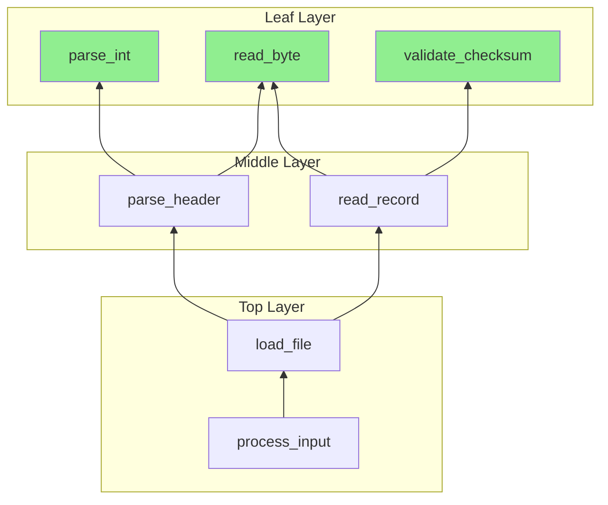

**Step 1: Migrate leaf functions**

```c
// Before: C return code
int parse_int(const char *str, int *out) {
    char *end;
    long val = strtol(str, &end, 10);
    if (end == str) return -1;        // No digits
    if (*end != '\0') return -2;      // Trailing garbage
    if (val < INT_MIN || val > INT_MAX) return -3;  // Overflow
    *out = (int)val;
    return 0;
}
```

```cpp
// After: Expected
Result<int> parse_int(std::string_view str) {
    if (str.empty()) {
        return Unexpected(Error::make(ErrorCode::InvalidArgument, "Empty string"));
    }
    
    char *end;
    long val = strtol(str.data(), &end, 10);
    
    if (end == str.data()) {
        return Unexpected(Error::make(ErrorCode::InvalidSyntax, 
            "No digits found in: " + std::string(str)));
    }
    if (*end != '\0') {
        return Unexpected(Error::make(ErrorCode::InvalidSyntax,
            "Trailing characters after number: " + std::string(str)));
    }
    if (val < INT_MIN || val > INT_MAX) {
        return Unexpected(Error::make(ErrorCode::OutOfRange,
            "Value out of int range: " + std::to_string(val)));
    }
    
    return static_cast<int>(val);
}
```

**Step 2: Migrate callers**

```c
// Before: checking return code
int parse_config_value(const char *str, Config *cfg) {
    int value;
    int err = parse_int(str, &value);
    if (err != 0) return err;
    cfg->value = value;
    return 0;
}
```

```cpp
// After: propagating Expected
Result<void> parse_config_value(std::string_view str, Config& cfg) {
    auto value = parse_int(str);
    if (!value) {
        return Unexpected(value.error());  // Propagate error
    }
    cfg.value = *value;
    return {};  // Success
}
```

**Step 3: Handle at top level**

```cpp
int main() {
    auto config = load_config("settings.ini");
    if (!config) {
        std::cerr << "Failed to load config: " 
                  << config.error().message 
                  << " at " << config.error().file 
                  << ":" << config.error().line << "\n";
        return 1;
    }
    
    run_application(*config);
    return 0;
}
```

### Preserving the C API

If you have a public C API, wrap the C++ implementation:

```cpp
// Internal C++ implementation
Result<ProcessedData> process_internal(std::string_view input);

// Public C API (preserved for compatibility)
extern "C" int mylib_process(const char *input, ProcessedData *out) {
    if (!input || !out) {
        return static_cast<int>(ErrorCode::NullPointer);
    }
    
    auto result = process_internal(input);
    if (!result) {
        return static_cast<int>(result.error().code);
    }
    
    *out = std::move(*result);
    return 0;  // Success
}
```

### Verification

Phase 3 is complete when:

1. **Error strategy is chosen and documented.**
2. **Error types are defined.**
3. **Leaf functions are migrated.**
4. **Callers are updated to use new error types.**
5. **C API is preserved (if required).**
6. **All tests pass—including error path tests.**
7. **No silent error drops** (use `[[nodiscard]]` or equivalent).

Tag it:
```bash
git commit -m "Phase 3: Error handling unified"
git tag phase3-errors
```

---

## Phase 4: Taming the Globals

Global variables are the root of much C suffering. They create hidden dependencies, prevent testing, cause thread-safety bugs, and make initialization order a mystery. Phase 4 transforms globals into explicit dependencies.

### The Global Census Revisited

You created a global census in Phase 0. Now it's time to act on it.

Recall the categories:

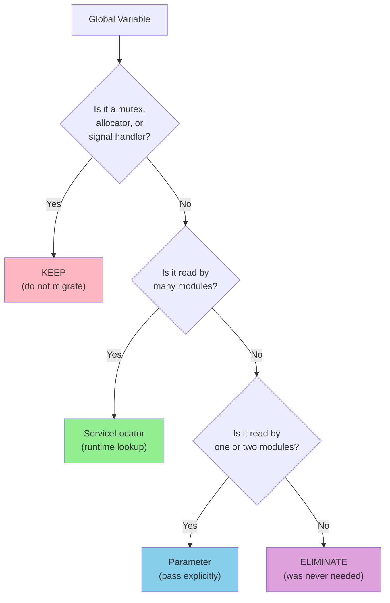

### Category: Keep

Some globals must stay. They're not C-isms to be modernized—they're process-level coordination mechanisms that would exist in any language.

**Mutexes:** A mutex is already doing its job. Moving it into a wrapper or ServiceLocator adds indirection and potential for deadlock. Leave it alone.

```c
// This is fine. Don't touch it.
static pthread_mutex_t g_data_mutex = PTHREAD_MUTEX_INITIALIZER;
```

**Memory allocators:** Your allocator is called before `main()`, before the C++ runtime is initialized, before ServiceLocator exists. It cannot depend on anything that depends on it.

```c
// This must stay global.
Allocator *g_allocator = &default_allocator;
```

**Bootstrap state:** Some globals exist because they must be available during static initialization. iostream objects (`std::cin`, `std::cout`) are the canonical example.

### Category: ServiceLocator

Most configuration, logging, caching, and registry globals belong here. They're accessed widely but don't have process-level constraints.

The pattern:

1. Define an interface for the service
2. Implement the service
3. Register the service in `main()` before any use
4. Access via ServiceLocator::resolve<IService>()

**Before: Global variable**

```c
// config.h
extern Config *g_config;

// config.c
Config *g_config = NULL;

void init_config(const char *path) {
    g_config = malloc(sizeof(Config));
    load_config_from_file(path, g_config);
}

// user.c
void process() {
    if (g_config->verbose) {
        printf("Processing...\n");
    }
}
```

The problems:
- `g_config` must be initialized before use. Who ensures this?
- `g_config` can't be replaced for testing.
- `g_config` is a single instance. What if you need two configurations?
- Anyone can modify `g_config`. There's no access control.

**After: ServiceLocator**

```cpp
// iconfig.h - Interface
class IConfig {
public:
    virtual ~IConfig() = default;
    virtual bool verbose() const = 0;
    virtual int timeout() const = 0;
    virtual std::string_view dataPath() const = 0;
};

// config.cpp - Implementation
class ConfigImpl : public IConfig {
    bool verbose_ = false;
    int timeout_ = 30;
    std::string dataPath_;
    
public:
    void loadFromFile(const std::string& path) {
        // ... load from file ...
    }
    
    bool verbose() const override { return verbose_; }
    int timeout() const override { return timeout_; }
    std::string_view dataPath() const override { return dataPath_; }
};

// main.cpp - Registration
int main(int argc, char **argv) {
    // Create and configure
    auto config = std::make_shared<ConfigImpl>();
    config->loadFromFile("config.ini");
    
    // Register
    ServiceLocator::instance().registerShared<IConfig>(config);
    
    // Now it's available everywhere
    run_application();
}

// user.cpp - Usage
void process() {
    auto& config = ServiceLocator::instance().resolve<IConfig>();
    if (config.verbose()) {
        std::cout << "Processing...\n";
    }
}
```

The benefits:
- Initialization is explicit and visible in `main()`.
- Testing can register a mock: `ServiceLocator::instance().registerShared<IConfig>(mockConfig);`
- The interface prevents unauthorized modification.
- Multiple configurations are possible (register with different names).

### The Initialization Order Problem

Globals initialized before `main()` have undefined initialization order across translation units. This is the Static Initialization Order Fiasco (SIOF).

```cpp
// file_a.cpp
static Registry& getRegistry() {
    static Registry instance;
    return instance;
}
std::string name = getRegistry().lookup(42);  // Uses registry

// file_b.cpp
static auto registration = [] {
    getRegistry().add(42, "answer");  // Adds to registry
    return 0;
}();
```

Which runs first? If `file_a.cpp`'s initialization runs before `file_b.cpp`, the lookup fails.

**Solution 1: Function-local statics**

C++11 guarantees that function-local statics are initialized exactly once, thread-safely, on first use.

```cpp
Registry& getRegistry() {
    static Registry instance;  // Initialized on first call
    return instance;
}
```

Now whoever calls `getRegistry()` first triggers initialization. Order doesn't matter.

**Solution 2: Explicit initialization order**

Put all initialization in `main()`:

```cpp
int main() {
    // Phase 1: Core services
    initializeLogging();
    initializeConfig();
    
    // Phase 2: Dependent services
    initializeDatabase();  // Depends on config
    initializeCache();     // Depends on config
    
    // Phase 3: Application
    runApplication();
    
    // Shutdown in reverse order
    shutdownCache();
    shutdownDatabase();
    shutdownConfig();
    shutdownLogging();
}
```

This is verbose but explicit. You can see the order. You can change the order. Bugs are traceable.

### Category: Parameter

Globals that are used by only a few functions should become parameters:

**Before:**
```c
static TransactionContext *g_current_tx;

void process_record(Record *r) {
    if (g_current_tx->isolation_level > 2) {
        // ...
    }
}
```

**After:**
```cpp
void process_record(const TransactionContext& tx, Record& r) {
    if (tx.isolation_level() > 2) {
        // ...
    }
}
```

This is the simplest transformation. The dependency is explicit. Testing is easy—just pass a test context.

### Category: Eliminate

Some globals shouldn't exist. They were added out of laziness, or because passing parameters felt like too much work.

**Signs a global can be eliminated:**
- It's only read in one function
- It's only written in one function
- It holds temporary computation results
- It duplicates information available elsewhere

**Before:**
```c
static int g_last_error;

int process() {
    // ...
    if (failed) {
        g_last_error = err_code;
        return -1;
    }
    // ...
}

const char *get_last_error() {
    return error_messages[g_last_error];
}
```

**After:**
```cpp
Result<void> process() {
    // ...
    if (failed) {
        return Unexpected(Error::make(err_code, "..."));
    }
    // ...
}
// g_last_error is gone. The error travels with the result.
```

### The Migration Order

Migrate globals in dependency order. If global A's initialization uses global B, migrate B first.

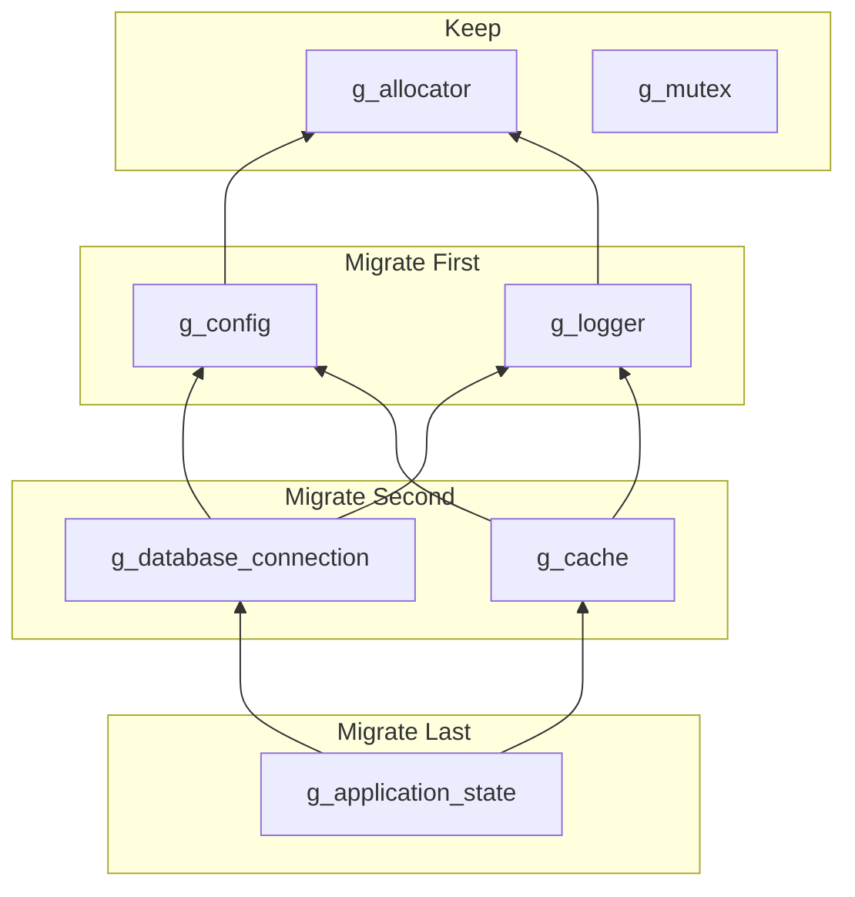

After each global migration:
1. Run all tests
2. Run thread sanitizer
3. Commit

Don't migrate multiple globals in one commit. If something breaks, you want to know which change caused it.

### Testing with ServiceLocator

ServiceLocator enables test isolation:

```cpp
TEST(Processor, UsesConfigTimeout) {
    // Create mock
    auto mockConfig = std::make_shared<MockConfig>();
    mockConfig->setTimeout(5);  // Short timeout for test
    
    // Create scope (shadows global registration)
    auto scope = ServiceLocator::instance().createScope();
    scope.registerShared<IConfig>(mockConfig);
    
    // Test runs with mock
    Processor p;
    auto result = p.processWithTimeout();
    
    // Verify mock was used
    EXPECT_TRUE(mockConfig->timeoutWasCalled());
}
// Scope destructor restores original registration
```

This is the payoff. Tests that were impossible—or required elaborate setup—become straightforward.

### Verification

Phase 4 is complete when:

1. **Every global is classified** (keep/ServiceLocator/parameter/eliminate).
2. **ServiceLocator infrastructure is in place.**
3. **Globals are migrated in dependency order.**
4. **Each migration is committed separately.**
5. **Thread sanitizer reports no races.**
6. **Tests pass with both real and mock services.**
7. **No static initialization order dependencies remain.**

Tag it:
```bash
git commit -m "Phase 4: Global state migrated"
git tag phase4-globals
```

---

## Phase 5: Drawing the Map

A flat list of source files doesn't tell you anything about architecture. Phase 5 organizes code into namespaced components with explicit dependencies.

### Why Namespaces Matter

Without namespaces, every symbol is in the global namespace. Name collisions are easy. Understanding structure requires reading comments (if they exist).

With namespaces, the code structure is visible:

```cpp
mylib::core::Engine       // Core algorithm
mylib::io::FileReader     // I/O subsystem
mylib::config::Settings   // Configuration
mylib::detail::Helper     // Implementation detail
```

A developer can understand the architecture from symbol names alone.

### Designing the Hierarchy

Start from your Phase 0 dependency map. Convert subsystems to namespaces:

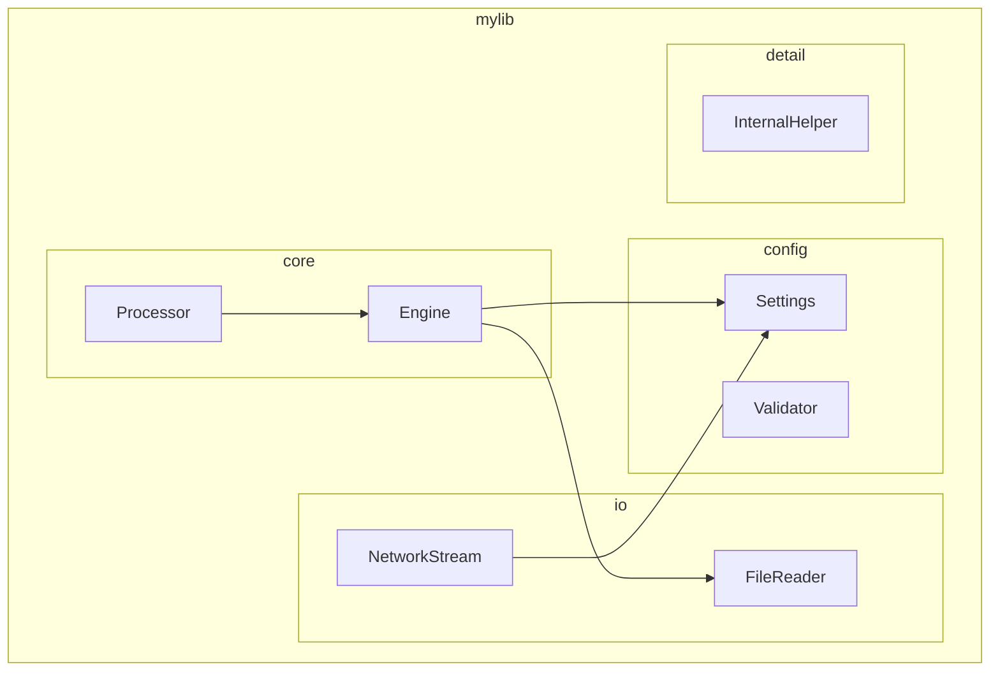

The namespace hierarchy should match the directory hierarchy:

```
include/mylib/
    mylib.h           # Master header (includes everything)
    core.h            # Core namespace
    io.h              # I/O namespace
    config.h          # Config namespace
    
src/
    core/
        engine.cpp
        processor.cpp
    io/
        file_reader.cpp
        network_stream.cpp
    config/
        settings.cpp
        validator.cpp
    detail/
        internal_helper.cpp
```

### Dependency Rules

Define which namespaces can depend on which:

```cpp
// ALLOWED: core can use config
#include <mylib/config.h>
namespace mylib::core {
    void Engine::start() {
        auto& settings = config::getSettings();
    }
}

// FORBIDDEN: config cannot use core
// This would create a cycle
namespace mylib::config {
    void validate() {
        core::Engine e;  // NO! config cannot depend on core
    }
}
```

Encode these rules in the build system:

```cmake
# config has no internal dependencies
add_library(mylib_config src/config/settings.cpp src/config/validator.cpp)

# io depends on config
add_library(mylib_io src/io/file_reader.cpp src/io/network_stream.cpp)
target_link_libraries(mylib_io PRIVATE mylib_config)

# core depends on io and config
add_library(mylib_core src/core/engine.cpp src/core/processor.cpp)
target_link_libraries(mylib_core PRIVATE mylib_io mylib_config)

# Application depends on everything
add_executable(myapp src/main.cpp)
target_link_libraries(myapp PRIVATE mylib_core)
```

If someone accidentally adds a dependency from config to core, the build fails:

```
error: mylib_config cannot link against mylib_core (would create cycle)
```

### The detail Namespace

Internal implementation details go in a `detail` namespace:

```cpp
namespace mylib::detail {
    // Not part of public API
    // May change without notice
    // Do not use directly
    
    class InternalBuffer { /* ... */ };
    void internal_helper(int x);
}
```

The `detail` namespace signals intent: "This is not for you." It's not enforced by the language, but it's a strong convention.

### Migrating Files

Move files to their new locations:

```bash
# Before
src/engine.c
src/processor.c
src/file_reader.c
src/settings.c

# After
src/core/engine.cpp
src/core/processor.cpp
src/io/file_reader.cpp
src/config/settings.cpp
```

Update includes throughout:

```cpp
// Before
#include "engine.h"
#include "file_reader.h"

// After
#include <mylib/core.h>
#include <mylib/io.h>
```

Use angle brackets for library headers (searched in system paths) and quotes for local headers (searched relative to the including file).

### Verification

Phase 5 is complete when:

1. **Namespace hierarchy is defined and documented.**
2. **Directory structure matches namespace structure.**
3. **Dependency rules are encoded in build system.**
4. **Circular dependencies are impossible (build fails if attempted).**
5. **All includes updated to use new paths.**
6. **All tests pass.**

Tag it:
```bash
git commit -m "Phase 5: Component structure established"
git tag phase5-components
```

---

## Phase 6: Making Types Mean Something

C's type system is weak. An `int` is an `int`, whether it represents a user ID, a document ID, a count, or an error code. The compiler can't tell you when you've passed arguments in the wrong order or compared unrelated values.

Phase 6 adds type safety.

### The Problem with Integers

Consider this function:

```c
void transfer(int from_account, int to_account, int amount) {
    // ...
}
```

Every argument is `int`. The compiler can't help if you write:

```c
transfer(amount, from_account, to_account);  // WRONG! Compiles fine.
```

This bug might be caught by tests. It might not. It might make it to production and transfer $1000 from "account 50" instead of transferring $50 from account 1000.

### Strong Type Aliases

Create distinct types that can't be accidentally interchanged:

```cpp
// Define tag types
struct AccountIdTag {};
struct AmountTag {};

// Create strong type aliases
using AccountId = StrongId<AccountIdTag, int>;
using Amount = StrongId<AmountTag, int>;

// Function with strong types
void transfer(AccountId from, AccountId to, Amount amount);

// Usage
AccountId alice{1001};
AccountId bob{1002};
Amount payment{50};

transfer(alice, bob, payment);     // Correct
transfer(bob, alice, payment);     // Still compiles (might be intentional)
transfer(payment, alice, bob);     // ERROR: Amount is not AccountId
```

Now the compiler catches the mistake.

### Enum Classes

C enums are weakly typed. They convert implicitly to integers and from integers:

```c
enum Status { PENDING, APPROVED, REJECTED };
enum Priority { LOW, MEDIUM, HIGH };

Status s = PENDING;
s = HIGH;  // WRONG type, but compiles (HIGH is 2, which is valid)
int x = s; // Implicit conversion
```

C++ enum classes are strongly typed:

```cpp
enum class Status { Pending, Approved, Rejected };
enum class Priority { Low, Medium, High };

Status s = Status::Pending;
s = Priority::High;  // ERROR: can't convert Priority to Status
int x = s;           // ERROR: no implicit conversion
int x = static_cast<int>(s);  // OK: explicit conversion
```

### Exhaustive Switch Statements

With enum classes and `-Wswitch-enum`, the compiler warns about missing cases:

```cpp
Status s = getStatus();

switch (s) {
    case Status::Pending: return "Waiting";
    case Status::Approved: return "Done";
    // WARNING: case 'Status::Rejected' not handled
}
```

If you add a new status, every switch must be updated. The compiler tells you where.

**Never use `default:` in exhaustive switches.** It silences the warning:

```cpp
switch (s) {
    case Status::Pending: return "Waiting";
    case Status::Approved: return "Done";
    default: return "Unknown";  // BAD: hides missing cases
}
```

### [[nodiscard]]

Mark functions whose return value must not be ignored:

```cpp
[[nodiscard]] Result<Data> load_data(const std::string& path);

load_data("file.txt");  // WARNING: ignoring return value
```

Apply `[[nodiscard]]` to:
- Functions returning error information
- Functions returning allocated resources
- Factory functions
- Functions where ignoring the result is always a bug

### std::optional

Replace "magic values" with explicit optionality:

```c
// C: -1 means "not found"
int find_index(const int *arr, size_t len, int target) {
    for (size_t i = 0; i < len; i++) {
        if (arr[i] == target) return i;
    }
    return -1;
}

// Caller might forget to check
int idx = find_index(arr, len, 42);
arr[idx] = 0;  // BUG if idx is -1
```

```cpp
// C++: optional makes absence explicit
std::optional<size_t> find_index(std::span<const int> arr, int target) {
    for (size_t i = 0; i < arr.size(); i++) {
        if (arr[i] == target) return i;
    }
    return std::nullopt;
}

// Caller must handle absence
auto idx = find_index(arr, 42);
if (idx) {
    arr[*idx] = 0;  // Safe: we checked
}
```

### Replacing void* with Templates or Variants

C uses `void*` for generic programming. It's type-unsafe:

```c
void process(void *data, int type) {
    if (type == TYPE_INT) {
        int *p = (int*)data;
        // ...
    } else if (type == TYPE_STRING) {
        char *p = (char*)data;
        // ...
    }
}
```

C++ has better options:

**Templates** when the type is known at compile time:

```cpp
template<typename T>
void process(T& data) {
    // Compiler generates specialized code for each type
}
```

**std::variant** when the type is one of a known set at runtime:

```cpp
using Data = std::variant<int, std::string, double>;

void process(const Data& data) {
    std::visit([](auto&& value) {
        // Compiler generates code for each alternative
    }, data);
}
```

**std::any** when the type is truly unknown (rare):

```cpp
void store(std::any data) {
    // Type erased storage
}

std::any a = 42;
std::any b = std::string("hello");
```

### Verification

Phase 6 is complete when:

1. **Integer IDs are replaced with strong types.**
2. **C enums are replaced with enum classes.**
3. **Switch statements are exhaustive** (no default cases).
4. **Important functions are marked [[nodiscard]].**
5. **Magic values are replaced with std::optional.**
6. **void* is replaced with templates or variants.**
7. **Compiler warnings are clean at -Wswitch-enum, -Wconversion.**

Tag it:
```bash
git commit -m "Phase 6: Type safety established"
git tag phase6-types
```

---

## Phase 7: Making Cleanup Automatic

Manual resource management is the #1 source of bugs in C code. Memory leaks, double frees, use after free, dangling pointers—all stem from the same root: humans are bad at ensuring every allocation has exactly one deallocation on every code path.

RAII (Resource Acquisition Is Initialization) solves this. Resources are acquired in constructors, released in destructors. Cleanup is automatic.

### The Manual Memory Landscape

Find all manual resource management in your codebase:

```bash
# Memory
grep -rn "malloc\|calloc\|realloc\|free" src/
grep -rn "\bnew\b\|\bdelete\b" src/

# Files
grep -rn "fopen\|fclose" src/

# POSIX resources
grep -rn "open\|close" src/ | grep -v "fclose\|fopen"
grep -rn "socket\|accept\|connect" src/

# Locks
grep -rn "lock\|unlock\|pthread_mutex" src/
```

For each pattern, identify:
- Where the resource is acquired
- Where it should be released
- What happens if an error occurs between acquisition and release

### Smart Pointers

The simplest RAII migration replaces raw pointers with smart pointers:

**std::unique_ptr** for exclusive ownership:

```cpp
// Before: manual memory management
void process() {
    Data *data = (Data*)malloc(sizeof(Data));
    if (!data) return;
    
    if (!initialize(data)) {
        free(data);  // Don't forget!
        return;
    }
    
    if (!validate(data)) {
        free(data);  // Don't forget!
        return;
    }
    
    compute(data);
    free(data);  // Don't forget!
}
```

```cpp
// After: automatic cleanup
void process() {
    auto data = std::make_unique<Data>();
    
    if (!initialize(*data)) {
        return;  // data automatically freed
    }
    
    if (!validate(*data)) {
        return;  // data automatically freed
    }
    
    compute(*data);
    // data automatically freed
}
```

Every early return, every exception, every code path—cleanup is automatic.

**std::shared_ptr** for shared ownership:

```cpp
auto config = std::make_shared<Config>();

// Multiple owners
ServiceLocator::instance().registerShared<IConfig>(config);
auto processor = std::make_shared<Processor>(config);

// config lives until all owners are destroyed
```

Use `shared_ptr` sparingly. If ownership isn't genuinely shared, prefer `unique_ptr` with references or raw pointers for non-owning access.

### RAII Wrappers for C Resources

For resources without standard C++ wrappers, create your own:

```cpp
class FileHandle {
    FILE* f_ = nullptr;
    
public:
    explicit FileHandle(const char* path, const char* mode)
        : f_(fopen(path, mode)) {}
    
    ~FileHandle() { 
        if (f_) fclose(f_); 
    }
    
    // Non-copyable
    FileHandle(const FileHandle&) = delete;
    FileHandle& operator=(const FileHandle&) = delete;
    
    // Movable
    FileHandle(FileHandle&& other) noexcept 
        : f_(std::exchange(other.f_, nullptr)) {}
    
    FileHandle& operator=(FileHandle&& other) noexcept {
        if (this != &other) {
            if (f_) fclose(f_);
            f_ = std::exchange(other.f_, nullptr);
        }
        return *this;
    }
    
    // Access
    FILE* get() const { return f_; }
    explicit operator bool() const { return f_ != nullptr; }
    
    // For C APIs expecting FILE*
    FILE* release() { return std::exchange(f_, nullptr); }
};
```

Or use `unique_ptr` with a custom deleter:

```cpp
struct FileDeleter {
    void operator()(FILE* f) const {
        if (f) fclose(f);
    }
};

using FileHandle = std::unique_ptr<FILE, FileDeleter>;

FileHandle open_file(const char* path, const char* mode) {
    return FileHandle(fopen(path, mode));
}
```

### ScopeGuard for Ad-Hoc Cleanup

For cleanup that doesn't fit neatly into an RAII wrapper, use ScopeGuard:

```cpp
void complex_operation() {
    acquire_resource_a();
    auto guard_a = make_scope_guard([] { release_resource_a(); });
    
    acquire_resource_b();
    auto guard_b = make_scope_guard([] { release_resource_b(); });
    
    if (!prepare()) {
        return;  // Both guards run: b then a
    }
    
    if (!execute()) {
        return;  // Both guards run: b then a
    }
    
    // Success path: both guards run: b then a
}
```

ScopeGuard is especially useful during the migration: you can wrap existing C cleanup code without restructuring it.

### Lock Guards

Replace manual lock/unlock with lock guards:

```cpp
// Before: manual locking
void process_shared_data() {
    pthread_mutex_lock(&mutex);
    
    if (error_condition) {
        pthread_mutex_unlock(&mutex);  // Don't forget!
        return;
    }
    
    modify_data();
    
    pthread_mutex_unlock(&mutex);  // Don't forget!
}
```

```cpp
// After: automatic unlocking
void process_shared_data() {
    std::lock_guard<std::mutex> lock(mutex);
    
    if (error_condition) {
        return;  // mutex automatically unlocked
    }
    
    modify_data();
    // mutex automatically unlocked
}
```

For more complex locking (deferred lock, multiple mutexes), use `std::unique_lock` or `std::scoped_lock`.

### Containers Instead of Arrays

Replace manual array management with containers:

```cpp
// Before: manual array
size_t capacity = 100;
Data *items = (Data*)malloc(capacity * sizeof(Data));
size_t count = 0;

void add(Data item) {
    if (count >= capacity) {
        capacity *= 2;
        items = (Data*)realloc(items, capacity * sizeof(Data));
    }
    items[count++] = item;
}

void cleanup() {
    free(items);  // Don't forget!
}
```

```cpp
// After: std::vector
std::vector<Data> items;
items.reserve(100);

void add(Data item) {
    items.push_back(std::move(item));  // Grows automatically
}

// No cleanup needed
```

### Verification

Phase 7 is complete when:

1. **No `malloc`/`free` in new code.**
2. **No raw `new`/`delete` in new code.**
3. **All C resources have RAII wrappers.**
4. **All locks use lock guards.**
5. **AddressSanitizer reports no leaks.**
6. **No manual cleanup in error paths** (RAII handles it).

Run AddressSanitizer on the full test suite:

```bash
cmake -DCMAKE_CXX_FLAGS="-fsanitize=address -fno-omit-frame-pointer" ..
make
ctest --output-on-failure
```

Any leak or use-after-free will be reported.

Tag it:
```bash
git commit -m "Phase 7: RAII for all resources"
git tag phase7-raii
```

---

## Phase 8: Modern Idioms

Phase 8 is about polish. The code is correct, type-safe, and memory-safe. Now make it readable, idiomatic, and maintainable.

### Range-Based For Loops

Replace index-based iteration with range-based:

```cpp
// Before
for (size_t i = 0; i < items.size(); i++) {
    process(items[i]);
}

// After
for (const auto& item : items) {
    process(item);
}
```

Range-based loops are:
- Shorter
- Less error-prone (no off-by-one)
- Clearer about intent

### Algorithms

Replace explicit loops with standard algorithms:

```cpp
// Before: find element
bool found = false;
for (size_t i = 0; i < items.size(); i++) {
    if (items[i] == target) {
        found = true;
        break;
    }
}

// After: std::find
bool found = std::find(items.begin(), items.end(), target) != items.end();

// Or with ranges (C++20)
bool found = std::ranges::contains(items, target);
```

```cpp
// Before: transform
std::vector<int> results;
for (const auto& item : items) {
    results.push_back(transform(item));
}

// After: std::transform
std::vector<int> results;
results.reserve(items.size());
std::transform(items.begin(), items.end(), 
               std::back_inserter(results), transform);
```

Algorithms are:
- Self-documenting (the name says what happens)
- Often optimized (parallel versions, SIMD)
- Less error-prone (no manual iteration)

### Structured Bindings

Unpack tuples and pairs clearly:

```cpp
// Before
std::map<std::string, int> counts;
for (auto it = counts.begin(); it != counts.end(); ++it) {
    const std::string& key = it->first;
    int value = it->second;
    process(key, value);
}

// After
for (const auto& [key, value] : counts) {
    process(key, value);
}
```

```cpp
// Before
std::tuple<int, std::string, double> result = compute();
int id = std::get<0>(result);
std::string name = std::get<1>(result);
double score = std::get<2>(result);

// After
auto [id, name, score] = compute();
```

### std::string_view

Use `string_view` for non-owning string access:

```cpp
// Before: copies or raw pointers
void process(const std::string& s);  // Forces copy if caller has const char*
void process(const char* s);         // No length, must null-terminate

// After: non-owning view
void process(std::string_view s);    // Works with string, string_view, char*, string literal
```

`string_view` is:
- Cheap to copy (just a pointer and length)
- Works with any string-like source
- Length-aware (no strlen needed)

But remember: `string_view` doesn't own. Don't store it beyond the lifetime of the underlying string.

### auto

Use `auto` for obvious types:

```cpp
// Good: type is clear from context
auto it = map.find(key);
auto ptr = std::make_unique<Widget>();
auto result = compute();  // If compute()'s return type is obvious

// Bad: type obscures understanding
auto x = f();  // What type is x? What does f return?
auto config = getConfig();  // Is this a value? A reference? A pointer?
```

The rule: use `auto` when the type is obvious from the right-hand side or when spelling the type adds noise without clarity.

### Verification

Phase 8 is complete when:

1. **Range-based loops used where applicable.**
2. **Standard algorithms used instead of hand-written loops.**
3. **Structured bindings used for tuple/pair access.**
4. **string_view used for non-owning string parameters.**
5. **auto used judiciously** (not excessively).
6. **Code review passes for style consistency.**
7. **All tests pass.**

Tag it:
```bash
git commit -m "Phase 8: Modern C++ idioms"
git tag phase8-modern
```

Or, if this is a major version:
```bash
git tag v2.0.0 -m "Migration complete"
```

---

# Part III — The Cross-Cutting Concerns

---

## Compatibility and ABI Boundaries

### The C ABI Must Survive

If your library has external C users, the public C API must remain callable throughout and after migration.

```cpp
// Old C header
int mylib_process(const char *input);

// New C++ implementation
namespace mylib::internal {
    Result<std::string> process(std::string_view input);
}

// Preserved C wrapper
extern "C" int mylib_process(const char *input) {
    auto result = mylib::internal::process(input);
    if (!result) {
        return static_cast<int>(result.error().code);
    }
    return 0;
}
```

The C API is a thin wrapper around the C++ implementation. Internal code uses modern C++. External code sees unchanged C.

### Symbol Visibility

Hide internal symbols to prevent accidental use and reduce binary size:

```cpp
// Build with -fvisibility=hidden
// Only explicitly exported symbols are visible

#define MYLIB_API __attribute__((visibility("default")))

extern "C" {
    MYLIB_API int mylib_process(const char *input);  // Visible
}

namespace mylib::internal {
    void helper();  // Hidden (default visibility = hidden)
}
```

### ABI Version Checking

Consider adding version information to the API:

```cpp
extern "C" {
    MYLIB_API int mylib_version(void);  // Returns ABI version
    
    MYLIB_API int mylib_init(void) {
        // Check that header version matches library version
        // (Advanced: can be done with inline function in header)
    }
}
```

---

## Lifetime and Ownership Model

### Ownership Rules

Document ownership for every resource-managing type:

| Type | Ownership | Transfer |
|------|-----------|----------|
| `std::unique_ptr<T>` | Exclusive | Move only |
| `std::shared_ptr<T>` | Shared | Copy or move |
| `T*` (raw pointer) | Non-owning | N/A |
| `T&` (reference) | Non-owning | N/A |
| `std::string_view` | Non-owning | Copy (of view, not data) |

### Teardown Ordering

Destruction happens in reverse order of construction. Plan for it:

```cpp
int main() {
    // Construction order: logger, config, database, application
    auto logger = std::make_shared<Logger>();
    auto config = std::make_shared<Config>(logger);
    auto database = std::make_shared<Database>(config, logger);
    auto app = std::make_unique<Application>(database, config, logger);
    
    app->run();
    
    // Destruction order: application, database, config, logger
    // Each destructor can safely use its dependencies
}
```

### ServiceLocator Lifetime

Services registered with ServiceLocator must outlive their users:

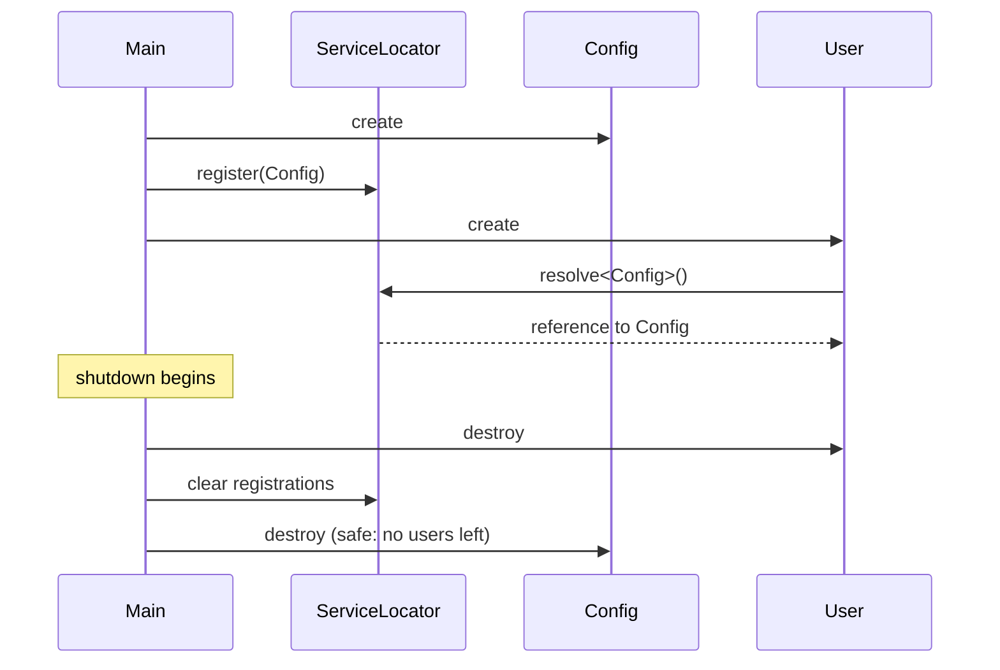

---

## Thread-Safety and Reentrancy

### Thread-Safety Levels

Document thread-safety for every public type:

| Level | Meaning | Example |
|-------|---------|---------|
| **None** | Not thread-safe. External synchronization required. | `std::vector` |
| **Const** | Const methods are thread-safe. Mutable methods require synchronization. | Most FAT-P types |
| **Full** | All methods are thread-safe. | `std::shared_ptr` control block |

### ServiceLocator Thread-Safety

```cpp
// SAFE: resolve() is thread-safe (read-only after setup)
void worker_thread() {
    auto& config = ServiceLocator::instance().resolve<IConfig>();
    // Use config
}

// UNSAFE: registration is not thread-safe
// Do this during single-threaded setup only
void setup() {
    ServiceLocator::instance().registerShared<IConfig>(config);
}
```

### Reentrancy

A reentrant function can be safely called while another invocation is active. Document reentrancy constraints:

```cpp
// Signal::emit() is NOT reentrant
// Do not call emit() from within a connected slot
signal.connect([] {
    signal.emit();  // UNDEFINED BEHAVIOR
});
```

---

## Error and Failure Model

### Error Type Summary

| Situation | C Pattern | C++ Pattern |
|-----------|-----------|-------------|
| Programming error | `assert()` | `assert()` or contract (C++20) |
| Recoverable, local | Return code | `Expected<T, E>` |
| Recoverable, distant | Return code + propagation | Exception |
| Unrecoverable | `abort()` | `std::terminate()` |

### Error Propagation

Errors should propagate until they reach code that can handle them:

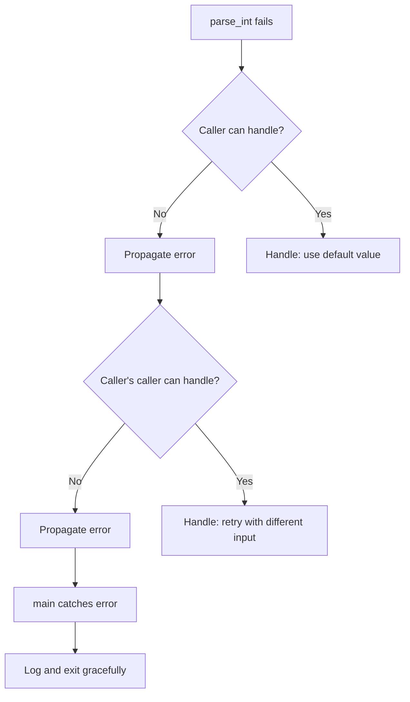

### C API Error Mapping

Map internal errors to C error codes:

```cpp
extern "C" int mylib_process(const char *input) {
    auto result = internal::process(input);
    if (!result) {
        set_last_error(result.error());  // For detailed error retrieval
        return static_cast<int>(result.error().code);
    }
    return 0;
}

extern "C" const char* mylib_get_last_error(void) {
    return get_last_error().message.c_str();
}
```

---

# Part IV — Survival Guide

---

## Verification Plan

### Continuous Verification

At every phase:

1. **Compile** with maximum warnings:
   ```bash
   -Wall -Wextra -Wpedantic -Werror -Wconversion -Wsign-conversion
   ```

2. **Run tests**:
   ```bash
   ctest --output-on-failure
   ```

3. **Run sanitizers**:
   ```bash
   # AddressSanitizer
   cmake -DCMAKE_CXX_FLAGS="-fsanitize=address" ..
   make && ctest
   
   # UndefinedBehaviorSanitizer
   cmake -DCMAKE_CXX_FLAGS="-fsanitize=undefined" ..
   make && ctest
   
   # ThreadSanitizer
   cmake -DCMAKE_CXX_FLAGS="-fsanitize=thread" ..
   make && ctest
   ```

4. **Check ABI** (if library):
   ```bash
   nm -g --defined-only libmylib_new.so > new_symbols.txt
   diff expected_symbols.txt new_symbols.txt
   ```

### Go/No-Go Criteria

Before advancing to the next phase:

- [ ] All tests pass
- [ ] No new sanitizer errors
- [ ] ABI unchanged (if required)
- [ ] Performance within 10% of baseline
- [ ] Code review approved
- [ ] Documentation updated

---

## Rollback Plan

### Phase-Level Rollback

Every phase is tagged. Rollback is simple:

```bash
# Complete rollback to end of Phase 3
git checkout phase3-errors

# Create hotfix branch from Phase 3
git checkout -b hotfix-phase3 phase3-errors
```

### Partial Rollback

If a specific change within a phase causes problems:

```bash
# Identify the problematic commit
git bisect start
git bisect bad HEAD
git bisect good phase4-globals

# Test each commit until the bad one is found
# Then revert it
git revert <bad-commit>
```

### What Can Stay After Rollback

| Change | Can Stay | Notes |
|--------|----------|-------|
| `extern "C"` wrappers | Yes | Harmless |
| RAII wrappers (unused) | Yes | No overhead |
| ServiceLocator (unused) | Yes | No overhead |
| Error types (unused) | Yes | No overhead |
| Namespace structure | Yes | No runtime impact |

### What Must Revert

| Change | Must Revert |
|--------|-------------|
| Removed global variable | Yes |
| Changed function signature | Yes |
| Changed error handling | Yes (or fix callers) |
| Modified public header | Yes |

---

## When Migration Fails

Sometimes migration doesn't work. The team runs out of time. The Custodian retires. Priorities shift. The code is too tangled.

When this happens:

1. **Document what you learned.** Write down the globals you found, the dependencies you mapped, the tests you added. This knowledge has value even if the migration stops.

2. **Commit what you have.** Partial progress is still progress. Phase 2 complete is better than Phase 0 abandoned.

3. **Create a roadmap for the future.** When priorities allow, someone can pick up where you left off.

4. **Don't delete the tests.** The tests you added in Phase 0 and Phase 1 make the C code better even if modernization never continues.

5. **Accept it.** Not every codebase gets migrated. Some C code runs for decades unchanged. If it works, it works.

---

## Quick Reference

### Phase Summary

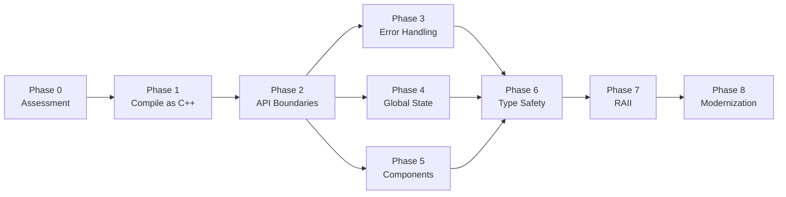

### Command Cheat Sheet

```bash
# Find globals
grep -rn "^static\s" --include="*.c" src/
grep -rn "^extern\s" --include="*.h" include/

# Find manual memory
grep -rn "malloc\|free\|new\|delete" src/

# Find error handling
grep -rn "return -1\|return NULL\|errno" src/

# Run with AddressSanitizer
cmake -DCMAKE_CXX_FLAGS="-fsanitize=address" ..

# Run with ThreadSanitizer
cmake -DCMAKE_CXX_FLAGS="-fsanitize=thread" ..

# Tag a phase
git tag phase3-errors -m "Phase 3: Error handling complete"

# Compare ABI
nm -g --defined-only lib.so | grep " T " | sort
```

### Related Documents

| Topic | Document |
|-------|----------|
| Pre-migration analysis | *Handbook - C Codebase Migration Analysis* |
| Analysis tooling | *User Manual - Analyzing C Code for Migration* |
| Global state | *Migration Guide - Global Services to ServiceLocator* |
| Error handling | *Migration Guide - Error Handling Patterns to Expected* |
| Strong types | *Migration Guide - Integer Handles to StrongId* |
| RAII | *Migration Guide - Manual Memory Management to RAII* |
| Cleanup | *Migration Guide - Manual Resource Cleanup to ScopeGuard* |

---

## Glossary

| Term | Definition |
|------|------------|
| **ABI** | Application Binary Interface — the binary contract between compiled modules |
| **Expected<T,E>** | A type that holds either a value T or an error E |
| **RAII** | Resource Acquisition Is Initialization — tie resource lifetime to object lifetime |
| **ServiceLocator** | A registry for runtime dependency lookup |
| **SIOF** | Static Initialization Order Fiasco — undefined initialization order of file-scope statics |
| **StrongId** | A type-safe wrapper around an integer identifier |
| **extern "C"** | Linkage specification that uses C naming conventions |

---

*FAT-P Library Documentation — January 2025*

*"The code you inherit was someone's best effort. Treat it with respect, even as you replace it."*
