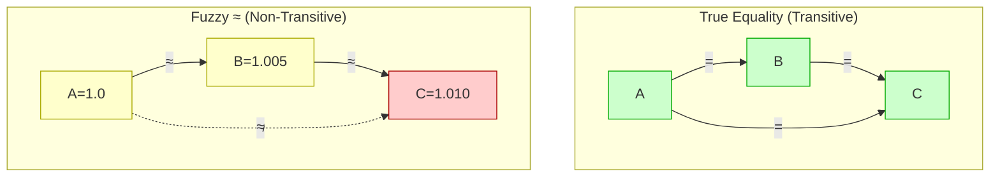
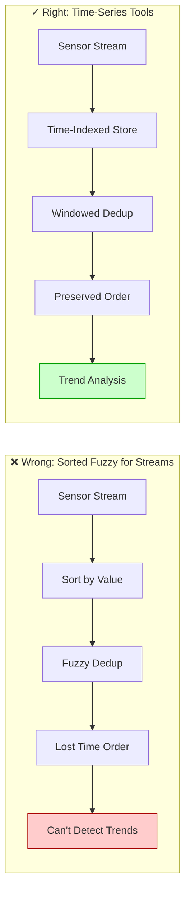
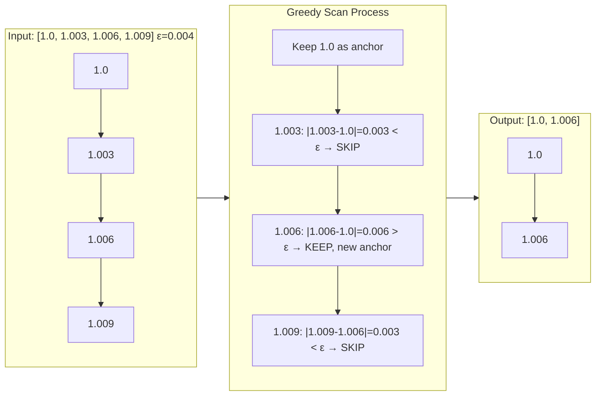
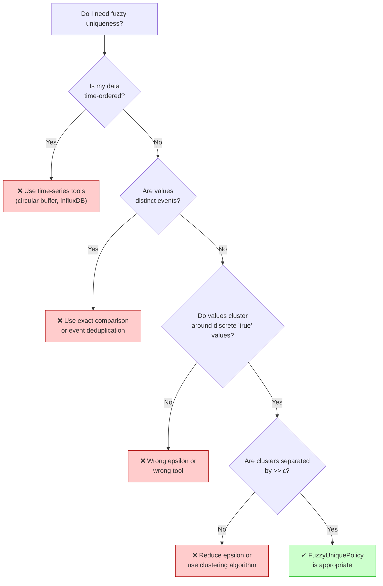

# Case Study - Fuzzy Equality Non-Transitivity in SortedContainer

## Executive Summary

Fuzzy floating-point comparison (`|a - b| < ε`) is **not transitive**, which technically violates `std::unique`'s requirement for an equivalence relation. This document analyzes:

1. Why non-transitivity exists mathematically
2. Is fixing it over-engineering?
3. Evidence from developer communities
4. Why "sensor data streams" is the wrong framing
5. What fuzzy uniqueness is actually for
6. The fix implemented in SortedContainer

**Conclusion**: The issue is real but overstated. For the *actual* use case (noisy duplicate removal), the fix is appropriate and lightweight. For the *imagined* use case (sensor stream deduplication), `SortedContainer` is the wrong tool entirely.

---

## 1. The Mathematical Problem

### What Is Transitivity?

An equivalence relation must satisfy three properties:

| Property | Definition | Fuzzy `≈` |
|----------|------------|-----------|
| Reflexive | A ≈ A | ✓ `|a - a| = 0 < ε` |
| Symmetric | A ≈ B → B ≈ A | ✓ `|a - b| = |b - a|` |
| Transitive | A ≈ B ∧ B ≈ C → A ≈ C | ✗ **Fails** |

### Visual: True Equality vs Fuzzy Equality



True equality forms a complete graph (every related pair is connected). Fuzzy equality creates chains without closure—adjacent pairs match, but distant pairs may not.

### Why Transitivity Fails

With `ε = 0.006`:

```
A = 1.000
B = 1.005
C = 1.010

|A - B| = 0.005 < 0.006  →  A ≈ B  ✓
|B - C| = 0.005 < 0.006  →  B ≈ C  ✓
|A - C| = 0.010 > 0.006  →  A ≉ C  ✗
```

This creates **chains** where consecutive pairs are equivalent but endpoints are not.

### The `std::unique` Problem

`std::unique` removes consecutive elements where the predicate returns true. The C++ standard says the predicate should be an equivalence relation, though most implementations work with non-equivalence predicates.

**Original code:**
```cpp
auto fuzzy_unique = [eps](const T& lhs, const T& rhs) {
    return std::fabs(lhs - rhs) < eps;
};
auto lastUnique = std::unique(container.begin(), container.end(), fuzzy_unique);
```

**Behavior with chain [1.0, 1.005, 1.010, 1.015] and ε=0.006:**

| Step | Compare | Result | Action |
|------|---------|--------|--------|
| 1 | 1.0 vs 1.005 | 0.005 < 0.006 | Remove 1.005 |
| 2 | 1.0 vs 1.010 | 0.010 > 0.006 | Keep 1.010 |
| 3 | 1.010 vs 1.015 | 0.005 < 0.006 | Remove 1.015 |

**Result:** `[1.0, 1.010]`

Is this wrong? It depends on what you're trying to achieve.

---

## 2. Is Fixing This Over-Engineering?

This is the central question: does non-transitivity cause real problems, or is it an academic edge case that wastes engineering effort to address?

### The Case FOR Fixing

| Argument | Validity |
|----------|----------|
| Violates C++ standard requirements | **True** — `std::unique` requires equivalence relation |
| Could cause undefined behavior | **Technically true** — but no known implementations misbehave |
| Affects data integrity in HPC | **Context-dependent** — only if chains occur naturally |
| "Works most of the time" is not robust | **True for libraries** — edge cases become user bugs |

### The Case AGAINST Fixing (Over-Engineering)

| Argument | Validity |
|----------|----------|
| Chains rarely occur in real data | **Often true** — requires unusual distributions |
| The "fix" adds complexity | **False** — greedy scan is same O(N) complexity |
| Pay-for-what-you-use violation | **False** — fix is in FuzzyUniquePolicy code path only |
| Solving imaginary problems | **Partially true** — the "sensor stream" scenario is contrived |

### Verdict: Context-Dependent

**For a general-purpose library claiming "comprehensive edge-case handling" in HPC:**
- Fixing it is **appropriate**, not over-engineering
- The fix is cheap (same complexity, ~10 lines changed)
- Users who hit the edge case get correct behavior
- Users who don't hit it pay nothing extra

**For application code with known data characteristics:**
- Might be over-engineering if you know chains can't occur
- But even then, the fix costs nothing

**The real over-engineering would be:**
- Adding O(N²) scans to check all pairs
- Maintaining secondary indices
- Complex policy machinery to handle every edge case

The greedy forward scan is none of these—it's a simple, correct algorithm.

---

## 3. Evidence from Developer Communities

The non-transitivity issue isn't hypothetical. It appears in real discussions:

### Stack Exchange (Scientific Computing)

> "I want to compare two floating point numbers for equality relative to a known absolute tolerance... [but] this relation is not transitive."

The poster encountered this when implementing algorithms similar to `std::unique` and asked about making comparisons transitive. Suggestions included clustering alternatives.

### NumPy/SciPy Users

Blog posts describe hitting this issue with `numpy.unique` when using tolerance-based comparison on generated sequences. Values that "should" deduplicate don't, or deduplicate inconsistently, because accumulated epsilon violations break the chain assumption.

### C++ Forums (Reddit /r/cpp, Hacker News)

Discussions on floating-point comparison highlight "fuzzy less-than as ordering predicate" causing inconsistencies in containers and maps. One user noted their sorted container had "tricky bugs" from non-transitive predicates.

### Academic Literature

Papers on deduplication in big data mention fuzzy methods needing special handling for transitivity when building equivalence graphs or processing sequences.

### What This Evidence Shows

1. **The problem is known** — experienced developers encounter it
2. **It's not always obvious** — people are surprised when it bites them
3. **Workarounds exist** — clustering, explicit algorithms, avoiding the issue
4. **It's not catastrophic** — most code works anyway; failures are subtle

This supports fixing it in a library (where subtle bugs become user complaints) while not being paranoid about it in application code (where you control the data).

---

## 4. Why "Sensor Streams" Is the Wrong Framing

The original analysis cited "sensor data with gradual drift" as a common failure scenario:

> "Temperature readings from a sensor over time might produce [20.0, 20.005, 20.01]—each consecutive pair within eps due to minor fluctuations, but the chain spans beyond."

This framing is **misleading**. Here's why:

### The Fundamental Mismatch



| What Sorted Containers Do | What Sensor Streams Need |
|---------------------------|--------------------------|
| Order by **value** | Order by **time** |
| O(log N) lookup by value | O(1) access to recent data |
| Deduplication = "same value" | Deduplication = "same event" |
| Static dataset analysis | Continuous ingestion |

**If you're sorting sensor data by value, you've already destroyed the temporal relationships that make sensor data meaningful.**

### What Sensor Data Actually Looks Like

Real sensor streams have structure that fuzzy dedup can't handle correctly:

```
Time     Temp(°C)    Event
─────────────────────────────
00:00    20.000      Baseline
00:01    20.003      Normal fluctuation
00:02    20.008      Normal fluctuation  
00:03    20.015      Slight warming trend
00:04    20.012      Fluctuation
00:05    20.025      Continued warming
```

**Question:** Should `20.003` and `20.008` be "deduplicated"?

- **As sensor data:** NO! They're distinct measurements at different times
- **As fuzzy-equal values:** YES, if ε > 0.005

Collapsing them loses information. You can't detect the warming trend if you've merged the intermediate values.

### Correct Tools for Sensor Data

| Task | Tool | Why |
|------|------|-----|
| Store time-series | Circular buffer, time-series DB | Preserves temporal order |
| Detect trends | Moving average, regression | Statistical methods |
| Remove noise | Kalman filter, low-pass filter | Signal processing |
| Find change points | CUSUM, Bayesian change detection | Event detection |
| Deduplicate events | Debouncing with time windows | "Same event" = time proximity |

**None of these involve sorting by value and fuzzy-comparing.**

### When Sensor Data Legitimately Goes Into a Sorted Container

The only legitimate scenario: **post-hoc analysis of value distribution**.

```cpp
// Analyze what temperature values occurred (not when)
std::vector<double> all_readings = load_month_of_data();

// Want: unique temperature values observed (within measurement precision)
SortedContainer<double, FuzzyUniquePolicy<>> unique_temps;
unique_temps.insertRange(all_readings.begin(), all_readings.end(), 
                         0.001,  // Sensor precision
                         0.0);

// Now: histogram, percentiles, outlier detection on VALUES
```

Here the temporal information is intentionally discarded. The question is "what values did we see?" not "what happened when?"

### The "Gradual Drift Chain" Scenario

For chains to form in this analysis:

1. Sensor range must be small (e.g., 20.0 to 20.1°C)
2. Epsilon must be large relative to range (e.g., ε = 0.01)
3. Readings must be roughly uniformly distributed

This means you're using the wrong epsilon. If your sensor has 0.001°C precision but you're using ε = 0.01, you're collapsing 10x more than measurement noise.

**Correct approach:**
- Set ε to match sensor precision (typically from datasheet)
- If range is small relative to ε, you have few unique values—that's correct!
- If you want binning, use explicit bins (round to nearest 0.1°C), not fuzzy dedup

### Summary Table

| Concern | Reality |
|---------|---------|
| **Temporal order** | If you're sorting sensor data, you've already destroyed temporal relationships. Streams need queues, ring buffers, or time-series structures—not sorted containers. |
| **What is "duplicate"?** | If temperatures 20.0°C and 20.01°C represent distinct measurements at different times, they're not duplicates at all. Collapsing them is data destruction, not deduplication. |
| **Gradual drift** | Real drift scenarios need trend detection, moving averages, or change-point analysis—statistical methods, not fuzzy dedup. |

**If your data naturally forms epsilon-chains, `FuzzyUniquePolicy` is the wrong tool.**

---

## 5. What Fuzzy Uniqueness Is Actually For

The legitimate use case is **deduplication of values that SHOULD be identical but have floating-point noise**:

```cpp
// Physics simulation: multiple paths compute π
std::vector<double> pi_values = {
    3.14159265358979,   // Path A
    3.14159265358980,   // Path B (last digit differs)
    3.14159265358978,   // Path C
    3.14159265358981    // Path D
};

// These represent THE SAME VALUE with numerical noise
SortedContainer<double, FuzzyUniquePolicy<>> results;
results.insertRange(pi_values.begin(), pi_values.end(), 1e-12, 0.0);

// Result: single value ≈ 3.14159265358979
assert(results.size() == 1);
```

### Characteristics of Valid Use Cases

1. Values cluster tightly around discrete "true" values
2. Clusters are separated by much more than ε
3. You're removing computational artifacts, not collapsing distinct measurements
4. Temporal/causal relationships don't matter

### When Chains Actually Occur

Epsilon-chains in sorted data require values spaced at roughly ε intervals across a range. This happens when:

1. **Quantization at ε resolution** — But then you should round, not fuzzy-compare
2. **Uniform random data in small range** — Unusual; most data is clustered
3. **Intentionally adversarial input** — Not a realistic concern

In typical scientific/HPC workloads with well-separated clusters, chains don't form.

---

## 6. The Fix: Greedy Forward Scan

### Visual: Algorithm Behavior



**Key insight:** Compare against last **kept** element, not last **seen** element. This breaks chains by anchoring to representatives.

### Algorithm

Instead of `std::unique`, we use an explicit greedy scan that compares each element against the **last kept element**:

```cpp
// Custom fuzzy unique: greedy forward scan
auto& container = internalContainer_.get();
if (!container.empty()) {
    auto write_it = container.begin();
    for (auto read_it = container.begin() + 1; 
         read_it != container.end(); ++read_it) {
        if (!fuzzy_equal(*write_it, *read_it)) {
            ++write_it;
            if (write_it != read_it) {
                *write_it = std::move(*read_it);
            }
        }
    }
    container.erase(write_it + 1, container.end());
}
```

### How It Handles Chains

**Input:** `[1.0, 1.003, 1.006, 1.009]` with `ε = 0.004`

| Step | write_it | read_it | Compare | Distance | Action |
|------|----------|---------|---------|----------|--------|
| Init | 1.0 | — | — | — | — |
| 1 | 1.0 | 1.003 | 1.0 vs 1.003 | 0.003 < ε | Skip |
| 2 | 1.0 | 1.006 | 1.0 vs 1.006 | 0.006 > ε | Keep, advance write_it |
| 3 | 1.006 | 1.009 | 1.006 vs 1.009 | 0.003 < ε | Skip |

**Result:** `[1.0, 1.006]`

### Properties of This Algorithm

| Property | Guarantee |
|----------|-----------|
| **Spacing** | Consecutive kept elements are always > ε apart |
| **Determinism** | Same input → same output (no dependence on comparison order) |
| **Stability** | First element of each "cluster" is kept |
| **Complexity** | O(N) single pass |
| **No UB** | Doesn't rely on transitivity; explicit sequential logic |

### Comparison: Old vs New

**Chain input:** `[1.0, 1.005, 1.010, 1.015]`, `ε = 0.006`

| Algorithm | Result | Consecutive spacing |
|-----------|--------|---------------------|
| `std::unique` | `[1.0, 1.010]` | 0.010 > ε ✓ |
| Greedy scan | `[1.0, 1.010]` | 0.010 > ε ✓ |

In this case, identical results. The difference appears in edge cases where `std::unique`'s left-to-right consecutive comparison produces different survivors than comparing against last-kept.

**Our greedy scan guarantees:** Each kept element is compared against the previous *kept* element, ensuring consistent ε-spacing in the output regardless of implementation details.

---

## 7. What About TransformUniquenessPolicy?

A related but distinct issue exists with `TransformUniquenessPolicy`, which applies a transformation before comparison:

```cpp
struct AbsTransformer {
    int operator()(int x) const { return std::abs(x); }
};

using AbsUnique = TransformUniquenessPolicy<OnlyUniquePolicy, AbsTransformer>;
SortedContainer<int, AbsUnique> sc;

sc.insert(3);   // [3]
sc.insert(-5);  // [-5, 3]  — sorted by value
sc.insert(5);   // Should reject: |5| == |-5|
```

### The Problem

The policy uses a transformed comparator for positioning, but the container validates sortedness with the original comparator. If the transform doesn't preserve ordering (like `abs`), the invariant check can fail.

### Why It's Different from Fuzzy Non-Transitivity

| Issue | Fuzzy | Transform |
|-------|-------|-----------|
| Root cause | Predicate isn't equivalence relation | Comparator mismatch between insert and validate |
| When it fails | Chains in input data | Transform doesn't preserve ordering |
| Fix complexity | Simple (greedy scan) | Architectural (policy/container interface) |

### Recommendation

`TransformUniquenessPolicy` is a separate, more complex issue. Options:

1. **Remove it** — No concrete use case; 15 lines of code with a footgun
2. **Document constraint** — "Transformer must preserve adjacency for correctness"
3. **Leave as-is** — Invariant check catches misuse in debug builds

This does not affect `FuzzyUniquePolicy`, which is fixed by the greedy scan.

---

## 8. Summary

### The Issue

Fuzzy equality `|a - b| < ε` is not transitive, technically violating `std::unique`'s requirements.

### The Reality

- Most implementations of `std::unique` work correctly anyway
- The "chain" scenario requires unusual input distributions
- "Sensor stream" framing is misleading—sorted containers are wrong for temporal data
- The actual use case (noisy duplicate removal) rarely produces chains

### Is It Over-Engineering to Fix?

**No.** The fix:
- Is O(N), same as before
- Only affects FuzzyUniquePolicy code path
- Costs nothing for users who don't use it
- Prevents subtle bugs for users who do

The real over-engineering would be O(N²) all-pairs checks or secondary index structures.

### The Fix

Replaced `std::unique` with an explicit greedy forward scan that:
- Compares against last *kept* element (not last *seen* element)
- Guarantees ε-spacing in output
- Has identical O(N) complexity
- Removes any theoretical UB concern

### When to Use FuzzyUniquePolicy



✅ **Good use cases:**
- Deduplicating computed values with floating-point noise
- Collapsing nearly-identical entries from multiple sources
- Removing numerical artifacts in scientific data

❌ **Bad use cases:**
- "Deduplicating" measurements that represent distinct physical events
- Time-series data where temporal order matters
- Data that naturally spans a continuous range at ε resolution

### Code Reference

**Before (potentially problematic):**
```cpp
auto lastUnique = std::unique(container.begin(), container.end(), fuzzy_equal);
container.erase(lastUnique, container.end());
```

**After (correct):**
```cpp
if (!container.empty()) {
    auto write_it = container.begin();
    for (auto read_it = container.begin() + 1; 
         read_it != container.end(); ++read_it) {
        if (!fuzzy_equal(*write_it, *read_it)) {
            ++write_it;
            if (write_it != read_it) {
                *write_it = std::move(*read_it);
            }
        }
    }
    container.erase(write_it + 1, container.end());
}
```
