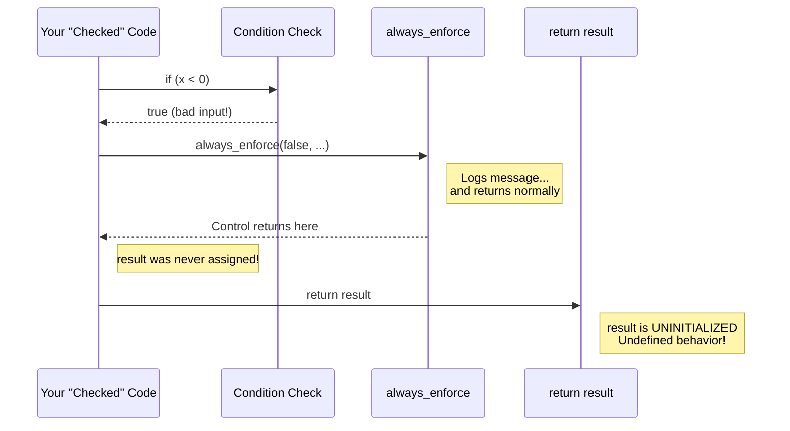
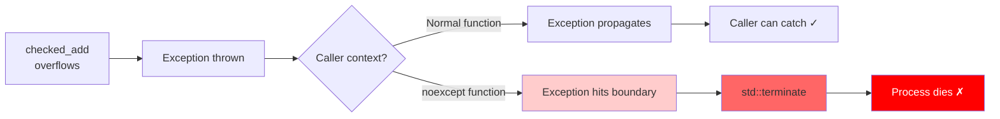
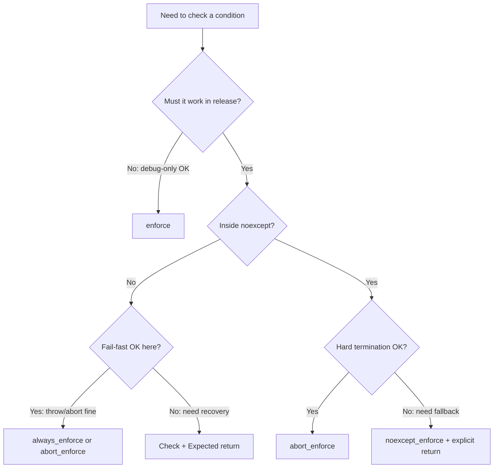

# Case Study - The Noreturn Mirage and the Noexcept Cliff
## Why your "checked" integer arithmetic might still execute undefined behavior

---

**Scope:** This document covers integer overflow UB, contract enforcement macros, `noexcept` boundaries, and `[[noreturn]]` semantics — using FAT-P's enforcement system as a concrete case study.

**Not covered:** Floating-point NaN semantics, strict aliasing, pointer provenance, object lifetime rules, or other forms of undefined behavior.

---

## Table of Contents

- [Introduction](#introduction)
- [Part I — The Problems](#part-i--the-problems)
  - [1. Undefined behavior is not a runtime event](#1-undefined-behavior-is-not-a-runtime-event)
  - [2. The enforcement macro family](#2-the-enforcement-macro-family)
  - [3. The Noexcept Cliff](#3-the-noexcept-cliff)
- [Part II — The Solutions](#part-ii--the-solutions)
  - [4. Three patterns that don't depend on enforcement semantics](#4-three-patterns-that-dont-depend-on-enforcement-semantics)
  - [5. Choosing the right enforcement for your context](#5-choosing-the-right-enforcement-for-your-context)
  - [6. Where `[[noreturn]]` belongs](#6-where-noreturn-belongs)
- [Part III — Case Study](#part-iii--case-study)
  - [7. Auditing FAT-P's enforcement system](#7-auditing-fat-ps-enforcement-system)
- [Part IV — Reference](#part-iv--reference)
  - [Appendix A — Quick reference card](#appendix-a--quick-reference-card)
  - [Appendix B — Mechanical audit checklist](#appendix-b--mechanical-audit-checklist)
  - [Appendix C — FAT-P enforcement guarantee table](#appendix-c--fat-p-enforcement-guarantee-table)
  - [Appendix D — Glossary](#appendix-d--glossary)
- [What To Do Now](#what-to-do-now)

---

# Introduction

## ⚠️ Before You Read Further: The "Checked" Code That Still Returns Garbage

If you ever wrote code shaped like this:

```cpp
// Looks "checked". Detects bad input. Reports it. What could go wrong?
int get_value(int x)
{
    int result;
    if (x < 0)
    {
        always_enforce(false, "x must be non-negative:", x);
    }
    else
    {
        result = x * 2;
    }
    return result;
}
```

**Stop. Your correctness depends entirely on what `always_enforce` does when it fires.**

If `always_enforce(false, ...)` can return normally — even just logging and continuing — then:

- `result` is **uninitialized** when `x < 0`
- `return result;` reads an uninitialized variable
- That is **undefined behavior** (UB)

You didn't write "validated code."  
You wrote: **"maybe validated, depending on what the macro does today."**

*(This example illustrates what happens if enforcement can return. We will audit what FAT-P's `always_enforce` actually does in Part III — spoiler: it throws. But the point stands: you must verify, not assume.)*

---

### The Same Trap in Arithmetic Code

This pattern appears constantly in "checked" arithmetic:

```cpp
int32_t checked_add(int32_t a, int32_t b)
{
    int32_t result;
    if (__builtin_add_overflow(a, b, &result))
    {
        always_enforce(false, "overflow:", a, "+", b);
    }
    return result;
}
```

This version is subtly different: `__builtin_add_overflow` *does* write to `result` even on overflow (it stores the wrapped value). So you won't get an uninitialized read.

But if `always_enforce` returns normally, you return the **wrapped value** — a silent, incorrect result that violates your API contract. Your "checked" arithmetic silently returned garbage.

Both failure modes stem from the same root cause:

> **You assumed enforcement stops execution. You didn't verify it.**

---

### The Trap in Detail

Here's what happens when the condition fails and enforcement *doesn't* stop execution:



The horror is that this code **looks correct**. You detected the problem. You reported it. But because enforcement didn't stop execution, you still read garbage — and the compiler is free to do anything.

---

### What You See vs. What's Actually Happening

| What you see in testing | What it usually means |
|------------------------|----------------------|
| "Tests pass, but production occasionally returns garbage values" | Enforcement returns normally; uninitialized read or wrong value returned |
| Clang warns: "variable 'result' may be uninitialized" | Compiler can't prove enforcement stops execution |
| UBSan reports: "signed integer overflow" | You evaluated the overflowing expression despite the "check" |
| Works in debug, wrong values in release | Your enforcement macro compiles out under `NDEBUG` |
| Process terminates with no stack trace | You threw an exception from inside a `noexcept` function |

That last symptom is the **Noexcept Cliff** — we'll get there in Section 3.

---

### The Scale of the Problem

This isn't a corner case. This pattern appears everywhere:

```cpp
// Division — same trap
int32_t checked_div(int32_t a, int32_t b)
{
    enforce(b != 0, "division by zero");  // What if this compiles out?
    return a / b;                          // UB if b == 0
}

// Overflow with builtin — returns wrong value if enforcement returns
int32_t checked_mul(int32_t a, int32_t b)
{
    int32_t result;
    if (__builtin_mul_overflow(a, b, &result))
    {
        always_enforce(false, "multiplication overflow");
    }
    return result;  // Returns wrapped garbage if enforcement returned
}

// Shift — same trap
uint32_t checked_shift(uint32_t x, unsigned shift)
{
    always_enforce(shift < 32, "shift too large");
    return x << shift;  // UB if shift >= 32 and enforcement returned
}
```

Every one of these depends on the enforcement primitive **never returning** on the failure path.

---

### Why This Happens to Smart People

Because the code *reads* like it should work:

```cpp
if (bad_condition)
{
    always_enforce(false, "error");  // "Obviously" this stops execution
}
do_dangerous_thing();  // "Obviously" this only runs if condition was OK
```

Humans read `always_enforce` and think: "that's an error handler, execution stops there."

But the compiler doesn't know that unless:
1. The enforcement primitive is annotated `[[noreturn]]`, or
2. The compiler can prove it never returns (inlining + analysis), or
3. You write explicit control flow (`return`, `throw`, `std::abort()`) after it

**The name is not a contract. The annotation is.**

---

### What This Document Covers

This teaching guide explains:

1. **Why "check then compute" can still be undefined behavior** (and how to fix it)
2. **Why enforcement macros have different safety properties** (`enforce` vs `always_enforce` vs `noexcept_enforce`)
3. **The Noexcept Cliff** — when putting `noexcept` on a function turns "throw on error" into "terminate on error"
4. **How to audit any contract system** for UB safety
5. **What `[[noreturn]]` actually means** and why it matters for compiler diagnostics

The goal is simple: after reading this, you will never accidentally write "checked" code that still executes undefined behavior.

---

# Part I — The Problems

## 1. Undefined behavior is not a runtime event

Before we can talk about "checked" arithmetic, we need to clear up a fundamental misconception.

### The Misconception

Many developers think of undefined behavior (UB) as:

> "A bad thing that happens at runtime — a crash, a wrong value, or unpredictable output."

### The Reality

Undefined behavior is a **compile-time contract**, not a runtime event:

> "The language standard makes no guarantees about what happens. The compiler is free to assume this situation never occurs and optimize accordingly."

This distinction matters enormously.

---

### A Concrete Example

Consider this function:

```cpp
bool will_overflow(int x)
{
    return x + 1 < x;  // True only if x + 1 wraps around
}
```

On two's-complement hardware, if `x` is `INT_MAX`, then `x + 1` wraps to `INT_MIN`, which is less than `x`. So you might expect this to return `true` for `INT_MAX`.

**But signed integer overflow is undefined behavior in C++.**

The compiler is permitted to reason:

> "Signed overflow never happens (it's UB). Therefore `x + 1` is always greater than `x`. Therefore this function always returns `false`. I'll optimize accordingly."

And modern compilers **do** make this optimization. For example, on x86-64 with GCC or Clang at `-O2`, you may see output like:

```asm
will_overflow:
    xor eax, eax    ; return false
    ret
```

The "overflow check" was deleted entirely.

(The exact assembly varies by compiler version, target architecture, and flags. But the key point holds: the compiler is *allowed* to delete the check, and often does.)

---

### Why "Check After Compute" Doesn't Work

This is why the following pattern is fundamentally broken:

```cpp
int32_t bad_checked_add(int32_t a, int32_t b)
{
    int32_t result = a + b;  // If this overflows, UB happens HERE
    
    // This check is too late — UB already occurred
    if (/* detected overflow somehow */)
    {
        always_enforce(false, "overflow");
    }
    return result;
}
```

Once you evaluate `a + b` and it overflows, the program has already entered undefined behavior. The compiler may have already:

- Deleted your overflow check (it "can't happen")
- Reordered operations assuming no overflow
- Propagated assumptions that break your logic

**Checking after computing is checking after dying.**

---

### The Hardware vs. Language Distinction

| Level | What happens on signed overflow |
|-------|--------------------------------|
| **Hardware** (x86, ARM) | Two's-complement wraparound; flags set |
| **C++ language** | Undefined behavior; no guarantees |
| **Compiler** | May assume it never happens; may optimize based on that |

The hardware does something predictable. The language says "no promises." The compiler exploits "no promises" for optimization.

Your "checked" arithmetic exists because you expect overflow inputs. If your check comes *after* the undefined behavior, you're not checking — you're hoping.

---

### The Correct Mental Model

Think of undefined behavior like a contract violation:

```cpp
// Signed addition contract (implicit):
// REQUIRES: a + b does not overflow
// RETURNS: a + b

int32_t result = a + b;
```

If the precondition is violated, the function (and indeed your entire program) has no defined behavior. It's not "returns a wrapped value" — it's "all bets are off."

Checked arithmetic means **ensuring the precondition is met before invoking the operation**, or using primitives (like `__builtin_add_overflow`) that have defined behavior for all inputs.

---

## 2. The enforcement macro family

Now that we understand why we need to prevent UB rather than detect it, let's look at the tools we use: enforcement macros.

### The Problem: They Look Interchangeable But Aren't

These lines look similar:

```cpp
enforce(x != 0, "x must not be 0");
always_enforce(x != 0, "x must not be 0");
noexcept_enforce(x != 0, "x must not be 0");
abort_enforce(x != 0, "x must not be 0");
enforce_warn(x != 0, "x must not be 0");
```

But they have **radically different** answers to the question that matters:

> **When the condition fails, does execution continue?**

---

### The FAT-P Enforcement Family

**Terminology note:** In this guide, "stops execution" means *normal control flow does not continue past the enforcement call site in this function*. This is the property that matters for "will we reach UB code after this line?" An exception might be caught higher up the call stack, but from this function's perspective, the dangerous code path is not reached.

| Macro | In release builds | On failure | Throws? | Stops execution? |
|-------|-------------------|-----------|---------|------------------|
| `enforce(...)` | **Compiled out** | Nothing | No | **No** (not present) |
| `always_enforce(...)` | Generated | Throws | Yes | **Yes** (throws) |
| `abort_enforce(...)` | Generated | `std::abort()` | No | **Yes** (terminates) |
| `noexcept_enforce(...)` | Generated | Calls handler | No | **Debug: Yes** / **Release: No** |
| `enforce_warn(...)` | Generated | Logs to stderr | No | **No** |

**Critical detail about `noexcept_enforce`:** The default violation handler behaves differently:
- **Debug builds:** Logs message, then calls `std::abort()` — execution stops
- **Release builds:** Logs message, then returns — execution continues

This means `noexcept_enforce` is *not* a reliable control-flow barrier in release builds unless you install a terminating handler.

The critical insight:

- **`always_enforce` and `abort_enforce` always stop execution** (throw or abort)
- **`enforce` compiles out entirely in release** — no check happens at all
- **`noexcept_enforce` continues in release by default** — you must add explicit control flow
- **`enforce_warn` always continues** — it's just a log statement

---

### Why `enforce(...)` Can't Guard Against Bad Inputs

```cpp
int32_t div_trap(int32_t a, int32_t b)
{
    enforce(b != 0, "division by zero");  // Debug-only!
    return a / b;
}
```

In debug builds, this works. The `enforce` fires, throws, execution stops.

In release builds (`-DNDEBUG`), the `enforce` macro expands to nothing:

```cpp
int32_t div_trap(int32_t a, int32_t b)
{
    ;  // enforce compiled out
    return a / b;  // UB if b == 0
}
```

`enforce` is for invariant checking during development. It is not for runtime input validation. It is not for UB prevention.

---

### Why `noexcept_enforce(...)` Can't Guard UB (By Itself)

This one is subtle and dangerous:

```cpp
int32_t checked_div_noexcept(int32_t a, int32_t b) noexcept
{
    noexcept_enforce(b != 0, "division by zero");
    return a / b;  // What happens here if b == 0?
}
```

`noexcept_enforce` exists specifically for use in `noexcept` functions — it never throws. But that means on failure it:

1. Calls the violation handler (which logs a message)
2. **Returns normally**
3. Execution continues to `return a / b`
4. If `b == 0`, that's undefined behavior

The name "enforce" is misleading. It doesn't enforce anything about control flow. It *reports* and *continues*.

---

### The Correct Pattern with `noexcept_enforce`

If you must use `noexcept_enforce` to guard against bad inputs, you need explicit control flow:

```cpp
int32_t checked_div_noexcept(int32_t a, int32_t b) noexcept
{
    if (b == 0)
    {
        noexcept_enforce(false, "division by zero");
        return 0;  // Defined fallback value
    }
    return a / b;  // Only reached when b != 0
}
```

Or use `abort_enforce`, which never continues:

```cpp
int32_t checked_div_abort(int32_t a, int32_t b) noexcept
{
    abort_enforce(b != 0, "division by zero");
    return a / b;  // Only reached when b != 0
}
```

---

### ⚠️ Edge Case: `noexcept_enforce` Can Still Terminate

Even though `noexcept_enforce` is designed to never throw, there's a subtle trap:

The enforcement mechanism builds a `std::string` message before calling the handler. String construction can throw `std::bad_alloc` if memory is exhausted.

In FAT-P, message construction happens inside the `Enforcer` destructor. For non-throwing raisers, this destructor is `noexcept`. If the string allocation throws inside a `noexcept` destructor, you get `std::terminate`.

This is rare (requires OOM), but it's part of the complete picture:

> **`noexcept` is a whole-function property.** Even if your raiser doesn't throw, other code in the failure path might.

In practice, this almost never matters. But if you're writing code for memory-constrained embedded systems, be aware that *any* enforcement macro that builds a message string has this theoretical termination path.

---

### Visualizing the Difference

```mermaid
flowchart TD
    subgraph "always_enforce (stops execution)"
        A1[Condition fails] --> B1[Build error message]
        B1 --> C1[Throw exception]
        C1 --> D1[Execution stops ✓]
    end
    
    subgraph "noexcept_enforce (does NOT stop)"
        A2[Condition fails] --> B2[Call violation handler]
        B2 --> C2[Handler logs message]
        C2 --> D2[Handler returns]
        D2 --> E2[Execution continues ✗]
        E2 --> F2[Next line runs — possible UB!]
    end
    
    subgraph "abort_enforce (stops execution)"
        A3[Condition fails] --> B3[Log message]
        B3 --> C3[Call std::abort]
        C3 --> D3[Process terminates ✓]
    end
```



---

## 3. The Noexcept Cliff

We've seen that enforcement macros have different control-flow properties. Now we add another dimension: the `noexcept` specifier.

### What `noexcept` Actually Means

The `noexcept` specifier on a function is a **boundary contract**:

> "No exception may escape this function. If one tries to, the runtime calls `std::terminate()`."

This is not "no exceptions." It's "exceptions may not escape."

---

### The Cliff

Consider this seemingly reasonable code:

```cpp
// checked_add throws on overflow (that's its documented behavior)
int32_t checked_add(int32_t a, int32_t b);

// Wrapper promises no exceptions
int32_t safe_add(int32_t a, int32_t b) noexcept
{
    return checked_add(a, b);  // What happens on overflow?
}
```

On overflow:
1. `checked_add` throws an exception
2. Exception tries to escape `safe_add`
3. `safe_add` is `noexcept`
4. Runtime calls `std::terminate()`
5. **Process dies immediately**

You didn't get:
- A catchable exception
- An error code
- A chance to recover

You got process termination.

---

### Visualizing the Cliff



This is the **Noexcept Cliff**: crossing a `noexcept` boundary transforms a recoverable error into process termination.

---

### The Other Cliff: Throwing from Destructors During Unwinding

There's a related trap that deserves explicit mention.

FAT-P's enforcement mechanism (like many RAII-based systems) throws from a destructor — the `Enforcer` object's destructor fires the exception when the condition failed.

This has an additional consequence:

> If a contract fails **during stack unwinding** (when another exception is already in flight), throwing from a destructor triggers `std::terminate`.

This is standard C++ behavior, not a FAT-P quirk. But it means:

```cpp
void risky()
{
    SomeRAII guard;  // Destructor might throw
    always_enforce(condition, "check");  // Also might throw (via destructor)
    
    do_work();  // If this throws...
    
    // ...and guard's destructor throws during unwinding: terminate!
}
```

In practice, FAT-P's `Enforcer` destructor only throws when the condition failed, so this is rare. But it's part of the complete "when does termination happen" story.

---

### Why This Matters for Checked Arithmetic

Many checked arithmetic implementations throw on overflow. That's a reasonable design for general-purpose code.

But if you're writing:
- Performance-critical inner loops that must be `noexcept`
- Callbacks for C APIs (which can't propagate exceptions)
- Destructors (which are implicitly `noexcept`)
- `noexcept` move constructors (for STL container efficiency)

Then a throwing `checked_add` inside those contexts means: **overflow = process death**.

That might be what you want! Overflow in a move constructor is probably unrecoverable anyway. But it should be a deliberate choice, not an accident.

---

### Three Responses to the Noexcept Cliff

*(In these examples, `offset_` is a class data member and `ArithmeticError` is a placeholder enum — substitute your own types.)*

**Option 1: Accept termination**

```cpp
int32_t process_value(int32_t x) noexcept
{
    // If this overflows, we terminate. That's acceptable for this use case.
    return checked_add(x, offset_);
}
```

**Option 2: Use non-throwing enforcement with explicit fallback**

```cpp
int32_t process_value(int32_t x) noexcept
{
    int32_t result;
    if (__builtin_add_overflow(x, offset_, &result))
    {
        noexcept_enforce(false, "overflow in process_value");
        return 0;  // Defined fallback value (see note)
    }
    return result;
}
```

**Note:** This returns a fixed fallback, not a saturated value. For true saturation, you need direction-aware clamping — see the `saturating_add` example in "What To Do Now."

**Option 3: Use `Expected` return type**

```cpp
Expected<int32_t, ArithmeticError> process_value(int32_t x) noexcept
{
    return checked_add_expected(x, offset_);  // Returns error on overflow
}
```

The right choice depends on your error-handling philosophy. But it must be a **choice**, not an accident.

---

### `noexcept` Is Not "No Exceptions"

A common confusion:

| Phrase | Meaning |
|--------|---------|
| "No exceptions in my code" | A coding style — you don't use throw/catch |
| `noexcept` specifier | A boundary contract — exceptions terminate if they try to escape |
| `-fno-exceptions` | A compiler flag — throw statements are rejected entirely |

You can have:
- Code that doesn't throw, without marking functions `noexcept`
- Code marked `noexcept` that calls functions which throw (and terminates if they do)
- Code compiled with exceptions disabled (different constraints entirely)

These are three different things. Conflating them causes bugs.

---

# Part II — The Solutions

## 4. Three patterns that don't depend on enforcement semantics

The problems in Part I all stem from one issue:

> Your code depends on enforcement to stop execution, but you haven't verified that it does.

Here are three patterns that remove that dependency entirely.

---

### Pattern 1: Use compiler builtins with explicit control flow

The builtin does the overflow detection in a compiler-understood way:

```cpp
int32_t checked_add(int32_t a, int32_t b)
{
    int32_t result;
    if (__builtin_add_overflow(a, b, &result))
    {
        always_enforce(false, "overflow");
        return 0;  // See note below
    }
    return result;
}
```

Key points:
- `__builtin_add_overflow` writes `result` even on overflow (with the wrapped value)
- The compiler can see that both branches return, eliminating "may be uninitialized" warnings

**About that `return 0`:** This line exists for two reasons:

1. **Compiler clarity:** Without it, compilers may warn about control flow even though `always_enforce` throws. The return makes the control flow explicit and eliminates warnings.

2. **Defense in depth:** If enforcement is ever misconfigured (wrong policy, different build), the code still has defined behavior rather than UB.

**This is NOT a fallback strategy.** The `return 0` should never execute in normal operation. If your enforcement is working correctly, that line is dead code. It exists to make the code robust against misconfiguration, not to silently recover from errors.

If you actually want to return a fallback value on overflow (like saturation), make that explicit:

```cpp
int32_t saturating_add(int32_t a, int32_t b)
{
    int32_t result;
    if (__builtin_add_overflow(a, b, &result))
    {
        // Intentional saturation: for signed add, operands share sign on overflow
        return (a > 0) ? INT32_MAX : INT32_MIN;
    }
    return result;
}
```

For `noexcept` contexts where you want hard termination:

```cpp
int32_t checked_add_noexcept(int32_t a, int32_t b) noexcept
{
    int32_t result;
    if (__builtin_add_overflow(a, b, &result))
    {
        abort_enforce(false, "overflow");  // Terminates, never throws
    }
    return result;
}
```

---

### Pattern 2: Check first, compute only when valid

This pattern never forms the dangerous expression on bad inputs:

```cpp
int32_t checked_add(int32_t a, int32_t b)
{
    if (would_overflow_add(a, b))
    {
        always_enforce(false, "overflow");
        return 0;  // Compiler clarity / defense in depth (see Pattern 1 note)
    }
    return a + b;  // Only reached when overflow is impossible
}
```

The key insight: we never evaluate `a + b` when it would overflow. The UB-causing expression is simply not formed.

This works regardless of what enforcement does — the control flow prevents reaching the dangerous operation.

---

### Pattern 3: Use `Expected` return types

Avoid the question entirely by not throwing and not continuing past errors:

```cpp
// ArithmeticError is a placeholder enum; substitute your own error type.
// Example: enum class ArithmeticError { Overflow, DivideByZero, ShiftTooLarge };

Expected<int32_t, ArithmeticError> checked_add(int32_t a, int32_t b) noexcept
{
    int32_t result;
    if (__builtin_add_overflow(a, b, &result))
    {
        return make_unexpected(ArithmeticError::Overflow);
    }
    return result;
}
```

The caller is forced to handle the error case:

```cpp
auto sum = checked_add(a, b);
if (!sum)
{
    // Handle error
    return make_unexpected(sum.error());
}
use_value(*sum);
```

No exceptions, no termination, no UB. The error is part of the type system.

---

### Summary: Which Pattern When?

| Pattern | Pros | Cons | Use when |
|---------|------|------|----------|
| Builtins + explicit return | Fast, compiler-optimized, clear flow | GCC/Clang only | Maximum performance with clear control flow |
| Check first | Portable; never forms bad expression | May duplicate overflow logic | Portability matters; fallback paths exist |
| `Expected` | No exceptions; forced handling | Viral (callers must handle) | `noexcept` contexts; explicit error handling |

---

## 5. Choosing the right enforcement for your context

Now let's match enforcement macros to use cases.

### Decision Flowchart



---

### Quick Reference

| Context | Recommended | Why |
|---------|-------------|-----|
| Debug invariant checking | `enforce` | Zero release overhead; catches bugs in dev |
| Runtime input validation | `always_enforce` | Must be checked in production |
| UB prevention in throwing context | `always_enforce` + explicit return | Stops execution; fallback if somehow returns |
| UB prevention in `noexcept` context | `abort_enforce` | Stops execution without throwing |
| Non-critical warning | `enforce_warn` | Log and continue |
| `noexcept` with recovery | `noexcept_enforce` + explicit return | Log, then return defined value |

---

### Common Mistakes

**Mistake 1: Using `enforce` for input validation**
```cpp
void process(int x)
{
    enforce(x >= 0, "x must be non-negative");  // WRONG: gone in release
    use(x);
}
```
Fix: Use `always_enforce` if the check must happen in production.

**Mistake 2: Using `always_enforce` in `noexcept` functions without thinking**
```cpp
void callback(int x) noexcept
{
    always_enforce(x >= 0, "x must be non-negative");  // Throws!
    use(x);  // If x < 0, we terminated before getting here
}
```
This "works" but means violation = process termination. If that's intentional, use `abort_enforce` (makes the intent clear). If not, use `noexcept_enforce` + return.

**Mistake 3: Using `noexcept_enforce` without explicit return**
```cpp
int div(int a, int b) noexcept
{
    noexcept_enforce(b != 0, "division by zero");
    return a / b;  // UB if b == 0 and handler returned!
}
```
Fix: Add explicit control flow:
```cpp
int div(int a, int b) noexcept
{
    if (b == 0)
    {
        noexcept_enforce(false, "division by zero");
        return 0;  // Defined fallback
    }
    return a / b;
}
```

---

## 6. Where `[[noreturn]]` belongs

We've talked about enforcement stopping execution. But there's another dimension: **compiler visibility**.

### The Problem

Even if a function always throws at runtime, the compiler may not know that:

```cpp
void handle_error(const char* msg)
{
    log(msg);
    throw std::runtime_error(msg);
}

int compute(int x)
{
    int result;
    if (x < 0)
    {
        handle_error("negative input");
    }
    else
    {
        result = x * 2;
    }
    return result;  // Warning: 'result' may be uninitialized
}
```

The compiler sees:
- `handle_error` has return type `void`
- `void` functions can return normally
- Therefore the `if` branch might fall through
- Therefore `result` might be uninitialized

You know `handle_error` never returns. The compiler doesn't.

---

### The Solution: `[[noreturn]]`

```cpp
[[noreturn]] void handle_error(const char* msg)
{
    log(msg);
    throw std::runtime_error(msg);
}
```

Now the compiler knows:
- `handle_error` never returns normally
- The `if` branch cannot fall through
- `result` is always initialized when `return` is reached
- No warning

---

### Where It Belongs in Contract Systems

`[[noreturn]]` should be on:

1. **Fail functions in raisers that throw**
   ```cpp
   class LogicRaiser
   {
   public:
       [[noreturn]] static void fail(const std::string& msg)
       {
           throw LogicContractError(msg);
       }
   };
   ```

2. **Fail functions in raisers that abort**
   ```cpp
   class AbortRaiser
   {
   public:
       [[noreturn]] static void fail(const std::string& msg)
       {
           std::cerr << msg << std::endl;
           std::abort();
       }
   };
   ```

3. **NOT on raisers that may return** (like `NoThrowRaiser`)
   ```cpp
   class NoThrowRaiser
   {
   public:
       // No [[noreturn]] — this CAN return!
       static void fail(const std::string& msg) noexcept
       {
           violation_handler(msg);  // Handler may continue
       }
   };
   ```

---

### Benefits of Correct `[[noreturn]]` Annotation

| Benefit | Explanation |
|---------|-------------|
| Eliminates false "uninitialized" warnings | Compiler knows failure path doesn't continue |
| Better optimization | Compiler can eliminate dead code after failure |
| Clearer static analysis | Tools understand control flow accurately |
| Self-documenting | Code explicitly states "this never returns" |

---

### ⚠️ Warning: `[[noreturn]]` Is a Contract — Lying Is UB

`[[noreturn]]` is not just a hint. It's a contract with the compiler:

> "I promise this function never returns normally. You may optimize assuming that."

If you mark a function `[[noreturn]]` and it *does* return, that's **undefined behavior**:

```cpp
[[noreturn]] void maybe_fail(bool should_fail)
{
    if (should_fail)
    {
        throw std::runtime_error("failed");
    }
    // Oops — we return normally if should_fail is false
    // This is UNDEFINED BEHAVIOR
}
```

The compiler may:
- Delete code after calls to `maybe_fail` (it "can't be reached")
- Assume variables are never used after the call
- Generate code that crashes or corrupts state

**Rule:** Only add `[[noreturn]]` to functions that *provably* never return on any code path.

---

# Part III — Case Study

## 7. Auditing FAT-P's enforcement system

Let's apply what we've learned to audit a real system: FAT-P's `enforce` family.

### The Question

> "When I call `always_enforce(false, ...)`, what actually happens? Can execution continue?"

### The Audit Process

**Step 1: Find the macro definition**

In `enforce.h`:
```cpp
#define always_enforce(condition, ...) \
    do { \
        auto enforcer = fat_p::enforce_policy_impl<fat_p::AlwaysEnforcePolicy>( \
            (condition), #condition, FATP_LOCUS); \
        enforcer(__VA_ARGS__); \
    } while (0)
```

Observation: This creates an `Enforcer` object. The failure logic isn't here — it's in the destructor.

**Step 2: Find the policy → raiser mapping**

In `enforce_raiser_selector.h`:
```cpp
template <>
struct RaiserSelector<AlwaysEnforcePolicy>
{
    using type = LogicRaiser;
};
```

So `always_enforce` uses `LogicRaiser`.

**Step 3: Find when failure fires**

In `enforce_enforcers.h`, the `Enforcer` destructor (actual code):
```cpp
~Enforcer() noexcept(std::is_same_v<Raiser, NoThrowRaiser> ||
                     std::is_same_v<Raiser, WarningToCerrRaiser> ||
                     std::is_same_v<Raiser, NoOpRaiser>)
{
    FATP_UNLIKELY_IF(!passed_)
    {
        fail_impl();
    }
}
```

Key insights:

1. **Failure happens at statement end** (when the temporary `Enforcer` is destroyed), not inside the macro call.

2. **The destructor is conditionally `noexcept`:**
   - For `NoThrowRaiser`, `WarningToCerrRaiser`, and `NoOpRaiser`: destructor is `noexcept(true)`
   - For throwing raisers like `LogicRaiser`: destructor is `noexcept(false)` — it can throw

3. **This conditional `noexcept` is the source of the "allocation can terminate" edge case:**
   - `fail_impl()` builds a `std::string` message
   - String construction can throw `std::bad_alloc`
   - For `NoThrowRaiser`, the destructor is `noexcept(true)`, so allocation failure → `std::terminate`

**Step 4: Find what `LogicRaiser::fail` does**

In `enforce_raisers.h` (annotated excerpt — the `// NOTE` comment is editorial):
```cpp
struct LogicRaiser : CustomRaiser<LogicContractError>
{
};

template <typename E, typename ConcurrencyPolicy = SingleThreadedPolicy>
struct CustomRaiser : public ConcurrencyPolicy
{
    static void fail(const std::string& message)  // NOTE: No [[noreturn]]!
    {
        typename ConcurrencyPolicy::SharedGuard guard(CustomRaiser::getStaticLock());
        detail::writeToStderr("Exception: ", message);
        throw E(message);
    }
};
```

**Critical observation:** `CustomRaiser::fail` throws, but is **not annotated `[[noreturn]]`**.

This is the "noreturn mirage" in action:
- **Runtime behavior:** Always throws, never returns
- **Compiler visibility:** Not marked `[[noreturn]]`, so compiler may not know

**Step 5: Check other raisers**

| Raiser | Behavior | Has `[[noreturn]]`? |
|--------|----------|---------------------|
| `CustomRaiser` (base for throwing raisers) | Throws | **No** |
| `LogicRaiser`, `RuntimeRaiser`, etc. | Inherit from `CustomRaiser` | **No** |
| `AbortRaiser` | Calls `std::abort()` | **No** |
| `NoThrowRaiser` | Calls handler, returns | No (correct) |
| `ExpectedRaiser` | Throws | **Yes** |

Only `ExpectedRaiser` is correctly annotated!

### Audit Conclusions

**Runtime behavior (correct):**
- `always_enforce(false, ...)` throws and doesn't continue
- `abort_enforce(false, ...)` aborts and doesn't continue
- `noexcept_enforce(false, ...)` may continue (by design)

**Compiler visibility (incomplete):**
- `CustomRaiser::fail` and `AbortRaiser::fail` should have `[[noreturn]]` but don't
- This can cause spurious "may be uninitialized" warnings
- Static analyzers may model these paths incorrectly

**Recommendation:** Add `[[noreturn]]` to `CustomRaiser::fail` and `AbortRaiser::fail`.

---

### Implications for Users

Even though FAT-P's enforcement *does* stop execution at runtime:

1. **You may get compiler warnings** about uninitialized variables in patterns like:
   ```cpp
   int result;
   if (bad) always_enforce(false, "error");
   else result = compute();
   return result;  // Warning: may be uninitialized
   ```

2. **Add explicit control flow** to silence warnings and make intent clear:
   ```cpp
   int result;
   if (bad)
   {
       always_enforce(false, "error");
       return 0;  // Explicit: makes control flow clear to compiler
   }
   result = compute();
   return result;  // No warning
   ```

3. **For `noexcept_enforce`, explicit returns are mandatory** (it really can return).

---

# Part IV — Reference

## Appendix A — Quick reference card

### Stops execution (control-flow barriers):
- `always_enforce` — throws; use in non-`noexcept` contexts
- `abort_enforce` — terminates; use anywhere

### Does NOT reliably stop execution:
- `enforce` — compiles out in release; debug-only
- `noexcept_enforce` — **debug: aborts; release: continues**; always add explicit return after
- `enforce_warn` — logs and continues

### Inside `noexcept` functions:
- Use `abort_enforce` (terminates on failure), or
- Use `noexcept_enforce` + explicit return with fallback value, or
- Accept that `always_enforce` = terminate on failure (throw hits boundary)

### For `[[noreturn]]`:
- Should be on: fail functions that throw or abort
- Should NOT be on: fail functions that may return
- Lying about `[[noreturn]]` is UB — only add it if *all* paths are non-returning
- FAT-P status: `ExpectedRaiser` has it; `CustomRaiser` and `AbortRaiser` are missing it

---

## Appendix B — Mechanical audit checklist

When auditing any contract system:

1. **Find the macro/function** at the call site
2. **Check release behavior** — does it compile out under `NDEBUG`?
3. **Identify the policy** — what configuration does it use?
4. **Resolve policy → handler** — what function actually runs on failure?
5. **Check handler behavior** — does it throw, abort, or return?
6. **Check `[[noreturn]]` annotation** — does the compiler know it doesn't return?
7. **Consider `noexcept` context** — what happens if it throws inside `noexcept`?
8. **Consider unwinding** — what happens if it throws from a destructor during unwinding?

A complete audit answers: **"For every possible code path after failure, is behavior defined?"**

---

## Appendix C — FAT-P enforcement guarantee table

| Macro | Release codegen | Failure mechanism | Throws? | Stops execution? |
|-------|-----------------|-------------------|---------|------------------|
| `enforce(...)` | None | — | No | **No** (compiled out) |
| `always_enforce(...)` | Generated | Throws | Yes | **Yes** |
| `abort_enforce(...)` | Generated | `std::abort()` | No | **Yes** |
| `noexcept_enforce(...)` | Generated | Handler | No | **Debug: Yes** / **Release: No** |
| `enforce_warn(...)` | Generated | Log to stderr | No | **No** |

**Note on `noexcept_enforce`:** The default violation handler aborts in debug builds but continues in release builds. This means `noexcept_enforce` is a control-flow barrier in debug but not in release.

---

## Appendix D — Glossary

**Undefined Behavior (UB)**
: A situation where the C++ standard makes no guarantees about program behavior. The compiler may assume UB never occurs and optimize accordingly. Examples: signed integer overflow, null pointer dereference, reading uninitialized variables.

**RAII (Resource Acquisition Is Initialization)**
: A C++ idiom where resources are acquired in constructors and released in destructors. In FAT-P's enforcement, this means failure logic runs in the `Enforcer` destructor at statement end.

**`[[noreturn]]`**
: A C++ attribute indicating a function never returns normally (it always throws, aborts, or loops forever). Helps compilers understand control flow and eliminate false warnings.

**`noexcept`**
: A C++ specifier indicating exceptions may not escape a function. If one tries to, `std::terminate()` is called.

**Noexcept Cliff**
: The phenomenon where crossing a `noexcept` boundary transforms a recoverable exception into process termination.

**Control-flow barrier**
: Code that prevents execution from continuing past a certain point — either by throwing, aborting, or returning. Used to ensure dangerous operations are never reached on error paths.

---

# What To Do Now

## If you're auditing existing code:

1. **Search for enforcement macros** in code that does arithmetic or pointer operations:
   ```bash
   grep -rn "enforce\|always_enforce\|noexcept_enforce" --include="*.cpp" --include="*.h"
   ```

2. **For each use, ask:**
   - Is this guarding an operation that could cause UB or return garbage?
   - Does the enforcement actually stop execution?
   - Is the surrounding function `noexcept`?
   - Is there explicit control flow (return/throw/abort) after enforcement?

3. **Fix problematic patterns:**
   - `enforce` guarding runtime behavior → change to `always_enforce`
   - `noexcept_enforce` without return → add explicit return with fallback
   - `always_enforce` in `noexcept` → change to `abort_enforce` or accept termination

## If you're writing new checked arithmetic:

Use this pattern as your starting point:

```cpp
// For throwing contexts
int32_t checked_add(int32_t a, int32_t b)
{
    int32_t result;
    if (__builtin_add_overflow(a, b, &result))
    {
        always_enforce(false, "integer overflow:", a, "+", b);
        return 0;  // Makes control flow explicit
    }
    return result;
}

// For noexcept contexts with termination
int32_t checked_add_or_die(int32_t a, int32_t b) noexcept
{
    int32_t result;
    if (__builtin_add_overflow(a, b, &result))
    {
        abort_enforce(false, "integer overflow");
    }
    return result;
}

// For noexcept contexts with saturation (release builds)
// NOTE: With FAT-P defaults, noexcept_enforce aborts in debug builds.
// If you want saturation in debug too, install a non-aborting violation handler.
int32_t saturating_add(int32_t a, int32_t b) noexcept
{
    int32_t result;
    if (__builtin_add_overflow(a, b, &result))
    {
        noexcept_enforce(false, "integer overflow - saturating");
        // For signed addition overflow, operands must share sign, so a's sign
        // indicates overflow direction. (This logic differs for sub/mul.)
        return (a > 0) ? INT32_MAX : INT32_MIN;
    }
    return result;
}

// For Expected-based error handling
Expected<int32_t, ArithmeticError> checked_add_expected(int32_t a, int32_t b) noexcept
{
    int32_t result;
    if (__builtin_add_overflow(a, b, &result))
    {
        return make_unexpected(ArithmeticError::Overflow);
    }
    return result;
}
```

## If you maintain FAT-P:

1. **Add `[[noreturn]]` to `CustomRaiser::fail`** — it always throws
2. **Add `[[noreturn]]` to `AbortRaiser::fail`** — it always aborts
3. **Document which macros are control-flow barriers** and which aren't
4. **Consider a `checked_arithmetic` module** with built-in policy selection

---

## The Bottom Line

> **"Checked" code is not about detecting problems. It's about never executing undefined behavior and never returning garbage.**

To achieve that, you need:
- Enforcement that actually stops execution (or explicit control flow that does)
- Awareness of `noexcept` boundaries (where "throw" becomes "terminate")
- Compiler visibility into non-returning paths (`[[noreturn]]`)
- Explicit fallback returns to make control flow clear

The name of your macro doesn't matter. What matters is what happens when the condition fails — and whether you've verified that answer.
