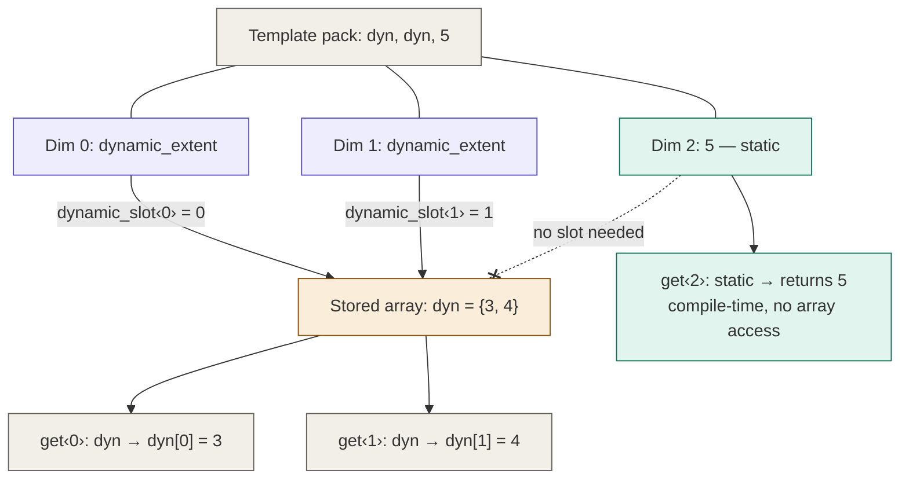
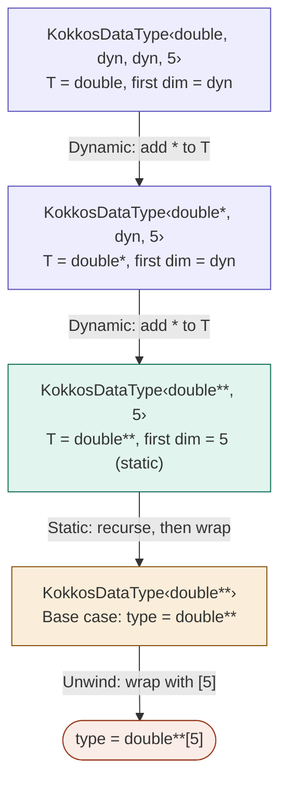
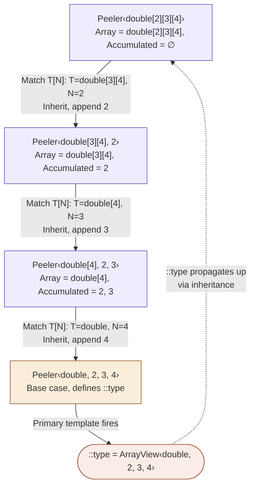
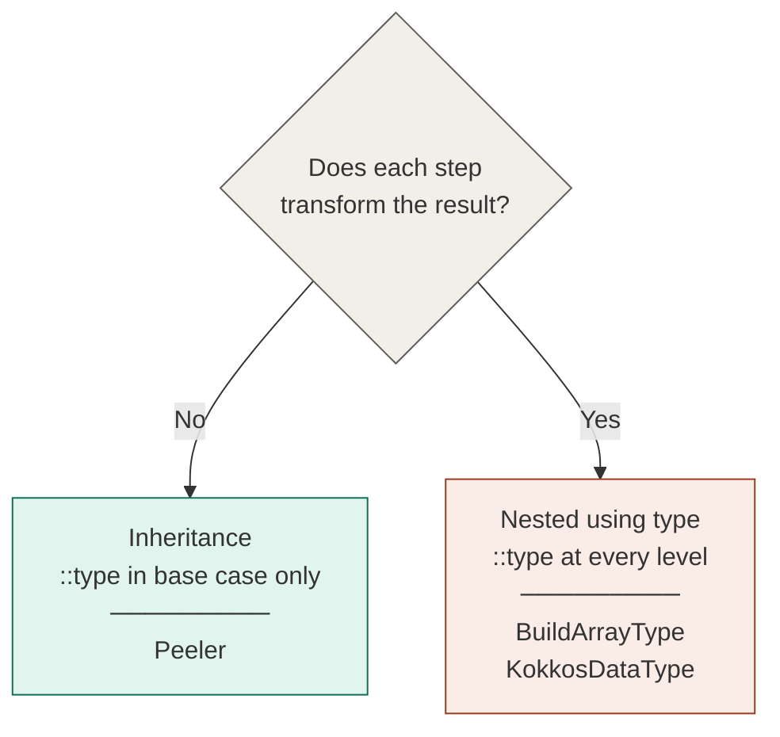
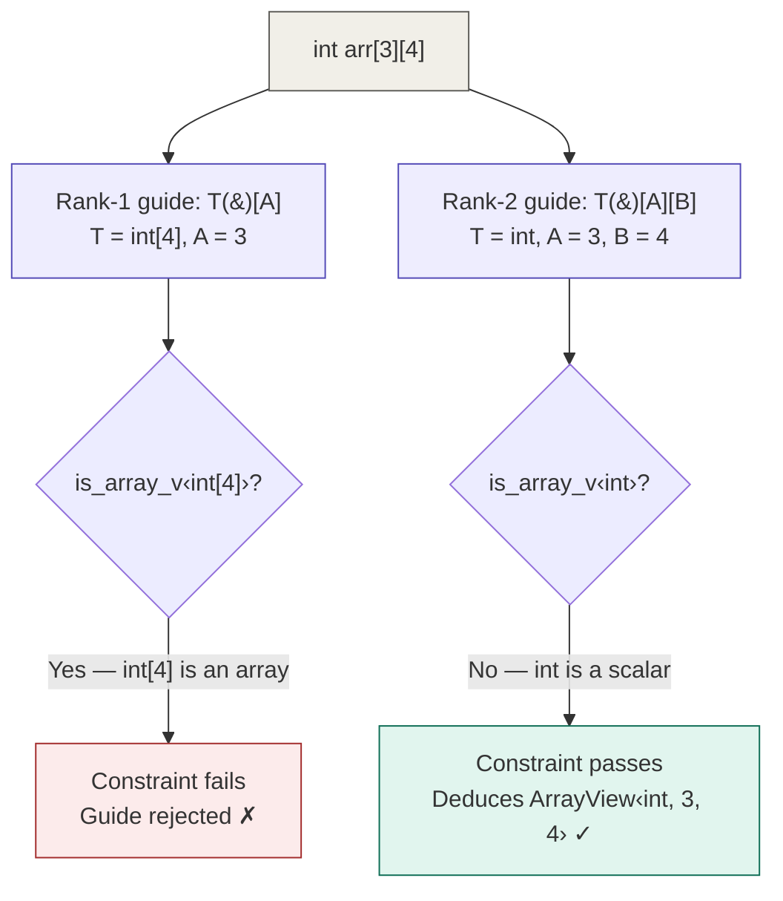

# Case Study - The View That Learned to Count Its Own Dimensions

## How a non-owning multidimensional array adapter forced multiple compile-time patterns into one header

---

## Scope

This case study follows the development of `ArrayView` from initial requirement through final design. It is organized as a development narrative: each stage presents a problem, shows the attempt that seemed reasonable, reveals the failure, and explains the mechanism behind the fix.

The secondary purpose is to teach three compile-time patterns — two recursive type-level techniques and one value-side mechanism — through the real engineering problems that demanded them. No prior TMP experience is assumed — each pattern is introduced when the problem that requires it first appears, and the recursion is unrolled step-by-step with concrete types.

## Not covered

- CArrayView's simpler all-static design (predates ArrayView; see its own documentation)
- Kokkos parallel dispatch patterns, execution policies, and kernel programming (this document covers only enough Kokkos to explain why the DataType bridge exists)
- Runtime performance characteristics of element access
- Alternative multidimensional view designs (std::mdspan, Eigen::Map)

## Prerequisites

- Working knowledge of C++20 (concepts, `consteval`, `requires` clauses)
- Familiarity with C-style multidimensional arrays (`int arr[3][4]`)
- Comfort reading template class definitions with template parameters

This document teaches the rest. Template metaprogramming, partial specialization, CTAD, fold expressions, and recursive type traits are introduced as they arise, using ArrayView as the specimen.

## Case Study Card

**Problem:** Wrapping contiguous host memory as a multidimensional view with mixed compile-time and runtime dimensions, CTAD ergonomics, and a Kokkos bridge required solving six TMP problems and one language-boundary problem, each of which broke the obvious approach  
**Constraint:** C++ has no operators on types — no "if" that returns a type, no "for" that builds a type — forcing struct-based recursion for type computations; CTAD guides do not automatically prefer the most-specialized match; `void&` is a hard error during class instantiation, not a substitution failure  
**Symptom:** `std::conditional_t` instantiates both branches (forming impossible types); CTAD deduces the wrong element type for multidimensional arrays; the C-array constructor kills compilation for dynamic specializations; cross-sub-array pointer arithmetic is rejected in `constexpr`  
**Root cause:** Each symptom stems from a specific limitation of the C++ type system that forces a specific TMP pattern as the only viable solution  
**Fix pattern:** Inheritance-based accumulation (Peeler), nested-using transformation (BuildArrayType, KokkosDataType), `consteval` loops (dynamic_slot), constrained CTAD guides (material implication model), template indirection for SFINAE friendliness  
**FAT-P components used:** ArrayView, CArrayView (predecessor)  
**Build-mode gotchas:** Bounds checks are assert-only (removed in Release with `NDEBUG`)  
**Guarantees:** Correct type deduction for ranks 1–8 via CTAD; correct Kokkos DataType encoding for any mix of static/dynamic extents; no stored runtime extents for static dimensions (one implementation-dependent byte from `std::array<size_t, 0>` may remain on some compilers)  
**Non-guarantees:** No CTAD for rank > 8 (use `makeArrayView`); `constexpr` element access only for rank 1; cross-sub-array pointer arithmetic is practical UB relied upon by all implementations

## Key Takeaway Card

| Principle | One-Line Summary |
|-----------|-----------------|
| **Type or value?** | If the answer is a type, you need struct + partial specialization; if a value, use `constexpr` functions |
| **Inheritance vs nested using** | If no step transforms the result, use inheritance; if each step wraps the inner result, use nested `using type` |
| **CTAD is material implication** | Read `->` as "then": if antecedent (pattern + constraints) is true, then consequent (deduced types) follows |
| **`std::conditional_t` instantiates both** | Never use it when either branch would form an impossible type |
| **`void&` is a hard error** | Template indirection defers type formation past the constraint check |
| **Accumulate down, transform up** | Peeler accumulates dims downward via inheritance; BuildArrayType transforms types upward via nested using |
| **Pack → array eliminates recursion** | `constexpr size_t pack[] = {Dims...}` lets you use a `for` loop instead of recursive peeling |

## Table of Contents

1. [Before You Read Further: The Guide That Matches Twice](#before-you-read-further-the-guide-that-matches-twice)
2. [The Requirement](#the-requirement)
3. [Stage 1: CArrayView — The All-Static Predecessor](#stage-1-carrayview--the-all-static-predecessor)
4. [Stage 2: ExtentStorage — The Packing Problem](#stage-2-extentstorage--the-packing-problem)
5. [Stage 3: BuildArrayType — The Inside-Out Trap](#stage-3-buildarraytype--the-inside-out-trap)
6. [Stage 4: KokkosDataType — The conditional_t Trap](#stage-4-kokkosdatatype--the-conditional_t-trap)
7. [Stage 5: Peeler — Choosing the Right Recursion](#stage-5-peeler--choosing-the-right-recursion)
8. [Stage 6: CTAD — The Guide That Matches Twice](#stage-6-ctad--the-guide-that-matches-twice)
9. [Stage 7: The void& Hard Error](#stage-7-the-void-hard-error)
10. [Stage 8: The constexpr Boundary](#stage-8-the-constexpr-boundary)
11. [The Final State](#the-final-state)
12. [Design Rules to Internalize](#design-rules-to-internalize)
13. [What To Do Now](#what-to-do-now)
14. [Glossary](#glossary)

---

## ⚠️ Before You Read Further: The Six-Step Ceremony

If you have ever staged a C array onto a GPU via Kokkos, you have written something like this:

```cpp
// THE TRAP: Six steps to move a C array to the GPU
double matrix[64][64];
fill_matrix(matrix);

// Step 1: figure out the Kokkos DataType by hand
//   64×64 all-static → double[64][64]... right? or double**? 
// Step 2: create an unmanaged host view
Kokkos::View<double[64][64], Kokkos::HostSpace,
             Kokkos::MemoryTraits<Kokkos::Unmanaged>> hostView(&matrix[0][0]);
// Step 3: create a device view with matching type
Kokkos::View<double[64][64]> deviceView("matrix");
// Step 4: deep_copy
Kokkos::deep_copy(deviceView, hostView);
// Step 5: run kernel
// Step 6: deep_copy back
Kokkos::deep_copy(hostView, deviceView);
```

**Stop.** Steps 1 through 4 are pure boilerplate, and Step 1 is where the bugs hide. You had to manually compute the DataType encoding — `double[64][64]` for all-static, `double*[3]` for one dynamic dim and one static, `double**` for all-dynamic. Get the encoding wrong and the compiler produces hundreds of lines of template instantiation errors. Get `&matrix[0][0]` wrong and you silently corrupt memory.

Now imagine the array dimensions are partially runtime:

```cpp
size_t rows = config.get("rows");
double* buffer = allocate(rows * 3);
// What Kokkos DataType? double*[3]? double**? 
// How do I construct the host view? What extents do I pass?
```

The DataType encoding — stars for dynamic, brackets for static — is a mechanical translation from the array's dimension list. A human should not be doing it. A compile-time trait should compute it, and a wrapper should handle the view construction and deep_copy automatically.

This is what ArrayView provides. But building that compile-time trait required solving six template metaprogramming problems, each of which broke the obvious approach. This case study follows the development from requirement through final design, introducing each TMP pattern at the point where the problem demands it.

---

## The Requirement

Scientific and engineering code is full of multidimensional arrays. A CFD simulation has `double field[NX][NY][NZ]`. A sensor grid has `float readings[channels][samples]`. A rotation matrix is `double R[3][3]`. These arrays live on the stack, in static storage, or in heap buffers managed by legacy C code. They are contiguous in memory, their dimensions follow a regular pattern, and accessing them requires computing a linear offset from a multi-dimensional index.

The requirement was a non-owning view — a lightweight object that wraps a pointer to existing data and provides type-safe, bounds-checked, multi-index access. ArrayView is fundamentally this ergonomic wrapper for contiguous C-array-style data; the Kokkos bridge is an important but secondary capability. The design needed four specific capabilities.

First, it needed to support runtime-sized dimensions. A simulation grid whose dimensions come from a configuration file — `nx = config.get("nx")` — cannot have its dimensions baked into template parameters. The view must accept dimension values that are not known until the program runs.

Second, it needed to mix static and dynamic dimensions in the same view. A data acquisition system has 16 channels (fixed by the hardware, known at compile time) but a variable number of samples per acquisition run (known only at runtime). The view should encode `16` as a compile-time constant that costs zero storage, while storing the sample count as a runtime value. Wasting 8 bytes to store the number 16 — a value the compiler already knows — is unacceptable in a component designed for high-performance computing.

Third, it needed to bridge to Kokkos. In GPU-accelerated scientific computing, data lives in two separate memory systems. Host memory (CPU RAM) is where your program runs, where C arrays live, and where you set up your problem. Device memory (GPU VRAM) is where the massively parallel computation happens — a GPU can execute thousands of arithmetic operations simultaneously, but only on data that resides in its own memory. Data must be explicitly copied from host to device before a GPU kernel can touch it, and copied back after the kernel finishes.

Kokkos is the library that manages this transfer. Its central abstraction is `Kokkos::View` — a multidimensional array that knows which memory space it lives in. A host view wraps CPU memory. A device view wraps GPU memory. `Kokkos::deep_copy` moves data between them. The typical workflow is: wrap your host data in a host view, create a device view with the same shape, `deep_copy` from host to device, run a parallel kernel on the device view, `deep_copy` results back.

The challenge is constructing the host view. Kokkos requires a `DataType` template parameter that encodes the array's dimensions in a specific type-level notation. Static dimensions (known at compile time) become array extents in the type: a 3×4 matrix of doubles has DataType `double[3][4]`. Dynamic dimensions (known only at runtime) become pointer stars: a dynamically-sized vector has DataType `double*`. A mixed configuration — say, a runtime number of rows where each row has 5 columns — has DataType `double*[5]`. The pointer stars tell Kokkos "I will provide this dimension at runtime," and the array brackets tell it "this dimension is baked into the type."

Getting this encoding wrong produces compilation errors that span hundreds of lines of template instantiation backtraces — the kind where the actual problem ("you wrote `double[3]` but the view has a dynamic first dimension") is buried under layers of Kokkos internals. The bridge should compute the encoding automatically from the dimension pack, so the user never writes a DataType by hand.

Fourth, it needed to deduce everything from C arrays. Writing `ArrayView(arr)` where `arr` is `int[3][4][5]` should produce `ArrayView<int, 3, 4, 5>` with no template parameters spelled out. The user should not have to count dimensions or transcribe extents.

Each requirement forced a specific template metaprogramming mechanism. The mixed-extent support (requirements 1 and 2) forced `ExtentStorage` and the `dynamic_slot` mapping. The Kokkos bridge (requirement 3) forced `KokkosDataType`. The CTAD ergonomics (requirement 4) forced `Peeler` and the constrained deduction guides. And the interactions between these mechanisms forced `BuildArrayType`, `SafeArrayT`, and the `void&` workaround.

None of these mechanisms were chosen for elegance. Each was the minimum solution to a problem that broke the obvious approach.

---

## Stage 1: CArrayView — The All-Static Predecessor

CArrayView already existed when ArrayView development began. It wraps a fixed-size C array, deduces all dimensions via CTAD, and provides bounds-checked multi-index access. Its entire runtime state is a single pointer — all dimension metadata lives in the template parameters, computed at compile time, costing zero bytes at runtime.

The design is clean and the implementation is straightforward. You declare a C array, pass it to CArrayView, and the compiler deduces the element type, rank, and all dimensions:

```cpp
int grid[10][20][30] = {};
CArrayView v(grid);            // CArrayView<int, 3, 10, 20, 30>

v(2, 5, 15) = 42;              // Bounds-checked, row-major access
auto rank = v.rank();           // 3, known at compile time
auto size = v.size();           // 6000, known at compile time
```

The limitation is absolute: every dimension must be a compile-time constant. CArrayView cannot express "the first dimension has however many rows the caller passes at runtime." This rules out any workflow where array shapes are determined by input data, configuration, or hardware detection.

For the scientific computing workflows that ArrayView targets — data acquisition systems, CFD grids with adaptive mesh refinement, neural network layer buffers with batch sizes set per run — this is a hard limitation. The inner structure is often fixed (16 channels per sensor, 3 spatial dimensions, 4×4 homogeneous transformation matrices), but the outer extent depends on the dataset. You need a view that can express "N matrices of 4×4 doubles" where N is a runtime value and 4×4 is a compile-time constant.

CArrayView's design taught one lesson that carried forward into ArrayView: the view should be a non-owning reference. It stores a pointer and metadata, never allocates, never copies data, and is cheap to copy by value. ArrayView preserves this invariant.

---

## Stage 2: ExtentStorage — The Packing Problem

### The Obvious Approach

The first question was how to store dimension metadata for a mix of compile-time and runtime dimensions. The simplest answer: store all of them in an array at runtime.

```cpp
// THE TRAP: Store all extents, even the ones the compiler already knows
template<std::size_t... Dims>
struct ExtentStorage
{
    std::array<std::size_t, sizeof...(Dims)> all_extents;
};
```

For `ArrayView<double, 3, 4>` — where both dimensions are compile-time constants — this stores the numbers 3 and 4 in two `size_t` values at runtime. That is 16 bytes of storage for information the compiler already has as template parameters. A view that should carry only a pointer now carries dead weight.

The waste compounds: for `ArrayView<double, dynamic_extent, 3>` — one dynamic dimension, one static — the design stores both the runtime value and the compile-time constant `3`. Only the runtime value needs storage. The constant is free because it lives in the template parameter `3`, available everywhere at compile time.

### The Hidden Constraint

C++ does not let you conditionally include or exclude struct data members based on template parameters. You cannot write "if this dimension is static, omit the corresponding field." The language has no `if` for struct layout.

The closest mechanism is `[[no_unique_address]]` on a member whose type is empty. If the member type has no data, the compiler can overlap it with other members, effectively eliminating its storage cost. But a `std::array<size_t, 3>` is not empty — it is 24 bytes regardless of whether the values are "known" or not.

### The Fix: Store Only What the Compiler Does Not Already Know

The fix is to store only the dynamic extents — the values the compiler does not already know — in a packed array whose size equals the number of dynamic dimensions, not the total number of dimensions.

The first step is counting how many dimensions are dynamic. C++17 introduced fold expressions, which let you apply an operator across an entire parameter pack in a single expression. A fold expression with `+` can count the dynamic dimensions by adding 1 for each `dynamic_extent` and 0 for each static value:

```cpp
template<std::size_t... Dims>
inline constexpr std::size_t rank_dynamic_v =
    (std::size_t{0} + ... + (Dims == dynamic_extent ? std::size_t{1}
                                                    : std::size_t{0}));
```

The `(init + ... + expr)` syntax is a left fold: it expands to `((init + expr₁) + expr₂) + ... + exprₙ`. For `rank_dynamic_v<dynamic_extent, dynamic_extent, 5>`, the expansion is `((0 + 1) + 1) + 0` = 2. Two dimensions are dynamic; one is static.

The storage then uses this count:

```cpp
template<std::size_t... Dims>
struct ExtentStorage
{
    static constexpr std::size_t NumDyn = rank_dynamic_v<Dims...>;
    [[no_unique_address]] std::array<std::size_t, NumDyn> dyn{};
};
```

For `ExtentStorage<dynamic_extent, dynamic_extent, 5>`, `NumDyn` is 2 and the storage holds two `size_t` values — the runtime sizes of the two dynamic dimensions. The static dimension `5` is not stored; it is served directly from the template parameter whenever it is needed.

For `ExtentStorage<3, 4>` — all static — `NumDyn` is 0 and the storage is `std::array<size_t, 0>`. No runtime extent values are stored. The `[[no_unique_address]]` attribute on this member tells the compiler it can overlap the empty array with other members or padding, minimizing the overhead.

### The Mapping Problem

Packing only the dynamic extents creates a new problem: when someone asks "what is the size of dimension 2?", how does the code find the answer? For `ExtentStorage<dynamic_extent, dynamic_extent, 5>`, dimension 0 is at `dyn[0]`, dimension 1 is at `dyn[1]`, and dimension 2 is the compile-time constant `5` (no array access at all). The mapping from template position to storage index is not trivial — it depends on how many dynamic dimensions *precede* the requested position.

The `dynamic_slot` function computes this mapping:

```cpp
template<std::size_t I, std::size_t... Dims>
consteval std::size_t dynamic_slot()
{
    constexpr std::size_t pack[] = {Dims...};
    std::size_t slot = 0;
    for (std::size_t k = 0; k < I; ++k)
        if (pack[k] == dynamic_extent) ++slot;
    return slot;
}
```

The function materializes the template parameter pack into a plain C array (`constexpr std::size_t pack[] = {Dims...}`), then loops through the positions before `I`, counting how many are dynamic. The count is the storage index. For `dynamic_slot<1, dynamic_extent, dynamic_extent, 5>()`, position 0 is dynamic (one preceding dynamic dim), so the result is 1 — meaning dimension 1's value is at `dyn[1]`.

This function is `consteval`, which means it *must* execute at compile time. The compiler evaluates the loop during compilation and produces a constant. No runtime cost, no code generated, just a number baked into the instruction stream. The `consteval` keyword is stronger than `constexpr`: a `constexpr` function *may* run at compile time; a `consteval` function *must*.

Why a loop instead of recursive template peeling? Because the answer is a *value* — a `size_t` index — not a type. C++ lets you do arithmetic, comparisons, and loops on values at compile time using normal language constructs. You do not need the struct-based recursion machinery of template metaprogramming. The loop is clearer, shorter, and produces better error messages than the equivalent recursive class template would.

This distinction — values use functions, types use struct templates — is the first design principle that ArrayView's development forced. The remaining stages will show why types require the heavier machinery.

### The get<I>() Resolution

The `get<I>()` method combines the packing and mapping to answer "what is the size of dimension I?" at compile time or runtime, depending on whether the dimension is static or dynamic:

```cpp
template<std::size_t I>
constexpr std::size_t get() const noexcept
{
    constexpr auto d = nth_pack_element<I, Dims...>();
    if constexpr (d != dynamic_extent)
        return d;                                    // Static: return the template parameter
    else
        return dyn[dynamic_slot<I, Dims...>()];      // Dynamic: look up in stored array
}
```

The `if constexpr` branch is evaluated at compile time. For static dimensions, the compiler selects the first branch and emits a literal constant — no array access, no branch instruction, no runtime cost. For dynamic dimensions, the compiler selects the second branch and emits an array load — but even the array *index* is a compile-time constant (because `dynamic_slot` is `consteval`). Only the *value at that index* is a runtime quantity.

Here is the complete mapping for `ExtentStorage<dynamic_extent, dynamic_extent, 5>` constructed with the runtime values `(3, 4)`:



Dimension 2 is free — it costs zero storage and zero runtime lookups. The compiler emits a literal `5` wherever `extent<2>()` is called.

### Stage 2 Summary: Three Mechanisms for Value-Computing

Stage 2 introduced three different compile-time computation mechanisms, each suited to a different kind of question. All three compute values (not types), which is why they can use normal C++ constructs instead of class template recursion.

| Mechanism | Question it answers | Example | Why this mechanism |
|-----------|-------------------|---------|-------------------|
| Fold expression (`+`) | "How many dynamic dims?" | `rank_dynamic_v<dyn, dyn, 5>` = 2 | Whole-pack reduction — one expression, no recursion |
| `consteval` + `for` loop | "Which storage slot for dim I?" | `dynamic_slot<1, dyn, dyn, 5>()` = 1 | Scanning/counting — clearest as imperative code |
| `if constexpr` branch | "Is dim I static or dynamic?" | `get<2>()` returns `5` at compile time | Per-element decision — two paths, one discarded |

The next stage will show what happens when the answer is a type instead of a value — and why these mechanisms cannot help.

---

## Stage 3: BuildArrayType — The Inside-Out Trap

### Why This Stage Exists

ArrayView needs a type alias called `array_type` that reconstructs the C array type from the element type and dimension pack. For `ArrayView<int, 3, 4, 5>`, `array_type` should be `int[3][4][5]`. This alias is used by the C-array constructor to accept a reference to the matching array type: the constructor parameter is `array_type& arr`, which is `int(&)[3][4][5]`.

This is a type computation — the answer is a type (`int[3][4][5]`), not a value. And this is where template metaprogramming diverges from normal C++ programming.

### Why Types Require Different Machinery Than Values

In Stage 2, `dynamic_slot` computed a value (a `size_t` index) using a `consteval` function with a `for` loop. That worked because C++ lets you do arithmetic and branching on values at compile time using normal syntax — `if`, `for`, `+`, `==`.

C++ does *not* let you do the equivalent operations on types. There is no `for` loop that builds a type incrementally. There is no `+` operator that appends `[3]` to the type `int[4]`. There is no `if` that returns a type. The only mechanism for computing types at compile time is partial specialization of class templates — a technique called template metaprogramming (TMP).

In TMP, a struct template defines a member type alias `type`. Different partial specializations of the struct provide different definitions of `type` for different template parameter patterns. To compute a type recursively, one specialization's `type` refers to another specialization's `type`, creating a chain that the compiler resolves at instantiation time.

This is why `BuildArrayType` looks nothing like `dynamic_slot`. Both compute compile-time answers, but `dynamic_slot` computes a value (and uses a function) while `BuildArrayType` computes a type (and uses struct templates with partial specialization).

### The Implementation

`BuildArrayType` has two specializations — a base case and a recursive case:

```cpp
// Base case: no more dimensions. The type is just T.
template<typename T>
struct BuildArrayType<T> { using type = T; };

// Recursive case: strip the first dimension, recurse on the rest,
// then wrap the result with [First].
template<typename T, std::size_t First, std::size_t... Rest>
struct BuildArrayType<T, First, Rest...> {
    using type = typename BuildArrayType<T, Rest...>::type[First];
};
```

The critical line is `BuildArrayType<T, Rest...>::type[First]`. It says: "first compute the type for the remaining dimensions, *then* wrap that result with `[First]`." Because the wrapping happens *after* the recursion returns, the type builds from the inside out — the last dimension gets wrapped first (innermost), and the first dimension gets wrapped last (outermost).

### Unrolling the Recursion: `BuildArrayType<int, 3, 4, 5>`

The recursion has a descent phase (stripping dimensions left to right) and an ascent phase (wrapping types right to left as the recursion unwinds).

**Descent — the compiler instantiates each level, stripping one dimension at a time:**

The compiler needs `BuildArrayType<int, 3, 4, 5>::type`. The recursive specialization matches, with `First = 3` and `Rest = 4, 5`. To compute `type`, it needs `BuildArrayType<int, 4, 5>::type`. That level matches with `First = 4` and `Rest = 5`, needing `BuildArrayType<int, 5>::type`. That level matches with `First = 5` and `Rest = ()` (empty), needing `BuildArrayType<int>::type`. The base case fires: `type = int`.

**Ascent — each level wraps the inner result with its own `[First]`:**

Now the compiler unwinds the recursion. Each level takes the type from the level below and appends its `[First]`:

1. `BuildArrayType<int>::type` = `int` (base case)
2. `BuildArrayType<int, 5>::type` = `int[5]` (wrap with `[5]`)
3. `BuildArrayType<int, 4, 5>::type` = `int[4][5]` (wrap with `[4]`)
4. `BuildArrayType<int, 3, 4, 5>::type` = `int[3][4][5]` (wrap with `[3]`)

```mermaid
flowchart TD
    H1(["Descent: strip dims left to right"])
    D0["BuildArrayType‹int, 3, 4, 5›\nFirst=3, Rest={4,5}"]
    D1["BuildArrayType‹int, 4, 5›\nFirst=4, Rest={5}"]
    D2["BuildArrayType‹int, 5›\nFirst=5, Rest=∅"]
    D3["BuildArrayType‹int›\nBase case: type = int"]
    H2(["Ascent: wrap types inside out"])
    A2["Wrap with [5]: type = int[5]"]
    A1["Wrap with [4]: type = int[4][5]"]
    A0["Wrap with [3]: type = int[3][4][5]  ✓"]

    H1 ~~~ D0
    D0 -->|"strip 3"| D1
    D1 -->|"strip 4"| D2
    D2 -->|"strip 5"| D3
    D3 -.->|"base defines type = int"| H2
    H2 ~~~ A2
    A2 -->|"wrap [4]"| A1
    A1 -->|"wrap [3]"| A0

    style H1 fill:none,stroke:none,color:#5F5E5A
    style H2 fill:none,stroke:none,color:#5F5E5A
    style D0 fill:#EEEDFE,stroke:#534AB7
    style D1 fill:#EEEDFE,stroke:#534AB7
    style D2 fill:#EEEDFE,stroke:#534AB7
    style D3 fill:#E1F5EE,stroke:#0F6E56
    style A2 fill:#FAEEDA,stroke:#854F0B
    style A1 fill:#FAEEDA,stroke:#854F0B
    style A0 fill:#FAECE7,stroke:#993C1D
```

### Why the Dimensions Come Out Right

This is the part that trips up every reader on first encounter. The recursion strips `3` first and wraps it last, but the result `int[3][4][5]` has `3` outermost. That seems backward. Is the recursion wrong?

No. The confusion comes from C array type syntax, which nests right-to-left. The type `int[3][4][5]` does *not* mean "an int, then [3], then [4], then [5]." It means "array of 3 arrays of 4 arrays of 5 ints." The outermost dimension (3) is syntactically leftmost. The innermost dimension (5) is syntactically rightmost but semantically innermost.

To see this concretely, trace the wrapping with C++ type aliases:

```cpp
using Inner  = int[5];             // BuildArrayType<int, 5>: type = int[5]
using Middle = Inner[4];           // "array of 4 of Inner" = int[4][5]
using Outer  = Middle[3];          // "array of 3 of Middle" = int[3][4][5]
```

Each `[N]` wrapping produces "array of N of the-previous-type," which places N as the outermost dimension. Because `3` is stripped first and wrapped last, it ends up outermost. The inside-out recursion matches C array syntax exactly.

### The Key Observation: Every Level Defines Its Own `type`

Notice that every specialization — not just the base case — defines `using type`. The recursive case says `using type = inner::type[First]`. Each level *transforms* the inner result by wrapping it. This transformation is the reason `BuildArrayType` cannot use inheritance.

If the recursive case inherited from the base case (like Peeler will in Stage 5), it would get the base case's `type` unchanged — `int` — and could not wrap it with `[3]`. Inheritance propagates the `type` member without modification. When each level needs to modify the result, each level must define its own `type`.

This is the first of two TMP patterns we will see. The second — inheritance without per-level modification — appears in Stage 5. The distinction between them is the central design principle of ArrayView's template machinery.

### SafeArrayT: Guarding BuildArrayType from dynamic_extent

`BuildArrayType` works perfectly for all-static dimensions. But ArrayView supports `dynamic_extent`, which has the value `SIZE_MAX` (approximately 18.4 × 10¹⁸). What happens when `BuildArrayType<int, SIZE_MAX, 4>` is instantiated? The recursion dutifully wraps: base = `int`, wrap with `[4]` = `int[4]`, wrap with `[SIZE_MAX]` = `int[SIZE_MAX][4]`. The compiler attempts to form an array of 18.4 quintillion elements. This is not a valid type, and instantiating it is a hard error.

The fix is a wrapper called `SafeArrayT` that checks whether all dimensions are static before calling `BuildArrayType`:

```cpp
// Default: type = void (prevents BuildArrayType from being instantiated)
template<typename T, std::size_t... Dims>
struct SafeArrayTypeImpl { using type = void; };

// Constrained specialization: only fires when ALL dims are non-dynamic
template<typename T, std::size_t... Dims>
    requires (all_static_v<Dims...>)
struct SafeArrayTypeImpl<T, Dims...> {
    using type = typename BuildArrayType<T, Dims...>::type;
};
```

For `ArrayView<int, 3, 4>`, all dims are static and the constrained specialization fires: `type = int[3][4]`. For `ArrayView<int, dynamic_extent, 4>`, the constraint fails and the primary template fires: `type = void`. The `void` is intentional — it is a poison pill that makes any attempt to use `array_type` as a parameter type ill-formed, which is exactly what we want (a view with dynamic dims has no corresponding C array type).

This `void` result will matter in Stage 7, where it causes a hard error in the C-array constructor.

---

## Stage 4: KokkosDataType — The conditional_t Trap

### The Problem

The requirements section explained the Kokkos bridge: host data needs to be wrapped in a `Kokkos::View` with a `DataType` template parameter that encodes the dimensions in a specific notation. This encoding is a type — `double**[5]`, not a runtime string or a value — and it must be computed from ArrayView's dimension pack at compile time.

The encoding rules are straightforward to state. Static dimensions become array extents: for `ArrayView<double, 3>`, the DataType is `double[3]`. Dynamic dimensions become pointer stars: for `ArrayView<double, dynamic_extent>`, the DataType is `double*`. Mixed configurations combine both: for `ArrayView<double, dynamic_extent, dynamic_extent, 5>`, the DataType is `double**[5]` — two pointer stars for the two dynamic dimensions, followed by `[5]` for the static dimension.

The difficulty is that this is a type computation, not a value computation. The answer `double**[5]` is a type that Kokkos uses as a template parameter. There is no runtime representation — the encoding exists only in the type system. And as Stage 3 established, computing types at compile time requires struct-based recursion with partial specialization.

Like `BuildArrayType`, this is a type computation — the answer is a type, not a value. But unlike `BuildArrayType`, the recursion must handle two different transformations (stars and brackets) selected by a per-dimension condition (dynamic vs static). The obvious tool for per-element conditions is `std::conditional_t`. It does not work.

### The Obvious Approach

Use `std::conditional_t` to pick the right transformation at each level:

```cpp
// THE TRAP: conditional_t instantiates both branches
template<typename T, std::size_t First, std::size_t... Rest>
struct KokkosDataType {
    using type = std::conditional_t<
        First == dynamic_extent,
        typename KokkosDataType<T*, Rest...>::type,       // Dynamic: add *
        typename KokkosDataType<T, Rest...>::type[First]  // Static: add [N]
    >;
};
```

This looks clean: if the dimension is dynamic, add a pointer star; if static, add an array bracket. The `conditional_t` selects the right branch.

### The Hidden Constraint

`std::conditional_t<Cond, A, B>` is a type alias, not a lazy evaluator. Both `A` and `B` must be well-formed types *before* the conditional selects one. The compiler instantiates both branches — it must, because it needs to verify that both are valid types — and then discards the one that was not selected.

When `First` is `3` (static), the compiler instantiates the dynamic branch `KokkosDataType<T*, Rest...>::type`. This is harmless — it produces a valid type with an extra pointer star.

When `First` is `dynamic_extent` (= `SIZE_MAX`), the compiler instantiates the static branch `KokkosDataType<T, Rest...>::type[SIZE_MAX]`. This attempts to form an array of SIZE_MAX elements — approximately 18.4 quintillion entries. No compiler can represent this type. It is a hard error.

The failure is insidious because it happens only when a dynamic dimension is present. A test with all-static dimensions works perfectly. The first time a user writes `ArrayView<double, dynamic_extent, 3>` and calls `toKokkos()`, compilation fails with a wall of template instantiation errors.

### The Fix: Partial Specialization

Instead of one template with a conditional, write separate specializations for the dynamic and static cases:

```cpp
// Base case: no more dimensions
template<typename T>
struct KokkosDataType<T> { using type = T; };

// Dynamic dimension: add a pointer star, then recurse
template<typename T, std::size_t... Rest>
struct KokkosDataType<T, dynamic_extent, Rest...> {
    using type = typename KokkosDataType<T*, Rest...>::type;
};

// Static dimension: recurse first, then wrap with [First]
template<typename T, std::size_t First, std::size_t... Rest>
struct KokkosDataType<T, First, Rest...> {
    static_assert(First != dynamic_extent);
    using type = typename KokkosDataType<T, Rest...>::type[First];
};
```

The compiler instantiates only the specialization that matches. When the first dimension is `dynamic_extent`, only the dynamic specialization is instantiated — the static specialization is never formed, so no impossible array type is created. Partial specialization is lazy where `conditional_t` is eager.

### Unrolling the Recursion: `KokkosDataType<double, dyn, dyn, 5>`

The two recursive specializations use different transformation strategies, and tracing a concrete example reveals the asymmetry.

**Step 0.** `T = double`, Dims = `dyn, dyn, 5`. The first dimension is `dyn`, so the dynamic specialization fires. It adds a pointer star to T *before* recursing: the next level receives `T = double*`.

**Step 1.** `T = double*`, Dims = `dyn, 5`. Still dynamic. Another star: `T = double**`.

**Step 2.** `T = double**`, Dims = `5`. Now `5` is static — the static specialization fires. It recurses with `T = double**` and no remaining Dims, then wraps the result with `[5]`.

**Step 3 (base case).** `T = double**`, Dims = (empty). Base case: `type = double**`.

**Unwinding Step 2.** The result `double**` gets wrapped with `[5]`: `type = double**[5]`.



The dynamic specialization transforms T *on the way down* (adding stars). The static specialization transforms the result *on the way back up* (wrapping with brackets). Both transformations require each level to define its own `type` — the same nested-using pattern as `BuildArrayType`. Neither can use inheritance, because both modify the result at their level.

### Reference: Common Dimension Pack → DataType Mappings

The prose above traced one example in detail. Here is a quick reference for common configurations:

| ArrayView dims | Processing | Kokkos DataType |
|---------------|-----------|-----------------|
| `3, 4` | Wrap `[4]`, wrap `[3]` | `double[3][4]` |
| `dyn` | Add `*` | `double*` |
| `dyn, dyn` | Add `*`, add `*` | `double**` |
| `dyn, 3` | Add `*`, wrap `[3]` | `double*[3]` |
| `dyn, dyn, 5` | Add `*`, add `*`, wrap `[5]` | `double**[5]` |

### The conditional_t Lesson

The failure in this stage and its fix illustrate a general rule about `std::conditional_t`:

| | `std::conditional_t<C, A, B>` | Partial specialization |
|-|-------------------------------|----------------------|
| **Instantiation** | Both `A` and `B` are instantiated | Only the matching specialization |
| **Safe when** | Both branches are always valid types | One branch may be ill-formed |
| **Fails when** | Either branch is ill-formed for any `C` | Never (ill-formed specs are not instantiated) |
| **Use for** | Selecting between two known-valid types | Branching where one path may not exist |

The rule: use `conditional_t` when choosing between two types that are both valid. Use partial specialization when the choice determines whether a type *can exist at all*.

---

## Stage 5: Peeler — Choosing the Right Recursion

### The Problem

`makeArrayView(arr)` needs to convert a C array type like `double[2][3][4]` into the corresponding `ArrayView<double, 2, 3, 4>`. This means decomposing a type: peeling `[2]`, `[3]`, and `[4]` off the array type and accumulating them as template parameters.

Like Stages 3 and 4, the answer is a type. The question is which recursion pattern to use.

### Why Not Nested Using?

In `BuildArrayType`, each recursive step defines its own `type` by wrapping the inner result. In `KokkosDataType`, each step either modifies T (dynamic) or wraps the result (static). Both patterns use nested `using type` because each step *transforms* the result.

Peeler does not transform the result at any step. Each step strips one `[N]` extent from the array type and appends `N` to a growing list of accumulated dimensions. The base case — when the array type has been fully unwrapped to the scalar element type — uses the accumulated list to construct the final `ArrayView` type. No intermediate step needs to modify this type. The answer is computed once at the bottom and used as-is at every level above.

### The Inheritance Pattern

When no step transforms the result, use inheritance. The base case defines `::type`; recursive cases inherit it. The `type` member propagates upward through the inheritance chain without modification.

Peeler's entire implementation is two class template specializations:

```cpp
// Base case: Array is NOT an array type. All extents accumulated.
// This is the ONLY place ::type is defined.
template<typename Array, std::size_t... Accumulated>
struct Peeler {
    using type = ArrayView<std::remove_all_extents_t<Array>, Accumulated...>;
};

// Recursive case: Array IS still T[N].
// Strip the outermost [N], append N to the accumulated pack, INHERIT.
// Does NOT define ::type.
template<typename T, std::size_t N, std::size_t... Accumulated>
struct Peeler<T[N], Accumulated...> : Peeler<T, Accumulated..., N> {};
```

The recursive specialization has no `using type`. It inherits from the next level using `: Peeler<T, Accumulated..., N>`. The `type` from the base case propagates upward through inheritance, reaching every level unchanged.

### Unrolling the Recursion: `Peeler<double[2][3][4]>`

The key mechanism is *pattern matching on the array type*. When the compiler sees `Peeler<double[2][3][4]>`, it asks: does `double[2][3][4]` match the pattern `T[N]`? Yes — with `T = double[3][4]` and `N = 2`. So the partial specialization fires, stripping the outermost `[2]` and inheriting from `Peeler<double[3][4], 2>`.

**Step 0.** `Peeler<double[2][3][4]>`. First parameter is `double[2][3][4]`, which is an array type. Matches `T[N]` with `T = double[3][4]` and `N = 2`. Accumulated is empty. Inherits from `Peeler<double[3][4], 2>`.

**Step 1.** `Peeler<double[3][4], 2>`. First parameter `double[3][4]` is still an array type. Matches `T[N]` with `T = double[4]`, `N = 3`. Accumulated is `2`. Appends `3`, inherits from `Peeler<double[4], 2, 3>`.

**Step 2.** `Peeler<double[4], 2, 3>`. First parameter `double[4]` is still an array type. Matches `T[N]` with `T = double`, `N = 4`. Accumulated is `2, 3`. Appends `4`, inherits from `Peeler<double, 2, 3, 4>`.

**Step 3 (base case).** `Peeler<double, 2, 3, 4>`. First parameter `double` is *not* an array type — the partial specialization does not match. The primary template fires and defines `type = ArrayView<double, 2, 3, 4>`.

Because the recursive steps use inheritance, the `type` from Step 3's base case is visible at every level. `Peeler<double[2][3][4]>::type` resolves to `ArrayView<double, 2, 3, 4>`.



### Why Accumulation Order Matters

The `Accumulated..., N` pattern appends each stripped extent to the *right* of the growing pack. The outermost dimension (2, stripped first) ends up leftmost. The innermost dimension (4, stripped last) ends up rightmost. This matches ArrayView's convention: `ArrayView<double, 2, 3, 4>` has its outermost extent first.

If the accumulation were reversed (`N, Accumulated...` — prepending instead of appending), the dims would come out as `ArrayView<double, 4, 3, 2>` — wrong.

### The Two Patterns, Side by Side

At this point in ArrayView's development, both TMP patterns have appeared. The choice between them reduces to a single question.

**Does each recursive step need to modify the result?**

If yes — use nested `using type`. Each level defines its own `type` by transforming the inner result. (BuildArrayType wraps with `[First]`. KokkosDataType adds `*` or wraps with `[First]`.)

If no — use inheritance. The base case defines `type` once; recursive levels inherit it unchanged. (Peeler accumulates dimensions downward; the result is produced once at the bottom.)



The following table summarizes how the two patterns differ in structure. The prose above explained *why* the difference exists; this table shows *what* differs in the code.

| Aspect | Inheritance (Peeler) | Nested using (BuildArrayType) |
|--------|---------------------|-------------------------------|
| Where `::type` is defined | Base case **only** | **Every** level |
| What recursive step does | Inherits from next level (`: Base<...>`) | Defines `using type = inner::type[First]` |
| Information flow | Accumulates state *downward* | Transforms result *upward* |
| Base case produces | The final answer (used as-is at every level) | The seed value (wrapped by every level above) |
| Use when | No step modifies the result | Each step wraps or transforms the result |

---

## Stage 6: CTAD — The Guide That Matches Twice

### The Problem

ArrayView needs CTAD so that `ArrayView(arr)` deduces the correct type from a C array. Explicit deduction guides are needed because ArrayView's constructors do not directly reveal the dimension pack — the C-array constructor takes a `array_type&`, not a pack of extents.

### How Deduction Guides Work

A deduction guide is a declaration that tells the compiler: "when the constructor is called with arguments matching this pattern, deduce the class template parameters as follows." The syntax uses `->` to separate the pattern (left) from the deduced parameters (right):

```cpp
template<typename T, std::size_t A, std::size_t B>
ArrayView(T(&)[A][B]) -> ArrayView<T, A, B>;
```

This says: if the constructor argument is a reference to a 2D array of T with extents A and B, then `ArrayView`'s template parameters are `<T, A, B>`.

The `->` is a material implication — read it as "then." **If** the pattern matches, **then** these are the deduced types. The left side is the antecedent; the right side is the consequent.

A note on the limits of this analogy: in formal logic, `false → Q` is vacuously true — a false antecedent makes the whole statement true regardless of the consequent. CTAD does not work this way. When a guide's antecedent is false (the pattern does not match or the constraint fails), the guide is *discarded* — removed from consideration entirely. No consequent is produced. The analogy holds for the productive case (true antecedent → consequent determines types) but the false-antecedent cases map to *absence* rather than vacuous truth.

### The Ambiguity

The opening section of this case study showed the trap: for `int arr[3][4]`, both the rank-1 and rank-2 guides match. The rank-1 guide deduces `T = int[4]` (a sub-array type), which is nonsensical. The rank-2 guide deduces `T = int` (the scalar element type), which is correct.

Why does the rank-1 guide match at all? Because the type `int[3][4]` can be decomposed as `T[A]` where `T = int[4]` and `A = 3`. C++ type deduction does not know that `T` is "supposed to be" a scalar — it just matches the pattern.

### The Fix: `requires (!std::is_array_v<T>)`

Adding this constraint to every guide strengthens the antecedent. The full antecedent for the rank-1 guide becomes:

```
(argument matches T(&)[A], with T=int[4], A=3) ∧ (!is_array_v<int[4]>)
= true ∧ false
= false
```

The guide is rejected. The rank-2 guide's antecedent is:

```
(argument matches T(&)[A][B], with T=int, A=3, B=4) ∧ (!is_array_v<int>)
= true ∧ true
= true
```

The guide fires, and the correct type is deduced.



Every ranked guide (1 through 8) carries this constraint. For any given array, exactly one guide has `T` deduced as a non-array type — the guide whose rank matches the array's actual rank. All lower-rank guides deduce `T` as a sub-array type and are rejected by the constraint. All higher-rank guides fail to match the parameter pattern entirely (you cannot decompose `int[3][4]` into `T(&)[A][B][C]` because there are only two bracket levels).

The ranked guides and the rank > 8 fallback form a partition. The ranked guides use `!std::is_array_v<T>` (accept only scalars). The fallback uses `std::is_array_v<T>` (accept only arrays — meaning no ranked guide accepted it). Together they ensure exactly one guide fires for any C array.

### Antecedent Evaluation for `int arr[3][4]`

The prose above walked through two guides. Here is the complete evaluation across all guides that could potentially match:

| Guide | Deduced T | Pattern match? | `!is_array_v<T>`? | Antecedent | Result |
|-------|----------|---------------|-------------------|------------|--------|
| Rank-1: `T(&)[A]` | `int[4]` | ✓ | ✗ (`int[4]` is array) | false | Rejected |
| Rank-2: `T(&)[A][B]` | `int` | ✓ | ✓ (`int` is scalar) | **true** | **Fires** |
| Rank-3: `T(&)[A][B][C]` | — | ✗ (only 2 brackets) | — | false | Rejected |
| Fallback: `T&` | `int[3][4]` | ✓ | — (`is_array_v` required) | false* | Rejected |

*The fallback requires `is_array_v<T>` but is less specialized than the rank-2 guide, which already accepted.

Exactly one guide has a true antecedent: the rank-2 guide, which deduces `ArrayView<int, 3, 4>`.

---

## Stage 7: The void& Hard Error

### The Problem

ArrayView has a constructor that accepts a C array reference. For `ArrayView<int, 3, 4>`, the parameter type is `int(&)[3][4]`. For `ArrayView<int, dynamic_extent, 4>`, the `array_type` alias is `void` (produced by `SafeArrayT`, which returns `void` when any dimension is dynamic, because `BuildArrayType<int, SIZE_MAX, 4>` would form an impossible array type). The constructor parameter becomes `void&` — which is illegal in C++.

### The Hidden Constraint

This error is not caught by any constraint or SFINAE mechanism. It occurs during class template instantiation — the compiler processes all member declarations when it instantiates `ArrayView<int, dynamic_extent, 4>`, including the constructor's parameter list. Forming `void&` is a hard error at this point. The constructor's `requires (all_static)` constraint *would* have rejected it, but the compiler never gets that far — the illegal type kills compilation first.

The distinction is critical and worth understanding precisely. SFINAE (Substitution Failure Is Not An Error) applies during template argument *substitution* — when the compiler is trying to figure out whether a function template is viable. Hard errors occur during class template *instantiation* — when the compiler is setting up the class itself. A constructor parameter type that depends on a class template parameter is evaluated during class instantiation, before any per-constructor SFINAE can apply.

### The Fix: Template Parameter Indirection

Replace the direct parameter type with a template parameter that is only formed during constructor overload resolution, not during class instantiation:

```cpp
// THE TRAP: direct parameter type — formed during class instantiation
// constexpr ArrayView(array_type& arr) noexcept;  // void& when dynamic

// THE FIX: template parameter — formed during overload resolution
template<typename Array>
    requires (all_static && std::is_convertible_v<Array&, array_type&>)
constexpr ArrayView(Array& arr) noexcept;
```

The `Array` type is only formed when someone actually calls this constructor. The constraint `std::is_convertible_v<Array&, array_type&>` is evaluated during overload resolution — after class instantiation has completed. If `array_type` is `void`, the constraint fails and the constructor is discarded via SFINAE. The illegal type `void&` is never formed.

---

## Stage 8: The constexpr Boundary

### The Problem

ArrayView's element access uses `flatPtr` to obtain a pointer to the first scalar element of a C array, then computes a linear offset. For `int arr[3][4]`, `flatPtr` returns `&arr[0][0]` — a pointer to the first `int` in the first row. Accessing element `(1, 2)` computes `flatPtr + 1*4 + 2 = flatPtr + 6`, which points to `arr[1][2]`.

The pointer `&arr[0][0]` is derived from `arr[0]`, which is an `int[4]`. Pointer arithmetic past `arr[0][3]` — adding 4 or more to reach into `arr[1]` — crosses a sub-array boundary. The C++ standard says this is undefined behavior under `[expr.add]`: a pointer derived from one array object cannot be used to reach elements of a different array object, even if they are contiguous in memory.

### The Practical Reality

In practice, every major compiler lays out `int[3][4]` as 12 contiguous `int` values. Cross-sub-array arithmetic works reliably on every platform. `std::mdspan` implementations in the standard library rely on the same assumption. The undefined behavior is theoretical, not practical — it reflects the C++ abstract machine's object model, not hardware reality.

But there is one context where the abstract machine's rules are enforced: `constexpr` evaluation. During constant evaluation, the compiler tracks pointer provenance — which array object a pointer was derived from — and rejects arithmetic that crosses boundaries. This means `flatPtr(&arr[0][0]) + 6` is valid at runtime but rejected at compile time for `arr[3][4]`.

For rank-1 arrays, the pointer arithmetic stays within a single array object. `&arr[0] + 3` for `int arr[5]` is fine — the pointer stays within `arr`. So `constexpr` element access works for rank 1.

### The Consequence

ArrayView's `constexpr` capabilities are limited by this boundary. Rank-1 element access, extent/stride queries, `makeArrayView`, const promotion, copy semantics, and `data()` are all fully `constexpr`. Multi-dimensional element access — `v(1, 2)` for a rank-2 view — works correctly at runtime but is not `constexpr`.

The test suite is explicitly structured around this boundary: Part 2 (constexpr verification) tests rank-1 access and observers; Part 3 (runtime tests) exercises all ranks including cross-sub-array access.

The forthcoming P2590R0 (`std::start_lifetime_as`) will make cross-sub-array arithmetic well-defined by allowing implicit-lifetime arrays over contiguous storage. Until then, the practical UB is documented in the source code and accepted as industry practice.

---

## The Final State

ArrayView ships as a single 874-line header with twelve `detail`-namespace helpers (five struct templates — `KokkosDataType`, `BuildArrayType`, `SafeArrayTypeImpl`, `ExtentStorage`, `Peeler` — plus `flatPtr`, `dropFirstExtent`, `checkedExtent`, `nth_pack_element`, `dynamic_slot`, `all_static_v`, and `rank_dynamic_v`), eight CTAD deduction guides plus one fallback, one factory function (`makeArrayView`, two overloads), three element-access interfaces (`operator()`, array-index `operator[]`, scalar `operator[]`), a Kokkos bridge (`toKokkos`), a rank-reducing `subview`, rank-1 iterators (`begin`/`end`), and rank-1 span convenience methods (`first`, `last`, `subspan`). The `toKokkos` bridge accepts a non-default `Layout` template parameter, but this does not make ArrayView itself layout-polymorphic — in those cases it acts purely as an export adapter for buffers that are already stored in the target layout (e.g. Fortran column-major data), and its own indexing, slicing, and stride operations should not be used as though they reflected the alternate layout.

Every TMP pattern in the codebase exists because a specific requirement forced it. No pattern was chosen for elegance or generality — each was the minimum mechanism that solved the problem without the failures discovered in Stages 2–8.

| Stage | Problem | Mechanism Forced | Pattern | Why This Pattern |
|-------|---------|-----------------|---------|-----------------|
| 2 | Store only dynamic extents | `dynamic_slot` consteval loop | Value computing | Answer is a size_t, not a type — use a function |
| 3 | Reconstruct C array types | `BuildArrayType` recursive using | Nested using | Each step wraps inner result with `[First]` |
| 4 | Map dims to Kokkos DataType | `KokkosDataType` partial specs | Nested using | Each step either adds `*` or wraps with `[First]` |
| 5 | Decompose C array types | `Peeler` inheritance | Inheritance | No step transforms the result — accumulate down, produce once |
| 6 | Unambiguous CTAD | `!is_array_v<T>` constraint | Material implication | Make guide antecedents mutually exclusive |
| 7 | Avoid void& hard error | Template parameter indirection | SFINAE friendliness | Defer ill-formed type past constraint check |
| 8 | constexpr boundary | Rank-1 only constexpr access | Accept practical UB | Cross-sub-array arithmetic is UB in constexpr |

---

## Design Rules to Internalize

**Ask "type or value?" before writing any compile-time computation.** If the answer is a value, use a `constexpr` or `consteval` function. If it is a type, you need struct templates with partial specialization. The reason: C++ lets you do arithmetic and branching on values at compile time with normal syntax; it has no equivalent operations on types.

**Ask "does each step transform the result?" before choosing inheritance vs nested using.** If no step transforms — the base case produces the answer and it propagates upward unchanged — use inheritance. If each step must wrap or modify the inner result, each step needs its own `using type` definition.

**Never use `std::conditional_t` where either branch may be ill-formed.** `conditional_t` instantiates both branches before selecting one. If the non-selected branch forms an impossible type (like an array of SIZE_MAX elements), compilation fails. Use partial specialization instead — only the matching specialization is instantiated.

**Read CTAD `->` as material implication.** The left side is the antecedent (pattern + constraints). The right side is the consequent (deduced types). Make antecedents mutually exclusive to avoid ambiguity. Do not extend the analogy to false-antecedent cases — in CTAD, a false antecedent means the guide is discarded, not vacuously true.

**Defer ill-formed types past constraint checks.** A constructor parameter of type `void&` is a hard error during class instantiation. A template parameter checked by a `requires` clause is evaluated during overload resolution, where SFINAE can discard it cleanly. When a type may be ill-formed for some specializations, use template indirection to delay its formation.

**Materialize packs into arrays for scanning.** `constexpr size_t pack[] = {Dims...}` lets you use a `for` loop instead of recursive template peeling. This works only for value computations (not type computations), but when it works, it eliminates recursion entirely.

**Document practical UB explicitly.** Cross-sub-array pointer arithmetic is relied upon by every `mdspan`-style implementation. The UB is theoretical under the current standard and will be resolved by P2590R0. Document the dependency in the source code, test the affected paths at runtime (not in constexpr), and accept the industry-standard compromise.

### Quick Reference: Traps and Fixes

| Trap | What goes wrong | Fix |
|------|----------------|-----|
| Store all extents | Wastes space for compile-time-known values | Pack only dynamic extents; serve static from template params |
| `std::conditional_t` with TMP branches | Both branches instantiated; ill-formed branch kills compilation | Use partial specialization (only matching spec instantiated) |
| CTAD without `!is_array_v<T>` | Multiple guides match; wrong guide deduces sub-array as element type | Constrain every guide so only the fully-unwrapped-T guide fires |
| `void&` in constructor parameter | Hard error during class instantiation, before constraints are checked | Use `template<typename Array>` so type is formed during overload resolution |
| `constexpr` cross-sub-array access | Compiler rejects pointer arithmetic across array boundaries | Accept as runtime-only; test constexpr for rank-1 only |

---

## What To Do Now

**If you are modifying ArrayView:**

Read the Developer Manual - ArrayView for the complete implementation reference. Before adding any TMP, answer the three questions: type or value? inheritance or nested using? does each step transform? Run the full test suite including the `static_assert` tests in Part 1 — they are specifications, not just checks. Verify constexpr tests remain limited to rank-1 access.

**If you are writing your own view type:**

Start with the simplest design that works (CArrayView for all-static, ArrayView for mixed). Add TMP only when a simpler approach fails — each of Stages 2–8 documents a failure that forced the pattern. Test CTAD with arrays of every rank you support, verifying the deduced type with `static_assert`.

**If you are learning template metaprogramming:**

Work through the exercises in "TMP Exercises - Recursive Template Metaprogramming" and "TMP Project - Build a Tuple From Scratch." The exercises use the same patterns as ArrayView but in simpler contexts.

**Pitfalls to avoid:**

Writing recursive class templates when a fold expression or `consteval` loop suffices — reach for the simplest mechanism first. Using `std::conditional_t` with template instantiations as branches — both branches are instantiated. Assuming CTAD partial ordering will pick the right guide — add explicit constraints. Forming reference-to-void in constructor parameter lists — use template indirection.

---

## Glossary

**Accumulation (downward).** A recursion pattern where each step adds information to a growing parameter pack during descent. The base case uses the fully-accumulated pack to produce the final result. No step modifies the result on the way back up. Used by Peeler.

**BuildArrayType.** A recursive type trait that reconstructs a C array type (`int[3][4][5]`) from an element type and a dimension pack. Uses inside-out nested `using type`.

**CTAD (Class Template Argument Deduction).** C++17 feature that deduces class template parameters from constructor arguments, guided by deduction guides.

**consteval.** C++20 keyword marking a function that *must* be evaluated at compile time. Stronger than `constexpr`, which *may* be evaluated at compile time. Used for `dynamic_slot` because the slot mapping is a compile-time-only question.

**Deduction guide.** A declaration of the form `ClassName(params) -> ClassName<types>` that tells the compiler how to deduce template parameters from constructor arguments. Read as a material implication.

**dynamic_extent.** Sentinel value (`SIZE_MAX`) indicating a dimension whose size is known only at runtime. Cannot be a valid extent because no array has SIZE_MAX elements.

**ExtentStorage.** A struct that packs only the dynamic extents into a minimal `std::array`, serving static extents from the template parameter pack at zero storage cost.

**Fold expression.** C++17 syntax `(init op ... op expr)` that applies a binary operator across all elements of a parameter pack. Used by `rank_dynamic_v` (fold with `+`) and `all_static_v` (fold with `&&`).

**KokkosDataType.** A recursive type trait that maps ArrayView's dimension pack to a Kokkos-compatible DataType encoding. Pointer stars for dynamic extents, array brackets for static extents.

**Material implication.** `P → Q`: if P is true, then Q follows. In CTAD, the antecedent (pattern + constraints) determines whether the guide fires, and the consequent determines the deduced types. A false antecedent means the guide is discarded, not vacuously true.

**Partial specialization.** A class template specialization that matches a subset of possible template arguments using a pattern. The compiler selects the most specific matching specialization. Partial specialization is the primary mechanism for type-level computation in C++.

**Peeler.** A recursive type trait that decomposes a C array type (`double[2][3][4]`) into an element type and a dimension pack (`ArrayView<double, 2, 3, 4>`). Uses inheritance-based accumulation.

**SafeArrayT.** A guarded alias that produces `void` when any dimension is `dynamic_extent`, preventing `BuildArrayType` from forming impossible array types like `int[SIZE_MAX]`.

**SFINAE (Substitution Failure Is Not An Error).** When template argument substitution produces an ill-formed type, the template is discarded from the overload set rather than causing a compilation error. SFINAE applies during overload resolution, not during class template instantiation.

**Transformation (upward).** A recursion pattern where each step defines its own `::type` by wrapping the inner result. The result is progressively built as the recursion unwinds. Used by BuildArrayType and KokkosDataType.

---

*ArrayView.h — ulib*
