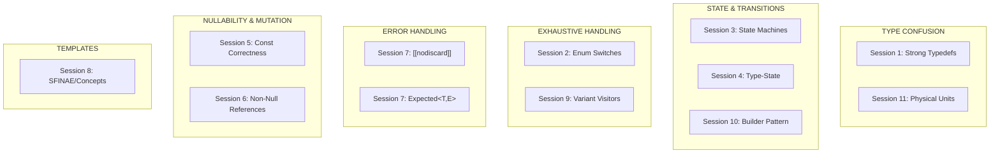
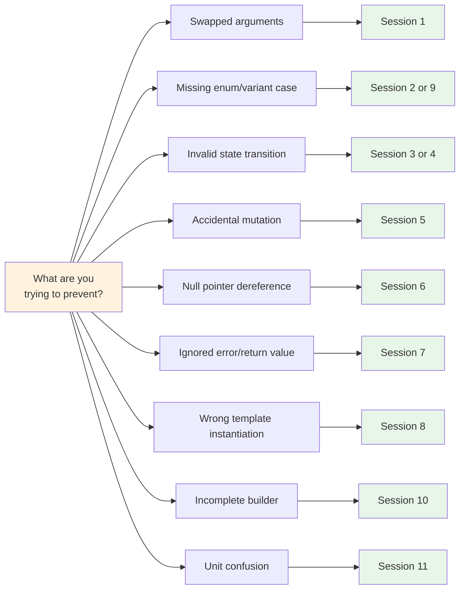

# Compile-Time Error Detection in C++
## Using the Type System as Your Safety Net

---

> *"Every bug caught at compile time is a bug that never reaches production."*

---

## What This Course Is About

This course teaches you to **make the C++ compiler work for you**. Instead of catching bugs through testing, code review, or (worst case) production incidents, you'll learn techniques that make entire categories of bugs *impossible to compile*.

The core principle is simple:

> **Make illegal states unrepresentable.**

When invalid code doesn't compile, you don't need discipline, checklists, or hope. The compiler enforces correctness automatically, every time, for every developer on your team.

---

## Who This Course Is For

| You'll benefit most if you... | This might not be for you if... |
|------------------------------|--------------------------------|
| Write C++ professionally | You're just learning C++ basics |
| Have seen bugs slip through testing | You work on throwaway prototypes |
| Maintain long-lived codebases | Compile time is already a major pain point |
| Work on safety-critical systems | You're primarily doing C interop |
| Want to level up your type system skills | You're satisfied with runtime checks |

**Prerequisites:**
- Comfortable with C++17 features (templates, `auto`, lambdas)
- Basic familiarity with the standard library
- Understanding of references vs pointers
- Some exposure to template metaprogramming (helpful but not required)

---

## Why This Matters: Real Bugs, Real Costs

These techniques aren't academic exercises. They prevent bugs that have cost millions:

| Incident | Root Cause | Cost | Preventable By |
|----------|-----------|------|----------------|
| **Mars Climate Orbiter (1999)** | Pound-seconds vs newton-seconds confusion | $327 million | Session 11: Physical Units |
| **Gimli Glider (1983)** | Pounds vs kilograms in fuel calculation | Near-disaster | Session 11: Physical Units |
| **MongoDB SERVER-30569** | Swapped function arguments | Bug in production | Session 1: Strong Typedefs |
| **Android fdsan bugs** | Use-after-close of file descriptors | Crashes, data corruption | Session 4: Type-State Pattern |
| **Countless null pointer crashes** | Unchecked null dereference | Billions in aggregate | Session 6: Non-Null References |

Tony Hoare, inventor of the null reference, called it his **"billion-dollar mistake."** This course teaches you how to avoid repeating it.

---

## What You'll Learn

### The Guarantee Levels

Throughout this course, techniques are marked with their guarantee level:

| Mark | Meaning |
|------|---------|
| ✅ **Compile-time** | Invalid code is rejected by the compiler |
| ⚠ **Runtime fail-fast** | Invalid behavior is detected immediately at runtime |
| 🛈 **Discipline/tooling** | Convention helps, but compiler doesn't enforce |

Most techniques in this course provide **compile-time guarantees**—the strongest level of protection.

### The Techniques



---

## Course Structure

### 📘 Problem Sessions (1-11)
*45-75 minutes each*

Deep-dive tutorials built around **real bugs**. Each session:
1. Shows you buggy code that passed code review
2. Asks you to find the problem
3. Explains why traditional approaches fail
4. Teaches the compile-time solution
5. Provides exercises to practice

### 📗 Mini Sessions (1-6)
*15-20 minutes each*

Focused tutorials on supporting techniques:
- `= delete` for prohibiting operations
- Brace initialization for narrowing prevention
- `static_assert` for compile-time checks
- `noexcept` contracts
- `std::span` for bounds safety
- `final` keyword

### 📙 Handbooks (3)
*Reference material*

- **Phantom Types**: Zero-cost type distinctions
- **Policy-Based Design**: Compile-time behavior selection
- **Safe Reference Patterns**: Preventing dangling references

### 📎 Appendices & References
- Complete compiler flags reference (GCC, Clang, MSVC)
- C++23/26 future features
- Exercises by difficulty (Beginner → Advanced → Projects)
- Quick reference card
- Technique decision flowchart

---

## Quick Start Guide

### Path 1: "I want quick wins now"

Start here for immediate improvements to your codebase:

1. **Enable compiler warnings** → `appendix_compiler_flags_reference.md`
   ```bash
   # Add to your build immediately
   -Werror=return-type -Werror=switch-enum -Wconversion
   ```

2. **Add `[[nodiscard]]`** → `problem_session_7_nodiscard_expected.md`
   ```cpp
   [[nodiscard]] bool save(const std::string& path);
   ```

3. **Use `const` everywhere** → `problem_session_5_const_correctness.md`
   ```cpp
   void process(const std::vector<Record>& data);  // Can't accidentally mutate
   ```

### Path 2: "I want the full course"

Work through sessions in order:

```
Week 1: Foundations
├── Overview: compile_time_error_detection_overview.md
├── Session 1: Strong Typedefs
├── Session 2: Enum Exhaustiveness
└── Mini Sessions 1-3

Week 2: State & Flow
├── Session 3: State Machines
├── Session 4: Type-State Pattern
├── Session 5: Const Correctness
└── Mini Sessions 4-6

Week 3: Safety Patterns
├── Session 6: Non-Null References
├── Session 7: [[nodiscard]] and Expected
├── Session 9: Variant Exhaustiveness
└── Handbook: Safe Reference Patterns

Week 4: Advanced Techniques
├── Session 8: Template Constraints
├── Session 10: Builder Type Accumulation
├── Session 11: Physical Units
└── Handbooks: Phantom Types, Policy-Based Design

Week 5: Practice
└── Exercises: exercises_by_difficulty.md
```

### Path 3: "I have a specific problem"

Use the decision flowchart:



See `technique_decision_flowchart.md` for the complete visual guide.

---

## The FAT-P Library

This course includes the **FAT-P** (Fail At The Point) library—header-only C++17 components that implement the techniques taught:

| Component | Purpose | Header |
|-----------|---------|--------|
| `StrongId<Tag, T>` | Type-safe IDs and handles | `StrongId.h` |
| `EnumPlusMap<E, T>` | Compile-time enum-to-value mapping | `EnumPlus.h` |
| `StateMachine<...>` | Policy-based state machine | `StateMachine.h` |
| `Expected<T, E>` | Error-or-value (pre-C++23) | `Expected.h` |
| `CheckedArithmetic<T>` | Overflow-safe arithmetic | `CheckedArithmetic.h` |

These are production-ready implementations you can use directly or learn from.

---

## What You'll Be Able To Do

After completing this course, you will:

✅ **Catch argument-swapping bugs at compile time**
```cpp
// Before: compiles, but user_id and doc_id are swapped
grant_access(doc_id, user_id, level);

// After: compile error—types don't match
grant_access(doc_id, user_id, level);  // ERROR: DocId vs UserId
```

✅ **Never forget an enum case again**
```cpp
// Adding a new status? Compiler finds every switch that needs updating.
enum class Status { Pending, Shipped, Delivered, Returned };  // Added Returned
// All switches without Returned → compile error
```

✅ **Make invalid state transitions impossible**
```cpp
// Can't send on a closed connection—the method doesn't exist
ClosedConnection conn;
conn.send(data);  // ERROR: ClosedConnection has no member 'send'
```

✅ **Force error handling**
```cpp
[[nodiscard]] Expected<Data, Error> load_file(path);
load_file("data.txt");  // WARNING: ignoring return value
```

✅ **Eliminate null pointer crashes**
```cpp
void process(User& user);  // Reference: cannot be null
process(*find_user(id));   // Null check required at call site
```

✅ **Get clear template error messages**
```cpp
template<Sortable Container>  // C++20 concept
void sort(Container& c);

sort(42);  // ERROR: 'int' does not satisfy 'Sortable'
           // (not 50 lines of template instantiation errors)
```

---

## Compiler Requirements

| Compiler | Minimum Version | Recommended |
|----------|-----------------|-------------|
| GCC | 9+ | 12+ |
| Clang | 10+ | 15+ |
| MSVC | 2019 (16.8+) | 2022 |

Most techniques work with **C++17**. Sessions 8 (Concepts) benefits from **C++20**.

---

## How to Use These Materials

### For Self-Study
- Work through sessions at your own pace
- Complete exercises after each session
- Apply techniques to your own codebase between sessions

### For Team Training
- Each problem session works as a 1-hour workshop
- Use the "Discussion Points" sections for group conversation
- Pair programming on exercises reinforces learning

### For Reference
- `quick_reference_card_compile_time_safety.md` — one-page cheat sheet
- `technique_decision_flowchart.md` — "which technique do I need?"
- `appendix_compiler_flags_reference.md` — complete flag documentation

---

## A Note on Trade-offs

These techniques are powerful, but not free:

| Benefit | Cost |
|---------|------|
| Bugs caught at compile time | Longer compile times (usually minor) |
| Self-documenting code | More verbose type signatures |
| Compiler-enforced contracts | Initial refactoring effort |
| Scales to large teams | Learning curve for new patterns |

The course helps you make informed decisions about when the trade-off is worth it. Not every technique belongs in every codebase—but knowing them lets you choose.

---

## Getting Started

1. **Read the overview**: `compile_time_error_detection_overview.md`
2. **Set up compiler flags**: `appendix_compiler_flags_reference.md`
3. **Start with Session 1**: `problem_session_1_final.md`

Or jump directly to a technique you need using the decision flowchart.

---

## File Index

### Core Sessions
| File | Topic |
|------|-------|
| `compile_time_error_detection_overview.md` | Course philosophy and roadmap |
| `problem_session_1_final.md` | Strong Typedefs |
| `problem_session_2_enum_exhaustiveness.md` | Enum Switch Coverage |
| `problem_session_3_state_machine.md` | Type-Safe State Machines |
| `problem_session_4_type_state_pattern.md` | Type-State Pattern |
| `problem_session_5_const_correctness.md` | Const Correctness |
| `problem_session_6_non_null_references.md` | Non-Null References |
| `problem_session_7_nodiscard_expected.md` | [[nodiscard]] and Expected |
| `problem_session_8_template_constraints.md` | SFINAE and Concepts |
| `problem_session_9_variant_exhaustiveness.md` | Variant Visitors |
| `problem_session_10_builder_type_accumulation.md` | Type-Accumulating Builders |
| `problem_session_11_physical_units.md` | Dimensional Analysis |

### Mini Sessions
| File | Topic |
|------|-------|
| `mini_session_1_deleted_functions.md` | `= delete` |
| `mini_session_2_narrowing_conversions.md` | Brace Initialization |
| `mini_session_3_static_assert.md` | Compile-Time Assertions |
| `mini_session_4_noexcept_contracts.md` | Exception Specifications |
| `mini_session_5_span_bounds.md` | std::span |
| `mini_session_6_final_keyword.md` | final Keyword |

### Handbooks & References
| File | Topic |
|------|-------|
| `handbook_phantom_types.md` | Phantom Type Patterns |
| `handbook_policy_based_design.md` | Policy-Based Design |
| `handbook_safe_reference_patterns.md` | Dangling Reference Prevention |
| `appendix_compiler_flags_reference.md` | GCC/Clang/MSVC Flags |
| `appendix_cpp23_26_futures.md` | Upcoming C++ Features |
| `exercises_by_difficulty.md` | Practice Problems |
| `quick_reference_card_compile_time_safety.md` | Cheat Sheet |
| `technique_decision_flowchart.md` | Decision Guide |

---

## The Bottom Line

| Approach | Outcome |
|----------|---------|
| Tests catch bugs | Some bugs slip through |
| Code review catches | Reviewers get tired |
| Discipline catches | Humans forget |
| **The compiler catches** | **Every time, automatically, forever** |

Let's make the compiler work for you.

**Start here:** `compile_time_error_detection_overview.md`

---

*Compile-Time Error Detection in C++ — Version 1.0*
