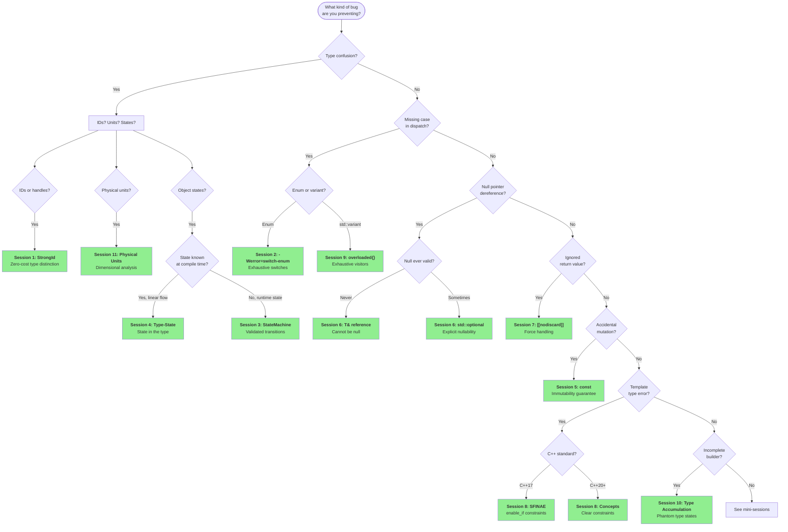
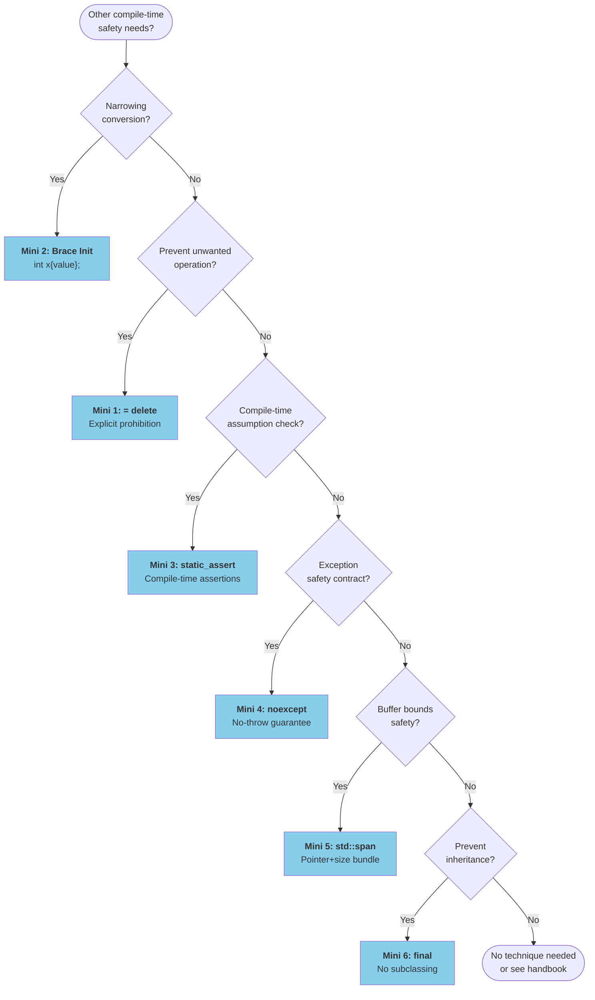
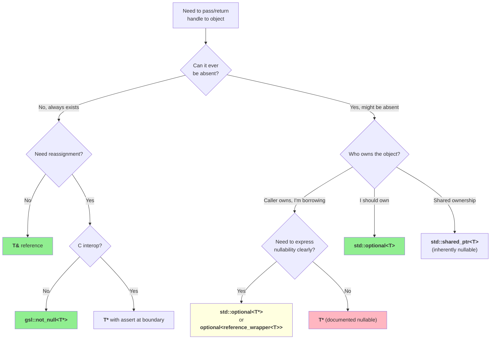
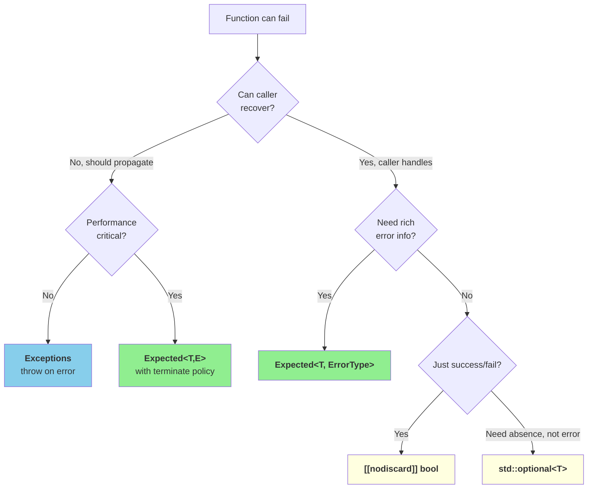
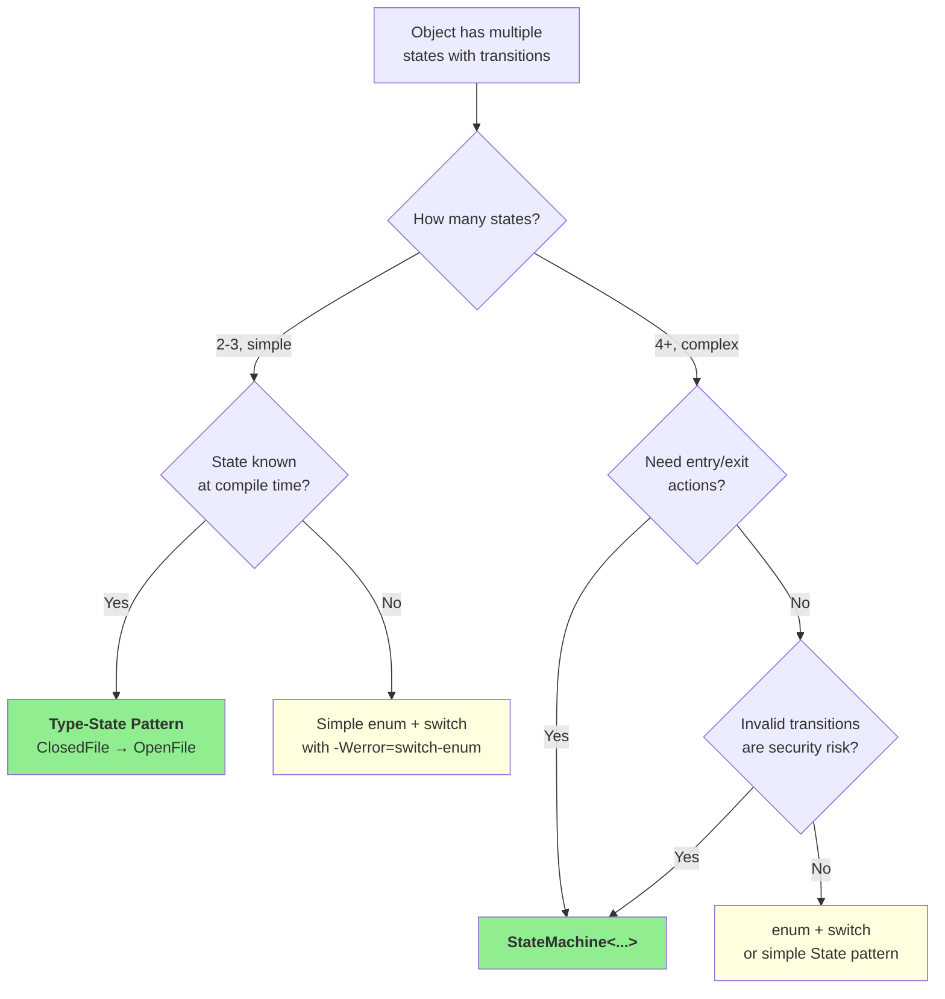

# Compile-Time Safety: Technique Decision Flowchart

## Visual Guide to Choosing the Right Technique

---

## How to Use This Guide

Start with your problem. Follow the flowchart based on your specific situation. The endpoints tell you which technique to use and which session covers it in detail.

---

## Master Decision Flowchart

---

## Mini-Session Decision Flowchart

For smaller, focused techniques:

---

## Specific Problem Flowcharts

### Pointer vs Reference Decision

### Error Handling Decision

### State Machine Decision

---

## Technique Comparison Table

| Technique | Compile-Time? | Runtime Cost | Complexity | Best For |
|-----------|--------------|--------------|------------|----------|
| StrongId | ✅ Yes | Zero | Low | IDs, handles |
| -Werror=switch-enum | ✅ Yes | Zero | Low | Enum dispatch |
| StateMachine | ⚠ Partial | O(1) check | Medium | Complex protocols |
| Type-State | ✅ Yes | Zero | High | Linear workflows |
| const | ✅ Yes | Zero | Low | All code |
| T& reference | ✅ Yes | Zero | Low | Required params |
| std::optional | ⚠ Runtime | Tiny | Low | Nullable values |
| [[nodiscard]] | ✅ Yes | Zero | Low | Return values |
| Concepts | ✅ Yes | Zero | Medium | Templates |
| SFINAE | ✅ Yes | Zero | High | C++17 templates |

---

## Quick Decision Rules

### Rule 1: Type Confusion
> "If two things shouldn't be interchangeable, give them different types."

- Different IDs → `StrongId<DifferentTag>`
- Different units → Units library
- Different states → Different types or StateMachine

### Rule 2: Nullability
> "If null is not valid, use a type that can't be null."

- Never null → `T&`
- Maybe null, you own it → `std::optional<T>`
- Maybe null, borrowed → `T*` (documented) or `optional<reference_wrapper<T>>`

### Rule 3: Error Handling
> "If ignoring is a bug, make ignoring impossible."

- Must check return → `[[nodiscard]]`
- Must handle error → `Expected<T, E>`
- Can't check at runtime → Make invalid states unrepresentable

### Rule 4: Enum Safety
> "Never write `default:` in a switch on your own enums."

- Your enum → No default, use `-Werror=switch-enum`
- External enum → `default:` is OK
- std::variant → Use `overloaded{}` pattern

### Rule 5: Templates
> "Constrain at the interface, not deep inside."

- C++20 → Concepts
- C++17 → SFINAE with enable_if
- Error at call site, not in implementation

---

## See Also

| For This Topic | See This Document |
|----------------|-------------------|
| Full technique tutorials | `problem_session_01.md` – `problem_session_11.md` |
| Quick patterns | `quick_reference_card.md` |
| Compiler flags | `compiler_flags_reference.md` |
| Design philosophy | `compile_time_error_detection_overview.md` |

---

*FAT-P Library — Technique Decision Flowchart v1.0*
