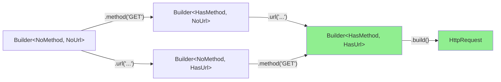

# Problem-Solving Session 10: The Incomplete Builder

## Type-Accumulating Builders with Phantom Types

**Estimated time:** 60 minutes  
**Prerequisites:** Templates, Type-State Pattern (Session 4), basic metaprogramming  
**Fat-P components:** None (technique pattern)

---

## Guarantee Legend

| Mark | Meaning |
|------|---------|
| ✅ **Compile-time** | build() method only exists when all required fields are set |

---

## The Bug

Your HTTP client uses a fluent builder pattern:

```cpp
class HttpRequestBuilder {
    std::string method_;
    std::string url_;
    std::map<std::string, std::string> headers_;
    std::optional<std::string> body_;
    
public:
    HttpRequestBuilder& method(std::string m) { method_ = std::move(m); return *this; }
    HttpRequestBuilder& url(std::string u) { url_ = std::move(u); return *this; }
    HttpRequestBuilder& header(std::string k, std::string v) { 
        headers_[std::move(k)] = std::move(v); 
        return *this; 
    }
    HttpRequestBuilder& body(std::string b) { body_ = std::move(b); return *this; }
    
    HttpRequest build() {
        if (method_.empty()) throw std::logic_error("method required");
        if (url_.empty()) throw std::logic_error("url required");
        return HttpRequest{method_, url_, headers_, body_};
    }
};
```

Usage seems clean:

```cpp
auto request = HttpRequestBuilder()
    .url("https://api.example.com/users")
    .header("Accept", "application/json")
    .build();  // RUNTIME ERROR: method required
```

The bug: `method()` wasn't called, but the code compiles fine. The error only appears at runtime, possibly in production.

**The core problem:** Required fields are checked at runtime. The type system doesn't know which fields have been set.

---

## Questions to Consider

Before reading further, think about:

1. **Q1:** Can we encode "which fields are set" in the type itself?
2. **Q2:** How do state transitions work across setter calls?
3. **Q3:** How do we scale this to many required fields?
4. **Q4:** What's the runtime cost of this pattern?
5. **Q5:** When is this pattern overkill?

---

## Q1: State in the Type

The key insight is that each setter can return a **different type** that encodes what's been set:

```cpp
// Type tags for state
struct NoMethod {};
struct HasMethod {};
struct NoUrl {};
struct HasUrl {};

// Builder type parameterized by state
template<typename MethodState, typename UrlState>
class HttpRequestBuilder {
    std::string method_;
    std::string url_;
    std::map<std::string, std::string> headers_;
    std::optional<std::string> body_;
    
    // Private constructor for state transitions
    template<typename, typename> friend class HttpRequestBuilder;
    
    HttpRequestBuilder(std::string m, std::string u,
                       std::map<std::string, std::string> h,
                       std::optional<std::string> b)
        : method_(std::move(m)), url_(std::move(u))
        , headers_(std::move(h)), body_(std::move(b)) {}
    
public:
    HttpRequestBuilder() = default;
    
    // method() changes MethodState from NoMethod to HasMethod
    HttpRequestBuilder<HasMethod, UrlState> method(std::string m) && {
        return {std::move(m), std::move(url_), std::move(headers_), std::move(body_)};
    }
    
    // url() changes UrlState from NoUrl to HasUrl
    HttpRequestBuilder<MethodState, HasUrl> url(std::string u) && {
        return {std::move(method_), std::move(u), std::move(headers_), std::move(body_)};
    }
    
    // header() doesn't change required state
    HttpRequestBuilder header(std::string k, std::string v) && {
        headers_[std::move(k)] = std::move(v);
        return std::move(*this);
    }
    
    // body() doesn't change required state
    HttpRequestBuilder body(std::string b) && {
        body_ = std::move(b);
        return std::move(*this);
    }
    
    // build() only exists when both required fields are set
    HttpRequest build() &&
        requires std::same_as<MethodState, HasMethod> 
              && std::same_as<UrlState, HasUrl>
    {
        return HttpRequest{std::move(method_), std::move(url_), 
                          std::move(headers_), std::move(body_)};
    }
};

// Convenient starting point
using RequestBuilder = HttpRequestBuilder<NoMethod, NoUrl>;
```

Now:

```cpp
auto request = RequestBuilder()
    .url("https://api.example.com/users")
    .method("GET")
    .header("Accept", "application/json")
    .build();  // OK: both required fields set

auto bad = RequestBuilder()
    .url("https://api.example.com/users")
    .build();  // COMPILE ERROR: build() doesn't exist
              // for HttpRequestBuilder<NoMethod, HasUrl>
```

---

## Q2: Type Transitions

Each setter transforms the builder type:



The order doesn't matter—you can call `method()` then `url()` or vice versa. Both paths lead to `Builder<HasMethod, HasUrl>`, which has `build()`.

**Note the `&&` qualifiers:** Setters consume `*this` by rvalue reference. This ensures the builder is used linearly—you can't accidentally use a "stale" intermediate state.

---

## Q3: Scaling to Many Fields (Bitfield Approach)

With many required fields, separate type parameters become unwieldy:

```cpp
// Ugly: too many type parameters
template<typename A, typename B, typename C, typename D, typename E>
class Builder;
```

**Solution: Use a compile-time bitfield:**

```cpp
template<unsigned Required, unsigned Set>
class ConfigBuilder {
    // Required: bits for required fields
    // Set: bits for currently-set fields
    
public:
    static constexpr unsigned HOST_BIT = 1 << 0;
    static constexpr unsigned PORT_BIT = 1 << 1;
    static constexpr unsigned USER_BIT = 1 << 2;
    // Optional fields don't need bits
    
    std::string host_;
    int port_ = 0;
    std::string user_;
    std::optional<std::string> password_;
    
    // host() sets HOST_BIT
    ConfigBuilder<Required, Set | HOST_BIT> host(std::string h) && {
        host_ = std::move(h);
        return {std::move(*this)};
    }
    
    // port() sets PORT_BIT
    ConfigBuilder<Required, Set | PORT_BIT> port(int p) && {
        port_ = p;
        return {std::move(*this)};
    }
    
    // user() sets USER_BIT
    ConfigBuilder<Required, Set | USER_BIT> user(std::string u) && {
        user_ = std::move(u);
        return {std::move(*this)};
    }
    
    // password() is optional, doesn't change state
    ConfigBuilder password(std::string p) && {
        password_ = std::move(p);
        return std::move(*this);
    }
    
    // build() requires all Required bits to be in Set
    Config build() &&
        requires ((Set & Required) == Required)
    {
        return Config{std::move(host_), port_, std::move(user_), std::move(password_)};
    }
    
private:
    template<unsigned, unsigned> friend class ConfigBuilder;
    
    template<unsigned OtherSet>
    ConfigBuilder(ConfigBuilder<Required, OtherSet>&& other)
        : host_(std::move(other.host_))
        , port_(other.port_)
        , user_(std::move(other.user_))
        , password_(std::move(other.password_))
    {}
};

// Require host and port, user is optional
using DbConfigBuilder = ConfigBuilder<
    ConfigBuilder<0,0>::HOST_BIT | ConfigBuilder<0,0>::PORT_BIT,
    0
>;

auto config = DbConfigBuilder()
    .host("localhost")
    .port(5432)
    .build();  // OK

auto bad = DbConfigBuilder()
    .host("localhost")
    .build();  // Error: PORT_BIT not set
```

---

## Q4: Runtime Cost

**Zero.** All the type manipulation happens at compile time. The generated code is identical to:

```cpp
HttpRequest build_request() {
    HttpRequest req;
    req.method = "GET";
    req.url = "https://api.example.com/users";
    req.headers["Accept"] = "application/json";
    return req;
}
```

The type states (`HasMethod`, `NoUrl`, etc.) exist only in the type system—they take no memory and generate no runtime checks.

---

## Q5: When Is This Overkill?

**Use type-accumulating builders when:**
- Required fields are known at compile time
- Forgetting a field is a common bug
- The builder is part of a public API
- Safety is more important than API simplicity

**Use runtime checks instead when:**
- Required fields depend on runtime conditions
- The builder is internal/simple
- Compile-time complexity would hurt readability
- Rapid prototyping (add types later)

---

## C++17 Version (Without Concepts)

For C++17, use SFINAE instead of `requires`:

```cpp
template<typename MethodState, typename UrlState>
class HttpRequestBuilder {
    // ... same fields and setters ...
    
    // build() only enabled when both states are "Has"
    template<typename M = MethodState, typename U = UrlState,
             std::enable_if_t<
                 std::is_same_v<M, HasMethod> && std::is_same_v<U, HasUrl>,
                 int> = 0>
    HttpRequest build() && {
        return HttpRequest{std::move(method_), std::move(url_),
                          std::move(headers_), std::move(body_)};
    }
};
```

---

## Real-World Example: SQL Query Builder

```cpp
template<bool HasSelect, bool HasFrom, bool HasWhere = false>
class QueryBuilder {
    std::string select_;
    std::string from_;
    std::string where_;
    
    template<bool, bool, bool> friend class QueryBuilder;
    
public:
    QueryBuilder() = default;
    
    QueryBuilder<true, HasFrom, HasWhere> select(std::string cols) && {
        select_ = std::move(cols);
        return {std::move(*this)};
    }
    
    QueryBuilder<HasSelect, true, HasWhere> from(std::string table) && {
        from_ = std::move(table);
        return {std::move(*this)};
    }
    
    QueryBuilder<HasSelect, HasFrom, true> where(std::string cond) && {
        where_ = std::move(cond);
        return {std::move(*this)};
    }
    
    // Can only build with at least SELECT and FROM
    std::string build() &&
        requires (HasSelect && HasFrom)
    {
        std::string sql = "SELECT " + select_ + " FROM " + from_;
        if constexpr (HasWhere) {
            if (!where_.empty()) {
                sql += " WHERE " + where_;
            }
        }
        return sql;
    }
    
private:
    template<bool S, bool F, bool W>
    QueryBuilder(QueryBuilder<S, F, W>&& other)
        : select_(std::move(other.select_))
        , from_(std::move(other.from_))
        , where_(std::move(other.where_))
    {}
};

using Query = QueryBuilder<false, false, false>;

auto sql = Query()
    .select("name, email")
    .from("users")
    .where("active = true")
    .build();  // "SELECT name, email FROM users WHERE active = true"

auto bad = Query()
    .select("*")
    .build();  // Compile error: FROM not set
```

---

## Comparison with EnforcedInit

| Aspect | EnforcedInit | Type Accumulation |
|--------|--------------|-------------------|
| Check timing | Runtime | Compile-time |
| Error type | Exception/assert | Compile error |
| Complexity | Low | High |
| Flexibility | High | Lower |
| State visible | `.is_initialized()` | In the type |

**Use EnforcedInit when:**
- Initialization depends on runtime conditions
- Simpler implementation is preferred
- Partial initialization is a valid temporary state

**Use Type Accumulation when:**
- Required fields are statically known
- You want compile-time guarantees
- The pattern is used in a public API

---

## Summary

| Problem | Solution |
|---------|----------|
| Forgot required field | Method doesn't exist without prerequisites |
| Runtime check for completeness | Compile-time type check |
| Builder state unclear | Type encodes state |
| Wrong order | Order doesn't matter—type tracks what's set |

### Key Principles

1. **Encode state in type parameters** — setters return different types

2. **build() is conditionally available** — only when all required bits are set

3. **Use `&&` qualifiers** — prevents reusing stale builder states

4. **Phantom types have zero cost** — all checking is at compile time

### The Guideline in One Sentence

> Use phantom types to encode builder state, making incomplete builds fail to compile.

---

## Exercises

1. **Basic:** Create an `EmailBuilder` requiring `to`, `subject`, and `body`. Make `cc` and `bcc` optional.

2. **Bitfield:** Reimplement your `EmailBuilder` using the bitfield approach.

3. **Order dependency:** Modify `QueryBuilder` so `where()` can only be called after `from()` (not just before `build()`).

4. **Validation:** Add a `validate()` method that exists only when the builder is complete, allowing inspection before `build()`.

---

## Further Reading

- Session 4: Type-State Pattern — foundational concept
- Handbook: Phantom Types — generalization of this pattern
- [Phantom Types in C++](https://blog.galowicz.de/2016/02/18/phantom_types/) — external article
