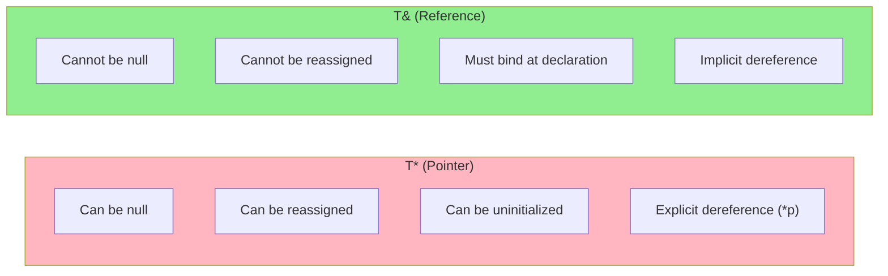
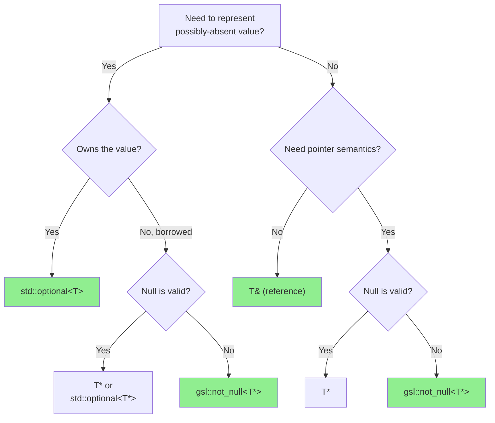

# Problem-Solving Session 6: The Null Dereference

## Non-Null References and Explicit Nullability

**Estimated time:** 45–60 minutes  
**Prerequisites:** Basic C++ pointers and references, familiarity with std::optional  
**Fat-P components:** None (native C++ features + GSL)

---

## Guarantee Legend

| Mark | Meaning |
|------|---------|
| ✅ **Compile-time** | References cannot be null by language rules; binding null to reference is UB at binding site |
| ⚠ **Runtime** | `std::optional` and `gsl::not_null` checks happen at access/construction time |

---

## The Bug

Your team's user management system has been running for months. Then the crash reports start arriving:

> "Application crashes with SIGSEGV when viewing user profiles."

You trace it to this code, which passed code review:

```cpp
struct User {
    std::string name;
    std::string email;
    int age;
};

void display_user_profile(User* user) {
    std::cout << "Name: " << user->name << "\n";
    std::cout << "Email: " << user->email << "\n";
    std::cout << "Age: " << user->age << "\n";
}

User* find_user_by_id(Database& db, int user_id) {
    auto it = db.users.find(user_id);
    if (it == db.users.end()) {
        return nullptr;  // User not found
    }
    return &it->second;
}

void handle_profile_request(Database& db, int user_id) {
    User* user = find_user_by_id(db, user_id);
    display_user_profile(user);  // CRASH if user not found!
}
```

The bug is subtle but devastating. `find_user_by_id` returns `nullptr` when the user doesn't exist, but `handle_profile_request` passes that null pointer directly to `display_user_profile`, which dereferences it without checking. The crash happens inside `display_user_profile`, far from where the actual mistake was made.

The code review didn't catch it because reviewers assumed either (a) `find_user_by_id` always succeeds, or (b) `display_user_profile` checks for null. Neither assumption was documented or enforced.

---

## Questions to Consider

Before reading further, think about:

1. **Q1:** Why doesn't the compiler warn about the potential null dereference?
2. **Q2:** What's the fundamental difference between a pointer and a reference?
3. **Q3:** When should you use `std::optional` instead of a pointer?
4. **Q4:** How can you enforce non-null at the type level with pointers?
5. **Q5:** What about nullable references—do they exist?

---

## Q1: The Billion-Dollar Mistake

Tony Hoare, who invented the null reference in 1965 for ALGOL W, later called it his "billion-dollar mistake":

> "I call it my billion-dollar mistake. It was the invention of the null reference in 1965... This has led to innumerable errors, vulnerabilities, and system crashes, which have probably caused a billion dollars of pain and damage in the last forty years."

The problem is that `T*` in C and C++ means "maybe a T, maybe nothing." The type system doesn't distinguish between pointers that are never null and pointers that might be null. Every pointer parameter is potentially a landmine.

```cpp
void display_user_profile(User* user) {
    // The compiler sees: user is a pointer
    // It could be valid, it could be null
    // The compiler has no way to know the programmer's intent
    user->name;  // Legal syntax. Might crash. Compiler doesn't warn.
}
```

The compiler can't warn because dereferencing a pointer is a legal operation. The language assumes you know what you're doing. And the type `User*` carries no information about whether null is a valid value.

Consider the real-world impact. Microsoft's security team reported that approximately 70% of their security vulnerabilities are memory safety issues, with null pointer dereferences being a significant category. Google found that null pointer bugs are among the leading causes of Chrome crashes. The CVE database contains thousands of null pointer dereference vulnerabilities across virtually every major software project.

The fundamental issue is that discipline doesn't scale. You can write coding standards that say "always check for null." You can add it to your code review checklist. But humans forget, humans get tired, and humans make assumptions. The type system never forgets—but in C++, the type system doesn't encode nullability by default.

---

## Q2: References Cannot Be Null

C++ provides a solution that's been in the language since the beginning: references. A reference must be bound to a valid object when it's created and cannot be rebound to null afterward.

```cpp
void display_user_profile(User& user) {  // Reference, not pointer
    std::cout << "Name: " << user.name << "\n";
    std::cout << "Email: " << user.email << "\n";
    std::cout << "Age: " << user.age << "\n";
}
```

This function signature makes a guarantee: `user` refers to a valid `User` object. It cannot be null. The caller is responsible for ensuring they pass a valid object, and that responsibility is visible at the call site:

```cpp
void handle_profile_request(Database& db, int user_id) {
    User* user = find_user_by_id(db, user_id);
    if (user) {
        display_user_profile(*user);  // Explicit dereference—null check visible here
    } else {
        show_error("User not found");
    }
}
```

The asterisk in `*user` serves as a visual marker: "I am taking responsibility for this pointer being valid." The null check must happen before the dereference, and that check is now at the call site where the decision to call `display_user_profile` is made.

The differences between pointers and references are fundamental:



When you write `User& ref = *ptr;`, if `ptr` is null, undefined behavior happens at that line—not somewhere deep in a function that trusted its input. The potential crash site is moved to the binding site, where the programmer made the decision to dereference.

This is a form of "pushing validation to the boundary." Internal code uses references and trusts them. Validation happens at the edges where pointers enter the system.

---

## Q3: std::optional for Explicit Nullability

Sometimes "no value" is a legitimate state, not an error. The function `find_user_by_id` genuinely might not find a user—that's not a bug, it's expected behavior. For these cases, C++17 introduced `std::optional<T>`.

```cpp
std::optional<User> find_user_by_id(Database& db, int user_id) {
    auto it = db.users.find(user_id);
    if (it == db.users.end()) {
        return std::nullopt;  // Explicitly: no value
    }
    return it->second;  // Return a copy of the user
}
```

The return type now explicitly communicates: "This function might not return a User." The caller cannot accidentally ignore this:

```cpp
void handle_profile_request(Database& db, int user_id) {
    std::optional<User> user = find_user_by_id(db, user_id);
    
    if (user) {
        display_user_profile(*user);  // Must dereference optional
    } else {
        show_error("User not found");
    }
}
```

The optional forces acknowledgment. You can't just call `user.name`—you must either check `if (user)` or explicitly dereference with `*user` (which throws `std::bad_optional_access` if empty).

For more ergonomic handling, optional provides several access patterns:

```cpp
// Pattern 1: Check and dereference
if (user) {
    display_user_profile(*user);
}

// Pattern 2: value_or with default
display_user_profile(user.value_or(default_user));

// Pattern 3: Monadic operations (C++23)
find_user_by_id(db, user_id)
    .transform([](User& u) { display_user_profile(u); })
    .or_else([] { show_error("User not found"); });

// Pattern 4: Exception on missing (when absence is truly unexpected)
try {
    display_user_profile(user.value());
} catch (const std::bad_optional_access&) {
    show_error("User not found");
}
```

The comparison between `T*` for "maybe null" and `std::optional<T>` reveals why optional is superior for most cases:

| Aspect | `T*` | `std::optional<T>` |
|--------|------|-------------------|
| Null state | Implicit | Explicit (`std::nullopt`) |
| Ownership | Ambiguous | Value semantics (owns the T) |
| Self-documenting | No | Yes |
| Forgetting to check | Silent bug | Still possible but more visible |
| Nested nullability | Confusing (`T**`) | Clear (`optional<optional<T>>`) |

The ownership question is critical. When a function returns `User*`, does the caller own that pointer? Should they delete it? Is it pointing to a local variable (dangling)? A member of some object? A global? The pointer carries no ownership information.

`std::optional<User>` is unambiguous: it contains a `User` by value. The caller owns it. There's no question about lifetime.

---

## Q4: gsl::not_null for Non-Null Pointers

Sometimes you need pointer semantics—perhaps for polymorphism, or because you're interfacing with C code, or because you need reassignability—but you also want to express "this pointer is never null." The C++ Core Guidelines Support Library (GSL) provides `gsl::not_null<T*>` for exactly this case.

```cpp
#include <gsl/gsl>

void display_user_profile(gsl::not_null<User*> user) {
    // user is guaranteed non-null
    std::cout << "Name: " << user->name << "\n";
}

void handle_profile_request(Database& db, int user_id) {
    User* user = find_user_by_id(db, user_id);
    if (user) {
        display_user_profile(user);  // Implicit conversion to not_null
    }
    
    display_user_profile(nullptr);  // Compile error or runtime check
}
```

The `not_null` wrapper provides several guarantees. Construction from null is either a compile error (if the null is a literal or constexpr) or a runtime check (if the null comes from a runtime value). The wrapper cannot be assigned null after construction. It implicitly converts to the underlying pointer type for interoperability.

The runtime check behavior is configurable. In debug builds, you might want assertions that crash immediately on null. In release builds, you might want to throw an exception or terminate. The GSL implementation allows this configuration.

The question of when to use each approach deserves a clear decision matrix:



A summary table for quick reference:

| Need | Solution |
|------|----------|
| Never null, no ownership | `T&` reference |
| Never null, need reassignment | `gsl::not_null<T*>` |
| Maybe null, owns the value | `std::optional<T>` |
| Maybe null, doesn't own | `T*` (documented) or `std::optional<T*>` |
| Never null, unique ownership | `std::unique_ptr<T>` (check before passing) |
| Maybe null, shared ownership | `std::shared_ptr<T>` (inherently nullable) |

---

## Q5: Nullable References?

You might wonder: if `std::optional<T>` represents "maybe a T," can you have `std::optional<T&>` for "maybe a reference"? The answer is no—at least, not directly.

```cpp
std::optional<User&> maybe_user;  // Does not compile
```

The C++ standard committee intentionally excluded reference types from optional because the semantics would be confusing. What would assignment mean? Would `maybe_user = other_user` rebind the reference or assign through it to the referent?

The workaround uses `std::reference_wrapper`:

```cpp
#include <functional>  // for reference_wrapper
#include <optional>

std::optional<std::reference_wrapper<User>> find_user_ref(Database& db, int user_id) {
    auto it = db.users.find(user_id);
    if (it == db.users.end()) {
        return std::nullopt;
    }
    return std::ref(it->second);  // Wrap the reference
}

void handle_profile_request(Database& db, int user_id) {
    auto maybe_user = find_user_ref(db, user_id);
    if (maybe_user) {
        User& user = maybe_user->get();  // Extract the reference
        display_user_profile(user);
    }
}
```

This is admittedly verbose. A type alias helps:

```cpp
template<typename T>
using optional_ref = std::optional<std::reference_wrapper<T>>;

optional_ref<User> find_user_ref(Database& db, int user_id);
```

The `reference_wrapper` makes the indirection explicit. When you see `reference_wrapper` in a signature, you know you're dealing with a non-owning, rebindable reference to something stored elsewhere.

---

## Migration from C

C code uses pointers for everything. Migrating to C++ means choosing the right abstraction for each pointer's actual semantics.

### Pattern 1: Output Parameters

C functions often return values through pointer parameters:

```c
// C: output via pointer
int parse_config(const char* input, Config* out) {
    if (!out) return -1;  // Defensive null check
    // ... parse into *out ...
    return 0;
}

void caller(void) {
    Config cfg;
    if (parse_config(data, &cfg) == 0) {
        use(cfg);
    }
}
```

The C++ approach depends on what failure means:

```cpp
// C++: Return by value with Expected (when parsing can fail)
Expected<Config, ParseError> parse_config(std::string_view input) {
    Config cfg;
    // ... parse ...
    if (error) return unexpected(ParseError::InvalidSyntax);
    return cfg;
}

// C++: Output via reference (when failure is handled differently)
void parse_config(std::string_view input, Config& out) {
    // out cannot be null—guaranteed by reference
    // ... parse into out ...
}
```

The reference version eliminates the null check entirely. The return-by-value version is even cleaner and enables value semantics.

### Pattern 2: Optional Return

C functions that might not find a result return null pointers:

```c
// C: null means "not found"
User* find_user(int id);
```

The C++ equivalent depends on ownership:

```cpp
// If returning owned value:
std::optional<User> find_user(int id);

// If returning reference to existing object:
User* find_user(int id);  // Documented: returns nullptr if not found
// Or, for more clarity:
std::optional<std::reference_wrapper<User>> find_user(int id);
```

### Pattern 3: Required Parameters

C functions that require a valid pointer often check defensively:

```c
// C: hope caller doesn't pass null, check anyway
void process(Config* config) {
    if (!config) {
        log_error("null config");
        return;
    }
    // ... use config ...
}
```

The C++ approach makes the requirement explicit:

```cpp
// C++: reference means "must exist"
void process(const Config& config) {
    // No null check needed—config cannot be null
    // ... use config ...
}

// C++: not_null if pointer semantics truly needed
void process(gsl::not_null<Config*> config) {
    // Null check happened at construction of not_null
    // ... use config ...
}
```

---

## Complete Example: Before and After

### Before: Null-Prone C-Style Code

```cpp
class UserService {
public:
    // Ownership unclear. Returns null if not found.
    User* get_user(int id);
    
    // Returns null if not logged in. Ownership unclear.
    User* get_current_user();
    
    // Both parameters nullable? What if one is null?
    void update_user(User* user, UserUpdate* update);
    
    // Output parameter for error message. Nullable.
    bool delete_user(int id, std::string* error_out);
};

void handle_request(UserService* service, Request* req) {
    // Defensive null checks everywhere
    if (!service || !req) {
        log_error("null argument");
        return;
    }
    
    User* current = service->get_current_user();
    if (!current) {
        log_error("not logged in");
        return;
    }
    
    User* target = service->get_user(req->target_id);
    if (!target) {
        log_error("target user not found");
        return;
    }
    
    std::string error;
    if (!service->delete_user(target->id, &error)) {
        log_error(error);
    }
}
```

This code has problems beyond just null checks. The ownership semantics are unclear. Do the returned `User*` pointers need to be deleted? How long are they valid? Can `update_user` handle one null argument but not the other?

### After: Null-Safe Modern C++

```cpp
class UserService {
public:
    // Returns copy. No ownership ambiguity.
    std::optional<User> get_user(int id);
    
    // Returns reference to internal user. Optional because might not be logged in.
    std::optional<std::reference_wrapper<User>> get_current_user();
    
    // References: neither can be null. Const: update won't modify user.
    Expected<void, UpdateError> update_user(const User& user, const UserUpdate& update);
    
    // Returns success or error. No output parameters.
    Expected<void, DeleteError> delete_user(int id);
};

void handle_request(UserService& service, const Request& req) {
    // service and req are references—cannot be null
    
    auto current = service.get_current_user();
    if (!current) {
        log_error("not logged in");
        return;
    }
    
    auto target = service.get_user(req.target_id);
    if (!target) {
        log_error("target user not found");
        return;
    }
    
    auto result = service.delete_user(target->id);
    if (!result) {
        log_error(result.error().message());
    }
}
```

The function signature now documents the contract. Parameters are references (must exist) or optionals (might not exist). Return values are optionals (might not exist) or Expected (success or error). There's no ambiguity about ownership or nullability.

---

## Compiler Support and Tooling

The type system changes catch many null issues, but static analyzers can find more. Modern tooling provides extensive null analysis.

### Static Analyzers

| Tool | Null Analysis Capability |
|------|--------------------------|
| Clang Static Analyzer | `-analyzer-checker=core.NullDereference` |
| Clang-Tidy | `bugprone-null-dereference`, `bugprone-unchecked-optional-access` |
| PVS-Studio | V522 (null deref), V595 (null check after deref) |
| Coverity | `NULL_RETURNS`, `FORWARD_NULL`, `REVERSE_INULL` |
| Visual Studio `/analyze` | With SAL annotations |

### SAL Annotations (Microsoft)

Microsoft's Source Annotation Language allows documenting null contracts:

```cpp
void process(_In_ User* user);           // Must not be null
void process(_In_opt_ User* user);       // May be null
void get_name(_Out_ char* buffer);       // Output, must not be null
User* _Ret_maybenull_ find_user(int id); // May return null
```

### Clang Nullability Attributes

Clang provides similar annotations:

```cpp
void process(User* _Nonnull user);       // Must not be null
void process(User* _Nullable user);      // May be null
User* _Nullable find_user(int id);       // May return null
```

These annotations enable better static analysis and can generate warnings when nullable values flow to non-null contexts.

---

## Summary

| Problem | Solution |
|---------|----------|
| Function parameter must exist | Use `T&` reference |
| Function parameter might be absent | Use `std::optional<T>` or document `T*` |
| Need pointer semantics, never null | Use `gsl::not_null<T*>` |
| Need nullable reference | Use `std::optional<std::reference_wrapper<T>>` |
| Return value might not exist | Return `std::optional<T>` |
| Return success or error | Return `Expected<T, E>` |
| C interop requires pointers | Check at boundary, use references internally |

### Key Principles

1. **References cannot be null** — use them for parameters that must exist

2. **`std::optional` makes nullability explicit** — use it when "no value" is a valid state

3. **Push null checks to boundaries** — internal code uses references and trusts them

4. **The type documents the contract** — readers shouldn't have to guess whether null is valid

5. **Ownership should be clear** — use value semantics (`optional<T>`) when the function returns owned data

### The Guideline in One Sentence

> If null is not a valid value, use a type that cannot be null.

---

## Exercises

1. **Refactor to references:** Take a function in your codebase that takes `T*` but never actually handles null. Change it to `T&`. What happens at the call sites?

2. **Optional return:** Find a function that returns `nullptr` on failure. Change it to return `std::optional<T>`. How does the calling code change?

3. **Null audit:** Grep your codebase for functions taking `T*`. Classify each as:
   - Should be `T&` (null is never valid)
   - Should be `std::optional<T>` (might be absent, function should own)
   - Should stay `T*` (interop or documented nullable reference)

4. **not_null adoption:** Install GSL and change one `T*` parameter to `gsl::not_null<T*>`. Does the compiler or runtime catch any bugs?

---

## Further Reading

**Standards and Guidelines:**
- C++ Core Guidelines: [I.12](https://isocpp.github.io/CppCoreGuidelines/CppCoreGuidelines#i12-declare-a-pointer-that-must-not-be-null-as-not_null) — Declare a pointer that must not be null as `not_null`
- C++ Core Guidelines: [F.16](https://isocpp.github.io/CppCoreGuidelines/CppCoreGuidelines#f16-for-in-parameters-pass-cheaply-copied-types-by-value-and-others-by-reference-to-const) — Parameter passing guidance

**Libraries:**
- Microsoft GSL: https://github.com/microsoft/GSL
- Abseil: `absl::Nullable`, `absl::Nonnull` annotations

**History:**
- Tony Hoare: "Null References: The Billion Dollar Mistake" (QCon London 2009)
- "The Most Expensive One-byte Mistake" — ACM Queue article on null safety

**Related Sessions:**
- Session 7: [[nodiscard]] and Expected — for error handling that can't be ignored
- Session 1: Strong Typedefs — for another form of type-based safety
