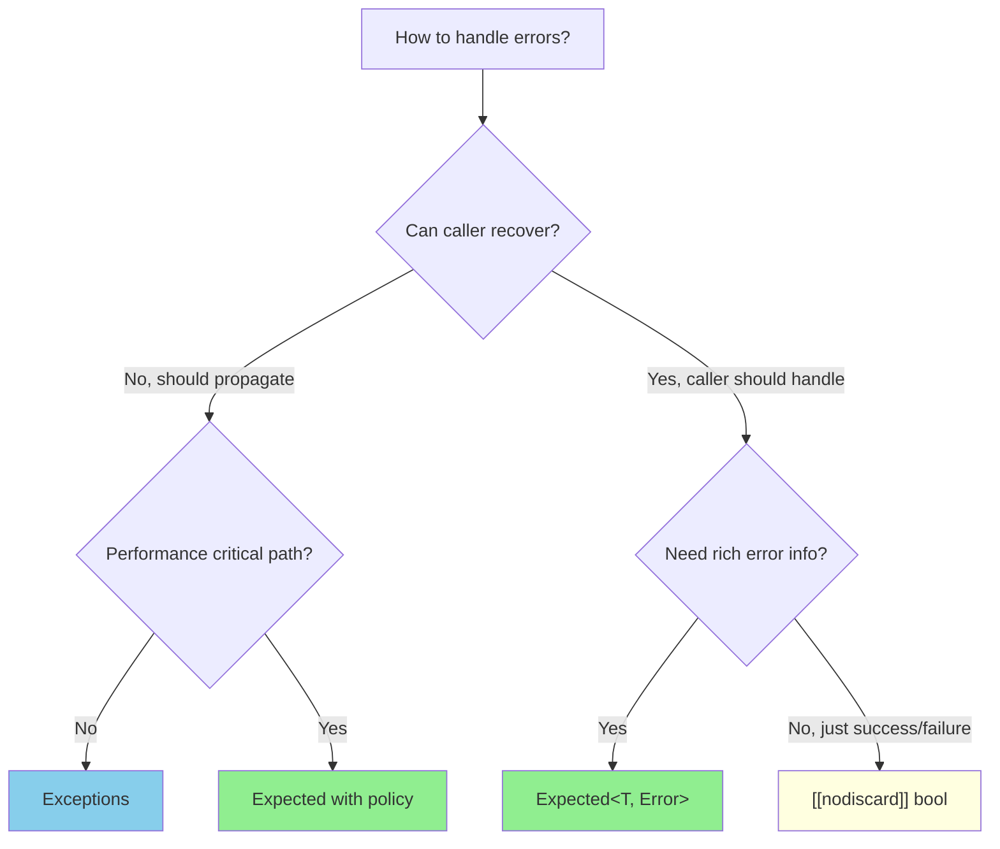

# Problem-Solving Session 7: The Ignored Error

## [[nodiscard]] and Expected<T, E>

**Estimated time:** 45–60 minutes  
**Prerequisites:** Function return values, basic error handling concepts  
**Fat-P components:** Expected

---

## Guarantee Legend

| Mark | Meaning |
|------|---------|
| ✅ **Compile-time** | `[[nodiscard]]` generates warning/error when return value is discarded. |
| ⚠ **Runtime** | `Expected` access methods check state at runtime. |

---

## The Bug

The document management system has been "working fine" for months. Then users report that their documents are disappearing.

After hours of debugging, you find this code that passed code review:

```cpp
class Document {
public:
    bool save(const std::string& path) {
        std::ofstream file(path);
        if (!file) {
            return false;  // Could not open file
        }
        
        file << serialize();
        
        if (!file.good()) {
            return false;  // Write failed
        }
        
        return true;
    }
    
    bool load(const std::string& path) {
        std::ifstream file(path);
        if (!file) return false;
        // ... load content ...
        return true;
    }
};

void auto_save_thread(Document& doc) {
    while (running) {
        std::this_thread::sleep_for(std::chrono::minutes(5));
        doc.save("/tmp/autosave.dat");  // Return value IGNORED!
        log("Auto-save complete");       // This is a lie
    }
}

void user_save_handler(Document& doc, const std::string& path) {
    doc.save(path);  // Return value IGNORED!
    show_notification("Document saved!");  // Also a lie
}
```

**The bugs:**

1. `save()` returns `false` on failure, but callers ignore it
2. Users see "Document saved!" even when the save failed
3. Auto-save logs success even when the disk is full
4. The document is lost because users believe it was saved
5. The compiler sees nothing wrong with ignoring return values

The disk was nearly full. `save()` was failing, returning `false`. Nobody checked. Users lost work.

---

## Questions to Consider

Before reading further, think about:

1. **Q1:** Why does C++ allow ignoring return values by default?
2. **Q2:** How does `[[nodiscard]]` change this?
3. **Q3:** When should you use `[[nodiscard]]`?
4. **Q4:** What's the difference between error codes, exceptions, and `Expected`?
5. **Q5:** How does `Expected` compose for multiple fallible operations?

---

## Q1: Why C++ Allows Ignoring Return Values

C++ inherits from C, where ignoring return values is common and often intentional:

```c
printf("Hello, world!\n");  // Returns number of chars printed—almost always ignored
fclose(file);               // Returns 0 on success—often ignored
memcpy(dst, src, n);        // Returns dst—always ignored
```

Making it an error to ignore return values would break virtually all C code. So C++ allows it by default.

**The problem:** Functions where ignoring the return value is always a bug look the same as functions where ignoring it is fine:

```cpp
int printf(const char* fmt, ...);   // Ignoring is fine
bool save(const std::string& path); // Ignoring is a bug

// The compiler can't tell the difference
printf("hello");  // OK
doc.save(path);   // Also "OK" according to the compiler
```

The type system treats both as "function returning something." It has no concept of "this return value is important."

---

## Q2: [[nodiscard]] to the Rescue

C++17 introduced `[[nodiscard]]` to mark return values that should not be ignored:

```cpp
class Document {
public:
    [[nodiscard]] bool save(const std::string& path) {
        // ... save logic ...
        return success;
    }
};

void broken_save(Document& doc) {
    doc.save("file.dat");  
    // Warning: ignoring return value of function declared with 'nodiscard' attribute
}
```

With `-Werror` (treat warnings as errors), this becomes a compile error. The bug is caught before the code runs.

**C++20 enhancement: reasons**

```cpp
[[nodiscard("save() returns false on disk full, permission denied, or I/O error")]]
bool save(const std::string& path);

// Warning now includes the reason:
// warning: ignoring return value of 'save', declared with attribute
// 'nodiscard': save() returns false on disk full, permission denied, or I/O error
```

**Explicitly suppressing the warning:**

Sometimes you genuinely want to ignore a nodiscard return value. Make it explicit:

```cpp
// Option 1: Cast to void
(void)doc.save("optional_backup.dat");

// Option 2: [[maybe_unused]] (C++17)
[[maybe_unused]] bool result = doc.save("backup.dat");

// Option 3: std::ignore (for structured bindings)
std::ignore = doc.save("backup.dat");
```

The explicit suppression documents intent: "Yes, I know this might fail. I'm intentionally not handling it."

---

## Q3: When to Use [[nodiscard]]

### Always Use [[nodiscard]] For:

**Error indicators:**

```cpp
[[nodiscard]] bool try_connect();
[[nodiscard]] int validate(const Data& data);  // 0 = success, else error code
[[nodiscard]] std::error_code write(const Buffer& buf);
```

Ignoring an error indicator is always a bug.

**Factory functions:**

```cpp
[[nodiscard]] std::unique_ptr<Widget> create_widget();
[[nodiscard]] Connection* open_connection();  // Caller must manage
```

Ignoring the return value causes a resource leak.

**Computed values:**

```cpp
[[nodiscard]] double calculate_checksum(const Data& data);
[[nodiscard]] std::string format_message(const Args&... args);
[[nodiscard]] bool is_empty() const;
```

The function exists to compute something. Ignoring the result means the call was pointless.

**Ownership transfers:**

```cpp
class UniqueHandle {
public:
    [[nodiscard]] int release();  // Caller now owns the resource
};
```

Ignoring ownership transfer causes a leak.

### Don't Use [[nodiscard]] For:

**Chainable setters:**

```cpp
class Builder {
public:
    Builder& set_name(std::string name);  // Return enables chaining
    Builder& set_value(int value);
};

// Intended usage:
Builder().set_name("foo").set_value(42).build();

// Also valid:
Builder b;
b.set_name("foo");  // Return intentionally ignored
```

**Optional information:**

```cpp
size_t Container::erase(const Key& key);  // Returns count removed
// Often callers don't care how many were removed, just that they're gone
```

**Side-effect functions that happen to return something:**

```cpp
int printf(const char* fmt, ...);  // Primary purpose is printing, not returning count
```

### [[nodiscard]] on Types

You can apply `[[nodiscard]]` to a type, making all functions returning that type nodiscard:

```cpp
class [[nodiscard("Error codes must be checked")]] ErrorCode {
    int code_;
public:
    explicit ErrorCode(int code) : code_(code) {}
    bool ok() const { return code_ == 0; }
    int code() const { return code_; }
    std::string message() const;
};

ErrorCode do_something();  // Automatically [[nodiscard]]
ErrorCode do_other_thing(); // Also automatically [[nodiscard]]

do_something();  // Warning: ignoring ErrorCode
```

This is how FAT-P's `Expected` works—the type itself is `[[nodiscard]]`.

---

## Q4: Expected<T, E> — Errors as Values

`[[nodiscard]]` on `bool` helps, but `bool` carries limited information. Was it disk full? Permission denied? Network error? A `bool` can't say.

**Enter `Expected<T, E>`:** A value that is either a success (`T`) or an error (`E`).

```cpp
#include "Expected.h"
using namespace fat_p;

enum class SaveError {
    DiskFull,
    PermissionDenied,
    InvalidPath,
    IOError
};

Expected<void, SaveError> save(const std::string& path) {
    std::ofstream file(path);
    if (!file) {
        if (errno == EACCES) return unexpected(SaveError::PermissionDenied);
        if (errno == ENOSPC) return unexpected(SaveError::DiskFull);
        return unexpected(SaveError::IOError);
    }
    
    file << serialize();
    
    if (!file.good()) {
        return unexpected(SaveError::IOError);
    }
    
    return {};  // Success (void)
}
```

**Using Expected:**

```cpp
void user_save_handler(Document& doc, const std::string& path) {
    auto result = doc.save(path);
    
    if (result) {
        show_notification("Document saved!");
    } else {
        switch (result.error()) {
            case SaveError::DiskFull:
                show_error("Disk is full. Free some space and try again.");
                break;
            case SaveError::PermissionDenied:
                show_error("Permission denied. Check file permissions.");
                break;
            default:
                show_error("Could not save document.");
        }
    }
}
```

**Expected is [[nodiscard]]:**

```cpp
template<typename T, typename E>
class [[nodiscard("Expected<T,E> may contain an error that must be handled")]] 
Expected {
    // ...
};

doc.save(path);  // Warning: ignoring Expected<void, SaveError>
```

### Why Expected Over Exceptions?

| Aspect | Exceptions | Expected | Error Codes |
|--------|------------|----------|-------------|
| Can be ignored | No (propagates) | No ([[nodiscard]]) | Yes |
| Control flow | Non-local (jumps) | Local (explicit) | Local |
| Performance (success) | Zero cost | Zero cost | Zero cost |
| Performance (error) | Expensive (unwinding) | Cheap | Cheap |
| Async compatible | Problematic | Yes | Yes |
| Error type | Any | Template param | Usually int |
| Composition | try/catch | Monadic ops | Manual |

**When to use each:**



### Expected vs std::expected (C++23)

C++23 added `std::expected` to the standard library. FAT-P's `Expected` provides additional features:

| Feature | FAT-P Expected | std::expected (C++23) |
|---------|---------------|----------------------|
| Availability | C++17 | C++23 only |
| Monadic ops | ✅ `and_then`, `transform`, `or_else` | ✅ Same |
| `EXPECTED_TRY` macro | ✅ | ❌ |
| Policies | ✅ ThrowOnError, TerminateOnError | ❌ |
| `void` value | ✅ `Expected<void, E>` | ✅ `expected<void, E>` |

**Migration path:** FAT-P Expected's core API is compatible with std::expected. When you upgrade to C++23, you can switch with minimal changes.

---

## Q5: Composing Fallible Operations

Real code chains multiple operations that can fail:

```cpp
// Without Expected: error handling obscures logic
Result process_file(const std::string& path) {
    std::optional<File> file = open_file(path);
    if (!file) return Result::Error("Could not open file");
    
    std::optional<Data> data = parse(*file);
    if (!data) return Result::Error("Could not parse file");
    
    std::optional<Data> validated = validate(*data);
    if (!validated) return Result::Error("Validation failed");
    
    std::optional<Output> output = transform(*validated);
    if (!output) return Result::Error("Transform failed");
    
    return Result::Success(*output);
}
```

**With Expected's monadic operations:**

```cpp
Expected<Output, Error> process_file(const std::string& path) {
    return open_file(path)
        .and_then(parse)
        .and_then(validate)
        .and_then(transform);
}
```

### Monadic Operations Explained

**`transform` (map):** Transform the success value, pass through errors.

```cpp
Expected<int, Error> get_count();

Expected<std::string, Error> get_count_str() {
    return get_count()
        .transform([](int n) { return std::to_string(n); });
}
// If get_count() succeeds with 42, returns "42"
// If get_count() fails with error, returns that error unchanged
```

**`and_then` (flatMap):** Chain operations that themselves return Expected.

```cpp
Expected<User, Error> get_user(int id);
Expected<Profile, Error> get_profile(const User& user);
Expected<Avatar, Error> get_avatar(const Profile& profile);

Expected<Avatar, Error> get_user_avatar(int id) {
    return get_user(id)
        .and_then(get_profile)
        .and_then(get_avatar);
}
// Stops at first error, returns that error
// If all succeed, returns the final Avatar
```

**`or_else`:** Handle errors, possibly recovering.

```cpp
Expected<Config, Error> load_config(const std::string& path) {
    return read_config_file(path)
        .or_else([](const Error& e) -> Expected<Config, Error> {
            log_warning("Config not found, using defaults: " + e.message());
            return Config::defaults();  // Recover with defaults
        });
}
```

**`transform_error`:** Transform the error type.

```cpp
Expected<Data, LowLevelError> read_data();

Expected<Data, HighLevelError> read_data_wrapped() {
    return read_data()
        .transform_error([](const LowLevelError& e) {
            return HighLevelError::from(e);
        });
}
```

### EXPECTED_TRY Macro

For imperative code, `EXPECTED_TRY` reduces boilerplate:

```cpp
Expected<Output, Error> process_file(const std::string& path) {
    EXPECTED_TRY(file, open_file(path));        // Returns early if error
    EXPECTED_TRY(data, parse(file));            // Returns early if error
    EXPECTED_TRY(validated, validate(data));    // Returns early if error
    EXPECTED_TRY(output, transform(validated)); // Returns early if error
    return output;
}
```

**What `EXPECTED_TRY` expands to:**

```cpp
// EXPECTED_TRY(file, open_file(path));
// Expands to approximately:
auto _tmp_file = open_file(path);
if (!_tmp_file) {
    return unexpected(_tmp_file.error());
}
auto file = std::move(*_tmp_file);
```

This pattern is inspired by Rust's `?` operator and is being considered for standardization in C++.

---

## Complete Example: File Processing Pipeline

### Before: Ignored Errors and Unclear Flow

```cpp
class FileProcessor {
public:
    bool load(const std::string& path) {
        std::ifstream file(path);
        if (!file) return false;
        // ... load ...
        return true;
    }
    
    bool validate() {
        // ... validate ...
        return is_valid_;
    }
    
    bool process() {
        // ... process ...
        return success_;
    }
    
    bool save(const std::string& path) {
        std::ofstream file(path);
        if (!file) return false;
        // ... save ...
        return file.good();
    }
};

void run_pipeline(const std::string& input, const std::string& output) {
    FileProcessor proc;
    
    proc.load(input);    // Ignored!
    proc.validate();     // Ignored!
    proc.process();      // Ignored!
    proc.save(output);   // Ignored!
    
    std::cout << "Processing complete!\n";  // Maybe not...
}
```

### After: Explicit Error Handling

```cpp
enum class PipelineError {
    LoadFailed,
    InvalidFormat,
    ProcessingFailed,
    SaveFailed,
    DiskFull,
    PermissionDenied
};

std::string to_string(PipelineError e) {
    switch (e) {
        case PipelineError::LoadFailed: return "Failed to load file";
        case PipelineError::InvalidFormat: return "Invalid file format";
        case PipelineError::ProcessingFailed: return "Processing failed";
        case PipelineError::SaveFailed: return "Failed to save file";
        case PipelineError::DiskFull: return "Disk is full";
        case PipelineError::PermissionDenied: return "Permission denied";
    }
    return "Unknown error";
}

class FileProcessor {
public:
    [[nodiscard]] Expected<void, PipelineError> load(const std::string& path) {
        std::ifstream file(path);
        if (!file) return unexpected(PipelineError::LoadFailed);
        // ... load ...
        return {};
    }
    
    [[nodiscard]] Expected<void, PipelineError> validate() {
        if (!is_valid_) return unexpected(PipelineError::InvalidFormat);
        return {};
    }
    
    [[nodiscard]] Expected<ProcessedData, PipelineError> process() {
        // ... process ...
        if (!success_) return unexpected(PipelineError::ProcessingFailed);
        return processed_data_;
    }
    
    [[nodiscard]] Expected<void, PipelineError> save(
        const ProcessedData& data, 
        const std::string& path
    ) {
        std::ofstream file(path);
        if (!file) {
            if (errno == EACCES) return unexpected(PipelineError::PermissionDenied);
            if (errno == ENOSPC) return unexpected(PipelineError::DiskFull);
            return unexpected(PipelineError::SaveFailed);
        }
        // ... save ...
        if (!file.good()) return unexpected(PipelineError::SaveFailed);
        return {};
    }
};

Expected<void, PipelineError> run_pipeline(
    const std::string& input, 
    const std::string& output
) {
    FileProcessor proc;
    
    EXPECTED_TRY(_, proc.load(input));
    EXPECTED_TRY(_, proc.validate());
    EXPECTED_TRY(data, proc.process());
    EXPECTED_TRY(_, proc.save(data, output));
    
    return {};
}

// Or with monadic style:
Expected<void, PipelineError> run_pipeline_monadic(
    const std::string& input,
    const std::string& output
) {
    FileProcessor proc;
    
    return proc.load(input)
        .and_then([&](auto) { return proc.validate(); })
        .and_then([&](auto) { return proc.process(); })
        .and_then([&](const ProcessedData& data) { 
            return proc.save(data, output); 
        });
}

int main() {
    auto result = run_pipeline("input.dat", "output.dat");
    
    if (result) {
        std::cout << "Processing complete!\n";
        return 0;
    } else {
        std::cerr << "Error: " << to_string(result.error()) << "\n";
        return 1;
    }
}
```

---

## Policies: Customizing Error Behavior

FAT-P Expected supports policies for different error handling strategies:

```cpp
// Default: errors are values, must be explicitly handled
Expected<int, Error> result = fallible_operation();

// ThrowOnError: converts to exception-based flow
Expected<int, Error, ThrowOnErrorPolicy> result = fallible_operation();
// If error, throws when accessed without checking

// TerminateOnError: for "impossible" errors
Expected<int, Error, TerminateOnErrorPolicy> result = fallible_operation();
// If error, std::terminate() on unchecked access

// LogOnError: logs errors but continues
Expected<int, Error, LogOnErrorPolicy> result = fallible_operation();
// If error, logs warning when accessed without checking
```

**Use cases:**

| Policy | When to Use |
|--------|-------------|
| Default | Normal error handling, caller decides |
| ThrowOnError | Integrating with exception-based code |
| TerminateOnError | Errors that "can't happen" (checked at call site) |
| LogOnError | Non-critical errors in fire-and-forget code |

---

## Summary

| Problem | Solution |
|---------|----------|
| Return value silently ignored | Add `[[nodiscard]]` to function |
| All instances of type should be checked | Add `[[nodiscard]]` to type |
| Need to explicitly ignore | Use `(void)` cast or `[[maybe_unused]]` |
| Need rich error information | Use `Expected<T, E>` |
| Boilerplate for error propagation | Use `EXPECTED_TRY` macro |
| Chaining fallible operations | Use monadic ops: `and_then`, `transform` |

### Key Principles

1. **Mark error-returning functions `[[nodiscard]]`** — compilers will catch ignored errors.

2. **Prefer `Expected<T, E>` over error codes** — type system enforces handling, carries rich info.

3. **Use monadic operations for composition** — `and_then` chains fallible operations cleanly.

4. **`EXPECTED_TRY` for imperative style** — reduces boilerplate while preserving explicitness.

5. **Suppress warnings explicitly when intentional** — `(void)` documents "I know, I don't care."

### The Guideline in One Sentence

> If ignoring the return value is always a bug, mark it `[[nodiscard]]`.

---

## Exercises

1. **Audit for [[nodiscard]]:** Search your codebase for functions returning `bool`, `int`, or error types. Which should have `[[nodiscard]]`? Add it and see what warnings appear.

2. **Create a nodiscard type:** Define an `ErrorCode` class with `[[nodiscard]]` on the type. Create several functions returning it and verify the compiler warns on ignored returns.

3. **Convert to Expected:** Take a function that returns `bool` for success/failure and converts it to return `Expected<void, Error>`. Add at least three distinct error cases.

4. **Chain with and_then:** Take three functions that each return `Expected` and chain them with `and_then`. Compare the code to explicit if-checks.

5. **EXPECTED_TRY refactor:** Take a function with multiple early-return error checks and refactor it to use `EXPECTED_TRY`.

---

## Further Reading

**Standards:**
- [P0157R0](http://www.open-std.org/jtc1/sc22/wg21/docs/papers/2015/p0157r0.html) — [[nodiscard]] proposal
- [P0323R12](http://www.open-std.org/jtc1/sc22/wg21/docs/papers/2022/p0323r12.html) — std::expected proposal

**Guidelines:**
- [C++ Core Guidelines E.27](https://isocpp.github.io/CppCoreGuidelines/CppCoreGuidelines#e27-if-you-cant-throw-exceptions-use-error-codes-systematically) — Error codes systematically
- [C++ Core Guidelines F.47](https://isocpp.github.io/CppCoreGuidelines/CppCoreGuidelines#f47-return-t-from-assignment-operators) — Return T& from assignment

**Libraries:**
- [Boost.Outcome](https://www.boost.org/doc/libs/release/libs/outcome/) — Similar to Expected
- [tl::expected](https://github.com/TartanLlama/expected) — Header-only expected

**Related Sessions:**
- Session 2: Enum Exhaustiveness — Handling all error cases in switches
- Session 6: Non-Null References — Using types to prevent invalid states
