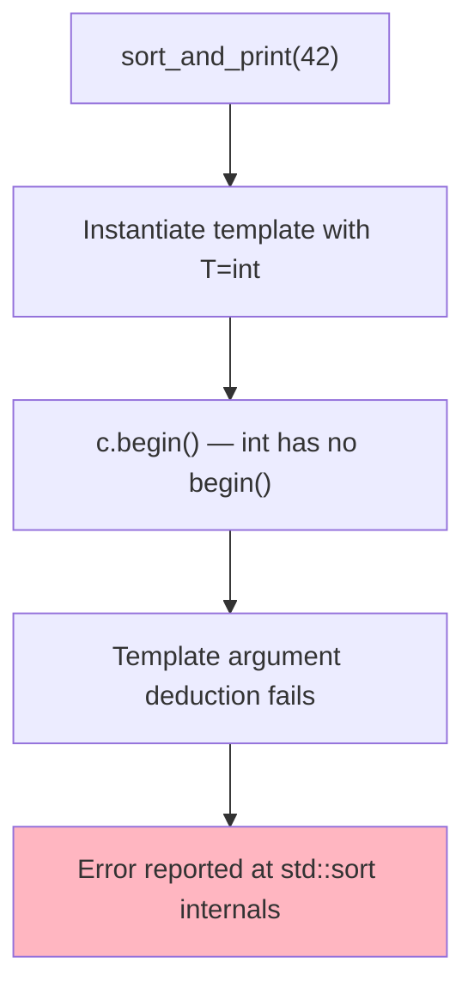

# Problem-Solving Session 8: The Incomprehensible Error

## Template Constraints with SFINAE and Concepts

**Estimated time:** 60–75 minutes  
**Prerequisites:** Templates basics, type traits awareness  
**Fat-P components:** FatPTypeTraits (optional)

---

## Guarantee Legend

| Mark | Meaning |
|------|---------|
| ✅ **Compile-time** | Invalid template instantiation rejected at the call site with clear message. |

---

## The Bug

You've written a generic sorting function:

```cpp
template<typename Container>
void sort_and_print(Container& c) {
    std::sort(c.begin(), c.end());
    for (const auto& elem : c) {
        std::cout << elem << "\n";
    }
}
```

A colleague tries to use it:

```cpp
int main() {
    std::vector<int> vec = {3, 1, 4, 1, 5};
    sort_and_print(vec);  // Works
    
    sort_and_print(42);   // What happens here?
}
```

**The error message (GCC):**

```
In file included from /usr/include/c++/11/algorithm:62,
                 from main.cpp:1:
/usr/include/c++/11/bits/stl_algo.h:1950:5: error: no matching function for call to
 '__sort(_Rb_tree_const_iterator<int>, _Rb_tree_const_iterator<int>,
  __gnu_cxx::__ops::_Iter_less_iter)'
 1950 |     std::__sort(__first, __last, __gnu_cxx::__ops::__iter_less_iter());
      |     ^~~~~~~~~~~
... 47 more lines of template instantiation backtrace ...
In file included from /usr/include/c++/11/bits/stl_algo.h:61,
                 from /usr/include/c++/11/algorithm:62,
                 from main.cpp:1:
/usr/include/c++/11/bits/stl_heap.h:355:18: error: no match for 'operator-'
... 23 more lines ...
```

**The problem:** The error is reported deep inside `std::sort`, not at the call site `sort_and_print(42)`. The actual mistake is that `int` is not a container—but you'd never guess that from 70+ lines of errors about `_Rb_tree_const_iterator` and `__gnu_cxx::__ops`.

---

## Questions to Consider

Before reading further, think about:

1. **Q1:** Why are template error messages so bad?
2. **Q2:** What is SFINAE and how does it help?
3. **Q3:** What are C++20 concepts and how do they improve on SFINAE?
4. **Q4:** How do you write custom type constraints?
5. **Q5:** How do you migrate from SFINAE to concepts?

---

## Q1: Why Template Errors Are So Bad

C++ templates use "duck typing" — if it compiles, it works:

```cpp
template<typename T>
void quack(T& thing) {
    thing.quack();  // Does T have a quack() method? We'll find out...
}
```

The compiler doesn't check `T` when parsing the template. It only checks when you **instantiate** it with a concrete type. And the check happens wherever the instantiation fails—which might be 10 levels deep in a library you didn't write.



The error is in `std::sort` because that's where the compiler first tries to call `begin()` on an `int`. But the **bug** is at the call site, where someone passed an `int` to a function expecting a container.

**The core problem:** Template parameters are unconstrained by default. `typename Container` accepts any type. The compiler only discovers the type is wrong when it fails to compile inside the template body.

---

## Q2: SFINAE — Substitution Failure Is Not An Error

SFINAE is a rule that makes constraint checking possible. When the compiler substitutes template arguments and something fails **in the immediate context**, that overload is silently removed from consideration—not a hard error.

```cpp
template<typename T>
typename T::value_type get_first(const T& container) {
    return *container.begin();
}

get_first(42);  // int has no ::value_type
                // SFINAE removes this overload
                // No other overload → "no matching function" error
```

The error is now at the call site: "no matching function for call to `get_first(int)`." Much better than 70 lines from inside `std::sort`.

### std::enable_if — The SFINAE Tool

`std::enable_if` creates a type that exists only when a condition is true:

```cpp
#include <type_traits>

// This function only exists when T is integral
template<typename T>
std::enable_if_t<std::is_integral_v<T>, T>
safe_add(T a, T b) {
    // overflow checking...
    return a + b;
}

safe_add(1, 2);      // OK: int is integral
safe_add(1.0, 2.0);  // Error: no matching function call to 'safe_add(double, double)'
                     // note: candidate template ignored: requirement 
                     //       'std::is_integral_v<double>' was not satisfied
```

The error is clear: `double` is not integral.

### Common SFINAE Patterns

**Pattern 1: Return type SFINAE**

```cpp
template<typename T>
std::enable_if_t<std::is_integral_v<T>, T>
process(T value) {
    return value * 2;
}
```

**Pattern 2: Template parameter SFINAE**

```cpp
template<typename T, 
         std::enable_if_t<std::is_integral_v<T>, int> = 0>
void process(T value) {
    // ...
}
```

This pattern allows multiple constrained overloads.

**Pattern 3: Detection idiom with void_t**

```cpp
// Primary template: T does not have size()
template<typename T, typename = void>
struct has_size : std::false_type {};

// Specialization: T has size()
template<typename T>
struct has_size<T, std::void_t<decltype(std::declval<T>().size())>> 
    : std::true_type {};

// Usage
static_assert(has_size<std::vector<int>>::value);  // true
static_assert(!has_size<int>::value);              // true
```

**Applying to our sorting function:**

```cpp
#include <type_traits>
#include <iterator>

// Check if T is a container (has begin, end, and value_type)
template<typename T, typename = void>
struct is_container : std::false_type {};

template<typename T>
struct is_container<T, std::void_t<
    typename T::value_type,
    decltype(std::declval<T>().begin()),
    decltype(std::declval<T>().end())
>> : std::true_type {};

template<typename T>
constexpr bool is_container_v = is_container<T>::value;

// Constrained sort_and_print
template<typename Container,
         std::enable_if_t<is_container_v<Container>, int> = 0>
void sort_and_print(Container& c) {
    std::sort(c.begin(), c.end());
    for (const auto& elem : c) {
        std::cout << elem << "\n";
    }
}

// Now:
sort_and_print(42);  // Error: no matching function for call to 'sort_and_print(int)'
                     // note: candidate template ignored: requirement 
                     //       'is_container_v<int>' was not satisfied
```

One-line error, at the call site, explaining why.

---

## Q3: C++20 Concepts — SFINAE Made Readable

SFINAE works, but the syntax is arcane. C++20 concepts provide the same functionality with cleaner syntax:

```cpp
#include <concepts>
#include <ranges>

template<typename T>
concept Container = requires(T& t) {
    typename T::value_type;
    { t.begin() } -> std::input_or_output_iterator;
    { t.end() } -> std::input_or_output_iterator;
};

template<Container C>
void sort_and_print(C& c) {
    std::sort(c.begin(), c.end());
    for (const auto& elem : c) {
        std::cout << elem << "\n";
    }
}

sort_and_print(42);  // Error: constraints not satisfied
                     // note: because 'int' does not satisfy 'Container'
                     // note: because 'int' does not have a nested type named 'value_type'
```

**The error message is:**
1. At the call site
2. Explains the constraint name (`Container`)
3. Explains why it failed (`int` has no `value_type`)

### Defining Concepts

**Simple concepts from type traits:**

```cpp
template<typename T>
concept Integral = std::is_integral_v<T>;

template<typename T>
concept FloatingPoint = std::is_floating_point_v<T>;

template<typename T>
concept Number = Integral<T> || FloatingPoint<T>;
```

**Concepts with requirements:**

```cpp
template<typename T>
concept Hashable = requires(T t) {
    { std::hash<T>{}(t) } -> std::convertible_to<std::size_t>;
};

template<typename T>
concept Printable = requires(std::ostream& os, T t) {
    { os << t } -> std::same_as<std::ostream&>;
};
```

**Compound requirements:**

```cpp
template<typename T>
concept Sortable = requires(T& t) {
    // Must have begin() and end()
    { t.begin() } -> std::input_or_output_iterator;
    { t.end() } -> std::input_or_output_iterator;
    
    // Elements must be comparable
    { *t.begin() < *t.begin() } -> std::convertible_to<bool>;
};

template<typename T>
concept Serializable = requires(T t, std::ostream& os, std::istream& is) {
    { t.serialize(os) } -> std::same_as<void>;
    { T::deserialize(is) } -> std::same_as<T>;
};
```

### Using Concepts

**In template parameter:**

```cpp
template<Integral T>
T safe_add(T a, T b);
```

**With requires clause:**

```cpp
template<typename T>
    requires Integral<T>
T safe_add(T a, T b);
```

**Trailing requires:**

```cpp
template<typename T>
T safe_add(T a, T b) requires Integral<T>;
```

**Abbreviated function template:**

```cpp
void process(Integral auto value);
// Equivalent to:
template<Integral T>
void process(T value);
```

### Standard Library Concepts (C++20)

```cpp
#include <concepts>

// Core concepts
std::same_as<T, U>           // T and U are the same type
std::derived_from<T, U>      // T is derived from U
std::convertible_to<T, U>    // T is convertible to U
std::integral<T>             // T is an integral type
std::floating_point<T>       // T is a floating-point type

// Comparison concepts
std::equality_comparable<T>   // T supports ==
std::totally_ordered<T>       // T supports <, >, <=, >=

// Object concepts
std::movable<T>              // T is movable
std::copyable<T>             // T is copyable
std::regular<T>              // T is default constructible, copyable, equality comparable

// Callable concepts
std::invocable<F, Args...>   // F can be called with Args
std::predicate<F, Args...>   // F returns bool when called with Args

#include <ranges>

// Iterator concepts
std::input_iterator<I>
std::output_iterator<I, T>
std::forward_iterator<I>
std::bidirectional_iterator<I>
std::random_access_iterator<I>

// Range concepts
std::ranges::range<R>
std::ranges::sized_range<R>
std::ranges::forward_range<R>
```

### Error Message Comparison

**Without constraints:**

```
/usr/include/c++/11/bits/stl_algo.h:1950:5: error: no matching function 
for call to '__sort(_Rb_tree_const_iterator<int>...'
... 70 lines of template backtrace ...
```

**With SFINAE:**

```
error: no matching function for call to 'sort_and_print(int)'
note: candidate template ignored: requirement 'is_container_v<int>' was not satisfied
```

**With concepts:**

```
error: no matching function for call to 'sort_and_print(int)'
note: constraints not satisfied
note: because 'int' does not satisfy 'Container'
note: because 'int' does not have a nested type named 'value_type'
```

Concepts give the best errors: they name the concept and explain exactly why it wasn't satisfied.

---

## Q4: Writing Custom Type Constraints

### Type Traits: Building Blocks

Type traits are compile-time predicates about types:

```cpp
#include <type_traits>

// Built-in traits
std::is_integral_v<int>           // true
std::is_pointer_v<int*>           // true
std::is_const_v<const int>        // true
std::is_same_v<int, int>          // true
std::is_base_of_v<Base, Derived>  // true if Derived inherits from Base

// Transformation traits
std::remove_const_t<const int>    // int
std::remove_reference_t<int&>     // int
std::decay_t<const int&>          // int
std::add_pointer_t<int>           // int*
```

### Custom Trait: has_member

```cpp
// Check if T has a method size() returning something convertible to size_t
template<typename T, typename = void>
struct has_size : std::false_type {};

template<typename T>
struct has_size<T, std::void_t<
    decltype(std::declval<T>().size())
>> : std::enable_if_t<
    std::is_convertible_v<decltype(std::declval<T>().size()), std::size_t>,
    void
> {};

template<typename T>
constexpr bool has_size_v = has_size<T>::value;

// C++20 concept equivalent:
template<typename T>
concept HasSize = requires(T t) {
    { t.size() } -> std::convertible_to<std::size_t>;
};
```

### Custom Trait: is_iterator

```cpp
// C++17 SFINAE version
template<typename T, typename = void>
struct is_iterator : std::false_type {};

template<typename T>
struct is_iterator<T, std::void_t<
    typename std::iterator_traits<T>::value_type,
    typename std::iterator_traits<T>::iterator_category,
    decltype(*std::declval<T>()),
    decltype(++std::declval<T&>())
>> : std::true_type {};

template<typename T>
constexpr bool is_iterator_v = is_iterator<T>::value;

// C++20 concept version:
template<typename T>
concept Iterator = requires(T it) {
    typename std::iterator_traits<T>::value_type;
    { *it };
    { ++it } -> std::same_as<T&>;
};
```

### Combining Constraints

```cpp
// C++17: Combining with &&
template<typename T,
         std::enable_if_t<
             std::is_integral_v<T> && sizeof(T) >= 4, int> = 0>
T safe_multiply(T a, T b);

// C++20: Combining concepts
template<typename T>
concept LargeIntegral = std::integral<T> && sizeof(T) >= 4;

template<LargeIntegral T>
T safe_multiply(T a, T b);
```

### Concept Subsumption (Overload Resolution)

When multiple constrained overloads match, the compiler chooses the most constrained:

```cpp
template<typename T>
concept Drawable = requires(T t) { t.draw(); };

template<typename T>
concept ColoredDrawable = Drawable<T> && requires(T t) { t.color(); };

// Less constrained
template<Drawable T>
void render(T& obj) {
    obj.draw();
}

// More constrained — ColoredDrawable subsumes Drawable
template<ColoredDrawable T>
void render(T& obj) {
    set_color(obj.color());
    obj.draw();
}

struct Circle {
    void draw();
};

struct ColoredCircle {
    void draw();
    Color color();
};

render(circle);         // Calls first overload
render(colored_circle); // Calls second overload (more constrained)
```

---

## Q5: Migration from SFINAE to Concepts

### Basic Pattern Translation

**Enable_if in return type → Concept constraint:**

```cpp
// SFINAE (C++17)
template<typename T>
std::enable_if_t<std::is_integral_v<T>, T>
twice(T value) {
    return value * 2;
}

// Concept (C++20)
template<std::integral T>
T twice(T value) {
    return value * 2;
}
```

**Enable_if as template parameter → Requires clause:**

```cpp
// SFINAE (C++17)
template<typename T, 
         std::enable_if_t<std::is_integral_v<T>, int> = 0>
void process(T value);

// Concept (C++20)
template<typename T>
    requires std::integral<T>
void process(T value);
```

**Detection idiom → Concept requires expression:**

```cpp
// SFINAE (C++17)
template<typename T, typename = void>
struct has_push_back : std::false_type {};

template<typename T>
struct has_push_back<T, std::void_t<
    decltype(std::declval<T>().push_back(std::declval<typename T::value_type>()))
>> : std::true_type {};

// Concept (C++20)
template<typename T>
concept HasPushBack = requires(T t, typename T::value_type v) {
    t.push_back(v);
};
```

### Maintaining C++17 Compatibility

If you need to support both C++17 and C++20:

```cpp
#if __cplusplus >= 202002L
    // C++20: Use concepts
    template<typename T>
    concept Integral = std::is_integral_v<T>;
    
    #define FATP_REQUIRES(Concept, Type) Concept<Type>
#else
    // C++17: Use type traits
    template<typename T>
    constexpr bool Integral_v = std::is_integral_v<T>;
    
    #define FATP_REQUIRES(Concept, Type) \
        std::enable_if_t<Concept##_v<Type>, int> = 0
#endif

// Usage works in both:
template<typename T, FATP_REQUIRES(Integral, T)>
T safe_add(T a, T b);
```

### When to Stay on SFINAE

- **C++17 codebase** that can't upgrade to C++20 yet
- **Header-only library** that needs to support older compilers
- **Macro-heavy metaprogramming** that's hard to convert

### Gradual Migration Strategy

1. **Add concepts alongside SFINAE** — don't remove SFINAE yet
2. **Use concepts in new code** — stop writing new SFINAE
3. **Convert file-by-file** — migrate as you touch code
4. **Remove SFINAE** once C++20 is your minimum standard

---

## Complete Example: A Constrained Container Algorithm

### Without Constraints (Bad Error Messages)

```cpp
template<typename InputIt, typename OutputIt, typename Pred>
OutputIt filter_copy(InputIt first, InputIt last, OutputIt out, Pred pred) {
    while (first != last) {
        if (pred(*first)) {
            *out++ = *first;
        }
        ++first;
    }
    return out;
}

// Usage error:
filter_copy(42, 100, nullptr, [](int x) { return x > 0; });
// Error: 50+ lines from inside the function about 'int' not having operator++
```

### With SFINAE (C++17)

```cpp
template<typename It, typename = void>
struct is_input_iterator : std::false_type {};

template<typename It>
struct is_input_iterator<It, std::void_t<
    typename std::iterator_traits<It>::value_type,
    typename std::iterator_traits<It>::iterator_category,
    decltype(*std::declval<It>()),
    decltype(++std::declval<It&>())
>> : std::enable_if_t<
    std::is_base_of_v<std::input_iterator_tag, 
                      typename std::iterator_traits<It>::iterator_category>,
    void
> {};

template<typename It>
struct is_output_iterator : std::bool_constant<
    std::is_same_v<
        typename std::iterator_traits<It>::iterator_category,
        std::output_iterator_tag
    > || is_input_iterator<It>::value  // Input iterators are also output
> {};

template<typename InputIt, typename OutputIt, typename Pred,
         std::enable_if_t<
             is_input_iterator<InputIt>::value &&
             is_output_iterator<OutputIt>::value &&
             std::is_invocable_r_v<bool, Pred, 
                 typename std::iterator_traits<InputIt>::reference>,
             int> = 0>
OutputIt filter_copy(InputIt first, InputIt last, OutputIt out, Pred pred) {
    while (first != last) {
        if (pred(*first)) {
            *out++ = *first;
        }
        ++first;
    }
    return out;
}

// Usage error:
filter_copy(42, 100, nullptr, [](int x) { return x > 0; });
// Error: no matching function for call to 'filter_copy(int, int, std::nullptr_t, ...)'
// note: candidate template ignored: requirement 'is_input_iterator<int>::value' 
//       was not satisfied
```

### With Concepts (C++20)

```cpp
#include <concepts>
#include <iterator>

template<typename F, typename T>
concept PredicateFor = std::predicate<F, T>;

template<std::input_iterator InputIt, 
         std::output_iterator<std::iter_value_t<InputIt>> OutputIt,
         PredicateFor<std::iter_reference_t<InputIt>> Pred>
OutputIt filter_copy(InputIt first, InputIt last, OutputIt out, Pred pred) {
    while (first != last) {
        if (pred(*first)) {
            *out++ = *first;
        }
        ++first;
    }
    return out;
}

// Usage error:
filter_copy(42, 100, nullptr, [](int x) { return x > 0; });
// Error: no matching function for call to 'filter_copy'
// note: constraints not satisfied
// note: because 'int' does not satisfy 'input_iterator'
// note: because 'std::iter_value_t<int>' would be invalid
```

The concept error is clearest: `int` doesn't satisfy `input_iterator` because it doesn't have an `iter_value_t`.

---

## Summary

| Problem | SFINAE Solution (C++17) | Concepts Solution (C++20) |
|---------|------------------------|---------------------------|
| Reject wrong types | `std::enable_if_t<condition>` | `template<Concept T>` |
| Check for member | `std::void_t` detection idiom | `requires { t.member(); }` |
| Check return type | `decltype` + `std::is_same` | `{ expr } -> Concept` |
| Combine requirements | `&&` in enable_if | `&&` in concept or multiple requires |
| Error message quality | Moderate | Excellent |
| Code readability | Poor | Good |

### Key Principles

1. **Constrain at the interface** — reject wrong types at the call site, not deep inside.

2. **Concepts are self-documenting** — `template<Container C>` is clearer than `enable_if_t<is_container_v<T>>`.

3. **Prefer standard concepts** — `std::integral`, `std::ranges::range`, etc. are well-tested.

4. **Concepts compose** — build complex requirements from simple concepts.

5. **Error messages matter** — the goal is helping the user fix their mistake quickly.

### The Guideline in One Sentence

> Constrain your templates so errors appear at the call site, not inside the implementation.

---

## Exercises

1. **SFINAE exercise:** Write a function `to_string_safe(T)` that calls `std::to_string` for arithmetic types and `.to_string()` method for other types that have it. Use SFINAE to dispatch.

2. **Concept exercise:** Convert your SFINAE solution to C++20 concepts.

3. **Custom concept:** Define a `Serializable` concept that requires `serialize(std::ostream&)` and `deserialize(std::istream&)`. Write a function constrained by it.

4. **Error messages:** Write a template function with no constraints, then add concepts. Compare the error messages when instantiated with wrong types.

5. **Subsumption:** Create two overloads of `render()` where one is more constrained than the other. Verify the compiler picks the right one.

---

## Further Reading

**Standards:**
- [P0734R0](http://www.open-std.org/jtc1/sc22/wg21/docs/papers/2017/p0734r0.pdf) — Concepts proposal
- [cppreference: Constraints and concepts](https://en.cppreference.com/w/cpp/language/constraints)

**Books:**
- "C++ Templates: The Complete Guide" (2nd Edition) — Vandevoorde, Josuttis, Gregor
- "C++20: The Complete Guide" — Nicolai Josuttis

**Guidelines:**
- [C++ Core Guidelines T.10](https://isocpp.github.io/CppCoreGuidelines/CppCoreGuidelines#t10-specify-concepts-for-all-template-arguments) — Specify concepts for all template arguments

**Related Sessions:**
- Session 1: Strong Typedefs — Type safety without templates
- Session 2: Enum Exhaustiveness — Another form of compile-time checking
