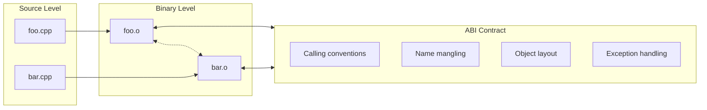
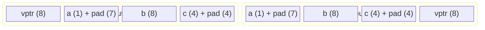
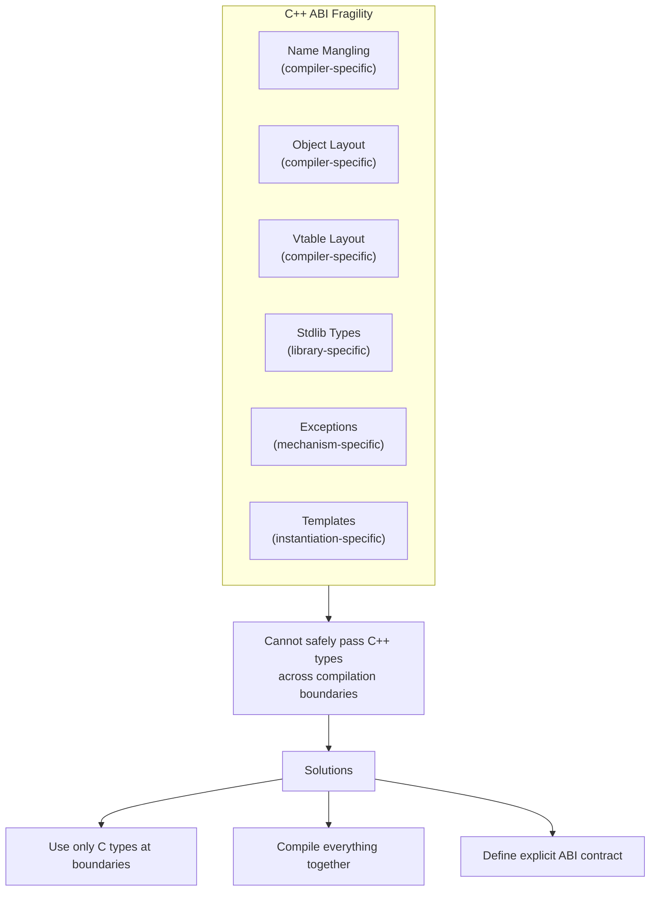
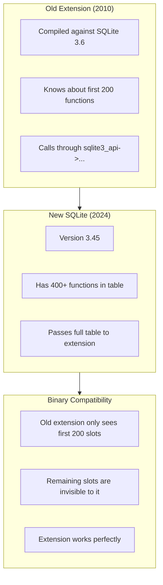
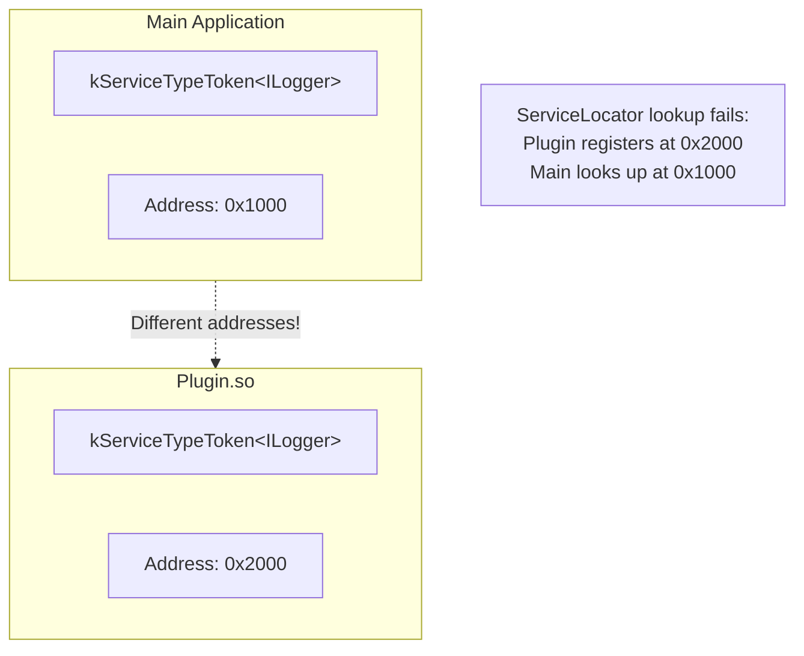
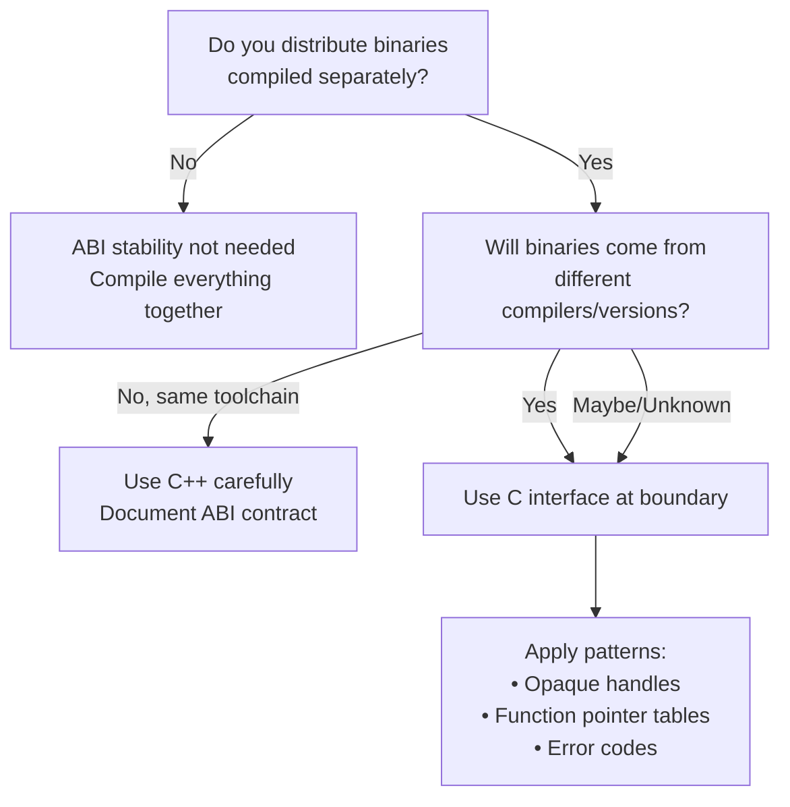

# Foundations - ABI Stability and Module Boundaries

### *Why Your Code Works Until You Upgrade the Compiler*

*FAT-P Library — January 2025*

---

**Scope:** This document explains Application Binary Interfaces (ABIs), why they matter for software longevity, and how to design systems that remain stable across compiler versions, library updates, and plugin boundaries. SQLite's extension system serves as the primary case study—a masterclass in ABI design that has maintained binary compatibility for over a decade.

**Audience:** Engineers building plugin systems, shared libraries, or any software that must interoperate at the binary level across compilation boundaries. Engineers who have encountered mysterious crashes when upgrading compilers or mixing binaries from different toolchains.

**Prerequisites:** This document assumes you understand:
- How C++ compilation works (preprocessing, compilation, linking)
- What object files and symbols are
- What static and shared libraries are
- Function pointer syntax and usage

If these concepts are unfamiliar, read **Foundations - The C++ Compilation Model** first.

---

# Why This Document Exists

You compile your application with GCC 11. A colleague compiles a plugin with GCC 13. When the plugin loads, it crashes. Or worse—it appears to work but silently corrupts memory.

You upgrade from Visual Studio 2019 to 2022. Your code compiles fine. At runtime, it crashes when calling a function in a library compiled with the old toolchain.

You load two shared libraries. Each was compiled against a different version of libstdc++. Sometimes `std::string` works. Sometimes it doesn't.

These are **ABI problems**. The Application Binary Interface—the contract between compiled code units—was violated. This document explains what ABI is, why C++ makes it hard to maintain, and how to design systems that avoid ABI problems entirely.

SQLite demonstrates the solution. Its extension system has maintained binary compatibility since 2006. Extensions compiled against SQLite 3.3 still load in SQLite 3.45. This is not accident—it's deliberate design. We'll study that design and extract patterns you can apply.

---

## Foundations Card

**Topic:** Binary compatibility between separately compiled code units  
**Why it matters:** ABI breaks cause crashes, corruption, and upgrade hell; stable ABIs enable plugin ecosystems  
**Key concepts:** Name mangling, vtable layout, calling conventions, opaque handles, function pointer tables  
**Mental model:** ABI is the "shape" of your code at the binary level; source compatibility ≠ binary compatibility  
**Common misconceptions:** "Same source = compatible binary"; "C++ classes are fine across DLL boundaries"; "Standard library types are safe to pass"  
**Prerequisites:** Foundations - The C++ Compilation Model  
**Read next:** User Manual - ServiceLocator (TypeKeyPolicy for DSO); Design Note - Plugin Architecture Patterns

---

## Table of Contents

1. [Part I: What Is ABI?](#part-i-what-is-abi)
2. [Part II: Why C++ ABI Is Fragile](#part-ii-why-c-abi-is-fragile)
3. [Part III: The C ABI — The Universal Contract](#part-iii-the-c-abi--the-universal-contract)
4. [Part IV: SQLite's Extension System — A Masterclass](#part-iv-sqlites-extension-system--a-masterclass)
5. [Part V: Patterns for ABI Stability](#part-v-patterns-for-abi-stability)
6. [Part VI: Fat-P and Module Boundaries](#part-vi-fat-p-and-module-boundaries)
7. [Part VII: Practical Guidelines](#part-vii-practical-guidelines)
8. [Glossary](#glossary)

---

# Part I: What Is ABI?

## The Compilation Boundary

When you write C++, you work with **source code**—classes, functions, templates. When you compile, the compiler transforms this into **object code**—machine instructions, data layouts, symbol tables.

The **Application Binary Interface (ABI)** defines how compiled code units interact:

- How functions are called (calling conventions)
- How parameters are passed (registers vs. stack, order)
- How return values are delivered
- How symbols are named (name mangling)
- How objects are laid out in memory (size, alignment, member offsets)
- How virtual functions are dispatched (vtable layout)
- How exceptions propagate across boundaries



When two object files agree on the ABI, they can link together and call each other's functions. When they disagree, you get linker errors ("undefined symbol") or—worse—runtime crashes.

## Source Compatibility vs. Binary Compatibility

These are different concepts:

**Source compatibility:** Code compiles without changes when headers are updated.

**Binary compatibility:** Code links and runs correctly when libraries are updated without recompilation.

A library can be source-compatible but not binary-compatible:

```cpp
// Version 1.0
class Widget {
    int mSize;        // Offset 0
public:
    int size() const;
};

// Version 1.1 - Source compatible but NOT binary compatible
class Widget {
    int mVersion;     // Offset 0 (NEW!)
    int mSize;        // Offset 4 (MOVED!)
public:
    int size() const;
};
```

Code compiled against v1.0 expects `mSize` at offset 0. Code compiled against v1.1 expects `mSize` at offset 4. If you mix binaries compiled against different versions, `size()` returns garbage.

## When ABI Matters

ABI stability matters when code crosses **compilation boundaries**:

| Scenario | ABI Matters? | Why |
|----------|-------------|-----|
| Monolithic application | No | Everything compiled together |
| Static libraries | Sometimes | Depends on header stability |
| Shared libraries / DLLs | Yes | Library can change independently |
| Plugins / Extensions | Yes | Compiled by different parties |
| System calls | Yes | Kernel ABI is fixed |
| Foreign function interfaces | Yes | Languages must agree |

If you compile everything together every time, ABI doesn't matter—the compiler ensures consistency. The moment you have separately compiled binaries that must interoperate, ABI becomes critical.

---

# Part II: Why C++ ABI Is Fragile

C++ is notoriously difficult for ABI stability. The language exposes implementation details that other languages hide. This section explains the specific problems.

## Problem 1: Name Mangling

C++ allows function overloading—multiple functions with the same name but different parameters:

```cpp
void process(int x);
void process(double x);
void process(const std::string& x);
```

The linker needs unique symbol names. C++ compilers **mangle** names to encode type information:

```
// GCC mangling (Itanium ABI)
_Z7processi          // process(int)
_Z7processd          // process(double)
_Z7processRKNSt7__cxx1112basic_stringIcSt11char_traitsIcESaIcEEE  // process(string)
```

Different compilers use different mangling schemes:

| Compiler | `process(int)` mangled as |
|----------|--------------------------|
| GCC / Clang (Itanium) | `_Z7processi` |
| MSVC | `?process@@YAXH@Z` |
| Old GCC (< 3.0) | `process__Fi` |

**Consequence:** Code compiled with GCC cannot link with code compiled with MSVC. Even different versions of the same compiler can have different mangling for complex types.

## Problem 2: Object Layout

C++ does not standardize object layout. The compiler is free to:

- Reorder members (within access specifier groups)
- Add padding for alignment
- Add hidden members (vptr, virtual base pointers)

```cpp
class Example {
    char a;      // 1 byte + 7 padding (maybe)
    double b;    // 8 bytes
    int c;       // 4 bytes + 4 padding (maybe)
    virtual void f();  // Hidden vptr (8 bytes, position varies)
};
```

Different compilers—or the same compiler with different flags—may produce different layouts:



**Consequence:** Passing a C++ object across a DLL boundary compiled with a different compiler is undefined behavior.

## Problem 3: Vtable Layout

Virtual functions are typically implemented via a **vtable**—a table of function pointers. The standard doesn't specify:

- Where the vptr is stored in the object
- How the vtable is laid out
- How multiple inheritance affects the layout
- How RTTI information is stored

```cpp
class Animal {
public:
    virtual void speak() = 0;
    virtual void move() = 0;
};

class Dog : public Animal {
public:
    void speak() override;  // Slot 0 or 1?
    void move() override;   // Slot 1 or 0?
};
```

If two compilers disagree on which slot holds `speak()`, calling `speak()` will actually call `move()`.

**Consequence:** Virtual functions cannot be called across compiler boundaries.

## Problem 4: Standard Library Types

The standard library is part of the implementation, not a fixed binary interface:

```cpp
// libstdc++ (GCC)
class string {
    char* _M_dataplus;
    size_t _M_string_length;
    union { char _M_local_buf[16]; size_t _M_allocated_capacity; };
};
// sizeof(string) == 32

// libc++ (Clang)  
class string {
    // Different layout entirely
};
// sizeof(string) == 24
```

Passing `std::string` across a boundary where one side uses libstdc++ and the other uses libc++ corrupts memory.

**Consequence:** Standard library types cannot cross compilation boundaries safely.

## Problem 5: Exception Handling

C++ exception handling requires runtime support:

- Stack unwinding mechanism
- RTTI for `catch` matching
- Exception object lifetime management

Different compilers implement exceptions differently:

| Mechanism | Compiler |
|-----------|----------|
| SJLJ (setjmp/longjmp) | Old GCC, some embedded |
| DWARF | Modern GCC/Clang on Unix |
| SEH | MSVC on Windows |
| ARM EHABI | ARM compilers |

**Consequence:** Throwing an exception in code compiled with one mechanism and catching it in code compiled with another is undefined behavior.

## Problem 6: Template Instantiation

Templates are instantiated at compile time. If two compilation units instantiate `std::vector<Widget>`, they might produce different code if:

- `Widget` has different layout
- Compiler optimizations differ
- Standard library version differs

**Consequence:** Template types cannot cross boundaries safely unless instantiation is controlled.

## The C++ ABI Problem Summary



---

# Part III: The C ABI — The Universal Contract

## Why C Survives

C has a stable ABI because the language is simple:

- No function overloading → no name mangling needed
- No classes → no object layout ambiguity
- No virtual functions → no vtables
- No exceptions → no unwinding mechanism
- No templates → no instantiation issues

Every platform defines a **C calling convention**. It specifies exactly how C functions are called:

| Platform | C Calling Convention |
|----------|---------------------|
| x86-64 Unix | System V AMD64 ABI |
| x86-64 Windows | Microsoft x64 |
| ARM64 | AAPCS64 |
| x86 Unix | cdecl |
| x86 Windows | cdecl, stdcall, fastcall |

When you declare a function with C linkage, the compiler uses this platform-specific convention:

```cpp
extern "C" int add(int a, int b);  // No mangling, standard calling convention
```

## The `extern "C"` Escape Hatch

C++ provides `extern "C"` to declare functions with C linkage:

```cpp
// In header
#ifdef __cplusplus
extern "C" {
#endif

int plugin_init(void* context);
int plugin_process(void* context, const char* input, char* output, size_t output_size);
void plugin_cleanup(void* context);

#ifdef __cplusplus
}
#endif
```

These functions:
- Use the platform C calling convention
- Have no name mangling
- Can be called from any language with a C FFI

**Limitation:** You can only pass C-compatible types:

| Safe to Pass | NOT Safe to Pass |
|-------------|-----------------|
| Integers, floats | `std::string` |
| Pointers | `std::vector` |
| C-style arrays | C++ classes |
| Plain structs (POD) | Classes with virtuals |
| Function pointers | `std::function` |
| Enums | `std::optional` |

## Opaque Handles

The classic pattern for hiding implementation behind a C interface:

```c
// Public header (C-compatible)
typedef struct sqlite3 sqlite3;  // Forward declaration only

int sqlite3_open(const char* filename, sqlite3** ppDb);
int sqlite3_close(sqlite3* db);
int sqlite3_exec(sqlite3* db, const char* sql, ...);
```

The caller never sees the struct definition. They receive an opaque pointer (handle) and pass it to functions. The implementation can change completely without breaking the ABI.

```c
// Private implementation (can change freely)
struct sqlite3 {
    // Version 3.0
    Btree* pBtree;
    int nDb;
    // ...
};

// Later version (ABI unchanged!)
struct sqlite3 {
    // Version 3.45 - completely different internals
    VFS* pVfs;
    Schema** aSchema;
    int nExtension;
    // ... dozens more fields
};
```

The handle is just a pointer. Its size never changes (always `sizeof(void*)`). The struct contents are invisible to callers.

---

# Part IV: SQLite's Extension System — A Masterclass

SQLite's extension mechanism has maintained binary compatibility since version 3.3.6 (2006). Extensions compiled nearly two decades ago still load in current SQLite. This section examines how.

## The Problem SQLite Solved

SQLite wanted to support loadable extensions—shared libraries that add functions, virtual tables, and other features. Requirements:

1. Extensions compiled against old SQLite versions must work with new SQLite
2. Extensions don't need to be recompiled when SQLite is upgraded
3. Extensions work across platforms
4. Extensions can be statically linked or dynamically loaded

## The Solution: Function Pointer Tables

Instead of having extensions call SQLite functions directly (which would require linking), SQLite passes a table of function pointers:

**Source:** [SQLite `src/sqlite3ext.h`](https://github.com/sqlite/sqlite/blob/master/src/sqlite3ext.h)

```c
/* [Excerpt from src/sqlite3ext.h] */
/*
** The following structure holds pointers to all of the SQLite API
** routines.
**
** WARNING:  In order to maintain backwards compatibility, add new
** interfaces to the end of this structure only.  If you insert new
** interfaces in the middle of this structure, then older different
** versions of SQLite will not be able to load each other's shared
** libraries!
*/
struct sqlite3_api_routines {
    void * (*aggregate_context)(sqlite3_context*,int nBytes);
    int  (*bind_blob)(sqlite3_stmt*,int,const void*,int n,void(*)(void*));
    int  (*bind_double)(sqlite3_stmt*,int,double);
    int  (*bind_int)(sqlite3_stmt*,int,int);
    int  (*bind_int64)(sqlite3_stmt*,int,sqlite_int64);
    int  (*bind_null)(sqlite3_stmt*,int);
    int  (*bind_parameter_count)(sqlite3_stmt*);
    int  (*bind_parameter_index)(sqlite3_stmt*,const char*zName);
    const char * (*bind_parameter_name)(sqlite3_stmt*,int);
    int  (*bind_text)(sqlite3_stmt*,int,const char*,int n,void(*)(void*));
    /* ... hundreds more function pointers ... */
    
    /* Version 3.10.0 additions at END of struct */
    int (*status64)(int,sqlite3_int64*,sqlite3_int64*,int);
    int (*strlike)(const char*,const char*,unsigned int);
    int (*db_cacheflush)(sqlite3*);
    
    /* Version 3.12.0 additions at END of struct */
    int (*system_errno)(sqlite3*);
    
    /* Version 3.14.0 additions at END of struct */
    int (*trace_v2)(sqlite3*,unsigned,int(*)(unsigned,void*,void*,void*),void*);
    char *(*expanded_sql)(sqlite3_stmt*);
    
    /* ... continues for each version ... */
};
```

This is the critical insight: **new functions are always added at the end**. An old extension sees a shorter struct; new functions are simply not in its view. A new extension sees the full struct; it can use new functions if the running SQLite version provides them.

## The Extension Entry Point

Extensions implement a single entry point:

```c
/* [Extension implementation pattern] */
#include "sqlite3ext.h"
SQLITE_EXTENSION_INIT1  /* Macro that declares sqlite3_api pointer */

#ifdef _WIN32
__declspec(dllexport)
#endif
int sqlite3_myext_init(
    sqlite3 *db,
    char **pzErrMsg,
    const sqlite3_api_routines *pApi  /* <-- The function pointer table */
){
    SQLITE_EXTENSION_INIT2(pApi);  /* Store the API pointer */
    
    /* Now extension can call SQLite through pApi */
    return pApi->create_function(db, "myfunc", 1, SQLITE_UTF8, 0,
                                  my_func_impl, 0, 0);
}
```

The macros `SQLITE_EXTENSION_INIT1` and `SQLITE_EXTENSION_INIT2` hide the mechanics:

```c
/* [Excerpt from src/sqlite3ext.h - simplified] */
#define SQLITE_EXTENSION_INIT1     const sqlite3_api_routines *sqlite3_api = 0;
#define SQLITE_EXTENSION_INIT2(v)  sqlite3_api = (v);
```

Extensions call SQLite functions through this global pointer:

```c
/* These are macros that redirect through sqlite3_api */
#define sqlite3_bind_int           sqlite3_api->bind_int
#define sqlite3_result_text        sqlite3_api->result_text
#define sqlite3_create_function    sqlite3_api->create_function
/* ... */
```

## Why This Works



The key properties:

1. **No direct linking:** Extensions don't link against SQLite symbols; they receive function pointers at runtime
2. **Append-only growth:** New functions added at end; existing offsets never change
3. **Opaque handles:** `sqlite3*`, `sqlite3_stmt*`, `sqlite3_context*` hide implementation
4. **C types only:** No C++ at the boundary
5. **No exceptions:** Error codes returned through `int`

## The Version Check Pattern

Extensions can check which functions are available:

```c
int sqlite3_myext_init(sqlite3 *db, char **pzErrMsg, 
                       const sqlite3_api_routines *pApi) {
    SQLITE_EXTENSION_INIT2(pApi);
    
    /* Check if a newer function exists (added in 3.20.0) */
    if (pApi->prepare_v3 == NULL) {
        *pzErrMsg = sqlite3_mprintf("Requires SQLite 3.20.0 or later");
        return SQLITE_ERROR;
    }
    
    /* Safe to use newer APIs */
    return SQLITE_OK;
}
```

This allows extensions to:
- Work with older SQLite versions (using only old functions)
- Require newer versions (checking for required functions)
- Gracefully degrade (using new functions when available)

## Static vs. Dynamic Linking

SQLite supports both with the same code:

```c
/* [Excerpt from src/sqlite3ext.h] */
#ifdef SQLITE_CORE
    /* Extension is statically linked into SQLite */
    #define SQLITE_EXTENSION_INIT1     /*no-op*/
    #define SQLITE_EXTENSION_INIT2(v)  (void)v; /* unused */
    /* Functions are called directly */
#else
    /* Extension is dynamically loaded */
    extern const sqlite3_api_routines *sqlite3_api;
    #define SQLITE_EXTENSION_INIT1     const sqlite3_api_routines *sqlite3_api = 0;
    #define SQLITE_EXTENSION_INIT2(v)  sqlite3_api = (v);
    /* Functions called through pointer table */
#endif
```

The same extension source compiles for either scenario.

---

# Part V: Patterns for ABI Stability

SQLite demonstrates several patterns that apply broadly. This section generalizes them.

## Pattern 1: The Opaque Handle

**Problem:** You want to hide implementation details while providing a stable interface.

**Solution:** Define a forward-declared struct and pass pointers to it.

```c
/* Public header */
typedef struct MyService MyService;

MyService* myservice_create(const char* config);
int myservice_process(MyService* svc, const void* input, size_t input_len,
                      void* output, size_t* output_len);
void myservice_destroy(MyService* svc);
```

```cpp
/* Private implementation (C++) */
struct MyService {
    std::unique_ptr<InternalEngine> mEngine;
    std::unordered_map<std::string, Processor> mProcessors;
    // Can use any C++ features internally
};

extern "C" MyService* myservice_create(const char* config) {
    try {
        return new MyService{parse_config(config)};
    } catch (...) {
        return nullptr;
    }
}
```

**Properties:**
- Pointer size is fixed (8 bytes on 64-bit)
- Internal layout can change freely
- Full C++ implementation behind C interface

## Pattern 2: The Function Pointer Table (Vtable in C)

**Problem:** You want polymorphism across ABI boundaries.

**Solution:** Explicit struct of function pointers.

```c
/* Public header */
typedef struct {
    void* context;
    int (*read)(void* ctx, void* buf, size_t len);
    int (*write)(void* ctx, const void* buf, size_t len);
    int (*close)(void* ctx);
} StreamOps;

int process_stream(const StreamOps* ops);
```

```cpp
/* C++ implementation */
class FileStream {
    FILE* mFile;
public:
    static int read_impl(void* ctx, void* buf, size_t len) {
        auto* self = static_cast<FileStream*>(ctx);
        return fread(buf, 1, len, self->mFile);
    }
    // ... write_impl, close_impl ...
    
    StreamOps as_ops() {
        return StreamOps{this, read_impl, write_impl, close_impl};
    }
};
```

**Properties:**
- Works like C++ virtual functions
- Layout is explicit and stable
- Works across any compiler

## Pattern 3: Append-Only Versioning

**Problem:** You need to add functions while maintaining compatibility.

**Solution:** Add new entries at the end; never remove or reorder.

```c
/* Version 1.0 */
struct ApiTable_v1 {
    int (*func_a)(int);
    int (*func_b)(const char*);
};

/* Version 1.1 - compatible */
struct ApiTable_v1_1 {
    int (*func_a)(int);
    int (*func_b)(const char*);
    int (*func_c)(double);     /* NEW - at end */
};

/* Version 2.0 - BREAKS COMPATIBILITY */
struct ApiTable_v2 {
    int (*func_a)(int);
    int (*func_c)(double);     /* MOVED - breaks old code! */
    int (*func_b)(const char*);
};
```

**Properties:**
- Old code sees shorter table; new entries invisible
- New code works with old provider (check for NULL)
- Never remove; deprecate instead

## Pattern 4: Context Pointers

**Problem:** Callbacks need access to user state.

**Solution:** Pass an opaque `void*` alongside function pointers.

```c
typedef int (*Callback)(void* user_data, int event_type, const void* event_data);

int register_callback(void* handle, Callback cb, void* user_data);
```

```cpp
/* C++ usage */
class MyHandler {
    int mCount = 0;
    
    static int callback_impl(void* ud, int type, const void* data) {
        auto* self = static_cast<MyHandler*>(ud);
        self->mCount++;
        return 0;
    }
    
public:
    void register_with(void* handle) {
        register_callback(handle, callback_impl, this);
    }
};
```

**Properties:**
- Type-erased state passing
- Any C++ object can be the context
- Must ensure lifetime correctness

## Pattern 5: Error Handling Without Exceptions

**Problem:** Exceptions don't cross ABI boundaries safely.

**Solution:** Return error codes; provide error message retrieval.

```c
typedef enum {
    SERVICE_OK = 0,
    SERVICE_ERROR_INVALID_PARAM = 1,
    SERVICE_ERROR_OUT_OF_MEMORY = 2,
    SERVICE_ERROR_IO = 3,
    /* ... */
} ServiceError;

ServiceError service_process(ServiceHandle h, ...);
const char* service_error_message(ServiceHandle h);  /* Get last error details */
```

```cpp
/* Implementation */
struct ServiceImpl {
    std::string mLastError;
    
    ServiceError process(...) {
        try {
            do_work();
            return SERVICE_OK;
        } catch (const std::bad_alloc&) {
            mLastError = "Memory allocation failed";
            return SERVICE_ERROR_OUT_OF_MEMORY;
        } catch (const std::exception& e) {
            mLastError = e.what();
            return SERVICE_ERROR_IO;
        }
    }
};

extern "C" const char* service_error_message(ServiceHandle h) {
    return reinterpret_cast<ServiceImpl*>(h)->mLastError.c_str();
}
```

**Properties:**
- Exceptions caught at boundary
- Error details retrievable
- Works across any compiler

## Pattern 6: Struct Versioning

**Problem:** Structs passed by value need versioning.

**Solution:** Size or version field as first member.

```c
typedef struct {
    size_t struct_size;  /* MUST be first */
    int option_a;
    int option_b;
    /* Version 1.1 additions */
    int option_c;
} ServiceConfig;

int service_configure(ServiceHandle h, const ServiceConfig* config) {
    /* Check what the caller provided */
    if (config->struct_size >= offsetof(ServiceConfig, option_c) + sizeof(int)) {
        /* Caller knows about option_c */
        use_option_c(config->option_c);
    } else {
        /* Old caller; use default for option_c */
        use_option_c(DEFAULT_OPTION_C);
    }
}
```

**Caller usage:**
```c
ServiceConfig config = {0};
config.struct_size = sizeof(config);
config.option_a = 1;
config.option_b = 2;
/* option_c may or may not exist in caller's version */
```

**Properties:**
- Caller declares its struct version via size
- New fields can be added at end
- Implementation handles old callers gracefully

---

# Part VI: Fat-P and Module Boundaries

## The ServiceLocator TypeKeyPolicy Problem

Fat-P's `ServiceLocator` uses type identity for service registration:

```cpp
// Default implementation
template <typename T>
inline constexpr unsigned char kServiceTypeToken = 0;

struct DefaultServiceTypeKeyPolicy {
    template <typename T>
    static const void* typeId() noexcept {
        return &kServiceTypeToken<T>;  // Address of variable
    }
};
```

This works within a single binary. **It fails across DSO boundaries** because each shared library has its own copy of template instantiations:



## Solution: Custom TypeKeyPolicy for DSO

For plugin architectures, implement a stable type key:

```cpp
// String-based type identity (DSO-safe)
struct StringTypeKeyPolicy {
    template <typename T>
    static const void* typeId() noexcept {
        // Use a static string that survives across DSO
        static const char* name = typeid(T).name();
        return name;  // Actually return the string pointer
    }
};

// Or: GUID-based for explicit control
struct GuidTypeKeyPolicy {
    template <typename T>
    static const void* typeId() noexcept;
};

// Explicit specializations in a shared header
template<>
inline const void* GuidTypeKeyPolicy::typeId<ILogger>() noexcept {
    static constexpr char guid[] = "550e8400-e29b-41d4-a716-446655440000";
    return guid;
}
```

## When to Use Which Policy

| Scenario | Recommended Policy |
|----------|-------------------|
| Single binary, no plugins | `DefaultServiceTypeKeyPolicy` |
| Plugins, same compiler/stdlib | `DefaultServiceTypeKeyPolicy` may work |
| Plugins, different compilers | `GuidTypeKeyPolicy` or string-based |
| Cross-language (C++/C#/Rust) | Explicit C interface, not ServiceLocator |

## Factory and Plugin Architecture

`Factory` has similar considerations. For cross-DSO factories:

1. Register factories through a C interface
2. Use string keys instead of type keys
3. Return opaque handles, not C++ types

```cpp
// C interface for plugin factory registration
extern "C" {
    typedef void* (*FactoryFunc)(const char* config);
    typedef void (*DestroyFunc)(void* instance);
    
    int register_factory(const char* type_name, FactoryFunc create, DestroyFunc destroy);
    void* create_instance(const char* type_name, const char* config);
    void destroy_instance(const char* type_name, void* instance);
}
```

---

# Part VII: Practical Guidelines

## Decision Tree: Do You Need ABI Stability?



## Checklist: Designing a Stable ABI

**At the boundary:**
- [ ] All functions use `extern "C"` linkage
- [ ] Only C-compatible types cross the boundary
- [ ] No `std::` types in public interface
- [ ] No C++ exceptions cross the boundary
- [ ] Structs use size/version field if passed by value

**For extensibility:**
- [ ] New functions added at end of tables
- [ ] Old functions never removed (only deprecated)
- [ ] NULL checks for optional new functions
- [ ] Version negotiation at initialization

**For implementation:**
- [ ] Full C++ allowed behind opaque handles
- [ ] Exceptions caught and converted to error codes
- [ ] Memory allocated by library is freed by library

## Common Mistakes

| Mistake | Symptom | Fix |
|---------|---------|-----|
| Passing `std::string` | Crash or corruption | Use `const char*` + length |
| Passing `std::vector` | Crash or corruption | Use pointer + count |
| Throwing across boundary | Crash (often delayed) | Catch and return error code |
| Inline functions in header | Works until library updates | Move to source file |
| Virtual functions at boundary | Wrong function called | Use function pointer table |
| Template types at boundary | Linker errors or corruption | Explicit instantiation in library |

## Testing ABI Stability

```bash
# 1. Compile library with old compiler
g++-9 -shared -fPIC -o libfoo.so.1 foo.cpp

# 2. Compile application with new compiler against old library
g++-13 -o app app.cpp -L. -lfoo

# 3. Run with old library
LD_LIBRARY_PATH=. ./app

# 4. Now swap to library compiled with new compiler
g++-13 -shared -fPIC -o libfoo.so.2 foo.cpp
cp libfoo.so.2 libfoo.so

# 5. Run again without recompiling app
LD_LIBRARY_PATH=. ./app
# If this works, ABI is stable
```

---

# Summary: The ABI Mindset

1. **Source compatibility ≠ Binary compatibility.** Code that compiles may crash when linked.

2. **C++ features have hidden binary costs.** Name mangling, vtables, exceptions, templates all create ABI dependencies.

3. **The C ABI is the universal contract.** Every platform defines it; every language can use it.

4. **Hide C++ behind C.** Use opaque handles, function pointer tables, and error codes at boundaries.

5. **Plan for evolution.** Append-only versioning, size fields, and NULL checks enable forward compatibility.

6. **SQLite proves it works.** Nearly two decades of binary compatibility through disciplined design.

When you design a plugin system or shared library interface, ask: "If someone compiles against version 1.0 today, will their binary still work with version 2.0 in five years?"

If the answer must be "yes," design for ABI stability from the start. Retrofitting it is nearly impossible.

---

# Glossary

**ABI (Application Binary Interface):** The binary-level contract defining how compiled code units interact—calling conventions, name mangling, object layout, exception handling.

**Calling convention:** The rules for how function parameters are passed (registers vs. stack), return values delivered, and stack cleaned up. Examples: cdecl, stdcall, System V AMD64.

**DSO (Dynamic Shared Object):** A shared library loaded at runtime (.so on Linux, .dll on Windows, .dylib on macOS).

**Function pointer table:** A struct containing function pointers, used to provide polymorphism across ABI boundaries. SQLite's `sqlite3_api_routines` is an example.

**Name mangling:** The encoding of function signatures into symbol names. C++ uses this for overloading; C does not mangle names.

**Opaque handle:** A pointer to a forward-declared struct whose definition is hidden from callers. Allows implementation changes without ABI breaks.

**POD (Plain Old Data):** Types compatible with C—no virtual functions, no non-trivial constructors/destructors, no private members.

**Symbol:** A named entity (function, variable) in object code. The linker resolves symbols to addresses.

**Vtable:** The table of function pointers used to implement C++ virtual functions. Layout is compiler-specific and not standardized.

---

*FAT-P Library Documentation — January 2025*
