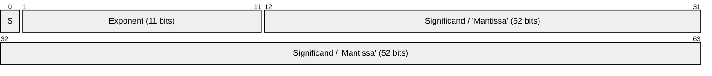
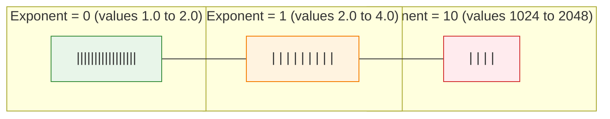
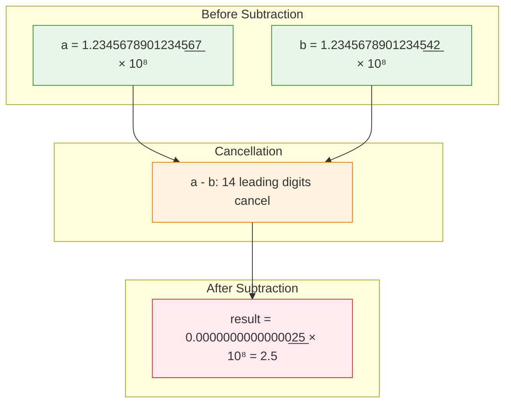
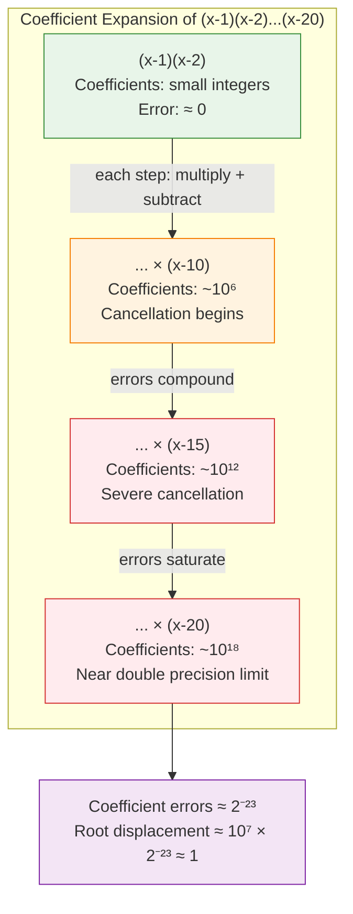
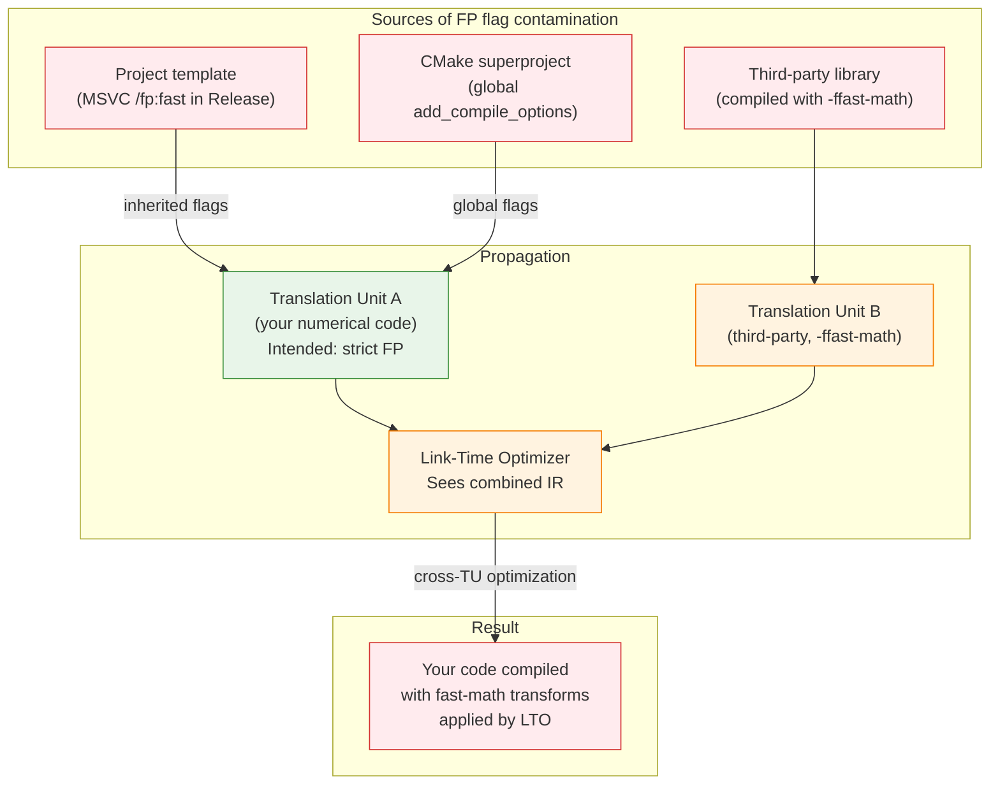
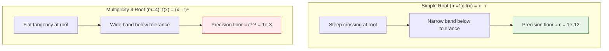
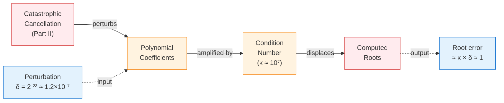

# Foundations - Floating-Point Arithmetic for Numerical Library Authors

### *What IEEE 754 Behavior Actually Does to Your Code*

*FAT-P Library — February 2026*

---

**Scope:** This document covers the specific floating-point phenomena that cause silent correctness bugs in production numerical code compiled with real compilers on real hardware. It explains IEEE 754 representation, the arithmetic operations that destroy precision, compiler flags that change numerical results, tolerance selection for root-finding and iterative methods, and how to write portable numerical tests. Every section earns its place by connecting to a real bug or a real design decision in numerical library code.

**Audience:** C++ developers writing or consuming numerical code. Numerical computing engineers. AI assistants working on numerical library components. Anyone who has seen a test pass on Linux and fail on macOS, or watched a root finder diverge on a polynomial with a known root.

**Not covered:**

- Arbitrary-precision arithmetic libraries
- A complete textbook treatment of IEEE 754 (Goldberg's "What Every Computer Scientist Should Know About Floating-Point Arithmetic" fills that role)
- Comparison of floating-point libraries
- GPU-specific floating-point behavior (different precision models, different defaults)
- Fixed-point arithmetic
- Interval arithmetic (mentioned briefly but not developed)

**Prerequisites:**

- Basic C++ syntax (functions, variables, arithmetic operators)
- Comfort reading hexadecimal notation
- Awareness that `0.1 + 0.2 != 0.3` in most languages (this document explains *why*)
- No prior knowledge of IEEE 754 assumed

---

## Foundations Card

**Topic:** IEEE 754 floating-point behavior as it affects numerical library correctness  
**Why it matters:** Silent precision loss, compiler-flag-induced regressions, and tolerance selection errors are the most common sources of bugs in numerical C++ code — and the hardest to diagnose because the code "looks right"  
**Key concepts:** IEEE 754 representation, ULP distance, catastrophic cancellation, absorption, FP non-associativity, compiler FP models, FMA contraction, tolerance floors for multiple roots, portable numerical testing  
**Mental model:** Every floating-point operation rounds its exact mathematical result to the nearest representable value; bugs come from not knowing *when* that rounding destroys the information you need  
**Common misconceptions:** "double gives you 15 digits of precision" (it gives you 15–17 *significant* digits, and catastrophic cancellation can reduce that to zero); "Debug and Release should give the same answers" (compiler flags change which roundings occur); "my tolerance of 1e-12 means I get 12 digits of accuracy" (for a root of multiplicity 4, you get 3)  
**Read next:** Case Study documents covering specific numerical regressions; Handbook - Performance Engineering Methodology

---

## Table of Contents

1. [Part I: Representation and Its Consequences](#part-i-representation-and-its-consequences)
2. [Part II: The Operations That Lie](#part-ii-the-operations-that-lie)
3. [Part III: Compiler Flags That Change Your Answers](#part-iii-compiler-flags-that-change-your-answers)
4. [Part IV: Tolerance Selection](#part-iv-tolerance-selection)
5. [Part V: Testing Numerical Code](#part-v-testing-numerical-code)
6. [Appendix A: Symptom → Cause → Fix Quick Reference](#appendix-a-symptom--cause--fix-quick-reference)
7. [Appendix B: Compiler Flag Cheat Sheet](#appendix-b-compiler-flag-cheat-sheet)
8. [Glossary](#glossary)
9. [Further Reading](#further-reading)

---

# Part I: Representation and Its Consequences

## The Bug That Starts Everything

Here is a program that computes the sum of ten million copies of 0.1, then checks whether the result equals one million:

```cpp
#include <cstdio>
#include <cmath>

int main() {
    double sum = 0.0;
    for (int i = 0; i < 10'000'000; ++i) {
        sum += 0.1;
    }
    std::printf("sum      = %.17g\n", sum);
    std::printf("expected = %.17g\n", 1'000'000.0);
    std::printf("equal?   = %s\n", (sum == 1'000'000.0) ? "yes" : "NO");
    return 0;
}
```

The sum is not one million. It is off by roughly 1.33, and the equality check fails. Most programmers know this happens — "floating-point is imprecise" — but few can explain *why* the error is 1.33 and not 0.001 or 1e-10. The answer requires understanding what a `double` actually stores, how rounding accumulates, and why some operations destroy information. This section builds that understanding.

## A Brief History of the Mess

Before 1985, floating-point arithmetic was chaos. Every hardware vendor — IBM, DEC, Cray, CDC — had its own format with different precision, different rounding rules, different handling of overflow and underflow, and different special values (or no special values at all). A program that produced correct results on a VAX could produce garbage on an IBM mainframe, and the programmer had no way to reason about it portably.

William Kahan, a mathematician at UC Berkeley, spent the late 1970s designing a standard that would make floating-point behavior identical across all conforming hardware. The result was IEEE 754, published in 1985 and revised in 2008 (IEEE 754-2008) and 2019 (IEEE 754-2019). Kahan received the Turing Award in 1989 for this work. The fact that `double` behaves identically on an Intel laptop, an ARM server, and a RISC-V microcontroller is not obvious — it is the direct result of this standardization effort.

IEEE 754 also left behind a legacy of confusing terminology, partly because it drew from two different traditions. Mathematicians working with logarithm tables since the 17th century used the word *mantissa* (Latin for "something added" or "makeweight") for the fractional part of a logarithm. Hardware engineers borrowed the term for the fractional part of a floating-point number. But the analogy is misleading: in a log table, the mantissa is always between 0 and 1 and is always positive; in IEEE 754, the corresponding field represents something different — it is the fractional part of a *significand* that has an implicit leading 1. The IEEE 754 standard officially uses *significand* and explicitly discourages *mantissa*, but almost every programmer, textbook, and debugger display says "mantissa" anyway. This document uses both terms — *significand* when precision matters, *mantissa* when referring to the bit field as programmers encounter it — and flags the distinction so you are not confused when you see them used differently elsewhere.

Similarly, what IEEE 754-1985 called *denormalized* numbers, IEEE 754-2008 renamed to *subnormal* numbers. The older term still appears in compiler documentation, hardware manuals, and Stack Overflow answers. And *machine epsilon* means the gap between 1.0 and the next representable value to some authors, and *half* that gap to others (because some define it as the maximum relative rounding error, which is ε/2). This document uses the "gap between 1.0 and the next value" definition, which is what `std::numeric_limits<double>::epsilon()` returns in C++.

The terminology is confusing because it evolved across decades and disciplines. The underlying ideas are not complicated — there are only a few of them, and they follow logically from a simple representation. Let's look at that representation.

## What a `double` Actually Is

An IEEE 754 double-precision floating-point number occupies 64 bits, divided into three fields:



The sign bit (S) is 0 for positive, 1 for negative. The exponent field stores a biased exponent (actual exponent + 1023). The 52-bit field stores the fractional part of the significand (what most programmers call the mantissa — see the terminology note above). For normal numbers, there is an implicit leading 1 bit that is not stored — so you actually get 53 bits of significand, not 52. The value represented is:

    (-1)^S × 1.significand × 2^(exponent - 1023)

The key consequence of this representation is that floating-point numbers are not evenly spaced on the number line. They are densely packed near zero and increasingly sparse as magnitude grows. Between 1.0 and 2.0, there are 2^52 representable values (about 4.5 × 10^15 of them). Between 2.0 and 4.0, there are also 2^52 representable values — but spread over twice the range, so each gap is twice as wide. Between 1024.0 and 2048.0, the gaps are 1024 times wider than between 1.0 and 2.0.



In each interval, there are exactly 2^52 representable values. But the intervals themselves double in width, so the gap between adjacent representable values doubles at each exponent boundary. This non-uniform spacing is the root cause of most floating-point surprises — including the summation bug above.

## Why the Summation Bug Happens: Epsilon and Relative Precision

The gap between 1.0 and the next representable double is called *machine epsilon* (ε). For double precision, ε = 2^−52 ≈ 2.22 × 10^−16. This number defines *relative* precision, not absolute precision — and that distinction matters enormously.

Near 1.0, the spacing between adjacent doubles is about 2.2 × 10^−16. Near 1.0 × 10^6 (which is where our running sum spends most of its time), the spacing is about 2.2 × 10^−10. Each time we add 0.1 to a sum near one million, the low-order bits of 0.1 fall below the precision of the sum and are lost. Over ten million iterations, those lost bits accumulate to an error of about 1.33.

The problem gets worse at larger magnitudes. Near 1.0 × 10^16, the spacing is about 2.0 — meaning you cannot represent consecutive integers:

```cpp
#include <cstdio>

int main() {
    double a = 1e16;
    double b = a + 1.0;
    std::printf("a     = %.1f\n", a);
    std::printf("b     = %.1f\n", b);
    std::printf("a==b? = %s\n", (a == b) ? "true" : "false");
    return 0;
}
```

This prints `a==b? = true`. The value 1.0 is smaller than the gap between adjacent representable doubles near 10^16, so adding it changes nothing. This is not a bug — it is the correct IEEE 754 behavior. The result of 1e16 + 1.0 is rounded to the nearest representable value, which is 1e16.

The practical rule: a double gives you about 15–17 significant *decimal* digits. "Significant" means measured from the most significant non-zero digit. The number 1234567890.123456 has 16 significant digits and is representable. The number 12345678901234567 has 17 significant digits and is not exactly representable — the last digit will be wrong.

## Measuring the Damage: ULP Distance

Knowing that rounding happens is not enough. You need to measure *how much* damage an operation caused. The standard metric is the ULP — Unit in the Last Place. One ULP is the distance between a floating-point number and its nearest neighbor. For a double x, 1 ULP is approximately |x| × ε.

ULP distance tells you how many representable values separate your computed result from the true answer. If a function returns a result that is 2 ULPs from the true answer, it has lost about 1 bit of precision from the best possible result. If it is 2^20 ULPs away, it has lost about 20 bits — and with only 52 mantissa bits to start with, that is significant. Two doubles that "look equal" when printed with default precision can differ by many ULPs, and two doubles that print identically can differ by one ULP if the difference is below the printing threshold.

You can compute ULP distance in C++ by exploiting a property of IEEE 754: for positive doubles, the bit pattern interpreted as a 64-bit integer increases monotonically with the floating-point value. Adjacent representable doubles have integer representations that differ by exactly 1. This means integer subtraction on the bit patterns gives you the exact ULP distance:

```cpp
#include <cmath>
#include <cstdio>
#include <cstdint>
#include <cstring>

double ulp_distance(double a, double b) {
    if (a == b) return 0.0;
    if (std::isnan(a) || std::isnan(b)) return INFINITY;

    // Reinterpret as integers — IEEE 754 doubles are ordered
    // as integers when both have the same sign
    std::int64_t ia, ib;
    std::memcpy(&ia, &a, sizeof(double));
    std::memcpy(&ib, &b, sizeof(double));

    // Handle different signs
    if ((ia < 0) != (ib < 0)) {
        // Distance from a to 0, plus distance from 0 to b
        std::int64_t za = 0;
        return static_cast<double>(std::abs(ia - za)) +
               static_cast<double>(std::abs(ib - za));
    }

    return static_cast<double>(std::abs(ia - ib));
}
```

## The Edges: Subnormals, Infinity, and NaN

The representation has three special regions that trip up code that doesn't account for them.

**Near zero: subnormals.** For very small numbers, the normal representation runs out of exponent range. When the biased exponent field is all zeros, the number enters the *subnormal* (or *denormalized* — the older term from IEEE 754-1985) regime: the implicit leading 1 disappears, and the value is (-1)^S × 0.significand × 2^(-1022). Subnormal numbers fill the gap between the smallest normal double (~2.2 × 10^−308) and zero. Without them, there would be an abrupt jump from the smallest representable positive number to zero, which would break the property that `a - b == 0` implies `a == b` (a property called "gradual underflow" that many numerical algorithms rely on). The cost is that relative precision degrades in the subnormal region — subnormal doubles can have as few as 1 bit of precision, compared to 52 for normal doubles. Most numerical library code never intentionally enters the subnormal range, but poorly scaled computations can drift there. Some compilers and hardware offer "flush to zero" (FTZ) modes that replace subnormal values with zero — this is faster but changes results.

**At the extremes: infinity.** Infinity results from overflow (1e308 * 2.0) or division by zero (1.0 / 0.0). It compares as you would expect (infinity > everything finite, -infinity < everything finite) and propagates through arithmetic in mostly sensible ways (infinity + 1 = infinity, 1/infinity = 0). But infinity can produce NaN: infinity - infinity = NaN, and infinity * 0 = NaN.

**The poison value: NaN.** NaN (Not-a-Number) results from mathematically undefined operations: 0.0/0.0, sqrt(-1.0), infinity - infinity. Three properties of NaN cause bugs in code that doesn't account for them. First, NaN is not equal to anything, including itself: `NaN != NaN` evaluates to true — use `std::isnan(x)`, not `x == x`, to test for it. Second, NaN is *unordered* with respect to all comparisons: `NaN < 5.0`, `NaN > 5.0`, `NaN == 5.0`, and `NaN <= 5.0` all return false, which breaks sorted containers and binary searches if a NaN sneaks in. Third, NaN propagates: any arithmetic operation involving NaN produces NaN, so a single NaN introduced early in a computation silently poisons every downstream result.

For numerical code that must detect computational failure, checking `std::isfinite(x)` (which returns true only if x is neither infinity nor NaN) on the result is the minimum safety net:

```cpp
double result = some_numerical_computation(input);
if (!std::isfinite(result)) {
    // The computation overflowed, underflowed to zero and divided,
    // or hit a mathematically undefined operation.
    // Handle the failure — do not silently return the NaN/Inf.
}
```

## Myths vs Reality: Representation

### Myth: "A double gives you 15 digits of precision"

**Reality:** A double gives you 15–17 *significant* digits, measured from the most significant non-zero digit. The number of accurate decimal places depends entirely on the magnitude. Near 1.0, you get about 15 decimal places. Near 1e10, you get about 5 decimal places. Near 1e16, you get zero decimal places — you cannot even represent consecutive integers.

### Myth: "If two numbers print the same, they are equal"

**Reality:** Default printing precision (typically 6 significant digits with `%g`) hides ULP-level differences. Two doubles that print as "3.14159" may differ by thousands of ULPs. To see the full precision, use `%.17g` (which prints enough digits to distinguish any two doubles) or print the hexadecimal representation with `%a`.

### Myth: "Floating-point arithmetic is random"

**Reality:** IEEE 754 arithmetic is completely deterministic for a given expression evaluation order on a given platform. The result of each operation is defined exactly: it is the mathematically exact result, rounded to the nearest representable value (with ties broken to the value with an even least significant bit — "round to nearest even," also called "banker's rounding"). The unpredictability comes not from randomness but from the interaction between deterministic rounding and algebraic identities that hold in exact arithmetic but not in finite precision.

### Myth: "NaN means something went wrong in my code"

**Reality:** NaN can result from perfectly correct code applied to a domain where the mathematical operation is undefined. Computing `sqrt(b*b - 4*a*c)` when the discriminant is negative produces NaN — the code is correct, but the polynomial has complex roots. The question is not "how do I prevent NaN" but "how do I detect it and handle the mathematical reality it represents."

## Why This Section Exists

Developers who do not understand the representation cannot reason about when their code will lose precision. The ULP model explains why two results that look identical can differ. The subnormal model explains why precision degrades near zero. The NaN model explains why a computation can silently produce garbage that propagates through the entire program. Every bug described in Parts II–V traces back to one of these representation facts.

---

# Part II: The Operations That Lie

## Catastrophic Cancellation

When you subtract two nearly equal numbers, most of the significant bits cancel, and the few remaining bits — which were the least significant, noisiest bits of the original values — are promoted to the most significant position. The result has far fewer significant digits than either operand.

This is not a vague theoretical concern. It is the single most common source of precision loss in numerical code, and it appears in exactly the places you would least expect: in well-known mathematical formulas that are "correct" in exact arithmetic but catastrophically wrong in floating-point.

The following diagram shows what happens at the bit level. Two 16-digit values that agree in the first 14 digits are subtracted. The 14 agreeing digits cancel to zero, and only the last 2 digits — the least reliable — survive as the result:



The green values each have 16 significant digits. The red result has only 2. The 14 digits of information that cancelled were real — they represented the shared magnitude of a and b. But after subtraction, that shared magnitude is gone, and the result is dominated by the noise in the least significant bits.

The quadratic formula is the textbook example. The solution to ax² + bx + c = 0 is x = (-b ± √(b² - 4ac)) / (2a). When b is large and positive, the root (-b + √(b² - 4ac)) / (2a) subtracts two nearly equal large numbers — the classic cancellation pattern. The discriminant expression b² - 4ac has the same structure: when 4ac is close to b², the subtraction destroys most of the significant bits. Determinants, variance calculations (E[X²] - (E[X])²), and any expression that computes the difference of two large quantities that are nearly equal will exhibit this behavior.

The following program computes both roots of x² - 1e8·x + 1 = 0 using the standard formula and a cancellation-avoiding rearrangement:

```cpp
#include <cmath>
#include <cstdio>

int main() {
    double a = 1.0, b = -1e8, c = 1.0;
    double disc = b * b - 4.0 * a * c;
    double sqrt_disc = std::sqrt(disc);

    // Standard formula — catastrophic cancellation on x2
    double x1_standard = (-b + sqrt_disc) / (2.0 * a);
    double x2_standard = (-b - sqrt_disc) / (2.0 * a);

    // Cancellation-avoiding: compute the "safe" root first,
    // then use x1 * x2 = c/a (Vieta's formula) for the other
    double x1_safe = (-b + sqrt_disc) / (2.0 * a);
    double x2_safe = c / (a * x1_safe);

    std::printf("x1 standard: %.17g\n", x1_standard);
    std::printf("x2 standard: %.17g\n", x2_standard);
    std::printf("x1 safe:     %.17g\n", x1_safe);
    std::printf("x2 safe:     %.17g\n", x2_safe);
    std::printf("x2 exact:    %.17g\n", 1e-8);
    return 0;
}
```

The standard x2 computes (-b - sqrt_disc) where -b ≈ 1e8 and sqrt_disc ≈ 1e8. The subtraction loses nearly all significant bits. The safe version avoids the cancellation entirely by exploiting a relationship between the roots: for the equation ax² + bx + c = 0, the product of the two roots always equals c/a (this is Vieta's formula, a consequence of factoring the polynomial as a(x - x1)(x - x2)). By computing the large root accurately first and then dividing c/a by it, the small root is recovered without any subtraction of nearly equal values.

The general defense against catastrophic cancellation is algebraic rearrangement: find an equivalent expression that avoids subtracting nearly equal quantities. For polynomial evaluation, Horner's method — which rewrites a₀ + a₁x + a₂x² + ... + aₙxⁿ as a₀ + x(a₁ + x(a₂ + ... + x·aₙ)...) — reduces both the number of operations and the cancellation opportunities compared to evaluating each term separately and summing. For the variance, the textbook formula E[X²] - (E[X])² should be replaced by a single-pass algorithm like Welford's that avoids the cancellation entirely. There is no universal mechanical fix — you must recognize where cancellation can occur and restructure the mathematics.

## Absorption

Absorption occurs when you add a small number to a large one and the small number is lost entirely. We saw this in Part I: 1e16 + 1.0 == 1e16. This is not limited to extreme scales. Any time two operands differ by more than about 15-16 orders of magnitude in a double, the smaller one contributes nothing to the sum.

Absorption is particularly dangerous in accumulation loops. When you sum a million small values, each addition potentially absorbs part of the running total's least significant bits. The error grows with the number of terms. The following demonstrates the problem and a partial mitigation:

```cpp
#include <cstdio>
#include <cmath>

int main() {
    const int N = 10'000'000;

    // Naive summation: add small values to a growing sum
    double naive_sum = 0.0;
    for (int i = 0; i < N; ++i) {
        naive_sum += 0.1;
    }

    // Kahan compensated summation: track the lost low-order bits
    double kahan_sum = 0.0;
    double compensation = 0.0;
    for (int i = 0; i < N; ++i) {
        double y = 0.1 - compensation;
        double t = kahan_sum + y;
        compensation = (t - kahan_sum) - y;  // Recovers the lost bits
        kahan_sum = t;
    }

    double exact = N * 0.1;
    std::printf("Exact:       %.17g\n", exact);
    std::printf("Naive sum:   %.17g  (error: %g)\n", naive_sum, std::fabs(naive_sum - exact));
    std::printf("Kahan sum:   %.17g  (error: %g)\n", kahan_sum, std::fabs(kahan_sum - exact));
    return 0;
}
```

Kahan summation works by maintaining a separate "compensation" variable that tracks the rounding error from each addition. The expression `(t - kahan_sum) - y` computes exactly the bits that were lost when `y` was added to `kahan_sum`. On the next iteration, those lost bits are folded back in. The result is that Kahan summation produces a sum with error bounded by O(ε) regardless of the number of terms, while naive summation has error that grows as O(N·ε).

There is an important caveat: Kahan summation relies on the specific pattern of subtractions to recover the lost bits. If the compiler reorders or reassociates these operations — which `-ffast-math` permits — the compensation mechanism breaks and you get naive-summation accuracy. This connects directly to Part III.

## Non-Associativity of Floating-Point Addition

In exact arithmetic, (a + b) + c = a + (b + c). In floating-point arithmetic, this is false. Each addition rounds independently, and the order of operations determines which roundings occur:

```cpp
#include <cstdio>

int main() {
    double a = 1e16;
    double b = -1e16;
    double c = 1.0;

    double left  = (a + b) + c;  // (1e16 + -1e16) + 1.0 = 0.0 + 1.0 = 1.0
    double right = a + (b + c);  // 1e16 + (-1e16 + 1.0) = 1e16 + (-1e16) = 0.0

    std::printf("(a + b) + c = %g\n", left);
    std::printf("a + (b + c) = %g\n", right);
    return 0;
}
```

The left-to-right evaluation computes (1e16 + -1e16) first, getting exactly 0.0, then adds 1.0 to get 1.0. The right-to-left evaluation computes (-1e16 + 1.0) first — but 1.0 is absorbed into -1e16 (the result is still -1e16), so the final sum is 0.0. Same values, same operation, different answer.

This is the fundamental reason why compiler reordering changes numerical results. When the C++ standard says evaluation order of operands is unspecified, or when an optimization flag permits reassociation, the compiler is free to choose an order that changes which roundings occur. This is not a compiler bug — the compiler is doing exactly what the language standard and your flags permit. The bug is in the assumption that floating-point addition is associative.

The non-associativity of addition implies the non-associativity of every operation built on addition: dot products, matrix multiplication, polynomial evaluation, numerical integration. If you change the order of summation in any of these, you change the result. Parallel reductions that split a sum across threads will produce different results depending on the splitting strategy. Deterministic numerics requires deterministic evaluation order.

## Wilkinson's Polynomial: When Coefficients Lie

The Wilkinson polynomial p(x) = (x-1)(x-2)...(x-20) illustrates how catastrophic cancellation compounds through computation. To evaluate this polynomial, you first need its coefficients. Expanding the product analytically gives coefficients like the coefficient of x^19 = -(1+2+...+20) = -210 and the constant term = 20! = 2432902008176640000. The intermediate coefficients involve massive sums and differences of large numbers.

When you compute these coefficients in floating-point arithmetic, each multiplication and addition introduces rounding. The coefficient of x^1 involves alternating sums of products of 19 integers — the partial sums swing between large positive and large negative values, and each swing is a catastrophic cancellation opportunity. The accumulated errors in the coefficients are enough to move the roots significantly.

The following diagram illustrates the cascade. Each step of the polynomial expansion involves multiplying a growing polynomial by a new linear factor (x - k), which requires additions and subtractions of increasingly large intermediate values. The rounding errors compound through each stage:



By the time the expansion reaches (x-20), the intermediate coefficients are near the limits of double-precision representability. The catastrophic cancellation at each stage feeds into the next, and the final coefficients carry errors that — amplified by the condition number — are large enough to move roots by order 1.

James Wilkinson demonstrated in 1963 that perturbing the coefficient of x^19 by merely 2^-23 (about 1.2 × 10^-7) shifts the roots at x = 16 and x = 17 off the real line entirely — they become a complex conjugate pair. The root at x = 20 moves by about 0.01 × 2^-23 × 20^19, which works out to roughly 10^7 times the perturbation. This is not a floating-point bug. It is a mathematically ill-conditioned problem. The *condition number* of a computation measures how much output error you get per unit of input error — a condition number of 10^k means a relative input perturbation of ε produces a relative output perturbation of up to 10^k × ε, effectively costing you k digits of precision. The condition number of Wilkinson's polynomial root-finding problem is enormous, which is why tiny coefficient errors produce dramatic root displacements.

The lesson for numerical library code is that coefficient-form polynomials are inherently dangerous for root-finding when the degree is moderate or high. Even with perfect arithmetic on the root-finding iteration itself, errors in the coefficients corrupt the roots. There are three alternatives. First, work in *root-product form* — keep the polynomial represented as its factors (x - r₁)(x - r₂)...(x - rₙ) rather than expanding to coefficients; this avoids the cancellation that coefficient computation introduces. Second, use higher precision for coefficient computation. Third, accept that the problem is ill-conditioned and report reduced accuracy. A related technique is *deflation*: after finding one root, divide it out of the polynomial to reduce the degree, which avoids the ill-conditioning caused by root clusters. Deflation introduces its own rounding errors, so it must be done carefully (forward deflation from the smallest root, or using the found roots to polish the polynomial in the original form).

## Myths vs Reality: Arithmetic

### Myth: "If a formula is mathematically correct, its floating-point implementation is correct"

**Reality:** Many mathematically equivalent formulations have wildly different floating-point behavior. The standard quadratic formula, the textbook variance formula E[X²] - (E[X])², and direct polynomial coefficient expansion are all mathematically correct and numerically hazardous. Numerical stability is a property of the *algorithm*, not the *formula*.

### Myth: "Double precision is enough for any practical calculation"

**Reality:** Double precision gives you about 15-16 significant digits. For a computation with condition number 10^8 (not unusual for polynomial root-finding), you lose 8 digits and keep only 7-8. For a root of multiplicity 4 with tolerance 1e-12, the precision floor gives you 3 digits (see Part IV). For Wilkinson's polynomial, coefficients require more than 64 bits to represent exactly. "Enough precision" depends on the problem's conditioning, not on human intuition about what "15 digits" means.

### Myth: "Kahan summation always fixes accumulation errors"

**Reality:** Kahan summation works only if the compiler preserves the specific subtraction pattern that recovers lost bits. With `-ffast-math` or `-fassociative-math`, the compiler may reassociate the compensation expression `(t - sum) - y`, which destroys the compensation mechanism. Kahan summation under `-ffast-math` degrades to naive summation accuracy.

---

# Part III: Compiler Flags That Change Your Answers

## The CI Build That Broke on Tuesday

A numerical test suite passes on Monday. Nobody changes the algorithm. On Tuesday, the CI pipeline upgrades from Visual Studio 2019 to 2022, and three root-finding tests fail. The failures are small — expected value 1.4142135623730950, got 1.4142135623730951 — but the tests use exact tolerance, so small is enough. The developer inspects the new project file and finds that the upgrade silently changed the floating-point model from `/fp:precise` to `/fp:fast` in the Release configuration.

A different team sees a similar failure: tests pass on Linux/GCC, fail on macOS/AppleClang. Same algorithm, same source code, no flag changes on either platform. The difference turns out to be that AppleClang on ARM enables FMA contraction by default — an optimization that changes which roundings occur in expressions like `a*a - b*c`.

Both failures have the same root cause: the compiler's floating-point model changed which rounding operations the hardware performed, and the test was written to a tolerance that assumed a specific rounding sequence. Understanding the three FP models explains why this happens and how to prevent it.

## The Three FP Models

C and C++ compilers offer (at least) three floating-point evaluation models. They differ in what the compiler is allowed to assume and what transformations it may apply, and the differences are large enough to change numerical results.

**Strict** mode requires full IEEE 754 compliance. The compiler must evaluate expressions exactly as written, must not reorder operands, must not contract operations (like fusing a multiply and add), must preserve signed zeros, must preserve NaN propagation, and must not assume that all values are finite. This mode is the slowest but the most predictable. It is what you need when the specific rounding behavior of individual operations matters.

**Precise** mode (the default on most compilers) allows some transformations that are mathematically equivalent in exact arithmetic but differ in floating-point. The exact set of permitted transformations varies by compiler and version, but typically precise mode still preserves IEEE 754 semantics for individual operations while allowing some expression-level rewriting. This is where the specification gets murky and where cross-platform divergence lives.

**Fast** mode explicitly abandons IEEE 754 guarantees. The compiler may assume no NaN or infinity values exist, may reorder and reassociate operations, may replace divisions with reciprocal multiplications, may contract multiply-add sequences into FMA instructions, and may ignore signed zero semantics. Fast mode can produce dramatically faster code — but it can also produce dramatically wrong results for code that depends on any of the abandoned guarantees.

The Tuesday CI failure was a transition from precise to fast. The AppleClang failure was a difference in default FMA contraction within precise mode. In both cases, the code was correct and the compiler was correct — the mismatch was between the test's assumptions and the compiler's actual behavior.

## Concrete Flag Mappings

Every compiler spells these models differently, and the defaults differ in ways that cause cross-platform surprises.

GCC and Clang use `-ffast-math` as the umbrella flag for fast mode. It is not a single behavior — it enables a bundle of sub-flags, each of which relaxes a specific IEEE 754 guarantee. The key sub-flags are `-fno-signed-zeros` (the compiler may treat +0.0 and -0.0 as identical), `-ffinite-math-only` (the compiler may assume no NaN or infinity), `-funsafe-math-optimizations` (the compiler may reorder, reassociate, and apply algebraic simplifications), `-fassociative-math` (addition and multiplication may be reordered), and `-freciprocal-math` (divisions may be replaced with multiplication by approximate reciprocals). To disable specific sub-behaviors while keeping others, use the corresponding `-fno-` flag.

MSVC uses `/fp:strict`, `/fp:precise`, and `/fp:fast`. The default is `/fp:precise`, which is stricter than GCC's default but less strict than `/fp:strict`. The `/fp:fast` flag in MSVC is broadly similar to GCC's `-ffast-math` but the exact set of transformations differs. A significant practical difference: many MSVC project templates created by Visual Studio ship with `/fp:fast` in the Release configuration. If you create a project from a template and do not inspect the FP settings, your Release builds may silently use fast-math semantics.

The following table summarizes the defaults — notice how they differ:

| Compiler | Default FP Model | FMA Default | Key Surprise |
|---|---|---|---|
| GCC (x86) | `-fno-fast-math` | Off (no FMA) | Strict by default |
| Clang (x86) | `-fno-fast-math` | Off (no FMA) | Strict by default |
| AppleClang ARM | `-fno-fast-math` | **ON (FMA enabled)** | FMA contraction by default! |
| MSVC | `/fp:precise` | Depends on `/arch` | Templates may ship `/fp:fast` |

## FMA Contraction: The Silent Divergence

FMA stands for Fused Multiply-Add. A fused multiply-add computes a*b + c with a single rounding operation instead of the two roundings that the separate multiply-then-add sequence produces. The result is *more accurate* for the fused operation — only one rounding error instead of two. This sounds like a pure win, and for many computations it is.

The problem arises when code depends on the specific pattern of rounding errors that the un-fused sequence produces. When a compiler contracts `a*b + c` into an FMA, it changes which roundings occur, which changes the cancellation pattern, which can change the result by more than a ULP.

The canonical example is the expression `a*a - b*c`, which appears in discriminants, determinants, and cross-product components. Without FMA, this computes as two separate operations: `tmp = a*a` (with rounding), then `result = tmp - b*c` (with rounding of both the multiplication and the subtraction). With FMA, the compiler may compute this as `fma(a, a, -(b*c))` or `fma(-b, c, a*a)`, each of which produces a different rounding pattern. The result differs — often by only a few ULP, but sometimes catastrophically when the two terms are nearly equal (exactly the catastrophic cancellation scenario from Part II).

AppleClang on ARM enables FMA contraction by default, even without `-ffast-math`. This means that code compiled with no special flags on an Apple Silicon Mac produces different numerical results from the same code compiled with GCC on x86 Linux. Neither result is "wrong" — they differ in which roundings occur. But if a test expects a specific numerical result to a tight tolerance, it will fail on one platform.

The following program demonstrates the divergence:

```cpp
#include <cstdio>
#include <cmath>

int main() {
    // Values chosen so a*a and b*c are nearly equal
    double a = 1.0 + 1e-8;
    double b = 1.0;
    double c = 1.0 + 2e-8;

    // Without FMA: two roundings
    double a_sq = a * a;
    double bc   = b * c;
    double diff_no_fma = a_sq - bc;

    // With FMA: one rounding (if your compiler contracts this)
    double diff_fma = std::fma(a, a, -b * c);

    std::printf("Without explicit FMA: %.17e\n", diff_no_fma);
    std::printf("With explicit FMA:    %.17e\n", diff_fma);
    return 0;
}
```

To control FMA contraction, you have three levels of granularity. At the compiler level: `-ffp-contract=off` disables contraction entirely, `-ffp-contract=on` enables it within a single expression, and `-ffp-contract=fast` enables it across expressions. At the source level: `#pragma STDC FP_CONTRACT OFF` disables contraction for the following code (though compiler support varies — GCC and Clang respect it, MSVC may not). For MSVC specifically: `#pragma float_control(precise, on)` prevents contraction within its scope.

The recommended practice for numerical library code that needs cross-platform reproducibility is to disable FMA contraction globally (`-ffp-contract=off`) and use explicit `std::fma()` calls where you want fused behavior. This makes the code's FP semantics independent of compiler defaults.

## Link-Time Optimization and Flag Propagation

Link-Time Optimization (LTO) — enabled by GCC/Clang `-flto` or MSVC `/GL` + `/LTCG` — performs optimizations across translation unit boundaries at link time. This is generally excellent for performance, but it creates a subtle FP hazard: optimization flags from one translation unit can influence code generation in another.

The following diagram shows three paths by which fast-math semantics can silently reach your numerical code, even if you never explicitly enabled them:



If translation unit A is compiled with strict FP semantics and translation unit B with `-ffast-math`, and both are linked with LTO, the optimizer sees the combined program and may apply fast-math transformations to code in B that it would not have applied in isolation. The exact behavior is implementation-defined and poorly documented. Per-file pragmas like `#pragma float_control` may or may not protect against this, depending on the compiler version and LTO implementation.

The practical defense is to ensure that all translation units in a numerical library use the same FP flags, and to explicitly disable `-ffast-math` in the library's build system rather than relying on it being absent. If your library's CMake or build script does not explicitly set FP flags, it inherits whatever the consumer's project specifies — which may include fast-math.

## Platform-Specific Defaults That Bite

Beyond the FMA issue, several platform-specific defaults cause cross-platform divergence:

On x86, the 387 floating-point unit evaluates expressions in 80-bit extended precision internally and rounds to 64-bit on store. This means that whether the compiler spills a temporary to memory can change the result. The SSE/SSE2 unit evaluates in 64-bit throughout and does not have this problem. Modern compilers default to SSE2 for double-precision on x86-64, but 32-bit x86 builds or builds targeting older hardware may still use the 387 unit. The `-mfpmath=sse` flag forces SSE evaluation on GCC/Clang.

On ARM, the hardware supports both half-precision (16-bit) and double-precision (64-bit) operations natively. The default rounding mode is round-to-nearest-even, same as x86, but the FMA contraction default difference (described above) is the primary source of divergence.

On MSVC with the `/arch:AVX512` flag, the compiler may use AVX-512 instructions that evaluate certain transcendental functions (sin, cos, exp, log) using hardware approximations that differ from the standard library implementations used without AVX-512. The results are usually more accurate, but they are different — and "different" breaks tests that expect specific values.

## Myths vs Reality: Compiler Flags

### Myth: "Debug and Release should give the same numerical answers"

**Reality:** Release builds enable optimizations that change floating-point evaluation: FMA contraction, expression reordering (if flags permit), and potentially different instruction selection. Even with strict FP flags, some compilers generate different code at `-O2` than `-O0` because the register allocator makes different spill decisions, which can change whether an intermediate is stored in 64-bit memory (rounded) or kept in an 80-bit register (extended precision, x87 only).

### Myth: "I didn't enable -ffast-math, so I'm safe"

**Reality:** Your code may inherit fast-math semantics from the project's build configuration (MSVC project templates often ship `/fp:fast` in Release), from a third-party library linked with LTO, or from a CMake superproject that sets flags globally. Check the effective flags, not just the ones you explicitly added.

### Myth: "FMA is always better because it's more accurate"

**Reality:** FMA produces a more accurate result for the fused operation a*b+c. But when the un-fused version's specific rounding pattern is what your algorithm relies on — for instance, when testing whether two terms are exactly equal by computing their difference — FMA changes the answer. The issue is not accuracy in the abstract; it is predictability for a specific algorithm.

### Myth: "#pragma can override project-level FP flags"

**Reality:** Pragma support for float_control is compiler-specific and incomplete. GCC respects `#pragma STDC FP_CONTRACT OFF` but not all MSVC-style pragmas. MSVC respects `#pragma float_control` but only within certain scopes, and LTO can undermine pragma boundaries. The reliable approach is to set FP flags uniformly in the build system, not to rely on per-scope pragmas in source code.

---

# Part IV: Tolerance Selection

## Three Digits, Not Twelve

A developer sets the root-finder tolerance to 1e-12 and expects 12 digits of accuracy. The solver converges and reports success. The returned root is correct to 3 significant digits.

This is not a bug in the solver. It is the mathematically inevitable consequence of root multiplicity. For the polynomial (x - 1)⁴, which has a root of multiplicity 4 at x = 1, any value of x within 1e-3 of the true root produces |f(x)| < 1e-12. The function is so flat near the root that the solver cannot distinguish between candidates separated by 1e-3. The precision floor is tol^(1/m) — and (1e-12)^(1/4) = 1e-3.

Understanding this requires knowing what "tolerance" actually means, because there are three fundamentally different things you can measure — and choosing the wrong one makes the multiplicity problem invisible until it bites you.

## Three Tolerance Models

Root finders, iterative solvers, and optimization algorithms all need a termination criterion: "how close is close enough?" The three standard models each measure something different, and each fails in a different situation.

**Absolute tolerance** tests whether the function value is small: |f(x)| < ε_abs. This is the criterion that the "3 digits, not 12" example uses. It works well when you know the scale of the function and the root is simple — but it is exactly the criterion that multiplicity defeats. It also fails at extreme scales: if your function evaluates to values near 1e100, then |f(x)| < 1e-12 may be unreachable because the best achievable |f(x)| near the root is limited by the condition number and machine epsilon. Conversely, if the function values are near 1e-50, then |f(x)| < 1e-12 is trivially satisfied far from the actual root.

**Relative tolerance** tests whether the function value is small relative to some reference: |f(x)| / |f(x₀)| < ε_rel. This adapts to the scale of the function and avoids the extreme-scale failure of absolute tolerance. It fails near zero: when f(x₀) is very small, the denominator is small, and the ratio can be large even when |f(x)| is already tiny.

**Positional tolerance** tests whether the iterates have converged: |x_new - x_old| < ε_pos. This directly measures the precision of the root location, which is usually what you actually want. It does not depend on the scale of function values. It fails when the function is flat near the root — the iterates converge positionally while the function value is still large — but for simple roots, positional convergence is the most meaningful criterion.

In practice, well-designed root finders use a combination: positional tolerance as the primary criterion, with an absolute function-value check as a safety backup. But even this combination cannot escape the multiplicity precision floor — because the floor is a property of the mathematics, not the algorithm.

## The Multiplicity Precision Floor

This is the tolerance-selection fact that most numerical library documentation gets wrong or omits entirely, and it explains a specific class of bugs: the root finder returns a result that is correct to only 3 or 4 digits despite a tolerance of 1e-12.

First, the definition: the *multiplicity* of a root r is the number of times (x - r) appears as a factor. If f(x) = (x - r)^m · g(x) where g(r) ≠ 0, then r has multiplicity m. A simple root (m = 1) means the function crosses zero with a nonzero slope. A double root (m = 2) means the function touches zero but does not cross — like x² at x = 0. Higher multiplicities make the function increasingly flat at the root, which is exactly what makes them hard to locate precisely.

For a root of multiplicity m, the function behaves as f(x) ≈ C·(x - r)^m near the root r. If you demand |f(x)| < ε (absolute tolerance), then the best achievable positional accuracy is:

    |x - r| ≈ (ε / |C|)^(1/m)

For a simple root (m = 1), this gives |x - r| ≈ ε/|C|, which is about what you would expect. For a double root (m = 2), you get |x - r| ≈ √ε. For a root of multiplicity 4, you get |x - r| ≈ ε^(1/4).

With the common default tolerance of ε = 1e-12 and multiplicity m = 4, the precision floor is (1e-12)^(1/4) = 1e-3. Three digits. Not twelve. This is not a solver limitation — it is a mathematical fact. Any value of x within 1e-3 of the true root produces |f(x)| < 1e-12, so the solver has no basis for preferring one over another. The function is simply too flat near the root to distinguish between candidates at higher precision.

The following diagram contrasts the geometry near a simple root versus a multiplicity-4 root. The horizontal dashed line represents the tolerance threshold |f(x)| < ε. The "precision floor" is the width of the region where the function lies below that threshold:



For the simple root, the function crosses zero steeply — there is a very narrow band of x values where |f(x)| < 1e-12, giving roughly 12 digits of positional accuracy. For the multiplicity-4 root, the function barely touches zero — it is flat across a wide region, and any x within ~1e-3 of the root satisfies the tolerance. The solver cannot improve beyond this floor regardless of how many iterations it runs.

The following program demonstrates this concretely with the polynomial (x - 1)^4 = x⁴ - 4x³ + 6x² - 4x + 1, which has a root of multiplicity 4 at x = 1:

```cpp
#include <cstdio>
#include <cmath>

double f(double x) {
    // (x - 1)^4 evaluated directly
    double t = x - 1.0;
    return t * t * t * t;
}

int main() {
    double tol = 1e-12;
    double precision_floor = std::pow(tol, 0.25);  // tol^(1/m) for m=4

    std::printf("Tolerance:       %g\n", tol);
    std::printf("Multiplicity:    4\n");
    std::printf("Precision floor: %g\n", precision_floor);
    std::printf("\n");

    // Evaluate f at the root and at the precision floor
    std::printf("f(1.0)          = %g\n", f(1.0));
    std::printf("f(1.0 + 1e-3)  = %g\n", f(1.0 + 1e-3));
    std::printf("f(1.0 + 1e-4)  = %g\n", f(1.0 + 1e-4));

    // All of these satisfy |f(x)| < tol
    std::printf("\n|f(1.0 + 1e-3)| < tol?  %s\n",
           std::fabs(f(1.0 + 1e-3)) < tol ? "YES" : "no");
    std::printf("|f(1.0 + 5e-4)| < tol?  %s\n",
           std::fabs(f(1.0 + 5e-4)) < tol ? "YES" : "no");
    return 0;
}
```

Both x = 1.001 and x = 1.0005 satisfy |f(x)| < 1e-12, even though they are 1e-3 and 5e-4 away from the true root. The solver cannot distinguish them.

## Choosing Tolerance for a Specific Application

The tolerance selection formula works backward from your requirements:

1. Determine the positional accuracy you need. If you need the root to 6 significant digits, the required positional accuracy is approximately |x - r| < |r| × 1e-6.

2. Determine the maximum multiplicity you might encounter. For simple roots, m = 1. For polynomials, the Wilkinson polynomial phenomenon (Part II) shows that even roots that are simple in exact arithmetic can behave like multiple roots when coefficients have floating-point error — the effective multiplicity depends on the condition number (the input-error-to-output-error amplification factor defined in Part II).

3. Compute the required function tolerance: ε ≈ (required positional accuracy)^m.

For the example: if you need 6 digits of accuracy (positional accuracy ~1e-6) and might have multiplicity up to 4, the required tolerance is approximately (1e-6)^4 = 1e-24. This is below machine epsilon for double precision (2.2e-16), which means double precision cannot achieve this tolerance. You need either extended precision (long double on platforms where it provides 80-bit, or a multi-precision library) or a reformulation that reduces the effective multiplicity — such as working with f(x)/f'(x), which has the same roots but with all multiplicities reduced to 1, or deflation (dividing out known roots as described in Part II).

This analysis also explains why Wilkinson-type polynomials are notoriously difficult. The Wilkinson polynomial p(x) = (x-1)(x-2)...(x-20) has simple roots in exact arithmetic, but when the coefficients are computed in floating-point, tiny coefficient errors create an effective multiplicity increase — the condition number of the root-finding problem is enormous. A coefficient perturbation of 2^-23 in the x^19 term moves the roots at x = 16 and x = 17 off the real line and into the complex plane. The root at x = 20 moves by approximately 10^7 times the perturbation. This is not a floating-point bug — it is ill-conditioning of the mathematical problem. The cure is to recognize ill-conditioning and either reformulate the problem, use higher precision, or accept reduced accuracy.

The condition number of a root r of a polynomial p(x) is |1 / p'(r)| times a factor involving the coefficient magnitudes. For roots of Wilkinson's polynomial near x = 15-20, the derivative p'(r) involves a product of differences (r-1)(r-2)...(r-k-1)(r-k+1)...(r-20), which includes terms like (16-15) = 1 and (16-17) = -1. These small differences make |p'(r)| small, which makes the condition number large. The root is not multiple — it is simple — but the nearby roots create a cluster that behaves like a multiple root in floating-point arithmetic. The effective behavior is similar to multiplicity, with the "effective multiplicity" determined by the cluster's spacing relative to the perturbation magnitude.

This connects the tolerance discussion back to Part II: catastrophic cancellation in coefficient computation perturbs the coefficients, and the condition number amplifies those perturbations into root displacements. The chain is:



A coefficient perturbation of ~10^-7 passes through a condition number of ~10^7 to produce a root displacement of order 1. This is the Wilkinson phenomenon: the problem is so ill-conditioned that double-precision coefficient errors destroy the roots entirely. Understanding this chain is essential for diagnosing "the solver didn't converge" failures on polynomial root-finding problems.

## Myths vs Reality: Tolerance

### Myth: "Setting tolerance to 1e-12 gives me 12 digits of accuracy"

**Reality:** The achievable accuracy depends on the problem's multiplicity and conditioning. For a root of multiplicity m, the precision floor is tol^(1/m). At tol = 1e-12 and m = 4, you get 3 digits. At tol = 1e-12 and m = 2, you get 6 digits. Only for simple roots (m = 1) does the tolerance directly correspond to positional accuracy — and even then, only if the problem is well-conditioned.

### Myth: "If the solver reports convergence, the answer is correct to the requested tolerance"

**Reality:** The solver reports that its termination criterion was satisfied. For function-value convergence (|f(x)| < tol), this means the function value is small — but for a root of multiplicity m, the positional accuracy may be tol^(1/m), much worse than tol. For positional convergence (|x_new - x_old| < tol), the iterates stopped moving — but if the function is flat (high multiplicity), the iterates may stop moving while still far from the true root. Convergence reports should be interpreted in light of the problem's conditioning.

### Myth: "I can always just use a tighter tolerance"

**Reality:** Tightening the tolerance below the precision floor for a given multiplicity causes the solver to iterate fruitlessly. The function values within the precision floor all satisfy the tolerance, and the solver cannot distinguish between them. The result is either MaxIterationsExceeded (if the solver detects stagnation) or convergence to an essentially random point within the precision floor (if it declares success based on positional stagnation).

---

# Part V: Testing Numerical Code

## The Test That Passes Everywhere and Tests Nothing

A developer writes a root-finding test. Newton's method on x² - 2 should converge to √2 ≈ 1.41421356... They write `EXPECT_NEAR(result, std::sqrt(2.0), 1e-6)` and it passes on all three CI platforms. They tighten to `1e-10` — still passes everywhere. They tighten to `1e-15` — passes on Linux/GCC and Windows/MSVC, fails on macOS/AppleClang. They widen to `1e-14` and move on.

Every decision in this story is wrong. The `1e-6` tolerance tested almost nothing — a result of 1.4143 would have passed. The `1e-15` tolerance assumed a specific rounding sequence that depends on FMA contraction defaults. The `1e-14` fix was chosen by trial-and-error ("kept widening until it passed everywhere"), which means the tolerance encodes no information about the actual precision of the algorithm. And `EXPECT_NEAR` with a fixed absolute tolerance is the wrong metric entirely for a result near 1.4 — a relative tolerance or ULP distance would have been appropriate.

## Why `EXPECT_EQ(result, 3.0)` Is Wrong

Exact floating-point comparison in numerical tests is almost always a mistake. The result of a computation depends on the specific sequence of roundings that occurred, which depends on the compiler, optimization level, platform, and FP flags. Even when the mathematically correct result is exactly representable (like 3.0), the computed result may differ by one or more ULPs due to intermediate rounding.

The exception is when you are testing a function that should produce an *exact* result for specific inputs — for instance, `sqrt(4.0)` should return exactly `2.0` because 2.0 is representable and IEEE 754 requires correctly rounded results for basic operations. But most numerical functions are not basic operations, and their results are not guaranteed to be correctly rounded.

## Choosing the Right Error Metric

The opening story used absolute error because it's the simplest. But there are three metrics, and each answers a different question.

**Absolute error** — |computed - expected| — answers "how far off am I in the same units as the result?" It is appropriate when the expected value is near zero or when you have an absolute bound from mathematical analysis. Its weakness is scale-dependence: an absolute error of 1e-10 is excellent for a result near 1.0 but terrible for a result near 1e-20 (where it represents a relative error of 10^10, meaning the answer is completely wrong).

**Relative error** — |computed - expected| / |expected| — answers "how many significant digits did I get right?" It is scale-independent and usually what you want for testing. Its weakness is the singularity at zero: when the expected value is zero, relative error is undefined, and when it is very small, relative error amplifies noise.

**ULP distance** — how many representable floating-point values separate the computed and expected results — answers "how many bits of precision did I lose?" A result within 1-2 ULP is as good as any correctly-implemented algorithm can achieve. A result within 100 ULP has lost about 7 bits of the 52-bit significand. This is the most principled metric because it directly measures information loss, independent of scale.

For the √2 test in the opening story, the right approach would have been: compute the expected number of accurate bits from the algorithm's convergence rate and the problem's condition number (√2 has condition number 1, so Newton's method should deliver full double precision — about 52 bits, or 1-2 ULP). Then test against that bound. The test tolerance comes from analysis, not from trial and error.

A practical testing pattern that handles both the near-zero and away-from-zero cases:

```cpp
bool approx_equal(double computed, double expected, double rel_tol, double abs_tol) {
    double diff = std::fabs(computed - expected);
    if (diff <= abs_tol) return true;  // Handles near-zero expected values
    double scale = std::max(std::fabs(computed), std::fabs(expected));
    return diff <= scale * rel_tol;
}
```

This tests absolute error first (catching the near-zero case), then relative error scaled by the larger magnitude. The `rel_tol` should reflect the expected precision loss of the algorithm, not an arbitrary "close enough" value.

## Why Tests Fail Cross-Platform

When a numerical test passes on Linux/GCC and fails on MSVC/Release or macOS/AppleClang, the instinct is to assume the failing platform has a bug. This instinct is almost always wrong. The test is too tight for the actual precision guarantees of the operation.

The common causes of cross-platform test failure are, in order of frequency: FMA contraction differences (AppleClang ARM contracts, GCC x86 does not — see Part III), FP evaluation model differences (MSVC `/fp:precise` permits some reorderings that GCC strict mode does not), optimization-level differences (Release may contract or reorder where Debug does not), and transcendental function implementation differences (different libm implementations return different ULP-accurate results for sin, cos, exp, log).

To write portable numerical tests, the tolerance must account for the operation's condition number, not just the algorithm's theoretical convergence rate. If a computation has a condition number of 10^4 (meaning that a relative perturbation of ε in the input produces a relative perturbation of 10^4 · ε in the output), then the best you can expect is about 12 significant digits (16 digits from double precision minus 4 digits lost to conditioning). A test that demands 15 digits of agreement will fail on some platforms simply because different rounding sequences amplify the conditioning differently.

The practical rule: determine the condition number of your test case, compute the expected number of accurate digits as roughly 16 - log10(condition_number), and set the test tolerance accordingly. For root-finding tests, also account for the multiplicity precision floor from Part IV. If the test polynomial has a root of multiplicity 2, expect at most √ε ≈ 1e-8 positional accuracy, regardless of the solver's theoretical convergence rate.

## When Bit-Exact Reproducibility Is Achievable

Bit-exact reproducibility — meaning the exact same floating-point result, bit for bit — is achievable under a narrow set of conditions: same compiler, same compiler version, same optimization flags (including FP model), same hardware architecture, and a deterministic algorithm (no parallelism with non-deterministic reduction order).

If any of these conditions is violated, bit-exact reproducibility is not guaranteed, and your tests should not demand it. This is not a quality problem — it is a mathematical reality of finite-precision arithmetic.

For the specific case of cross-platform CI (testing on Linux GCC, macOS AppleClang, and Windows MSVC), bit-exact reproducibility is unachievable. The FP models, defaults, and implementations differ. Tests must use tolerances that accommodate the legitimate differences, and the tolerance must be chosen based on analysis (condition number, multiplicity, algorithm stability), not by trial and error ("I ran it ten times and this tolerance worked").

## The Role of Sanitizers

Sanitizers complement but do not replace numerical testing. They catch different classes of bugs.

**AddressSanitizer (ASan)** catches memory bugs — buffer overflows, use-after-free, stack-use-after-return — that can corrupt floating-point state. A memory bug that overwrites part of a double produces garbage that looks like a numerical error but is actually a memory safety bug. ASan catches the root cause where a numerical test catches only the symptom.

**UndefinedBehaviorSanitizer (UBSan)** catches signed integer overflow, shift by negative amount, null pointer dereference, and other undefined behavior that produces garbage inputs to floating-point code. If an index calculation overflows before being used to access a coefficient array, UBSan catches the overflow; without it, you see a mysterious numerical error from using the wrong coefficient.

**ThreadSanitizer (TSan)** verifies thread-safety claims. If a root finder claims to be thread-safe, TSan checks that concurrent invocations do not race on shared state.

What sanitizers do *not* catch: floating-point precision loss, tolerance selection errors, condition-number-driven failures, absorption, catastrophic cancellation, or any of the phenomena described in Parts I–IV. These are not undefined behavior — they are the correct behavior of IEEE 754 arithmetic applied to an ill-conditioned problem or an unstable algorithm. Detecting these requires numerical analysis, not sanitization.

## Myths vs Reality: Testing

### Myth: "If the test passes on all three CI platforms, the algorithm is correct"

**Reality:** Passing tests proves only that the result fell within the tolerance on those specific platforms with those specific compiler versions and flags. If the tolerance was chosen by trial-and-error ("kept widening until it passed everywhere"), it may be hiding a genuine precision problem. A tolerance of 1e-4 on a computation that should be accurate to 1e-12 is not a "portable test" — it is a test that ignores 8 digits of potential error.

### Myth: "ULP distance is too esoteric for practical testing"

**Reality:** ULP distance is the simplest metric that answers the question "did this computation lose more bits than it should have?" If you know the operation is supposed to preserve 52 bits of precision and the result is 1000 ULPs away from the reference, you have lost about 10 bits. This is much more informative than "the relative error is 2.3e-13," which requires you to compute whether that is good or bad for the specific operation.

### Myth: "If I test against a reference value computed in Python/Mathematica, the reference is exact"

**Reality:** Python's `float` is a double, subject to the same IEEE 754 limitations. Mathematica uses extended precision by default but silently rounds when you export to a double. The reference is exact only if you verified that the reference value is exactly representable as a double and that no rounding occurred during export. For testing purposes, the safest approach is to compute the reference value in the same precision as the test and to use a mathematically derived error bound rather than a numerically computed "exact" answer.

---

# Appendix A: Symptom → Cause → Fix Quick Reference

The following table maps common symptoms to likely causes and fixes. It is a diagnostic starting point, not a replacement for the analysis in Parts I–V. Each row connects to the section that explains the underlying mechanism.

| Symptom | Likely Cause | Fix | See |
|---------|-------------|-----|-----|
| Results differ between Debug and Release | Compiler contracts FMA or reorders operations at higher optimization levels | Set `-ffp-contract=off` globally; use explicit `std::fma()` where intended | Part III: FMA Contraction |
| Results differ between GCC/Linux and MSVC/Windows | Different FP model defaults (`/fp:precise` vs GCC strict); MSVC template may ship `/fp:fast` in Release | Audit MSVC project FP flags; ensure `/fp:precise` or `/fp:strict`; align flags across platforms | Part III: Concrete Flag Mappings |
| Results differ between x86 and ARM (especially Apple Silicon) | AppleClang ARM enables FMA contraction by default | Add `-ffp-contract=off` to cross-platform builds; use explicit `std::fma()` for intended contractions | Part III: FMA Contraction |
| Test passes at tolerance 1e-6 but fails at 1e-12 | Multiplicity precision floor — root has multiplicity > 1, or effective multiplicity is elevated by ill-conditioning | Compute precision floor as `tol^(1/m)`; use positional tolerance; check problem conditioning | Part IV: Multiplicity Precision Floor |
| NaN appearing in output | Undefined operation (0/0, sqrt(neg), inf-inf) or uninitialized memory | Add `std::isfinite()` checks after suspect operations; run ASan to rule out memory corruption | Part I: Infinity and NaN |
| Root finder returns MaxIterationsExceeded on a polynomial with a known root | Tolerance below precision floor, or catastrophic cancellation in the iteration formula | Compute precision floor for the root's multiplicity; check for cancellation in the derivative evaluation; consider deflation or different formulation | Part IV: Choosing Tolerance |
| Kahan summation gives same accuracy as naive summation | `-ffast-math` or `-fassociative-math` reorders the compensation operations | Compile summation code with strict FP semantics; check for inherited `-ffast-math` from project-level flags | Part II: Absorption; Part III: The Three FP Models |
| Small values near zero produce wildly inaccurate relative errors | Subnormal arithmetic; relative precision degrades below ~2.2e-308 | Scale computation to avoid subnormal intermediates; use absolute tolerance near zero | Part I: The Subnormal Region |
| Parallel reduction gives different results on each run | Non-deterministic summation order due to thread scheduling; FP addition is non-associative | Use deterministic reduction order (sequential, or parallel with fixed partitioning); accept non-determinism and test with appropriate tolerance | Part II: Non-Associativity |

---

# Appendix B: Compiler Flag Cheat Sheet

This table maps specific floating-point behaviors to the flags that control them across the four compilers most commonly encountered in numerical C++ development. "Default" indicates the behavior when no FP-related flags are specified.

## FMA Contraction

| | GCC (x86) | Clang (x86) | AppleClang (ARM) | MSVC |
|---|---|---|---|---|
| **Default** | Off | Off | **ON** | Depends on `/arch` |
| **Enable** | `-ffp-contract=fast` | `-ffp-contract=fast` | (already on) | `/fp:fast` |
| **Disable** | `-ffp-contract=off` | `-ffp-contract=off` | `-ffp-contract=off` | `#pragma float_control(precise, on)` |
| **Per-scope** | `#pragma STDC FP_CONTRACT OFF` | `#pragma STDC FP_CONTRACT OFF` | `#pragma STDC FP_CONTRACT OFF` | `#pragma float_control(precise, on, push)` / `pop` |

## Expression Reordering / Reassociation

| | GCC | Clang | AppleClang | MSVC |
|---|---|---|---|---|
| **Default** | Not permitted | Not permitted | Not permitted | Not permitted (`/fp:precise`) |
| **Enable** | `-fassociative-math` or `-ffast-math` | `-fassociative-math` or `-ffast-math` | Same as Clang | `/fp:fast` |
| **Disable** | `-fno-associative-math` | `-fno-associative-math` | Same as Clang | `/fp:precise` or `/fp:strict` |

## NaN / Infinity Assumptions

| | GCC | Clang | AppleClang | MSVC |
|---|---|---|---|---|
| **Default** | NaN/Inf preserved | NaN/Inf preserved | NaN/Inf preserved | NaN/Inf preserved (`/fp:precise`) |
| **Assume finite** | `-ffinite-math-only` or `-ffast-math` | `-ffinite-math-only` or `-ffast-math` | Same as Clang | `/fp:fast` |
| **Restore** | `-fno-finite-math-only` | `-fno-finite-math-only` | Same as Clang | `/fp:precise` |

## Signed Zero Semantics

| | GCC | Clang | AppleClang | MSVC |
|---|---|---|---|---|
| **Default** | +0 ≠ -0 distinguished | +0 ≠ -0 distinguished | +0 ≠ -0 distinguished | +0 ≠ -0 (`/fp:precise`) |
| **Ignore distinction** | `-fno-signed-zeros` or `-ffast-math` | `-fno-signed-zeros` or `-ffast-math` | Same as Clang | `/fp:fast` |
| **Restore** | `-fsigned-zeros` | `-fsigned-zeros` | Same as Clang | `/fp:precise` |

## Reciprocal Approximation (a/b → a * (1/b))

| | GCC | Clang | AppleClang | MSVC |
|---|---|---|---|---|
| **Default** | Not permitted | Not permitted | Not permitted | Not permitted (`/fp:precise`) |
| **Enable** | `-freciprocal-math` or `-ffast-math` | `-freciprocal-math` or `-ffast-math` | Same as Clang | `/fp:fast` |
| **Disable** | `-fno-reciprocal-math` | `-fno-reciprocal-math` | Same as Clang | `/fp:precise` |

## x87 vs SSE Evaluation (x86 only)

| | GCC | Clang | MSVC |
|---|---|---|---|
| **Default (64-bit)** | SSE2 | SSE2 | SSE2 |
| **Default (32-bit)** | x87 (80-bit internal) | x87 | x87 |
| **Force SSE** | `-mfpmath=sse -msse2` | `-mfpmath=sse -msse2` | (always SSE2 on 64-bit) |

---

# Glossary

**Absorption:** The phenomenon where adding a small floating-point value to a much larger one produces no change in the result, because the small value falls below the precision of the large value's least significant bit.

**Catastrophic cancellation:** Severe loss of significant digits that occurs when subtracting two nearly equal floating-point numbers. The leading significant bits cancel, promoting the noisy least significant bits to significance.

**Condition number:** A measure of how sensitive a problem's output is to perturbations in its input. A condition number of 10^k means the output loses approximately k digits of accuracy relative to the input precision. Ill-conditioned problems have large condition numbers.

**Deflation:** A technique for finding multiple roots of a polynomial: after finding one root r, divide the polynomial by (x - r) to reduce the degree, then find the next root. Reduces ill-conditioning from root clusters but introduces rounding errors of its own.

**Denormalized number:** The IEEE 754-1985 term for what IEEE 754-2008 renamed *subnormal number*. Both terms refer to the same thing. The older term persists in many compiler manuals and hardware documentation.

**FMA (Fused Multiply-Add):** A hardware instruction that computes a × b + c with a single rounding operation, instead of the two roundings that separate multiply and add produce. More accurate for the combined operation, but changes which rounding errors occur.

**FP contraction:** A compiler optimization that replaces a sequence of floating-point operations (typically multiply followed by add) with a single fused operation. Controlled by `-ffp-contract` on GCC/Clang and `/fp:` flags on MSVC.

**Gradual underflow:** The IEEE 754 property that subnormal numbers fill the gap between the smallest normal number and zero, avoiding an abrupt jump from smallest-representable to zero.

**Horner's method:** A way of evaluating a polynomial that minimizes operations and cancellation by rewriting a₀ + a₁x + a₂x² + ... + aₙxⁿ as a₀ + x(a₁ + x(a₂ + ... + x·aₙ)...). Uses n multiplications and n additions instead of the naive approach's O(n²) operations.

**Machine epsilon (ε):** The distance between 1.0 and the next larger representable floating-point number. For double precision, ε = 2^−52 ≈ 2.22 × 10^−16. This is the definition used by C++ (`std::numeric_limits<double>::epsilon()`). Some numerical analysis textbooks define epsilon as half this value (the maximum relative rounding error, ε/2). When reading external references, check which definition they use.

**Multiplicity (of a root):** The number of times a root r appears as a factor of f(x). A root of multiplicity m means f(x) = (x - r)^m · g(x) where g(r) ≠ 0. Higher multiplicity makes the root harder to locate precisely.

**NaN (Not a Number):** A special IEEE 754 value produced by undefined operations (0/0, sqrt(-1), etc.). Unordered with all values, not equal to itself, and propagates through arithmetic.

**Non-associativity:** The property that (a + b) + c ≠ a + (b + c) in floating-point arithmetic, because each operation rounds independently and the order determines which roundings occur.

**Precision floor:** For a root of multiplicity m with function tolerance ε, the best achievable positional accuracy is ε^(1/m). This is a mathematical limit, not an algorithmic limitation.

**Significand:** The IEEE 754 term for the fractional part of a floating-point number. Most programmers and older texts call this the *mantissa*, a term borrowed from logarithm tables (17th century Latin, meaning "something added"). IEEE 754 discourages "mantissa" because the analogy to logarithms is misleading. For doubles: 52 explicitly stored bits plus 1 implicit leading bit = 53 bits total for normal numbers.

**Subnormal number:** A floating-point number in the region near zero where the implicit leading 1 is replaced by 0, causing reduced precision. Subnormal doubles can have as few as 1 bit of precision.

**ULP (Unit in the Last Place):** The distance between a floating-point number and its nearest representable neighbor. 1 ULP ≈ |x| × ε for a normal number x. ULP distance is the standard metric for measuring floating-point error.

**Vieta's formulas:** Relationships between the roots and coefficients of a polynomial. For a quadratic ax² + bx + c = 0 with roots x₁ and x₂: x₁ + x₂ = -b/a and x₁ · x₂ = c/a. Useful for recovering one root from the other without cancellation.

---

# Further Reading

- Goldberg, David. "What Every Computer Scientist Should Know About Floating-Point Arithmetic." ACM Computing Surveys 23.1 (1991): 5–48. The foundational reference.
- Muller, Jean-Michel et al. *Handbook of Floating-Point Arithmetic.* Birkhäuser, 2nd edition, 2018. Comprehensive treatment.
- Kahan, William. "How Futile are Mindless Assessments of Roundoff in Floating-Point Computation?" (2006). On the difficulty of automated error analysis.
- Intel. "Consistency of Floating-Point Results using the Intel Compiler." Technical documentation on cross-platform reproducibility.
- ISO/IEC 60559:2020 (IEEE 754-2019). The current standard. Defines the formats, operations, and required behavior.
- Higham, Nicholas J. *Accuracy and Stability of Numerical Algorithms.* SIAM, 2nd edition, 2002. The standard reference on error analysis.

---

*Foundations - Floating-Point Arithmetic for Numerical Library Authors — FAT-P Library, February 2026*
*Status: Draft — pending peer review and verification of all code examples*
