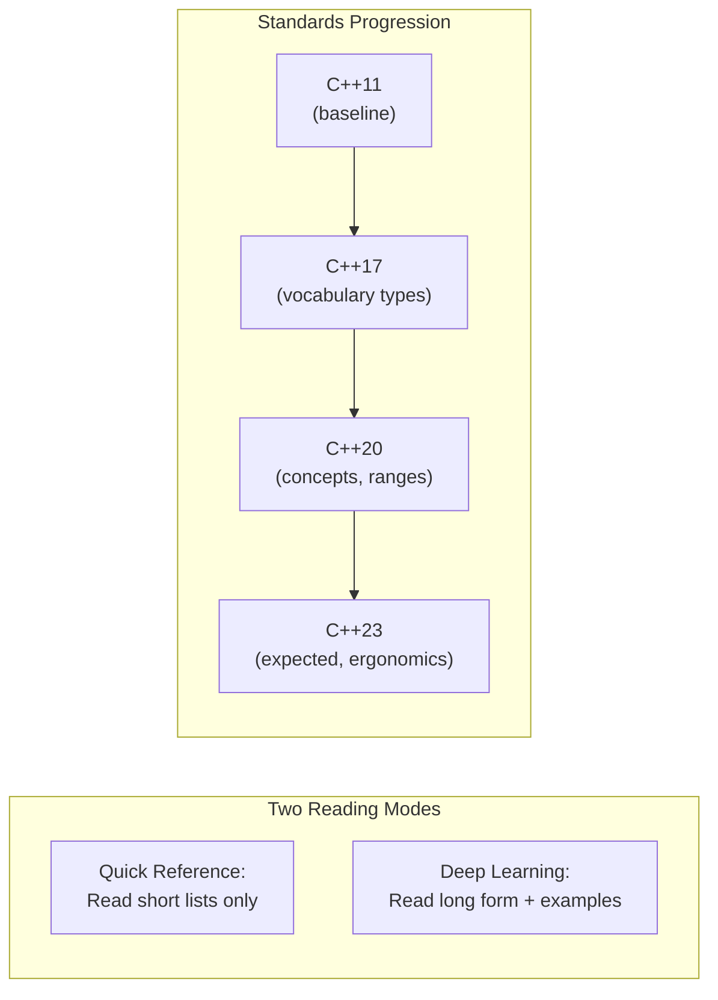
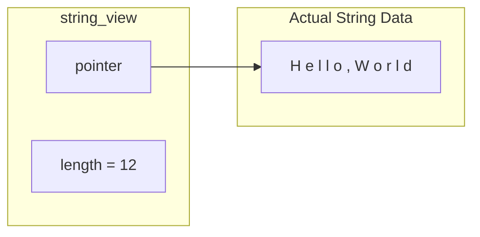
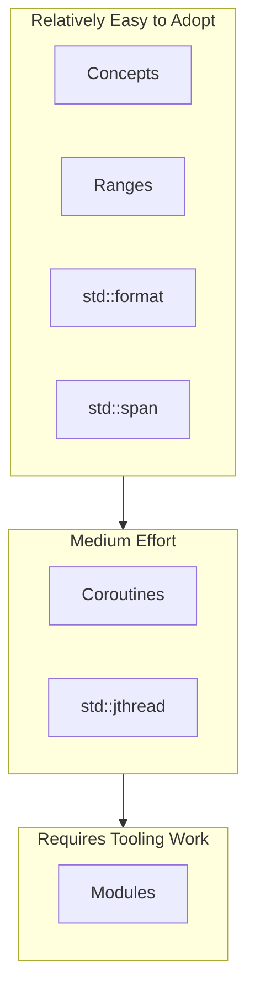
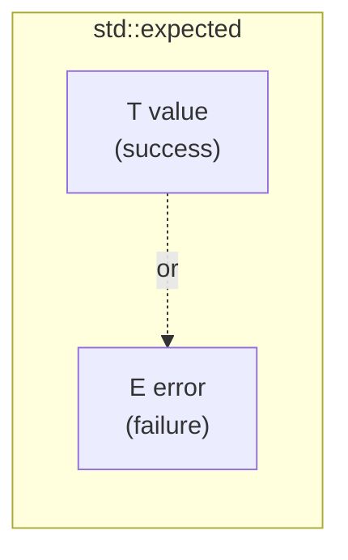
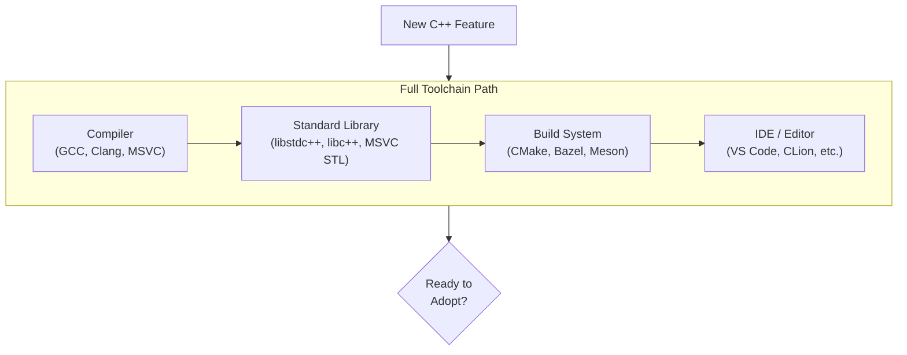

# Foundations - Modern C++ Feature Guide

**C++11 baseline → C++17, C++20, C++23 (short lists + long form examples)**

---

## Scope

This guide assumes an existing C++11 codebase and summarizes what changed in later standards. For each standard revision (C++17, C++20, C++23), the section begins with a **short list** of key features, followed by a **longer form** discussion and small code examples.

Where helpful, examples are marked as either:
- **(Sketch)** – focuses on the syntax/idea; omits includes and surrounding boilerplate.
- **(Compilable)** – complete snippet intended to compile as-is with the stated standard.

The appendix covers **implementation reality**: many modern C++ features are gated by compiler and standard library versions, build system support (especially modules), ABI policies, and third‑party dependency readiness.

## Not covered

- C++11 features (assumed as baseline)
- Deep language-lawyer edge cases
- Specific FAT-P library APIs (see User Manuals)
- Build system configuration details (CMake, Bazel, etc.)
- Performance benchmarks of individual features

## Prerequisites

- Working knowledge of C++11 (auto, range-for, move semantics, lambdas, smart pointers)
- Familiarity with compilation and linking concepts
- Basic understanding of templates (for C++17/20 sections)

> **If your project is "C++11 in name only"** (heavy raw owning pointers, manual memory management, ad-hoc error handling), consider doing a "C++11 cleanup pass" before adopting bigger features like ranges or coroutines.

---

## Foundations Card

**Topic:** C++ language evolution from C++11 through C++23  
**Why it matters:** Knowing which features exist helps you write cleaner, safer code and understand others' code  
**Key concepts:** Vocabulary types (optional/variant/expected), concepts, ranges, coroutines, modules  
**Mental model:** Each standard adds tools; adoption is gated by toolchain support, not just syntax  
**Common misconceptions:** "C++20 support" doesn't mean all features work; library features often lag  
**Read next:** Handbook - C++ Design Goals and Migration; User Manuals for specific FAT-P components

---

## Table of Contents

1. [Baseline: What We Mean by "C++11"](#baseline-what-we-mean-by-c11)
2. [C++17: Core Language and Library Upgrades](#c17-core-language-and-library-upgrades-over-a-c11-baseline)
   - [Short List](#short-list-of-new-and-important-features)
   - [Long Form](#long-form-with-examples)
   - [Migration Notes](#migration-notes-from-a-c11-codebase)
3. [C++20: Major Language Facilities](#c20-major-language-facilities-conceptsrangescoroutinesmodules-and-library-expansion)
   - [Short List](#short-list-of-new-and-important-features-1)
   - [Long Form](#long-form-with-examples-1)
   - [Migration Notes](#migration-notes-from-a-c11-codebase-1)
4. [C++23: Ergonomics and Better Error Handling](#c23-ergonomics-better-error-handling-and-library-evolution-with-tooling-reality)
   - [Short List](#short-list-of-new-and-important-features-2)
   - [Long Form](#long-form-with-examples-2)
   - [Migration Notes](#migration-notes-from-a-c11-codebase-2)
5. [Appendix: Implementation Reality](#appendix-implementation-reality)
6. [Glossary](#glossary)

---

## How to Read This Guide



Each standard section follows the same pattern:

1. **Short list** — scan to see what's available
2. **Long form** — "What it is / Why it matters / Gotchas / Feature-test macros"
3. **Migration notes** — practical advice for upgrading

---

## Baseline: What We Mean by "C++11"

C++11 is the baseline language level assumed for the starting codebase. This guide does **not** re-teach C++11, but assumes these common C++11 idioms are already available:

| Feature | What it provides |
|---------|-----------------|
| `auto` | Type inference for variables |
| Range-for | `for (auto& x : container)` |
| Move semantics | Efficient transfer of resources |
| Lambdas | Inline function objects |
| `constexpr` (basic) | Compile-time constants |
| `nullptr` | Type-safe null pointer |
| `enum class` | Scoped enumerations |
| Smart pointers | `unique_ptr`, `shared_ptr` |

---

# C++17: Core Language and Library Upgrades over a C++11 Baseline

## Short List of New and Important Features

### Language

| Feature | One-line description |
|---------|---------------------|
| **Structured bindings** | Decompose tuples/structs/arrays into named variables |
| **`if constexpr`** | Compile-time branching inside templates |
| **Fold expressions** | Concise variadic template reduction |
| **CTAD** | Class template argument deduction |
| **Inline variables** | Especially `inline constexpr` in headers |
| **Init-statement in if/switch** | Narrow variable scope |
| **Guaranteed copy elision** | Fewer moves/copies in more cases |
| **Nested namespace** | `namespace A::B { ... }` |
| **Attributes** | `[[nodiscard]]`, `[[maybe_unused]]`, `[[fallthrough]]` |

### Standard Library

| Feature | One-line description |
|---------|---------------------|
| **`std::string_view`** | Non-owning string slice |
| **`std::optional`** | "Maybe a value" type |
| **`std::variant`** | Type-safe union |
| **`std::any`** | Type-erased container |
| **`std::filesystem`** | Portable paths and directory traversal |
| **`std::from_chars`/`to_chars`** | Locale-independent number parsing |
| **`std::pmr`** | Polymorphic allocators / custom arenas |
| **Parallel algorithms** | Execution policies (`std::execution::par`) |

### Build/Tooling Impact

Usually low: most C++17 features work with traditional headers and CMake/Make builds.

Be aware of standard library readiness (filesystem and parallel algorithms were historically uneven across implementations).

---

## Long Form (with Examples)

### C++17 Language Features

#### Structured Bindings

**What it is.**
Structured bindings let you decompose an object into named bindings using `auto [a, b, ...] = expr;`. It works with tuples/pairs, arrays, and user types that provide the appropriate tuple-like interface or public members.

**Why it matters.**
They improve readability by avoiding `std::get<0>(...)` and by naming values directly. They also reduce boilerplate when working with maps and multiple return values.

> **For readers from Python:** This is similar to tuple unpacking: `a, b = get_pair()`. C++ now has the same capability.

**(Sketch)**
```cpp
auto [x, y] = std::make_pair(1, 2);
// x == 1, y == 2

for (auto& [key, value] : my_map) {
    // iterate with named key and value
}
```

**When not to use / gotchas.**
Bindings can be references depending on the initializer. Be careful not to bind to a temporary that will go out of scope. Prefer `auto [a, b] = ...;` for copies and `auto& [a, b] = ...;` for references when you need to modify the original.

**Feature-test macros.**
`__cpp_structured_bindings`

---

#### `if constexpr`

**What it is.**
`if constexpr` evaluates its condition at compile time. The non-selected branch is discarded, which means it does not need to be well-formed for the given template instantiation.

**Why it matters.**
It replaces many SFINAE-heavy patterns with straightforward code, improving maintainability and compiler diagnostics.

> **Plain English:** Instead of complex template tricks to choose different code paths at compile time, you can write a simple `if` statement that the compiler evaluates before generating code.

**(Sketch)**
```cpp
template<typename T>
void process(T value) {
    if constexpr (std::is_integral_v<T>) {
        // This code only compiled for integers
        value = value + 1;
    } else {
        // This code only compiled for non-integers
        value.do_something();
    }
}
```

**When not to use / gotchas.**
Prefer concepts (C++20) when you want to constrain templates; `if constexpr` is best for implementation branching, not interface constraints.

**Feature-test macros.**
`__cpp_if_constexpr`

---

#### Fold Expressions

**What it is.**
Fold expressions provide a compact way to apply a binary operator over a parameter pack (variadic templates).

**Why it matters.**
They eliminate recursive template patterns and make variadic utilities simpler and faster to compile.

**(Sketch)**
```cpp
template<typename... Args>
auto sum(Args... args) {
    return (args + ...);  // Fold: arg1 + arg2 + arg3 + ...
}

template<typename... Args>
bool all(Args... args) {
    return (args && ...);  // Fold: arg1 && arg2 && arg3 && ...
}
```

**When not to use / gotchas.**
Be mindful of operator precedence and identity elements. For example, folding `&&` or `||` is often natural; folding `,` can hide side effects.

**Feature-test macros.**
`__cpp_fold_expressions`

---

#### Class Template Argument Deduction (CTAD)

**What it is.**
CTAD allows the compiler to deduce template arguments from constructor arguments, e.g., `std::pair p(1, 2.0);` instead of `std::pair<int, double> p(1, 2.0);`.

**Why it matters.**
It reduces verbosity for common cases and makes code read more like regular value construction.

**(Sketch)**
```cpp
std::vector v{1, 2, 3};           // deduces std::vector<int>
std::pair p{42, "hello"};         // deduces std::pair<int, const char*>
std::lock_guard lg{some_mutex};   // deduces std::lock_guard<std::mutex>
```

**When not to use / gotchas.**
CTAD can sometimes deduce surprising types (especially with initializer_list constructors). If clarity matters, spell the type explicitly or use helper functions like `std::make_pair`.

**Feature-test macros.**
`__cpp_deduction_guides`

---

#### Inline Variables

**What it is.**
Variables declared `inline` can be defined in headers without violating the One Definition Rule (ODR).

**Why it matters.**
They simplify header-only constants and replace patterns like `extern const` plus a separate definition.

**(Sketch)**
```cpp
// In header file:
inline constexpr int MAX_SIZE = 1024;  // OK in multiple translation units
```

**When not to use / gotchas.**
Use inline variables for true constants or for shared state you intentionally want to be global. Avoid creating hidden global mutable state in headers.

**Feature-test macros.**
`__cpp_inline_variables`

---

#### Init-Statement in `if`/`switch`

**What it is.**
C++17 allows an init-statement before the condition in `if` and `switch`, e.g., `if (auto it = m.find(key); it != m.end()) { ... }`.

**Why it matters.**
It tightens scopes, reduces accidental variable reuse, and makes "lookup + test" patterns concise.

**(Compilable)**
```cpp
#include <map>
#include <string>

int main() {
    std::map<std::string, int> m{{"hello", 42}};
    
    if (auto it = m.find("hello"); it != m.end()) {
        // 'it' only exists in this scope
        return it->second;
    }
    return -1;
}
```

**When not to use / gotchas.**
Keep the init-statement simple. If it becomes complex, prefer a named function or a prior statement for readability.

**Feature-test macros.**
No dedicated macro is commonly used; gate on `__cplusplus >= 201703L` or compiler feature checks if needed.

---

#### Guaranteed Copy Elision (More Cases)

**What it is.**
C++17 guarantees copy elision in certain return and initialization cases (prvalue materialization changes).

**Why it matters.**
It makes returning large objects cheaper and simplifies patterns where you previously needed `std::move` or careful NRVO reasoning.

> **Plain English:** When you return a newly-created object from a function, C++17 guarantees no copy is made—the object is constructed directly in the caller's memory.

**(Sketch)**
```cpp
Widget make_widget() {
    return Widget{...};  // No copy, no move—constructed in place
}

Widget w = make_widget();  // Guaranteed: no temporary
```

**When not to use / gotchas.**
Do not use guaranteed elision as an excuse to ignore performance measurement; it removes a class of copies, but allocations and cache behavior still matter.

**Feature-test macros.**
`__cpp_guaranteed_copy_elision`

---

#### Nested Namespace Definition

**What it is.**
You can define nested namespaces as `namespace a::b::c { ... }` instead of `namespace a { namespace b { namespace c { ... } } }`.

**Why it matters.**
It reduces indentation and boilerplate, particularly in libraries.

**(Sketch)**
```cpp
namespace company::project::detail {
    void internal_helper();
}
```

**When not to use / gotchas.**
None significant; this is mostly a readability feature.

**Feature-test macros.**
`__cpp_nested_namespace_definitions`

---

#### Standard Attributes: `[[nodiscard]]`, `[[maybe_unused]]`, `[[fallthrough]]`

**What it is.**
C++17 standardizes useful attributes for APIs and control-flow intent.

**Why it matters.**
Attributes help catch bugs (ignored error codes) and clarify intent (intentional fallthrough) without non-portable compiler pragmas.

**(Compilable)**
```cpp
[[nodiscard]] int compute_important_value() {
    return 42;
}

void example([[maybe_unused]] int debug_param) {
    // debug_param might be unused in release builds
}

int categorize(int x) {
    switch (x) {
        case 1:
            do_something();
            [[fallthrough]];  // Intentional: no break
        case 2:
            do_other_thing();
            break;
        default:
            break;
    }
    return 0;
}
```

**When not to use / gotchas.**
Overusing attributes can create warning noise. Apply `[[nodiscard]]` to functions where ignoring the result is almost certainly a bug.

**Feature-test macros.**
`__has_cpp_attribute(nodiscard)`, `__has_cpp_attribute(fallthrough)`, `__has_cpp_attribute(maybe_unused)`

---

### C++17 Standard Library Features

#### `std::string_view`

**What it is.**
`std::string_view` is a non-owning view of a character sequence. It carries a pointer and a length.

**Why it matters.**
It avoids unnecessary allocations and copies when passing read-only string data through APIs.



**(Compilable)**
```cpp
#include <string_view>
#include <iostream>

void print_greeting(std::string_view sv) {
    std::cout << sv << '\n';  // No copy of the string data
}

int main() {
    print_greeting("Hello");                    // Works with string literal
    print_greeting(std::string{"World"});       // Works with std::string
}
```

**When not to use / gotchas.**
Lifetimes are the #1 footgun: a string_view does not own memory. **Never return a string_view to a temporary string.**

**Feature-test macros.**
`__cpp_lib_string_view`

---

#### `std::optional`

**What it is.**
`std::optional<T>` represents either "a T" or "no value".

**Why it matters.**
It provides explicit, type-safe "maybe" semantics without sentinel values or out-parameters.

> **For readers from other languages:** This is like `Option<T>` in Rust, `Optional<T>` in Java, or `T?` in Swift/Kotlin.

**(Compilable)**
```cpp
#include <optional>
#include <string>

std::optional<std::string> find_user(int id) {
    if (id == 42) {
        return "Alice";
    }
    return std::nullopt;  // No value
}

int main() {
    if (auto user = find_user(42)) {
        // user.value() is "Alice"
    }
}
```

**When not to use / gotchas.**
Don't use optional for error reporting when you need an error reason. Use `std::expected` (C++23) or a custom error type in those cases.

**Feature-test macros.**
`__cpp_lib_optional`

---

#### `std::variant`

**What it is.**
`std::variant<Ts...>` is a type-safe union holding exactly one of several alternatives.

**Why it matters.**
It is a safer alternative to manual tagged unions and avoids heap allocation compared to many polymorphic approaches.

> **For readers from other languages:** This is like Rust's `enum` (sum types), or a discriminated union. It can hold one of several types, and you must handle all cases.

**(Compilable)**
```cpp
#include <variant>
#include <string>

using Value = std::variant<int, double, std::string>;

int main() {
    Value v = 42;
    v = "hello";  // Now holds a string
    
    // Visit handles all cases
    std::visit([](auto&& arg) {
        // arg is int, double, or string
    }, v);
}
```

**When not to use / gotchas.**
Prefer a small set of alternatives. Very large variants can become heavy, and visitation can create compile-time bloat.

**Feature-test macros.**
`__cpp_lib_variant`

---

#### `std::any`

**What it is.**
`std::any` is a type-erasing container for single values (like a safer `void*` with RTTI-based casts).

**Why it matters.**
It's useful at subsystem boundaries, plugin APIs, and generic containers where you truly need runtime-typed values.

**(Compilable)**
```cpp
#include <any>
#include <string>

int main() {
    std::any a = 42;
    a = std::string{"hello"};
    
    if (a.type() == typeid(std::string)) {
        auto s = std::any_cast<std::string>(a);
    }
}
```

**When not to use / gotchas.**
Avoid using `std::any` as a default design choice; it hides types and makes APIs harder to reason about. For closed sets of types, `std::variant` is usually better.

**Feature-test macros.**
`__cpp_lib_any`

---

#### `std::filesystem`

**What it is.**
`std::filesystem` provides portable path manipulation, directory iteration, file status, and more.

**Why it matters.**
It replaces platform-specific filesystem APIs and many ad-hoc path hacks.

**(Compilable)**
```cpp
#include <filesystem>
#include <iostream>

namespace fs = std::filesystem;

int main() {
    fs::path p = "/home/user/documents";
    
    for (auto& entry : fs::directory_iterator(p)) {
        std::cout << entry.path() << '\n';
    }
    
    if (fs::exists(p / "readme.txt")) {
        auto size = fs::file_size(p / "readme.txt");
    }
}
```

**When not to use / gotchas.**
Error handling: most operations can throw. Prefer overloads that take `std::error_code&` in low-level code.

**Toolchain note:** Older libstdc++ versions required linking with a separate filesystem library (`-lstdc++fs`); verify on your target platforms.

**Feature-test macros.**
`__cpp_lib_filesystem`

---

#### `std::from_chars` / `std::to_chars`

**What it is.**
Low-level, locale-independent numeric parsing/formatting functions in `<charconv>`.

**Why it matters.**
They avoid iostream overhead and locale costs; useful for high-performance parsing (logs, protocols, JSON).

**(Compilable)**
```cpp
#include <charconv>
#include <string_view>

int parse_int(std::string_view sv) {
    int value = 0;
    std::from_chars(sv.data(), sv.data() + sv.size(), value);
    return value;
}
```

**When not to use / gotchas.**
Floating-point support and edge cases have historically varied across standard library implementations. Test on your target toolchains.

**Feature-test macros.**
`__cpp_lib_to_chars`, `__cpp_lib_charconv`

---

#### Polymorphic Memory Resources (`std::pmr`)

**What it is.**
`std::pmr` adds allocator-aware containers that can draw memory from pluggable arenas/pools (`std::pmr::memory_resource`).

**Why it matters.**
It helps reduce allocation overhead, improve locality, and centralize memory policy for performance-sensitive subsystems.

**(Sketch)**
```cpp
#include <memory_resource>
#include <vector>

std::byte buffer[1024];
std::pmr::monotonic_buffer_resource pool{buffer, sizeof(buffer)};

std::pmr::vector<int> vec{&pool};  // Allocates from buffer, not heap
```

**When not to use / gotchas.**
Allocator-aware design leaks into APIs. Keep pmr usage internal unless your public API truly benefits from pluggable allocation.

**Feature-test macros.**
`__cpp_lib_memory_resource`

---

#### Parallel Algorithms (Execution Policies)

**What it is.**
C++17 adds execution policies like `std::execution::par` to some standard algorithms to enable parallel execution.

**Why it matters.**
It offers a standard interface for parallelism, but real-world usefulness depends heavily on implementation quality.

**(Sketch)**
```cpp
#include <algorithm>
#include <execution>
#include <vector>

std::vector<int> data = ...;
std::sort(std::execution::par, data.begin(), data.end());  // Parallel sort
```

**When not to use / gotchas.**
Many standard libraries shipped partial or experimental parallel algorithm support for years. Measure performance: parallel policies can be slower for small inputs or under contention. Also verify determinism and exception behavior on your platforms.

**Feature-test macros.**
`__cpp_lib_execution`

---

## Migration Notes from a C++11 Codebase

1. **Turn on `-std=c++17`** (or equivalent) and fix warnings-as-errors first; most changes are straightforward.

2. **Introduce vocabulary types at API boundaries:**
   - `std::optional` for "maybe" values
   - `std::variant` for "one-of" alternatives
   - `std::string_view` for read-only string input

3. **Prefer `if constexpr` and fold expressions** to simplify existing template utilities.

4. **For filesystem usage**, validate toolchain support across all supported platforms early (some environments lag).

---

# C++20: Major Language Facilities (Concepts/Ranges/Coroutines/Modules) and Library Expansion

## Short List of New and Important Features

### Language

| Feature | One-line description |
|---------|---------------------|
| **Concepts** | Express template requirements directly |
| **Ranges-based for init-statement** | Tighten scope in range-for |
| **Modules** | New compilation model (tooling-sensitive) |
| **Coroutines** | `co_await`/`co_yield`/`co_return` |
| **Three-way comparison (`<=>`)** | Spaceship operator + defaulted comparisons |
| **Designated initializers** | `.member = value` for aggregates |
| **`consteval`** | Immediate functions (must be compile-time) |
| **`constinit`** | Prevent dynamic initialization of globals |
| **`[[likely]]`/`[[unlikely]]`** | Branch prediction hints |
| **`[[no_unique_address]]`** | Empty member optimization |
| **`using enum`** | Bring enumerators into scope |

### Standard Library

| Feature | One-line description |
|---------|---------------------|
| **Ranges library** | Views, range algorithms (large ecosystem shift) |
| **`std::span`** | Non-owning contiguous view |
| **`std::format`** | Type-safe formatting (like Python's f-strings) |
| **`std::jthread`** | Joining thread with cancellation support |
| **Synchronization** | `std::latch`, `std::barrier`, `std::semaphore` |
| **`std::source_location`** | Lightweight call-site metadata |
| **`<bit>`** | `std::bit_cast` and bit operations |
| **Container helpers** | `contains()`, `erase_if()`, `starts_with()` |

### Build/Tooling Impact

- Ranges/concepts/coroutines are mostly compiler+stdlib issues.
- **Modules is primarily a build system + IDE + dependency graph issue**; plan adoption carefully.



---

## Long Form (with Examples)

### C++20 Language Features

#### Concepts and `requires`

**What it is.**
Concepts let you name sets of requirements on template parameters (e.g., "is an integral type" or "is a range"). You can use them to constrain templates and improve overload selection.

**Why it matters.**
They replace many SFINAE and `enable_if` patterns with readable constraints and clearer error messages. They also make generic code easier to maintain.

> **Plain English:** Instead of cryptic template errors like "no matching function for call to...", you get "constraint not satisfied: T must be sortable".

**(Compilable)**
```cpp
#include <concepts>
#include <iostream>

template<std::integral T>
T double_it(T x) {
    return x * 2;
}

// More complex concept with requires-clause
template<typename T>
    requires std::is_arithmetic_v<T>
T triple_it(T x) {
    return x * 3;
}

int main() {
    std::cout << double_it(21) << '\n';  // OK: int is integral
    // double_it("hello");  // Error: const char* is not integral
}
```

**When not to use / gotchas.**
Avoid over-constraining early. Start with broad concepts (e.g., `std::ranges::range`) and refine when you have concrete needs. Be mindful that some concepts can introduce surprising implicit requirements (e.g., default constructibility).

**Feature-test macros.**
`__cpp_concepts`, `__cpp_lib_concepts`

---

#### Three-Way Comparison (`<=>`)

**What it is.**
The spaceship operator `<=>` can generate all six comparison operators from a single definition, and enables defaulted comparisons.

**Why it matters.**
It reduces boilerplate and makes comparison behavior consistent and less error-prone.

**(Compilable)**
```cpp
#include <compare>

struct Point {
    int x, y;
    auto operator<=>(const Point&) const = default;  // All comparisons generated
};

int main() {
    Point a{1, 2}, b{1, 3};
    bool less = a < b;      // Works
    bool equal = a == b;    // Works
}
```

**When not to use / gotchas.**
Defaulted comparisons compare members in declaration order. Be intentional about member order if it affects ordering semantics.

**Feature-test macros.**
`__cpp_impl_three_way_comparison`, `__cpp_lib_three_way_comparison`

---

#### Designated Initializers

**What it is.**
For aggregates, you can initialize members by name using `.member = value` syntax.

**Why it matters.**
It improves readability and reduces bugs when structs grow or when you only want to set a subset of fields.

> **For C programmers:** This is like C99 designated initializers, but with C++ semantics.

**(Compilable)**
```cpp
struct Config {
    int timeout = 30;
    bool verbose = false;
    int retries = 3;
};

int main() {
    Config c{.verbose = true, .retries = 5};
    // timeout uses default (30), verbose = true, retries = 5
}
```

**When not to use / gotchas.**
Only works for aggregates; if you add a user-declared constructor, the type stops being an aggregate.

**Feature-test macros.**
`__cpp_designated_initializers`

---

#### `consteval` (Immediate Functions)

**What it is.**
`consteval` marks a function as an immediate function: it **must** be evaluated at compile time when called.

**Why it matters.**
It's a strong tool for ensuring invariants and generating compile-time computed data without accidentally falling back to runtime.

**(Compilable)**
```cpp
consteval int square(int x) {
    return x * x;
}

int main() {
    constexpr int a = square(5);  // OK: compile-time
    // int b = square(runtime_value);  // Error: must be compile-time
}
```

**When not to use / gotchas.**
Use consteval sparingly in public APIs; it forces compile-time evaluation for all users and can increase compile times.

**Feature-test macros.**
`__cpp_consteval`

---

#### `constinit`

**What it is.**
`constinit` requires that a variable with static storage duration is initialized at compile time (no dynamic initialization).

**Why it matters.**
It helps avoid the "static initialization order fiasco" and guarantees initialization happens before any runtime code.

**(Compilable)**
```cpp
constinit int global_value = 42;  // Must be initialized at compile time

int main() {
    global_value = 100;  // OK: still mutable at runtime
}
```

**When not to use / gotchas.**
`constinit` does not make the variable constant. It only constrains initialization. It's still mutable if the type allows it.

**Feature-test macros.**
`__cpp_constinit`

---

#### `using enum`

**What it is.**
`using enum E;` brings enumerators of `E` into the current scope.

**Why it matters.**
It makes scoped enums (`enum class`) more ergonomic without losing type safety.

**(Compilable)**
```cpp
enum class Color { Red, Green, Blue };

void paint(Color c) {
    using enum Color;  // Bring Red, Green, Blue into scope
    switch (c) {
        case Red:   /* ... */ break;  // Instead of Color::Red
        case Green: /* ... */ break;
        case Blue:  /* ... */ break;
    }
}
```

**When not to use / gotchas.**
Be careful about name collisions when multiple enums have overlapping enumerator names in the same scope.

**Feature-test macros.**
`__cpp_using_enum`

---

#### Attributes `[[likely]]` and `[[unlikely]]`

**What it is.**
Branch prediction hints that annotate likely/unlikely paths in conditionals and switches.

**Why it matters.**
They can improve performance in hot code paths when the compiler and CPU can exploit the hint, and they document intent.

**(Compilable)**
```cpp
int process(int x) {
    if (x > 0) [[likely]] {
        return x * 2;
    } else [[unlikely]] {
        return handle_error();
    }
}
```

**When not to use / gotchas.**
Do not guess. Measure first; mis-hints can hurt performance. Use primarily for readability/documentation unless profiling shows benefit.

**Feature-test macros.**
`__has_cpp_attribute(likely)`, `__has_cpp_attribute(unlikely)`

---

#### `[[no_unique_address]]`

**What it is.**
Allows empty members to take no storage (like EBO, but as a standard attribute for members).

**Why it matters.**
It can reduce object size in common patterns (e.g., policy types, allocators, function objects).

**(Sketch)**
```cpp
struct Empty {};

struct Optimized {
    [[no_unique_address]] Empty e;  // May take 0 bytes
    int value;
};
// sizeof(Optimized) may equal sizeof(int)
```

**When not to use / gotchas.**
Do not rely on a specific layout; it's an optimization hint. The ABI/layout can differ across compilers.

**Feature-test macros.**
`__has_cpp_attribute(no_unique_address)`

---

#### Coroutines (`co_await`/`co_return`)

**What it is.**
Coroutines add language support for suspension and resumption, enabling async/await and generator-style code.

**Why it matters.**
They allow writing asynchronous code in direct style without callback pyramids, and can be more efficient than threads in I/O-heavy systems.

> **For readers from Python/JavaScript:** This is like `async`/`await`. You can write code that "pauses" and "resumes" without blocking a thread.

**(Sketch)**
```cpp
#include <coroutine>

Task<int> fetch_data() {
    auto result = co_await async_http_get("...");
    co_return result.status_code;
}
```

**When not to use / gotchas.**
Real coroutine types require careful design (promise types, lifetimes, allocators). Many projects adopt a coroutine library (e.g., networking framework) rather than writing coroutine primitives by hand.

ABI and tooling: debug/profiling support varies; validate on your production toolchains early.

**Feature-test macros.**
`__cpp_impl_coroutine`, `__cpp_coroutines`

**Support notes.**
Compiler support varies. Check your exact toolchains before committing.

---

#### Modules (Overview)

**What it is.**
Modules are a new way to package and compile C++ code (`export module ...;` and `import ...;`). They aim to reduce build times and improve encapsulation compared to textual includes.

**Why it matters.**
In large codebases, modules can significantly reduce redundant parsing, and they provide stronger boundaries than headers.

**(Sketch)**
```cpp
// mymodule.cpp
export module mymodule;

export int add(int a, int b) {
    return a + b;
}

// main.cpp
import mymodule;

int main() {
    return add(1, 2);
}
```

**When not to use / gotchas.**
Modules adoption is primarily a **tooling project**: build system support, IDE support, and dependency scanning are the gating factors. Start with leaf libraries and avoid mixing "header units" and textual includes until your toolchain story is solid.

**Feature-test macros.**
`__cpp_modules`

**Support notes.**
cppreference's C++20 compiler support table lists modules as partial across major compilers for a long time; plan staged adoption and require CI coverage on all supported platforms.

---

### C++20 Standard Library Features

#### Ranges and Views

**What it is.**
The ranges library generalizes algorithms to operate on ranges, and introduces composable lazy range adaptors ("views").

**Why it matters.**
It makes common data processing pipelines readable and less error-prone, and reduces iterator boilerplate.

> **For readers from other languages:** This is like LINQ in C#, or Rust's iterator adaptors. You can chain operations like `filter`, `transform`, `take` without intermediate collections.

**(Compilable)**
```cpp
#include <ranges>
#include <vector>
#include <iostream>

int main() {
    std::vector<int> nums{1, 2, 3, 4, 5, 6, 7, 8, 9, 10};
    
    auto result = nums 
        | std::views::filter([](int n) { return n % 2 == 0; })
        | std::views::transform([](int n) { return n * n; });
    
    for (int n : result) {
        std::cout << n << ' ';  // 4 16 36 64 100
    }
}
```

**When not to use / gotchas.**
Views are lazy and often hold references into underlying ranges. Watch lifetimes, especially when returning views from functions.

Compile times can increase; measure and consider precompiled headers or modularization strategies where possible.

**Feature-test macros.**
`__cpp_lib_ranges`

---

#### `std::span`

**What it is.**
`std::span<T>` is a non-owning view over contiguous memory (array, vector, string, etc.).

**Why it matters.**
It provides safe (size-carrying) "pointer+length" APIs without owning memory.

> **Plain English:** Instead of passing `(T* ptr, size_t len)` separately (easy to get wrong), you pass one `span<T>` that carries both together.

**(Compilable)**
```cpp
#include <span>
#include <vector>

void process(std::span<int> data) {
    for (int& x : data) {
        x *= 2;
    }
}

int main() {
    std::vector<int> v{1, 2, 3};
    process(v);  // Implicitly converts to span
    
    int arr[] = {4, 5, 6};
    process(arr);  // Works with arrays too
}
```

**When not to use / gotchas.**
span does not extend lifetimes; passing a span of a temporary container is dangerous.

**Feature-test macros.**
`__cpp_lib_span`

---

#### `std::format`

**What it is.**
`std::format` provides Python/{}-style type-safe formatting, similar to the {fmt} library.

**Why it matters.**
It's safer than printf-style formatting and typically faster and clearer than iostream composition for many use cases.

**(Compilable)**
```cpp
#include <format>
#include <string>

int main() {
    std::string s = std::format("Hello, {}! You are {} years old.", "Alice", 30);
    // s == "Hello, Alice! You are 30 years old."
}
```

**When not to use / gotchas.**
Implementation reality matters: std::format landed later than many other C++20 features in some standard libraries. If your platform's standard library lacks it, consider using {fmt} as a compatibility layer.

**Feature-test macros.**
`__cpp_lib_format`

---

#### `std::source_location`

**What it is.**
`std::source_location` captures file, function, line, and column at the call site, with minimal overhead.

**Why it matters.**
It improves logging and diagnostics without macro hacks like `__FILE__`/`__LINE__` threaded through APIs.

**(Compilable)**
```cpp
#include <source_location>
#include <iostream>

void log(std::string_view msg, 
         std::source_location loc = std::source_location::current()) {
    std::cout << loc.file_name() << ":" << loc.line() 
              << " [" << loc.function_name() << "] " << msg << '\n';
}

int main() {
    log("Starting up");  // Automatically captures call site
}
```

**When not to use / gotchas.**
Be mindful of binary size if you capture full file paths; some build systems embed long paths.

**Feature-test macros.**
`__cpp_lib_source_location`

---

#### `std::jthread` and `stop_token`

**What it is.**
`std::jthread` is a joining thread: it automatically joins in its destructor and integrates with cooperative cancellation via `std::stop_token`.

**Why it matters.**
It reduces leaks and shutdown races compared to detached or manually-joined threads, and makes cancellation a first-class concept.

**(Compilable)**
```cpp
#include <thread>
#include <iostream>

void worker(std::stop_token token) {
    while (!token.stop_requested()) {
        // Do work...
    }
    std::cout << "Worker stopping\n";
}

int main() {
    std::jthread t(worker);
    // ... do other things ...
}  // Automatically requests stop and joins
```

**When not to use / gotchas.**
Cancellation is cooperative. The thread must check the token and exit. For blocking I/O, you may need library support that integrates with stop tokens.

**Feature-test macros.**
`__cpp_lib_jthread`, `__cpp_lib_stop_token`

---

#### Synchronization Primitives: `latch`, `barrier`, `semaphore`

**What it is.**
C++20 introduces higher-level synchronization primitives in `<latch>`, `<barrier>`, and `<semaphore>`.

**Why it matters.**
They simplify coordination patterns (startup synchronization, phased computation) and can replace ad-hoc condition variables.

**(Sketch)**
```cpp
#include <latch>
#include <thread>

std::latch ready(3);  // Wait for 3 arrivals

void worker() {
    // Setup...
    ready.count_down();  // Signal ready
    ready.wait();        // Wait for all workers
    // All workers proceed together
}
```

**When not to use / gotchas.**
These primitives are low-level; avoid building complex frameworks on them without careful reasoning about deadlocks and shutdown.

**Feature-test macros.**
`__cpp_lib_barrier`, `__cpp_lib_latch`, `__cpp_lib_semaphore`

---

#### `std::bit_cast` and Bit Operations

**What it is.**
`std::bit_cast` allows type-punning between trivially copyable types safely. `<bit>` also adds common bit operations (popcount, rotl, etc.).

**Why it matters.**
It replaces undefined-behavior reinterpret_cast patterns and makes low-level code portable and explicit.

**(Compilable)**
```cpp
#include <bit>
#include <cstdint>

int main() {
    float f = 1.0f;
    auto bits = std::bit_cast<uint32_t>(f);  // Safe type punning
    
    int count = std::popcount(0b10110u);  // Count set bits: 3
}
```

**When not to use / gotchas.**
bit_cast preserves bit patterns, not numeric meaning. Only use when you fully control the representation assumptions.

**Feature-test macros.**
`__cpp_lib_bit_cast`, `__cpp_lib_bitops`

---

#### Container Quality-of-Life: `contains()`, `erase_if()`, `starts_with()`/`ends_with()`

**What it is.**
C++20 adds frequently-needed helpers: `contains()` on associative containers, `std::erase`/`std::erase_if`, and prefix/suffix checks on strings.

**Why it matters.**
They reduce boilerplate, make intent clearer, and avoid subtle iterator invalidation mistakes.

**(Compilable)**
```cpp
#include <map>
#include <string>
#include <vector>
#include <algorithm>

int main() {
    std::map<std::string, int> m{{"hello", 1}};
    if (m.contains("hello")) { /* ... */ }  // Instead of m.find(...) != m.end()
    
    std::string s = "hello_world";
    if (s.starts_with("hello")) { /* ... */ }
    if (s.ends_with("world")) { /* ... */ }
    
    std::vector<int> v{1, 2, 3, 2, 4, 2};
    std::erase(v, 2);  // Remove all 2s
}
```

**When not to use / gotchas.**
These are straightforward, but availability can lag on older standard libraries even if the compiler supports C++20 syntax.

**Feature-test macros.**
`__cpp_lib_erase_if`, `__cpp_lib_starts_ends_with`

---

## Migration Notes from a C++11 Codebase

1. **Adopt concepts/ranges/coroutines incrementally.** They can increase compile times and require learning new abstractions.

2. **Treat modules as an optional, separately-planned project.** Validate: compiler support, build system support, IDE support, and third-party module readiness.

3. **Add feature gating in configuration headers:**
   ```cpp
   #if __has_include(<format>) && defined(__cpp_lib_format)
   #include <format>
   #define HAS_STD_FORMAT 1
   #endif
   ```

4. **If you need `std::format` but your stdlib lags**, standardize on the {fmt} library and migrate to std::format later.

---

# C++23: Ergonomics, Better Error Handling, and Library Evolution (with Tooling Reality)

## Short List of New and Important Features

### Language

| Feature | One-line description |
|---------|---------------------|
| **Deducing `this`** | Write one member function for all cv/ref qualifiers |
| **`if consteval`** | Separate compile-time and runtime code paths |
| **Multidimensional `operator[]`** | `m[i, j]` syntax for matrices |
| **`#elifdef`/`#elifndef`** | Cleaner preprocessor conditionals |
| **`[[assume]]`** | Portable assumption hint |
| **`auto(x)`** | Decay-copy from expressions |

### Standard Library

| Feature | One-line description |
|---------|---------------------|
| **`std::expected`** | Value-or-error return type |
| **`std::print`/`println`** | Formatted output (like Python's print) |
| **`std::stacktrace`** | Capture stack traces |
| **`std::mdspan`** | Multidimensional view |
| **`std::generator`** | Coroutine-based lazy generator |
| **Ranges additions** | `views::zip`, `views::enumerate`, `ranges::to` |
| **Small utilities** | `std::to_underlying`, `std::unreachable` |
| **`import std`** | Standard library as a module |

### Build/Tooling Impact

- C++23 language features are mostly compiler-version gated.
- Several C++23 library features (`print`/`stacktrace`/`mdspan`/`generator`/modules) are standard-library-version gated and may be partial.

---

## Long Form (with Examples)

### C++23 Language Features

#### Explicit Object Parameter (Deducing `this`)

**What it is.**
Member functions can take the object parameter explicitly, e.g., `f(this auto&& self, ...)`. This lets a single definition behave correctly for lvalues/rvalues and const/non-const objects.

**Why it matters.**
It removes the need for repetitive `&`/`&&`/`const&` overload sets and enables cleaner fluent APIs and view-like types.

**(Sketch)**
```cpp
struct Builder {
    // One function handles all cases: const&, &, &&
    template<typename Self>
    auto&& set_name(this Self&& self, std::string name) {
        self.name_ = std::move(name);
        return std::forward<Self>(self);
    }
};
```

**When not to use / gotchas.**
It's powerful but can make signatures look unfamiliar. Use it when it meaningfully reduces overload clutter. Be careful to forward `self` correctly, and avoid returning references to temporary subobjects inadvertently.

**Feature-test macros.**
`__cpp_explicit_this_parameter`

**Support notes.**
This feature arrived later than many other C++23 items on some compilers; verify your exact versions before requiring it broadly.

---

#### `if consteval`

**What it is.**
`if consteval` selects a branch only when evaluated in a constant-evaluation context.

**Why it matters.**
It provides a clean way to implement one function that can do something special at compile time (e.g., validation or precomputation) while using an efficient runtime path otherwise.

**(Sketch)**
```cpp
constexpr int compute(int x) {
    if consteval {
        // Compile-time: do extra validation
        if (x < 0) throw "negative not allowed";
    } else {
        // Runtime: use fast path
    }
    return x * x;
}
```

**When not to use / gotchas.**
Prefer `consteval` for "must be compile time" semantics. Use `if consteval` when the function can validly run both at compile time and runtime.

**Feature-test macros.**
`__cpp_if_consteval`

---

#### Multidimensional Subscript Operator

**What it is.**
C++23 allows `operator[]` to take multiple indices, enabling natural `m[i, j]` syntax.

**Why it matters.**
It improves ergonomics for matrix-like and tensor-like types without needing a proxy object or chained indexing.

> **For mathematicians:** You can now write `matrix[i, j]` like you would in mathematical notation, instead of `matrix[i][j]` or `matrix(i, j)`.

**(Sketch)**
```cpp
class Matrix {
public:
    double& operator[](size_t i, size_t j) {
        return data_[i * cols_ + j];
    }
};

Matrix m(3, 3);
m[1, 2] = 3.14;  // Natural syntax
```

**When not to use / gotchas.**
This uses the comma token in source, which historically had different meaning in subscripts. Ensure your code style tools handle it consistently.

**Feature-test macros.**
`__cpp_multidimensional_subscript`

---

#### `[[assume]]`

**What it is.**
`[[assume(expr)]]` tells the compiler it may assume `expr` is true at that point (undefined behavior if it's false).

**Why it matters.**
It can unlock optimizations and documents invariants in performance-critical code without compiler-specific builtins.

**(Sketch)**
```cpp
int fast_divide(int x, int y) {
    [[assume(y != 0)]];  // Compiler can skip zero-check optimizations
    return x / y;
}
```

**When not to use / gotchas.**
If the assumption can be violated (even rarely), do not use it. Prefer asserts or defensive checks when correctness matters.

**Feature-test macros.**
`__has_cpp_attribute(assume)`

---

### C++23 Standard Library Features

#### `std::expected`

**What it is.**
`std::expected<T, E>` represents either a successful value `T` or an error value `E` (never "valueless").

**Why it matters.**
It enables explicit, efficient, and composable error handling without exceptions and without losing error information (unlike `std::optional`).

> **For Rust programmers:** This is like `Result<T, E>`. For others: it's "either a value or an error" with clear semantics.



**(Sketch)**
```cpp
#include <expected>
#include <string>

std::expected<int, std::string> parse_int(std::string_view sv) {
    if (sv.empty()) {
        return std::unexpected{"empty input"};
    }
    // ... parsing logic ...
    return 42;
}

void use() {
    auto result = parse_int("123");
    if (result) {
        int value = *result;
    } else {
        std::string error = result.error();
    }
}
```

**When not to use / gotchas.**
Standard library availability varies. Prefer gating with `__has_include(<expected>)` and `__cpp_lib_expected` in portable codebases.

**Feature-test macros.**
`__cpp_lib_expected`

---

#### `std::print` / `std::println` (`<print>`)

**What it is.**
C++23 adds formatted output functions that pair naturally with `std::format` formatting rules.

**Why it matters.**
They simplify common logging/CLI output and avoid iostream formatting overhead and verbosity.

**(Sketch)**
```cpp
#include <print>

int main() {
    std::println("Hello, {}!", "world");
    std::print("Value: {}\n", 42);
}
```

**When not to use / gotchas.**
Not all standard libraries shipped `<print>` immediately. Use feature checks and consider a fallback (e.g., fmt) if you need portability.

**Feature-test macros.**
`__cpp_lib_print`

---

#### `std::stacktrace`

**What it is.**
The stacktrace library can capture a stack trace for diagnostics.

**Why it matters.**
It improves crash and error reporting in production systems when supported by the platform's unwinding/debug info.

**(Sketch)**
```cpp
#include <stacktrace>
#include <iostream>

void log_error(std::string_view msg) {
    std::cerr << msg << '\n';
    std::cerr << std::stacktrace::current() << '\n';
}
```

**When not to use / gotchas.**
Practical usefulness depends on platform support, build flags, and symbol availability. Treat it as "best-effort diagnostics."

**Feature-test macros.**
`__cpp_lib_stacktrace`

---

#### `std::mdspan`

**What it is.**
`std::mdspan` is a non-owning multidimensional view over contiguous storage (layout and mapping configurable).

**Why it matters.**
It brings "multidimensional array view" vocabulary to the standard library, useful in numeric/HPC code without forcing ownership.

> **For scientists:** This is a standard way to pass matrix/tensor views without copying data or committing to a particular storage class.

**(Sketch)**
```cpp
#include <mdspan>

void process_matrix(std::mdspan<double, std::dextents<size_t, 2>> m) {
    for (size_t i = 0; i < m.extent(0); ++i) {
        for (size_t j = 0; j < m.extent(1); ++j) {
            m[i, j] *= 2.0;
        }
    }
}
```

**When not to use / gotchas.**
Support may be partial in some standard libraries. Also, mdspan is a view: you must manage ownership/lifetime of the underlying storage.

**Feature-test macros.**
`__cpp_lib_mdspan`

---

#### `std::generator`

**What it is.**
`std::generator<T>` is a synchronous coroutine-based generator that models a range of T values.

**Why it matters.**
It makes lazy generation of sequences ergonomic and composable with ranges algorithms.

**(Sketch)**
```cpp
#include <generator>

std::generator<int> fibonacci() {
    int a = 0, b = 1;
    while (true) {
        co_yield a;
        auto next = a + b;
        a = b;
        b = next;
    }
}
```

**When not to use / gotchas.**
As of early implementations, support may lag. If you need this today, consider a library-based generator or ranges adaptors as alternatives.

**Feature-test macros.**
`__cpp_lib_generator`

---

#### Ranges Additions: `views::zip`, `views::enumerate`, `ranges::to`

**What it is.**
C++23 adds more range adaptors and helpers, including `views::zip`, `views::enumerate`, and `ranges::to` for constructing containers from ranges.

**Why it matters.**
These close many ergonomics gaps that previously required third-party range libraries or custom helpers.

**(Sketch)**
```cpp
#include <ranges>
#include <vector>

std::vector<int> a{1, 2, 3};
std::vector<std::string> b{"one", "two", "three"};

// Zip: iterate two ranges together
for (auto [x, y] : std::views::zip(a, b)) {
    // x is int, y is string
}

// Enumerate: get index with element
for (auto [i, x] : std::views::enumerate(a)) {
    // i is index, x is element
}

// ranges::to: materialize a view into a container
auto v = some_view | std::ranges::to<std::vector>();
```

**When not to use / gotchas.**
Not all adaptors are available in all standard libraries yet. Use `__cpp_lib_ranges`-family macros or fallback implementations where needed.

**Feature-test macros.**
`__cpp_lib_ranges`

---

#### Utilities: `std::to_underlying`, `std::unreachable`, `string::contains`

**What it is.**
C++23 adds several small utilities that reduce boilerplate and improve expressiveness.

**Why it matters.**
These features are individually small but collectively reduce friction in everyday code.

**(Sketch)**
```cpp
#include <utility>
#include <string>

enum class Color { Red = 1, Green = 2 };

auto value = std::to_underlying(Color::Red);  // Returns 1

void handle(int x) {
    switch (x) {
        case 1: /* ... */ break;
        case 2: /* ... */ break;
        default:
            std::unreachable();  // Tells compiler this can't happen
    }
}

std::string s = "hello world";
if (s.contains("world")) { /* ... */ }
```

**When not to use / gotchas.**
`std::unreachable()` is for truly unreachable code; if it can happen, it's a bug.

**Feature-test macros.**
`__cpp_lib_to_underlying`, `__cpp_lib_unreachable`, `__cpp_lib_string_contains`

---

#### Standard Library Modules (`import std`)

**What it is.**
C++23 begins standard library module support (e.g., `import std;`) so that the standard library can be consumed as a module rather than headers.

**Why it matters.**
This can reduce compile times and improve dependency hygiene, complementing C++20 modules.

**(Sketch)**
```cpp
import std;

int main() {
    std::println("Hello from modules!");
}
```

**When not to use / gotchas.**
This is one of the most tooling-dependent parts of modern C++. It requires compiler support, standard library support, and build system integration (module scanning and BMI management).

**Feature-test macros.**
`__cpp_lib_modules`

**Support notes.**
cppreference's C++23 compiler support tables show this feature arriving relatively late and often as partial support; treat it as experimental unless you have end-to-end CI coverage.

---

## Migration Notes from a C++11 Codebase

1. **Treat C++23 as "pick-and-choose"**: many language features are easy to adopt, while some library features may lag in your standard library.

2. **Use feature-test macros** (`__cpp_*` and `__cpp_lib_*`) and `__has_include` to keep portability across toolchains.

3. **If you standardize on `std::expected`**, design error types deliberately (small, movable, no heavy allocations on hot paths).

4. **For `import std;` and standard library modules**: only adopt when your build system + IDE + CI story is proven across all target platforms.

---

# Appendix: Implementation Reality

Modern C++ usefulness is often gated by factors outside the language design itself. Before adopting a feature across a production codebase, validate the full toolchain path: compiler, standard library, build system, IDE, and deployment constraints.



## A. Compiler Version and Language Mode

Many language features are enabled by selecting a standard mode (e.g., `-std=c++20` / `/std:c++20`). However, "supports the syntax" is not always equivalent to "supports the feature fully" (modules, coroutines, and some constexpr areas are examples).

**Practical recommendation:** Add a CI job per supported platform that builds with the newest supported compiler in that environment, and add a "minimum supported compiler" job that matches your deployment floor. Gate new features on that floor.

## B. Standard Library Implementation Version

Standard library features can lag behind language support. This is especially visible for large libraries such as ranges, `std::format`, and newer C++23 headers like `<print>`, `<stacktrace>`, `<mdspan>`, and `<generator>`.

Remember that Clang can be paired with different standard libraries (libstdc++, libc++, MSVC STL), so "Clang version" alone is not enough. **Track both compiler and standard library versions** in your build metadata.

## C. Build System Support (Especially Modules)

Modules introduce a compilation artifact (BMI/PCM) and require dependency scanning. This changes build graph construction, caching, and sometimes IDE indexing. In practice, successful module adoption usually requires:

- A build system that can scan module dependencies and schedule compilation correctly.
- A consistent compiler + standard library story across all developers/CI.
- A policy for third‑party code (most libraries are still header-based).

**Practical recommendation:** Treat modules as a staged migration. Start with one leaf library, establish a repeatable build recipe, and expand only when the CI+IDE experience is stable.

## D. ABI Constraints and Binary Distribution

If you ship binary libraries (or rely on system-provided binary deps), ABI constraints can limit upgrades. Upgrading the compiler or standard library may change ABI, name mangling, debug format, or exception runtime expectations.

**Practical recommendation:** Write down an explicit ABI policy: which compiler/stdlib versions you support, how you version your binaries, and whether you allow mixing of different toolchains within one process.

## E. Third‑Party Dependency Readiness

Even if your code is ready, your dependencies might not be. This shows up as:

- Headers that break under new language modes (C++20/23)
- Lack of module support
- Reliance on deprecated/removed facilities

Plan the upgrade with dependency auditing and a rollback path.

## F. Verification Checklist

Before adopting a new C++ feature across your codebase:

- [ ] Confirm the exact compiler + standard library combination for every supported platform
- [ ] Add CI probes that compile small "feature check" programs for gated headers
- [ ] Use feature-test macros (`__cpp_*` and `__cpp_lib_*`) plus `__has_include` for portable conditional compilation
- [ ] Record and test ABI expectations if you distribute binaries
- [ ] Audit third-party dependencies for C++20/23 compatibility and module readiness

## G. Recommended Feature-Gating Pattern

**(Sketch)**
```cpp
// config.h - Feature detection header

#if __has_include(<format>) && defined(__cpp_lib_format)
    #include <format>
    #define HAS_STD_FORMAT 1
#elif __has_include(<fmt/format.h>)
    #include <fmt/format.h>
    #define HAS_STD_FORMAT 0
    namespace std { using fmt::format; }
#else
    #error "No formatting library available"
#endif

#if __has_include(<expected>) && defined(__cpp_lib_expected)
    #include <expected>
    #define HAS_STD_EXPECTED 1
#else
    // Use tl::expected or similar
    #define HAS_STD_EXPECTED 0
#endif
```

---

## References and Further Reading

- **cppreference.com**: Language feature pages and compiler support tables (C++17/C++20/C++23)
- **WG21 papers** (via wg21.link): Definitive wording and design rationale
- **Compiler vendor documentation**: GCC, Clang, MSVC for exact flags and feature status
- **Build system docs**: CMake, Meson, Bazel for current modules support status

---

## Glossary

**Aggregate:** A class/struct with no user-declared constructors, no private/protected members, no base classes (simplified). Aggregates can use designated initializers.

**ABI (Application Binary Interface):** The binary-level contract between compiled code units. Includes struct layouts, calling conventions, and name mangling.

**BMI (Binary Module Interface):** The compiled output of a C++20 module that other modules import. Build systems must manage BMI dependencies.

**Concepts:** C++20 feature for constraining templates. A concept is a named set of requirements (e.g., "is sortable", "is a range").

**`consteval`:** C++20 keyword marking a function as an "immediate function" that must be evaluated at compile time.

**`constexpr`:** Keyword indicating a function or variable can be evaluated at compile time. Unlike `consteval`, it can also be evaluated at runtime.

**`constinit`:** C++20 keyword requiring compile-time initialization of static variables.

**Coroutines:** Functions that can suspend and resume execution. C++20 provides the language machinery; libraries provide the types.

**CTAD (Class Template Argument Deduction):** C++17 feature allowing compilers to deduce template arguments from constructor calls.

**Feature-test macro:** A predefined macro like `__cpp_concepts` that indicates whether a specific feature is available.

**Fold expression:** C++17 feature for applying operators across variadic template parameter packs.

**`if constexpr`:** C++17 feature for compile-time branching within templates.

**Modules:** C++20 alternative to header files. Modules are compiled once and imported, potentially reducing build times.

**ODR (One Definition Rule):** The rule that most entities must be defined exactly once. `inline` relaxes this for functions and variables.

**Ranges:** C++20 library for working with sequences. Includes lazy views and composable algorithms.

**SFINAE:** "Substitution Failure Is Not An Error." A template metaprogramming technique; largely superseded by concepts.

**`std::expected<T, E>`:** C++23 type representing either a value T or an error E.

**`std::optional<T>`:** C++17 type representing either a value T or no value.

**`std::span<T>`:** C++20 non-owning view over contiguous memory.

**`std::string_view`:** C++17 non-owning view over a character sequence.

**`std::variant<Ts...>`:** C++17 type-safe union that holds exactly one of the listed types.

**Structured bindings:** C++17 feature for decomposing objects into named variables.

**Views:** Lazy range adaptors in C++20. They don't own data; they transform it on demand.

---

*Foundations - Modern C++ Feature Guide — v1.0 — December 2025*
