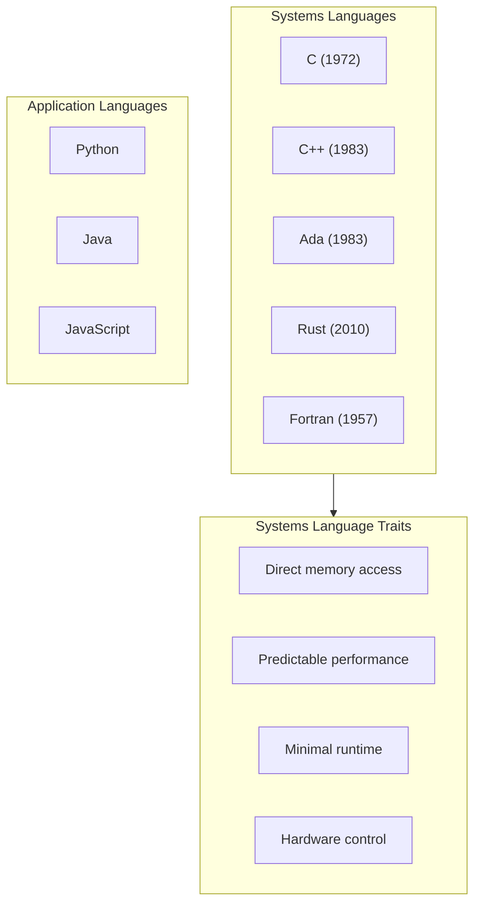
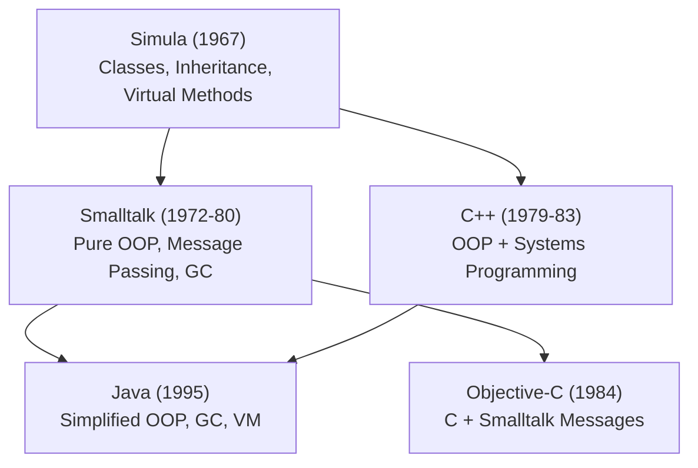
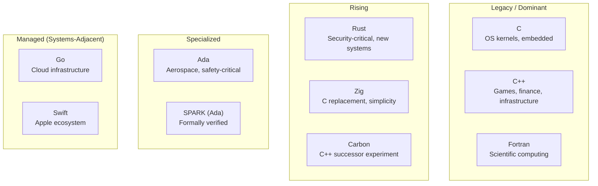
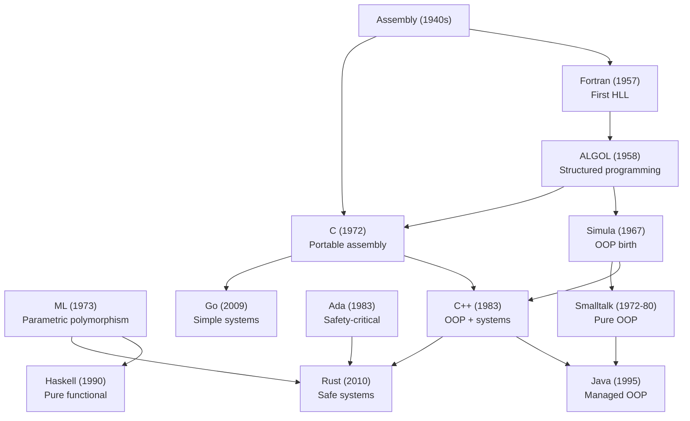

# Foundations - Systems Programming Language Landscape

### *Where C++ Came From, What Surrounds It, and Why It Matters*

*FAT-P Library — January 2026*

---

**Scope:** This document explains the landscape of systems programming languages—where they came from, what problems they solve, and how they relate to C++. It traces the origins of object-oriented programming, generic programming, and modern ideas like memory safety. It positions C++ within a family of languages and ideas so you can understand why C++ works the way it does and what alternatives exist.

**Audience:** Engineers who know C++ but want to understand its place in the broader world of systems programming. Engineers who encounter other languages (Rust, Ada, Fortran) and want historical context. Engineers who wonder where concepts like "classes" and "templates" originated. Engineers making language or tooling decisions who need to understand the tradeoffs different languages make.

**Not covered:** This is not a tutorial for any language other than C++. We discuss other languages to illuminate C++'s design, not to teach them. Detailed syntax, idioms, and best practices for Ada, Rust, Fortran, etc. are out of scope.

**Prerequisites:** Basic understanding of C++ concepts (classes, templates, pointers, compilation). Familiarity with at least one programming language.

---

## Foundations Card

**Topic:** The family of systems programming languages and the ideas that shaped them  
**Why it matters:** Understanding where features came from helps you use them wisely and evaluate alternatives  
**Key concepts:** Simula → OOP; ML/Ada → generics; Lint → static analysis; Rust → ownership  
**Mental model:** Languages are responses to problems; C++ inherits from many lineages  
**Common misconceptions:** OOP was invented for C++; templates came from C; Rust invented memory safety  
**Read next:** Foundations - C++ Historical Context; Foundations - Modern C++ Feature Guide

---

## Table of Contents

1. [What Is a Systems Programming Language?](#what-is-a-systems-programming-language)
2. [Part I: The Prehistory — Assembly and the First Languages](#part-i-the-prehistory--assembly-and-the-first-languages)
3. [Part II: The C Lineage — Portable Assembly](#part-ii-the-c-lineage--portable-assembly)
4. [Part III: The Object-Oriented Revolution — Simula to Smalltalk to C++](#part-iii-the-object-oriented-revolution--simula-to-smalltalk-to-c)
5. [Part IV: Generic Programming — From ML to Ada to Templates](#part-iv-generic-programming--from-ml-to-ada-to-templates)
6. [Part V: The Safety-Critical World — Ada and Its Legacy](#part-v-the-safety-critical-world--ada-and-its-legacy)
7. [Part VI: Static Analysis — From Lint to Modern Tooling](#part-vi-static-analysis--from-lint-to-modern-tooling)
8. [Part VII: The Rust Challenge — Memory Safety Without Garbage Collection](#part-vii-the-rust-challenge--memory-safety-without-garbage-collection)
9. [Part VIII: The Modern Landscape — Where We Are Now](#part-viii-the-modern-landscape--where-we-are-now)
10. [Glossary](#glossary)

---

# What Is a Systems Programming Language?

A **systems programming language** is designed to write software that manages hardware resources directly: operating systems, device drivers, embedded firmware, game engines, databases, compilers. These programs need:

- **Direct memory access:** Manipulating bytes, pointers, and hardware registers
- **Predictable performance:** No hidden costs, no garbage collection pauses
- **Minimal runtime:** No interpreter or virtual machine required
- **Low-level control:** Bit manipulation, memory layout, calling conventions

The systems programming language family includes C, C++, Rust, Ada, Fortran (for numerical systems), and historically assembly language. These contrast with **application programming languages** (Python, Java, JavaScript) that prioritize ease of use over hardware control.



The tension in systems language design is always between **safety** (preventing bugs) and **control** (letting programmers do what they need). Different languages resolve this tension differently.

---

# Part I: The Prehistory — Assembly and the First Languages

## Before High-Level Languages (1940s–1950s)

The first computers were programmed in **machine code**—raw numeric instructions. Programmers wrote numbers representing operations and memory addresses. This was error-prone and machine-specific.

**Assembly language** (late 1940s) added symbolic names:

```asm
; Instead of: 48 89 e5
mov rbp, rsp      ; Symbolic, but still machine-specific
```

Assembly was a huge improvement, but programs couldn't move between machines. Each CPU architecture had its own assembly language.

## Fortran: The First High-Level Language (1957)

**Fortran** (FORmula TRANslation) at IBM was the first widely-used high-level language. It let scientists write mathematical formulas in readable notation:

```fortran
C = SQRT(A**2 + B**2)
```

Fortran proved that compilers could generate efficient machine code from high-level descriptions. The language was designed for numerical computation—arrays, matrices, floating-point operations.

**Why Fortran matters for C++ developers:**

1. **The first optimizing compiler:** Fortran's creators (led by John Backus) proved compilers could produce code as fast as hand-written assembly. This established that high-level languages needn't be slow.

2. **Column-based syntax:** Fortran's punched-card heritage (specific columns for labels, statements, continuations) reminds us that syntax reflects its era's technology.

3. **Still alive:** Fortran remains dominant in high-performance scientific computing. If you work with numerical libraries (BLAS, LAPACK), you're calling Fortran code.

## COBOL and the Business World (1959)

**COBOL** (COmmon Business-Oriented Language) targeted business data processing—payroll, inventory, banking. Where Fortran had arrays and math, COBOL had records and files.

COBOL introduced:
- **Self-documenting code:** Verbose syntax intended to be readable by managers
- **Record structures:** Precursors to C structs and C++ classes
- **Decimal arithmetic:** Exact representation for financial calculations

COBOL taught the industry that different domains need different languages—a lesson C++ would later address through its multi-paradigm approach.

---

# Part II: The C Lineage — Portable Assembly

## The Problem Unix Solved (1969–1972)

In the late 1960s, operating systems were written in assembly language, making them tied to specific hardware. Ken Thompson and Dennis Ritchie at Bell Labs wanted a portable operating system.

Thompson first created **B** (derived from BCPL), then Ritchie created **C** (1972) to rewrite Unix. C was "portable assembly":

- Close enough to hardware for OS code
- Abstract enough to compile on different machines
- Simple enough that compilers were easy to write

```c
/* C: The same code compiles on PDP-11, VAX, x86, ARM */
int main() {
    char *msg = "Hello, World\n";
    write(1, msg, 13);
    return 0;
}
```

## C's Design Philosophy

C embodied several principles that C++ inherited:

**Trust the programmer.** C assumes you know what you're doing. It allows dangerous operations because sometimes you need them.

**Don't pay for what you don't use.** There's no hidden overhead. If you don't use a feature, it costs nothing.

**Keep the language small.** The entire C language fits in a small manual. Complexity lives in libraries, not the language.

**Make it possible to write compilers.** C was designed to be easy to compile, enabling the language to spread to new machines quickly.

## What C Lacked

By the 1980s, C programs were getting large—hundreds of thousands of lines. C's weaknesses became clear:

| Problem | C's Limitation | Later Solution |
|---------|---------------|----------------|
| No encapsulation | Structs have public fields | C++ classes with private |
| No polymorphism | `void*` casts, lose type safety | Virtual functions, templates |
| No automatic cleanup | Manual malloc/free | Destructors, RAII |
| Name collisions | Global namespace | Namespaces, classes |
| Weak type checking | Implicit conversions | Stronger typing, `explicit` |

C++ was one response. Others included Objective-C (for NeXT/Apple) and various object-oriented extensions.

---

# Part III: The Object-Oriented Revolution — Simula to Smalltalk to C++

## Simula: Where Objects Began (1967)

**Simula** (SIMUla LANguage), developed by Ole-Johan Dahl and Kristen Nygaard in Norway, invented object-oriented programming. Designed for simulation (modeling real-world systems), Simula needed a way to represent entities with state and behavior.

Simula introduced:
- **Classes:** Templates for creating objects
- **Objects:** Instances with data and procedures
- **Inheritance:** One class extending another
- **Virtual methods:** Runtime method dispatch

```simula
! Simula code from the 1960s
class Shape;
    virtual: procedure draw;
begin
    ! Base shape class
end;

Shape class Circle(radius);
    real radius;
begin
    procedure draw;
    begin
        ! Draw circle logic
    end;
end;
```

This should look remarkably familiar to C++ programmers. That's not coincidence—Bjarne Stroustrup studied Simula and brought these concepts to C++.

## Smalltalk: Pure Objects (1972–1980)

At Xerox PARC, Alan Kay created **Smalltalk**, taking OOP in a different direction. In Smalltalk, *everything* is an object—even numbers, booleans, and classes themselves. Objects communicate by sending messages.

Smalltalk's influence:
- **Integrated development environments:** Smalltalk pioneered the IDE concept
- **Message passing:** Objects respond to messages, not function calls
- **Reflection:** Programs can inspect and modify themselves
- **Garbage collection:** Memory managed automatically

Smalltalk prioritized programmer productivity over raw performance. This made it unsuitable for systems programming but influential for application development (and later, languages like Ruby and Objective-C).

## C++: Object-Oriented Systems Programming (1979–1983)

Bjarne Stroustrup, working at Bell Labs, wanted Simula's abstraction with C's performance. His doctoral work involved Simula, and he'd experienced both its elegance and its slowness.

"C with Classes" (1979) added to C:
- Classes with public/private access
- Constructors and destructors
- Inheritance
- Function overloading

The language became C++ in 1983, adding:
- Virtual functions (runtime polymorphism)
- Operator overloading
- References
- `const`

**The key C++ innovation:** zero-overhead abstraction. You don't pay for features you don't use. A C++ class with no virtual functions compiles to the same code as a C struct. This let C++ compete with C for systems programming while offering higher-level abstractions.

```cpp
// C++: OOP without runtime overhead (when you don't need it)
class Point {
    int x_, y_;
public:
    Point(int x, int y) : x_(x), y_(y) {}
    int x() const { return x_; }
    int y() const { return y_; }
};

// Compiles to essentially the same code as:
struct Point { int x, y; };
```

## The OOP Lineage



---

# Part IV: Generic Programming — From ML to Ada to Templates

## The Problem: Type-Specific Code Duplication

Before generic programming, writing a sorting algorithm meant writing it for each type:

```c
void sort_ints(int* arr, int n);
void sort_floats(float* arr, int n);
void sort_strings(char** arr, int n);
/* Same algorithm, different types */
```

Or using `void*` and losing type safety:

```c
void sort(void* arr, int n, int size, int (*cmp)(const void*, const void*));
/* Works, but casts everywhere, no compile-time checking */
```

Generic programming lets you write algorithms once for any type, with full type checking.

## ML: Parametric Polymorphism (1973)

**ML** (Meta Language), developed by Robin Milner at Edinburgh, introduced **parametric polymorphism**—functions that work uniformly for any type:

```ml
(* ML: One function works for any type *)
fun length [] = 0
  | length (x::xs) = 1 + length xs

(* Works for list of int, list of string, list of anything *)
```

ML also pioneered **type inference**—the compiler deduces types without explicit annotations. This influenced C++'s `auto` keyword (C++11) and Rust's type system.

## Ada: Generics for Safety-Critical Systems (1983)

**Ada** (named for Ada Lovelace) was commissioned by the US Department of Defense for military and safety-critical systems. Ada included generics from the start:

```ada
-- Ada generic package
generic
   type Element_Type is private;
package Stack is
   procedure Push(Item : Element_Type);
   function Pop return Element_Type;
end Stack;

-- Instantiation creates a concrete type
package Integer_Stack is new Stack(Element_Type => Integer);
```

Ada's generics were:
- Explicit about constraints ("Element_Type must have assignment")
- Separately compiled (no header bloat)
- Type-checked at definition time, not instantiation

This contrasts with C++ templates, which are checked at instantiation—leading to better error messages in Ada but less flexibility.

## C++ Templates (1988)

C++ templates combined ideas from Ada generics and the STL research by Alexander Stepanov and David Musser:

```cpp
// C++ template: one definition, many instantiations
template <typename T>
T max(T a, T b) {
    return (a > b) ? a : b;
}

int i = max(3, 5);           // max<int>
double d = max(2.7, 1.3);    // max<double>
std::string s = max(std::string("a"), std::string("z"));  // max<std::string>
```

C++ templates are more powerful than Ada generics because they use **duck typing** at compile time: if the operations compile, the type is acceptable. This enables template metaprogramming—computation at compile time.

**The cost:** Template errors are historically horrible because the compiler doesn't know what constraints you intended. C++20 concepts address this:

```cpp
// C++20: Explicit constraints like Ada
template <typename T>
    requires std::totally_ordered<T>
T max(T a, T b) {
    return (a > b) ? a : b;
}

// Now errors mention the constraint, not internal template details
```

## The Generic Programming Lineage

| Language | Year | Approach | Characteristics |
|----------|------|----------|-----------------|
| ML | 1973 | Parametric polymorphism | Type inference, type-safe |
| CLU | 1975 | Parameterized clusters | Explicit constraints |
| Ada | 1983 | Generics | Separate compilation, explicit constraints |
| C++ | 1988 | Templates | Duck typing, instantiation-time checking |
| Java | 2004 | Generics (erasure) | Type-safe but erased at runtime |
| C# | 2005 | Reified generics | Runtime type preservation |
| Rust | 2010 | Traits + generics | Explicit bounds, monomorphization |

---

# Part V: The Safety-Critical World — Ada and Its Legacy

## The Software Crisis and DoD-STD-2167

By the late 1970s, the US Department of Defense was spending billions on software, much of it in hundreds of different languages. Projects failed. Bugs killed people. The DoD commissioned a new language designed for:

- **Reliability:** Prevent bugs at compile time
- **Maintainability:** Code readable decades later by different programmers
- **Real-time systems:** Predictable timing for embedded systems
- **Safety:** Catch errors before deployment

## Ada's Safety Features

Ada introduced features that C++ would adopt years later (and some C++ still lacks):

**Strong typing:**
```ada
-- Ada: Different types, even if same underlying representation
type Meters is new Float;
type Feet is new Float;

D : Meters := 100.0;
E : Feet := D;  -- COMPILE ERROR: type mismatch
```

This concept influenced C++'s "strong typedef" patterns and libraries like `StrongId`.

**Range-checked subtypes:**
```ada
-- Ada: Compiler and runtime enforce bounds
type Percentage is range 0 .. 100;
P : Percentage := 150;  -- COMPILE ERROR or RUNTIME EXCEPTION
```

**Package system:**
```ada
-- Ada: Clear interface/implementation separation
package specification (like .h)
package body (like .cpp)
```

**Tasking (concurrency built-in):**
```ada
-- Ada: Language-level concurrent tasks
task type Worker is
   entry Start;
   entry Stop;
end Worker;
```

**Exception handling:**
Ada had structured exception handling before C++.

## Ada's Influence on C++

Many C++ features echo Ada:

| Ada Feature | C++ Equivalent | Notes |
|-------------|---------------|-------|
| Packages | Namespaces, modules | Ada had it first |
| Generics | Templates | Ada's are more constrained |
| Exception handling | try/catch/throw | Very similar design |
| Strong typing | User-defined types, `explicit` | C++ is weaker |
| Tasking | std::thread, std::mutex | Ada's is more integrated |
| Contracts (Ada 2012) | Contracts (C++20/26) | Ada was decades earlier |

## Why Ada Didn't Dominate

Ada was technically superior for many purposes but didn't become the dominant systems language:

1. **Compiler cost:** Early Ada compilers were expensive and slow
2. **Complexity:** The full language was large and intimidating
3. **C inertia:** Unix and the emerging personal computer industry used C
4. **Market forces:** The DoD mandate expired; industry chose C/C++

Ada remains important in aerospace (Boeing, Airbus), rail systems (European train control), and military systems where failure means death.

---

# Part VI: Static Analysis — From Lint to Modern Tooling

## Lint: The Original Static Analyzer (1979)

**Lint** was written by Stephen Johnson at Bell Labs to catch bugs in C programs that the compiler accepted but were likely errors:

```c
/* Code that compiles but Lint warns about: */
int foo() {
    int x;
    return x;     /* Lint: uninitialized variable */
}

int bar(int a, int b) {
    if (a = b)    /* Lint: assignment in conditional (did you mean ==?) */
        return 1;
    return 0;
}
```

The name "lint" referred to removing the small errors ("lint") from otherwise clean code.

Lint's philosophy: the compiler enforces language rules; lint enforces good practices. This separation influenced the design of later tools.

## Why Separate from the Compiler?

Early C compilers were simple by necessity—computers were slow and memory-limited. Exhaustive checking would slow compilation unbearably.

Lint ran as a separate pass after development, not on every compile. This pattern persists today: compilers optimize for speed; static analyzers optimize for thoroughness.

## The Evolution of Static Analysis

**1980s–1990s: Lint derivatives**

Many tools extended lint's approach:
- **PC-Lint:** Commercial, extensive C/C++ checking
- **Splint:** Annotations for additional checking
- **Purify:** Runtime memory error detection

**2000s: Flow analysis and model checking**

More sophisticated analysis:
- **Coverity:** Interprocedural analysis, finds complex bugs
- **Polyspace:** Proves absence of runtime errors (Ada and C)
- **PVS-Studio:** Pattern-based checking with low false positives

**2010s: Integrated tooling**

Analysis built into compilers and IDEs:
- **Clang Static Analyzer:** AST-based analysis in the LLVM ecosystem
- **GCC warnings:** `-Wall -Wextra -Werror` became standard practice
- **Visual Studio Code Analysis:** Integrated into Microsoft's toolchain

**2020s: AI-assisted and real-time**

- **clang-tidy:** Extensive, configurable checks with auto-fix
- **SonarQube:** Continuous inspection platforms
- **GitHub CodeQL:** Query-based vulnerability detection

## Modern C++ Static Analysis

Contemporary C++ projects typically use layers of analysis:

```bash
# Compile-time: maximum warnings
g++ -Wall -Wextra -Wpedantic -Werror

# Static analysis: deeper checking  
clang-tidy --checks='*' source.cpp

# Runtime sanitizers: dynamic checking
g++ -fsanitize=address,undefined source.cpp
```

**Core Guidelines checkers** enforce the C++ Core Guidelines:
- Lifetime safety (dangling pointers, use-after-free)
- Type safety (unsafe casts, uninitialized variables)
- Bounds safety (array overruns)

```cpp
// clang-tidy can warn about Core Guidelines violations:
int* ptr;           // Warning: uninitialized pointer
int arr[10];
int x = arr[10];    // Warning: array index out of bounds
```

## Static Analysis Limitations

Static analysis cannot catch everything:

**Undecidability:** Some properties (like "does this program halt?") are mathematically impossible to determine in general.

**False positives:** Overly aggressive analysis warns about correct code, causing developers to ignore warnings.

**False negatives:** Analysis misses real bugs, especially those involving complex control flow or runtime values.

**Annotation burden:** Precise analysis often requires programmer-provided annotations, which may be wrong or outdated.

This is why C++ uses a layered approach: compile-time checks, static analysis, runtime sanitizers, and testing.

---

# Part VII: The Rust Challenge — Memory Safety Without Garbage Collection

## The Memory Safety Problem

C and C++ allow memory errors that garbage-collected languages prevent:

```cpp
// Use-after-free
int* p = new int(42);
delete p;
*p = 0;  // Undefined behavior: dangling pointer

// Double-free
int* q = new int(42);
delete q;
delete q;  // Undefined behavior: double delete

// Buffer overflow
int arr[10];
arr[10] = 0;  // Undefined behavior: out of bounds
```

These bugs cause crashes, security vulnerabilities, and unpredictable behavior. They're the #1 source of security vulnerabilities in C/C++ codebases.

## Previous Solutions

**Garbage collection (Java, Go, C#):**
- Automatic memory management
- Cost: Unpredictable pauses, runtime overhead
- Not suitable for systems programming

**Reference counting (Swift, Objective-C):**
- Automatic cleanup when count reaches zero
- Cost: Overhead on every copy, cycles require special handling
- C++ has `shared_ptr`, but it's opt-in

**Smart pointers (modern C++):**
- `unique_ptr`, `shared_ptr` encode ownership
- Cost: Requires discipline; raw pointers still allowed
- Improvement, but not a guarantee

## Rust's Innovation: Ownership and Borrowing (2010–2015)

**Rust** (developed at Mozilla, 1.0 in 2015) introduced a compile-time ownership system that prevents memory errors without garbage collection:

**Ownership:** Every value has exactly one owner. When the owner goes out of scope, the value is dropped.

```rust
fn main() {
    let s1 = String::from("hello");  // s1 owns the string
    let s2 = s1;                      // Ownership moved to s2
    // println!("{}", s1);            // COMPILE ERROR: s1 no longer valid
    println!("{}", s2);               // OK: s2 owns it
}
```

**Borrowing:** You can reference a value without taking ownership, with strict rules:

```rust
fn main() {
    let s = String::from("hello");
    let len = calculate_length(&s);  // Borrow s (immutable reference)
    println!("Length of '{}' is {}", s, len);  // s still valid
}

fn calculate_length(s: &String) -> usize {  // s is a reference
    s.len()
}  // s goes out of scope, but doesn't drop the String (it's borrowed)
```

**Borrow rules:**
1. You can have either one mutable reference OR any number of immutable references
2. References must always be valid (no dangling)

```rust
let mut s = String::from("hello");

let r1 = &s;     // OK: immutable borrow
let r2 = &s;     // OK: another immutable borrow
// let r3 = &mut s;  // COMPILE ERROR: can't mutably borrow while immutably borrowed

println!("{} {}", r1, r2);
// r1 and r2 no longer used after this point

let r3 = &mut s; // OK now: previous borrows ended
```

## What Rust Prevents at Compile Time

| Bug Type | C++ | Rust |
|----------|-----|------|
| Use-after-free | Runtime crash or corruption | Compile error |
| Double-free | Runtime crash or corruption | Impossible (ownership) |
| Dangling pointer | Possible | Compile error |
| Data race | Possible | Compile error |
| Buffer overflow | Possible | Panic (safe code) |
| Null pointer deref | Possible | No null in safe Rust |

## Rust vs C++: Tradeoffs

**Rust advantages:**
- Memory safety guaranteed at compile time
- No garbage collector (predictable performance)
- Data race prevention built into the type system
- Modern tooling (Cargo, built-in package manager)

**C++ advantages:**
- Massive existing codebase and libraries
- More flexible (can break rules when needed)
- Better tooling maturity (IDEs, debuggers, profilers)
- Larger workforce
- Easier C interop

**The uncomfortable truth:** For new, security-critical systems code (parsers, network protocols, cryptography), Rust's safety guarantees are compelling. For existing C++ codebases, migration cost is prohibitive. Both languages will coexist for decades.

## Rust's Influence on C++

Rust has pushed C++ toward more safety:

- **Lifetime annotations:** Proposed for future C++ standards
- **Ownership semantics:** Clearer `unique_ptr` and move semantics
- **Pattern matching:** `std::variant` with `std::visit`
- **Result types:** `std::expected` (C++23) similar to Rust's `Result`
- **Option types:** `std::optional` similar to Rust's `Option`

---

# Part VIII: The Modern Landscape — Where We Are Now

## The Systems Language Ecosystem (2026)



## Language Comparison Table

| Aspect | C | C++ | Rust | Ada | Go |
|--------|---|-----|------|-----|-----|
| **Memory safety** | Manual | Manual + smart ptrs | Ownership system | Manual + strong typing | GC |
| **Concurrency safety** | Manual | Manual + atomics | Compile-time | Language-level tasks | Goroutines + channels |
| **Generics** | Macros | Templates | Traits + generics | Generics | Generics (since 1.18) |
| **OOP** | Structs | Classes + inheritance | Traits (no inheritance) | Packages + tagged types | Interfaces |
| **Compilation** | Fast | Slow (templates) | Slow | Medium | Fast |
| **Runtime** | Minimal | Minimal | Minimal | Minimal-Medium | GC + goroutine scheduler |
| **Error handling** | Return codes | Exceptions or codes | Result type | Exceptions | Multiple returns |
| **Use case** | Kernels, embedded | Everything systems | Security-critical | Aerospace, rail | Cloud, CLI tools |

## When to Use What

**Use C when:**
- Writing kernel code or device drivers
- Maximum portability needed
- Interfacing with everything (C ABI is universal)
- Team has deep C expertise, minimal complexity needed

**Use C++ when:**
- Need OOP, generics, and C-level performance together
- Large existing C++ codebase
- Games, finance, databases, browsers
- Team knows C++ well

**Use Rust when:**
- Memory safety is critical (parsers, crypto, network)
- Writing new systems code without legacy constraints
- Data race prevention matters
- Team willing to learn the ownership model

**Use Ada when:**
- Safety certification required (DO-178C, EN 50128)
- Aerospace or rail systems
- Long-term maintainability paramount
- Formal verification needed (SPARK subset)

**Use Go when:**
- Cloud infrastructure, microservices
- Fast compilation and deployment matter
- GC pauses acceptable
- Simplicity over power

## The Future of C++

C++ continues evolving:

**C++23:** `std::expected`, `std::print`, more `constexpr`
**C++26:** Reflection (proposed), contracts (proposed), pattern matching (discussed)

C++ is not standing still. But it carries 40 years of backwards compatibility, making radical change difficult. The language will likely:

1. **Adopt Rust-inspired safety features:** Lifetime annotations, better ownership tracking
2. **Improve tooling:** Modules reduce header pain; better error messages
3. **Coexist with Rust:** Interop rather than replacement
4. **Remain dominant in existing domains:** Games, finance, embedded, infrastructure

---

# Summary: The Family Tree



C++ sits at the intersection of multiple lineages:
- **From C:** Low-level control, portable assembly, trust the programmer
- **From Simula:** Classes, inheritance, virtual functions
- **From Ada:** Exceptions, strong typing aspirations, generics
- **From ML:** Template metaprogramming concepts, type inference

Understanding these origins helps you use C++ wisely and evaluate when other languages might serve you better.

---

# Glossary

**Ada:** Safety-critical programming language (1983) with strong typing, generics, and tasking. Named for Ada Lovelace.

**ALGOL:** Influential language family (1958+) that introduced structured programming. Ancestor of most modern languages.

**Assembly language:** Low-level symbolic representation of machine code. Machine-specific.

**Borrowing:** Rust's mechanism for referencing data without taking ownership.

**CLU:** Research language (1975) that pioneered abstract data types and iterators. Influenced C++ STL.

**COBOL:** Business-oriented language (1959) with English-like syntax. Still processes most financial transactions.

**Duck typing:** If it quacks like a duck, it's a duck. C++ templates use compile-time duck typing.

**Fortran:** First high-level language (1957), designed for formula translation. Dominant in scientific computing.

**Generic programming:** Writing code that works with any type meeting certain requirements.

**Lint:** Original static analysis tool (1979) for C. Name became generic for static analyzers.

**ML:** Research language (1973) that introduced parametric polymorphism and type inference.

**Ownership:** Rust's core concept: every value has exactly one owner responsible for its cleanup.

**Parametric polymorphism:** Functions or types parameterized by other types. Generics, templates.

**RAII:** Resource Acquisition Is Initialization. C++ pattern tying resource lifetime to object lifetime.

**Rust:** Systems language (2010+) with compile-time memory safety via ownership and borrowing.

**Simula:** First object-oriented language (1967). Introduced classes, inheritance, virtual methods.

**Smalltalk:** Pure object-oriented language (1972–1980) where everything is an object.

**Static analysis:** Analyzing code without running it to find potential bugs.

**Strong typing:** Type system that prevents implicit conversions between unrelated types.

**Template metaprogramming:** Using C++ templates to perform computation at compile time.

**Type inference:** Compiler deducing types without explicit annotations. C++ `auto`, Rust, ML.

**Zero-overhead abstraction:** Principle that abstractions shouldn't cost performance if unused. Core C++ philosophy.

---

*FAT-P Library Documentation — January 2026*
