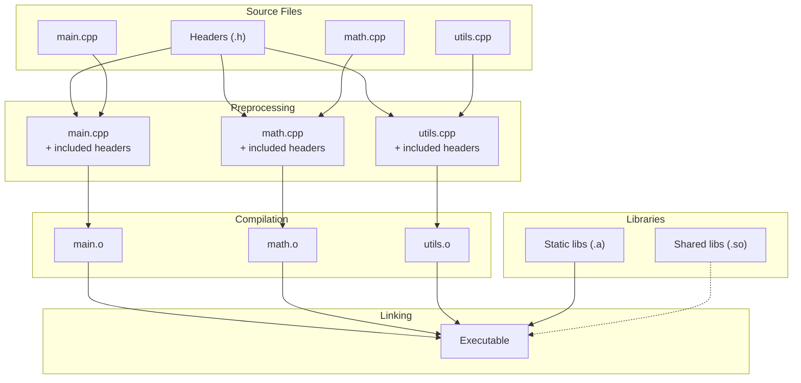

# Foundations - The C++ Compilation Model

### *From Source Code to Running Program*

*FAT-P Library — January 2025*

---

**Scope:** This document explains what happens when you build a C++ program—from source code to executable binary. It covers the compilation pipeline, object files, linking, libraries, and the concepts needed to understand more advanced topics like ABI stability and plugin systems.

**Audience:** Developers who can write basic C++ but don't know what happens "under the hood" when they click "Build." Developers coming from interpreted languages (Python, JavaScript) or managed languages (Java, C#) where compilation is hidden. Anyone who has seen linker errors and wondered what a linker actually does.

**Prerequisites:** Basic C++ syntax (functions, classes, variables). Ability to compile a simple "Hello World" program. No knowledge of build internals assumed.

---

## Foundations Card

**Topic:** How C++ source becomes a running program  
**Why it matters:** Understanding compilation explains linker errors, build times, header design, and library usage  
**Key concepts:** Preprocessing, compilation, object files, symbols, linking, static libraries, shared libraries  
**Mental model:** Build = transform text → machine code → combine pieces → executable  
**Common misconceptions:** "Compilation" means the whole build; headers are compiled separately; `#include` imports like Python  
**Read next:** Foundations - ABI Stability and Module Boundaries; Handbook - Header Design

---

## Table of Contents

1. [The Big Picture](#the-big-picture)
2. [Part I: What Is Compilation?](#part-i-what-is-compilation)
3. [Part II: The Preprocessor](#part-ii-the-preprocessor)
4. [Part III: The Compiler](#part-iii-the-compiler)
5. [Part IV: Object Files and Symbols](#part-iv-object-files-and-symbols)
6. [Part V: The Linker](#part-v-the-linker)
7. [Part VI: Libraries](#part-vi-libraries)
8. [Part VII: Function Pointers](#part-vii-function-pointers)
9. [Part VIII: Putting It All Together](#part-viii-putting-it-all-together)
10. [Glossary](#glossary)

---

# The Big Picture

When you write a C++ program and click "Build," several programs run in sequence:

```
Source Code (.cpp, .h)
        │
        ▼
   Preprocessor ──── Handles #include, #define, #ifdef
        │
        ▼
    Compiler ─────── Translates C++ to machine code
        │
        ▼
   Object Files (.o, .obj) ── Machine code + metadata
        │
        ▼
     Linker ──────── Combines object files, resolves references
        │
        ▼
   Executable ────── The program you can run
```

Most people call this entire process "compilation," but technically:
- **Compilation** is just the middle step (C++ → machine code)
- **Building** is the entire process
- **Linking** is the final combining step

Understanding each step helps you:
- Fix mysterious error messages
- Design headers correctly
- Understand why build times are slow
- Know what libraries are and how they work

Let's walk through each step with concrete examples.

---

# Part I: What Is Compilation?

## The Problem: Computers Don't Understand C++

Your computer's processor (CPU) understands only **machine code**—sequences of numbers that represent instructions. Something like:

```
48 89 e5        mov rbp, rsp
48 83 ec 10     sub rsp, 16
c7 45 fc 05 00  mov DWORD PTR [rbp-4], 5
```

This is nearly impossible for humans to write directly. So we write in C++:

```cpp
int main() {
    int x = 5;
    return x;
}
```

**Compilation** is the process of translating human-readable C++ into machine code that the CPU can execute.

## Why Not Interpret Like Python?

Python doesn't compile ahead of time. The Python interpreter reads your code and executes it line by line. This is simpler but slower—the interpreter must figure out what to do with each line every time the program runs.

C++ compiles once, then runs directly on the CPU. The "figuring out" happens at build time, not run time. This is why C++ programs are typically much faster than Python programs.

## The Compilation Unit (Translation Unit)

C++ compiles one `.cpp` file at a time. Each `.cpp` file, after preprocessing, is called a **translation unit**.

```
main.cpp      →  main.o       (one translation unit)
math.cpp      →  math.o       (another translation unit)
utils.cpp     →  utils.o      (another translation unit)
```

The compiler doesn't see your whole program at once. It sees one file, produces one object file, then moves to the next. This is important for understanding many C++ behaviors.

---

# Part II: The Preprocessor

Before the compiler sees your code, the **preprocessor** transforms the text. It handles lines starting with `#`.

## `#include` — Copy and Paste

The most common preprocessor directive is `#include`. It literally copies the contents of another file into your file:

```cpp
// main.cpp
#include "math.h"

int main() {
    return add(2, 3);
}
```

```cpp
// math.h
int add(int a, int b);
```

After preprocessing, the compiler sees:

```cpp
// main.cpp (after preprocessing)
int add(int a, int b);

int main() {
    return add(2, 3);
}
```

The `#include` line is replaced with the entire contents of `math.h`. This is not "importing a module" like in Python—it's literally text substitution.

**This explains:**
- Why the same header included in many files increases build time (it's processed every time)
- Why header guards (`#pragma once` or `#ifndef`) exist (to prevent duplicate definitions)
- Why circular includes cause problems (infinite copy-paste loop)

## `#define` — Text Replacement

`#define` creates a macro—a text replacement rule:

```cpp
#define MAX_SIZE 100
#define SQUARE(x) ((x) * (x))

int array[MAX_SIZE];      // Becomes: int array[100];
int y = SQUARE(5);        // Becomes: int y = ((5) * (5));
```

The preprocessor just replaces text. It doesn't understand C++. This is why macros can be dangerous:

```cpp
int z = SQUARE(a + b);    // Becomes: int z = ((a + b) * (a + b));
                          // Works correctly because of parentheses

// Without parentheses in macro:
#define BAD_SQUARE(x) x * x
int z = BAD_SQUARE(a + b); // Becomes: int z = a + b * a + b;
                           // Wrong! Operator precedence issue
```

## `#ifdef` — Conditional Compilation

The preprocessor can include or exclude code based on whether macros are defined:

```cpp
#ifdef DEBUG
    std::cout << "Debug: x = " << x << std::endl;
#endif

#ifdef _WIN32
    // Windows-specific code
#else
    // Unix-specific code
#endif
```

This happens before compilation. The compiler never sees the excluded code.

## Seeing Preprocessor Output

You can see what the preprocessor produces:

```bash
# GCC/Clang: -E flag stops after preprocessing
g++ -E main.cpp -o main.i

# Look at main.i to see the expanded code
```

For a file with `#include <iostream>`, the preprocessed output can be tens of thousands of lines—the entire iostream header and everything it includes.

---

# Part III: The Compiler

After preprocessing, the compiler translates C++ into machine code. This is the most complex step.

## What the Compiler Does

1. **Lexical analysis:** Breaks code into tokens (`int`, `main`, `(`, `)`, `{`, etc.)
2. **Parsing:** Builds a tree structure representing the program's grammar
3. **Semantic analysis:** Checks types, resolves names, enforces rules
4. **Optimization:** Transforms code to run faster
5. **Code generation:** Produces machine code

You don't need to understand these details to use C++. What matters is the output: an **object file**.

## The Compiler Only Sees One File

This is crucial. When compiling `main.cpp`:

```cpp
// main.cpp
#include "math.h"  // Provides declaration: int add(int, int);

int main() {
    return add(2, 3);
}
```

The compiler knows that `add` is a function taking two `int`s and returning `int` (from the declaration in the header). But it doesn't know where `add` is implemented. It doesn't see `math.cpp`.

The compiler generates code that says: "Call a function named `add` with these arguments. I don't know where it is yet—figure it out later."

This "figure it out later" is what the linker does.

## Compiler Errors vs. Linker Errors

**Compiler errors** happen when processing a single file:
- Syntax errors (`int x = ;` — missing value)
- Type errors (`int x = "hello";` — string assigned to int)
- Unknown identifiers (`foo();` — no declaration of `foo`)

**Linker errors** happen when combining files:
- Undefined reference (`add` is declared but never defined)
- Multiple definitions (`add` is defined in two files)

If you see "undefined reference to `foo`", the compiler was fine—each file compiled successfully. The problem is that no file provided the implementation of `foo`.

---

# Part IV: Object Files and Symbols

## What's in an Object File?

The compiler produces an **object file** (`.o` on Unix, `.obj` on Windows) for each translation unit. An object file contains:

1. **Machine code:** The compiled functions
2. **Data:** Global and static variables
3. **Symbol table:** Names of functions and variables
4. **Relocation information:** "I need the address of `add` here"

Let's see a concrete example:

```cpp
// math.cpp
int add(int a, int b) {
    return a + b;
}

int multiply(int a, int b) {
    return a * b;
}
```

After compilation, `math.o` contains:
- Machine code for `add` (maybe 10 bytes)
- Machine code for `multiply` (maybe 10 bytes)
- Symbol table: "`add` is at offset 0, `multiply` is at offset 10"

## Symbols: Names in Object Files

A **symbol** is a name that refers to something in the object file—usually a function or global variable.

```cpp
// main.cpp
extern int global_count;  // Declares a symbol (defined elsewhere)

int main() {              // Defines a symbol "main"
    return add(2, 3);     // References symbol "add"
}
```

After compiling `main.cpp`:
- **Defined symbols:** `main` (we have the code here)
- **Undefined symbols:** `add`, `global_count` (we need these from somewhere)

You can inspect symbols in an object file:

```bash
# Unix: nm shows symbols
nm main.o

# Output might look like:
                 U add           # U = Undefined (needed)
0000000000000000 T main          # T = Text (defined function)
                 U global_count  # U = Undefined (needed)
```

## Symbol Types

Different symbol types you might see:

| Symbol | Meaning |
|--------|---------|
| `T` | Defined function (in "text" section) |
| `U` | Undefined (needed from elsewhere) |
| `D` | Defined initialized data |
| `B` | Defined uninitialized data (BSS) |
| `W` | Weak symbol (can be overridden) |

## Why This Matters

Understanding symbols helps you debug linker errors:

```
undefined reference to `add(int, int)'
```

This means:
- Some object file references the symbol `add`
- No object file defines the symbol `add`
- You either forgot to compile a file or forgot to link a library

```
multiple definition of `add(int, int)'
```

This means:
- Two object files both define `add`
- This violates the **One Definition Rule** (ODR)
- Usually caused by putting function definitions in headers without `inline`

---

# Part V: The Linker

## What the Linker Does

The **linker** takes multiple object files and combines them into an executable:

```
main.o + math.o + utils.o → program.exe
```

Its primary job is **symbol resolution**: matching undefined symbols to their definitions.

```
main.o says: "I need 'add'"
math.o says: "I have 'add' at offset 0"
Linker says: "OK, when main.o calls 'add', jump to math.o offset 0"
```

## A Complete Example

Let's trace through a complete build:

```cpp
// math.h
#ifndef MATH_H
#define MATH_H
int add(int a, int b);      // Declaration only
int multiply(int a, int b); // Declaration only
#endif
```

```cpp
// math.cpp
#include "math.h"
int add(int a, int b) { return a + b; }       // Definition
int multiply(int a, int b) { return a * b; }  // Definition
```

```cpp
// main.cpp
#include "math.h"
int main() {
    int sum = add(2, 3);
    int product = multiply(4, 5);
    return sum + product;
}
```

Build process:

```bash
# Step 1: Compile main.cpp → main.o
g++ -c main.cpp -o main.o
# main.o defines: main
# main.o needs: add, multiply

# Step 2: Compile math.cpp → math.o
g++ -c math.cpp -o math.o
# math.o defines: add, multiply
# math.o needs: (nothing)

# Step 3: Link everything → program
g++ main.o math.o -o program
# Linker matches main.o's needs with math.o's definitions
# Result: executable program
```

## What Can Go Wrong

**Missing object file:**
```bash
g++ main.o -o program  # Forgot math.o!
# Error: undefined reference to `add(int, int)'
```

**Missing definition:**
```cpp
// math.h declares "subtract" but math.cpp doesn't define it
int subtract(int a, int b);  // Declaration

// main.cpp calls it
int x = subtract(5, 3);  // Uses the declaration

// Link error: undefined reference to `subtract(int, int)'
```

**Duplicate definition:**
```cpp
// math.h (BAD - definition in header)
int add(int a, int b) { return a + b; }  // Definition, not declaration!

// main.cpp includes math.h → defines add
// math.cpp includes math.h → also defines add
// Link error: multiple definition of `add(int, int)'
```

## The One Definition Rule (ODR)

C++ requires that most things be defined exactly once across the entire program:
- Functions: one definition
- Global variables: one definition
- Classes: one definition per translation unit, but all must be identical

This is the **One Definition Rule**. The `inline` keyword relaxes it for functions, and templates have special rules, but the principle remains: don't put definitions in headers unless you know what you're doing.

---

# Part VI: Libraries

## What Is a Library?

A **library** is a collection of pre-compiled code that you can use in your program. Instead of compiling someone else's source code yourself, you link against their library.

Libraries come in two flavors:
- **Static libraries:** Merged into your executable at link time
- **Shared libraries (dynamic libraries):** Loaded at runtime

## Static Libraries

A **static library** is just a bundle of object files:

```bash
# Create object files
g++ -c math.cpp -o math.o
g++ -c utils.cpp -o utils.o

# Bundle into static library
ar rcs libmylib.a math.o utils.o

# Link against static library
g++ main.o -L. -lmylib -o program
```

When you link with a static library:
- The linker extracts the object files it needs
- Those objects are copied into your executable
- The library file is not needed at runtime

**Pros:**
- Self-contained executable
- No "missing DLL" errors at runtime

**Cons:**
- Larger executable
- Can't update library without recompiling
- Every program has its own copy

## Shared Libraries (Dynamic Libraries)

A **shared library** (`.so` on Linux, `.dll` on Windows, `.dylib` on macOS) is loaded at runtime:

```bash
# Create shared library
g++ -shared -fPIC -o libmylib.so math.cpp utils.cpp

# Link against shared library
g++ main.o -L. -lmylib -o program

# Run (library must be findable)
LD_LIBRARY_PATH=. ./program
```

When you link with a shared library:
- The linker records "this program needs libmylib.so"
- At runtime, the operating system loads the library into memory
- Multiple programs can share one copy of the library

**Pros:**
- Smaller executables
- Update library without recompiling programs
- Memory shared between programs

**Cons:**
- Must distribute library with program
- "DLL hell" / "missing library" errors possible
- Version compatibility issues

## How Linking Finds Libraries

The `-l` flag tells the linker to look for a library:

```bash
g++ main.o -lmylib -o program
```

This searches for:
- `libmylib.so` (shared library, preferred)
- `libmylib.a` (static library, fallback)

The search path includes:
- Standard directories (`/lib`, `/usr/lib`)
- Directories specified with `-L`
- Directories in `LD_LIBRARY_PATH` (runtime only)

## System Libraries

When you use standard library features:

```cpp
#include <iostream>
#include <vector>
```

You're using the **C++ Standard Library**, which is a shared library provided by your system. The compiler automatically links against it.

The math library (`<cmath>`) is special—you often need `-lm`:

```bash
g++ main.o -lm -o program  # Link math library
```

---

# Part VII: Function Pointers

This section introduces function pointers—a concept needed to understand callback mechanisms and plugin systems.

## Functions Have Addresses

Everything in memory has an address. Functions are stored in memory, so functions have addresses too:

```cpp
#include <iostream>

int add(int a, int b) {
    return a + b;
}

int main() {
    // Print the address of the function
    std::cout << "Address of add: " << reinterpret_cast<void*>(&add) << std::endl;
    // Output: something like 0x401136
    
    return 0;
}
```

The function `add` lives at some memory address. When you call `add(2, 3)`, the CPU jumps to that address.

## Storing a Function's Address

A **function pointer** is a variable that holds a function's address:

```cpp
int add(int a, int b) { return a + b; }
int subtract(int a, int b) { return a - b; }

int main() {
    // Declare a function pointer
    // Type: "pointer to function taking two ints, returning int"
    int (*operation)(int, int);
    
    // Point to the add function
    operation = &add;  // or just: operation = add;
    
    // Call through the pointer
    int result = operation(5, 3);  // Calls add(5, 3), result = 8
    
    // Point to a different function
    operation = &subtract;
    
    result = operation(5, 3);  // Calls subtract(5, 3), result = 2
    
    return 0;
}
```

The syntax is admittedly ugly. Let's break it down:

```cpp
int (*operation)(int, int);
│    │          │
│    │          └── parameter types
│    └── name of the pointer variable
└── return type
```

The parentheses around `*operation` are required. Without them:

```cpp
int *operation(int, int);  // Function returning int*, NOT a function pointer!
```

## Using `typedef` or `using` for Clarity

The syntax becomes more readable with a type alias:

```cpp
// C-style typedef
typedef int (*BinaryOperation)(int, int);

// Modern C++ using
using BinaryOperation = int (*)(int, int);

// Now declare variables easily
BinaryOperation op1 = &add;
BinaryOperation op2 = &subtract;
```

## Why Function Pointers Matter

Function pointers enable **callbacks**—passing a function to another function:

```cpp
// A function that takes a function pointer
void apply_to_array(int* array, size_t size, int (*transform)(int)) {
    for (size_t i = 0; i < size; i++) {
        array[i] = transform(array[i]);
    }
}

int double_it(int x) { return x * 2; }
int square_it(int x) { return x * x; }

int main() {
    int data[] = {1, 2, 3, 4, 5};
    
    apply_to_array(data, 5, double_it);
    // data is now {2, 4, 6, 8, 10}
    
    apply_to_array(data, 5, square_it);
    // data is now {4, 16, 36, 64, 100}
    
    return 0;
}
```

This pattern appears everywhere:
- `qsort()` in C takes a comparison function
- Signal handlers are function pointers
- Plugin systems use tables of function pointers

## Structs of Function Pointers

You can group related function pointers into a struct:

```cpp
struct MathOperations {
    int (*add)(int, int);
    int (*subtract)(int, int);
    int (*multiply)(int, int);
    int (*divide)(int, int);
};

int add_impl(int a, int b) { return a + b; }
int sub_impl(int a, int b) { return a - b; }
int mul_impl(int a, int b) { return a * b; }
int div_impl(int a, int b) { return a / b; }

int main() {
    MathOperations ops = {
        add_impl,
        sub_impl,
        mul_impl,
        div_impl
    };
    
    int sum = ops.add(10, 5);        // 15
    int diff = ops.subtract(10, 5);  // 5
    int prod = ops.multiply(10, 5);  // 50
    int quot = ops.divide(10, 5);    // 2
    
    return 0;
}
```

This is exactly how C achieves "polymorphism"—different implementations behind the same interface. We'll see this pattern in SQLite's extension system and other plugin architectures.

## Function Pointers vs. C++ Alternatives

C++ offers higher-level alternatives:

| Mechanism | Use Case |
|-----------|----------|
| Function pointer | C compatibility, simple callbacks |
| `std::function` | General callable wrapper (can hold lambdas, functors) |
| Virtual functions | Object-oriented polymorphism |
| Templates | Compile-time polymorphism |

But at **ABI boundaries** (between separately compiled code), only function pointers are safe. `std::function` and virtual functions have ABI issues discussed in the companion document.

---

# Part VIII: Putting It All Together

## The Complete Picture



## Common Build Scenarios

**Single file program:**
```bash
g++ hello.cpp -o hello
# Preprocesses, compiles, and links in one command
```

**Multiple files:**
```bash
g++ -c main.cpp -o main.o
g++ -c math.cpp -o math.o
g++ main.o math.o -o program
# Or all at once:
g++ main.cpp math.cpp -o program
```

**Using a library:**
```bash
g++ main.cpp -lsqlite3 -o program
# Links against libsqlite3.so (or .a)
```

**Creating a static library:**
```bash
g++ -c math.cpp -o math.o
g++ -c utils.cpp -o utils.o
ar rcs libmylib.a math.o utils.o
```

**Creating a shared library:**
```bash
g++ -shared -fPIC -o libmylib.so math.cpp utils.cpp
```

## Debugging Build Problems

**"No such file or directory" for header:**
```
fatal error: myheader.h: No such file or directory
```
- Header not in include path
- Fix: Add `-I/path/to/headers`

**"Undefined reference" linker error:**
```
undefined reference to `foo()'
```
- Function declared but never defined
- Or: forgot to compile/link the file containing the definition
- Or: forgot to link a library

**"Multiple definition" linker error:**
```
multiple definition of `foo()'
```
- Function defined in multiple object files
- Usually: definition in header included by multiple .cpp files
- Fix: Move definition to .cpp file, or mark `inline`

**"Cannot find -lxxx" linker error:**
```
cannot find -lmylib
```
- Library not in library search path
- Fix: Add `-L/path/to/library`

---

# Summary: Key Concepts

| Concept | What It Is | Why It Matters |
|---------|-----------|----------------|
| **Preprocessing** | Text transformation before compilation | Explains `#include` behavior and macros |
| **Translation unit** | One .cpp file after preprocessing | Unit of compilation; affects visibility |
| **Object file** | Compiled code + symbols | Intermediate step before linking |
| **Symbol** | Named entity (function, variable) | Linker resolves symbol references |
| **Linking** | Combining object files | Resolves cross-file references |
| **Static library** | Bundle of object files | Merged into executable at link time |
| **Shared library** | Loadable code module | Loaded at runtime; can be shared |
| **Function pointer** | Variable holding function address | Enables callbacks and plugin systems |

## What to Read Next

With this foundation, you're ready for:

- **Foundations - ABI Stability and Module Boundaries:** Why code compiled by different compilers can't always work together, and how to design stable interfaces.

- **Handbook - Header Design:** Best practices for organizing headers to minimize build time and avoid ODR violations.

- **User Manual - Build System Configuration:** CMake and other build system setup.

---

# Glossary

**Assembler:** Program that converts assembly language to machine code. Runs after the compiler.

**BSS:** "Block Started by Symbol." Section of object file containing uninitialized global variables.

**Compilation:** Translation of source code to machine code. Technically just one step of the build process.

**Declaration:** Tells the compiler something exists. `int add(int, int);` declares a function without providing its code.

**Definition:** Provides the actual implementation. `int add(int a, int b) { return a + b; }` defines the function.

**Dynamic linking:** Loading a library at program startup (or later). Contrasts with static linking.

**Executable:** A file that can be run as a program. Contains machine code and metadata for the operating system.

**Header file:** A file (usually `.h` or `.hpp`) containing declarations, included via `#include`.

**Header guard:** Mechanism (`#pragma once` or `#ifndef`/`#define`/`#endif`) preventing multiple inclusion.

**Inline:** Keyword suggesting the compiler substitute the function body at call sites. Also relaxes ODR for functions in headers.

**Library:** Collection of pre-compiled code. Static libraries (`.a`, `.lib`) are merged at link time; shared libraries (`.so`, `.dll`) are loaded at runtime.

**Linker:** Program that combines object files and libraries into an executable.

**Machine code:** Binary instructions executed directly by the CPU.

**Object file:** Output of compilation. Contains machine code, data, and symbol information. Not directly executable.

**ODR (One Definition Rule):** C++ rule requiring exactly one definition of most entities across the program.

**Preprocessing:** Text transformation phase before compilation. Handles `#include`, `#define`, `#ifdef`.

**Relocation:** Linker's process of adjusting addresses in object files when combining them.

**Static linking:** Copying library code into the executable at link time. Contrasts with dynamic linking.

**Symbol:** A name in an object file referring to a function, variable, or other entity.

**Symbol table:** List of symbols in an object file, with their addresses and types.

**Translation unit:** A source file after preprocessing. The unit of compilation.

---

*FAT-P Library Documentation — January 2025*
