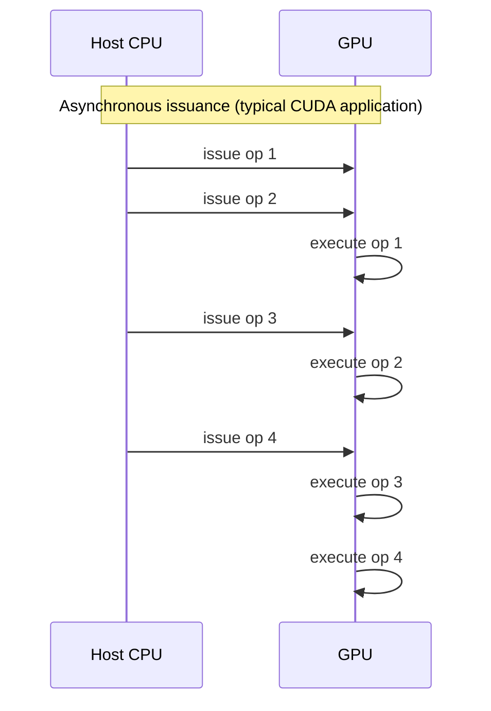
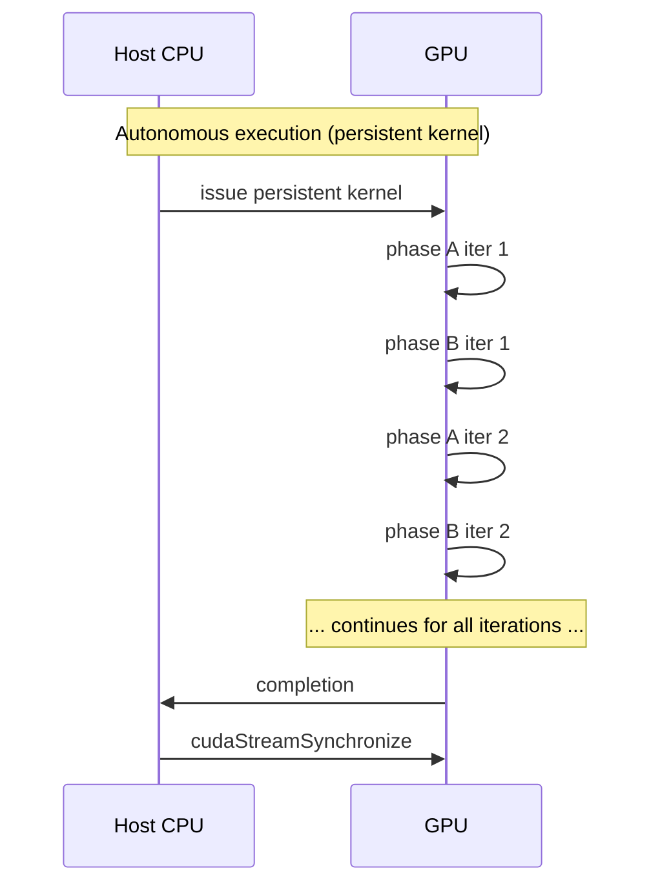
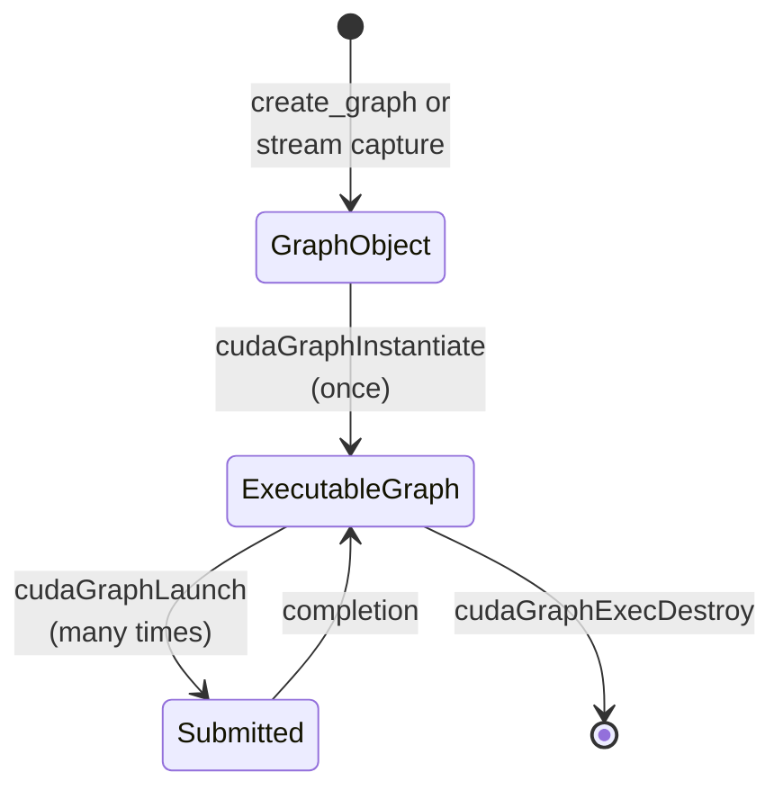

# Foundations - The GPU Programming Model and Host Orchestration

**Scope:** This document explains the architectural model that
distinguishes a GPU from a CPU and the consequences that model has for
how applications dispatch work to the GPU. The central concepts are
the co-processor relationship between host and device, the stream-queue
mediation between them, the cost structure of kernel launches, the
host-callable nature of vendor libraries, the distinction between
asynchronous issuance and autonomous execution, and the mechanisms
(graphs, cooperative launch, stream capture) that exist to manage
or reduce the costs the model imposes.

**Not covered:** Specific CUDA API tutorial material (this is concepts,
not how to call functions); GPU microarchitecture details below the
SM-and-stream level (warp scheduling, register file design,
shared-memory bank conflicts); numerical methods; multi-GPU
coordination; profiling tool specifics; AMD ROCm or Intel oneAPI
equivalents (the architectural arguments generalize, but the API
details are CUDA-specific here).

**Prerequisites:** Basic understanding that GPUs are parallel
processors; familiarity with the concept of a *kernel* as a unit of
GPU work, even without CUDA-specific knowledge; working knowledge of
C++ at the level of `int main()` and function calls. The document does
not require prior CUDA experience but does assume the reader has
written or read enough CUDA-flavored code to recognize the
`kernel<<<grid, block>>>(...)` launch syntax.

---

## Foundations Card

**Topic:** How GPUs differ structurally from CPUs and the consequences
that difference imposes on application architecture.
**Why it matters:** Every performance optimization for GPU-offloaded
workloads bottoms out in this architectural model. Engineers who do
not understand the model produce code that runs on a GPU but does not
*use* the GPU; engineers who do understand it can reason about what
the variants of an offload pattern will and will not buy them.
**Key concepts:** The co-processor model; the stream queue; kernel
launch mechanics; host-callable library APIs; asynchronous issuance
versus autonomous execution; graph-based execution; cooperative launch
and grid synchronization; stream-capture constraints.
**Mental model:** The GPU is a queue-driven kernel executor, not an
autonomous program. The host CPU is the orchestrator; the GPU is the
worker. Performance tuning is largely about reducing the cost of the
host's orchestration work.
**Common misconceptions:** That device-resident data equals
device-resident work; that asynchronous issuance equals autonomous
execution; that streams reduce launch overhead; that GPU libraries
can be called from kernels; that a small per-kernel runtime means the
GPU is being used efficiently.
**Read next:** Pattern Guide - GPU Offload of Iterative Loops
(`PG-GPUOFFLOAD-001`) applies these foundations to a concrete pattern.

---

## Key Concepts

### 1. The Co-Processor Model

A modern CPU is a computer in the full sense. It has a hardware
scheduler that decides what instruction to fetch next, an
out-of-order execution engine that reorders instructions for parallel
execution, branch prediction that speculates past control-flow
decisions, an interrupt controller that handles asynchronous events,
a memory management unit that virtualizes addresses, and a privileged
supervisor mode that lets it run an operating system. The CPU runs
*programs*: ordered sequences of instructions that the CPU walks
through autonomously, making decisions about what to do next based
on its internal state and on signals from external hardware.

A modern GPU is not a computer in this CPU-like sense. It has
hardware that handles many of the *low-level* concerns the CPU
does — a hardware work distributor that schedules blocks onto
SMs as resources become free, a memory management unit that
provides virtual addressing, a degree of preemption support on
recent generations, and even (in CUDA 12 and later) a Device
Graph Launch mechanism that lets a kernel on the device launch
a previously instantiated graph without host involvement. What
it lacks is the *high-level* autonomy that would let it run a
program in the CPU sense: there is no kernel-level scheduler
that decides what kernel to run next based on application logic,
no branch predictor, no interrupt controller in any meaningful
sense, no equivalent of an operating system that orchestrates
work across user processes. The GPU has no `main()` in the way
a CPU program does. The on-device features that exist (Dynamic
Parallelism, Device Graph Launch, cooperative groups) are
mechanisms for executing work that the host has already
prepared and dispatched; they are not entry points the GPU
chooses on its own. SMs idle until work arrives, and the work
arrives because someone else — almost always the host CPU —
prepared and submitted it.

The historical reason for this asymmetry is that GPUs evolved from
fixed-function rasterization pipelines. In the 1990s, the graphics
hardware that would later become the GPU was a peripheral that
turned vertex data into pixel data through a hardwired pipeline.
The CPU drove the pipeline by writing vertex buffers into the
graphics memory and issuing draw calls. There was no need for the
graphics hardware to be autonomous; the CPU had a clear plan and
the graphics hardware executed it. As the pipeline became
programmable — first vertex shaders in the early 2000s, then pixel
shaders, then unified shaders, then CUDA in 2007 — the programming
model retained the CPU-as-driver structure. The shaders became more
flexible, but the flow of control — CPU produces work, GPU consumes
it — never changed.

The architectural reason this asymmetry persists is that the GPU's
parallelism comes from radically simplifying per-thread hardware. A
modern x86 core spends most of its die area on speculative execution,
out-of-order resources, and large caches; only a small fraction is
the ALUs that do the actual computation. A GPU SM inverts this ratio:
most of the die area is ALUs, and the per-thread hardware is
correspondingly minimal. There is no per-thread branch predictor
because there is no per-thread fetch pipeline; warps share a fetch
unit and handle branches by serializing divergent paths. There is
no per-thread reorder buffer because threads are not reordered
relative to each other; the SM relies on having many warps in flight
to hide latency. The structural choices that give the GPU its
throughput advantage also strip out the machinery that would let it
make autonomous control-flow decisions about what to do next at the
program level.

The consequence for application architecture is direct: every unit
of GPU work originates from a host-side API call. There is no
exception to this rule that matters for production HPC code. CUDA
Dynamic Parallelism (where a kernel can launch child kernels) is a
partial exception in that the parent-launching-child case does not
involve the host, but the parent itself was launched by the host,
and Dynamic Parallelism's per-launch overhead is high enough that
it is not used to eliminate host orchestration. The persistent
kernel pattern (where one long-running kernel encompasses what would
otherwise be many launches) is the closest thing to autonomous
execution that production code uses, and even that pattern requires
exactly one host-side launch to start the kernel.

### 2. The Stream Queue

The mechanism that couples host and GPU is the stream. A *stream*
is a per-device first-in-first-out queue of operations: kernel
launches, memory copies, memory sets, library calls, and (more
recently) graph submissions. Operations enqueued on the same stream
execute on the GPU in the order they were enqueued; operations on
different streams may execute concurrently when their resource
demands permit. The stream is the only synchronization primitive
that exists between host and GPU at the operation level.

When you create a stream with `cudaStreamCreate(&stream)`, the
runtime allocates a hardware command buffer and a software-side
bookkeeping structure. The hardware command buffer is what the GPU's
front end reads to find work to dispatch. The software-side
bookkeeping tracks dependencies, callbacks, and the various forms of
event-based synchronization the runtime supports. From the
application's perspective, the stream is an opaque handle; it is
manipulated through API calls but its internal structure is not
exposed.

Multiple streams enable concurrency in two ways. First, the GPU can
execute kernels from different streams simultaneously when its
resources allow — when one kernel does not occupy all SMs, blocks
from a kernel on another stream may be scheduled onto the unused
SMs. Second, the host can issue commands to multiple streams from
multiple host threads, which is sometimes useful when a single
host thread cannot keep up with the GPU's execution rate. What
multiple streams do *not* do is reduce the per-launch host overhead;
the driver work to enqueue an operation is per-operation, not
per-stream.

The default stream is a particular point of confusion that deserves
explicit treatment. CUDA has a "default stream" that is implicit in
launch syntax that does not specify a stream: `kernel<<<grid, block>>>(args)`
without a stream argument enqueues onto the default stream. The
default stream's behavior depends on a compile-time flag. In legacy
mode (the historical default), the default stream is *blocking*: any
operation enqueued on the default stream synchronizes with all other
streams on the device, both before and after. This was a convenience
for code that did not use streams — it made everything serialize
naturally — but it kills concurrency for code that does use streams,
because operations on the default stream prevent overlap with
operations on other streams.

Modern CUDA can be compiled with the `--default-stream per-thread`
flag, which changes the default stream to be per-thread and
non-blocking. In this mode, each host thread has its own default
stream, and operations on it do not synchronize with other streams.
This is the mode most modern code expects, but it has to be
explicitly opted into; legacy code or code that does not set this
flag gets the blocking default stream and the concurrency it
prevents. The mode also affects stream capture, where the legacy
default stream is unusable as a capture stream.

The stream is the conceptual unit of asynchronous work, and
understanding its FIFO semantics is essential to understanding why
graphs help and why they sometimes do not. A stream guarantees order
of execution but not timing of dispatch; the host can enqueue many
operations before any of them run on the GPU, and the GPU can be
running an operation enqueued long ago while the host is enqueuing
new ones. This pipelining is the source of all asynchronous
execution and the reason that asynchronous code feels concurrent
even though the host is the only entity issuing commands.

### 3. Kernel Launch Mechanics

A kernel launch is a host-side operation that the application
invokes through one of two equivalent paths. The high-level path is
the C++ launch syntax `myKernel<<<grid, block, sharedMem, stream>>>(args)`,
which the CUDA C++ compiler lowers to a call to `cudaLaunchKernel`.
The low-level path is `cudaLaunchKernel` itself or its driver-API
sibling `cuLaunchKernel`. Both ultimately produce the same effect:
a launch descriptor is written into the stream's command buffer,
and the function returns to the caller.

What the runtime does between accepting the call and returning is
non-trivial. It validates the kernel handle against the device's
known kernels, checks the grid and block dimensions against the
device's per-launch limits, validates the shared memory request
against the SM's per-block shared memory budget, and validates the
stream against the device's stream registry. It marshals the kernel
arguments into a buffer the GPU can read — this involves copying
the arguments from the host's local stack-allocated locations into
a runtime-managed argument buffer that is part of the launch
descriptor. It writes the launch descriptor into the stream's
command buffer. It updates the stream's metadata (sequence number,
dependency state). And it returns to the caller.

The whole sequence takes on the order of single-digit microseconds
on recent toolkits and recent hardware, but the exact number depends
on host CPU clock, toolkit version, driver version, and kernel
argument count. NVIDIA's own characterization of straight-line
graph launch overhead in CUDA 12.6 measured roughly 2.5 microseconds
plus about 1 nanosecond per node on an Ampere-class device under the
specific conditions of their benchmark; per-kernel direct launch is
typically somewhat higher. The right way to use these numbers is as
order-of-magnitude anchors for predicting whether launch overhead
will matter in your workload — if your per-iteration GPU work is
in the hundreds of milliseconds range, the launch overhead is
negligible regardless of exact value; if it is in the microseconds
range, launch overhead can dominate. Measure on your target hardware
before committing to optimizations that depend on specific numbers.

The cost is host-bound for a structural reason that has nothing to
do with toolkit version: the host CPU is the only entity that can
write to the stream's command buffer in the steady-state
case. The GPU's front end can read from that buffer at high
throughput, but reads are not writes, and the device-side
mechanisms that exist for kernel launches from a kernel (Dynamic
Parallelism, Device Graph Launch) are higher-cost per-launch and
are not callable from inside vendor-library kernels. Reducing host
launch overhead therefore means reducing the number of operations
the host must enqueue, not making each operation cheaper. This is
the architectural reason graphs and persistent kernels exist as
optimization techniques — they reduce *count*, not per-op cost.

The implication for application design is that any loop with
substantial per-iteration GPU work and many kernel launches per
iteration will pay a launch-overhead cost proportional to (number
of iterations) times (launches per iteration) times (microseconds
per launch). A loop with fifty thousand iterations and ten launches
per iteration pays approximately two and a half seconds of pure
launch overhead. This is time the GPU does not see; the GPU is
either idle during it or busy executing a previous launch with some
pipelining hiding part of the cost. Either way, the host is the
bottleneck, and making the GPU faster has no effect.

### 4. Host-Callable Library APIs

Every dense linear algebra library that targets NVIDIA GPUs —
cuSOLVER, cuBLAS, MAGMA, KokkosLapack, KokkosBlas — exposes its
functionality through host-callable functions. You write
`cusolverDnDpotrf(...)` from your host code. The function executes
on the host: it inspects the matrix dimensions, selects an internal
algorithm based on size and device capability, allocates internal
workspace if needed, marshals arguments, and issues one or more
kernel launches into the user-supplied stream. It returns to the
caller, possibly after performing internal host-device synchronization
that some routines need for algorithm-selection or convergence-detection
purposes.

This is structural rather than incidental. Vendor libraries internally
make decisions at runtime that require host-side branchy code with
access to profiling counters, device attributes, and configuration
state. cuSOLVER's `Dpotrf` for a small matrix uses an unblocked
algorithm; for a large matrix it uses a blocked algorithm with
cuBLAS-3 panel updates; the threshold between them is empirically
determined and tuned per device. The selection logic could not run
inside a kernel even if the library authors wanted it to, because
device-side code does not have access to the runtime metadata it
needs and does not have the conditional-launch machinery to dispatch
a different kernel based on size.

The libraries also internally manage workspace memory through pools
that are allocated host-side. cuSOLVER's `bufferSize` query returns
a size that the application is supposed to allocate (`cudaMalloc`
or equivalent) and pass back to the library function. cuBLAS has
its own per-handle workspace that the library manages internally
when set up appropriately. These workspaces are device memory, but
their lifecycle is host-managed; the device-side code in the
library's kernels reads from them but does not allocate them. A
device-callable version of these functions would need a different
memory management model, and that model does not exist in any
production library.

The consequence for application architecture is that any
implementation that uses vendor libraries for linear algebra *must*
let the host orchestrate the per-iteration sequence. A loop that
calls `cusolverDnDpotrf` followed by `cusolverDnDpotrs` is a loop
where the host is in the inner control flow, issuing each operation
to the stream and then issuing the next. The kernels themselves
execute on the GPU, but the *sequencing* of the kernels is on the
host.

The only way to remove the host from the per-iteration loop is to
write the linear algebra yourself, in a kernel, and dispatch it
from device code. That is what the megakernel and persistent-kernel
patterns do (see the companion Pattern Guide for concrete
examples). The cost they pay is giving up vendor library
implementation quality; whether that cost is worth paying depends
on whether the launch-overhead savings outweigh the
factorization-quality losses, which depends on the problem size.

### 5. Asynchronous Issuance Versus Autonomous Execution

The most consequential conceptual mistake engineers make about GPU
programming is conflating asynchronous issuance with autonomous
execution. The two are different concepts that produce different
performance characteristics, and most production code achieves the
former without ever achieving the latter.

*Asynchronous issuance* means the host does not block waiting for
the GPU to finish an operation before issuing the next operation.
When the host calls `cudaLaunchKernel`, the function returns
immediately; the GPU may not have started the kernel yet, may have
started but not finished, or (rarely) may have finished, but the
host does not care. The host issues the next command immediately
and the runtime queues both, possibly concurrently with the GPU
executing the first.

*Autonomous execution* means the host does not issue commands at
all once the work has begun. The GPU runs without per-operation
involvement from the host; the host is free to do other work or
simply wait for completion. Persistent kernels are the canonical
example: the host launches one kernel, the kernel runs the entire
workload internally with grid-wide synchronization between phases,
and the host blocks on a single completion event at the end.

The conflation produces a specific failure mode: an engineer ports
a workload to GPU, observes that the host does not block during
the inner loop, and concludes that "everything is on the GPU." In
reality, the host is busy issuing commands the entire time. The
host CPU is at substantial utilization, the host driver is doing
launch bookkeeping work, and the per-iteration host activity is
the bottleneck. Asynchronous issuance hid the bottleneck because
the host did not visibly *wait*, but it was visibly *working*.

The distinction is most clearly seen in profiling traces. A trace
of an asynchronous-issuance code shows the host CPU continuously
busy in the CUDA driver, with the GPU running short kernels with
small gaps between them; the gaps correspond to host-side
issuance time pipelined imperfectly with GPU execution. A trace
of an autonomous-execution code (a persistent kernel) shows the
host CPU idle except at the very start and end, with the GPU
running one long kernel that consumes the bulk of the time.

Visualizing the timing difference makes the distinction concrete.
In the synchronous-issuance pattern, the host waits for each
operation before issuing the next:

```mermaid
sequenceDiagram
    participant H as Host CPU
    participant G as GPU
    Note over H,G: Synchronous issuance (cudaMemcpy host-blocking form)
    H->>G: issue op 1
    H->>+H: wait
    G->>G: execute op 1
    G->>-H: completion
    H->>G: issue op 2
    H->>+H: wait
    G->>G: execute op 2
    G->>-H: completion
```

In the asynchronous-issuance pattern, the host issues commands
back-to-back without waiting; the GPU executes them in order, and
the host can stay ahead of the GPU as long as the queue does not
fill:



Asynchronous issuance is the typical mode. The host is involved in
every operation, but the host does not *wait* for any operation —
it issues, then issues again. From the host's point of view nothing
ever blocks; from the perf engineer's point of view the host is
nevertheless the source of all the work that gets done, and the
host's per-launch cost determines the steady-state throughput
when launches are short.

In the autonomous-execution pattern, the host issues one command
that encompasses the entire workload and then waits for completion:



This is autonomous in the structural sense that the host does not
issue per-iteration commands. The host is doing nothing during the
kernel's runtime; the GPU has been given the entire workload as a
single unit and runs to completion. This is the performance ceiling
for launch-overhead reduction: there is no remaining per-iteration
host cost to reduce because there is no per-iteration host
involvement.

### 6. Graph-Based Execution

CUDA Graphs are the mechanism, introduced in CUDA 10 and extended
steadily since, that lets an application record a directed acyclic
graph (DAG) of operations once and replay it many times. The recording
phase pays the per-operation host overhead once. Each replay then
submits the entire DAG to the GPU as a single host-side operation.

A graph is a `cudaGraph_t` — an opaque handle to a runtime-managed
DAG description. The DAG's nodes are operations: kernel launches,
memory copies, memory sets, host callbacks, library calls (via
capture), child graphs, and (in CUDA 12 and later) conditional
nodes. The DAG's edges are dependencies; an edge from node A to
node B means B may not start until A has completed. Within the
constraints expressed by the edges, the runtime is free to schedule
nodes for concurrent execution.

Construction has two modes. *Stream capture* mode is initiated by
`cudaStreamBeginCapture(stream)` and terminated by
`cudaStreamEndCapture(stream, &graph)`; between those two calls,
operations enqueued on the stream are recorded into a graph instead
of being dispatched. Stream capture is convenient because it works
with existing code that issues kernels normally; you wrap an existing
sequence in begin/end calls and you have a graph. *Explicit graph
construction* uses `cudaGraphAdd*Node` functions to build a graph
node-by-node. Explicit construction is more verbose but allows
features that capture cannot express, including conditional nodes
and certain kinds of cross-graph dependency.

A graph object is not directly executable. To run a graph, the
application calls `cudaGraphInstantiate(graph_exec, graph)` to
produce a `cudaGraphExec_t` — an executable graph — and then
`cudaGraphLaunch(graph_exec, stream)` to submit the executable to a
stream. The `cudaGraphInstantiate` call performs the actual work of
compiling the graph for the device: it lays out the graph's
operations into a device-friendly format, resolves cross-node
dependencies, and produces an executable representation that the
runtime can submit cheaply. This compilation cost is paid once.
Subsequent `cudaGraphLaunch` calls cost on the order of one
microsecond per launch, much less than the cost of issuing each
operation in the graph individually.

The lifecycle moves between three states: a graph object that
describes the DAG, an executable graph that has been compiled for
the device, and the act of submission that runs the executable.
Each state has its own API surface:



The performance benefit of graphs comes from amortizing per-launch
driver work over many replays. A graph replayed fifty thousand times
at one microsecond per replay costs about fifty milliseconds of host
submission overhead. Issuing the same five operations individually
fifty thousand times at five microseconds per launch costs about
1.25 seconds — the launch-overhead saving the graph delivers is the
difference between those two numbers. The exact magnitudes depend
on hardware, driver, toolkit, host CPU clock, and graph shape.

The benefit is real but bounded. Graphs do not help when the GPU
itself is the bottleneck, only when the host's per-launch cost is
filling gaps between GPU operations. If your GPU operations are
already running back-to-back without gaps — if the host is keeping
the GPU saturated — graphs give you nothing. Profiling shows the
shape of the bottleneck before optimization tells you whether graphs
will help: gaps in the timeline mean host-bound, no gaps mean
GPU-bound.

The benefit is also conditional on the graph being constructible.
Stream capture has constraints (treated below) that disallow many
operations within the captured region. Explicit construction is
more permissive but more verbose. Some operations cannot be
expressed as graph nodes at all in current toolkits — synchronous
host-device transfers, host-side condition variables, and
operations that depend on host-readable device state are excluded
or require recent CUDA 12+ conditional-node features.

### 7. Cooperative Launch and Grid-Wide Synchronization

CUDA threads can synchronize at three granularities: warp, block,
and grid. Warp-level synchronization is implicit; threads within a
warp execute in lockstep on a SIMD ALU group, so any operation
that does not diverge is intrinsically synchronized. Block-level
synchronization is explicit but cheap: `__syncthreads()` is a
hardware-supported barrier across all threads in a block, and it
costs at most a few clock cycles when the block is fully resident.
Grid-level synchronization — across all blocks of a kernel grid —
is fundamentally different and requires the cooperative-launch
mechanism.

The reason grid synchronization is harder than block synchronization
is residency. Within a single SM, all threads of a single block are
guaranteed to be resident simultaneously; the SM cannot evict a
block partway through its execution. A `__syncthreads()` therefore
has all participating threads available to participate. Across the
whole grid, by contrast, blocks are scheduled onto SMs as space
becomes available; not every block in a grid is necessarily resident
at the same time. A naive grid barrier in this regime would
deadlock — blocks already at the barrier would wait for blocks not
yet scheduled to arrive.

The cooperative-launch mechanism, introduced in CUDA 9 and the
`cooperative_groups` namespace, solves this by guaranteeing
residency. A kernel launched via `cudaLaunchCooperativeKernel`
enforces that all blocks in the grid are resident on SMs
simultaneously. The launch fails (with a specific error code)
rather than silently risking deadlock if the requested grid would
not fit. Inside such a kernel, `cooperative_groups::grid_group::sync()`
is a well-defined barrier across all grid threads; the driver
hardware has been configured to wait for all blocks to reach the
barrier before allowing any to proceed.

The price of cooperative launch is grid size. The maximum
cooperative grid is bounded by the device's SM count multiplied by
the per-SM block residency for the specific kernel. A kernel with
heavy register pressure or shared-memory use fits fewer blocks per
SM and therefore admits a smaller cooperative grid. The
`cudaOccupancyMaxActiveBlocksPerMultiprocessor` runtime query
returns the per-SM residency for a given kernel and shared-memory
request; multiplying that by the SM count gives the maximum
cooperative grid size.

The cost of grid synchronization itself is non-trivial but bounded.
A grid sync involves every block writing to a device-resident
counter on entry and spinning on it; the sync completes when the
counter equals the grid size. On NVIDIA V100 a grid sync takes
single-digit microseconds for small grids, more for larger grids.
This is comparable to a kernel launch cost but happens *inside*
the kernel, between phases, without involving the host. A kernel
that does many grid syncs is paying a cost that would not be paid
if the same logical work were split across many separate kernel
launches — but it is also avoiding the per-launch host overhead
of those separate launches, which is usually the better trade.

Cooperative launch requires specific compilation flags. The kernel
must be compiled with `-rdc=true` (relocatable device code) and
linked against `cudadevrt`. This is a non-trivial change for build
systems that did not previously use device-link-time-optimization
features, and it can interact poorly with linkers that are not
configured for RDC. The compilation requirement is a practical
reason to prefer alternatives where possible: if you can express
your work as a graph with `cudaGraphLaunch`, you keep vanilla
`nvcc` flags and avoid the RDC machinery.

### 8. Stream Capture Constraints

Stream capture is the simpler of the two graph-construction
mechanisms, but it has constraints that limit which existing code
can be transparently captured. The fundamental rule is that the
capture region must be purely asynchronous from the host's
perspective: any host-side synchronization is forbidden during
capture, and certain operations that internally synchronize will
either fail at capture time or produce a corrupted graph that
fails at instantiation.

The forbidden operations include the synchronous form of
`cudaMemcpy` (which blocks the host until the copy completes),
`cudaStreamSynchronize` and `cudaDeviceSynchronize`, the legacy
default stream (which synchronizes with all other streams), and
many event-based synchronization patterns. The asynchronous
counterparts are allowed: `cudaMemcpyAsync` is fine, and event-record
operations that participate in graph dependencies rather than
host-side waits are fine. The stream being captured must have been
created with `cudaStreamCreateWithFlags(stream, cudaStreamNonBlocking)`;
the legacy default stream cannot be captured because it cannot
satisfy the non-blocking requirement.

The most consequential constraint in practice is that some library
functions internally synchronize with the host, and capturing them
fails. cuSOLVER's eigenvalue solvers (`cusolverDnCheevd`,
`cusolverDnSsyevd`) and SVD (`cusolverDnSgesvd`) are confirmed to
call `cudaStreamSynchronize` internally on the user-supplied stream
to copy convergence flags or other small status information back
to the host for branching decisions. These internal syncs are part
of the algorithm; they cannot be disabled. Attempting to capture a
graph containing these calls produces `CUSOLVER_STATUS_INTERNAL_ERROR`
either at the call site or as a corrupted graph that fails at
instantiation.

The status of `cusolverDnDpotrf` (Cholesky factorization) and
`cusolverDnDpotrs` (Cholesky solve) was historically more nuanced.
In CUDA 11-era toolkits these routines had similar internal-sync
behavior that broke capture; in CUDA 12.x and later they capture
cleanly under standard capture discipline. The toolkit-agnostic
posture is to keep them outside the captured region (the way Variant
5 of the pattern guide does); the higher-performance posture, valid
on current toolkits, is to fold them inside the captured graph (the
way Variant 6 does). The choice depends on whether the deployment
toolkit is known and recent.

The Cheevd-class capture-breakers are not version-sensitive — they
break capture across all current toolkit versions because the
algorithm itself requires host synchronization for convergence
checking. That category includes Cheevd, Ssyevd, Sgesvd, and
related convergence-iterative routines. These cannot be folded
inside captured graphs at all.

cuBLAS routines are largely capture-clean. cuBLAS-3 calls like
`Dgemm`, `Dtrsm`, and `Dgemv` capture without issue in modern
toolkits, which means that the triangular-solve phases of a
Cholesky-and-solve pipeline *can* go inside a captured graph as
long as the application uses explicit `cublasDtrsm` calls rather
than the convenience `cusolverDnDpotrs` function. This is a
pragmatic reason to prefer two `cublasDtrsm` calls over one
`cusolverDnDpotrs` call when graph capture is in play: the cuBLAS
calls capture, the cuSOLVER convenience function may not.

KokkosBlas and KokkosLapack inherit the capture behavior of
the underlying libraries through Kokkos's `cuda_capture` mechanism
on the CUDA backend. KokkosBlas calls dispatch through cuBLAS,
which means they are largely capture-clean. KokkosLapack calls
dispatch through cuSOLVER, which means they inherit cuSOLVER's
capture problems. The Kokkos Graph API provides an explicit
mechanism (`cuda_capture`) to embed library calls in a graph
node, but the underlying capture semantics are the same as raw
stream capture, and the same caveats apply.

---

## Myths vs Reality

This section addresses ten common misconceptions about GPU
programming. Each entry is a misconception in the form most engineers
hold it, followed by what the architectural model actually says.

### Myth: "Data on the GPU means work happens on the GPU"

**Reality:** Data residency and work residency are different
properties. A `cudaMalloc`-allocated buffer lives in device memory;
the kernels that read and write it execute on the device's SMs.
But the *dispatch* of those kernels happens on the host. Even if
no host-device data movement occurs during a loop, the host is
still issuing every kernel launch, and the host's launch overhead
is a real cost. Engineers who optimize for data residency without
considering control residency produce code that is not making
unnecessary copies but still has the host as the per-iteration
bottleneck.

### Myth: "Asynchronous launches mean the host isn't involved"

**Reality:** Asynchronous launches mean the host does not *wait*
for the GPU to complete an operation before issuing the next one.
They do not mean the host stops issuing operations. Asynchronous
issuance still requires the host to call `cudaLaunchKernel` for
every kernel; the launches happen in rapid succession but they all
happen on the host. The host's CPU is at substantial utilization
during a tight async-issuance loop, and that utilization is
measurable in profiling traces — which is the diagnostic that
distinguishes "host is keeping up" from "host is the bottleneck."

### Myth: "Modern GPUs run programs"

**Reality:** GPUs run kernels dispatched from somewhere else. The
classical case is dispatch from the host CPU, which is the case
this document treats as primary because it covers nearly all
production HPC code. Modern CUDA does have on-device dispatch
mechanisms — Dynamic Parallelism (a kernel can launch child
kernels) and Device Graph Launch (a kernel can launch a previously
instantiated graph) — that allow some autonomy from the host. But
these mechanisms are exceptions in two important senses. First,
their per-launch overhead is higher than host-issued launches, so
they are not used to *eliminate* host orchestration in
performance-sensitive loops; they are used for irregular workloads
where the structure is not known in advance. Second, vendor
libraries (cuSOLVER, cuBLAS) are not callable from inside a kernel,
so any code that uses libraries cannot use these mechanisms even
when they would otherwise help. The "GPU runs programs" mental
model produces wrong predictions for the typical case; the "GPU
runs kernels dispatched by the host, with limited on-device
exceptions for known patterns" model produces correct predictions.

### Myth: "Streams reduce launch overhead"

**Reality:** Streams enable concurrency but do not reduce
per-launch host cost. The driver work to issue an operation is
per-operation, not per-stream; using two streams instead of one
does not halve the launch overhead, it just enables operations on
the two streams to run on the GPU concurrently when their resource
demands permit. Multi-stream programming is the right tool for
overlapping computation with data transfer, or for keeping the
GPU busy while one stream's work is constrained. It is not a tool
for reducing launch overhead. The tools that do reduce launch
overhead are graphs and persistent kernels.

### Myth: "CUDA Graphs make any sequence faster"

**Reality:** Graphs reduce per-launch host cost; they do nothing
about GPU-bound bottlenecks. If your GPU is already running
operations back-to-back with no idle time between them — if the
host is keeping up with the GPU's execution rate — graphs give
you no speedup. Graphs help when there are gaps in the GPU
timeline corresponding to host-side issuance time, and only then.
Profiling reveals which case you are in: kernel runtimes summing
to most of the wall time means GPU-bound; gaps summing to most of
the wall time means host-bound. Graphs help only the latter.

### Myth: "cuSOLVER calls are first-class kernels"

**Reality:** cuSOLVER calls are host functions that internally
launch kernels. The function `cusolverDnDpotrf` is not a kernel;
it is a multi-kernel implementation dispatched through a host
wrapper. The host wrapper performs runtime algorithm selection,
manages workspace memory, and issues several kernel launches into
the user-supplied stream. Some routines also internally synchronize
with the host for algorithm-selection or convergence-detection
purposes; these internal syncs are what makes some cuSOLVER
routines incompatible with stream capture.

### Myth: "Multiple streams equal parallel kernel execution"

**Reality:** Streams enable parallel kernel execution *when GPU
resources allow*. Two kernels on different streams can run
concurrently only if the GPU has SMs free for the second kernel
when the first has occupied some but not all of them. A single
kernel large enough to fill the whole GPU prevents concurrent
execution of any other kernel regardless of how many streams are
in play. Streams are necessary but not sufficient for kernel
concurrency; the kernels themselves must be small enough to leave
room for each other.

### Myth: "GPU memory and unified memory are interchangeable"

**Reality:** Unified memory (CUDA Managed Memory) provides a
single virtual address space spanning host and device, with
pages migrated between them on access. It is convenient for
programming but has performance characteristics distinct from
both host and device memory. Page migration on first touch is
expensive; concurrent access from host and device introduces
coherence overhead. Unified memory is appropriate for
prototyping, for codes with irregular access patterns where
migration cost is small relative to other work, or for systems
with hardware that natively supports unified address spaces (like
NVIDIA Grace Hopper). For tight performance-critical loops on
discrete GPUs, explicitly managed device memory is usually faster
and the access patterns are more predictable.

### Myth: "If kernel runtime is small, the GPU is fast"

**Reality:** Small kernel runtimes can mean fast kernels or they
can mean small *kernels* — not enough work to amortize launch
overhead. A kernel that runs for one microsecond per launch and
launches fifty thousand times spends fifty milliseconds in kernel
work and approximately two hundred fifty milliseconds in launch
overhead. The "kernel is fast" interpretation of small runtime is
wrong here; the correct interpretation is "the workload is too
small per launch to amortize the launch cost." The fix is not to
make the kernel faster (which would help only at the margin) but
to launch it less often: bigger per-launch work, or graphs, or
fusion.

### Myth: "cudaDeviceSynchronize is a debugging tool"

**Reality:** `cudaDeviceSynchronize` is a host-blocking operation
that waits for all in-flight GPU work on all streams to complete.
It serves as a coarse synchronization point and is sometimes
necessary for correctness (when the host needs to read GPU-written
data back). Adding it for debugging purposes — for example,
sprinkling it through a loop to localize an error — radically
changes the performance characteristics of the code, often making
the loop tens of times slower because every iteration now blocks.
Worse, it can mask race conditions that depend on asynchronous
execution timing, making bugs disappear under debugging
instrumentation. The right tools for debugging GPU code are
`cuda-memcheck` (or its modern replacement `compute-sanitizer`),
device-side `printf`, and the NVIDIA debugger; sprinkled
synchronization is a poor substitute that distorts what you are
trying to measure.

---

## Why It Matters for Systems Code

The architectural model has consequences that are visible in
production HPC and systems code, beyond the toy examples that
are typical in introductory CUDA tutorials. This section connects
the foundational concepts to four engineering concerns that real
applications encounter.

### Latency-Sensitive Applications and the Launch-Overhead Floor

Applications that need to dispatch GPU work in response to events
— real-time control systems, low-latency inference servers,
streaming data processing — care about the time from "host
decides to do something" to "GPU has done it." That latency has a
floor set by the kernel launch overhead. Even an empty kernel
takes microsecond-scale time from the host's `cudaLaunchKernel`
call to the kernel's first instruction executing, plus the
kernel's actual runtime, plus any synchronization required before
the host knows the kernel is done.

For a control loop running at one kilohertz, a millisecond per
iteration is the budget. A few microseconds of launch overhead is
sub-percent of that budget per launch; ten launches per iteration
is several percent. For a control loop running at ten kilohertz,
a hundred microseconds is the budget; ten launches per iteration
consumes a substantial fraction. The architectural model predicts
which loop rates are achievable and which are not; engineers who
do not understand the model design control systems with rate
targets that the launch-overhead floor makes impossible.

The fix for latency-sensitive applications is the same as for
throughput-sensitive ones: reduce launch count via graphs,
fusion, or persistent kernels. The persistent kernel pattern is
particularly valuable in control applications where the
iteration is well-defined and the entire loop can run on the
GPU; the host's only job becomes handing input data to the
kernel and reading output data back, with the orchestration
entirely device-side.

### Multi-Rank GPU Sharing in HPC

HPC applications using MPI commonly run multiple ranks per GPU
when the per-rank memory footprint is small relative to GPU
memory. The pattern is one process per CPU core, multiple
processes sharing each GPU, with CUDA's per-process context
isolation handling the sharing. This is efficient for codes
where each rank's GPU work does not saturate the GPU on its own
— the ranks' work overlaps and the GPU stays busy.

The architectural consequences for this pattern are subtle.
Each rank issues launches independently; the GPU's command
buffer is shared across ranks. When two ranks issue overlapping
work that does not fully occupy the GPU, the work runs
concurrently on different SMs. When ranks issue large enough
work to monopolize the GPU, they serialize implicitly. The total
launch overhead is summed across ranks, which means the
launch-overhead optimization techniques in this guide multiply
in importance: a graph that saves milliseconds per rank saves
milliseconds times ranks-per-GPU at the system level.

The cooperative-launch and persistent-kernel patterns interact
poorly with multi-rank GPU sharing. A cooperative launch holds
its grid for the kernel's duration; if the cooperative grid is
sized to fully occupy the GPU (which is the natural choice for
maximum performance), other ranks cannot run any work
concurrently. A persistent kernel holds the GPU for the entire
loop; other ranks block until it completes. Applications using
multi-rank GPU sharing should prefer the graph variants over
cooperative-launch variants for this reason; the graph variants
share the GPU naturally because each graph submission is a
discrete unit of work that can interleave with other ranks' work.

### Profiling-Driven Optimization

The diagnosis-and-fix loop for GPU performance is profiling-driven.
NSight Systems shows the host-and-GPU timeline, NSight Compute
shows kernel-internal performance counters, and the application's
own measurements show wall-time effects. The architectural model
in this document is the lens through which profiling traces are
interpreted; engineers who do not understand the model see traces
that they cannot read.

The most common pattern is the "gap" diagnosis. A trace shows
short kernel runtimes with visible gaps between them. The naive
interpretation — "the kernels are fast" — is wrong; the correct
interpretation is "the host is the bottleneck." The gaps are
host-side issuance time pipelined imperfectly with GPU execution.
The fix is to reduce launch count (graphs or fusion); making the
kernels themselves faster would not close the gaps because the
gaps are not GPU work.

The opposite pattern — kernels running back-to-back with no
gaps, GPU at near-full utilization — is the GPU-bound case.
Graphs and persistent kernels do not help here. The fixes are
algorithmic: faster kernels, better memory access patterns,
larger problem sizes that amortize overhead better. The
architectural model tells you which tool applies.

### The "Ported" / "Tuned" Gap

A workload that has been ported to GPU is often described as
"running on the GPU" in casual technical conversation. From an
architectural perspective the description is incomplete; what
the workload actually does is varies enormously between
implementations. Three common cases illustrate the gap.

A workload "ported to GPU" with synchronous host-device transfers
in the inner loop runs almost entirely on the host's PCIe
bandwidth. The GPU's compute capacity is barely touched. This
is the worst case and is usually fixable by making the data
device-resident, but only if an engineer recognizes the symptom.

A workload "ported to GPU" with device-resident data and
asynchronous launches but without graph fusion runs in the
host-orchestration mode this document treats. The GPU executes
each kernel correctly, but the host is the orchestrator and the
launch overhead may be a substantial fraction of total time.
Whether this matters depends on the per-iteration GPU work; for
short iterations, it matters a lot.

A workload "tuned for GPU" with graphs, megakernel fusion, or
persistent-kernel patterns runs as autonomously as the
architecture permits. The host does almost no orchestration
work; the GPU does almost all of the work that it physically
can. This is the asymptotic state of GPU optimization for a
well-suited workload.

The gap between "ported" and "tuned" is what the companion
Pattern Guide is about. The architectural model in this
document is what makes that gap legible: knowing what the host
is doing, what the GPU is doing, and why each case is the way
it is.

---

## Implications for GPU Offload Patterns

This document's primary downstream consumer is the Pattern Guide
- GPU Offload of Iterative Loops (`PG-GPUOFFLOAD-001`), which
applies the foundational concepts here to a concrete pattern of
host-orchestrated iterative loops with per-iteration linear
algebra. Each variant in that Pattern Guide makes a different
architectural choice and pays a different cost, all of which are
explained by the concepts in this document.

The eager variants (Variants 3 and 4) are the asynchronous-issuance
mode applied to a vendor-library workload: the host orchestrates
every operation, the GPU executes them, and the host's
per-iteration overhead is dominated by per-launch driver work
multiplied by launches per iteration. The graph variants (5 and
6) are the asynchronous-issuance mode with launch-count amortization:
the host still orchestrates, but the orchestration is compressed
into one or two graph submissions per iteration. The megakernel
and persistent-kernel variants (7 and 8) are the autonomous-execution
mode applied at increasing scope: one kernel per iteration in 7,
one kernel for the entire loop in 8.

Choosing among the variants requires understanding which of
these architectural costs is dominant in a given workload, which
is what profiling reveals. The Pattern Guide's selection decision
tree operationalizes the choice. The foundations in this document
are why each branch of that tree is what it is.

---

## Glossary

**Asynchronous issuance:** The mode in which a host-side API call
to enqueue GPU work returns immediately, before the work has
completed. The host then continues to do its own work or issue
further operations; the GPU executes the queued operations in
order. Contrasts with synchronous issuance, where the host blocks
until the operation completes.

**Autonomous execution:** A mode in which the host does not issue
per-operation commands while GPU work is in progress. The
canonical case is a persistent kernel, where the host issues one
launch and then blocks on completion. Contrasts with asynchronous
issuance, where the host is continuously issuing commands even
though it does not wait for each one.

**Cooperative launch:** A CUDA kernel launch made via
`cudaLaunchCooperativeKernel`, which guarantees that all blocks
in the grid are resident on SMs simultaneously. Required for
grid-wide synchronization via `cooperative_groups::grid_group::sync()`.

**CUDA Graph:** A recorded directed acyclic graph of GPU
operations that can be replayed many times with low per-replay
overhead. Constructed via stream capture or explicit graph-node
API. Submitted via `cudaGraphLaunch` after instantiation into a
`cudaGraphExec_t`.

**Grid synchronization:** A barrier that synchronizes all threads
in the grid (not just threads in one block). Provided by
`cooperative_groups::grid_group::sync()` in cooperative kernels.
Required when one phase of a kernel produces data that another
phase consumes across block boundaries.

**Host-callable API:** A library function that runs on the host
CPU, possibly issuing kernel launches into a user-supplied
stream. Distinguished from device-callable functions, which run
inside a kernel. Vendor linear-algebra libraries (cuSOLVER,
cuBLAS, KokkosLapack, KokkosBlas) are host-callable only.

**Host orchestration:** The pattern where the host CPU is
responsible for dispatching the GPU work for each iteration of
an outer loop. Mandatory when using vendor libraries because
those libraries are host-callable only.

**Kernel launch overhead:** The host-side cost of issuing a CUDA
kernel launch, comprising argument marshaling, command-queue
insertion, and driver bookkeeping. Single-digit microseconds on
typical contemporary hardware and toolkits; varies with toolkit
version, driver, host CPU, and kernel argument count. Lower on
newer architectures than older ones, but has not dropped below
the microsecond floor in production toolkits.

**Megakernel:** A single `__global__` kernel that performs
multiple logical phases of one outer-loop iteration, using grid
synchronization to separate the phases. Eliminates per-phase host
launches at the cost of underutilizing SMs during phases that
cannot use the full grid.

**Persistent kernel:** A megakernel where the outer loop itself
runs inside the kernel, so that the entire computation is one
kernel launch. Eliminates all per-iteration host involvement at
the cost of GPU exclusivity for the kernel's duration.

**Stream:** A per-device first-in-first-out queue of GPU
operations. Operations on the same stream execute in order;
operations on different streams may execute concurrently when
resources permit. The conceptual unit of asynchronous work in
CUDA.

**Stream capture:** The CUDA mechanism for recording a sequence
of operations on a stream into a `cudaGraph_t` object. Initiated
by `cudaStreamBeginCapture`, terminated by `cudaStreamEndCapture`.
Subject to constraints that forbid host-side synchronization
during capture.

**Streaming multiprocessor (SM):** The execution unit of a CUDA
GPU, containing many ALUs that execute SIMD-like warps. A
modern V100 has 80 SMs; H100 has more. The number and capability
of SMs determine the GPU's parallel throughput.

**Vendor library:** A library provided by the GPU vendor that
exposes domain-specific functionality through host-callable
APIs. cuSOLVER and cuBLAS are NVIDIA's; rocSOLVER and rocBLAS are
AMD's. Internally implements blocked, multi-kernel algorithms
with runtime algorithm selection.

**Warp:** A group of threads (32 on NVIDIA hardware) that execute
in lockstep on a SIMD ALU group. The unit of execution within an
SM; SMs do not execute individual threads, they execute warps.

---

## Further Reading

The CUDA C++ Programming Guide is the canonical source for the
CUDA programming model. Section 4 (CUDA Graphs) and Section 5
(Cooperative Groups) are directly relevant to this document. The
Programming Guide is updated with each major toolkit release;
recent updates include treatment of conditional graph nodes and
graph-level conditional execution introduced in CUDA 12.

NVIDIA's CUDA Best Practices Guide covers the practical side of
the architectural concerns this document treats abstractly. The
discussion of "asynchronous concurrent execution" is the canonical
explanation of what streams enable and what they do not.

The cuSOLVER Library documentation, particularly the Introduction
chapter, describes the stream model and the routines that depart
from it. Per-routine reference pages note synchronization behavior
where it differs from the asynchronous default; this is the
authoritative source for which routines are capture-clean.

The Kokkos documentation, particularly the Graphs chapter and the
Hierarchical Parallelism chapter, covers the library-side
abstractions over the underlying CUDA mechanisms. The
`cuda_capture` mechanism for embedding native library calls in a
Kokkos graph is documented there.

Mark Harris's NVIDIA Developer Blog post "Getting Started with
CUDA Graphs" is a useful introductory treatment for engineers
who have never used graphs before; it covers the recording and
replay phases with worked examples. The follow-up posts in the
same series cover graph capture, conditional nodes, and
performance characterization.

For the historical evolution of GPU programming models from
fixed-function pipelines through programmable shaders to CUDA,
the chapters on graphics hardware in Hennessy and Patterson's
*Computer Architecture: A Quantitative Approach* provide
context. The architectural distinction between CPU and GPU that
this document treats abstractly has a concrete history in those
chapters.

The NVIDIA Developer Forums contain practical discussion of the
stream-capture problems with cuSOLVER, including thread topics
on `CUSOLVER_STATUS_INTERNAL_ERROR` during graph capture. These
threads are useful for understanding which routines have
historically had problems and how the library has evolved across
versions.

---

*End of Foundations - The GPU Programming Model and Host Orchestration*
