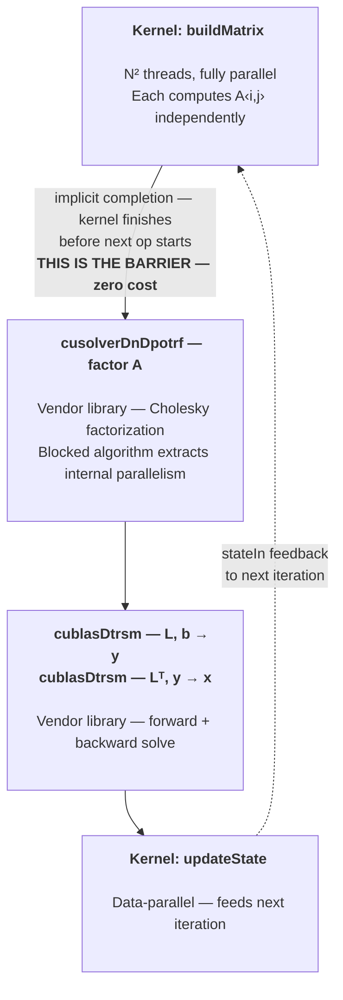

# GPU Offload Triage Procedure

**A general procedure for evaluating CPU code for GPU offload,
including code whose main loop is dispatched through OpenMP.**

---

## Step 0 — Identify the outer iteration structure

Before touching a profiler, read the code and answer three questions about the outermost hot loop:

**0a. What is the iteration structure?**
Is it a simple `for` loop? An OpenMP `parallel for`? A task-based dispatch? An MPI rank loop with OpenMP inside? You need to know whether the iterations of the outer loop are independent or carry state, because this determines whether the GPU transformation targets the *outer* loop, the *inner* work, or both.

**0b. Is there iteration-to-iteration coupling?**
If iteration *k+1* reads results written by iteration *k* — a state vector updated each pass, a running accumulation, a feedback path — the outer loop is a serial recurrence regardless of how the inner work is structured. OpenMP `parallel for` on such a loop is either wrong (gives incorrect results) or is being applied to an *inner* loop inside the recurrence, not the recurrence itself.

**0c. If OpenMP is present, what is it parallelizing?**
OpenMP on the outer loop means the iterations are claimed to be independent — verify this. OpenMP on inner loops means the outer recurrence is serial but the per-iteration work has internal parallelism. This distinction matters because GPU offload of the outer-loop body (one iteration's work) is a fundamentally different problem than GPU offload of the outer loop itself (all iterations simultaneously).

**0d. Do any of the called functions take a mutex or lock?**
If the answer is yes, stop and classify what each lock protects before proceeding. A mutex inside a function called from a `parallel for` means the parallelism is *contested* — threads are dispatched in parallel but serialize at every lock acquisition. This is critical for offload triage because it reveals the true dependency structure that the loop syntax hides.

Classify each lock into one of four categories:

**Category 1 — Lock protects shared accumulation (hidden reduction).**
The function acquires a mutex to add to a shared counter, append to a log, or update a running statistic. This is a reduction pattern wearing a mutex costume. On CPU, replace with `#pragma omp reduction` or thread-local accumulation with a final merge. On GPU, replace with atomic operations or a proper device-side reduction (`cub::DeviceReduce`, `parallel_reduce`). The lock disappears entirely — it was never a real dependency, just a thread-safety mechanism around an associative operation.

**Category 2 — Lock protects shared mutable state read by other iterations (true inter-iteration dependency).**
The function acquires a mutex because it reads and writes a shared data structure that other iterations also read — a shared matrix being updated in place, a global state vector, a shared spatial data structure. This is iteration-to-iteration coupling disguised by the mutex. The `parallel for` is claiming independence that does not exist; the mutex is *enforcing* a serial ordering that the algorithm requires. On GPU, this becomes a fundamental problem: GPU threads do not have mutexes, and even if you simulate one with atomics, you have recreated serial execution at massive hardware cost. **This category often means the outer loop is not actually parallel.** You must determine whether the shared state creates a true recurrence (each iteration needs the result of prior iterations) or whether iterations touch *disjoint* regions of the shared structure and the lock is overly conservative.

**Category 3 — Lock protects ordering or sequencing constraints (serial recurrence hidden behind parallel dispatch).**
The function acquires a mutex to ensure that iteration *k* completes before iteration *k+1* reads its output — or to ensure that writes to a shared structure happen in iteration order. This is a serial recurrence. The `parallel for` plus mutex is simulating a `for` loop with extra overhead. The iterations are not independent; the programmer used a mutex to force the correct ordering that a serial loop would have given for free. **On GPU, this is a non-starter.** You cannot profitably serialize 50,000 iterations on a GPU via atomic spinlocks. The correct move is to recognize the recurrence, drop the pretense of parallelism, and apply Steps 2–5 to the per-iteration body.

**Category 4 — Lock protects infrastructure (allocator, handle pool, logging).**
The function acquires a mutex to allocate memory, acquire a library handle, or write a log entry. The lock does not reflect algorithmic dependence — it reflects a resource bottleneck. On CPU, fix with per-thread allocators, thread-local handles, or lock-free logging. On GPU, these concerns vanish in a different form: GPU memory allocation is done before the kernel, library handles (cuSOLVER, cuBLAS) are created once, and device-side logging does not exist in the same way. **This category does not affect the offload decision.** Strip the infrastructure locks from the analysis and classify the remaining computational work by its true character.

**Category 5 — Lock or barrier is a phase gate between parallel produce and serial/library consume.**
This is the pattern where an expensive, fully data-parallel loop builds a result (a matrix, a buffer, a field) and then a lock or barrier at the end ensures the build is complete before subsequent code reads the result. The lock is not protecting shared state from concurrent modification — it is a **completion fence** separating two phases with different computational character.

Concrete example — the common shape:
```
// Phase 1: expensive, fully parallel — each (i,j) independent
#pragma omp parallel for collapse(2)
for (int i = 0; i < N; i++)
    for (int j = 0; j < N; j++)
        A[i*N + j] = expensiveFunction(state, flags, i, j);

// barrier here (implicit at end of omp parallel, or explicit mutex/fence)
// — all of A must be complete before the next phase reads it

// Phase 2: consumes the built matrix — serial recurrence or library call
info = choleskyInplace(A, N);       // serial column-by-column
forwardSolve(A, b, y, N);          // serial row-by-row
backwardSolve(A, y, x, N);         // serial row-by-row
```

**Why this is the best case for GPU offload triage:**

*The barrier is free on GPU.* A GPU kernel launch is inherently a phase gate — the next operation submitted on the same stream does not begin until the kernel completes. The explicit barrier or mutex that costs real time on CPU (thread wake-up, cache-line bouncing, OS scheduler involvement) becomes a zero-cost structural property of the GPU execution model. You do not need to "port" the barrier; it disappears into the stream ordering.

*The expensive parallel phase is a natural kernel.* If the build loop is the dominant cost and every element is independent, this is exactly what GPU hardware is designed for — thousands of threads each computing one matrix entry, with no synchronization until the kernel completes.

*The data stays resident.* The built matrix is produced on GPU and consumed on GPU by the next phase (a vendor library call like cuSOLVER `dpotrf`). No host round-trip. No PCIe transfer between phases. The matrix lives in device memory from build through consume through the entire iteration.

*The serial consumer becomes a library call.* The Cholesky/solve/FFT that reads the built matrix is not ported as a serial loop — it is replaced by the GPU vendor library (Step 2), which extracts internal parallelism via a blocked algorithm. The "serial as written" property of the CPU source loop is irrelevant because the GPU library uses a different algorithm.

**How to recognize this pattern when it's obscured:**

The clean version above is easy to spot, but in production code the phase gate is often buried:

- **Mutex at the end of a function, not a barrier:** `buildMatrix()` acquires a lock before returning, or the caller acquires a lock after `buildMatrix()` returns. This looks like a Category 2 lock, but if you trace what the lock actually protects, it is completion of the build — no thread should read `A` until all of `A` is written. The tell: the lock is taken once per call (not inside the inner loop), and the protected section is either empty or trivially short (a flag set, a counter increment).

- **Implicit barrier at the end of an OpenMP parallel region:** The `#pragma omp parallel` block closes before the serial code that reads the matrix. The barrier is invisible — it is the closing brace of the parallel region. The profiler shows threads idle at the join point, which looks like load imbalance, but is actually the phase gate working correctly.

- **Mutex wrapping the entire consume phase:** The pattern `lock(); cholesky(A); solve(A,b,x); unlock();` makes it look like the serial phases are the critical section. But the lock is not serializing the math against other iterations of the math — it is ensuring the build phase is done. If the outer loop is a serial recurrence anyway (iteration *k+1* needs the solution from iteration *k*), the lock is redundant with the recurrence and can be removed entirely.

- **Scattered locks that are really one phase gate:** Each function in the iteration body takes its own mutex, but they are all the same mutex, and the effective serialization point is the first lock acquisition after the parallel build. The later locks in the serial phases are uncontested (only one thread is in the serial section at a time) and cost essentially nothing. The real synchronization event is the transition from parallel build to serial consume.

**The GPU execution model for this pattern:**



All five operations run sequentially on one stream. No explicit synchronization between them. The matrix `A` is written by the build kernel and read by `dpotrf` without ever leaving device memory. The "lock at the end of the build loop" has no GPU equivalent because it is not needed — stream ordering provides the guarantee for free.

**The triage conclusion for Category 5:**

If the expensive build phase is the dominant cost and the subsequent phases are vendor-library-replaceable, this pattern is a strong GPU offload candidate. The build kernel gives the GPU the parallelism it wants, the vendor library handles the serial-as-written math, and the phase gate that costs real time on CPU is structurally free on GPU. Proceed directly to Step 2 (operation replacement for the consumer phases) and Step 6 (crossover measurement).

**The diagnostic question:** If you removed every mutex and ran the loop single-threaded, would the program produce the same answer? If yes, the locks are Categories 1, 4, or 5 — thread-safety infrastructure or phase gates, not algorithmic dependence. If no, the locks are Categories 2 or 3 — the mutex is load-bearing and the iterations are not independent. For Category 5 specifically, a second question: does the lock separate a parallel-produce phase from a serial-consume phase? If yes, the GPU execution model gives you that synchronization for free.

**The operational conclusion — run one iteration, single-threaded, and that is your migration unit.**

The entire point of the five-category analysis is to answer one question: can I ignore the locks and treat one iteration's function body as a self-contained block of work? If the answer is yes (Categories 1, 4, 5 — or Category 2/3 locks that turn out to be over-conservative), then:

1. Strip the outer `#pragma omp parallel for`.
2. Remove every mutex acquisition in the iteration body.
3. Run the bare function body once, single-threaded, under a profiler.
4. That single-threaded execution trace — its cost, its phases, its data flow — is the GPU migration candidate.

The GPU does not see the OpenMP. The GPU does not see the mutexes. The GPU sees: "here is the work for one iteration; here are the phases inside it; which phases are data-parallel kernels and which are vendor library calls?" Each iteration becomes a sequence of operations on one CUDA stream. If the outer loop iterations are truly independent, multiple iterations can run on multiple streams — but that is an occupancy optimization decided later, not part of the triage.

**Do not profile the mutex-contested OpenMP version and try to reason about GPU offload from those numbers.** The contention overhead is measuring the wrong thing. The single-threaded per-iteration cost is the number that matters, because it is the cost the GPU must beat per iteration.

**What the mutex pattern means for profiling:** When every function call takes a lock, the profiler sees thread contention as the dominant cost. This is misleading for offload analysis. The profiler is measuring *the overhead of contested parallelism*, not the cost of the actual computation. Profile single-threaded to see the true computational cost per iteration. That single-threaded per-iteration cost is what the GPU must beat, because on GPU the locks either disappear (Categories 1/4/5), become atomics (Category 1), or prove the loop cannot be parallelized at all (Categories 2/3). For Category 5 specifically, the single-threaded profile reveals the true cost split between the parallel build phase and the serial consume phase — this split is the input to the crossover analysis in Step 6.

---

## Step 1 — Profile one iteration, single-threaded

Run the iteration body once, single-threaded, with all locks and OpenMP stripped, under your profiler of choice — Intel Advisor, NVIDIA Nsight Systems, `perf`, ARM MAP, whatever covers your platform. The goal is a ranked list of phases within one iteration, with their computational character and cost.

**Why single-threaded:** The GPU does not see the OpenMP dispatch. It does not see the mutexes. It sees one iteration's worth of work as a sequence of operations on one stream. The single-threaded per-iteration profile is what the GPU execution will actually look like — a sequence of kernels and library calls, no thread contention, no lock overhead. Profile the thing you are actually migrating.

**What to record for each hot region:**

- **Time share** — what fraction of the program is this region?
- **Computational character** — is the work data-parallel (every element independent), reduction-parallel (associative combine), or serial-recurrent (step *j* depends on steps 0..*j*−1)?
- **Trip count** — how many iterations? A loop with 200 iterations cannot fill a modern GPU regardless of its character.
- **Working set** — how much data does this region touch? Does it fit in GPU memory? In L2? In shared memory?
- **FP precision** — FP32 or FP64? Consumer NVIDIA GPUs have a 1:64 or 1:32 FP64:FP32 throughput ratio. Data-center GPUs (A100, H100, V100) have 1:2. This single number can flip the entire offload decision.

**The profiler's loop-level verdict is useful but not final.** The profiler answers "should this source loop be offloaded as a device kernel?" It does not answer the question that actually matters: "should this *operation* be replaced by a different implementation?"

**OpenMP-specific profiling notes:**
You also want the multi-threaded OpenMP profile as a comparison point — this is the CPU baseline you must beat. But for *triage* (deciding what to migrate and how), the single-threaded per-iteration profile is the input. The multi-threaded profile tells you what the optimized CPU can do; the single-threaded profile tells you what the GPU will be doing.

---

## Step 2 — Ask whether the loop should still exist

This is the highest-leverage question and the one most often skipped.

For each hot region, ask: *does this loop implement a named mathematical operation?* Cholesky factorization, triangular solve, dense matrix multiply, FFT, sort, sparse matrix-vector product, eigendecomposition, SVD, convolution — if a vendor library provides a tuned implementation, the engineering move is **operation replacement**, not loop offload.

**Why this matters:** A hand-written Cholesky column loop is serial as written — column *j* needs columns 0..*j*−1. A profiler will correctly flag it as dependency-bound and reject it for offload. But cuSOLVER's `dpotrf` uses a blocked algorithm internally that extracts parallelism the source loop does not express. The profiler is right about the literal loop; the engineering decision lives one abstraction level higher.

**The comparison that matters is optimized CPU library versus optimized GPU library** — not hand-written CPU loop versus GPU. If MKL `dpotrf` is 2.5× faster than your hand-written Cholesky on CPU alone, that is the first real win, and it resets the baseline for the GPU crossover analysis.

**OpenMP parallel regions doing library-equivalent work:** If you find an OpenMP `parallel for` over a loop that computes a standard operation (matrix multiply, element-wise transforms, reductions), the same logic applies. The question is not "can I offload this OpenMP region?" but "should I replace this OpenMP region with a vendor call?" On CPU, that means MKL/OpenBLAS/FFTW. On GPU, that means cuBLAS/cuSOLVER/cuFFT/Thrust. The vendor library handles the parallelism; you do not need OpenMP *or* a hand-written kernel.

---

## Step 3 — Classify each phase of the iteration body

After Step 2, you have a mix of:

- **Phases that are vendor-library calls** (factorizations, solves, FFTs) — these have known GPU equivalents. The question is whether the problem size justifies the GPU version.
- **Phases that are data-parallel** (every element independent) — element-wise transforms, independent row/column operations, map-style computations. These are natural GPU kernel candidates *if* the trip count is large enough and the arithmetic density justifies a launch.
- **Phases that are serial recurrences** — step *j* reads steps 0..*j*−1. These cannot be parallelized by adding more threads or more GPU cores. They must be either replaced by a different algorithm (Step 2) or left on the CPU.
- **Phases that are reduction-parallel** — associative combines (sum, max, dot product). GPUs handle these well above a minimum size.

**OpenMP does not change the classification.** If a loop body has a serial recurrence inside it, wrapping the outer loop in `#pragma omp parallel for` does not make the recurrence parallel — it runs independent copies of the recurrence on different data (if the outer iterations are independent) or it is wrong (if they are not). The per-iteration serial cost is unchanged, and that is what the GPU must beat.

---

## Step 4 — Evaluate the naive GPU port and understand the failure modes

There are two characteristic mistakes when porting iteration bodies to GPU:

**Mistake 1: Flat parallelism over a recurrence.** Writing a `parallel_for` over all elements of a Cholesky or a triangular solve does not produce a slow program — it produces a **wrong** program. The recurrence ordering is destroyed. The checksums may look close (finite precision can mask the error), but the algorithm is mathematically incorrect. Any flat-parallel port of a serial recurrence must be validated against a known-good serial result, not just checked for "reasonable" output.

**Mistake 2: Correct single-team / single-warp execution.** You can preserve the serial ordering by running the recurrence on a single GPU team (one SM, one warp). This is correct but wastes the hardware — you are paying launch overhead, memory transfer, and device occupancy for work that runs on 1/80th of the GPU. This approach will be slower than the CPU in almost all cases.

**The lesson from both mistakes:** Do not force one parallel abstraction to cover both data-parallel and serial-recurrent phases. Use parallel dispatch (OpenMP on CPU, `parallel_for` / kernel launch on GPU) for the data-parallel phases. Use vendor library calls for the dense linear algebra / FFT / sort phases. Mixing these is the core architectural error.

---

## Step 5 — Use the right abstraction for each phase

The correct GPU port maps each phase to the abstraction that matches its computational character:

| Phase character | CPU approach | GPU approach |
|---|---|---|
| Data-parallel (element-wise, map) | OpenMP `parallel for`, vectorized loop | GPU kernel (`parallel_for`, CUDA kernel) |
| Reduction | OpenMP reduction clause | GPU reduction kernel, `cub::DeviceReduce` |
| Dense linear algebra (factor, solve, multiply) | MKL, OpenBLAS, LAPACK | cuSOLVER, cuBLAS, rocSOLVER |
| FFT | FFTW, MKL | cuFFT, rocFFT |
| Sort | `std::sort`, parallel sort | Thrust, `cub::DeviceRadixSort` |
| Sparse matrix ops | MKL Sparse, SuiteSparse | cuSPARSE |
| Serial recurrence (no library equivalent) | Sequential loop | **Leave on CPU**, or redesign the algorithm |
| Mutex-protected accumulation (Category 1) | Remove lock → OpenMP reduction or thread-local merge | Atomics or device-side reduction — lock disappears |
| Mutex-protected shared state (Category 2/3) | Determine if truly serial or over-locked → fix on CPU first | **Resolve the dependency before attempting GPU port** |
| Phase-gate barrier (Category 5) | OpenMP barrier or region close | **Free on GPU** — stream ordering provides the fence |

**If the hot phase is a serial recurrence with no vendor-library equivalent**, the GPU may not help at all for that phase. The offload decision then depends on whether the *remaining* phases have enough runtime to justify the GPU — an Amdahl's Law calculation against the serial fraction.

**If Step 0d found mutex locks:** The Category 1 and 4 locks are gone at this point — replaced by proper reductions, atomics, or per-thread resources. Category 5 phase gates map directly to the GPU stream model and require no porting effort. The remaining question is whether any Category 2 or 3 locks survived. If they did, the phases they protect are serial recurrences and must be handled as such: vendor-library replacement if possible, left on CPU if not. Do not attempt to port a Category 2/3 mutex pattern to GPU by converting it to atomic spinlocks — that produces a correct-but-catastrophically-slow execution that serializes thousands of GPU threads behind a single atomic variable.

---

## Step 6 — Measure the crossover

The CPU wins at small problem sizes. The GPU wins at large problem sizes. The crossover depends on:

- The specific hardware (GPU FP64 throughput, CPU core count, memory bandwidth on both sides)
- The FP precision (FP64 dramatically shifts the crossover toward larger N on consumer GPUs)
- The operation mix (how much is library-replaceable versus data-parallel versus serial)
- Host-device transfer costs (if data must cross PCIe each iteration)

**There is no universal rule. Measure at your sizes on your hardware.**

Run the optimized CPU version (vendor libraries, OpenMP where appropriate) against the GPU version (vendor GPU libraries, kernels for data-parallel phases) at the problem sizes that matter for your application. If the CPU version wins at your production sizes, the answer is "do not offload" and that is a legitimate engineering conclusion.

**OpenMP crossover considerations:** If the CPU code uses OpenMP effectively across many cores, the CPU baseline is already strong. The GPU must beat the multi-threaded, vendor-library-backed CPU version — not the serial scalar baseline. Many offload analyses implicitly compare against single-threaded CPU code, which overstates the GPU advantage.

**Mutex-contaminated baselines:** If the CPU code runs under OpenMP but every function call takes a mutex, the "parallel" baseline is artificially slow — threads are spending their time waiting on locks, not computing. In this case you have *three* baselines to consider: (1) the lock-contested OpenMP version (the production code as-is), (2) a single-threaded version with locks removed (the true serial cost), and (3) an OpenMP version with locks fixed (reductions replacing Category 1 locks, over-conservative locks widened or removed). Comparing the GPU against baseline (1) makes the GPU look better than it is. Comparing against baseline (3) is the fair fight. Often, fixing the mutex pattern on the CPU delivers a larger speedup than moving to GPU — the real bottleneck was lock contention, not insufficient hardware.

---

## Step 7 — Optimize orchestration last

Once kernel quality is right (vendor libraries for the math, proper kernels for the data-parallel phases), *then* consider launch overhead and orchestration:

- **How many kernel launches per outer iteration?** Each launch has overhead (typically 5–15 μs). If you launch 7 kernels per iteration × 50,000 iterations, that is 350,000 launches.
- **Can launches be batched or captured?** CUDA Graphs, stream capture, and graph replay can reduce per-iteration launch overhead to a single graph submit.
- **Is data staying on the device?** If every phase reads from and writes to device memory without host round-trips, the orchestration cost is just launch overhead. If data crosses PCIe each iteration, that dominates.

**The ordering matters: kernel quality first, orchestration second.** A persistent kernel with one total launch that runs a bad algorithm is slower than a 7-launch sequence using vendor libraries. The training document measured this directly: a single-launch persistent kernel was 47× slower than the 7-launch cuSOLVER variant. Launch count is a second-order optimization. Algorithm quality is first-order.

**OpenMP-to-GPU orchestration:** If the original code has `#pragma omp parallel for` around the outer loop with independent iterations, you have a choice: run iterations concurrently on multiple GPU streams (one iteration per stream), or serialize iterations on the GPU and rely on the per-iteration GPU work being faster than the per-iteration CPU work. Multiple streams add complexity (multiple cuSOLVER handles, multiple workspaces, memory multiplied by stream count) and are only worth it if a single stream leaves the GPU underutilized. For large problem sizes with dense linear algebra, a single stream typically saturates the device.

---

## Step 8 — Profile the GPU side

The CPU profiler got you to the GPU. Now use the GPU profiler to evaluate what you built:

- **NVIDIA Nsight Systems** — timeline behavior: launches, gaps between launches, synchronization points, CPU/GPU overlap, stream activity, graph replay. This answers "is orchestration the problem?"
- **NVIDIA Nsight Compute** — per-kernel behavior: occupancy, memory throughput, arithmetic throughput, stalls, warp divergence. This answers "is the kernel the problem?"

A slow GPU result is not a conclusion by itself. The GPU profiler tells you *where* the time is going, which feeds back into Steps 5–7.

---

## Summary — The Decision Ladder

```mermaid
flowchart TD

    A[" &nbsp; &nbsp; &nbsp; &nbsp; &nbsp; &nbsp; &nbsp; &nbsp; <b>STEP 0 — Read the Code</b> &nbsp; &nbsp; &nbsp; &nbsp; &nbsp; &nbsp; &nbsp; &nbsp; <br/><br/>Identify outer loop structure<br/>Simple for · OpenMP parallel for · MPI + OpenMP · Task dispatch<br/>&nbsp;"]

    A --> B{" &nbsp; &nbsp; &nbsp; &nbsp; &nbsp; Mutexes / locks / barriers &nbsp; &nbsp; &nbsp; &nbsp; &nbsp; <br/>in the loop body?<br/>&nbsp;"}

    B -- YES --> C[" &nbsp; &nbsp; &nbsp; &nbsp; &nbsp; &nbsp; <b>Classify Each Lock</b> &nbsp; &nbsp; &nbsp; &nbsp; &nbsp; &nbsp; <br/><br/>Categories 1 – 5<br/>&nbsp;"]
    B -- NO ----> F

    C --> C1[" &nbsp; &nbsp; &nbsp; &nbsp; &nbsp; <b>Cat 1 — Accumulation</b> &nbsp; &nbsp; &nbsp; &nbsp; &nbsp; <br/><br/>Hidden reduction pattern<br/>Replace with omp reduction or GPU atomic / reduce<br/>&nbsp;"]

    C --> C4[" &nbsp; &nbsp; &nbsp; &nbsp; &nbsp; <b>Cat 4 — Infrastructure</b> &nbsp; &nbsp; &nbsp; &nbsp; &nbsp; <br/><br/>Allocator · handle pool · logging<br/>Strip from analysis entirely — not algorithmic dependence<br/>&nbsp;"]

    C --> C5[" &nbsp; &nbsp; &nbsp; &nbsp; &nbsp; <b>Cat 5 — Phase Gate</b> &nbsp; &nbsp; &nbsp; &nbsp; &nbsp; <br/><br/>Parallel build → barrier → serial consume<br/>FREE on GPU: stream ordering = barrier · Best-case offload pattern<br/>&nbsp;"]

    C --> C23{" &nbsp; &nbsp; &nbsp; &nbsp; &nbsp; <b>Cat 2/3 — True Dependency</b> &nbsp; &nbsp; &nbsp; &nbsp; &nbsp; <br/><br/>Shared mutable state or ordering constraint<br/>&nbsp;"}

    C23 -- "Iterations NOT independent" --> SERIAL[" &nbsp; &nbsp; &nbsp; &nbsp; &nbsp; Outer loop is a <b>serial recurrence</b> &nbsp; &nbsp; &nbsp; &nbsp; &nbsp; <br/><br/>Apply Steps 2–5 to the per-iteration body only<br/>&nbsp;"]

    C23 -- "Lock is over-conservative" --> F

    C1 --> F
    C4 --> F
    C5 --> F
    SERIAL --> F

    F[" &nbsp; &nbsp; &nbsp; &nbsp; &nbsp; &nbsp; &nbsp; &nbsp; <b>STEP 1 — Profile One Iteration</b> &nbsp; &nbsp; &nbsp; &nbsp; &nbsp; &nbsp; &nbsp; &nbsp; <br/><br/>Strip outer OpenMP + all locks<br/>Run ONE iteration, single-threaded, under a profiler<br/><b>That execution trace is the GPU migration unit</b><br/>&nbsp;"]

    F --> G{" &nbsp; &nbsp; &nbsp; &nbsp; &nbsp; Does the hot phase implement &nbsp; &nbsp; &nbsp; &nbsp; &nbsp; <br/>a <b>named operation</b>?<br/>Cholesky · FFT · solve · GEMM · sort · SpMV …<br/>&nbsp;"}

    G -- YES --> H[" &nbsp; &nbsp; &nbsp; &nbsp; &nbsp; &nbsp; <b>STEP 2 — Replace with Vendor Library</b> &nbsp; &nbsp; &nbsp; &nbsp; &nbsp; &nbsp; <br/><br/>CPU: MKL · OpenBLAS · FFTW<br/>GPU: cuSOLVER · cuBLAS · cuFFT<br/>&nbsp;"]

    G -- NO --> I[" &nbsp; &nbsp; &nbsp; &nbsp; &nbsp; &nbsp; <b>STEP 3 — Classify Computational Character</b> &nbsp; &nbsp; &nbsp; &nbsp; &nbsp; &nbsp; <br/>&nbsp;"]

    I --> I1[" &nbsp; &nbsp; &nbsp; &nbsp; &nbsp; <b>Data-Parallel</b> &nbsp; &nbsp; &nbsp; &nbsp; &nbsp; <br/><br/>Every element independent → GPU kernel candidate<br/>&nbsp;"]

    I --> I2[" &nbsp; &nbsp; &nbsp; &nbsp; &nbsp; <b>Reduction</b> &nbsp; &nbsp; &nbsp; &nbsp; &nbsp; <br/><br/>Associative combine → GPU reduce / cub<br/>&nbsp;"]

    I --> I3[" &nbsp; &nbsp; &nbsp; &nbsp; &nbsp; <b>Serial Recurrence</b> &nbsp; &nbsp; &nbsp; &nbsp; &nbsp; <br/><br/>Step j reads 0 .. j−1 → Leave on CPU or find a different algorithm<br/>&nbsp;"]

    H --> J
    I1 --> J
    I2 --> J
    I3 --> J

    J[" &nbsp; &nbsp; &nbsp; &nbsp; &nbsp; &nbsp; &nbsp; &nbsp; <b>STEP 6 — Measure Crossover</b> &nbsp; &nbsp; &nbsp; &nbsp; &nbsp; &nbsp; &nbsp; &nbsp; <br/><br/>Production sizes · Production hardware<br/>Compare against <b>OPTIMIZED CPU</b> — vendor libs + OpenMP with locks fixed<br/>NOT the mutex-contaminated baseline<br/>&nbsp;"]

    J --> K{" &nbsp; &nbsp; &nbsp; &nbsp; &nbsp; &nbsp; GPU wins at your sizes? &nbsp; &nbsp; &nbsp; &nbsp; &nbsp; &nbsp; <br/>&nbsp;"}

    K -- YES --> L[" &nbsp; &nbsp; &nbsp; &nbsp; &nbsp; &nbsp; &nbsp; &nbsp; <b>STEP 7 — Optimize Orchestration</b> &nbsp; &nbsp; &nbsp; &nbsp; &nbsp; &nbsp; &nbsp; &nbsp; <br/><br/>CUDA Graphs · stream capture · launch batching<br/><b>Kernel quality first — launch count second</b><br/>&nbsp;"]

    K -- NO --> STOP[" &nbsp; &nbsp; &nbsp; &nbsp; &nbsp; &nbsp; &nbsp; &nbsp; <b>STOP — Use CPU</b> &nbsp; &nbsp; &nbsp; &nbsp; &nbsp; &nbsp; &nbsp; &nbsp; <br/><br/>Fixing the lock pattern on CPU may be the real win<br/>&nbsp;"]

    L --> M[" &nbsp; &nbsp; &nbsp; &nbsp; &nbsp; &nbsp; &nbsp; &nbsp; <b>STEP 8 — Profile the GPU Side</b> &nbsp; &nbsp; &nbsp; &nbsp; &nbsp; &nbsp; &nbsp; &nbsp; <br/><br/>Nsight Systems → orchestration problems<br/>Nsight Compute → kernel problems · Feed back into Steps 5–7<br/>&nbsp;"]
```



**The one-sentence version:**
Replace operations, not loops; classify every lock before assuming parallelism; use vendor libraries for the math; measure the crossover against the optimized CPU baseline (including OpenMP with locks fixed); and never sacrifice kernel quality for fewer host calls.
