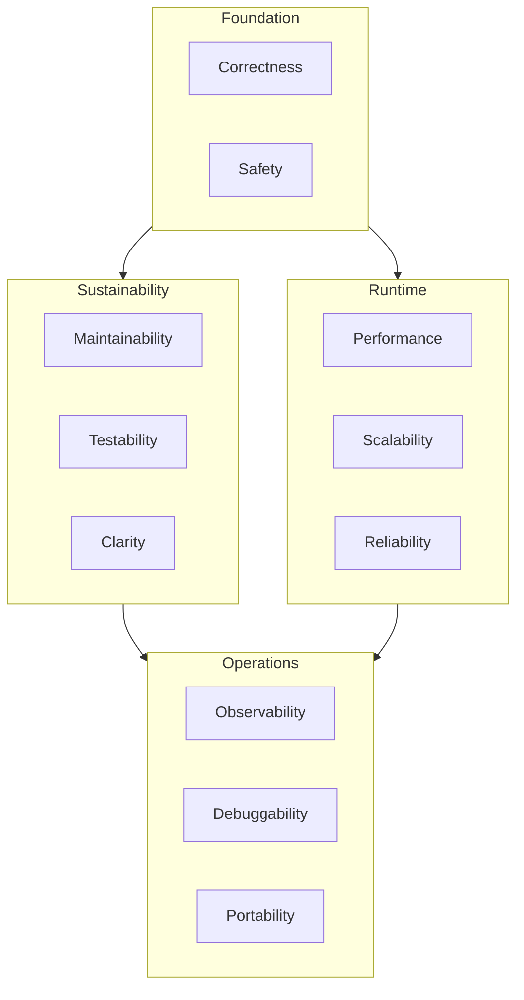
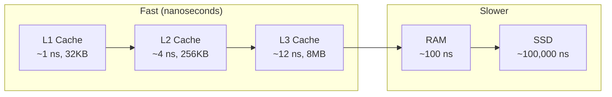
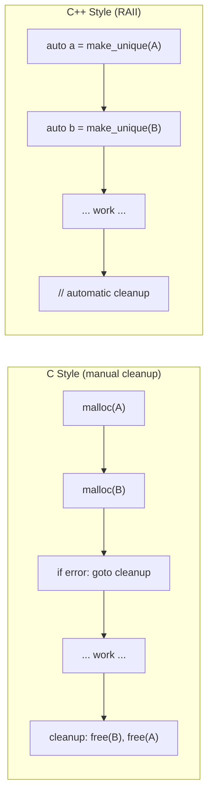
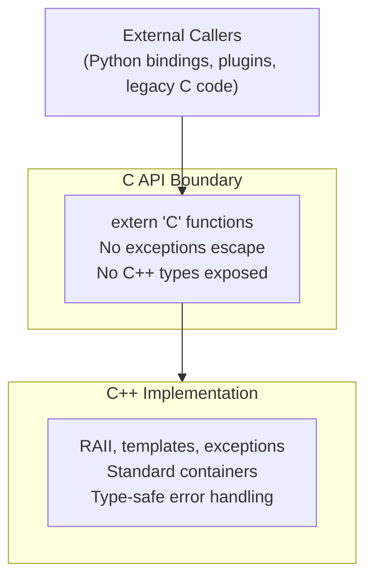
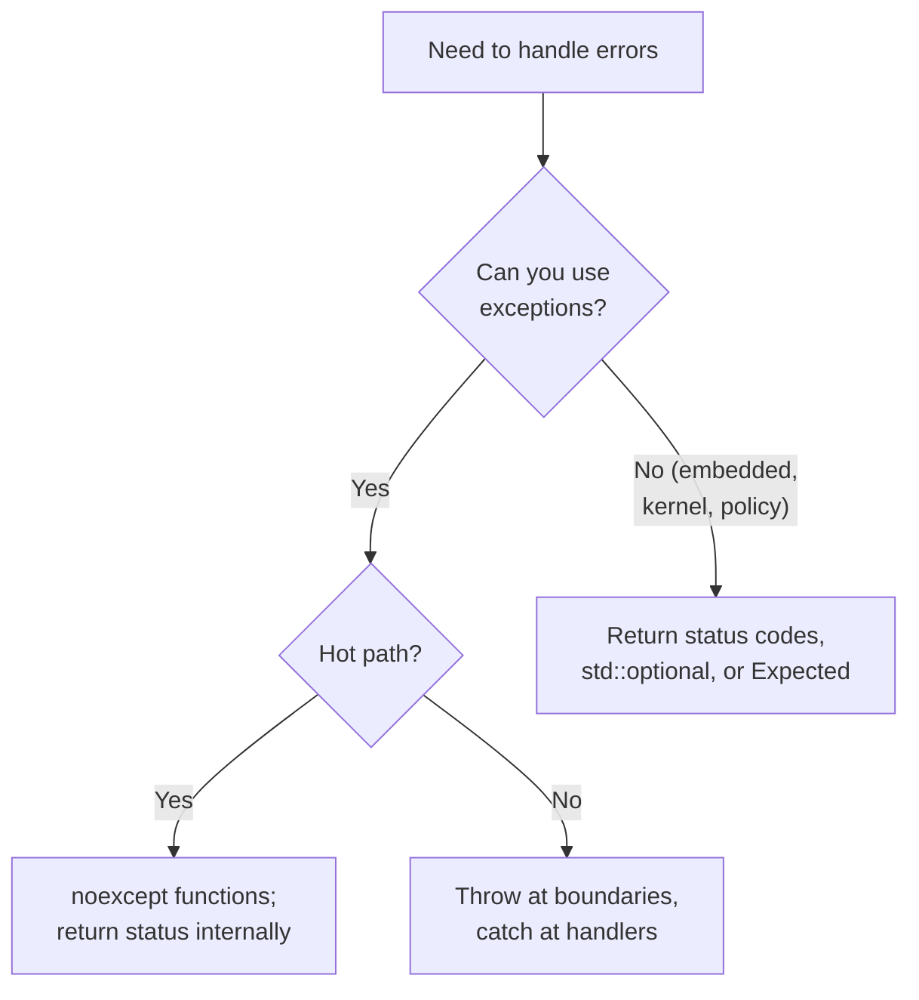
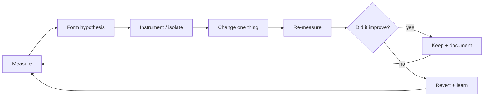
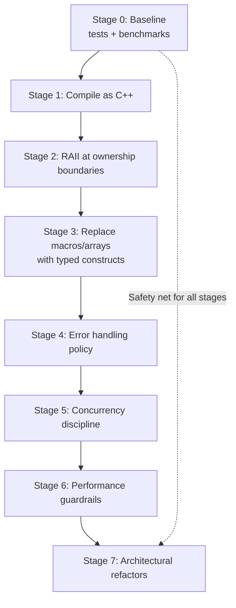
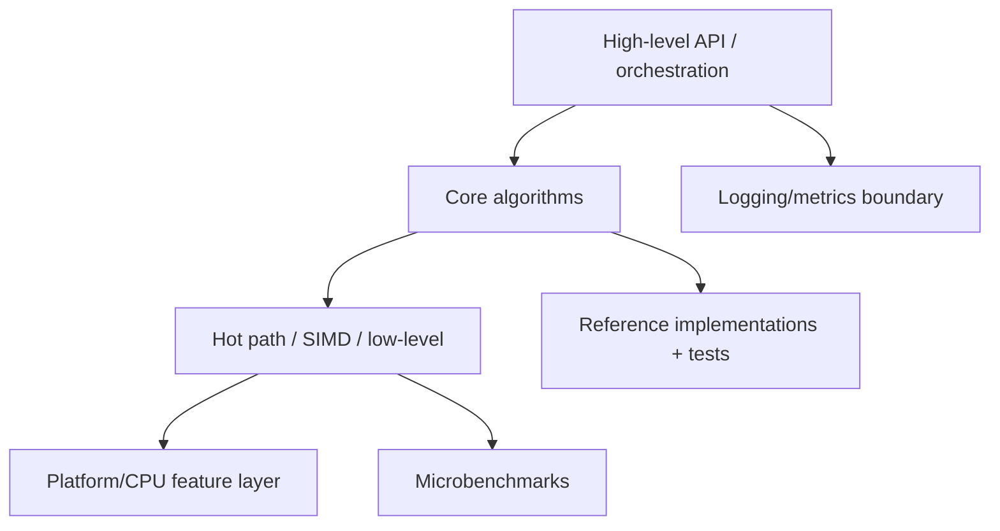
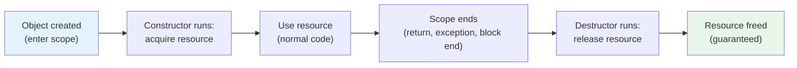
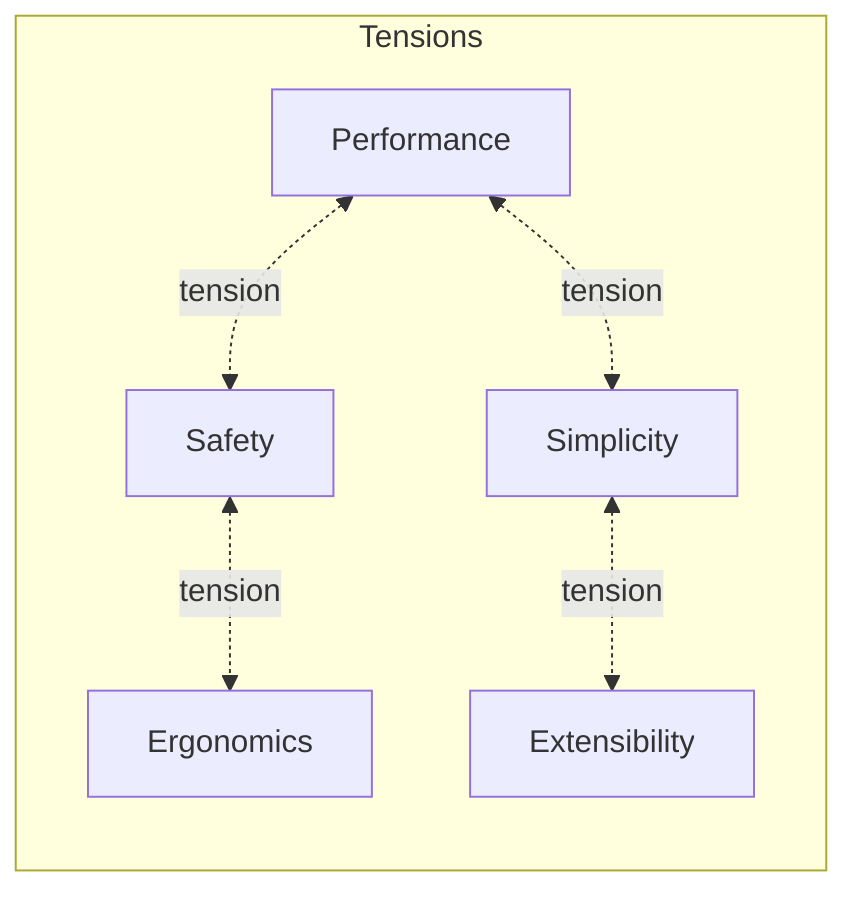

# Handbook - C++ Design Goals and C→C++ Migration (HPC + Safety)

This document is meant to read like a handbook chapter: you get the **categorized lists** up front (fast to scan), then **deep, prose-based guidance** that explains how to apply each item—especially in a **high‑performance computing (HPC)** codebase where **safety (correctness + robustness + memory safety)** still matters.

---

## Scope

This handbook covers:

1. A **design goals vocabulary** — the qualities that make C++ programs good (and programs in general)
2. **How goals trade off** in different contexts
3. **C→C++ migration discipline** — how to upgrade codebases without breaking them
4. **Application profiles** — how priorities shift across domains (HPC, games, finance, embedded, scientific computing, enterprise)

The design goals themselves are language-agnostic; the techniques are C++-specific.

## Not covered

- Specific library APIs (see User Manuals)
- Individual failure investigations (see Case Studies)
- C++ language feature tutorials (see Foundations documents)
- Benchmarking tool setup (see Benchmark Methodology Handbook)
- Build system configuration

## Prerequisites

- Programming experience in any language
- Basic understanding that programs are compiled from source code to executables
- Willingness to read code examples

**No prior C++ experience required.** Key C++ concepts are explained inline and defined in the [Glossary](#glossary).

---

## Handbook Card

**Domain:** C++ design goals and C→C++ migration  
**Core principle:** Design goals drive migration decisions — not syntax modernization  
**Key discipline:** Staged migration with safety nets (tests + benchmarks) before each change  
**Common failure:** "Flag day" rewrites that break behavior and lose performance  
**Hard rules:** No migration without correctness tests; no performance claim without measurement  
**Applies to:** Any C codebase being upgraded; any team establishing C++ coding standards  
**Build-mode notes:** Sanitizers (ASan/UBSan/TSan) should run in CI during migration  
**Guarantees:** Following this discipline surfaces regressions early  
**Non-guarantees:** Does not guarantee zero-effort migration; does not eliminate all bugs

---

## Table of Contents

1. [Who This Is For](#who-this-is-for)
2. [C++ Design Goals (Categorized Reference)](#1-c-design-goals-categorized-reference)
3. [How Design Goals Relate to C→C++ Migration](#1a-how-design-goals-relate-to-cc-migration)
4. [Deep Dive: What Each Goal Means in Real C++](#1b-deep-dive-what-each-goal-means-in-real-c-with-hpc--safety-examples)
5. [Context: Reorder Goals by Application](#2-context-reorder-the-goals-and-map-them-to-c-practices)
6. [Application Profiles (Expanded)](#2c-application-profiles-expanded-with-concrete-scenarios)
7. [Simple C→C++ Guidelines](#3-simple-cc-guidelines-keep-this-simple)
8. [The Migration Playbook](#3a-deep-dive-a-migration-playbook-for-hpc--safety)
9. [Migration Checklist](#4-migration-checklist-design-goal--techniques--dont-break-x-guardrails)
10. [Anti-Patterns](#anti-patterns)
11. [Adoption Plan](#adoption-plan)
12. [Mermaid Diagrams (for Teaching)](#mermaid-diagrams-for-teaching)
13. [Glossary](#glossary)

---

## Who This Is For

This handbook serves several audiences. The design goals are universal; the C++ specifics are explained for newcomers.

### If you're a C programmer considering C++

You'll learn which C++ features pay off (RAII, type safety, standard containers) versus which add complexity without immediate benefit. The migration playbook gives you a staged approach that won't break working code.

### If you're coming from Python, Java, or another high-level language

The design goals (correctness, maintainability, performance) are universal. C++ differs in that you control memory layout and object lifetime explicitly—there's no garbage collector. This gives you performance and predictability, but requires discipline.

> **If you know Python:** RAII (explained below) is like `with` statements, but automatic and everywhere. Every object cleans up after itself when it goes out of scope.

> **If you know Java:** C++ has no garbage collector. Objects are destroyed deterministically when they go out of scope, not "sometime later." This is a feature, not a limitation—it makes resource management predictable.

### If you're coming from Rust

Many concepts will feel familiar: ownership, RAII, zero-cost abstractions, compile-time guarantees. C++ is less strict (you can break the rules), which means discipline matters more. The design goals and guardrails in this document provide that discipline.

### If you're a mathematician or scientist

You care about **correctness** (does the algorithm produce the right answer?) and **reproducibility** (can I get the same answer twice?). This document explains how to achieve both while also getting good performance. The design goals section gives you vocabulary to discuss code quality with engineers.

### If you're a technical lead or architect

The checklists and guardrails help establish team standards. The application profiles show how to prioritize goals for your domain.

---

## 1. C++ Design Goals (Categorized Reference)

These goals form the "design goals vocabulary." You'll phrase them differently across teams, but the set is stable. In practice, you'll prioritize them differently depending on whether you're writing a **library vs app**, **embedded vs server**, **performance‑critical vs safety‑critical**.



---

### Core Quality Goals

* **Correctness**
  Produces the right results for all intended inputs; includes clear, checkable invariants.

* **Clarity / Readability**
  Code is easy to understand and reason about (good names, obvious control flow, minimal "cleverness").

* **Maintainability**
  Future changes are easy and low-risk; bugs are easy to locate and fix.

* **Simplicity**
  The design does not introduce extra moving parts; avoids over-engineering.

* **Modularity**
  Components are separated by responsibility; changes in one area don't ripple everywhere.

* **Encapsulation**
  Internal details are hidden behind interfaces; callers can't depend on implementation quirks.

* **Low coupling, high cohesion**
  Each module does one coherent job (cohesion) and depends on as little as possible (coupling).

* **Consistency**
  Similar problems are solved in similar ways (APIs, naming, error handling, ownership patterns).

---

### API and Evolution Goals

* **Extensibility**
  New features can be added without rewriting existing code (often via composition, policies, hooks, templates).

* **Reusability**
  Code can be reused in new contexts without copy-paste or major surgery.

* **Composability**
  Parts can be combined naturally (types and functions fit together cleanly; avoids "special-case glue").

* **API ergonomics**
  The interface is easy to use correctly and hard to misuse (good defaults, clear types, minimal footguns).

* **Backward compatibility**
  Existing users aren't broken by updates (source compatibility and/or behavior compatibility).

* **ABI stability** (when relevant, e.g., shared libraries)
  Binaries built against an older version keep working.

* **Versionability**
  You can evolve behavior intentionally (deprecation plan, feature flags, semantic versioning discipline).

---

### Safety and Robustness Goals

* **Robustness**
  Handles bad inputs, unexpected states, and partial failures gracefully.

* **Reliability**
  Works consistently over time and across environments; minimal flaky behavior.

* **Defensive design / "pit of success"**
  The natural way to use the code is the safe way.

* **Resource safety (RAII)**
  No leaks; resources are acquired/released deterministically (memory, files, locks, sockets).

> **What is RAII?** "Resource Acquisition Is Initialization" — a C++ pattern where resources (memory, files, network connections, locks) are tied to object lifetime. When the object is created, it acquires the resource. When the object is destroyed (automatically, when it goes out of scope), it releases the resource. This makes leaks nearly impossible.

* **Exception safety**
  Operations maintain invariants under exceptions (basic/strong/no-throw guarantees where appropriate).

* **Thread safety / concurrency safety**
  Correct under concurrent use (or clearly documented as not thread-safe).

* **Determinism / reproducibility**
  Same inputs produce same outputs and timing characteristics when required (important for debugging, simulation, tests).

* **Security**
  Minimizes attack surface; avoids UB, bounds issues, injection paths, unsafe deserialization, etc.

---

### Performance Goals

* **Time efficiency (runtime performance)**
  Hot paths are fast; avoids unnecessary allocations/copies; good algorithmic complexity.

* **Space efficiency (memory footprint)**
  Uses memory predictably; avoids fragmentation; good data layout.

* **Cache locality / data-oriented efficiency**
  Structures and access patterns are friendly to CPU caches and prefetchers.

> **Why does cache locality matter?** Modern CPUs have a hierarchy of memory: registers (fastest, smallest), L1/L2/L3 caches, then main RAM (slowest, largest). Accessing L1 cache takes ~1 nanosecond; accessing RAM takes ~100 nanoseconds. Code that accesses memory sequentially (arrays) is much faster than code that jumps around (linked lists, pointer chasing).



* **Scalability**
  Performance degrades gracefully as problem size grows (and under concurrency).

* **Latency vs throughput awareness**
  Design targets the correct metric: tail latency (p99) vs peak throughput, etc.

* **Predictable performance**
  Avoids cliffs (rehash storms, pathological probing, allocator contention, worst-case degeneracy).

---

### Test and Debug Goals

* **Testability**
  Components are easy to unit test (dependency injection, pure functions where possible, deterministic behavior).

* **Observability**
  You can measure and inspect behavior (logging, tracing, counters, debug hooks, stats exports).

* **Debuggability**
  Failures are diagnosable (assertions, invariants, structured errors, meaningful diagnostics).

---

### Build and Integration Goals

* **Portability**
  Works across compilers/standard libraries/OSes/architectures (or fails with clear requirements).

* **Standards conformance**
  Uses standard C++ correctly; avoids undefined behavior and compiler-specific hacks unless justified.

> **What is Undefined Behavior (UB)?** In C and C++, some operations have no defined result—the language standard doesn't say what should happen. Common examples: dereferencing a null pointer, signed integer overflow, reading uninitialized memory. The danger: compilers *assume UB never happens* and optimize based on that assumption. This can cause impossible-seeming bugs.

* **Dependency hygiene**
  Minimal, well-scoped dependencies; clear boundaries between modules/libraries.

* **Buildability / compile-time performance**
  Reasonable compile times and clean builds; avoids template bloat where it hurts.

* **Interoperability**
  Plays well with other libraries and languages (C APIs, stable data formats, allocator support, string_view/span, etc.).

---

### Documentation and Communication Goals

* **Documented invariants and contracts**
  Preconditions/postconditions, ownership rules, complexity guarantees.

* **Discoverability**
  Users can find the right entry points (good structure, examples, clear headers).

* **Explicitness where it matters**
  Ownership, lifetime, mutability, and cost are visible in types and naming.

---

## 1A. How Design Goals Relate to C→C++ Migration

Upgrading C → C++ isn't just "rewrite in a new syntax." It's a chance to **systematically buy** those design goals—*but only if you plan the migration around them*.

---

### Maintainability: the #1 practical reason to move

**In C**, maintainability is often hurt by:
* implicit ownership conventions ("caller frees unless… sometimes")
* manual lifecycle control (init/free pairs everywhere)
* pervasive macros and global state

**In C++**, you can directly encode maintainability using:
* **RAII wrappers** for resources (`FILE*`, sockets, mutexes, handles)
* **standard containers** (`std::vector`, `std::string`) instead of raw buffers
* **constructors/destructors** to enforce invariants
* `const` correctness, `enum class`, stronger types

**Migration implication:** A good C++ upgrade plan starts by eliminating the "lifecycle tax" (leaks, double frees, early returns skipping cleanup). That's maintainability paying off immediately.

---

### Correctness & safety: C++ helps you *express invariants*

A C codebase often relies on "tribal knowledge" invariants:
* "this pointer is valid if flag X is set"
* "length field must match allocated buffer"
* "init must be called before use"

In C++, you can make invalid states harder:
* construct objects only in valid states
* use `std::span`, `std::string_view` to pass buffers safely
* use `std::optional`, or an `expected`-style return type for fallible operations
* replace integer error codes with typed error objects (even if you still return codes)

**Migration implication:** When you upgrade, you're not just translating code—you're converting *implicit contracts* into *explicit types + invariants*.

---

### Resource safety (RAII): the "killer feature" in real migrations

This is the most direct link between design goals and migration value.

In C, error handling often looks like:
* allocate A
* allocate B
* if fail, goto cleanup
* cleanup in reverse order

In C++, you can often remove whole classes of bugs by wrapping:
* memory ownership → `std::unique_ptr<T, Deleter>`
* file handles → `std::ifstream` or a small `FileHandle` RAII type
* mutex lock/unlock → `std::lock_guard`, `std::unique_lock`

**Migration implication:** RAII is the fastest way to get **correctness + maintainability** without changing the algorithmic behavior.



---

### Extensibility: "feature velocity" is usually the business driver

Many C applications handle variation via:
* giant `switch` statements
* flags and mode parameters
* function pointer tables with ad-hoc conventions

C++ gives you more structured options:
* composition and small types
* templates for policy-based design (when appropriate)
* `std::variant` + visitors (explicit alternatives)
* interfaces / abstract base classes (sometimes), but often composition is better

**Migration implication:** You use extensibility goals to decide *where* to introduce C++ abstractions. Not everything needs to become OO; often you just want cleaner seams.

---

### Testability & refactoring safety: you can't upgrade safely without it

A C→C++ upgrade is risky if:
* behavior changes unintentionally
* performance regresses silently
* error paths aren't covered

Design goals make this concrete:
* **Testability** forces you to isolate side effects (I/O, globals).
* **Observability** helps prove you didn't break things.
* **Performance** requires benchmarks (as you've already been doing).

**Migration implication:** Before and during migration, you need a "safety net": tests + benchmarks become part of the design goals, not "nice-to-have."

---

### Backwards compatibility: the hidden constraint in many C→C++ upgrades

A lot of "C applications" are really ecosystems:
* plugins
* shared libraries
* external integrations
* stable C ABI exports

C++ has name mangling, exceptions, different ABI rules across compilers.

**Practical rule that ties to the goals:**
* Keep a **C API boundary** if anything external depends on you.
* Implement the core in C++, but expose an `extern "C"` façade.
* Never let C++ exceptions cross a C boundary—translate to error codes.

**Migration implication:** Backwards compatibility and ABI stability strongly influence architecture: you often end up with "C API shell, C++ core."



---

### Performance: C++ can be faster… or slower… depending on how you upgrade

C++ is "zero-cost abstractions" *when used well*, but upgrades can regress if you:
* introduce hidden allocations (`std::function`, copies, temporary strings)
* overuse virtual dispatch in hot paths
* use iostreams in performance-critical code
* accidentally change memory layout / locality

**Migration implication:** Performance as a design goal means you upgrade **incrementally**, measure constantly, and treat "equivalent behavior + equal or better perf" as a gate.

---

### A useful way to think about it

Upgrading from C to C++ is really two projects running together:

1. **Language/tooling migration**
   "Can it compile? build? link? run? ship?"

2. **Design-goal migration**
   "Did we buy maintainability, safety, extensibility, testability—without losing performance or compatibility?"

The second is what makes the upgrade worth doing.

---

## 1B. Deep Dive: What Each Goal Means in Real C++ (with HPC + Safety Examples)

This section provides detailed explanations of each design goal with concrete C++ practices. HPC (High-Performance Computing) examples are used throughout, but the principles apply broadly.

### 1) Correctness
Correctness is the non‑negotiable foundation: if a fast answer is wrong, it's just a fast bug.

In HPC, correctness includes **numerical correctness**: floating‑point error bounds, stability of algorithms, sensitivity to ordering changes, and correct handling of extreme values. If you introduce parallelism, you also introduce nondeterminism that can alter summation order and therefore rounding. A "correct" HPC system often needs two definitions of correctness:
- **Mathematical correctness** (as close as needed within tolerance)
- **Operational correctness** (no UB, no races, no invalid memory access, no out‑of‑range indexing)

> **For mathematicians:** Floating-point arithmetic is not associative. `(a + b) + c` may give a different result than `a + (b + c)` due to rounding. When you parallelize a sum, different thread orderings can give slightly different answers. This isn't a bug—it's IEEE 754 floating-point behavior. You need to decide what "correct" means: bitwise identical, or within tolerance.

Concrete C++ practices that help:
- Use **strong types** for units and domains (e.g., `Meters`, `Seconds`, `NodeId`).
- Prefer **total functions** and explicit error handling (return `std::optional`, `std::expected`, or status objects).
- Make invariants explicit: assert in debug builds; validate inputs at boundaries.
- For numeric code: include **reference implementations** (slow but obviously correct) for test comparisons.

### 2) Clarity
Clarity is not "pretty code." It is code that a new engineer can reason about without fear. In performance work, clarity prevents "optimizations" from becoming unreviewable folklore.

In HPC, the temptation is to compress logic into branchless tricks, SIMD intrinsics, and clever bit‑twiddling. You can still keep clarity by isolating complexity:
- Keep the "fast path" readable by extracting "weird" parts into named helpers.
- Document invariants and why the micro‑optimization is safe.

Concrete practices:
- Name variables for **meaning**, not mechanics.
- Structure code to mirror the mental model of the algorithm.
- Use `[[nodiscard]]`, `constexpr`, `noexcept` meaningfully—not as decoration.

### 3) Maintainability
Maintainability means the code remains cheap to change without introducing subtle regressions.

For HPC + safety, maintainability includes being able to:
- upgrade compilers and flags safely,
- add new instruction‑set backends (AVX2/AVX‑512/NEON),
- modify memory layouts without breaking invariants,
- and keep tests/benchmarks up‑to‑date.

Concrete practices:
- Keep modules small and cohesive.
- Keep performance‑critical code **covered by benchmarks** and **guarded by tests**.
- Use "mechanical sympathy," but don't bury it in one giant function.

### 4) Extensibility
Extensibility is the ability to add new capabilities without rewriting core logic.

In C++ this often means designing with:
- a stable **public API** surface,
- well‑chosen abstractions that don't leak implementation details,
- and careful separation between interface and implementation.

In HPC code, extensibility often shows up as:
- adding new kernels or algorithms,
- adding new data types (float/double/half),
- adding new execution backends (CPU/GPU), or
- supporting multiple allocators / memory resources.

Concrete practices:
- Prefer **composition** over deep inheritance.
- For libraries: consider **pImpl** (when ABI stability matters).
- Consider **policy‑based design** (compile‑time strategies) when you need zero‑overhead customization.

### 5) Testability
Testability means you can prove behavior stays correct as you evolve code.

For performance engineering, testability also means you can reproduce results:
- deterministic unit tests,
- stable benchmark harnesses,
- and minimal nondeterminism in measurement.

Concrete practices:
- Unit tests: algorithm + invariants.
- Integration tests: end‑to‑end on representative inputs.
- Property tests: "for all inputs of this kind, property holds."
- For HPC: compare against reference or high‑precision baseline.

### 6) Performance
Performance is meeting targets—often a mix of:
- throughput,
- tail latency,
- memory footprint,
- and scaling efficiency.

In HPC, the biggest performance killers are often:
- memory bandwidth limits,
- cache misses,
- allocator overhead,
- false sharing, and
- synchronization.

Concrete practices:
- Measure first (benchmarks + profilers).
- Use cache‑friendly layouts (SoA vs AoS when appropriate).
- Avoid unnecessary allocations; use arenas/pools where safe.
- Use `std::span`/`string_view` to avoid copies when lifetimes are clear.

> **SoA vs AoS:** "Struct of Arrays" vs "Array of Structs." If you iterate over one field of many objects, SoA is faster (better cache locality). If you process all fields of each object together, AoS is fine. This is a data layout decision that can 10× performance.

### 7) Safety (memory safety + invariants + defined behavior)
Safety is often misunderstood as "exceptions" or "bounds checks." In modern C++, safety is broader:
- no use‑after‑free,
- no buffer overruns,
- no undefined behavior,
- no data races,
- and invariants that survive refactors.

In HPC, a single UB can silently corrupt results and only appear under scale or different compilers.

Concrete practices:
- Prefer RAII (`std::unique_ptr`, `std::vector`, `std::string`) over manual lifetime.
- Use sanitizers regularly (ASan/UBSan/TSan) in CI, even if not in production builds.
- Use `gsl::span`/`std::span` for range + size semantics.
- Prefer `std::array`/`std::vector` to raw pointers for ownership.
- Treat warnings as errors (`-Wall -Wextra -Wpedantic`, MSVC `/W4`), plus targeted safety warnings.

### 8) Reliability
Reliability is "it keeps working," including under degraded conditions.

In HPC + safety contexts, reliability includes:
- consistent handling of allocation failures,
- stable behavior under memory pressure,
- graceful failure modes for invalid inputs,
- and robust parallel execution.

Concrete practices:
- Define explicit failure behavior: return error codes or throw exceptions at boundaries (pick a policy).
- Use watchdogs, timeouts, and backpressure for long‑running workflows.
- Make runtime validation available (debug/diagnostic modes).

### 9) Security
Even if you're writing HPC software, security can matter—especially when inputs are user‑controlled (file formats, networked workflows, job submission systems). Memory unsafety and UB are often security vulnerabilities.

Concrete practices:
- Treat parsing as hostile: validate lengths and ranges.
- Avoid dangerous C APIs (`strcpy`, `sprintf`) and use safe alternatives.
- Use fuzzing on file parsers and boundary surfaces.
- Lock down serialization formats (versioning + checksums).

### 10) Portability
Portability means the code builds across compilers/OS/architectures you claim to support.

For HPC, portability often includes:
- multiple compilers (MSVC/Clang/GCC/ICC/ICX),
- multiple instruction sets,
- and sometimes different endian/alignment assumptions.

Concrete practices:
- Keep platform‑specific code behind small abstraction layers.
- Avoid UB that compilers exploit differently.
- Use CI matrix builds (at least compilers + standard versions).

### 11) Scalability
Scalability is what happens when you add:
- more data,
- more threads,
- more nodes.

HPC scalability is not automatic. A design that's "fast on 1 core" can be awful on 64 cores if memory traffic or contention dominates.

Concrete practices:
- Favor embarrassingly parallel decomposition when possible.
- Avoid global locks in hot paths.
- Be explicit about thread ownership and memory locality.
- Measure scaling curves, not just single‑point performance.

### 12) Determinism & Reproducibility
Some HPC workflows require reproducible results (for research, audits, or safety‑critical simulation validation). Others accept nondeterminism but require bounded error.

> **For scientists:** Reproducibility is often required for publication. If your simulation gives different results each run, reviewers will be skeptical. Determinism is achievable but has performance cost (e.g., deterministic reductions are slower than parallel reductions with arbitrary ordering).

Concrete practices:
- Provide modes: "fast nondeterministic" vs "reproducible" (e.g., deterministic reductions).
- Fix seeds for random inputs in benchmarks.
- Log versions of compilers, flags, CPU features, and algorithm settings used for runs.

### 13) Observability
Observability is what lets you understand what's happening when something is slow, wrong, or failing in production.

Concrete practices:
- Structured logging at boundaries (not in hot loops).
- Metrics for throughput, queue depth, failure counts, and memory usage.
- Trace spans for major operations if applicable.

### 14) Debuggability
Debuggability is the ability to diagnose problems quickly.

HPC complicates debugging due to:
- optimization,
- concurrency,
- SIMD,
- and scale.

Concrete practices:
- Keep debug builds usable.
- Add debug‑only checks and internal consistency verifiers.
- Use crash‑friendly error handling: abort with context on invariant violations.

### 15) API/ABI Stability
If you ship a library, you may need stable APIs (source compatibility) and sometimes ABI (binary compatibility). ABI stability is expensive—do it only when needed.

Concrete practices:
- Keep ABI surfaces minimal.
- Use pImpl when ABI stability is required.
- Use semantic versioning and clear deprecation policies.

### 16) Resource Efficiency
Resource efficiency is performance's sibling: you can be fast but wasteful.

In HPC, memory and bandwidth are often the real limiting resources. Efficient data layout and avoiding extra passes can dominate.

Concrete practices:
- Avoid unnecessary copies.
- Minimize allocation churn.
- Prefer contiguous storage when possible.
- Track peak memory usage and bandwidth in profiles.

### 17) Composability
Composability means your module can be used safely with others without surprising global coupling.

Concrete practices:
- Avoid hidden global state.
- Make dependencies explicit.
- Use dependency injection where it simplifies testing and configuration.

### 18) Configurability
Configurability means behavior can be adapted without rewriting code—useful for tuning performance or enabling safety diagnostics.

Concrete practices:
- Configuration objects passed explicitly.
- Compile‑time knobs (templates/policies) for performance.
- Runtime knobs for operational tuning.

### 19) Buildability
Buildability is a design goal because build friction kills iteration speed and reduces quality over time.

Concrete practices:
- Keep dependency graphs shallow.
- Use reproducible builds and consistent toolchains.
- Use warnings‑as‑errors and standardized formatting.

### 20) Deployability
Deployability includes packaging, distribution, runtime dependencies, and rollback strategy.

Concrete practices:
- Produce minimal artifacts.
- Avoid "it works on my machine" configurations.
- Document runtime requirements (CPU features, libraries).

### 21) Compatibility
Compatibility matters for file formats, network protocols, or persisted data.

Concrete practices:
- Version your formats.
- Make changes additive where possible.
- Include migration tools for data evolution.

### 22) Documentation
Documentation is often treated as optional, but it is how engineering knowledge survives team turnover.

Concrete practices:
- Write "why" docs (design rationale), not just "what" docs.
- Keep docs close to code.
- Provide examples and minimal end‑to‑end recipes.

---

## 2. Context: Reorder the Goals and Map Them to C++ Practices

You asked for **HPC with safety** as the worked example. Below is a prioritized "top 10" for that context, followed by other common combinations so students can see how priorities shift.

### 2A. Top 10 design goals for HPC + safety (with concrete C++ practices)

**Priority order (HPC + safety‑conscious):**
1. Correctness  
2. Safety (UB/memory/data‑race avoidance)  
3. Performance  
4. Determinism & Reproducibility (when required)  
5. Scalability  
6. Testability  
7. Observability & Debuggability  
8. Maintainability  
9. Portability  
10. Resource Efficiency  

Now map each goal to concrete practices—this is where engineering gets real.

#### 1) Correctness → practices
In HPC, correctness must be continuously defended because performance changes can subtly shift numeric behavior.

Practices:
- Maintain a **reference baseline** for key algorithms (slow but trustworthy).
- Use **golden datasets** and tolerance‑based comparisons.
- Add **invariant checks** in debug builds (bounds, monotonicity, conservation laws).
- Write "failure‑first" tests for edge cases (NaNs, infinities, denormals, overflow).

Guardrails:
- Never optimize a kernel without a correctness test that would catch common mistakes.
- Require a "correctness proof note" (short) in code review for tricky optimizations.

#### 2) Safety → practices
Safety is mainly about **eliminating undefined behavior and lifetime errors** while keeping performance.

Practices:
- Use RAII for ownership (`unique_ptr`, `vector`, `string`).
- Prefer `std::span` for non‑owning views into arrays/buffers.
- Keep unsafe code localized; document invariants that make it safe.
- Use sanitizers and static analysis in CI.

Guardrails:
- Ban raw owning pointers in new code (with documented exceptions).
- For concurrency, treat TSan failures as release blockers.

#### 3) Performance → practices
Performance work is a loop: measure → hypothesize → change → re‑measure.

Practices:
- Microbenchmarks for hot kernels.
- End‑to‑end benchmarks for real workloads.
- Profile before and after (CPU cycles, cache misses, branch mispredicts).
- Prefer data‑oriented design; ensure cache locality.

Guardrails:
- Do not accept performance changes without benchmark evidence.
- Keep benchmarks stable: CPU gating, warmup, randomized order, medians.

#### 4) Determinism & reproducibility → practices
Offer explicit modes. Reproducibility is often a product requirement in regulated environments.

Practices:
- Deterministic reductions (tree reductions with fixed order).
- Stable scheduling policies for parallel loops where feasible.
- Pinning seeds and logging configuration for experiments.

Guardrails:
- Document which operations are nondeterministic and why.
- Provide a "repro mode" build flag or runtime option.

#### 5) Scalability → practices
Scalability needs design, not hope.

Practices:
- Partition work to minimize synchronization.
- Avoid shared mutable state; use thread‑local or sharded structures.
- Use lock‑free or wait‑free only when you can prove correctness and you need it.

Guardrails:
- Scaling regressions should be caught by at least one multi‑thread benchmark.

#### 6) Testability → practices
Tests are how you change code with confidence.

Practices:
- Separate pure logic from side effects (I/O, threading, global state).
- Use dependency injection to test components in isolation.
- Property tests for invariants; fuzz tests for parsers.

Guardrails:
- Every bug fix must ship with a test that would have caught it.

#### 7) Observability & debuggability → practices
Make failures diagnosable, not mysterious.

Practices:
- Structured logging at boundaries (input validation, algorithm selection, error paths).
- Debug‑only "internal consistency check" functions.
- Crash reports that include versions and config.

Guardrails:
- Don't log in tight loops; log at layer boundaries and summarize.

#### 8) Maintainability → practices
Make performance work sustainable.

Practices:
- Keep hot path code small and documented.
- Put benchmarks and perf notes next to the code they guard.
- Avoid "god headers" and excessive template metaprogramming without need.

Guardrails:
- Set review rules for "unsafe/perf code": comments must explain invariants.

#### 9) Portability → practices
Portability protects your future.

Practices:
- Hide platform code behind `#ifdef` walls with narrow interfaces.
- Maintain a compiler/OS CI matrix.
- Avoid reliance on unstandardized behavior.

Guardrails:
- If you depend on a CPU feature (AVX2), detect it and provide a fallback or document it as a requirement.

#### 10) Resource efficiency → practices
In HPC, memory traffic often dominates.

Practices:
- Measure memory bandwidth.
- Use pooling allocators for churn-heavy structures.
- Prefer contiguous storage and avoid pointer chasing where possible.

Guardrails:
- Track peak memory in benchmarks and fail CI if it regresses beyond threshold.

---

### 2B. Common application "profiles" and how priorities shift

These sections are short enough to scan, but detailed enough to teach the idea that **design goals are context‑dependent**.

#### Profile: Public library + long-term ABI stability
When you ship a library used by others, the "surface area" becomes a product.

Typical top priorities:
- API/ABI stability, correctness, safety, documentation, compatibility, portability.

Techniques:
- pImpl for ABI, minimal public headers, strict deprecation, semantic versioning, integration tests with downstream consumers.

#### Profile: Desktop/server application (feature velocity + reliability)
Typical top priorities:
- maintainability, reliability, observability, security, deployability.

Techniques:
- logging/metrics, feature flags, robust config, staged rollout, crash reporting, safe defaults, defensive parsing.

#### Profile: Embedded (resource constrained + safety-ish)
Typical top priorities:
- resource efficiency, safety, determinism, portability, reliability.

Techniques:
- bounded allocations, avoid exceptions if policy requires, static analysis, MISRA-like discipline, careful use of `constexpr`, minimal dependencies.

#### Profile: HPC research prototype (speed of iteration)
Typical top priorities:
- correctness, performance, clarity, testability (at least smoke tests).

Techniques:
- keep code clean and modular, quick benchmarks, reference baselines, reproducibility logs.

#### Profile: Safety-critical simulation (regulated domain)
Typical top priorities:
- correctness, safety, determinism, reliability, testability, documentation.

Techniques:
- traceable requirements → tests, strict CI gates, code review standards, reproducible builds, validated numeric behavior.

---

### 2C. Application Profiles (Expanded with Concrete Scenarios)

The brief profiles above give the pattern. Here are **detailed scenarios** showing how design goals play out in practice.

---

#### Profile: Game Engine / Real-Time Graphics

**Context:** 60 FPS = 16.6ms per frame. One allocation hiccup = visible stutter. Millions of objects updated per frame.

**Top priorities:** Performance, determinism, debuggability, maintainability

**Concrete scenario:**

> Your particle system allocates a `std::vector` per frame for active particles. Players report "hitching" during explosions. Profiling shows malloc spikes of 2-3ms.

**Design goals applied:**
- **Performance:** Pre-allocate particle pools; zero allocations in the hot loop
- **Determinism:** Fixed-size buffers; predictable frame times
- **Debuggability:** In-game profiler overlay showing frame time histogram

**C++ techniques:**
- `SmallVector<Particle, 256>` or similar keeps typical explosions on the stack
- Pool allocator for overflow cases
- `[[nodiscard]]` on functions returning handles (don't lose track of allocated objects)

**What to watch:** Hidden allocations in `std::function`, lambda captures, string operations.

---

#### Profile: Financial Trading System

**Context:** Microseconds matter. A wrong calculation costs money. Regulators audit everything.

**Top priorities:** Correctness, determinism, observability, reliability, security

**Concrete scenario:**

> Your order matching engine uses `double` for prices. Auditors flag discrepancies: $100.10 stored as $100.09999999999999.

**Design goals applied:**
- **Correctness:** Fixed-point or decimal types for money; never floating-point
- **Observability:** Structured logging of every state transition with timestamps
- **Determinism:** Reproducible message ordering; logged sequence numbers

**C++ techniques:**
- Strong types: `struct Price { int64_t cents; }` prevents mixing dollars and cents
- Checked arithmetic for overflow detection on every calculation
- Lock-free queues for message passing (avoid mutex latency)

**What to watch:** Floating-point comparison, overflow in multiplication, timezone handling.

---

#### Profile: Scientific Computing Library (NumPy-style)

**Context:** Used by researchers who may not read documentation carefully. Called from Python. Results must be reproducible for publication.

**Top priorities:** Correctness, API ergonomics, determinism, portability, documentation

**Concrete scenario:**

> Users report that `matrix_multiply(A, B)` gives different results on different machines. Investigation reveals non-deterministic parallel reduction order affecting floating-point rounding.

**Design goals applied:**
- **Determinism:** Provide `reproducible=true` mode with deterministic reduction ordering
- **Correctness:** Document floating-point tolerance expectations
- **API ergonomics:** Python bindings with sensible defaults; helpful error messages

**C++ techniques:**
- Deterministic tree reduction when `reproducible=true` (slower but consistent)
- Floating-point exception detection in debug builds
- `pybind11` for Python bindings with good docstrings

**What to watch:** Floating-point associativity, compiler optimization flags affecting results, OpenMP scheduling non-determinism.

---

#### Profile: Embedded IoT Device

**Context:** 256KB RAM. No heap allowed by policy. Must run for years without reboot. Field firmware updates.

**Top priorities:** Resource efficiency, reliability, determinism, safety, portability

**Concrete scenario:**

> Your sensor firmware uses `std::string` for configuration parsing. Device crashes after 3 days in the field — heap fragmentation.

**Design goals applied:**
- **Resource efficiency:** Static buffers only; all memory allocated at boot
- **Reliability:** No dynamic allocation after initialization
- **Portability:** Works across ARM Cortex-M variants; no platform-specific dependencies

**C++ techniques:**
- `std::array<char, 128>` with `std::string_view` for parsing (no allocation)
- `constexpr` configuration tables compiled into flash
- No exceptions; contract-checking macros that abort on violation
- Static analysis in CI catches dynamic allocation attempts

**What to watch:** Hidden allocations in STL containers, exception handling overhead, RTTI size cost.

---

#### Profile: Legacy Enterprise Modernization

**Context:** 400K lines of C written over 15 years. Original authors gone. "Works, but nobody wants to touch it."

**Top priorities:** Maintainability, testability, safety, backward compatibility

**Concrete scenario:**

> You need to add a feature but can't understand memory ownership. `grep` finds 847 calls to `malloc` and 762 calls to `free`. Some pairs are missing.

**Design goals applied:**
- **Maintainability:** RAII at ownership boundaries; consistent patterns
- **Testability:** Tests before changes; characterization tests for existing behavior
- **Backward compatibility:** Keep C API for external integrations stable

**C++ techniques:**
- Stage 0: Add characterization tests that capture current behavior (golden output tests)
- Stage 2: `std::unique_ptr<T, Deleter>` wraps malloc'd memory
- Keep `extern "C"` API surface; modernize internals only
- Static analysis catches use-after-free, double-free

**What to watch:** Hidden dependencies on global state, callback function pointer signatures, implicit threading assumptions.

---

#### Profile: Medical Device Software (Regulated)

**Context:** FDA requires traceable requirements. Every code path must be tested. Field failures trigger recalls.

**Top priorities:** Correctness, safety, testability, documentation, determinism, reliability

**Concrete scenario:**

> Auditor asks: "How do you know this function handles overflow correctly?" You point to a comment. They ask for evidence.

**Design goals applied:**
- **Safety:** Overflow handling is explicit, tested, and traceable to requirements
- **Testability:** 100% branch coverage; mutation testing for critical paths
- **Documentation:** Requirements → design → code → test traceability matrix

**C++ techniques:**
- Checked arithmetic with explicit overflow policy
- Static analysis integrated with requirements management tool
- Every conditional branch has a test that exercises it
- Formal code review with checklist

**What to watch:** Implicit conversions, unsigned underflow, pointer arithmetic, uninitialized memory reads.

---

## 3. Simple C→C++ Guidelines (Keep This Simple)

These are pragmatic rules for upgrading a real C codebase without derailing it.

1. **Compile the C code as C++ gradually** (start with small modules)
2. **Keep behavior identical first** (make it build and pass tests before "modernizing")
3. **Wrap lifetimes with RAII** (replace manual `malloc/free` ownership with objects)
4. **Replace macros with typed constructs** (constexpr, inline functions, enums)
5. **Prefer standard containers** (`std::vector`, `std::string`, `std::array`)
6. **Introduce const-correctness** (improves reasoning and optimization)
7. **Centralize error handling** (choose a strategy: exceptions, status returns, expected)
8. **Isolate platform code** (narrow interfaces for OS/CPU differences)
9. **Add tests and benchmarks before refactors** (so you can safely change code)
10. **Make UB visible** (enable sanitizers/analysis and fix findings)
11. **Use modern interfaces for views** (`std::span`, `std::string_view`)
12. **Adopt namespaces and modules** (namespaces now; modules later if ready)
13. **Treat build system as part of the product** (repeatable builds + warnings as errors)
14. **Refactor in vertical slices** (one feature/path at a time, not "the whole project")
15. **Document ownership and threading rules** (who owns what; who can touch what)
16. **Keep performance evidence** (benchmarks guard the hot paths)
17. **Don't rewrite what you can wrap** (wrap stable code; modernize where it pays)
18. **Introduce C++ incrementally** (avoid "flag day" conversions)

---

## 3A. Deep Dive: A Migration Playbook for HPC + Safety

A successful C→C++ upgrade is not a language conversion. It's an engineering project to:
- improve **safety** and **maintainability**,
- preserve (or improve) **performance**, and
- reduce future change cost.

Below is a staged approach that tends to work in HPC environments.

### Stage 0: Establish a "truth baseline"
Before touching architecture:
- Capture current correctness: known datasets, expected outputs, tolerated error bounds.
- Capture performance: representative workloads, hardware info, compiler flags.

If you don't do this, you will not know whether you improved anything, and you will argue about anecdotes.

**Deliverables:**
- A reproducible build script.
- A minimal CI job that runs unit tests + one benchmark.
- A performance report: baseline numbers, environment, and variability.

### Stage 1: Make it compile as C++ (safely)
You don't need to convert everything at once. Start by compiling a subset as C++:
- Rename `.c` to `.cpp` module by module.
- Add `extern "C"` boundaries where needed for linkage.
- Replace illegal constructs (C99 implicit int, designated initializers if not supported in your C++ dialect, etc.).

Avoid style churn at this stage. The goal is **buildability**.

### Stage 2: Introduce RAII at ownership boundaries
This is where safety improvements become real.

Typical patterns:
- Replace "allocate/init/free" triplets with an owning type that releases in its destructor.
- Replace `FILE*` with a wrapper that calls `fclose` in the destructor (or use iostreams carefully).
- Replace manual `malloc/free` ownership with `std::unique_ptr<T, Deleter>` as a transitional step, then migrate toward `std::vector`/`std::string` where appropriate.

In HPC, RAII isn't "slow." It's usually optimized away. The performance risk is not RAII—it's hidden allocations and copies. Be explicit about allocations and use views (`span`) to avoid copies.

### Stage 3: Replace "C patterns" with safe C++ equivalents (surgically)
Do not "modernize everything." Target the pain points:
- Replace raw arrays + length with `std::span<T>`.
- Replace string buffers with `std::string` (or `std::vector<char>` for binary).
- Replace macros for constants with `constexpr`.
- Replace `#define` for functions with `inline` functions.

This often shrinks bug surface area dramatically.

### Stage 4: Choose and enforce an error-handling policy
Mixed error handling is a slow-motion disaster. Pick a policy based on constraints:
- If you can use exceptions: throw at boundaries, keep hot loops noexcept and return status if needed.
- If you avoid exceptions: return status objects, `std::optional`, or `std::expected` (or a local equivalent).

In safety-conscious HPC, a common strategy is:
- **No exceptions in hot kernels** (predictability),
- exceptions allowed at high-level orchestration (developer ergonomics),
- and strict "no silent failure" rules.



### Stage 5: Tame concurrency explicitly
C codebases often accumulate implicit threading assumptions. In C++, make it explicit:
- document thread ownership rules,
- separate mutable and immutable shared data,
- enforce atomic/locking discipline.

For HPC, include thread scaling benchmarks. Concurrency bugs are often "works on 8 cores, fails on 64."

### Stage 6: Build performance guardrails into the workflow
Performance engineering becomes sustainable when performance is measured continuously.

Practices:
- Keep microbenchmarks close to hot path code.
- Require a benchmark run for meaningful performance changes.
- Log environment: CPU features, frequency state, compiler version/flags.

This is exactly the type of methodology you used in the "slow miss" investigation: isolate a sub‑metric, instrument, validate hypotheses, iterate.

### Stage 7: Refactor architecture (only after safety + measurement exist)
Once you have tests and benchmarks, you can safely make deeper design changes:
- split modules,
- separate interfaces from implementations,
- introduce policies/strategies,
- and isolate "unsafe/perf" code behind tight boundaries.

---

## 4. Migration Checklist: Design Goal → Techniques → "Don't Break X" Guardrails

This reads well as a handbook chapter because it ties intent (goals) to action (techniques) and risk management (guardrails).

### 4A. Checklist table (fast reference)

| Design goal | Concrete C++ techniques | "Don't break X" guardrails |
|---|---|---|
| Correctness | reference baselines, golden tests, invariants, strong types | no perf change without correctness test; tolerance policy documented |
| Safety | RAII, `span`, sanitizers, static analysis, safe parsing | ban owning raw pointers; CI runs sanitizers regularly |
| Performance | benchmarks, profiles, cache-friendly layouts, avoid churn | perf PRs require numbers; benchmark harness stability rules |
| Determinism | deterministic reductions, controlled scheduling, seed logging | reproducible mode must match baseline within tolerance |
| Scalability | sharding, avoid global locks, thread-local data | scaling benchmark must not regress beyond threshold |
| Maintainability | cohesive modules, doc invariants, avoid over-templating | review rules for "clever code"; complexity budget |
| Portability | narrow platform layers, CI compiler matrix | don't merge if it breaks supported toolchains |
| Reliability | explicit error strategy, bounded resources, graceful failure | inject faults in tests; don't crash silently |
| Security | fuzz parsing, validate inputs, safe APIs | fuzz regressions fail CI; no unchecked lengths |
| Observability | structured logs/metrics/traces at boundaries | no logging in hot loops; log config + versions |

### 4B. Checklist explained (prose, with HPC + safety focus)

A checklist is only useful if you understand **why** each line exists and how it applies to your context.

- **Correctness guardrails** prevent "fast wrong answers." In HPC, this often means you decide upfront what "close enough" means and bake that into tests. Otherwise, parallelization or SIMD changes can silently shift results and you'll argue endlessly about whether it's a bug or "floating point being floating point."

- **Safety guardrails** prevent undefined behavior from sneaking in. UB is especially dangerous in optimized HPC builds because it can appear or disappear with small compiler changes. Running UBSan/ASan in CI doesn't slow production, but it dramatically reduces the chance of shipping a time bomb.

- **Performance guardrails** keep the team honest. Humans are bad at guessing performance. A reliable benchmark harness with stable measurement discipline turns arguments into measurements.

- **Determinism guardrails** are the bridge between "research code" and "audited/safety-relevant code." If you need reproducibility, treat it as a first-class requirement—provide a mode that enforces it and test it continuously.

- **Scalability guardrails** recognize that performance isn't one number. An algorithm that is "fast" at N=10k might become memory-bound at N=1M or collapse under contention at 64 threads. Scaling tests catch that early.

- **Maintainability guardrails** protect the future. HPC projects often fail when only one person understands the fast path. Documentation of invariants and clear module boundaries make performance work transferable knowledge rather than personal magic.

---

## Anti-Patterns

These are common mistakes to avoid. Each follows the pattern: what happens, why it's wrong, what to do instead.

### The Flag-Day Rewrite

**What happens:** Team decides to "modernize everything at once" and rewrites the entire codebase over a weekend/month/quarter.

**Why it's wrong:** No baseline exists. Regressions are invisible. When bugs appear, nobody knows if they're new or pre-existing.

**What to do instead:** Stage 0 first. Establish tests and benchmarks. Then migrate incrementally, validating after each stage.

---

### The "C++ Style" Obsession

**What happens:** Developer converts code to compile as C++, then immediately rewrites with ranges, concepts, coroutines, and heavy template metaprogramming.

**Why it's wrong:** Style changes without tests introduce bugs. Unfamiliar patterns confuse the team. The goal is safety and maintainability, not syntax fashion.

**What to do instead:** Keep behavior identical first. Introduce RAII at ownership boundaries. Only adopt advanced features when they solve a real problem the team has.

---

### The Premature Abstraction

**What happens:** Developer creates `IResourceManager`, `AbstractFactoryFactory`, and `StrategyPattern` before writing any concrete code.

**Why it's wrong:** Abstractions should emerge from concrete examples. Premature abstraction creates layers that don't match real requirements.

**What to do instead:** Write concrete code first. When you have three similar things, extract the common pattern.

---

### The Single-Run "Proof"

**What happens:** Developer runs benchmark once, sees 20% improvement, declares victory.

**Why it's wrong:** Single runs have high variance from thermal throttling, background processes, and cache state. The "improvement" may be noise.

**What to do instead:** Run at least 50 iterations. Report median and variance. If variance is high, investigate before claiming improvement.

---

### The Micro-Benchmark Extrapolation

**What happens:** Developer shows 10× speedup on N=100, claims production will be 10× faster.

**Why it's wrong:** Small N fits in cache; real workloads may be memory-bound. The speedup may disappear or even reverse at scale.

**What to do instead:** Benchmark at realistic sizes, including sizes that exceed L3 cache.

---

### The "It Works on My Machine" Deployment

**What happens:** Code works in development but fails in production. Developer insists the code is correct.

**Why it's wrong:** Different compilers, flags, timing, and environment expose latent bugs. UB that "works" on one compiler can fail on another.

**What to do instead:** CI tests multiple platforms. Sanitizers catch UB before production. Match production environment in testing.

---

## Adoption Plan

How to roll out this discipline on a team.

### Phase 1: Foundation (Week 1-2)

**Actions:**
- Share this handbook with the team
- Audit existing codebase against the migration checklist
- Identify highest-risk areas (manual memory management, concurrent code, parsing)
- Establish baseline test coverage metrics

**Deliverable:** Gap analysis document listing migration priorities

### Phase 2: Pilot (Week 3-4)

**Actions:**
- Select one low-risk module for pilot migration
- Apply Stages 0-3 to the pilot module
- Document issues and learnings
- Measure effort and validate approach

**Deliverable:** Migrated module with lessons-learned document

### Phase 3: Rollout (Month 2+)

**Actions:**
- Add migration checklist to PR template
- Require stage annotation in migration commits
- Establish weekly migration sync meeting (30 min)
- Track progress by module

**Deliverable:** Migration dashboard; updated team coding standards

### Phase 4: Enforcement (Month 3+)

**Actions:**
- CI enforces sanitizer checks on all code
- New code must follow C++ idioms (RAII, no raw owning pointers)
- Performance benchmarks run on every merge to main
- Regular review of migration progress and blockers

**Deliverable:** Automated enforcement in CI; measurable improvement in defect rate

---

## Mermaid Diagrams (for Teaching)

These visuals help students understand key concepts.

### A) The "performance engineering loop" (how investigations actually work)



### B) A staged C→C++ migration flow (avoid "flag day" rewrites)



### C) Layering to keep "unsafe/perf" code contained



### D) RAII lifecycle: automatic resource management



### E) Design goals: tensions and tradeoffs



---

## Glossary

Key terms for readers who may be new to C++ or systems programming.

**ABI (Application Binary Interface):** The binary-level contract between compiled code units. Includes struct layouts, calling conventions, and name encoding. Unlike API (source-level), ABI compatibility means you don't need to recompile—old binaries work with new libraries.

**ASan (AddressSanitizer):** A compiler tool that detects memory errors at runtime: use-after-free, buffer overflow, memory leaks. Essential for C/C++ development. Enabled with `-fsanitize=address`.

**Cache locality:** Accessing memory in patterns friendly to CPU caches. Sequential access is cache-friendly (the CPU prefetches the next chunk); random pointer-chasing is cache-hostile. Cache-local code can be 10-100× faster than cache-hostile code on the same algorithm.

**constexpr:** C++ keyword indicating a value or function can be evaluated at compile time. Replaces many `#define` macros with type-checked alternatives.

**Exception safety:** Guarantees about program state when errors occur:
- *Basic:* No resource leaks; invariants preserved (but state may have changed)
- *Strong:* Operation either succeeds completely or has no effect (transactional)
- *No-throw:* Operation never fails

**noexcept:** C++ specifier declaring a function doesn't throw exceptions. If it does throw, the program terminates immediately. Enables optimizations and is required for some operations.

**pImpl (Pointer to Implementation):** A C++ idiom where a class contains only a pointer to its actual implementation. Changes to the implementation don't affect the class's binary layout, preserving ABI stability.

**RAII (Resource Acquisition Is Initialization):** The C++ pattern where resource lifetime is tied to object lifetime. Constructor acquires the resource; destructor releases it. When the object goes out of scope (for any reason, including exceptions), cleanup happens automatically.

```cpp
// RAII example
{
    std::lock_guard<std::mutex> guard(mutex);  // Lock acquired
    do_work();
}  // Lock automatically released here, even if do_work() throws
```

**Sanitizer:** A compiler tool that instruments code to detect bugs at runtime:
- **ASan:** Memory errors (buffer overflow, use-after-free)
- **UBSan:** Undefined behavior (signed overflow, null dereference)
- **TSan:** Data races between threads
- **MSan:** Use of uninitialized memory

**SIMD (Single Instruction, Multiple Data):** CPU instructions that operate on multiple values at once. For example, adding 8 floats in a single instruction instead of 8 separate additions. Key to HPC performance.

**SoA vs AoS (Struct of Arrays vs Array of Structs):** Data layout choice. AoS: `struct Point { float x, y, z; } points[1000];`. SoA: `struct Points { float x[1000], y[1000], z[1000]; };`. SoA is often faster when iterating over one field.

**std::optional<T>:** Standard library type that holds either a T value or nothing. Replaces error-prone sentinel values (-1, nullptr) with type-safe "maybe" semantics.

**std::span<T>:** A non-owning view of a contiguous sequence (array, vector, etc.). Carries pointer and size together, preventing size mismatches that cause buffer overflows.

**std::string_view:** A non-owning view of a character sequence. Avoids copying when you only need to read. Warning: the underlying data must outlive the view.

**Strong types:** Custom types that prevent mixing unrelated values. Instead of `void transfer(int amount, int from, int to)` (easy to mix up arguments), use `void transfer(Money amount, AccountId from, AccountId to)`.

**TSan (ThreadSanitizer):** Compiler tool that detects data races at runtime. Essential for concurrent C++ code. Enabled with `-fsanitize=thread`.

**UB (Undefined Behavior):** Operations the C++ standard doesn't define. The compiler assumes UB never happens and optimizes based on that assumption. Common examples: null pointer dereference, signed integer overflow, reading uninitialized memory. UB doesn't mean "crashes"—it means "anything can happen, including appearing to work until it doesn't."

**UBSan (UndefinedBehaviorSanitizer):** Compiler tool that detects undefined behavior at runtime: signed overflow, null dereference, type punning violations, etc. Enabled with `-fsanitize=undefined`.

---

## Closing Note

You can keep the categorized lists as the chapter's "scan‑first" sections. The detailed prose that follows is what makes the document teachable: it connects engineering values to concrete C++ practices and the guardrails that keep performance work safe and repeatable.

If you want, you can extend this chapter with:
- a worked example (like a "slow miss" case study),
- a section on benchmarking methodology,
- and a section on "how to review performance PRs."

---

*Handbook - C++ Design Goals and C→C++ Migration (HPC + Safety) — v3.0 — December 2025*
