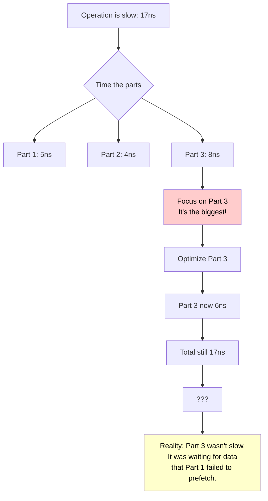
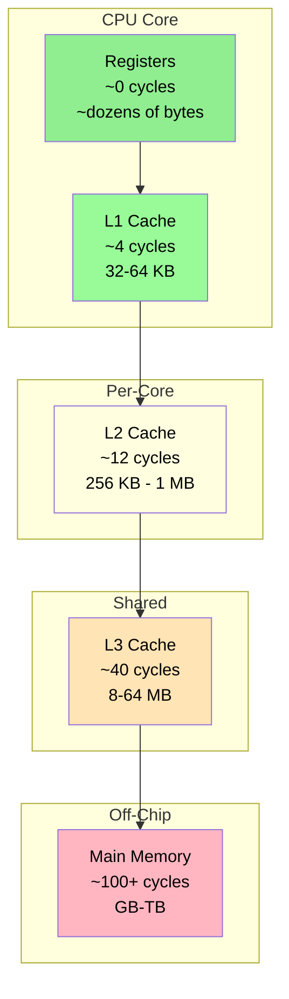
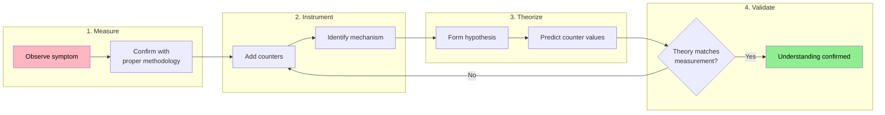
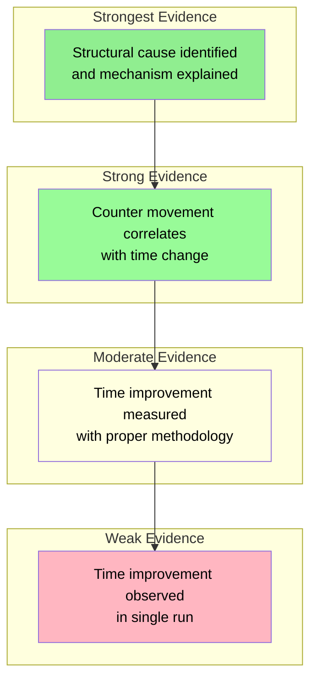

# Handbook - The Discipline of Performance Engineering

## Scope
This handbook teaches the discipline of performance measurement, optimization, and claims. It is not about making code faster—it is about making performance *knowable*, *reproducible*, and *defensible*. Every rule exists because ignoring it led to wasted engineering time, shipped regressions, or claims that evaporated under scrutiny.

## Not covered
- Specific profiler tools (VTune, perf, Instruments—see tool documentation)
- Algorithm complexity theory (see Foundations - Complexity Analysis)
- Component-specific optimization strategies (see individual Case Studies and Companion Guides)
- Performance invariant design (see Handbook - Designing Performance Invariants)

## Prerequisites
- Basic understanding of CPU architecture: caches (L1/L2/L3), branch prediction, memory hierarchy
- Familiarity with statistical concepts: mean, median, variance, standard deviation
- Experience with at least one performance problem where intuition failed

## Handbook Card
**Domain:** Performance measurement and claims  
**Core principle:** Time is a symptom; measure the events that cause it  
**Key discipline:** Counter-based investigation before optimization  
**Common failure:** Optimizing the symptom location instead of the cause location  
**Hard rules:** Platform specification required; methodology required; counter movement required  
**Applies to:** Any performance-critical component, not just hash tables  
**Build-mode notes:** Always benchmark with `-O3 -DNDEBUG`; debug builds invalidate results  
**Guarantees:** Reproducible, defensible performance claims  
**Non-guarantees:** Does not guarantee faster code—guarantees *understood* code

## Table of Contents

### Foundations
- [Why This Document Exists](#why-this-document-exists)
- [The Shape of Measurement Failures](#the-shape-of-measurement-failures)

### Part I — The Problem
1. [The Tyranny of Time](#chapter-1--the-tyranny-of-time)
2. [The Environment Trap](#chapter-2--the-environment-trap)
3. [The Scale Illusion](#chapter-3--the-scale-illusion)
4. [The Invisible Regression](#chapter-4--the-invisible-regression)

### Part II — The Discipline
5. [Counters Before Time](#chapter-5--counters-before-time)
6. [Theory as Sanity Check](#chapter-6--theory-as-sanity-check)
7. [Adversarial Thinking](#chapter-7--adversarial-thinking)
8. [The Isolation Principle](#chapter-8--the-isolation-principle)

### Part III — The Investigations
9. [The Slow Miss: A Complete Investigation](#chapter-9--the-slow-miss-a-complete-investigation)
10. [The Failed Prefetch: Learning to Say No](#chapter-10--the-failed-prefetch-learning-to-say-no)
11. [The Platform Divergence: When Same Code Isn't Same](#chapter-11--the-platform-divergence-when-same-code-isnt-same)
12. [The Gemini Disaster: When AI Gets It Wrong](#chapter-12--the-gemini-disaster-when-ai-gets-it-wrong)

### Part IV — Reference
13. [Hard Rules](#chapter-13--hard-rules)
14. [Rules of Thumb](#chapter-14--rules-of-thumb)
15. [Anti-Patterns](#chapter-15--anti-patterns)
16. [Checklists](#chapter-16--checklists)
17. [Adoption](#chapter-17--adoption)

### Appendices
- [Appendix A — Industry Practices](#appendix-a--industry-practices)
- [Appendix B — The Vocabulary of Performance](#appendix-b--the-vocabulary-of-performance)

---

## Key Takeaway Card

| Principle | One-Line Summary |
|-----------|-----------------|
| **Counters before time** | Time is a symptom; measure the events that cause it |
| **Theory as sanity check** | Predict before measuring; divergence signals misunderstanding |
| **Adversarial thinking** | Find the input that defeats your optimization |
| **Isolation principle** | One variable at a time; confounded changes confound conclusions |
| **Platform specification** | A number without context is a guess, not a claim |
| **Statistical validity** | Single runs are noise; report median, variance, and methodology |

---

# **FOUNDATIONS**

---

# **Why This Document Exists**

You're presenting benchmark results to your team. The chart shows your new hash map implementation is 40% faster than the previous version. The numbers are clean, the methodology is documented, the improvement is clear. Your team approves the change. You ship it.

Three months later, a customer reports that their workload is 2× slower than before. You investigate. The benchmark measured hit performance—lookups that find their key. The customer's workload is 80% misses—lookups that don't find their key. Your optimization traded miss performance for hit performance. The benchmark was correct. It was also catastrophically misleading.

Or this: you're debugging a performance regression. Something is slower, but the benchmarks all pass. You dig through the code history. There's no single commit to blame—no obvious change that caused the slowdown. Eventually you discover that fourteen commits over six weeks each added 3-5% overhead. Each was "within noise." Together they constitute a 60% regression. No one noticed because no one was watching the right numbers.

Or this: an AI assistant suggests an optimization for your hash map. The suggestion is plausible—block-allocate nodes for better cache locality. You implement it. Your benchmark shows improvement: insert is 1.7× faster, erase is 3× faster. You ship it. A week later, you discover that miss performance is 3.6× *slower*. The "optimization" scattered nodes across 256-block allocations, destroying the very cache locality it was supposed to improve. You trusted the benchmark. The benchmark measured what you asked, not what mattered.

These are not edge cases. These are the predictable consequences of undisciplined performance engineering. The benchmarks ran. The numbers were recorded. The claims were made. And reality was different.

This document exists because **performance claims are uniquely fragile**. A correctness bug is either present or absent. A performance characteristic exists on a spectrum, changes with environment, varies with workload, and degrades over time. Without discipline, performance claims are wishes—true on one machine, on one day, for one workload, until the next commit.

The rules in this document are not bureaucratic process. They are engineering constraints derived from failure analysis. Each one exists because someone shipped a regression, wasted months investigating the wrong cause, or made a claim that fell apart under scrutiny.

---

# **The Shape of Measurement Failures**

Measurement failures cluster into recognizable patterns. Understanding the patterns helps you catch them before they catch you.

## Pattern 1: The Wrong Metric

A developer benchmarks lookup performance. The benchmark shows 15 ns per lookup, competitive with industry leaders. In production, the system is slow. Investigation reveals that the workload is 70% inserts and 20% deletes—operations the benchmark never measured.

The root cause is measuring what's easy instead of what matters. The discipline is to identify the actual operation mix before benchmarking, and to weight measurements accordingly.

## Pattern 2: The Happy Path

A developer benchmarks with keys uniformly distributed by hash. Performance is excellent. In production, keys come from user IDs that cluster around recent signups. Hash distribution is poor. Performance is 4× worse.

The root cause is testing with idealized inputs instead of realistic ones. The discipline is to characterize real workloads and include adversarial cases that stress worst-case behavior.

## Pattern 3: The Single Point

A developer benchmarks at N=10,000 elements. Performance is excellent—everything fits in L3 cache. Production runs at N=10,000,000. Nothing fits in cache. Performance is 6× worse.

The root cause is testing at the wrong scale. The discipline is to test at least three sizes that span cache boundaries, and never to extrapolate from small N to large N.

## Pattern 4: The Snapshot

A developer benchmarks a fresh data structure. Performance is 30 ns. After 10 million insert/delete cycles, performance is 180 ns. The benchmark was accurate—for a fresh structure. Production structures aren't fresh.

The root cause is measuring initial state instead of steady state. The discipline is to age the structure before measurement and to test after realistic operation sequences.

## Pattern 5: The Single Run

A developer runs a benchmark once, sees 20% improvement, ships the optimization. The next day, the improvement is 3%. The day after, it's a 5% regression. The original measurement was noise, not signal.

The root cause is insufficient samples. The discipline is to run enough iterations to establish statistical significance and to report variance alongside central tendency.

## Pattern 6: The Timing Trap

A developer times an operation that takes 50 nanoseconds. The timing shows high variance—sometimes 50 ns, sometimes 200 ns. The developer blames "noise" and averages it out. The 200 ns measurements were cache misses. The variance was the signal.

The root cause is measuring time instead of causes. The discipline is to measure counters—cache misses, allocations, comparisons—and to understand what causes time.

These patterns are not exhaustive, but they cover the majority of measurement failures in performance work. The rest of this document teaches how to avoid them.

---

# **PART I — THE PROBLEM**

Why intuition fails and why time-based measurement alone is insufficient.

---

# **CHAPTER 1 — The Tyranny of Time**

## Time Is What You Care About

At the end of the day, performance is about time. How long does this operation take? How many operations can we do per second? What's the latency of this request?

Time is what users experience. Time is what SLAs measure. Time is what determines whether your system can handle load.

So you benchmark time. And this is where the problems begin.

## Time Is a Symptom

Consider a function that takes 17 nanoseconds. What does that tell you?

Not much. Seventeen nanoseconds is roughly 50-80 CPU cycles on a modern processor. In 50 cycles, you can do 50 arithmetic operations—or one memory access that misses all caches. The 17 nanoseconds could be 50 cycles of computation, or one L3 cache miss and 5 cycles of computation, or three branch mispredictions and 20 cycles of computation, or an unlucky scheduler interrupt that stole 10 cycles.

Time doesn't tell you which. Time tells you *that* something took 17 nanoseconds. It doesn't tell you *why*.

## The Investigation That Goes Nowhere

Here's how timing-only investigations typically fail.

You have an operation that takes 17 nanoseconds. You want to know why, so you time the individual parts. Part 1 takes 5 nanoseconds. Part 2 takes 4 nanoseconds. Part 3 takes 8 nanoseconds. Part 3 is the bottleneck, so you optimize Part 3. You work for a week, and you get Part 3 down to 6 nanoseconds.

You measure the full operation. It still takes 17 nanoseconds.



What happened? Part 3 wasn't actually slow. It was waiting—waiting for data that Part 1 should have loaded into cache, but didn't. The time showed up in Part 3, but the cause was in Part 1. You optimized the wrong thing. The week was wasted.

This happens constantly. Time tells you where the time goes; it doesn't tell you why it goes there. If you only have time, you're navigating with a compass that points to symptoms instead of causes.

## What Actually Causes Time

Time is spent in discrete, countable events:

| Event | Typical Cost | What It Is |
|-------|-------------|------------|
| Computation | 1 cycle | Arithmetic, logic, comparison |
| L1 cache hit | ~4 cycles | Data in fastest cache |
| L2 cache hit | ~12 cycles | Data in second-level cache |
| L3 cache hit | ~40 cycles | Data in shared cache |
| Memory access | ~100+ cycles | Data not in any cache |
| Branch mispredict | ~15-20 cycles | Wrong prediction, pipeline flush |
| System call | ~1000+ cycles | Kernel transition |

When your function takes 17 nanoseconds (roughly 50-80 cycles), it's some combination of these events. Time gives you the total. It doesn't give you the breakdown.

The solution is to measure upstream of time. If time is the symptom, the events are the causes. Count the cache misses. Count the branch mispredictions. Count the key comparisons. When the counter moves, time follows. When the counter doesn't move, your "optimization" didn't actually optimize anything.

## A Concrete Example

Consider hash table miss detection. A miss is a lookup for a key that doesn't exist. The operation should be fast—hash the key, probe the table, find an empty slot, conclude the key isn't present.

We had two implementations. Implementation A stopped probing at the first empty slot. Implementation B continued past the first empty slot, checking all candidates "just in case."

Both implementations are O(1) expected. Both scan the same probe sequence. Implementation A stops early; Implementation B continues late. Timing showed Implementation A at 3.3 nanoseconds, Implementation B at 10.5 nanoseconds. Implementation B was three times slower.

If you only had timing, you might guess "scanning more slots." But how many more? And why does that matter?

We added a counter: key comparisons per miss. Implementation A did 0.01 comparisons per miss. Implementation B did 0.12 comparisons per miss. Implementation B was doing twelve times more key comparisons.

Each comparison required dereferencing a node pointer, likely triggering a cache miss. Twelve times more comparisons meant twelve times more cache misses. At roughly 60 nanoseconds per cache miss, 0.11 extra comparisons meant 6.6 nanoseconds of extra latency. The observed difference was 7.2 nanoseconds. Theory matched measurement.

Time told us B was slower. The counter told us why. Without the counter, we'd have been guessing. With the counter, we knew exactly what was wrong and exactly how to fix it.

---

# **CHAPTER 2 — The Environment Trap**

## The Reproducibility Problem

You run a benchmark on your laptop. The results show your implementation is 2× faster than the competition. You write this in the README. You ship the library.

A user runs the same benchmark on their machine. The results show your implementation is 10% *slower* than the competition. They open an issue. You're confused. The benchmark is identical. How can the results differ?

Welcome to environment dependence.

## What Changes Performance

Performance depends on factors outside your code. Hardware matters: different CPUs have different cache sizes, different branch predictors, different SIMD widths. Memory speed and bandwidth vary. Core count and NUMA topology affect scaling.

Software matters too. Operating systems have different schedulers and memory allocators. Compiler versions make different optimization decisions. Compiler flags change code generation dramatically. Background processes steal cache and cycles.

Thermal state matters. CPUs have dynamic clock speeds. When cold, they run at maximum frequency. When hot, they throttle. A benchmark that runs for 30 seconds will observe different performance at the beginning than at the end.

The same code, compiled with the same compiler, running the same benchmark, can produce wildly different results on different machines—or on the same machine at different times.

## The Four-Times Mystery

We observed hash table performance on Windows versus Linux. Same code, same algorithm, same data structure, same benchmark, same N. On Windows, find took 34.39 nanoseconds. On Linux, find took 8.12 nanoseconds. The Windows version was 4.2 times slower.

We added counters. Key comparisons were the same. Probe lengths were the same. Groups visited were the same. The algorithm was doing identical work. Something else was different.

The hypothesis was hash function quality. We replaced std::hash with a known-good hash, SplitMix64. Windows improved to 27.86 nanoseconds—a 19% improvement. Linux stayed at 8.45 nanoseconds.

Investigation revealed the cause. std::hash<int64_t> on MSVC is the identity function—it returns its input unchanged. On GCC, it's a reasonable hash with good avalanche properties.

When hashes are poorly distributed, the hash table's SIMD filtering becomes useless. With identity hash on sequential keys, every probe group has clustered H2 tags. False positive rates spike. More candidates must be checked. Performance degrades.

The fix was to add a SplitMix64 finalizer by default—apply it on every platform, allow opt-out for hashes that are already high-quality. Windows users got 19% improvement automatically. Linux users saw no regression. The lesson is that a benchmark result is meaningless without platform specification. "30 ns" is not a performance claim. "30 ns on Linux with GCC 13, -O3 -march=native, Intel i7-12700" is a performance claim.

## The Heap Corruption That Came From Nowhere

Here's a subtler example of environment dependence.

During development, we hit a mysterious crash on Windows. The error code was 0xc0000374: heap corruption. The same code ran perfectly on Linux.

The cause was allocation and deallocation mismatch. We allocated with std::aligned_alloc and freed with std::free. On POSIX systems, this is legal—aligned_alloc returns memory compatible with free. On Windows, it's heap corruption—aligned_alloc uses a different allocator that requires _aligned_free.

This bug didn't affect performance measurements directly. But it illustrates how environment differences create invisible traps. Code that runs perfectly in one context crashes in another. Benchmarks that show one result in one environment show different results—or crash—in another. You cannot assume that "it works here" means "it works everywhere."

## The Thermal Ramp

Modern CPUs don't run at constant speed. They boost when cold and throttle when hot. A benchmark that runs for 30 seconds experiences this thermal ramp firsthand.

At the start, the CPU is cold. Clock speed is maximum—perhaps 4.5 GHz. After five seconds, the CPU is warming. Clock speed drops to 4.2 GHz. After fifteen seconds, thermal throttling kicks in. Clock speed settles at 3.8 GHz.

If you benchmark Implementation A during seconds 0-15 and Implementation B during seconds 15-30, you're not comparing implementations. You're comparing thermal states. A gets the fast, cold CPU. B gets the slow, hot CPU. The comparison is meaningless.

The solution is round-robin testing. Run one iteration of A, one iteration of B, shuffle, repeat. All implementations observe the same distribution of thermal states. The comparison becomes fair.

---

# **CHAPTER 3 — The Scale Illusion**

## The Cache Hierarchy

Modern CPUs have a memory hierarchy:



The key insight is that each level trades capacity for latency. Data that fits in L1 can be accessed 25× faster than data in main memory. Performance characteristics are fundamentally different depending on where your data lives.

## The Benchmark That Lied

You benchmark your hash map at N=1,000 elements. Each element is 16 bytes. Total data size: 16 KB. This fits entirely in L1 cache.

Your benchmark shows 5 nanoseconds per lookup. Competitive. Excellent. You extrapolate: at N=1,000,000, you'd expect maybe 6-7 nanoseconds per lookup, accounting for some overhead.

You deploy to production. Production runs at N=1,000,000. Performance is 25 nanoseconds per lookup. Five times worse than your prediction.

What happened?

At N=1,000,000, your hash map is 16 MB. This exceeds L3 cache on most CPUs. Lookups no longer hit cache—they hit main memory. Each lookup that would have been an L1 hit at N=1,000 is now a memory fetch at N=1,000,000.

The benchmark didn't lie. The benchmark accurately measured performance at N=1,000. But performance at N=1,000 doesn't predict performance at N=1,000,000. The cache hierarchy creates a discontinuity that makes extrapolation dangerous.

## The Three-Size Rule

At minimum, test three sizes. Test a small size that fits in L2 cache—this reveals algorithmic overhead and branch prediction behavior. Test a medium size that exceeds L2 but fits in L3—this reveals L3 access patterns and prefetch effectiveness. Test a large size that exceeds L3—this reveals memory bandwidth limits and the true cost of cache misses.

An optimization that helps at all three sizes is robust. An optimization that helps at small N but hurts at large N is an artifact of cache behavior, not a real improvement. You must test at scale to know which you have.

## The Backward-Shift Disaster

We tested two deletion strategies for our hash map. Tombstone deletion marks slots as deleted without moving anything—it's O(1) and simple. Backward-shift deletion shifts subsequent elements backward to fill the gap—it's more work per delete, but it avoids tombstone accumulation.

Theory predicted backward-shift would be better in steady state. No tombstones means no tombstone-induced probe length extension. Lookup performance should stay constant over time instead of degrading as tombstones accumulate.

We implemented both as template policies and benchmarked.

Tombstone deletion: insert 10.44 ns, find 3.37 ns, erase 3.47 ns.
Backward-shift deletion: insert 12.37 ns, find 4.20 ns, erase 30.10 ns.

Tombstone won everything. Insert was 16% faster. Find was 20% faster. Erase was 8.7 times faster. The theory was wrong. Why?

Backward-shift requires tracking each element's "home" position—where it would be if there were no collisions. That's 8 bytes per slot. For a table with 16-byte key-value pairs, that's 50% memory overhead.

At N=1,000,000, the extra memory pushed the table from fitting in L3 cache to exceeding it. The cache penalty from touching 50% more memory dominated any benefit from avoiding tombstone-skipping. At small N, where everything fits in cache regardless, backward-shift might win. At production N, where cache effects dominate, tombstone wins decisively.

If we had only tested at small N, we would have shipped the wrong default.

---

# **CHAPTER 4 — The Invisible Regression**

## The Death of a Thousand Commits

The most dangerous performance bugs are the ones that don't cause failures.

Consider a hash table lookup that starts at 30 nanoseconds. A month later, someone adds a bounds check—now it's 33 nanoseconds. A 10% regression, but within measurement noise. The reviewer approves it; the check is important for safety.

Two weeks after that, someone adds a logging hook—now it's 37 nanoseconds. Another 12% regression, but the logging is important for debugging. The reviewer approves it.

A month after that, someone refactors the allocator—now it's 42 nanoseconds. Another 14% regression, but the new allocator is cleaner. The reviewer approves it.

Six months after the original measurement, lookup takes 85 nanoseconds. The system is 2.8 times slower than it was. A user complains. You investigate.

No single commit was obviously wrong. No test failed. No alert fired. Each change was reviewed and approved. Each was "within noise" or "a reasonable tradeoff." Together they constitute a catastrophic regression.

## Why CI Doesn't Catch It

Most CI systems test correctness, not performance. They verify that functions return the right values. They verify that edge cases are handled. They verify that nothing crashes. They don't verify that things are still fast.

Performance is assumed, not verified. The assumption holds until it doesn't. By the time someone notices, the regression has been accumulating for months across dozens of commits. There's no single change to revert. There's no obvious fix.

## The Compound Effect

Small regressions compound multiplicatively, not additively. This is one of the most misunderstood aspects of performance degradation, and understanding the math helps you see why "small" regressions are dangerous.

### Why Multiplication, Not Addition?

When your code gets 3% slower, it now takes 103% of the original time. Mathematically, that's a factor of 1.03. If you then make it 5% slower *than that*, you're multiplying by 1.05—not adding 5%.

Here's a concrete example. Start with an operation that takes 100 nanoseconds:

| Change | Factor | New Time | Naive "Addition" Would Predict |
|--------|--------|----------|-------------------------------|
| Original | 1.00 | 100 ns | 100 ns |
| +3% regression | × 1.03 | 103 ns | 103 ns |
| +5% regression | × 1.05 | 108.15 ns | 108 ns |
| +8% regression | × 1.08 | 116.8 ns | 116 ns |
| +4% regression | × 1.04 | 121.5 ns | 120 ns |
| +12% regression | × 1.12 | 136.1 ns | 132 ns |

The naive addition (3 + 5 + 8 + 4 + 12 = 32%) predicts 132 ns. The actual compound effect (1.03 × 1.05 × 1.08 × 1.04 × 1.12 = 1.361) gives 136.1 ns—a 36.1% total regression. The gap widens with more changes.

### The Psychological Trap

Each individual change looks harmless:
- "It's only 3%, that's within noise"
- "5% is a reasonable tradeoff for the safety check"
- "8% is worth it for the cleaner code"

But five "reasonable" changes compound to 36%. Ten such changes could compound to 80%. The system becomes unacceptably slow through a sequence of acceptable decisions.

### The Formula

If you have regressions of p₁%, p₂%, ..., pₙ%, the total regression factor is:

```
Total factor = (1 + p₁/100) × (1 + p₂/100) × ... × (1 + pₙ/100)
Total regression % = (Total factor - 1) × 100
```

For quick mental math: small percentages approximately add, but the error grows. Five 5% regressions aren't 25%—they're (1.05)⁵ = 1.276, or 27.6%. Ten 5% regressions aren't 50%—they're (1.05)¹⁰ = 1.629, or 62.9%.

Each change looked small. Each was approved. The compound effect was catastrophic.

## The Missing Reference Point

Detecting regression requires knowing what performance should be. "It's slower than before" requires knowing "before." "It's slower than it should be" requires knowing "should be." "It's too slow" requires defining "too slow."

Without a reference point, there's nothing to regress from. You need either historical tracking—store benchmark results over time, alert on deviation—or performance invariants—define properties that must hold, fail if violated. The Performance Invariants handbook covers the second approach. This handbook provides the measurement discipline that makes both approaches possible.

---

# **PART II — THE DISCIPLINE**

The principles that guide effective performance investigation.



---

# **CHAPTER 5 — Counters Before Time**

## The Hierarchy of Evidence

When investigating performance, not all evidence is equally useful:



At the bottom of the hierarchy is the single-run observation—"I ran it once and it was 20% faster." This is nearly worthless. A single run might be noise, thermal state, or background processes. You can't distinguish signal from artifact.

Above that is the properly-measured time improvement—"Median of 100 runs shows 20% improvement with variance of 2%." This is better. You've established statistical significance. You know the improvement is real, not noise. But you still don't know *why* things improved. If you don't know why, you can't predict when the improvement will hold and when it won't.

Above that is counter correlation—"Cache misses decreased by 25%, and time decreased by 22%." This is strong evidence. You've identified a mechanism. The counter movement explains the time movement. You have a causal chain, not just a correlation.

At the top is structural understanding—"We're doing 12× fewer cache misses because we stop scanning at the first empty slot instead of continuing through the entire group." Now you understand the mechanism completely. You can predict exactly when the optimization helps and when it doesn't. You can explain it to others. You can defend it under scrutiny.

The discipline is to push investigations up this hierarchy. Don't stop at "it's faster." Don't stop at "the measurements show improvement." Push until you understand the mechanism.

## The Story Counters Tell

Counters tell a story that time cannot. Here's an actual investigation from our hash map development.

The symptom was miss latency—lookups for keys that don't exist. We expected 3-4 nanoseconds. We measured 10.5 nanoseconds. Something was wrong, but time alone couldn't tell us what.

We added counters. We counted key comparisons per miss—how many times we check if a candidate key equals the target key. We counted tag matches per miss—how many times the SIMD filter reports a potential match. We counted slots probed per miss—how many slots we examine before giving up.

The counter data was illuminating. We expected about 0.01 key comparisons per miss. We measured 0.12. We expected about 0.08 tag matches per miss. We measured 0.97. We expected about 2 slots probed per miss. We measured 15.3.

Every counter showed 10-15× more work than expected. We weren't doing something a little wrong. We were doing something fundamentally wrong. The counters pointed directly at the bug: we were scanning past the first empty slot instead of stopping at it.

With just time, we knew something was slow. With counters, we knew exactly what was slow and why. The fix was obvious once the counters told the story.

## What to Count

The counters that matter depend on the operation you're investigating. The goal is to count discrete events that directly cause the time you're measuring.

For hash table operations, the most useful counters are key comparisons (how many times you check if a candidate equals the target), probe lengths (how many slots you examine before finding the answer), and cache misses (how many times you wait for memory). Key comparisons tell you about algorithmic efficiency. Probe lengths tell you about hash quality and load factor effects. Cache misses tell you about memory layout.

For memory allocators, count allocations and frees (the operations themselves), fragmentation ratio (how much memory is wasted), and free list traversal length (how much work each allocation requires). These counters distinguish between "the allocator is slow" and "we're calling the allocator too often."

For tree traversals, count nodes visited (algorithmic work), tree depth (structural health), and cache misses (memory layout). An unbalanced tree shows up in node count long before it shows up in timing.

The pattern is always the same: count the work being done, not just the time spent doing it. Work is discrete and deterministic—the same input always produces the same count. Time is continuous and noisy—the same input produces different timings depending on thermal state, cache state, and background processes. Work explains time; time doesn't explain work.

## The Cost of Counters

Counters are nearly free. Adding a counter costs one integer increment per operation—typically less than a nanosecond. For an operation that takes tens or hundreds of nanoseconds, this is negligible. The overhead is dwarfed by the insight.

In production, counters can be compiled out with preprocessor flags. In investigation, they're invaluable. There's no reason not to have them.

---

# **CHAPTER 6 — Theory as Sanity Check**

## Theory Isn't a Substitute

Theory isn't a substitute for measurement. We learned this with backward-shift deletion. Theory said it would be better—no tombstones, shorter probes, better steady-state performance. Measurement said it was worse—the memory overhead destroyed cache performance.

But theory isn't useless either. Theory is a sanity check on measurement. When you measure something, you should be able to predict roughly what you'll see. If measurement diverges wildly from theory, something is wrong—either your measurement, your theory, or your understanding of the system.

## The Birthday Math

Consider SIMD tag matching in a Swiss Table. Each tag is 7 bits, meaning 128 possible values (2^7 = 128). At load factor 0.477, a 32-slot group has about 15 occupied slots on average.

What's the expected number of false-positive tag matches for a miss? This is a probability question, and understanding it helps you predict performance.

### Why This Matters

When you look up a key that doesn't exist (a "miss"), the hash table must figure out the key isn't there. Swiss Tables use a two-level check: first, a fast SIMD comparison of 7-bit tags, then a slow full-key comparison only for slots where the tag matches. If tags match frequently by chance (false positives), you do more slow comparisons and performance suffers.

### The Probability Calculation

Think of it like the birthday problem: what's the probability that two random 7-bit values match? Since each value is equally likely among 128 possibilities, the probability is 1/128 ≈ 0.78%.

**If scanning all occupied slots (the bug):**

The buggy code checked every occupied slot in the group, not just the ones that could logically contain our key.

```
P(single slot matches) = 1/128

How many slots are occupied on average?
Expected occupied slots = group_size × load_factor
                        = 32 × 0.477 
                        = 15.27 slots

Expected false-positive matches per miss:
  = (number of slots checked) × (probability each matches)
  = 15.27 × (1/128) 
  = 0.119 
  ≈ 0.12 matches per miss
```

So on average, every miss triggers about 0.12 unnecessary full-key comparisons. That doesn't sound like much—but remember, full-key comparisons are expensive, and at scale this adds up.

**If scanning correctly (only before first empty):**

A correctly-implemented Swiss Table stops scanning when it sees an empty slot. If the key existed, it would have been placed before this empty slot. So we only need to check slots *before* the first empty.

How many occupied slots come before the first empty? This requires a different calculation. In a random arrangement at load factor L, the expected number of consecutive occupied slots before seeing an empty is:

```
Expected occupied before first empty = L / (1 - L)
```

This formula comes from the geometric distribution. At each slot, the probability of "occupied" is L and "empty" is (1-L). We're asking: how many occupied slots do we expect before the first empty? The answer is L/(1-L).

```
At L = 0.477:
Expected occupied before first empty = 0.477 / (1 - 0.477)
                                     = 0.477 / 0.523 
                                     = 0.91 slots

Expected false-positive matches per miss:
  = 0.91 × (1/128) 
  = 0.007 
  ≈ 0.01 matches per miss
```

The correct code does about 12× fewer key comparisons per miss (0.12 vs 0.01).

### Comparing Theory to Measurement

| Condition | Theory Predicts | We Measured | Match? |
|-----------|----------------|-------------|--------|
| Before fix (scanning all) | 0.12 Eq/miss | 0.12 Eq/miss | ✓ |
| After fix (scanning correctly) | 0.007 Eq/miss | 0.01 Eq/miss | ✓ |

Theory predicted exactly what we measured, both before and after. The small discrepancy in the "after" case (0.007 vs 0.01) is within measurement noise and rounding. This agreement gave us confidence that we understood the system. If theory had predicted 0.12 and we'd measured 0.5, something would be wrong—either our theory, our measurement, or our understanding of what the code was doing.

### Why Programmers Should Care About This Math

You don't need to derive these formulas from scratch. But you should understand what they're telling you:

1. **Small probabilities add up.** A 0.78% chance per slot × 15 slots = 12% chance of at least one false positive.

2. **The load factor controls everything.** At L=0.477, we check about 0.91 slots before first empty. At L=0.90, we'd check L/(1-L) = 9 slots—ten times more work per miss.

3. **Theory gives you a sanity check.** If your measurement doesn't match theory, either your theory is wrong, your measurement is wrong, or there's a bug. In our case, the mismatch between "expected 0.01" and "measured 0.12" revealed the bug.

## When Theory and Measurement Disagree

Disagreement between theory and measurement is informative.

If measurement greatly exceeds theory, something unexpected is happening. Cache effects you didn't account for. Contention you didn't model. A bug that causes extra work. The disagreement tells you to investigate further.

If measurement is much less than theory, either your theory is pessimistic or your measurement is wrong. Perhaps your theory assumes worst-case behavior that doesn't occur in practice. Perhaps your measurement isn't exercising the code path you think it is.

If measurement matches theory, you have strong evidence that you understand the system. This is the goal.

## The Back-of-Envelope Habit

Before running a benchmark, estimate what you expect to see. This habit catches mistakes and deepens understanding.

For example, before testing prefetch optimization, we estimated: prefetch helps when you're likely to need the prefetched data and when there's enough work between prefetch and use to hide latency. For hash table lookup, most lookups succeed in the first probe group. The prefetch would execute, but the prefetched data would rarely be needed. Expected improvement: near zero or slightly negative.

We measured: -0.5% (slight regression).

Theory predicted the result. If we'd seen a 30% improvement, we would have been suspicious—either our theory was wrong or we were measuring something other than what we thought. The agreement between prediction and measurement confirmed that we understood what was happening.

---

# **CHAPTER 7 — Adversarial Thinking**

## The Happy Path Problem

Most benchmarks measure average-case or best-case performance. Random keys give good hash distribution. Uniform access patterns avoid hot spots. Fresh data structures haven't accumulated degradation. This produces clean, flattering numbers.

But production workloads aren't always clean. Keys might cluster. Access patterns might skew. Data structures accumulate history. If your optimization works on clean inputs but fails on messy ones, you've optimized for the benchmark, not for production.

## Finding the Adversarial Input

For every optimization, ask: what input would defeat this?

SIMD tag matching is fast because it quickly eliminates non-matching candidates. The adversarial input is a set of keys that all have the same 7-bit H2 tag. Every candidate passes the filter. Every candidate must be compared. Performance degrades.

Cache-friendly layout is fast because sequential accesses hit cache. The adversarial input is an access pattern that maximizes cache misses—perhaps random accesses to a data structure larger than L3 cache.

Branch prediction is fast because predictable branches are nearly free. The adversarial input is an alternating pattern that defeats the predictor—true, false, true, false—forcing a misprediction on every branch.

Prefetch is fast because it hides memory latency. The adversarial input is an access pattern where the prefetched data is never used—perhaps lookups that always succeed in the first probe group.

Finding the adversarial input tells you the optimization's limits. Sometimes the adversarial case is rare in practice, and the optimization is still valuable. Sometimes the adversarial case is common, and the optimization is dangerous. You can't know which without looking.

## The Adversarial Test

After observing improvement on normal inputs, test on adversarial inputs.

For our first-empty masking optimization, we tested three cases. Random misses—the normal case—showed 3.3 nanoseconds. Sequential misses—cache-friendly, easier—showed 2.9 nanoseconds. H2-clustered misses—adversarial, all keys with the same tag—showed 8.1 nanoseconds.

The baseline without the optimization showed 10.5 nanoseconds on random misses and 15.3 nanoseconds on H2-clustered misses.

The optimization helped in all three cases. Even in the adversarial case, performance improved from 15.3 to 8.1 nanoseconds. The optimization was robust.

If the optimization had helped on random inputs but hurt on adversarial inputs, we would have had to decide: is the adversarial case common enough to matter? An optimization that wins 90% of cases and loses 10% might still be valuable—but you need to know about that 10%.

## The Workload Matrix

For thorough testing, vary multiple dimensions systematically. This isn't about testing every possible combination—it's about understanding how your optimization behaves across the space of realistic inputs.

**Size** matters because cache effects dominate at different scales. Test at 10K elements (fits comfortably in L2), 100K (exceeds L2, fits in L3), 1M (exceeds L3, touches main memory), and 10M (heavily memory-bound). An optimization that wins at 10K might lose at 10M when cache effects change.

**Operation mix** matters because different operations stress different code paths. Test hit-heavy workloads (90% successful lookups), miss-heavy workloads (90% failed lookups), and balanced mixes. Our first-empty bug only showed up in miss-heavy workloads—a hit-heavy benchmark would have missed it entirely.

**Key distribution** matters because hash functions behave differently on different inputs. Test random keys (best case for hash quality), sequential keys (may cause clustering in some hash functions), and clustered keys (adversarial for many designs).

**Access pattern** matters because cache locality depends on which keys you access when. Test uniform access (every key equally likely), zipfian access (some keys much hotter than others), and temporal locality patterns (recently accessed keys accessed again soon).

You don't need to test every combination—that's 4 × 3 × 3 × 3 = 108 configurations for these dimensions alone. Instead, test the corners: the extremes that represent best cases, worst cases, and realistic cases. If an optimization works across the corners, it's robust. If it only works on one corner, its value is limited to that corner.

---

# **CHAPTER 8 — The Isolation Principle**

## One Variable at a Time

If you change two things and performance improves, which change helped? Maybe both. Maybe one helped and one hurt, net positive. Maybe neither helped and something else changed. You don't know.

This isn't a hypothetical concern. We've seen "optimizations" that combined two changes—one that helped 15% and one that hurt 10%—reported as a 5% improvement. When the helpful change was later reverted for unrelated reasons, the harmful change remained. Performance got worse, and nobody understood why.

The discipline is to change one thing, measure, commit. Then change the next thing, measure, commit. Each commit has a measured performance impact. When something goes wrong later, you can bisect to the responsible commit.

## The Policy Pattern

When comparing algorithmic approaches, implementation quality confounds the comparison. If you implement tombstone deletion carefully and backward-shift deletion sloppily, tombstone will win—but is that because tombstone is better, or because your implementation is better?

The solution is to make the choice a policy parameter. Both approaches share the same benchmark harness, the same data structure shell, the same compilation flags. The only difference is the policy.

We implemented deletion as a template parameter. TombstoneDeletion and BackwardShiftDeletion were interchangeable policies. The benchmark instantiated both, used the same input data, ran the same operations. The only difference was how deletion worked.

This made the comparison fair. We weren't comparing our tombstone implementation against our backward-shift implementation. We were comparing the tombstone approach against the backward-shift approach, with implementation quality held constant.

## The Baseline Problem

Every comparison needs a baseline, but choosing the right baseline is surprisingly difficult. Different baselines answer different questions, and the wrong baseline can make a claim misleading even when the numbers are correct.

**Previous version** is the most common baseline. "20% faster than the last release" is meaningful to users upgrading. But it conflates code quality with algorithmic approach—if you also refactored while optimizing, you don't know which change helped.

**Competitor** baselines show market position. "2× faster than std::unordered_map" is compelling. But different implementations make different tradeoffs—you're comparing your design decisions against theirs, not just your optimization.

**Fresh data structure** is simple and reproducible—create the structure, fill it, measure. But real production workloads have history: deletions leave tombstones, resizes leave memory fragmented, access patterns create cache pollution. Fresh-only benchmarks can be wildly optimistic.

**Theoretical optimal** shows how much room remains for improvement. If theory says the minimum is 5 ns and you measure 8 ns, you know there's 37.5% headroom. But theoretical optima often ignore constants and cache effects.

The safest approach is multiple baselines. Compare against your previous version and against competitors and against fresh state and against aged state. Report all comparisons. Let the reader understand the context. A claim of "20% faster" without specifying the baseline is nearly meaningless. Twenty percent faster than what? Than the previous version? Than std::unordered_map? Than the theoretical minimum? The baseline determines what the claim actually means.

---

# **PART III — THE INVESTIGATIONS**

Four complete investigations demonstrating the discipline in action.

---

# **CHAPTER 9 — The Slow Miss: A Complete Investigation**

## The Symptom

StableHashMap miss performance was 10.5 nanoseconds. We expected 3-4 nanoseconds. The gap was 2.5-3×, far too large to be measurement noise. Something fundamental was wrong.

## Confirming the Problem

We ran 100 iterations. Median was 10.48 nanoseconds, standard deviation 0.31 nanoseconds. The observation was stable and reproducible. This wasn't noise; this was real.

## Mapping the Boundary

We varied size. At N=10,000, miss latency was 8.2 nanoseconds. At N=100,000, it was 9.8 nanoseconds. At N=1,000,000, it was 10.5 nanoseconds. Latency increased with N, suggesting cache effects—larger tables meant more cache misses during wasted work.

We varied workload. Random misses showed 10.5 nanoseconds. Sequential misses showed 9.1 nanoseconds. H2-clustered misses—adversarial—showed 15.3 nanoseconds. The adversarial case was worst, confirming that SIMD filtering was involved.

## Adding Counters

We instrumented the code with counters:

| Counter | What It Measures | Expected | Measured |
|---------|-----------------|----------|----------|
| Eq/miss | Key comparisons per miss | ~0.01 | 0.12 |
| Tag/miss | SIMD tag matches per miss | ~0.08 | 0.97 |
| Slots/miss | Slots probed per miss | ~2 | 15.3 |

**Every counter showed 10-15× more work than expected.** The algorithm was doing something fundamentally wrong.

## Forming the Hypothesis

The counter data pointed at a specific bug: we were scanning all occupied slots in a probe group, not just slots before the first empty.

In a correctly-functioning Swiss Table, when you're looking for a key that doesn't exist, you stop as soon as you see an empty slot. Any key that hashed to this position would have been placed in this slot or an earlier one. If the slot is empty, the key isn't present.

But our code was checking all slots with matching tags, regardless of empty slots. It would see an empty slot, note it for later, then continue checking matches past it. This was pointless work—those matches couldn't possibly be the key we were looking for.

## Validating with Theory

At load factor 0.477 with 32-slot groups, the expected number of occupied slots is 32 × 0.477 = 15.27.

If we're scanning all occupied slots, expected tag matches are 15.27 × (1/128) = 0.119. We measured 0.12. Match.

If we're scanning correctly (only before first empty), expected occupied slots before first empty is 0.477 / (1 - 0.477) = 0.91. Expected tag matches: 0.91 × (1/128) = 0.007.

Theory predicted exactly what we measured. We understood the bug.

## The Fix

The fix was to filter the match mask before iterating. Instead of checking all matches, check only matches at positions before the first empty slot.

The bit manipulation is subtle but elegant. If empty_mask is 0b00101000 (empty slots at positions 3 and 5), then (empty_mask & -empty_mask) extracts the lowest set bit: 0b00001000 (position 3). Subtracting 1 gives 0b00000111—a mask of all positions before the first empty. AND this with the match mask, and you get only the matches that could possibly be the key.

```cpp
// THE FIX: Only check matches before first empty
uint32_t first_empty_bit = empty_mask ? (empty_mask & -empty_mask) : 0;
uint32_t relevant_mask = first_empty_bit - 1;  // All bits before first empty
uint32_t candidates = match_mask & relevant_mask;
```

## The Results

| Metric | Before | After | Change |
|--------|--------|-------|--------|
| Miss latency | 10.48 ns | 3.31 ns | **3.2× faster** |
| Eq/miss | 0.12 | 0.01 | 12× less work |
| Tag/miss | 0.97 | 0.08 | 12× less work |

Performance improved 3.2×. Counters moved exactly as predicted. Theory, counters, and time all aligned. The investigation was complete.

---

# **CHAPTER 10 — The Failed Prefetch: Learning to Say No**

## The Hypothesis

Prefetching seemed like an obvious win. While processing probe group N, we could prefetch group N+1. If we needed to continue to the next group, the data would already be in cache. Memory latency would be hidden.

## The Implementation

Adding prefetch was trivial—one intrinsic call at the top of the probe loop. The CPU would begin loading the next group's cache line while we processed the current group.

## The Measurement

We benchmarked find operations at N=1,000,000:

| Operation | Without Prefetch | With Prefetch | Change |
|-----------|-----------------|---------------|--------|
| Find (hit) | 3.73 ns | 3.78 ns | +1.3% (worse) |
| Find (miss) | 5.15 ns | 5.22 ns | +1.4% (worse) |

No improvement. Slight regression.

We tried miss operations.

Without prefetch: 5.15 nanoseconds.
With prefetch: 5.22 nanoseconds.

Again no improvement. A slight regression of 1.4%.

## Adding Counters

We added a counter for probe groups visited per lookup. The result: 1.02 groups per lookup.

This explained everything. 98% of lookups finished in the first group. The second group was almost never needed.

## The Analysis

Prefetch helps when two conditions are met. First, you're likely to need the prefetched data. Second, there's enough work between the prefetch and the use to hide memory latency.

Neither condition held for hash table lookup. With 98% of lookups finishing in group 1, the prefetched data for group 2 was almost never used. The prefetch instruction cost cycles—perhaps 3-5 cycles for the instruction itself—with no benefit. Worse, the prefetch polluted the cache with data we didn't need, potentially evicting data we did need.

## The Decision

Optimization rejected. The investigation took half a day. The conclusion was solid: prefetch doesn't help this workload.

This is a success. We didn't waste time implementing and debugging a complex prefetch strategy. We didn't ship an "optimization" that was actually a pessimization. We measured, understood, and correctly said no.

Not every optimization works. The discipline is to find out quickly and move on.

---

# **CHAPTER 11 — The Platform Divergence: When Same Code Isn't Same**

## The Observation

StableHashMap find performance: 34.39 nanoseconds on Windows, 8.12 nanoseconds on Linux. Same code, same compiler settings (equivalent flags), same benchmark, same N. The Windows version was 4.2× slower.

## Confirming It Wasn't Measurement Error

We ran on multiple Windows machines: consistent results. Multiple Linux machines: consistent results. Different Windows compilers (MSVC, Clang-cl): similar results. Different Linux compilers (GCC, Clang): similar results.

The gap was real and systematic. Something about the platform was different.

## Adding Counters

We instrumented both platforms with identical counters.

| Counter | Windows | Linux |
|---------|---------|-------|
| Key comparisons | Same | Same |
| Probe length | Same | Same |
| Groups visited | Same | Same |

The algorithm was doing identical work. The counters ruled out algorithmic differences. Something lower-level was causing the gap.

## The Hypothesis

Hash function quality. Perhaps Windows' std::hash was poor, causing clustering that increased probe lengths—no wait, the counters showed probe lengths were the same. The clustering must be causing something else.

We examined H2 tag distribution. On Linux, tags were uniformly distributed. On Windows, tags were clustered—many keys had similar tags.

With clustered tags, SIMD filtering produces more false positives. More candidates pass the filter. More candidates must be compared at the key level. Even though probe length was the same, the work per probe was higher.

## Testing the Hypothesis

We replaced std::hash with SplitMix64, a known-good hash function:

| Configuration | Windows | Linux |
|--------------|---------|-------|
| std::hash | 34.39 ns | 8.12 ns |
| SplitMix64 | 27.86 ns | 8.45 ns |
| **Improvement** | **19%** | ~0% |

The hypothesis was confirmed. Windows' std::hash was the problem.

## Root Cause Analysis

We examined std::hash<int64_t> on both platforms. On MSVC, it returns its input unchanged—the identity function. The hash of 42 is 42. The hash of 43 is 43.

For sequential keys (which our benchmark used), this is catastrophic. Keys 1000, 1001, 1002, 1003 have hashes 1000, 1001, 1002, 1003. The low 7 bits (the H2 tag) are 0x68, 0x69, 0x6A, 0x6B. Nearly identical.

On GCC, std::hash applies a mixing function. Keys 1000, 1001, 1002, 1003 produce uncorrelated hashes. H2 tags are uniformly distributed.

## The Fix

We added a SplitMix64 finalizer that runs by default on all hashes. Well-distributed hashes can opt out by declaring an is_avalanching type alias. Most users get protected automatically; sophisticated users can skip the overhead.

The remaining gap (27.86 vs 8.12 nanoseconds) likely reflects other platform differences: allocator behavior, SIMD code generation, memory subsystem differences. These are harder to address and less impactful than the hash quality fix.

## The Lesson

"Same code" doesn't mean "same performance." Platform differences in standard library implementations, compiler optimizations, and hardware behavior create invisible variation. Benchmark results are platform-specific. Claims without platform specification are meaningless.

---

# **CHAPTER 12 — The Gemini Disaster: When AI Gets It Wrong**

## The Context

We asked an AI assistant (Gemini) to review StableHashMap and suggest optimizations. The assistant was plausible, confident, and wrong.

## The Suggestions

Gemini suggested three optimizations. First, add a block allocator for better allocation performance. Second, add a hash mixer for better distribution. Third, add heterogeneous lookup to avoid temporary object construction.

## The Problem

All three features already existed. The block allocator was implemented as an optional policy. The SplitMix64 hash mixer was integrated and applied by default. Heterogeneous lookup was fully supported.

Gemini hadn't read the code carefully. It suggested features based on what "should" exist in a production hash map, not based on what actually existed in this one.

## What Gemini Actually Changed

Ignoring the existing block allocator, Gemini implemented a new one that allocated nodes in 256-node blocks. It also removed the is_avalanching opt-out mechanism, forcing the hash mixer to run on all hashes even when unnecessary.

## The Benchmark

We benchmarked Gemini's changes.

Insert: 23.76 nanoseconds (was 39.7). A 1.7× improvement.
Find: 19.78 nanoseconds (was 17.6). About the same.
Miss: 27.59 nanoseconds (was 7.6). A 3.6× regression.
Erase: 36.67 nanoseconds (was 109.1). A 3× improvement.

The headline numbers looked promising. Insert and erase improved dramatically. Find was neutral. But miss performance collapsed.

## Understanding the Regression

The block allocator helped insert and erase—allocation and deallocation from a block is faster than individual malloc/free calls. But it destroyed lookup performance.

With individual allocation, malloc tends to place nodes near each other in memory. This happens naturally because the allocator serves requests from a contiguous region. Nodes end up clustered, and lookups enjoy good cache locality.

With block allocation, nodes scatter across 256-node blocks. Block 0 holds nodes 0-255. Block 1 holds nodes 256-511. If your probe sequence touches nodes 0, 300, and 50, you're jumping between blocks. Cache locality is destroyed.

The 3.6× regression in miss performance reflected this destruction. Misses probe more slots than hits (on average), so they're more sensitive to cache locality.

## The Response

We reverted Gemini's changes. The block allocator was already available as an optional policy for insert/erase-heavy workloads. Making it the default was wrong.

## The Lesson

AI assistants can be confidently wrong. They suggest plausible optimizations based on pattern matching, not based on understanding. They don't read code carefully. They don't anticipate second-order effects.

The discipline when receiving AI suggestions: verify the suggestion isn't already implemented. Benchmark before and after. Check all operations, not just the ones the suggestion targets. Trust measurement, not plausibility.

---

# **PART IV — REFERENCE**

Hard rules, rules of thumb, anti-patterns, and checklists for quick reference.

---

# **CHAPTER 13 — Hard Rules**

These are non-negotiable. Violation is a defect in your methodology.

**Rule 1: All benchmark results must include platform specification.** This means operating system, compiler version, compiler flags, and CPU model. A number without a platform is not a result; it's a guess.

**Rule 2: All claims must cite methodology.** This means number of iterations, statistic reported (median, mean, P99), and variance. "30 ns" is not a claim. "30 ns median, 100 runs, σ=0.4 ns" is a claim.

**Rule 3: All comparisons must use identical conditions.** Same input data, same iteration count, same measurement procedure, same machine or equivalent hardware. Comparing A on dataset X against B on dataset Y tells you nothing.

**Rule 4: No claims without corresponding tests.** A performance claim in documentation must have a benchmark that can regenerate it. Claims without tests become lies as code changes.

**Rule 5: Counter movement must explain time movement.** If you claim an optimization works, you must show which counter changed, by how much, and how that explains the time change. "It's faster" without mechanism is not an explanation.

---

# **CHAPTER 14 — Rules of Thumb**

These are strong guidance. Deviation requires justification.

**Prefer median over mean.** Medians resist outliers. If one run takes 100× longer due to a context switch, the mean is corrupted but the median is unaffected. Use mean only when outliers are semantically important, such as worst-case latency for SLAs.

**Use at least 50 runs for timing.** Fewer runs may be insufficient for stable estimates, especially when variance is high. Use more runs for high-variance operations; fewer runs are acceptable only for expensive operations where variance is known to be low.

**Test at least three sizes.** Performance characteristics change with scale. Test small (fits in L2), medium (exceeds L2, fits in L3), and large (exceeds L3). Deviation requires justification, such as a fixed-size use case.

**Use round-robin comparisons.** Don't run all iterations of A, then all of B. Interleave them randomly to avoid thermal bias.

**Report variance, not just point estimates.** "10 ns" could mean "reliably 10 ns" or "anywhere from 5 to 20 ns." Include standard deviation or range.

**Measure both fresh and aged states.** A fresh data structure may perform differently than one with history. Test after realistic operation sequences.

---

# **CHAPTER 15 — Anti-Patterns**

## The Single-Run "Proof"

**What happens:** Developer runs benchmark once, sees 20% improvement, claims victory.

**Why it's wrong:** Single runs are dominated by noise—thermal state, background processes, cache state. The "improvement" may be entirely random.

**What to do instead:** Run 50+ iterations. Report median and variance. If variance exceeds the claimed improvement, the claim is not statistically significant.

## The Micro-Benchmark Extrapolation

**What happens:** Developer shows 10× speedup at N=100, extrapolates to production at N=1,000,000.

**Why it's wrong:** At N=100, everything fits in L1 cache. At N=1,000,000, cache effects dominate. Small-N results don't predict large-N behavior.

**What to do instead:** Test at least three sizes spanning cache boundaries. Never extrapolate without measurement.

## The Happy-Path Benchmark

**What happens:** Benchmark uses uniformly distributed random keys; production workload has clustered keys with poor hash distribution.

**Why it's wrong:** You're testing best-case behavior, not realistic behavior. Production may be 4× slower.

**What to do instead:** Characterize real workloads. Include adversarial inputs that stress worst-case behavior.

## The Timing-Only Investigation

**What happens:** Developer times operation, guesses at cause, implements fix, sees no improvement, gives up frustrated.

**Why it's wrong:** Without counters, you're guessing. You optimized the symptom location, not the cause location.

**What to do instead:** Add counters before optimizing. Let counter data guide the investigation. Fix the mechanism, not the symptom.

## The "Theory Says" Skip

**What happens:** Developer implements optimization based on theoretical analysis, ships without benchmarking because "theory says it's better."

**Why it's wrong:** Theory ignores constant factors and cache effects. Backward-shift deletion was theoretically superior but 8.7× slower in practice.

**What to do instead:** Always measure. Use theory as sanity check, not substitute for measurement.

## The Platform Assumption

**What happens:** Developer benchmarks on Linux, publishes claim as universal. User on Windows sees different results.

**Why it's wrong:** Platforms differ in std::hash quality, allocators, SIMD codegen. Our Windows/Linux gap was 4.2×.

**What to do instead:** Benchmark on all target platforms. Report platform-specific results. Document known platform differences.

## The Vanishing Baseline

**What happens:** Developer claims "2× faster than before" but "before" isn't recorded anywhere. Six months later, nobody can verify the claim.

**Why it's wrong:** Claims without recorded baselines can't be verified or reproduced. They become legends, not facts.

**What to do instead:** Store baseline results with every claim. Include methodology. Make claims regenerable.

---

# **CHAPTER 16 — Checklists**

## Before Publishing a Benchmark Result

- [ ] Platform documented (OS, compiler, CPU, flags)
- [ ] Iteration count stated
- [ ] Statistic stated (median, mean, P99)
- [ ] Variance stated
- [ ] Warmup procedure described
- [ ] Comparison baseline identified
- [ ] Same conditions for all comparisons
- [ ] At least three sizes tested (or single size justified)
- [ ] Caveats section present

## Before Claiming an Optimization

- [ ] Before/after numbers with identical methodology
- [ ] Multiple sizes tested (small, medium, large)
- [ ] Adversarial inputs tested
- [ ] Counter movement explains time movement
- [ ] No regression in other operations
- [ ] Tested on all target platforms (or limitation documented)
- [ ] Result reproducible by others

## When Investigating a Regression

- [ ] Confirm regression with proper methodology (not single run)
- [ ] Identify when introduced (bisect if needed)
- [ ] Add counters to identify affected operation
- [ ] Check for platform-specific factors
- [ ] Check for workload-specific factors
- [ ] Form hypothesis based on counter data
- [ ] Validate hypothesis with targeted measurement
- [ ] Fix and verify counters return to expected values
- [ ] Document for future reference
- [ ] Add regression test

## When Benchmarking a New Component

- [ ] Identify key operations to measure
- [ ] Identify comparison baselines (std:: equivalents, competitors)
- [ ] Design workloads representing real usage
- [ ] Design adversarial workloads stressing worst cases
- [ ] Choose sizes spanning L1/L2/L3/memory boundaries
- [ ] Implement counter-based diagnostics, not just timing

---

# **CHAPTER 17 — Adoption**

## Phase 1: Awareness (Week 1)

Share this handbook with the team. Review one existing benchmark against the checklists. Identify gaps in current methodology. Discuss what compliance would require.

## Phase 2: Enforcement (Weeks 2-4)

Add benchmark checklist to PR template. Require peer review of performance claims. Flag violations in code review. Create benchmark templates that enforce structure.

## Phase 3: Automation (Month 2+)

Add CI checks for benchmark format. Implement regression detection on key benchmarks. Build dashboards for tracking performance over time. Create tooling for counter instrumentation.

## Phase 4: Culture (Ongoing)

Celebrate well-measured results, even when they show no improvement. Treat "I measured it and it didn't help" as success. Share anti-pattern stories in retrospectives. Update this handbook based on lessons learned.

---

# **APPENDIX A — Industry Practices**

Performance engineering discipline is standard practice at organizations that take performance seriously.

Google's benchmark guidelines require multiple runs, warmup, reported variance, and platform documentation. Their open-source benchmark library enforces these requirements automatically. They track performance continuously and alert on regressions.

LLVM benchmarks every commit against a historical baseline. Their LNT system detects regressions statistically and has caught countless performance bugs before release. They use hardware performance counters extensively to understand not just that something is slow, but why.

Facebook emphasizes production metrics over lab benchmarks. Lab results must be validated against production data. They use canary deployments to catch performance regressions before full rollout. Counter infrastructure is ubiquitous throughout their stack.

Intel's optimization methodology centers on VTune analysis—understanding cache behavior, branch prediction, and pipeline utilization through hardware counters. They use roofline modeling to understand theoretical limits before optimizing.

The common themes across all these organizations: multiple runs for statistical validity, counter-based analysis to understand mechanisms, platform awareness to avoid false conclusions, continuous tracking to catch regressions early.

---

# **APPENDIX B — The Vocabulary of Performance**

**Latency:** Time for a single operation. "Lookup latency is 30 ns."

**Throughput:** Operations per unit time. "Throughput is 30 million lookups per second."

**Median:** Middle value when sorted. Robust to outliers.

**Mean:** Average. Sensitive to outliers.

**Variance:** Spread of measurements. High variance means low confidence.

**P99:** 99th percentile. "P99 latency is 100 ns" means 99% of operations complete within 100 ns.

**Counter:** Event count causally upstream of time. Cache misses, comparisons, allocations.

**Mechanism:** The cause of an observed effect. "Reduced cache misses" is a mechanism.

**Regression:** Performance degradation over time or commits.

**Invariant:** Property that holds across all states. See the Performance Invariants handbook.

**Round-robin:** Alternating between implementations to avoid ordering bias.

**Warmup:** Initial iterations discarded to allow cache and predictors to stabilize.

**Thermal throttling:** CPU clock reduction due to heat. Affects long-running benchmarks.

---

## Related Documents

- **Handbook - Designing Performance Invariants** — How to specify guarantees, not just results
- **Case Study - The Case of the Slow Miss** — Extended version of the Chapter 9 investigation
- **Companion Guide - The Hash Map Wars** — Design decisions informed by this discipline

---

*FAT-P Library Documentation — December 2025*

*"Time is a symptom. Measure the cause."*
