# Pattern Guide - The Factory Pattern Done Right

### *Runtime Object Creation Without Dependency Explosion*

*FAT-P Library — December 2025*

---

**Scope:** This document addresses the problem of creating objects at runtime based on type strings, with self-registration, minimal dependencies, and type-safe parameter passing. It covers class factories, function dispatch, and the broader pattern of "I have a string, give me the right behavior."

**Audience:** Engineers who have written `switch` statements on type strings and watched them grow to 500 cases. Engineers who have battled circular dependencies when adding new types. Engineers who have debugged crashes from `std::any_cast` failures in production.

---

# **Historical Context**

## The Factory Pattern

The Factory pattern emerged from the Gang of Four's *Design Patterns* (1994), where it appeared in two forms: Factory Method and Abstract Factory. The underlying idea is older—separating object creation from object use was already standard practice in Smalltalk in the 1980s. What the GoF codified was the recognition that "new" is a decision point that often deserves its own abstraction.

The pattern gained urgency with the rise of plugin architectures in the 1990s. Systems like COM, CORBA, and Java's ServiceLoader all needed to instantiate objects whose types weren't known at compile time. The Factory became the standard solution: a registry mapping names to constructors.

In C++, factories became particularly important because the language lacks runtime reflection. Java can call `Class.forName("com.example.MyClass").newInstance()`. C++ cannot. Every type that might be instantiated at runtime must be explicitly registered. This constraint drove the development of self-registering factories using static initialization.

## The Prototype Pattern

The Prototype pattern also comes from the Gang of Four, though its roots trace to the Self programming language (1987), where objects were created by cloning existing objects rather than instantiating classes. The insight is that sometimes the easiest way to create a configured object is to copy one that's already configured.

Prototypes solve a specific problem: when object creation is expensive or complex, and you need many similar objects. Game engines use prototypes extensively—defining enemy types as configured prototypes, then cloning them for each spawn. CAD systems use prototypes for standard parts. The pattern trades memory (storing prototype instances) for creation speed and configuration simplicity.

## Two-Phase Construction

Two-phase construction isn't from the GoF book—it's a practical pattern that emerged from framework development, particularly in GUI toolkits like MFC and wxWidgets in the 1990s. These frameworks needed to create objects before all configuration information was available (e.g., window handles assigned by the OS after creation).

The pattern has always been controversial because it violates RAII, a principle formalized by Bjarne Stroustrup in the late 1980s. The C++ community generally considers two-phase construction a necessary evil, acceptable only when the zombie state is hidden from callers.

## Self-Registration

Self-registration using static initialization is a C++ idiom that became widespread in the 2000s with the growth of plugin architectures. The technique exploits the guarantee that static objects are initialized before `main()` runs, allowing plugins to register themselves without any central coordinator knowing about them.

The pattern has pitfalls. The Static Initialization Order Fiasco (SIOF) was documented in the C++ FAQ as early as 1991. The solution—using function-local statics—was standardized as thread-safe in C++11, making self-registration finally reliable.

---

# **Table of Contents**

1. [The Problem](#chapter-1--the-problem)
2. [Failed Attempts](#chapter-2--failed-attempts)
3. [The Self-Registering Factory](#chapter-3--the-self-registering-factory)
4. [Handling Constructor Parameters](#chapter-4--handling-constructor-parameters)
5. [The Configuration Object Pattern](#chapter-5--the-configuration-object-pattern)
6. [Two-Phase Construction](#chapter-6--two-phase-construction)
7. [The Prototype Pattern](#chapter-7--the-prototype-pattern)
8. [Type-Safe Dispatch Without Factories](#chapter-8--type-safe-dispatch-without-factories)
9. [Putting It Together: A Complete Example](#chapter-9--putting-it-together-a-complete-example)
10. [The FAT-P Factory](#chapter-10--the-fat-p-factory)
11. [When Factories Are Wrong](#chapter-11--when-factories-are-wrong)
12. [Refactoring Constraints](#chapter-12--refactoring-constraints)
13. [When Different Parameters Are Correct](#chapter-13--when-different-parameters-are-correct)

---

# **CHAPTER 1 — The Problem**

## The Scenario

You're building a plugin system for a simulation framework. Users specify which physics model to use in a configuration file:

```yaml
simulation:
  physics_model: "navier_stokes"
  # or "euler", "lattice_boltzmann", "sph", ...
```

At runtime, you must create the appropriate model:

```cpp
std::unique_ptr<PhysicsModel> create_model(const std::string& name) {
    if (name == "navier_stokes") {
        return std::make_unique<NavierStokesModel>();
    } else if (name == "euler") {
        return std::make_unique<EulerModel>();
    } else if (name == "lattice_boltzmann") {
        return std::make_unique<LatticeBoltzmannModel>();
    } else if (name == "sph") {
        return std::make_unique<SPHModel>();
    }
    // ... 47 more cases ...
    throw std::runtime_error("Unknown model: " + name);
}
```

## Why This Is Painful

**Problem 1: The factory knows everything.**

`create_model()` must include headers for every model type:

```cpp
#include "NavierStokesModel.h"
#include "EulerModel.h"
#include "LatticeBoltzmannModel.h"
#include "SPHModel.h"
// ... 47 more includes ...
```

Adding a new model requires modifying the factory. The factory becomes a dependency bottleneck—change any model header, recompile the factory, recompile everything that uses the factory.

**Problem 2: No extensibility.**

Third-party plugins can't add models without modifying your code. The set of models is closed at compile time.

**Problem 3: The switch grows forever.**

Each new model adds a case. The function becomes hundreds of lines. Nobody wants to touch it.

**Problem 4: Constructor parameters vary.**

`NavierStokesModel` needs viscosity and density. `SPHModel` needs particle count and kernel radius. `EulerModel` needs nothing special. How do you pass different parameters to different constructors?

```cpp
// This doesn't work:
std::unique_ptr<PhysicsModel> create_model(const std::string& name, ???) {
    // What type is the parameter?
}
```

## The Goal

We want decentralized registration where each model registers itself and the factory doesn't know about specific models. The factory header shouldn't include model headers. New models should be addable without modifying existing code. Constructor arguments should be checked at compile time where possible. And registration must happen safely without the static initialization order fiasco.

---

# **CHAPTER 2 — Failed Attempts**

## Attempt 1: std::any Parameters

"Just type-erase the parameters":

```cpp
using Creator = std::function<std::unique_ptr<PhysicsModel>(std::any)>;
std::map<std::string, Creator> registry;

// Registration:
registry["navier_stokes"] = [](std::any params) {
    auto p = std::any_cast<NavierStokesParams>(params);  // Might throw!
    return std::make_unique<NavierStokesModel>(p.viscosity, p.density);
};

// Creation:
auto model = registry["navier_stokes"](NavierStokesParams{0.001, 1.0});
```

**Problems:**

- **Runtime type errors.** Pass the wrong type, get `std::bad_any_cast` at runtime. No compile-time checking.
- **No discoverability.** What parameters does "navier_stokes" need? You have to read documentation or source code.
- **Easy to forget.** Passing `EulerParams` to "navier_stokes" compiles fine and crashes at runtime.

## Attempt 2: void* Parameters

"C-style type erasure":

```cpp
using Creator = std::function<std::unique_ptr<PhysicsModel>(void*)>;

registry["navier_stokes"] = [](void* params) {
    auto p = static_cast<NavierStokesParams*>(params);  // No checking at all!
    return std::make_unique<NavierStokesModel>(p->viscosity, p->density);
};
```

**Problems:**

All the problems of `std::any`, plus:
- **No type safety whatsoever.** Cast the wrong type, get memory corruption.
- **No lifetime management.** Who owns the pointed-to object?

This is strictly worse than `std::any`.

## Attempt 3: std::variant Parameters

"Closed set of parameter types":

```cpp
using Params = std::variant<NavierStokesParams, EulerParams, SPHParams, ...>;
using Creator = std::function<std::unique_ptr<PhysicsModel>(const Params&)>;
```

**Problems:**

- **Variant must know all types.** We're back to a central location that lists everything.
- **Adding a type requires changing the variant.** No extensibility.
- **Combinatorial explosion.** If you have 50 models with 50 param types, the variant has 50 alternatives.

## Attempt 4: Parameter Pack Forwarding

"Template magic":

```cpp
template <typename... Args>
std::unique_ptr<PhysicsModel> create_model(const std::string& name, Args&&... args) {
    // How do we store this in a map?
    // std::map<std::string, ???> — can't store different function signatures
}
```

**Problems:**

- **Can't store in a homogeneous container.** The registry must have a single function signature.
- **Type erasure required.** We're back to `std::any` or `void*`.

## The Core Tension

The factory needs a **uniform interface** (same signature for all creators), but different types need **different parameters**. These requirements conflict.

The solution isn't better type erasure. It's **rethinking what parameters mean**.

---

# **CHAPTER 3 — The Self-Registering Factory**

The self-registering factory exploits a C++ guarantee: static objects are initialized before `main()` begins. By placing registration code in static initializers, each type can register itself without any central coordinator.

This technique became practical with C++11, which guaranteed that function-local statics are initialized exactly once, even under concurrent access. Before C++11, the double-checked locking required for thread-safe lazy initialization was notoriously difficult to get right.

Before solving the parameter problem, let's solve the dependency problem.

## The Pattern

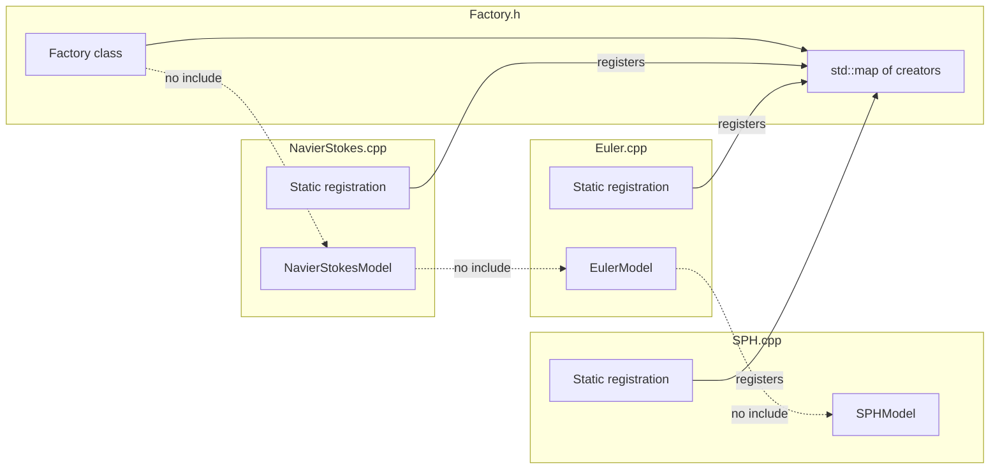

The factory is a map from strings to creator functions. Each type registers its own creator. The factory never includes type-specific headers.

```cpp
// Factory.h — no model-specific includes!
#pragma once
#include <string>
#include <memory>
#include <functional>
#include <unordered_map>

template <typename Base, typename Config>
class Factory {
public:
    using Creator = std::function<std::unique_ptr<Base>(const Config&)>;
    
    static Factory& instance() {
        static Factory factory;
        return factory;
    }
    
    void register_type(const std::string& name, Creator creator) {
        creators_[name] = std::move(creator);
    }
    
    std::unique_ptr<Base> create(const std::string& name, const Config& config) const {
        auto it = creators_.find(name);
        if (it == creators_.end()) {
            throw std::runtime_error("Unknown type: " + name);
        }
        return it->second(config);
    }
    
    std::vector<std::string> registered_types() const {
        std::vector<std::string> names;
        for (const auto& [name, _] : creators_) {
            names.push_back(name);
        }
        return names;
    }
    
private:
    Factory() = default;
    std::unordered_map<std::string, Creator> creators_;
};
```

## Self-Registration

Each type registers itself using a static initializer:

```cpp
// NavierStokesModel.cpp
#include "NavierStokesModel.h"
#include "PhysicsModelFactory.h"

namespace {
    bool registered = [] {
        PhysicsModelFactory::instance().register_type(
            "navier_stokes",
            [](const PhysicsConfig& config) {
                return std::make_unique<NavierStokesModel>(config);
            }
        );
        return true;
    }();
}
```

The lambda runs at static initialization time, before `main()`. The model registers itself. The factory never knows `NavierStokesModel` exists—it just has a creator function.

## Avoiding the Static Initialization Order Fiasco

**Problem:** What if the factory's static `instance()` hasn't been constructed when a model tries to register?

**Solution:** Function-local statics are constructed on first use:

```cpp
static Factory& instance() {
    static Factory factory;  // Constructed on first call
    return factory;
}
```

The first registration call constructs the factory. Subsequent calls return the same instance. C++11 guarantees thread-safe initialization of function-local statics.

## Ensuring Registration Happens

**Problem:** If `NavierStokesModel.cpp` isn't linked into the executable, registration never happens.

**Solutions:**

1. **Explicit linking.** Ensure all model `.cpp` files are in the build.

2. **Registration in a header (with care):**

```cpp
// NavierStokesModel.h
#pragma once

class NavierStokesModel : public PhysicsModel { ... };

// Force registration by including this header
inline bool NavierStokesModel_registered = [] {
    PhysicsModelFactory::instance().register_type("navier_stokes", ...);
    return true;
}();
```

The `inline` variable ensures one definition across translation units.

3. **Plugin loading.** For true plugins, use `dlopen`/`LoadLibrary` and call a registration function:

```cpp
// Plugin entry point
extern "C" void register_plugin() {
    PhysicsModelFactory::instance().register_type("custom_model", ...);
}
```

## What We've Achieved

- Factory header has no model-specific includes
- Adding a model doesn't modify the factory
- Models can be in separate libraries/plugins
- Registration is automatic (no central list to maintain)

But we still have the parameter problem. Every creator takes `const Config&`. What is `Config`?

---

# **CHAPTER 4 — Handling Constructor Parameters**

The parameter problem has several solutions, each appropriate for different situations.

## Solution 1: All Types Use the Same Config

If all types can be configured through a common interface, use that interface:

```cpp
struct PhysicsConfig {
    double timestep = 0.001;
    int grid_resolution = 100;
    std::string boundary_conditions = "periodic";
    
    // Generic key-value for type-specific settings
    std::unordered_map<std::string, std::string> extra;
};

class NavierStokesModel : public PhysicsModel {
public:
    explicit NavierStokesModel(const PhysicsConfig& config) {
        timestep_ = config.timestep;
        resolution_ = config.grid_resolution;
        
        // Type-specific settings from 'extra'
        if (auto it = config.extra.find("viscosity"); it != config.extra.end()) {
            viscosity_ = std::stod(it->second);
        }
    }
};
```

**Pros:** Simple, uniform interface.

**Cons:** Type-specific settings are stringly-typed. No compile-time checking that "navier_stokes" gets "viscosity".

## Solution 2: Config Struct Hierarchy

Use inheritance in the config:

```cpp
struct PhysicsConfig {
    double timestep = 0.001;
    virtual ~PhysicsConfig() = default;
};

struct NavierStokesConfig : PhysicsConfig {
    double viscosity = 0.001;
    double density = 1.0;
};

struct SPHConfig : PhysicsConfig {
    int particle_count = 10000;
    double kernel_radius = 0.1;
};
```

**Problem:** Now the factory signature must use `PhysicsConfig&`, and creators must downcast:

```cpp
[](const PhysicsConfig& config) {
    auto& ns_config = dynamic_cast<const NavierStokesConfig&>(config);  // Might throw!
    return std::make_unique<NavierStokesModel>(ns_config);
}
```

We're back to runtime type checking.

## Solution 3: Type-Specific Factory Methods

Don't use a generic factory for types with different construction needs:

```cpp
// For types with uniform construction:
auto model = PhysicsModelFactory::create("euler", common_config);

// For types with specific needs:
auto ns_model = NavierStokesModel::create(ns_specific_config);
```

**Pros:** Full type safety for specific construction.

**Cons:** Caller must know which types need special handling. Defeats the purpose of the factory.

## The Real Question

Why do your types have different constructor parameters?

If `NavierStokesModel` needs viscosity but `EulerModel` doesn't, they have different configuration requirements. This is a **design signal**:

- Maybe they shouldn't share a factory
- Maybe the configuration should be more abstract
- Maybe construction should be separated from configuration

Let's explore better designs.

---

# **CHAPTER 5 — The Configuration Object Pattern**

## The Insight

Instead of passing constructor parameters, pass a **configuration object** that all types understand. Each type extracts what it needs and ignores the rest.

## Design 1: Nested Sections

```cpp
struct PhysicsConfig {
    // Common settings
    double timestep = 0.001;
    int grid_resolution = 100;
    
    // Type-specific sections (optional)
    struct NavierStokes {
        double viscosity = 0.001;
        double density = 1.0;
    };
    std::optional<NavierStokes> navier_stokes;
    
    struct SPH {
        int particle_count = 10000;
        double kernel_radius = 0.1;
    };
    std::optional<SPH> sph;
    
    // ... other type-specific sections ...
};
```

Each type checks for its section:

```cpp
NavierStokesModel::NavierStokesModel(const PhysicsConfig& config) {
    timestep_ = config.timestep;
    
    if (config.navier_stokes) {
        viscosity_ = config.navier_stokes->viscosity;
        density_ = config.navier_stokes->density;
    } else {
        // Use defaults or throw
        throw std::runtime_error("NavierStokes config section required");
    }
}
```

**Pros:**
- Type-safe access to settings
- Clear what each type needs
- Config can be validated before factory call

**Cons:**
- Config struct knows about all types (but only their configs, not implementations)
- Adding a type requires modifying the config struct

## Design 2: Property Bag with Typed Accessors

```cpp
class PropertyBag {
public:
    template <typename T>
    void set(const std::string& key, T value) {
        properties_[key] = std::make_any<T>(std::move(value));
    }
    
    template <typename T>
    T get(const std::string& key) const {
        auto it = properties_.find(key);
        if (it == properties_.end()) {
            throw std::runtime_error("Missing property: " + key);
        }
        return std::any_cast<T>(it->second);
    }
    
    template <typename T>
    T get_or(const std::string& key, T default_value) const {
        auto it = properties_.find(key);
        if (it == properties_.end()) {
            return default_value;
        }
        return std::any_cast<T>(it->second);
    }
    
    bool has(const std::string& key) const {
        return properties_.contains(key);
    }
    
private:
    std::unordered_map<std::string, std::any> properties_;
};
```

Usage:

```cpp
PropertyBag config;
config.set("timestep", 0.001);
config.set("viscosity", 0.001);  // For Navier-Stokes
config.set("density", 1.0);

auto model = factory.create("navier_stokes", config);
```

Inside the creator:

```cpp
NavierStokesModel::NavierStokesModel(const PropertyBag& config) {
    timestep_ = config.get<double>("timestep");
    viscosity_ = config.get<double>("viscosity");
    density_ = config.get_or<double>("density", 1.0);
}
```

**Pros:**
- Extensible without modifying config class
- Types declare what they need, not what others need

**Cons:**
- String keys are error-prone
- Type mismatches are runtime errors
- No discoverability (what keys does NavierStokes need?)

## Design 3: Type-Safe Property Keys

Combine the flexibility of property bags with type safety:

```cpp
// Define keys with their types
template <typename T>
struct Key {
    explicit Key(std::string name) : name(std::move(name)) {}
    std::string name;
    using value_type = T;
};

// Standard keys
inline const Key<double> kTimestep{"timestep"};
inline const Key<int> kGridResolution{"grid_resolution"};
inline const Key<double> kViscosity{"viscosity"};
inline const Key<double> kDensity{"density"};
inline const Key<int> kParticleCount{"particle_count"};

class TypedPropertyBag {
public:
    template <typename T>
    void set(const Key<T>& key, T value) {
        properties_[key.name] = std::make_any<T>(std::move(value));
    }
    
    template <typename T>
    T get(const Key<T>& key) const {
        auto it = properties_.find(key.name);
        if (it == properties_.end()) {
            throw std::runtime_error("Missing: " + key.name);
        }
        return std::any_cast<T>(it->second);
    }
    
    template <typename T>
    T get_or(const Key<T>& key, T default_value) const {
        auto it = properties_.find(key.name);
        if (it == properties_.end()) return default_value;
        return std::any_cast<T>(it->second);
    }
    
private:
    std::unordered_map<std::string, std::any> properties_;
};
```

Usage:

```cpp
TypedPropertyBag config;
config.set(kTimestep, 0.001);
config.set(kViscosity, 0.001);
config.set(kDensity, 1.0);

// Type-safe: this won't compile
config.set(kViscosity, "not a double");  // Error!
config.set(kParticleCount, 0.5);         // Error! Expected int
```

**Pros:**
- Keys are discoverable (autocomplete works)
- Types are checked at compile time
- Extensible (add new keys without modifying the bag)

**Cons:**
- Still can't enforce "NavierStokes requires viscosity" at compile time
- Keys are global (potential naming conflicts)

---

# **CHAPTER 6 — Two-Phase Construction**

## The Insight

Separate "create the object" from "configure the object."

All objects are created the same way (no parameters). Configuration happens after creation through a uniform interface.

## The RAII Violation

Let's be explicit: **two-phase construction violates RAII**. An object exists in an unconfigured state between creation and configuration. This is the "zombie object" problem from *The Discipline of Class Design*. The object is constructed but not yet valid for use.

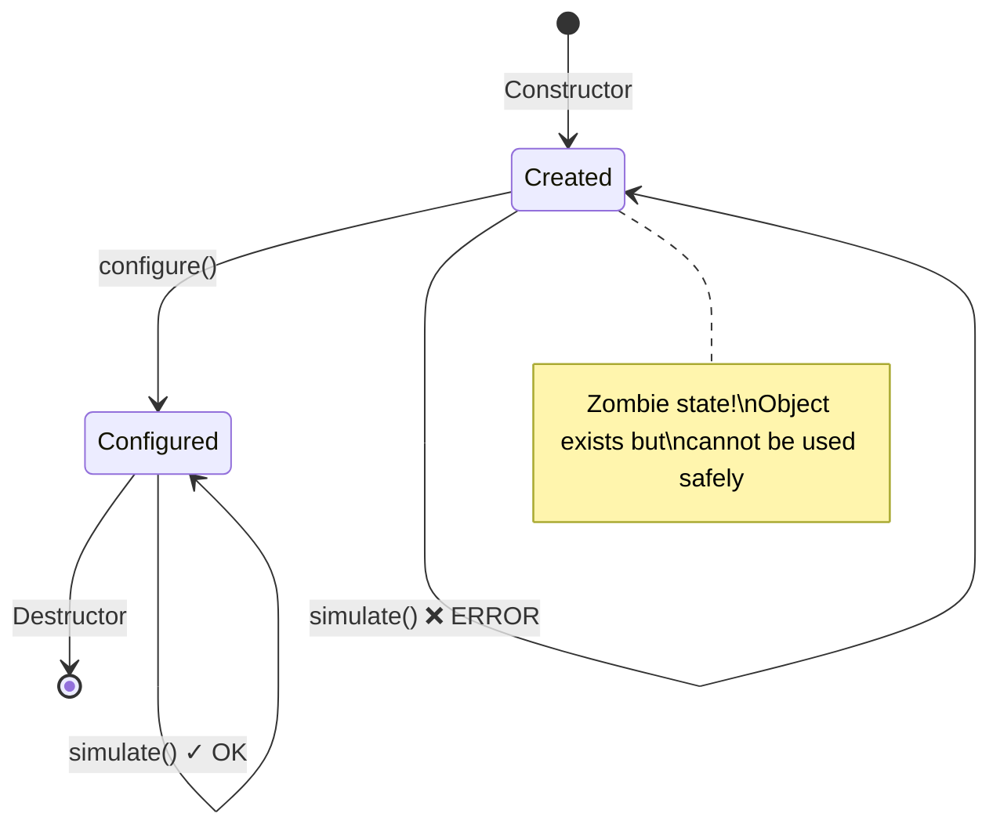

This violation is sometimes acceptable when the benefits outweigh the costs. But you must understand what you're giving up and take steps to minimize the exposed invalid state.

## The Naive Pattern (Problematic)

```cpp
class PhysicsModel {
public:
    virtual ~PhysicsModel() = default;
    virtual void configure(const PropertyBag& config) = 0;
    virtual void simulate(double dt) = 0;
    
protected:
    void require_configured() const {
        if (!configured_) {
            throw std::logic_error("Model not configured");
        }
    }
    bool configured_ = false;
};

class NavierStokesModel : public PhysicsModel {
public:
    NavierStokesModel() = default;  // Zombie state!
    
    void configure(const PropertyBag& config) override {
        viscosity_ = config.get<double>(kViscosity);
        density_ = config.get_or<double>(kDensity, 1.0);
        configured_ = true;
    }
    
    void simulate(double dt) override {
        require_configured();  // Runtime check for zombie state
        // ...
    }
};
```

The problems:

1. Every method must check `configured_`. Miss one, get undefined behavior.
2. Callers can forget to call `configure()`. The compiler doesn't help.
3. The zombie state is visible to user code.

## The Better Pattern: Registered Configurators

Just as creators can be registered to isolate type dependencies, **configurators can be registered too**. The factory holds both registries and never exposes unconfigured objects.

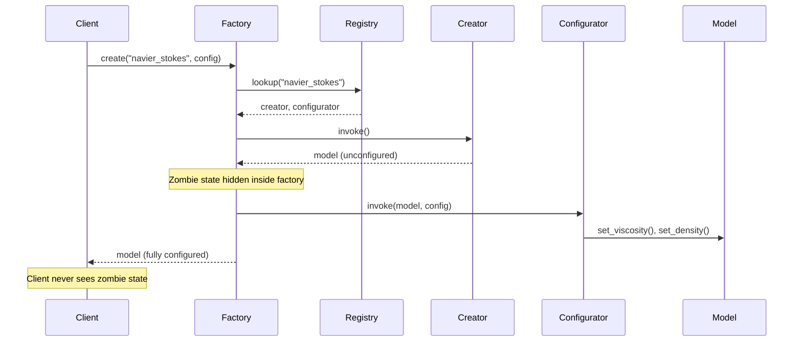

```cpp
// PhysicsModelFactory.h — no model-specific includes
class PhysicsModelFactory {
public:
    using Creator = std::function<std::unique_ptr<PhysicsModel>()>;
    using Configurator = std::function<void(PhysicsModel&, const PropertyBag&)>;
    
    static PhysicsModelFactory& instance() {
        static PhysicsModelFactory factory;
        return factory;
    }
    
    void register_type(const std::string& name, 
                       Creator creator, 
                       Configurator configurator) {
        creators_[name] = std::move(creator);
        configurators_[name] = std::move(configurator);
    }
    
    // Returns fully-configured object — no zombie state exposed
    std::unique_ptr<PhysicsModel> create(const std::string& name,
                                          const PropertyBag& config) {
        auto it = creators_.find(name);
        if (it == creators_.end()) {
            throw std::runtime_error("Unknown type: " + name);
        }
        
        auto model = it->second();
        configurators_[name](*model, config);
        return model;  // Fully configured
    }
    
private:
    PhysicsModelFactory() = default;
    std::unordered_map<std::string, Creator> creators_;
    std::unordered_map<std::string, Configurator> configurators_;
};
```

Now each model registers both its creator and its configurator in its own `.cpp` file:

```cpp
// NavierStokesModel.cpp
#include "NavierStokesModel.h"
#include "PhysicsModelFactory.h"

namespace {
    const bool registered = [] {
        PhysicsModelFactory::instance().register_type(
            "navier_stokes",
            // Creator: just makes the object
            [] { return std::make_unique<NavierStokesModel>(); },
            // Configurator: knows what this type needs
            [](PhysicsModel& model, const PropertyBag& config) {
                auto& ns = static_cast<NavierStokesModel&>(model);
                ns.set_viscosity(config.get<double>(kViscosity));
                ns.set_density(config.get_or<double>(kDensity, 1.0));
            }
        );
        return true;
    }();
}
```

The model class no longer needs a `configure()` virtual method. It can have normal setters or even take parameters in its constructor (called by the configurator, not the factory user).

## Why Singleton Is Appropriate Here

This factory is a good use of the singleton pattern. Referring to the taxonomy from *The Discipline of Class Design*:

**Category 1: Immutable Facts.** Once registration is complete (at static initialization time), the registry never changes. The registered creators and configurators are facts about what types exist, not mutable program state. No test needs different registrations—the types are the types.

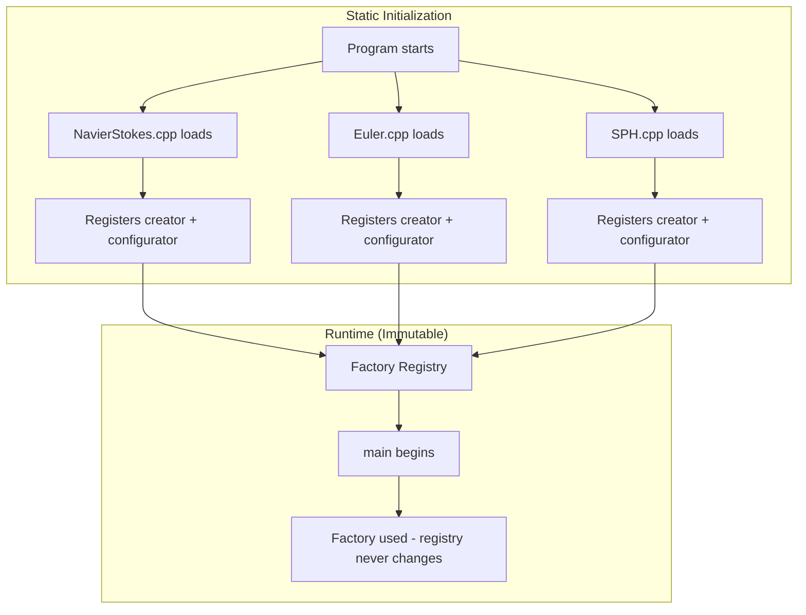

The singleton works because:

- The data is effectively immutable after startup
- Global access is convenient (registration happens in scattered `.cpp` files)
- No test isolation concerns (tests use the same types as production)

If you needed per-test type registrations, you'd use Category 3 (explicit service with lifetime) instead. But for most plugin systems, singleton is correct.

## Isolating Dependencies Further

The configurator pattern isolates dependencies even more than creator-only registration:

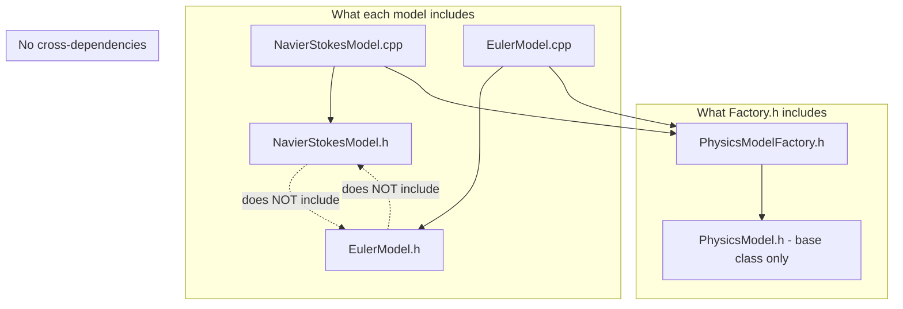

1. **Factory header** includes only `PhysicsModel` base class
2. **Model headers** define each concrete model
3. **Model `.cpp` files** register both creator and configurator

No translation unit includes all model headers. Each model is self-contained. Adding a new model touches only the new model's files.

## When Two-Phase Construction Is Worth It

Two-phase construction makes sense when:

- Creation and configuration are genuinely separate concerns
- Configuration varies independently of type (same type, different configs)
- The factory must have a uniform signature
- You can hide the zombie state inside the factory

It's not worth it when:

- Configuration is simple and could be constructor parameters
- You can't guarantee configuration before use
- The zombie state would leak to user code

## The Preferred Pattern

The cleanest two-phase construction never exposes the unconfigured state:

```cpp
// User code — no zombie state visible
auto model = PhysicsModelFactory::instance().create("navier_stokes", config);
model->simulate(0.001);  // Always safe — factory returned configured object
```

The two phases happen inside the factory's `create()` method. From the caller's perspective, it's single-phase construction that happens to support runtime type selection.

---

# **CHAPTER 7 — The Prototype Pattern**

The Prototype pattern predates object-oriented programming as we know it. In the Self language (1987), there were no classes at all—only objects that could be cloned to create new objects. The Gang of Four formalized this as a creational pattern in 1994, recognizing that cloning sidesteps the complexity of parameterized construction.

In industrial software, prototypes appear wherever configured templates are reused: CAD systems store prototype parts, game engines store prototype entities, simulation frameworks store prototype scenarios. The pattern trades memory (storing configured instances) for simplicity (cloning vs. configuring from scratch).

## The Insight

Instead of constructing objects from parameters, **clone pre-configured prototypes**.

## The Pattern

Register configured instances, not creator functions:

```cpp
class PhysicsModel {
public:
    virtual ~PhysicsModel() = default;
    virtual std::unique_ptr<PhysicsModel> clone() const = 0;
    virtual void simulate(double dt) = 0;
};

class PrototypeRegistry {
public:
    void register_prototype(const std::string& name, 
                            std::unique_ptr<PhysicsModel> prototype) {
        prototypes_[name] = std::move(prototype);
    }
    
    std::unique_ptr<PhysicsModel> create(const std::string& name) const {
        auto it = prototypes_.find(name);
        if (it == prototypes_.end()) {
            throw std::runtime_error("Unknown type: " + name);
        }
        return it->second->clone();
    }
    
private:
    std::unordered_map<std::string, std::unique_ptr<PhysicsModel>> prototypes_;
};
```

Registration creates a configured prototype:

```cpp
// At startup:
auto ns_prototype = std::make_unique<NavierStokesModel>(
    NavierStokesConfig{.viscosity = 0.001, .density = 1.0}
);
registry.register_prototype("navier_stokes", std::move(ns_prototype));
```

Creation clones the prototype:

```cpp
auto model = registry.create("navier_stokes");  // Clone of prototype
```

## Advantages

1. **Prototypes can be complex.** Multi-step construction, resource loading, etc.
2. **Cloning is often cheaper.** Copy existing state instead of recomputing.
3. **Different configurations = different prototypes.** Register "navier_stokes_high_viscosity" and "navier_stokes_low_viscosity" separately.

## Implementing Clone

```cpp
class NavierStokesModel : public PhysicsModel {
public:
    std::unique_ptr<PhysicsModel> clone() const override {
        return std::make_unique<NavierStokesModel>(*this);
    }
    
    // ... rest of implementation ...
};
```

If cloning is expensive, consider:

```cpp
std::unique_ptr<PhysicsModel> clone() const override {
    auto copy = std::make_unique<NavierStokesModel>();
    copy->viscosity_ = viscosity_;
    copy->density_ = density_;
    // Don't copy runtime state, only configuration
    return copy;
}
```

## When Prototypes Work Well

- Objects have complex initialization (resource loading, precomputation)
- Multiple configurations of the same type are common
- Objects are expensive to construct from scratch
- Deep copying is well-defined for your types

## When Prototypes Don't Work

- Objects hold unique resources (file handles, thread IDs)
- Deep copying is expensive or impossible
- Configuration varies per-instance (defeats prototype reuse)

---

# **CHAPTER 8 — Type-Safe Dispatch Without Factories**

Sometimes you don't need object creation—you need **behavior dispatch**.

## The Scenario

You have a `std::any` and need to process it based on its actual type:

```cpp
void process(const std::any& value) {
    if (value.type() == typeid(int)) {
        process_int(std::any_cast<int>(value));
    } else if (value.type() == typeid(std::string)) {
        process_string(std::any_cast<std::string>(value));
    }
    // ... more cases ...
}
```

Same problem: switch statements, no extensibility.

## Solution: Type-Indexed Dispatch Table

```cpp
class TypeDispatcher {
public:
    template <typename T>
    void register_handler(std::function<void(const T&)> handler) {
        handlers_[std::type_index(typeid(T))] = [handler](const std::any& value) {
            handler(std::any_cast<const T&>(value));
        };
    }
    
    void dispatch(const std::any& value) const {
        auto it = handlers_.find(std::type_index(value.type()));
        if (it == handlers_.end()) {
            throw std::runtime_error("No handler for type");
        }
        it->second(value);
    }
    
private:
    std::unordered_map<std::type_index, 
                       std::function<void(const std::any&)>> handlers_;
};
```

Usage:

```cpp
TypeDispatcher dispatcher;

dispatcher.register_handler<int>([](const int& value) {
    std::cout << "Integer: " << value << "\n";
});

dispatcher.register_handler<std::string>([](const std::string& value) {
    std::cout << "String: " << value << "\n";
});

std::any value = 42;
dispatcher.dispatch(value);  // "Integer: 42"

value = std::string("hello");
dispatcher.dispatch(value);  // "String: hello"
```

## Returning Values

```cpp
template <typename Result>
class TypedDispatcher {
public:
    template <typename T>
    void register_handler(std::function<Result(const T&)> handler) {
        handlers_[std::type_index(typeid(T))] = [handler](const std::any& value) {
            return handler(std::any_cast<const T&>(value));
        };
    }
    
    Result dispatch(const std::any& value) const {
        auto it = handlers_.find(std::type_index(value.type()));
        if (it == handlers_.end()) {
            throw std::runtime_error("No handler for type");
        }
        return it->second(value);
    }
    
private:
    std::unordered_map<std::type_index,
                       std::function<Result(const std::any&)>> handlers_;
};
```

## When to Use This

- Serialization/deserialization
- Visitor patterns on type-erased containers
- Message handling systems
- Plugin systems where plugins handle specific types

---

# **CHAPTER 9 — Putting It Together: A Complete Example**

Let's build a complete, production-ready factory system.

## The Domain: Serialization Formats

Users specify output format as a string ("json", "binary", "xml"). Each format has different configuration needs.

## The Interfaces

```cpp
// Serializer.h
#pragma once
#include <string>
#include <memory>

class Serializer {
public:
    virtual ~Serializer() = default;
    virtual std::string serialize(const Data& data) = 0;
    virtual Data deserialize(const std::string& input) = 0;
};
```

```cpp
// SerializerConfig.h
#pragma once
#include <string>
#include <optional>

struct SerializerConfig {
    // Common settings
    bool pretty_print = false;
    
    // JSON-specific
    struct Json {
        int indent_width = 2;
        bool escape_unicode = true;
    };
    std::optional<Json> json;
    
    // Binary-specific
    struct Binary {
        bool compress = false;
        int compression_level = 6;
    };
    std::optional<Binary> binary;
    
    // XML-specific
    struct Xml {
        std::string root_element = "root";
        bool include_declaration = true;
    };
    std::optional<Xml> xml;
};
```

## The Factory

```cpp
// SerializerFactory.h
#pragma once
#include "Serializer.h"
#include "SerializerConfig.h"
#include <functional>
#include <unordered_map>
#include <stdexcept>

class SerializerFactory {
public:
    using Creator = std::function<std::unique_ptr<Serializer>(const SerializerConfig&)>;
    
    static SerializerFactory& instance() {
        static SerializerFactory factory;
        return factory;
    }
    
    void register_type(const std::string& name, Creator creator) {
        creators_[name] = std::move(creator);
    }
    
    std::unique_ptr<Serializer> create(const std::string& name,
                                        const SerializerConfig& config = {}) const {
        auto it = creators_.find(name);
        if (it == creators_.end()) {
            throw std::runtime_error("Unknown serializer: " + name);
        }
        return it->second(config);
    }
    
    std::vector<std::string> available_formats() const {
        std::vector<std::string> names;
        names.reserve(creators_.size());
        for (const auto& [name, _] : creators_) {
            names.push_back(name);
        }
        return names;
    }
    
private:
    SerializerFactory() = default;
    std::unordered_map<std::string, Creator> creators_;
};

// Registration helper macro
#define REGISTER_SERIALIZER(name, type) \
    namespace { \
        inline bool type##_registered = [] { \
            SerializerFactory::instance().register_type(name, \
                [](const SerializerConfig& config) { \
                    return std::make_unique<type>(config); \
                }); \
            return true; \
        }(); \
    }
```

## A Concrete Serializer

```cpp
// JsonSerializer.h
#pragma once
#include "Serializer.h"
#include "SerializerConfig.h"

class JsonSerializer : public Serializer {
public:
    explicit JsonSerializer(const SerializerConfig& config) {
        pretty_print_ = config.pretty_print;
        if (config.json) {
            indent_width_ = config.json->indent_width;
            escape_unicode_ = config.json->escape_unicode;
        }
    }
    
    std::string serialize(const Data& data) override {
        // ... JSON serialization logic ...
    }
    
    Data deserialize(const std::string& input) override {
        // ... JSON parsing logic ...
    }
    
private:
    bool pretty_print_ = false;
    int indent_width_ = 2;
    bool escape_unicode_ = true;
};
```

```cpp
// JsonSerializer.cpp
#include "JsonSerializer.h"
#include "SerializerFactory.h"

REGISTER_SERIALIZER("json", JsonSerializer)

// Implementation of serialize/deserialize...
```

## Usage

```cpp
#include "SerializerFactory.h"

void save_data(const Data& data, const std::string& format) {
    SerializerConfig config;
    config.pretty_print = true;
    
    if (format == "json") {
        config.json = SerializerConfig::Json{.indent_width = 4};
    } else if (format == "binary") {
        config.binary = SerializerConfig::Binary{.compress = true};
    }
    
    auto serializer = SerializerFactory::instance().create(format, config);
    std::string output = serializer->serialize(data);
    // ... write output to file ...
}
```

## What We Achieved

- **Factory knows no concrete types.** `SerializerFactory.h` doesn't include `JsonSerializer.h`.
- **Self-registration.** Each serializer registers itself.
- **Type-safe configuration.** `SerializerConfig` has typed sections for each format.
- **Extensible.** Add new formats by creating a new `.cpp` file with `REGISTER_SERIALIZER`.
- **Discoverable.** `available_formats()` lists what's registered.

---

# **CHAPTER 10 — The FAT-P Factory**

The FAT-P library includes a production-ready factory implementation in `Factory.h`. It uses policy-based design to customize concurrency, error handling, registration behavior, storage, lifetime, and statistics collection.

## Core Design

The factory is parameterized by six policies:

```cpp
template <
    typename K,                          // Key type (usually std::string)
    typename T,                          // Product type (usually unique_ptr<Base>)
    typename ConcurrencyPolicy,          // Thread safety
    typename ErrorHandlingPolicy,        // How to report failures
    typename RegistrationPolicy,         // Allow overwrites?
    typename StoragePolicy,              // Map vs unordered_map
    typename LifetimePolicy,             // Instance vs singleton
    typename StatisticsPolicy,           // Track usage metrics?
    typename... Params                   // Creator function parameters
>
class Factory;
```

This design lets you choose exactly the tradeoffs you need. HPC code can disable statistics and use single-threaded mode for zero overhead. Shared services can enable thread safety and registration protection.

## Type Aliases for Common Cases

FAT-P provides pre-configured aliases:

```cpp
// Basic single-threaded factory
template<typename K, typename T>
using SimpleFactory = Factory<K, T, SingleThreadedPolicy, ...>;

// Thread-safe with mutex
template<typename K, typename T>
using ThreadSafeFactory = Factory<K, T, MutexSynchronizationPolicy, ...>;

// Optimized for string keys (unordered_map)
template<typename T>
using StringKeyFactory = FastFactory<std::string, T>;

// Zero-overhead for HPC (no statistics, throws on error)
template<typename K, typename T>
using HPCFactory = Factory<K, T, SingleThreadedPolicy, ThrowingErrorPolicy, 
                           ..., NoStatisticsPolicy>;
```

## Error Handling with Expected

The default error policy returns `Expected<T, FactoryErrorInfo<K>>` instead of throwing:

```cpp
auto result = factory.make("navier_stokes");
if (result) {
    use(*result);
} else {
    log_error(result.error().full_message());
}
```

The error contains the error code, a message, and optionally the key that failed. This integrates with FAT-P's `Expected` type for composable error handling.

## Self-Registration Pattern

Use the singleton lifetime policy with function-local statics:

```cpp
// PhysicsModelFactory.h
using PhysicsModelFactory = fat_p::Factory<
    std::string,
    std::unique_ptr<PhysicsModel>,
    fat_p::SingleThreadedPolicy,
    fat_p::ExpectedErrorPolicy<std::unique_ptr<PhysicsModel>, std::string>,
    fat_p::PreventOverwritePolicy,
    fat_p::UnorderedMapStoragePolicy<std::string, 
        std::function<std::unique_ptr<PhysicsModel>()>>,
    fat_p::SingletonLifetimePolicy,
    fat_p::AtomicStatisticsPolicy
>;

// NavierStokesModel.cpp
namespace {
    const bool registered = [] {
        PhysicsModelFactory::instance().registerType(
            "navier_stokes",
            [] { return std::make_unique<NavierStokesModel>(); }
        );
        return true;
    }();
}
```

The `SingletonLifetimePolicy` enables the `instance()` static method. The function-local static in `instance()` ensures the factory exists before any registration attempts.

## Variadic Creator Parameters

For types that need construction parameters, use the `Params...` template parameter:

```cpp
using ConfiguredFactory = fat_p::Factory<
    std::string,
    std::unique_ptr<PhysicsModel>,
    fat_p::SingleThreadedPolicy,
    fat_p::ExpectedErrorPolicy<std::unique_ptr<PhysicsModel>, std::string>,
    fat_p::PreventOverwritePolicy,
    fat_p::MapStoragePolicy<std::string, 
        std::function<std::unique_ptr<PhysicsModel>(const PhysicsConfig&)>>,
    fat_p::InstanceLifetimePolicy,
    fat_p::AtomicStatisticsPolicy,
    const PhysicsConfig&  // Creator takes PhysicsConfig
>;

// Registration
factory.registerType("navier_stokes", 
    [](const PhysicsConfig& config) {
        return std::make_unique<NavierStokesModel>(config);
    });

// Creation
auto model = factory.make("navier_stokes", config);
```

All creators have the same signature, determined by `Params...`. This enforces uniform configuration across types.

## Statistics and Diagnostics

The factory tracks registrations, lookups, resolutions, and failures:

```cpp
auto stats = factory.getStats();
std::cout << "Registrations: " << stats.registrations << "\n";
std::cout << "Successful resolutions: " << stats.resolutions << "\n";
std::cout << "Resolution failures: " << stats.resolution_failures << "\n";
```

For HPC code where statistics overhead matters, use `NoStatisticsPolicy` to compile them out entirely.

## Thread Safety Notes

The factory releases its lock before invoking the creator function. This allows creators to make nested factory calls without deadlock:

```cpp
// This works even with mutex synchronization:
factory.registerType("composite", [&factory]() {
    auto a = factory.make("component_a");  // Nested call OK
    auto b = factory.make("component_b");  // Nested call OK
    return std::make_unique<Composite>(std::move(a), std::move(b));
});
```

The lookup happens under the lock, but creation happens outside it.

## See Also

The full implementation is in `Factory.h`. The test file `test_Factory.cpp` demonstrates all policies and usage patterns.

---

# **CHAPTER 11 — When Factories Are Wrong**

Factories solve the problem of runtime type selection. But sometimes you don't have that problem.

## You Know the Type at Compile Time

If the type is determined by template parameters or compile-time configuration, don't use a factory:

```cpp
// Don't do this:
template <typename T>
void process() {
    auto serializer = SerializerFactory::create(TypeName<T>::value);
    // ...
}

// Do this:
template <typename T>
void process() {
    JsonSerializer serializer;  // Just construct it
    // ...
}
```

Factories add indirection. If you don't need runtime selection, don't pay for it.

## There's Only One Implementation

If there's only one serializer, you don't need a factory:

```cpp
// Overkill:
class SerializerFactory { ... };  // For one type

// Just use:
JsonSerializer serializer(config);
```

Factories are for selecting among multiple options. One option isn't a selection.

## The Types Don't Share an Interface

If "json" and "binary" serializers have completely different interfaces, a common factory doesn't help:

```cpp
class JsonSerializer {
    void set_indent(int n);
    void enable_comments();
    std::string to_string(const JsonValue&);
};

class BinarySerializer {
    void set_endianness(Endian e);
    void write(const void* data, size_t len);
};
```

These aren't substitutable. A factory that returns `Serializer*` would lose the type-specific methods.

## Configuration Is Complex and Type-Specific

If each type needs radically different setup:

```cpp
// JsonSerializer needs: indent, unicode escaping, comment handling
// BinarySerializer needs: endianness, compression codec, block size
// XmlSerializer needs: schema path, namespace mappings, DTD location
```

A common config struct becomes unwieldy. Consider:

- Separate factory per type family
- Builder pattern per type
- Type-specific factory methods

## The Object Has Identity

Factories create new instances. If objects have identity that matters:

```cpp
auto a = factory.create("database_connection");
auto b = factory.create("database_connection");
// a and b are different connections!
```

This might not be what you want. Consider:

- **Pool pattern:** Factory draws from a pool of existing objects
- **Registry pattern:** Factory returns the same instance for the same key
- **Multiton pattern:** One instance per configuration

---

# **CHAPTER 12 — Refactoring Constraints**

The patterns in this document describe ideal solutions. Real codebases aren't ideal. When refactoring legacy code, you're constrained by what exists.

## The Reality of Refactoring

You inherit a codebase with 47 concrete types, each with its own constructor signature. The factory is a 2000-line switch statement. You want to fix it, but you can't rewrite everything at once.

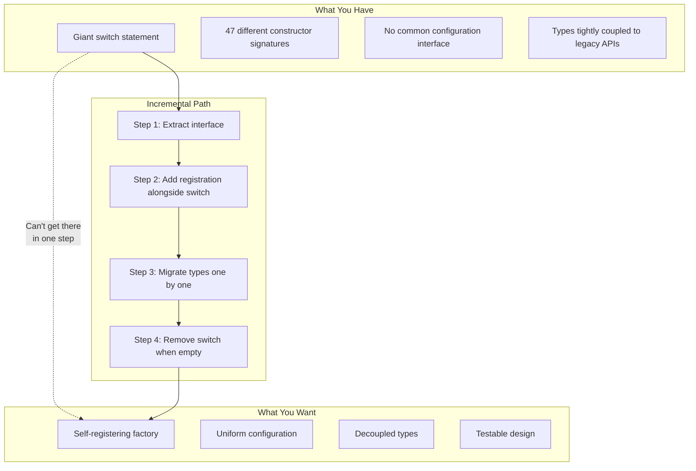

## Constraint: You Can't Change All Constructors

Some types are used throughout the codebase. Changing their constructor signature would require changes in hundreds of places.

**Solution: Adapter configurators**

Keep the existing constructor. Write a configurator that translates from your new config format to the existing constructor:

```cpp
// Legacy: can't change this constructor
class LegacyModel : public PhysicsModel {
public:
    LegacyModel(double param1, int param2, const std::string& param3,
                bool flag1, bool flag2, double param4);
};

// Adapter: translate from PropertyBag to legacy constructor
namespace {
    const bool registered = [] {
        PhysicsModelFactory::instance().register_type(
            "legacy_model",
            [] { 
                // Can't use default constructor - doesn't exist
                // Must use placement or delayed initialization
                return nullptr;  // Placeholder
            },
            [](PhysicsModel*& model, const PropertyBag& config) {
                // Create with legacy constructor
                model = new LegacyModel(
                    config.get<double>("param1"),
                    config.get<int>("param2"),
                    config.get<std::string>("param3"),
                    config.get<bool>("flag1"),
                    config.get<bool>("flag2"),
                    config.get<double>("param4")
                );
            }
        );
        return true;
    }();
}
```

Or use a factory method that combines creation and configuration:

```cpp
factory.register_creator("legacy_model", 
    [](const PropertyBag& config) {
        return std::make_unique<LegacyModel>(
            config.get<double>("param1"),
            config.get<int>("param2"),
            config.get<std::string>("param3"),
            config.get<bool>("flag1"),
            config.get<bool>("flag2"),
            config.get<double>("param4")
        );
    }
);
```

The PropertyBag provides the uniform interface. The lambda handles the translation.

## Constraint: Types Have Incompatible Lifecycles

Some types need resources that must be initialized before creation, or cleaned up in a specific order.

**Solution: Lifecycle-aware factory**

```cpp
class LifecycleAwareFactory {
public:
    void initialize_resources();  // Call before any create()
    void shutdown();              // Call after all objects destroyed
    
    std::unique_ptr<PhysicsModel> create(const std::string& name,
                                          const PropertyBag& config);
    
private:
    std::unordered_map<std::string, Creator> creators_;
    std::unordered_map<std::string, ResourceInitializer> initializers_;
    std::vector<std::string> initialization_order_;
};
```

## Constraint: Can't Use Exceptions

Some codebases disable exceptions (`-fno-exceptions`). The patterns that rely on throwing from configurators won't work.

**Solution: Error-returning configuration**

```cpp
using Configurator = std::function<
    Expected<void, ConfigError>(PhysicsModel&, const PropertyBag&)
>;

Expected<std::unique_ptr<PhysicsModel>, FactoryError> 
Factory::create(const std::string& name, const PropertyBag& config) {
    auto model = creators_[name]();
    auto result = configurators_[name](*model, config);
    if (!result) {
        return Unexpected(FactoryError::ConfigurationFailed);
    }
    return model;
}
```

## Constraint: Existing Tests Depend on Current Behavior

You can't change the factory interface because tests instantiate types directly.

**Solution: Parallel implementation**

Keep the old factory working. Build the new factory alongside it. Migrate tests incrementally.

```cpp
// Old interface (keep working)
auto model = OldFactory::create_navier_stokes(viscosity, density);

// New interface (add incrementally)  
auto model = NewFactory::instance().create("navier_stokes", config);

// Both work during migration
```

## The Incremental Path

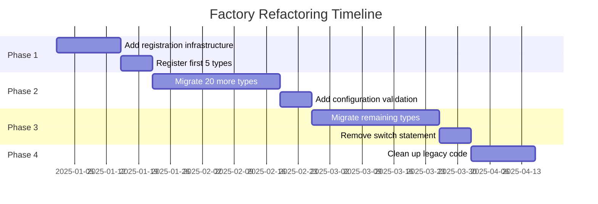

The key insight: **you don't have to finish**. Each step makes the code better. If you migrate 20 of 47 types before priorities change, you still have a better codebase than when you started.

---

# **CHAPTER 13 — When Different Parameters Are Correct**

Not all variation in constructor parameters is a design problem. Sometimes the types genuinely need different configuration because their underlying mechanisms are fundamentally different.

## The Sensor Example

Consider linear position sensors for industrial actuators. All measure the same thing—linear displacement—but use completely different physics:

**LVDT (Linear Variable Differential Transformer)** was developed in the 1930s and remains the gold standard for precision position measurement in harsh environments. A movable ferromagnetic core slides inside three coils: one primary (excited with AC) and two secondaries wound in opposition. As the core moves, it changes the magnetic coupling between primary and secondaries, producing a differential voltage proportional to position. LVDTs have no sliding contacts, giving them essentially infinite mechanical life. They're used in aircraft flight controls, nuclear reactors, and hydraulic servo systems where failure is not an option.

**String Pot (String Potentiometer)**, also called a cable-extension transducer, uses the simplest possible principle: a spring-loaded spool of wire connected to a precision potentiometer or encoder. Pull the string, the spool rotates, resistance changes. Invented in the mid-20th century for automotive testing, string pots remain popular because they're cheap, easy to install, and work over long stroke lengths (up to 50 meters). The tradeoff is mechanical wear—the string, spring, and wiper all degrade with use.

**Ultrasonic LDT (Linear Displacement Transducer)**, exemplified by MTS Temposonics sensors developed in the 1970s, uses magnetostriction—the property of ferromagnetic materials to change shape in a magnetic field. A current pulse travels down a magnetostrictive waveguide. When it reaches a position magnet, the interaction creates a torsional strain wave that propagates back at the speed of sound. Time-of-flight gives position. These sensors provide absolute position (no homing required), work in hydraulic cylinders filled with oil, and achieve micron-level resolution over strokes up to 20 meters.

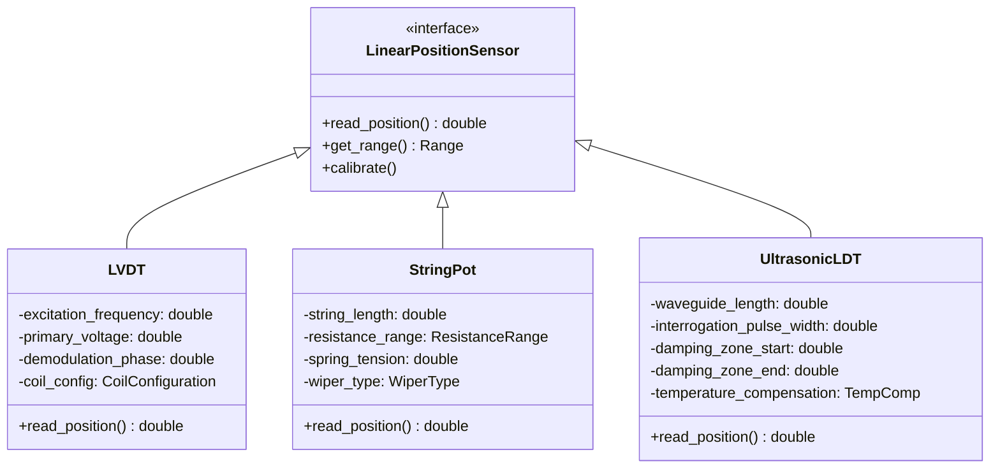

The configuration parameters aren't arbitrary implementation details—they reflect the underlying physics:

**LVDT configuration** must specify how the sensor is electrically driven. Excitation frequency determines the AC signal on the primary coil; it must match the signal conditioning electronics. Primary voltage affects sensitivity and range. Demodulation phase compensates for phase shifts in the coil windings. These parameters have no equivalent in other sensor types—they're specific to transformer physics.

**String pot configuration** describes the mechanical assembly. String length limits maximum stroke. Resistance range (e.g., 1kΩ to 10kΩ) must match the signal conditioning circuit's input range. Spring tension affects retraction speed and minimum force required to extend the string. Wiper type (precious metal, conductive plastic) determines wear characteristics. None of these concepts exist in an LVDT.

**Ultrasonic LDT configuration** describes the magnetostrictive measurement process. Waveguide length determines maximum stroke. Interrogation pulse width affects resolution and noise immunity. Damping zones define regions near the ends where measurements are less accurate (the pulse reflects). Temperature compensation corrects for the speed of sound varying with temperature. An LVDT has no waveguide; a string pot has no damping zones.

## Why This Is Legitimate

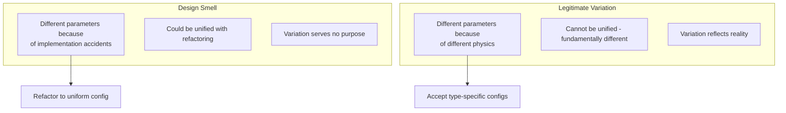

The test: **Could these parameters be unified without losing information?**

For the sensors: No. You can't configure an LVDT without knowing its excitation frequency. That parameter has no meaning for a string pot. Forcing a common config would mean either:

1. **Superset config:** Every sensor type's parameters in one struct. Mostly empty for each type.
2. **Stringly-typed config:** PropertyBag where each type looks for its own keys. No compile-time checking.

Both are worse than accepting that the types need different configuration.

## The Factory Pattern for Legitimate Variation

When types genuinely need different parameters, use **type-specific factory methods** alongside the generic factory:

```cpp
// Generic factory for uniform operations (read, calibrate)
class SensorFactory {
public:
    // Registration uses type-specific configs internally
    template <typename SensorType, typename ConfigType>
    void register_sensor(const std::string& name) {
        creators_[name] = [](const PropertyBag& bag) {
            // Type knows how to extract its config from the bag
            return SensorType::create_from_bag(bag);
        };
    }
    
    std::unique_ptr<LinearPositionSensor> create(
        const std::string& type, 
        const PropertyBag& config);
};

// Type-specific construction for compile-time safety
class LVDT : public LinearPositionSensor {
public:
    struct Config {
        double excitation_frequency_hz;
        double primary_voltage;
        double demodulation_phase_deg;
        CoilConfiguration coil_config;
    };
    
    explicit LVDT(const Config& config);
    
    // For factory use
    static std::unique_ptr<LVDT> create_from_bag(const PropertyBag& bag) {
        Config config;
        config.excitation_frequency_hz = bag.get<double>("excitation_frequency_hz");
        config.primary_voltage = bag.get<double>("primary_voltage");
        config.demodulation_phase_deg = bag.get_or<double>("demodulation_phase_deg", 0.0);
        config.coil_config = bag.get<CoilConfiguration>("coil_config");
        return std::make_unique<LVDT>(config);
    }
};
```

Users who know the type at compile time get type safety:

```cpp
LVDT::Config config{
    .excitation_frequency_hz = 5000.0,
    .primary_voltage = 3.0,
    .demodulation_phase_deg = 0.0,
    .coil_config = CoilConfiguration::Standard
};
auto sensor = std::make_unique<LVDT>(config);  // Compile-time checked
```

Users who need runtime selection use the factory:

```cpp
PropertyBag config;
config.set("excitation_frequency_hz", 5000.0);
config.set("primary_voltage", 3.0);
config.set("coil_config", CoilConfiguration::Standard);

auto sensor = factory.create("lvdt", config);  // Runtime selection
```

## The Key Distinction

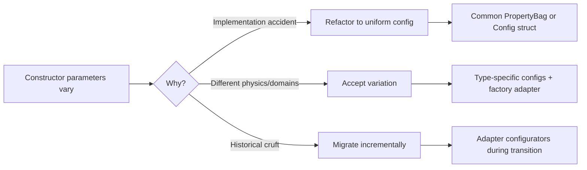

Ask yourself:

1. **Is the variation essential or accidental?** LVDT's excitation frequency is essential. Different parameter names for the same concept are accidental.

2. **Would unification lose information?** If merging configs would require "this field only applies to type X" comments, the variation is essential.

3. **Do domain experts expect the difference?** An engineer specifying sensors expects LVDT configuration to look different from string pot configuration.

When variation is essential, don't fight it. Provide type-specific configs with compile-time safety, and adapt them to a common interface at the factory boundary.

---

# **Summary**

## The Core Patterns

| Problem | Solution |
|---------|----------|
| Factory knows all types | Self-registration with function-local static |
| Varying constructor params (accidental) | Configuration object with type-specific sections |
| Varying constructor params (essential) | Type-specific configs with factory adapters |
| Runtime type errors | Registered configurators (hidden inside factory) |
| Complex initialization | Prototype pattern with cloning |
| Behavior dispatch on `std::any` | Type-indexed handler map |
| Legacy code constraints | Incremental migration with adapters |

## Choosing a Pattern

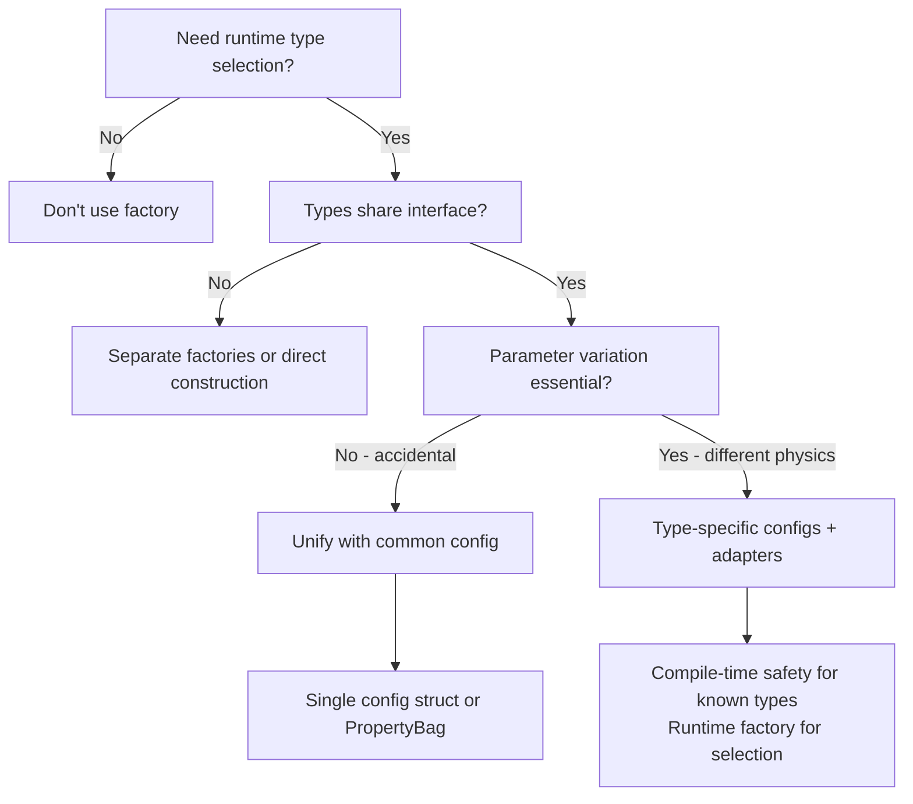

Start by asking whether you need runtime type selection at all. If the type is known at compile time, don't use a factory—just construct the object directly.

If you do need runtime selection, ask whether all types share a common interface. If they don't, a unified factory won't help—consider separate factories or direct construction with type-specific APIs.

For types that share an interface, ask whether parameter variation is essential or accidental. If types differ because of implementation history, unify them with a common configuration. If types differ because of fundamentally different physics or domains (like LVDT vs. string pot sensors), accept the variation and provide type-specific configs with factory adapters.

## The RAII Tradeoff

Two-phase construction (create, then configure) violates RAII by allowing objects to exist in an unconfigured "zombie" state. This is acceptable only when the factory hides the zombie state internally. User code should never see an unconfigured object. Register both creators and configurators, and have the factory's `create()` method call both before returning.

## The Key Insight

**Varying constructor parameters can signal a design problem—or reflect reality.** The question is whether the variation is essential or accidental.

Essential variation (different physics, different domains) should be accepted. Provide type-specific configs with compile-time safety, and adapt them at the factory boundary.

Accidental variation (implementation history, inconsistent naming) should be unified. Use common configuration objects where each type extracts what it needs.

For the factory registries themselves, singleton is usually the appropriate pattern—they're Category 1 global state (immutable facts after initialization). See *The Discipline of Class Design* for the full taxonomy.

The goal is always: **uniform creation interface, type-safe configuration where possible, minimal coupling, and no zombie objects visible to callers**.

---

*FAT-P Library Documentation — December 2025*
