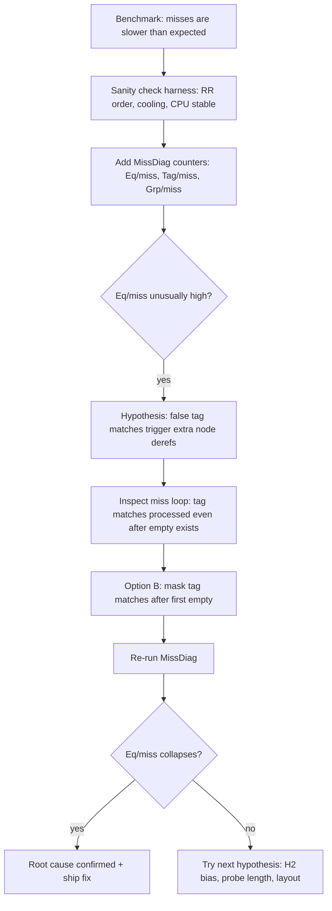
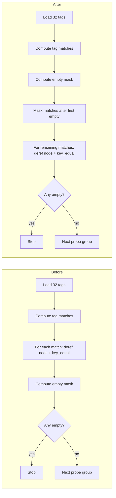

# Chasing Speed: The Case of the Slow Miss (Teaching Edition)

**Audience:** engineers and students.

This is a true-to-life performance debugging story:

- We built a reference-stable hash map (StableHashMap).
- It looked good on inserts and hits.
- But at large N, *misses* were mysteriously slow.
- A tiny, very “bit-level” change (Option B) fixed the root cause—and the benchmarks told us *why*.

If you’re learning performance work, this case is useful because it shows the full loop:
**symptom → hypothesis → instrumentation → confirmation → fix → regression protection**.

---

## 1. The moment the numbers stopped making sense

In the *Core Operations* benchmark, the miss path is supposed to be cheap:

- no iterator construction
- no user-visible result
- ideally: a couple SIMD compares + a quick “not found”

Yet at **N = 1,000,000**, StableHashMap’s miss numbers were behind competitors—even though it was already doing SIMD tag checks.

That’s the first lesson:

> A fast *inner loop* can still lose if it occasionally takes a slow path (e.g., a cache-miss node dereference).

---

## 2. The benchmark harness as a character in the story

Before we blame the hash map, we blame the experiment.

The suite you ran matters because it guards against common “fake speedups”:

- **Round-robin**: each run times each library once, in randomized order
- **Cooling delays**: reduce thermal drift
- **CPU stability gate**: only measure when frequency variance is small
- **Median as primary stat**: robust against outliers

This isn’t fluff—it prevents the worst debugging trap:

> “I changed code and the benchmark changed, therefore my change helped.”

(That statement is false *alarmingly often*.)

---

## 3. A miss is not just a miss

A high-performance hash table rarely does one “check.” It does a pipeline:

1. hash the key (h1 + h2)
2. locate a *probe window*
3. SIMD compare the 32 control bytes against `h2`
4. for each matching tag: load candidate and do `key_equal`
5. also SIMD check for **empty** slots to know when the search terminates

The key observation is step 4:

> On a miss, **every false-positive tag match is expensive** because it can trigger a node dereference.

At N=1,000,000, those node dereferences frequently miss cache.

---

## 4. The tool that cracked it: MissDiag

To debug misses, we can’t just time misses. We need to count what *happened* during misses.

So we introduced a diagnostic view that measures per-miss:

- **ns/miss**
- **Eq/miss**: how many `key_equal` calls
- **Tag/miss**: how many tag matches we processed
- (and related group/slot counters)

This is performance debugging gold:

> A latency number tells you *that* something is slow.
> Counters tell you *what work* you actually did.

---

## 5. The first clue: Eq/miss was too high

Before Option B, StableHashMap+SM64 at **N=1,000,000** showed (from your earlier run):

| Library | Median(ns) | Eq/miss | Tag/miss |
|---|---:|---:|---:|
| StableHashMap+SM64 (counted) | 10.54 | 0.12 | 0.12 |
| boost::unordered_node_map+SM64 (counted) | 4.91 | 0.03 | — |

Interpretation:

- `Eq/miss = 0.12` means **~1 key_equal every 8–9 misses**.
- At this N, that’s enough to dominate average miss latency if those compares chase pointers.

So the question became:

> Why are we even attempting these compares on a miss?

---

## 6. The hypothesis: “matches after the first empty”

StableHashMap scans a **32-slot SIMD group**.

The miss path did:

1. compute `match(h2)` → bits for tag matches
2. process *all* matches across the 32 lanes
3. compute `match_empty()`
4. if any empty exists, stop probing

But on a linear-probing style table, once your probe walk encounters an **empty** slot, the search is over.

That means:

- any occupied slots **after the first empty in probe order** cannot contain the key
- any tag matches **after that empty** are guaranteed false positives

So why process them at all?

---

## 7. Option B: stop processing tag matches after the first empty

The fix is conceptually simple:

- compute an `empty_mask`
- find the first empty bit
- mask out any tag matches that occur at or after that empty

### The bit trick

If `empty_mask` is a 32-bit mask where a 1-bit means “empty lane,” then:

- the **lowest set bit** corresponds to the first empty in probe order
- isolate it with: `first_empty_bit = empty_mask & -empty_mask`
- keep only lanes before it with: `tag_mask &= (first_empty_bit - 1)`

### Pseudocode

```cpp
uint32_t tag_mask   = match_h2(tag);
uint32_t empty_mask = match_empty();

if (empty_mask) {
  uint32_t first_empty_bit = empty_mask & (~empty_mask + 1); // == empty_mask & -empty_mask
  tag_mask &= (first_empty_bit - 1); // keep only matches before first empty
}

for (each bit in tag_mask) {
  // potential candidate: load node pointer + key_equal
  if (eq(candidate_key, needle)) return found;
}

if (empty_mask) return not_found; // termination guaranteed
probe_next_group();
```

### Why this is safe here

This optimization relies on a correctness invariant:

- the probe window covers lanes in **probe order** (lane 0 is checked before lane 1, etc.)
- encountering an “empty” lane means the key was never inserted further in this probe sequence

StableHashMap’s `ProbeSequence` and `Group` API are built around that linear probe order, so the “first empty bit” is meaningful.

---

## 8. The investigation as a flowchart



---

## 9. The results: Eq/miss collapsed, miss latency followed

After Option B (your later run), at **N=1,000,000**:

| Library | Median(ns) | Eq/miss | Tag/miss |
|---|---:|---:|---:|
| StableHashMap+SM64 (counted) | 3.33 | 0.01 | 0.01 |
| StableHashMap[Block]+SM64 (counted) | 3.11 | 0.01 | 0.01 |
| boost::unordered_node_map+SM64 (counted) | 4.76 | 0.03 | — |

The “teaching moment” is the causal chain:

- **Tag/miss ↓** → fewer candidate lanes
- **Eq/miss ↓** → fewer node dereferences
- fewer node dereferences at N=1,000,000 → fewer cache misses
- therefore **ns/miss ↓**

In other words:

> We didn’t primarily optimize SIMD.
> We optimized *avoiding unpredictable memory access.*

---

## 10. What to learn from this case

### 10.1 Miss performance is a memory story

For node-based or reference-stable designs, a “candidate check” often means:

- load pointer
- load key payload
- compare key

At scale, that’s a trip to memory.

### 10.2 Count the work, don’t guess

Timing alone can’t tell you which of these is true:

- you’re doing too many tag matches
- you’re doing too many key_equal calls
- your groups are too full so you probe too far
- your hash quality is poor so tags collide

MissDiag counters can.

### 10.3 Micro-optimizations can be macro wins

Masking off “impossible” candidates is a tiny bitwise operation.

But it prevented expensive pointer chasing *often enough* to dominate the median.

---

## 11. A visual mental model: miss path before vs after



---

## 12. Suggested student exercises

1. **Regression tripwire:** add a test that asserts `Eq/miss` stays under a threshold at high N for the random-miss set.
2. **Load-factor sweep:** plot miss ns and Eq/miss as reserve varies (1×, 2×, 4×) for N=1,000,000.
3. **SIMD width check:** repeat on SSE2 vs AVX2 builds and compare how group width changes the value of this optimization.
4. **Correctness audit:** explain why “first empty” is meaningful in this probe sequence (and why it wouldn’t be in some other table layouts).

---

## Appendix: the one-line bit identity

For any non-zero unsigned integer `x`, the lowest set bit can be isolated by:

- `x & -x`  (two’s complement)

In strictly unsigned C++ without relying on signed overflow, you can write:

- `x & (~x + 1)`

That’s what Option B used.
