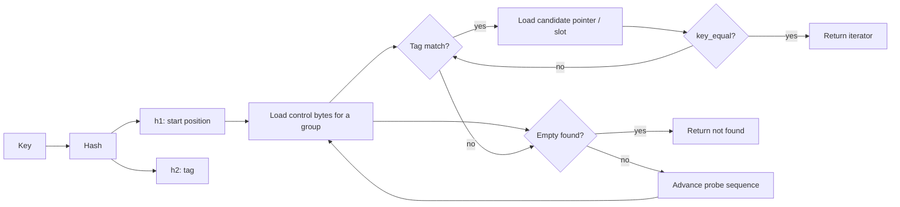
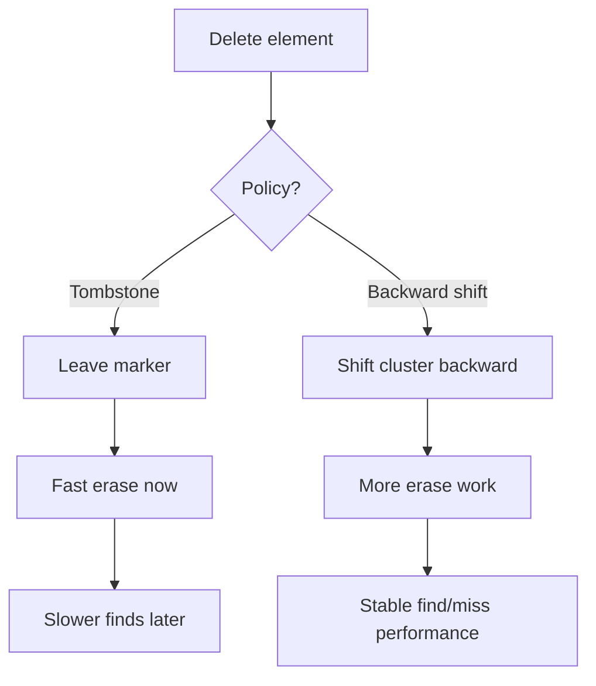

# FastHashMap & StableHashMap Design History (Teaching Edition)

**Audience:** engineers and students who want to see how a fast hash map is *designed*, *measured*, and *debugged*.

This document is a narrative + technical notebook. It’s meant to be read like a “build log”: each design choice is presented as a response to a constraint, with benchmarks as the referee.

---

## 0. The problem nobody notices—until it dominates

Hash maps are supposed to feel “O(1)”. In practice, they’re “O(1) times your constant factors”, and the constants are where the drama lives:

- **Cache misses** turn nanoseconds into tens of nanoseconds.
- **Branch mispredicts** and “just a few extra comparisons” show up at scale.
- **Deletion strategy** can make a map fast today and slow tomorrow.

FastHashMap and StableHashMap are two answers to two different “real-world O(1)” questions:

- **FastHashMap:** “How fast can we go if we optimize for throughput?”
- **StableHashMap:** “How fast can we go while keeping *references/pointers stable* across insert/reserve?”

That second question—reference stability—usually forces you into node-based structures that pay a performance tax. StableHashMap’s design is a deliberate attempt to reduce that tax.

---

## 1. Requirements: pick your non-negotiables

### FastHashMap non-negotiables

- High throughput for insert/find/erase.
- Flat table / dense memory layout.
- SIMD-friendly metadata for fast scanning.

### StableHashMap non-negotiables

- **Reference stability:** pointers to values remain valid across insert/reserve.
- Competitive find/miss performance (especially important in real workloads).
- Allocator strategy choices (new/delete vs block/pool).

This is the central tension:

> A flat map is fast because it’s compact.
> A stable map is safe because it doesn’t move objects.
> The entire project is about “how much compactness can we recover without moving objects?”

---

## 2. Architecture overview

At a high level, both maps share a familiar shape:

1. Hash the key → get a large hash value.
2. Split into:
   - **h1**: the starting bucket / group offset
   - **h2**: a small “tag” (fingerprint) stored per slot
3. Scan a group of tags using SIMD.
4. For tag matches, check candidate keys.
5. Stop on “empty” (meaning: the key was never inserted past that point).

Here’s a simplified view of the lookup path:

### Why tags exist at all

If you stored full hashes per slot, you’d burn memory bandwidth. If you stored nothing, you’d dereference too many candidates. A small tag (`h2`) is a sweet spot:

- It’s cheap to load in bulk (SIMD).
- It rejects most non-matching slots.
- The remaining candidate compares are the *real* cost you work to minimize.

---

## 3. Probe strategy: make misses cheap

A common misconception: “hits matter most.”

In many systems, misses dominate:

- caches and memoization layers
- symbol tables
- dedup / interning
- sparse graph queries

So a fast map must be designed so that:

- **miss** stops quickly (finds an empty sooner)
- **miss** avoids expensive candidate dereferences

StableHashMap uses a probe sequence that advances in **group-sized steps**. Conceptually, it looks like:

- start at `pos = h1`
- scan `Group::kWidth` slots
- if no match and no empty, jump forward by a growing stride (triangular numbers)

(You don’t need to memorize the exact pattern—what matters is that the search is deterministic, covers the table, and is vectorizable.)

---

## 4. Deletion: the fork in the road

Deletion is where many “fast hash maps” get into trouble.

### Tombstones

- Mark deleted slots as “special occupied”.
- Find must keep probing past tombstones.
- Over time, tombstones accumulate → probes get longer.

### Backward shift deletion

- When you delete, shift subsequent elements backward to fill the hole.
- Preserves the invariant that an **empty** terminates the probe.
- More work at erase time, but lookups stay healthy.

A mental model:

FastHashMap supports policies like **Tombstone (TS)** and **BackwardShift (BS)** because different workloads want different tradeoffs.

StableHashMap cares a lot about preserving “empty stops the search” semantics because it directly affects **miss latency** and **extra node dereferences**.

---

## 5. Reference stability: why StableHashMap exists

A flat map is fast because values sit inline in a contiguous array. But if you grow the table, you rehash and move elements—breaking references.

StableHashMap keeps pointers stable by storing **nodes** (allocated objects) and having the table hold **pointers/handles**.

That sounds like a guaranteed slowdown—unless you aggressively optimize everything around it:

- make the table metadata SIMD-friendly
- minimize pointer chasing on misses
- provide allocation strategies that improve locality

### Allocation strategies (performance tuning knob)

StableHashMap exposes different allocator strategies:

- **NewDeleteAllocator**: simple, often good for lookup-heavy workloads
- **BlockAllocator**: packs nodes into blocks → better locality under churn
- **PoolAllocator<N>**: fixed capacity, max speed, predictable

This is a classic engineering lesson:

> If you can’t change the asymptotic behavior (node deref exists), change the constants (locality + fewer derefs).

---

## 6. Benchmarking as a first-class design tool

These maps were developed with the benchmark harness treated like part of the product.

Key methodology ideas (the “round-robin” architecture):

- **One timed iteration per library per run**
- **Randomized library order per run** (reduces systematic bias)
- **Setup outside timed region** (reserve, key generation)
- **CPU stability gating** (wait for frequency to stabilize)
- **Median** as primary statistic

Why this matters: without it, you can “win” a benchmark by accident (thermal drift, background tasks, frequency scaling).

### The meta-lesson

Benchmarks aren’t just scoreboards.

They are *instruments*—and you should be willing to change the instrument (add diagnostics) when you’re chasing a root cause.

---

## 7. Epilogue: when a 0.12 becomes 7 nanoseconds

One of the most important episodes in this project was a miss-performance investigation.

StableHashMap had **higher Eq/miss** (extra candidate comparisons) than boost’s node map. That’s easy to ignore… until you remember:

- a single extra candidate compare can trigger a **cold pointer dereference**
- at large `N`, cold dereferences cost dozens of nanoseconds
- even “0.12 extra compares per miss” can dominate the median

This is the kind of bug/inefficiency that only shows up when:

- you measure at realistic sizes (e.g., `N = 1,000,000`)
- you instrument the miss path (Eq/miss, Tag/miss, group visits)

The fix was a bitmask rule:

> Don’t process tag matches *after* the first empty in the current probe window.

That single change collapsed Tag/miss and Eq/miss, and miss latency improved dramatically.

If you want the full detective story (with the mathematics and the MissDiag instrumentation), see **Chasing Speed: The Case of the Slow Miss (Teaching Edition)**.

---

## Suggested exercises (for students)

1. Change load factor (reserve more/less) and record how `Grp/miss` and `Eq/miss` change.
2. Compare Tombstone vs BackwardShift under sustained churn (“pathological erase”).
3. On a laptop, observe how frequency gating changes variance.
4. Add a regression check: if `Eq/miss` rises above a threshold, fail CI.

---

## Appendix: a simple cost model

A handy back-of-the-envelope model for miss time:

\[
T_{miss} \approx T_{hash} + T_{ctrl\_scan} + (\text{Tag/miss})\cdot T_{tag\_handling} + (\text{Eq/miss})\cdot T_{candidate\_deref}
\]

When `T_candidate_deref` is a cache miss, it dwarfs the rest.

That’s why shaving `Eq/miss` from 0.12 to ~0.01 matters more than it “looks” on paper.
