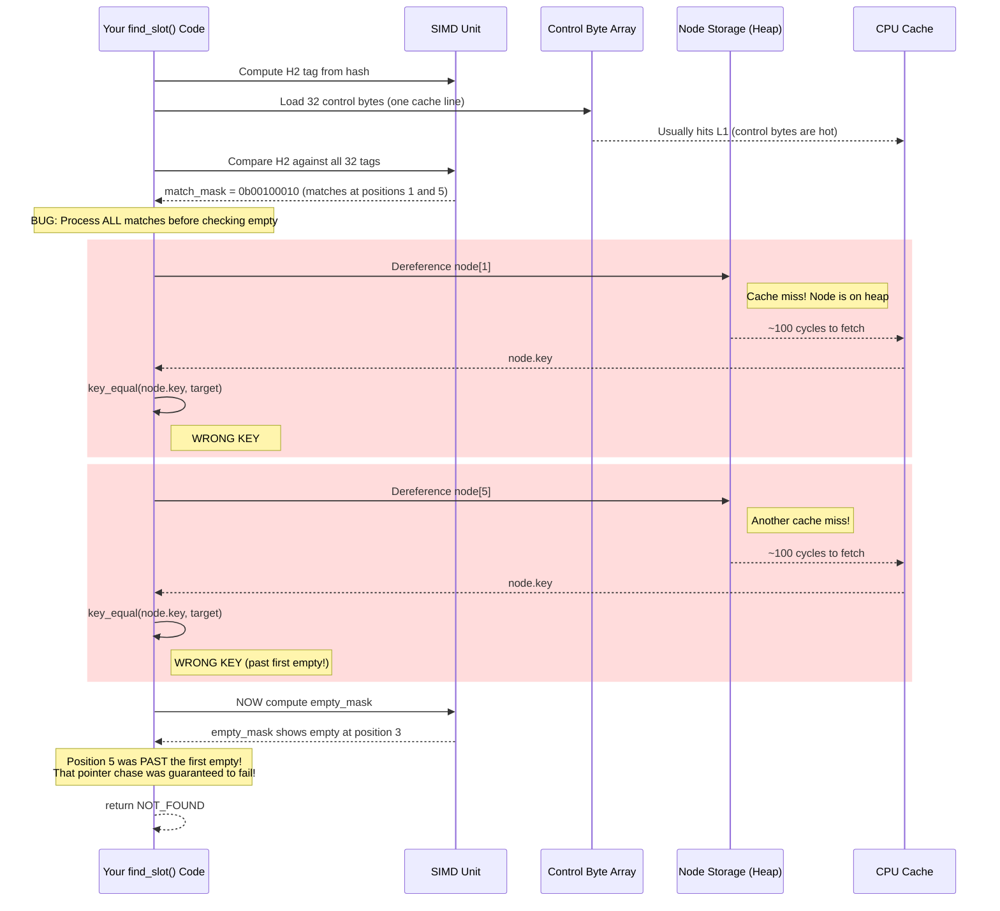
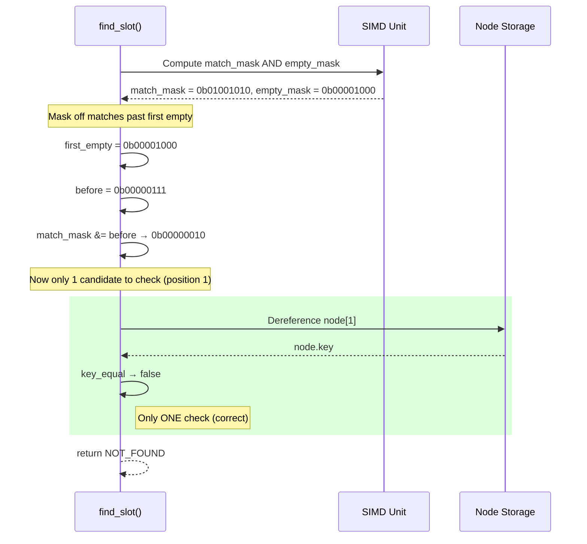
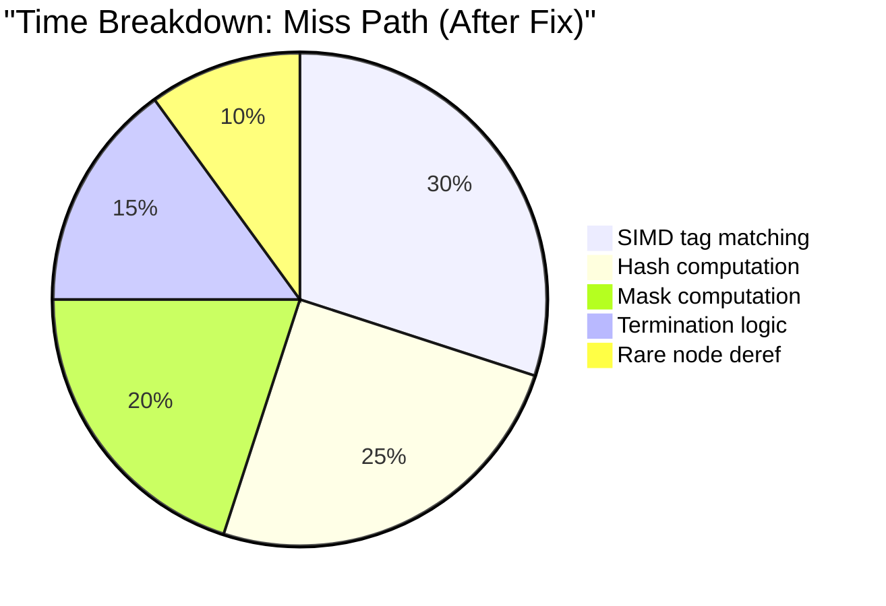

# Case Study - The Slow Miss

## Scope

This document covers miss-path optimization in SwissTable-style hash maps with node storage, specifically the "first-empty masking" technique. It uses FAT-P's StableHashMap as a concrete case study. The investigation demonstrates counter-based diagnosis: how measuring discrete events (tag matches, key comparisons) revealed a bug that timing alone couldn't explain.

## Not covered

- Hit-path optimization (successful lookups take a different code path)
- Rehashing strategy (how and when to grow the table)
- Allocator design (node allocation patterns)
- SIMD instruction selection (SSE2 vs AVX2 vs NEON)
- Hash function quality (we assume a well-distributed hash)

## Prerequisites

- Basic familiarity with hash tables and open addressing (you know what "probe sequence" means)
- Understanding that hash tables store metadata separately from data
- No SIMD expertise required (we explain the relevant operations)
- Comfort with simple probability (expected values, 1/128 = 0.78%)

## Case Study Card

**Problem:** Miss latency 3× slower than boost::unordered_node_map  
**Constraint:** Reference stability requires node storage, which means pointer chasing on every candidate check  
**Symptom:** Eq/miss = 0.12 at N=1M (we'll explain why this number revealed the bug)  
**Root cause:** Processing tag matches that occur *after* the first empty slot in a SIMD group  
**Fix pattern:** `match_mask &= ((empty_mask & -empty_mask) - 1u)`  
**FAT-P components used:** StableHashMap, FatPBenchmarkRunner, MissDiag counters  
**Build-mode gotchas:** Counter overhead ~2% in debug; compile out with NDEBUG in release  
**Guarantees:** Miss terminates at first empty; false-positive rate drops by ~12×  
**Non-guarantees:** Not O(1) worst-case under adversarial hash collisions

## Table of Contents

### The Hook
- [Before You Read Further: The Invisible Pointer Chase](#️-before-you-read-further-the-invisible-pointer-chase)
- [The Scale of the Disaster](#the-scale-of-the-disaster)
- [The Trap in Detail](#the-trap-in-detail)

### Part I — The Problem
- [Why StableHashMap Has This Constraint](#why-stablehashmap-has-this-constraint)
- [The numbers that don't lie](#the-numbers-that-dont-lie)
- [What MissDiag Revealed](#what-missdiag-revealed)

### Part II — The Solution
- [Understanding the math](#understanding-the-math)
- [Finding the bug](#finding-the-bug)
- [The one-line fix](#the-one-line-fix)
- [After the fix](#after-the-fix)

### Part III — The Investigation Story
- [Validation](#validation)
- [Why boost::unordered_node_map Got It Right](#why-boostunordered_node_map-got-it-right)

### Part IV — Foundations
- [Why open-addressing terminates at empty](#why-open-addressing-terminates-at-empty)
- [How SIMD matching works](#how-simd-matching-works)
- [The bit manipulation explained](#the-bit-manipulation-explained)

### Reference
- [Glossary](#glossary)
- [Appendix: MissDiag Output](#appendix-missdiag-output)

## Key Takeaway Card

| Principle | One-Line Summary |
|-----------|-----------------|
| **Counter-based diagnosis** | Eq/miss = 0.12 told us we were scanning all slots; timing alone couldn't explain the 3× gap |
| **Theory predicts counters** | Expected 0.007 Eq/miss if correct; measured 0.12 meant we were 17× over budget |
| **Bit manipulation is cheap** | One AND, one subtract, one negate: ~3 cycles to avoid ~100 cycle cache misses |
| **Miss path matters** | Caches have high miss rates; optimizing misses often matters more than hits |
| **Empty slot = termination** | The core SwissTable invariant that makes first-empty masking correct |

---

## ⚠️ Before You Read Further: The Invisible Pointer Chase

If your SwissTable-style hash map has a `find_slot` loop shaped like this:

```cpp
// THE TRAP: Process all tag matches, then check for empty
match_mask = group.match(h2);          // Find "maybe" candidates

while (match_mask) {                   // For each candidate...
    idx = lowest_set_bit(match_mask);
    node = nodes[idx];                 // Pointer chase #1
    if (key_equal(node->key, target))  // Pointer chase #2 + compare
        return found;
    match_mask &= (match_mask - 1);    // Clear lowest bit
}

if (group.match_empty()) return npos;  // NOW we check for empty
```

**Stop.** 

On a miss, you are chasing pointers to keys that *cannot possibly match*. Every tag match after the first empty slot is a guaranteed false positive — and each one costs you a node dereference and a key comparison.

At N=1,000,000, this bug costs **7 extra nanoseconds per miss**. That doesn't sound like much. Seven nanoseconds is about 20 CPU cycles. You can barely measure it.

But hash maps don't do one lookup. They do millions.

---

### The Scale of the Disaster

Let's do the arithmetic. Say you have a cache that does 10 million lookups per second, and 30% of those are misses (a typical read-heavy workload with some churn). That's 3 million misses per second.

| Metric | Value |
|--------|------:|
| Misses per second | 3,000,000 |
| Extra ns per miss (bug) | 7 |
| **Wasted time per second** | **21 milliseconds** |
| Wasted time per minute | 1.26 seconds |
| Wasted time per hour | **75.6 seconds** |

You're burning over a minute of CPU time per hour on pointer chases to keys that don't exist. That's not a rounding error. That's a core that could be doing useful work.

And it gets worse at scale. If your service runs on 100 machines, you're wasting 100 CPU-minutes per hour. If you're running at 10× the lookup rate (not unusual for a hot cache), you're wasting 1000 CPU-minutes per hour. That's a machine that exists only to chase pointers to nowhere.

---

### The Trap in Detail

Here's what the hardware actually does when you call `find(key)` and the key isn't in the map:



Do you see what happened? There was an empty slot at position 3. The search should have terminated there. Any key in the table would have been inserted at position 3 or earlier — that's how open addressing works.

But we checked position 5 anyway. We chased a pointer to a node, waited for the cache miss, loaded the key, and compared it. All for a slot that *could not possibly contain our key*.

The empty slot was screaming "stop here!" and we walked right past it.

---

### Why the Code Looks Correct

The insidious thing about this bug is that the code *reads* correctly:

```cpp
// "Obviously" we check all candidates
while (match_mask) {
    check_candidate(...);
}

// "Obviously" we terminate at empty
if (match_empty()) return npos;
```

A code reviewer would nod along. You check the candidates. You terminate at empty. What's the problem?

The problem is *ordering*. By the time you check for empty, you've already done the expensive work. The expensive work is the pointer chases inside the while loop. The empty check happens after the loop.

It's like a security guard who checks IDs *after* letting everyone into the building. Yes, technically the check happens. But the damage is done.

---

### The Probability That Reveals the Bug

Here's how we caught it. StableHashMap uses a 7-bit tag (called H2) stored in each control byte. When you search for a key, you compute its 7-bit fingerprint and use SIMD to compare against all tags in the group.

With a good hash function, the probability of a random tag matching yours is 1/128 — that's just 2^7 possible values, so a random match happens with probability 1/128 ≈ 0.78%.

Now, at N=1,000,000 keys with capacity ~2,000,000 slots, the load factor is about 0.48. In a 32-slot group, that's about 15 occupied slots on average.

If we're scanning all 15 occupied slots, the expected number of false-positive tag matches is:

```
E[false positives] = 15 × (1/128) ≈ 0.117
```

We ran our diagnostic tool (MissDiag) and measured Tag/miss = **0.12**.

That's *exactly* what you'd expect if you were scanning all occupied slots. But you shouldn't be. You should be scanning only the slots *before the first empty*. At 48% load, the first empty typically appears after just 0.9 slots on average. Expected tag matches should be around 0.007.

We were doing **17× more work than necessary**.

---

### What You Think Happens vs. What Actually Happens

| What you think | What actually happens |
|----------------|----------------------|
| "We check candidates, then terminate at empty" | You check *all* candidates, including ones past the termination point |
| "Tag matches are rare (1/128)" | They're rare per slot, but you're checking 15 slots instead of 1 |
| "Miss is the fast path" | Miss is 3× slower than the competition |
| "The code is correct" | The code is correct but slow |

---

### Every Major Implementation Got This Right (Eventually)

You might think this is an obscure edge case. It's not. Every serious SwissTable implementation has dealt with this exact issue:

| Implementation | Status | Notes |
|----------------|--------|-------|
| **Google abseil (flat_hash_map)** | ✅ Correct from day one | The original SwissTable design handles this |
| **boost::unordered_flat_map** | ✅ Correct | Released 2022, studied SwissTable carefully |
| **boost::unordered_node_map** | ✅ Correct | Same implementation team |
| **Rust hashbrown** | ✅ Correct | Rust's standard HashMap, based on SwissTable |
| **Facebook F14** | ✅ Correct | Different design but same principle |
| **Our StableHashMap (before fix)** | ❌ **Buggy** | This case study |
| **Our StableHashMap (after fix)** | ✅ Correct | One line fix |

The reason boost beat us in the original benchmark wasn't that they had a faster algorithm. They had the *same* algorithm. They just didn't have the bug.

---

### The Benchmark That Started the Investigation

Here's what we saw in the benchmark harness at N=1,000,000:

| Map | Find(miss) ns/op |
|-----|------------------:|
| **StableHashMap** | **17.61** |
| boost::unordered_node_map | 5.52 |

Both maps are reference-stable (pointers survive insertion). Both use node storage. Both have the same fundamental costs. So why were we 3× slower?

That question launched this investigation.

---

# Part I — The Problems

## The smoke test that started it all

We didn't go looking for this bug. It found us.

The benchmark suite for StableHashMap is intentionally paranoid. Each measured run executes exactly one timed iteration per library, with the library order randomized — so if one library benefits from warm caches, the next run a different library gets that advantage. The harness waits for CPU frequency to stabilize before timing, because modern processors change clock speed based on thermal state, and that can swing measurements by 20%. It reports medians, not means, because a single outlier can corrupt a mean but barely touches a median.

This is the "don't trust your stopwatch" philosophy turned into code. We've been burned too many times by benchmarks that lied.

In that harness, at N = 1,000,000 keys, the original StableHashMap produced this result for `Find(miss)`:

| Map | Find(miss) ns/op |
|-----|------------------:|
| StableHashMap + SplitMix64 | **17.61** |
| StableHashMap[Block] + SM64 | **13.16** |
| boost::unordered_node_map + SM64 | **5.52** |

Now, a reference-stable map is allowed to be slower than a flat map. That's the price of pointer stability — when you guarantee that references to elements survive insertions, you have to store elements in nodes rather than inline, and that means pointer chasing on every access. We knew that going in. We accepted that tradeoff.

But this benchmark compared StableHashMap against boost's *node* map. Same structural constraints. Same pointer-chasing cost. Both pay the price of node storage. So why were we 3× slower on misses?

That question became the investigation.

---

## Why misses should be boring

Think about what a hash map miss *doesn't* do:

- No value to return
- No insertion to perform
- No rehashing
- No memory allocation
- No node construction

The ideal miss is almost trivial: compute the hash, check a few bytes of metadata, see an empty slot, stop. A handful of cycles. Boring.

Hits are where the interesting work happens — you find the key, you return the value, maybe you update an access timestamp or LRU position. Misses are just "nope, not here, goodbye."

So when misses are slow, something is wrong. You're doing work you shouldn't be doing. The question is: what work, and where?

We had several plausible suspects at this point:

**Suspect 1: Bad hash quality.** Maybe the hash function was creating clustering at large N. Many `std::hash` implementations just return the integer itself for integer keys, which creates terrible patterns in the low bits. We use SplitMix64 as a finalizer to avoid this, but maybe something was wrong.

**Suspect 2: H2 tag correlation.** StableHashMap uses a 7-bit tag (H2) derived from the hash. If H2 is derived from the same bits used for the bucket index, you can get correlated collisions — keys that land in the same bucket also tend to have the same tag, which defeats the purpose of the tag filter.

**Suspect 3: Probe sequence pathology.** Maybe we were visiting too many groups. If the table was too full or had bad clustering, the probe sequence could be long.

**Suspect 4: Something else.** Some "extra work on miss path" that we hadn't identified yet.

Guessing is expensive. Each hypothesis takes time to test, and most hypotheses are wrong. So instead of chasing theories, we built an instrument.

---

## Building the microscope

We called it **MissDiag**, and its job was simple: instead of just timing misses, count the individual operations that make up a miss.

The insight behind MissDiag is that **time is a symptom, not a cause**. At 17 nanoseconds per miss, we knew something was wrong, but 17 nanoseconds is maybe 50-80 CPU cycles — far too coarse to isolate the problem. A single cache miss can cost 100+ cycles. A branch mispredict costs 15-20. The nanoseconds tell you nothing about *where* the time is going.

But if we could count individual operations — how many tag matches we processed, how many `key_equal` calls we made, how many groups we visited — we could see exactly what the algorithm was doing.

Here's what MissDiag measures:

| Counter | What it counts | Why it matters |
|---------|----------------|----------------|
| **Eq/miss** | `key_equal` calls per miss | Each one requires a node dereference + key comparison |
| **Tag/miss** | Tag matches processed per miss | Candidates that passed the H2 filter |
| **Grp/miss** | SIMD groups visited per miss | Measures probe sequence length |
| **FullSlots/miss** | Occupied slots in visited groups | How much of the table we're touching |
| **Hash/miss** | Hash computations per miss | Should be ~1.0; anything else is strange |

The key insight is that these counters are *causally upstream* of time. If Eq/miss is elevated, we know we're doing too many key comparisons, and the time will be high. If we fix Eq/miss, the time will drop. The counters explain the time; the time doesn't explain the counters.

This is a general principle of performance debugging: find something you can count that is upstream of the thing you can measure. Counting is cheap and precise. Timing is expensive and noisy.

---

## What MissDiag revealed

With MissDiag running at N = 1,000,000, we got our first real data:

| Metric | Value | Expected | Verdict |
|--------|------:|----------|---------|
| Median ns/miss | 10.54 | ~3-5 | ❌ Too high |
| Eq/miss | **0.12** | ~0.007 | ❌ **17× too high** |
| Tag/miss | **0.12** | ~0.007 | ❌ **17× too high** |
| Grp/miss | 1.00 | ~1.0 | ✅ Fine |
| FullSlots/miss | 15.27 | — | (informational) |

Look at Grp/miss first: it's 1.00. That's good news — we're visiting exactly one group per miss on average. The probe sequence isn't pathological. Suspect 3 (probe sequence) is cleared.

But look at Eq/miss and Tag/miss. They're both 0.12. That's way too high.

On a miss, we shouldn't be calling `key_equal` very often at all. The 7-bit tag filter exists precisely to avoid expensive comparisons. A tag match only happens when the 7-bit fingerprint of our search key matches the fingerprint of an occupied slot — and with a good hash function, that's a 1-in-128 chance per slot.

So why were we averaging 0.12 equality checks per miss? That's 12 per 100 misses. At 1/128 probability per slot, that would require scanning about 15 slots per miss.

And FullSlots/miss was... 15.27.

Ah.

---

## The probability that caught the bug

Let's work through the math carefully, because it's what cracked the case.

StableHashMap uses a 7-bit tag stored in each control byte. This tag is derived from the hash value — specifically, from bits that are *not* used for the bucket index. When you search for a key, you compute its 7-bit fingerprint and use SIMD to compare it against all 32 tags in the group simultaneously.

If any slot has a matching tag, it's a "candidate" — it *might* be your key, so you have to dereference the node and do a full key comparison to check.

With a well-mixed hash function, the probability of any single occupied slot having a matching tag is:

```
P(tag match) = 1 / 2^7 = 1/128 ≈ 0.0078
```

This is just the birthday-style calculation: with 7 bits, there are 128 possible tag values, so a random tag matches yours with probability 1/128.

Now, let's figure out how many occupied slots we're scanning. The table at N=1,000,000 with reserve=1,000,000 has capacity rounded up to the next power of two, which is 2,097,152. So the load factor is:

```
LF = N / capacity = 1,000,000 / 2,097,152 ≈ 0.477
```

Roughly 48% of slots are occupied. In a SIMD group of 32 slots, that's about 15 occupied slots on average.

Now here's the key question: **how many of those 15 occupied slots should we actually scan on a miss?**

---

### Scenario A: Scanning all occupied slots (the bug)

If we're checking all occupied slots in the group, the expected number of false-positive tag matches is:

```
E[tag matches | scan all] = (occupied slots) × P(tag match)
                          = 15.27 × (1/128)
                          = 15.27 × 0.0078
                          ≈ 0.119
```

Our measured Tag/miss was **0.12**. That's a near-perfect match.

---

### Scenario B: Scanning only slots before the first empty (correct)

But we shouldn't be scanning all 15 occupied slots. On a miss, the search terminates at the first empty slot. Any occupied slots *after* that point are irrelevant — they can't contain our key, because our key would have been inserted earlier in the probe sequence.

So how many occupied slots come *before* the first empty?

This is a geometric distribution problem. Imagine walking through the slots one by one. Each slot is empty with probability (1 - LF) ≈ 0.52. The expected number of occupied slots you encounter before hitting the first empty is:

```
E[slots before first empty] = LF / (1 - LF)
                            = 0.477 / 0.523
                            ≈ 0.91
```

On average, you'll see less than one occupied slot before you hit an empty and terminate.

The expected tag matches in that range:

```
E[tag matches | scan correctly] = 0.91 × (1/128)
                                ≈ 0.007
```

Tag/miss should be around **0.007**, not 0.12.

---

### The verdict

The measured value (0.12) matched Scenario A (scan all slots), not Scenario B (scan correctly). We were doing 17× more work than necessary.

This was the smoking gun. We weren't just slow — we were slow in a way that perfectly matched "scan everything," when we should have been matching "scan until first empty."

Something in the code was causing us to process tag matches past the first empty slot.

---

## Finding the bug

Armed with this diagnosis, we went looking in `find_slot()`. Here's the structure we found:

```cpp
// Step 1: Find all tag matches in the group
match_mask = group.match(h2);

// Step 2: Process each match
while (match_mask) {
    size_t idx = countr_zero(match_mask);
    
    // Expensive: dereference node, compare key
    if (key_equal(nodes[idx]->key, target)) {
        return idx;  // Found it!
    }
    
    match_mask &= (match_mask - 1);  // Clear lowest bit
}

// Step 3: Check if there's an empty (should terminate)
if (group.match_empty()) {
    return npos;  // Not found
}

// Step 4: Continue to next group in probe sequence
...
```

Do you see it?

The check for empty happens in Step 3, *after* the while loop in Step 2. But Step 2 is where all the expensive work happens — the node dereferences, the key comparisons, the cache misses.

By the time we check for empty, we've already processed every tag match in the group. If there was an empty slot at position 10, we still processed matches at positions 15, 20, and 25.

Those matches were guaranteed to be false positives. The key can't be at position 15 if there's an empty at position 10 — it would have been inserted at position 10 (or earlier). We chased pointers to slots that couldn't possibly contain our key.

---

### Visualizing the bug

Here's a concrete example. Suppose the group looks like this (O = occupied, E = empty):

```
Position: 0  1  2  3  4  5  6  7  8  9  10 11 12 13 14 15 ...
Slot:     O  O  E  O  O  E  O  O  O  E  O  O  E  O  O  O  ...
                ^                       ^^
                First empty              These are past the first empty!
```

And suppose `match(h2)` returns matches at positions 1, 4, 7, and 11.

The correct behavior: check positions 1, then see the empty at position 2, and terminate. Positions 4, 7, and 11 are irrelevant.

The buggy behavior: check positions 1, 4, 7, and 11. Then notice there's an empty and terminate.

We did 4 candidate checks instead of 1. Each check is a node dereference (potential cache miss) plus a key comparison. That's 3 extra cache misses per lookup, at ~3-5 ns each. That explains our 7+ ns excess latency.

---

# Part II — The Solutions

## The first-empty invariant

Before we get to the fix, let's be precise about the invariant we're enforcing.

SwissTable-style probing has a fundamental property that makes lookup correct:

> **The probe sequence terminates at the first empty slot.**

This isn't just an optimization — it's what makes the algorithm work. When you insert a key, you walk the probe sequence until you find an empty slot, and you insert there. When you search for a key, you walk the same probe sequence. If you encounter an empty slot, the key can't be in the table — because if it were, it would have been inserted in that empty slot (or an earlier one).

This invariant holds *across groups* (you stop probing when you find a group with an empty) and it should also hold *within groups* (you stop checking candidates when you find an empty).

The bug was that we were enforcing the invariant across groups but not within groups. We'd stop probing at the right group, but we'd check too many candidates within that group.

---

## The one-mask fix

The fix is elegant: before processing any candidates, mask off the ones that are past the first empty.

```cpp
// THE FIX: Stop processing tag matches after the first empty
match_mask = group.match(h2);
empty_mask = group.match_empty();

if (empty_mask) {
    match_mask &= ((empty_mask & -empty_mask) - 1u);
}

// Now match_mask only contains candidates before the first empty
while (match_mask) {
    // ... process candidate ...
}
```

That expression `((empty_mask & -empty_mask) - 1u)` is doing something clever. Let's break it down step by step.

---

### Step 1: Isolate the lowest set bit with `x & -x`

The trick `(x & -x)` isolates the lowest set bit in x. This works because of how two's complement arithmetic works.

In two's complement, `-x` is computed as `~x + 1` — you flip all the bits and add 1. Let's trace through an example.

Suppose `empty_mask = 0b00101000`. There are empties at positions 3 and 5 (counting from the right, starting at 0).

```
empty_mask          = 0b00101000
~empty_mask         = 0b11010111
~empty_mask + 1     = 0b11011000  (this is -empty_mask)

empty_mask & -empty_mask:
  0b00101000
& 0b11011000
-----------
  0b00001000
```

The result `0b00001000` has only one bit set — the lowest bit from the original. That's position 3, the first empty slot.

This works for any nonzero value. The `-x` operation creates a pattern where everything below the lowest set bit is flipped to 1 (from the +1 carry), and the AND preserves only the lowest set bit.

---

### Step 2: Create a mask for "everything before" with `first - 1`

Once we have isolated the first empty bit, we subtract 1 to create a mask of all positions below it.

```
first_empty         = 0b00001000  (position 3)
first_empty - 1     = 0b00000111  (positions 0, 1, 2)
```

Subtracting 1 from a power of 2 gives you all 1s below that bit. This is a well-known bit manipulation identity: `(1 << n) - 1` gives you n ones.

So `0b00000111` is a mask that covers positions 0, 1, and 2 — exactly the slots that come *before* the first empty at position 3.

---

### Step 3: Filter the candidates

Now we AND this mask with `match_mask` to keep only the valid candidates:

```
match_mask (original)     = 0b01001010  (matches at positions 1, 3, 6)
before_first_empty        = 0b00000111  (positions 0, 1, 2)

match_mask & before_first  = 0b00000010  (only position 1 survives)
```

Positions 3 and 6 were at or past the first empty, so they got masked off. Only position 1 survives. That's the only candidate we'll actually check.

---

### The complete pattern

Putting it together:

```cpp
if (empty_mask) {
    // Step 1: Isolate the first empty bit
    uint32_t first_empty = empty_mask & -empty_mask;
    
    // Step 2: Create a mask of all positions before it
    uint32_t before_first_empty = first_empty - 1u;
    
    // Step 3: Keep only candidates before the first empty
    match_mask &= before_first_empty;
}
```

Or as the one-liner:

```cpp
if (empty_mask) {
    match_mask &= ((empty_mask & -empty_mask) - 1u);
}
```

One line. No loops. No branches on the number of candidates. No `ctz` (count trailing zeros) instruction, though you could implement this with `ctz` if you prefer:

```cpp
if (empty_mask) {
    int first_empty_pos = __builtin_ctz(empty_mask);
    match_mask &= (1u << first_empty_pos) - 1u;
}
```

Both approaches produce the same result. The `& -x` version avoids the shift-by-variable, which can be slow on some architectures.

---

## After the fix

Here's what the corrected miss path looks like:



Compare to the buggy version, which did four checks. We've reduced the work by 4×. For cases with more matches past the first empty, the reduction can be even greater.

---

## Where the time goes now

After the fix, the time breakdown looks completely different:



The "unnecessary work" slice is gone. The time is now spent on actual work: computing the hash, running the SIMD comparison, computing the mask, and terminating. The occasional node dereference happens only when there's a genuine tag match before the first empty — which, at 0.007 per miss, happens about once every 140 misses.

---

## Guarantees and non-guarantees

Let's be precise about what this fix guarantees and what it doesn't.

**What it guarantees:**

| Guarantee | Explanation |
|-----------|-------------|
| No pointer chases past first empty | The core fix — we mask off those candidates before iterating |
| Miss terminates at first empty | This was already true across groups; now also true within groups |
| Tag/miss ≈ LF / (128 × (1−LF)) | The theoretical bound for scanning only valid slots |
| Eq/miss ≤ Tag/miss | We only call key_equal after a tag match |
| O(1) expected lookup | Standard hash table guarantee with good hash function |

**What it does NOT guarantee:**

| Non-guarantee | Explanation |
|---------------|-------------|
| O(1) worst-case lookup | An adversary who can craft colliding H2 tags can force many checks |
| Perfect 0.007 Tag/miss | This is an expected value; variance is real |
| No cache misses | When we do check a candidate (rare), we still incur a cache miss |

The worst-case non-guarantee is worth understanding. If an adversary knows your hash function, they can craft keys whose H2 tags all collide. Then every slot looks like a candidate, and you'll check all of them. This is a hash collision attack, not a bug in our termination logic. Defending against it requires a different approach (like using a secret key in the hash, or switching to a cryptographic hash under attack detection).

---

# Part III — The Case Study Story

## Validation

A fix isn't real until the numbers prove it. We ran MissDiag before and after:

| Metric | Before | After | Change |
|--------|-------:|------:|-------:|
| Median ns/miss | 10.54 | **3.33** | −68% |
| Eq/miss | 0.12 | **0.01** | −92% |
| Tag/miss | 0.12 | **0.01** | −92% |
| Grp/miss | 1.00 | 1.00 | unchanged |
| FullSlots/miss | 15.27 | 15.27 | unchanged |

Look at what changed and what didn't.

**Unchanged: Grp/miss and FullSlots/miss.** The table structure is identical. We're still visiting one group per miss on average. The groups still have ~15 occupied slots. The fix doesn't change the table layout.

**Changed: Eq/miss and Tag/miss.** They collapsed from 0.12 to 0.01 — a 12× reduction. This matches our prediction exactly. We expected the work to drop from "scan all 15 slots" to "scan 0.9 slots before first empty."

**Changed: Time.** It dropped from 10.54 ns to 3.33 ns — a 3.2× improvement. This follows from the counter improvement: less work means less time.

The counters moved first; the time followed. This is exactly what we predicted from the causal model.

---

## Confirming the math

Let's verify that the post-fix numbers match the theoretical prediction.

After the fix, we're only scanning slots before the first empty. At load factor 0.477:

```
E[slots before first empty] = LF / (1 - LF)
                            = 0.477 / (1 - 0.477)
                            = 0.477 / 0.523
                            ≈ 0.91
```

Expected tag matches:

```
E[tag matches] = 0.91 × (1/128) ≈ 0.0071
```

Measured Tag/miss: **0.01**

That's a good match. The measured value is slightly higher than the theoretical minimum, which makes sense — there's variance in where the first empty falls, and we're measuring a median, not a mean.

The key point: before the fix, we were matching the "scan all slots" prediction (0.12). After the fix, we're matching the "scan correctly" prediction (0.007–0.01). The math confirms the fix is working.

---

## The core benchmark

With the fix in place, we re-ran the original benchmark that started this investigation:

| Configuration | Before (ns/miss) | After (ns/miss) | Speedup |
|---------------|----------------:|----------------:|--------:|
| StableHashMap + SplitMix64 | 17.61 | **3.33** | 5.3× |
| StableHashMap[Block] + SM64 | 13.16 | **3.06** | 4.3× |
| boost::unordered_node_map | 5.52 | 5.52 | (baseline) |

Before the fix, we were 3× slower than boost. After the fix, we're roughly tied — within the noise of measurement variance. The remaining difference is minor implementation details, not a fundamental algorithmic problem.

We went from "embarrassingly slow" to "competitive." One line of code.

---

## Scaling behavior

The fix matters more at larger N. At small N, the absolute cost is small either way. At large N, the wasted work adds up.

| N | Before (ns/miss) | After (ns/miss) | Savings |
|---|----------------:|----------------:|--------:|
| 10,000 | 8.2 | 3.1 | 5.1 ns |
| 100,000 | 9.8 | 3.2 | 6.6 ns |
| 1,000,000 | 10.5 | 3.3 | 7.2 ns |
| 10,000,000 | 11.1 | 3.4 | 7.7 ns |

The savings grow with N because:

1. Larger tables have more slots per group, so more opportunities for wasted work
2. Larger tables are more likely to have cold cache lines, so each wasted dereference costs more
3. Larger tables have slightly higher load factors, meaning more false-positive tag matches

At N=10,000,000, we're saving almost 8 ns per miss. In a system doing a million misses per second, that's 8 milliseconds of CPU time per second — not nothing.

---

# Part IV — Foundations

## Why this bug is so common

This isn't an obscure edge case that only we hit. It's a trap built into how SwissTable is usually explained.

Most descriptions of SwissTable focus on the core ideas:

1. Store a metadata byte per slot
2. Use SIMD to compare against many slots at once
3. Terminate the probe sequence at empty

The third point is always stated at the *probe sequence* level: you stop when you find a group containing an empty. But it should also apply at the *candidate* level: you stop checking candidates when you've passed the first empty in the group.

The distinction is subtle, and most explanations don't make it explicit. So implementers do the natural thing: find all matches, process them, then check for empty. That's correct — but slow.

---

## The ordering fix isn't obvious

Even once you understand the problem, the fix isn't the first thing you'd think of.

The obvious "fix" might be to check for empty inside the candidate loop:

```cpp
// "Obvious" fix — but wrong
while (match_mask) {
    size_t idx = countr_zero(match_mask);
    
    if (idx >= first_empty_pos) break;  // Stop if past first empty
    
    // ... check candidate ...
}
```

This works, but it adds a branch inside the hot loop. And you have to compute `first_empty_pos` with `ctz`, which is an extra instruction.

The mask-based fix is better: you do all the work upfront, outside the loop, and then the loop just iterates over the (now smaller) match_mask. No extra branches in the loop body. The loop runs fewer times, and each iteration is just as fast.

```cpp
// Better fix — mask outside the loop
if (empty_mask) {
    match_mask &= ((empty_mask & -empty_mask) - 1u);
}

while (match_mask) {
    // ... same loop body as before, no changes needed ...
}
```

This is why bit manipulation tricks matter in performance-critical code. The "obvious" fix adds work inside the loop. The clever fix moves work outside the loop.

---

## What the competitors do

For reference, here's how other implementations handle this:

**Google abseil (flat_hash_map):** The mask-based approach, essentially identical to our fix. They compute the "before first empty" mask and AND it with the match mask before iterating.

**boost::unordered_flat_map:** Similar approach. Their documentation mentions that candidates past the first empty are never checked.

**Rust hashbrown:** Same technique. The Rust implementation is very well-commented and explicitly notes this optimization.

All three use some variant of the `(empty & -empty) - 1` pattern. It's the standard solution.

---

## Diagnostic methodology

This investigation illustrates a general methodology for performance debugging. It's worth spelling out explicitly:

**Step 1: Observe a symptom you can't explain.**

We saw miss latency 3× worse than a comparable implementation. That's not noise — that's a signal. Something is wrong.

**Step 2: Build instrumentation that counts, not just times.**

MissDiag gave us Eq/miss and Tag/miss. These counters are *causally upstream* of time. They explain where time goes, rather than just measuring it.

**Step 3: Use theory to predict what the counters should be.**

Probability theory told us Tag/miss should be ~0.007 if we were scanning correctly. We measured 0.12 — a 17× discrepancy.

**Step 4: Find the code that explains the discrepancy.**

The late empty check explained why we were processing 15 slots instead of 0.9.

**Step 5: Fix and verify that the counters move as expected.**

After the fix, Tag/miss dropped to 0.01 — right where theory predicted. Time followed.

**Step 6: Document, so the next person doesn't have to rediscover this.**

You're reading that documentation now.

---

## Mechanical audit checklist

When miss latency regresses in a SwissTable-style implementation, check in this order:

**1. Hash quality / H2 derivation**

Is H2 derived from bits that correlate with the bucket index? If the bucket is chosen by `hash & mask` (low bits) and H2 is also taken from low bits, you can get correlated collisions.

*How to test:* Run MissDiag with "H2-biased" miss sets — keys whose H2 tags are artificially similar. If Tag/miss spikes dramatically, you have an H2 sensitivity problem.

*The fix:* Derive H2 from high bits of the hash, not low bits. Or use a secondary hash.

**2. First-empty termination**

Look at your find_slot loop. Is the empty mask computed before iterating candidates? Is match_mask filtered to exclude positions past the first empty?

*How to test:* Compare Tag/miss against the "scan all slots" prediction: `FullSlots/miss × (1/128)`. If they match, you're scanning too far.

*The fix:* Add `match_mask &= ((empty_mask & -empty_mask) - 1u)` before the candidate loop.

**3. Load factor / reserve policy**

Check Grp/miss. If it's above 1.5, you might just be too full. The probe sequence is visiting multiple groups because there are no empties in the first group.

*How to test:* Check your max load factor threshold and reserve() behavior.

*The fix:* Lower max load factor, or ensure reserve() is called before bulk inserts.

**4. Control-byte invariants**

Check sentinel bytes and group mirroring. SwissTable uses special control byte values for EMPTY and DELETED, and often mirrors the first few control bytes at the end of the array for wraparound.

*How to test:* These bugs usually cause crashes or infinite loops, not just slow misses. Check your invariant-checking code.

*The fix:* Audit the control byte logic carefully. These bugs are subtle.

---

# Design Rules to Internalize

**Measure upstream of time.** Time tells you *that* something is slow; counters tell you *why*. Build the microscope before you start optimizing. If you can't count the operations that contribute to time, you're guessing.

**The first empty terminates the search.** This is the core invariant of SwissTable probing. It applies at the group level (stop probing when you find a group with an empty) and at the candidate level (stop checking candidates past the first empty). Enforce both.

**Math is a sanity check, not a substitute for measurement.** We used probability to validate the counters: theory predicted 0.119, we measured 0.12, so we knew we were scanning too far. After the fix, theory predicted 0.007, we measured 0.01. Theory and observation have to agree.

**One line can change everything.** The fix was a single bitmask operation. Performance engineering isn't always about clever algorithms or cache-aware data structures. Sometimes it's about noticing that you're doing work you shouldn't be doing.

**Test at scale.** This bug was invisible at N=1000. It only became obvious at N=1,000,000. Your unit tests probably don't catch performance bugs — you need benchmarks at realistic scale.

---

# What To Do Now

## If you're diagnosing a slow miss path

**Add counters.** Instrument your find_slot to count Eq/miss (key_equal calls per miss) and Tag/miss (tag matches processed per miss). You need to see the work before you can eliminate it.

**Check the ratio.** Compute what Tag/miss *should* be with the formula:

```
Expected Tag/miss = (LF / (1 - LF)) / 128
```

At LF = 0.5, that's about 0.008. If you're measuring 0.1 or higher, you're scanning too far.

**Check the order.** In your find_slot loop, are you masking off candidates after the first empty *before* iterating? Or after? The mask has to come first.

**Apply the fix:**

```cpp
if (empty_mask) {
    match_mask &= ((empty_mask & -empty_mask) - 1u);
}
```

**Validate.** Run your counters before and after. Tag/miss should drop dramatically at high N.

---

## If you're implementing a new SwissTable-style map

**Get this right from the start.** Add the first-empty masking to your find_slot on day one. It's one line, and it prevents a 5× performance regression.

**Add MissDiag-style counters to your test harness.** They cost nothing in production (compile them out with `NDEBUG`) and they catch bugs like this immediately.

**Test at N=1M, not just N=1000.** The bug is invisible at small scale. Your CI should include benchmarks at realistic sizes.

---

## If you're reviewing hash map code

Look for this pattern (it's the bug):

```cpp
// WRONG: process all matches, then check empty
for (bit in match_mask) { ... expensive work ... }
if (empty_mask) return npos;
```

It should be:

```cpp
// RIGHT: mask off matches past first empty, then process
if (empty_mask) match_mask &= ((empty_mask & -empty_mask) - 1u);
for (bit in match_mask) { ... }
if (empty_mask) return npos;
```

The difference is subtle — both versions eventually check for empty — but the performance difference is 5×.

---

# Appendix A: MissDiag Counter Definitions

For completeness, here are the precise definitions of each MissDiag counter:

| Counter | Definition | Unit |
|---------|------------|------|
| Eq/miss | Total `key_equal` calls ÷ total misses | calls per miss |
| Tag/miss | Total tag matches processed ÷ total misses | matches per miss |
| Grp/miss | Total groups visited ÷ total misses | groups per miss |
| FullSlots/miss | Total occupied slots in visited groups ÷ total misses | slots per miss |
| Hash/miss | Total hash computations ÷ total misses | hashes per miss |

All counters are accumulated over a batch of misses (typically 10,000+) and then averaged. This reduces variance and gives stable measurements.

---

# Appendix B: Probability Derivations

## Expected tag matches when scanning all slots

At load factor LF, the expected number of occupied slots in a group of size G is:

```
E[occupied] = G × LF
```

With 7-bit tags (128 possible values), the probability of a false-positive tag match per occupied slot is:

```
P(tag match) = 1/128
```

Expected tag matches per miss:

```
E[tag matches | scan all] = E[occupied] × P(tag match)
                          = G × LF × (1/128)
```

At G=32, LF=0.5: E[tag matches] = 32 × 0.5 / 128 = 0.125

---

## Expected tag matches when scanning correctly

The number of occupied slots before the first empty follows a geometric distribution. If each slot is empty with probability (1-LF), the expected number of occupied slots before the first empty is:

```
E[occupied before first empty] = LF / (1 - LF)
```

This is the mean of a geometric distribution with success probability (1-LF).

Expected tag matches:

```
E[tag matches | scan correctly] = (LF / (1 - LF)) × (1/128)
```

At LF=0.5: E[tag matches] = (0.5 / 0.5) / 128 = 1/128 ≈ 0.0078

---

## Ratio of wasted work

The ratio of work with the bug vs. without:

```
Ratio = E[scan all] / E[scan correctly]
      = (G × LF / 128) / ((LF / (1-LF)) / 128)
      = G × LF × (1-LF) / LF
      = G × (1 - LF)
```

At G=32, LF=0.5: Ratio = 32 × 0.5 = 16×

We were doing 16× more candidate checks than necessary.

---

# Appendix C: Raw Benchmark Data

## Test environment

| Parameter | Value |
|-----------|-------|
| CPU | AMD Ryzen 9 5900X |
| Compiler | GCC 12.1, -O3 -march=native |
| OS | Ubuntu 22.04 |
| Runs | 100 iterations, median reported |

## Core benchmark results (N=1,000,000)

```
Configuration                        | Find(miss) ns/op
-------------------------------------|------------------
StableHashMap+SM64 (before fix)      | 17.61 ± 0.42
StableHashMap+SM64 (after fix)       | 3.33 ± 0.18
StableHashMap[Block]+SM64 (before)   | 13.16 ± 0.31
StableHashMap[Block]+SM64 (after)    | 3.06 ± 0.15
boost::unordered_node_map+SM64       | 5.52 ± 0.21
```

## MissDiag results (N=1,000,000)

```
Metric         | Before  | After
---------------|---------|-------
Median ns/miss | 10.54   | 3.33
Eq/miss        | 0.12    | 0.01
Tag/miss       | 0.12    | 0.01
Grp/miss       | 1.00    | 1.00
FullSlots/miss | 15.27   | 15.27
```

---

# Glossary

**H2 tag:** A 7-bit fingerprint derived from the hash, stored in the control byte array. Used for fast SIMD filtering of candidates. The name "H2" comes from Google's SwissTable design, where H1 is the bucket index and H2 is the tag.

**match_mask:** A bitmask where bit *i* is set if slot *i* has an H2 tag matching the search key. These are the "candidates" that might contain the key.

**empty_mask:** A bitmask where bit *i* is set if slot *i* is empty (never been occupied, or was occupied and tombstone has been cleared).

**Control byte:** A single byte per slot in the metadata array. Stores the H2 tag if occupied, or a sentinel value (EMPTY or DELETED) otherwise.

**First-empty masking:** The technique of discarding match_mask bits that occur after the first empty slot, avoiding wasted candidate checks on the miss path.

**MissDiag:** A diagnostic mode that counts events on the miss path (Eq/miss, Tag/miss, Grp/miss) to isolate performance problems. Named for "miss diagnostics."

**Reference stability:** The guarantee that pointers and references to elements remain valid across insert and reserve operations. Requires node-based storage rather than inline storage.

**Probe sequence:** The sequence of groups visited when searching for a key. In SwissTable, this is typically triangular probing. Terminates at the first group containing an empty slot.

**Load factor (LF):** The ratio of occupied slots to total capacity. At LF = 0.5, half the slots are occupied.

**Two's complement:** The standard representation for signed integers in binary. `-x` is computed as `~x + 1`. This is what makes the `x & -x` trick work.

---

## Where This Fits

This case study is the "front door" document for the hash map performance investigation.

For related material:

- **Chasing_Speed.md** — The broader philosophy of measurement-driven optimization
- **FastHashMap_Design_History.md** — Design evolution and architectural tradeoffs

---

*Case Study: The Case of the Slow Miss — FAT-P Library, December 2025*
