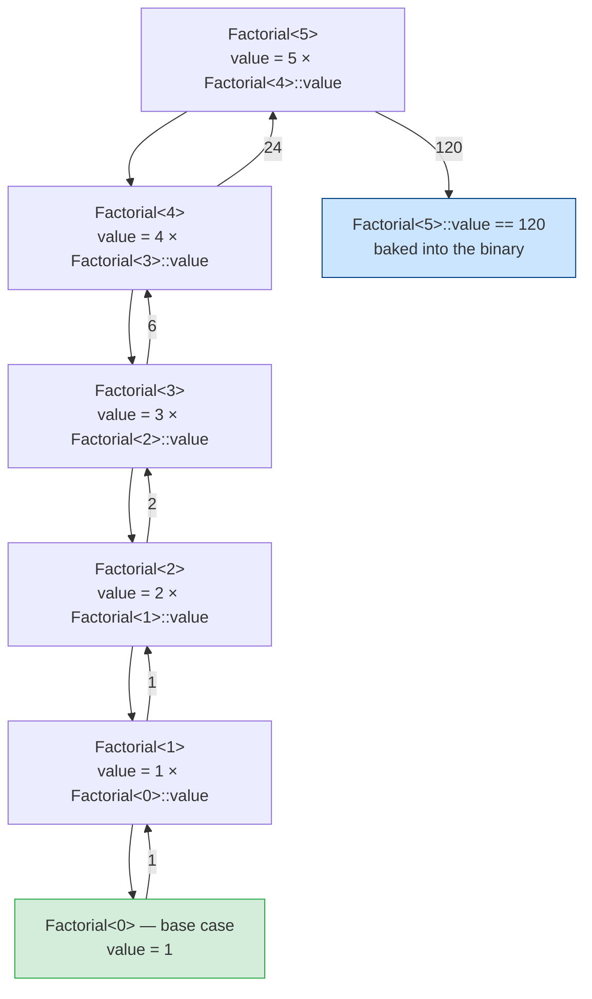
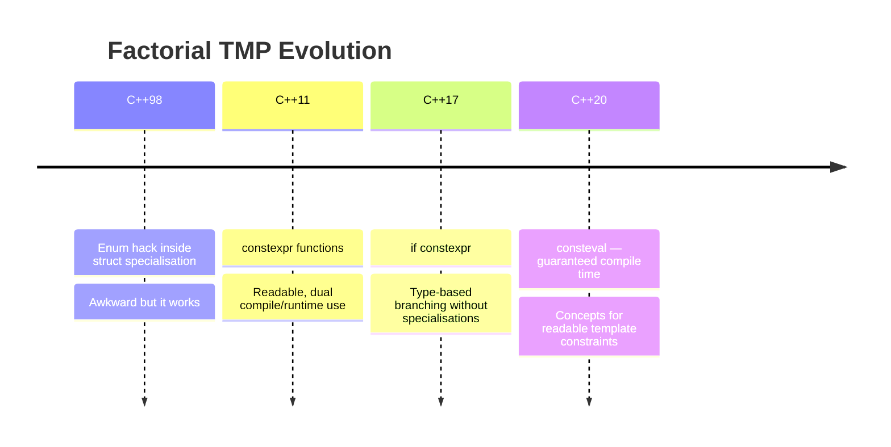
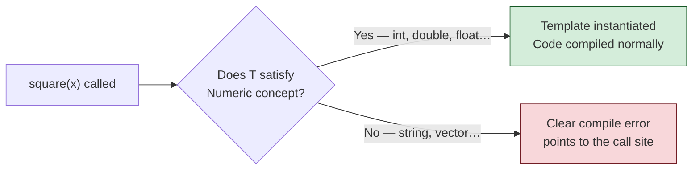
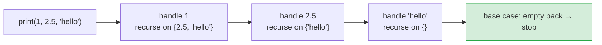
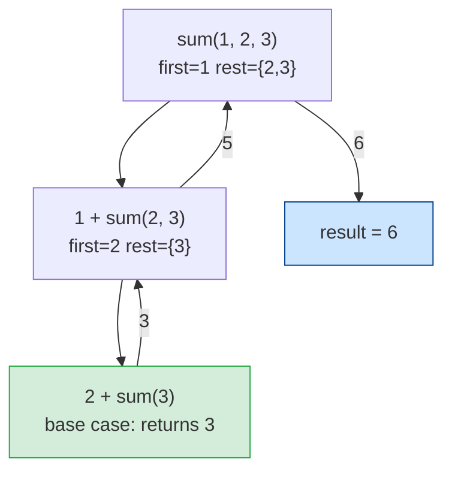
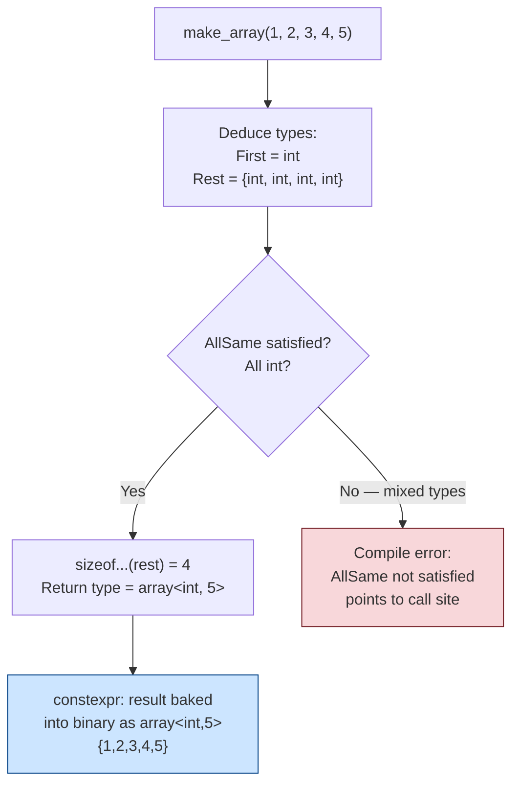
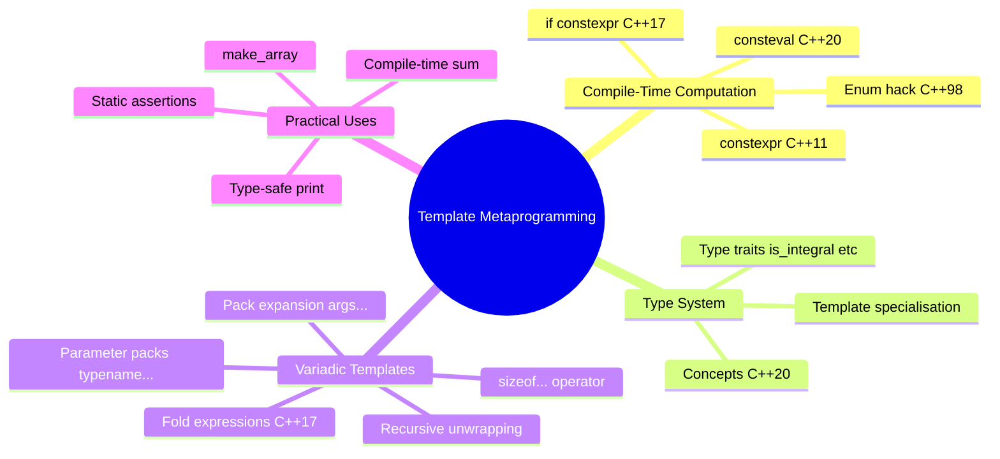

# C++ Template Metaprogramming: From Enum Hacks to C++20

> A guided tour — from computing a factorial at compile time to powerful
> variadic template tricks in modern C++. Advanced sections are clearly marked;
> newcomers can read straight through and skip ahead when they are ready.

---

## What Is Template Metaprogramming?

Normally, programs compute things **at runtime** — when the user runs the executable.
**Template Metaprogramming (TMP)** is a technique where the **compiler** does the
computation **at compile time**, producing a plain constant or type by the time the binary
is built. When the program runs, the answer is already there — no work needed.

```
Normal code:   source → [compiler] → binary → [CPU computes at runtime] → result
TMP:           source → [compiler computes result] → binary with result baked in → runs
```

### What is a template instantiation?

This term appears throughout the document, so it is worth pinning down now.

A **template** is a blueprint — a struct or function written with a placeholder type or
value. A **template instantiation** is what happens when the compiler fills in that
placeholder with a concrete type or value and generates actual code from the blueprint.

```cpp
template <int N>      // blueprint: N is a placeholder
struct Foo {
    int value = N * 2;
};

Foo<5> f;   // instantiation: compiler generates a concrete struct with value = 10
Foo<7> g;   // another instantiation: compiler generates a separate struct with value = 14
```

Each different value of `N` produces a **separate, distinct type** from the compiler's
point of view. This is the mechanism TMP is built on: instead of writing a loop that runs
at runtime, we write a template that the compiler instantiates recursively, computing the
result as it goes.

---

## Part 1 — Factorial: The "Hello World" of TMP

Factorial is the classic first example because its recursive mathematical definition maps
directly onto recursive template instantiation — the same shape of thinking, just executed
by the compiler instead of the CPU.

```
5! = 5 × 4 × 3 × 2 × 1 = 120
```

---

### 1.1 The Old Way — The Enum Hack (Pre-C++11)

Before `constexpr` existed, embedding a computed integer constant inside a template
required a workaround. The trick that the C++ community converged on was to store the
result in an `enum`. Enum values are **integral constants** — the compiler knows their
value at compile time and can use them anywhere a compile-time constant is needed (array
sizes, template arguments, etc.).

```cpp
// ── Enum Hack Factorial ──────────────────────────────────────────────────────
// C++98 / C++03

template <int N>
struct Factorial {
    // Recursive case: N! = N × (N-1)!
    // The enum stores the result as a compile-time constant.
    enum { value = N * Factorial<N - 1>::value };
};

// Base case: 0! = 1
// Template specialisation — a completely separate definition for N = 0.
// Without this, the recursion would never stop.
template <>
struct Factorial<0> {
    enum { value = 1 };
};

// Usage
int main() {
    int x          = Factorial<5>::value;    // x = 120
    int arr[Factorial<5>::value];            // array of 120 ints — size known at compile time
    return 0;
}
```

**Why an `enum` and not a plain `int`?**  
A `static const int` member inside a template *should* work, but older C++98 compilers
required a separate out-of-class definition for it — a tedious extra step. An
`enum { value = ... }` is always a self-contained, inline compile-time constant. It was a
workaround for a compiler limitation, not a deliberate design choice. Modern C++ has
`constexpr` which makes all of this unnecessary, but understanding the enum hack helps
you read older codebases and appreciate why `constexpr` was such a relief.

#### How the compiler "runs" it

The diagram below shows what the compiler instantiates when it sees `Factorial<5>::value`.
Each box is a new struct the compiler generates. The recursion terminates at the
`Factorial<0>` specialisation, which hard-codes `value = 1`. The computed values then
bubble back up, exactly like a recursive function returning through its call stack —
except this entire process happens inside the compiler, before the program ever runs.



> **📝 Section summary — what we just learned:**  
> TMP works by exploiting the compiler's template instantiation mechanism as a compute
> engine. We write a recursive template with a base-case specialisation to stop the
> recursion. The compiler generates all the intermediate structs and resolves the final
> value before the program ever runs. The enum hack was the only way to do this in C++98.

---

### 1.2 The Modern Way — `constexpr` Function (C++11+)

The enum hack works but it looks nothing like normal code. C++11 introduced `constexpr`,
which tells the compiler: *"evaluate this function at compile time if the arguments are
known at compile time."* The result is far more readable, and the same function works
at runtime too — no templates needed at all.

```cpp
// ── constexpr Factorial ──────────────────────────────────────────────────────
// C++11 and later

constexpr long long factorial(int n) {
    return (n <= 1) ? 1 : n * factorial(n - 1);
}

int main() {
    constexpr long long result = factorial(5);   // computed at compile time → 120
    int arr[factorial(5)];                        // array size known at compile time

    int runtime_n = 5;
    long long r   = factorial(runtime_n);         // also works at runtime → 120
}
```

**The key advantage** is that this is just a normal-looking recursive function. If the
argument is a compile-time constant, the compiler evaluates it at compile time. If the
argument is only known at runtime, it compiles to normal machine code. One function,
both worlds.

---

### 1.3 The C++17 Way — `if constexpr`

`if constexpr` is less about factorial specifically and more about a broader pattern:
choosing different code paths based on **type information** at compile time. The branch
that is *not taken* is completely discarded — it does not even need to be valid code for
the given type. This eliminates the need for a separate specialisation in many cases.

```cpp
// ── if constexpr — type-based dispatch ───────────────────────────────────────
// C++17

#include <type_traits>
#include <string>

template <typename T>
std::string describe(T val) {
    if constexpr (std::is_integral_v<T>)
        return "integer: " + std::to_string(val);
    else if constexpr (std::is_floating_point_v<T>)
        return "float: " + std::to_string(val);
    else
        return "something else";
}

int main() {
    describe(42);      // "integer: 42"
    describe(3.14);    // "float: 3.140000"
    describe("hi");    // "something else"
}
```

Before `if constexpr`, you had to write separate template specialisations for each case —
verbose and easy to get wrong. Now it reads like an ordinary `if` statement.

---

### 1.4 The C++20 Way — `consteval`

`consteval` is a stronger version of `constexpr`. It **guarantees** compile-time
evaluation and produces a **compile error** if the value cannot be computed at compile
time. Use it when a function *only ever makes sense* at compile time — lookup table
generators, compile-time string hashes, and similar tools.

```cpp
// ── consteval Factorial ──────────────────────────────────────────────────────
// C++20

consteval long long factorial(int n) {
    return (n <= 1) ? 1 : n * factorial(n - 1);
}

int main() {
    constexpr auto x = factorial(6);    // fine — 720, computed at compile time

    int runtime_n = 5;
    // auto y = factorial(runtime_n);   // COMPILE ERROR — consteval requires
                                        // a compile-time argument
}
```

#### The evolution at a glance



> **📝 Section summary — what we just learned:**  
> Modern C++ replaces the enum hack with `constexpr` (compute at compile or runtime),
> `if constexpr` (branch on type at compile time), and `consteval` (force compile-time
> only). Each step makes the code more readable and the compiler error messages more
> useful. The underlying mechanism — the compiler evaluating things before the program
> runs — is the same throughout.

---

## Part 2 — Concepts: Taming the Template Error Message

### The problem concepts solve

Before diving into the code, here is the problem they fix.

Imagine you write a `square` function as a template and accidentally call it with a
`std::string`. Without concepts, the compiler tries to instantiate the template, fails
deep inside the multiplication operator, and prints something like:

```
error: no match for 'operator*' (operand types are 'std::string' and 'std::string')
  note: in instantiation of function template specialisation 'square<std::string>'
  note: in instantiation of ...
  ... (20 more lines pointing inside template machinery you did not write)
```

The error points to the *internals* of the template, not to *your* call site. For a
beginner this is impenetrable. For a complex library template it can be genuinely
difficult even for experts.

**Concepts** let you state requirements on template parameters up front. The compiler
checks the requirement *before* attempting instantiation, and the error points directly
at the call site with a clear human-readable message. Concepts also serve as
documentation — a reader can immediately see what a template expects.

---

### 2.1 Defining and Using a Concept

```cpp
#include <concepts>
#include <type_traits>

// ── Define a concept ─────────────────────────────────────────────────────────
// "Numeric" means: T must be an integer type or a floating-point type.
template <typename T>
concept Numeric = std::is_integral_v<T> || std::is_floating_point_v<T>;

// ── Use the concept as a constraint ──────────────────────────────────────────
template <Numeric T>          // "T must satisfy Numeric"
T square(T x) {
    return x * x;
}

// Equivalent alternative — a requires clause reads more like a sentence:
template <typename T>
    requires Numeric<T>
T cube(T x) {
    return x * x * x;
}

int main() {
    auto a = square(4);       // int satisfies Numeric   → 16
    auto b = square(3.14);    // double satisfies Numeric → 9.8596
    // square("hi");           // COMPILE ERROR — clear message:
                               // "constraints not satisfied: 'Numeric'"
                               // points right here, not inside the template
}
```

#### How concepts gate template instantiation



> **📝 Section summary — what we just learned:**  
> Concepts are named requirements that you attach to a template parameter. The compiler
> checks them *before* instantiating the template. This turns impenetrable multi-line
> error messages into a single clear diagnostic pointing at the exact line that is wrong.
> As a bonus, concepts make templates self-documenting.

---

## Part 3 — Variadic Templates: Any Number of Arguments

### The problem variadic templates solve

Suppose you want to write a `print` function that accepts any number of arguments of any
types. Before variadic templates (C++11), you had two bad options:

1. Write overloads for every possible number of arguments — `print(a)`, `print(a, b)`,
   `print(a, b, c)` — and give up at some maximum.
2. Use C-style `va_args`, which is not type-safe and cannot work with non-trivial types.

**Variadic templates** solve this cleanly. You write one template that accepts *any number*
of arguments of *any types*, and the compiler generates the specialised code for each
particular combination you actually use — all type-safe, all at compile time.

The standard technique for processing them is **recursive unwrapping**: peel off the first
argument, do something with it, then recurse on the rest. The recursion terminates at a
base case that handles zero (or one) remaining argument. It is exactly the same pattern
as processing a linked list, except the "list" lives entirely inside the type system and
the compiler does all the work.



---

### 3.1 The New Syntax — Parameter Packs

Three pieces of new syntax appear in every variadic template. Here they are explained in
isolation before combining them:

| Syntax | Where it appears | Meaning |
|--------|-----------------|---------|
| `typename... Tail` | Template parameter list | Declare a **type parameter pack** — zero or more types |
| `Tail... rest` | Function parameter list | Declare a **value parameter pack** — one value per type in `Tail` |
| `rest...` | Inside the function body | **Pack expansion** — unpack `rest` into a comma-separated list |

The `...` always means "and all the rest of them". Reading `rest...` aloud as
*"rest, expanded"* helps.

---

### 3.2 `print` — Print Any Number of Values of Any Types

```cpp
#include <iostream>

// ── Base case: called when the parameter pack is empty ────────────────────────
// This stops the recursion. Without it, the compiler would never stop.
void print() {
    std::cout << "\n";
}

// ── Recursive case ─────────────────────────────────────────────────────────────
// Head    = the type of the first argument
// ...Tail = zero or more remaining types (a parameter pack)
template <typename Head, typename... Tail>
void print(Head first, Tail... rest) {
    std::cout << first << " ";   // process the first argument
    print(rest...);              // recurse: pass the remaining arguments
    //    ^^^
    //    Pack expansion: "rest..." unpacks to  rest_0, rest_1, rest_2 ...
}

int main() {
    print(1, 2.5, "hello", 'A');
    // Output: 1 2.5 hello A
    //
    // Compiler instantiates, in order:
    //   print<int, double, const char*, char>  → handles 1
    //   print<double, const char*, char>        → handles 2.5
    //   print<const char*, char>               → handles "hello"
    //   print<char>                            → handles 'A'
    //   print()                                → base case, prints newline
}
```

Notice there is **no runtime loop** here. The compiler generates five separate functions
and chains their calls. At runtime the CPU just executes a straight sequence — no
branching, no overhead.

#### Expansion trace for `print(1, 2.5, "hello")`

```mermaid
sequenceDiagram
    participant C as Compiler
    participant R as Runtime

    Note over C: Sees print(1, 2.5, "hello")
    C->>C: Instantiate print&lt;int, double, const char*&gt;
    Note over C: Head=int, Tail={double, const char*}
    C->>C: Instantiate print&lt;double, const char*&gt;
    Note over C: Head=double, Tail={const char*}
    C->>C: Instantiate print&lt;const char*&gt;
    Note over C: Head=const char*, Tail={} → calls base case
    C->>C: Base case print() already exists — done
    Note over C: All instantiations complete — emit machine code
    R->>R: print int → print double → print string → newline
```

---

### 3.3 `sum` — Adding Any Number of Values

The same peel-and-recurse pattern, this time returning a value:

```cpp
// ── Base case: one argument left — just return it ─────────────────────────────
template <typename T>
constexpr T sum(T only) {
    return only;
}

// ── Recursive case ────────────────────────────────────────────────────────────
template <typename T, typename... Rest>
constexpr T sum(T first, Rest... rest) {
    return first + sum(rest...);
}

int main() {
    constexpr auto total = sum(1, 2, 3, 4, 5);   // 15, computed at compile time
    constexpr auto mix   = sum(1.0, 2.5, 3.5);   // 7.0
}
```

#### Expansion trace for `sum(1, 2, 3)`



> **📝 Section summary — what we just learned:**  
> Variadic templates accept any number of arguments using `typename... Pack`. Processing
> them uses the **peel-one-off** pattern: handle the first argument (`Head`), recurse on
> the rest (`Tail...`), stop at a base case when the pack is empty. The compiler generates
> all the specialised code; the runtime just executes a chain of calls. This pattern
> appears everywhere in modern C++ libraries.

---

## Part 4 — C++17 Fold Expressions: A Shortcut for the Common Case

### The bridge from recursion to folds

The recursive approach in Part 3 is general and powerful, but it requires writing two
things every time: a base case and a recursive case. For the specific common task of
*reducing* a pack to a single value (sum all, multiply all, are all true, is any true),
C++17 provides a shorthand that collapses both into one expression. Think of it as the
compiler automatically writing the recursive boilerplate for you.

```cpp
// ── Fold expression sum ───────────────────────────────────────────────────────
// C++17

template <typename... Args>
constexpr auto sum_fold(Args... args) {
    return (args + ...);   // right-fold over +
    //      ^^^^^^^^^^
    //      Expands to: args_0 + (args_1 + (args_2 + ...))
}

// ── Practical folds ───────────────────────────────────────────────────────────
template <typename... Args>
constexpr bool all_positive(Args... args) {
    return ((args > 0) && ...);   // true only if EVERY argument is > 0
}

template <typename... Args>
constexpr bool any_positive(Args... args) {
    return ((args > 0) || ...);   // true if AT LEAST ONE argument is > 0
}

int main() {
    constexpr auto s = sum_fold(1, 2, 3, 4, 5);   // 15
    constexpr bool b = all_positive(1, 2, 3);       // true
    constexpr bool c = all_positive(1, -1, 3);      // false
    constexpr bool d = any_positive(-1, -2, 3);     // true
}
```

The `sizeof...` operator lets you ask the compiler how many items are in a pack:

```cpp
template <typename... Args>
void show_count(Args... args) {
    std::cout << "You passed " << sizeof...(Args) << " arguments\n";
}

show_count(1, 2.0, "three", 'f');   // Output: You passed 4 arguments
```

---

## Part 5 — Advanced: Putting It All Together

> **⚠️ Advanced section.** This combines variadic templates, `constexpr`, and C++20
> concepts into one cohesive example. Read Parts 1–4 first. If it feels like too much at
> once, the summary tables at the end are still useful — come back here when ready.

### The bridge into the advanced example

We have now seen three separate tools:
- **Concepts** — constrain what types are allowed in a template
- **Variadic templates** — accept any number of arguments
- **`constexpr`/`consteval`** — force compile-time evaluation

Real-world C++20 code uses all three together. The example below builds a type-safe
`make_array` function — one that creates a `std::array` with the correct type and size
deduced automatically, with no magic numbers required, and a clear error if you mix types.
This is exactly the style used inside the C++ Standard Library itself.

```cpp
#include <array>
#include <concepts>
#include <type_traits>

// ── Step 1: define a concept that requires all types to be identical ───────────
// The fold expression "(std::is_same_v<First, Rest> && ...)" checks every type
// in Rest against First. If any differ, the concept is not satisfied.
template <typename First, typename... Rest>
concept AllSame = (std::is_same_v<First, Rest> && ...);

// ── Step 2: write the function using all three tools ──────────────────────────
//  - AllSame concept constrains the types (clear error if mixed)
//  - sizeof...(rest) counts the pack at compile time (no magic number)
//  - constexpr ensures the array can live entirely at compile time
//  - The trailing return type spells out the exact array type produced
template <typename First, typename... Rest>
    requires AllSame<First, Rest...>
constexpr auto make_array(First first, Rest... rest)
    -> std::array<First, 1 + sizeof...(rest)>
{
    return { first, rest... };
}

int main() {
    constexpr auto arr = make_array(1, 2, 3, 4, 5);
    // arr is std::array<int, 5> — type and size deduced, no magic numbers

    // make_array(1, 2.0, 3);
    // COMPILE ERROR: 2.0 is double, rest are int — AllSame not satisfied
    // Error points here, not inside the template
}
```

#### What the compiler figures out, step by step



> **📝 Section summary — what we just learned:**  
> Combining concepts, variadic templates, and `constexpr` produces self-documenting,
> type-safe compile-time utilities. The caller writes natural code, gets a clear error if
> types mismatch, and pays zero runtime cost. `std::make_tuple`, `std::make_pair`, and
> many other standard library functions follow exactly this pattern.

---

## Complete Reference Summary

### The full recursion unwrap — mechanical view

```mermaid
sequenceDiagram
    participant User as Your Code
    participant Compiler as Compiler (template engine)
    participant Binary as Final Binary

    User->>Compiler: print(1, 2.5, "hi")
    Note over Compiler: Instantiate print&lt;int, double, const char*&gt;
    Compiler->>Compiler: Head=int  Tail={double, const char*}
    Note over Compiler: Instantiate print&lt;double, const char*&gt;
    Compiler->>Compiler: Head=double  Tail={const char*}
    Note over Compiler: Instantiate print&lt;const char*&gt;
    Compiler->>Compiler: Head=const char*  Tail={} → calls base case
    Compiler->>Binary: Emit concrete machine code for each specialisation
    Binary->>User: Runs: "1 2.5 hi\n"
```

No runtime loop. No dynamic dispatch. The compiler unrolls the entire pack into a chain
of concrete function calls. The CPU just runs them in sequence.

---

### The learning landscape



---

### Feature quick-reference

| Feature | Standard | What it does |
|---------|----------|-------------|
| `enum { value = ... }` | C++98 | Embed a computed integer as a compile-time constant |
| `constexpr` function | C++11 | Evaluate at compile time *or* runtime — your choice |
| `typename... Pack` | C++11 | Accept any number of type arguments |
| `args...` expansion | C++11 | Unpack a parameter pack into a comma-separated list |
| `sizeof...(Pack)` | C++11 | Count pack elements at compile time |
| `if constexpr` | C++17 | Branch on a type condition; discard the unused branch entirely |
| Fold `(x op ...)` | C++17 | Collapse a pack into a single expression without writing recursion |
| `concept` / `requires` | C++20 | Constrain templates with clear, readable error messages |
| `consteval` | C++20 | Force compile-time-only evaluation; error if used at runtime |

---

### The three patterns to memorise

**Pattern 1 — Recursive struct (classic TMP)**
```cpp
template <int N> struct F { enum { value = N * F<N-1>::value }; };
template <>      struct F<0> { enum { value = 1 }; };
```

**Pattern 2 — Variadic peel-and-recurse**
```cpp
void fn() { /* base case */ }

template <typename H, typename... T>
void fn(H head, T... tail) {
    /* use head */
    fn(tail...);   // recurse on the rest
}
```

**Pattern 3 — Fold expression (C++17 shorthand)**
```cpp
template <typename... Args>
auto reduce(Args... args) {
    return (args + ...);   // no base case or recursion needed
}
```

---

> **The golden rule of TMP:** if the compiler can figure it out, make it do so.
> Errors caught at compile time cost nothing at runtime, and the optimiser can make
> better decisions when values are constants. Modern C++ has made this more readable
> at every step — start with `constexpr`, reach for variadic templates when you need
> flexibility, and use concepts to keep error messages human-readable.
