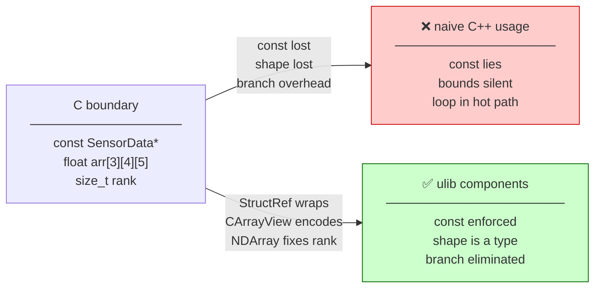
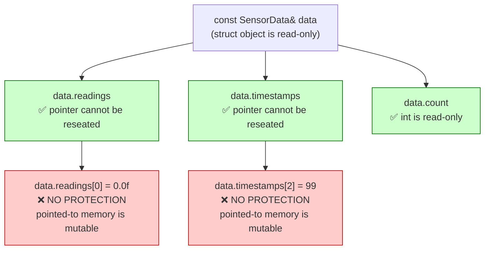
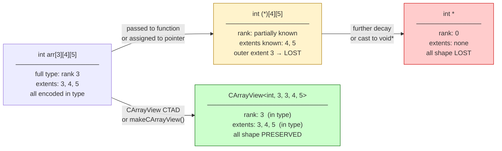
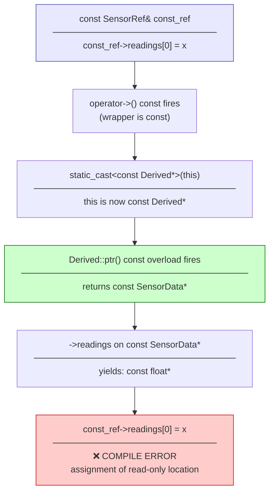
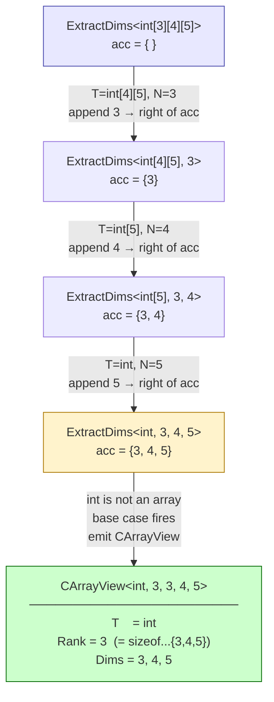
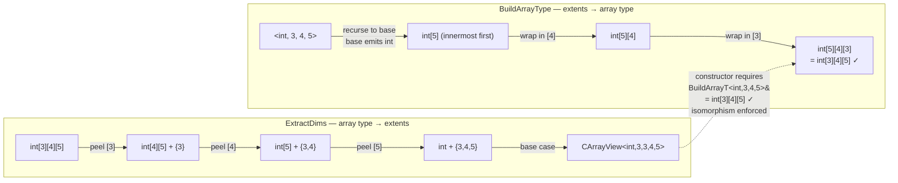
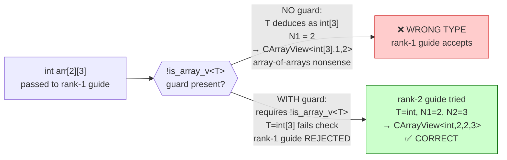
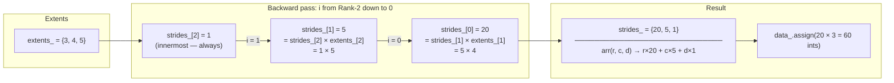
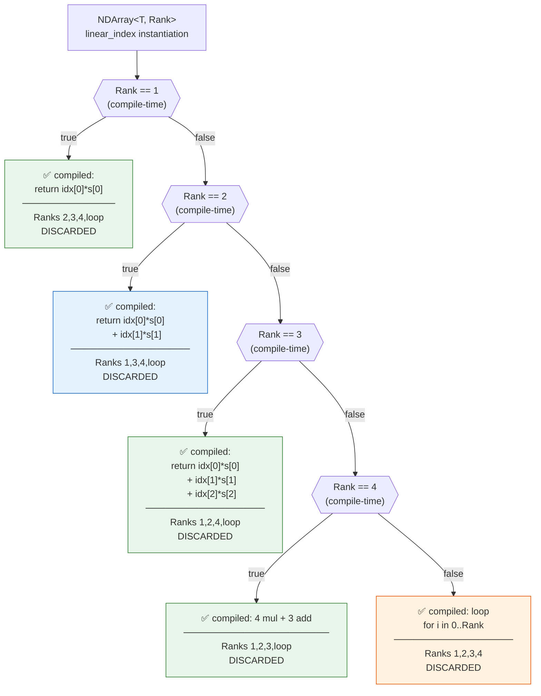

# Companion Guide - The Shape of Data: StructRef, CArrayView, and NDArray

**Scope:** This guide covers the design rationale, template mechanics, and tradeoffs of
three ulib components: `StructRef` (const-propagating C struct reference wrapper),
`CArrayView` (non-owning view over a C multidimensional array with compile-time shape),
and `NDArray` (owning rank-templated N-dimensional array with runtime extents). All three
solve problems that arise at the boundary between C data layouts and C++20 type systems.

**Not covered:** Allocator customization, SIMD access patterns over array data, serialization
of array contents, thread-safety of concurrent array access, or integration with
`std::mdspan`. The `flatPtr` UB analysis for `CArrayView` is discussed at the mechanism
level; full `[expr.add]` formal treatment belongs in a dedicated Foundations document.

**Prerequisites:**
- Working knowledge of C++ templates: partial specialization, non-type template parameters,
  parameter packs
- Familiarity with CRTP (Curiously Recurring Template Pattern) at the usage level
- Understanding of C array decay: `T[N]` decays to `T*` in most expression contexts
- Awareness that `if constexpr` exists and eliminates dead branches at compile time

---

## Table of Contents

1. [The problem we are solving](#the-problem-we-are-solving)
2. [Part I — The Problems](#part-i--the-problems)
   - [Chapter 1: The Const Lie](#chapter-1-the-const-lie)
   - [Chapter 2: The Shape Loss Problem](#chapter-2-the-shape-loss-problem)
   - [Chapter 3: The Branch Tax](#chapter-3-the-branch-tax)
3. [Part II — The Solutions](#part-ii--the-solutions)
   - [Chapter 4: StructRef — Enforcing Const Through Pointer Members](#chapter-4-structref--enforcing-const-through-pointer-members)
   - [Chapter 5: CArrayView — Encoding Shape in the Type](#chapter-5-carrayview--encoding-shape-in-the-type)
   - [Chapter 6: NDArray — Owning Storage with Compile-Time Rank](#chapter-6-ndarray--owning-storage-with-compile-time-rank)
4. [Part III — Case Studies](#part-iii--case-studies)
   - [Case Study A: Silent Mutation Through a Const Reference](#case-study-a-silent-mutation-through-a-const-reference)
   - [Case Study B: Wrong-Shape Array Passed to a Function](#case-study-b-wrong-shape-array-passed-to-a-function)
   - [Case Study C: The Stride Bug That Waited for a Layout Change](#case-study-c-the-stride-bug-that-waited-for-a-layout-change)
5. [Part IV — Foundations](#part-iv--foundations)
   - [Design Rationale: StructRef](#design-rationale-structref)
   - [Design Rationale: CArrayView — The TMP Isomorphism](#design-rationale-carrayview--the-tmp-isomorphism)
   - [Design Rationale: NDArray — The Five-Branch if constexpr](#design-rationale-ndarray--the-five-branch-if-constexpr)
   - [Rejected Alternatives](#rejected-alternatives)
   - [When to Look Elsewhere](#when-to-look-elsewhere)
6. [Glossary](#glossary)

---

## Companion Guide Card

**Components:** `StructRef`, `CArrayView`, `NDArray`
**Design question:** Why do these three components exist when C++ already has `const` and
pointers can carry dimension information manually?
**Key tradeoff:** Compile-time guarantee strength versus API surface complexity. Every
guarantee encoded in the type system eliminates a runtime check — but also requires the
caller to supply more type information at the call site.
**Decision made:** Encode as much shape and ownership information as the type system can
carry without requiring the caller to perform manual bookkeeping.
**Rejected alternatives:** `std::span` (loses rank and const-propagation), `std::mdspan`
(C++23, not available at C++20 baseline, and does not address StructRef's const-propagation
problem), raw pointer + extent arguments (loses type-level enforcement entirely).
**Historical context:** All three components sit at the C/C++ boundary. Legacy codebases
pass raw structs by pointer and raw arrays by pointer-plus-integer, discarding the type
information that C++ needs to enforce correctness. These components recover that information
without requiring the legacy data to change.

---

## The problem we are solving

C++ gives programmers a powerful type system. It can track ownership (`unique_ptr`), lifetime
(`reference_wrapper`), and dimension (`std::array`). But large codebases that interoperate
with C — servo-hydraulic controllers, scientific instruments, data acquisition systems —
store their data in C structs with pointer members and in raw multidimensional arrays. When
that data crosses into C++, critical information falls off.

Two pieces of information are especially prone to falling off. The first is `const`-ness.
A `const` C struct passed by pointer loses its `const` guarantee the moment you follow any
of its pointer members — the members point at mutable data, and `const` on the struct itself
says nothing about the data those pointers reach. The second is shape. A three-dimensional
array `int arr[3][4][5]` passed to a function decays into an `int*` or at best `int(*)[4][5]`,
carrying only a fragment of its dimensionality in the type and none of its outer extent in
a checkable form.

The three components in this guide each recover one piece of that falling information and
encode it back into the C++ type system. `StructRef` recovers `const`-propagation through
pointer members. `CArrayView` recovers the full shape of a C multidimensional array.
`NDArray` recovers the rank of a dynamically-sized array and encodes its indexing structure
so the compiler can eliminate every runtime branch from the hot path.



---

## Part I — The Problems

### Chapter 1: The Const Lie

#### The Obvious Approach

The obvious way to pass a read-only C struct to a C++ function is to pass it as
`const MyStruct&` or `const MyStruct*`. This looks correct and compiles without warnings.

```cpp
// THE TRAP: const on a struct with pointer members
struct SensorData {
    float* readings;     // pointer to raw float array
    int*   timestamps;   // pointer to raw int array
    int    count;
};

void process(const SensorData& data) {
    data.readings[0] = 0.0f;  // Compiles. No warning. Modifies the data.
}
```

#### The Hidden Constraint

The C++ type system applies `const` to the *struct* object, not to the *data the struct's
pointers point to*. `const SensorData&` means the `readings` pointer itself cannot be
reseated — you cannot make `data.readings` point to a different array. But nothing prevents
you from writing through the pointer to the memory it already points to. The `const` is
shallow; the data it ostensibly protects is one pointer dereference away, unprotected.

This is not a C++ oversight. It is a fundamental property of how pointer semantics compose
with `const`. A pointer is a value; `const` on that value means the pointer cannot change.
It says nothing about the thing pointed to. Making the pointed-to data `const` requires
changing the pointer's type to `const float*` — but in a legacy C struct, the members are
declared as `float*`, owned by a C library you cannot touch.

The diagram below shows exactly where `const` stops protecting:



#### The Symptoms

The symptom is silent mutation. A function marked as taking a `const` reference modifies
its input through a pointer member. No diagnostic fires. The caller sees data change that
the function signature promised not to change. Bugs appear downstream, attributed to the
wrong component, because the signature was trusted.

In safety-critical systems — data acquisition, test-and-measurement, vehicle durability
testing — this is not a theoretical risk. Functions that read sensor data must not corrupt
it. Marking them `const` is the intended mechanism for that guarantee, and shallow `const`
defeats it silently.

#### The Cost

**Fact:** In a system where multiple processing stages share a `const SensorData&` to a
common buffer, any stage that inadvertently writes through a pointer member corrupts the
data for all subsequent stages. The error appears downstream, not at the write site. The
call graph must be audited manually to find it.

**What ulib provides:** `StructRef<SensorData>` wraps the struct reference and overloads
`operator->` to return a `const`-qualified accessor when the `StructRef` is itself `const`.
This propagates `const` transitively through all pointer members. Part IV explains the CRTP
mechanism that makes this work without modifying `SensorData`.

---

### Chapter 2: The Shape Loss Problem

#### The Obvious Approach

C multidimensional arrays are passed to functions as pointers. The outer dimension decays
away because arrays decay to pointers to their first element. Most codebases compensate by
passing the extents as separate integer arguments.

```cpp
// THE TRAP: Shape lives outside the type
void apply_filter(float* data, int rows, int cols, int depth) {
    // caller must supply rows, cols, depth in the correct order
    // wrong order: compiles identically, runs, produces garbage silently
    for (int r = 0; r < rows; ++r)
        for (int c = 0; c < cols; ++c)
            for (int d = 0; d < depth; ++d)
                data[r * cols * depth + c * depth + d] *= 2.0f;
}

float volume[4][8][16];
apply_filter(volume, 4, 8,  16);  // correct
apply_filter(volume, 4, 16,  8);  // wrong order — compiles identically, produces garbage
```

#### The Hidden Constraint

Array decay is irreversible once it happens. The diagram below shows exactly how much shape
survives each conversion step as an array moves from its declaration site toward a function
call:



Even `float(*)[4][5]` only encodes two of the three dimensions. There is no standard C++
type that encodes "this pointer is the start of a 3×4×5 float array in row-major order"
without a user-defined wrapper.

#### The Symptoms

Wrong-shape bugs manifest as out-of-bounds access (caught by sanitizers), incorrect
numerical results (not caught by sanitizers), or crashes. Because the wrong-order call
compiles and links identically to the correct call, code review and static analysis cannot
catch it. Only a type-level encoding of shape makes this class of error a compile error.

There is a subtler symptom: functions that accept a flat pointer and extents cannot be used
in generic code that reasons about array rank. A function template that wants to operate on
"a 3D array" has no way to constrain its template parameter to exactly three dimensions.

#### The Cost

**Fact:** In a generic DSP pipeline, a transposed extent pair produces a stride computation
that accesses memory at a systematically wrong offset. The accessed memory is still within
the allocation (it is the same flat buffer), so neither AddressSanitizer nor Valgrind fires.
The corruption is numerical only — anomalous output values with no accompanying crash.

**What ulib provides:** `CArrayView<T, Rank, Dims...>` encodes the full shape as non-type
template parameters. A function accepting `CArrayView<float, 3, 4, 8, 16>` cannot be passed
a `4×16×8` array; the types are distinct at compile time. Part IV explains how `ExtractDims`
and `BuildArrayType` make this automatic — the type system deduces the shape from the raw C
array, so the caller writes nothing.

---

### Chapter 3: The Branch Tax

#### The Obvious Approach

An N-dimensional array that stores its extents at runtime must compute the flat offset from
a multi-index at runtime. The straightforward implementation uses a loop.

```cpp
// THE TRAP: General loop in the indexing hot path
size_t linear_index(const size_t* idx, const size_t* strides, size_t rank) {
    size_t off = 0;
    for (size_t i = 0; i < rank; ++i)
        off += idx[i] * strides[i];  // O(rank) loop — rank is a runtime value
    return off;
}
```

This is correct for all ranks. But for rank 2 — the dominant case in numerical computing —
the loop executes exactly twice per element access. The compiler sees a loop over a
runtime-determined bound. Even when `rank == 2` is always true in practice, the compiler
cannot prove it, so the loop and its termination check survive into the generated binary.

#### The Hidden Constraint

The compiler cannot eliminate a loop over a runtime value, even one that is always the same.
The fix requires making `rank` visible at compile time — as a non-type template parameter —
so `if constexpr` can select a specialized form for each rank and guarantee the loop is
absent in the binary for common cases. That guarantee is language-level, not
optimizer-level.

#### The Symptoms

Profilers show loop overhead as a small but consistent fraction of time in array-heavy inner
loops. The overhead does not appear when the same access is coded with a known-rank type.
For HPC workloads where indexing dominates execution, this tax compounds across billions of
accesses.

**What ulib provides:** `NDArray<T, Rank>` fixes `Rank` at compile time and uses
`if constexpr` to emit a specialized sequence of multiply-add instructions for ranks 1–4,
with a fallback loop for higher ranks. Part IV dissects the five-branch structure in detail.

---

## Part II — The Solutions

### Chapter 4: StructRef — Enforcing Const Through Pointer Members

Chapter 1 described how `const` on a C struct stops at the pointer boundary. `StructRef`
closes the gap by interposing a C++ accessor layer that carries the constness of the outer
wrapper through to the pointer it returns, using CRTP to do so without virtual dispatch.

The mechanism hinges on a single observation: `operator->` can be overloaded on `const`.
When the wrapper is `const`, the const overload fires and must return `const Struct*`. When
the wrapper is mutable, the non-const overload fires and returns `Struct*`. The problem is
wiring up the return type to track the wrapper's constness rather than the constness of the
stored internal pointer (which is always `Struct*`).

CRTP solves this. The base class `StructRef<Derived, Struct>` casts `this` to either
`Derived*` or `const Derived*` before delegating to the derived class's `ptr()` accessor.
The cast propagates `const` downward, which forces the const overload of `ptr()` to fire,
which returns `const Struct*`. From there, all member accesses produce `const`-qualified
results — including the pointer members, which now yield `const float*` instead of `float*`.

```cpp
// Annotated excerpt: StructRef operator-> const-propagation
template <typename Derived, typename Struct>
class StructRef {
public:
    Struct* operator->() noexcept {
        return static_cast<Derived*>(this)->ptr();         // mutable path
    }
    const Struct* operator->() const noexcept {
        return static_cast<const Derived*>(this)->ptr();   // const path: cast forces const ptr()
    }
};
```

The call graph below traces what happens at the point `const_ref->readings[0] = x`:



The critical link is step C: `static_cast<const Derived*>(this)`. Without CRTP there is no
derived type to cast to and no `ptr()` overload to dispatch. With CRTP, `const` propagates
through the cast, selects the correct `ptr()` overload, and forces the return type to
`const Struct*`. The write that was invisible before is now a hard compile error.

| Guarantee | Provided | Notes |
|---|---|---|
| Pointer member reseating blocked by `const` | Yes | Standard C++ shallow const |
| Write through pointer member blocked by `const` | Yes | Via CRTP const `ptr()` overload |
| Zero-overhead abstraction | Yes | CRTP resolves statically; inlines to direct pointer access |
| Works without modifying the C struct | Yes | Struct definition unchanged; wrapper is external |
| Usable as drop-in for raw pointer | Partial | `operator->` covers member access; `operator*` returns the struct |

**Where it loses:** `StructRef` requires `->` for member access instead of `.`. Code
receiving a raw `const SensorData*` and code receiving a `const SensorRef` are not
source-compatible without modification. Migration is mechanical but is not zero-cost.

---

### Chapter 5: CArrayView — Encoding Shape in the Type

Chapter 2 showed that a C array loses its outermost extent the moment it is passed to a
function. `CArrayView<T, Rank, Dims...>` solves this by encoding the full shape as non-type
template parameters, so the type itself carries the information that array decay discards.

The challenge is getting the shape into the type automatically. Two template metafunctions
handle this. `ExtractDims` walks the C array type and collects all extents into a parameter
pack. `BuildArrayType` is the inverse: it reconstructs the original C array type from the
element type and the collected extents. Together they form a type-level isomorphism whose
correctness the compiler enforces through the constructor.

#### ExtractDims: From C Array Type to CArrayView

`ExtractDims` is a recursive template that peels extents off the array type one level at a
time, accumulating them in a parameter pack. Each level of recursion matches the partial
specialization `ExtractDims<T[N], Acc...>`, peels `N` off the front of the array type,
appends it to the accumulator, and recurses with `T` as the new array type. When `T` is no
longer an array, the base case fires and assembles the final `CArrayView` type.

The full recursion for `int[3][4][5]` unfolds across four instantiation levels:



> **Why append at the right.** Each recursion peels the *outermost* extent. Appending it at
> the right of the accumulator preserves outermost-first order: `{}` → `{3}` → `{3,4}` →
> `{3,4,5}`. Appending at the left would reverse the order to `{5,4,3}`, producing a
> `CArrayView` whose strides would compute wrong offsets.

```cpp
// Annotated excerpt: ExtractDims recursive TMP

// Base case: T is not an array — emit the CArrayView
template <typename T, std::size_t... Acc>
    requires (!std::is_array_v<T>)
struct ExtractDims {
    using type = CArrayView<T, sizeof...(Acc), Acc...>;
};

// Recursive case: T is T'[N] — peel N, append to accumulator (right side)
template <typename T, std::size_t N, std::size_t... Acc>
struct ExtractDims<T[N], Acc...> {
    using type = typename ExtractDims<T, Acc..., N>::type;
    //                                    ^^^^^^^^^^^
    //                    N appended at RIGHT: outermost-first order preserved
};
```

#### BuildArrayType: From CArrayView Back to C Array Type

`BuildArrayType` is the inverse: given an element type and a pack of extents, it
reconstructs the original C array type. The two diagrams below sit side by side so the
structural symmetry is visible — each function is the mirror of the other.



> **The isomorphism is enforced by the type system, not by tests.** The `CArrayView`
> constructor accepts a `BuildArrayT<T, Dims...>&` argument. If `BuildArrayType` were
> wrong — say, it reversed the extent order to produce `int[5][4][3]` — then every CTAD
> construction from a raw `int[3][4][5]` would produce a type mismatch and a compile error.
> You cannot write a wrong `BuildArrayType` that the constructor will accept. Correctness is
> structural, not tested.

```cpp
// Annotated excerpt: BuildArrayT reconstruction

// Base case: no extents remain — the type is just T (the innermost element)
template <typename T>
struct BuildArrayType<T> { using type = T; };

// Recursive case: emit innermost first (via recursion), then wrap in [First] on unwind
template <typename T, std::size_t First, std::size_t... Rest>
struct BuildArrayType<T, First, Rest...> {
    using type = typename BuildArrayType<T, Rest...>::type[First];
    //
    // Trace for BuildArrayT<int, 3, 4, 5>:
    //   BuildArrayType<int, 3,4,5>::type
    // = BuildArrayType<int, 4,5>::type [3]
    // = BuildArrayType<int, 5>::type   [4][3]
    // = BuildArrayType<int>::type      [5][4][3]
    // = int                            [5][4][3]
    // = int[3][4][5]   ← correct (C reads array types right-to-left)
};
```

#### CTAD Guards: Preventing Rank-1 Mis-Deduction

CTAD guides allow `CArrayView` to be constructed directly from a raw C array without
specifying template arguments. The library provides guides for ranks 1–8. Without
protection, a 2D array handed to the rank-1 guide would deduce the *inner array type* as
`T`, producing a nonsensical `CArrayView<int[3], 1, 2>` instead of the correct
`CArrayView<int, 2, 2, 3>`:



```cpp
// Annotated excerpt: CTAD rank-1 guard
template <typename T, std::size_t N1>
    requires (!std::is_array_v<T>)    // T must be a scalar — not int[3] or any array
CArrayView(T (&)[N1]) -> CArrayView<T, 1, N1>;
```

The guard fires exactly when `T` is itself an array type — the mis-deduction case. The
rank-1 guide is rejected, the rank-2 guide takes over, and deduction produces the correct
type with no intervention from the caller.

| Guarantee | Provided | Notes |
|---|---|---|
| Full shape encoded in type | Yes | All extents, including outermost, are template parameters |
| Wrong-rank call is a compile error | Yes | Different `Rank` values produce distinct types |
| Wrong-shape call is a compile error | Yes | Different `Dims...` values produce distinct types |
| Zero-overhead element access | Yes | Strides computed at compile time from `Dims...` |
| CTAD from raw C array | Yes | Guides for ranks 1–8 with `!is_array_v` guard |
| Pointer arithmetic UB-free | No | `flatPtr` crosses sub-array boundaries; legal in all known ABIs but violates `[expr.add]` |

**Where it loses:** A function accepting `CArrayView<float, 3, 4, 8, 16>` can only accept
a `4×8×16` float array. A function that should work on any 3D float array needs a function
template over the extents or `std::mdspan` (C++23). Beyond rank 8, CTAD guides are absent;
use `makeCArrayView()`.

---

### Chapter 6: NDArray — Owning Storage with Compile-Time Rank

Chapter 3 described the branch tax from a runtime-rank indexing loop. `NDArray<T, Rank>`
fixes rank at compile time while leaving extents free for runtime determination. This is
the correct design split: rank is a property of the algorithm (a matrix multiply always
needs rank 2), while extents are a property of the data (how many rows depends on a file
or sensor count read at startup).

Fixing rank in the type buys four things simultaneously. `operator()` verifies the index
count at compile time via `requires`. The extents and strides live in
`std::array<size_type, Rank>` — fixed-size, stack-allocated, no heap. The rank-dispatch in
`linear_index` is resolved at compile time by `if constexpr`. And `NDArray<T, 2>` and
`NDArray<T, 3>` are distinct types, making cross-rank assignment a compile error.

#### Stride Computation: The Backward Pass

Before any element access can happen, the constructor must populate `strides_`. A stride for
dimension `d` is the number of flat elements to advance when `d`'s index increments by one.
For row-major layout the innermost stride is always 1, and each outer stride is the product
of the stride and extent one level inward.

The computation for `NDArray<int, 3>` with extents `{3, 4, 5}` unrolls as follows:



> **Why the loop variable is `int`, not `size_type`.** The loop counts from `Rank-2` down
> to 0 and terminates when `i < 0`. If `i` were `size_type` (unsigned), `i >= 0` would
> always be true — unsigned values cannot go negative; they wrap to `SIZE_MAX` — and the
> loop would overwrite memory indefinitely past the start of `strides_`. The `int` is
> load-bearing. Changing it to `size_t` looks like a harmless cleanup and is a
> latent infinite-loop bug.

#### The Five-Branch if constexpr

Every element access calls `linear_index`. The naive version is a loop. With `if constexpr`,
each instantiation compiles to exactly one path — a flat sequence of multiply-add
instructions for common ranks, a loop for rare high ranks — and every other path is absent
from that instantiation's binary entirely.



"DISCARDED" means absent from the binary — not dead code that the linker strips, but code
that was never compiled for this instantiation at all. This is categorically different from
a runtime `if` or even an optimizer-unrolled loop. For `NDArray<int, 3>`, the Rank-2,
Rank-4, and loop paths have never existed in that translation unit.

```cpp
// THE FIX: if constexpr — one path compiled, all others absent
size_type linear_index(const std::array<size_type, Rank>& idx) const noexcept {
    if constexpr (Rank == 1) {
        return idx[0] * strides_[0];
    } else if constexpr (Rank == 2) {
        return idx[0] * strides_[0]
             + idx[1] * strides_[1];  // strides_[1]==1; compiler folds the multiply
    } else if constexpr (Rank == 3) {
        return idx[0] * strides_[0]
             + idx[1] * strides_[1]
             + idx[2] * strides_[2];
    } else if constexpr (Rank == 4) {
        return idx[0] * strides_[0]
             + idx[1] * strides_[1]
             + idx[2] * strides_[2]
             + idx[3] * strides_[3];
    } else {
        size_type off = 0;
        for (size_type i = 0; i < Rank; ++i) off += idx[i] * strides_[i];
        return off;
    }
}
```

> **Critical: Debug vs Release.** `if constexpr` branch elimination is a *language
> guarantee*, active in all build modes including Debug. The `assert(in_bounds(...))`
> call in `operator()` is different — it is build-mode sensitive, firing in Debug
> (where `NDEBUG` is absent) and stripped in Release (where `NDEBUG` is defined).
> These two mechanisms are independent and must not be conflated.

| Guarantee | Provided | Notes |
|---|---|---|
| Index count verified at compile time | Yes | `requires (sizeof...(Idx) == Rank)` |
| Wrong-rank assignment is a compile error | Yes | `NDArray<T,2>` and `NDArray<T,3>` are distinct types |
| Zero-overhead indexing for ranks 1–4 | Yes | `if constexpr` — language guarantee, all build modes |
| Out-of-bounds access caught in Debug | Yes | `assert(in_bounds(...))` in `operator()` |
| Out-of-bounds access throws in production | Yes | Via `at()` overload; `operator()` is unchecked |
| No heap allocation for metadata | Yes | `std::array<size_type, Rank>` for extents and strides |
| `Rank == 0` instantiation blocked | Yes | `static_assert(Rank > 0)` |

**Where it loses:** Extents are runtime values. A function that needs to reason about
*shape* — not just rank — at compile time must use `CArrayView`. `NDArray` is the right
choice when shape is data-dependent; `CArrayView` is the right choice when shape is
architecturally fixed.

---

## Part III — Case Studies

### Case Study A: Silent Mutation Through a Const Reference

**Context:** A data acquisition pipeline for a servo-hydraulic test rig. Multiple processing
stages run sequentially over a shared `ChannelData` struct containing a `float*` pointer to
raw samples. Each stage takes `const ChannelData&` to signal read-only intent.

**Initial approach:** The baseline correction stage accumulated and subtracted a mean.

```cpp
// THE TRAP: Subtracts mean in-place through a const reference
void baseline_correct(const ChannelData& data) {
    float mean = 0.0f;
    for (int i = 0; i < data.count; ++i) mean += data.samples[i];
    mean /= data.count;
    for (int i = 0; i < data.count; ++i)
        data.samples[i] -= mean;  // Mutates. Compiles. No warning.
}
```

**Symptoms:** The downstream peak-detection stage produced anomalously low values on roughly
30% of test cycles. The anomaly was load-dependent, appearing more frequently at high
amplitudes. The baseline stage was not suspected because its signature said `const`.

**Fix:**

```cpp
// THE FIX: const StructRef propagates const to pointer members
using ChannelDataRef = ulib::StructRef<ChannelDataRefDerived, ChannelData>;

void baseline_correct(const ChannelDataRef& data) {
    float mean = 0.0f;
    for (int i = 0; i < data->count; ++i) mean += data->samples[i];
    mean /= data->count;

    // data->samples[i] -= mean;
    // error: assignment of read-only location — caught at compile time now
}
```

**Components Used:**
- `StructRef<Derived, ChannelData>` — const-propagating `operator->` over `ChannelData`

**Transferable Lessons:** Any function that promises read-only access to a C struct
containing pointer members should use `StructRef` rather than a raw `const` reference.
The raw reference is a documentation claim; `StructRef` is a type-system enforcement.

---

### Case Study B: Wrong-Shape Array Passed to a Function

**Context:** A 3D convolution kernel applied to a `float[8][16][4]` volumetric buffer. The
function accepted a pointer and three separate extent arguments.

**Initial approach:**

```cpp
// THE TRAP: Extent arguments are positional, not typed
void convolve3d(float* data, int depth, int rows, int cols, const float* kernel);

float buffer[8][16][4];
convolve3d(&buffer[0][0][0], 8, 4, 16, kernel);
//                                ^^^^ rows and cols transposed
//                                compiles identically, produces garbage
```

**Symptoms:** Corrupted output on asymmetric buffers. Square buffers (where `rows == cols`)
passed all tests because the transposition was numerically undetectable. The bug surfaced
only during integration with an asymmetric buffer.

**Fix:**

```cpp
// THE FIX: Shape is part of the type — transposition is a compile error
void convolve3d(ulib::CArrayView<float, 3, 8, 16, 4> data, const float* kernel);

float buffer[8][16][4];
convolve3d(buffer, kernel);       // OK — CTAD deduces CArrayView<float,3,8,16,4>

float transposed[8][4][16];
convolve3d(transposed, kernel);
// error: no viable conversion from 'CArrayView<float,3,8,4,16>'
//                               to 'CArrayView<float,3,8,16,4>'
```

**Components Used:**
- `CArrayView<float, 3, 8, 16, 4>` — shape in the type; wrong shape = type error at call site

**Transferable Lessons:** Any function whose correctness depends on the caller passing
extents in the right order should encode those extents in the type via `CArrayView`.

---

### Case Study C: The Stride Bug That Waited for a Layout Change

**Context:** An `NDArray<double, 2>` correlation matrix. The rank-2 fast path in
`linear_index` had a missing stride multiply:

```cpp
// THE TRAP: Last index term silently drops its stride multiply
} else if constexpr (Rank == 2) {
    return idx[0] * strides_[0] + idx[1];
    //                            ^^^^^^ missing * strides_[1]
}
```

**Why it passed all tests:** In row-major layout `strides_[Rank-1]` is always 1. The missing
multiply produced the numerically correct result: `idx[1] * 1 == idx[1]`. All unit tests,
integration tests, and production runs produced correct output for the lifetime of the code.

**The latent failure mode:** A proposed enhancement to support non-contiguous views would
have set `strides_[Rank-1]` to a value other than 1. That otherwise-correct change would
have silently broken every rank-2 access in the codebase. No test would have warned; the
fast path had an implicit assumption baked in as an omission.

**The fix:**

```cpp
// THE FIX: Uniform — correct under any stride model
} else if constexpr (Rank == 2) {
    return idx[0] * strides_[0]
         + idx[1] * strides_[1];  // strides_[1] == 1 today; compiler folds the multiply.
                                  // Correct regardless of future stride model changes.
}
```

The generated instructions are identical — strength reduction folds `x * 1` to `x` — so
there is no performance cost for writing the multiply explicitly.

**Components Used:**
- `NDArray<T, Rank>` — the owning array whose `linear_index` contained the latent bug

**Transferable Lessons:** *Code that relies on accidental invariants is broken, even if it
passes tests.* When a special case is "harmless" because a runtime value happens to be an
identity element (multiply by 1, add 0), write the full operation explicitly anyway. Future
changes that break the accidental invariant will silently corrupt uniformly-written code
only if the operation was omitted.

---

## Part IV — Foundations

### Design Rationale: StructRef

> **One-line summary:** CRTP is the only mechanism that lets a base class select between
> two const-overloaded accessors in a derived class without virtual dispatch and without
> modifying the wrapped C struct.

The name `StructRef` signals semantic intent: this is a reference to a struct owned
elsewhere, with the same lifetime hazards as a raw reference and the same zero-copy cost.
The distinction between `StructRef` and `const StructRef` mirrors the distinction between
a mutable and a const reference — except that the const propagates through pointer members,
which raw `const` references do not do.

CRTP was chosen over virtual dispatch because the accessor layer must compile away entirely.
Element access through a `StructRef` must produce the same instructions as element access
through a raw pointer. A vtable indirection violates that constraint.

CRTP was chosen over a non-CRTP wrapper because the two overloads of `operator->` —
one returning `Struct*`, one returning `const Struct*` — must live together in a single
class and dispatch based on the constness of `this`. Without a base class templated on the
derived type, there is no `this` that has the right derived type to cast to.

Policy-based const propagation — a template parameter selecting propagating vs.
non-propagating behavior — was rejected because non-propagating const already exists without
any wrapper. The library provides what is absent.

---

### Design Rationale: CArrayView — The TMP Isomorphism

> **One-line summary:** `ExtractDims` and `BuildArrayType` are two halves of a type-level
> isomorphism whose round-trip correctness is enforced by the constructor — not by tests,
> but by the type system itself.

The isomorphism is: round-tripping through both functions produces the original type.

```
int[3][4][5]
  → ExtractDims   → CArrayView<int, 3, 3, 4, 5>
  → BuildArrayT   → int[3][4][5]   ← same type ✓
```

The constructor enforces this by requiring a `BuildArrayT<T, Dims...>&` argument. If
`BuildArrayType` were wrong — reversing the extent order to produce `int[5][4][3]` — the
constructor would reject every `int[3][4][5]` argument with a type mismatch. Every CTAD
construction would fail at compile time. The isomorphism cannot be broken without the
compiler immediately reporting it.

#### The Redundant Rank Parameter

`CArrayView<T, Rank, Dims...>` carries `Rank` explicitly even though
`Rank == sizeof...(Dims)` is always true and enforced by a `requires` clause. The redundancy
pays for itself in readability: `CArrayView<float, 3, 4, 8, 16>` is immediately legible as
"a 3D float view with shape 4×8×16." Without the explicit rank, determining dimensionality
requires counting trailing parameters — a cognitive burden that compounds in unfamiliar code
and AI-generated type signatures.

**Hypothesis:** The redundant `Rank` parameter could be dropped in a future version if
callers universally use CTAD and never write the full template argument list.

#### The flatPtr UB

`CArrayView`'s element access obtains a flat `T*` to the array's storage and indexes into
the entire array as if it were one-dimensional. Accessing element `(1, 0, 0)` of a `3×4×5`
array produces `mData + 20` — 20 elements past the end of the first `int[5]` sub-array.
The C++ standard (`[expr.add]`) permits pointer arithmetic only within a single array
object; crossing sub-array boundaries is formally undefined behavior.

**Fact:** Every production compiler and ABI lays multidimensional arrays contiguously in
memory. The arithmetic produces the correct address. `std::mdspan` (C++23) uses the same
pattern under the same formal UB.

**Fact:** C++23 `std::start_lifetime_as<T[N]>(ptr)` would make this formally well-defined
by beginning the lifetime of a flat `T[N]` array at the existing address. This fix is
deferred pending the library's C++23 milestone.

---

### Design Rationale: NDArray — The Five-Branch if constexpr

> **One-line summary:** `if constexpr` is not a hint to the optimizer. It is a language
> guarantee that non-taken branches do not exist in the binary for the current instantiation,
> unconditionally, in all build modes.

A runtime `if (rank == 2)` compiles both branches. The non-taken branch exists in the
binary, occupies instruction cache, and requires branch prediction. The optimizer *may*
eliminate it, but that elimination is optimizer-dependent and not guaranteed.

`if constexpr (Rank == 2)` compiles only the taken branch. The non-taken branches are
*discarded* — not compiled, not type-checked for the current instantiation, not present in
the object file. This is a language guarantee.

The table below makes this concrete across four instantiations:

| Instantiation | Compiled path | All other branches |
|---|---|---|
| `NDArray<int, 1>` | `return idx[0]*s[0]` | Absent from binary |
| `NDArray<int, 2>` | `return idx[0]*s[0] + idx[1]*s[1]` | Absent from binary |
| `NDArray<int, 3>` | `return idx[0]*s[0] + idx[1]*s[1] + idx[2]*s[2]` | Absent from binary |
| `NDArray<int, 6>` | `for (i in 0..6) off += idx[i]*s[i]` | Absent from binary |

For Rank-2, two multiply-add instructions. For Rank-1, the compiler further folds
`idx[0] * 1` (last stride is always 1) to a plain move. For Rank ≥ 5, the loop is the
correct and only path — explicit unrolling beyond four terms would increase code size without
improving throughput on out-of-order cores.

#### Cross-Instantiation Private Access in reshape

> **Rule:** In C++, access control is per class template *name*, not per *instantiation*.

`reshape` is a member of `NDArray<T, Rank>` that reads `data_` from `NDArray<T, NewRank>`.
These are different types, but they share the template name `NDArray`. The C++ standard
grants a member function of one instantiation access to private members of any other
instantiation of the same template name.

The explicit `friend` declaration added in the fixed header:

```cpp
template <typename U, std::size_t R> friend class NDArray;
```

…is not required for correctness — the implicit rule makes it compile without it — but it
makes the cross-instantiation access intentional rather than accidental. A reader seeing
`result.data_ = data_` should not need to recall an obscure language rule; the friend
declaration states the intent directly.

---

### Rejected Alternatives

**`std::span` instead of `CArrayView`:** `std::span<T>` carries neither rank nor shape.
A `std::span<float>` over a `3×4×5` array is indistinguishable from one over 60 elements.
`std::mdspan` (C++23) adds rank and extents but is not available at the C++20 baseline.

**Virtual dispatch for `NDArray` fast paths:** Derived rank-specializations with a virtual
`linear_index` would dispatch per rank but add a vtable indirection to every element access.
The entire point of rank-specialization is zero overhead; virtual dispatch defeats it.

**Policy-based const propagation for `StructRef`:** A policy parameter for propagating vs.
non-propagating const was rejected because non-propagating const already exists without any
wrapper. The library provides what is absent.

**Removing `Rank` from `CArrayView`:** Deriving `Rank` as `sizeof...(Dims)` removes a
redundant parameter but reduces readability at every call site where the full argument list
is written. For AI-assisted review, the explicit rank pays for itself.

---

### When to Look Elsewhere

**`std::mdspan` (C++23):** Standardized multidimensional view with flexible layout policies.
Right choice at C++23 when `StructRef`'s const-propagation is not needed.

**`std::span` (C++20):** For one-dimensional non-owning access to a contiguous sequence.
`CArrayView` adds compile-time shape enforcement that 1D data does not need.

**`Eigen` or `xtensor`:** For numerical linear algebra — decompositions, eigenvalues, least
squares. These libraries provide expression templates, BLAS integration, and lazy evaluation.
`NDArray` is a correctly-typed container, not a numerical algebra framework.

**`boost::multi_array`:** For arbitrary layout policies (Fortran order, column-major) with a
mature, well-documented API. `NDArray` is lighter-weight and single-header but supports only
row-major layout.

---

## Glossary

**Array decay:** Implicit conversion of an array expression to a pointer to its first
element. `int arr[3][4][5]` decays to `int (*)[4][5]`. The outer extent `3` is lost.

**BuildArrayType:** Inverse of `ExtractDims`. Reconstructs a C array type from an element
type and a pack of extents. `BuildArrayT<int, 3, 4, 5>` is `int[3][4][5]`.

**CRTP (Curiously Recurring Template Pattern):** `class Derived : Base<Derived>`. The base
casts `this` to `Derived*` or `const Derived*` to access derived-class members without
virtual dispatch.

**Discarded branch:** In `if constexpr`, the branch not taken by a compile-time condition.
Not compiled, not type-checked for the current instantiation, absent from the binary.

**ExtractDims:** Decomposes a C array type into its element type and extents.
`ExtractDims<int[3][4][5]>::type` is `CArrayView<int, 3, 3, 4, 5>`.

**flatPtr:** The member of `CArrayView` that obtains a flat `T*` to the array's storage.
Formally UB under `[expr.add]` for pointer arithmetic across sub-array boundaries;
well-defined in practice on all production ABIs.

**`[expr.add]`:** The C++ standard section governing pointer arithmetic. Formally limits it
to within a single array object. Crossing sub-array boundaries in a multidimensional array
is formally UB under this section.

**`if constexpr`:** Evaluates a branch condition at compile time; discards the non-taken
branch. Condition must be a constant expression. Language guarantee, all build modes.

**NTTP (Non-type template parameter):** A template parameter that is a value rather than a
type. `template <std::size_t Rank>` is an NTTP. NTTPs are compile-time constants usable in
`if constexpr` conditions.

**Rank:** Number of dimensions. `int[3][4][5]` has rank 3. In `CArrayView` and `NDArray`,
rank is an NTTP — a compile-time constant.

**Row-major order:** Layout where the last index varies fastest in memory.
`arr[i][j][k]` at flat offset `i*(J*K) + j*K + k`. The default C and C++ array layout.

**Shallow const:** `const` applied to a struct that does not propagate to data reached by
pointer members. `const SensorData&` prevents pointer reseating but not writes through those
pointers.

**Stride:** Number of flat elements to skip when a given index increments by 1. For a
row-major `3×4×5` array: `strides_ = {20, 5, 1}`. Computed once at construction for
`NDArray`; computed at compile time from `Dims...` for `CArrayView`.

---

*Companion Guide - The Shape of Data: StructRef, CArrayView, and NDArray*
*ulib — FAT-P Library*
*Last verified: 2026-03-05*
