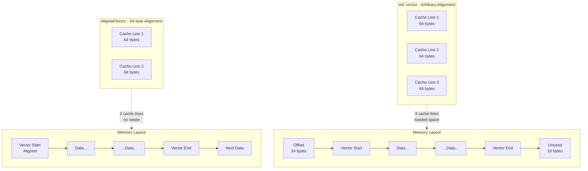
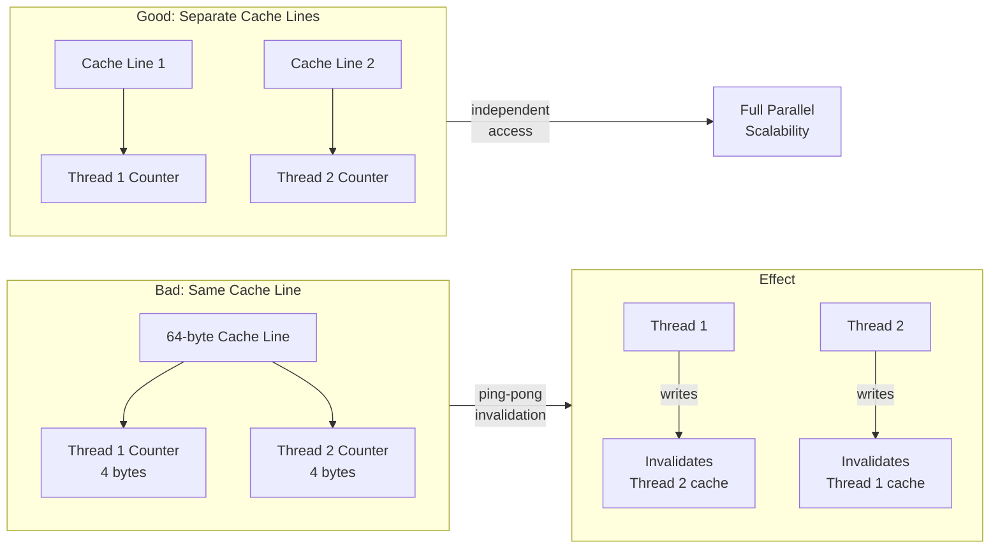

# AlignedVector User Manual

## Table of Contents

1. [What is Memory Alignment and Why AlignedVector?](#what-is-memory-alignment-and-why-alignedvector)
   - [Understanding Memory Alignment](#understanding-memory-alignment)
   - [Why Alignment Matters for Performance](#why-alignment-matters-for-performance)
   - [The C++ Alignment Landscape](#the-c-alignment-landscape)
   - [Where AlignedVector Fits](#where-alignedvector-fits)
2. [Core Architecture](#core-architecture)
   - [The Allocator Model](#the-allocator-model)
   - [Platform Abstraction](#platform-abstraction)
   - [Design Decisions](#design-decisions)
3. [Getting Started](#getting-started)
   - [Prerequisites](#prerequisites)
   - [Compiler Requirements](#compiler-requirements)
   - [Integration](#integration)
   - [Compilation](#compilation)
   - [First Program](#first-program)
4. [Construction and Initialization](#construction-and-initialization)
   - [Default Construction](#default-construction)
   - [Size Construction](#size-construction)
   - [Fill Construction](#fill-construction)
   - [Range Construction](#range-construction)
   - [Initializer List Construction](#initializer-list-construction)
   - [Copy and Move Construction](#copy-and-move-construction)
5. [Element Access](#element-access)
   - [Subscript Operator](#subscript-operator)
   - [Bounds-Checked Access](#bounds-checked-access)
   - [Front and Back](#front-and-back)
   - [Data Pointer Access](#data-pointer-access)
   - [Alignment-Aware Access](#alignment-aware-access)
6. [Capacity Management](#capacity-management)
   - [Size and Capacity](#size-and-capacity)
   - [Reserve](#reserve)
   - [Shrink to Fit](#shrink-to-fit)
   - [Maximum Size](#maximum-size)
7. [Modifiers](#modifiers)
   - [push_back and emplace_back](#push_back-and-emplace_back)
   - [Insert](#insert)
   - [Erase](#erase)
   - [Resize](#resize)
   - [Clear](#clear)
   - [Swap](#swap)
   - [Assign](#assign)
8. [Iterators](#iterators)
   - [Forward Iterators](#forward-iterators)
   - [Reverse Iterators](#reverse-iterators)
   - [Const Iterators](#const-iterators)
   - [Iterator Invalidation](#iterator-invalidation)
9. [The Allocator](#the-allocator)
   - [AlignedAllocator Design](#alignedallocator-design)
   - [Allocator Comparison](#allocator-comparison)
   - [Custom Allocator Integration](#custom-allocator-integration)
10. [Exception Safety](#exception-safety)
    - [The Strong Guarantee](#the-strong-guarantee)
    - [How It Works](#how-it-works)
    - [move_if_noexcept](#move_if_noexcept)
11. [SIMD and Auto-Vectorization](#simd-and-auto-vectorization)
    - [What is SIMD?](#what-is-simd)
    - [The assume_aligned Accessor](#the-assume_aligned-accessor)
    - [Writing Vectorizable Loops](#writing-vectorizable-loops)
    - [Compiler Flags for Vectorization](#compiler-flags-for-vectorization)
12. [Performance Characteristics](#performance-characteristics)
    - [Complexity Guarantees](#complexity-guarantees)
    - [Trivial Type Optimization](#trivial-type-optimization)
    - [Benchmarks](#benchmarks)
    - [Optimization Tips](#optimization-tips)
13. [Comparison with Alternatives](#comparison-with-alternatives)
    - [AlignedVector vs std::vector](#alignedvector-vs-stdvector)
    - [AlignedVector vs Eigen Aligned Allocator](#alignedvector-vs-eigen-aligned-allocator)
    - [AlignedVector vs Manual aligned_alloc](#alignedvector-vs-manual-aligned_alloc)
    - [AlignedVector vs Boost.Alignment](#alignedvector-vs-boostalignment)
14. [Use Case Guide](#use-case-guide)
    - [SIMD Vectorized Loops](#simd-vectorized-loops)
    - [Cache-Sensitive Algorithms](#cache-sensitive-algorithms)
    - [Parallel HPC Workloads](#parallel-hpc-workloads)
    - [Large Numerical Arrays](#large-numerical-arrays)
    - [When NOT to Use AlignedVector](#when-not-to-use-alignedvector)
15. [Migration Guide](#migration-guide)
    - [From std::vector](#from-stdvector)
    - [From Manual Memory Management](#from-manual-memory-management)
16. [Best Practices](#best-practices)
    - [Choosing Alignment Values](#choosing-alignment-values)
    - [Working with SIMD Intrinsics](#working-with-simd-intrinsics)
    - [Avoiding False Sharing](#avoiding-false-sharing)
17. [Testing and Debugging](#testing-and-debugging)
    - [Verifying Alignment at Runtime](#verifying-alignment-at-runtime)
    - [Using AddressSanitizer](#using-addresssanitizer-asan)
    - [Using UndefinedBehaviorSanitizer](#using-undefinedbehaviorsanitizer-ubsan)
    - [Using Valgrind](#using-valgrind)
    - [Verifying Vectorization](#verifying-vectorization)
    - [Alignment Debugging with GDB](#alignment-debugging-with-gdb)
    - [Unit Testing AlignedVector Code](#unit-testing-alignedvector-code)
    - [Performance Testing](#performance-testing)
18. [Troubleshooting](#troubleshooting)
    - [Compilation Errors](#compilation-errors)
    - [Runtime Errors](#runtime-errors)
    - [Performance Issues](#performance-issues)
19. [API Reference](#api-reference)
    - [Type Aliases](#type-aliases)
    - [Member Functions](#member-functions)
    - [Non-Member Functions](#non-member-functions)
20. [Summary](#summary)

---

## What is Memory Alignment and Why AlignedVector?

### Understanding Memory Alignment

Memory alignment refers to how data is arranged in memory relative to specific byte boundaries. When a piece of data is "aligned" to N bytes, its memory address is divisible by N.

| Address | Aligned to |
|---------|------------|
| 0x1000 | 4096, 256, 64, 32, 16, 8, 4, 2, 1 bytes |
| 0x1004 | 4 bytes only |
| 0x1008 | 8 bytes |
| 0x1040 | 64 bytes (cache line boundary) |
| 0x1100 | 256 bytes |

**Why does this matter?** Modern CPUs don't load data byte-by-byte. They load data in chunks called "cache lines" (typically 64 bytes). When data crosses cache line boundaries, the CPU must perform multiple memory operations.

**Aligned access:** A 4-byte read at address 0x1040 (which is 64-byte aligned) requires a single cache line load.

**Misaligned access:** A 4-byte read at address 0x103E spans the boundary between two cache lines, requiring two separate cache line loads—potentially doubling memory latency.

The performance impact of misalignment ranges from negligible (on modern x86 with hardware support) to catastrophic (on older ARM or when using SIMD instructions that require alignment).

### Why Alignment Matters for Performance

There are three main reasons alignment matters in high-performance code:

#### 1. SIMD Instructions Require Alignment

SIMD (Single Instruction, Multiple Data) instructions process multiple values simultaneously. SSE processes 4 floats at once (128 bits), AVX processes 8 floats (256 bits), and AVX-512 processes 16 floats (512 bits).

Many SIMD instructions have aligned and unaligned variants:

```cpp
// Aligned load: requires 32-byte alignment, fastest
__m256 v1 = _mm256_load_ps(ptr);      // ptr must be 32-byte aligned

// Unaligned load: works with any alignment, slower
__m256 v2 = _mm256_loadu_ps(ptr);     // 'u' for unaligned

// If you use aligned load on misaligned data:
_mm256_load_ps(misaligned_ptr);        // CRASH! SIGSEGV
```

On older CPUs, unaligned loads could be significantly slower than aligned loads. On modern CPUs (Skylake+), the hardware penalty is often small—but unaligned loads force the compiler into more conservative loop structures (peeling loops, fallback paths), which is where the real performance cost lies.

#### 2. Cache Line Efficiency

Modern CPUs have a 64-byte cache line. When you allocate a vector that starts mid-cache-line, you waste space and potentially cause extra cache misses:



**The cost of misalignment:**
- Extra cache line fetched for the alignment offset prefix
- Reduced effective cache capacity
- Prefetcher may fetch unnecessary data

#### 3. False Sharing in Parallel Code

When multiple threads access data on the same cache line, they force each other to reload the entire line—even if they're accessing different bytes. This is called "false sharing" and can destroy parallel scalability:



```cpp
// Bad: two counters on same cache line
struct Counters {
    std::atomic<int> thread1_counter;  // Offset 0
    std::atomic<int> thread2_counter;  // Offset 4 - same cache line!
};

// Thread 1 increments thread1_counter
// Thread 2 increments thread2_counter
// Both threads constantly invalidate each other's cache

// Good: pad to separate cache lines
struct alignas(64) Counters {
    alignas(64) std::atomic<int> thread1_counter;
    alignas(64) std::atomic<int> thread2_counter;
};
```

AlignedVector with 64-byte alignment ensures each vector starts on its own cache line, preventing false sharing between adjacent vectors.

### The C++ Alignment Landscape

C++ has several alignment mechanisms, but none provides a convenient aligned container:

**`alignas` specifier (C++11):** Aligns individual objects or struct members.

```cpp
alignas(64) float cache_line_aligned[16];
// Works, but fixed size, no dynamic growth
```

**`std::aligned_alloc` (C++17):** Allocates aligned memory.

```cpp
float* data = static_cast<float*>(std::aligned_alloc(64, 1024 * sizeof(float)));
// Works, but manual memory management, no RAII, no growth
free(data);  // Don't forget!
```

**Custom allocators:** The standard allocator model supports custom allocation, but it's verbose.

```cpp
template<typename T, size_t Alignment>
struct MyAlignedAllocator {
    using value_type = T;
    T* allocate(size_t n);
    void deallocate(T* p, size_t n);
    // ... 20 more lines of boilerplate
};

std::vector<float, MyAlignedAllocator<float, 64>> vec;
// Works, but you must write the allocator for each alignment
```

**The gap:** There's no `std::vector<T, Alignment>` in the standard. Every project needing aligned containers must write its own allocator or use a third-party library.

### Where AlignedVector Fits

AlignedVector fills this gap with a single-header solution:

```cpp
#include "AlignedVector.h"

fat_p::AlignedVector<float, 64> vec(1024);  // 64-byte aligned
// Guaranteed aligned to 64 bytes
// Full std::vector interface
// Exception-safe
// Platform-portable
// Zero external dependencies
```

**Use AlignedVector when:**
- You need guaranteed memory alignment for SIMD
- You want cache-line alignment for parallel code
- You're working on HPC/scientific computing
- You need `std::vector` semantics with alignment control

**Don't use AlignedVector when:**
- Standard alignment is sufficient (`alignof(T)`)
- You're storing small objects where alignment overhead matters
- Your access patterns are random (alignment won't help)

---

## Core Architecture

### The Allocator Model

AlignedVector uses a custom `AlignedAllocator` that provides aligned memory allocation:

```cpp
template<typename T, size_t Alignment = 64>
class AlignedAllocator {
public:
    using value_type = T;
    
    static_assert((Alignment & (Alignment - 1)) == 0, 
                  "Alignment must be power of 2");
    static_assert(Alignment >= alignof(T), 
                  "Alignment must be at least alignof(T)");
    
    T* allocate(size_t n);
    void deallocate(T* ptr, size_t n) noexcept;
    
    static constexpr size_t max_size() noexcept;
};
```

The static assertions catch configuration errors at compile time:

```cpp
// Compile error: 7 is not a power of 2
AlignedVector<int, 7> bad1;

// Compile error: 2 < alignof(double) which is 8
AlignedVector<double, 2> bad2;

// OK: 64 is power of 2 and >= alignof(float)
AlignedVector<float, 64> good;
```

### Platform Abstraction

Aligned allocation differs between platforms. AlignedAllocator handles this:

```cpp
T* allocate(size_t n) {
    if (n == 0) return nullptr;
    
    void* ptr = nullptr;
    
#if defined(_MSC_VER)
    // Windows: _aligned_malloc returns aligned pointer directly
    ptr = _aligned_malloc(n * sizeof(T), Alignment);
    if (!ptr) throw std::bad_alloc();
    
#else
    // POSIX: posix_memalign sets ptr and returns error code
    if (posix_memalign(&ptr, Alignment, n * sizeof(T)) != 0) {
        throw std::bad_alloc();
    }
#endif
    
    return static_cast<T*>(ptr);
}

void deallocate(T* ptr, size_t) noexcept {
    if (!ptr) return;
    
#if defined(_MSC_VER)
    _aligned_free(ptr);
#else
    free(ptr);  // POSIX aligned memory is freed with regular free()
#endif
}
```

**Why not `std::aligned_alloc` (C++17)?** While standard, it has quirks:
- Size must be a multiple of alignment on some platforms
- Not available in older MSVC versions
- `posix_memalign` and `_aligned_malloc` are more widely supported

**Note on alignment validity:** `posix_memalign` requires alignment to be a multiple of `sizeof(void*)`. Since AlignedVector enforces `Alignment >= alignof(T)` and `alignof(T) >= sizeof(void*)` for any type that can be pointed to, this requirement is always satisfied.

### Design Decisions

**Alignment as template parameter:** Alignment is part of the type, not a runtime value. This enables:
- Compile-time validation
- No runtime storage overhead for alignment value
- Compiler optimization opportunities

**Strong exception guarantee:** All mutating operations leave the container unchanged if an exception is thrown. This is essential for production code where errors must not corrupt data.

**std::vector compatibility:** AlignedVector provides the full `std::vector` interface, making it a drop-in replacement in most code.

---

## Getting Started

### Prerequisites

AlignedVector requires:
- C++17 or later
- A conforming standard library
- POSIX-compatible system or Windows

No external dependencies beyond the C++ standard library.

### Compiler Requirements

| Compiler | Minimum Version | Notes |
|----------|-----------------|-------|
| GCC | 7.1+ | Full C++17 support, `__builtin_assume_aligned` |
| Clang | 5.0+ | Full C++17 support, `__builtin_assume_aligned` |
| MSVC | 2017 (19.14)+ | C++17 support; no `__builtin_assume_aligned` equivalent |
| Intel ICC | 19.0+ | Full C++17, excellent auto-vectorization |
| Intel ICX | 2021.1+ | LLVM-based, same as Clang |

**Platform-specific notes:**

- **Linux:** Tested on Ubuntu 20.04+, RHEL 7+, CentOS 7+
- **Windows:** Tested on Windows 10+, Windows Server 2016+
- **macOS:** Tested on macOS 10.15+ (Catalina) with Xcode 11+

**HPC cluster notes:** Scientific clusters often run older compilers for CUDA/driver compatibility. GCC 7.x (common on RHEL 7) is fully supported. If you're stuck on GCC 4.x, you'll need to upgrade or use a module system to load a newer compiler.

### Integration

AlignedVector is header-only. Copy the headers to your project:

```
your_project/
├── include/
│   └── fat_p/
│       ├── AlignedVector.h
│       └── FatPTypeTraits.h    // Required dependency
└── src/
    └── main.cpp
```

### Compilation

Include the header and compile with C++17:

```bash
# GCC
g++ -std=c++17 -O3 -march=native main.cpp -o main

# Clang
clang++ -std=c++17 -O3 -march=native main.cpp -o main

# MSVC
cl /std:c++17 /O2 main.cpp
```

The `-march=native` flag enables CPU-specific optimizations including SIMD instructions.

### First Program

```cpp
#include <iostream>
#include "AlignedVector.h"

int main() {
    // Create a 64-byte aligned vector of 1000 floats
    fat_p::AlignedVector<float, 64> data(1000, 1.0f);
    
    // Verify alignment
    std::cout << "Data address: " << data.data() << "\n";
    std::cout << "Aligned to 64: " << (data.is_aligned() ? "yes" : "no") << "\n";
    
    // Use like std::vector
    data.push_back(2.0f);
    data.push_back(3.0f);
    
    // Sum using aligned pointer for potential auto-vectorization
    const float* p = data.assume_aligned();
    float sum = 0.0f;
    for (size_t i = 0; i < data.size(); ++i) {
        sum += p[i];
    }
    
    std::cout << "Sum: " << sum << "\n";
    
    return 0;
}
```

Expected output:
```
Data address: 0x55a1b4c00000
Aligned to 64: yes
Sum: 1005
```

---

## Construction and Initialization

### Default Construction

Creates an empty vector with no allocation.

```cpp
fat_p::AlignedVector<int, 64> vec;

assert(vec.empty());
assert(vec.size() == 0);
assert(vec.capacity() == 0);
assert(vec.data() == nullptr);
```

### Size Construction

Creates a vector with `n` value-initialized elements.

```cpp
// 100 integers, all zero-initialized
fat_p::AlignedVector<int, 64> ints(100);
assert(ints.size() == 100);
assert(ints[0] == 0);
assert(ints[99] == 0);

// For trivial types, uses memset for efficiency
// For non-trivial types, calls default constructor for each element
```

**Value initialization:** For trivial types (int, float, POD structs), value initialization means zero-initialization. For class types, it means calling the default constructor.

### Fill Construction

Creates a vector with `n` copies of a value.

```cpp
fat_p::AlignedVector<std::string, 64> strings(5, "hello");
assert(strings.size() == 5);
for (const auto& s : strings) {
    assert(s == "hello");
}
```

### Range Construction

Creates a vector from an iterator range.

```cpp
std::vector<int> source = {1, 2, 3, 4, 5};

// From any random-access iterator
fat_p::AlignedVector<int, 64> vec1(source.begin(), source.end());

// From any input iterator (std::list)
std::list<int> list_source = {10, 20, 30};
fat_p::AlignedVector<int, 64> vec2(list_source.begin(), list_source.end());

// From raw pointers
int arr[] = {100, 200, 300};
fat_p::AlignedVector<int, 64> vec3(std::begin(arr), std::end(arr));
```

For random-access iterators, the constructor pre-allocates the exact size needed. For input iterators, it uses `push_back` incrementally.

### Initializer List Construction

Creates a vector from a braced initializer list.

```cpp
fat_p::AlignedVector<int, 64> vec = {1, 2, 3, 4, 5};

assert(vec.size() == 5);
assert(vec[0] == 1);
assert(vec[4] == 5);
```

### Copy and Move Construction

```cpp
fat_p::AlignedVector<int, 64> original = {1, 2, 3};

// Copy: deep copy of all elements
fat_p::AlignedVector<int, 64> copy(original);
assert(copy == original);
assert(copy.data() != original.data());  // Separate memory

// Move: transfers ownership, original becomes empty
fat_p::AlignedVector<int, 64> moved(std::move(original));
assert(moved.size() == 3);
assert(original.empty());  // Moved-from state
```

---

## Element Access

### Subscript Operator

Direct element access without bounds checking.

```cpp
fat_p::AlignedVector<int, 64> vec = {10, 20, 30};

int x = vec[0];   // Read: x = 10
vec[1] = 25;      // Write: vec is now {10, 25, 30}

// WARNING: No bounds checking!
// vec[100] is undefined behavior if vec.size() <= 100
```

### Bounds-Checked Access

The `at()` method provides bounds checking.

```cpp
fat_p::AlignedVector<int, 64> vec = {10, 20, 30};

int x = vec.at(0);   // OK: x = 10
int y = vec.at(2);   // OK: y = 30

try {
    int z = vec.at(100);  // Throws std::out_of_range
} catch (const std::out_of_range& e) {
    std::cerr << "Index out of range\n";
}
```

### Front and Back

Access first and last elements directly.

```cpp
fat_p::AlignedVector<int, 64> vec = {10, 20, 30};

int first = vec.front();  // 10
int last = vec.back();    // 30

vec.front() = 5;   // vec is now {5, 20, 30}
vec.back() = 35;   // vec is now {5, 20, 35}
```

**Warning:** Calling `front()` or `back()` on an empty vector is undefined behavior.

### Data Pointer Access

Get a raw pointer to the underlying array.

```cpp
fat_p::AlignedVector<float, 64> vec = {1.0f, 2.0f, 3.0f};

float* ptr = vec.data();
const float* cptr = vec.data();  // const overload

// Use with C APIs
some_c_function(vec.data(), vec.size());

// Use with SIMD intrinsics (but consider assume_aligned())
__m128 v = _mm_load_ps(vec.data());  // OK if size >= 4
```

### Alignment-Aware Access

The `assume_aligned()` method returns a pointer with an alignment hint for the compiler.

```cpp
fat_p::AlignedVector<float, 64> vec(1000, 1.0f);

// Standard data pointer
float* ptr = vec.data();

// Pointer with alignment hint
float* aligned_ptr = vec.assume_aligned();

// The compiler knows aligned_ptr is 64-byte aligned
// This enables better auto-vectorization
for (size_t i = 0; i < vec.size(); ++i) {
    aligned_ptr[i] *= 2.0f;  // Compiler can use aligned SIMD loads
}
```

**How it works:**

```cpp
T* assume_aligned() noexcept {
#if defined(__GNUC__) || defined(__clang__)
    return static_cast<T*>(__builtin_assume_aligned(data_, Alignment));
#else
    return data_;  // MSVC: no direct equivalent, relies on optimization
#endif
}
```

**Critical warning:** Calling `assume_aligned()` and then using the pointer with aligned SIMD loads is **undefined behavior** if the pointer is not actually aligned. AlignedVector guarantees alignment, but if you somehow bypass the allocator or use the hint on external data, the program may crash or produce incorrect results silently.

See [SIMD and Auto-Vectorization](#simd-and-auto-vectorization) for detailed usage.

---

## Capacity Management

### Size and Capacity

```cpp
fat_p::AlignedVector<int, 64> vec;

// Size: number of elements currently stored
assert(vec.size() == 0);

// Capacity: number of elements that can be stored without reallocation
assert(vec.capacity() == 0);

// Empty: true if size == 0
assert(vec.empty());

vec.push_back(1);
vec.push_back(2);

assert(vec.size() == 2);
assert(vec.capacity() >= 2);
assert(!vec.empty());
```

### Reserve

Pre-allocate memory for a known number of elements.

```cpp
fat_p::AlignedVector<int, 64> vec;

// Reserve space for 1000 elements
vec.reserve(1000);

assert(vec.size() == 0);        // No elements yet
assert(vec.capacity() >= 1000); // But space is allocated

// Now push_back won't reallocate until we exceed 1000
for (int i = 0; i < 1000; ++i) {
    vec.push_back(i);  // No reallocation
}
```

**When to use:** If you know approximately how many elements you'll add, `reserve()` avoids repeated reallocations.

```cpp
// Without reserve: potentially log₂(N) reallocations
fat_p::AlignedVector<int, 64> v1;
for (int i = 0; i < 10000; ++i) {
    v1.push_back(i);  // May reallocate multiple times
}

// With reserve: exactly 1 allocation
fat_p::AlignedVector<int, 64> v2;
v2.reserve(10000);
for (int i = 0; i < 10000; ++i) {
    v2.push_back(i);  // No reallocation
}
```

### Shrink to Fit

Release excess capacity.

```cpp
fat_p::AlignedVector<int, 64> vec;
vec.reserve(1000);
vec.push_back(1);
vec.push_back(2);

assert(vec.size() == 2);
assert(vec.capacity() >= 1000);

vec.shrink_to_fit();

assert(vec.size() == 2);
assert(vec.capacity() == 2);  // Capacity reduced to size
```

**Caution:** `shrink_to_fit()` may reallocate, invalidating all iterators and pointers.

### Maximum Size

The theoretical maximum number of elements.

```cpp
fat_p::AlignedVector<int, 64> vec;

size_t max = vec.max_size();
// Typically SIZE_MAX / sizeof(T)
// For int: ~4 billion on 32-bit, ~4 quintillion on 64-bit

// Attempting to exceed max_size throws std::length_error
try {
    vec.reserve(vec.max_size() + 1);
} catch (const std::length_error&) {
    // Expected
}
```

---

## Modifiers

### push_back and emplace_back

Add elements to the end.

```cpp
fat_p::AlignedVector<std::string, 64> vec;

// push_back: copy or move an existing object
std::string s = "hello";
vec.push_back(s);              // Copy
vec.push_back(std::move(s));   // Move
vec.push_back("world");        // Construct temporary, then move

// emplace_back: construct in-place (more efficient)
vec.emplace_back("constructed in place");
vec.emplace_back(10, 'x');     // std::string(10, 'x') = "xxxxxxxxxx"

// emplace_back returns a reference to the new element
std::string& ref = vec.emplace_back("last");
ref += "!";  // Modifies the element in the vector
```

**Performance:** `emplace_back` is preferred when constructing new objects because it avoids temporary object creation.

```cpp
struct Widget {
    Widget(int a, double b, std::string c) { /* ... */ }
};

fat_p::AlignedVector<Widget, 64> widgets;

// push_back: constructs temporary, then moves
widgets.push_back(Widget(1, 2.0, "temp"));

// emplace_back: constructs directly in vector memory
widgets.emplace_back(1, 2.0, "direct");  // More efficient
```

### Insert

Insert elements at any position.

```cpp
fat_p::AlignedVector<int, 64> vec = {1, 2, 5};

// Insert single element
auto it = vec.insert(vec.begin() + 2, 3);  // vec = {1, 2, 3, 5}
// Returns iterator to inserted element

// Insert multiple copies
vec.insert(vec.begin() + 3, 2, 4);  // vec = {1, 2, 3, 4, 4, 5}

// Insert range
std::vector<int> more = {10, 20};
vec.insert(vec.end(), more.begin(), more.end());

// Insert initializer list
vec.insert(vec.begin(), {-2, -1, 0});
```

**Complexity:** O(n) where n is the number of elements after the insertion point. Elements must be shifted to make room.

### Erase

Remove elements.

```cpp
fat_p::AlignedVector<int, 64> vec = {1, 2, 3, 4, 5};

// Erase single element
auto it = vec.erase(vec.begin() + 2);  // vec = {1, 2, 4, 5}
// Returns iterator to element after erased (now 4)

// Erase range
vec.erase(vec.begin(), vec.begin() + 2);  // vec = {4, 5}

// pop_back: remove last element (faster than erase)
vec.pop_back();  // vec = {4}
```

**Complexity:** O(n) for single element or range erase (elements must shift). O(1) for `pop_back`.

### Resize

Change the number of elements.

```cpp
fat_p::AlignedVector<int, 64> vec = {1, 2, 3};

// Grow: new elements are value-initialized (zero for int)
vec.resize(5);        // vec = {1, 2, 3, 0, 0}

// Grow with specific value
vec.resize(7, 99);    // vec = {1, 2, 3, 0, 0, 99, 99}

// Shrink: excess elements are destroyed
vec.resize(2);        // vec = {1, 2}
```

### Clear

Remove all elements without changing capacity.

```cpp
fat_p::AlignedVector<int, 64> vec = {1, 2, 3, 4, 5};
vec.reserve(100);

vec.clear();

assert(vec.empty());
assert(vec.size() == 0);
assert(vec.capacity() >= 100);  // Capacity unchanged
```

### Swap

Exchange contents with another vector.

```cpp
fat_p::AlignedVector<int, 64> a = {1, 2, 3};
fat_p::AlignedVector<int, 64> b = {10, 20};

a.swap(b);

assert(a.size() == 2);
assert(b.size() == 3);

// Also available as non-member function
swap(a, b);  // Swaps back
```

**Complexity:** O(1). Only pointers are exchanged, not elements.

### Assign

Replace contents entirely.

```cpp
fat_p::AlignedVector<int, 64> vec = {1, 2, 3, 4, 5};

// Assign count copies of value
vec.assign(3, 42);  // vec = {42, 42, 42}

// Assign from range
std::vector<int> source = {10, 20, 30, 40};
vec.assign(source.begin(), source.end());  // vec = {10, 20, 30, 40}

// Assign from initializer list
vec.assign({100, 200});  // vec = {100, 200}

// Assignment operator with initializer list
vec = {1, 2, 3};  // vec = {1, 2, 3}
```

---

## Iterators

### Forward Iterators

```cpp
fat_p::AlignedVector<int, 64> vec = {1, 2, 3, 4, 5};

// Iterator loop
for (auto it = vec.begin(); it != vec.end(); ++it) {
    std::cout << *it << " ";
}

// Range-based for (uses begin/end)
for (int x : vec) {
    std::cout << x << " ";
}

// Modify through iterator
for (auto it = vec.begin(); it != vec.end(); ++it) {
    *it *= 2;  // Double each element
}
```

### Reverse Iterators

```cpp
fat_p::AlignedVector<int, 64> vec = {1, 2, 3, 4, 5};

// Iterate backwards
for (auto it = vec.rbegin(); it != vec.rend(); ++it) {
    std::cout << *it << " ";  // 5 4 3 2 1
}
```

### Const Iterators

```cpp
const fat_p::AlignedVector<int, 64> vec = {1, 2, 3};

// const_iterator: read-only access
for (auto it = vec.cbegin(); it != vec.cend(); ++it) {
    std::cout << *it << " ";
    // *it = 10;  // Error: cannot modify through const_iterator
}
```

### Iterator Invalidation

**Operations that invalidate iterators:**

| Operation | Invalidates |
|-----------|-------------|
| `push_back`, `emplace_back` | All (if reallocation), none otherwise |
| `insert`, `emplace` | At and after insertion point (always); all (if reallocation) |
| `erase` | At and after erasure point |
| `resize` (grow) | All (if reallocation), none otherwise |
| `resize` (shrink) | Erased elements and `end()` iterator |
| `reserve` | All (if reallocation) |
| `shrink_to_fit` | All (always assume invalidation) |
| `clear` | All |
| `swap` | All (both vectors) |

**Note on `shrink_to_fit`:** Always assume all iterators and references are invalidated, even if the size equals capacity. Implementations may reallocate unconditionally.

**Safe pattern:**

```cpp
fat_p::AlignedVector<int, 64> vec = {1, 2, 3, 4, 5};

// DON'T: iterator invalidated by erase
for (auto it = vec.begin(); it != vec.end(); ++it) {
    if (*it == 3) {
        vec.erase(it);  // it is now invalid!
        // Continuing to use it is undefined behavior
    }
}

// DO: use return value of erase
for (auto it = vec.begin(); it != vec.end(); ) {
    if (*it == 3) {
        it = vec.erase(it);  // it now points to next element
    } else {
        ++it;
    }
}

// OR: use erase-remove idiom
vec.erase(
    std::remove(vec.begin(), vec.end(), 3),
    vec.end()
);
```

---

## The Allocator

### AlignedAllocator Design

`AlignedAllocator` is a stateless allocator that provides aligned memory:

```cpp
template<typename T, size_t Alignment = 64>
class AlignedAllocator {
public:
    using value_type = T;
    using size_type = std::size_t;
    using difference_type = std::ptrdiff_t;
    using pointer = T*;
    using const_pointer = const T*;
    
    static constexpr size_t alignment = Alignment;
    
    // Allocate aligned memory
    [[nodiscard]] T* allocate(size_t n);
    
    // Deallocate aligned memory
    void deallocate(T* ptr, size_t n) noexcept;
    
    // Maximum allocatable elements
    static constexpr size_t max_size() noexcept;
    
    // Rebind for container internals
    template<typename U>
    struct rebind {
        using other = AlignedAllocator<U, Alignment>;
    };
};
```

### Allocator Comparison

Two `AlignedAllocator` instances are equal only if they have the same type AND alignment:

```cpp
fat_p::AlignedAllocator<int, 64> a1;
fat_p::AlignedAllocator<int, 64> a2;
fat_p::AlignedAllocator<int, 32> a3;
fat_p::AlignedAllocator<float, 64> a4;

assert(a1 == a2);   // Same type, same alignment
assert(a1 != a3);   // Same type, different alignment
assert(a1 != a4);   // Different type, same alignment
```

### Custom Allocator Integration

You can retrieve the allocator from a vector:

```cpp
fat_p::AlignedVector<int, 64> vec;

auto alloc = vec.get_allocator();
static_assert(alloc.alignment == 64);

// Use allocator directly
int* buffer = alloc.allocate(100);
// ... use buffer ...
alloc.deallocate(buffer, 100);
```

---

## Exception Safety

### The Strong Guarantee

AlignedVector provides the **strong exception guarantee** for all mutating operations: if an operation throws an exception, the container is left unchanged.

```cpp
struct MayThrow {
    MayThrow(int v) : value(v) {
        if (v == 42) throw std::runtime_error("42 is forbidden");
    }
    int value;
};

fat_p::AlignedVector<MayThrow> vec;
vec.emplace_back(1);
vec.emplace_back(2);

try {
    vec.emplace_back(42);  // Throws!
} catch (...) {
    // vec is unchanged
    assert(vec.size() == 2);
    assert(vec[0].value == 1);
    assert(vec[1].value == 2);
}
```

### How It Works

For operations that might reallocate (like `push_back` when capacity is full):

1. Allocate new memory block
2. Move or copy elements to new block
3. If step 2 throws, destroy partial new block and rethrow
4. Only if step 2 succeeds: destroy old block

```cpp
void reallocate(size_type new_capacity) {
    // Step 1: Allocate new memory
    pointer new_data = allocator_.allocate(new_capacity);
    
    try {
        // Step 2: Move/copy elements
        construct_range_move(new_data, data_, size_);
    } catch (...) {
        // Step 3: Cleanup on failure
        allocator_.deallocate(new_data, new_capacity);
        throw;  // Original data_ unchanged!
    }
    
    // Step 4: Success - replace old with new
    destroy_range(data_, data_ + size_);
    allocator_.deallocate(data_, capacity_);
    data_ = new_data;
    capacity_ = new_capacity;
}
```

### move_if_noexcept

When moving elements to a new buffer, AlignedVector uses `std::move_if_noexcept`:

```cpp
// If T's move constructor is noexcept: move (fast)
// If T's move constructor might throw: copy (safe)

new (dest) T(std::move_if_noexcept(source));
```

This ensures that if moving throws, the original elements are still intact (they weren't moved from).

**Implication:** If your type has a throwing move constructor, AlignedVector falls back to copying, which is slower. Mark your move constructors `noexcept` when possible:

```cpp
struct Widget {
    std::vector<int> data;
    
    // Good: noexcept move constructor
    Widget(Widget&& other) noexcept : data(std::move(other.data)) {}
    
    // Bad: potentially throwing move (if custom allocator might throw)
    // Widget(Widget&& other) : data(std::move(other.data)) {}
};
```

---

## SIMD and Auto-Vectorization

### What is SIMD?

SIMD (Single Instruction, Multiple Data) allows a single CPU instruction to operate on multiple values simultaneously. Modern CPUs support:

| Instruction Set | Register Width | Floats per Op |
|-----------------|----------------|---------------|
| SSE | 128 bits | 4 |
| AVX | 256 bits | 8 |
| AVX-512 | 512 bits | 16 |

A simple loop that processes one float at a time:

```cpp
for (size_t i = 0; i < 1000; ++i) {
    output[i] = input[i] * 2.0f;  // 1 float per iteration
}
```

Can be vectorized to:

```cpp
// AVX: 8 floats per iteration
for (size_t i = 0; i < 1000; i += 8) {
    __m256 v = _mm256_load_ps(&input[i]);
    v = _mm256_mul_ps(v, _mm256_set1_ps(2.0f));
    _mm256_store_ps(&output[i], v);
}
```

The second version processes 8 floats per iteration instead of 1, directly leveraging the AVX register width.

### The assume_aligned Accessor

Compilers can auto-vectorize loops, but they need to know the data is aligned. Without alignment information, the compiler generates:

1. A "peeling" loop to handle initial misaligned elements
2. The main vectorized loop (with aligned loads)
3. A "remainder" loop for trailing elements
4. Potentially unaligned load fallbacks

The `assume_aligned()` method tells the compiler the data IS aligned:

```cpp
fat_p::AlignedVector<float, 64> data(10000, 1.0f);

// Without assume_aligned: compiler doesn't know alignment
void process_unknown(fat_p::AlignedVector<float, 64>& vec) {
    for (size_t i = 0; i < vec.size(); ++i) {
        vec[i] *= 2.0f;  // Compiler may use unaligned loads
    }
}

// With assume_aligned: compiler knows alignment
void process_aligned(fat_p::AlignedVector<float, 64>& vec) {
    float* p = vec.assume_aligned();
    for (size_t i = 0; i < vec.size(); ++i) {
        p[i] *= 2.0f;  // Compiler uses aligned loads
    }
}
```

**Under the hood:**

```cpp
// GCC/Clang implementation
T* assume_aligned() noexcept {
    return static_cast<T*>(__builtin_assume_aligned(data_, Alignment));
}

// The compiler now knows:
// - data_ is aligned to Alignment bytes
// - It can use aligned load/store instructions
// - No peeling loop needed
```

**MSVC note:** MSVC lacks `__builtin_assume_aligned`. The `assume_aligned()` method returns the raw pointer on MSVC, which may still generate unaligned loads (`vmovups`) even when the data is actually aligned. For guaranteed aligned loads on MSVC, use explicit SIMD intrinsics:

```cpp
#if defined(_MSC_VER)
    // MSVC: use aligned intrinsics directly
    __m256 v = _mm256_load_ps(vec.data());  // Crashes if misaligned
#else
    // GCC/Clang: assume_aligned enables aligned codegen
    const float* p = vec.assume_aligned();
    // Compiler generates aligned loads automatically
#endif
```

### Writing Vectorizable Loops

Not all loops can be vectorized. For auto-vectorization to work:

**DO:**
```cpp
// Simple arithmetic
for (size_t i = 0; i < n; ++i) {
    out[i] = a[i] + b[i];
}

// Reductions
float sum = 0.0f;
for (size_t i = 0; i < n; ++i) {
    sum += data[i];
}

// Independent iterations
for (size_t i = 0; i < n; ++i) {
    data[i] = std::sqrt(data[i]);
}
```

**DON'T:**
```cpp
// Data dependencies between iterations
for (size_t i = 1; i < n; ++i) {
    data[i] = data[i-1] * 2;  // Each iteration depends on previous
}

// Conditional branches
for (size_t i = 0; i < n; ++i) {
    if (data[i] > threshold) {
        data[i] = 0;  // Unpredictable branch
    }
}

// Function calls (unless inlined)
for (size_t i = 0; i < n; ++i) {
    data[i] = complex_function(data[i]);  // May not inline
}
```

**Pointer aliasing tip:** Compilers often fail to vectorize because they assume two pointers might alias (point to overlapping memory). Use `__restrict` to promise they don't:

```cpp
void process(float* __restrict out, const float* __restrict in, size_t n) {
    for (size_t i = 0; i < n; ++i) {
        out[i] = in[i] * 2.0f;  // Compiler knows out and in don't overlap
    }
}

// With AlignedVector:
float* __restrict p = data.assume_aligned();
```

### Compiler Flags for Vectorization

Enable auto-vectorization and report what was vectorized:

```bash
# GCC
g++ -O3 -march=native -ftree-vectorize -fopt-info-vec-optimized

# Clang
clang++ -O3 -march=native -Rpass=loop-vectorize

# MSVC
cl /O2 /arch:AVX2 /Qvec-report:2
```

Example output (GCC):

```
main.cpp:42:5: optimized: loop vectorized using 32 byte vectors
main.cpp:47:5: optimized: loop vectorized using 32 byte vectors
```

---

## Performance Characteristics

### Complexity Guarantees

| Operation | Time Complexity | Notes |
|-----------|-----------------|-------|
| `operator[]` | O(1) | Direct pointer arithmetic |
| `at()` | O(1) | Bounds check + pointer arithmetic |
| `front()`, `back()` | O(1) | Direct access |
| `push_back` | Amortized O(1) | O(n) when reallocation needed |
| `emplace_back` | Amortized O(1) | O(n) when reallocation needed |
| `pop_back` | O(1) | Destructor call only |
| `insert` | O(n) | Shift elements after insertion |
| `erase` | O(n) | Shift elements after erasure |
| `clear` | O(n) | Destructor calls (O(1) for trivial types) |
| `resize` | O(n) | Construction/destruction |
| `reserve` | O(n) | Copy/move all elements |
| `size()`, `empty()`, `capacity()` | O(1) | Member access |

### Trivial Type Optimization

For trivially copyable types (int, float, POD structs), AlignedVector uses optimized operations:

```cpp
// Trivially copyable types:
// - memset for value initialization
// - memcpy for copy construction
// - No destructor calls needed

fat_p::AlignedVector<float, 64> floats(1000000);
// Uses: memset(data, 0, 1000000 * sizeof(float))
// Instead of: 1,000,000 constructor calls

fat_p::AlignedVector<float, 64> copy = floats;
// Uses: memcpy(new_data, old_data, size * sizeof(float))
// Instead of: 1,000,000 copy constructor calls
```

### Benchmarks

Typical performance on Intel i7-8850H, GCC 11, `-O3 -march=native`:

Raw performance is comparable to `std::vector` for scalar operations — `push_back`, iteration, and insertion show equivalent throughput. The advantage is guaranteed alignment for SIMD code and explicit alignment communication to the compiler, not faster scalar operations. See `components/AlignedVector/results/` for current platform-specific benchmark data.

### Optimization Tips

**1. Reserve when size is known:**
```cpp
fat_p::AlignedVector<float, 64> data;
data.reserve(expected_size);  // Avoid reallocations
```

**2. Use emplace_back over push_back:**
```cpp
data.emplace_back(args...);  // Construct in place
// vs
data.push_back(T(args...));  // Construct temporary, then move
```

**3. Use assume_aligned for hot loops:**
```cpp
float* p = data.assume_aligned();
for (size_t i = 0; i < data.size(); ++i) {
    p[i] *= scale;
}
```

**4. Choose appropriate alignment:**
```cpp
// For SSE: 16 bytes
AlignedVector<float, 16> sse_data;

// For AVX: 32 bytes
AlignedVector<float, 32> avx_data;

// For cache-line / AVX-512: 64 bytes
AlignedVector<float, 64> cache_data;
```

---

## Comparison with Alternatives

### AlignedVector vs std::vector

`std::vector` is the standard dynamic array. It aligns memory to `alignof(T)`, which is typically 4 bytes for `float` and 8 bytes for `double`.

| Feature | AlignedVector | std::vector |
|---------|---------------|-------------|
| Alignment control | Configurable (16-256+) | alignof(T) only |
| Auto-vectorization hint | assume_aligned() | None |
| Exception safety | Strong guarantee | Strong guarantee |
| Interface compatibility | Full std::vector | Standard |
| Dependencies | Single header | Standard library |

**When to use std::vector:**
- No SIMD requirements
- No cache-line alignment needs
- Standard alignment is sufficient

**When to use AlignedVector:**
- SIMD intrinsics require specific alignment
- Cache-line alignment for parallel code
- Auto-vectorization optimization

### AlignedVector vs Eigen Aligned Allocator

Eigen is a popular linear algebra library that includes aligned allocators.

| Feature | AlignedVector | Eigen |
|---------|---------------|-------|
| Dependencies | None | Eigen library (~15k headers) |
| Focus | General aligned container | Linear algebra matrices |
| Integration | Standalone | Part of Eigen ecosystem |
| Alignment | Any power of 2 | 16 bytes (configurable) |

**When to use Eigen:**
- You're already using Eigen for linear algebra
- You need matrix/vector operations

**When to use AlignedVector:**
- You want a standalone solution
- You need a general-purpose container
- You can't add Eigen as a dependency

### AlignedVector vs Manual aligned_alloc

`std::aligned_alloc` (C++17) or `posix_memalign`/`_aligned_malloc` provide raw aligned allocation.

| Feature | AlignedVector | Manual aligned_alloc |
|---------|---------------|---------------------|
| Memory management | Automatic (RAII) | Manual free() required |
| Growth | Automatic | Manual reallocation |
| Exception safety | Strong guarantee | None |
| Move semantics | Built-in | Manual |
| Complexity | Simple API | Low-level |

**When to use manual allocation:**
- Fixed-size buffers
- Integration with C APIs
- Maximum control needed

**When to use AlignedVector:**
- Dynamic sizing needed
- Exception safety required
- std::vector-like interface preferred

### AlignedVector vs Boost.Alignment

Boost provides `boost::alignment::aligned_allocator`.

| Feature | AlignedVector | Boost |
|---------|---------------|-------|
| Dependencies | None | Boost library |
| Container | Complete vector | Allocator only |
| assume_aligned | Built-in | Separate utility |
| Compile time | Fast (single header) | Slower (Boost headers) |

**When to use Boost:**
- You're already using Boost
- You need other Boost features

**When to use AlignedVector:**
- You want to avoid Boost dependency
- You want a complete aligned container

---

## Use Case Guide

### SIMD Vectorized Loops

**Scenario:** Processing large arrays of floating-point data with SIMD instructions.

```cpp
#include <immintrin.h>  // AVX intrinsics

void scale_array(fat_p::AlignedVector<float, 32>& data, float factor) {
    __m256 vfactor = _mm256_set1_ps(factor);
    float* p = data.assume_aligned();
    
    size_t i = 0;
    for (; i + 8 <= data.size(); i += 8) {
        __m256 v = _mm256_load_ps(p + i);  // Aligned load
        v = _mm256_mul_ps(v, vfactor);
        _mm256_store_ps(p + i, v);          // Aligned store
    }
    
    // Handle remainder
    for (; i < data.size(); ++i) {
        p[i] *= factor;
    }
}
```

### Cache-Sensitive Algorithms

**Scenario:** Multiple threads process separate data arrays without false sharing.

```cpp
struct alignas(64) ThreadData {
    fat_p::AlignedVector<double, 64> local_data;
    std::atomic<size_t> progress{0};
    // Padding ensures ThreadData objects don't share cache lines
};

std::vector<ThreadData> thread_data(num_threads);

// Each thread's data starts on its own cache line
// No false sharing between threads
```

### Parallel HPC Workloads

**Scenario:** OpenMP parallel loops with private per-thread buffers.

```cpp
void parallel_process(const fat_p::AlignedVector<float, 64>& input,
                      fat_p::AlignedVector<float, 64>& output) {
    #pragma omp parallel
    {
        fat_p::AlignedVector<float, 64> local_buffer(1024);
        
        #pragma omp for
        for (size_t i = 0; i < input.size(); i += 1024) {
            size_t chunk = std::min<size_t>(1024, input.size() - i);
            
            // Process chunk using aligned buffer
            const float* in = input.assume_aligned() + i;
            float* buf = local_buffer.assume_aligned();
            
            for (size_t j = 0; j < chunk; ++j) {
                buf[j] = complex_transform(in[j]);
            }
            
            // Copy results
            std::copy(buf, buf + chunk, output.data() + i);
        }
    }
}
```

### Large Numerical Arrays

**Scenario:** Scientific simulation with large floating-point arrays.

```cpp
class Simulation {
    fat_p::AlignedVector<double, 64> positions_;
    fat_p::AlignedVector<double, 64> velocities_;
    fat_p::AlignedVector<double, 64> forces_;
    
public:
    Simulation(size_t num_particles)
        : positions_(num_particles * 3)
        , velocities_(num_particles * 3)
        , forces_(num_particles * 3)
    {}
    
    void integrate(double dt) {
        double* pos = positions_.assume_aligned();
        double* vel = velocities_.assume_aligned();
        const double* force = forces_.assume_aligned();
        
        for (size_t i = 0; i < positions_.size(); ++i) {
            vel[i] += force[i] * dt;
            pos[i] += vel[i] * dt;
        }
    }
};
```

### When NOT to Use AlignedVector

**Small vectors (< 16 elements):** Alignment overhead may waste more memory than it saves.

```cpp
// Overkill for small data
fat_p::AlignedVector<int, 64> tiny = {1, 2, 3};
// 64-byte alignment for 12 bytes of data wastes 52 bytes padding
```

**Random access patterns:** Alignment helps sequential access, not random jumps.

```cpp
// Alignment doesn't help here
for (int idx : random_indices) {
    sum += data[idx];  // Cache misses dominate
}
```

**Non-vectorizable code:** If the compiler can't vectorize your loop, alignment won't help.

```cpp
// Data dependency prevents vectorization
for (size_t i = 1; i < n; ++i) {
    data[i] = f(data[i-1]);  // Sequential dependency
}
```

---

## Migration Guide

### From std::vector

**Step 1:** Replace header and type.

```cpp
// Before
#include <vector>
std::vector<float> data;

// After
#include "AlignedVector.h"
fat_p::AlignedVector<float, 64> data;
```

**Step 2:** The API is identical, so most code works unchanged.

```cpp
data.push_back(1.0f);
data.reserve(1000);
for (float x : data) { /* ... */ }
```

**Step 3:** For performance-critical loops, use `assume_aligned()`.

```cpp
// Before
for (size_t i = 0; i < data.size(); ++i) {
    data[i] *= 2.0f;
}

// After (if vectorization matters)
float* p = data.assume_aligned();
for (size_t i = 0; i < data.size(); ++i) {
    p[i] *= 2.0f;
}
```

### From Manual Memory Management

**Before (manual):**
```cpp
float* data = static_cast<float*>(aligned_alloc(64, n * sizeof(float)));
if (!data) throw std::bad_alloc();

// Initialize
for (size_t i = 0; i < n; ++i) {
    data[i] = 0.0f;
}

// Use data...

free(data);  // Don't forget!
```

**After (AlignedVector):**
```cpp
fat_p::AlignedVector<float, 64> data(n);  // Allocated and initialized

// Use data...

// Automatic cleanup when scope exits
```

**Benefits:**
- No manual `free()` needed
- Exception-safe
- Automatic growth
- Move semantics
- Standard container interface

---

## Best Practices

### Choosing Alignment Values

| Alignment | Use Case |
|-----------|----------|
| 16 bytes | SSE (128-bit), basic SIMD |
| 32 bytes | AVX (256-bit) |
| 64 bytes | Cache line, AVX-512, false sharing prevention |
| 128+ bytes | Multiple cache lines, specialized hardware |

**Default recommendation:** 64 bytes. It covers cache lines and AVX-512, and the memory overhead is usually negligible for large arrays.

### Working with SIMD Intrinsics

**Always use aligned load/store when alignment is guaranteed:**

```cpp
fat_p::AlignedVector<float, 32> data(1000);
float* p = data.assume_aligned();

// Good: aligned operations
__m256 v = _mm256_load_ps(p);
_mm256_store_ps(p, result);

// Avoid: unaligned operations (slower)
__m256 v = _mm256_loadu_ps(p);
_mm256_storeu_ps(p, result);
```

**Handle remainders explicitly:**

```cpp
size_t i = 0;
for (; i + 8 <= n; i += 8) {
    // SIMD path (8 floats at a time)
}
for (; i < n; ++i) {
    // Scalar remainder
}
```

### Avoiding False Sharing

**Bad: adjacent vectors may share cache lines:**

```cpp
struct ThreadState {
    fat_p::AlignedVector<int, 64> data;
    int counter;  // May share cache line with next ThreadState
};
```

**Good: ensure each ThreadState is cache-line aligned:**

```cpp
struct alignas(64) ThreadState {
    fat_p::AlignedVector<int, 64> data;
    int counter;
    // Padding to fill cache line - use int array for portability
    int _padding[(64 - sizeof(fat_p::AlignedVector<int, 64>) - sizeof(int)) / sizeof(int)];
};

// Verify at compile time
static_assert(sizeof(ThreadState) % 64 == 0, "ThreadState must be cache-line sized");
static_assert(alignof(ThreadState) == 64, "ThreadState must be cache-line aligned");
```

---

## Testing and Debugging

### Verifying Alignment at Runtime

Always verify alignment in debug builds:

```cpp
fat_p::AlignedVector<float, 64> data(1000);

// Method 1: Use is_aligned()
assert(data.is_aligned());

// Method 2: Manual check
assert(reinterpret_cast<uintptr_t>(data.data()) % 64 == 0);

// Method 3: Compile-time alignment query
static_assert(fat_p::AlignedVector<float, 64>::alignment == 64);
```

### Using AddressSanitizer (ASan)

AddressSanitizer detects memory errors including buffer overflows and use-after-free:

```bash
# GCC
g++ -std=c++17 -O1 -g -fsanitize=address -fno-omit-frame-pointer main.cpp

# Clang
clang++ -std=c++17 -O1 -g -fsanitize=address -fno-omit-frame-pointer main.cpp

# Run with leak detection
ASAN_OPTIONS=detect_leaks=1 ./a.out
```

**What ASan catches:**
- Buffer overflows (heap, stack, global)
- Use-after-free
- Double-free
- Memory leaks (with `detect_leaks=1`)

### Using UndefinedBehaviorSanitizer (UBSan)

UBSan detects undefined behavior at runtime:

```bash
# GCC/Clang
g++ -std=c++17 -O1 -g -fsanitize=undefined main.cpp

# Combined with ASan
g++ -std=c++17 -O1 -g -fsanitize=address,undefined main.cpp
```

**What UBSan catches:**
- Signed integer overflow
- Null pointer dereference
- Misaligned pointer access
- Out-of-bounds array access

### Using Valgrind

Valgrind provides memory error detection without recompilation:

```bash
# Basic memory check
valgrind --leak-check=full ./a.out

# Detailed leak origins
valgrind --leak-check=full --track-origins=yes ./a.out

# Check for uninitialized memory
valgrind --track-origins=yes ./a.out
```

**Valgrind vs ASan:**

| Tool | Speed | Coverage | Recompile? |
|------|-------|----------|------------|
| ASan | 2x slower | Excellent | Yes |
| Valgrind | 20-50x slower | Good | No |

**Recommendation:** Use ASan during development, Valgrind for final validation.

### Verifying Vectorization

Check if your loops are actually vectorized:

```bash
# GCC: Show vectorization successes
g++ -O3 -march=native -fopt-info-vec-optimized main.cpp

# GCC: Show vectorization failures (why it didn't vectorize)
g++ -O3 -march=native -fopt-info-vec-missed main.cpp

# Clang: Show vectorization
clang++ -O3 -march=native -Rpass=loop-vectorize main.cpp

# Clang: Show why vectorization failed
clang++ -O3 -march=native -Rpass-missed=loop-vectorize main.cpp
```

**Example output (GCC):**

```
main.cpp:42:5: optimized: loop vectorized using 32 byte vectors
main.cpp:47:5: missed: couldn't vectorize loop: data dependency
```

### Alignment Debugging with GDB

Inspect alignment in the debugger:

```bash
gdb ./a.out
```

```gdb
(gdb) break main
(gdb) run
(gdb) p vec.data()
$1 = (float *) 0x555555580040
(gdb) p (long)vec.data() % 64
$2 = 0                          # Aligned!
(gdb) p vec.is_aligned()
$3 = true
```

### Unit Testing AlignedVector Code

Test alignment guarantees in your test suite:

```cpp
#include <cassert>
#include <cstdint>

void test_alignment_guarantee() {
    // Test various sizes
    for (size_t n : {0, 1, 7, 8, 15, 16, 63, 64, 65, 1000}) {
        fat_p::AlignedVector<float, 64> vec(n);
        
        if (n > 0) {
            assert(vec.is_aligned());
            assert(reinterpret_cast<uintptr_t>(vec.data()) % 64 == 0);
        }
    }
}

void test_alignment_after_operations() {
    fat_p::AlignedVector<float, 64> vec;
    
    // Empty
    assert(vec.is_aligned());
    
    // After push_back
    for (int i = 0; i < 100; ++i) {
        vec.push_back(static_cast<float>(i));
        assert(vec.is_aligned());
    }
    
    // After reserve
    vec.reserve(1000);
    assert(vec.is_aligned());
    
    // After shrink_to_fit
    vec.shrink_to_fit();
    assert(vec.is_aligned());
    
    // After clear
    vec.clear();
    assert(vec.is_aligned());
}

void test_simd_safety() {
    fat_p::AlignedVector<float, 32> vec(1000, 1.0f);
    
    // This should not crash
    const float* p = vec.assume_aligned();
    
    // Simulate aligned SIMD access pattern
    float sum = 0.0f;
    for (size_t i = 0; i + 8 <= vec.size(); i += 8) {
        // In real code: __m256 v = _mm256_load_ps(p + i);
        for (size_t j = 0; j < 8; ++j) {
            sum += p[i + j];
        }
    }
    
    assert(sum > 0.0f);
}
```

### Performance Testing

Verify that alignment provides expected benefits:

```cpp
#include <chrono>
#include <vector>

template<typename Container>
double benchmark_sum(Container& vec, int iterations) {
    using clock = std::chrono::high_resolution_clock;
    
    auto start = clock::now();
    
    volatile float sink = 0.0f;
    for (int iter = 0; iter < iterations; ++iter) {
        float sum = 0.0f;
        for (size_t i = 0; i < vec.size(); ++i) {
            sum += vec[i];
        }
        sink = sum;
    }
    
    auto end = clock::now();
    return std::chrono::duration<double, std::micro>(end - start).count() / iterations;
}

void compare_performance() {
    constexpr size_t N = 100000;
    constexpr int ITERS = 1000;
    
    std::vector<float> std_vec(N, 1.0f);
    fat_p::AlignedVector<float, 64> aligned_vec(N, 1.0f);
    
    double std_time = benchmark_sum(std_vec, ITERS);
    double aligned_time = benchmark_sum(aligned_vec, ITERS);
    
    std::cout << "std::vector:    " << std_time << " µs\n";
    std::cout << "AlignedVector:  " << aligned_time << " µs\n";
    std::cout << "Speedup:        " << std_time / aligned_time << "x\n";
}
```

---

## Troubleshooting

### Compilation Errors

**Error: "Alignment must be power of 2"**

```cpp
fat_p::AlignedVector<int, 48> vec;  // Error!
```

**Solution:** Use a power of 2 (16, 32, 64, 128, etc.).

---

**Error: "Alignment must be at least alignof(T)"**

```cpp
fat_p::AlignedVector<double, 4> vec;  // Error: alignof(double) is 8
```

**Solution:** Use alignment >= `alignof(T)`. For `double`, minimum is 8.

---

**Error: "no matching function for call to 'AlignedVector'"**

```cpp
fat_p::AlignedVector<int, 64> vec(some_iterator, some_iterator);
```

**Possible cause:** Iterator type not recognized. Add iterator traits or use `std::vector` as intermediary.

### Runtime Errors

**Crash on SIMD aligned load:**

```cpp
__m256 v = _mm256_load_ps(data.data());  // Crash!
```

**Cause:** Using 64-byte aligned vector but only 32-byte alignment guaranteed for AVX.

**Solution:** Match alignment to instruction requirements:
```cpp
fat_p::AlignedVector<float, 32> data(n);  // 32-byte for AVX
```

---

**std::bad_alloc thrown:**

**Cause:** System out of memory or requested size exceeds limits.

**Solution:** Check `max_size()` and handle allocation failures:
```cpp
try {
    data.reserve(huge_size);
} catch (const std::bad_alloc&) {
    // Handle gracefully
}
```

### Performance Issues

**SIMD code not vectorized:**

Check compiler output with vectorization reports:
```bash
g++ -O3 -march=native -fopt-info-vec-missed
```

Common causes:
- Loop has data dependencies
- Function calls not inlined
- Pointer aliasing (use `__restrict`)

**No performance improvement over std::vector:**

- Verify alignment is actually helping (profile!)
- Check that loops are vectorized
- Ensure data is large enough for SIMD benefits

---

## API Reference

### Type Aliases

```cpp
using value_type = T;
using size_type = std::size_t;
using difference_type = std::ptrdiff_t;
using reference = T&;
using const_reference = const T&;
using pointer = T*;
using const_pointer = const T*;
using iterator = T*;
using const_iterator = const T*;
using reverse_iterator = std::reverse_iterator<iterator>;
using const_reverse_iterator = std::reverse_iterator<const_iterator>;
using allocator_type = AlignedAllocator<T, Alignment>;
```

### Member Functions

**Constructors:**
- `AlignedVector()` — Default
- `AlignedVector(size_type count)` — Size with value-init
- `AlignedVector(size_type count, const T& value)` — Size with fill
- `AlignedVector(InputIt first, InputIt last)` — Range
- `AlignedVector(std::initializer_list<T>)` — Initializer list
- `AlignedVector(const AlignedVector&)` — Copy
- `AlignedVector(AlignedVector&&)` — Move

**Assignment:**
- `operator=(const AlignedVector&)` — Copy
- `operator=(AlignedVector&&)` — Move
- `operator=(std::initializer_list<T>)` — Initializer list
- `assign(size_type, const T&)` — Fill
- `assign(InputIt, InputIt)` — Range
- `assign(std::initializer_list<T>)` — Initializer list

**Element access:**
- `operator[](size_type)` — Unchecked
- `at(size_type)` — Checked
- `front()`, `back()` — First/last
- `data()` — Raw pointer
- `assume_aligned()` — Aligned pointer hint

**Iterators:**
- `begin()`, `end()`, `cbegin()`, `cend()`
- `rbegin()`, `rend()`, `crbegin()`, `crend()`

**Capacity:**
- `empty()`, `size()`, `capacity()`, `max_size()`
- `reserve(size_type)`, `shrink_to_fit()`
- `get_allocator()`

**Modifiers:**
- `clear()`, `push_back()`, `emplace_back()`, `pop_back()`
- `insert()`, `emplace()`, `erase()`
- `resize()`, `swap()`

**Alignment:**
- `get_alignment()` — Static constexpr
- `is_aligned()` — Runtime check

### Non-Member Functions

```cpp
template<typename T, size_t A>
void swap(AlignedVector<T, A>&, AlignedVector<T, A>&) noexcept;

template<typename T, size_t A>
bool operator==(const AlignedVector<T, A>&, const AlignedVector<T, A>&);
bool operator!=(const AlignedVector<T, A>&, const AlignedVector<T, A>&);
bool operator<(const AlignedVector<T, A>&, const AlignedVector<T, A>&);
bool operator<=(const AlignedVector<T, A>&, const AlignedVector<T, A>&);
bool operator>(const AlignedVector<T, A>&, const AlignedVector<T, A>&);
bool operator>=(const AlignedVector<T, A>&, const AlignedVector<T, A>&);
```

---

## Summary

AlignedVector is a **cache-aware vector container** providing:

- **Configurable alignment:** 16, 32, 64, 128+ bytes via template parameter
- **Full std::vector interface:** Drop-in replacement for most code
- **Auto-vectorization support:** `assume_aligned()` for compiler hints
- **Strong exception guarantee:** Operations leave container unchanged on failure
- **Platform portability:** Works on Windows and POSIX systems
- **Zero dependencies:** Single header, standard library only

**Best for:**
- SIMD vectorized loops
- Cache-sensitive algorithms
- Parallel HPC workloads
- Large numerical arrays
- Any code requiring guaranteed memory alignment

**Quick start:**
```cpp
#include "AlignedVector.h"

fat_p::AlignedVector<float, 64> data(10000, 1.0f);

// Hot loop with alignment hint
float* p = data.assume_aligned();
for (size_t i = 0; i < data.size(); ++i) {
    p[i] *= 2.0f;
}
```

**Related components:**
- `HpcVector.h` — NUMA-aware vector building on AlignedVector for multi-socket systems
- `SimdVector.h` — Portable SIMD abstraction for vectorized computation
- `Tensor.h` — Multi-dimensional arrays using AlignedVector storage
- `CheckedArithmetic.h` — Safe arithmetic with overflow detection
- `CacheUtilities.h` — Cache-aware data structures and prefetching
- `BinarySerializer.h` — Efficient serialization of aligned data

---

*AlignedVector.h — Fat-P Library*
