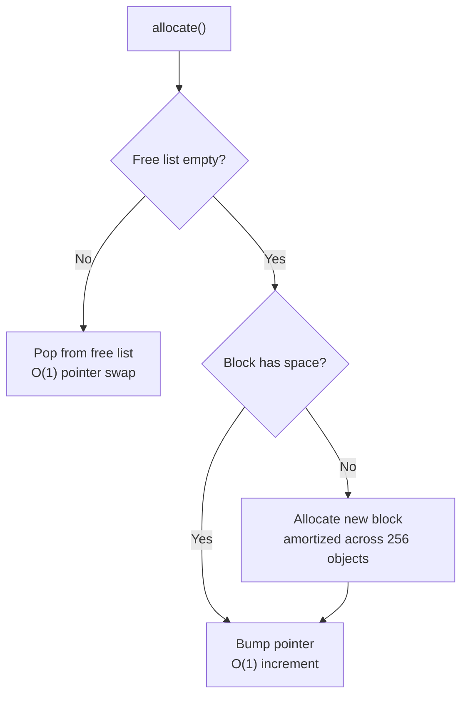

# User Manual - AllocationStrategies

*February 2026*

---

**Scope:** Complete usage guide for the three allocator policies in `AllocationStrategies.h`: `NewDeleteAllocator`, `BlockAllocator`, and `PoolAllocator`. Covers allocation mechanics, tradeoffs, choosing the right allocator, integration with policy-based containers, and troubleshooting.

**Not covered:** Thread-safe allocator wrappers (`FatPAllocationStrategies.h`); `std::pmr` polymorphic allocators; OS-level memory management (mmap, VirtualAlloc).

**Prerequisites:** C++20; basic understanding of heap allocation and why `new`/`delete` per object can be slow.

---

## User Manual Card

**Component:** AllocationStrategies
**Primary use case:** Provide interchangeable allocation policies for policy-based containers
**Integration pattern:** Pass as template parameter to containers (e.g., `StableHashMap<K, V, Hash, Eq, BlockAllocator<Node>>`)
**Key API:** `allocate(args...)`, `deallocate(ptr)` on all three allocators
**std equivalent:** None (closest: `std::pmr::monotonic_buffer_resource` for BlockAllocator behavior)
**Common mistakes:** Using PoolAllocator with non-trivially-copyable types; using BlockAllocator with T smaller than a pointer; forgetting allocators are not thread-safe
**Performance notes:** NewDelete delegates to CRT heap (per-object syscall path); BlockAllocator amortizes one heap allocation across 256 objects via bump pointer; PoolAllocator provides O(1) free-list pop with zero heap interaction after initialization

---

## Table of Contents

1. Three Allocators, One Interface
2. NewDeleteAllocator
3. BlockAllocator: How the Bump Pointer Works
4. PoolAllocator: How the Pre-Allocated Pool Works
5. Choosing the Right Allocator
6. Getting Started
7. Integration with StableHashMap
8. Use Case: High-Throughput Insertion
9. Use Case: Real-Time System with Known Capacity
10. Use Case: SIMD-Aligned Node Allocation
11. Best Practices
12. Troubleshooting
13. Known Limitations
14. API Reference
15. FAQ

---

## Three Allocators, One Interface

All three allocators provide the same interface:

```cpp
template <typename... Args>
T* allocate(Args&&... args);   // Construct and return pointer

void deallocate(T* ptr);       // Destroy and reclaim
```

This uniform interface means containers parameterized on the allocator type can switch between allocators with a single template argument change. No container code needs modification.

---

## NewDeleteAllocator

The simplest allocator. Each `allocate()` call invokes `operator new`; each `deallocate()` invokes `operator delete`. This is the recommended default.

```cpp
fat_p::NewDeleteAllocator<MyNode> alloc;
MyNode* p = alloc.allocate(arg1, arg2);  // new MyNode(arg1, arg2)
alloc.deallocate(p);                      // delete p
```

It supports over-aligned types automatically: if `alignof(T) > alignof(std::max_align_t)`, it uses C++17 aligned `new`/`delete`. This makes it safe for SIMD-aligned structs (`alignas(32)` for AVX2, `alignas(64)` for AVX-512).

### When to use

Most workloads. The OS allocator (`malloc`/`free` underneath `new`/`delete`) is heavily optimized. For containers with moderate insertion rates, the per-object allocation overhead is negligible compared to the hash computation, comparison, and cache miss costs.

---

## BlockAllocator: How the Bump Pointer Works

BlockAllocator allocates memory in large contiguous blocks (default 256 objects per block). Within a block, objects are handed out via a bump pointer---each allocation increments the pointer by `sizeof(T)`. When a block is exhausted, a new block is allocated from the heap.

Deallocation pushes the object onto a free list. Subsequent allocations check the free list first; if empty, they bump the pointer.



### Why it is fast

Two reasons. First, amortization: one heap allocation serves 256 objects, so the per-object cost of `new` is divided by 256. Second, cache locality: objects allocated consecutively in time are consecutive in memory, which the CPU prefetcher exploits.

### Constraint

`sizeof(T)` must be at least `sizeof(void*)`. The free list stores a next-pointer in the deallocated object's memory. If T is smaller than a pointer, the free list cannot fit.

---

## PoolAllocator: How the Pre-Allocated Pool Works

PoolAllocator pre-allocates a fixed array of `MaxObjects` slots at construction. Allocation pops from an internal free list; deallocation pushes back. No heap allocation occurs after construction.

```cpp
fat_p::PoolAllocator<1024>::Allocator<MyNode> alloc;
// 1024 MyNode slots pre-allocated
MyNode* p = alloc.allocate(args...);  // Pop from free list
alloc.deallocate(p);                   // Push to free list
```

### Constraints

T must be trivially copyable (the pool initializes memory with placement new and manages it via raw bytes). Maximum capacity is fixed at compile time. If you exceed capacity, `allocate()` throws `std::bad_alloc`. Check `available()` or `full()` first to avoid the exception.

### When to use

Real-time systems where heap allocation is forbidden after initialization. Workloads with a known upper bound on live objects. Embedded systems with limited heap.

---

## Choosing the Right Allocator

| Criterion | NewDelete | Block | Pool |
|---|---|---|---|
| Allocation speed | CRT heap (per-object) | Bump pointer (amortized) | Free-list pop (O(1), no heap) |
| Memory overhead | Per-object malloc header | Block granularity waste | Fixed upfront |
| Cache locality | Depends on malloc | Excellent (contiguous) | Excellent (contiguous) |
| Thread-safe | Via CRT | No | No |
| Max capacity | Unlimited | Unlimited | Fixed |
| T constraints | None | sizeof(T) >= sizeof(void*) | Trivially copyable |
| Best for | Default, moderate rates | High-throughput insert | Real-time, known capacity |

---

## Getting Started

```cpp
#include "AllocationStrategies.h"

struct Node
{
    int key;
    double value;
    Node* next;
};

// Per-object heap allocation
fat_p::NewDeleteAllocator<Node> heap_alloc;
Node* a = heap_alloc.allocate(42, 3.14, nullptr);
heap_alloc.deallocate(a);

// Block allocation (256 nodes per block)
fat_p::BlockAllocator<Node> block_alloc;
Node* b = block_alloc.allocate(42, 3.14, nullptr);
block_alloc.deallocate(b);

// Pool allocation (1024 pre-allocated)
fat_p::PoolAllocator<1024>::Allocator<Node> pool_alloc;
Node* c = pool_alloc.allocate(42, 3.14, nullptr);
pool_alloc.deallocate(c);
```

---

## Integration with StableHashMap

StableHashMap uses the allocator policy for node allocation:

```cpp
// Default: NewDeleteAllocator
fat_p::StableHashMap<std::string, int> map1;

// High-throughput: BlockAllocator
using Node = typename fat_p::StableHashMap<std::string, int>::node_type;
fat_p::StableHashMap<std::string, int, std::hash<std::string>,
    std::equal_to<std::string>, fat_p::BlockAllocator<Node>> map2;

// Real-time: PoolAllocator
fat_p::StableHashMap<std::string, int, std::hash<std::string>,
    std::equal_to<std::string>,
    fat_p::PoolAllocator<10000>::Allocator<Node>> map3;
```

---

## Use Case: High-Throughput Insertion

Inserting 10 million entries into a hash map. BlockAllocator amortizes heap allocation across 256 objects via bump pointer, replacing per-insert CRT heap calls with a single pointer increment. This yields a measurable throughput improvement for insert-heavy workloads. See `components/AllocationStrategies/results/` for current platform-specific benchmark data.

## Use Case: Real-Time System with Known Capacity

An embedded controller manages up to 256 sensors. PoolAllocator pre-allocates 256 slots. After initialization, no heap allocation occurs. Allocation and deallocation are O(1) with deterministic latency.

## Use Case: SIMD-Aligned Node Allocation

A node type requires 32-byte alignment for AVX2 loads:

```cpp
struct alignas(32) SimdNode { __m256i data; int key; };
fat_p::NewDeleteAllocator<SimdNode> alloc;  // Uses aligned new/delete
```

NewDeleteAllocator handles over-aligned types automatically.

---

## Best Practices

### Start with NewDeleteAllocator

Switch to BlockAllocator or PoolAllocator only when profiling shows allocation is a bottleneck. The OS allocator is well-tuned for general workloads.

### Use BlockAllocator for Insert-Heavy Workloads

If you insert millions of objects and rarely delete, BlockAllocator's bump-pointer allocation is fast and cache-friendly.

### Use PoolAllocator Only with Known Capacity

PoolAllocator's fixed capacity means allocation fails if exceeded. Size the pool to the worst-case live object count, not the total number of allocations.

### Do Not Share Allocators Across Threads

All three allocators are not thread-safe. For concurrent access, use `FatPAllocationStrategies.h`'s thread-safe wrappers.

---

## Troubleshooting

### Compile error: "T is too small (must be at least pointer-sized)"

BlockAllocator requires `sizeof(T) >= sizeof(void*)` for the free list. Add padding to T or use NewDeleteAllocator.

### Compile error: "T must be trivially copyable"

PoolAllocator requires trivially copyable T. Use NewDeleteAllocator or BlockAllocator for types with non-trivial constructors, destructors, or copy/move operators.

### PoolAllocator allocate() throws std::bad_alloc

The pool is exhausted. Increase `MaxObjects` or switch to BlockAllocator (unlimited capacity). Use `available()` or `full()` to check headroom before allocating.

### Memory usage grows without bound (BlockAllocator)

BlockAllocator never returns blocks to the OS. If you allocate and deallocate frequently, blocks accumulate. The free list reuses deallocated slots within blocks, but blocks themselves are freed only when the allocator is destroyed.

---

## Known Limitations

**Not thread-safe.** Requires external synchronization or thread-safe wrappers from `FatPAllocationStrategies.h`.

**BlockAllocator does not release blocks.** Memory is returned only when the allocator is destroyed.

**PoolAllocator capacity is fixed.** Cannot grow after construction.

**No realloc.** None of the allocators support in-place reallocation.

---

## API Reference

### NewDeleteAllocator<T>

| Method | Description |
|---|---|
| `allocate(args...)` | `new T(args...)` (aligned if needed) |
| `deallocate(ptr)` | `delete ptr` (aligned if needed) |

### BlockAllocator<T>

| Method | Description |
|---|---|
| `allocate(args...)` | Bump-pointer or free-list allocation |
| `deallocate(ptr)` | Push to free list |

### PoolAllocator<MaxObjects>::Allocator<T>

| Method | Description |
|---|---|
| `allocate(args...)` | Pop from pool free list; throws `std::bad_alloc` if full |
| `deallocate(ptr)` | Push to pool free list |
| `capacity()` | constexpr MaxObjects |
| `allocated()` | Current live object count |
| `available()` | Remaining free slots (`MaxObjects - allocated()`) |
| `full()` | true if the pool is fully allocated |

---

## FAQ

**Q: Which allocator does StableHashMap use by default?**

NewDeleteAllocator. Change via the allocator template parameter.

**Q: Can I mix allocators (allocate with one, deallocate with another)?**

No. Each object must be deallocated by the same allocator instance that allocated it.

**Q: Does BlockAllocator support custom block sizes?**

The default is 256 objects per block. This is currently not configurable via the public API.

---

*AllocationStrategies.h --- Fat-P Library*
