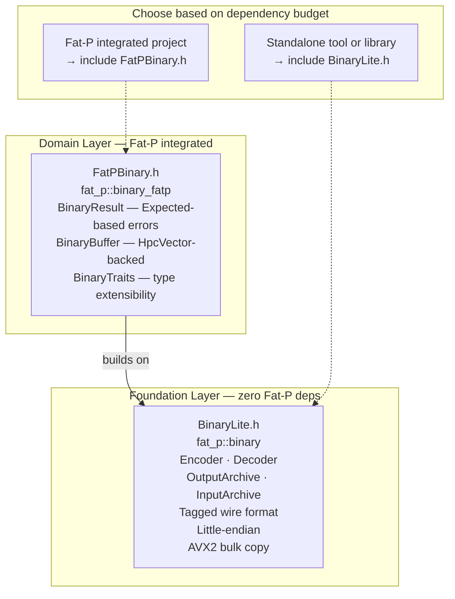

# Overview - BinarySerialization

*Fat-P Library — February 2026*

---

## Executive Summary

BinarySerialization is Fat-P's binary encoding system, split into two headers that serve different dependency budgets. BinaryLite.h (Foundation layer, zero Fat-P dependencies) provides a tagged little-endian wire format with Encoder/Decoder for buffer-based work and OutputArchive/InputArchive for stream-based intrusive serialization. FatPBinary.h (Domain layer) adds Expected-based error handling, SIMD-aligned BinaryBuffer storage, and BinaryTraits for automatic serialization of Fat-P types. The tagged format is self-describing (one type-tag byte per value), portable across endiannesses at zero runtime cost on little-endian hardware, and AVX2-accelerated for bulk payloads. For workloads where JSON parsing dominates wall-clock time or wire compactness matters, BinarySerialization replaces text formats with a 2–3× reduction in payload size and orders-of-magnitude reduction in parse cost.

---

## Overview Card

**Component:** BinarySerialization (BinaryLite + FatPBinary)
**Problem solved:** Compact, type-safe serialization of C++ values for storage, IPC, and network exchange without text-format parsing overhead
**When to use:** Internal data exchange between C++ components; checkpoint files; high-volume IPC; any path where parse time or payload size matters
**When NOT to use:** Human-readable config files (use JSON); standardized cross-system exchange (use CBOR); schema-evolving wire protocols (use Protocol Buffers); public APIs consumed by non-C++ clients (use JSON)
**Key guarantee:** All multi-byte values are stored little-endian; tagged reads detect type mismatches at decode time; all reads are bounds-checked
**std equivalent:** None. No standard binary serialization exists.
**Boost equivalent:** Boost.Serialization (heavier, supports pointer tracking, polymorphism, and versioning)
**Other alternatives:** cereal (header-only, similar archive pattern), Protocol Buffers (schema-driven, cross-language), FlatBuffers (zero-copy, schema-driven), Cap'n Proto (zero-copy, RPC integration)
**Read next:** User Manual - BinarySerialization

---

## The Problem Domain

### What Goes Wrong Without It

Binary data exchange in C++ looks deceptively simple. Write some bytes, read them back. The problems surface when the code leaves the machine it was written on—or when the next developer reads it six months later.

The first pattern that breaks is the struct dump:

```cpp
struct SensorReading {
    uint32_t id;
    double value;
    char unit[16];
};

void save(const SensorReading& r, FILE* fp) {
    fwrite(&r, sizeof(r), 1, fp);  // Works today, breaks tomorrow
}
```

This code has three latent bugs. First, struct padding is compiler-dependent—MSVC, GCC, and Clang may insert different amounts of padding between `id` and `value`, producing incompatible files from the same source code. Second, the byte order of `id` and `value` depends on the CPU architecture—a file written on x86 (little-endian) is gibberish on a big-endian system. Third, there is no type information in the output—a reader must know the exact struct layout to decode it, and any change to the struct silently corrupts all existing files.

The second pattern that breaks is hand-rolled field-by-field I/O:

```cpp
void save(const SensorReading& r, std::ostream& os) {
    os.write(reinterpret_cast<const char*>(&r.id), sizeof(r.id));
    os.write(reinterpret_cast<const char*>(&r.value), sizeof(r.value));
    os.write(r.unit, 16);
}
```

This eliminates the padding problem but retains the endianness problem and adds a maintenance burden: every struct change requires updating both the save and load functions, keeping them perfectly in sync. Miss one field and the corruption is silent.

The third approach—JSON—solves portability and type safety but introduces a different cost:

| Encoding | `double` 23.45 | `uint32_t` 1000000 | Parse model |
|----------|----------------|--------------------|----|
| JSON | `"23.45"` (5 chars + quotes + key) | `"1000000"` (7 chars + key) | Character-by-character decimal conversion |
| BinaryLite tagged | 9 bytes (1 tag + 8 IEEE 754) | 5 bytes (1 tag + 4 LE) | `memcpy` + conditional byte swap |
| BinaryLite raw | 8 bytes | 4 bytes | `memcpy` only |

For a dataset of one million doubles, JSON occupies roughly 20 MB; BinaryLite tagged occupies 9 MB; BinaryLite raw occupies 8 MB. The parsing cost difference is even more dramatic: JSON requires per-character decimal-to-binary conversion with data-dependent branches, while BinaryLite is a bounded-time `memcpy` that the CPU can prefetch.

### The Standard's Limitation

C++ has no standard serialization facility. `std::format` (C++20) formats values as text. `std::bit_cast` (C++20) reinterprets object representations but is not a serialization mechanism—it does not handle endianness, collections, or variable-length data. The Networking TS and `std::execution` address transport and scheduling, not data encoding.

Boost.Serialization exists but brings the full Boost dependency graph, supports features most projects never use (pointer tracking, polymorphic archives, class versioning), and has not had a major architectural update since its pre-C++11 design.

The gap is genuine. Every non-trivial C++ project either adopts an external serialization library or writes ad-hoc binary I/O code that accumulates the bugs described above.

---

## Architecture: Two Headers, Two Layers



**BinaryLite.h** lives in the Foundation layer. It depends only on `<cstdint>`, `<cstring>`, `<vector>`, `<string>`, `<stdexcept>`, `<istream>`, `<ostream>`, `<type_traits>`, `<bit>`, `<limits>`, and conditionally `<immintrin.h>` for AVX2. You can copy this single header into any C++20 project and use it without any other Fat-P code.

**FatPBinary.h** lives in the Domain layer. It includes `Expected.h`, `HpcVector.h`, and `BinaryLite.h`. It adds three things: `BinaryResult<T>` (which is `Expected<T, BinaryError>`) for exception-free error propagation, `BinaryBuffer` (which is `HpcVector<uint8_t, 64>`) for cache-line-aligned byte storage, and `BinaryTraits<T>` specializations for `SmallVector`, `StrongId`, `EnumPlus`, and other Fat-P types.

The wire format is identical regardless of which header produced it. Data written with BinaryLite can be read with FatPBinary and vice versa.

---

## Feature Inventory

### 1. Self-Describing Tagged Wire Format

Every value written by the Encoder is preceded by a one-byte `TypeTag` identifying the payload type. The Decoder checks the tag before every read and throws on mismatch. This catches the most common serialization bug—reading a field of the wrong type—at decode time rather than producing silent corruption.

```cpp
std::vector<uint8_t> buf;
fat_p::binary::Encoder enc(buf);
enc.writeUint32(42);
enc.writeString("hello");

fat_p::binary::Decoder dec(buf);
// dec.readString();  // throws: expected String tag, got Uint32 tag
uint32_t n = dec.readUint32();   // OK
std::string s = dec.readString(); // OK
```

Fifteen type tags cover all C++ arithmetic types (uint8 through int64, float, double, bool), strings, raw byte arrays, and collection headers (array, map). For homogeneous bulk data where the one-byte-per-value overhead matters, `writeRaw<T>()`/`readRaw<T>()` bypass tagging entirely.

### 2. Portable Little-Endian Encoding

All multi-byte values are stored little-endian on the wire, regardless of the host's native byte order. On little-endian machines (all x86, all ARM in standard configuration, RISC-V), the conversion is a compile-time no-op—`nativeToLe()` returns its argument unchanged. On big-endian machines, it calls compiler intrinsics that compile to a single `bswap` or `rev` instruction.

This means data written on any architecture can be read on any other architecture without ambiguity.

### 3. Two API Surfaces

**Buffer-based (Encoder/Decoder):** Serializes into a `std::vector<uint8_t>`. The Encoder appends tagged values; the Decoder reads them sequentially with bounds checking. This is the right choice for in-memory payloads, network messages, and any workflow where you need the byte buffer directly.

**Stream-based (OutputArchive/InputArchive):** Wraps `std::ostream`/`std::istream` with the intrusive `serialize()` pattern. Types provide a single template member function that works for both directions. This is the right choice for file I/O and for types that define their own serialization.

The two surfaces are complementary, not competing. Buffer-based gives you explicit control over each field. Stream-based gives you composable type-driven serialization.

### 4. AVX2 Bulk Copy Acceleration

When compiled with AVX2 support (`-mavx2` / `/arch:AVX2`), the `copyData()` function used by string and byte array writes processes 32 bytes per iteration using 256-bit SIMD loads and stores. For payloads in the kilobyte-to-megabyte range, this measurably outperforms scalar `memcpy` on some platforms. For small values, the function falls through to standard `memcpy`.

### 5. Intrusive Serialization

The archive classes detect whether a type is arithmetic, a `std::string`, or a user-defined type at compile time via `if constexpr`. User-defined types provide a `serialize()` member function that chains `operator&` calls:

```cpp
struct Config {
    int version;
    std::string name;
    double threshold;

    template <typename Archive>
    void serialize(Archive& ar) {
        ar & version;
        ar & name;
        ar & threshold;
    }
};
```

One function handles both save and load. The `Archive::is_loading` trait enables direction-specific logic when the two paths diverge (such as resizing a vector before loading into it).

### 6. Expected-Based Error Handling (FatPBinary)

For code that cannot or should not use exceptions, `FatPBinary.h` provides `BinaryResult<T>` (an alias for `Expected<T, BinaryError>`). Instead of throwing on type mismatch or buffer underflow, operations return either the decoded value or a `BinaryError` with a diagnostic message. This integrates cleanly with Fat-P's `Expected` monadic API for chaining fallible operations.

---

## Why Not Alternatives?

### JSON (JsonLite.h / FatPJson.h)

| Aspect | JSON | BinarySerialization |
|--------|------|---------------------|
| **Human readability** | Full (text editor) | None (hex dump) |
| **Parse speed** | Character-by-character decimal conversion | `memcpy` + conditional byte swap |
| **Payload size** | ~2–3× larger for numeric data | Compact |
| **Cross-language** | Universal | C++ only (unless format is documented) |
| **Schema flexibility** | Key-value, self-describing | Sequential, schema-less |

**Use JSON when** humans need to read the data, when non-C++ clients consume it, or when key-value access matters. **Use BinarySerialization when** compactness and parse speed dominate.

### CBOR (CborLite.h / FatPCbor.h)

| Aspect | CBOR | BinarySerialization |
|--------|------|---------------------|
| **Standardization** | IETF RFC 8949 | Fat-P internal |
| **Type system** | Rich (timestamps, bignums, tags) | C++ arithmetic + strings + bytes |
| **Cross-system** | Designed for it | Not designed for it |
| **Overhead** | Variable-length integers | Fixed-width + 1-byte tag |

**Use CBOR when** data crosses system boundaries or the rich CBOR type system matters. **Use BinarySerialization when** both endpoints are Fat-P C++ code.

### Protocol Buffers / FlatBuffers

| Aspect | Protobuf / FlatBuffers | BinarySerialization |
|--------|------------------------|---------------------|
| **Schema** | `.proto` / `.fbs` files + codegen | None |
| **Schema evolution** | Add/remove fields safely | Not supported |
| **Cross-language** | 10+ languages | C++ only |
| **Toolchain** | protoc / flatc compiler | None (header-only) |
| **Zero-copy** | FlatBuffers yes | No |

**Use Protobuf/FlatBuffers when** you need schema evolution, cross-language codegen, or zero-copy access. **Use BinarySerialization when** you want zero toolchain dependencies and both sides always match.

### Boost.Serialization

| Aspect | Boost.Serialization | BinarySerialization |
|--------|---------------------|---------------------|
| **Dependencies** | Boost (~10+ headers transitively) | None (BinaryLite) or Expected + HpcVector (FatPBinary) |
| **Pointer tracking** | Yes | No |
| **Polymorphism** | Yes (virtual dispatch) | No |
| **Class versioning** | Yes | No |
| **Archive pattern** | Identical (`operator&`) | Identical (`operator&`) |

**Use Boost when** you need pointer tracking, polymorphic serialization, or class versioning. **Use BinarySerialization when** you need the archive pattern without the Boost dependency graph.

### The Exclusionary Argument

| If You Need... | Why Not JSON | Why Not CBOR | Why Not Protobuf | Why Not Boost | BinarySerialization Advantage |
|----------------|-------------|-------------|------------------|---------------|-------------------------------|
| Minimum parse overhead | Decimal conversion | Varint decoding | Varint + field lookup | Comparable | `memcpy` + tag check |
| Zero external dependencies | STL only (JsonLite) | STL only (CborLite) | protoc toolchain | Boost headers | STL only (BinaryLite) |
| Intrusive serialization | Not native | Not native | Generated code | Same pattern | Same pattern, lighter |
| Expected-based errors | Not built in | Not built in | Not applicable | Not built in | BinaryResult<T> |

When you need **minimum-overhead binary encoding with zero toolchain dependencies and an intrusive archive pattern**, BinarySerialization is the only Fat-P option that fits all three constraints simultaneously.

---

## Performance Characteristics

| Operation | Complexity | Mechanism |
|-----------|------------|-----------|
| Write tagged primitive | O(1) | `push_back` (tag) + `insert` (value bytes) |
| Read tagged primitive | O(1) | Bounds check + tag check + `memcpy` |
| Write/read raw primitive | O(1) | `memcpy` only, no tag |
| Write string (N bytes) | O(N) | Length prefix + AVX2 bulk copy or `memcpy` |
| Byte swap (big-endian only) | O(1) | Single instruction via intrinsic |
| Archive write (arithmetic) | O(1) | `ostream::write` |

### Where BinarySerialization Wins

**Parse-dominated workloads.** When the cost of serialization is a significant fraction of total work—small messages at high frequency, large datasets where I/O bandwidth is the bottleneck—the `memcpy`-based decode path eliminates the character-by-character parsing that text formats require.

**Payload-size-sensitive paths.** Network links with bandwidth constraints, memory-mapped checkpoint files, shared-memory IPC channels—anywhere that 2–3× payload reduction translates to measurable throughput gains.

**Dependency-constrained projects.** A single header with zero external dependencies. No code generation step, no build-system integration, no version conflicts with other libraries.

### Where BinarySerialization Loses

**Human auditability.** Binary output requires a hex dump or custom tooling to inspect. JSON or YAML can be opened in any text editor.

**Schema evolution.** Adding a field to a struct breaks all existing serialized data. Protocol Buffers handle this natively with field numbers and optional semantics.

**Cross-language interop.** The format is documented in the header but has no formal specification, no reference implementation in other languages, and no tooling for non-C++ consumers.

**Pointer graphs.** Serializing a DAG of objects with shared pointers requires manual deduplication. Boost.Serialization handles this automatically.

---

## Integration Points

```
BinaryLite.h (Foundation)
    → depends on: <cstdint>, <vector>, <string>, <stdexcept>, <bit>
    → used by: FatPBinary.h, application-level serialization
    → pairs with: MemoryMappedFile.h (memory-mapped binary storage)
    → pairs with: SlidingFileWindow.h (streaming binary file reads)

FatPBinary.h (Domain)
    → depends on: BinaryLite.h, Expected.h, HpcVector.h
    → used by: application-level serialization with Fat-P types
    → pairs with: SmallVector.h, StrongId.h, EnumPlus.h (native trait support)
```

**BinaryLite + MemoryMappedFile:** Map a binary file into memory, construct a Decoder on the mapped region, and decode without any file I/O calls—the OS handles page faults.

**FatPBinary + Expected:** Chain fallible decode operations with monadic combinators instead of try-catch blocks.

---

## Final Assessment

**Permanence.** C++ has no standard binary serialization and none is proposed. The gap between "I have bytes" and "I have typed values" remains an application responsibility.

**Layering.** The two-header split means BinaryLite imposes zero dependency cost—it can be used in any C++20 project, Fat-P or not. FatPBinary adds Fat-P type integration only when you opt in.

**Tradeoffs acknowledged.** No schema evolution. No pointer tracking. No cross-language support. No human readability. These are real limitations. When they matter, use Protocol Buffers, Boost.Serialization, or JSON respectively. When they don't—internal C++ data exchange with maximum throughput and minimum ceremony—BinarySerialization is the right tool.

---

*BinaryLite.h · FatPBinary.h — Fat-P Library*
