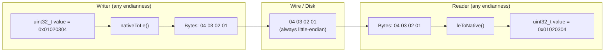
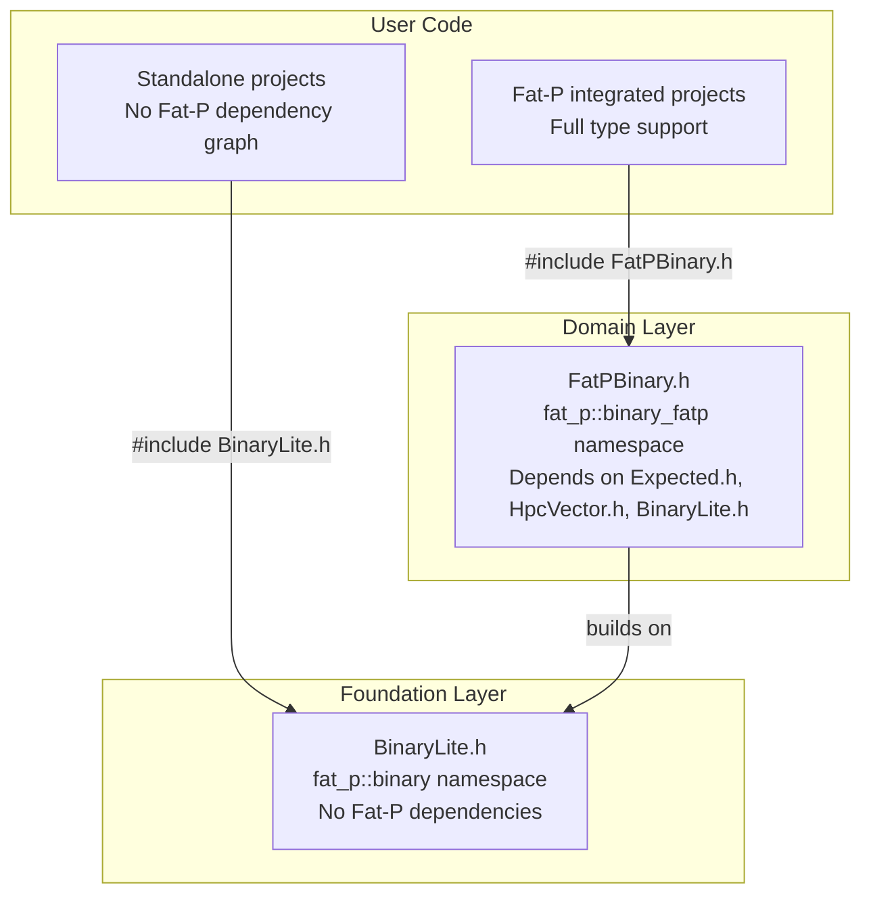
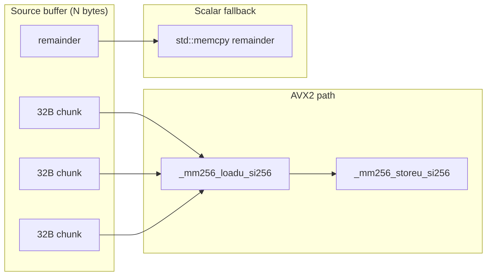

# User Manual - BinarySerialization

*February 2026*

---

**Scope:** Complete usage guide for Fat-P's binary serialization system: the standalone `BinaryLite.h` (Foundation layer) and the integrated `FatPBinary.h` (Domain layer). Covers the tagged wire format, Encoder/Decoder for buffer-based serialization, OutputArchive/InputArchive for stream-based intrusive serialization, the FatPBinary extension layer with `Expected`-based error handling, endianness handling, AVX2 acceleration, and migration from common alternatives.

**Not covered:**
- JSON serialization (`JsonLite.h`, `FatPJson.h` — separate components)
- CBOR serialization (`CborLite.h`, `FatPCbor.h` — separate components)
- Network protocol framing (Fat-P serializes data, not transport)
- Schema evolution and versioning strategies (no built-in schema version; see Known Limitations)

**Prerequisites:**
- C++20 (concepts, `std::endian`, `std::bit_cast`)
- Understanding of byte representations: what it means for an integer to occupy multiple bytes
- Familiarity with `std::vector<uint8_t>` as a byte buffer
- Basic understanding of streams (`std::istream`, `std::ostream`)

---

## User Manual Card

**Component:** BinarySerialization (BinaryLite + FatPBinary)
**Primary use case:** Serialize C++ values to a compact binary representation for storage, IPC, or network exchange
**Integration pattern:** Choose BinaryLite for standalone use or FatPBinary when working with Fat-P types; create an Encoder/Decoder pair for buffer-based work or OutputArchive/InputArchive for stream-based work
**Key API:** `Encoder`, `Decoder`, `OutputArchive`, `InputArchive`, `BinaryResult<T>`, `BinaryBuffer`
**std equivalent:** None
**Migration from std:** No standard binary serialization exists; see Migration sections
**Common mistakes:** Reading fields in different order than they were written; ignoring endianness when sharing data between platforms; exceeding string length limits without checking
**Performance notes:** AVX2-accelerated bulk copies on x86; zero-copy reads for raw byte access; tagged format adds 1 byte overhead per value

---

## Table of Contents

1. [The Serialization Problem](#the-serialization-problem)
2. [Why Binary, Not Text](#why-binary-not-text)
3. [The Endianness Question](#the-endianness-question)
4. [Architecture: Two Headers, Two Layers](#architecture-two-headers-two-layers)
5. [The Wire Format](#the-wire-format)
6. [Getting Started](#getting-started)
7. [Buffer-Based Serialization: Encoder and Decoder](#buffer-based-serialization-encoder-and-decoder)
8. [Stream-Based Serialization: Archives](#stream-based-serialization-archives)
9. [The FatPBinary Extension Layer](#the-fatpbinary-extension-layer)
10. [Endianness Deep Dive](#endianness-deep-dive)
11. [AVX2 Bulk Copy Acceleration](#avx2-bulk-copy-acceleration)
12. [Intrusive Serialization: Teaching Your Types to Serialize](#intrusive-serialization-teaching-your-types-to-serialize)
13. [Nested Structures and Collections](#nested-structures-and-collections)
14. [Thread Safety](#thread-safety)
15. [Error Handling: Two Models](#error-handling-two-models)
16. [Performance Characteristics](#performance-characteristics)
17. [When to Use BinarySerialization (and When Not To)](#when-to-use-binaryserialization-and-when-not-to)
18. [Migration from Boost.Serialization](#migration-from-boostserialization)
19. [Migration from Hand-Rolled Binary I/O](#migration-from-hand-rolled-binary-io)
20. [Migration from Protocol Buffers / FlatBuffers](#migration-from-protocol-buffers--flatbuffers)
21. [Troubleshooting](#troubleshooting)
22. [Known Limitations](#known-limitations)
23. [API Reference](#api-reference)
24. [FAQ](#faq)

---

## The Serialization Problem

Every program that communicates with the outside world eventually confronts the same problem: how do you take the values living in your process's memory and turn them into a sequence of bytes that something else can reconstruct?

This problem is older than C++. It is older than C. The earliest networked systems in the 1970s had to decide how to represent a 32-bit integer as four bytes on a wire, and two machines on opposite sides of the same Ethernet cable disagreed about which byte came first. The problem has not gotten simpler since. A modern C++ program might need to write a struct to disk, send a message to another process over a Unix domain socket, transmit a packet to a server running on a different architecture, or persist state to a memory-mapped file. Each of these scenarios requires serialization—converting structured, typed, in-memory data into an unstructured, untyped byte stream—and deserialization—the reverse.

The challenge is not the conversion itself. Writing four bytes from an `int32_t` is trivial. The challenges are portability (different machines represent the same integer differently), type safety (the reader must know what type each byte sequence represents), error handling (what happens when the stream is truncated, corrupted, or tampered with), and performance (serialization in a hot loop must not dominate the workload).

Fat-P's BinarySerialization addresses all four.

---

## Why Binary, Not Text

Fat-P also provides JSON (`JsonLite.h`) and CBOR (`CborLite.h`) serialization. The choice between text and binary formats is not a matter of preference—it is a matter of constraints.

Text formats like JSON encode the integer `1000000` as the seven ASCII characters `1`, `0`, `0`, `0`, `0`, `0`, `0`—seven bytes plus delimiters. BinaryLite encodes the same value as four bytes (a little-endian `uint32_t`) plus one type tag byte—five bytes total. For floating-point values the difference is more dramatic: JSON must convert a `double` to a decimal string (up to 24 characters for full precision via `%.17g`), while BinaryLite writes the IEEE 754 representation directly in eight bytes plus one tag byte.

The compactness advantage compounds. A dataset of one million `double` values occupies roughly 20 MB in JSON (including delimiters) versus 9 MB in BinaryLite's tagged format, or 8 MB untagged. In HPC workloads where datasets routinely reach gigabytes, this 2× difference in I/O volume translates directly to wall-clock time.

The parsing advantage is even more significant. Converting the ASCII string `"1000000"` back to an integer requires iterating over each character, multiplying an accumulator by 10, and adding the digit value—a loop with data-dependent branches. Reading a little-endian `uint32_t` is a `memcpy` of four bytes followed by a conditional byte swap—branchless on little-endian machines (which is every x86 and ARM processor shipped in the last two decades).

The tradeoff is human readability. A JSON file can be opened in a text editor and inspected. A binary file cannot. For configuration files, API responses consumed by web browsers, or data that humans need to audit, JSON is the correct choice. For internal data exchange between components of the same system, checkpoint files, high-volume IPC, and any path where parse time matters, binary is the correct choice.

---

## The Endianness Question

If you have never worked on a big-endian machine, you might wonder why endianness matters at all. The answer is that it still matters, even in 2026, for three reasons.

First, network byte order is big-endian. The Internet protocols (TCP, UDP, IP) specify big-endian representation for multi-byte fields in headers. Any code that touches raw packet data—packet sniffers, protocol implementations, kernel bypass libraries—must convert between host order and network order. This is why `htonl()` and `ntohl()` exist in the POSIX API.

Second, some embedded and mainframe architectures remain big-endian. IBM z/Architecture (the mainframe family), some MIPS configurations, and legacy PowerPC systems (used in automotive ECUs and aerospace) are big-endian. If your serialized data might ever be read by such a system, endianness matters.

Third, and most subtly, assuming endianness is a portability bug that compilers cannot catch. Code that works on x86 by accident—because `memcpy` from a `uint32_t` happens to produce little-endian bytes on a little-endian machine—silently produces garbage on a big-endian machine. The bug lies dormant until someone cross-compiles.

BinaryLite standardizes on **little-endian** wire format. This is a deliberate choice: the overwhelming majority of modern CPUs (all x86, all ARM in little-endian mode, RISC-V) are little-endian. On these machines, the byte swap is a no-op—the compiler elides the conversion entirely. On the rare big-endian machine, the library uses compiler intrinsics (`__builtin_bswap32` on GCC/Clang, `_byteswap_ulong` on MSVC) which compile to single instructions.



On a little-endian machine, `nativeToLe()` and `leToNative()` both return their argument unchanged. On a big-endian machine, they byte-swap. The wire always contains the same bytes regardless of the writer's architecture.

---

## Architecture: Two Headers, Two Layers

Fat-P's binary serialization is split across two headers that serve different audiences:



**BinaryLite.h** lives in the Foundation layer. It depends only on the standard library. It provides the `Encoder`, `Decoder`, `OutputArchive`, and `InputArchive` classes. If you are writing a small utility, a standalone tool, or anything that should not pull in the Fat-P dependency graph, use BinaryLite.h directly.

**FatPBinary.h** lives in the Domain layer. It depends on `Expected.h` (for `BinaryResult<T>` error handling), `HpcVector.h` (for SIMD-aligned `BinaryBuffer`), and BinaryLite.h itself. It adds `BinaryResult<T>` (which is `Expected<T, BinaryError>`) for explicit error propagation without exceptions, `BinaryBuffer` (which is `HpcVector<uint8_t, 64>`) for cache-line-aligned byte storage, and `BinaryTraits<T>` for extensible type serialization of Fat-P types like `SmallVector`, `StrongId`, and `EnumPlus`.

The wire format is identical regardless of which header you use. Data written with BinaryLite can be read with FatPBinary and vice versa. The difference is in the error handling model and the set of types that can be serialized without manual effort.

---

## The Wire Format

BinaryLite uses a **self-describing tagged format**. Every value written to the buffer is preceded by a one-byte type tag that identifies what follows:

| Tag | Value | Payload | Total bytes (typical) |
|-----|-------|---------|----------------------|
| `Uint8` | 0 | 1 byte | 2 |
| `Uint16` | 1 | 2 bytes LE | 3 |
| `Uint32` | 2 | 4 bytes LE | 5 |
| `Uint64` | 3 | 8 bytes LE | 9 |
| `Int8` | 4 | 1 byte | 2 |
| `Int16` | 5 | 2 bytes LE | 3 |
| `Int32` | 6 | 4 bytes LE | 5 |
| `Int64` | 7 | 8 bytes LE | 9 |
| `Float32` | 8 | 4 bytes LE (IEEE 754) | 5 |
| `Float64` | 9 | 8 bytes LE (IEEE 754) | 9 |
| `Bool` | 10 | 1 byte (0 or 1) | 2 |
| `String` | 11 | 8-byte LE length + UTF-8 bytes | 9 + N |
| `Bytes` | 12 | 8-byte LE length + raw bytes | 9 + N |
| `Array` | 13 | 8-byte LE element count | 9 (header only) |
| `Map` | 14 | 8-byte LE entry count | 9 (header only) |

The tag byte makes the format self-describing: a decoder can walk an unknown payload and identify each value's type without any external schema. The `Decoder::peekType()` method reads the next tag without consuming it, enabling type-dispatching logic.

The one-byte-per-value overhead is the cost of type safety. For workloads where every byte matters (millions of identical `float` values in a tight array), the `writeRaw<T>()` and `readRaw<T>()` methods bypass tagging entirely—the caller takes responsibility for knowing the type at read time.

Strings and byte arrays use a fixed 8-byte (`uint64_t`) length prefix. This is deliberately oversized for most strings, but it means the format can represent payloads up to 16 exabytes without a variable-length encoding scheme. The simplicity outweighs the 4-byte waste compared to a varint encoding.

Array and Map tags write only a count header. The caller is responsible for writing the actual elements. This keeps the format flat—there are no nested framing bytes to match or escape.

---

## Getting Started

### Prerequisites and Integration

BinaryLite requires C++20. It depends only on the standard library.

```cpp
#include "BinaryLite.h"
```

For Fat-P integrated projects with `Expected`-based error handling:

```cpp
#include "FatPBinary.h"
```

Compile with C++20 support:

```bash
# GCC
g++ -std=c++20 -O2 my_program.cpp

# Clang
clang++ -std=c++20 -O2 my_program.cpp

# MSVC
cl /std:c++20 /O2 my_program.cpp
```

To enable AVX2-accelerated bulk copies (x86 only):

```bash
g++ -std=c++20 -O2 -mavx2 my_program.cpp
```

### Your First Serialization

```cpp
#include "BinaryLite.h"
#include <iostream>

int main()
{
    // Encode
    std::vector<std::uint8_t> buffer;
    fat_p::binary::Encoder encoder(buffer);

    encoder.writeString("sensor-7");
    encoder.writeDouble(23.45);
    encoder.writeUint32(1000);
    encoder.writeBool(true);

    std::cout << "Serialized " << buffer.size() << " bytes\n";

    // Decode (same order!)
    fat_p::binary::Decoder decoder(buffer);

    std::string name = decoder.readString();
    double temperature = decoder.readDouble();
    std::uint32_t sampleCount = decoder.readUint32();
    bool isCalibrated = decoder.readBool();

    std::cout << name << ": " << temperature << "C, "
              << sampleCount << " samples, "
              << (isCalibrated ? "calibrated" : "uncalibrated") << "\n";
}
```

The Encoder writes values sequentially into a `std::vector<uint8_t>`. The Decoder reads them back in the same order. The order matters—BinaryLite is not a random-access format. Reading a `uint32_t` where a `string` was written throws `std::runtime_error` with a type mismatch message, because the tag byte won't match.

---

## Buffer-Based Serialization: Encoder and Decoder

### The Encoder

The `Encoder` holds a non-owning reference to a `std::vector<uint8_t>` and appends tagged values to it. The buffer grows automatically via `push_back` and `insert`.

```cpp
std::vector<std::uint8_t> buffer;
fat_p::binary::Encoder enc(buffer);

// Primitives
enc.writeUint8(42);
enc.writeInt64(-1'000'000);
enc.writeFloat(3.14f);
enc.writeDouble(2.718281828);
enc.writeBool(false);

// Variable-length
enc.writeString("hello world");
enc.writeBytes(rawData.data(), rawData.size());

// Collections (header only—caller writes elements)
enc.beginArray(3);
enc.writeUint32(10);
enc.writeUint32(20);
enc.writeUint32(30);
```

The Encoder does not flush, close, or finalize. The buffer is usable immediately after each write call. You can interleave Encoder writes with direct buffer manipulation if needed—though doing so while a Decoder is reading from the same buffer is undefined behavior.

### The Decoder

The `Decoder` takes a pointer and size (or a `const std::vector<uint8_t>&`) and reads tagged values sequentially. It maintains an internal position that advances with each read.

```cpp
fat_p::binary::Decoder dec(buffer);

while (!dec.eof())
{
    fat_p::binary::TypeTag tag = dec.peekType();
    switch (tag)
    {
    case fat_p::binary::TypeTag::Uint32:
        std::cout << "uint32: " << dec.readUint32() << "\n";
        break;
    case fat_p::binary::TypeTag::String:
        std::cout << "string: " << dec.readString() << "\n";
        break;
    // ... handle other types
    default:
        throw std::runtime_error("unexpected tag");
    }
}
```

`peekType()` reads the tag byte without consuming it. The subsequent `readXxx()` call consumes the tag and the payload. If the tag doesn't match the expected type, a `std::runtime_error` is thrown with a descriptive message.

The Decoder validates bounds on every read. Requesting a `uint32_t` when fewer than 5 bytes remain (1 tag + 4 payload) throws `std::runtime_error("Binary: buffer underflow")`. String and byte array reads validate the decoded length against `std::numeric_limits<size_t>::max()` to prevent allocation bombs on corrupted data.

### Untagged (Raw) Mode

For maximum throughput in controlled environments—where both sides agree on the schema and type safety is enforced at a higher level—the `writeRaw<T>()` and `readRaw<T>()` methods skip the tag byte entirely:

```cpp
// Writer: no type tags, just raw little-endian values
fat_p::binary::Encoder enc(buffer);
for (std::size_t i = 0; i < 1'000'000; ++i)
{
    enc.writeRaw<float>(samples[i]);
}

// Reader: must know it's 1,000,000 floats
fat_p::binary::Decoder dec(buffer);
for (std::size_t i = 0; i < 1'000'000; ++i)
{
    samples[i] = dec.readRaw<float>();
}
```

Raw mode saves one byte per value (the tag). For a million `float` values, that is 1 MB of I/O saved. The tradeoff is that a mismatch between writer and reader types produces silent corruption rather than a runtime error.

---

## Stream-Based Serialization: Archives

Buffer-based serialization works when you can accumulate the entire payload in memory. For writing directly to files, sockets, or pipes—where the data may be too large to buffer or where streaming is natural—BinaryLite provides `OutputArchive` and `InputArchive`.

### OutputArchive

`OutputArchive` wraps a `std::ostream`. It writes values using the `operator&` and `operator<<` syntax:

```cpp
#include "BinaryLite.h"
#include <fstream>

std::ofstream file("data.bin", std::ios::binary);
fat_p::binary::OutputArchive archive(file);

int count = 42;
double temperature = 23.5;
std::string label = "sensor-7";

archive & count;
archive & temperature;
archive & label;
```

Unlike the Encoder, the archive writes **untagged** values—no type tag byte. Arithmetic types and enums are written as raw bytes in native endianness. Strings are written as a `size_t` length prefix followed by the character data.

The archive format is deliberately simpler than the tagged Encoder/Decoder format. It is designed for intrusive serialization (see below), where the type information is encoded in the code structure rather than the wire format.

### InputArchive

`InputArchive` wraps a `std::istream` with the same operator syntax:

```cpp
std::ifstream file("data.bin", std::ios::binary);
fat_p::binary::InputArchive archive(file);

int count;
double temperature;
std::string label;

archive & count;
archive & temperature;
archive & label;
```

String reads are bounded by `kMaxStringLength` (16 MB by default) to prevent allocation bombs from corrupted data.

### Archive Direction Detection

The archives expose a `is_loading` type alias for templates that need to behave differently during serialization vs. deserialization:

```cpp
template <typename Archive>
void serialize(Archive& ar)
{
    if constexpr (Archive::is_loading::value)
    {
        // deserialization-specific logic
    }
    else
    {
        // serialization-specific logic
    }
}
```

This pattern enables a single `serialize()` function to handle both directions, which is the foundation of intrusive serialization.

---

## The FatPBinary Extension Layer

`FatPBinary.h` builds on BinaryLite to provide three things that standalone users don't need but Fat-P integrated projects want.

### BinaryResult: Exception-Free Error Handling

BinaryLite reports errors by throwing `std::runtime_error`. This is appropriate for many applications, but exception-based error handling has costs: stack unwinding is slow, exceptions cannot cross `noexcept` boundaries, and some embedded and real-time environments disable exceptions entirely.

`FatPBinary.h` provides `BinaryResult<T>`, which is an alias for `fat_p::Expected<T, BinaryError>`. Instead of throwing, operations return either the value or an error:

```cpp
fat_p::binary_fatp::BinaryResult<std::string> result = readStringResult(decoder);

if (result.hasValue())
{
    std::cout << result.value() << "\n";
}
else
{
    std::cerr << "decode failed: " << result.error().message << "\n";
}
```

### BinaryBuffer: SIMD-Aligned Storage

`BinaryBuffer` is an alias for `fat_p::HpcVector<uint8_t, 64>`—a byte vector aligned to 64-byte cache line boundaries. On platforms with AVX-512 (which operates on 64-byte vectors), this alignment enables the CPU to load and store full vector widths without crossing cache line boundaries. Even on AVX2 systems (32-byte vectors), 64-byte alignment guarantees that two consecutive AVX2 loads never straddle a cache line.

### BinaryTraits: Extensible Type Support

`BinaryTraits<T>` is a customization point for teaching FatPBinary how to serialize new types. Fat-P ships with traits for `Expected<T, E>`, `SmallVector<T, N>`, `StrongId<Tag, Rep>`, and `EnumPlus` types. You can add your own by specializing the trait:

```cpp
template <>
struct fat_p::binary_fatp::BinaryTraits<MyType>
{
    static void encode(fat_p::binary::Encoder& enc, const MyType& value)
    {
        enc.writeUint32(value.id);
        enc.writeString(value.name);
    }

    static MyType decode(fat_p::binary::Decoder& dec)
    {
        auto id = dec.readUint32();
        auto name = dec.readString();
        return MyType{id, std::move(name)};
    }
};
```

---

## Endianness Deep Dive

BinaryLite's endianness handling lives entirely in the `fat_p::binary::detail` namespace. Understanding it is not required for normal use, but it explains why the library is portable without runtime cost on common hardware.

C++20 introduced `std::endian`, a scoped enum that reports the platform's native byte order at compile time. BinaryLite uses it to define two `constexpr bool` values:

```cpp
inline constexpr bool kIsLittleEndian = (std::endian::native == std::endian::little);
inline constexpr bool kIsBigEndian    = (std::endian::native == std::endian::big);
```

The `nativeToLe()` and `leToNative()` functions check `kIsBigEndian` and call `byteSwap()` only when necessary. Because `kIsBigEndian` is `constexpr`, the compiler evaluates the branch at compile time. On x86 and ARM (little-endian), the entire function body reduces to `return v;`—zero instructions beyond the function call, which is itself inlined.

The `byteSwap()` overloads use compiler intrinsics on GCC, Clang, and MSVC. These compile to single instructions on all three compilers: `bswap` on x86, `rev` on ARM. The generic fallback (manual shift-and-mask) exists for exotic compilers but is never reached on any mainstream platform.

Float and double byte-swapping uses `std::memcpy` for type punning rather than `reinterpret_cast`. This is the only portable way to reinterpret float bits as integer bits in C++—`reinterpret_cast` violates strict aliasing rules and is undefined behavior. `std::memcpy` is recognized by all modern compilers as a type-pun idiom and optimized to a register move or no-op.

---

## AVX2 Bulk Copy Acceleration

When compiled with `-mavx2` (or `/arch:AVX2` on MSVC), the `copyData()` function used by `writeString()`, `writeBytes()`, and `writeRawBytes()` uses AVX2 256-bit loads and stores for bulk copies:



The loop processes 32 bytes per iteration using unaligned loads (`loadu`) and stores (`storeu`). The remaining bytes (0–31) are copied with `std::memcpy`. For payloads under 32 bytes, the AVX2 loop executes zero iterations and the entire copy falls through to `memcpy`.

This optimization matters most for large string and byte array payloads (kilobytes to megabytes). For small values—individual integers, short strings—the overhead of the function call dominates and AVX2 provides no measurable benefit.

When AVX2 is not available (ARM, older x86, or compiled without `-mavx2`), `copyData()` falls back to `buffer.insert(buffer.end(), src, src + len)`, which the standard library typically implements with `memcpy` internally.

---

## Intrusive Serialization: Teaching Your Types to Serialize

The archive classes (`OutputArchive` and `InputArchive`) support **intrusive serialization**: your type provides a `serialize()` member function, and the archive calls it automatically. This is the same pattern used by Boost.Serialization and cereal.

```cpp
struct SensorReading
{
    std::uint32_t sensorId;
    double value;
    std::string unit;

    template <typename Archive>
    void serialize(Archive& ar)
    {
        ar & sensorId;
        ar & value;
        ar & unit;
    }
};
```

The `serialize()` function works for both writing and reading because `operator&` is overloaded on both `OutputArchive` and `InputArchive`. The `Archive::is_loading` trait enables direction-specific logic when needed.

To use it:

```cpp
// Write
SensorReading reading{7, 23.45, "celsius"};
std::ofstream out("reading.bin", std::ios::binary);
fat_p::binary::OutputArchive outAr(out);
outAr & reading;

// Read
SensorReading loaded;
std::ifstream in("reading.bin", std::ios::binary);
fat_p::binary::InputArchive inAr(in);
inAr & loaded;
```

The archive detects whether a type is arithmetic, an enum, a `std::string`, or a user type at compile time using `if constexpr`. Arithmetic types and enums are written as raw bytes. Strings get a length prefix. Everything else calls `value.serialize(archive)`.

---

## Nested Structures and Collections

Intrusive serialization composes naturally. A type that contains other serializable types just chains the `operator&` calls:

```cpp
struct Experiment
{
    std::string name;
    std::vector<SensorReading> readings;

    template <typename Archive>
    void serialize(Archive& ar)
    {
        ar & name;

        if constexpr (Archive::is_loading::value)
        {
            std::size_t count;
            ar & count;
            readings.resize(count);
            for (auto& r : readings)
            {
                ar & r;
            }
        }
        else
        {
            std::size_t count = readings.size();
            ar & count;
            for (auto& r : readings)
            {
                ar & r;
            }
        }
    }
};
```

The vector serialization requires direction-aware logic: on write, iterate and serialize each element; on read, read the count first, resize, then deserialize into each element. This is the one place where intrusive serialization requires more thought than calling `writeArray()` on the Encoder.

For the buffer-based Encoder/Decoder, collections use the `beginArray()`/`readArrayLength()` pattern:

```cpp
// Encode
enc.beginArray(readings.size());
for (const auto& r : readings)
{
    enc.writeUint32(r.sensorId);
    enc.writeDouble(r.value);
    enc.writeString(r.unit);
}

// Decode
std::size_t count = dec.readArrayLength();
for (std::size_t i = 0; i < count; ++i)
{
    SensorReading r;
    r.sensorId = dec.readUint32();
    r.value = dec.readDouble();
    r.unit = dec.readString();
    readings.push_back(std::move(r));
}
```

---

## Thread Safety

**Encoder and Decoder are NOT thread-safe.** Each instance must be used by a single thread. This is inherent to the design: both maintain internal mutable state (the buffer for Encoder, the read position for Decoder) with no synchronization.

**Multiple Encoder instances writing to separate buffers is safe.** There is no shared state between Encoder instances.

**Multiple Decoder instances reading from the same buffer is safe** as long as the buffer is not modified during reading. The Decoder holds a `const` pointer to the data.

**OutputArchive and InputArchive inherit the thread-safety of the underlying stream.** If the `std::ostream` or `std::istream` is not thread-safe (and standard streams are not), the archive is not thread-safe.

For parallel serialization, the recommended pattern is to serialize into per-thread buffers and concatenate:

```cpp
std::vector<std::vector<std::uint8_t>> perThreadBuffers(numThreads);

// Each thread writes to its own buffer
pool.submit([&, threadId]()
{
    fat_p::binary::Encoder enc(perThreadBuffers[threadId]);
    // ... serialize this thread's data
});

pool.wait_idle();

// Concatenate (single thread)
std::vector<std::uint8_t> combined;
for (const auto& buf : perThreadBuffers)
{
    combined.insert(combined.end(), buf.begin(), buf.end());
}
```

---

## Error Handling: Two Models

BinaryLite and FatPBinary offer two error handling strategies for different project requirements:

| Condition | BinaryLite (Encoder/Decoder) | FatPBinary (BinaryResult) |
|-----------|------------------------------|---------------------------|
| Buffer underflow | throws `std::runtime_error` | Returns `BinaryResult` with `BinaryError` |
| Type tag mismatch | throws `std::runtime_error` | Returns `BinaryResult` with `BinaryError` |
| String length exceeds platform limits | throws `std::runtime_error` | Returns `BinaryResult` with `BinaryError` |
| Stream I/O failure (archives) | throws `std::runtime_error` | N/A (archives use exception model) |

The exception model (BinaryLite) is simpler for code that already uses exceptions. The `Expected` model (FatPBinary) is appropriate for `noexcept` code paths, embedded systems, or projects that want explicit error propagation.

Both models validate all reads against buffer bounds. Neither model performs validation on writes—writing to a `std::vector` cannot fail in a way that BinaryLite can detect (out-of-memory is handled by the allocator's exception).

---

## Performance Characteristics

| Operation | Cost | Notes |
|-----------|------|-------|
| Write tagged primitive | ~5-20 ns | `push_back` for tag + `memcpy` for value |
| Read tagged primitive | ~5-15 ns | Bounds check + tag check + `memcpy` |
| Write raw primitive | ~3-10 ns | `memcpy` only, no tag |
| Write string (N bytes) | ~10 ns + N/32 ns (AVX2) | Length prefix + bulk copy |
| Byte swap (when needed) | ~1 ns | Single instruction via intrinsic |
| Archive write (arithmetic) | ~10-30 ns | Stream write, no tag |
| Archive write (string) | ~20 ns + stream cost | Length prefix + character data |

These are order-of-magnitude estimates. Actual performance depends on buffer locality (hot cache vs. cold), string lengths, and whether the compiler inlines the Encoder methods (it should, at `-O2`).

---

## When to Use BinarySerialization (and When Not To)

**Use BinarySerialization when:**
- Both writer and reader are C++ (or can parse the format)
- Compactness matters (HPC datasets, high-frequency IPC)
- Parse speed matters (real-time systems, hot loops)
- The data is internal to your system (not a public API)

**Use JSON (`JsonLite.h`) instead when:**
- Data must be human-readable or editable
- Data crosses language boundaries (JavaScript, Python)
- Data is a public API contract
- Schema flexibility matters more than compactness

**Use CBOR (`CborLite.h`) instead when:**
- You need a standardized binary format (RFC 8949)
- Data crosses system boundaries with non-Fat-P readers
- You need the CBOR type system (timestamps, bignum, tags)

**Use Protocol Buffers or FlatBuffers instead when:**
- You need schema evolution (adding/removing fields across versions)
- You need cross-language code generation
- You need zero-copy deserialization (FlatBuffers)

---

## Migration from Boost.Serialization

Boost.Serialization uses the same intrusive `serialize()` pattern. The migration is mostly mechanical:

| Boost | Fat-P BinaryLite |
|-------|------------------|
| `#include <boost/archive/binary_oarchive.hpp>` | `#include "BinaryLite.h"` |
| `boost::archive::binary_oarchive` | `fat_p::binary::OutputArchive` |
| `boost::archive::binary_iarchive` | `fat_p::binary::InputArchive` |
| `ar & boost::serialization::make_nvp("x", x)` | `ar & x` (no named values) |
| `BOOST_SERIALIZATION_SPLIT_MEMBER()` | `if constexpr (Archive::is_loading::value)` |
| `ar & BOOST_SERIALIZATION_NVP(x)` | `ar & x` |
| Version tracking (`ar.library_version()`) | Not supported (see Known Limitations) |

BinaryLite does not support Boost's class versioning, pointer tracking, or polymorphic serialization. If you rely on these features, BinaryLite is not a drop-in replacement—you will need to handle versioning and polymorphism manually.

The archive format is **not compatible**. Data written with Boost cannot be read with BinaryLite and vice versa. Migration requires re-serializing all persisted data.

---

## Migration from Hand-Rolled Binary I/O

If you are currently writing binary data with raw `fwrite()`/`fread()` or `ostream::write()`/`istream::read()`, the migration addresses three common problems with hand-rolled approaches.

**Problem 1: Endianness.** Hand-rolled code often writes structs with `fwrite(&myStruct, sizeof(myStruct), 1, fp)`. This works on the machine that wrote it but produces garbage on a machine with different byte order—or even on the same machine if a compiler update changes struct padding.

**Problem 2: No bounds checking.** `fread` reports how many bytes it read, but most hand-rolled code ignores the return value. BinaryLite's Decoder validates every read against the buffer size.

**Problem 3: No type checking.** Reading a `float` where a `uint32_t` was written produces nonsense. Tagged mode catches this at decode time.

The migration path: replace `fwrite`/`fread` calls with Encoder/Decoder calls, field by field. Do not try to serialize entire structs at once—struct layout is compiler-dependent and not portable.

---

## Migration from Protocol Buffers / FlatBuffers

Protocol Buffers and FlatBuffers are schema-driven: you define a `.proto` or `.fbs` file, run a code generator, and get serialization code in your target language. BinaryLite is schema-less: the wire format is defined by the code that writes it.

The tradeoff is flexibility vs. ceremony. BinaryLite has no code generation step, no external tooling dependency, and no schema files to keep in sync. But it also has no schema evolution—if you add a field, old readers cannot skip it, and old data cannot be read by new code without manual migration logic.

If your project requires schema evolution across deployed versions, stay with Protocol Buffers. If your writer and reader are always the same version (internal tools, single-binary applications, test fixtures), BinaryLite eliminates the protobuf toolchain dependency.

---

## Troubleshooting

### "Binary: type mismatch, expected X got Y"

The Decoder encountered a type tag that doesn't match the `readXxx()` call. The most common cause is reading fields in a different order than they were written.

Verify that every `readXxx()` call matches the corresponding `writeXxx()` call in exact order. BinaryLite is strictly sequential—there is no way to skip a field or read out of order in tagged mode.

### "Binary: buffer underflow"

The Decoder ran out of data before completing a read. This means either the buffer was truncated (incomplete network receive, partial file read) or the reader is attempting more reads than the writer performed.

Check `decoder.remaining()` before reads if the payload size is uncertain. For network protocols, ensure the entire message is received before decoding.

### "Binary: string length exceeds platform limits"

A decoded string or byte array has a length field larger than `std::numeric_limits<size_t>::max()`. On 32-bit platforms, this triggers for any length over 4 GB. On 64-bit platforms, this is likely corrupted data.

### "Binary: output/input stream not in good state"

An archive was constructed with a stream that has already failed. Verify the file was opened successfully (`file.is_open()`) before constructing the archive.

### Data corruption after platform change

If data was written with hand-rolled code (raw `memcpy` of structs) before migrating to BinaryLite, the old data uses native endianness and native struct padding. BinaryLite uses little-endian with no padding. You must write a one-time migration tool that reads the old format and re-serializes with BinaryLite.

---

## Known Limitations

**No schema evolution.** There is no mechanism for adding, removing, or reordering fields between versions. The writer and reader must agree on the exact field sequence. For applications that need versioning, add an explicit version number as the first field and branch on it during deserialization.

**No pointer tracking.** Shared pointers to the same object are serialized independently—each produces a separate copy in the output. Boost.Serialization tracks pointers and restores sharing; BinaryLite does not.

**No polymorphic serialization.** Archives do not handle virtual dispatch. If you have a `Base*` that might point to `Derived1` or `Derived2`, you must serialize a type discriminator and dispatch manually.

**Archive format is not portable.** The `OutputArchive`/`InputArchive` write arithmetic types in native endianness (not little-endian). Data written on a big-endian machine cannot be read on a little-endian machine via archives. The buffer-based Encoder/Decoder is portable. If portability matters, use Encoder/Decoder.

**No random access.** Both Encoder/Decoder and archives are strictly sequential. There is no way to seek to a specific field without reading all preceding fields.

---

## API Reference

### `fat_p::binary` Namespace (BinaryLite.h)

**Types:**
- `TypeTag` — Enum of wire format type tags (Uint8, Uint16, ..., Map)
- `Encoder` — Tagged buffer-based serializer
- `Decoder` — Tagged buffer-based deserializer
- `OutputArchive` — Untagged stream-based serializer (intrusive)
- `InputArchive` — Untagged stream-based deserializer (intrusive)

**Free functions:**
- `writeLe<T>(buffer, value)` — Write little-endian value to buffer
- `readLe<T>(data, pos, size)` — Read little-endian value from buffer
- `copyData(buffer, src, len)` — Bulk copy with optional AVX2 acceleration
- `ensureAvailable(size, pos, required)` — Bounds check; throws on underflow
- `safeToSizeT(value, context)` — Safe `uint64_t` to `size_t` conversion

### `fat_p::binary_fatp` Namespace (FatPBinary.h)

**Types:**
- `BinaryError` — Error type with message string
- `BinaryResult<T>` — Alias for `Expected<T, BinaryError>`
- `BinaryBuffer` — Alias for `HpcVector<uint8_t, 64>`
- `BinaryTraits<T>` — Customization point for type serialization

---

## FAQ

**Q: Should I use Encoder/Decoder or OutputArchive/InputArchive?**

Use Encoder/Decoder when you want tagged format, portability across endiannesses, and explicit control over each field. Use archives when you want intrusive serialization (single `serialize()` function per type) and are writing to streams.

**Q: Can I mix tagged and untagged values in the same buffer?**

Yes. Use `writeUint32()` for tagged values and `writeRaw<uint32_t>()` for untagged values in the same Encoder. The Decoder must know which fields are tagged and which are raw—there is no in-band indication.

**Q: Is the wire format stable across Fat-P versions?**

The tagged format (TypeTag values, little-endian encoding, length prefix sizes) is stable. The archive format (native endianness, `size_t` length prefix) depends on the platform and may differ between 32-bit and 64-bit builds.

**Q: How do I handle optional fields?**

Write a `bool` tag before the optional value. On read, check the `bool` and skip or read the value accordingly. There is no built-in optional representation.

**Q: What is the maximum serializable string size?**

The length field is `uint64_t`, so the wire format supports strings up to 2^64 bytes. In practice, `InputArchive` limits strings to 16 MB (`kMaxStringLength`) to prevent allocation bombs. The Decoder does not impose a limit but validates against `size_t` overflow.

---

*Fat-P BinarySerialization User Manual — February 2026*
