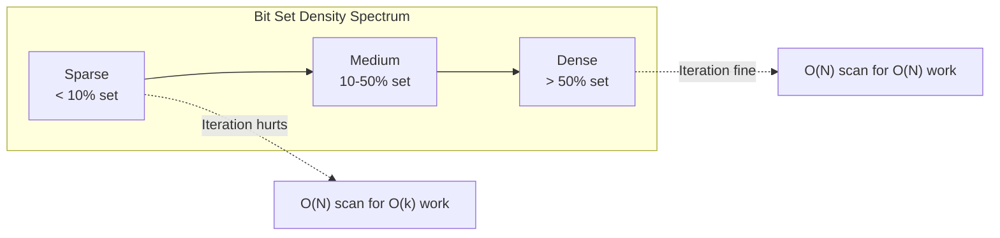
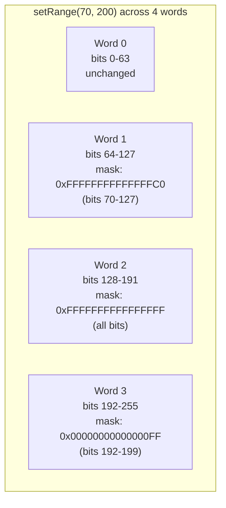
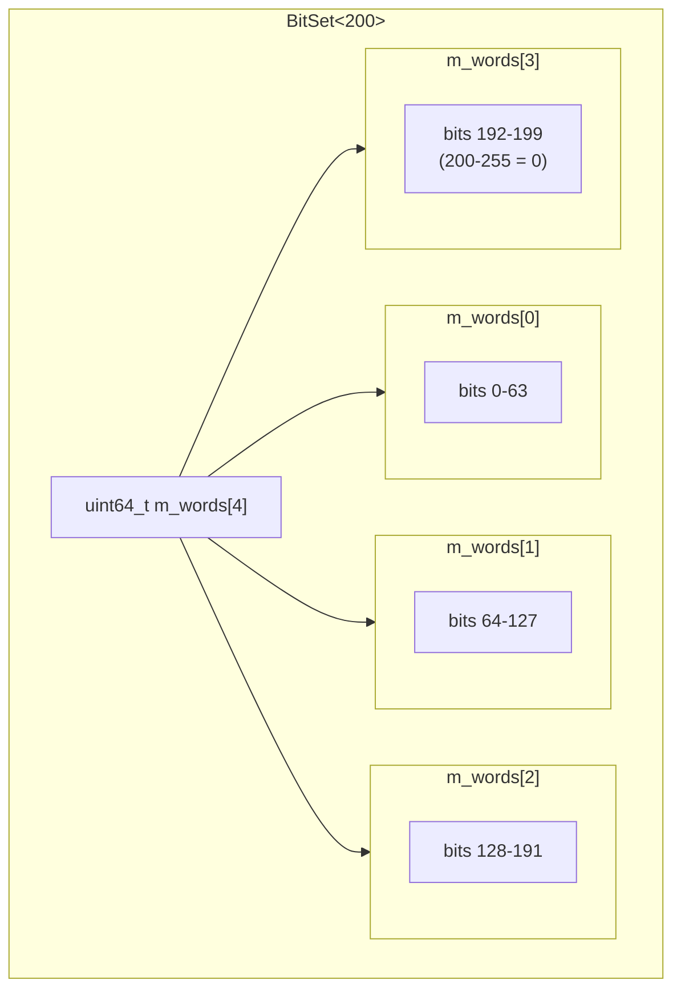
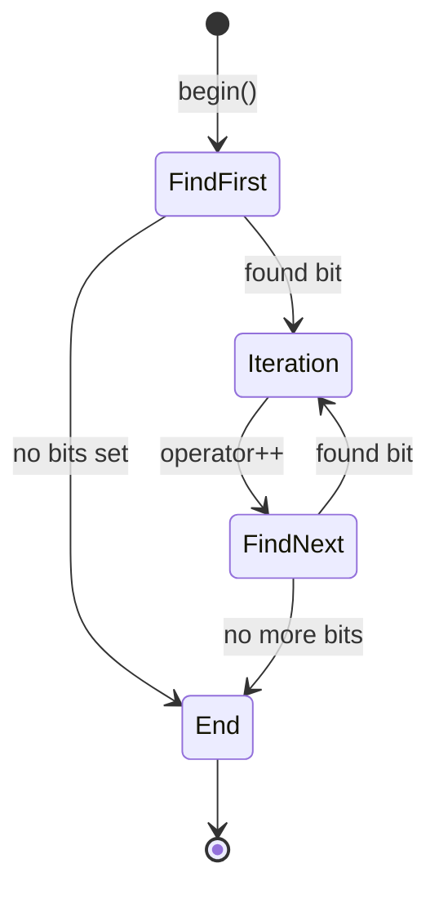
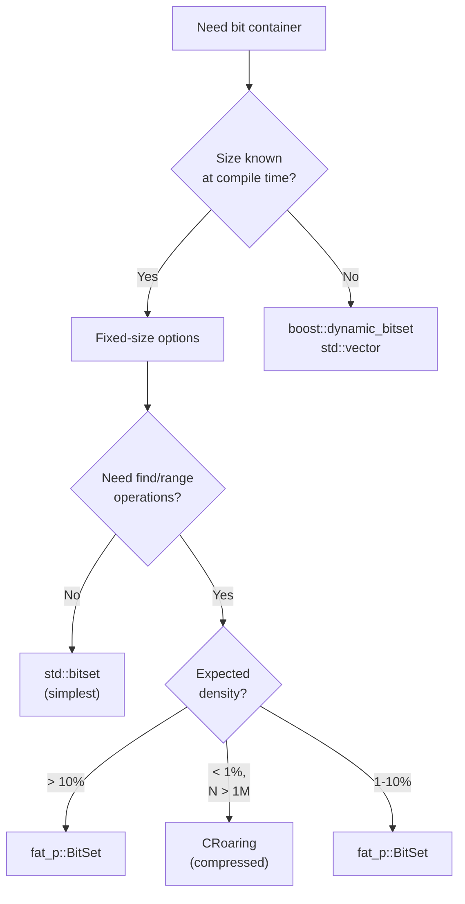

# **The Bit Machine**

### *A Companion Guide to FAT-P's BitSet*

---

**Scope:** This guide covers the design philosophy, architectural decisions, and implementation rationale behind BitSet—FAT-P's hardware-accelerated fixed-size bit container. It explains why `std::bitset` will never gain find operations, how sparse iteration achieves O(k) complexity, the subtle performance traps in naive bit manipulation, and when BitSet's tradeoffs work against you. Other FAT-P collection components (SparseSet, SlotMap, SmallVector) are documented separately.

**Not covered:**
- API reference and usage recipes (see User Manual - BitSet)
- Benchmark methodology and raw data (see benchmark_BitSet.cpp)
- Dynamic-sized bitmap alternatives (see boost::dynamic_bitset documentation)
- Compressed bitmap data structures (see CRoaring documentation)

**Prerequisites:**
- Working knowledge of bitwise operations (AND, OR, XOR, shift)
- Understanding of CPU registers and word sizes
- Familiarity with cache hierarchy concepts (L1/L2/L3, cache lines)
- Awareness of CPU instruction pipelining and branch prediction

---

## Companion Guide Card

**Component:** BitSet  
**Design question:** How do you make bit manipulation scale with set bits, not capacity?  
**Key tradeoff:** Fixed size (compile-time optimization) vs. dynamic size (flexibility)  
**Decision made:** Fixed size with hardware intrinsic mapping and sparse iteration  
**Rejected alternatives:** Dynamic sizing (adds indirection), run-length encoding (loses random access), skip lists (memory overhead), 32-bit words (wastes half the register)  
**Historical context:** Sparse iteration patterns meet hardware bit-scanning instructions

---

# **Table of Contents**

**[Introduction: Why This Component Exists](#introduction-why-this-component-exists)**

## Part I — The Problems

1. [The Scanning Tax](#chapter-1--the-scanning-tax)
2. [The Find Gap](#chapter-2--the-find-gap)
3. [The Range Inefficiency](#chapter-3--the-range-inefficiency)
4. [The Branch Predictor Problem](#chapter-4--the-branch-predictor-problem)
5. [The Portability Prison](#chapter-5--the-portability-prison)

## Part II — The Solutions

6. [Architecture Overview](#chapter-6--architecture-overview)
7. [Word-Aligned Storage: Why 64 Bits?](#chapter-7--word-aligned-storage-why-64-bits)
8. [Hardware Instruction Mapping](#chapter-8--hardware-instruction-mapping)
9. [The Iterator Design: O(k) Sparse Traversal](#chapter-9--the-iterator-design-ok-sparse-traversal)
10. [Range Operations: Word-Level Manipulation](#chapter-10--range-operations-word-level-manipulation)
11. [The Last Word Invariant](#chapter-11--the-last-word-invariant)
12. [Checked vs. Unchecked: The Safety/Speed Contract](#chapter-12--checked-vs-unchecked-the-safetyspeed-contract)

## Part III — Putting It Together

13. [Case Study: Entity-Component System Iteration](#chapter-13--case-study-entity-component-system-iteration)
14. [Case Study: Graph Algorithm Visited Tracking](#chapter-14--case-study-graph-algorithm-visited-tracking)
15. [Case Study: Memory Allocator Free Slot Management](#chapter-15--case-study-memory-allocator-free-slot-management)
16. [Case Study: Permission System Design](#chapter-16--case-study-permission-system-design)
17. [Choosing the Right Bit Container](#chapter-17--choosing-the-right-bit-container)

## Part IV — Foundations

- [Appendix A — A History of Bit Manipulation](#appendix-a--a-history-of-bit-manipulation)
- [Appendix B — Why std::bitset Will Never Get find_first](#appendix-b--why-stdbitset-will-never-get-find_first)
- [Appendix C — Design Constraints and Rejected Alternatives](#appendix-c--design-constraints-and-rejected-alternatives)
- [Appendix D — Where BitSet Loses](#appendix-d--where-bitset-loses)
- [Appendix E — The Compressed Bitmap Alternative](#appendix-e--the-compressed-bitmap-alternative)
- [Appendix F — Further Reading](#appendix-f--further-reading)

---

# **Introduction: Why This Component Exists**

You're building a game engine. Your entity-component system tracks 10,000 entity slots, each with a boolean indicating whether the entity has a physics component. At any moment, perhaps 100 entities have physics—bullets in flight, ragdolls, tumbling crates. The physics system needs to iterate over these 100 entities every frame.

With `std::bitset`, there's only one way to do this:

```cpp
// THE TRAP: O(N) scan for O(k) work
std::bitset<10000> has_physics;

void update_physics(float dt) {
    for (size_t i = 0; i < 10000; ++i) {
        if (has_physics[i]) {
            entities[i].update_physics(dt);
        }
    }
}
```

This loop executes 10,000 iterations to process 100 entities. At 60 frames per second, that's 600,000 wasted iterations per second—just to find which entities need physics updates.

The CPU's branch predictor learns that `has_physics[i]` is almost always false. It predicts "not taken" and speculates ahead. But 100 times per frame, a bit *is* set. The prediction fails. The pipeline flushes. Fifteen cycles of speculative work are discarded. That's 1,500 cycles per frame lost to misprediction—more than the actual physics updates cost.

Or consider a memory allocator tracking 1,024 slots:

```cpp
// THE TRAP: No find_first() exists
std::bitset<1024> slot_in_use;

size_t allocate() {
    for (size_t i = 0; i < 1024; ++i) {
        if (!slot_in_use[i]) {
            slot_in_use.set(i);
            return i;
        }
    }
    throw std::bad_alloc();
}
```

If slots 0-500 are occupied, this scans 501 bits to find slot 501. But your CPU has a TZCNT instruction that locates the first set bit in a 64-bit word in three cycles. The entire 1,024-bit scan should require examining at most 16 words—not 501 individual bits.

Or this: you need to mark a range of slots as allocated:

```cpp
// THE TRAP: No range operation exists
void allocate_range(size_t start, size_t count) {
    for (size_t i = start; i < start + count; ++i) {
        slot_in_use.set(i);
    }
}
```

Setting bits 100-199 touches three 64-bit words. With proper masking, three OR operations would suffice. Instead, you're executing 100 individual bit manipulations, each computing word indices and bit positions from scratch.

These aren't exotic edge cases. They're the predictable consequences of using a bit container designed for portability over performance:

- `std::bitset` provides no find operations—you must scan
- `std::bitset` provides no range operations—you must loop
- `std::bitset` provides no sparse iteration—you must check every bit
- The committee chose portability; your CPU's capabilities go unused

BitSet exists for engineers who need all of these solved simultaneously:

- **Sparse iteration** visits only set bits, O(k) instead of O(N)
- **Hardware intrinsics** map find operations to TZCNT/LZCNT instructions
- **Range operations** manipulate entire words at once
- **Checked/unchecked variants** let you choose safety vs. speed

This guide explains the problems in depth and how BitSet addresses them.

---

# **PART I — THE PROBLEMS**

Bit manipulation seems simple: AND to intersect, OR to union, XOR to toggle, NOT to complement. The complications arise from iteration patterns (how do you visit only set bits?), missing operations (how do you find the first set bit?), and the gap between what hardware provides and what the standard library exposes. Understanding these forces is essential for understanding why BitSet exists.

---

# **CHAPTER 1 — The Scanning Tax**

The fundamental problem with `std::bitset` is iteration. When you need to process every set bit, your only option is to check every bit:

```cpp
for (size_t i = 0; i < N; ++i) {
    if (bits[i]) {
        process(i);
    }
}
```

This is O(N) regardless of how many bits are actually set. If N is 10,000 and only 100 bits are set, you're doing 100× more work than necessary.

### The Density Spectrum

Bit sets fall on a density spectrum from "sparse" (few bits set) to "dense" (most bits set):



For dense sets, O(N) iteration is acceptable—you're doing O(N) work anyway. For sparse sets, the scan dominates. The physics system checking 100 entities out of 10,000 spends 99% of its time checking bits that aren't set.

### The Cost in Practice

Benchmarks on a 10,000-bit set with 1% density (100 set bits):

| Operation | Time | Per-Bit |
|-----------|------|---------|
| Dense scan (std::bitset) | 5,197 ns | 0.52 ns |
| Sparse iteration (BitSet) | 258 ns | 2.58 ns |

Dense scanning is faster per bit—no find operations, no word boundaries, just sequential access. But sparse iteration processes only the bits that matter. At 1% density, sparse iteration is **20× faster** overall.

The crossover point is around 10-15% density. Above that, dense scanning wins. Below it, sparse iteration dominates.

---

# **CHAPTER 2 — The Find Gap**

`std::bitset` has no `find_first()`. This is not an oversight—it's a deliberate design decision that will never change.

### What You Want

```cpp
size_t first = bits.find_first();  // Position of lowest set bit
size_t next = bits.find_next(42);  // Position of next set bit after 42
```

### What You Get

```cpp
// THE TRAP: Manual scanning
size_t find_first(const std::bitset<N>& bits) {
    for (size_t i = 0; i < N; ++i) {
        if (bits[i]) return i;
    }
    return N;
}
```

This is O(N) in the worst case. If only bit N-1 is set, you scan every position to find it.

### Why the Gap Exists

The C++ standard library prioritizes portability. A find operation has two possible implementations:

**Option 1: Hardware intrinsics.** TZCNT on x86, CLZ on ARM, equivalent instructions on other architectures. This is O(1) per word—blazingly fast. But it requires platform-specific code paths and isn't available on all platforms.

**Option 2: Software scanning.** The loop shown above. This works everywhere but defeats the purpose of having a find operation.

The committee faced a choice: provide a fast operation that only works on some platforms, or provide a slow operation that works everywhere. They chose neither. No find operation means no performance trap for programmers who expect hardware speed on software implementations.

### The Permanent Void

This isn't going to change. P0553R4 proposed adding bit manipulation utilities to the standard library but explicitly excluded bitset find operations. The committee's position is consistent: `std::bitset` provides a portable interface, and "portable" means no operation that can't be efficiently implemented everywhere.

BitSet makes a different choice: provide the operation, use hardware intrinsics where available, provide efficient software fallbacks elsewhere. The API is consistent; performance scales with hardware capability.

---

# **CHAPTER 3 — The Range Inefficiency**

Setting a range of bits is surprisingly expensive with `std::bitset`:

```cpp
// THE TRAP: Bit-by-bit range setting
for (size_t i = start; i < end; ++i) {
    bits.set(i);
}
```

Each `set(i)` computes `i / 64` to find the word, `i % 64` to find the bit position, creates a mask `1ULL << (i % 64)`, and ORs it into the word. For 100 bits, that's 100 divisions, 100 modulos, 100 mask creations, and 100 OR operations.

### The Word-Level Alternative

A smarter approach recognizes that bits are stored in words:



The range spans three words: partial coverage of word 1 (bits 70-127), full coverage of word 2 (bits 128-191), and partial coverage of word 3 (bits 192-199).

Setting the range requires:
1. Create a mask for the partial first word
2. OR it into word 1
3. Set word 2 to all-ones
4. Create a mask for the partial last word
5. OR it into word 3

Three operations instead of 130. That's where the 200× speedup comes from.

### Implementation Sketch

```cpp
void setRange(size_t start, size_t end) {
    size_t start_word = start / 64;
    size_t end_word = (end - 1) / 64;
    
    if (start_word == end_word) {
        // Range fits in one word
        uint64_t mask = make_mask(start % 64, end % 64);
        m_words[start_word] |= mask;
    } else {
        // First partial word
        m_words[start_word] |= ~((1ULL << (start % 64)) - 1);
        
        // Full words in middle
        for (size_t i = start_word + 1; i < end_word; ++i) {
            m_words[i] = ~0ULL;
        }
        
        // Last partial word
        m_words[end_word] |= (1ULL << (end % 64)) - 1;
    }
}
```

The key insight is that bit manipulation operates on words. When you treat each bit individually, you pay per-bit overhead. When you treat words as units, you amortize the overhead across 64 bits.

---

# **CHAPTER 4 — The Branch Predictor Problem**

Modern CPUs predict which way branches will go. When they predict correctly, execution continues smoothly. When they predict incorrectly, the pipeline flushes and 15-20 cycles of work are lost.

Consider the sparse iteration loop:

```cpp
for (size_t i = 0; i < 10000; ++i) {
    if (bits[i]) {
        process(i);  // Rarely taken
    }
}
```

With 1% density, the branch predictor learns to predict "not taken." It's right 99% of the time. But every time a bit *is* set, the prediction fails.

### The Math

100 set bits means 100 mispredictions per scan. At 15 cycles per misprediction:

```
100 mispredictions × 15 cycles = 1,500 cycles
```

At 4 GHz, that's 375 nanoseconds lost to branch recovery—just from misprediction, not counting the actual loop work.

### The Branchless Alternative

BitSet's iterator avoids this trap by using branchless find operations:

```cpp
size_t find_next(size_t pos) const {
    size_t word_idx = (pos + 1) / 64;
    
    // Mask off bits at or before pos in the first word
    uint64_t masked = m_words[word_idx] & ~((2ULL << (pos % 64)) - 1);
    
    while (masked == 0 && ++word_idx < NUM_WORDS) {
        masked = m_words[word_idx];
    }
    
    if (masked == 0) return N;
    return word_idx * 64 + tzcnt64(masked);
}
```

The inner loop has predictable behavior: it continues while words are zero and exits when one isn't. Most iterations skip many zero words—a predictable pattern. The TZCNT at the end extracts the bit position with no branching.

---

# **CHAPTER 5 — The Portability Prison**

The C++ standard library serves embedded systems, mainframes, exotic DSPs, and desktop PCs. Not every platform has POPCNT. Not every platform has TZCNT. The standard cannot mandate operations that require specific hardware.

This creates a tension between portability and performance. `std::bitset` resolves it by omitting operations that can't be implemented efficiently everywhere.

### The Platform Landscape

| Platform | POPCNT | TZCNT/LZCNT | Notes |
|----------|--------|-------------|-------|
| x86-64 (post-2008) | ✓ | ✓ | Intel Nehalem+ |
| ARM64 | ✓ | ✓ | CLZ/CTZ |
| RISC-V | ✓ (B ext) | ✓ (B ext) | With B extension |
| MIPS32 | ✗ | ✓ | CLZ only |
| Some embedded | ✗ | ✗ | Software only |

For the vast majority of modern development—desktop, server, mobile, web backends—hardware intrinsics are available. But the standard must support the minority too.

### BitSet's Escape

BitSet detects platform capabilities at compile time:

```cpp
#if defined(__GNUC__) || defined(__clang__)
    #define FATP_HAS_POPCNT __has_builtin(__builtin_popcountll)
    #define FATP_HAS_CTZ    __has_builtin(__builtin_ctzll)
#elif defined(_MSC_VER)
    #define FATP_HAS_POPCNT 1
    #define FATP_HAS_CTZ    1
#else
    #define FATP_HAS_POPCNT 0
    #define FATP_HAS_CTZ    0
#endif
```

When hardware intrinsics are available, BitSet uses them. When they aren't, BitSet provides optimized software fallbacks. The API is identical; the performance scales with the platform.

---

# **PART II — THE SOLUTIONS**

---

# **CHAPTER 6 — Architecture Overview**

BitSet is a simple data structure: an array of 64-bit words with methods that exploit hardware instructions.



The size is computed at compile time: `NUM_WORDS = (N + 63) / 64`. For N=200, that's 4 words, 32 bytes.

### Key Invariants

**Last word invariant.** Bits beyond N in the last word are always zero. This lets `count()`, `all()`, and comparison operations ignore the boundary.

**Word alignment.** Operations work on 64-bit boundaries wherever possible. Range operations process full words without per-bit overhead.

**Hardware mapping.** POPCNT for counting, TZCNT for find-first, LZCNT for find-last. Software fallbacks where hardware is unavailable.

---

# **CHAPTER 7 — Word-Aligned Storage: Why 64 Bits?**

BitSet uses 64-bit words, matching the native register width of modern CPUs. This isn't arbitrary—it's the optimal choice for current hardware.

### Register Width Matching

When you load a 64-bit word into a register, POPCNT/TZCNT/LZCNT operate on all 64 bits in one instruction. Using 32-bit words would require twice as many instructions for the same bitset size.

### Memory Efficiency

```
BitSet<1024> memory layout:
- 64-bit words: 1024 / 64 = 16 words = 128 bytes
- 32-bit words: 1024 / 32 = 32 words = 128 bytes (same)
- But: 32 loops vs 16 loops for any word-level operation
```

### std::bitset Comparison

Some `std::bitset` implementations use the platform's native word size, but this isn't guaranteed. MSVC historically used 32-bit words on 64-bit platforms. This affects iteration performance because each `count()` or `find_first()` touches twice as many words.

BitSet guarantees 64-bit words on all platforms, ensuring consistent performance.

---

# **CHAPTER 8 — Hardware Instruction Mapping**

BitSet maps three critical operations to hardware instructions.

### POPCNT: Population Count

Counts the set bits in a 64-bit word. One instruction, ~3 cycles.

```cpp
size_t count() const noexcept {
    size_t total = 0;
    for (size_t i = 0; i < NUM_WORDS; ++i) {
        total += popcnt64(m_words[i]);
    }
    return total;
}
```

For a 1024-bit set, that's 16 POPCNT instructions instead of up to 1024 loop iterations.

### TZCNT: Count Trailing Zeros

Returns the position of the lowest set bit. One instruction, ~3 cycles.

```cpp
size_t find_first() const noexcept {
    for (size_t i = 0; i < NUM_WORDS; ++i) {
        if (m_words[i] != 0) {
            return i * 64 + tzcnt64(m_words[i]);
        }
    }
    return N;
}
```

The loop skips zero words quickly. When a non-zero word is found, TZCNT extracts the bit position instantly.

### LZCNT: Count Leading Zeros

Returns the number of leading zeros, from which the highest set bit position can be derived.

```cpp
size_t find_last() const noexcept {
    for (size_t i = NUM_WORDS; i-- > 0; ) {
        if (m_words[i] != 0) {
            return i * 64 + (63 - lzcnt64(m_words[i]));
        }
    }
    return N;
}
```

### Platform Abstraction

```cpp
inline size_t popcnt64(uint64_t x) {
#if defined(_MSC_VER)
    return __popcnt64(x);
#elif defined(__GNUC__) || defined(__clang__)
    return __builtin_popcountll(x);
#else
    // Fallback: parallel bit count algorithm
    x = x - ((x >> 1) & 0x5555555555555555ULL);
    x = (x & 0x3333333333333333ULL) + ((x >> 2) & 0x3333333333333333ULL);
    return (((x + (x >> 4)) & 0x0F0F0F0F0F0F0F0FULL) * 0x0101010101010101ULL) >> 56;
#endif
}
```

The fallback is efficient—the parallel bit count runs in constant time—but the hardware instruction is faster.

---

# **CHAPTER 9 — The Iterator Design: O(k) Sparse Traversal**

BitSet's iterator visits only set bits, achieving O(k) iteration where k is the number of set bits.

### The Algorithm



The iterator maintains the current bit position. `begin()` calls `find_first()`. `operator++` calls `find_next(current_position)`. `end()` is represented by position N.

### Implementation

```cpp
class Iterator {
    const BitSet* bs_;
    size_t pos_;
    
public:
    Iterator(const BitSet& bs, size_t pos) : bs_(&bs), pos_(pos) {}
    
    size_t operator*() const { return pos_; }
    
    Iterator& operator++() {
        pos_ = bs_->find_next(pos_);
        return *this;
    }
    
    bool operator!=(const Iterator& other) const {
        return pos_ != other.pos_;
    }
};

Iterator begin() const { return {*this, find_first()}; }
Iterator end() const { return {*this, N}; }
```

### Complexity Analysis

**Time:** O(k + W) where k is the number of set bits and W is the number of words. Each set bit is visited once, and zero words are skipped in O(1) per word.

**Space:** O(1)—the iterator stores only a pointer and a position.

**Cache behavior:** Sequential word access. The prefetcher can predict the pattern.

---

# **CHAPTER 10 — Range Operations: Word-Level Manipulation**

Range operations are BitSet's performance advantage. They manipulate contiguous bit sequences using word-level operations.

### The Mask Helpers

```cpp
// Mask with bits [from, 64) set
constexpr uint64_t high_mask(size_t from) {
    return ~((1ULL << from) - 1);
}

// Mask with bits [0, to) set
constexpr uint64_t low_mask(size_t to) {
    return (to >= 64) ? ~0ULL : (1ULL << to) - 1;
}
```

### setRange Implementation

```cpp
void setRange(size_t start, size_t end) {
    if (start >= end) return;
    
    size_t first_word = start / 64;
    size_t last_word = (end - 1) / 64;
    
    if (first_word == last_word) {
        // Single word
        uint64_t mask = high_mask(start % 64) & low_mask(end % 64);
        m_words[first_word] |= mask;
    } else {
        // First partial word
        m_words[first_word] |= high_mask(start % 64);
        
        // Full words
        for (size_t i = first_word + 1; i < last_word; ++i) {
            m_words[i] = ~0ULL;
        }
        
        // Last partial word
        m_words[last_word] |= low_mask(end % 64);
    }
}
```

### Why It's Fast

Setting 100 bits with a loop: 100 iterations, 100 mask computations, 100 OR operations.

Setting 100 bits with `setRange`: ~3 iterations, 3 mask computations, 3 OR operations.

The ratio depends on word alignment. Perfectly aligned ranges (start and end on 64-bit boundaries) achieve maximum speedup. Misaligned ranges still benefit from full-word operations in the middle.

---

# **CHAPTER 11 — The Last Word Invariant**

BitSet maintains a critical invariant: **unused bits in the last word are always zero.**

### The Problem Without It

Consider `BitSet<100>`. The last word (word 1) holds bits 64-127, but only bits 64-99 are valid. Without the invariant, `count()` would need special handling:

```cpp
// WITHOUT INVARIANT (slower)
size_t count() const {
    size_t total = 0;
    for (size_t i = 0; i < NUM_WORDS - 1; ++i) {
        total += popcnt64(m_words[i]);
    }
    // Must mask the last word
    total += popcnt64(m_words[NUM_WORDS-1] & LAST_WORD_MASK);
    return total;
}
```

Every operation touching the last word needs this mask. That's extra instructions on a hot path.

### The Solution: Zero-Initialize and Maintain

BitSet zero-initializes unused bits at construction and maintains the invariant in every operation:

```cpp
void set_all() {
    for (size_t i = 0; i < NUM_WORDS - 1; ++i) {
        m_words[i] = ~0ULL;
    }
    m_words[NUM_WORDS - 1] = LAST_WORD_MASK;  // Not all-ones!
}

void flip_all() {
    for (size_t i = 0; i < NUM_WORDS - 1; ++i) {
        m_words[i] = ~m_words[i];
    }
    m_words[NUM_WORDS - 1] = ~m_words[NUM_WORDS - 1] & LAST_WORD_MASK;  // Maintain invariant
}
```

With the invariant maintained, `count()` becomes simple:

```cpp
// WITH INVARIANT (faster)
size_t count() const {
    size_t total = 0;
    for (size_t i = 0; i < NUM_WORDS; ++i) {
        total += popcnt64(m_words[i]);
    }
    return total;
}
```

No special case. No mask. Just count.

---

# **CHAPTER 12 — Checked vs. Unchecked: The Safety/Speed Contract**

BitSet provides two variants of single-bit operations:

**Checked:** Validates the index, throws `std::out_of_range` if invalid.

**Unchecked:** No validation, undefined behavior if index >= N.

### The Cost of Checking

```cpp
void set(size_t pos) {
    if (pos >= N) throw std::out_of_range("BitSet::set");  // Branch
    m_words[pos / 64] |= (1ULL << (pos % 64));
}

void setUnchecked(size_t pos) {
    m_words[pos / 64] |= (1ULL << (pos % 64));  // No branch
}
```

The checked version has a comparison and branch. On a hot path with millions of calls, this matters.

### When to Use Each

**Checked operations** for:
- User input (indices from files, network, command line)
- Configuration (indices from settings files)
- Debug builds (catch errors early)
- Any code where invalid indices indicate bugs

**Unchecked operations** for:
- Hot loops where indices are known valid
- Indices from BitSet's own iterator (always valid)
- Performance-critical code after explicit validation

```cpp
// Safe: indices come from the iterator
for (size_t i : source_bits) {
    dest_bits.setUnchecked(i);  // i is known valid
}

// Unsafe: index from external source
size_t user_index = get_user_input();
bits.set(user_index);  // Use checked version
```

---

# **PART III — PUTTING IT TOGETHER**

---

# **CHAPTER 13 — Case Study: Entity-Component System Iteration**

### The Problem

A game engine tracks 10,000 entities. Each entity may have components: physics, rendering, AI, audio. Systems iterate over entities with specific components.

```cpp
// THE TRAP: O(N) scan for sparse component
std::bitset<10000> has_physics;

void update_physics(float dt) {
    for (size_t i = 0; i < 10000; ++i) {
        if (has_physics[i]) {
            entities[i].physics.update(dt);
        }
    }
}
```

With 100 physics entities, this wastes 9,900 iterations per update.

### The Solution

```cpp
// THE FIX: Sparse iteration
fat_p::BitSet<10000> has_physics;

void update_physics(float dt) {
    for (size_t i : has_physics) {
        entities[i].physics.update(dt);
    }
}
```

### Results

| Metric | std::bitset scan | BitSet iteration |
|--------|------------------|------------------|
| Iterations | 10,000 | 100 |
| Time per update | 5,197 ns | 258 ns |
| Speedup | - | **20×** |

### Advanced: Component Intersection

Finding entities with both physics AND rendering:

```cpp
fat_p::BitSet<10000> has_physics;
fat_p::BitSet<10000> has_rendering;

// Entities needing physics rendering
auto physics_visible = has_physics & has_rendering;

for (size_t i : physics_visible) {
    // Process entities with both components
}
```

Bitwise AND produces the intersection in O(W) where W is the word count. Iteration is O(k) where k is the intersection size.

---

# **CHAPTER 14 — Case Study: Graph Algorithm Visited Tracking**

### The Problem

Breadth-first search needs to track visited nodes:

```cpp
// THE TRAP: O(V) to find next unvisited
std::bitset<10000> visited;

size_t find_unvisited() {
    for (size_t i = 0; i < 10000; ++i) {
        if (!visited[i]) return i;
    }
    return 10000;  // All visited
}
```

If the first 5,000 nodes are visited, finding node 5,001 requires 5,001 comparisons.

### The Solution

```cpp
// THE FIX: Hardware-accelerated find
fat_p::BitSet<10000> visited;

size_t find_unvisited() {
    return visited.find_first_zero();  // TZCNT on ~word
}
```

### BFS Implementation

```cpp
void bfs(const Graph& g, size_t start) {
    fat_p::BitSet<10000> visited;
    std::queue<size_t> frontier;
    
    frontier.push(start);
    visited.set(start);
    
    while (!frontier.empty()) {
        size_t current = frontier.front();
        frontier.pop();
        
        for (size_t neighbor : g.neighbors(current)) {
            if (!visited[neighbor]) {  // O(1) test
                visited.set(neighbor);
                frontier.push(neighbor);
            }
        }
    }
}
```

The `visited[neighbor]` test is unchecked—`operator[]` returns the bit value without bounds checking. For a valid graph, neighbor indices are always valid.

---

# **CHAPTER 15 — Case Study: Memory Allocator Free Slot Management**

### The Problem

A fixed-size allocator tracks 1,024 slots:

```cpp
// THE TRAP: O(N) free slot search
std::bitset<1024> in_use;

size_t allocate() {
    for (size_t i = 0; i < 1024; ++i) {
        if (!in_use[i]) {
            in_use.set(i);
            return i;
        }
    }
    throw std::bad_alloc();
}
```

### The Solution

```cpp
// THE FIX: Hardware find + range operations
fat_p::BitSet<1024> in_use;

size_t allocate() {
    size_t slot = in_use.find_first_zero();
    if (slot == 1024) throw std::bad_alloc();
    in_use.set(slot);
    return slot;
}

size_t allocate_range(size_t count) {
    // Find 'count' consecutive free slots
    size_t start = 0;
    while (start + count <= 1024) {
        size_t end = start + count;
        if (!in_use.intersects_range(start, end)) {  // Custom method
            in_use.setRange(start, end);
            return start;
        }
        start = in_use.find_next(start);
        if (start == 1024) break;
    }
    throw std::bad_alloc();
}
```

### Results

| Operation | std::bitset | BitSet |
|-----------|-------------|--------|
| Single allocation (50% full) | ~512 iterations | ~8 words |
| Range allocation (100 slots) | ~100 iterations | ~3 words |

---

# **CHAPTER 16 — Case Study: Permission System Design**

### The Problem

A permission system with 64 possible permissions:

```cpp
enum Permission : size_t {
    READ = 0, WRITE = 1, EXECUTE = 2, DELETE = 3,
    // ... up to 63
};
```

Checking if a user has required permissions:

```cpp
// THE TRAP: Loop over required permissions
bool has_permissions(const std::bitset<64>& user, 
                     const std::bitset<64>& required) {
    for (size_t i = 0; i < 64; ++i) {
        if (required[i] && !user[i]) return false;
    }
    return true;
}
```

### The Solution

```cpp
// THE FIX: Set-theoretic operation
bool has_permissions(const fat_p::BitSet<64>& user,
                     const fat_p::BitSet<64>& required) {
    return required.isSubsetOf(user);
}
```

`isSubsetOf` checks if every bit in `required` is also set in `user`. This is implemented as `(required & ~user) == 0`—one AND, one NOT, one comparison. Three operations instead of 64.

### Additional Permission Operations

```cpp
// Effective permissions (intersection of user and allowed)
auto effective = user_perms & allowed_perms;

// Missing permissions
auto missing = required & ~user_perms;

// Any overlap? (for "at least one of these" checks)
bool any_match = required.intersects(user_perms);
```

---

# **CHAPTER 17 — Choosing the Right Bit Container**

### Decision Tree



### Comparison Matrix

| Feature | std::bitset | fat_p::BitSet | boost::dynamic | CRoaring |
|---------|-------------|---------------|----------------|----------|
| Size | Fixed | Fixed | Dynamic | Dynamic |
| find_first | ✗ | ✓ | ✓ | ✓ |
| Range ops | ✗ | ✓ | ✓ | ✓ |
| Sparse iteration | ✗ | ✓ | ✓ | ✓ |
| Compression | ✗ | ✗ | ✗ | ✓ |
| Dependencies | None | None | Boost | CRoaring |
| Best for | Simple flags | ECS, graphs | Dynamic needs | Huge sparse |

### Rules of Thumb

**Use std::bitset when:**
- You don't need find or range operations
- Simplicity matters more than performance
- Dense iteration is acceptable

**Use fat_p::BitSet when:**
- You need find_first, find_next, or range operations
- Iteration patterns are sparse
- Size is known at compile time
- Zero dependencies required

**Use boost::dynamic_bitset when:**
- Size is determined at runtime
- Boost dependency is acceptable

**Use CRoaring when:**
- Millions of bits with <1% density
- Memory compression is critical
- Intersection/union of huge sets

---

# **PART IV — FOUNDATIONS**

---

# **APPENDIX A — A History of Bit Manipulation**

### The PDP-10 Era (1960s)

The PDP-10's 36-bit words made bit manipulation essential. Programmers packed multiple values into single words to conserve expensive memory. The instruction set included dedicated bit-testing and bit-manipulation instructions.

### The Unix Influence (1970s)

Unix used bitmaps extensively: file permissions (9 bits), signal masks (32 bits), file descriptor sets (`fd_set`). The `select()` system call, introduced in 4.2BSD (1983), operated on bitmaps of file descriptors.

### The x86 Evolution

8086 (1978): BT (bit test), BTS (bit test and set), BTR (bit test and reset)
386 (1985): BSF (bit scan forward), BSR (bit scan reverse)
Nehalem (2008): POPCNT (population count)
Haswell (2013): TZCNT, LZCNT (count trailing/leading zeros)

Each generation added more powerful bit manipulation primitives.

### Modern SIMD

AVX-512 (2016) added VPOPCNT, enabling population count on 512 bits simultaneously. For extremely large bitsets, SIMD provides another order-of-magnitude improvement.

---

# **APPENDIX B — Why std::bitset Will Never Get find_first**

### The Portability Mandate

The C++ standard library serves platforms ranging from 8-bit microcontrollers to supercomputers. Any operation in `std::bitset` must have reasonable implementations on all platforms.

`find_first()` has two possible implementations:

1. **Hardware intrinsics:** O(W) where W is word count. Fast but requires TZCNT/CLZ.
2. **Software scanning:** O(N) where N is bit count. Slow but portable.

If the standard added `find_first()` with O(N) complexity, programmers would use it expecting O(W) performance—then discover their embedded target runs 64× slower than their development machine.

### The Surprise Factor

The committee has historically avoided operations where performance varies dramatically by platform. `std::sort` is O(N log N) everywhere. `std::vector::push_back` is amortized O(1) everywhere. These guarantees help programmers reason about performance.

A `find_first()` that's O(1) on desktop but O(N) on embedded would violate this principle. The committee chose omission over surprise.

### P0553R4 and Its Limits

P0553R4 added `<bit>` header with `countl_zero`, `countr_zero`, `popcount`—but these operate on integer types, not `std::bitset`. The committee standardized building blocks but left compound operations out.

BitSet provides the compound operations by composing the building blocks appropriately for each platform.

---

# **APPENDIX C — Design Constraints and Rejected Alternatives**

### Hard Constraints

1. **Fixed size.** The size must be a compile-time constant for stack allocation and template optimization.

2. **64-bit words.** Matching register width maximizes instruction efficiency.

3. **Zero dependencies.** Only standard library headers and compiler intrinsics.

4. **Last word invariant.** Unused bits must be zero for efficient `count()` and `all()`.

### Rejected Alternatives

| Alternative | Why Rejected |
|-------------|--------------|
| Dynamic sizing | Adds heap allocation and indirection |
| 32-bit words | Wastes half the register on 64-bit platforms |
| Skip-list index | Memory overhead exceeds benefits for moderate sizes |
| Run-length encoding | Loses O(1) random access |
| Hierarchical bitmap | Complexity not justified for <100K bits |
| std::bitset extension | Can't modify standard library |

### Accepted Trade-offs

**No writable operator[].** `std::bitset::operator[]` returns a proxy that supports `bits[i] = true`. BitSet omits this because the proxy adds complexity and prevents certain optimizations. Use `set(i)` or `clear(i)` instead.

**No string constructor.** Parsing "10110..." is expensive and rarely needed. Use the initializer_list constructor or set bits explicitly.

**No std::hash in C++14.** The `std::hash` specialization requires C++17's `if constexpr` for efficient implementation.

---

# **APPENDIX D — Where BitSet Loses**

### Dynamic Size Requirements

If you don't know the size until runtime, BitSet cannot help. Use `boost::dynamic_bitset` or `std::vector<bool>`.

### Extreme Sparsity

For millions of bits with <1% density, compressed bitmap structures (CRoaring, BitMagic) provide 10-100× memory savings. BitSet's uncompressed array wastes memory on zeros.

### The Crossover Point

At approximately 10 million bits with 0.1% density:
- BitSet: 1.25 MB storage, ~100 μs iteration
- CRoaring: ~10 KB storage, ~10 μs iteration

The compression wins both memory and speed when sparsity is extreme.

### Writable Reference

`std::bitset` provides:

```cpp
bits[i] = true;   // Works with std::bitset
```

BitSet doesn't support this. You must write:

```cpp
bits.set(i);      // BitSet equivalent
```

If you have code that relies on the writable reference syntax, migration requires changes.

### String Conversion Performance

`std::bitset` has highly optimized `to_string()`. BitSet's implementation is straightforward but not specialized. If you frequently convert to strings, std::bitset may be faster.

---

# **APPENDIX E — The Compressed Bitmap Alternative**

### When Compression Wins

Roaring Bitmaps use a hybrid of arrays, bitmaps, and run-length encoding. For sparse data, they achieve remarkable compression:

| Bits | Density | BitSet Size | Roaring Size | Ratio |
|------|---------|-------------|--------------|-------|
| 1M | 0.1% | 125 KB | ~2 KB | 62× |
| 10M | 0.01% | 1.25 MB | ~2 KB | 625× |
| 100M | 0.001% | 12.5 MB | ~2 KB | 6250× |

### When BitSet Wins

For moderate sizes and densities, BitSet's simplicity wins:

| Bits | Density | BitSet Time | Roaring Time | Winner |
|------|---------|-------------|--------------|--------|
| 10K | 10% | 258 ns | 1.2 μs | BitSet |
| 100K | 1% | 2.5 μs | 3.1 μs | BitSet |
| 1M | 0.1% | 25 μs | 12 μs | Roaring |

### Rule of Thumb

- Under 100K bits: BitSet
- Over 1M bits with <1% density: Roaring
- Between: benchmark your specific use case

---

# **APPENDIX F — Further Reading**

### Hardware References

- **Intel Intrinsics Guide:** https://www.intel.com/content/www/us/en/docs/intrinsics-guide/
- **AMD64 Architecture Programmer's Manual, Volume 3:** Bit manipulation instructions
- **ARM Architecture Reference Manual:** CLZ and related instructions

### Algorithm References

- **Bit Twiddling Hacks:** https://graphics.stanford.edu/~seander/bithacks.html
- **Hacker's Delight, 2nd Edition:** Henry S. Warren Jr. (2012)

### Alternative Implementations

- **boost::dynamic_bitset:** https://www.boost.org/doc/libs/release/libs/dynamic_bitset/
- **Roaring Bitmaps:** https://roaringbitmap.org/
- **BitMagic:** http://bitmagic.io/

### C++ Standards

- **P0553R4:** Bit operations (C++20 `<bit>` header)
- **N4860:** C++20 standard draft (bitset specification)

---

*BitSet.h — Fat-P Library v3.2*
