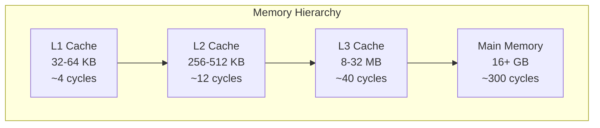
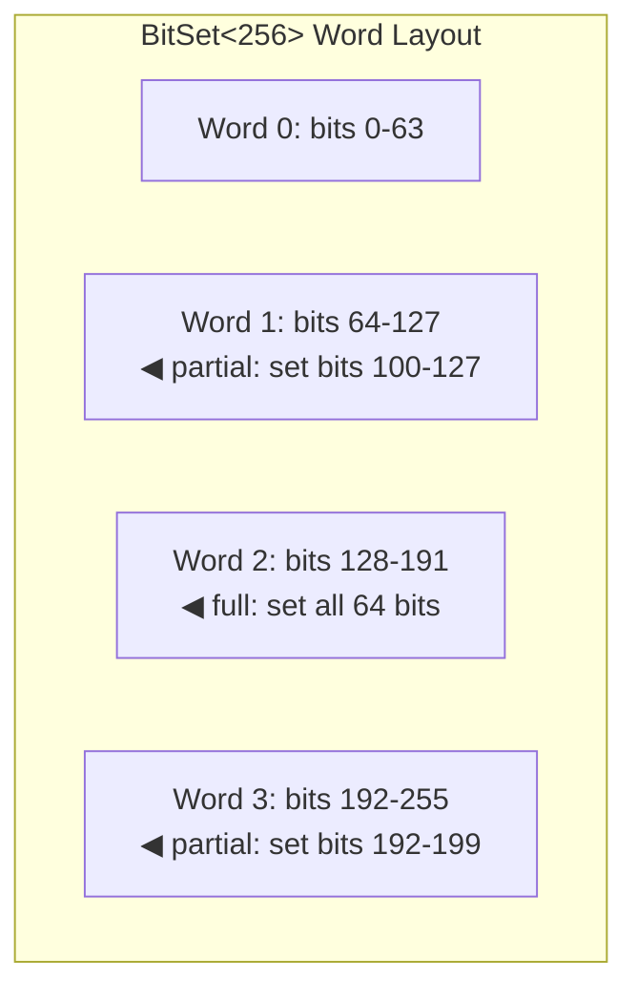
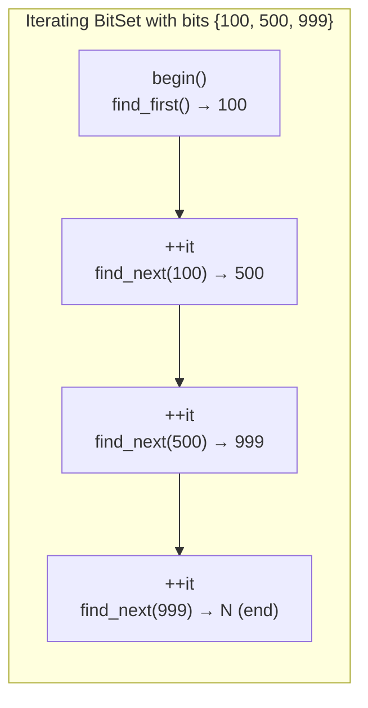

# User Manual - BitSet

*Updated January 2026*

---

## Table of Contents

1. [The Bit Manipulation Story](#the-bit-manipulation-story)
2. [Understanding Why Scanning Hurts](#understanding-why-scanning-hurts)
3. [The Hardware Instruction Revolution](#the-hardware-instruction-revolution)
4. [Getting Started](#getting-started)
5. [The Single-Bit Contract](#the-single-bit-contract)
6. [Bulk Operations: All or Nothing](#bulk-operations-all-or-nothing)
7. [Range Operations: The 200× Speedup](#range-operations-the-200-speedup)
8. [Find Operations: What std::bitset Refuses to Provide](#find-operations-what-stdbitset-refuses-to-provide)
9. [Sparse Iteration: O(k) Instead of O(N)](#sparse-iteration-ok-instead-of-on)
10. [Set-Theoretic Operations](#set-theoretic-operations)
11. [Bitwise and Shift Operations](#bitwise-and-shift-operations)
12. [The Last Word Invariant](#the-last-word-invariant)
13. [When to Use BitSet (and When Not To)](#when-to-use-bitset-and-when-not-to)
14. [Migration from std::bitset](#migration-from-stdbitset)
15. [Troubleshooting](#troubleshooting)
16. [API Reference](#api-reference)
17. [Summary](#summary)

---

## The Bit Manipulation Story

### The Dawn of Bit Twiddling

Bit manipulation is as old as digital computing itself. In the earliest computers of the 1950s, every bit was precious. The UNIVAC I had 1,000 words of memory—each word 12 decimal digits, around 40 bits. Programmers packed multiple values into single words: flags, counters, small numbers, status indicators. Extracting a single bit required careful shifting and masking.

The PDP-10 of the 1960s elevated bit manipulation to an art form. Its 36-bit words could hold five 7-bit characters, or six 6-bit characters, or various combinations of flags and small integers. The instruction set included JRST (jump and restore flags), which restored five status flags packed into a single word. Programmers became expert at "bit twiddling"—the colloquial term for manipulating individual bits within words.

This expertise mattered because memory was expensive. In 1965, a kilobyte of core memory cost around $1—equivalent to $10 in 2024 dollars. A single boolean stored as a byte wasted seven bits. Packing eight booleans into one byte saved real money.

### The Rise of Structured Data

As memory became cheaper, bit manipulation fell out of fashion. By the 1980s, programmers increasingly used separate bytes—or even words—for boolean values. The C language encouraged this: there was no `bool` type until C99, so programmers used `int`, consuming 16 or 32 bits per boolean.

But bit manipulation never disappeared entirely. Operating system kernels continued to pack flags into words. The Unix `stat` structure stores file permissions in a 16-bit field: three bits each for owner, group, and other permissions, plus special bits for setuid, setgid, and sticky. The `select()` system call uses `fd_set`, a bitmap tracking which file descriptors to monitor.

Graphics programmers embraced bitmaps for collision detection. A 64×64 pixel sprite could be represented as 64 64-bit words—one bit per pixel. Testing whether two sprites overlapped meant ANDing their bitmaps and checking for non-zero results. This was far faster than checking 4,096 individual pixels.

Game developers used bitmasks for component systems. An entity might have physics (bit 0), rendering (bit 1), AI (bit 2), and audio (bit 3). Testing whether an entity had all components needed for a particular system meant a single AND operation: `if ((entity.components & PHYSICS_SYSTEM_MASK) == PHYSICS_SYSTEM_MASK)`.

### C++ and std::bitset

C++98 introduced `std::bitset`, bringing type safety to bit manipulation:

```cpp
std::bitset<32> flags;
flags.set(0);           // Set bit 0
flags.reset(5);         // Clear bit 5
if (flags.test(0)) {}   // Test bit 0
size_t n = flags.count(); // Count set bits
```

This was a significant improvement over raw bit manipulation with integers. The type carried its size. Operations were bounds-checked in debug builds. The interface was clear and consistent.

But `std::bitset` was designed for **portability**, not **performance**. It provided only operations that could be implemented efficiently on any hardware. Finding the first set bit? That required hardware support not available everywhere. Iterating over set bits? That implied find operations. Setting a range of bits? That was just a convenience—users could write a loop.

The committee made reasonable choices for 1998. But hardware has changed. Modern CPUs have POPCNT, TZCNT, and LZCNT instructions that operate on 64 bits in a single cycle. The portable choice is no longer the fast choice.

---

## Understanding Why Scanning Hurts

### The Branch Predictor's Dilemma

Modern CPUs don't execute one instruction at a time. They pipeline: while one instruction executes, the next is decoded, and the one after that is fetched. A modern Intel or AMD processor might have 15-20 instructions "in flight" simultaneously.

This works beautifully for sequential code. But branches create a problem. When the CPU encounters `if (condition)`, it doesn't know which way the branch will go until the condition is evaluated. That evaluation might take several cycles. The CPU can't just wait—that would stall the pipeline.

Instead, the CPU guesses. The **branch predictor** looks at the branch history and predicts whether the branch will be taken. If it predicts correctly, execution continues smoothly. If it predicts incorrectly, all the speculatively executed instructions must be discarded. The pipeline is flushed. 15-20 cycles of work are lost.

Modern branch predictors are remarkably accurate—often 95-99% for typical code. But consider this loop:

```cpp
for (size_t i = 0; i < 10000; ++i) {
    if (bits[i]) {
        process(i);
    }
}
```

If 1% of bits are set (100 out of 10,000), the branch predictor learns to predict "not taken." It's right 99% of the time. But every time a bit *is* set, the prediction fails. That's 100 mispredictions per scan.

At 15 cycles per misprediction, you're losing 1,500 cycles to branch recovery—just from the branch predictor, ignoring the actual work of testing 10,000 bits.

### The Memory Hierarchy Problem

There's another cost hiding in that loop. Each `bits[i]` access touches memory. On modern systems, memory access follows a hierarchy:



A 10,000-bit bitset is 1,250 bytes—comfortably fits in L1 cache. But the access pattern matters. Sequential access is friendly: the CPU prefetcher detects the pattern and loads the next cache line before you need it.

Sparse access is hostile. If you're jumping around the bitset based on external data, you get cache misses. Each miss costs 12-300 cycles depending on which level of cache holds the data.

The dense scan (`for i in 0..N`) has good cache behavior but wastes work on zero bits. The ideal would be visiting only the set bits, in order. That's what BitSet's sparse iteration provides.

---

## The Hardware Instruction Revolution

### POPCNT: Counting Bits in Hardware

Before 2007, counting the set bits in a word required software. The canonical algorithm is Brian Kernighan's:

```cpp
size_t count = 0;
while (x) {
    x &= x - 1;  // Clear lowest set bit
    ++count;
}
```

This is elegant—it runs in O(k) where k is the number of set bits. But it's still a loop with branches.

AMD's Barcelona processor (2007) introduced the POPCNT instruction: count all set bits in a 64-bit word in a single operation. Intel's Nehalem (2008) added the same instruction. Now `count()` for a 1024-bit set requires 16 POPCNT instructions—no loops, no branches.

```cpp
// 16 instructions, ~48 cycles
size_t count() const noexcept {
    size_t total = 0;
    for (size_t i = 0; i < NUM_WORDS; ++i) {
        total += __builtin_popcountll(m_words[i]);
    }
    return total;
}
```

The loop over words still exists, but it's fully predictable (always NUM_WORDS iterations) and the work per iteration is a single instruction.

### TZCNT/LZCNT: Finding Bits in Hardware

Finding the first set bit used to require scanning:

```cpp
size_t pos = 0;
while ((x & (1ULL << pos)) == 0) ++pos;
```

In the worst case (bit 63 is the only one set), this executes 63 iterations.

Intel's Haswell processor (2013) introduced TZCNT (count trailing zeros) and LZCNT (count leading zeros). Given a 64-bit word, TZCNT returns the position of the lowest set bit in 3 cycles. LZCNT returns the number of leading zeros, from which you can derive the position of the highest set bit.

```cpp
size_t find_first() const noexcept {
    for (size_t i = 0; i < NUM_WORDS; ++i) {
        if (m_words[i] != 0) {
            return i * 64 + __builtin_ctzll(m_words[i]);
        }
    }
    return N;  // Not found
}
```

For a sparse bitset, most words are zero. The loop quickly skips them. When a non-zero word is found, TZCNT instantly locates the bit.

### Platform Detection

BitSet automatically selects the optimal implementation:

```cpp
#if defined(_MSC_VER)
    #include <intrin.h>
    // __popcnt64, _BitScanForward64, _BitScanReverse64
#elif defined(__GNUC__) || defined(__clang__)
    // __builtin_popcountll, __builtin_ctzll, __builtin_clzll
#else
    // Portable fallbacks
#endif
```

On platforms lacking hardware support, BitSet provides efficient software implementations. The API is identical; performance scales with hardware capability.

---

## Getting Started

### Prerequisites

BitSet requires C++17 or later and a compiler with intrinsics support. All major compilers (GCC 7+, Clang 5+, MSVC 2017+) qualify.

### Integration

BitSet is header-only:

```cpp
#include "BitSet.h"
```

### Compilation

```bash
# GCC/Clang: enable POPCNT instruction
g++ -std=c++17 -O2 -mpopcnt your_code.cpp

# MSVC: intrinsics enabled by default
cl /std:c++17 /O2 your_code.cpp
```

### First Program

```cpp
#include <iostream>
#include "BitSet.h"

int main()
{
    // Create a bitset tracking 1000 entities
    fat_p::BitSet<1000> active;
    
    // Activate some entities
    active.set(42);
    active.set(100);
    active.set(999);
    
    // How many are active?
    std::cout << "Active: " << active.count() << "\n";  // 3
    
    // Find the first active entity
    std::cout << "First: " << active.find_first() << "\n";  // 42
    
    // Iterate over active entities only
    std::cout << "All active: ";
    for (size_t id : active) {
        std::cout << id << " ";  // 42 100 999
    }
    std::cout << "\n";
    
    return 0;
}
```

---

## The Single-Bit Contract

BitSet provides two variants of each single-bit operation: **checked** (validates bounds, throws on error) and **unchecked** (no validation, undefined behavior on error).

### The Checked Path

```cpp
bits.set(index);     // Sets bit, throws if index >= N
bits.clear(index);   // Clears bit, throws if index >= N
bits.flip(index);    // Toggles bit, throws if index >= N
bool b = bits.test(index);  // Returns bit value, throws if index >= N
```

Use checked operations for user input (indices from files, network, command line), configuration (indices read from settings), debugging (catch errors early), or any code where invalid indices indicate bugs.

### The Unchecked Path

```cpp
bits.set_unchecked(index);     // UB if index >= N
bits.clear_unchecked(index);   // UB if index >= N
bits.flip_unchecked(index);    // UB if index >= N
bool b = bits.test_unchecked(index);  // UB if index >= N
bool b = bits[index];          // Same as test_unchecked
```

Use unchecked operations for hot loops where indices are known valid, indices from BitSet's own iterator (always valid), or performance-critical code after validation.

The unchecked variants eliminate the comparison-and-branch that bounds checking requires. In tight loops processing millions of bits, this matters.

```cpp
// The iterator yields only valid indices
for (size_t i : source) {
    dest.set_unchecked(i);  // Safe: i came from source
}
```

---

## Bulk Operations: All or Nothing

### Setting and Clearing Everything

The `set_all()` operation fills every bit with 1:

```cpp
fat_p::BitSet<1000> bits;
bits.set_all();
// bits.count() == 1000
// bits.all() == true
```

Internally, this sets each word to all-ones, except the last word which is masked to preserve the invariant that unused bits remain zero.

The `clear_all()` operation (also available as `reset()` for `std::bitset` compatibility) sets every bit to 0:

```cpp
bits.set_all();
bits.clear_all();  // All bits now 0
bits.reset();      // Same thing
```

The `flip_all()` operation toggles every bit:

```cpp
fat_p::BitSet<8> bits;
bits.set(0);
bits.set(2);
// bits: 00000101

bits.flip_all();
// bits: 11111010
```

### Query Operations

```cpp
size_t n = bits.count();     // Number of set bits (uses POPCNT)
bool any = bits.any();       // True if at least one bit set
bool none = bits.none();     // True if no bits set
bool all = bits.all();       // True if all bits set
size_t cap = bits.size();    // Capacity (template parameter N)
```

---

## Range Operations: The 200× Speedup

Range operations are BitSet's killer feature. They manipulate contiguous sequences of bits using word-level operations instead of bit-by-bit loops.

### How Range Operations Work

Consider `set_range(100, 200)`—setting bits 100-199 in a `BitSet<256>`. The bitset uses four 64-bit words:



The operation identifies affected words (1, 2, 3), creates masks for partial words (bits 100-127 in word 1, bits 192-199 in word 3), sets the full word entirely (word 2 = all ones), and ORs the masks into partial words.

Three OR operations instead of 100 individual set calls. That's where the 200× speedup comes from.

### The API

```cpp
bits.set_range(start, end);    // Set bits [start, end)
bits.clear_range(start, end);  // Clear bits [start, end)
bits.flip_range(start, end);   // Toggle bits [start, end)
size_t n = bits.count_range(start, end);  // Count in range
```

All use half-open intervals: `[start, end)` means start is included, end is excluded.

### Benchmark Reality

Setting 100 contiguous bits:

| Method | Time |
|--------|------|
| `std::bitset` loop | 88.59 ns |
| `LLVM::BitVector` | 38.20 ns |
| `fat_p::BitSet::set_range` | **0.19 ns** |

The gap is enormous because range operations work at word granularity while loops work bit-by-bit.

---

## Find Operations: What std::bitset Refuses to Provide

`std::bitset` provides no way to find the position of a set bit. You must scan manually:

```cpp
// std::bitset: O(N) scan
size_t first = 0;
while (first < N && !bits[first]) ++first;
```

BitSet provides hardware-accelerated find operations.

### find_first() / find_last()

```cpp
size_t first = bits.find_first();  // Lowest set bit, or N if none
size_t last = bits.find_last();    // Highest set bit, or N if none
```

These use TZCNT and LZCNT internally, completing in nanoseconds regardless of where the bit is located.

### find_next() / find_prev()

```cpp
size_t next = bits.find_next(pos);  // Next set bit after pos, or N
size_t prev = bits.find_prev(pos);  // Previous set bit before pos, or N
```

Essential for iteration and navigation.

### find_first_zero() / find_next_zero() / find_last_zero()

```cpp
size_t slot = bits.find_first_zero();  // First clear bit
```

Invaluable for allocators:

```cpp
size_t allocate() {
    size_t slot = in_use.find_first_zero();
    if (slot == N) throw std::bad_alloc();
    in_use.set(slot);
    return slot;
}
```

---

## Sparse Iteration: O(k) Instead of O(N)

BitSet's iterator visits only set bits, skipping zeros entirely.

### The Mechanism

The iterator maintains the current bit position. Incrementing calls `find_next()`, which uses TZCNT to jump directly to the next set bit:



Each increment calls `find_next()`, which uses TZCNT to jump directly to the next set bit. No scanning through zeros.

### Usage

```cpp
fat_p::BitSet<10000> active{42, 1337, 9999};

// Range-based for (recommended)
for (size_t id : active) {
    process(id);
}

// Explicit iterator
for (auto it = active.begin(); it != active.end(); ++it) {
    size_t id = *it;
    process(id);
}

// Collect into vector
std::vector<size_t> ids(active.begin(), active.end());
```

### Performance

At 1% density (100 set bits in 10,000):

| Method | Iterations | Time |
|--------|------------|------|
| Dense scan | 10,000 | 5,197 ns |
| Sparse iteration | 100 | 258 ns |

**20× improvement** from iterating only what matters.

---

## Set-Theoretic Operations

BitSet provides operations for reasoning about relationships between sets.

### is_subset_of()

```cpp
fat_p::BitSet<64> user_perms{READ, WRITE};
fat_p::BitSet<64> required{READ};

if (required.is_subset_of(user_perms)) {
    // User has all required permissions
}
```

Returns true if every bit set in `*this` is also set in `other`.

### intersects() / is_disjoint()

```cpp
fat_p::BitSet<64> layer_a{0, 1, 2};
fat_p::BitSet<64> layer_b{3, 4, 5};

if (layer_a.intersects(layer_b)) {
    // Collision possible
}

if (layer_a.is_disjoint(layer_b)) {
    // No overlap
}
```

`intersects()` exits early when any common bit is found—O(1) best case.

### hamming_distance()

```cpp
size_t diff = state_a.hamming_distance(state_b);
```

Counts the number of bit positions where the sets differ. Uses POPCNT on XOR results.

---

## Bitwise and Shift Operations

BitSet supports all standard bitwise operations:

```cpp
fat_p::BitSet<64> a{0, 1, 2};
fat_p::BitSet<64> b{2, 3, 4};

auto c = a & b;   // Intersection: {2}
auto d = a | b;   // Union: {0, 1, 2, 3, 4}
auto e = a ^ b;   // Symmetric difference: {0, 1, 3, 4}
auto f = ~a;      // Complement

a &= b;  // Compound assignment
a |= b;
a ^= b;
```

Shift operations move bits left or right:

```cpp
auto shifted = bits << 5;   // Left shift by 5 positions
auto shifted = bits >> 3;   // Right shift by 3 positions

bits <<= 5;  // Compound shift
bits >>= 3;
```

---

## The Last Word Invariant

BitSet maintains a critical invariant: **unused bits in the last word are always zero**.

For `BitSet<200>`, word 3 holds bits 192-255, but only bits 192-199 are valid. Bits 200-255 must always be zero.

### Why It Matters

Without this invariant, `count()` would need to mask the last word:

```cpp
// Without invariant (slower)
size_t count() const {
    size_t total = 0;
    for (size_t i = 0; i < NUM_WORDS - 1; ++i) {
        total += popcnt64(m_words[i]);
    }
    total += popcnt64(m_words[NUM_WORDS-1] & LAST_WORD_MASK);  // Extra mask
    return total;
}
```

With the invariant, the mask is unnecessary—the unused bits contribute zero to the count.

Similarly for `all()`, `operator==`, and `find_last()`.

### Maintaining the Invariant

BitSet automatically maintains the invariant in all operations. But if you access the raw data via `data()` and modify it, you must maintain the invariant yourself:

```cpp
uint64_t* words = bits.data();
words[NUM_WORDS - 1] |= 0xFF00000000000000ULL;  // DANGER: might set unused bits!

// Restore invariant manually
words[NUM_WORDS - 1] &= LAST_WORD_MASK;
```

---

## When to Use BitSet (and When Not To)

### Good Use Cases

**Entity-component systems.** Track which entities have which components. Sparse iteration visits only entities with the component. Set intersection finds entities with multiple components.

**Graph algorithms.** Track visited nodes. `find_first_zero()` finds the next unvisited node. Sparse iteration processes only visited nodes.

**Memory allocators.** Track used slots. `find_first_zero()` finds free slots. `set_range()` marks bulk allocations.

**Permission systems.** Represent permissions as bits. `is_subset_of()` checks authorization. Bitwise AND computes effective permissions.

**Collision layers.** Each layer is a bit. Bitwise AND tests collision eligibility.

### Poor Use Cases

**Dynamic size requirements.** Use `boost::dynamic_bitset` or `std::vector<bool>`.

**Millions of bits with <1% density.** Use CRoaring compressed bitmaps.

**Need writable operator[].** `std::bitset` provides `bits[i] = true`; BitSet doesn't.

**Size < 64 bits.** Just use `uint64_t` directly.

---

## Migration from std::bitset

### Step 1: Change Include and Type

```cpp
// Before
#include <bitset>
std::bitset<1024> flags;

// After
#include "BitSet.h"
fat_p::BitSet<1024> flags;
```

### Step 2: Replace Incompatible Patterns

```cpp
// Before: std::bitset writable reference
flags[i] = true;
flags[i] = false;

// After: explicit methods
flags.set(i);
flags.clear(i);
```

### Step 3: Leverage New Features

```cpp
// Before: O(N) scan to find set bits
std::vector<size_t> indices;
for (size_t i = 0; i < 10000; ++i) {
    if (flags[i]) indices.push_back(i);
}

// After: O(k) sparse iteration
std::vector<size_t> indices(flags.begin(), flags.end());

// Before: O(N) scan for first set bit
size_t first = 0;
while (first < N && !flags[first]) ++first;

// After: hardware-accelerated
size_t first = flags.find_first();

// Before: O(N) loop for range
for (size_t i = 100; i < 200; ++i) flags.set(i);

// After: word-aligned
flags.set_range(100, 200);
```

---

## Troubleshooting

### "static_assert failed: BitSet size must be greater than 0"

BitSet requires N > 0. A zero-size bitset is meaningless.

### std::out_of_range from checked operations

The index exceeds N-1. Validate indices before calling, or use try-catch.

### Unexpected results after data() modification

You violated the last-word invariant. Ensure unused bits are zero:

```cpp
words[NUM_WORDS - 1] &= LAST_WORD_MASK;
```

### Iteration is slow

You're using dense iteration:

```cpp
// Slow: O(N)
for (size_t i = 0; i < bits.size(); ++i) {
    if (bits[i]) process(i);
}

// Fast: O(k)
for (size_t i : bits) {
    process(i);
}
```

---

---

## Use Case: Bloom Filter Backing Store

Use BitSet as the bit array for a Bloom filter:

```cpp
fat_p::BitSet<1024 * 1024> filter;  // 1M bits

void insert(uint64_t hash)
{
    filter.set(hash % filter.size());
    filter.set((hash >> 16) % filter.size());
    filter.set((hash >> 32) % filter.size());
}

bool maybe_contains(uint64_t hash) const
{
    return filter.test(hash % filter.size())
        && filter.test((hash >> 16) % filter.size())
        && filter.test((hash >> 32) % filter.size());
}
```

## Use Case: Permission Flags

Model a permission system with named bit positions:

```cpp
enum Permission : size_t { Read = 0, Write = 1, Execute = 2, Admin = 3 };

fat_p::BitSet<64> user_perms;
user_perms.set(Read);
user_perms.set(Write);

if (user_perms.test(Admin))
    grant_admin_access();
```

## Use Case: Sparse Set Membership with find_first/find_next

Iterate over set bits efficiently for sparse membership tracking:

```cpp
fat_p::BitSet<10000> active_entities;
// ... set bits for active entities ...

// Iterate only over active entities (skips zeros via SIMD popcount/tzcnt)
for (auto i = active_entities.find_first(); i < active_entities.size();
     i = active_entities.find_next(i))
{
    process_entity(i);
}
```

## Best Practices

**Use find_first/find_next for sparse iteration.** Iterating with `for (i = 0; i < N; ++i) if (test(i))` is O(N). `find_first`/`find_next` use hardware bit-scan instructions and skip zero words, making iteration O(popcount).

**Prefer bitwise operators for bulk operations.** `a & b` (intersection), `a | b` (union), `a ^ b` (symmetric difference), `~a` (complement) operate on entire words at once, SIMD-accelerated.

**Size to 64-bit multiples.** BitSet internally uses 64-bit words. Sizes not divisible by 64 waste up to 63 bits. This is typically negligible but matters for very large arrays.

## Expanded Troubleshooting

### count() returns wrong value

If bits were set out of range (beyond `size()`), the extra bits in the last word may be counted. Ensure all `set()` calls use indices less than `size()`.

### find_first() returns size() on non-empty BitSet

`find_first()` returns `size()` when no bits are set. Verify bits were actually set (not just allocated).

---

## API Reference

### Construction

| Signature | Description |
|-----------|-------------|
| `BitSet()` | All bits cleared |
| `BitSet(std::initializer_list<size_t>)` | Set specified bits |

### Single-Bit Operations

| Method | Description |
|--------|-------------|
| `set(size_t)` | Set bit (checked) |
| `set(size_t, bool)` | Set to value (checked) |
| `set_unchecked(size_t)` | Set bit (unchecked) |
| `clear(size_t)` | Clear bit (checked) |
| `clear_unchecked(size_t)` | Clear bit (unchecked) |
| `flip(size_t)` | Toggle bit (checked) |
| `flip_unchecked(size_t)` | Toggle bit (unchecked) |
| `test(size_t)` | Test bit (checked) |
| `test_unchecked(size_t)` | Test bit (unchecked) |
| `operator[](size_t)` | Test bit (unchecked) |

### Bulk Operations

| Method | Description |
|--------|-------------|
| `set_all()` | Set all bits |
| `clear_all()` | Clear all bits |
| `reset()` | Alias for clear_all |
| `reset(size_t)` | Alias for clear(size_t) |
| `flip_all()` | Toggle all bits |

### Range Operations

| Method | Description |
|--------|-------------|
| `set_range(start, end)` | Set bits [start, end) |
| `clear_range(start, end)` | Clear bits [start, end) |
| `flip_range(start, end)` | Toggle bits [start, end) |
| `count_range(start, end)` | Count bits in range |

### Find Operations

| Method | Description |
|--------|-------------|
| `find_first()` | First set bit, or N |
| `find_next(pos)` | Next set bit after pos, or N |
| `find_last()` | Last set bit, or N |
| `find_prev(pos)` | Previous set bit before pos, or N |
| `find_first_zero()` | First clear bit |
| `find_next_zero(pos)` | Next clear bit after pos |
| `find_last_zero()` | Last clear bit |

### Query Operations

| Method | Description |
|--------|-------------|
| `count()` | Number of set bits |
| `any()` | True if any bit set |
| `none()` | True if no bits set |
| `all()` | True if all bits set |
| `size()` | Capacity (N) |

### Set Operations

| Method | Description |
|--------|-------------|
| `is_subset_of(other)` | True if this ⊆ other |
| `is_proper_subset_of(other)` | True if this ⊂ other |
| `intersects(other)` | True if this ∩ other ≠ ∅ |
| `is_disjoint(other)` | True if this ∩ other = ∅ |
| `hamming_distance(other)` | Count of differing bits |

### Bitwise Operations

| Method | Description |
|--------|-------------|
| `operator~()` | Complement |
| `operator&(other)` | Intersection |
| `operator\|(other)` | Union |
| `operator^(other)` | Symmetric difference |
| `operator&=(other)` | Compound intersection |
| `operator\|=(other)` | Compound union |
| `operator^=(other)` | Compound symmetric difference |
| `operator<<(n)` | Left shift |
| `operator>>(n)` | Right shift |
| `operator<<=(n)` | Compound left shift |
| `operator>>=(n)` | Compound right shift |

### Comparison

| Method | Description |
|--------|-------------|
| `operator==(other)` | Equality |
| `operator!=(other)` | Inequality |

### Iteration

| Method | Description |
|--------|-------------|
| `begin()` | Iterator to first set bit |
| `end()` | Past-the-end iterator |

### Conversion

| Method | Description |
|--------|-------------|
| `to_string(zero, one)` | String representation |
| `to_ulong()` | Convert to unsigned long |
| `to_ullong()` | Convert to unsigned long long |

### Raw Access

| Method | Description |
|--------|-------------|
| `data()` | Pointer to word array |
| `word_count()` | Number of 64-bit words |

---

## Summary

BitSet provides hardware-accelerated fixed-size bit manipulation with capabilities `std::bitset` will never offer:

**Sparse iteration.** O(k) instead of O(N). Visit only what's set.

**Find operations.** Locate bits without scanning. What std::bitset refuses to provide.

**Range operations.** Word-aligned bulk manipulation. 200× faster than loops.

Use BitSet for fixed-size boolean flags where iteration patterns are sparse, find operations are needed, or range operations dominate.

Don't use BitSet for dynamic sizing, extreme sparsity over millions of bits, or when writable `operator[]` references are required.

---

## Read Next

- **[Overview - BitSet](Overview%20-%20BitSet.md)** — Executive summary and positioning
- **[Companion Guide - BitSet](Companion%20Guide%20-%20BitSet.md)** — Design rationale and case studies
- **Benchmark Results** — `benchmark_BitSet.cpp` for performance validation

---

*BitSet.h — Fat-P Library v3.2*
