# CSRMatrix User Manual

## Table of Contents

1. [What is CSRMatrix and Why Use It?](#what-is-csrmatrix-and-why-use-it)
2. [Understanding the CSR Format](#understanding-the-csr-format)
3. [Getting Started](#getting-started)
4. [Construction: Building Your Matrix](#construction-building-your-matrix)
5. [Duplicate Handling: The Assembly Problem](#duplicate-handling-the-assembly-problem)
6. [Matrix-Vector Multiplication: The Core Operation](#matrix-vector-multiplication-the-core-operation)
7. [Matrix Arithmetic](#matrix-arithmetic)
8. [Parallelism: Scaling to Multiple Cores](#parallelism-scaling-to-multiple-cores)
9. [HPC Features: Maximum Performance](#hpc-features-maximum-performance)
10. [Choosing Your Variant](#choosing-your-variant)
11. [Performance Tuning](#performance-tuning)
12. [Common Patterns and Recipes](#common-patterns-and-recipes)
13. [Troubleshooting](#troubleshooting)
14. [Summary](#summary)

---

## What is CSRMatrix and Why Use It?

### The Sparse Matrix Problem

Imagine you're building a recommendation system. You have 1 million users and 100,000 products. The interaction matrix (who bought what) would need 100 billion entries if stored densely—800 GB of memory. But each user only interacts with maybe 100 products, so 99.9999% of entries are zero.

This is the **sparse matrix problem**: matrices that are mostly zeros, where storing all those zeros wastes memory and computation.

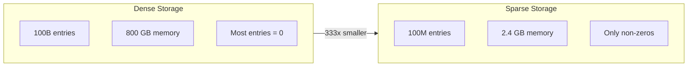

### Why CSR Specifically?

There are many sparse formats (COO, CSC, DOK, LIL), but **CSR (Compressed Sparse Row)** dominates scientific computing because it excels at the most common operation: **matrix-vector multiplication (SpMV)**.

SpMV computes `y = A * x` and appears in:
- Iterative linear solvers (conjugate gradient, GMRES)
- PageRank and graph algorithms
- Neural network sparse layers
- Finite element time-stepping

CSR makes SpMV fast by storing all values for each row contiguously in memory. The CPU can stream through these values efficiently, using its prefetcher to hide memory latency.

### What CSRMatrix Provides

The Fat-P CSRMatrix suite offers:

1. **CSRMatrix**: The standard implementation with optional OpenMP
2. **CSRMatrixParallel**: ThreadPool-based parallelism with work balancing
3. **HpcCSRMatrix**: NUMA-aware storage with software prefetching

All three are header-only with zero external dependencies beyond C++17.

---

## Understanding the CSR Format

### The Three Arrays

CSR uses three arrays to represent a sparse matrix:

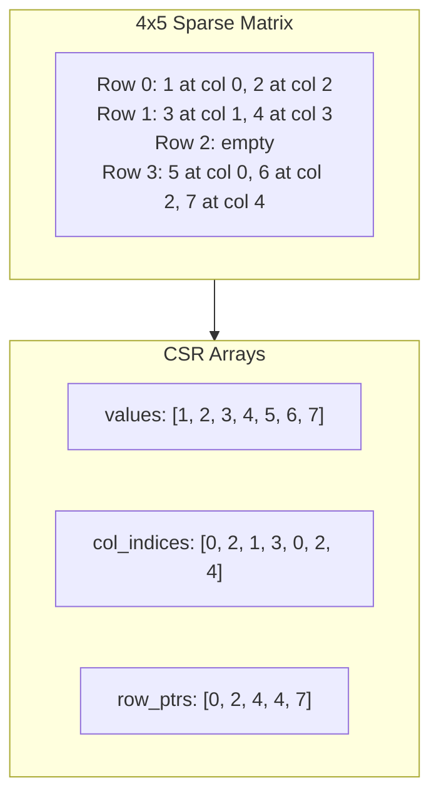

**values**: The non-zero values, stored row by row. Row 0's values come first, then row 1's, etc.

**col_indices**: The column of each non-zero. `col_indices[i]` tells you which column `values[i]` belongs to.

**row_ptrs**: Where each row starts in the values array. Row `i` spans from `row_ptrs[i]` to `row_ptrs[i+1]` (exclusive). The last element is always `nnz` (total non-zeros).

### Reading a Row

To access row 1 in the example above:
1. Start index: `row_ptrs[1] = 2`
2. End index: `row_ptrs[2] = 4`
3. Values: `values[2..4) = [3, 4]`
4. Columns: `col_indices[2..4) = [1, 3]`

So row 1 has value 3 at column 1, and value 4 at column 3.

### Why This Layout is Fast

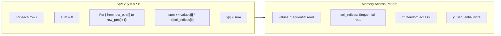

The critical insight: `values` and `col_indices` are accessed **sequentially**. Only the input vector `x` requires random access. Modern CPUs have hardware prefetchers that can predict sequential access patterns, making the first two arrays essentially free to read.

---

## Getting Started

### Prerequisites and Integration

CSRMatrix requires C++17 and has no external dependencies. Copy the headers to your project:

```
include/
├── CSRMatrix.h           # Standard implementation
├── CSRMatrixParallel.h   # ThreadPool parallelism
├── CSRMatrix_HPC.h       # NUMA + prefetch
├── ThreadPool.h          # Required for parallel variants
└── [other fat_p headers] # HpcVector, enforce, etc.
```

### Your First Sparse Matrix

```cpp
#include <iostream>
#include <vector>
#include "CSRMatrix.h"

int main()
{
    using namespace fat_p;
    
    // Define a 3x3 matrix:
    //     0  1  2
    // 0 [ 1  0  2 ]
    // 1 [ 0  3  0 ]
    // 2 [ 4  0  5 ]
    
    // COO format: list of (row, col, value) triplets
    std::vector<int> rows = {0, 0, 1, 2, 2};
    std::vector<int> cols = {0, 2, 1, 0, 2};
    std::vector<double> vals = {1.0, 2.0, 3.0, 4.0, 5.0};
    
    // Construct the CSR matrix
    CSRMatrix<double> A(3, 3, rows, cols, vals);
    
    std::cout << A << "\n";  // "CSRMatrix(3x3, nnz=5)"
    
    // Matrix-vector multiply
    std::vector<double> x = {1.0, 1.0, 1.0};
    std::vector<double> y = A * x;
    
    // y[0] = 1*1 + 2*1 = 3
    // y[1] = 3*1 = 3
    // y[2] = 4*1 + 5*1 = 9
    for (double val : y)
    {
        std::cout << val << " ";  // "3 3 9"
    }
    
    return 0;
}
```

Compile with:
```bash
g++ -std=c++17 -O2 example.cpp -o example
```

---

## Construction: Building Your Matrix

### The Construction Decision

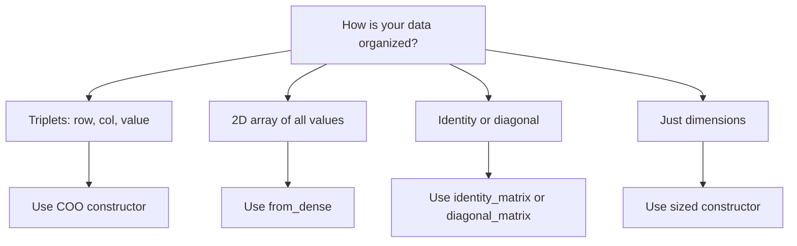

### COO Construction (Most Common)

COO (Coordinate) format is the natural way to specify sparse data: each non-zero is a (row, col, value) triplet.

```cpp
// Your data might come from file parsing, simulation output, etc.
std::vector<int> row_indices = {0, 1, 1, 2, 2, 2};
std::vector<int> col_indices = {0, 0, 2, 1, 2, 3};
std::vector<double> values = {1.0, 2.0, 3.0, 4.0, 5.0, 6.0};

// CSRMatrix sorts and organizes internally
CSRMatrix<double> A(num_rows, num_cols, row_indices, col_indices, values);
```

**Key behavior:**
- Arrays don't need to be sorted—CSRMatrix handles it
- Zeros are automatically filtered (sparse invariant)
- Duplicates are handled according to policy (see next section)

### Dense Conversion

When you have a traditional 2D array:

```cpp
// Row-major dense data
std::vector<double> dense = {
    1.0, 0.0, 2.0,
    0.0, 3.0, 0.0,
    4.0, 0.0, 5.0
};

auto A = CSRMatrix<double>::from_dense(dense.data(), 3, 3);
// A has 5 non-zeros (the 1, 2, 3, 4, 5)

// With tolerance for floating-point zeros
auto B = CSRMatrix<double>::from_dense(data, rows, cols, /*epsilon=*/1e-10);
```

### Factory Functions

```cpp
// 1000x1000 identity matrix (diagonal of ones)
auto I = identity_matrix<double>(1000);

// Diagonal matrix from a vector
std::vector<double> diag = {1.0, 2.0, 3.0, 4.0};
auto D = diagonal_matrix<double>(diag);  // 4x4, D(i,i) = diag[i]
```

### What NOT to Do

```cpp
// WRONG: O(n²) construction via set()
CSRMatrix<double> A(1000, 1000);
for (int i = 0; i < 1000; ++i)
{
    A.set(i, i, 1.0);  // Each call shifts all subsequent elements!
}

// RIGHT: O(n log n) via COO
std::vector<int> rows(1000), cols(1000);
std::vector<double> vals(1000, 1.0);
std::iota(rows.begin(), rows.end(), 0);
std::iota(cols.begin(), cols.end(), 0);
CSRMatrix<double> A(1000, 1000, rows, cols, vals);  // Fast!
```

The `set()` method is O(nnz) per call because it must maintain CSR structure. Use it only for occasional modifications, never for bulk construction.

---

## Duplicate Handling: The Assembly Problem

### Why Duplicates Happen

In finite element analysis, you build a global stiffness matrix by assembling element contributions. Adjacent elements share nodes, creating overlapping entries:

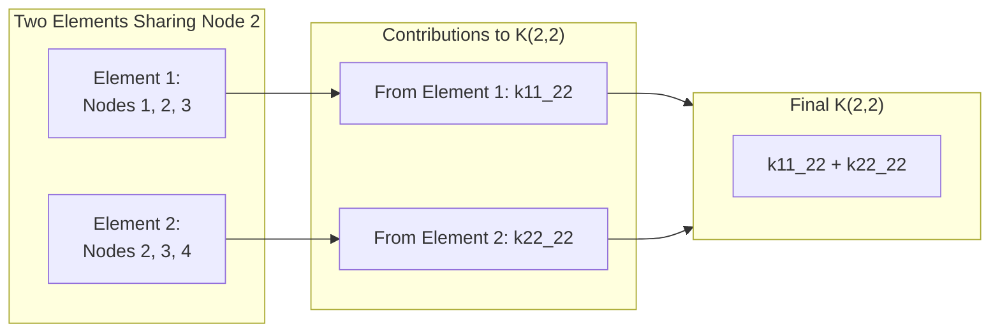

Your COO data naturally contains multiple entries for the same (row, col) position. How should CSRMatrix handle them?

### The Three Policies

```cpp
enum class DuplicatePolicy
{
    Sum,   // Add values together (default)
    Keep,  // Store all, sum on access
    Error  // Reject duplicates
};
```

### DuplicatePolicy::Sum

**What:** Combine duplicate entries by addition.

**When:** Finite element assembly, graph edge weights, any additive accumulation.

```cpp
// Two contributions to position (0,1)
std::vector<int> rows = {0, 0};
std::vector<int> cols = {1, 1};
std::vector<double> vals = {2.0, 3.0};

CSRMatrix<double> A(2, 2, rows, cols, vals, 
                    CSRMatrix<double>::DuplicatePolicy::Sum);

std::cout << A(0, 1) << "\n";  // 5.0 (2.0 + 3.0)
std::cout << A.nnz() << "\n";  // 1 (merged into single entry)
```

### DuplicatePolicy::Keep

**What:** Store all entries, but return their sum when accessed.

**When:** Audit trails where you need to preserve individual contributions.

```cpp
CSRMatrix<double> A(2, 2, rows, cols, vals, 
                    CSRMatrix<double>::DuplicatePolicy::Keep);

std::cout << A(0, 1) << "\n";  // 5.0 (sum of both)
std::cout << A.nnz() << "\n";  // 2 (both entries stored)

// Mathematically equivalent to Sum for all operations
// But you can inspect raw storage if needed
```

### DuplicatePolicy::Error

**What:** Throw an exception if any duplicates exist.

**When:** Input validation when duplicates indicate data corruption.

```cpp
try
{
    CSRMatrix<double> A(2, 2, rows, cols, vals, 
                        CSRMatrix<double>::DuplicatePolicy::Error);
}
catch (const std::invalid_argument& e)
{
    std::cerr << "Duplicate detected: " << e.what() << "\n";
}
```

---

## Matrix-Vector Multiplication: The Core Operation

### Why SpMV Matters

SpMV (y = A·x) is the kernel inside almost every sparse algorithm:

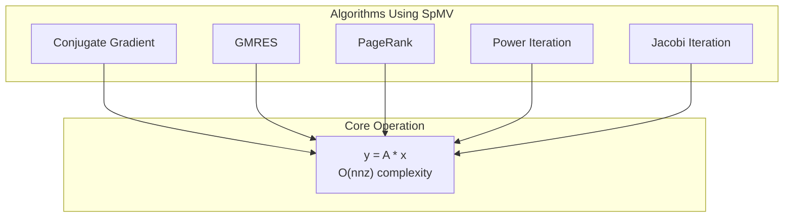

A solver might call SpMV thousands of times per solution. Making SpMV fast makes everything fast.

### Basic Interface

```cpp
CSRMatrix<double> A = /* ... */;
std::vector<double> x(A.cols(), 1.0);

// Operator syntax
std::vector<double> y = A * x;

// Pointer syntax (no allocation)
std::vector<double> y2(A.rows());
A.matvec(x.data(), y2.data());
```

### BLAS-Style Interface

The standard BLAS form for SpMV is `y = α·A·x + β·y`:

```cpp
double alpha = 2.0;
double beta = 0.5;

// y = 2.0 * A * x + 0.5 * y
A.matvec(alpha, x.data(), beta, y.data());
```

**Common patterns:**

| alpha | beta | Operation | Use Case |
|-------|------|-----------|----------|
| 1 | 0 | y = A·x | Simple multiply |
| 1 | 1 | y += A·x | Accumulate |
| -1 | 1 | y -= A·x | Residual computation |
| ω | 1-ω | Relaxation | Iterative methods |

### The NaN Safety Problem

Consider this common pattern:

```cpp
std::vector<double> y(A.rows());  // Uninitialized!
A.matvec(1.0, x.data(), 0.0, y.data());
```

A naive implementation would compute `y[i] = 1.0 * sum + 0.0 * y[i]`. If `y[i]` contains NaN (common in uninitialized memory), the result is NaN even though we're multiplying by zero.

CSRMatrix handles this safely:

```cpp
// Internal implementation
if (beta == T{0})
{
    y[i] = alpha * sum;  // No read from y
}
else
{
    y[i] = alpha * sum + beta * y[i];
}
```

---

## Matrix Arithmetic

### When You Need Full Matrix Operations

Beyond SpMV, CSRMatrix supports complete matrix arithmetic for building complex expressions:

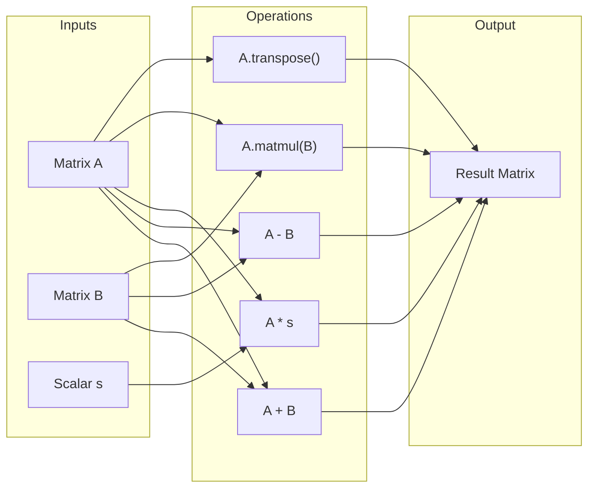

### Transpose

```cpp
CSRMatrix<double> AT = A.transpose();

// Properties preserved:
// AT.rows() == A.cols()
// AT.cols() == A.rows()
// AT.nnz() == A.nnz()
// AT(i,j) == A(j,i)
```

**Algorithm:** Two-pass counting sort. O(nnz) time, O(cols) auxiliary space.

### Addition and Subtraction

```cpp
auto C = A + B;  // Requires same dimensions
auto D = A - B;

A += B;  // In-place
A -= B;
```

**Sparsity note:** If `A(i,j) = 5` and `B(i,j) = -5`, the result has no entry at (i,j). CSRMatrix automatically removes zeros to maintain the sparse invariant.

### Scalar Multiplication

```cpp
auto B = A * 2.5;
auto C = 2.5 * A;  // Same result
A *= 2.5;          // In-place
```

**Special case:** `A * 0` returns an empty matrix (no entries).

### Matrix-Matrix Multiplication (SpGEMM)

```cpp
// C = A * B, where A is m×k and B is k×n
CSRMatrix<double> C = A.matmul(B);  // C is m×n
```

SpGEMM is more complex than SpMV because the result's sparsity pattern isn't known in advance. CSRMatrix uses a hash-based accumulator:

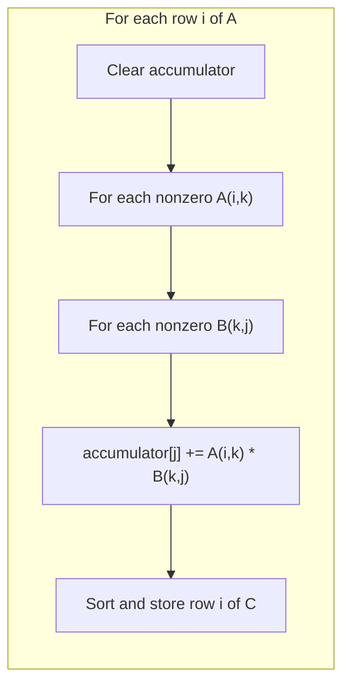

---

## Parallelism: Scaling to Multiple Cores

### The Load Imbalance Problem

Consider a social network graph: celebrity accounts have millions of followers, while most users have hundreds. Row 0 (the celebrity) has 1,000,000 non-zeros; rows 1-999,999 have 100 each.

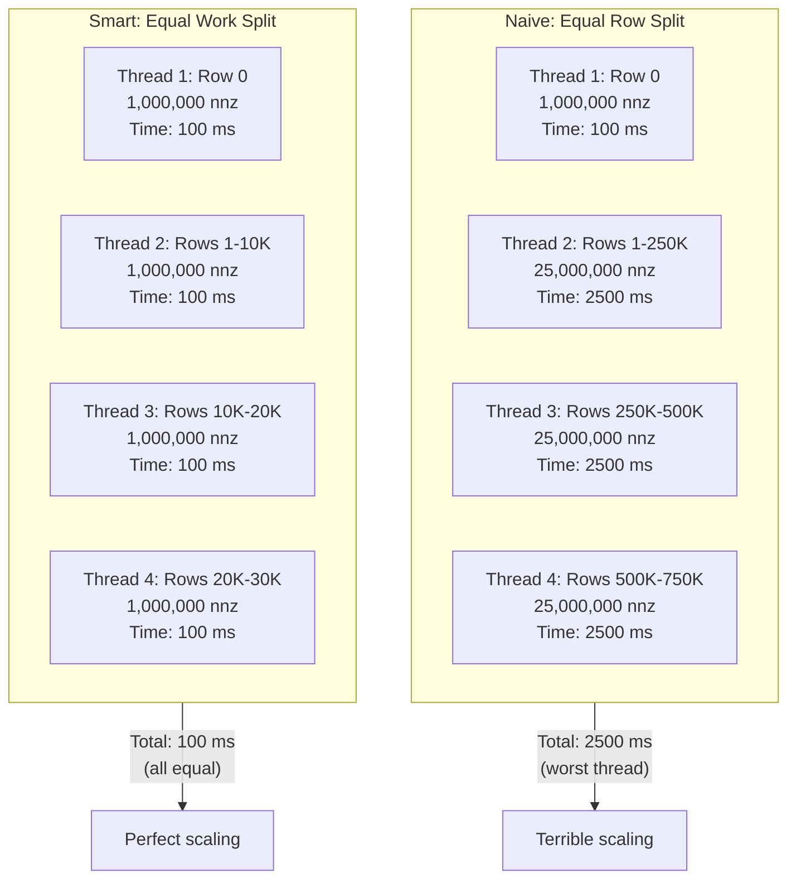

OpenMP's default `schedule(static)` gives each thread equal rows—disaster for power-law distributions.

### CSRMatrixParallel: Work-Balanced Solution

```cpp
#include "CSRMatrixParallel.h"
using namespace fat_p;

CSRMatrix<double> A = /* power-law matrix */;
ThreadPool pool(8);

// Work-balanced parallel SpMV
std::vector<double> y = matvec_parallel(A, x, pool);
```

CSRMatrixParallel partitions by **nnz count**, not row count:

```cpp
// Internal algorithm (simplified)
size_t target_nnz = total_nnz / num_threads;
size_t current_start = 0, current_nnz = 0;

for (size_t i = 0; i < num_rows; ++i)
{
    current_nnz += row_nnz(i);
    if (current_nnz >= target_nnz)
    {
        partitions.push_back({current_start, i + 1});
        current_start = i + 1;
        current_nnz = 0;
    }
}
```

### Batch vs. Individual Futures

```cpp
// Individual futures: more overhead
matvec_threadpool(A, x.data(), y.data(), pool);
// Each partition creates a std::future, each requires synchronization

// Batch submission: less overhead
matvec_threadpool_batch(A, x.data(), y.data(), pool);
// All partitions submitted together, single wait point
```

For matrices under 1M nnz, batch submission reduces per-partition task submission overhead by amortizing a single synchronization point across all partitions. See `components/CSRMatrix/results/` for current platform-specific benchmark data.

---

## HPC Features: Maximum Performance

### When You Need HpcCSRMatrix

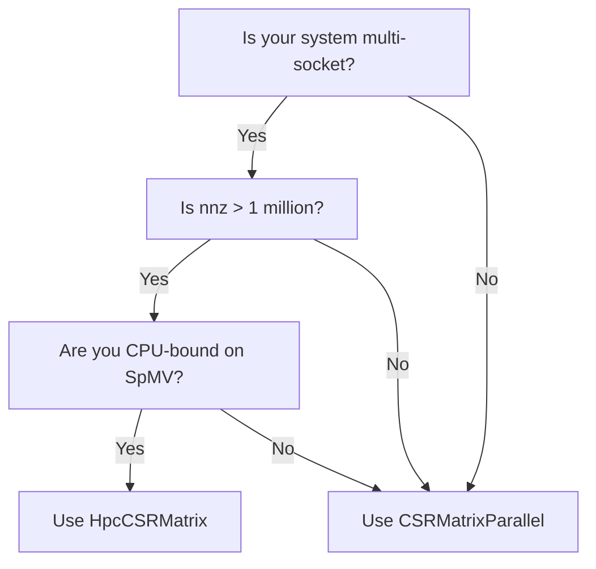

### NUMA: The Hidden Performance Killer

On multi-socket systems, memory is physically attached to specific CPU sockets. Accessing "remote" memory (attached to another socket) takes 50-100% longer:

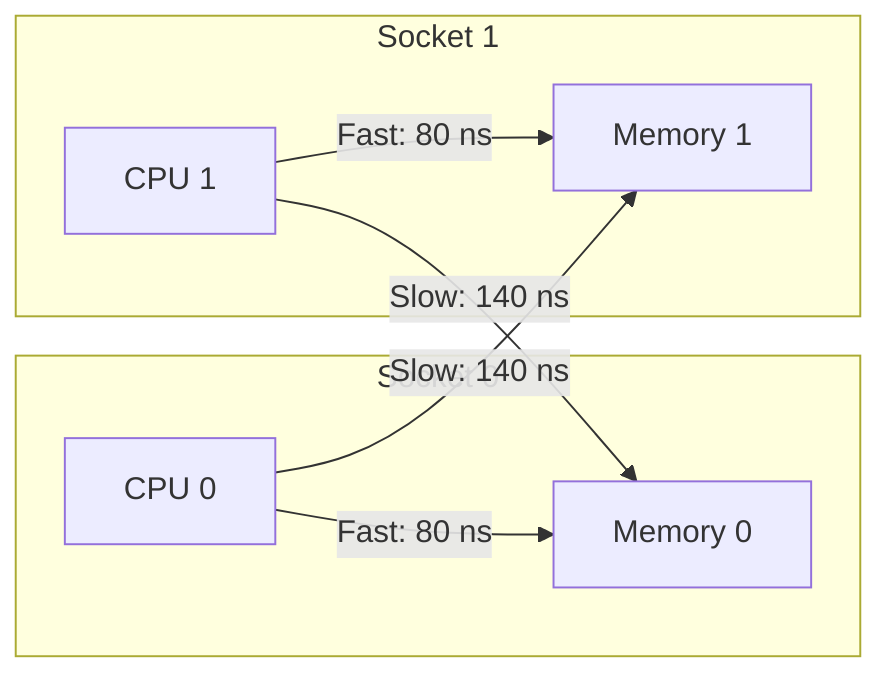

HpcCSRMatrix uses NUMA-aware allocation to place data on the local socket:

```cpp
#include "CSRMatrix_HPC.h"
using namespace fat_p;

HpcCSRMatrix<double> A(rows, cols, row_idx, col_idx, vals);

if (A.is_numa_available())
{
    std::cout << "Data allocated on local NUMA node\n";
}
```

### Software Prefetching

CPUs have hardware prefetchers that predict sequential access, but they can't predict the random accesses to `x[col_indices[j]]`. HpcCSRMatrix inserts explicit prefetch instructions:

```cpp
// Simplified internal implementation
for (ptr_type j = start; j < end; ++j)
{
    // Tell CPU to fetch x[col_indices[j+4]] now
    // It will be ready when we need it 4 iterations later
    prefetch(&x[col_indices[j + 4]]);
    
    sum += values[j] * x[col_indices[j]];
}
```

**Caveat:** Modern Intel CPUs (Arrow Lake, etc.) have very aggressive hardware prefetchers. Software prefetch may add overhead without benefit. Test with `use_prefetch=false`:

```cpp
A.matvec(x.data(), y.data(), /*use_prefetch=*/false);
```

---

## Choosing Your Variant

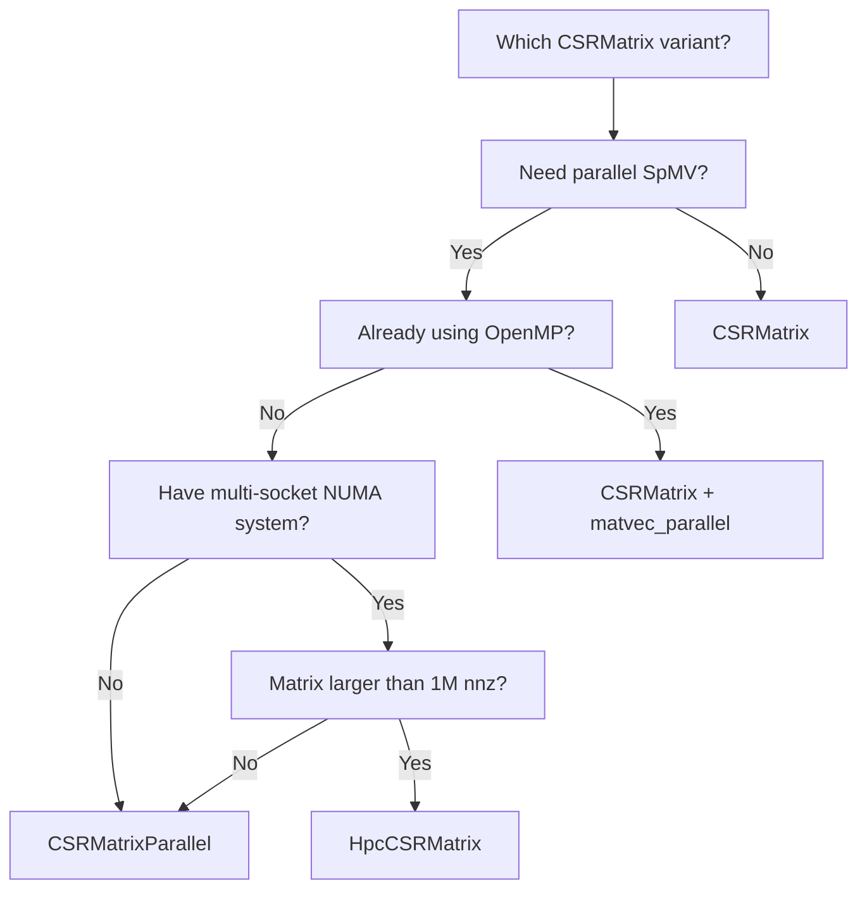

### Quick Reference

| Variant | Dependencies | Best For |
|---------|--------------|----------|
| CSRMatrix | None | Single-threaded, simple use |
| CSRMatrix + OpenMP | OpenMP | Uniform sparsity patterns |
| CSRMatrixParallel | ThreadPool.h | Power-law distributions |
| HpcCSRMatrix | Multiple fat_p headers | Multi-socket NUMA systems |

---

## Performance Tuning

### Serial Fallback Threshold

Parallel overhead can exceed computation for small matrices:

```cpp
ParallelConfig config;
config.min_nnz_for_parallel = 50000;  // Below this, use serial

matvec_threadpool(A, x, y, pool, config);
// Automatically falls back to A.matvec() if A.nnz() < 50000
```

**Rule of thumb:** Serial is faster below ~50K nnz. Adjust based on your hardware.

### Task Granularity

```cpp
ParallelConfig config;
config.min_nnz_per_task = 8192;   // Minimum work per task
config.max_tasks = 0;              // 0 means thread_count × 4
```

More tasks = better load balancing but more overhead.
Fewer tasks = less overhead but potential imbalance.

### Prefetch Control (HpcCSRMatrix)

```cpp
HpcParallelConfig config;
config.use_prefetch = true;   // Default: software prefetch enabled
config.use_prefetch = false;  // Try this on Arrow Lake and newer

A.matvec_parallel(x, y, pool, config);
```

Always benchmark both settings on your target hardware.

---

## Common Patterns and Recipes

### Iterative Solver (Conjugate Gradient Core)

```cpp
// The SpMV-heavy inner loop of CG
void cg_iteration(const CSRMatrix<double>& A,
                  std::vector<double>& x,
                  std::vector<double>& r,
                  std::vector<double>& p,
                  std::vector<double>& Ap)
{
    // Ap = A * p
    A.matvec(p.data(), Ap.data());
    
    double pAp = dot(p, Ap);
    double alpha = dot(r, r) / pAp;
    
    // x = x + alpha * p
    axpy(alpha, p, x);
    
    // r = r - alpha * Ap
    axpy(-alpha, Ap, r);
}
```

### PageRank Iteration

```cpp
void pagerank_iteration(const CSRMatrix<double>& A,
                        double damping,
                        std::vector<double>& rank)
{
    size_t n = A.rows();
    double base = (1.0 - damping) / n;
    
    std::vector<double> new_rank(n);
    
    // new_rank = damping * A * rank
    A.matvec(damping, rank.data(), 0.0, new_rank.data());
    
    // new_rank += base (teleportation)
    for (size_t i = 0; i < n; ++i)
    {
        new_rank[i] += base;
    }
    
    std::swap(rank, new_rank);
}
```

### Finite Element Assembly

```cpp
CSRMatrix<double> assemble_stiffness(const Mesh& mesh)
{
    std::vector<int> rows, cols;
    std::vector<double> vals;
    
    // Reserve approximate capacity
    size_t approx_nnz = mesh.elements().size() * 16;  // 4x4 element matrices
    rows.reserve(approx_nnz);
    cols.reserve(approx_nnz);
    vals.reserve(approx_nnz);
    
    for (const Element& elem : mesh.elements())
    {
        auto K_local = elem.stiffness_matrix();
        
        for (int i = 0; i < elem.nodes(); ++i)
        {
            for (int j = 0; j < elem.nodes(); ++j)
            {
                rows.push_back(elem.global_node(i));
                cols.push_back(elem.global_node(j));
                vals.push_back(K_local(i, j));
            }
        }
    }
    
    // DuplicatePolicy::Sum handles overlaps automatically
    return CSRMatrix<double>(mesh.num_dofs(), mesh.num_dofs(),
                             rows, cols, vals);
}
```

---

## Troubleshooting

### Compilation Errors

**"CSRMatrix requires arithmetic value type"**
```cpp
// CSRMatrix only supports numeric types
CSRMatrix<std::string> A;  // Error!
CSRMatrix<double> A;       // OK
```

**"Unsigned integer value types are not supported"**
```cpp
// Subtraction can produce negative values
CSRMatrix<unsigned int> A;  // Error!
CSRMatrix<int> A;           // OK
```

### Runtime Errors

**std::out_of_range during construction**
- Check that all row indices are in [0, rows)
- Check that all column indices are in [0, cols)
- Look for negative indices (data corruption)

**std::overflow_error**
- Matrix dimensions exceed int32_t max (~2 billion)
- Use `CSRMatrix<double, int64_t>` for huge matrices

### Performance Issues

**Parallel slower than serial**
```cpp
// Check 1: Is the matrix large enough?
if (A.nnz() < 50000)
{
    // Use serial instead
}

// Check 2: Are you using batch submission?
matvec_threadpool_batch(A, x, y, pool);  // Faster than matvec_threadpool

// Check 3: Is the thread pool warm?
// First call incurs thread creation overhead
```

**HpcCSRMatrix prefetch hurts performance**
```cpp
// Try disabling software prefetch
A.matvec(x.data(), y.data(), /*use_prefetch=*/false);
// Modern CPUs may have better hardware prefetchers
```

---

---

## Use Case: Sparse Matrix-Vector Multiplication (SpMV)

The canonical sparse linear algebra operation:

```cpp
fat_p::CSRMatrix<double> A = load_matrix("system.mtx");
std::vector<double> x(A.cols(), 1.0);
std::vector<double> y(A.rows(), 0.0);

// y = A * x
for (size_t i = 0; i < A.rows(); ++i)
{
    double sum = 0.0;
    for (auto it = A.row_begin(i); it != A.row_end(i); ++it)
    {
        sum += it->value * x[it->col];
    }
    y[i] = sum;
}
```

## Use Case: Graph Adjacency Matrix

Represent a sparse directed graph where entry (i,j) = edge weight:

```cpp
fat_p::CSRMatrix<float> graph(num_nodes, num_nodes);
graph.insert(0, 1, 1.0f);  // Edge 0 -> 1, weight 1.0
graph.insert(0, 3, 0.5f);  // Edge 0 -> 3, weight 0.5

// BFS-style neighbor iteration
for (auto it = graph.row_begin(node); it != graph.row_end(node); ++it)
{
    visit_neighbor(it->col, it->value);
}
```

## Use Case: Finite Element Assembly

Assemble a stiffness matrix from element contributions:

```cpp
fat_p::CSRMatrix<double> K(num_dofs, num_dofs);

for (const auto& element : mesh.elements())
{
    auto ke = element.stiffness_matrix();  // Dense element matrix
    for (size_t i = 0; i < ke.rows(); ++i)
        for (size_t j = 0; j < ke.cols(); ++j)
            K.add_to(element.dof(i), element.dof(j), ke(i, j));
}
K.finalize();  // Sort and compress
```

## Best Practices

**Build in COO format, then convert to CSR.** Inserting into CSR directly requires sorted insertion. Build as coordinate list (triplets), then call `finalize()` which sorts and compresses.

**Iterate rows with row_begin/row_end.** The CSR format is optimized for row access. Column access requires scanning the entire matrix.

**Pre-allocate with estimated nnz.** If you know the approximate number of non-zeros, reserve storage to avoid reallocations during assembly.

## Expanded Troubleshooting

### Very slow random column access

CSR is row-oriented. Column access is O(nnz). If you need fast column access, maintain a CSC (Compressed Sparse Column) copy, or use a different format.

### Duplicate entries after finalize()

`finalize()` sums duplicate (i, j) entries by default. If you want the last value instead of the sum, check the finalize options.

---

## Summary

The CSRMatrix suite provides production-ready sparse matrix operations with three levels of optimization:

**CSRMatrix** is the foundation:
- Zero dependencies, header-only
- COO construction with three duplicate policies
- NaN-safe BLAS-style SpMV
- Complete matrix arithmetic

**CSRMatrixParallel** adds scalable parallelism:
- Work-balanced partitioning for irregular matrices
- ThreadPool integration (no OpenMP required)
- Batch submission for reduced overhead

**HpcCSRMatrix** maximizes hardware utilization:
- NUMA-aware memory allocation
- Software prefetching (configurable)
- Contract-based safety in debug builds

**Decision guide:**
- Simple use case → CSRMatrix
- Need parallelism → CSRMatrixParallel
- Multi-socket server → HpcCSRMatrix

---

*CSRMatrix.h, CSRMatrix_HPC.h, CSRMatrixParallel.h — Fat-P Library*
