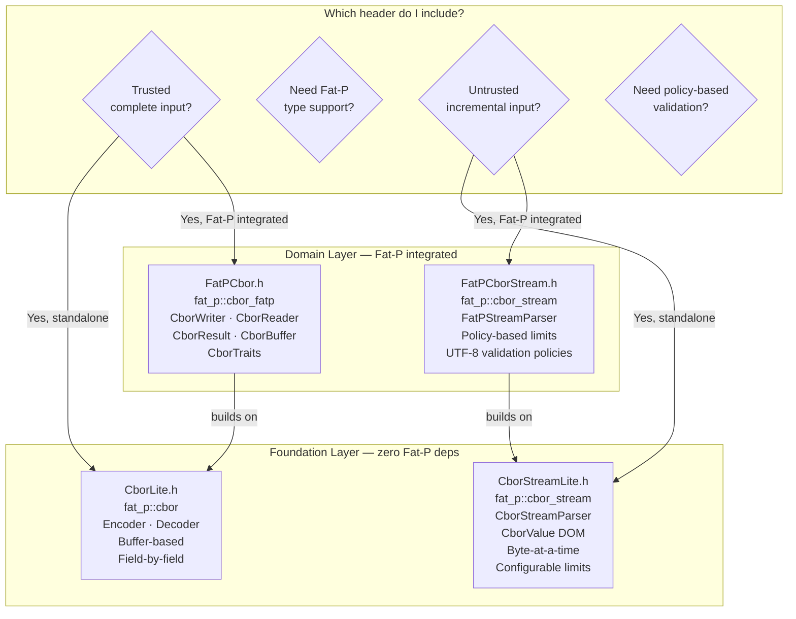

# Overview - Cbor

*Fat-P Library — February 2026*

---

## Executive Summary

Cbor is Fat-P's implementation of the Concise Binary Object Representation (IETF RFC 8949), split across four headers that serve different dependency budgets and parsing models. CborLite.h (Foundation, zero Fat-P dependencies) provides a low-level Encoder/Decoder for buffer-based CBOR encoding and decoding. CborStreamLite.h (Foundation) provides a byte-at-a-time streaming parser that builds a DOM (`CborValue`) incrementally with configurable limits on depth, string size, array size, and total input—designed for untrusted network input where early rejection matters. FatPCbor.h (Domain) adds template-based `CborWriter`/`CborReader` over arbitrary byte containers, `CborResult<T>` (Expected-based errors), `CborBuffer` (HpcVector-backed), and `CborTraits<T>` for automatic serialization of Fat-P types. FatPCborStream.h (Domain) adds policy-based streaming with configurable limits, UTF-8 validation, and strict parsing policies.

CBOR's advantage over Fat-P's BinaryLite format is standardization: any system that speaks RFC 8949—IoT devices, web services, authentication protocols (COSE/WebAuthn), databases—can read the output. The advantage over JSON is compactness and parse speed without sacrificing self-description.

---

## Overview Card

**Component:** Cbor (CborLite + CborStreamLite + FatPCbor + FatPCborStream)
**Problem solved:** Standardized, compact, self-describing binary serialization for cross-system data exchange
**When to use:** Data crosses system boundaries to non-C++ readers; IoT/embedded protocols; COSE/WebAuthn integration; any case where RFC 8949 compliance is required
**When NOT to use:** Internal-only C++ data exchange where no external reader exists (use BinarySerialization—lower overhead); human-readable config files (use JSON); schema-evolving wire protocols with codegen (use Protocol Buffers)
**Key guarantee:** Wire output conforms to RFC 8949; all reads are bounds-checked; streaming parser enforces configurable depth and size limits
**std equivalent:** None
**Boost equivalent:** None (no Boost CBOR implementation exists)
**Other alternatives:** libcbor (C library), tinycbor (embedded C), nlohmann/json CBOR support (C++), cn-cbor (C)
**Read next:** User Manual - Cbor

---

## The Problem Domain

### What Goes Wrong Without It

When data must cross a system boundary—from a C++ backend to a Python microservice, from an embedded sensor to a cloud ingestion pipeline, from a hardware security module to a browser via WebAuthn—the serialization format must be understood by both sides without sharing source code.

JSON solves this for text but carries the parsing cost described in the BinarySerialization overview: character-by-character decimal conversion for every number, UTF-8 escape handling, and payload sizes 2–3× larger than necessary for numeric data.

Fat-P's BinaryLite solves the performance problem but uses a proprietary format. If the reader is not C++ code compiled against BinaryLite.h, it cannot decode the data without reimplementing the format from scratch.

CBOR occupies the middle ground. It is an IETF standard (RFC 8949, successor to RFC 7049) designed explicitly as "JSON's binary cousin": the same data model (integers, strings, byte arrays, arrays, maps, booleans, null) encoded in a compact binary format with variable-length integer packing. Libraries exist for every major language. The format is used in production by COSE (CBOR Object Signing and Encryption), WebAuthn/FIDO2, CoAP (Constrained Application Protocol for IoT), and CDDL (Concise Data Definition Language).

The tradeoff versus BinaryLite is overhead. CBOR uses big-endian wire format (network byte order) and variable-length integer encoding. On little-endian machines, every multi-byte integer requires a byte swap. The variable-length encoding adds branch-dependent logic to every read. For internal C++ data exchange where both sides are Fat-P code, BinaryLite is measurably lighter. For cross-system exchange, CBOR's standardization is worth the overhead.

### Why Four Headers

CBOR parsing has two fundamentally different use cases that require different architectures:

**Trusted, complete input.** The entire CBOR payload is in memory. The producer is known. The format is agreed upon. You want to encode/decode specific fields in known order—like BinaryLite but in CBOR format. CborLite.h and FatPCbor.h serve this case.

**Untrusted, incremental input.** Bytes arrive over a network connection. The producer is unknown or adversarial. The payload may be malformed, truncated, or deliberately crafted to exhaust memory (billion-element arrays, deeply nested structures, multi-gigabyte strings). You need a parser that can reject bad input early, process bytes incrementally, and enforce limits at every step. CborStreamLite.h and FatPCborStream.h serve this case.

The Foundation/Domain split within each pair follows the same pattern as BinarySerialization: the Lite headers have zero Fat-P dependencies; the FatP headers add Expected-based errors, HpcVector buffers, and Fat-P type traits.

---

## Architecture: Four Headers, Two Models, Two Layers



---

## Feature Inventory

### 1. RFC 8949 Wire Format

All four headers produce and consume wire-compatible CBOR. The eight major types are supported:

| Major Type | Value | Examples |
|------------|-------|---------|
| 0: Unsigned integer | 0–2^64-1 | Counters, IDs, timestamps |
| 1: Negative integer | -1 to -2^64 | Signed values (CBOR's -1-n encoding) |
| 2: Byte string | Raw bytes with length prefix | Binary payloads, cryptographic material |
| 3: Text string | UTF-8 with length prefix | Human-readable strings |
| 4: Array | Ordered sequence with count prefix | Lists, tuples |
| 5: Map | Key-value pairs with count prefix | Objects, dictionaries |
| 6: Tag | Semantic annotation wrapping another value | Timestamps, bignums, COSE structures |
| 7: Simple/Float | Booleans, null, IEEE 754 floats | Flags, missing values, measurements |

Variable-length integer packing means small values (0–23) encode in a single byte. Values up to 255 use two bytes. Values up to 65535 use three bytes. This compresses common payloads significantly compared to fixed-width formats.

### 2. Buffer-Based Encoding/Decoding (CborLite)

The Encoder appends CBOR-encoded data to a `std::vector<uint8_t>`. The Decoder reads sequentially with bounds checking and nesting depth enforcement (configurable, default 64):

```cpp
fat_p::cbor::buffer buf;
fat_p::cbor::Encoder enc(buf);
enc.writeUint(42);
enc.writeText("hello");
enc.beginArray(2);
enc.writeInt(-1);
enc.writeBool(true);

fat_p::cbor::Decoder dec(buf);
uint64_t n = dec.readUint();     // 42
std::string s = dec.readText();  // "hello"
size_t len = dec.readArrayLength();  // 2
int64_t v = dec.readInt();       // -1
bool b = dec.readBool();         // true
dec.endContainer();              // restore depth counter
```

### 3. Streaming Parser with Limits (CborStreamLite)

The `CborStreamParser` is a byte-at-a-time state machine that builds a `CborValue` DOM incrementally. It accepts data in arbitrary chunks and returns one of three statuses: `NeedMoreData`, `Done`, or `Error`. Configurable limits reject malicious input early:

```cpp
fat_p::cbor_stream::CborStreamParser parser;
parser.set_max_depth(32);
parser.set_max_string_bytes(1024 * 1024);  // 1 MB strings max

auto status = parser.feed(chunk.data(), chunk.size());
if (status == fat_p::cbor_stream::ParseStatus::Done)
{
    fat_p::cbor_stream::CborValue root = parser.result();
    // Process the DOM tree
}
```

This is the correct parser for network protocols, REST API bodies, WebSocket messages, and any input where the producer is not fully trusted.

### 4. CborValue DOM (CborStreamLite)

`CborValue` is a `std::variant` over all CBOR types: `uint64_t`, `int64_t`, `string`, `CborBytes`, `CborArray`, `CborMap`, `CborTagged`, `SimpleValue`, and `double`. It supports comparison operators (enabling use as map keys), copy/move semantics, and type inspection. The streaming parser builds this DOM incrementally; application code navigates it after parsing completes.

### 5. CborWriter/CborReader with Expected Errors (FatPCbor)

`CborWriter<Buffer>` is a template over any byte container (defaults to `CborBuffer`, which is `HpcVector<uint8_t, 64>`). `CborReader` decodes into `CborResult<T>` (`Expected<T, CborError>`) instead of throwing exceptions. `CborTraits<T>` provides automatic serialization for arithmetic types, enums, booleans, doubles, strings, `std::vector<T>`, and `std::map<K, V>`.

### 6. Policy-Based Streaming (FatPCborStream)

`FatPStreamParser` accepts policy types for limits and validation:

| Policy | Behavior |
|--------|----------|
| `DefaultLimitsPolicy` | 64 depth, 16 MB strings, 256 MB total |
| `StrictLimitsPolicy` | 16 depth, 1 MB strings, 16 MB total |
| `RelaxedLimitsPolicy` | 256 depth, 256 MB strings, 1 GB total |
| `RuntimeLimitsPolicy` | Configurable at runtime |
| `NoValidationPolicy` | No UTF-8 validation |
| `Utf8ValidationPolicy` | Validates all text strings |
| `StrictValidationPolicy` | UTF-8 + additional structural checks |

---

## Why Not Alternatives?

### BinarySerialization (BinaryLite.h / FatPBinary.h)

| Aspect | BinarySerialization | Cbor |
|--------|---------------------|------|
| **Standardization** | Fat-P internal | IETF RFC 8949 |
| **Wire byte order** | Little-endian (zero-cost on x86/ARM) | Big-endian (byte swap on x86/ARM) |
| **Integer encoding** | Fixed-width (1 tag + N bytes) | Variable-length (1–9 bytes) |
| **Cross-system** | Not designed for it | Designed for it |
| **Parse speed** | Marginally lighter | Marginally heavier |

**Use BinarySerialization when** both endpoints are Fat-P C++ code and standardization doesn't matter. **Use Cbor when** any reader might not be C++.

### JSON (JsonLite.h / FatPJson.h)

| Aspect | JSON | Cbor |
|--------|------|------|
| **Human readable** | Yes | No |
| **Payload size** | ~2–3× larger for numeric data | Compact |
| **Parse speed** | Decimal conversion | Variable-length integer decode |
| **Standardization** | IETF RFC 8259 | IETF RFC 8949 |

**Use JSON when** humans need to read the data. **Use Cbor when** compactness matters and both sides have CBOR libraries.

### External CBOR Libraries

| Aspect | libcbor | tinycbor | Fat-P Cbor |
|--------|---------|----------|------------|
| **Language** | C | C | C++20 |
| **Integration** | Separate build | Separate build | Header-only |
| **Error handling** | Return codes | Return codes | Exceptions or Expected |
| **Streaming** | No | No | CborStreamParser with limits |
| **Fat-P types** | Manual | Manual | CborTraits automatic |
| **Dependencies** | cmake build | cmake build | None (CborLite) or Expected + HpcVector (FatPCbor) |

---

## Performance Characteristics

| Operation | Complexity | Mechanism |
|-----------|------------|-----------|
| Encode integer (0–23) | O(1) | Single byte write |
| Encode integer (24–255) | O(1) | 2-byte write |
| Encode string (N bytes) | O(N) | Length prefix + memcpy |
| Decode integer | O(1) | Read 1–9 bytes, byte swap |
| Stream parse (N bytes) | O(N) | State machine, one pass |
| CborValue DOM construction | O(N) | Variant allocation per value |

### Where Cbor Wins

**Cross-system interoperability.** RFC 8949 compliance means any CBOR library in any language can read the output. No format documentation needed.

**Untrusted input safety.** The streaming parser with configurable limits is purpose-built for network parsing. CborLite's Decoder also enforces nesting depth.

**Compact variable-length encoding.** Small integers (common in real-world data) encode in a single byte versus 2–5 bytes in BinaryLite's fixed-width tagged format.

### Where Cbor Loses

**Parse speed versus BinaryLite.** Variable-length integer decoding requires branch-dependent logic. Big-endian wire format requires byte swaps on little-endian machines. For internal C++ data exchange, BinaryLite's `memcpy`-based decode is lighter.

**No schema evolution.** Like BinaryLite, CBOR is schema-less. Adding fields breaks old readers.

**DOM memory overhead.** `CborValue` uses `std::variant` with heap-allocated containers. For large datasets, the DOM consumes significantly more memory than the wire format.

---

## Integration Points

```
CborLite.h (Foundation)
    → depends on: standard library only
    → used by: FatPCbor.h, standalone CBOR encoding

CborStreamLite.h (Foundation)
    → depends on: standard library only
    → used by: FatPCborStream.h, network protocol parsing

FatPCbor.h (Domain)
    → depends on: CborLite.h, Expected.h, HpcVector.h
    → pairs with: SmallVector, StrongId, EnumPlus (CborTraits)

FatPCborStream.h (Domain)
    → depends on: CborStreamLite.h, Expected.h, HpcVector.h
    → pairs with: WorkQueue (streaming network input)
```

---

## Final Assessment

**Permanence.** CBOR (RFC 8949) is an IETF standard used in COSE, WebAuthn, CoAP, and numerous IoT protocols. It is not going away.

**Layering.** The four-header split gives standalone projects (CborLite, CborStreamLite) zero-dependency CBOR encoding, while Fat-P integrated projects (FatPCbor, FatPCborStream) get Expected-based errors, HpcVector buffers, trait-based serialization, and policy-based validation.

**Tradeoffs acknowledged.** Heavier than BinaryLite for internal-only exchange. No human readability. DOM construction allocates per-value. Indefinite-length encoding is not supported (rare in practice, but a conformance gap). When these matter, use BinarySerialization, JSON, or a streaming-only approach respectively.

---

*CborLite.h · CborStreamLite.h · FatPCbor.h · FatPCborStream.h — Fat-P Library*
