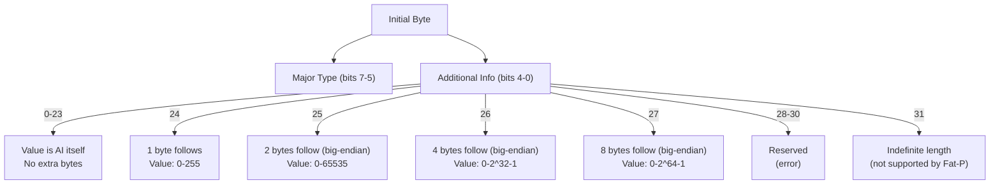
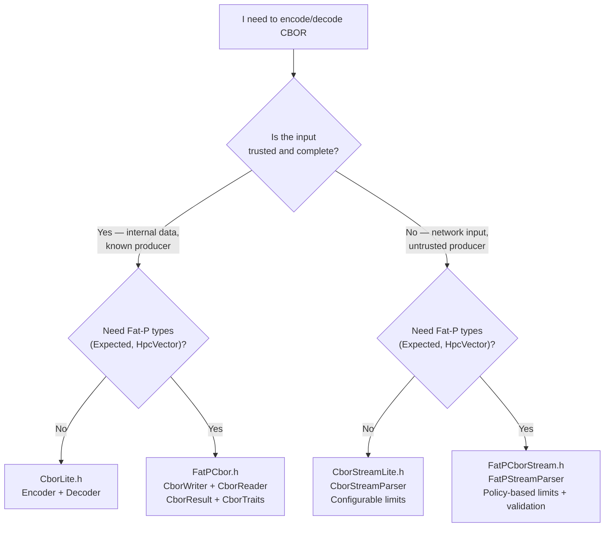
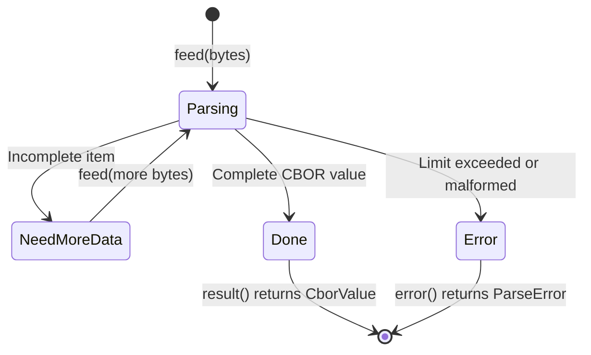

# User Manual - Cbor

*February 2026*

---

**Scope:** Complete usage guide for Fat-P's four CBOR headers: CborLite.h (buffer-based Encoder/Decoder), CborStreamLite.h (streaming parser with DOM construction), FatPCbor.h (CborWriter/CborReader with Expected-based errors and CborTraits), and FatPCborStream.h (policy-based streaming with validation). Covers the RFC 8949 wire format, variable-length integer encoding, the CborValue DOM, nesting depth enforcement, the "which header do I use" decision, untrusted input handling, migration from JSON, and integration with Fat-P types.

**Not covered:**
- CBOR Sequences (RFC 8742) — each header parses a single CBOR data item
- Indefinite-length encoding — deliberately excluded (see Known Limitations)
- COSE (RFC 9052) signature/encryption construction — Fat-P encodes CBOR, not COSE structures
- CDDL schema validation — no schema language support
- JSON serialization (`JsonLite.h` — separate component)
- BinaryLite serialization (`BinaryLite.h` — separate component)

**Prerequisites:**
- C++20
- Understanding of what "binary encoding" means (bytes, not characters)
- Familiarity with the JSON data model (objects, arrays, strings, numbers, booleans, null)
- For streaming parser sections: basic understanding of state machines and why incremental parsing matters for network protocols

---

## User Manual Card

**Component:** Cbor (CborLite + CborStreamLite + FatPCbor + FatPCborStream)
**Primary use case:** Encode C++ values into RFC 8949 CBOR for cross-system exchange; decode CBOR from external sources with safety limits
**Integration pattern:** Choose one of four headers based on dependency budget and trust model; encode with Encoder/CborWriter, decode with Decoder/CborReader/CborStreamParser
**Key API:** `Encoder`, `Decoder`, `CborStreamParser`, `CborValue`, `CborWriter<Buffer>`, `CborReader`, `FatPStreamParser`, `CborResult<T>`, `CborTraits<T>`
**std equivalent:** None
**Migration from std:** No standard CBOR exists
**Common mistakes:** Forgetting to call `endContainer()` after reading arrays/maps (causes spurious depth errors); using CborLite for untrusted input (use CborStreamLite with limits); encoding negative integers with writeUint instead of writeInt
**Performance notes:** Variable-length integers encode small values (0–23) in a single byte; big-endian wire format requires byte swap on little-endian machines; streaming parser is O(N) single-pass

---

## Table of Contents

1. [The CBOR Story](#the-cbor-story)
2. [The Wire Format: How CBOR Encodes Data](#the-wire-format-how-cbor-encodes-data)
3. [Which Header Do I Use?](#which-header-do-i-use)
4. [Getting Started with CborLite](#getting-started-with-cborldte)
5. [The Encoder: Writing CBOR](#the-encoder-writing-cbor)
6. [The Decoder: Reading CBOR](#the-decoder-reading-cbor)
7. [Negative Integers: CBOR's Unusual Encoding](#negative-integers-cbors-unusual-encoding)
8. [Arrays and Maps: Nested Structures](#arrays-and-maps-nested-structures)
9. [The Streaming Parser: CborStreamLite](#the-streaming-parser-cborstreamlite)
10. [The CborValue DOM](#the-cborvalue-dom)
11. [Defending Against Malicious Input](#defending-against-malicious-input)
12. [FatPCbor: Expected Errors and Type Traits](#fatpcbor-expected-errors-and-type-traits)
13. [FatPCborStream: Policy-Based Validation](#fatpcborstream-policy-based-validation)
14. [Thread Safety](#thread-safety)
15. [CBOR vs JSON vs BinaryLite: When to Use What](#cbor-vs-json-vs-binarylite-when-to-use-what)
16. [Migration from JSON](#migration-from-json)
17. [Interoperating with Other CBOR Libraries](#interoperating-with-other-cbor-libraries)
18. [Troubleshooting](#troubleshooting)
19. [Known Limitations](#known-limitations)
20. [API Reference](#api-reference)
21. [FAQ](#faq)

---

## The CBOR Story

### From JSON to Binary

JSON became the universal data interchange format in the 2010s. It is human-readable, self-describing, and supported by every programming language. It is also, for many workloads, unnecessarily expensive.

The cost is not in the format's design but in its text encoding. The integer `1000000` occupies seven ASCII characters. The double `3.141592653589793` occupies seventeen characters plus a decimal point. A boolean `true` is four characters. Every value requires parsing: character-by-character scanning for delimiters, decimal-to-binary conversion for numbers, escape sequence processing for strings. For a sensor network transmitting thousands of readings per second, or an IoT mesh where devices have kilobytes of RAM and milliwatts of power, JSON's text overhead is not an aesthetic complaint—it is a hard constraint violation.

Carsten Bormann and Paul Hoffman designed CBOR (Concise Binary Object Representation) to address this. Published as RFC 7049 in 2013 and revised as RFC 8949 in 2020, CBOR preserves JSON's data model—integers, strings, arrays, maps, booleans, null—but encodes it in binary. The integer `1000000` becomes four bytes (one type/length byte plus three value bytes). The double `3.141592653589793` becomes nine bytes (one type byte plus eight IEEE 754 bytes). The boolean `true` is a single byte.

The design principle is "JSON's data model, MessagePack's compactness, with self-description built in." Every CBOR item starts with an initial byte that encodes both the major type (integer, string, array, etc.) and either the value itself (for small values 0–23) or the length of the following argument (1, 2, 4, or 8 bytes). A decoder can walk an unknown CBOR payload and identify every item's type and size without any schema.

CBOR was adopted rapidly in contexts where JSON's text encoding was the bottleneck: CoAP (the HTTP of IoT, RFC 7252), COSE (CBOR Object Signing and Encryption, RFC 9052, used by WebAuthn/FIDO2 for passkey authentication), CDDL (a schema language for CBOR, RFC 8610), and numerous embedded and constrained-device protocols.

### Why Not MessagePack?

MessagePack predates CBOR by four years (2009 vs 2013) and solves a similar problem. CBOR exists because MessagePack has specification ambiguities that the IETF found unacceptable for a standards-track protocol. CBOR's specification is tighter: canonical encoding rules, explicit handling of IEEE 754 special values (NaN, Infinity), a tagging system for semantic types (timestamps, bignums, regular expressions), and a deterministic encoding mode for cryptographic signing. If your protocol requires IETF standards compliance—particularly anything touching COSE or WebAuthn—CBOR is the correct choice over MessagePack.

---

## The Wire Format: How CBOR Encodes Data

Every CBOR data item begins with a single **initial byte** that packs two pieces of information:

```
Initial byte: [major type (3 bits)] [additional info (5 bits)]
              ├─ bits 7-5 ─┤       ├──── bits 4-0 ────┤
```

The major type (0–7) identifies what kind of data follows. The additional info (0–31) either contains the value directly (for values 0–23), indicates that 1, 2, 4, or 8 following bytes contain the value, or signals special values (false, true, null, undefined, floats).



This variable-length encoding is CBOR's core efficiency trick. The integer `42` encodes as a single byte: `0x18` would be wrong—`42` fits in the additional info field directly, so it encodes as `0x00 | 42 = 0x2A` (major type 0, additional info 42... wait, 42 > 23). Let me be precise:

For unsigned integers (major type 0): values 0–23 encode in one byte (the initial byte itself). Value 42 requires `additional_info = 24` (meaning "one byte follows"), so it encodes as two bytes: `0x18, 0x2A`. Value 255 is also two bytes: `0x18, 0xFF`. Value 256 requires `additional_info = 25` (two bytes follow): `0x19, 0x01, 0x00`.

The following bytes are always **big-endian** (network byte order). This is the opposite of BinaryLite's little-endian convention. The choice is deliberate: CBOR was designed for network protocols, and network byte order is big-endian by convention (RFC 1700). On x86 and ARM (little-endian), every multi-byte CBOR integer requires a byte swap during encoding and decoding.

Here is how different values encode:

| Value | CBOR bytes | Total size |
|-------|-----------|------------|
| `0` | `00` | 1 byte |
| `23` | `17` | 1 byte |
| `24` | `18 18` | 2 bytes |
| `255` | `18 FF` | 2 bytes |
| `1000` | `19 03 E8` | 3 bytes |
| `1000000` | `1A 00 0F 42 40` | 5 bytes |
| `"hello"` | `65 68 65 6C 6C 6F` | 6 bytes (1 header + 5 chars) |
| `true` | `F5` | 1 byte |
| `null` | `F6` | 1 byte |
| `3.14` (double) | `FB 40 09 1E B8 51 EB 85 1F` | 9 bytes |

For comparison, JSON's encoding of the same values: `0` (1 char), `23` (2 chars), `24` (2 chars), `255` (3 chars), `1000` (4 chars), `1000000` (7 chars), `"hello"` (7 chars with quotes), `true` (4 chars), `null` (4 chars), `3.14` (4 chars). CBOR wins on everything except the smallest integers and booleans, where they tie.

---

## Which Header Do I Use?

This is the first question every user faces, and the answer depends on two axes: your dependency budget and your trust model.



**CborLite.h** — Use when you have trusted, complete CBOR data in memory and want zero Fat-P dependencies. The Encoder/Decoder API is field-by-field, like writing individual `write`/`read` calls.

**CborStreamLite.h** — Use when parsing untrusted or incremental input (network data, file uploads, inter-process messages from unknown sources). The streaming parser enforces depth, string size, array size, and total input limits. It builds a CborValue DOM for post-parse inspection.

**FatPCbor.h** — Use when you want CborLite's buffer-based model but with Expected-based error handling, HpcVector-backed buffers, and automatic serialization of Fat-P types via CborTraits.

**FatPCborStream.h** — Use when you want CborStreamLite's streaming model but with compile-time policy configuration for limits and UTF-8 validation.

---

## Getting Started with CborLite

### Prerequisites and Integration

CborLite requires C++20. It depends only on the standard library.

```cpp
#include "CborLite.h"
```

Compile with C++20 support:

```bash
g++ -std=c++20 -O2 my_program.cpp
```

### Your First CBOR Encoding

```cpp
#include "CborLite.h"
#include <iostream>

int main()
{
    fat_p::cbor::buffer buf;
    fat_p::cbor::Encoder enc(buf);

    enc.beginMap(3);
    enc.writeText("sensor");
    enc.writeText("temperature-7");
    enc.writeText("value");
    enc.writeUint(2345);
    enc.writeText("active");
    enc.writeBool(true);

    std::cout << "Encoded " << buf.size() << " CBOR bytes\n";

    // Decode
    fat_p::cbor::Decoder dec(buf);
    std::size_t mapLen = dec.readMapLength();

    for (std::size_t i = 0; i < mapLen; ++i)
    {
        std::string key = dec.readText();
        if (key == "sensor")
            std::cout << "sensor: " << dec.readText() << "\n";
        else if (key == "value")
            std::cout << "value: " << dec.readUint() << "\n";
        else if (key == "active")
            std::cout << "active: " << (dec.readBool() ? "yes" : "no") << "\n";
    }
    dec.endContainer();
}
```

This encodes a three-entry CBOR map and decodes it back. The `beginMap(3)` writes the map header (major type 5, length 3). Each map entry is a key-value pair—the key and value are written sequentially. The decoder reads the map length, then reads keys and values in order.

---

## The Encoder: Writing CBOR

The `Encoder` holds a non-owning reference to a `fat_p::cbor::buffer` (which is `std::vector<uint8_t>`) and appends CBOR-encoded data items:

```cpp
fat_p::cbor::buffer buf;
fat_p::cbor::Encoder enc(buf);

// Integers
enc.writeUint(42);        // Unsigned integer (major type 0)
enc.writeInt(-100);       // Negative integer (major type 1)

// Strings
enc.writeText("hello");   // Text string (major type 3)

// Byte arrays
fat_p::cbor::buffer raw = {0xDE, 0xAD, 0xBE, 0xEF};
enc.writeBytes(raw);      // Byte string (major type 2)

// Simple values
enc.writeBool(true);      // Simple value: true (0xF5)
enc.writeNull();          // Simple value: null (0xF6)

// Collections (header only — caller writes elements)
enc.beginArray(3);        // Array of 3 items
enc.writeUint(1);
enc.writeUint(2);
enc.writeUint(3);

enc.beginMap(1);          // Map with 1 entry
enc.writeText("key");
enc.writeText("value");
```

The Encoder does not validate that you write the correct number of array elements or map entries after the header. If you write `beginArray(3)` followed by only two items, the buffer contains valid CBOR bytes but the logical structure is inconsistent—a decoder will read the next item as the third array element regardless of what you intended.

---

## The Decoder: Reading CBOR

The `Decoder` takes a pointer and size (or a `const buffer&`) and reads CBOR items sequentially. It maintains a read position and a nesting depth counter:

```cpp
fat_p::cbor::Decoder dec(buf);

while (!dec.eof())
{
    fat_p::cbor::ItemHeader header = dec.readHeader();
    
    switch (header.major)
    {
    case fat_p::cbor::MajorType::UnsignedInt:
        std::cout << "uint: " << header.argument << "\n";
        break;
    case fat_p::cbor::MajorType::TextString:
        // header.argument is the string length
        // but readText() is easier:
        break;
    // ...
    }
}
```

For most uses, the typed read methods (`readUint()`, `readInt()`, `readText()`, `readBool()`, etc.) are clearer than reading raw headers. They validate the major type and throw `std::runtime_error` on mismatch.

### Nesting Depth Enforcement

The Decoder tracks nesting depth for arrays and maps. Each `readArrayLength()` or `readMapLength()` increments the depth counter. If depth exceeds the configured maximum (default 64), the Decoder throws.

**You must call `endContainer()` after fully consuming each array or map** to decrement the counter. Forgetting this is safe in the sense that decoding continues correctly, but the depth counter only grows, and you will eventually hit the maximum on legitimate nested structures:

```cpp
std::size_t len = dec.readArrayLength();  // depth -> 1
for (std::size_t i = 0; i < len; ++i)
{
    // read elements
}
dec.endContainer();  // depth -> 0
```

---

## Negative Integers: CBOR's Unusual Encoding

CBOR encodes negative integers differently from two's complement. A negative integer is stored as major type 1 with the value `-1 - n`, where `n` is the stored argument. This means:

| Intended value | Stored argument | Why |
|---------------|-----------------|-----|
| -1 | 0 | -1 - 0 = -1 |
| -2 | 1 | -1 - 1 = -2 |
| -100 | 99 | -1 - 99 = -100 |
| -256 | 255 | -1 - 255 = -256 |

This encoding avoids the asymmetry of two's complement (where INT64_MIN has no positive counterpart) and allows both positive and negative integers to use the same variable-length packing. The range of CBOR negative integers is -1 to -2^64, which covers `int64_t`'s full negative range.

The Encoder's `writeInt()` handles this automatically. For negative values, it computes the bitwise complement (`~value`, which equals `-value - 1` in two's complement) and encodes it as major type 1:

```cpp
enc.writeInt(-100);  // Encodes as: major=1, argument=99 -> bytes: 38 63
enc.writeInt(100);   // Encodes as: major=0, argument=100 -> bytes: 18 64
```

The Decoder's `readInt()` accepts both major type 0 (unsigned) and major type 1 (negative), returning `int64_t` in both cases. It throws if an unsigned value exceeds `INT64_MAX` or a negative value would underflow `INT64_MIN`.

---

## Arrays and Maps: Nested Structures

CBOR arrays and maps are length-prefixed: the header says how many items follow. This is a fundamental difference from JSON, where arrays and maps are delimited by `[`/`]` and `{`/`}` brackets.

The length-prefixed design is what makes CBOR easier to stream than JSON. A JSON parser cannot know how much memory an array will require until it reaches the closing `]`. A CBOR parser knows the array length from the first byte and can pre-allocate accordingly.

### Encoding Nested Structures

```cpp
// A CBOR map containing an array:
// {"temperatures": [20.5, 21.3, 19.8], "count": 3}
fat_p::cbor::Encoder enc(buf);
enc.beginMap(2);

enc.writeText("temperatures");
enc.beginArray(3);
// CBOR doesn't have a native float32; doubles use major type 7
// CborLite's Encoder doesn't expose writeDouble—use FatPCbor for that
enc.writeUint(205);  // store as integer * 10 if CborLite
enc.writeUint(213);
enc.writeUint(198);

enc.writeText("count");
enc.writeUint(3);
```

### Decoding Nested Structures

```cpp
fat_p::cbor::Decoder dec(buf);
std::size_t mapLen = dec.readMapLength();

for (std::size_t i = 0; i < mapLen; ++i)
{
    std::string key = dec.readText();
    if (key == "temperatures")
    {
        std::size_t arrLen = dec.readArrayLength();
        for (std::size_t j = 0; j < arrLen; ++j)
        {
            uint64_t raw = dec.readUint();
            double temp = static_cast<double>(raw) / 10.0;
            // process temperature
        }
        dec.endContainer();  // end array
    }
    else if (key == "count")
    {
        uint64_t count = dec.readUint();
    }
}
dec.endContainer();  // end map
```

The `endContainer()` calls match the `readArrayLength()`/`readMapLength()` calls. Every opened container must be closed to keep the depth counter accurate.

---

## The Streaming Parser: CborStreamLite

### Why Streaming Matters

The CborLite Decoder assumes the entire CBOR payload is in memory. For trusted, complete input, this is fine. For network protocols, it is not.

Consider a WebSocket connection receiving CBOR-encoded messages. The message might arrive in fragments—TCP segments, WebSocket frames, or application-level chunks. The parser must accept partial input, remember its state, and resume when more bytes arrive. It must also reject malicious input early: a CBOR array header claiming 2^63 elements should not cause the parser to allocate 2^63 CborValue objects before discovering the input is truncated.

`CborStreamParser` solves both problems. It is a byte-at-a-time state machine that accepts input in arbitrary chunks via `feed()` and returns one of three statuses:



### Basic Usage

```cpp
fat_p::cbor_stream::CborStreamParser parser;

// Configure limits for untrusted input
fat_p::cbor_stream::CborStreamParser::Limits limits;
limits.max_depth = 32;
limits.max_string_bytes = 1024 * 1024;      // 1 MB
limits.max_total_bytes = 16 * 1024 * 1024;  // 16 MB
limits.max_array_elements = 100'000;
limits.max_map_pairs = 100'000;
parser.set_limits(limits);

// Feed data as it arrives
while (auto chunk = receive_from_network())
{
    auto status = parser.feed(chunk.data(), chunk.size());

    if (status == fat_p::cbor_stream::ParseStatus::Done)
    {
        fat_p::cbor_stream::CborValue root = parser.result();
        process(root);
        parser.reset();  // Ready for next message
        break;
    }
    
    if (status == fat_p::cbor_stream::ParseStatus::Error)
    {
        log_error(fat_p::cbor_stream::error_to_string(parser.error()));
        parser.reset();
        break;
    }
    
    // NeedMoreData: loop and receive more
}
```

### Parser Statistics

The parser tracks diagnostic counters accessible via `parser.stats()`:

```cpp
auto stats = parser.stats();
std::cout << "Bytes consumed: " << stats.bytes_consumed << "\n"
          << "Current depth: " << stats.current_depth << "\n"
          << "Max depth seen: " << stats.max_depth_seen << "\n"
          << "Values parsed: " << stats.values_parsed << "\n";
```

---

## The CborValue DOM

When the streaming parser completes, it returns a `CborValue`—a variant type that can hold any CBOR data item:

```cpp
class CborValue
{
    using Variant = std::variant<
        std::monostate,    // Empty/default
        std::uint64_t,     // Unsigned integer (major type 0)
        std::int64_t,      // Negative integer (major type 1)
        CborBytes,         // Byte string (major type 2)
        std::string,       // Text string (major type 3)
        CborArray,         // Array (major type 4)
        CborMap,           // Map (major type 5)
        CborTagged,        // Tagged value (major type 6)
        SimpleValue,       // Bool/null/undefined (major type 7)
        double             // Float (major type 7, additional info 25-27)
    >;
};
```

`CborArray` is `std::vector<CborValue>`. `CborMap` is `std::map<CborValue, CborValue>`. `CborTagged` wraps a tag number and a `unique_ptr<CborValue>`.

CborValue supports comparison operators (`operator<`, `operator==`), which is what allows it to be used as a `std::map` key. The ordering is: monostate < uint64 < int64 < bytes < string < array < map < tagged < simple < double, with lexicographic/numeric comparison within each type.

### Navigating the DOM

```cpp
fat_p::cbor_stream::CborValue root = parser.result();

// Check type
if (root.isMap())
{
    const auto& map = root.asMap();
    
    // Look up a key
    fat_p::cbor_stream::CborValue key(std::string("sensor"));
    auto it = map.find(key);
    if (it != map.end() && it->second.isText())
    {
        std::cout << "sensor: " << it->second.asText() << "\n";
    }
}
```

### Memory Considerations

The CborValue DOM allocates heap memory for every string, byte array, array, and map in the parsed input. For a CBOR array of 10,000 integers, the DOM allocates a `std::vector<CborValue>` with 10,000 variant objects—significantly more memory than the wire format. For large payloads where you only need a few fields, consider parsing with CborLite's Decoder (which reads field-by-field without building a DOM) instead of the streaming parser.

---

## Defending Against Malicious Input

If you accept CBOR from untrusted sources, every limit exists for a reason.

**Nesting depth.** A CBOR payload of 64 nested arrays `[[[[...]]]]` is 64 bytes on the wire but forces the parser to maintain 64 stack frames of context. Without a depth limit, an attacker can force stack overflow or unbounded recursion. Default: 64.

**String size.** A CBOR text string header claiming 4 GB of data followed by 100 bytes of actual content forces a 4 GB allocation that immediately fails or, worse, succeeds and then reads uninitialized memory. The parser checks declared lengths against the limit before allocating. Default: 16 MB.

**Array/map element count.** A CBOR array header claiming 2^63 elements forces the DOM builder to reserve space for 2^63 CborValue objects. The parser rejects this before the first element is read. Default: 1 million.

**Total input size.** Even if individual strings and arrays are within limits, the total accumulated input could grow without bound. The parser tracks total bytes consumed and rejects when the limit is exceeded. Default: 256 MB.

Every limit is configurable. For internal use between trusted components, you can raise them. For public-facing APIs, lower them to match your expected payload sizes.

---

## FatPCbor: Expected Errors and Type Traits

`FatPCbor.h` adds three capabilities on top of CborLite:

### CborResult<T>

All decode operations return `CborResult<T>` instead of throwing:

```cpp
fat_p::cbor_fatp::CborReader reader(buf);
auto result = reader.readUint();

if (result.has_value())
{
    uint64_t n = result.value();
}
else
{
    std::cerr << result.error().message << "\n";
}
```

### CborWriter<Buffer>

`CborWriter` is a template over any byte container type. The default is `CborBuffer` (`HpcVector<uint8_t, 64>`), but you can use `std::vector<uint8_t>`, a custom allocator-backed container, or anything that provides `data()`, `size()`, and `push_back()`:

```cpp
fat_p::cbor_fatp::CborBuffer buf;
fat_p::cbor_fatp::CborWriter writer(buf);

writer.writeUint(42u);
writer.writeString("hello");
writer.writeDouble(3.14);
writer.writeBool(true);
writer.writeNull();
```

The CborWriter adds `writeDouble()` and `writeString()` (taking `std::string`) which CborLite's Encoder calls `writeText()`. The naming follows Fat-P conventions.

### CborTraits<T>

`CborTraits<T>` enables automatic serialization of registered types. Fat-P ships with traits for:

| Type | CBOR encoding |
|------|--------------|
| Unsigned integers | Major type 0 |
| Signed integers | Major type 0 (positive) or 1 (negative) |
| Enums | Underlying integer type |
| `bool` | Simple value true/false |
| `double` | Major type 7, 64-bit float |
| `std::string` | Major type 3, text string |
| `std::vector<T>` | Major type 4, array + recursive trait |
| `std::map<K, V>` | Major type 5, map + recursive trait |

You can specialize `CborTraits<T>` for your own types by providing `encode()` and `decode()` static methods, following the same pattern as `BinaryTraits<T>` in FatPBinary.

---

## FatPCborStream: Policy-Based Validation

`FatPCborStream.h` wraps the streaming parser with compile-time policy selection for limits and input validation:

```cpp
// Strict limits for public API endpoints
using StrictParser = fat_p::cbor_stream::FatPStreamParser<
    fat_p::cbor_stream::StrictLimitsPolicy,
    fat_p::cbor_stream::StrictValidationPolicy
>;

StrictParser parser;
auto status = parser.feed(data, size);
```

The policy types are:

| Limits Policy | Max Depth | Max String | Max Total |
|--------------|-----------|------------|-----------|
| `DefaultLimitsPolicy` | 64 | 16 MB | 256 MB |
| `StrictLimitsPolicy` | 16 | 1 MB | 16 MB |
| `RelaxedLimitsPolicy` | 256 | 256 MB | 1 GB |
| `RuntimeLimitsPolicy` | Configurable | Configurable | Configurable |

| Validation Policy | Behavior |
|-------------------|----------|
| `NoValidationPolicy` | No extra validation; rely on structural CBOR checks only |
| `Utf8ValidationPolicy` | Validates all text strings (major type 3) as well-formed UTF-8 |
| `StrictValidationPolicy` | UTF-8 validation plus additional structural checks |

For most network-facing code, `StrictLimitsPolicy` with `Utf8ValidationPolicy` is the right default. `RuntimeLimitsPolicy` allows changing limits after construction, which is useful when different API endpoints have different payload size expectations.

---

## Thread Safety

**All encoder/writer types are NOT thread-safe.** They hold mutable references to a buffer. Use one per thread.

**All decoder/reader types are NOT thread-safe.** They maintain a read position. Use one per thread.

**CborStreamParser is NOT thread-safe.** It maintains parser state. Use one per connection or message stream.

**Multiple instances operating on separate buffers is safe.** No shared state exists between instances.

For concurrent encoding, serialize into per-thread buffers and concatenate afterwards—the same pattern as BinarySerialization.

---

## CBOR vs JSON vs BinaryLite: When to Use What

| Criterion | JSON | CBOR | BinaryLite |
|-----------|------|------|------------|
| Human readable | Yes | No | No |
| Standardized | RFC 8259 | RFC 8949 | Fat-P internal |
| Cross-language | Universal | Wide (IETF standard) | C++ only |
| Parse speed (relative) | Slowest (text conversion) | Middle (varint + byte swap) | Lightest (memcpy) |
| Payload size (relative) | Largest | Middle (varint packing) | Smallest (fixed-width) |
| Streaming parser | JsonStreamParser | CborStreamParser | No |
| Schema evolution | No | No | No |
| Fat-P integration | FatPJson.h | FatPCbor.h | FatPBinary.h |

**Choose JSON** when humans need to read it or non-C++ clients consume it.

**Choose CBOR** when data crosses system boundaries, RFC compliance matters, or you need the streaming parser for untrusted input.

**Choose BinaryLite** when both endpoints are Fat-P C++ code and maximum parse speed matters.

---

## Migration from JSON

If you currently use JsonLite to serialize data and want to switch to CBOR for compactness or standardization, the conceptual mapping is direct:

| JSON concept | CBOR equivalent |
|--------------|-----------------|
| Number (integer) | Major type 0 (unsigned) or 1 (negative) |
| Number (float) | Major type 7 (double) |
| String | Major type 3 (text string) |
| Array | Major type 4 |
| Object | Major type 5 (map with text string keys) |
| `true` / `false` | Simple values 21 / 20 |
| `null` | Simple value 22 |

The key difference: JSON objects have string keys. CBOR maps can have any type as a key (integers, byte strings, arrays, other maps). For JSON compatibility, always use text string keys in CBOR maps.

The migration is mechanical: replace `writeNumber()`/`writeString()`/`beginObject()`/`beginArray()` calls with the CBOR equivalents. The wire format changes; the code structure is identical.

---

## Interoperating with Other CBOR Libraries

Fat-P's CBOR output is standard RFC 8949. Any conforming CBOR library in any language can decode it. To verify interoperability:

In Python: `cbor2.loads(bytes_from_fatp)` decodes Fat-P output directly.

In JavaScript/Node.js: `cbor.decode(buffer)` (using the `cbor` npm package) decodes Fat-P output.

In Go: `cbor.Unmarshal(data, &target)` (using `fxamacker/cbor`) decodes Fat-P output.

Fat-P can decode CBOR produced by any conforming library, with one exception: indefinite-length encoding is not supported (see Known Limitations). Most libraries produce definite-length encoding by default.

---

## Troubleshooting

### "CBOR: expected unsigned integer" (or other type mismatch)

The Decoder found a different major type than expected. Verify that encode and decode operations match in order and type. CBOR distinguishes unsigned (major type 0) from negative (major type 1)—`readUint()` rejects negative values.

### "CBOR: maximum nesting depth exceeded"

Either the input is pathologically nested or you forgot `endContainer()` calls. Each `readArrayLength()`/`readMapLength()` increments depth; each `endContainer()` decrements it. Unmatched calls cause the depth counter to grow monotonically.

### Streaming parser returns `NeedMoreData` indefinitely

The input is incomplete. Verify that the full CBOR message was received before concluding that parsing is stuck. Check `parser.stats().bytes_consumed` to see how much was processed.

### Streaming parser returns `Error: indefinite length not supported`

The input uses CBOR indefinite-length encoding (additional info 31). Fat-P does not support this. If the producer is under your control, configure it to use definite-length encoding. If not, you need a different CBOR library for this specific input.

### Data decodes correctly in Python but not in Fat-P

Check for indefinite-length encoding. Python's `cbor2` supports it by default; Fat-P does not. Also check for CBOR tags (major type 6) wrapping values—Fat-P's CborLite Decoder does not have `readTag()`, but the streaming parser handles tags via the CborValue DOM.

---

## Known Limitations

**No indefinite-length encoding.** CBOR allows arrays, maps, byte strings, and text strings to be encoded without a length prefix, terminated by a "break" code. Fat-P does not support encoding or decoding indefinite-length items. In practice, indefinite-length encoding is rarely used—most producers know the collection size in advance. This is a conformance gap: a fully RFC 8949-compliant decoder must accept indefinite-length encoding.

**No CBOR floating-point compression.** RFC 8949 allows encoding floats in 16-bit (half-precision) or 32-bit (single-precision) when the value fits. Fat-P always encodes doubles as 64-bit (9 bytes). This wastes space for values like `0.0` or `1.0` that could encode in 3 bytes.

**CborLite Encoder has no writeDouble.** The CborLite Encoder (Foundation layer) does not include a `writeDouble()` method. Use FatPCbor's CborWriter for double support, or manually encode the IEEE 754 bytes using `writeTypeAndArgument()` with major type 7 and additional info 27.

**No canonical encoding mode.** RFC 8949 Section 4.2 defines deterministic encoding rules (smallest integer encoding, sorted map keys). Fat-P does not enforce or produce canonical encoding. If you need canonical CBOR for cryptographic signing (COSE), you must sort map keys yourself.

**DOM memory overhead.** The CborValue variant allocates heap memory for strings, byte arrays, arrays, and maps. For very large payloads (millions of values), DOM construction may dominate memory usage. Consider field-by-field decoding with CborLite's Decoder for such workloads.

---

## API Reference

### `fat_p::cbor` Namespace (CborLite.h)

**Types:** `MajorType` (enum), `ItemHeader` (struct), `Encoder` (class), `Decoder` (class)

**Encoder methods:** `writeUint()`, `writeInt()`, `writeBool()`, `writeNull()`, `writeText()`, `writeBytes()`, `beginArray()`, `beginMap()`

**Decoder methods:** `readHeader()`, `readUint()`, `readInt()`, `readBool()`, `readNull()`, `readText()`, `readBytes()`, `readArrayLength()`, `readMapLength()`, `endContainer()`, `eof()`, `set_max_depth()`, `depth()`

### `fat_p::cbor_stream` Namespace (CborStreamLite.h)

**Types:** `CborValue` (variant class), `CborArray`, `CborMap`, `CborBytes`, `CborTagged`, `SimpleValue` (enum), `ParseStatus` (enum), `ParseError` (enum), `CborStreamParser` (class)

**CborStreamParser methods:** `feed()`, `result()`, `error()`, `reset()`, `stats()`, `set_limits()`, `set_max_depth()`, `set_max_string_bytes()`, `set_max_total_bytes()`

### `fat_p::cbor_fatp` Namespace (FatPCbor.h)

**Types:** `CborError` (struct), `CborResult<T>` (Expected alias), `CborBuffer` (HpcVector alias), `CborWriter<Buffer>` (template class), `CborReader` (class), `CborTraits<T>` (customization point)

### `fat_p::cbor_stream` Namespace (FatPCborStream.h)

**Types:** `FatPStreamParser<LimitsPolicy, ValidationPolicy>` (template class), `DefaultLimitsPolicy`, `StrictLimitsPolicy`, `RelaxedLimitsPolicy`, `RuntimeLimitsPolicy`, `NoValidationPolicy`, `Utf8ValidationPolicy`, `StrictValidationPolicy`

---

## FAQ

**Q: Does Fat-P CBOR pass the RFC 8949 test vectors?**

The encoder produces correct output for all supported features. The decoder passes all test vectors that use definite-length encoding. Indefinite-length test vectors are rejected (by design).

**Q: Can I use CBOR maps with integer keys?**

Yes. CBOR maps support any data type as a key. CborLite's Encoder/Decoder let you write any major type as a map key. The CborValue DOM uses `std::map<CborValue, CborValue>` which orders keys by the CborValue comparison operators.

**Q: How do I encode a CBOR tag (e.g., tag 1 for epoch timestamps)?**

CborLite's Encoder does not have a dedicated `writeTag()` method. You can encode a tag manually: `writeTypeAndArgument(buf, MajorType::Tag, 1)` followed by the tagged value. The CborStreamParser DOM represents tags as `CborTagged` objects with a tag number and a nested value.

**Q: Should I use CborLite or FatPCbor for new code?**

If your project already depends on Expected.h and HpcVector.h (most Fat-P projects do), use FatPCbor—you get Expected-based errors and CborTraits for free. If you are writing a standalone tool with no Fat-P dependencies, use CborLite.

**Q: What is the maximum CBOR payload size Fat-P can handle?**

CborLite's Decoder is limited by available memory (the entire payload must be in a `vector<uint8_t>`). The streaming parser is limited by `max_total_bytes` (default 256 MB, configurable up to `size_t` max). Practical limits depend on your system's RAM.

---

*Fat-P Cbor User Manual — February 2026*
