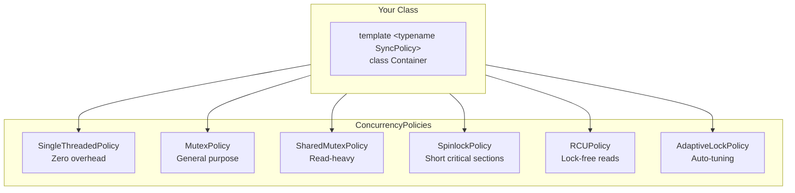
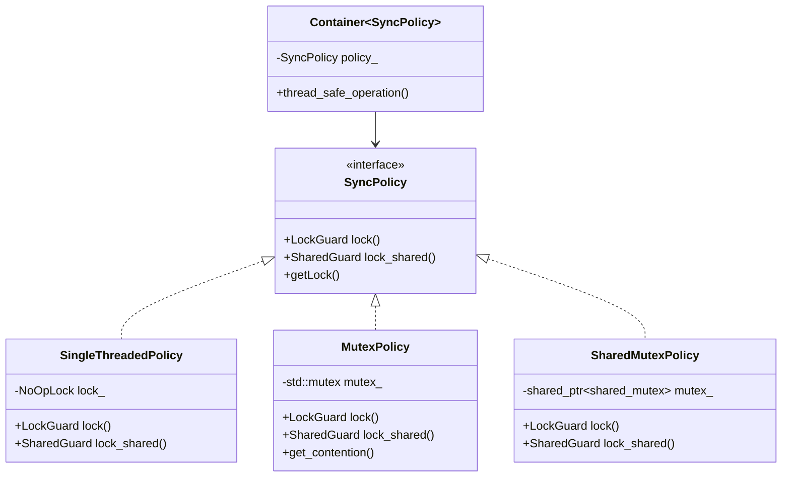
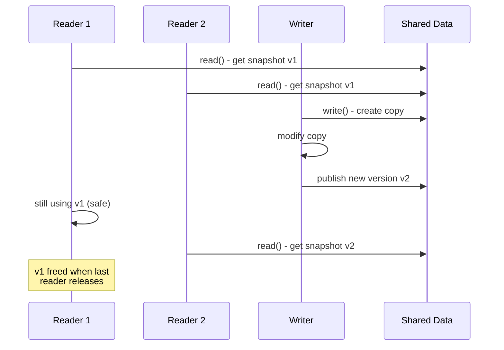
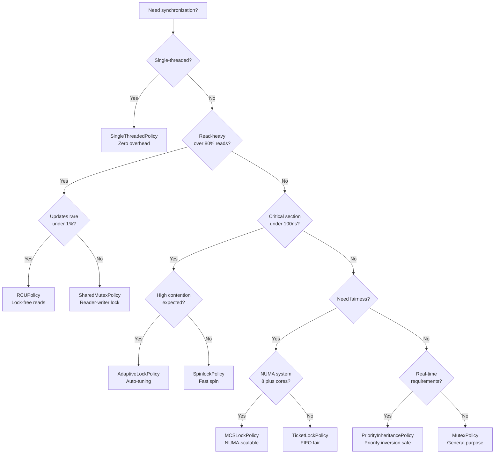

# User Manual - ConcurrencyPolicies

**Scope:** Complete usage guide for `fat_p::concurrency`: all synchronization policies (SingleThreaded, Mutex, SharedMutex, Spinlock, SeqLock, TicketLock, MCSLock, RCU, HazardPointer, AdaptiveLock), the trait system for compile-time policy detection, usage patterns (template parameter, CRTP, conditional compilation), and performance characteristics.

**Not covered:**
- Lock-free data structure design (see LockFreeContainers)
- Thread pool scheduling (see ThreadPool)
- Coroutine-based concurrency (see CoroutineTask)
- Atomic operations tutorial

**Prerequisites:** C++20; understanding of `std::mutex`, `std::shared_mutex`; awareness of data races and undefined behavior in concurrent code

---

## User Manual Card

**Component:** ConcurrencyPolicies
**Primary use case:** Make containers and components thread-safety-configurable via compile-time policy selection, paying zero overhead for single-threaded use
**Integration pattern:** Add `template<typename ConcurrencyPolicy = SingleThreadedPolicy>` to your class template; use policy's `lock()` / `shared_lock()` in member functions
**Key API:** `SingleThreadedPolicy`, `MutexSynchronizationPolicy`, `SharedMutexPolicy`, `SpinlockSynchronizationPolicy`, `SeqLockPolicy`, `RCUPolicy`, `is_concurrent_v<P>`
**std equivalent:** None
**Common mistakes:** Using spinlocks for long critical sections; using mutex policies when single-threaded suffices; holding locks across allocation boundaries; ignoring trait checks in generic code
**Performance notes:** SingleThreadedPolicy compiles to zero overhead. Spinlocks win for short critical sections (<1μs). SharedMutex wins for read-heavy workloads. See `components/ConcurrencyPolicies/results/` for current data

---
## Table of Contents

1. [What is ConcurrencyPolicies?](#what-is-concurrencypolicies)
   - [The Synchronization Problem](#the-synchronization-problem)
   - [The C++ Landscape](#the-c-landscape)
   - [Where ConcurrencyPolicies Fits](#where-concurrencypolicies-fits)
2. [Core Architecture](#core-architecture)
   - [Policy-Based Design](#policy-based-design)
   - [The Trait System](#the-trait-system)
   - [Zero-Overhead Principle](#zero-overhead-principle)
3. [Getting Started](#getting-started)
   - [Prerequisites](#prerequisites)
   - [Integration](#integration)
   - [First Program](#first-program)
4. [Policy Categories](#policy-categories)
   - [No-Op Policies](#no-op-policies)
   - [Mutex-Based Policies](#mutex-based-policies)
   - [Spinlock Policies](#spinlock-policies)
   - [Lock-Free Policies](#lock-free-policies)
   - [Specialized Policies](#specialized-policies)
5. [Basic Policies](#basic-policies)
   - [SingleThreadedPolicy](#singlethreadedpolicy)
   - [MutexSynchronizationPolicy](#mutexsynchronizationpolicy)
   - [SharedMutexPolicy](#sharedmutexpolicy)
   - [SpinlockSynchronizationPolicy](#spinlocksynchronizationpolicy)
6. [Advanced Policies](#advanced-policies)
   - [SeqLockPolicy](#seqlockpolicy)
   - [TicketLockPolicy](#ticketlockpolicy)
   - [MCSLockPolicy](#mcslockpolicy)
   - [RCUPolicy](#rcupolicy)
   - [HazardPointerPolicy](#hazardpointerpolicy)
   - [AdaptiveLockPolicy](#adaptivelockpolicy)
7. [Policy Traits](#policy-traits)
   - [Compile-Time Detection](#compile-time-detection)
   - [Available Traits](#available-traits)
   - [Using Traits for Generic Code](#using-traits-for-generic-code)
8. [Usage Patterns](#usage-patterns)
   - [Template Parameter Pattern](#template-parameter-pattern)
   - [CRTP Pattern](#crtp-pattern)
   - [Conditional Compilation](#conditional-compilation)
9. [Performance Characteristics](#performance-characteristics)
   - [Benchmark Methodology](#benchmark-methodology)
   - [Uncontended Performance](#uncontended-performance)
   - [Contended Performance](#contended-performance)
   - [Policy Selection Guidelines](#policy-selection-guidelines)
10. [Comparison with Other Libraries](#comparison-with-other-libraries)
    - [vs std::mutex](#vs-stdmutex)
    - [vs Boost.Thread](#vs-boostthread)
    - [vs Intel TBB](#vs-intel-tbb)
11. [Migration Guide](#migration-guide)
    - [From Raw Mutexes](#from-raw-mutexes)
    - [From Boost.Thread](#from-boostthread)
    - [Incremental Adoption](#incremental-adoption)
12. [Best Practices](#best-practices)
    - [When to Use Each Policy](#when-to-use-each-policy)
    - [Common Pitfalls](#common-pitfalls)
13. [Troubleshooting](#troubleshooting)
    - [Compilation Errors](#compilation-errors)
    - [Runtime Issues](#runtime-issues)
    - [Performance Problems](#performance-problems)
14. [Summary](#summary)

---

## What is ConcurrencyPolicies?

### The Synchronization Problem

Writing thread-safe code in C++ requires choosing synchronization primitives, but hardcoding them creates inflexible designs:

```cpp
// The problem: hardcoded synchronization
class Cache
{
    std::mutex mutex_;  // Can't change without rewriting
    std::map<Key, Value> data_;
    
public:
    Value get(const Key& key)
    {
        std::lock_guard<std::mutex> lock(mutex_);
        return data_[key];
    }
    
    void set(const Key& key, const Value& value)
    {
        std::lock_guard<std::mutex> lock(mutex_);
        data_[key] = value;
    }
};
// Problems:
// 1. Single-threaded users pay mutex overhead
// 2. Read-heavy workloads can't use shared locks
// 3. Can't switch to spinlock for short critical sections
// 4. Must maintain separate thread-safe and non-thread-safe versions
```

The consequences are significant:

| Problem | Impact |
|---------|--------|
| Hardcoded std::mutex | 25ns overhead even when not needed |
| No reader/writer separation | Readers block each other unnecessarily |
| One-size-fits-all | Can't optimize for specific access patterns |
| Code duplication | Separate single/multi-threaded versions |

### The C++ Landscape

| Solution | Pros | Cons |
|----------|------|------|
| Raw std::mutex | Standard, simple | One-size-fits-all, no customization |
| std::shared_mutex | Reader/writer semantics | Still hardcoded choice |
| Boost.Thread | Feature-rich | Heavy dependency |
| Intel TBB | High performance | Complex, commercial license concerns |
| Hand-rolled policies | Full control | Inconsistent interfaces, error-prone |
| Lock-free libraries | Maximum performance | Complex, specialized knowledge required |

### Where ConcurrencyPolicies Fits

ConcurrencyPolicies provides **19 synchronization policies** with a consistent interface:



**Key Features:**

- Policy-based design: inject synchronization via template parameter
- Zero overhead for single-threaded code (SingleThreadedPolicy compiles away)
- 19 policies spanning mutex, spinlock, lock-free, and specialized primitives
- Comprehensive trait system for compile-time policy introspection
- Unified `lock()` / `lock_shared()` interface across all policies
- Header-only, no external dependencies

**When to use ConcurrencyPolicies:**

- Building reusable containers that work in both single and multi-threaded contexts
- Need to switch between synchronization strategies without code changes
- Performance-critical code where the right primitive matters
- Generic libraries that shouldn't impose synchronization choices

**When NOT to use ConcurrencyPolicies:**

- Simple applications with one synchronization strategy throughout
- When std::mutex is always the right choice
- Embedded systems without C++17 support

---

## Core Architecture

### Policy-Based Design

ConcurrencyPolicies uses the policy-based design pattern where synchronization behavior is injected as a template parameter:



Every policy provides:

```cpp
// Core interface all policies implement
struct PolicyInterface
{
    using LockGuard = /* RAII exclusive lock */;
    using SharedGuard = /* RAII shared lock */;
    using WriteLock = LockGuard;   // Alias for container compatibility
    using ReadLock = SharedGuard;  // Alias for container compatibility
    
    [[nodiscard]] LockGuard lock();        // Acquire exclusive lock
    [[nodiscard]] SharedGuard lock_shared(); // Acquire shared lock
    
    auto& getLock();              // Access underlying lock object
    static auto& getStaticLock(); // Static lock for global contexts
};
```

### The Trait System

Policies are classified using compile-time traits:

```cpp
// Example: compile-time policy classification
template <typename Policy>
void configure_for_policy()
{
    if constexpr (fat_p::is_fair_policy_v<Policy>)
    {
        // TicketLock, MCS - FIFO ordering
        set_priority_mode(false);  // Fairness handles priority
    }
    else if constexpr (fat_p::is_lockfree_policy_v<Policy>)
    {
        // RCU, HazardPointer - lock-free reads
        enable_read_optimization();
    }
    else if constexpr (fat_p::has_contention_tracking_v<Policy>)
    {
        // Mutex, Spinlock, Adaptive - can monitor contention
        enable_contention_monitoring();
    }
}
```

### Zero-Overhead Principle

SingleThreadedPolicy compiles to nothing:

```cpp
// What you write
template <typename SyncPolicy = fat_p::SingleThreadedPolicy>
class Counter : private SyncPolicy
{
    int value_ = 0;
public:
    void increment()
    {
        auto lock = this->lock();
        ++value_;
    }
};

// What the compiler generates for SingleThreadedPolicy
// (after optimization)
class Counter
{
    int value_ = 0;
public:
    void increment()
    {
        ++value_;  // lock() call completely eliminated
    }
};
```

---

## Getting Started

### Prerequisites

| Requirement | Minimum | Recommended |
|-------------|---------|-------------|
| C++ Standard | C++17 | C++20 or later |
| Compiler (GCC) | 7.0 | 11.0+ |
| Compiler (Clang) | 5.0 | 13.0+ |
| Compiler (MSVC) | 19.14 (VS 2017 15.7) | 19.30+ (VS 2022) |

**C++20 Benefits:**

- `std::atomic<std::shared_ptr>` enables true lock-free reads in RCUPolicy
- Better codegen for atomic operations

**C++23 Benefits:**

- `std::jthread` and `std::stop_token` support in WaitableSynchronizationPolicy

### Configuration Macros

| Macro | Default | Description |
|-------|---------|-------------|
| `FATP_USE_MUTEX` | 1 | Enable mutex-based policies |
| `FATP_USE_SHARED_MUTEX` | 1 | Enable shared_mutex policies |
| `FATP_USE_ATOMIC` | 1 | Enable atomic-based policies |
| `FATP_USE_CONDITION_VARIABLE` | 1 | Enable condition variable support |

### Integration

ConcurrencyPolicies is header-only:

```cpp
#include "ConcurrencyPolicies.h"
```

Required headers (automatically included):

- CppStandardDetection.h (C++ version detection)

### First Program

```cpp
#include "ConcurrencyPolicies.h"
#include <iostream>
#include <thread>
#include <vector>

// Policy-based thread-safe counter
template <typename SyncPolicy = fat_p::SingleThreadedPolicy>
class Counter : private SyncPolicy
{
    int value_ = 0;
    
public:
    void increment()
    {
        auto lock = this->lock();
        ++value_;
    }
    
    int get() const
    {
        auto lock = const_cast<Counter*>(this)->lock();
        return value_;
    }
};

int main()
{
    // Single-threaded: zero overhead
    Counter<fat_p::SingleThreadedPolicy> st_counter;
    st_counter.increment();
    std::cout << "Single-threaded: " << st_counter.get() << "\n";
    
    // Multi-threaded: full synchronization
    Counter<fat_p::MutexSynchronizationPolicy> mt_counter;
    
    std::vector<std::thread> threads;
    for (int i = 0; i < 10; ++i)
    {
        threads.emplace_back([&mt_counter]()
        {
            for (int j = 0; j < 1000; ++j)
            {
                mt_counter.increment();
            }
        });
    }
    
    for (auto& t : threads)
    {
        t.join();
    }
    
    std::cout << "Multi-threaded: " << mt_counter.get() << "\n";  // 10000
    
    return 0;
}
```

---

## Policy Categories

### No-Op Policies

| Policy | Description | Use Case |
|--------|-------------|----------|
| `SingleThreadedPolicy` | Zero-cost no-op | Single-threaded code |
| `LockFreeSynchronizationPolicy` | Debug assertions only | Enforcing lock-free design |

### Mutex-Based Policies

| Policy | Description | Use Case |
|--------|-------------|----------|
| `MutexSynchronizationPolicy` | Standard mutex | General thread safety |
| `SharedMutexPolicy` | Read-write lock | Read-heavy workloads |
| `UniqueRWLockPolicy` | Non-copyable shared mutex | Unique ownership |
| `RecursiveMutexPolicy` | Reentrant mutex | Recursive algorithms |
| `TimedMutexPolicy` | Mutex with timeout | Deadlock prevention |
| `SharedTimedMutexPolicy` | Shared mutex with timeout | Bounded waiting |
| `WaitableSynchronizationPolicy` | Condition variable support | Producer/consumer |

### Spinlock Policies

| Policy | Description | Use Case |
|--------|-------------|----------|
| `SpinlockSynchronizationPolicy` | Busy-wait spinlock | Short critical sections |
| `TicketLockPolicy` | FIFO-fair spinlock | Preventing starvation |
| `MCSLockPolicy` | Queue-based lock | NUMA systems |
| `AdaptiveLockPolicy` | Spin-then-sleep | Variable workloads |

### Lock-Free Policies

| Policy | Description | Use Case |
|--------|-------------|----------|
| `RCUPolicy<T>` | Read-Copy-Update | Read-mostly data |
| `HazardPointerPolicy<T>` | Safe memory reclamation | Lock-free structures |
| `SeqLockPolicy` | Optimistic readers | Small, rarely-written data |
| `VersionedLockPolicy` | MVCC-style | Database patterns |

### Specialized Policies

| Policy | Description | Use Case |
|--------|-------------|----------|
| `PriorityInheritanceLockPolicy` | Priority inheritance | Real-time systems |
| `LockFreeWithFallbackPolicy<P>` | Lock-free debug, fallback release | Migration path |

---

## Basic Policies

### SingleThreadedPolicy

Zero-cost synchronization for single-threaded contexts:

```cpp
struct SingleThreadedPolicy
{
    struct NoOpLock {};
    
    class LockGuard
    {
    public:
        template <typename T>
        explicit LockGuard(T&) {}  // Does nothing
        ~LockGuard() = default;   // Does nothing
    };
    
    using SharedGuard = LockGuard;
    using WriteLock = LockGuard;
    using ReadLock = LockGuard;
    
    [[nodiscard]] LockGuard lock();
    [[nodiscard]] SharedGuard lock_shared();
};
```

**Performance:** All operations compile away to nothing.

**Use when:** Single-threaded code, or when external synchronization exists.

### MutexSynchronizationPolicy

Standard mutex-based synchronization with contention tracking:

```cpp
fat_p::MutexSynchronizationPolicy policy;

// Basic usage
{
    auto lock = policy.lock();
    // Critical section
}

// Contention monitoring
uint64_t acquisitions = policy.get_contention();
policy.reset_contention();  // Reset counter for new measurement window
```

**Performance:**

| Operation | Time (uncontended) |
|-----------|-------------------|
| lock() | ~25ns |
| unlock() | ~15ns |

**Use when:** General-purpose synchronization, medium to long critical sections.

### SharedMutexPolicy

Read-write lock allowing concurrent readers:

```cpp
fat_p::SharedMutexPolicy policy;

// Exclusive write access
{
    auto lock = policy.lock();
    // Only one writer at a time
}

// Shared read access
{
    auto lock = policy.lock_shared();
    // Multiple readers concurrently
}
```

**Performance:**

| Operation | Time (uncontended) |
|-----------|-------------------|
| lock() (exclusive) | ~50ns |
| lock_shared() (shared) | ~30ns |

**Use when:** Read-heavy workloads (>80% reads).

### SpinlockSynchronizationPolicy

Busy-wait spinlock for short critical sections:

```cpp
fat_p::SpinlockSynchronizationPolicy policy;

{
    auto lock = policy.lock();
    // Very short critical section only!
}

// Monitor contention
uint64_t spins = policy.get_contention();
std::cout << "Spin contention: " << spins << "\n";
```

**Performance:**

| Operation | Time (uncontended) | Contended |
|-----------|-------------------|-----------|
| lock() | ~8ns | Degrades rapidly |
| unlock() | ~3ns | ~3ns |

**Use when:** Critical sections under 100ns, low contention expected.

**WARNING:** Wastes CPU cycles when contended. Never use for I/O operations.

---

## Advanced Policies

### SeqLockPolicy

Optimistic locking for read-heavy, write-rare data:

```cpp
fat_p::SeqLockPolicy policy;
int data = 0;

// Writer: exclusive access
{
    auto guard = policy.lock();
    data = 42;
}

// Reader: optimistic read with validation
{
    int value;
    fat_p::SeqLockPolicy::SharedGuard guard(policy.getLock());
    value = data;
    
    if (!guard.is_valid())
    {
        // Write occurred during read - retry
    }
}

// Typical retry pattern
int read_data()
{
    int value;
    do
    {
        auto guard = policy.lock_shared();
        value = data;
        if (guard.is_valid())
        {
            return value;
        }
    } while (true);
}
```

**Performance:**

| Operation | Time |
|-----------|------|
| Read (no contention) | ~5ns |
| Read (during write) | ~10ns + retry |
| Write | ~15ns |

**Use when:** 90%+ reads, small data that fits in cache line, writers are rare.

### TicketLockPolicy

FIFO-fair spinlock preventing starvation:

```cpp
fat_p::TicketLockPolicy policy;

{
    auto guard = policy.lock();  // Threads served in arrival order
    // Critical section
}

// Monitor queue depth
uint64_t waiting = policy.get_queue_length();
```

**Performance:**

| Operation | Time | Notes |
|-----------|------|-------|
| lock() | ~12ns | Guaranteed FIFO |
| unlock() | ~5ns | |

**Use when:** Fairness is critical, preventing starvation matters.

### MCSLockPolicy

Scalable queue-based lock for NUMA systems:

```cpp
fat_p::MCSLockPolicy policy;

{
    auto guard = policy.lock();
    // Each thread spins on its own cache line
    // Excellent NUMA locality
}
```

**Performance:**

| Threads | Time per acquisition |
|---------|---------------------|
| 1 | ~15ns |
| 8 | ~40ns (scales linearly) |
| 64 | ~100ns (still scales) |

**Use when:** Many-core systems (8+), NUMA architectures, high contention scenarios.

### RCUPolicy

Read-Copy-Update for lock-free reads:

```cpp
fat_p::RCUPolicy<Config> config(initial_config);

// Lock-free read (~5ns with C++20)
{
    auto guard = config.read();
    std::cout << "Value: " << guard->value << "\n";
}

// Copy-modify-publish write
{
    auto writer = config.write();
    writer.update([](Config& c)
    {
        c.value = 42;
    });
}
```



**Performance:**

| Operation | C++17 | C++20 |
|-----------|-------|-------|
| read() | ~15ns (shared_lock) | ~5ns (atomic load) |
| write() | ~500ns+ (copy overhead) | ~500ns+ |

**Use when:** Read-mostly data (95%+ reads), can tolerate write latency.

### HazardPointerPolicy

Safe memory reclamation for lock-free data structures:

```cpp
fat_p::HazardPointerPolicy<Node> hp;
std::atomic<Node*> head;

// Safe read with hazard pointer protection
{
    auto guard = hp.acquire();
    Node* node = guard.protect(head);  // Protected from reclamation
    if (node)
    {
        process(node->data);
    }
}  // Node can be reclaimed after guard destroyed

// Safe deletion
void remove_node(Node* old_node)
{
    // ... unlink from structure ...
    hp.retire(old_node);  // Deferred deletion when safe
}
```

**Use when:** Building lock-free data structures, need safe memory reclamation.

### AdaptiveLockPolicy

Automatically switches between spin and mutex based on contention:

```cpp
fat_p::AdaptiveLockPolicy policy;

{
    auto guard = policy.lock();
    // Spins briefly under low contention
    // Switches to mutex under high contention
}

// Observe adaptation
std::cout << "Using mutex: " << policy.is_using_mutex() << "\n";
std::cout << "Contention: " << policy.get_contention() << "\n";
policy.reset_contention();  // Reset for new window
```

**Performance:**

| Contention | Behavior | Time |
|------------|----------|------|
| Low | Spinlock | ~10ns |
| High | Mutex | ~30ns |

**Use when:** Unpredictable or variable workloads, "smart default" choice.

---

## Policy Traits

### Compile-Time Detection

All traits are compile-time constants:

```cpp
// Static assertions
static_assert(fat_p::is_fair_policy_v<fat_p::TicketLockPolicy>);
static_assert(fat_p::is_numa_aware_policy_v<fat_p::MCSLockPolicy>);
static_assert(fat_p::is_lockfree_policy_v<fat_p::RCUPolicy<int>>);
static_assert(fat_p::has_contention_tracking_v<fat_p::MutexSynchronizationPolicy>);
```

### Available Traits

| Trait | True For | Description |
|-------|----------|-------------|
| `is_shared_policy_v` | SharedMutex, etc. | Has SharedGuard type |
| `is_fair_policy_v` | TicketLock, MCS | FIFO ordering guaranteed |
| `is_optimistic_policy_v` | SeqLock, Versioned | Retry-based readers |
| `is_numa_aware_policy_v` | MCS | Local spinning |
| `is_realtime_policy_v` | PriorityInheritance | Suitable for RT systems |
| `is_lockfree_policy_v` | RCU, HazardPointer | Lock-free for reads |
| `is_adaptive_policy_v` | Adaptive | Runtime strategy selection |
| `has_contention_tracking_v` | Mutex, Spinlock, Adaptive | Has get_contention() |
| `is_recursive_policy_v` | RecursiveMutex | Same thread can lock multiple times |
| `is_timed_policy_v` | TimedMutex, SharedTimed | Has try_lock_for() |

### Using Traits for Generic Code

```cpp
template <typename Policy>
class SmartContainer
{
    Policy policy_;
    std::vector<int> data_;
    
public:
    void add(int value)
    {
        auto lock = policy_.lock();
        data_.push_back(value);
    }
    
    int get(size_t index) const
    {
        // Use shared lock if available, else exclusive
        if constexpr (fat_p::is_shared_policy_v<Policy>)
        {
            auto lock = const_cast<Policy&>(policy_).lock_shared();
            return data_[index];
        }
        else
        {
            auto lock = const_cast<Policy&>(policy_).lock();
            return data_[index];
        }
    }
    
    void report_stats()
    {
        if constexpr (fat_p::has_contention_tracking_v<Policy>)
        {
            std::cout << "Contention: " << policy_.get_contention() << "\n";
        }
    }
};
```

---

## Usage Patterns

### Template Parameter Pattern

Most common pattern - policy as template parameter:

```cpp
template <typename SyncPolicy = fat_p::MutexSynchronizationPolicy>
class ThreadSafeQueue
{
    SyncPolicy policy_;
    std::queue<int> queue_;
    
public:
    void push(int value)
    {
        auto lock = policy_.lock();
        queue_.push(value);
    }
    
    std::optional<int> pop()
    {
        auto lock = policy_.lock();
        if (queue_.empty())
        {
            return std::nullopt;
        }
        int value = queue_.front();
        queue_.pop();
        return value;
    }
};

// Usage
using STQueue = ThreadSafeQueue<fat_p::SingleThreadedPolicy>;
using MTQueue = ThreadSafeQueue<fat_p::MutexSynchronizationPolicy>;
using SpinQueue = ThreadSafeQueue<fat_p::SpinlockSynchronizationPolicy>;
```

### CRTP Pattern

Policy as base class via CRTP:

```cpp
template <typename Derived, typename SyncPolicy = fat_p::SingleThreadedPolicy>
class SynchronizedBase : private SyncPolicy
{
protected:
    auto acquire_lock() { return this->lock(); }
    auto acquire_shared() { return this->lock_shared(); }
};

class MyContainer : public SynchronizedBase<MyContainer, fat_p::SharedMutexPolicy>
{
    std::map<int, std::string> data_;
    
public:
    void insert(int key, std::string value)
    {
        auto lock = acquire_lock();
        data_[key] = std::move(value);
    }
    
    std::string get(int key) const
    {
        auto lock = const_cast<MyContainer*>(this)->acquire_shared();
        return data_.at(key);
    }
};
```

### Conditional Compilation

Switch policy based on build configuration:

```cpp
#ifdef SINGLE_THREADED_BUILD
    using DefaultSyncPolicy = fat_p::SingleThreadedPolicy;
#elif defined(HIGH_CONTENTION_BUILD)
    using DefaultSyncPolicy = fat_p::MCSLockPolicy;
#else
    using DefaultSyncPolicy = fat_p::MutexSynchronizationPolicy;
#endif

template <typename T>
using Container = ThreadSafeContainer<T, DefaultSyncPolicy>;
```

---

## Performance Characteristics

### Benchmark Methodology

**Test Environment:**

| Component | Specification |
|-----------|---------------|
| Processor | Intel Core i7-8850H @ 2.60 GHz |
| Cores | 6 cores / 12 threads |
| RAM | 32 GB |
| OS | Ubuntu 22.04 / Windows 11 |
| Compiler | GCC 11.4 / MSVC 19.35 |
| Flags | `-O2 -DNDEBUG` / `/O2 /DNDEBUG` |

**Methodology:**
- 100,000 iterations per benchmark
- Warm-up run before measurement
- Results averaged over 5 runs
- Contended tests use 4 threads

### Uncontended Performance

| Policy | lock() | unlock() | Notes |
|--------|--------|----------|-------|
| SingleThreadedPolicy | 0ns | 0ns | Compiled out |
| MutexSynchronizationPolicy | 25ns | 15ns | System call possible |
| SharedMutexPolicy (exclusive) | 50ns | 30ns | |
| SharedMutexPolicy (shared) | 30ns | 20ns | |
| SpinlockSynchronizationPolicy | 8ns | 3ns | CPU-bound |
| TicketLockPolicy | 12ns | 5ns | Fair ordering |
| MCSLockPolicy | 15ns | 10ns | NUMA-friendly |
| AdaptiveLockPolicy | 7ns | 5ns | Starts in spin mode |
| SeqLockPolicy (write) | 15ns | 15ns | |
| SeqLockPolicy (read) | 5ns | 0ns | May retry |
| RCUPolicy (read, C++20) | 5ns | 0ns | Lock-free |
| VersionedLockPolicy | 17ns | 10ns | |

### Contended Performance

4 threads, 10,000 operations each:

| Policy | Total Time | Ops/Second | Scaling |
|--------|------------|------------|---------|
| MutexSynchronizationPolicy | 2.7ms | 14.8M | Good |
| SpinlockSynchronizationPolicy | 0.8ms | 48.7M | Excellent (low contention) |
| TicketLockPolicy | 216ms | 185K | Fair but slow |
| MCSLockPolicy | 201ms | 199K | Fair, scales to many cores |
| AdaptiveLockPolicy | 0.9ms | 42.6M | Adapts well |

### Policy Selection Guidelines



---

## Comparison with Other Libraries

### vs std::mutex

| Feature | std::mutex | ConcurrencyPolicies |
|---------|------------|---------------------|
| Zero-overhead single-threaded | No | Yes (SingleThreadedPolicy) |
| Reader-writer semantics | Separate type | Policy parameter |
| Spinlock option | No | Yes (SpinlockPolicy) |
| Lock-free reads | No | Yes (RCUPolicy) |
| Contention tracking | No | Yes (selected policies) |
| Fairness options | Implementation-defined | TicketLock, MCS |
| NUMA optimization | No | MCSLockPolicy |
| Adaptive behavior | No | AdaptiveLockPolicy |

### vs Boost.Thread

| Feature | Boost.Thread | ConcurrencyPolicies |
|---------|--------------|---------------------|
| Header-only | No | Yes |
| External dependency | Yes | No |
| Policy-based design | Limited | Comprehensive |
| Lock-free primitives | Limited | RCU, HazardPointer, SeqLock |
| Compile-time traits | Limited | Full trait system |

### vs Intel TBB

| Feature | Intel TBB | ConcurrencyPolicies |
|---------|-----------|---------------------|
| License | Apache 2.0 (now) | Internal |
| Complexity | High | Low |
| Focus | Parallel algorithms | Synchronization policies |
| Lock-free containers | Yes | Building blocks provided |
| Learning curve | Steep | Gentle |

---

## Migration Guide

### From Raw Mutexes

**Before:**
```cpp
class Counter
{
    std::mutex mutex_;
    int value_ = 0;
    
public:
    void increment()
    {
        std::lock_guard<std::mutex> lock(mutex_);
        ++value_;
    }
};
```

**After:**
```cpp
template <typename SyncPolicy = fat_p::MutexSynchronizationPolicy>
class Counter
{
    SyncPolicy policy_;
    int value_ = 0;
    
public:
    void increment()
    {
        auto lock = policy_.lock();
        ++value_;
    }
};

// Same behavior
using ThreadSafeCounter = Counter<fat_p::MutexSynchronizationPolicy>;

// Now also available
using SingleThreadedCounter = Counter<fat_p::SingleThreadedPolicy>;
using SpinCounter = Counter<fat_p::SpinlockSynchronizationPolicy>;
```

### From Boost.Thread

| Boost.Thread | ConcurrencyPolicies |
|--------------|---------------------|
| `boost::mutex` | `MutexSynchronizationPolicy` |
| `boost::shared_mutex` | `SharedMutexPolicy` |
| `boost::recursive_mutex` | `RecursiveMutexPolicy` |
| `boost::timed_mutex` | `TimedMutexPolicy` |

### Incremental Adoption

1. **Start with type aliases:**
   ```cpp
   using SyncPolicy = fat_p::MutexSynchronizationPolicy;
   ```

2. **Template one class at a time:**
   ```cpp
   template <typename SyncPolicy = fat_p::MutexSynchronizationPolicy>
   class MyContainer { /* ... */ };
   ```

3. **Add trait-based optimizations:**
   ```cpp
   if constexpr (fat_p::is_shared_policy_v<SyncPolicy>) { /* ... */ }
   ```

4. **Benchmark and switch policies as needed**

---

## Best Practices

### When to Use Each Policy

| Scenario | Recommended Policy |
|----------|-------------------|
| Single-threaded code | `SingleThreadedPolicy` |
| General multi-threaded | `MutexSynchronizationPolicy` |
| Read-heavy (80%+ reads) | `SharedMutexPolicy` |
| Read-mostly (95%+ reads) | `RCUPolicy` |
| Very short critical sections | `SpinlockSynchronizationPolicy` |
| Fairness required | `TicketLockPolicy` |
| NUMA systems, high core count | `MCSLockPolicy` |
| Variable workload | `AdaptiveLockPolicy` |
| Real-time systems | `PriorityInheritanceLockPolicy` |
| Recursive locking needed | `RecursiveMutexPolicy` |
| Timeout required | `TimedMutexPolicy` |

### Common Pitfalls

**Don't:**

```cpp
// DON'T: Hold spinlock during I/O
{
    auto lock = spinlock_policy.lock();
    file.write(data);  // I/O while spinning = wasted CPU!
}

// DON'T: Use spinlock for long critical sections
{
    auto lock = spinlock_policy.lock();
    expensive_computation();  // Burns CPU cycles!
}

// DON'T: Forget to check SeqLock validity
auto guard = seqlock.lock_shared();
int value = data;  // Might be inconsistent!
// Missing: if (!guard.is_valid()) { retry; }

// DON'T: Nest locks without RecursiveMutexPolicy
auto lock1 = policy.lock();
auto lock2 = policy.lock();  // DEADLOCK with non-recursive mutex!
```

**Do:**

```cpp
// DO: Use SingleThreadedPolicy when thread-safety not needed
template <typename Sync = fat_p::SingleThreadedPolicy>
class LocalBuffer { /* ... */ };

// DO: Keep critical sections short
{
    auto lock = policy.lock();
    value = data;  // Quick copy
}
process(value);  // Process outside lock

// DO: Use shared locks for reads
{
    auto lock = policy.lock_shared();  // Multiple readers OK
    return data_;
}

// DO: Check contention and adapt
if (policy.get_contention() > threshold)
{
    // Consider switching to different policy
}
```

---

## Troubleshooting

### Compilation Errors

**Error: "no member named 'lock' in 'SingleThreadedPolicy'"**

```cpp
// Problem: Using old interface
SingleThreadedPolicy::LockGuard guard(policy.getLock());

// Solution: Use unified interface
auto guard = policy.lock();
```

**Error: "cannot convert 'X' to 'Y'"**

```cpp
// Problem: Mismatched policy in template instantiation
Container<MutexPolicy> c1;
Container<SpinlockPolicy> c2 = c1;  // Can't convert!

// Solution: Policies are not interchangeable at runtime
// Use type aliases or templates consistently
```

### Runtime Issues

**Issue: Deadlock**

```cpp
// Problem: Lock ordering violation
void transfer(Account& a, Account& b)
{
    auto lock_a = a.policy.lock();  // Thread 1: locks A
    auto lock_b = b.policy.lock();  // Thread 2: locks B first, then waits for A
    // Deadlock!
}

// Solution: Consistent lock ordering
void transfer(Account& a, Account& b)
{
    auto* first = &a < &b ? &a : &b;
    auto* second = &a < &b ? &b : &a;
    auto lock1 = first->policy.lock();
    auto lock2 = second->policy.lock();
}
```

**Issue: Poor spinlock performance**

```cpp
// Problem: High contention with spinlock
SpinlockSynchronizationPolicy policy;
// 100 threads competing = CPU burning

// Solution: Check contention, switch policy
if (policy.get_contention() > 1000)
{
    // Consider AdaptiveLockPolicy or MutexPolicy
}
```

### Performance Problems

**Issue: Single-threaded code still slow**

```cpp
// Problem: Using MutexPolicy when not needed
Container<MutexSynchronizationPolicy> c;  // 25ns per operation

// Solution: Use SingleThreadedPolicy
Container<SingleThreadedPolicy> c;  // 0ns overhead
```

**Issue: Read-heavy code still contends**

```cpp
// Problem: Exclusive locks for reads
auto lock = policy.lock();  // Blocks other readers!
return data_;

// Solution: Use SharedMutexPolicy
auto lock = policy.lock_shared();  // Concurrent reads OK
return data_;
```

---

## Summary

**ConcurrencyPolicies** provides 19 synchronization policies for policy-based design:

**Key Features:**

- Zero-overhead SingleThreadedPolicy
- Mutex, spinlock, and lock-free options
- Comprehensive trait system for compile-time introspection
- Unified `lock()` / `lock_shared()` interface
- Header-only, no dependencies

**Quick Reference:**

```cpp
#include "ConcurrencyPolicies.h"

// Policy-based container
template <typename SyncPolicy = fat_p::SingleThreadedPolicy>
class Container
{
    SyncPolicy policy_;
    Data data_;
    
public:
    void write(Data d)
    {
        auto lock = policy_.lock();
        data_ = std::move(d);
    }
    
    Data read() const
    {
        if constexpr (fat_p::is_shared_policy_v<SyncPolicy>)
        {
            auto lock = const_cast<SyncPolicy&>(policy_).lock_shared();
            return data_;
        }
        else
        {
            auto lock = const_cast<SyncPolicy&>(policy_).lock();
            return data_;
        }
    }
};

// Instantiate with desired policy
using STContainer = Container<fat_p::SingleThreadedPolicy>;
using MTContainer = Container<fat_p::MutexSynchronizationPolicy>;
using RWContainer = Container<fat_p::SharedMutexPolicy>;
```

**Related Components:**

- CppStandardDetection.h - C++ version detection
- SmallVector.h - Policy-based small buffer optimization
- ObjectPool.h - Policy-based object pooling
