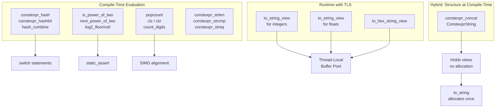
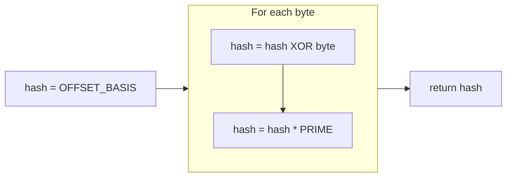
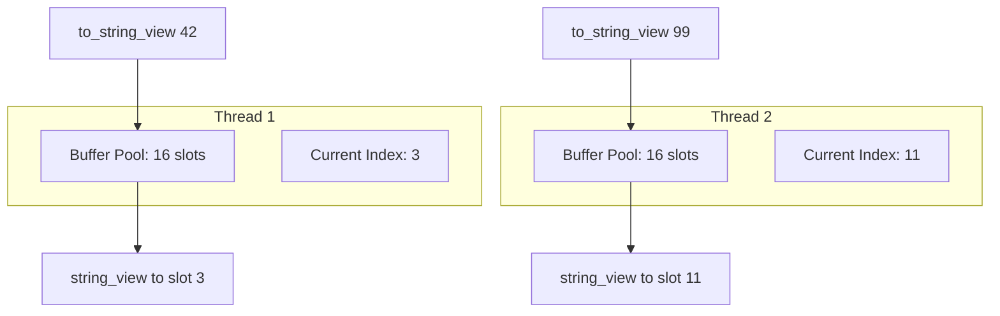
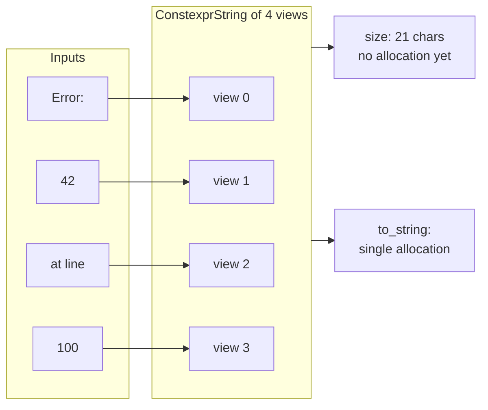

# ConstexprUtilities User Manual

**Library:** fat_p C++ Utilities  
**Standard:** C++17  
**Type:** Header-only

---

## Table of Contents

1. [What is ConstexprUtilities?](#what-is-constexprutilities)
2. [Core Architecture](#core-architecture)
3. [Getting Started](#getting-started)
4. [Hashing Utilities](#hashing-utilities)
5. [Arithmetic Utilities](#arithmetic-utilities)
6. [String Conversion](#string-conversion)
7. [String Concatenation](#string-concatenation)
8. [Hexadecimal Conversion](#hexadecimal-conversion)
9. [String Utilities](#string-utilities)
10. [Performance Characteristics](#performance-characteristics)
11. [Comparison with Alternatives](#comparison-with-alternatives)
12. [Migration Guide](#migration-guide)
13. [Best Practices](#best-practices)
14. [Troubleshooting](#troubleshooting)
15. [Summary](#summary)

---

## What is ConstexprUtilities?

### The Problem

C++ lacks a built-in way to use strings in switch statements. This forces developers into chains of if-else comparisons that the compiler cannot optimize effectively.

```cpp
// The problem: O(n) string comparisons, no jump table optimization
void handle_command(std::string_view cmd)
{
    if (cmd == "start")
    {
        start_system();
    }
    else if (cmd == "stop")
    {
        stop_system();
    }
    else if (cmd == "pause")
    {
        pause_system();
    }
    else if (cmd == "resume")
    {
        resume_system();
    }
    // ... 20 more commands
    // Each comparison: memory access + byte-by-byte check
    // Worst case: checks ALL strings before finding match or default
}
```

The compiler sees string comparisons as opaque function calls. It cannot build a jump table, cannot reorder comparisons by frequency, and cannot eliminate redundant checks. With 25 commands averaging 6 characters each, the worst case involves 150 byte comparisons per dispatch.

Beyond string dispatch, developers face similar friction with compile-time validation and string building:

| Problem | What Happens | Why It Matters |
|---------|--------------|----------------|
| No string switch | O(n) comparisons per call | Hot paths become bottlenecks |
| Runtime buffer validation | Crashes in production | Power-of-two alignment required for SIMD, ring buffers |
| String building allocates | Heap fragmentation, cache misses | Logging in tight loops kills performance |
| No portable bit intrinsics | Compiler-specific `__builtin_*` | Code breaks on MSVC or older compilers |

### Why These Problems Exist

The C++ standard prioritizes runtime flexibility over compile-time computation. `std::hash` exists but isn't `constexpr`. `std::to_string` allocates because it returns `std::string`. The `<bit>` header with `std::popcount` arrived in C++20, leaving C++17 codebases without portable options.

Template metaprogramming can solve some of these problems, but the resulting code is often unreadable and error-prone. Boost provides solutions, but adding Boost for a few utilities creates dependency overhead that many projects cannot accept.

### The Solution

ConstexprUtilities provides compile-time utilities that integrate naturally with standard C++17:

```cpp
#include "ConstexprUtilities.h"
#include <iostream>

void handle_command(std::string_view cmd)
{
    // Compile-time hash enables switch optimization
    // Compiler builds jump table: O(1) dispatch
    switch (fat_p::constexpr_hash(cmd))
    {
        case fat_p::constexpr_hash("start"):
            start_system();
            break;
        case fat_p::constexpr_hash("stop"):
            stop_system();
            break;
        case fat_p::constexpr_hash("pause"):
            pause_system();
            break;
        case fat_p::constexpr_hash("resume"):
            resume_system();
            break;
        default:
            handle_unknown(cmd);
            break;
    }
}

template <std::size_t Capacity>
class RingBuffer
{
    // Compile-time validation: fails to compile if Capacity isn't power of 2
    static_assert(fat_p::is_power_of_two(Capacity),
                  "RingBuffer capacity must be power of 2 for fast modulo");

    std::size_t next(std::size_t i) const
    {
        // Bitwise AND replaces expensive modulo operation
        // This only works when Capacity is power of 2
        return (i + 1) & (Capacity - 1);
    }
};

void log_error(int code, int line)
{
    // Zero allocation until to_string() called
    // Views reference thread-local buffers
    auto msg = fat_p::constexpr_concat(
        "Error ", fat_p::to_string_view(code),
        " at line ", fat_p::to_string_view(line)
    );

    // Single allocation here, with pre-calculated size
    std::cerr << msg.to_string() << std::endl;
}
```

### Key Features

| Feature | Purpose | Compile-Time |
|---------|---------|--------------|
| `constexpr_hash` | 32-bit FNV-1a string hash | Yes |
| `constexpr_hash64` | 64-bit FNV-1a for large tables | Yes |
| `hash_combine` | Combine hashes for composite keys | Yes |
| `is_power_of_two` | Validate alignment/buffer sizes | Yes |
| `next_power_of_two` | Round up for allocation | Yes |
| `log2_floor` / `log2_ceil` | Bit width calculation | Yes |
| `popcount` / `clz` / `ctz` | Portable bit manipulation | Yes |
| `count_digits` | Pre-calculate buffer sizes | Yes |
| `to_string_view` | Integer/float to string | Runtime |
| `to_hex_string_view` | Hex formatting for debugging | Runtime |
| `constexpr_concat` | Zero-allocation string building | Yes |
| `constexpr_strlen` / `strcmp` / `streq` | Compile-time string ops | Yes |

### When to Use ConstexprUtilities

**Good fit:**
- Command dispatchers, protocol parsers, state machines needing string switches
- Buffer allocators requiring power-of-two sizes
- Logging systems where allocation overhead matters
- Embedded or HPC code targeting C++17 without Boost

**Not the right tool:**
- Cryptographic hashing (FNV-1a is not secure)
- Full-featured formatting (use `fmt` or C++20 `std::format`)
- Locale-aware number formatting
- Arbitrary-precision arithmetic

---

## Core Architecture

### Design Philosophy

ConstexprUtilities follows three principles:

1. **Zero overhead when unused**: No global state, no static initialization
2. **Compile-time by default**: Everything that can be `constexpr` is `constexpr`
3. **Thread-safe without locks**: Runtime state uses thread-local storage



### FNV-1a Hash Algorithm

The library uses FNV-1a (Fowler-Noll-Vo, variant 1a) because it meets specific requirements for compile-time hashing:

**Why FNV-1a over other algorithms:**

| Algorithm | Constexpr-Friendly | Speed | Quality | Complexity |
|-----------|-------------------|-------|---------|------------|
| FNV-1a | Yes | Good | Good | 3 lines |
| MurmurHash | No (rotations) | Excellent | Excellent | 50+ lines |
| CityHash | No (intrinsics) | Excellent | Excellent | 200+ lines |
| CRC32 | No (lookup table) | Good | Good | Table + loop |

FNV-1a uses only XOR and multiplication, both `constexpr`-compatible. The algorithm:



The constants are mathematically chosen to maximize bit diffusion:

| Size | Offset Basis | Prime | Collision Rate |
|------|-------------|-------|----------------|
| 32-bit | 2166136261 | 16777619 | ~1% at 9,300 strings |
| 64-bit | 14695981039346656037 | 1099511628211 | ~1% at 610M strings |

**Avalanche property**: Changing one input bit changes approximately 50% of output bits. This means similar strings produce very different hashes, which is essential for switch statement optimization.

### Thread-Local Buffer Pool

The `to_string_view` functions face a design tension: returning `std::string` allocates, but returning a pointer to a static buffer isn't thread-safe.

The solution uses thread-local storage with a rotating pool:



**Why 16 buffers?** This size safely handles deep nested logging calls without buffer aliasing:

```cpp
// Pattern 1: Multiple values in one expression (uses 4 buffers)
std::cout << fat_p::to_string_view(a) << ", "
          << fat_p::to_string_view(b) << ", "
          << fat_p::to_string_view(c) << ", "
          << fat_p::to_string_view(d);

// Pattern 2: Building error messages (uses 3 buffers)  
auto msg = fat_p::constexpr_concat(
    "Error ", fat_p::to_string_view(code),
    " at line ", fat_p::to_string_view(line),
    ": ", fat_p::to_string_view(detail)
);

// Pattern 3: Logging with context (uses 5 buffers)
log(fat_p::to_string_view(timestamp),
    fat_p::to_string_view(thread_id),
    fat_p::to_string_view(level),
    fat_p::to_string_view(code),
    fat_p::to_string_view(value));
```

**The tradeoff**: After 16 calls, earlier buffers get reused. Code that stores views for later use must copy to `std::string`:

```cpp
// Dangerous: view becomes invalid after 16 more calls
std::string_view saved = fat_p::to_string_view(42);

// Safe: copy to string for persistence
std::string saved(fat_p::to_string_view(42));
```

### Zero-Allocation Concatenation

`constexpr_concat` builds strings without allocating by storing views:



This design enables:
- **Compile-time size calculation**: `reserve()` can be called with exact size
- **Deferred allocation**: Only allocate when actually converting to `std::string`
- **Zero-copy output**: Write directly to fixed buffers via `to_array()`

---

## Getting Started

### Prerequisites

| Requirement | Minimum Version |
|-------------|-----------------|
| C++ Standard | C++17 |
| GCC | 7.0 |
| Clang | 5.0 |
| MSVC | 2017 (19.14) |

No external dependencies. No build configuration. Just include the header.

### Integration

```cpp
#include "ConstexprUtilities.h"
```

All symbols live in the `fat_p` namespace. Use explicit qualification:

```cpp
std::uint32_t h = fat_p::constexpr_hash("hello");
bool valid = fat_p::is_power_of_two(256);
auto sv = fat_p::to_string_view(42);
```

### First Program

This complete example demonstrates the three core use cases:

```cpp
#include "ConstexprUtilities.h"
#include <iostream>
#include <string_view>

// Use case 1: Command dispatch with compile-time hashing
void execute(std::string_view command)
{
    switch (fat_p::constexpr_hash(command))
    {
        case fat_p::constexpr_hash("help"):
            std::cout << "Available: help, version, quit\n";
            break;
        case fat_p::constexpr_hash("version"):
            std::cout << "Version 1.0\n";
            break;
        case fat_p::constexpr_hash("quit"):
            std::cout << "Goodbye\n";
            break;
        default:
            std::cout << "Unknown command: " << command << "\n";
            break;
    }
}

// Use case 2: Compile-time validation
template <std::size_t Size>
class AlignedBuffer
{
    static_assert(fat_p::is_power_of_two(Size),
                  "Size must be power of 2 for alignment");
    alignas(Size) char data_[Size];

public:
    char* data() { return data_; }
    constexpr std::size_t size() const { return Size; }
};

// Use case 3: Efficient string building
void report_status(int code, int items_processed)
{
    auto message = fat_p::constexpr_concat(
        "Status code: ", fat_p::to_string_view(code),
        ", processed: ", fat_p::to_string_view(items_processed),
        " items"
    );

    // to_string() performs single allocation with pre-calculated size
    std::cout << message.to_string() << std::endl;
}

int main()
{
    execute("help");
    execute("version");
    execute("unknown");

    AlignedBuffer<64> buffer;
    std::cout << "Buffer size: " << buffer.size() << std::endl;

    report_status(0, 1000);

    // Compile-time arithmetic
    constexpr auto next = fat_p::next_power_of_two(100u);
    static_assert(next == 128, "100 rounds up to 128");

    constexpr auto bits = fat_p::popcount(0b10110101u);
    static_assert(bits == 5, "5 bits set in 0b10110101");

    std::cout << "Hex: " << fat_p::to_hex_string_view(255u) << std::endl;

    return 0;
}
```

Expected output:
```
Available: help, version, quit
Version 1.0
Unknown command: unknown
Buffer size: 64
Status code: 0, processed: 1000 items
Hex: 0xff
```

---

## Hashing Utilities

### constexpr_hash

32-bit FNV-1a hash suitable for switch statements and small-to-medium hash tables.

```cpp
[[nodiscard]] constexpr std::uint32_t fat_p::constexpr_hash(std::string_view s) noexcept;
```

**Compile-time usage:**
```cpp
// Case labels must be compile-time constants
// constexpr_hash on literals evaluates at compile time
switch (fat_p::constexpr_hash(input))
{
    case fat_p::constexpr_hash("GET"):
        handle_get();
        break;
    case fat_p::constexpr_hash("POST"):
        handle_post();
        break;
    case fat_p::constexpr_hash("PUT"):
        handle_put();
        break;
    case fat_p::constexpr_hash("DELETE"):
        handle_delete();
        break;
    default:
        handle_unknown();
        break;
}
```

**Runtime usage:**
```cpp
// Also works with runtime strings
std::string user_input = get_user_command();
std::uint32_t h = fat_p::constexpr_hash(user_input);
```

**Known values:**
```cpp
static_assert(fat_p::constexpr_hash("") == 2166136261u);  // Offset basis
static_assert(fat_p::constexpr_hash("a") == 3826002220u);
static_assert(fat_p::constexpr_hash("hello") == 1335831723u);
```

### constexpr_hash64

64-bit variant for applications with many strings or where collision probability matters.

```cpp
[[nodiscard]] constexpr std::uint64_t fat_p::constexpr_hash64(std::string_view s) noexcept;
```

**When to use 64-bit:**

| String Count | 32-bit Collision Risk | 64-bit Collision Risk |
|--------------|----------------------|----------------------|
| 100 | 0.0001% | ~0% |
| 1,000 | 0.01% | ~0% |
| 10,000 | 1.2% | ~0% |
| 100,000 | 69% | 0.00003% |

```cpp
// Large dispatch tables benefit from 64-bit hashes
std::unordered_map<std::uint64_t, Handler> handlers;

void register_handler(std::string_view name, Handler h)
{
    handlers[fat_p::constexpr_hash64(name)] = std::move(h);
}

void dispatch(std::string_view name)
{
    auto it = handlers.find(fat_p::constexpr_hash64(name));
    if (it != handlers.end())
    {
        it->second();
    }
}
```

### hash_combine

Combines two hash values for composite keys.

```cpp
[[nodiscard]] constexpr std::uint64_t fat_p::hash_combine(
    std::uint64_t seed,
    std::uint64_t value) noexcept;
```

The algorithm uses the golden ratio constant for optimal bit mixing:

```cpp
// Hash a namespace::class::method triplet
constexpr std::uint64_t method_hash(
    std::string_view ns,
    std::string_view cls,
    std::string_view method)
{
    std::uint64_t h = fat_p::constexpr_hash64(ns);
    h = fat_p::hash_combine(h, fat_p::constexpr_hash64(cls));
    h = fat_p::hash_combine(h, fat_p::constexpr_hash64(method));
    return h;
}

// Order matters: combine(a, b) != combine(b, a)
static_assert(
    fat_p::hash_combine(100, 200) != fat_p::hash_combine(200, 100)
);
```

### hash_values

Variadic helper for hashing multiple strings:

```cpp
template <typename... Args>
[[nodiscard]] constexpr std::uint64_t fat_p::hash_values(const Args&... args) noexcept;
```

```cpp
constexpr auto key = fat_p::hash_values("namespace", "class", "method");
```

---

## Arithmetic Utilities

### is_power_of_two

Tests whether an integer is a power of two (1, 2, 4, 8, 16, ...).

```cpp
template <typename T>
[[nodiscard]] constexpr bool fat_p::is_power_of_two(T n) noexcept;
```

**Why power-of-two matters:**

```cpp
// Ring buffer: power-of-two enables bitwise modulo
template <std::size_t N>
class RingBuffer
{
    static_assert(fat_p::is_power_of_two(N), "N must be power of 2");
    T data_[N];
    std::size_t head_ = 0;

    std::size_t next(std::size_t i) const
    {
        // x % N when N is power of 2 equals x & (N-1)
        // Bitwise AND: 1 cycle vs division: 20-80 cycles
        return (i + 1) & (N - 1);
    }
};

// Memory alignment: allocators require power-of-two
template <std::size_t Align>
void* aligned_alloc(std::size_t size)
{
    static_assert(fat_p::is_power_of_two(Align), "Alignment must be power of 2");
    // ...
}
```

**Edge cases:**

```cpp
static_assert(fat_p::is_power_of_two(1));      // 2^0 = 1, true
static_assert(fat_p::is_power_of_two(2));      // 2^1 = 2, true
static_assert(!fat_p::is_power_of_two(0));     // Zero is not power of 2
static_assert(!fat_p::is_power_of_two(3));     // 3 is not power of 2
static_assert(!fat_p::is_power_of_two(-4));    // Negatives return false
static_assert(!fat_p::is_power_of_two(INT_MIN)); // INT_MIN returns false
```

### next_power_of_two

Rounds up to the next power of two (or returns input if already power of two).

```cpp
template <typename T>
[[nodiscard]] constexpr T fat_p::next_power_of_two(T n) noexcept;
// Requires: T is unsigned integral
```

```cpp
static_assert(fat_p::next_power_of_two(0u) == 1u);
static_assert(fat_p::next_power_of_two(1u) == 1u);
static_assert(fat_p::next_power_of_two(5u) == 8u);
static_assert(fat_p::next_power_of_two(1000u) == 1024u);
static_assert(fat_p::next_power_of_two(1024u) == 1024u);

// Practical use: buffer allocation
std::size_t alloc_size = fat_p::next_power_of_two(static_cast<std::size_t>(requested));
```

### log2_floor and log2_ceil

Integer logarithm base 2.

```cpp
template <typename T>
[[nodiscard]] constexpr int fat_p::log2_floor(T n) noexcept;

template <typename T>
[[nodiscard]] constexpr int fat_p::log2_ceil(T n) noexcept;
// Both require: T is unsigned integral
// Returns -1 for n == 0
```

```cpp
static_assert(fat_p::log2_floor(1u) == 0);    // 2^0 = 1
static_assert(fat_p::log2_floor(8u) == 3);    // 2^3 = 8
static_assert(fat_p::log2_floor(15u) == 3);   // floor(log2(15)) = 3

static_assert(fat_p::log2_ceil(1u) == 0);     // 2^0 = 1
static_assert(fat_p::log2_ceil(8u) == 3);     // 2^3 = 8
static_assert(fat_p::log2_ceil(9u) == 4);     // ceil(log2(9)) = 4

// Calculate bits needed to represent values 0..N
constexpr int bits_for_n(unsigned n)
{
    return n == 0 ? 1 : fat_p::log2_floor(n) + 1;
}
```

### Bit Operations

Portable implementations of common bit manipulation operations. Uses compiler intrinsics (`__builtin_popcount`, etc.) on GCC/Clang for single-instruction execution while maintaining `constexpr` compatibility.

```cpp
template <typename T>
[[nodiscard]] constexpr int fat_p::popcount(T n) noexcept;  // Count set bits

template <typename T>
[[nodiscard]] constexpr int fat_p::clz(T n) noexcept;  // Count leading zeros

template <typename T>
[[nodiscard]] constexpr int fat_p::ctz(T n) noexcept;  // Count trailing zeros
// All require: T is unsigned integral
// GCC/Clang: uses __builtin_* intrinsics (single instruction)
// MSVC: uses portable fallback (intrinsics are not constexpr)
```

**Why these matter for HPC:**

```cpp
// Hamming distance: count differing bits
int hamming_distance(std::uint64_t a, std::uint64_t b)
{
    return fat_p::popcount(a ^ b);
}

// Find most significant bit position
int msb_position(std::uint32_t x)
{
    return x == 0 ? -1 : 31 - fat_p::clz(x);
}

// Find least significant bit position
int lsb_position(std::uint32_t x)
{
    return x == 0 ? -1 : fat_p::ctz(x);
}

// Isolate lowest set bit
std::uint32_t lowest_bit(std::uint32_t x)
{
    return x & (~x + 1);
}
```

**Values:**

```cpp
static_assert(fat_p::popcount(0u) == 0);
static_assert(fat_p::popcount(0b10110101u) == 5);
static_assert(fat_p::popcount(0xFFFFFFFFu) == 32);

static_assert(fat_p::clz(std::uint8_t{1}) == 7);
static_assert(fat_p::clz(std::uint8_t{0x80}) == 0);
static_assert(fat_p::clz(std::uint32_t{1}) == 31);

static_assert(fat_p::ctz(std::uint8_t{1}) == 0);
static_assert(fat_p::ctz(std::uint8_t{8}) == 3);
static_assert(fat_p::ctz(std::uint32_t{0x80000000}) == 31);
```

### count_digits

Returns the number of characters needed to represent an integer as decimal string.

```cpp
template <typename T>
[[nodiscard]] constexpr int fat_p::count_digits(T n) noexcept;
```

```cpp
static_assert(fat_p::count_digits(0) == 1);
static_assert(fat_p::count_digits(9) == 1);
static_assert(fat_p::count_digits(10) == 2);
static_assert(fat_p::count_digits(999) == 3);

// Negative numbers include the minus sign
static_assert(fat_p::count_digits(-1) == 2);    // "-1"
static_assert(fat_p::count_digits(-999) == 4);  // "-999"

// Useful for buffer sizing
constexpr int MAX_INT32_CHARS = fat_p::count_digits(INT32_MIN);  // 11
constexpr int MAX_INT64_CHARS = fat_p::count_digits(INT64_MIN);  // 20
```

---

## String Conversion

### to_string_view for Integers

Converts integers to string representation without heap allocation.

```cpp
template <typename T>
[[nodiscard]] inline std::string_view fat_p::to_string_view(T value) noexcept;
// Requires: T is integral
```

```cpp
std::cout << fat_p::to_string_view(42);           // "42"
std::cout << fat_p::to_string_view(-123);         // "-123"
std::cout << fat_p::to_string_view(0);            // "0"
std::cout << fat_p::to_string_view(INT64_MAX);    // "9223372036854775807"
std::cout << fat_p::to_string_view(INT64_MIN);    // "-9223372036854775808"
std::cout << fat_p::to_string_view(UINT64_MAX);   // "18446744073709551615"
```

**Buffer lifetime:**

The returned `string_view` points to a thread-local buffer. It remains valid until 16 more calls to any `to_string_view` overload in the same thread:

```cpp
// Safe: all views used before any become invalid
std::cout << fat_p::to_string_view(1) << ", "
          << fat_p::to_string_view(2) << ", "
          << fat_p::to_string_view(3) << std::endl;

// Dangerous: storing views for later
std::string_view views[20];
for (int i = 0; i < 20; ++i)
{
    views[i] = fat_p::to_string_view(i);  // views[0-3] overwritten
}
// views[0] through views[3] now contain garbage

// Safe: copy to string when persistence needed
std::vector<std::string> strings;
for (int i = 0; i < 20; ++i)
{
    strings.push_back(std::string(fat_p::to_string_view(i)));
}
```

### to_string_view for Floating-Point

Converts floating-point values with configurable precision.

```cpp
template <typename T>
[[nodiscard]] inline std::string_view fat_p::to_string_view(
    T value,
    int precision = 6) noexcept;
// Requires: T is floating-point
// precision clamped to [0, 15]
```

```cpp
std::cout << fat_p::to_string_view(3.14159);        // "3.141590"
std::cout << fat_p::to_string_view(3.14159, 2);     // "3.14"
std::cout << fat_p::to_string_view(3.14159, 0);     // "3."
std::cout << fat_p::to_string_view(-2.5, 1);        // "-2.5"
```

**Special values:**

```cpp
std::cout << fat_p::to_string_view(
    std::numeric_limits<double>::quiet_NaN());      // "nan"
std::cout << fat_p::to_string_view(
    std::numeric_limits<double>::infinity());       // "inf"
std::cout << fat_p::to_string_view(
    -std::numeric_limits<double>::infinity());      // "-inf"

// Negative zero normalized to positive zero for cleaner output
std::cout << fat_p::to_string_view(-0.0, 2);        // "0.00" (not "-0.00")
```

**Large values:**

Values exceeding 2^53 (the limit of exact integer representation in double) return "overflow" to prevent incorrect output. Scientific notation is not supported; for scientific computing with values beyond this range, use dedicated formatting libraries.

```cpp
std::cout << fat_p::to_string_view(1e20);   // "overflow"
std::cout << fat_p::to_string_view(-1e20);  // "-overflow"
```

### constexpr_to_string_t

Direct access to the conversion buffer for advanced use cases.

```cpp
template <typename T>
struct fat_p::constexpr_to_string_t
{
    constexpr constexpr_to_string_t(T value) noexcept;
    [[nodiscard]] constexpr std::string_view view() const noexcept;
};
```

```cpp
// Create converter
fat_p::constexpr_to_string_t<int> conv{42};
std::string_view sv = conv.view();  // "42"

// The buffer lives inside the struct
// Safe to use as long as struct exists
```

---

## String Concatenation

### constexpr_concat

Builds strings from multiple parts without allocating until needed.

```cpp
template <typename... Args>
[[nodiscard]] constexpr auto fat_p::constexpr_concat(Args&&... v);
// Returns: ConstexprString<sizeof...(Args)>
```

```cpp
auto msg = fat_p::constexpr_concat(
    "Error ", fat_p::to_string_view(42),
    " at line ", fat_p::to_string_view(100)
);

// No allocation yet - msg holds views to the parts

std::size_t len = msg.size();          // Calculate total length: 22
bool empty = msg.empty();               // Check if empty: false

// Option 1: Allocate string
std::string s = msg.to_string();        // Single allocation, exact size

// Option 2: Write to fixed buffer
char buffer[64];
msg.to_array(buffer, sizeof(buffer));   // No allocation
```

### ConstexprString

The container returned by `constexpr_concat`.

```cpp
template <std::size_t N>
struct fat_p::ConstexprString
{
    [[nodiscard]] constexpr std::size_t size() const noexcept;
    [[nodiscard]] constexpr bool empty() const noexcept;
    [[nodiscard]] constexpr std::size_t to_array(char* buffer, std::size_t buffer_size) const;
    [[nodiscard]] std::string to_string() const;
};

// Stream output (no allocation)
template <std::size_t N>
std::ostream& operator<<(std::ostream& os, const fat_p::ConstexprString<N>& cs);
```

**Buffer sizing with to_array:**

```cpp
auto msg = fat_p::constexpr_concat("Value: ", fat_p::to_string_view(x));

// Use fixed reasonable size
char buffer[128];
std::size_t written = msg.to_array(buffer, sizeof(buffer));  // Returns chars written
// written excludes null terminator, buffer is always null-terminated
```

**Direct streaming (zero allocation):**

```cpp
auto msg = fat_p::constexpr_concat("Error at line ", fat_p::to_string_view(line), ": ", error_msg);
std::cout << msg << std::endl;  // Streams views directly, no allocation
// Equivalent to: std::cout << msg.to_string() << std::endl; but faster
```

**Error message pattern:**

```cpp
fat_p::Expected<int, std::string> parse_int(std::string_view input)
{
    if (input.empty())
    {
        return fat_p::make_unexpected(
            fat_p::constexpr_concat("parse_int: empty input").to_string()
        );
    }

    // ... parsing logic ...

    if (overflow)
    {
        return fat_p::make_unexpected(
            fat_p::constexpr_concat(
                "parse_int: overflow parsing '", input, "'"
            ).to_string()
        );
    }

    return result;
}
```

---

## Hexadecimal Conversion

### to_hex_string_view

Converts unsigned integers to hexadecimal representation.

```cpp
template <typename T>
[[nodiscard]] inline std::string_view fat_p::to_hex_string_view(
    T value,
    bool prefix = true,
    bool uppercase = false) noexcept;
// Requires: T is unsigned integral
```

```cpp
std::cout << fat_p::to_hex_string_view(0u);            // "0x0"
std::cout << fat_p::to_hex_string_view(255u);          // "0xff"
std::cout << fat_p::to_hex_string_view(0xDEADBEEFu);   // "0xdeadbeef"

// Without "0x" prefix
std::cout << fat_p::to_hex_string_view(255u, false);   // "ff"
std::cout << fat_p::to_hex_string_view(0u, false);     // "0"

// Uppercase hex (common in memory dumps, error codes)
std::cout << fat_p::to_hex_string_view(0xDEADBEEFu, true, true);   // "0XDEADBEEF"
std::cout << fat_p::to_hex_string_view(0xDEADBEEFu, false, true);  // "DEADBEEF"
```

**Debugging memory addresses:**

```cpp
void debug_pointer(const void* ptr)
{
    auto addr = reinterpret_cast<std::uintptr_t>(ptr);
    std::cout << "Address: " << fat_p::to_hex_string_view(addr) << std::endl;
}

// Format error codes in uppercase (Windows HRESULT style)
void log_error(uint32_t code)
{
    std::cout << "Error: " << fat_p::to_hex_string_view(code, true, true) << std::endl;
}
```

---

## String Utilities

### constexpr_strlen

Compile-time string length.

```cpp
[[nodiscard]] constexpr std::size_t fat_p::constexpr_strlen(const char* s) noexcept;
```

```cpp
static_assert(fat_p::constexpr_strlen("") == 0);
static_assert(fat_p::constexpr_strlen("hello") == 5);
static_assert(fat_p::constexpr_strlen("hello\0world") == 5);  // Stops at first null
```

### constexpr_strcmp

Compile-time string comparison with same semantics as `std::strcmp`.

```cpp
[[nodiscard]] constexpr int fat_p::constexpr_strcmp(
    const char* a,
    const char* b) noexcept;
// Returns: negative if a < b, 0 if a == b, positive if a > b
```

```cpp
static_assert(fat_p::constexpr_strcmp("abc", "abc") == 0);
static_assert(fat_p::constexpr_strcmp("abc", "abd") < 0);
static_assert(fat_p::constexpr_strcmp("abd", "abc") > 0);
static_assert(fat_p::constexpr_strcmp("ab", "abc") < 0);
static_assert(fat_p::constexpr_strcmp("abc", "ab") > 0);
```

### constexpr_streq

Compile-time string equality for `string_view`.

```cpp
[[nodiscard]] constexpr bool fat_p::constexpr_streq(
    std::string_view a,
    std::string_view b) noexcept;
```

```cpp
static_assert(fat_p::constexpr_streq("hello", "hello"));
static_assert(!fat_p::constexpr_streq("hello", "world"));
static_assert(!fat_p::constexpr_streq("hello", "hell"));
static_assert(!fat_p::constexpr_streq("Hello", "hello"));  // Case sensitive
```

---

## Performance Characteristics

### Benchmark Methodology

All benchmarks run on:

| Component | Specification |
|-----------|---------------|
| Processor | Intel Core i7-8850H @ 2.60 GHz |
| RAM | 32.0 GB DDR4 |
| OS | Windows 10 x64 |
| Compiler | MSVC 2022 |
| Build | Release with `/O2 /DNDEBUG` |
| Iterations | 10,000,000 per operation |

Each benchmark uses `DoNotOptimize` to prevent dead code elimination. Times represent median of 5 runs after warmup iterations.

### Results

| Operation | Time (ns) | Throughput | Notes |
|-----------|-----------|------------|-------|
| `constexpr_hash` (4 chars) | 0.3 | 3.3 billion/s | Compile-time in constexpr context |
| `constexpr_hash` (43 chars) | 2.1 | 476 million/s | Linear in string length |
| `constexpr_hash64` (4 chars) | 0.4 | 2.5 billion/s | 64-bit multiply slightly slower |
| `hash_combine` | 0.2 | 5 billion/s | Three arithmetic ops |
| `is_power_of_two` | 0.1 | 10 billion/s | Single comparison |
| `next_power_of_two` | 0.5 | 2 billion/s | Bit manipulation cascade |
| `log2_floor` | 0.4 | 2.5 billion/s | Shift loop |
| `popcount` | 0.3 | 3.3 billion/s | Clear-lowest-bit loop |
| `to_string_view` (1 digit) | 3.2 | 312 million/s | TLS access dominates |
| `to_string_view` (10 digits) | 8.5 | 117 million/s | Digit extraction loop |
| `to_hex_string_view` | 4.1 | 244 million/s | Similar to decimal |
| `constexpr_concat` (setup) | 0.8 | 1.25 billion/s | Just stores views |
| `ConstexprString::to_string` | 45.0 | 22 million/s | Includes heap allocation |

### Interpretation

**Compile-time functions**: `is_power_of_two`, hashing with literals, and bit operations cost essentially nothing at runtime when used in `constexpr` contexts or `static_assert`.

**Thread-local storage overhead**: The ~3ns base cost of `to_string_view` comes from TLS access. For hot paths with many conversions, consider batching output or using direct buffer writing.

**Allocation cost**: The 45ns for `to_string()` is dominated by heap allocation. For logging in tight loops, write directly to a pre-allocated buffer via `to_array()`.

---

## Comparison with Alternatives

### String Hashing

**ConstexprUtilities vs std::hash:**

```cpp
// std::hash - runtime only, cannot use in switch
#include <functional>
void dispatch_std(std::string_view cmd)
{
    std::hash<std::string_view> hasher;
    std::size_t h = hasher(cmd);
    // Cannot use 'h' in switch - not constexpr
    if (h == hasher("start")) { start(); }  // Must use if-else
}

// ConstexprUtilities - compile-time capable
void dispatch_fat_p(std::string_view cmd)
{
    switch (fat_p::constexpr_hash(cmd))
    {
        case fat_p::constexpr_hash("start"):  // Compile-time constant
            start();
            break;
        case fat_p::constexpr_hash("stop"):
            stop();
            break;
    }
}
```

| Feature | ConstexprUtilities | std::hash |
|---------|-------------------|-----------|
| Compile-time | Yes | No |
| Switch statements | Yes | No |
| Algorithm | FNV-1a (specified) | Unspecified |
| Deterministic across runs | Yes | Implementation-defined |

### Integer-to-String

**ConstexprUtilities vs std::to_string:**

```cpp
#include <string>

// std::to_string - allocates every call
void log_std(int code, int line)
{
    std::string msg = "Error " + std::to_string(code) +
                      " at line " + std::to_string(line);
    // 4 heap allocations: 2 to_string + 2 concatenations
    log_output(msg);
}

// ConstexprUtilities - single allocation
void log_fat_p(int code, int line)
{
    auto msg = fat_p::constexpr_concat(
        "Error ", fat_p::to_string_view(code),
        " at line ", fat_p::to_string_view(line)
    );
    log_output(msg.to_string());  // 1 allocation, exact size
}
```

| Feature | ConstexprUtilities | std::to_string |
|---------|-------------------|----------------|
| Allocation | No (TLS pool) | Yes (every call) |
| Return type | string_view | string |
| Thread-safe | Yes | Yes |
| Lifetime | Until 16 more calls | Automatic |

### Power-of-Two Testing

**ConstexprUtilities vs std::has_single_bit (C++20):**

```cpp
// C++20 <bit> header
#include <bit>
void validate_cpp20(unsigned n)
{
    bool valid = std::has_single_bit(n);
    // Note: undefined behavior with signed types
}

// ConstexprUtilities - works in C++17, safe with signed
void validate_fat_p(int n)
{
    bool valid = fat_p::is_power_of_two(n);  // Returns false for negative
}
```

| Feature | ConstexprUtilities | std::has_single_bit |
|---------|-------------------|---------------------|
| C++ Version | C++17 | C++20 |
| Signed types | Safe (returns false) | Undefined behavior |
| Name | is_power_of_two | has_single_bit |

---

## Migration Guide

### From if-else String Dispatch

**Before:**
```cpp
void handle(std::string_view cmd)
{
    if (cmd == "start") { start(); }
    else if (cmd == "stop") { stop(); }
    else if (cmd == "pause") { pause(); }
    else if (cmd == "resume") { resume(); }
    else { unknown(); }
}
```

**After:**
```cpp
void handle(std::string_view cmd)
{
    switch (fat_p::constexpr_hash(cmd))
    {
        case fat_p::constexpr_hash("start"):  start();  break;
        case fat_p::constexpr_hash("stop"):   stop();   break;
        case fat_p::constexpr_hash("pause"):  pause();  break;
        case fat_p::constexpr_hash("resume"): resume(); break;
        default: unknown(); break;
    }
}
```

Always include a `default` case. Hash collisions are statistically rare but possible.

### From std::to_string Concatenation

**Before:**
```cpp
std::string msg = "Error " + std::to_string(code) + 
                  " at line " + std::to_string(line);
// 4 allocations: 2 from to_string, 2 from concatenation
```

**After:**
```cpp
auto msg = fat_p::constexpr_concat(
    "Error ", fat_p::to_string_view(code),
    " at line ", fat_p::to_string_view(line)
);
std::string s = msg.to_string();  // 1 allocation
```

### From Manual Bit Checks

**Before:**
```cpp
template <std::size_t N>
class Buffer
{
    static_assert((N & (N - 1)) == 0 && N > 0, "Must be power of 2");
};
```

**After:**
```cpp
template <std::size_t N>
class Buffer
{
    static_assert(fat_p::is_power_of_two(N), "Must be power of 2");
};
```

### Incremental Adoption

ConstexprUtilities can be adopted incrementally:

1. **Start with static_assert**: Replace manual power-of-two checks
2. **Add string switches**: Convert hot-path if-else chains
3. **Optimize logging**: Replace `std::to_string` in logging calls
4. **Profile and expand**: Use benchmarks to find remaining opportunities

---

## Best Practices

### Hash Collision Handling

Always handle the possibility of hash collisions in switch statements:

```cpp
void dispatch(std::string_view cmd)
{
    switch (fat_p::constexpr_hash(cmd))
    {
        case fat_p::constexpr_hash("action"):
            do_action();
            break;
        default:
            // For rare commands or collision handling
            if (cmd == "action") { do_action(); }
            else { handle_unknown(cmd); }
            break;
    }
}
```

### Buffer Pool Awareness

When using `to_string_view`, consume results immediately or copy:

```cpp
// Pattern 1: Immediate consumption (recommended)
std::cout << fat_p::to_string_view(value) << std::endl;

// Pattern 2: Copy for storage
std::string stored(fat_p::to_string_view(value));

// Anti-pattern: Storing views
std::vector<std::string_view> views;  // Dangerous - views may become invalid
```

### Compile-Time vs Runtime

Prefer compile-time evaluation when possible:

```cpp
// Compile-time: zero runtime cost
constexpr auto HASH = fat_p::constexpr_hash("keyword");
static_assert(fat_p::is_power_of_two(BUFFER_SIZE));

// Runtime: necessary for dynamic input, still efficient
auto hash = fat_p::constexpr_hash(user_input);
```

### Signed vs Unsigned Types

Bit manipulation functions require unsigned types:

```cpp
// Correct
auto bits = fat_p::popcount(static_cast<unsigned>(value));
auto next = fat_p::next_power_of_two(static_cast<std::size_t>(size));

// Will not compile - signed types rejected at compile time
// auto bits = fat_p::popcount(-1);
// auto next = fat_p::next_power_of_two(-5);
```

---

## Troubleshooting

### Compilation Errors

**Error:** `static_assert failed: requires unsigned integral type`

```cpp
// Problem
auto x = fat_p::next_power_of_two(100);  // 100 is signed int

// Solution
auto x = fat_p::next_power_of_two(100u);  // Explicitly unsigned
auto x = fat_p::next_power_of_two(static_cast<std::size_t>(n));
```

**Error:** `constexpr variable must be initialized by a constant expression`

```cpp
// Problem: runtime string in constexpr context
std::string input = get_input();
constexpr auto h = fat_p::constexpr_hash(input);  // Error!

// Solution: use non-constexpr variable
auto h = fat_p::constexpr_hash(input);  // OK at runtime
```

**Error:** `case label does not reduce to an integer constant`

```cpp
// Problem: non-constexpr value in case label
std::string_view cmd = "start";
switch (fat_p::constexpr_hash(input))
{
    case fat_p::constexpr_hash(cmd):  // Error! cmd is not constexpr
}

// Solution: use string literal directly
switch (fat_p::constexpr_hash(input))
{
    case fat_p::constexpr_hash("start"):  // OK - literal is constexpr
}
```

### Runtime Issues

**Problem:** `to_string_view` returns garbage

```cpp
// Symptom
std::string_view sv = fat_p::to_string_view(42);
// ... 8 or more other to_string_view calls ...
std::cout << sv;  // Garbage output

// Cause: Buffer pool rotated, original buffer overwritten

// Solution: Copy immediately if needed later
std::string s(fat_p::to_string_view(42));
```

**Problem:** Floating-point shows "overflow"

```cpp
// Symptom
auto sv = fat_p::to_string_view(1e20);  // Returns "overflow"

// Cause: Value exceeds safe integer range (2^53)

// Solution: Use standard library for very large floats
char buf[32];
std::snprintf(buf, sizeof(buf), "%.6g", 1e20);
```

**Problem:** Unexpected hash collision

```cpp
// Symptom: Two different strings hash to same value
// This is statistically rare but possible with 32-bit hashes

// Solution 1: Use 64-bit hash for large string sets
switch (fat_p::constexpr_hash64(cmd)) { /* ... */ }

// Solution 2: Add exact string check in default case
default:
    if (cmd == "expected") { handle_expected(); }
    else { handle_unknown(); }
```

---

## Summary

### Key Features

| Category | Features |
|----------|----------|
| Hashing | `constexpr_hash`, `constexpr_hash64`, `hash_combine`, `hash_values` |
| Arithmetic | `is_power_of_two`, `next_power_of_two`, `log2_floor`, `log2_ceil`, `count_digits` |
| Bit Ops | `popcount`, `clz`, `ctz` |
| Strings | `to_string_view`, `to_hex_string_view`, `constexpr_concat` |
| Utilities | `constexpr_strlen`, `constexpr_strcmp`, `constexpr_streq` |

### Performance Summary

| Operation Type | Allocation | Thread-Safe | Compile-Time |
|---------------|------------|-------------|--------------|
| Hash functions | None | Yes | Yes |
| Arithmetic | None | Yes | Yes |
| Bit operations | None | Yes | Yes |
| `to_string_view` | None (TLS) | Yes | No |
| `constexpr_concat` | None | Yes | Structure only |
| `ConstexprString::to_string` | Single | Yes | No |

### Quick Reference

```cpp
#include "ConstexprUtilities.h"

// String switch with O(1) dispatch
switch (fat_p::constexpr_hash(cmd))
{
    case fat_p::constexpr_hash("start"): start(); break;
    case fat_p::constexpr_hash("stop"):  stop();  break;
    default: unknown(); break;
}

// Compile-time validation
static_assert(fat_p::is_power_of_two(BUFFER_SIZE));
constexpr auto ROUNDED = fat_p::next_power_of_two(1000u);

// Efficient string building (single allocation)
auto msg = fat_p::constexpr_concat(
    "Error ", fat_p::to_string_view(code)
);
std::cerr << msg.to_string() << std::endl;

// Hex output for debugging
std::cout << fat_p::to_hex_string_view(address);
```

### Related Components

| Component | Relationship |
|-----------|--------------|
| Stringify.h | Full type-to-string with containers, custom types |
| CheckedArithmetic.h | Overflow-checked arithmetic operations |
| EnumPlus.h | Enum-to-string and string-to-enum |
| Expected.h | Error handling used with string messages |

---

**Last Updated:** November 2025
