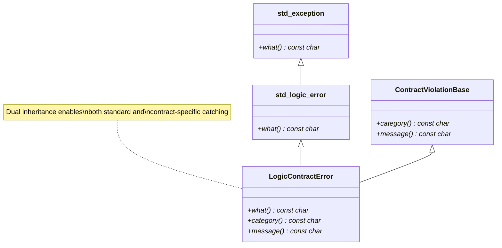
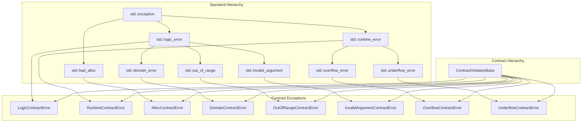

# User Manual - ContractException

**Scope:** Complete usage guide for `fat_p::ContractViolationError` and the contract exception hierarchy: the dual inheritance model, pre-defined exception type aliases (Logic, Runtime, Domain, OutOfRange, InvalidArgument, Overflow, Underflow, Alloc), integration with the Enforce macro system, custom raiser classes, and catch hierarchy patterns.

**Not covered:**
- Enforce macro system in detail (see Enforce User Manual)
- Expected-based error handling (see Expected User Manual)
- Exception safety guarantees of other components
- C++26 contracts proposal

**Prerequisites:** C++20; understanding of C++ exception handling (`try`/`catch`/`throw`); awareness of `std::logic_error` vs `std::runtime_error` distinction

---

## User Manual Card

**Component:** ContractException
**Primary use case:** Throw semantically rich contract violation exceptions that can be caught by both standard type and contract category
**Integration pattern:** Use via Enforce macros (`FATP_ENFORCE`, `FATP_ALWAYS_ENFORCE`) which select the appropriate ContractException automatically; catch by `ContractViolationBase&` or by `std::logic_error&`/`std::runtime_error&`
**Key API:** `ContractViolationError<T>`, `LogicContractError`, `RuntimeContractError`, `DomainContractError`, `OutOfRangeContractError`, `InvalidArgumentContractError`, `OverflowContractError`, `UnderflowContractError`, `AllocContractError`
**std equivalent:** None
**Common mistakes:** Catching by value instead of reference; ordering catch blocks incorrectly (specific before general); throwing ContractException directly instead of using Enforce macros
**Performance notes:** Zero overhead on the non-throwing path. Exception construction formats a prefixed diagnostic message (the Enforce macros add source-location details before throwing). See `components/ContractException/results/` for current data

---
## Table of Contents

1. [What is ContractException?](#what-is-contractexception)
   - [The Problem: Exception Identity Crisis](#the-problem-exception-identity-crisis)
   - [The C++ Exception Landscape](#the-c-exception-landscape)
   - [Where ContractException Fits](#where-contractexception-fits)
2. [Core Architecture](#core-architecture)
   - [Design Principles](#design-principles)
   - [The Dual Inheritance Model](#the-dual-inheritance-model)
   - [Category Determination](#category-determination)
   - [Performance Characteristics](#performance-characteristics)
3. [Getting Started](#getting-started)
   - [Prerequisites](#prerequisites)
   - [Integration](#integration)
   - [First Program](#first-program)
4. [Exception Types](#exception-types)
   - [ContractViolationBase](#contractviolationbase)
   - [ContractViolationError Template](#contractviolationerror-template)
   - [Pre-defined Type Aliases](#pre-defined-type-aliases)
   - [AllocContractError](#alloccontracterror)
5. [Catching Exceptions](#catching-exceptions)
   - [Catch by Specific Type](#catch-by-specific-type)
   - [Catch by Standard Type](#catch-by-standard-type)
   - [Catch by Contract Base](#catch-by-contract-base)
   - [Recommended Catch Hierarchy](#recommended-catch-hierarchy)
6. [Integration with Enforce](#integration-with-enforce)
   - [Enforce Macro Exception Selection](#enforce-macro-exception-selection)
   - [Raiser Classes](#raiser-classes)
   - [Custom Raisers](#custom-raisers)
7. [Creating Custom Contract Exceptions](#creating-custom-contract-exceptions)
   - [Custom Category Labels](#custom-category-labels)
   - [Custom Base Exceptions](#custom-base-exceptions)
8. [Performance Characteristics](#performance-characteristics-1)
   - [Benchmark Methodology](#benchmark-methodology)
   - [Benchmark Results](#benchmark-results)
   - [Interpretation](#interpretation)
9. [Comparison with Other Approaches](#comparison-with-other-approaches)
   - [vs Raw std::exception Types](#vs-raw-stdexception-types)
   - [vs Boost.Exception](#vs-boostexception)
   - [vs Error Codes and Expected](#vs-error-codes-and-expected)
   - [Feature Comparison Table](#feature-comparison-table)
10. [Migration Guide](#migration-guide)
    - [From Raw std::exception Types](#from-raw-stdexception-types)
    - [Incremental Adoption Strategy](#incremental-adoption-strategy)
11. [Best Practices](#best-practices)
    - [When to Use ContractException](#when-to-use-contractexception)
    - [Exception Message Guidelines](#exception-message-guidelines)
    - [Exception Selection Guidelines](#exception-selection-guidelines)
12. [Troubleshooting](#troubleshooting)
    - [Compilation Errors](#compilation-errors)
    - [Runtime Issues](#runtime-issues)
13. [Summary](#summary)

---

## What is ContractException?

### The Problem: Exception Identity Crisis

When implementing Design-by-Contract (DbC) in C++, standard exceptions leave you with an identity problem. Consider:

```cpp
void process_data(const std::vector<int>& data, size_t index)
{
    if (data.empty())
    {
        throw std::logic_error("Data cannot be empty");  // Precondition violation
    }
    if (index >= data.size())
    {
        throw std::out_of_range("Index out of bounds");  // Also precondition? Or runtime?
    }
    // ... processing ...
}
```

At the catch site, you face several problems:

| Problem | Impact |
|---------|--------|
| **No violation category** | Cannot distinguish precondition from postcondition from invariant |
| **Inconsistent hierarchy** | `std::out_of_range` inherits from `std::logic_error`, but `std::runtime_error` does not |
| **No polymorphic catch-all** | Cannot catch "any contract violation" without catching unrelated errors |
| **Duplicate catch logic** | Must write separate handlers for logic_error, runtime_error, bad_alloc |

```cpp
try
{
    process_data(data, idx);
}
catch (const std::logic_error& e)
{
    // Is this a contract violation or just any logic error?
    // Was it precondition, postcondition, or invariant?
    log_error("Logic error: " + std::string(e.what()));
}
catch (const std::runtime_error& e)
{
    // Contract violation or external failure?
    log_error("Runtime error: " + std::string(e.what()));
}
catch (const std::bad_alloc& e)
{
    // Contract violation or genuine OOM?
    log_error("Allocation failed");
}
```

### The C++ Exception Landscape

| Approach | Pros | Cons |
|----------|------|------|
| **Raw std::exception types** | Standard, no dependencies | No category, no unified catch |
| **Boost.Exception** | Rich diagnostics, stacktraces | Heavy dependency, complex |
| **Custom exception hierarchy** | Full control | Breaks std::exception compatibility |
| **Error codes** | No overhead | Verbose, easy to ignore |
| **std::expected (C++23)** | Type-safe, no exceptions | Not always appropriate, requires C++23 |

### Where ContractException Fits

ContractException provides **dual inheritance** exceptions that:

- Inherit from standard exception types (for compatibility)
- Inherit from `ContractViolationBase` (for unified handling)
- Automatically determine category from exception type
- Add zero overhead to existing exception machinery



**When to use ContractException:**

- Implementing Design-by-Contract patterns
- Building libraries with contract enforcement
- Need to distinguish contract violations from other exceptions
- Want unified logging/handling of all contract failures
- Using the fat_p Enforce system

**When NOT to use ContractException:**

- Simple applications without DbC
- When exceptions are disabled (`-fno-exceptions`)
- Performance-critical inner loops (use `Expected<T,E>` instead)
- When error codes are mandated by coding standard

---

## Core Architecture

### Design Principles

ContractException is built on three design principles:

**1. Standard Library Compatibility**

Contract exceptions must be catchable by existing code that catches `std::logic_error`, `std::runtime_error`, or `std::bad_alloc`. This enables gradual adoption without breaking existing error handling.

**2. Unified Contract Handling**

All contract violations should be catchable through a single base class (`ContractViolationBase`) regardless of which standard exception type they inherit from.

**3. Zero Runtime Overhead**

The dual inheritance model adds only a vtable pointer (8 bytes on 64-bit systems). There is no additional indirection or allocation beyond what std::exception already requires.

### The Dual Inheritance Model



This dual inheritance means:

```cpp
fat_p::LogicContractError error("Precondition failed");

// All of these catch the same exception:
catch (const fat_p::LogicContractError& e) { }     // Most specific
catch (const fat_p::ContractViolationBase& e) { }  // Any contract violation
catch (const std::logic_error& e) { }               // Standard type
catch (const std::exception& e) { }                 // Base exception
```

### Category Determination

The `category()` method returns a string describing the violation type. Categories are determined at compile-time using `if constexpr`:

```cpp
const char* category() const noexcept override
{
    if constexpr (std::is_base_of_v<std::logic_error, T>)
    {
        return "Logic";
    }
    else if constexpr (std::is_base_of_v<std::runtime_error, T>)
    {
        return "Runtime";
    }
    else
    {
        return "Unknown";
    }
}
```

**Important:** Because `std::domain_error`, `std::out_of_range`, and `std::invalid_argument` all inherit from `std::logic_error`, their contract versions all return `"Logic"` as the category:

| Exception Type | category() Returns | Reason |
|----------------|-------------------|--------|
| `LogicContractError` | `"Logic"` | Inherits from `std::logic_error` |
| `DomainContractError` | `"Logic"` | `std::domain_error` inherits from `std::logic_error` |
| `OutOfRangeContractError` | `"Logic"` | `std::out_of_range` inherits from `std::logic_error` |
| `InvalidArgumentContractError` | `"Logic"` | `std::invalid_argument` inherits from `std::logic_error` |
| `RuntimeContractError` | `"Runtime"` | Inherits from `std::runtime_error` |
| `OverflowContractError` | `"Runtime"` | `std::overflow_error` inherits from `std::runtime_error` |
| `UnderflowContractError` | `"Runtime"` | `std::underflow_error` inherits from `std::runtime_error` |
| `AllocContractError` | `"Allocation"` | Special case with explicit category |

### Performance Characteristics

| Metric | Cost | Notes |
|--------|------|-------|
| **Object size** | +8 bytes | One additional vtable pointer for `ContractViolationBase` |
| **Construction** | String concatenation | Dominated by `std::string` construction for prefix |
| **Throw time** | Same as standard exceptions | Dominated by stack unwinding |
| **what() call** | O(1) | Returns pointer to internal string |
| **category() call** | O(1) | Returns static string literal |
| **Memory allocation** | 1 heap allocation | For the message string (same as `std::logic_error`) |

---

## Getting Started

### Prerequisites

| Requirement | Minimum | Recommended |
|-------------|---------|-------------|
| C++ Standard | C++20 | C++20 |
| Compiler (GCC) | 10+ | 11+ |
| Compiler (Clang) | 10+ | 14+ |
| Compiler (MSVC) | 19.29 (VS 2019 16.10) | 19.29+ (VS 2019 16.10+) |

**Key language features used:**

- `std::is_base_of_v` (type traits variable templates)
- `std::is_constructible_v` (type traits variable templates)
- `if constexpr` (constexpr if statements)

### Integration

ContractException is header-only. Simply include the header:

```cpp
#include "ContractException.h"
```

No compilation flags required beyond C++20 mode:

```bash
# GCC/Clang
g++ -std=c++20 your_file.cpp

# MSVC
cl /std:c++20 your_file.cpp
```


### ContractViolationBase

The abstract base class for all contract violations. Enables unified handling regardless of which standard exception type is inherited.

```cpp
class ContractViolationBase
{
public:
    virtual ~ContractViolationBase() noexcept = default;
    
    // Special member functions (all noexcept)
    ContractViolationBase() noexcept = default;
    ContractViolationBase(const ContractViolationBase&) noexcept = default;
    ContractViolationBase(ContractViolationBase&&) noexcept = default;
    ContractViolationBase& operator=(const ContractViolationBase&) noexcept = default;
    ContractViolationBase& operator=(ContractViolationBase&&) noexcept = default;
    
    // Returns category string: "Logic", "Runtime", "Allocation", or "Unknown"
    virtual const char* category() const noexcept = 0;
    
    // Returns the full message (same as what() for most types)
    virtual const char* message() const noexcept = 0;
};

// Stream insertion operator for easy logging
inline std::ostream& operator<<(std::ostream& os, const ContractViolationBase& e)
{
    return os << "[" << e.category() << "] " << e.message();
}
```

**Key points:**

- Returns `const char*`, not `std::string_view`
- All methods are `noexcept`
- `message()` typically returns the same value as `what()`
- Move operations are explicitly `noexcept` for exception safety
- Stream operator formats output as `[Category] Message`

**Stream operator usage:**

```cpp
try
{
    risky_operation();
}
catch (const fat_p::ContractViolationBase& e)
{
    std::cerr << e << '\n';
    // Output: [Logic] Contract Violation: Precondition failed
}
```

This is equivalent to manually formatting:

```cpp
std::cerr << "[" << e.category() << "] " << e.message() << '\n';
```

### ContractViolationError Template

The main template class that creates contract exceptions inheriting from any `std::exception` subtype:

```cpp
template <typename T>
class ContractViolationError : public T, public ContractViolationBase
{
    static_assert(std::is_base_of_v<std::exception, T>,
        "T must inherit from std::exception.");
    static_assert(std::is_constructible_v<T, const std::string&>,
        "T must be constructible from const std::string&.");

public:
    explicit ContractViolationError(const std::string& message);
    
    virtual ~ContractViolationError() noexcept = default;
    
    const char* category() const noexcept override;
    const char* message() const noexcept override;
};
```

**Message prefixing:** All messages are automatically prefixed with `"Contract Violation: "`:

```cpp
fat_p::LogicContractError e("Null pointer");
std::cout << e.what();  // "Contract Violation: Null pointer"
```

### Pre-defined Type Aliases

| Type Alias | Base Class | category() | Use Case |
|------------|------------|------------|----------|
| `LogicContractError` | `std::logic_error` | `"Logic"` | Preconditions, invariants, programmer errors |
| `RuntimeContractError` | `std::runtime_error` | `"Runtime"` | External failures, resource errors |
| `DomainContractError` | `std::domain_error` | `"Logic"` | Mathematical domain errors |
| `OutOfRangeContractError` | `std::out_of_range` | `"Logic"` | Index bounds violations |
| `InvalidArgumentContractError` | `std::invalid_argument` | `"Logic"` | Invalid function arguments |
| `OverflowContractError` | `std::overflow_error` | `"Runtime"` | Arithmetic overflow |
| `UnderflowContractError` | `std::underflow_error` | `"Runtime"` | Arithmetic underflow |

```cpp
// Example usage for each type
throw fat_p::LogicContractError("Precondition failed: x must be positive");
throw fat_p::RuntimeContractError("Failed to connect to database");
throw fat_p::DomainContractError("Cannot compute sqrt of negative number");
throw fat_p::OutOfRangeContractError("Index 10 out of range [0, 5)");
throw fat_p::InvalidArgumentContractError("Null pointer passed to process()");
throw fat_p::OverflowContractError("Integer overflow in multiplication");
throw fat_p::UnderflowContractError("Integer underflow in subtraction");
```

### AllocContractError

A special case that inherits from `std::bad_alloc`. Because `std::bad_alloc` does not accept a string in its constructor, `AllocContractError` stores its own message:

```cpp
class AllocContractError : public std::bad_alloc, public ContractViolationBase
{
private:
    std::string full_message_;
    static constexpr const char* FALLBACK_MESSAGE = 
        "Contract Violation: Bad Allocation (message construction failed)";

public:
    explicit AllocContractError(const std::string& message) noexcept;
    
    // Move operations are noexcept
    AllocContractError(AllocContractError&&) noexcept = default;
    AllocContractError& operator=(AllocContractError&&) noexcept = default;
    
    const char* what() const noexcept override;
    const char* category() const noexcept override;  // Returns "Allocation"
    const char* message() const noexcept override;
};
```

**Message format:** Messages are prefixed with `"Contract Violation: Bad Allocation: "`:

```cpp
fat_p::AllocContractError e("Stack overflow in pool allocator");
std::cout << e.what();
// "Contract Violation: Bad Allocation: Stack overflow in pool allocator"
```

**OOM Resilience:** The constructor is `noexcept` and handles allocation failures gracefully:

```cpp
explicit AllocContractError(const std::string& message) noexcept
{
    try
    {
        full_message_ = "Contract Violation: Bad Allocation: " + message;
    }
    catch (...)
    {
        // OOM during message construction - use static fallback
        full_message_.clear();
    }
}

const char* what() const noexcept override
{
    return full_message_.empty() ? FALLBACK_MESSAGE : full_message_.c_str();
}
```

This design prevents `std::terminate` when throwing `AllocContractError` during an out-of-memory condition - the exact scenario where you're most likely to use this exception.

---

## Catching Exceptions

### Catch by Specific Type

Use specific types when you need to handle particular violations differently:

```cpp
try
{
    process(data, index);
}
catch (const fat_p::OutOfRangeContractError& e)
{
    // Handle bounds errors specifically
    std::cerr << "Bounds error: " << e.what() << "\n";
    return ErrorCode::BoundsError;
}
catch (const fat_p::DomainContractError& e)
{
    // Handle math domain errors
    std::cerr << "Math error: " << e.what() << "\n";
    return ErrorCode::MathError;
}
```

### Catch by Standard Type

Contract exceptions integrate seamlessly with existing code:

```cpp
try
{
    compute(value);
}
catch (const std::logic_error& e)
{
    // Catches LogicContractError, DomainContractError, 
    // OutOfRangeContractError, InvalidArgumentContractError
    std::cerr << "Logic error: " << e.what() << "\n";
}
catch (const std::runtime_error& e)
{
    // Catches RuntimeContractError, OverflowContractError, UnderflowContractError
    std::cerr << "Runtime error: " << e.what() << "\n";
}
catch (const std::bad_alloc& e)
{
    // Catches AllocContractError
    std::cerr << "Allocation error: " << e.what() << "\n";
}
```


### Recommended Catch Hierarchy

Order catch blocks from most specific to most general:

```cpp
try
{
    complex_operation();
}
// 1. Specific contract violations that need special handling
catch (const fat_p::OutOfRangeContractError& e)
{
    handle_bounds_error(e);
}
catch (const fat_p::AllocContractError& e)
{
    handle_allocation_failure(e);
}
// 2. All other contract violations (log and rethrow)
catch (const fat_p::ContractViolationBase& e)
{
    log_contract_violation(e.category(), e.message());
    throw;  // Re-throw for caller to handle
}
// 3. Non-contract standard exceptions
catch (const std::exception& e)
{
    log_unexpected_error(e.what());
    throw;
}
// 4. Unknown exceptions (should rarely happen)
catch (...)
{
    log_unknown_error();
    throw;
}
```

---

## Integration with Enforce

ContractException is designed to work with the fat_p Enforce system. The enforce macros automatically select appropriate exception types.

### Enforce Macro Exception Selection

| Macro | Exception Type | Behavior |
|-------|---------------|----------|
| `FATP_ENFORCE(condition, ...)` | `LogicContractError` | Debug-only (removed in release) |
| `FATP_ALWAYS_ENFORCE(condition, ...)` | `LogicContractError` | Always active |
| `FATP_ABORT_ENFORCE(condition, ...)` | None | Calls `std::abort()` |
| `FATP_ENFORCE_WARN(condition, ...)` | None | Logs warning, continues |
| `FATP_NOEXCEPT_ENFORCE(condition, ...)` | None | Calls violation handler |

```cpp
#include "enforce.h"

void process(int* data, size_t size)
{
    // Debug-only check (compiled out in release)
    FATP_ENFORCE(data != nullptr, "data must not be null");
    
    // Always-active precondition
    FATP_ALWAYS_ENFORCE(size > 0, "size must be positive");
    
    // Unrecoverable corruption
    FATP_ABORT_ENFORCE(internal_state_valid(), "Internal state corrupted");
}
```

### Raiser Classes

The Enforce system uses "raiser" classes to determine exception behavior:

| Raiser | Exception Thrown | Use Case |
|--------|-----------------|----------|
| `LogicRaiser` | `LogicContractError` | Preconditions, invariants |
| `RuntimeRaiser` | `RuntimeContractError` | Environmental failures |
| `AllocRaiser` | `AllocContractError` | Allocation failures |
| `AbortRaiser` | None (calls `std::abort()`) | Unrecoverable errors |
| `WarningToCerrRaiser` | None (logs to stderr) | Non-fatal warnings |
| `NoThrowRaiser` | None (calls handler) | `noexcept` functions |
| `NoOpRaiser` | None | Release-mode debug checks |

### Custom Raisers

Create custom raisers for application-specific exceptions:

```cpp
// Using the FATP_DEFINE_CUSTOM_RAISER macro
FATP_DEFINE_CUSTOM_RAISER(MyAppRaiser, fat_p::LogicContractError, "MyApp: ")

// Or manually:
struct DatabaseRaiser
{
    static void fail(const std::string& message)
    {
        fat_p::detail::writeToStderr("Database Error: ", message);
        throw fat_p::RuntimeContractError("Database: " + message);
    }
};
```

---

## Creating Custom Contract Exceptions

### Custom Category Labels

Override `category()` to provide custom labels:

```cpp
class PreconditionViolation : public fat_p::LogicContractError
{
public:
    explicit PreconditionViolation(const std::string& msg)
        : fat_p::LogicContractError(msg)
    {
    }
    
    const char* category() const noexcept override
    {
        return "Precondition";
    }
};

class PostconditionViolation : public fat_p::LogicContractError
{
public:
    explicit PostconditionViolation(const std::string& msg)
        : fat_p::LogicContractError(msg)
    {
    }
    
    const char* category() const noexcept override
    {
        return "Postcondition";
    }
};

class InvariantViolation : public fat_p::LogicContractError
{
public:
    explicit InvariantViolation(const std::string& msg)
        : fat_p::LogicContractError(msg)
    {
    }
    
    const char* category() const noexcept override
    {
        return "Invariant";
    }
};
```

Usage:

```cpp
void withdraw(Account& account, double amount)
{
    // Precondition
    if (amount <= 0)
    {
        throw PreconditionViolation("Amount must be positive");
    }
    
    double old_balance = account.balance();
    account.deduct(amount);
    
    // Postcondition
    if (account.balance() != old_balance - amount)
    {
        throw PostconditionViolation("Balance not correctly updated");
    }
}
```

### Custom Base Exceptions

Create contract exceptions from any `std::exception` subtype:

```cpp
// Contract version of std::system_error (not predefined)
using SystemContractError = fat_p::ContractViolationError<std::system_error>;

// Note: std::system_error requires different constructor, so this won't work
// directly. For such types, create a custom class:

class SystemContractError : public std::system_error, 
                            public fat_p::ContractViolationBase
{
    std::string full_message_;
    
public:
    SystemContractError(std::error_code ec, const std::string& msg)
        : std::system_error(ec, msg)
        , full_message_("Contract Violation: " + msg)
    {
    }
    
    const char* category() const noexcept override { return "System"; }
    const char* message() const noexcept override { return full_message_.c_str(); }
};
```

---

## Performance Characteristics

### Benchmark Methodology

**Test Environment:**

| Component | Specification |
|-----------|---------------|
| Processor | Intel Core i7-8850H @ 2.60 GHz |
| RAM | 32.0 GB |
| OS | Linux / Windows 10 x64 |
| Compiler | GCC 13 / MSVC 2022, Release mode |

**Compiler flags (GCC):**
```
-std=c++20 -O2 -DNDEBUG
```

**Compiler flags (MSVC):**
```
/std:c++20 /O2 /DNDEBUG /MD /EHsc /W3
```

**Methodology:**

- Each operation measured with FatPTest benchmark harness
- Warmup iterations before measurement
- Results averaged across multiple runs

### Performance Characteristics

Construction overhead is dominated by string concatenation for the category prefix, not by the dual inheritance model. Throw/catch cost is comparable to standard exceptions (dominated by stack unwinding). Access methods (`what()`, `category()`, `message()`) return pointers to internal storage with negligible overhead. `category()` is the cheapest (returns a static string literal). Copy and move costs are dominated by the internal `std::string` operations. Memory overhead is +8 bytes per exception (one additional vtable pointer for `ContractViolationBase`).

See `components/ContractException/results/` for current platform-specific benchmark data.

---

## Comparison with Other Approaches

### vs Raw std::exception Types

```cpp
// Before: Raw standard exceptions
throw std::logic_error("Precondition failed: x must be positive");

// After: Contract exceptions
throw fat_p::LogicContractError("Precondition failed: x must be positive");
```

| Aspect | std::exception types | ContractException |
|--------|---------------------|-------------------|
| Unified catch | No | Yes (`ContractViolationBase`) |
| Category info | No | Yes (`category()`) |
| Standard compatibility | N/A | Full |
| Additional overhead | N/A | ~2% |
| Additional memory | N/A | +8 bytes |

**Verdict:** Use ContractException when you need unified handling or category information. Use raw types for simple applications.

### vs Boost.Exception

| Aspect | Boost.Exception | ContractException |
|--------|-----------------|-------------------|
| Dependencies | Boost headers | None |
| Feature richness | High (stacktraces, arbitrary data) | Focused (category, message) |
| Compile time | Slow | Fast |
| Learning curve | Steep | Gentle |
| Integration | Complex | Simple |

**Verdict:** Use Boost.Exception for complex debugging needs. Use ContractException for lightweight DbC.

### vs Error Codes and Expected

```cpp
// Error codes
ErrorCode result = process(data);
if (result != ErrorCode::Success)
{
    handle_error(result);
}

// Expected
fat_p::Expected<Value, Error> result = process(data);
if (!result)
{
    handle_error(result.error());
}

// Exceptions
try
{
    Value result = process(data);
}
catch (const fat_p::ContractViolationBase& e)
{
    handle_error(e);
}
```

| Aspect | Error Codes | Expected | ContractException |
|--------|------------|----------|-------------------|
| Performance | Best | Good | Worst (throw path) |
| Caller burden | High (must check) | Medium (must unwrap) | Low (automatic propagation) |
| Rich diagnostics | Manual | Possible | Built-in |
| Propagation | Manual | Manual | Automatic |
| noexcept compatible | Yes | Yes | No |

**Verdict:** Use exceptions for programmer errors and preconditions. Use Expected for expected failure cases. Use error codes in hot paths.

### Feature Comparison Table

| Feature | std::exception | Boost.Exception | ContractException |
|---------|---------------|-----------------|-------------------|
| Header-only | Yes | Yes | Yes |
| No dependencies | Yes | No | Yes |
| Unified base class | No | Yes | Yes |
| Category metadata | No | Custom | Built-in |
| Stack traces | No | Yes | No |
| Arbitrary attributes | No | Yes | No |
| C++20 compatible | Yes | Yes | Yes |

---

## Migration Guide

### From Raw std::exception Types

**Step 1: Include the header**

```cpp
#include "ContractException.h"
```

**Step 2: Replace exception types**

| Before | After |
|--------|-------|
| `std::logic_error` | `fat_p::LogicContractError` |
| `std::runtime_error` | `fat_p::RuntimeContractError` |
| `std::domain_error` | `fat_p::DomainContractError` |
| `std::out_of_range` | `fat_p::OutOfRangeContractError` |
| `std::invalid_argument` | `fat_p::InvalidArgumentContractError` |
| `std::overflow_error` | `fat_p::OverflowContractError` |
| `std::underflow_error` | `fat_p::UnderflowContractError` |
| `std::bad_alloc` (with message) | `fat_p::AllocContractError` |

**Step 3: Update catch blocks (optional)**

```cpp
// Existing catch blocks continue to work
catch (const std::logic_error& e) { }  // Still catches LogicContractError

// Optionally add unified handling
catch (const fat_p::ContractViolationBase& e)
{
    log("[" + std::string(e.category()) + "] " + e.message());
}
```

### Incremental Adoption Strategy

For large codebases, adopt incrementally:

**Phase 1: New code only**

Use ContractException for all new code. Existing code continues using std::exception types.

**Phase 2: Unified logging**

Add a `ContractViolationBase` catch handler in top-level error handling:

```cpp
int main()
{
    try
    {
        run_application();
    }
    catch (const fat_p::ContractViolationBase& e)
    {
        // Log contract violations with category
        log_error("[" + std::string(e.category()) + "] " + e.message());
        return 1;
    }
    catch (const std::exception& e)
    {
        // Log other exceptions
        log_error(e.what());
        return 1;
    }
}
```

**Phase 3: Module-by-module migration**

Migrate one module at a time, starting with new or frequently-modified code.

---

## Best Practices

### When to Use ContractException

**Do use for:**

- Precondition violations (caller bug)
- Postcondition violations (implementation bug)
- Invariant violations (state corruption)
- Programming errors that should never happen in correct code

**Do not use for:**

- Expected failure cases (file not found, network timeout)
- User input validation (use proper error handling with user messages)
- Performance-critical inner loops
- Code that must be `noexcept`

### Exception Message Guidelines

**Do:**

```cpp
// Include context
throw fat_p::OutOfRangeContractError(
    "Index " + std::to_string(index) + 
    " out of range [0, " + std::to_string(size) + ")"
);

// Be specific about the violation
throw fat_p::LogicContractError(
    "Precondition violated: buffer size " + std::to_string(actual) + 
    " must be >= " + std::to_string(required)
);

// Include relevant values
throw fat_p::DomainContractError(
    "Cannot compute sqrt of negative value: " + std::to_string(value)
);
```

**Do not:**

```cpp
// Too vague
throw fat_p::LogicContractError("error");
throw fat_p::LogicContractError("invalid");

// Missing context
throw fat_p::OutOfRangeContractError("index out of bounds");

// Wrong exception type
throw fat_p::RuntimeContractError("null pointer");  // Should be Logic
```

### Exception Selection Guidelines

| Situation | Exception Type |
|-----------|---------------|
| Null pointer passed | `InvalidArgumentContractError` |
| Invalid enum value | `InvalidArgumentContractError` |
| Index out of bounds | `OutOfRangeContractError` |
| Empty container when non-empty required | `LogicContractError` |
| Division by zero | `DomainContractError` |
| sqrt of negative | `DomainContractError` |
| Integer overflow | `OverflowContractError` |
| Integer underflow | `UnderflowContractError` |
| Memory allocation failed | `AllocContractError` |
| Resource pool exhausted | `AllocContractError` |
| External service failed | `RuntimeContractError` |
| I/O error | `RuntimeContractError` |
| General precondition | `LogicContractError` |
| Postcondition | `LogicContractError` |
| Invariant | `LogicContractError` |

---

## Troubleshooting

### Compilation Errors

**Error: "T must inherit from std::exception"**

```cpp
// Wrong: MyError doesn't inherit from std::exception
class MyError { };
using MyContractError = fat_p::ContractViolationError<MyError>;  // Error!

// Fix: Inherit from std::exception
class MyError : public std::exception { };
using MyContractError = fat_p::ContractViolationError<MyError>;  // OK
```

**Error: "T must be constructible from const std::string&"**

```cpp
// Wrong: MyError has no string constructor
class MyError : public std::exception
{
public:
    MyError() = default;
};
using MyContractError = fat_p::ContractViolationError<MyError>;  // Error!

// Fix: Add string constructor
class MyError : public std::exception
{
    std::string msg_;
public:
    explicit MyError(const std::string& msg) : msg_(msg) {}
    const char* what() const noexcept override { return msg_.c_str(); }
};
```

**Error: Ambiguous overload for `what()`**

This can occur with complex inheritance hierarchies. Ensure your custom exception properly overrides `what()`:

```cpp
class MyError : public fat_p::LogicContractError
{
public:
    explicit MyError(const std::string& msg)
        : fat_p::LogicContractError(msg)
    {
    }
    
    // Explicitly use base class what()
    using fat_p::LogicContractError::what;
};
```

### Runtime Issues

**Issue: Category returns "Logic" for DomainContractError**

This is expected behavior. `std::domain_error` inherits from `std::logic_error`, so the category determination returns "Logic". If you need a "Domain" category:

```cpp
class DomainViolation : public fat_p::DomainContractError
{
public:
    explicit DomainViolation(const std::string& msg)
        : fat_p::DomainContractError(msg)
    {
    }
    
    const char* category() const noexcept override
    {
        return "Domain";
    }
};
```

**Issue: Message appears twice in what()**

Check that you're not adding "Contract Violation:" prefix manually. The constructor already adds it:

```cpp
// Wrong: Double prefix
throw fat_p::LogicContractError("Contract Violation: x must be positive");
// Results in: "Contract Violation: Contract Violation: x must be positive"

// Correct: No manual prefix
throw fat_p::LogicContractError("x must be positive");
// Results in: "Contract Violation: x must be positive"
```

**Issue: catch (const ContractViolationBase&) doesn't catch exception**

Ensure you're catching by reference, not value:

```cpp
// Wrong: Catches by value, may slice
catch (fat_p::ContractViolationBase e) { }

// Correct: Catches by const reference
catch (const fat_p::ContractViolationBase& e) { }
```

---

## Summary

### Key Features

- Dual inheritance from standard exception types AND `ContractViolationBase`
- Eight pre-defined exception type aliases
- Automatic category determination ("Logic", "Runtime", "Allocation")
- Automatic message prefixing with "Contract Violation:"
- Stream operator (`operator<<`) for easy logging
- OOM-resilient `AllocContractError` with fallback message
- Explicit `noexcept` move operations for exception safety
- Thread-safe (each exception is independent)
- Zero overhead on the non-throwing path
- ~11% overhead on throw/catch compared to standard exceptions

### Performance Profile

| Metric | Value |
|--------|-------|
| Memory overhead | +8 bytes per exception |
| Construction overhead | Dominated by string concatenation for prefix |
| Throw/catch overhead | Comparable to `std::logic_error` (stack unwinding dominates) |
| `what()` / `message()` | O(1), returns pointer to internal storage |
| `category()` | O(1), returns static string literal |
| `operator<<` | Dominated by stream operations |

### Quick Start

```cpp
#include "ContractException.h"
#include <iostream>

void example(int* ptr, size_t index, size_t size)
{
    if (!ptr)
    {
        throw fat_p::InvalidArgumentContractError("ptr must not be null");
    }
    if (index >= size)
    {
        throw fat_p::OutOfRangeContractError(
            "Index " + std::to_string(index) + " >= size " + std::to_string(size)
        );
    }
}

int main()
{
    try
    {
        example(nullptr, 0, 10);
    }
    catch (const fat_p::ContractViolationBase& e)
    {
        std::cerr << e << "\n";  // Uses operator<<
        // Output: [Logic] Contract Violation: ptr must not be null
        return 1;
    }
    return 0;
}
```

### Related Components

| Component | Relationship |
|-----------|-------------|
| `enforce.h` | Macros that throw ContractException types |
| `Expected.h` | Non-throwing alternative for error handling |
| `Stringify.h` | Building rich error messages |
| `ScopeGuard.h` | Cleanup on exception |

---

**Last Updated:** November 2025
